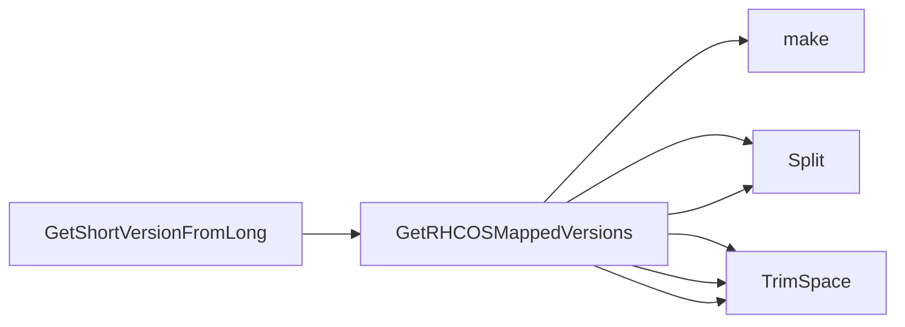

## Package operatingsystem (github.com/redhat-best-practices-for-k8s/certsuite/tests/platform/operatingsystem)

# Package `operatingsystem`

The **`operatingsystem`** package is a tiny helper that translates RHCOS (Red Hat‑CentOS) long‑form version strings into the short, user‑facing format used in CertSuite tests.

| Item | Details |
|------|---------|
| **File** | `tests/platform/operatingsystem/operatingsystem.go` |
| **Imports** | `embed`, `strings` |
| **Global data** | `rhcosVersionMap : string` – the raw contents of the embedded file `files/rhcos_version_map`. |
| **Constant** | `NotFoundStr = "not found"` – sentinel returned when a mapping cannot be resolved. |

---

## Embedded Data (`rhcosVersionMap`)

```go
//go:embed files/rhcos_version_map
var rhcosVersionMap string
```

The file `files/rhcos_version_map` contains lines of the form

```
<short-version> <long-version>
```

For example:

```
4.15 4.15.0-1127.el8.centos.x86_64
4.16 4.16.2-1145.el9.centos.x86_64
...
```

The string is split by newlines and each line into two tokens – the short key and its corresponding long value.

---

## Functions

### `GetRHCOSMappedVersions(input string) (map[string]string, error)`

* **Purpose**: Parse a comma‑separated list of *long* RHCOS version strings (`input`) and return a map from each long form to the matching short form.
* **Algorithm**
  1. Initialise an empty `map[string]string`.
  2. Split `input` by commas → slice of raw long versions.
  3. For each raw value:
     * Trim spaces.
     * Call `strings.Split(rhcosVersionMap, "\n")` to walk through the embedded mapping file.
     * For each line in the map file:
       * Split into two tokens (`short`, `long`) and trim spaces.
       * If the long token matches the current input value → add entry `inputValue -> short`.
  4. Return the populated map (or an error if parsing fails).

* **Returns**: A mapping from each supplied long version to its short counterpart, or an empty map on error.

### `GetShortVersionFromLong(input string) (string, error)`

* **Purpose**: Convenience wrapper that takes a single *long* RHCOS version and returns the associated *short* version.
* **Implementation**
  ```go
  mapped, err := GetRHCOSMappedVersions(input)
  if err != nil { return "", err }
  if short, ok := mapped[input]; ok {
      return short, nil
  }
  return NotFoundStr, nil   // sentinel for “not found”
  ```
* **Returns**: The short version string or `NotFoundStr` if the long form cannot be resolved.

---

## How it all fits

```
┌───────────────────────┐
│ rhcos_version_map.txt │  ← embedded file (short ↔ long)
└────────────┬──────────┘
             │
             ▼
      rhcosVersionMap : string  ← raw file contents
             │
             ▼
     GetRHCOSMappedVersions(input)  // parse input, build map
             │
             ▼
   map[long]short (or error)
```

`GetShortVersionFromLong` simply delegates to the former and extracts a single mapping entry.

> **Why this is useful**  
> In CertSuite tests the RHCOS image name often contains a long kernel‑style version. The tests, however, compare against a short “release” string (e.g., `4.16`). These helpers provide that translation without hardcoding the map in code – it lives in an external file so it can be updated independently.

---

### Mermaid diagram suggestion

```mermaid
flowchart TD
  File["files/rhcos_version_map"] -->|embed| rhcosVersionMap[str]
  subgraph GetRHCOSMappedVersions
    Input[str] --> Parse[Split by ","] --> Trim[Trim spaces]
    Trim --> Build{for each line in rhcosVersionMap}
    Build --> SplitLine[Split by space] --> Compare[if match]
    Compare --> Map[Add to map]
  end
  GetShortVersionFromLong --> GetRHCOSMappedVersions
  GetShortVersionFromLong --> Return[short or NotFoundStr]
```

This concise overview captures the core data flow and responsibilities of the `operatingsystem` package.

### Functions

- **GetRHCOSMappedVersions** — func(string)(map[string]string, error)
- **GetShortVersionFromLong** — func(string)(string, error)

### Globals


### Call graph (exported symbols, partial)



### Symbol docs

- [function GetRHCOSMappedVersions](symbols/function_GetRHCOSMappedVersions.md)
- [function GetShortVersionFromLong](symbols/function_GetShortVersionFromLong.md)
