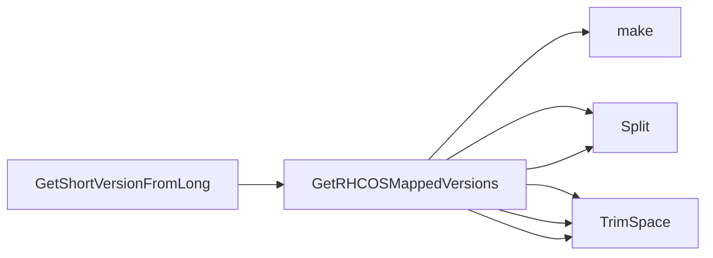

## Package operatingsystem (github.com/redhat-best-practices-for-k8s/certsuite/tests/platform/operatingsystem)

### Functions

- **GetRHCOSMappedVersions** — func(string)(map[string]string, error)
- **GetShortVersionFromLong** — func(string)(string, error)

### Globals

### Call graph (exported symbols, partial)

### Symbol docs

- [function GetRHCOSMappedVersions](symbols/function_GetRHCOSMappedVersions.md)
- [function GetShortVersionFromLong](symbols/function_GetShortVersionFromLong.md)
