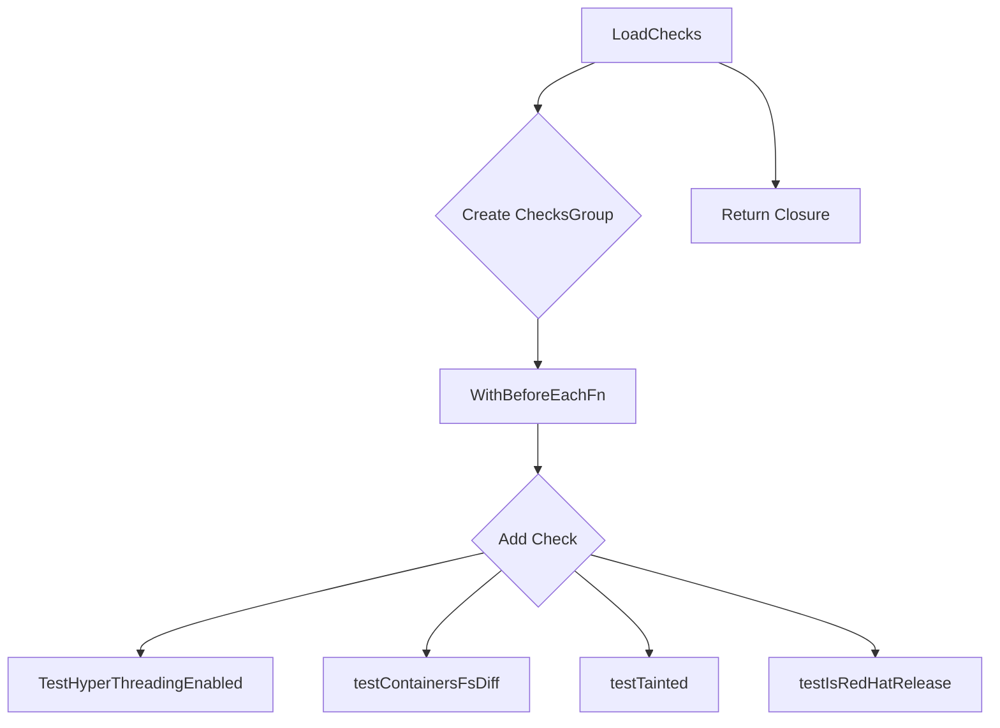

LoadChecks` – Platform Test Suite Loader  

**Package:** `github.com/redhat-best-practices-for-k8s/certsuite/tests/platform`

---

## Purpose
`LoadChecks` builds and returns a *factory function* that, when invoked, creates the full set of platform‑level tests for CertSuite.  
The returned closure captures the current test environment (`env`) and any `beforeEachFn` logic that should run before each check.

---

## Signature

```go
func LoadChecks() func()
```

- **Returns**: a zero‑argument function with no return value.  
  The closure is intended to be called by the test harness (e.g., Ginkgo’s `BeforeSuite`) to register all checks in the current process.

---

## Key Steps & Dependencies

| Step | What happens | Called functions |
|------|--------------|------------------|
| **1** | Initialise a new *ChecksGroup* (`NewChecksGroup()`). This group will hold all platform‑specific checks. | `NewChecksGroup` |
| **2** | Register a *BeforeEach* hook for the group via `WithBeforeEachFn`. The hook runs `beforeEachFn`, which prepares the environment before each check. | `WithBeforeEachFn` |
| **3** | Add multiple platform checks using a fluent builder pattern:  
   - Create a check with `NewCheck()` and give it an ID/label set via `GetTestIDAndLabels`.  
   - Attach the core test logic (`test…`) through `WithCheckFn`.  
   - Optionally attach a skip predicate via `WithSkipCheckFn` (e.g., `GetNoBareMetalNodesSkipFn`). | `Add`, `NewCheck`, `GetTestIDAndLabels`, `WithCheckFn`, `WithSkipCheckFn` |
| **4** | Repeat Step 3 for each platform check. The list includes:  
   - Hyper‑threading enabled (`testHyperThreadingEnabled`)  
   - Container FS differences (`testContainersFsDiff`)  
   - Node taints (`testTainted`)  
   - Red‑Hat release validation (`testIsRedHatRelease`) | – |
| **5** | Return a closure that, when executed, registers the fully populated `ChecksGroup` with the test framework. The closure captures the current `env` and any global state required by the checks. | – |

---

## Global Variables Used

- `env`: A `provider.TestEnvironment` instance representing the environment in which the tests will run.  
  Each check may query this environment for cluster details (e.g., node count, OS version).

- `beforeEachFn`: A function that is executed before each individual check. It typically resets shared state or logs context.

Both are read‑only inside `LoadChecks`; no modifications occur.

---

## Side Effects & Assumptions

| Effect | Description |
|--------|-------------|
| **No direct I/O** | The function only constructs in‑memory objects; side effects come from the test functions themselves. |
| **Closure captures environment** | The returned closure uses `env` and `beforeEachFn` via lexical scoping, ensuring each check runs against the same context. |
| **Conditional skips** | Some checks are conditionally skipped based on predicates (e.g., non‑OCP clusters). These skip functions inspect `env`. |

---

## How It Fits the Package

- The *platform* package defines a set of tests that verify platform‑specific Kubernetes behavior.
- `LoadChecks` is the entry point for registering these tests with CertSuite’s test runner.
- Other packages (e.g., *application*, *security*) implement similar loader functions; `LoadChecks` follows the same pattern, ensuring consistency across the test suite.

---

## Suggested Mermaid Diagram



This diagram visualises the main construction steps and the checks added to the group.
