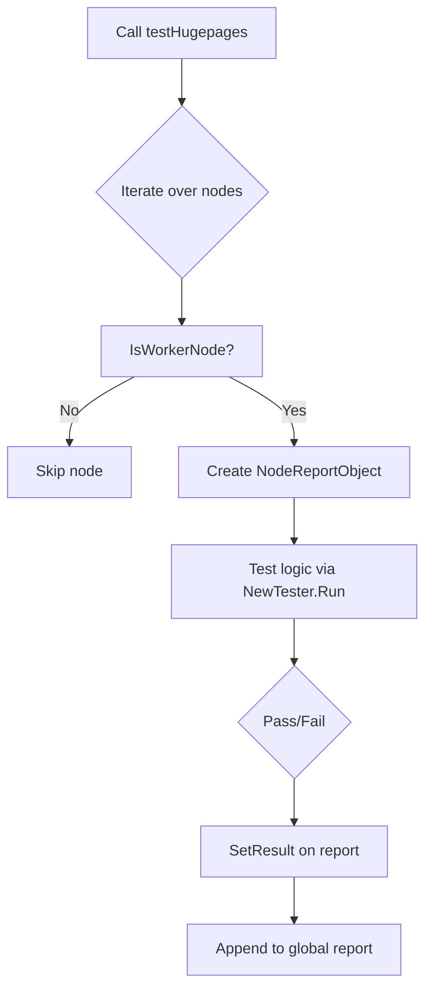

testHugepages`

```go
func testHugepages(check *checksdb.Check, env *provider.TestEnvironment)
```

### Purpose
`testHugepages` is a **private** helper that validates the state of huge‑page memory on worker nodes in a Kubernetes cluster during a CertSuite platform test run.  
It performs three checks:

1. **Verify node kernel support for huge pages** – ensures that each worker node advertises `hugepages-2Mi` and/or `hugepages-1Gi`.
2. **Validate node allocation of huge pages** – confirms that the requested amount of huge pages is actually allocated on each node.
3. **Check kubelet configuration** – verifies that the kubelet has been started with the correct `--feature-gates=HugePages=true` flag and appropriate memory limits.

The function reports success or failure back to the CertSuite framework via a *NodeReport* object.

### Inputs

| Parameter | Type                     | Description |
|-----------|--------------------------|-------------|
| `check`   | `*checksdb.Check`        | The current test case metadata. It is used only for logging (e.g., `LogInfo`). |
| `env`     | `*provider.TestEnvironment` | Holds the environment context, including node lists and client caches. |

### Outputs

The function has **no explicit return value**; its results are communicated through side‑effects:

- Logging via `LogInfo` / `LogError`.
- Creation of one or more `NodeReportObject`s that are appended to a global test report (via `NewNodeReportObject` and the test environment’s reporter).
- The `SetResult` call on each `NodeReportObject` records whether the check passed (`true`) or failed (`false`).

### Key Dependencies & Calls

| Dependency | Role |
|------------|------|
| `IsWorkerNode(node)` | Filters nodes to those that are worker nodes. |
| `NewNodeReportObject(node, "Hugepages", ...)` | Builds a per‑node report entry. |
| `NewTester(...)` | Wraps the test logic in a reusable tester struct. |
| `GetClientsHolder()` | Provides Kubernetes client interfaces (e.g., corev1). |
| `tester.Run(func(t *testing.T) { … })` | Executes the actual assertions inside Go’s testing framework. |
| Logging functions (`LogInfo`, `LogError`) | Emit diagnostic information to the test log. |

### Side Effects

- **Global state mutation** – The function appends `NodeReportObject`s to a shared report slice, which is later used by CertSuite to aggregate results.
- **Test environment interaction** – It may call `env.GetClientsHolder()` which can lazily initialize Kubernetes client caches if they are not already present.

### Package Context

`testHugepages` lives in the **platform** test package (`github.com/redhat-best-practices-for-k8s/certsuite/tests/platform`).  
The platform tests exercise cluster‑wide properties (node capabilities, configuration). This function is invoked from a higher‑level test harness that iterates over all checks defined for the `checksdb.Check` table. By keeping it unexported, the package encapsulates the huge‑page validation logic while exposing only the generic `RunPlatformTests()` entry point to external callers.

---

#### Suggested Mermaid Diagram



This diagram illustrates the control flow from the initial call through node filtering, test execution, and reporting.
