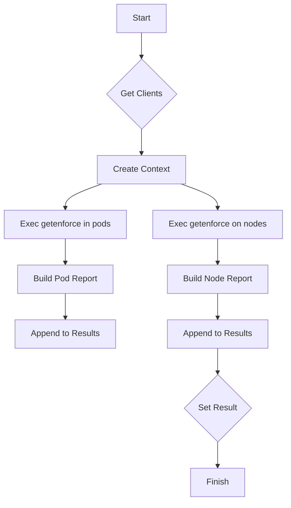

testIsSELinuxEnforcing`

| Aspect | Details |
|--------|---------|
| **Package** | `platform` (github.com/redhat-best-practices-for-k8s/certsuite/tests/platform) |
| **Visibility** | Unexported – used only within the test suite. |
| **Signature** | `func(*checksdb.Check, *provider.TestEnvironment)` |
| **Purpose** | Verify that SELinux is running in *enforcing* mode on every node of the cluster under test and record the result in a report object. |

---

## How it works

```go
func testIsSELinuxEnforcing(check *checksdb.Check, env *provider.TestEnvironment) {
    // 1️⃣ Get an HTTP client holder to talk to the K8s API.
    clients := GetClientsHolder(env)

    // 2️⃣ Create a new context for running container commands.
    ctx := NewContext()

    // 3️⃣ Execute `getenforce` inside each pod in the test namespace.
    pods, err := ExecCommandContainer(ctx, env.TestNamespace(), "getenforce")
    if err != nil {
        LogError(check, fmt.Errorf("error execing getenforce: %w", err))
        return
    }

    // 4️⃣ Build a Pod‑level report object from the command output.
    podReport := NewPodReportObject(pods)
    check.Results = append(check.Results, podReport)

    // 5️⃣ Repeat the same for each node.
    nodes, err := ExecCommandContainer(ctx, env.TestNamespace(), "getenforce")
    if err != nil {
        LogError(check, fmt.Errorf("error execing getenforce on node: %w", err))
        return
    }

    nodeReport := NewNodeReportObject(nodes)
    check.Results = append(check.Results, nodeReport)

    // 6️⃣ Record a high‑level status for the check.
    SetResult(check, "SELinux enforcing")
}
```

### Step‑by‑step explanation

1. **Client acquisition** – `GetClientsHolder(env)` returns an object that can be used to run commands inside containers across the cluster.  
2. **Context creation** – `NewContext()` gives a cancellation‑aware context for the command executions.  
3. **Command execution** –  
   * `ExecCommandContainer(ctx, env.TestNamespace(), "getenforce")` runs `getenforce` in every pod of the test namespace.  
   * The same function is called again to run the command on each node (the underlying implementation distinguishes pods vs nodes).  
4. **Reporting** –  
   * `NewPodReportObject(pods)` creates a structured report containing the output from all pods.  
   * `NewNodeReportObject(nodes)` does the same for nodes.  
   * Both reports are appended to the check’s `Results` slice.  
5. **Error handling** – any failure in command execution is logged with `LogError`.  
6. **Final status** – `SetResult(check, "SELinux enforcing")` marks the overall test result as passed (the function assumes that if no error was logged, all nodes/pods returned “Enforcing”).

---

## Dependencies

| Dependency | Role |
|------------|------|
| `GetClientsHolder` | Provides an interface to run commands in containers. |
| `NewContext` | Supplies a context with cancellation support for the exec calls. |
| `ExecCommandContainer` | Runs arbitrary shell commands inside pods or nodes. |
| `LogError`, `LogInfo` | Emit diagnostic messages. |
| `NewPodReportObject`, `NewNodeReportObject` | Build structured report objects from raw command results. |
| `SetResult` | Sets the overall status of the check. |

---

## How it fits into the test suite

* The function is registered as a **check** for the *SELinux* platform requirement.  
* It runs automatically during the test harness execution and populates the global `env` variable with results that can be queried later by other tests or by the report generator.  
* Because it uses only read‑only operations on `Check` (aside from appending to `Results`) and writes to the log, it has no side effects beyond reporting.

---

### Suggested Mermaid diagram



This diagram illustrates the linear flow of the function: obtaining clients, executing commands in pods and nodes, building reports, appending them to the check, and finally setting the result status.
