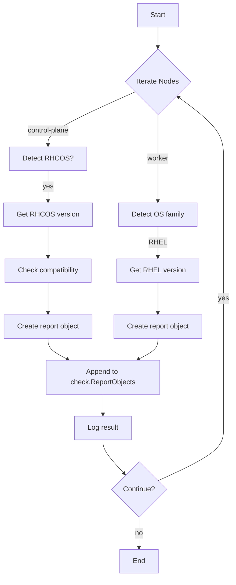

testNodeOperatingSystemStatus`

```go
func testNodeOperatingSystemStatus(check *checksdb.Check, env *provider.TestEnvironment)
```

## Purpose

`testNodeOperatingSystemStatus` is an internal helper used by the **platform** test suite to verify that each node in a Kubernetes cluster reports the correct operating‑system information.  
The function gathers OS data from the target nodes, validates it against known expectations (e.g., RHCOS version, CS-COS, RHEL), and records the result in the check’s report object.

> **Note:** The function is marked `nolint:funlen` because its logic covers several distinct OS checks. It is intentionally kept private to avoid accidental reuse outside the test suite.

## Inputs

| Parameter | Type                           | Description |
|-----------|--------------------------------|-------------|
| `check`   | `*checksdb.Check`              | The check record that will be updated with node‑level findings. |
| `env`     | `*provider.TestEnvironment`    | Provides access to the test environment (cluster client, logger, etc.). |

## Outputs / Side Effects

- **Report creation** – For each node, a `NodeReportObject` is appended to `check.ReportObjects`.  
- **Logging** – Uses `LogInfo`, `LogDebug`, and `LogError` to trace progress and failures.  
- **Field enrichment** – Each report object receives fields such as `nodeType`, `osVersion`, `isRHCOSCompatible`, etc., via `AddField`.

The function does not return a value; it mutates the supplied `check` structure in place.

## Key Dependencies

| Function | Role |
|----------|------|
| `IsControlPlaneNode`, `IsWorkerNode` | Classify node type. |
| `IsRHCOS`, `GetRHCOSVersion`, `IsRHCOSCompatible` | Detect and validate RHCOS nodes. |
| `IsCSCOS`, `GetCSCOSVersion` | Handle CS‑COS (Container Storage OS) nodes. |
| `IsRHEL`, `GetRHELVersion` | Handle generic RHEL nodes. |
| `NewNodeReportObject` | Create a report entry for a node. |
| `AddField` | Add key/value pairs to a report object. |
| Logging helpers (`LogInfo`, `LogDebug`, `LogError`) | Emit diagnostics. |

These functions are part of the same test package and rely on the underlying Kubernetes client provided by `provider.TestEnvironment`.

## Workflow Overview

1. **Iterate over all nodes** in the cluster (via `env.Cluster.Nodes()` – not shown but implied).  
2. For each node:  
   - Determine its role (control‑plane or worker).  
   - Detect the OS family (`RHCOS`, `CS-COS`, `RHEL`).  
   - Retrieve the version string.  
   - Validate compatibility (e.g., RHCOS ≥ 4.6).  
3. **Build a node report**:  
   ```go
   obj := NewNodeReportObject()
   obj.AddField("nodeName", node.Name)
   obj.AddField("nodeType", role)
   obj.AddField("osFamily", osFamily)
   obj.AddField("osVersion", version)
   ```
4. **Append the object** to `check.ReportObjects`.  
5. Log success or errors at each step.

## Placement in the Package

The function lives in `suite.go` under the `platform` test package, which orchestrates all platform‑level checks for a Kubernetes cluster. It is called by higher‑level tests that need node OS validation before proceeding to more specific compliance checks (e.g., security hardening). By centralizing OS verification here, the suite ensures consistent reporting and error handling across all node‑related tests.

---

### Suggested Mermaid Diagram



This diagram visualizes the decision tree for node OS detection and reporting.
