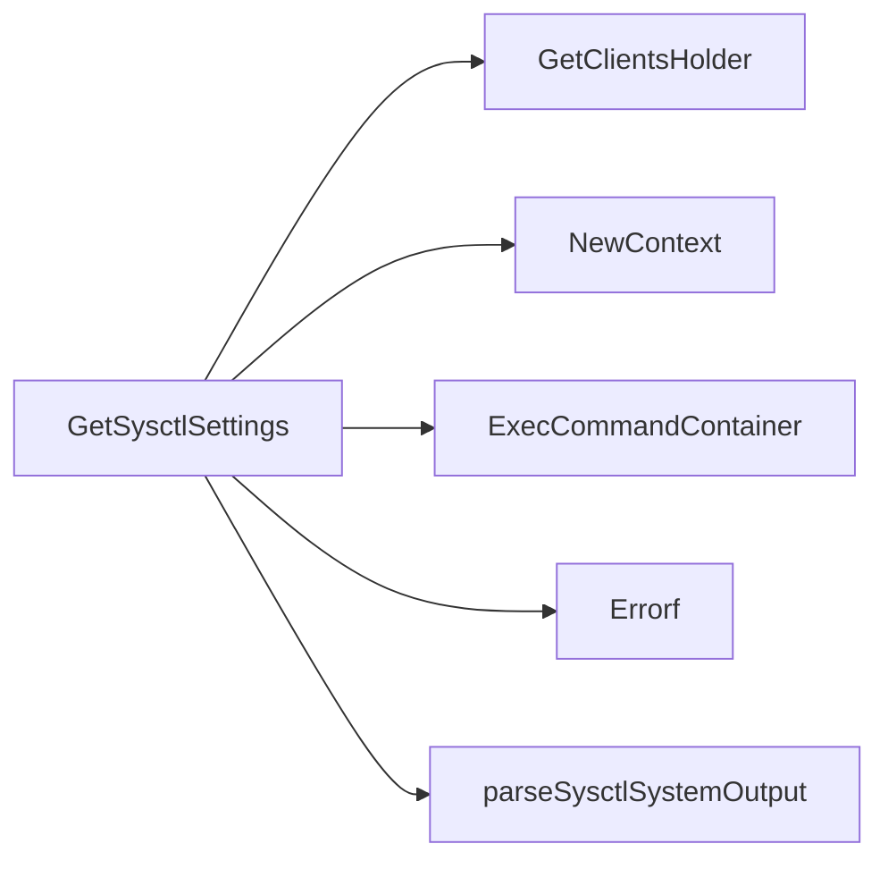

## Package sysctlconfig (github.com/redhat-best-practices-for-k8s/certsuite/tests/platform/sysctlconfig)

# Sysctl Configuration Package  
**Repository:** `github.com/redhat-best-practices-for-k8s/certsuite/tests/platform/sysctlconfig`  

The package provides utilities to query and parse the effective sys‑kernel settings inside a container running on a Kubernetes node.  It is used by tests that verify whether system‑level sysctl values are correctly applied in the platform environment.

---

## Core Functionality

| Function | Purpose | Key Steps |
|----------|---------|-----------|
| **`GetSysctlSettings(env *provider.TestEnvironment, ns string) (map[string]string, error)`** | Executes `sysctl --system` inside a container and returns a map of key → value. | 1. Retrieve Kubernetes client (`clientsholder.GetClientsHolder`).<br>2. Create a context for the target namespace.<br>3. Run `sysctl --system` in the specified pod/container via `ExecCommandContainer`. <br>4. If the command fails, wrap and return an error. <br>5. Pass stdout to `parseSysctlSystemOutput` to build the result map. |
| **`parseSysctlSystemOutput(output string) map[string]string`** | Transforms the raw output of `sysctl --system` into a usable map. | 1. Split the output into lines.<br>2. For each line that starts with `"kernel."`, extract the key and value using a regular expression (`^([^=]+)=\s*(.*)$`).<br>3. Store the trimmed key/value pairs in a map.<br>4. Return the populated map. |

---

## How It Works Together

1. **Test Environment**  
   The caller passes a `*provider.TestEnvironment` that contains cluster‑level information and credentials.  

2. **Client Retrieval**  
   `clientsholder.GetClientsHolder(env)` fetches the Kubernetes clientset needed to exec into pods.

3. **Context & Namespace**  
   `NewContext(ns)` creates a context bound to the desired namespace, ensuring the exec command runs in the right scope.

4. **Command Execution**  
   `ExecCommandContainer(ctx, client, podName, containerName, "sysctl", "--system")` runs the kernel‑query command inside the container and streams stdout/stderr back to Go.

5. **Parsing**  
   The returned string is passed to `parseSysctlSystemOutput`, which filters only relevant kernel sysctls (those prefixed with `"kernel."`) and turns them into a map for easy lookup in tests.

---

## Data Flow Diagram (Mermaid)

```mermaid
flowchart TD
    A[TestEnvironment] -->|GetClientsHolder| B[Clientset]
    A -->|NewContext(ns)| C[Ctx]
    C & B --> D[ExecCommandContainer]
    D --> E[stdout string]
    E --> F[parseSysctlSystemOutput]
    F --> G{map[string]string}
```

---

## Key Points

- **No global state** – all data is passed explicitly; the package remains pure and side‑effect free.
- **Regex parsing** – only lines that match `^([^=]+)=\s*(.*)$` are considered, ensuring robustness against unexpected output formats.
- **Namespace‑scoped execution** – tests can target any namespace by providing a different `ns` argument to `GetSysctlSettings`.
- **Error handling** – command failures are wrapped with context via `fmt.Errorf`.

---

## Usage Example

```go
env := provider.NewTestEnvironment(...)
settings, err := sysctlconfig.GetSysctlSettings(env, "default")
if err != nil {
    log.Fatalf("failed to get sysctl settings: %v", err)
}
fmt.Println(settings["kernel.sysrq"]) // e.g., "1"
```

This package is a small but essential building block for platform‑level compliance tests that need to verify kernel configuration inside containers.

### Functions

- **GetSysctlSettings** — func(*provider.TestEnvironment, string)(map[string]string, error)

### Call graph (exported symbols, partial)



### Symbol docs

- [function GetSysctlSettings](symbols/function_GetSysctlSettings.md)
