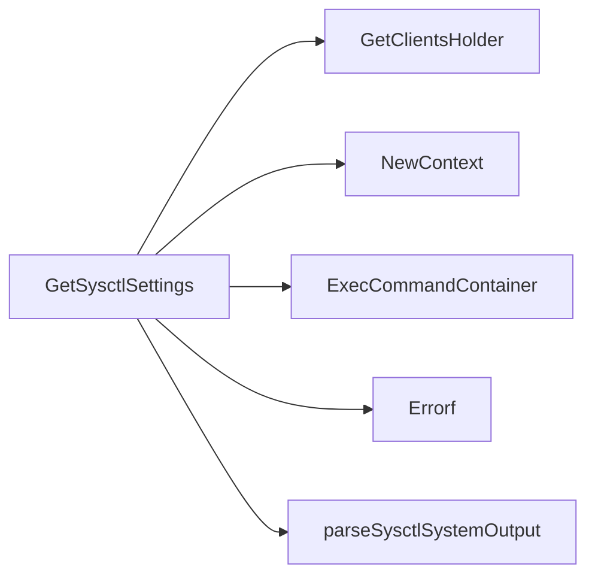

## Package sysctlconfig (github.com/redhat-best-practices-for-k8s/certsuite/tests/platform/sysctlconfig)

### Functions

- **GetSysctlSettings** — func(*provider.TestEnvironment, string)(map[string]string, error)

### Call graph (exported symbols, partial)

### Symbol docs

- [function GetSysctlSettings](symbols/function_GetSysctlSettings.md)
