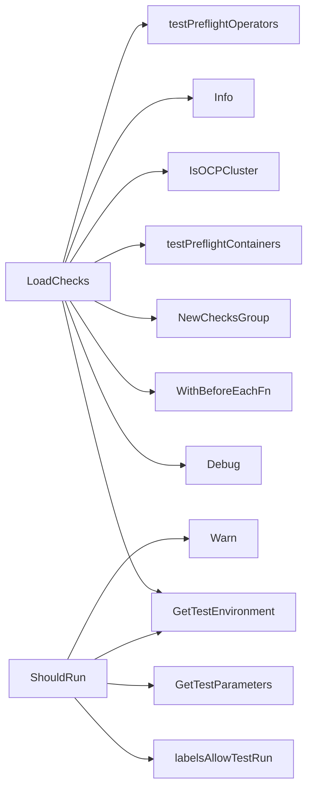

## Package preflight (github.com/redhat-best-practices-for-k8s/certsuite/tests/preflight)

# Preflight Test Suite – Overview

The **preflight** package supplies the test harness that runs a set of *pre‑flight* checks against containers and operators in a Kubernetes cluster before certificate issuance.  
All logic lives in `suite.go`; the file defines global state, helper functions and the two core test generators (`testPreflightContainers` & `testPreflightOperators`).  The package relies heavily on the shared test framework (`checksdb`, `provider`, `configuration`, etc.) but keeps its own responsibilities focused:

| Area | What it does |
|------|--------------|
| **Global state** | Holds a single `TestEnvironment` instance and a closure that is executed before each check group. |
| **Decision helpers** | `ShouldRun` decides whether the suite should be executed at all, based on labels and docker‑config presence. |
| **Check generators** | Two public functions (`LoadChecks`) register pre‑flight checks with the framework; they call the two private generator functions that walk the current test environment and create a `checksdb.ChecksGroup`. |
| **Result helpers** | Utility functions extract unique test entries from container/operator results so each check is reported only once. |

---

## Global Variables

| Name | Type | Purpose |
|------|------|---------|
| `env` | `provider.TestEnvironment` | Holds the current cluster state (containers, operators, etc.) for use by all tests. |
| `beforeEachFn` | `func()` | Closure executed before each test group; used to add pre‑flight checks dynamically based on environment data. |

---

## Core Functions

### 1. `LoadChecks()`

*Exported.*  
Called by the framework at startup. It registers the two check groups:

```go
NewChecksGroup("preflight_containers", "Preflight container checks")
NewChecksGroup("preflight_operators", "Preflight operator checks")
```

Each group receives a *BeforeEach* hook that executes `testPreflightContainers` or `testPreflightOperators`.  
The function logs the start of loading, determines whether the environment is an OCP cluster (via `IsOCPCluster`) and then returns.

---

### 2. `ShouldRun(labels string) bool`

Determines if any pre‑flight checks should be run:

1. Calls `GetTestEnvironment()` to read the test config.
2. Uses `labelsAllowTestRun` to check that at least one of the known pre‑flight labels is present in the supplied comma‑separated list.
3. Checks that a docker‑config file exists (`GetTestParameters().DockerConfigFilePath != ""`).

If any condition fails, it logs a warning and returns `false`.  
This guard avoids unnecessary work when the suite isn’t needed.

---

### 3. `testPreflightContainers(group *checksdb.ChecksGroup, env *provider.TestEnvironment)`

*Private.*  

1. Builds a slice of containers that are in test scope (`env.ContainerList`).
2. Calls `SetPreflightResults` to store raw results (used later for reporting).
3. If no containers were found, logs a fatal error.
4. Calls `generatePreflightContainerCnfCertTest` which creates one or more checks based on the unique test entries extracted from container results.

---

### 4. `testPreflightOperators(group *checksdb.ChecksGroup, env *provider.TestEnvironment)`

*Private.*  
Very similar to the container version but works with operators:

1. Calls `SetPreflightResults` for operator data.
2. Handles missing operator case with a fatal log.
3. Generates checks via `generatePreflightOperatorCnfCertTest`.

---

## Check Generation Helpers

Both *container* and *operator* check generators follow the same pattern.

### `generatePreflightContainerCnfCertTest`

Parameters:  
- `group` – the checks group to add to.  
- `testName`, `testID`, `tags` – metadata for the test.  
- `containers []*provider.Container` – list of containers that produced results.

Logic:

1. Calls `AddCatalogEntry` and `Add` on the group (registering the test).
2. Builds a `CheckFn` closure that:
   - Creates a new check object with `NewCheck`.
   - Uses `GetTestIDAndLabels` to attach ID/labels.
   - Adds a *skip* function (`GetNoContainersUnderTestSkipFn`) if no containers were examined.
   - Runs through the container results, creating report objects via `NewContainerReportObject`.
   - Sets the check result with `SetResult`.

The same pattern is mirrored in **`generatePreflightOperatorCnfCertTest`** but uses operator‑specific report helpers.

---

## Utility Functions

| Function | Role |
|----------|------|
| `labelsAllowTestRun(labels string, allowed []string) bool` | Checks if any of the supplied labels match a list of known pre‑flight labels. |
| `getUniqueTestEntriesFromContainerResults(containers []*provider.Container) map[string]provider.PreflightTest` | Builds a map keyed by test ID to avoid duplicate reporting when multiple containers produce the same test. |
| `getUniqueTestEntriesFromOperatorResults(operators []*provider.Operator) map[string]provider.PreflightTest` | Same as above but for operators. |

These helpers keep the main generators focused on orchestration rather than data wrangling.

---

## How Things Connect

```mermaid
flowchart TD
    A[LoadChecks()] --> B{BeforeEach Hook}
    B -->|containers| C[testPreflightContainers]
    B -->|operators | D[testPreflightOperators]

    C --> E[SetPreflightResults]
    D --> E

    E --> F[generatePreflightContainerCnfCertTest] %% or Operator version
    F --> G[NewCheck] --> H[SetResult]
```

* The `LoadChecks` function registers two groups.
* Each group’s *BeforeEach* runs the corresponding test generator.
* Generators pull raw results from `provider.TestEnvironment`, build a checks group, and add one check per unique pre‑flight test found in containers/operators.

---

## Summary

The **preflight** package is a thin wrapper that:

1. Decides if the suite should run (`ShouldRun`).
2. Loads and registers two check groups.
3. For each group, it processes the current environment to create checks that report on container/operator pre‑flight compliance.
4. Utilizes helper functions to avoid duplicate test entries.

All state is held in the global `env` variable; the rest of the package is read‑only logic that orchestrates the check registration process.

### Functions

- **LoadChecks** — func()()
- **ShouldRun** — func(string)(bool)

### Globals


### Call graph (exported symbols, partial)



### Symbol docs

- [function LoadChecks](symbols/function_LoadChecks.md)
- [function ShouldRun](symbols/function_ShouldRun.md)
