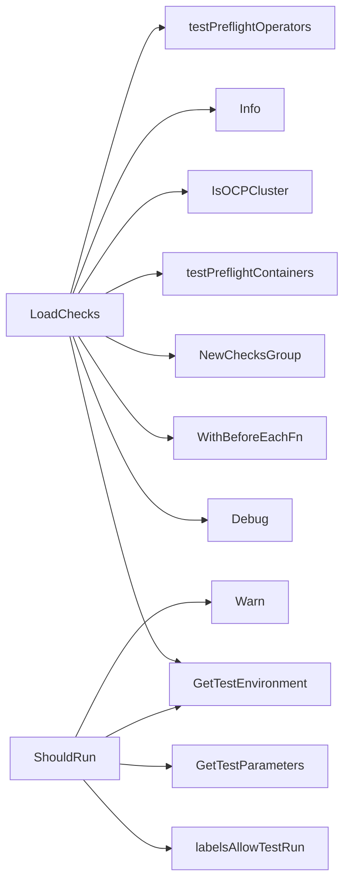

## Package preflight (github.com/redhat-best-practices-for-k8s/certsuite/tests/preflight)

### Functions

- **LoadChecks** — func()()
- **ShouldRun** — func(string)(bool)

### Globals

### Call graph (exported symbols, partial)

### Symbol docs

- [function LoadChecks](symbols/function_LoadChecks.md)
- [function ShouldRun](symbols/function_ShouldRun.md)
