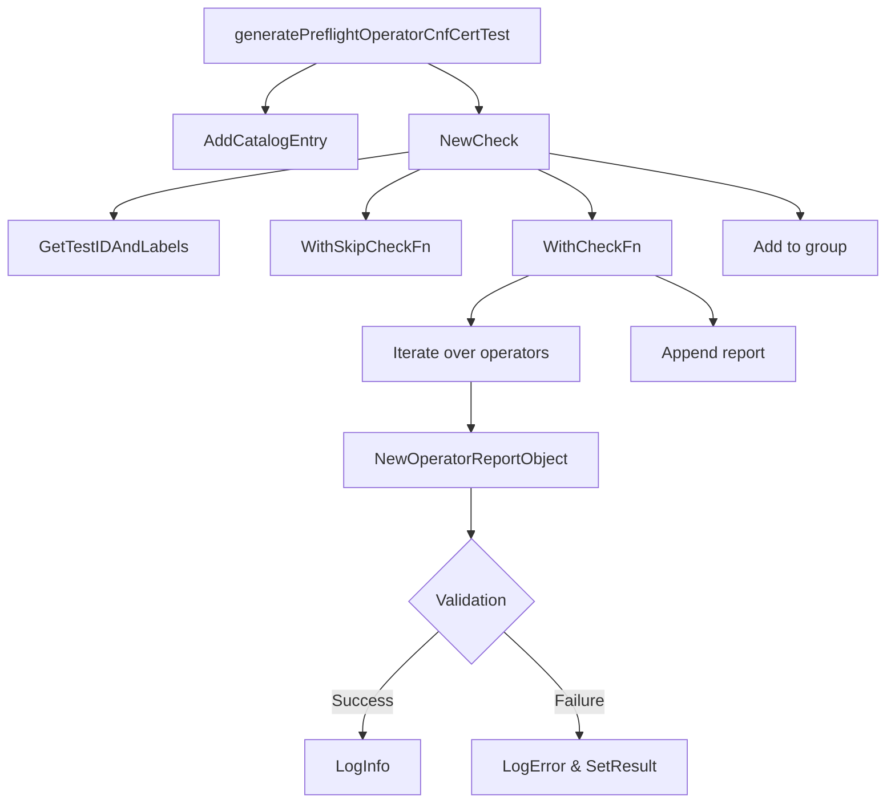

generatePreflightOperatorCnfCertTest`

| Item | Details |
|------|---------|
| **Package** | `preflight` (`github.com/redhat-best-practices-for-k8s/certsuite/tests/preflight`) |
| **Signature** | `func(*checksdb.ChecksGroup, string, string, string, []*provider.Operator)()` |
| **Exported?** | No – internal helper used when constructing the test suite |

### Purpose
Adds a *pre‑flight* check that verifies the CNF (Cloud Native Functions) operator certificate is correctly signed and valid for all supplied operators.  
The function does not run the test itself; it registers a `Check` object into the provided `ChecksGroup`. The returned closure will be invoked by the test runner later.

### Parameters
| Name | Type | Role |
|------|------|------|
| `group` | `*checksdb.ChecksGroup` | Destination where the check is registered. |
| `testID` | `string` | Identifier used for the test (e.g., `"cnf-cert"`). |
| `checkName` | `string` | Human‑readable name shown in reports. |
| `description` | `string` | Detailed description of what the check verifies. |
| `operators` | `[]*provider.Operator` | List of operator objects that should be examined for a valid CNF certificate. |

### Key Steps & Dependencies
1. **Add catalog entry** – registers the test in the group’s catalog (`AddCatalogEntry`).  
2. **Create a new check** – `NewCheck(checkName, description)`.  
3. **Attach metadata** – `GetTestIDAndLabels(testID)` supplies ID and labels for reporting.  
4. **Skip logic** – If no operators are provided, the check is skipped via `GetNoOperatorsSkipFn(operators...)`.  
5. **Define the test function** (`WithCheckFn`) that iterates over all operators:  
   * For each operator, a new report object (`NewOperatorReportObject(op)`) is created.  
   * The certificate validation logic (not shown in the snippet but invoked inside this loop) logs success or error with `LogInfo`/`LogError`.  
   * Errors are recorded on the report using `SetResult(err)`; the report is appended to a slice of operator reports.  
6. **Add the check** – Finally, the fully configured check (`check.Add()`) is added to the group.

### Side‑Effects
* Registers a new test in the supplied `ChecksGroup`.  
* No state outside the group or the operators list is modified.  
* All logging occurs via `LogInfo` and `LogError`, which are expected to write to the test framework’s output streams.

### Integration in the Package
The `preflight` package builds a collection of checks that run against a cluster before any certification tests are executed.  
This function contributes one such check: it ensures that CNF operator certificates meet required standards, preventing downstream failures. It is typically called during suite initialization (e.g., inside `TestMain` or a setup routine) to populate the group with all necessary pre‑flight validations.

--- 

**Mermaid diagram suggestion**

This diagram illustrates the flow from test registration to per‑operator validation and reporting.
