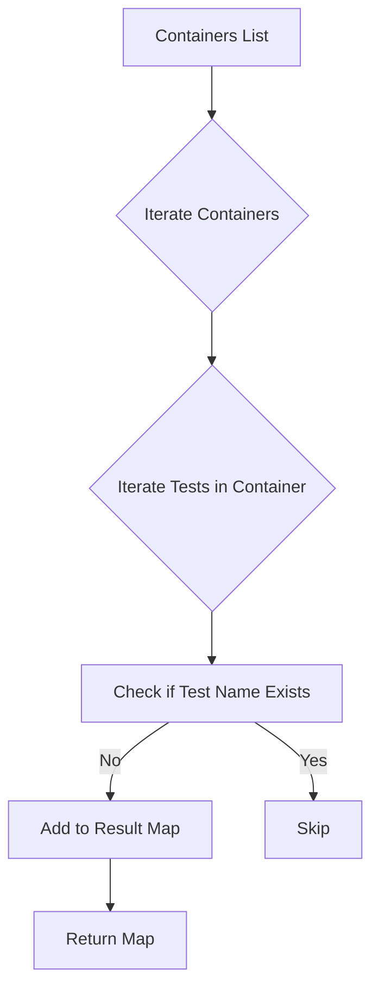

getUniqueTestEntriesFromContainerResults`

| Item | Details |
|------|---------|
| **Location** | `suite.go:224` in the `preflight` test package |
| **Signature** | `func([]*provider.Container) map[string]provider.PreflightTest` |
| **Exported?** | No (unexported helper) |

---

### Purpose
`getUniqueTestEntriesFromContainerResults` aggregates and deduplicates pre‑flight test results that are emitted by a set of container executions.  
Each `provider.Container` may report multiple `PreflightTest` entries; this function collects them into a single map keyed by the test’s name, ensuring that only one entry per test is retained.

---

### Parameters
| Name | Type | Description |
|------|------|-------------|
| `containers` | `[]*provider.Container` | A slice of pointers to containers that have already finished executing. Each container contains a slice of `PreflightTest` objects in its `Results`. |

> **Note**: The function does not modify the input slice or any of its elements.

---

### Return Value
| Type | Description |
|------|-------------|
| `map[string]provider.PreflightTest` | A map where keys are unique test names and values are the corresponding `PreflightTest` structs. If multiple containers report the same test name, only the first encountered instance is kept. |

---

### Key Steps (implementation sketch)

```go
func getUniqueTestEntriesFromContainerResults(containers []*provider.Container) map[string]provider.PreflightTest {
    // Create an empty result map.
    unique := make(map[string]provider.PreflightTest)

    // Iterate over each container and its reported tests.
    for _, c := range containers {
        for _, t := range c.Results {
            if _, exists := unique[t.Name]; !exists {
                unique[t.Name] = t
            }
        }
    }

    return unique
}
```

- **`make(map[string]provider.PreflightTest)`** – Initializes the result map.  
- The outer loop visits each container; the inner loop walks through its `Results`.  
- A simple existence check (`if _, exists := unique[t.Name]; !exists`) guarantees that duplicate test names are ignored after their first appearance.

---

### Dependencies & Side‑Effects
| Dependency | Role |
|------------|------|
| `provider.Container` | Holds container execution data and the slice of `PreflightTest`. |
| `provider.PreflightTest` | The struct stored in the result map. |

**Side‑effects**: None beyond constructing and returning a new map. The function is pure with respect to its inputs.

---

### Integration into the Package
- The `preflight` package orchestrates a suite of tests that run inside Kubernetes pods/containers.
- After containers finish, this helper is called (e.g., in `suite.go:230`) to flatten and deduplicate all test results before they are evaluated or logged.
- It supports other functions such as `runPreflightTests` by providing a concise view of which tests succeeded/failured across the entire cluster.

---

### Suggested Mermaid Diagram



This diagram visualises the two‑level iteration and deduplication logic.

---
