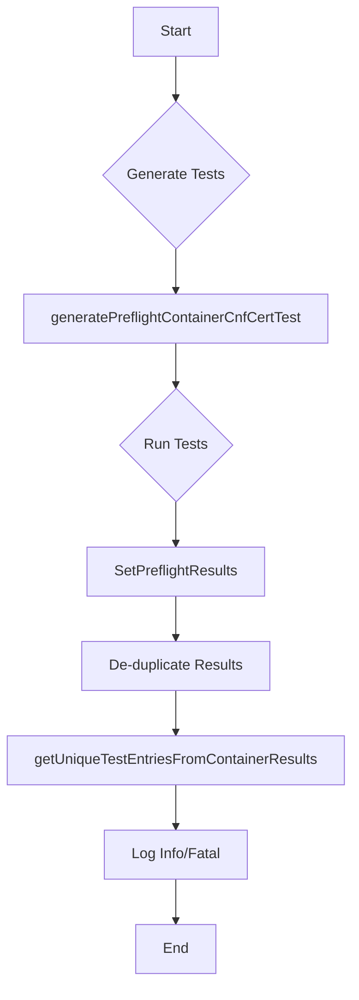

testPreflightContainers`

| Aspect | Detail |
|--------|--------|
| **Package** | `preflight` (`github.com/redhat-best-practices-for-k8s/certsuite/tests/preflight`) |
| **Visibility** | Unexported (used only within the test suite) |
| **Signature** | `func(*checksdb.ChecksGroup, *provider.TestEnvironment)` |

### Purpose
Runs pre‑flight container checks for a given *ChecksGroup* against a live test environment.  
The function orchestrates:

1. Generation of per‑container configuration‑test data (`generatePreflightContainerCnfCertTest`).
2. Execution of the tests via `SetPreflightResults`.
3. Aggregation and de‑duplication of unique test entries with `getUniqueTestEntriesFromContainerResults`.

### Inputs
| Parameter | Type | Role |
|-----------|------|------|
| `cg` | `*checksdb.ChecksGroup` | Holds the collection of checks that should be executed against each container. |
| `env` | `*provider.TestEnvironment` | Encapsulates the runtime environment (e.g., kube client, namespace) used to run the tests. |

### Output
The function has no return value; it mutates state via side effects:

- Updates the global test environment (`env`) with pre‑flight results through `SetPreflightResults`.
- Emits logs via the testing framework’s `Info` and `Fatal`.

### Key Dependencies & Calls

| Called Function | Purpose |
|-----------------|---------|
| `generatePreflightContainerCnfCertTest(cg, env)` | Produces a slice of container‑specific configuration tests. |
| `SetPreflightResults(testEntries)` | Persists the results back to the test environment’s data store. |
| `getUniqueTestEntriesFromContainerResults(containerResults)` | Removes duplicate entries from the raw results. |
| `Fatal(...)` / `Info(...)` | Logging helpers provided by the testing framework (likely *testing.T*). |

### Side‑Effects & Assumptions

- **Environment Mutation**: The function writes to the shared `env.PreflightResults`, so concurrent invocations must be serialized.
- **Error Handling**: A fatal error aborts the entire test run; any non‑fatal errors are logged as info and the process continues.
- **Global Variables**: Relies on package‑level globals (`beforeEachFn` and `env`) only indirectly via the passed `*provider.TestEnvironment`; no direct read/write to those globals occurs in this function.

### Context within the Package

The *preflight* test suite exercises checks that must be satisfied before a certificate is issued.  
`testPreflightContainers` is one of several helper functions invoked from higher‑level test orchestrators (e.g., `TestSuite`). It focuses specifically on container‑level configuration tests, ensuring that each container in the target environment meets all prerequisite conditions defined by the checks database.

---

#### Suggested Mermaid Flow Diagram

This diagram visualizes the main data flow within `testPreflightContainers`.
