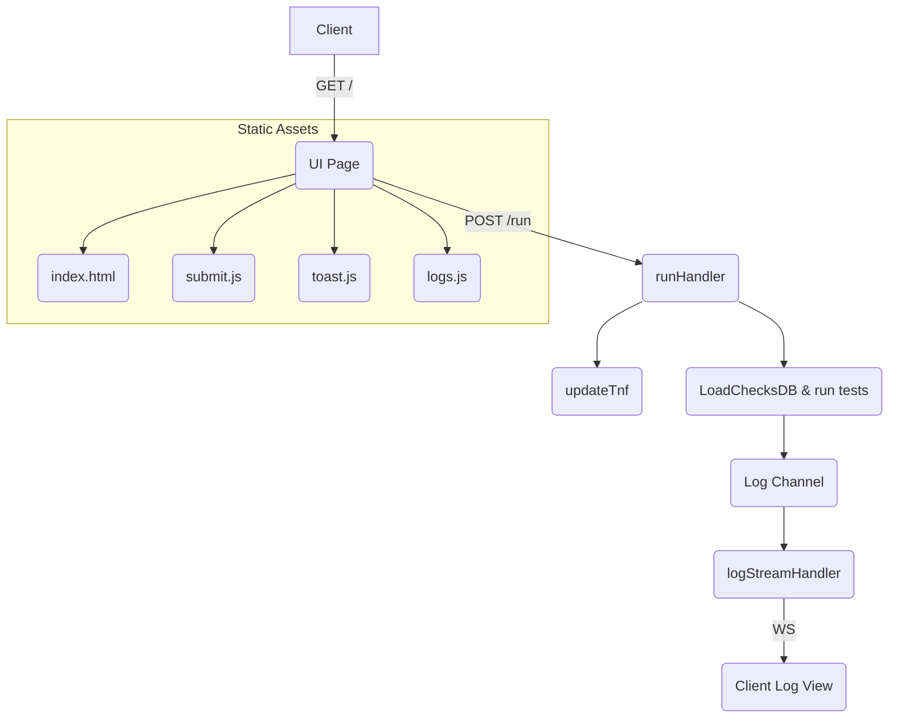
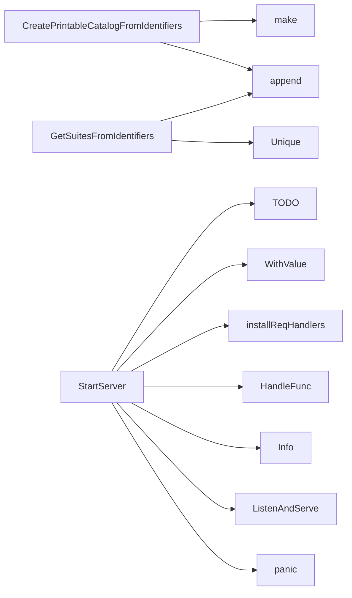

## Package webserver (github.com/redhat-best-practices-for-k8s/certsuite/webserver)

# Overview of the `webserver` package

The **webserver** package provides a lightweight HTTP server that exposes a UI for running CERT‑Suite tests and streaming logs in real time.  
It bundles static assets (HTML/JS) with Go’s embed feature, serves them on `/`, handles WebSocket log streams (`/logs`), and triggers test runs via the `/run` endpoint.

---

## Key Data Structures

| Type | Purpose | Key fields |
|------|---------|------------|
| `RequestedData` | Holds all parameters that can be passed when launching a test run.  These are sent as JSON in the body of `/run`. | `PartnerName`, `ManagedDeployments`, `OperatorsUnderTestLabels`, `PodsUnderTestLabels`, … (many optional string lists) |
| `ResponseData` | Simple wrapper for messages returned by handlers (currently only used in `/logs`). | `Message string` |
| `Entry` | Represents a single test case in the printable catalog.  Used by `CreatePrintableCatalogFromIdentifiers`. | `identifier claim.Identifier`, `testName string` |

The package also defines an unexported **context key** (`outputFolderCtxKey`) used to store the temporary output folder path in request contexts.

---

## Global Variables

| Variable | Type | How it’s used |
|----------|------|---------------|
| `indexHTML`, `logs`, `submit`, `toast`, `upgrader` | embedded files | Embedded static assets served at `/`.  The `upgrader` is a `websocket.Upgrader` that upgrades HTTP connections to WebSocket for log streaming. |
| `outputFolderCtxKey` | custom context key type (`webServerContextKey`) | Stores the temporary folder path in each request’s context so other handlers can access it without passing it around. |
| `buf` | `*bytes.Buffer` | Temporary buffer used by `logStreamHandler`. |

No mutable global state is modified at runtime, keeping the package thread‑safe.

---

## Core Functions

### Server Startup
```go
func StartServer(addr string) func()
```
* Creates an HTTP server on `addr`.
* Calls `installReqHandlers()` to register all endpoints.
* Returns a shutdown function that closes the server’s listener.

> **Note**: The implementation is incomplete (`TODO` comment). In production it would likely set up TLS, logging, and graceful shutdown.

### Request Handlers

| Endpoint | Handler | Key actions |
|----------|---------|-------------|
| `/` | `installReqHandlers()` (via `HandleFunc`) | Serves the static UI pages from embedded assets. |
| `/logs` | `logStreamHandler` | Upgrades to WebSocket, streams logs line‑by‑line with a 1 s timeout, converts ANSI to HTML, and sends them over the socket. |
| `/run` | `runHandler` | Parses multipart form data (JSON body + optional file), writes temporary files, updates test configuration (`updateTnf`), loads checks DB, runs tests via CERT‑Suite’s client holder, logs output, then cleans up temp files. |

### Utility Functions

* **`CreatePrintableCatalogFromIdentifiers([]claim.Identifier) map[string][]Entry`**  
  Builds a map from suite names to their test entries for generating Markdown documentation.

* **`GetSuitesFromIdentifiers([]claim.Identifier) []string`**  
  Extracts unique suite names from identifiers.

* **`outputTestCases() string`**  
  Generates Markdown listing all test cases, used by the UI for reference. It calls the two functions above to build the catalog and then formats it.

* **`updateTnf([]byte, *RequestedData) []byte`**  
  Reads a `tnf.yaml`, injects fields from `RequestedData` (e.g., partner name, labels), and returns the updated byte slice. It performs many string replacements to keep the test manifest valid.

* **`toJSONString(map[string]string) string`**  
  Helper that pretty‑prints a map as JSON for UI consumption.

---

## Interaction Flow

1. **Client** loads `/`.  
2. When user submits test configuration → POST `/run`.  
3. `runHandler`  
   * Parses form data → builds `RequestedData`.  
   * Calls `updateTnf` to patch the TNF manifest.  
   * Loads checks DB, creates a client holder, and triggers tests.  
   * Streams progress to the UI via WebSocket (`/logs`).  
4. **WebSocket** logs are handled by `logStreamHandler`, which reads from the server’s log channel, converts ANSI → HTML (via `ansihtml`), and writes back to the browser.

---

## Suggested Mermaid Diagram



---

### Summary

The package bundles a minimal UI with embedded JS/HTML, provides a WebSocket‑based log stream, and exposes an endpoint to kick off CERT‑Suite test runs based on user‑supplied JSON. All configuration is passed through the `RequestedData` struct; the server writes temporary files, patches the TNF manifest, then invokes the underlying test engine. No mutable global state exists beyond the static assets, ensuring thread safety and ease of testing.

### Structs

- **Entry** (exported) — 2 fields, 0 methods
- **RequestedData** (exported) — 26 fields, 0 methods
- **ResponseData** (exported) — 1 fields, 0 methods

### Functions

- **CreatePrintableCatalogFromIdentifiers** — func([]claim.Identifier)(map[string][]Entry)
- **GetSuitesFromIdentifiers** — func([]claim.Identifier)([]string)
- **StartServer** — func(string)()

### Globals


### Call graph (exported symbols, partial)



### Symbol docs

- [struct Entry](symbols/struct_Entry.md)
- [struct RequestedData](symbols/struct_RequestedData.md)
- [struct ResponseData](symbols/struct_ResponseData.md)
- [function CreatePrintableCatalogFromIdentifiers](symbols/function_CreatePrintableCatalogFromIdentifiers.md)
- [function GetSuitesFromIdentifiers](symbols/function_GetSuitesFromIdentifiers.md)
- [function StartServer](symbols/function_StartServer.md)
