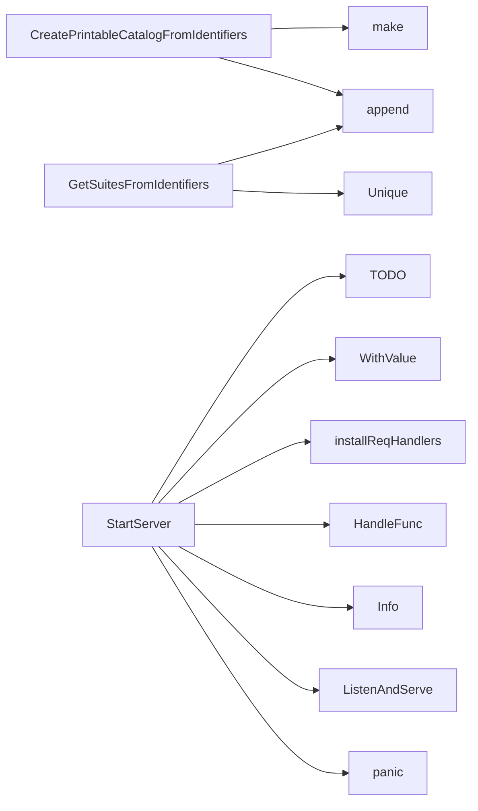

## Package webserver (github.com/redhat-best-practices-for-k8s/certsuite/webserver)

### Structs

- **Entry** (exported) — 2 fields, 0 methods
- **RequestedData** (exported) — 26 fields, 0 methods
- **ResponseData** (exported) — 1 fields, 0 methods

### Functions

- **CreatePrintableCatalogFromIdentifiers** — func([]claim.Identifier)(map[string][]Entry)
- **GetSuitesFromIdentifiers** — func([]claim.Identifier)([]string)
- **StartServer** — func(string)()

### Globals

### Call graph (exported symbols, partial)

### Symbol docs

- [struct Entry](symbols/struct_Entry.md)
- [struct RequestedData](symbols/struct_RequestedData.md)
- [struct ResponseData](symbols/struct_ResponseData.md)
- [function CreatePrintableCatalogFromIdentifiers](symbols/function_CreatePrintableCatalogFromIdentifiers.md)
- [function GetSuitesFromIdentifiers](symbols/function_GetSuitesFromIdentifiers.md)
- [function StartServer](symbols/function_StartServer.md)
