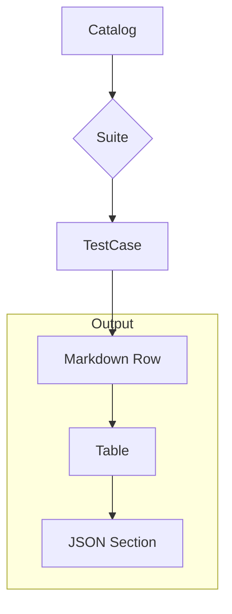

outputTestCases`

| Item | Details |
|------|---------|
| **Signature** | `func() string` |
| **Visibility** | Unexported – used only inside the *webserver* package. |
| **Purpose** | Generates a Markdown document that lists all test cases defined in the catalog, grouped by suite and test case name. The function is invoked when a user requests the “Test Cases” page of the web UI; the resulting string is sent to `stdout` for debugging and also embedded in the HTML template. |

---

### High‑level behaviour

1. **Create printable catalog**  
   ```go
   cat := CreatePrintableCatalogFromIdentifiers([]string{})
   ```
   *`CreatePrintableCatalogFromIdentifiers`* returns a `Catalog` struct that contains all suites, test cases, and parameters.

2. **Collect suite names**  
   ```go
   suites := GetSuitesFromIdentifiers([]string{})
   ```
   The function retrieves the list of suite identifiers; these are used to sort the output.

3. **Build Markdown rows**  
   For each suite → each test case in that suite, a row is appended to `buf`.  
   Each row contains:
   * A link to the test case page (`/testcase/{suiteID}/{tcID}`).
   * The suite name.
   * The test case name.
   * A short description (first line of the doc string).

4. **Add JSON section**  
   After the table, a collapsible `<details>` block contains a pretty‑printed JSON representation of the entire catalog, produced by `toJSONString(cat)`.

5. **Return**  
   The function returns the final Markdown text (`buf.String()`), which is printed to stdout and also written into an HTTP response in other handlers.

---

### Inputs / Outputs

| Input | Description |
|-------|-------------|
| None | The function uses global state (the embedded catalog) but takes no parameters. |

| Output | Type | Description |
|--------|------|-------------|
| `string` | Markdown document | Contains a table of all test cases and an expandable JSON view. |

---

### Key Dependencies

| Dependency | Role |
|------------|------|
| `CreatePrintableCatalogFromIdentifiers` | Builds the catalog object to be rendered. |
| `GetSuitesFromIdentifiers` | Supplies suite ordering for iteration. |
| `toJSONString` | Serialises the catalog into a JSON string with indentation. |
| Standard library: `bytes.Buffer`, `fmt.Sprintf`, `strings.ReplaceAll`, etc. | Build and format the Markdown text. |

---

### Side Effects

* **Stdout** – The function prints the resulting Markdown to standard output (`log.Printf` style).  
  This is primarily for debugging; it does not alter any state in the server.

* **No global mutation** – All data structures are read‑only; the function only writes into a local `bytes.Buffer`.

---

### Relationship within the package

The *webserver* package serves a static UI that lets users browse and run test cases.  
`outputTestCases` is called by:

```go
http.HandleFunc("/testcases", func(w http.ResponseWriter, r *http.Request) {
    md := outputTestCases()
    // write `md` into the HTML template for display
})
```

Thus, it acts as a bridge between the internal catalog data and the human‑readable documentation shown on the web UI. It is deliberately isolated so that changes to the catalog format or rendering logic can be made without affecting other handlers.

---

### Suggested Mermaid diagram



This visualises the flow from catalog data → suite/test case iteration → Markdown table and JSON block that together form the output string.
