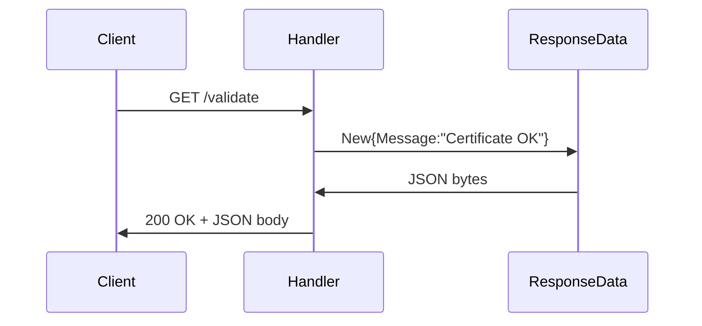

ResponseData` – Web‑server response payload

| Item | Detail |
|------|--------|
| **Package** | `webserver` (`github.com/redhat-best-practices-for-k8s/certsuite/webserver`) |
| **Location** | `webserver.go:125` |
| **Visibility** | Exported (public) |

## Purpose
`ResponseData` is the JSON‑serialisable payload used by the HTTP handlers in this package.  
When a request succeeds, the handler writes an instance of this struct as the body of the HTTP response, typically with a 200 OK status. The single `Message` field holds a human‑readable string describing the result (e.g., “OK”, “Certificate validated”, or error details).

## Fields

| Field | Type   | JSON key | Notes |
|-------|--------|----------|-------|
| `Message` | `string` | `message` | The message returned to clients. It is the only data exposed; no other metadata (status codes, timestamps) are embedded here. |

> **Why just one field?**  
> The rest of the response handling logic in this package sets HTTP status codes directly on the `http.ResponseWriter`. Thus a lightweight payload suffices.

## Usage Flow

1. A request hits a handler (e.g., `ValidateHandler`).
2. The handler constructs a `ResponseData{Message: <text>}`.
3. `json.NewEncoder(w).Encode(resp)` serialises it to JSON and writes it to the response writer.
4. The client receives the message in the HTTP body.

## Dependencies & Side‑Effects

* **Encoding** – Relies on Go’s standard `encoding/json` package for marshaling.  
* **HTTP Writing** – No side‑effects beyond writing to the provided `http.ResponseWriter`.  
* **No external state** – Pure data holder; no global variables or mutable shared state.

## Where It Fits

- **Response Composition:** Acts as the canonical payload for all success responses in the `webserver` package.
- **Testing Helper:** In unit tests, assertions often compare `ResponseData.Message` against expected strings to validate handler behaviour.
- **Extensibility Note:** If additional fields become necessary (e.g., status codes or timestamps), they can be added here without changing handler signatures.

--- 

*If you need to add more context (like error handling structures) that are currently unknown, the documentation would state “unknown” for those parts.*
