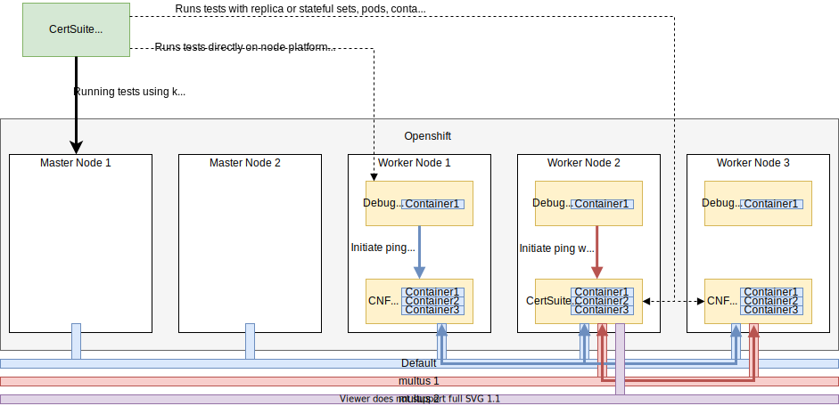

<!-- markdownlint-disable line-length no-bare-urls no-emphasis-as-heading -->
# Overview

This repository provides a set of test cases to verify the conformance of a workload with the Red Hat Best Practices for Kubernetes.

!!! tip "Workload"

    The app (containers/pods/operators) we want to certify according Telco partner/Red Hat's best practices.

!!! tip "Red Hat Best Practices Test Suite for Kubernetes"

    The tool we use to certify a workload.

The purpose of the tests and the framework is to test the interaction of the workload with OpenShift Container Platform (OCP).  

!!! info

    This test suite is provided for the workload developers to test their workload's readiness for certification.
    Please see the [Developers' Guide](developers.md) for more information.

**Features**

* The test suite generates a report (`claim.json`) and saves the test execution log (`certsuite.log`) in a configurable output directory.

* The catalog of the existing test cases and test building blocks are available in [CATALOG.md](https://github.com/redhat-best-practices-for-k8s/certsuite/blob/main/CATALOG.md)

## Architecture

 

There are 3 building blocks in the above framework.

* the `CNF` represents the workload to be certified. The Test Suite identifies the resources (containers/pods/operators etc) belonging to the workload via labels or static data entries in the Config File

* the `Certification container/exec` is the Test Suite running on the platform or in a container. The executable verifies the workload under test configuration and its interactions with OpenShift

* the `Debug` pods are part of a Kubernetes daemonset responsible to run various **privileged commands** on Kubernetes nodes. Debug pods are useful to run platform tests and test commands (e.g. ping) in container namespaces without changing the container image content. The probe daemonset is instantiated via the [privileged-daemonset](https://github.com/redhat-best-practices-for-k8s/privileged-daemonset) repository.
