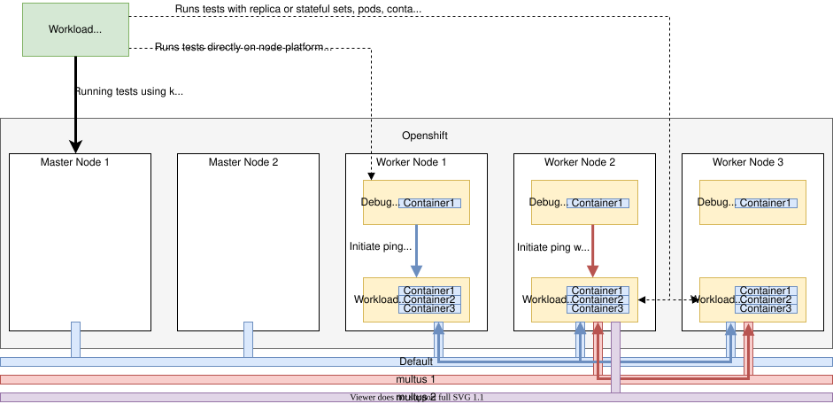

<!-- markdownlint-disable line-length no-bare-urls no-emphasis-as-heading -->
# Overview

This repository provides a set of test cases to verify the conformance of a workload with the Red Hat Best Practices for Kubernetes.

!!! tip "Workload"

    The app (containers/pods/operators) we want to certify according Telco partner/Red Hat's best practices.

!!! tip "Red Hat Best Practices Test Suite for Kubernetes"

    The tool we use to certify a workload.

The purpose of the tests and the framework is to test the interaction of the workload with OpenShift Container Platform (OCP).

!!! info

    This test suite is provided for the workload developers to test their workload's readiness for certification.
    Please see the [Developers' Guide](developers.md) for more information.

**Features**

* The test suite generates a report (`claim.json`) and saves the test execution log (`certsuite.log`) in a configurable output directory.

* The catalog of the existing test cases and test building blocks are available in [CATALOG.md](https://github.com/redhat-best-practices-for-k8s/certsuite/blob/main/CATALOG.md)

## Architecture

 

There are 3 building blocks in the above framework.

* the **workload under test** is the application to be certified. The Test Suite identifies its resources (containers, pods, operators, and so on) via labels or static entries in the Config File

* the **certsuite binary or container** is the Test Suite running on a jump host or in a container. The executable verifies the workload under test configuration and its interactions with OpenShift

* the **probe DaemonSet** (`certsuite-probe`) runs privileged commands on Kubernetes nodes. Probe pods are used for platform tests and commands (for example ping) in container namespaces without changing the container image. The DaemonSet is deployed through the [privileged-daemonset](https://github.com/redhat-best-practices-for-k8s/privileged-daemonset) repository.

## Disconnected Environments

For running the certsuite against air-gapped or disconnected OpenShift clusters, see the [Disconnected Environment Guide](disconnected.md).
