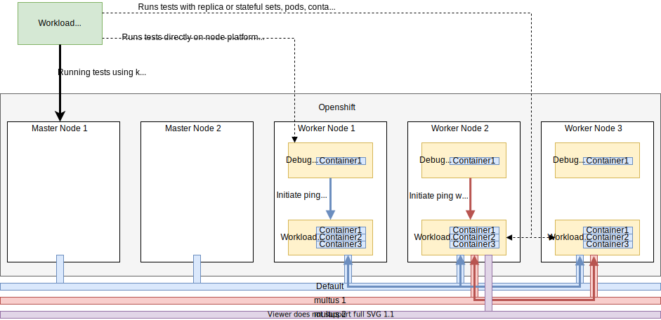

<!-- markdownlint-disable line-length no-bare-urls no-emphasis-as-heading -->
# Overview

This repository provides a set of Cloud-Native Network Functions (CNF) test cases and the framework to add more test cases.

!!! tip "CNF"

    The app (containers/pods/operators) we want to certify according Telco partner/Red Hat's best practices.

!!! tip "TNF/Certification Test Suite"

    The tool we use to certify a CNF.

The purpose of the tests and the framework is to test the interaction of CNF with OpenShift Container Platform (OCP).  

!!! info

    This test suite is provided for the CNF Developers to test their CNFs readiness for certification.
    Please see "CNF Developers" for more information.

**Features**

* The test suite generates a report (`claim.json`) and saves the test execution log (`cnf-certsuite.log`) in a configurable output directory.

* The catalog of the existing test cases and test building blocks are available in [CATALOG.md](https://github.com/test-network-function/cnf-certification-test/blob/main/CATALOG.md)

## Architecture

 

There are 3 building blocks in the above framework.

* the `CNF` represents the CNF to be certified. The certification suite identifies the resources (containers/pods/operators etc) belonging to the CNF via labels or static data entries in the config file

* the `Certification container/exec` is the certification test suite running on the platform or in a container. The executable verifies the CNF under test configuration and its interactions with openshift

* the `Debug` pods are part of a Kubernetes daemonset responsible to run various **privileged commands** on kubernetes nodes. Debug pods are useful to run platform tests and test commands (e.g. ping) in container namespaces without changing the container image content. The debug daemonset is instantiated via the [privileged-daemonset](https://github.com/test-network-function/privileged-daemonset) repository.
