# Package cli

**Path**: `internal/cli`

## Table of Contents

- [Overview](#overview)
- [Structs](#structs)
- [Exported Functions](#exported-functions)
  - [LineAlignCenter](#linealigncenter)
  - [LineAlignLeft](#linealignleft)
  - [LineColor](#linecolor)
  - [PrintBanner](#printbanner)
  - [PrintCheckAborted](#printcheckaborted)
  - [PrintCheckErrored](#printcheckerrored)
  - [PrintCheckFailed](#printcheckfailed)
  - [PrintCheckPassed](#printcheckpassed)
  - [PrintCheckRunning](#printcheckrunning)
  - [PrintCheckSkipped](#printcheckskipped)
  - [PrintResultsTable](#printresultstable)
  - [WrapLines](#wraplines)
  - [cliCheckLogSniffer.Write](#clichecklogsniffer.write)
- [Local Functions](#local-functions)
  - [cropLogLine](#croplogline)
  - [getTerminalWidth](#getterminalwidth)
  - [isTTY](#istty)
  - [printRunningCheckLine](#printrunningcheckline)
  - [stopCheckLineGoroutine](#stopchecklinegoroutine)
  - [updateRunningCheckLine](#updaterunningcheckline)

## Overview

The `cli` package supplies terminal‑centric utilities for the Certsuite tool, including a startup banner, ANSI colour handling, dynamic progress lines during check execution, and formatted output of test case summaries.

### Key Features

- ANSI colour helpers (e.g., LineColor) to wrap text safely in terminals
- A background goroutine that updates a single line with elapsed time and recent log messages for running checks
- Convenience functions to print the status of each check – passed, failed, skipped, aborted, or errored

### Design Notes

- Uses `golang.org/x/term` to detect TTY and adjust output accordingly; non‑TTY streams suppress dynamic updates
- A dedicated channel (`checkLoggerChan`) feeds log snippets to the running‑line goroutine, with a stop channel (`stopChan`) signalling termination
- The package keeps state minimal – no global mutexes – relying on Go channels for safe concurrency

### Structs Summary

| Name | Purpose |
|------|----------|

### Exported Functions Summary

| Name | Purpose |
|------|----------|
| [func LineAlignCenter(s string, w int) string](#linealigncenter) | Produces a new string of length `w` with the input string `s` horizontally centered. Padding is added on both sides using spaces. |
| [func LineAlignLeft(s string, w int) string](#linealignleft) | Returns the input string padded with spaces on the right so that its total length equals `w`. If the string is longer than `w`, it is returned unchanged. |
| [func LineColor(s, color string) string](#linecolor) | Wraps a given string with a specified ANSI color code and appends the reset code so that subsequent terminal output is unaffected. |
| [func()()](#printbanner) | Outputs a static banner string (`banner`) to `stdout` using `fmt.Print`. |
| [func(string, string)()](#printcheckaborted) | Signals that a compliance check has been aborted and displays the check name along with an optional reason. |
| [func PrintCheckErrored(checkName string)](#printcheckerrored) | Signals that a specific check has finished with an error, stops any ongoing line‑printing goroutine, and outputs a formatted message to the console. |
| [func PrintCheckFailed(checkName string)()](#printcheckfailed) | Terminates the background line‑printing goroutine and outputs a formatted failure message for the given check. |
| [func PrintCheckPassed(checkName string)](#printcheckpassed) | Displays a “passed” status for the given check name, prefixed by a clear‑line escape code and a pass tag. It also signals any running line‑progress goroutine to terminate. |
| [func PrintCheckRunning(checkName string) ()](#printcheckrunning) | Outputs the initial “running” message for a check and launches a background goroutine that periodically updates this line with timing or log information. |
| [func PrintCheckSkipped(checkName, reason string)](#printcheckskipped) | Reports that a check was skipped and displays the skip reason. |
| [func PrintResultsTable(results map[string][]int)](#printresultstable) | Outputs a human‑readable table summarizing the number of passed, failed, and skipped checks per test suite. |
| [func WrapLines(text string, maxWidth int) []string](#wraplines) | Splits an arbitrary text block into multiple lines so that each line does not exceed `maxWidth` characters. It preserves existing line breaks and wraps long words by splitting on whitespace. |
| [func (c *cliCheckLogSniffer) Write(p []byte) (n int, err error)](#clichecklogsniffer.write) | Provides an `io.Write` implementation that forwards log messages to a channel when running in a terminal, otherwise silently discards them. |

### Local Functions Summary

| Name | Purpose |
|------|----------|
| [func cropLogLine(line string, maxAvailableWidth int) string](#croplogline) | Removes new‑line characters from the supplied `line` and truncates it so that its length does not exceed `maxAvailableWidth`. |
| [func() int](#getterminalwidth) | Obtains the width of the terminal window in columns, allowing other functions to format output appropriately. |
| [func isTTY() bool](#istty) | Returns true if the program’s stdin is a terminal (tty/ptty), false otherwise. |
| [func printRunningCheckLine(checkName string, startTime time.Time, logLine string) ()](#printrunningcheckline) | Renders a line to the terminal showing a running check’s name, elapsed time and, if space permits, its most recent log message. It handles both TTY (interactive) and non‑TTY environments. |
| [func stopCheckLineGoroutine()](#stopchecklinegoroutine) | Signals the goroutine that prints a moving “checking…” line to terminate and disables the channel used for this purpose. |
| [func(string, <-chan bool)()](#updaterunningcheckline) | Continuously refreshes a status line in the terminal to show elapsed time and the most recent log message for an ongoing check. |

## Structs

## Exported Functions

### LineAlignCenter

**LineAlignCenter** - Produces a new string of length `w` with the input string `s` horizontally centered. Padding is added on both sides using spaces.


#### Signature
```go
func LineAlignCenter(s string, w int) string
```

#### Summary Table
| Aspect | Details |
|--------|---------|
| **Purpose** | Produces a new string of length `w` with the input string `s` horizontally centered. Padding is added on both sides using spaces. |
| **Parameters** | `s string –` text to center.<br>`w int –` desired total width (including padding). |
| **Return value** | A formatted string of length `w` containing `s` centered. |
| **Key dependencies** | • `fmt.Sprintf` from the standard library<br>• Built‑in function `len` to compute string length |
| **Side effects** | None; pure function with no state mutation or I/O. |
| **How it fits the package** | Utility used by the CLI for formatting output boxes, ensuring labels and titles appear centered in terminal tables. |

#### Internal workflow
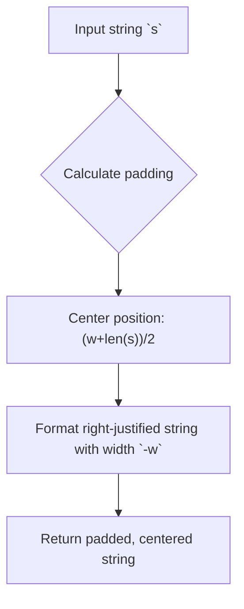

#### Function dependencies
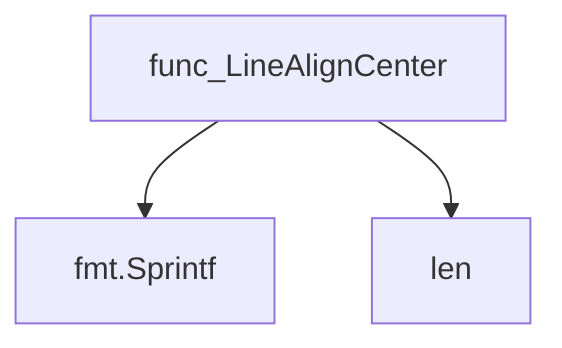

#### Functions calling `LineAlignCenter`
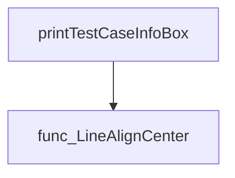

#### Usage example
```go
// Minimal example invoking LineAlignCenter
package main

import (
	"fmt"
	"github.com/redhat-best-practices-for-k8s/certsuite/internal/cli"
)

func main() {
	centered := cli.LineAlignCenter("HELLO", 20)
	fmt.Println("|" + centered + "|") // prints: |       HELLO        |
}
```

---

### LineAlignLeft

**LineAlignLeft** - Returns the input string padded with spaces on the right so that its total length equals `w`. If the string is longer than `w`, it is returned unchanged.


#### Signature (Go)

```go
func LineAlignLeft(s string, w int) string
```

#### Summary Table

| Aspect | Details |
|--------|---------|
| **Purpose** | Returns the input string padded with spaces on the right so that its total length equals `w`. If the string is longer than `w`, it is returned unchanged. |
| **Parameters** | `s` – the string to align.<br>`w` – desired width of the output. |
| **Return value** | A new string left‑aligned to width `w`. |
| **Key dependencies** | * `fmt.Sprintf` – used for formatting with a negative field width. |
| **Side effects** | None. The function is pure; it does not modify global state or perform I/O. |
| **How it fits the package** | Utility for console output in the CLI, ensuring consistent column widths when printing tables or boxes. |

#### Internal workflow (Mermaid)

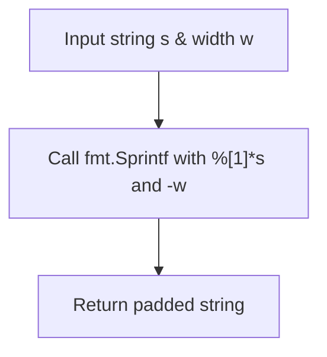

#### Function dependencies (Mermaid)

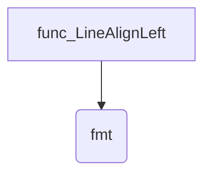

#### Functions calling `LineAlignLeft` (Mermaid)

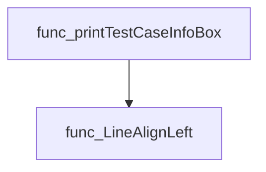

#### Usage example (Go)

```go
// Minimal example invoking LineAlignLeft
package main

import (
	"fmt"
	"github.com/redhat-best-practices-for-k8s/certsuite/internal/cli"
)

func main() {
	s := "Example text"
	width := 20
	leftAligned := cli.LineAlignLeft(s, width)
	fmt.Printf("'%s'\n", leftAligned) // Output: 'Example text       '
}
```

---

### LineColor

**LineColor** - Wraps a given string with a specified ANSI color code and appends the reset code so that subsequent terminal output is unaffected.

Adds an ANSI color escape sequence to a string and resets the terminal formatting afterwards.

```go
func LineColor(s, color string) string
```

| Aspect | Details |
|--------|---------|
| **Purpose** | Wraps a given string with a specified ANSI color code and appends the reset code so that subsequent terminal output is unaffected. |
| **Parameters** | `s` – the text to colour; `color` – an ANSI escape sequence such as `cli.Cyan` or `cli.Green`. |
| **Return value** | The coloured string: `<color><s><Reset>`. |
| **Key dependencies** | Uses the package‑level constant `Reset` (the ANSI reset code). |
| **Side effects** | Pure function; no state mutation, I/O, or concurrency. |
| **How it fits the package** | Provides a lightweight helper for colouring CLI output used throughout the `cli` package. |

#### Internal workflow
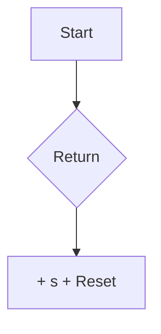

#### Function dependencies  
None – this function is currently not referenced elsewhere in the package.

#### Functions calling `LineColor`
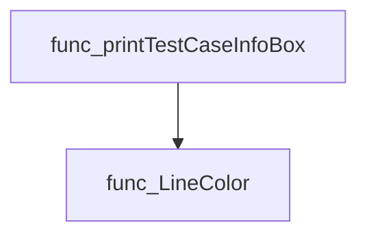

#### Usage example (Go)
```go
// Minimal example invoking LineColor
package main

import (
    "fmt"
    "github.com/redhat-best-practices-for-k8s/certsuite/internal/cli"
)

func main() {
    text := cli.LineColor("Hello, world!", cli.Green)
    fmt.Println(text) // Prints the string in green followed by a reset
}
```

---

### PrintBanner

**PrintBanner** - Outputs a static banner string (`banner`) to `stdout` using `fmt.Print`.


The function displays a pre‑defined ASCII banner to standard output when the Certsuite CLI starts up.

---

#### Signature (Go)

```go
func()()
```

---

#### Summary Table

| Aspect | Details |
|--------|---------|
| **Purpose** | Outputs a static banner string (`banner`) to `stdout` using `fmt.Print`. |
| **Parameters** | None. |
| **Return value** | None. |
| **Key dependencies** | • Calls `fmt.Print(banner)` from the standard library.<br>• Relies on the package‑level variable `banner`. |
| **Side effects** | Writes to `stdout`; no state mutation beyond I/O. |
| **How it fits the package** | Provides a visual cue when Certsuite starts, called during the `Startup` routine in the top‑level package. |

---

#### Internal workflow (Mermaid)

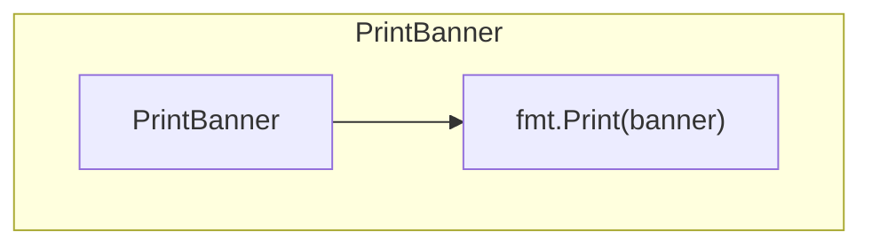

---

#### Function dependencies

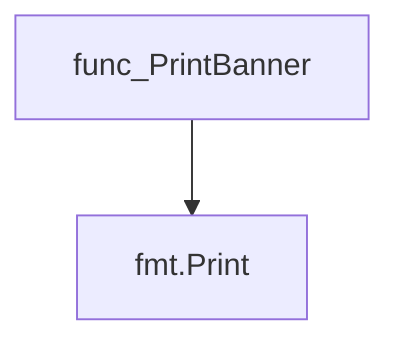

---

#### Functions calling `PrintBanner`

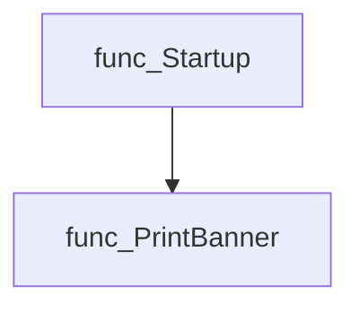

---

#### Usage example (Go)

```go
// Minimal example invoking PrintBanner
package main

import (
    "github.com/redhat-best-practices-for-k8s/certsuite/internal/cli"
)

func main() {
    cli.PrintBanner()
}
```

---

### PrintCheckAborted

**PrintCheckAborted** - Signals that a compliance check has been aborted and displays the check name along with an optional reason.


#### Signature (Go)
```go
func(string, string)()
```

#### Summary Table
| Aspect | Details |
|--------|---------|
| **Purpose** | Signals that a compliance check has been aborted and displays the check name along with an optional reason. |
| **Parameters** | `checkName string` – Identifier of the check; <br>`reason string` – Explanation for the abortion (may be empty). |
| **Return value** | None (void). |
| **Key dependencies** | • Calls `stopCheckLineGoroutine()` to halt any ongoing line‑printing goroutine.<br>• Uses `fmt.Print` to output a formatted message. |
| **Side effects** | Stops the check‑line goroutine, writes text to standard output, and may alter global channel state (`stopChan`). |
| **How it fits the package** | Part of the internal CLI utilities that report check results; invoked when a check terminates prematurely. |

#### Internal workflow
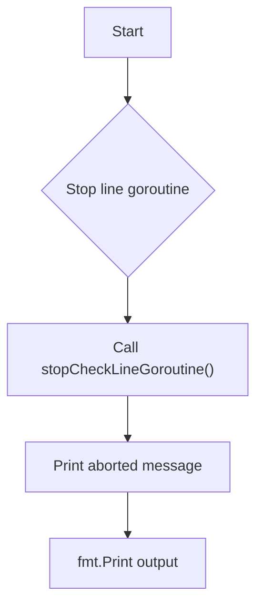

#### Function dependencies
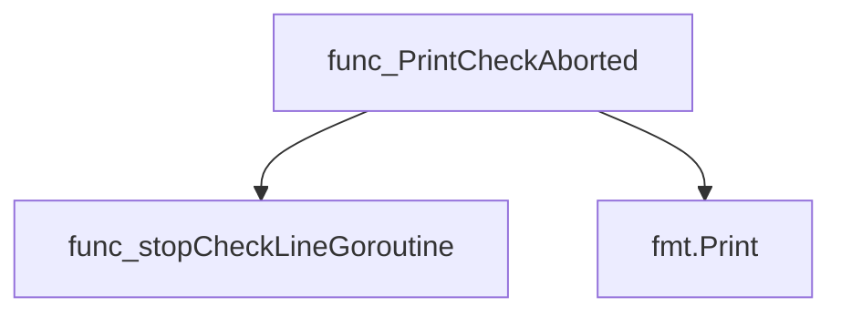

#### Functions calling `PrintCheckAborted`
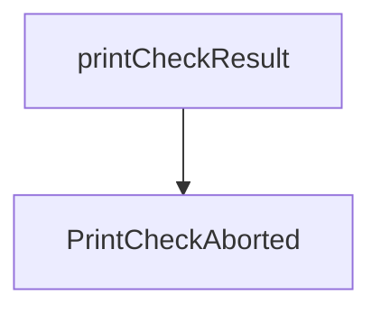

#### Usage example (Go)
```go
// Minimal example invoking PrintCheckAborted
func main() {
    cli.PrintCheckAborted("example-check", "timeout reached")
}
```

---

### PrintCheckErrored

**PrintCheckErrored** - Signals that a specific check has finished with an error, stops any ongoing line‑printing goroutine, and outputs a formatted message to the console.


#### Signature (Go)
```go
func PrintCheckErrored(checkName string) 
```

#### Summary Table
| Aspect | Details |
|--------|---------|
| **Purpose** | Signals that a specific check has finished with an error, stops any ongoing line‑printing goroutine, and outputs a formatted message to the console. |
| **Parameters** | `checkName` string – Identifier of the check that failed. |
| **Return value** | None |
| **Key dependencies** | • Calls `stopCheckLineGoroutine()` to terminate any spinner or progress line.<br>• Uses `fmt.Print` (via `Print`) to write the error message. |
| **Side effects** | • Stops a goroutine that updates the console line.<br>• Writes an error status line to standard output. |
| **How it fits the package** | Part of the CLI helper set for displaying check results; called by the checks database when a check ends in `CheckResultError`. |

#### Internal workflow (Mermaid)
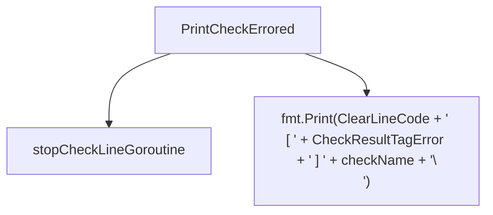

#### Function dependencies (Mermaid)
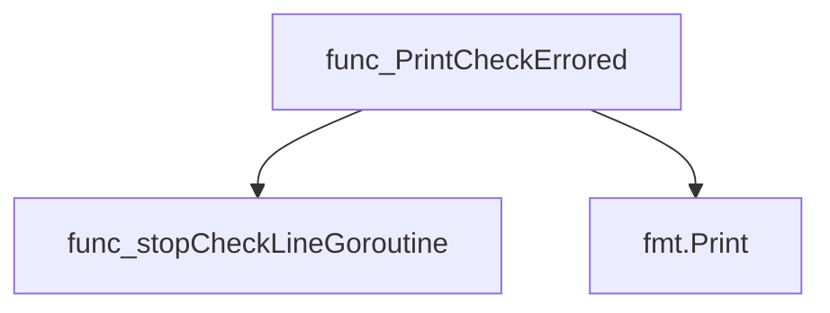

#### Functions calling `PrintCheckErrored` (Mermaid)
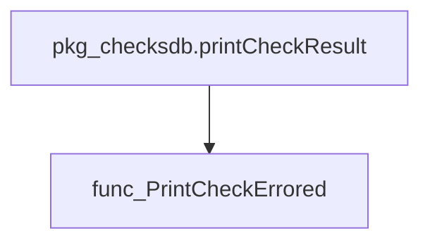

#### Usage example (Go)
```go
// Minimal example invoking PrintCheckErrored
package main

import (
	"github.com/redhat-best-practices-for-k8s/certsuite/internal/cli"
)

func main() {
	cli.PrintCheckErrored("example-check")
}
```

---

### PrintCheckFailed

**PrintCheckFailed** - Terminates the background line‑printing goroutine and outputs a formatted failure message for the given check.


#### Signature (Go)

```go
func PrintCheckFailed(checkName string)()
```

#### Summary Table

| Aspect | Details |
|--------|---------|
| **Purpose** | Terminates the background line‑printing goroutine and outputs a formatted failure message for the given check. |
| **Parameters** | `checkName` – the identifier of the failed check (string). |
| **Return value** | None (`void`). |
| **Key dependencies** | • `stopCheckLineGoroutine()` – stops the auxiliary goroutine that updates the progress line.<br>• `fmt.Print()` – writes the final failure message to standard output. |
| **Side effects** | • Sends a stop signal via `stopChan` and clears it.<br>• Prints a new line containing `[ ✘ ] <checkName>` with ANSI clear‑line control codes. |
| **How it fits the package** | Part of the CLI printing utilities; invoked by the checks database layer when a check result is marked as failed. |

#### Internal workflow (Mermaid)

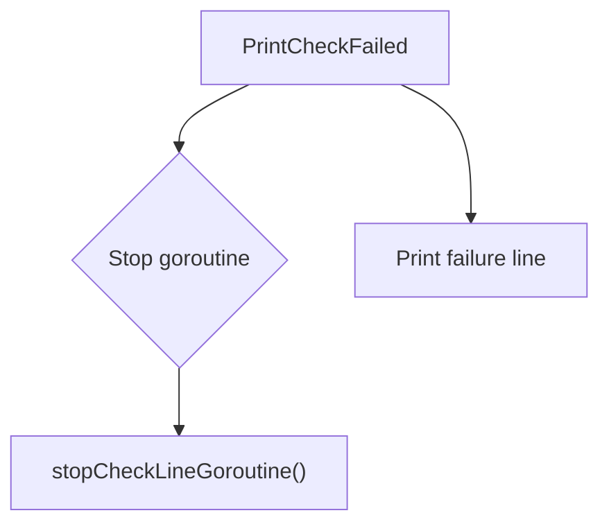

#### Function dependencies (Mermaid)

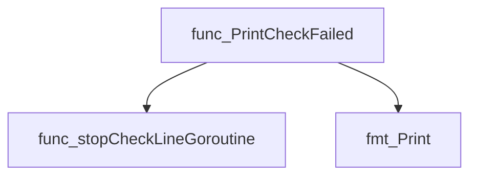

#### Functions calling `PrintCheckFailed` (Mermaid)

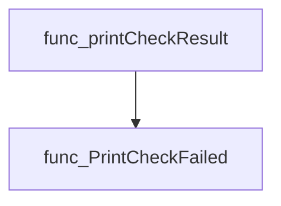

#### Usage example (Go)

```go
// Minimal example invoking PrintCheckFailed
package main

import (
	"github.com/redhat-best-practices-for-k8s/certsuite/internal/cli"
)

func main() {
	cli.PrintCheckFailed("KubeletRunning")
}
```

---

### PrintCheckPassed

**PrintCheckPassed** - Displays a “passed” status for the given check name, prefixed by a clear‑line escape code and a pass tag. It also signals any running line‑progress goroutine to terminate.


Prints a formatted message indicating that a check has passed and stops the line‑progress goroutine.

---

#### Signature (Go)

```go
func PrintCheckPassed(checkName string)
```

---

#### Summary Table

| Aspect | Details |
|--------|---------|
| **Purpose** | Displays a “passed” status for the given check name, prefixed by a clear‑line escape code and a pass tag. It also signals any running line‑progress goroutine to terminate. |
| **Parameters** | `checkName string` – Identifier of the check that has passed. |
| **Return value** | None. |
| **Key dependencies** | • `stopCheckLineGoroutine()` – stops the background progress indicator.<br>• `fmt.Print` – writes the formatted output to stdout. |
| **Side effects** | • Sends a stop signal on the `stopChan` channel, then clears it.<br>• Prints to standard output (console). |
| **How it fits the package** | Part of the internal CLI utilities that render check results; invoked by higher‑level logic when a check finishes successfully. |

---

#### Internal workflow

```mermaid
flowchart TD
  A["PrintCheckPassed"] --> B{"stopCheckLineGoroutine()"}
  B --> C["Send true on stopChan"]
  C --> D["Set stopChan = nil"]
  A --> E["fmt.Print(formatted message)"]
```

---

#### Function dependencies

```mermaid
graph TD
  func_PrintCheckPassed --> func_stopCheckLineGoroutine
  func_PrintCheckPassed --> fmt_Print
```

---

#### Functions calling `PrintCheckPassed`

```mermaid
graph TD
  func_printCheckResult --> func_PrintCheckPassed
```

---

#### Usage example (Go)

```go
// Minimal example invoking PrintCheckPassed
package main

import (
	"github.com/redhat-best-practices-for-k8s/certsuite/internal/cli"
)

func main() {
	cli.PrintCheckPassed("example-check-id")
}
```

---

### PrintCheckRunning

**PrintCheckRunning** - Outputs the initial “running” message for a check and launches a background goroutine that periodically updates this line with timing or log information.


#### Signature (Go)
```go
func PrintCheckRunning(checkName string) ()
```

#### Summary Table
| Aspect | Details |
|--------|---------|
| **Purpose** | Outputs the initial “running” message for a check and launches a background goroutine that periodically updates this line with timing or log information. |
| **Parameters** | `checkName string` – Identifier of the check to display. |
| **Return value** | None (void). |
| **Key dependencies** | • `make` – creates two channels (`stopChan`, `checkLoggerChan`).  <br>• `isTTY()` – determines if output is a terminal. <br>• `fmt.Print` – writes the initial line to stdout. <br>• `updateRunningCheckLine` – background goroutine that refreshes the running line. |
| **Side effects** | • Creates global channels (`stopChan`, `checkLoggerChan`).  <br>• Writes directly to standard output.  <br>• Spawns a goroutine that may run until signaled via `stopChan`. |
| **How it fits the package** | Part of the CLI helper functions that provide user‑facing status updates during check execution. It is invoked by `Check.Run` before the actual check logic begins. |

#### Internal workflow (Mermaid)
```mermaid
flowchart TD
  A["Start PrintCheckRunning"] --> B{"Create Channels"}
  B --> C["Build line string"]
  C --> D{"TTY?"}
  D -- yes --> E["Print line"]
  D -- no --> F["Append newline, Print line"]
  E --> G["Launch updateRunningCheckLine goroutine"]
  F --> G
```

#### Function dependencies (Mermaid)
```mermaid
graph TD
  func_PrintCheckRunning --> make
  func_PrintCheckRunning --> isTTY
  func_PrintCheckRunning --> fmt.Print
  func_PrintCheckRunning --> func_updateRunningCheckLine
```

#### Functions calling `PrintCheckRunning` (Mermaid)
```mermaid
graph TD
  func_Check_Run --> func_PrintCheckRunning
```

#### Usage example (Go)
```go
// Minimal example invoking PrintCheckRunning
package main

import (
	"github.com/redhat-best-practices-for-k8s/certsuite/internal/cli"
)

func main() {
	cli.PrintCheckRunning("example-check")
	// The function returns immediately; the status line will be updated by a goroutine.
}
```

---

### PrintCheckSkipped

**PrintCheckSkipped** - Reports that a check was skipped and displays the skip reason.


Prints a message indicating that a check has been skipped along with the reason.

---

#### Signature (Go)

```go
func PrintCheckSkipped(checkName, reason string)
```

---

#### Summary Table

| Aspect | Details |
|--------|---------|
| **Purpose** | Reports that a check was skipped and displays the skip reason. |
| **Parameters** | `checkName` – identifier of the check; `reason` – explanation for skipping. |
| **Return value** | None (void). |
| **Key dependencies** | • Calls `stopCheckLineGoroutine()` to terminate any line‑printing goroutine.<br>• Uses `fmt.Print` with ANSI escape codes (`ClearLineCode`, `CheckResultTagSkip`). |
| **Side effects** | • Emits output to standard out.<br>• Stops a goroutine that prints progress lines. |
| **How it fits the package** | Part of the CLI helper set; invoked by higher‑level check reporting logic when a check is skipped. |

---

#### Internal workflow (Mermaid)

```mermaid
flowchart TD
  A["Start"] --> B{"Check skip reason?"}
  B --> C["Stop line goroutine"]
  C --> D["Print SKIP + checkName + (reason)"]
```

---

#### Function dependencies (Mermaid)

```mermaid
graph TD
  func_PrintCheckSkipped --> func_stopCheckLineGoroutine
  func_PrintCheckSkipped --> fmt.Print
```

---

#### Functions calling `PrintCheckSkipped` (Mermaid)

```mermaid
graph TD
  func_printCheckResult --> func_PrintCheckSkipped
```

---

#### Usage example (Go)

```go
// Minimal example invoking PrintCheckSkipped
package main

import (
    "github.com/redhat-best-practices-for-k8s/certsuite/internal/cli"
)

func main() {
    cli.PrintCheckSkipped("check-123", "no relevant objects found")
}
```

---

### PrintResultsTable

**PrintResultsTable** - Outputs a human‑readable table summarizing the number of passed, failed, and skipped checks per test suite.


#### Signature (Go)

```go
func PrintResultsTable(results map[string][]int)
```

#### Summary Table

| Aspect | Details |
|--------|---------|
| **Purpose** | Outputs a human‑readable table summarizing the number of passed, failed, and skipped checks per test suite. |
| **Parameters** | `results` – mapping from suite name to a slice containing `[passed, failed, skipped]` counts. |
| **Return value** | None (void). |
| **Key dependencies** | * `fmt.Printf` – for formatted lines.<br>* `fmt.Println` – for separator lines. |
| **Side effects** | Writes directly to standard output; no state changes within the package. |
| **How it fits the package** | Used by the CLI layer after all checks have run to present a concise results table to the user. |

#### Internal workflow (Mermaid)

```mermaid
flowchart TD
  A["Start"] --> B["Print empty line"]
  B --> C["Print header separator"]
  C --> D["Print column titles"]
  D --> E["Print header separator"]
  E --> F{"Iterate over results"}
  F --> G["Print suite row"]
  G --> H["Print separator"]
  H --> I["End of loop"]
  I --> J["Print empty line"]
```

#### Function dependencies (Mermaid)

```mermaid
graph TD
  func_PrintResultsTable --> fmt.Printf
  func_PrintResultsTable --> fmt.Println
```

#### Functions calling `PrintResultsTable` (Mermaid)

```mermaid
graph TD
  func_RunChecks --> func_PrintResultsTable
```

#### Usage example (Go)

```go
// Minimal example invoking PrintResultsTable
package main

import (
    "github.com/redhat-best-practices-for-k8s/certsuite/internal/cli"
)

func main() {
    // Example result set: suite → [passed, failed, skipped]
    results := map[string][]int{
        "Network Checks": {12, 1, 0},
        "Security Checks": {9, 3, 2},
    }

    cli.PrintResultsTable(results)
}
```

---

### WrapLines

**WrapLines** - Splits an arbitrary text block into multiple lines so that each line does not exceed `maxWidth` characters. It preserves existing line breaks and wraps long words by splitting on whitespace.


#### Signature (Go)
```go
func WrapLines(text string, maxWidth int) []string
```

#### Summary Table
| Aspect | Details |
|--------|---------|
| **Purpose** | Splits an arbitrary text block into multiple lines so that each line does not exceed `maxWidth` characters. It preserves existing line breaks and wraps long words by splitting on whitespace. |
| **Parameters** | `text string – the raw text to wrap`<br>`maxWidth int – maximum allowed width per line` |
| **Return value** | `[]string – slice of wrapped lines` |
| **Key dependencies** | • `strings.Split`<br>• `make`<br>• `len` (multiple calls)<br>• `append` (multiple calls)<br>• `strings.Fields` |
| **Side effects** | None. The function is pure; it only reads its arguments and returns a new slice. |
| **How it fits the package** | Used by CLI utilities to format long descriptions, remediation steps, or other multiline strings for display in a terminal table. |

#### Internal workflow (Mermaid)
```mermaid
flowchart TD
  A["Start"] --> B{"Split input on `\n`"}
  B --> C{"For each line"}
  C --> D{"Line length ≤ maxWidth?"}
  D -- Yes --> E["Append original line to result"]
  D -- No --> F{"Tokenize with Fields()"}
  F --> G{"Iterate words"}
  G --> H{"Current line + word + space ≤ maxWidth?"}
  H -- Yes --> I["Add word to currentLine"]
  H -- No --> J["Append currentLine, start new line with word"]
  J --> G
  G --> K["After loop: append last currentLine"]
  K --> C
  E --> C
  C --> L["Return result"]
```

#### Function dependencies (Mermaid)
```mermaid
graph TD
  func_WrapLines --> strings.Split
  func_WrapLines --> make
  func_WrapLines --> len
  func_WrapLines --> append
  func_WrapLines --> strings.Fields
```

#### Functions calling `WrapLines` (Mermaid)
```mermaid
graph TD
  func_printTestCaseInfoBox --> func_WrapLines
```

#### Usage example (Go)
```go
// Minimal example invoking WrapLines
package main

import (
	"fmt"

	"github.com/redhat-best-practices-for-k8s/certsuite/internal/cli"
)

func main() {
	text := "This is a long line that will be wrapped into multiple lines of maximum width."
	lines := cli.WrapLines(text, 20)
	for _, l := range lines {
		fmt.Println(l)
	}
}
```

---

### cliCheckLogSniffer.Write

**Write** - Provides an `io.Write` implementation that forwards log messages to a channel when running in a terminal, otherwise silently discards them.


#### Signature (Go)

```go
func (c *cliCheckLogSniffer) Write(p []byte) (n int, err error)
```

#### Summary Table

| Aspect | Details |
|--------|---------|
| **Purpose** | Provides an `io.Write` implementation that forwards log messages to a channel when running in a terminal, otherwise silently discards them. |
| **Parameters** | `p []byte – the data to write (log message)` |
| **Return value** | `n int – number of bytes processed (always len(p))<br>err error – always nil` |
| **Key dependencies** | • `isTTY()` – checks terminal status<br>• `len(p)` – byte length calculation<br>• `string(p)` – conversion to string for channel transmission |
| **Side effects** | Writes a string representation of `p` into the global `checkLoggerChan` if it is ready; otherwise does nothing. Does not block the caller. No state changes on `c`. |
| **How it fits the package** | Enables the CLI component to capture and forward log output from the `slog` logger to a dedicated channel used by the checks subsystem, while avoiding I/O overhead in non‑TTY environments. |

#### Internal workflow (Mermaid)

```mermaid
flowchart TD
  subgraph CheckWriter["cliCheckLogSniffer.Write"]
    A["Start"] --> B{"isTTY?"}
    B -- No --> C["Return len(p), nil"]
    B -- Yes --> D["Attempt to send string(p) on checkLoggerChan (non‑blocking)"]
    D --> E["Return len(p), nil"]
  end
```

#### Function dependencies (Mermaid)

```mermaid
graph TD
  func_cliCheckLogSniffer.Write --> func_isTTY
  func_cliCheckLogSniffer.Write --> func_len
  func_cliCheckLogSniffer.Write --> func_string
```

#### Functions calling `cliCheckLogSniffer.Write` (Mermaid)

None – this function is currently not referenced elsewhere in the package.

#### Usage example (Go)

```go
// Minimal example invoking cliCheckLogSniffer.Write
package main

import (
	"fmt"
	"github.com/redhat-best-practices-for-k8s/certsuite/internal/cli"
)

func main() {
	var sniffer cli.CliCheckLogSniffer // assume exported constructor or zero value
	data := []byte("example log message")
	n, err := sniffer.Write(data)
	if err != nil {
		fmt.Println("write error:", err)
	}
	fmt.Printf("Wrote %d bytes\n", n)
}
```

---

## Local Functions

### cropLogLine

**cropLogLine** - Removes new‑line characters from the supplied `line` and truncates it so that its length does not exceed `maxAvailableWidth`.


#### Signature (Go)
```go
func cropLogLine(line string, maxAvailableWidth int) string
```

#### Summary Table
| Aspect | Details |
|--------|---------|
| **Purpose** | Removes new‑line characters from the supplied `line` and truncates it so that its length does not exceed `maxAvailableWidth`. |
| **Parameters** | `line` (string) – raw log output; <br>`maxAvailableWidth` (int) – maximum number of printable characters allowed. |
| **Return value** | A sanitized string that fits within the specified width. |
| **Key dependencies** | • `strings.ReplaceAll` (to strip line feeds)<br>• Built‑in `len` function |
| **Side effects** | None; purely functional. |
| **How it fits the package** | Used by `printRunningCheckLine` to display a concise, single‑line log fragment when terminal width is limited. |

#### Internal workflow (Mermaid)
```mermaid
flowchart TD
  A(Start) --> B{"Remove newlines"}
  B --> C["filteredLine := strings.ReplaceAll(line,\\n, )"]
  C --> D{"Length check"}
  D -->|"len(filteredLine)>maxAvailableWidth"| E["Return first maxAvailableWidth chars"]
  D -->|"else"| F["Return filteredLine"]
  E --> G(End)
  F --> G
```

#### Function dependencies (Mermaid)
```mermaid
graph TD
  func_cropLogLine --> func_ReplaceAll
  func_cropLogLine --> func_len
```

#### Functions calling `cropLogLine` (Mermaid)
```mermaid
graph TD
  func_printRunningCheckLine --> func_cropLogLine
```

#### Usage example (Go)
```go
// Minimal example invoking cropLogLine
package main

import (
	"fmt"
)

func main() {
	log := "This is a very long log line that might not fit."
	cropped := cropLogLine(log, 30)
	fmt.Println(cropped) // Output: "This is a very long log li"
}
```

---

### getTerminalWidth

**getTerminalWidth** - Obtains the width of the terminal window in columns, allowing other functions to format output appropriately.


#### Signature (Go)

```go
func() int
```

#### Summary Table

| Aspect | Details |
|--------|---------|
| **Purpose** | Obtains the width of the terminal window in columns, allowing other functions to format output appropriately. |
| **Parameters** | None |
| **Return value** | `int` – number of columns available in the current terminal; returns zero if an error occurs during size retrieval (implicitly handled by `term.GetSize`). |
| **Key dependencies** | • `golang.org/x/term.GetSize(int)` <br>• `os.Stdin.Fd()` <br>• Type conversion to `int` |
| **Side effects** | No state mutation; performs a system call to query terminal size. |
| **How it fits the package** | Used by CLI formatting helpers (e.g., `printRunningCheckLine`) to adapt output width when running in an interactive terminal. |

#### Internal workflow

```mermaid
flowchart TD
  A["Start"] --> B{"Retrieve FD"}
  B --> C["Convert FD to int"]
  C --> D["Call term.GetSize(width, height)"]
  D --> E["Return width"]
```

#### Function dependencies

```mermaid
graph TD
  func_getTerminalWidth --> golang.org/x/term.GetSize
  func_getTerminalWidth --> int
  func_getTerminalWidth --> os.Stdin.Fd
```

#### Functions calling `getTerminalWidth`

```mermaid
graph TD
  func_printRunningCheckLine --> func_getTerminalWidth
```

#### Usage example (Go)

```go
// Minimal example invoking getTerminalWidth
func main() {
    width := getTerminalWidth()
    fmt.Printf("Current terminal width: %d columns\n", width)
}
```

---

### isTTY

**isTTY** - Returns true if the program’s stdin is a terminal (tty/ptty), false otherwise.

Detects whether the current process’s standard input is attached to a terminal.

```go
func isTTY() bool
```

| Aspect | Details |
|--------|---------|
| **Purpose** | Returns true if the program’s stdin is a terminal (tty/ptty), false otherwise. |
| **Parameters** | None |
| **Return value** | `bool` – `true` when stdin is a terminal, `false` otherwise. |
| **Key dependencies** | *`golang.org/x/term.IsTerminal`* – checks terminal status.<br>*`os.Stdin.Fd()`* – obtains file descriptor of stdin.<br>*`int` conversion* – converts the file descriptor to an integer for the API call. |
| **Side effects** | None – purely introspective. |
| **How it fits the package** | Used by various CLI helpers to adjust output formatting (e.g., line clearing, progress updates) when running in a terminal versus non‑terminal environments. |

#### Internal workflow
```mermaid
flowchart TD
  A["Call os.Stdin.Fd()"] --> B["int conversion"]
  B --> C["term.IsTerminal(int(os.Stdin.Fd()))"]
  C --> D["Return bool"]
```

#### Function dependencies
```mermaid
graph TD
  func_isTTY --> term_IsTerminal
  func_isTTY --> int_conversion
  func_isTTY --> os_Stdin_Fd
```

#### Functions calling `isTTY`
```mermaid
graph TD
  PrintCheckRunning --> isTTY
  cliCheckLogSniffer_Write --> isTTY
  printRunningCheckLine --> isTTY
  updateRunningCheckLine --> isTTY
```

#### Usage example (Go)
```go
// Minimal example invoking isTTY
package main

import (
	"fmt"
)

func main() {
	if isTTY() {
		fmt.Println("Running in a terminal")
	} else {
		fmt.Println("Not running in a terminal")
	}
}
```

---

### printRunningCheckLine

**printRunningCheckLine** - Renders a line to the terminal showing a running check’s name, elapsed time and, if space permits, its most recent log message. It handles both TTY (interactive) and non‑TTY environments.


```go
func printRunningCheckLine(checkName string, startTime time.Time, logLine string) ()
```

| Aspect | Details |
|--------|---------|
| **Purpose** | Renders a line to the terminal showing a running check’s name, elapsed time and, if space permits, its most recent log message. It handles both TTY (interactive) and non‑TTY environments. |
| **Parameters** | `checkName string` – Identifier of the check.<br>`startTime time.Time` – Time when the check started.<br>`logLine string` – Latest log entry produced by the check. |
| **Return value** | None (`()`); the function writes directly to standard output. |
| **Key dependencies** | • `time.Since`, `Round(time.Second)`<br>• `isTTY()`, `getTerminalWidth()`<br>• `cropLogLine(line, width)`<br>• `fmt.Print` and terminal control codes (`ClearLineCode`) |
| **Side effects** | Prints to `os.Stdout`; may clear the current line before printing. Does not modify any external state. |
| **How it fits the package** | Used by `updateRunningCheckLine` to refresh the CLI display while a check is executing, providing real‑time feedback to the user. |

#### Internal workflow (Mermaid)

```mermaid
flowchart TD
  A["Start"] --> B{"isTTY?"}
  B -- No --> C["Print line + newline"]
  B -- Yes --> D["Compute elapsedTime"]
  D --> E["Build base line"]
  E --> F{"logLine non‑empty & space available?"}
  F -- No --> G["Print cleared line with base"]
  F -- Yes --> H["Crop logLine"]
  H --> I["Append cropped logLine to base"]
  I --> G
```

#### Function dependencies (Mermaid)

```mermaid
graph TD
  func_printRunningCheckLine --> Round
  func_printRunningCheckLine --> time.Since
  func_printRunningCheckLine --> fmt.Print
  func_printRunningCheckLine --> isTTY
  func_printRunningCheckLine --> getTerminalWidth
  func_printRunningCheckLine --> len
  func_printRunningCheckLine --> cropLogLine
```

#### Functions calling `printRunningCheckLine` (Mermaid)

```mermaid
graph TD
  updateRunningCheckLine --> printRunningCheckLine
```

#### Usage example (Go)

```go
// Minimal example invoking printRunningCheckLine
package main

import (
	"time"

	"github.com/redhat-best-practices-for-k8s/certsuite/internal/cli"
)

func main() {
	start := time.Now()
	checkName := "ValidateCertificates"
	logMsg := "Checking certificate chain..."
	cli.printRunningCheckLine(checkName, start, logMsg)
}
```

---

### stopCheckLineGoroutine

**stopCheckLineGoroutine** - Signals the goroutine that prints a moving “checking…” line to terminate and disables the channel used for this purpose.


#### Signature (Go)

```go
func stopCheckLineGoroutine()
```

#### Summary Table

| Aspect | Details |
|--------|---------|
| **Purpose** | Signals the goroutine that prints a moving “checking…” line to terminate and disables the channel used for this purpose. |
| **Parameters** | *none* |
| **Return value** | *none* |
| **Key dependencies** | - Global variable `stopChan` (a `chan bool`)  <br>- Standard Go channel operations |
| **Side effects** | Sends a `true` value on `stopChan`, then sets the global to `nil`, preventing further sends and allowing the goroutine to exit. |
| **How it fits the package** | Invoked by various `PrintCheck*` helper functions to cleanly stop the animated line when a check finishes or is aborted. |

#### Internal workflow (Mermaid)

```mermaid
flowchart TD
  A["Start"] --> B{"stopChan == nil?"}
  B -- Yes --> C["Return"]
  B -- No --> D["Send true on stopChan"]
  D --> E["Set stopChan = nil"]
  E --> F["End"]
```

#### Function dependencies (Mermaid)

None – this function is currently not referenced elsewhere in the package.

```mermaid
graph TD
  func_stopCheckLineGoroutine
```

#### Functions calling `stopCheckLineGoroutine` (Mermaid)

```mermaid
graph TD
  func_PrintCheckAborted --> func_stopCheckLineGoroutine
  func_PrintCheckErrored --> func_stopCheckLineGoroutine
  func_PrintCheckFailed --> func_stopCheckLineGoroutine
  func_PrintCheckPassed --> func_stopCheckLineGoroutine
  func_PrintCheckSkipped --> func_stopCheckLineGoroutine
```

#### Usage example (Go)

```go
// The function is unexported; it is called internally by the CLI package.
// A direct call would look like this if we were inside the same package:

func example() {
    // ... some check logic ...
    stopCheckLineGoroutine() // stops the progress line goroutine
}
```

---

### updateRunningCheckLine

**updateRunningCheckLine** - Continuously refreshes a status line in the terminal to show elapsed time and the most recent log message for an ongoing check.


#### Signature (Go)
```go
func(string, <-chan bool)()
```

#### Summary Table
| Aspect | Details |
|--------|---------|
| **Purpose** | Continuously refreshes a status line in the terminal to show elapsed time and the most recent log message for an ongoing check. |
| **Parameters** | `checkName string` – name of the check being executed.<br>`stopChan <-chan bool` – channel used to signal termination of the update loop. |
| **Return value** | None (the function blocks until a stop signal is received). |
| **Key dependencies** | • `time.Now()`<br>• `isTTY()`<br>• `time.NewTicker()`<br>• `printRunningCheckLine(checkName, startTime, lastCheckLogLine)`<br>• Global channel `checkLoggerChan` (receives log lines) |
| **Side effects** | • Writes to standard output via `fmt.Print` inside `printRunningCheckLine`.<br>• Stops the ticker and exits on receiving a value from `stopChan`. |
| **How it fits the package** | Used by `PrintCheckRunning` to provide live feedback during long-running checks. It keeps the terminal line updated without cluttering output when not in a TTY. |

#### Internal workflow (Mermaid)
```mermaid
flowchart TD
  start["Start"] --> init{"Initialize"}
  init --> timer["Ticker created"]
  loop{"Select"}
  loop --> case1{"Timer tick"}
  case1 --> update1["printRunningCheckLine with last line"]
  loop --> case2{"New log line"}
  case2 --> update2["Update lastCheckLogLine"]
  update2 --> update1
  loop --> case3{"Stop signal"}
  case3 --> stop["Stop ticker & return"]
```

#### Function dependencies (Mermaid)
```mermaid
graph TD
  func_updateRunningCheckLine --> time.Now
  func_updateRunningCheckLine --> isTTY
  func_updateRunningCheckLine --> time.NewTicker
  func_updateRunningCheckLine --> printRunningCheckLine
  func_updateRunningCheckLine --> checkLoggerChan
```

#### Functions calling `updateRunningCheckLine` (Mermaid)
```mermaid
graph TD
  PrintCheckRunning --> func_updateRunningCheckLine
```

#### Usage example (Go)
```go
// Minimal example invoking updateRunningCheckLine
func main() {
    stop := make(chan bool)

    // Start the updater in a goroutine
    go updateRunningCheckLine("Example Check", stop)

    // Simulate some work and send log lines
    time.Sleep(3 * time.Second)
    checkLoggerChan <- "Still working..."

    // Finish after 5 seconds
    time.Sleep(2 * time.Second)
    stop <- true
}
```

---

