# Package clientsholder

**Path**: `internal/clientsholder`

## Table of Contents

- [Overview](#overview)
- [Structs](#structs)
  - [ClientsHolder](#clientsholder)
  - [CommandMock](#commandmock)
  - [Context](#context)
- [Interfaces](#interfaces)
  - [Command](#command)
- [Exported Functions](#exported-functions)
  - [ClearTestClientsHolder](#cleartestclientsholder)
  - [ClientsHolder.ExecCommandContainer](#clientsholder.execcommandcontainer)
  - [CommandMock.ExecCommandContainer](#commandmock.execcommandcontainer)
  - [CommandMock.ExecCommandContainerCalls](#commandmock.execcommandcontainercalls)
  - [Context.GetContainerName](#context.getcontainername)
  - [Context.GetNamespace](#context.getnamespace)
  - [Context.GetPodName](#context.getpodname)
  - [GetClientConfigFromRestConfig](#getclientconfigfromrestconfig)
  - [GetClientsHolder](#getclientsholder)
  - [GetNewClientsHolder](#getnewclientsholder)
  - [GetTestClientsHolder](#gettestclientsholder)
  - [NewContext](#newcontext)
  - [SetTestClientGroupResources](#settestclientgroupresources)
  - [SetTestK8sClientsHolder](#settestk8sclientsholder)
  - [SetTestK8sDynamicClientsHolder](#settestk8sdynamicclientsholder)
  - [SetupFakeOlmClient](#setupfakeolmclient)
- [Local Functions](#local-functions)
  - [createByteArrayKubeConfig](#createbytearraykubeconfig)
  - [getClusterRestConfig](#getclusterrestconfig)
  - [newClientsHolder](#newclientsholder)

## Overview

Provides a central holder for all Kubernetes and OpenShift client interfaces, utilities for executing commands inside pod containers, and helpers to create fake clients for unit testing.

### Key Features

- Aggregates dynamic, core, API‑extension, OLM, and networking clients into a single struct that can be lazily initialized from kubeconfig or in‑cluster config
- Executes shell commands inside a specified container via the Kubernetes remote‑command API, returning stdout and error streams
- Offers functions to construct fully populated fake client sets for isolated testing of client interactions

### Design Notes

- ClientsHolder is lazily instantiated; GetClientsHolder creates it on first call and caches it for reuse
- Thread safety is ensured with mutexes around command mocks and holder initialization; however, the holder itself is not concurrent‑write safe after creation
- When running tests, SetTestK8sClientsHolder or NewTestClientsHolder should be used to inject fake clients; real cluster interactions are avoided

### Structs Summary

| Name | Purpose |
|------|----------|
| [**ClientsHolder**](#clientsholder) | Holds all Kubernetes client interfaces and related configuration |
| [**CommandMock**](#commandmock) | One-line purpose |
| [**Context**](#context) | One-line purpose |

### Exported Functions Summary

| Name | Purpose |
|------|----------|
| [func ClearTestClientsHolder()](#cleartestclientsholder) | Resets the global clients holder by clearing its Kubernetes client reference and marking it as not ready. |
| [func (clientsholder *ClientsHolder) ExecCommandContainer(ctx Context, command string) (stdout, stderr string, err error)](#clientsholder.execcommandcontainer) | Runs a shell command inside the container identified by `ctx` and captures its standard output and error streams. |
| [func (mock *CommandMock) ExecCommandContainer(context Context, s string) (string, string, error)](#commandmock.execcommandcontainer) | Stores invocation details of `ExecCommandContainer` and delegates execution to the supplied mock function. |
| [func (mock *CommandMock) ExecCommandContainerCalls() []struct {     Context Context     S       string }](#commandmock.execcommandcontainercalls) | Returns a slice containing all recorded calls to `ExecCommandContainer` made on the mock instance. Each entry holds the execution context and the command string supplied during that call. |
| [func (c *Context) GetContainerName() string](#context.getcontainername) | Returns the name of the container associated with the current execution context. This value is used when executing commands inside a pod via Kubernetes API calls. |
| [func (c *Context) GetNamespace() string](#context.getnamespace) | Returns the Kubernetes namespace associated with the receiver `Context`. This value is used by other client‑side functions to target API calls within a specific namespace. |
| [func (c *Context) GetPodName() string](#context.getpodname) | Returns the pod name associated with the context. |
| [func GetClientConfigFromRestConfig(restConfig *rest.Config) *clientcmdapi.Config](#getclientconfigfromrestconfig) | Builds a `clientcmdapi.Config` object that represents a kubeconfig file, derived from an existing `*rest.Config`. This allows code that expects a kubeconfig to use the in‑cluster configuration. |
| [func GetClientsHolder(filenames ...string) *ClientsHolder](#getclientsholder) | Returns a global, lazily‑initialized `*ClientsHolder` that aggregates Kubernetes API clients. If the holder is not yet ready, it is created via `newClientsHolder`. |
| [func GetNewClientsHolder(kubeconfigFile string) *ClientsHolder](#getnewclientsholder) | Instantiates and returns a `*ClientsHolder` populated with Kubernetes clients based on the supplied kubeconfig file. If creation fails, it terminates the process via logging. |
| [func GetTestClientsHolder(k8sMockObjects []runtime.Object) *ClientsHolder](#gettestclientsholder) | Builds a `ClientsHolder` populated with fake Kubernetes clients that expose only the supplied runtime objects, facilitating isolated unit testing. |
| [func NewContext(namespace, podName, containerName string) Context](#newcontext) | Builds and returns a `Context` value that encapsulates the namespace, pod name, and container name needed for subsequent command executions against a probe pod. |
| [func SetTestClientGroupResources(groupResources []*metav1.APIResourceList)](#settestclientgroupresources) | Stores a slice of API resource lists into the package’s client holder, enabling test clients to reference available Kubernetes group resources. |
| [func SetTestK8sClientsHolder(kubernetes.Interface)](#settestk8sclientsholder) | Stores the supplied Kubernetes client in the package‑wide `clientsHolder` and marks it as ready, enabling test code to use a fake or mock client. |
| [func SetTestK8sDynamicClientsHolder(dynamicClient dynamic.Interface)](#settestk8sdynamicclientsholder) | Sets the internal `DynamicClient` of the global `clientsHolder` to a supplied test client and marks it as ready. |
| [func SetupFakeOlmClient(olmMockObjects []runtime.Object)](#setupfakeolmclient) | Replaces the real Operator‑Lifecycle‑Manager client in `clientsHolder` with a fake client that serves the supplied mock objects, enabling unit tests to exercise OLM interactions without a live cluster. |

### Local Functions Summary

| Name | Purpose |
|------|----------|
| [func createByteArrayKubeConfig(kubeConfig *clientcmdapi.Config) ([]byte, error)](#createbytearraykubeconfig) | Serialises a `*clientcmdapi.Config` into YAML‑encoded bytes for use as an in‑memory kubeconfig. |
| [func getClusterRestConfig(filenames ...string) (*rest.Config, error)](#getclusterrestconfig) | Determines the appropriate `*rest.Config` for connecting to a Kubernetes cluster. If running inside a pod it uses the in‑cluster service account; otherwise it merges one or more kubeconfig files supplied via `filenames`. The function also generates an in‑memory byte slice of the resulting kubeconfig for downstream use. |
| [func newClientsHolder(filenames ...string) (*ClientsHolder, error)](#newclientsholder) | Builds a `ClientsHolder` struct that contains all required Kubernetes and OpenShift clientsets, discovery data, scaling utilities, and networking clients. It determines whether the code is running inside or outside a cluster by obtaining an appropriate `rest.Config`. |

## Structs

### ClientsHolder

#### Fields

| Field | Type | Description |
|-------|------|-------------|
| `RestConfig` | `*rest.Config` | REST configuration used by all clients; includes server URL, authentication, and timeout. |
| `DynamicClient` | `dynamic.Interface` | Client for dynamic/unstructured Kubernetes resources. |
| `ScalingClient` | `scale.ScalesGetter` | Client to retrieve scale subresources (e.g., HorizontalPodAutoscaler). |
| `APIExtClient` | `apiextv1.Interface` | Client for CustomResourceDefinition and other API extensions. |
| `OlmClient` | `olmClient.Interface` | Operator Lifecycle Manager client for managing operators. |
| `OlmPkgClient` | `olmpkgclient.PackagesV1Interface` | OLM package client for handling operator packages. |
| `OcpClient` | `clientconfigv1.ConfigV1Interface` | OpenShift configuration client (e.g., config.openshift.io). |
| `K8sClient` | `kubernetes.Interface` | Core Kubernetes client covering all standard APIs. |
| `K8sNetworkingClient` | `networkingv1.NetworkingV1Interface` | Client for core networking resources (Services, Ingresses, etc.). |
| `CNCFNetworkingClient` | `cncfNetworkAttachmentv1.Interface` | Client for CNCF NetworkAttachmentDefinition CRD. |
| `DiscoveryClient` | `discovery.DiscoveryInterface` | Client to discover API groups and resources in the cluster. |
| `MachineCfg` | `ocpMachine.Interface` | OpenShift machine configuration client. |
| `KubeConfig` | `[]byte` | Raw kubeconfig file contents; used when constructing clients from a config file. |
| `ready` | `bool` | Indicates whether the holder has been fully initialized. |
| `GroupResources` | `[]*metav1.APIResourceList` | Cached list of all API resources known to the cluster. |
| `ApiserverClient` | `apiserverscheme.Interface` | Client for API server scheme registration (used by OLM). |

#### Purpose

`ClientsHolder` aggregates a collection of Kubernetes and OpenShift client interfaces, along with configuration data such as `RestConfig`, `KubeConfig`, and discovery information. It serves as a central access point for performing operations across multiple APIs—ranging from core Kubernetes objects to custom resources and operator lifecycle management—within the CertSuite testing framework.

#### Related functions

| Function | Purpose |
|----------|---------|
| `ExecCommandContainer` | Executes an arbitrary shell command inside a specified pod container using the holder’s `K8sClient`. |
| `GetClientsHolder` | Returns a singleton `ClientsHolder`; creates it from kubeconfig files if not already ready. |
| `GetNewClientsHolder` | Creates a fresh `ClientsHolder` based on a given kubeconfig file path, logging fatal errors on failure. |
| `GetTestClientsHolder` | Builds a mock `ClientsHolder` populated with fake clients for unit testing, filtering supplied objects by type. |
| `newClientsHolder` | Internal constructor that initializes all client interfaces from the provided kubeconfig files and sets up discovery and scaling support. |

---

---

### CommandMock

| Field | Type | Description |
|-------|------|-------------|
| `ExecCommandContainerFunc` | `func(context Context, s string) (string, string, error)` | Function that will be called when the mock’s `ExecCommandContainer` method is invoked. It allows tests to supply custom behavior for this method. |
| `calls` | `struct { ExecCommandContainer []struct{Context Context; S string} }` | Internal storage of every call made to `ExecCommandContainer`. Each entry records the arguments supplied during that call. |
| `lockExecCommandContainer` | `sync.RWMutex` | Read‑write mutex guarding concurrent access to `calls.ExecCommandContainer`. |

#### Purpose

`CommandMock` provides a test double for the `Command` interface used in the client holder package. By assigning a custom function to `ExecCommandContainerFunc`, tests can simulate various responses from the underlying command execution logic without invoking real commands. The struct also records each invocation so that tests can assert call counts and argument values via helper methods.

#### Related functions

| Function | Purpose |
|----------|---------|
| `ExecCommandContainer(context Context, s string) (string, string, error)` | Implements the mocked method; it stores the call details and forwards execution to `ExecCommandContainerFunc`. |
| `ExecCommandContainerCalls() []struct{Context Context; S string}` | Returns a snapshot of all recorded calls to `ExecCommandContainer`, enabling assertions on call history. |

---

### Context

Represents the execution context for a command that runs inside a Kubernetes pod container: the target namespace, pod name, and container name.

| Field | Type | Description |
|-------|------|-------------|
| `namespace` | `string` | Namespace in which the pod resides. Must be a valid K8s namespace identifier. |
| `podName` | `string` | Name of the pod to target. Must match an existing pod within the specified namespace. |
| `containerName` | `string` | Name of the container inside the pod where the command will execute. |

#### Purpose

The `Context` struct encapsulates all information required by client code to locate a specific container in Kubernetes and perform operations such as executing shell commands. It is created via `NewContext(namespace, podName, containerName string)` and accessed through its getter methods (`GetNamespace`, `GetPodName`, `GetContainerName`). The struct is passed to functions that interact with the Kubernetes API (e.g., `ClientsHolder.ExecCommandContainer`) or used in mock implementations for testing.

#### Related functions

| Function | Purpose |
|----------|---------|
| `NewContext(namespace, podName, containerName string) Context` | Constructs a new `Context` instance. |
| `GetNamespace() string` | Returns the namespace stored in the context. |
| `GetPodName() string` | Returns the pod name stored in the context. |
| `GetContainerName() string` | Returns the container name stored in the context. |
| `ClientsHolder.ExecCommandContainer(ctx Context, command string)` | Executes a shell command inside the container specified by `ctx`. |
| `CommandMock.ExecCommandContainer(context Context, s string)` | Mocked implementation for testing that records calls with the provided context. |

---

---

## Interfaces

### Command

<!-- DEBUG: Interface Command exists in bundle but ParsedOK=false -->
**Purpose**: go:generate moq -out command_moq.go . Command

**Methods**:

| Method | Description |
|--------|--------------|
| `ExecCommandContainer` | Method documentation |

---

## Exported Functions

### ClearTestClientsHolder

**ClearTestClientsHolder** - Resets the global clients holder by clearing its Kubernetes client reference and marking it as not ready.

#### 1) Signature (Go)

```go
func ClearTestClientsHolder()
```

#### 2) Summary Table

| Aspect | Details |
|--------|---------|
| **Purpose** | Resets the global clients holder by clearing its Kubernetes client reference and marking it as not ready. |
| **Parameters** | None |
| **Return value** | None |
| **Key dependencies** | `clientsHolder.K8sClient`, `clientsHolder.ready` |
| **Side effects** | Mutates package‑level state: sets the K8s client to `nil` and the readiness flag to `false`. |
| **How it fits the package** | Provides a clean‑up routine used during testing or reinitialisation to ensure subsequent tests start with a pristine client holder. |

#### 3) Internal workflow (Mermaid)

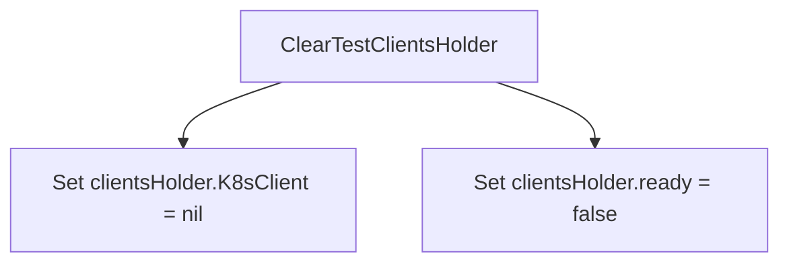

#### 4) Function dependencies (Mermaid)

None – this function is currently not referenced elsewhere in the package.

#### 5) Functions calling `ClearTestClientsHolder` (Mermaid)

None – this function is currently not referenced elsewhere in the package.

#### 6) Usage example (Go)

```go
// Minimal example invoking ClearTestClientsHolder
package main

import (
 "github.com/redhat-best-practices-for-k8s/certsuite/internal/clientsholder"
)

func main() {
 // Assume clients have been configured earlier...
 clientsholder.ClearTestClientsHolder()
}
```

---

### ClientsHolder.ExecCommandContainer

**ExecCommandContainer** - Runs a shell command inside the container identified by `ctx` and captures its standard output and error streams.

#### Signature (Go)

```go
func (clientsholder *ClientsHolder) ExecCommandContainer(ctx Context, command string) (stdout, stderr string, err error)
```

#### Summary Table

| Aspect | Details |
|--------|---------|
| **Purpose** | Runs a shell command inside the container identified by `ctx` and captures its standard output and error streams. |
| **Parameters** | `clientsholder *ClientsHolder` – receiver providing Kubernetes client configuration.<br>`ctx Context` – contains namespace, pod name, and container name.<br>`command string` – shell command to execute. |
| **Return value** | `stdout string` – captured standard output.<br>`stderr string` – captured standard error.<br>`err error` – execution or transport error (nil if successful). |
| **Key dependencies** | *`log.Debug`, `log.Error` for logging.<br>* `Context.GetNamespace()`, `.GetPodName()`, `.GetContainerName()` to build request.<br>*`strings.Join` for command string formatting.<br>* Kubernetes client (`clientsholder.K8sClient.CoreV1().RESTClient()`) and related builders (`Post`, `Namespace`, `Resource`, `Name`, `SubResource`, `VersionedParams`).<br>* `remotecommand.NewSPDYExecutor` and `exec.StreamWithContext` for running the command. |
| **Side effects** | No global state mutation; performs network I/O to the Kubernetes API server and streams data over SPDY. Logs debug and error information via the internal logger. |
| **How it fits the package** | Provides low‑level container interaction functionality used by higher‑level tests or tooling that needs to inspect pod behavior directly from Go code. |

#### Internal workflow (Mermaid)

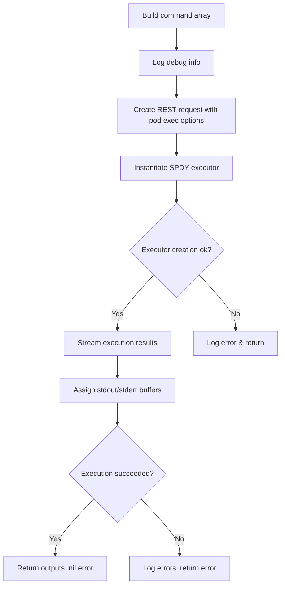

#### Function dependencies (Mermaid)

```mermaid
graph TD
  ExecCommandContainer --> DebugLog
  ExecCommandContainer --> GetNamespace
  ExecCommandContainer --> GetPodName
  ExecCommandContainer --> GetContainerName
  ExecCommandContainer --> JoinStrings
  ExecCommandContainer --> RESTClientCall
  ExecCommandContainer --> PostRequest
  ExecCommandContainer --> NamespaceSpec
  ExecCommandContainer --> ResourceSpec
  ExecCommandContainer --> NameSpec
  ExecCommandContainer --> SubResourceSpec
  ExecCommandContainer --> VersionedParamsSpec
  ExecCommandContainer --> NewSPDYExecutor
  ExecCommandContainer --> StreamWithContext
  ExecCommandContainer --> ErrorLog
```

#### Functions calling `ClientsHolder.ExecCommandContainer` (Mermaid)

None – this function is currently not referenced elsewhere in the package.

#### Usage example (Go)

```go
// Minimal example invoking ExecCommandContainer
ctx := Context{
    namespace:     "default",
    podName:       "my-pod",
    containerName:"app-container",
}
holder := &ClientsHolder{ /* initialized with K8s client and RestConfig */ }

stdout, stderr, err := holder.ExecCommandContainer(ctx, "echo hello")
if err != nil {
    fmt.Printf("command failed: %v\n", err)
} else {
    fmt.Printf("stdout: %s\nstderr: %s\n", stdout, stderr)
}
```

---

### CommandMock.ExecCommandContainer

**ExecCommandContainer** - Stores invocation details of `ExecCommandContainer` and delegates execution to the supplied mock function.

#### Signature (Go)

```go
func (mock *CommandMock) ExecCommandContainer(context Context, s string) (string, string, error)
```

#### Summary Table

| Aspect | Details |
|--------|---------|
| **Purpose** | Stores invocation details of `ExecCommandContainer` and delegates execution to the supplied mock function. |
| **Parameters** | `context Context – execution context; <br>`<br> `s string – input string argument` |
| **Return value** | `(string, string, error) – values returned by the mock implementation` |
| **Key dependencies** | • `panic` – invoked if the mock function is nil<br>• `Lock`, `Unlock` – thread‑safe recording of calls<br>• `append` – adds call record to slice<br>• `ExecCommandContainerFunc` – user‑supplied mock logic |
| **Side effects** | Mutates `mock.calls.ExecCommandContainer` slice; acquires/releases a mutex. |
| **How it fits the package** | Part of the internal client holder mock used in tests to capture and simulate command execution. |

#### Internal workflow (Mermaid)

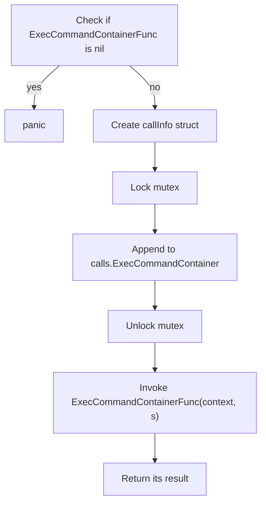

#### Function dependencies (Mermaid)

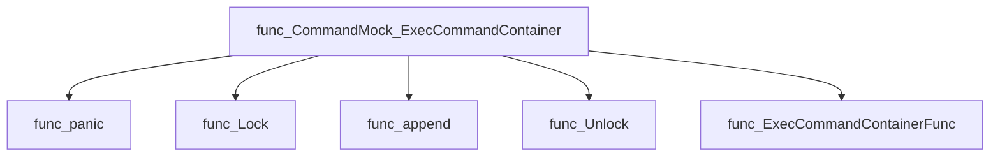

#### Functions calling `CommandMock.ExecCommandContainer` (Mermaid)

None – this function is currently not referenced elsewhere in the package.

#### Usage example (Go)

```go
// Minimal example invoking CommandMock.ExecCommandContainer
mock := &clientsholder.CommandMock{
    ExecCommandContainerFunc: func(ctx clientsholder.Context, s string) (string, string, error) {
        return "out", "err", nil
    },
}
ctx := clientsholder.NewContext()
out, errOut, err := mock.ExecCommandContainer(ctx, "sample")
fmt.Println(out, errOut, err)
```

---

### CommandMock.ExecCommandContainerCalls

**ExecCommandContainerCalls** - Returns a slice containing all recorded calls to `ExecCommandContainer` made on the mock instance. Each entry holds the execution context and the command string supplied during that call.

#### Signature (Go)

```go
func (mock *CommandMock) ExecCommandContainerCalls() []struct {
    Context Context
    S       string
}
```

#### Summary Table

| Aspect | Details |
|--------|---------|
| **Purpose** | Returns a slice containing all recorded calls to `ExecCommandContainer` made on the mock instance. Each entry holds the execution context and the command string supplied during that call. |
| **Parameters** | *None* – operates solely on the receiver’s internal state. |
| **Return value** | A slice of structs, each with a `Context` field (type `Context`) and an `S` field (`string`). The slice is a snapshot; subsequent mock activity does not affect it. |
| **Key dependencies** | • `mock.lockExecCommandContainer.RLock()` – acquires a read lock.<br>• `mock.calls.ExecCommandContainer` – the stored call records.<br>• `mock.lockExecCommandContainer.RUnlock()` – releases the read lock. |
| **Side effects** | None beyond acquiring and releasing a read lock; the function does not modify any state. |
| **How it fits the package** | Provides test harness functionality for the `clientsholder` mock, enabling callers to assert that expected commands were executed in tests. |

#### Internal workflow (Mermaid)

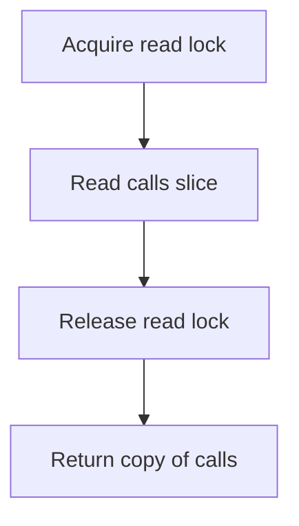

#### Function dependencies (Mermaid)

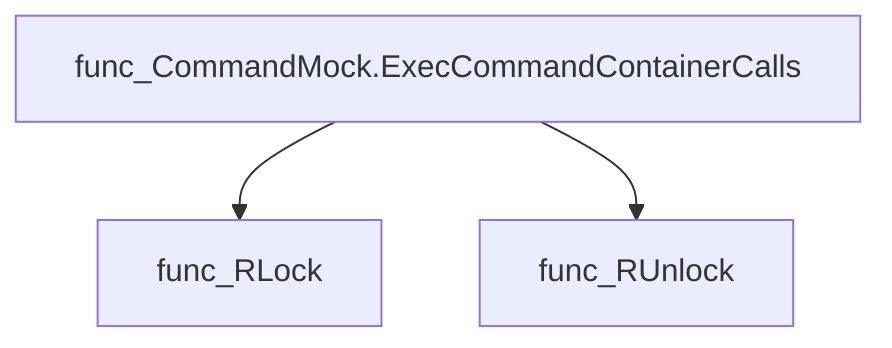

#### Functions calling `CommandMock.ExecCommandContainerCalls` (Mermaid)

None – this function is currently not referenced elsewhere in the package.

#### Usage example (Go)

```go
// Minimal example invoking CommandMock.ExecCommandContainerCalls

// Assume mock is an initialized *CommandMock instance.
calls := mock.ExecCommandContainerCalls()

for _, c := range calls {
    fmt.Printf("Context: %v, Command: %s\n", c.Context, c.S)
}
```

---

### Context.GetContainerName

**GetContainerName** - Returns the name of the container associated with the current execution context. This value is used when executing commands inside a pod via Kubernetes API calls.

#### 1) Signature (Go)

```go
func (c *Context) GetContainerName() string
```

#### 2) Summary Table

| Aspect | Details |
|--------|---------|
| **Purpose** | Returns the name of the container associated with the current execution context. This value is used when executing commands inside a pod via Kubernetes API calls. |
| **Parameters** | None – operates on the receiver `c *Context`. |
| **Return value** | `string` – the container name stored in the context. |
| **Key dependencies** | • Accesses the private field `containerName` of the `Context` struct. |
| **Side effects** | None – pure accessor; no state changes or I/O. |
| **How it fits the package** | Provides a simple getter for other functions (e.g., `ClientsHolder.ExecCommandContainer`) to obtain the container name needed for Kubernetes exec requests. |

#### 3) Internal workflow (Mermaid)

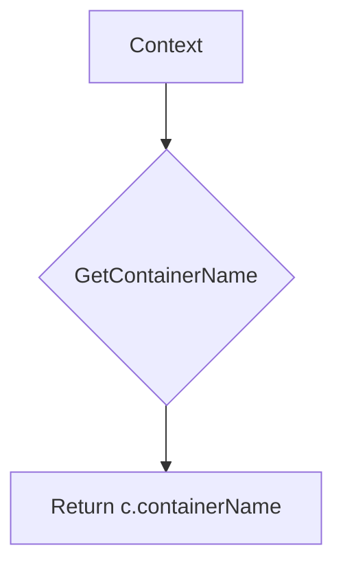

#### 4) Function dependencies (Mermaid)

None – this function is currently not referenced elsewhere in the package.

#### 5) Functions calling `Context.GetContainerName` (Mermaid)

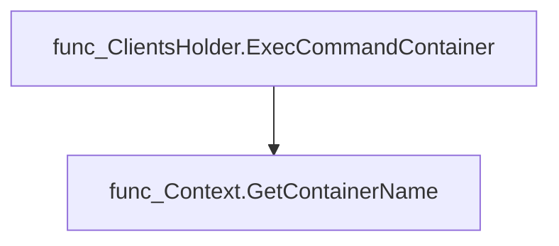

#### 6) Usage example (Go)

```go
// Minimal example invoking Context.GetContainerName
ctx := &clientsholder.Context{containerName: "nginx"}
name := ctx.GetContainerName()
fmt.Println("Container name:", name)
```

---

### Context.GetNamespace

**GetNamespace** - Returns the Kubernetes namespace associated with the receiver `Context`. This value is used by other client‑side functions to target API calls within a specific namespace.

#### Signature (Go)

```go
func (c *Context) GetNamespace() string
```

#### Summary Table

| Aspect | Details |
|--------|---------|
| **Purpose** | Returns the Kubernetes namespace associated with the receiver `Context`. This value is used by other client‑side functions to target API calls within a specific namespace. |
| **Parameters** | None – operates on the method’s receiver (`c`). |
| **Return value** | `string` – the stored namespace name. |
| **Key dependencies** | *No external calls; simply accesses the struct field.* |
| **Side effects** | None – purely read‑only operation. |
| **How it fits the package** | The `clientsholder` package encapsulates interactions with Kubernetes resources. `Context.GetNamespace` provides a convenient accessor for the namespace used by commands such as `ExecCommandContainer`. |

#### Internal workflow (Mermaid)

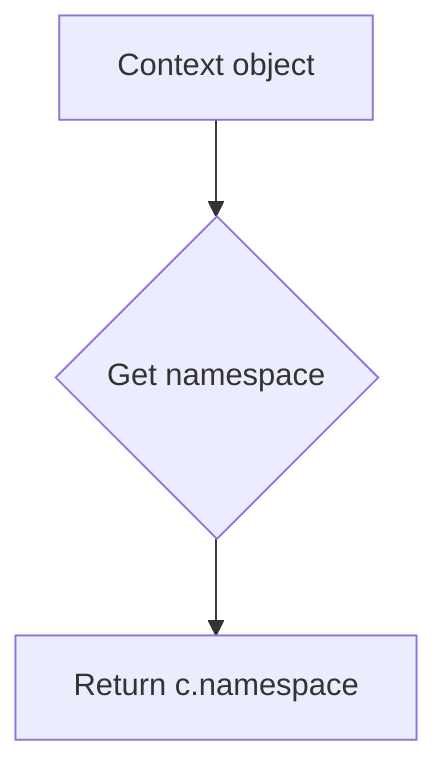

#### Function dependencies

None – this function is currently not referenced elsewhere in the package.

#### Functions calling `Context.GetNamespace` (Mermaid)

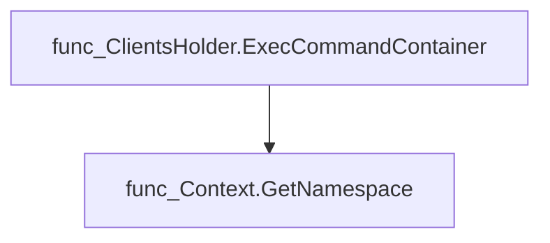

#### Usage example (Go)

```go
// Minimal example invoking Context.GetNamespace
ctx := &clientsholder.Context{namespace: "production"}
ns := ctx.GetNamespace()
fmt.Println("Namespace:", ns) // Output: Namespace: production
```

---

### Context.GetPodName

**GetPodName** - Returns the pod name associated with the context.

Retrieves the pod name stored in a `Context`.

#### Signature (Go)

```go
func (c *Context) GetPodName() string
```

#### Summary Table

| Aspect | Details |
|--------|---------|
| **Purpose** | Returns the pod name associated with the context. |
| **Parameters** | None |
| **Return value** | `string` – the pod name (`c.podName`). |
| **Key dependencies** | None (simple field access). |
| **Side effects** | No state changes, no I/O. |
| **How it fits the package** | Provides a convenient accessor used by functions such as `ClientsHolder.ExecCommandContainer` to construct API requests targeting a specific pod. |

#### Internal workflow (Mermaid)

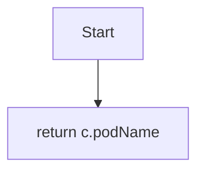

#### Function dependencies  

None – this function is currently not referenced elsewhere in the package.

#### Functions calling `Context.GetPodName` (Mermaid)

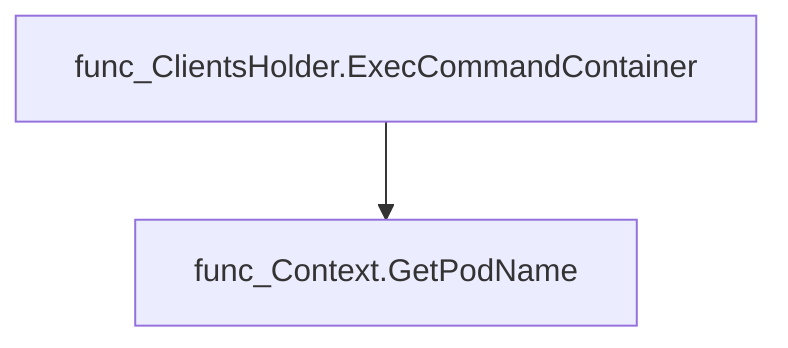

#### Usage example (Go)

```go
// Minimal example invoking Context.GetPodName
ctx := &clientsholder.Context{ /* fields initialized elsewhere */ }
podName := ctx.GetPodName()
fmt.Println("Target pod:", podName)
```

---

### GetClientConfigFromRestConfig

**GetClientConfigFromRestConfig** - Builds a `clientcmdapi.Config` object that represents a kubeconfig file, derived from an existing `*rest.Config`. This allows code that expects a kubeconfig to use the in‑cluster configuration.

#### Signature (Go)

```go
func GetClientConfigFromRestConfig(restConfig *rest.Config) *clientcmdapi.Config
```

#### Summary Table

| Aspect | Details |
|--------|---------|
| **Purpose** | Builds a `clientcmdapi.Config` object that represents a kubeconfig file, derived from an existing `*rest.Config`. This allows code that expects a kubeconfig to use the in‑cluster configuration. |
| **Parameters** | `restConfig *rest.Config –` REST client configuration obtained from the cluster (e.g., via `rest.InClusterConfig()`). |
| **Return value** | `*clientcmdapi.Config –` A fully populated kubeconfig structure with one cluster, context and user entry. |
| **Key dependencies** | • `k8s.io/client-go/rest`<br>• `k8s.io/client-go/tools/clientcmd/api` |
| **Side effects** | No external I/O or mutation of the passed config; purely constructs a new struct. |
| **How it fits the package** | Provides a bridge between in‑cluster configuration and components that require kubeconfig bytes (e.g., preflight operator checks). |

#### Internal workflow (Mermaid)

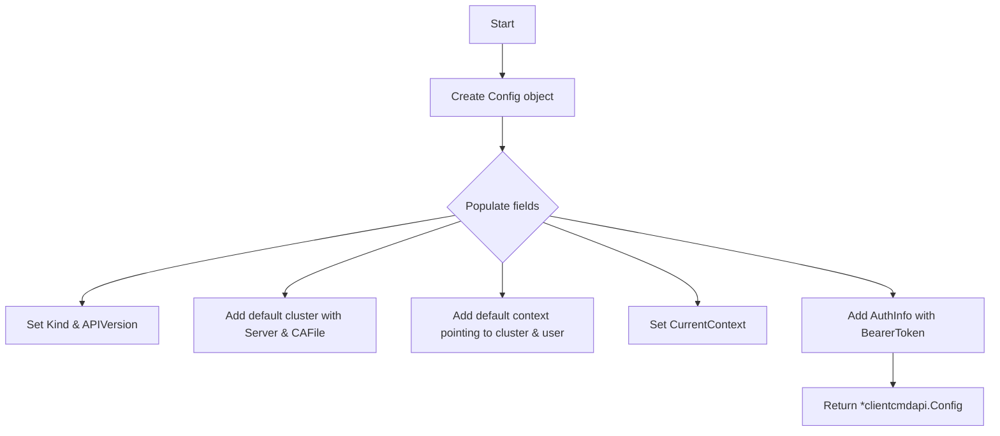

#### Function dependencies

None – this function is currently not referenced elsewhere in the package.

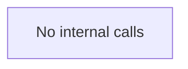

#### Functions calling `GetClientConfigFromRestConfig` (Mermaid)

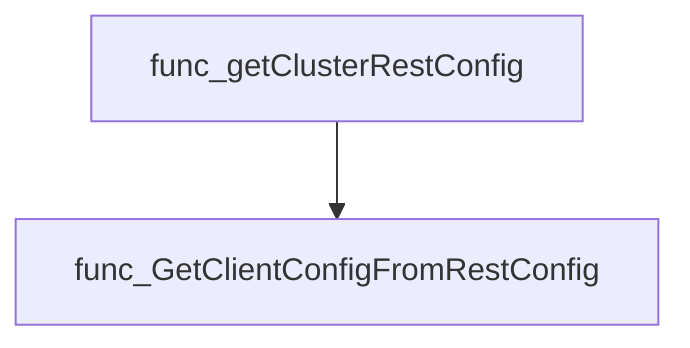

#### Usage example (Go)

```go
// Minimal example invoking GetClientConfigFromRestConfig
import (
    "k8s.io/client-go/rest"
    clientsholder "github.com/redhat-best-practices-for-k8s/certsuite/internal/clientsholder"
)

func main() {
    // Assume we already have a rest.Config, e.g., from InClusterConfig()
    restCfg, err := rest.InClusterConfig()
    if err != nil {
        panic(err)
    }

    kubeCfg := clientsholder.GetClientConfigFromRestConfig(restCfg)
    fmt.Printf("Generated kubeconfig: %+v\n", kubeCfg)
}
```

---

### GetClientsHolder

**GetClientsHolder** - Returns a global, lazily‑initialized `*ClientsHolder` that aggregates Kubernetes API clients. If the holder is not yet ready, it is created via `newClientsHolder`.

#### 1) Signature (Go)

```go
func GetClientsHolder(filenames ...string) *ClientsHolder
```

#### 2) Summary Table

| Aspect | Details |
|--------|---------|
| **Purpose** | Returns a global, lazily‑initialized `*ClientsHolder` that aggregates Kubernetes API clients. If the holder is not yet ready, it is created via `newClientsHolder`. |
| **Parameters** | `filenames ...string` – Optional list of kubeconfig file paths used when initializing the holder. |
| **Return value** | A pointer to a fully initialized `ClientsHolder` instance; panics (via `log.Fatal`) if initialization fails. |
| **Key dependencies** | • `newClientsHolder(filenames...)` – builds the holder.<br>• `log.Fatal(msg, args…)` – terminates on error. |
| **Side effects** | *May instantiate numerous Kubernetes clientsets and a discovery client.<br>* On failure, logs a fatal message and exits the process. |
| **How it fits the package** | Provides global access to shared clients across the Certsuite codebase, avoiding repeated construction of expensive client objects. |

#### 3) Internal workflow (Mermaid)

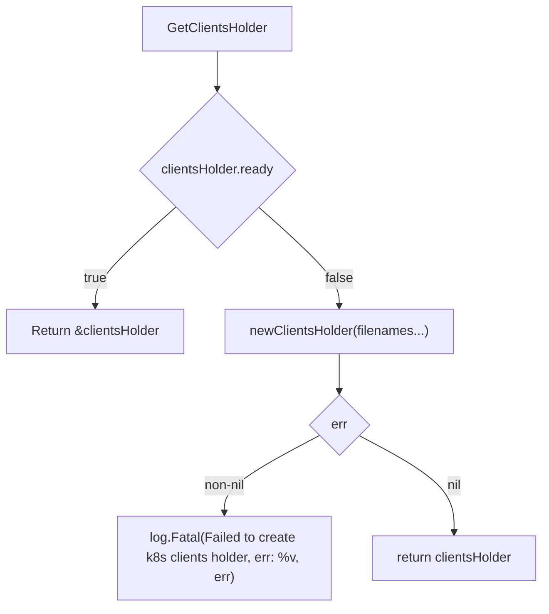

#### 4) Function dependencies (Mermaid)

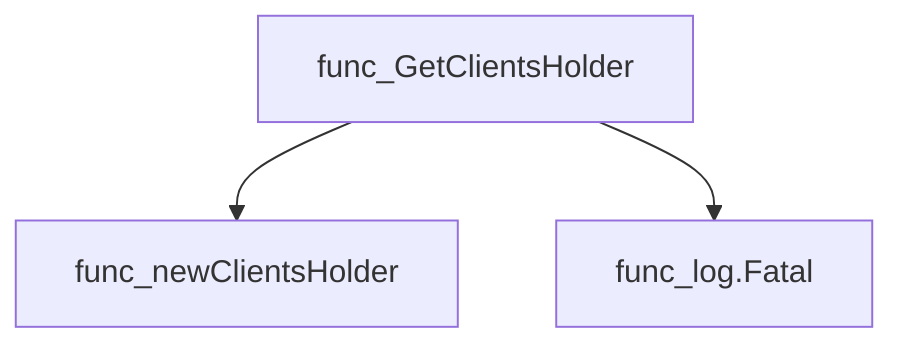

#### 5) Functions calling `GetClientsHolder` (Mermaid)

```mermaid
graph TD
  func_crclient.ExecCommandContainerNSEnter --> func_GetClientsHolder
  func_crclient.GetContainerPidNamespace --> func_GetClientsHolder
  func_crclient.GetPidsFromPidNamespace --> func_GetClientsHolder
  func_autodiscover.DoAutoDiscover --> func_GetClientsHolder
  func_provider.Node.IsHyperThreadNode --> func_GetClientsHolder
  func_provider.Operator.SetPreflightResults --> func_GetClientsHolder
  func_provider.Pod.CreatedByDeploymentConfig --> func_GetClientsHolder
  func_provider.Pod.IsUsingSRIOV --> func_GetClientsHolder
  func_provider.Pod.IsUsingSRIOVWithMTU --> func_GetClientsHolder
  func_crclient.GetNodeProbePodContext --> func_GetClientsHolder
  func_getOperatorTargetNamespaces --> func_GetClientsHolder
```

#### 6) Usage example (Go)

```go
// Minimal example invoking GetClientsHolder
package main

import (
    "github.com/redhat-best-practices-for-k8s/certsuite/internal/clientsholder"
)

func main() {
    // Obtain the singleton holder; passes kubeconfig filenames if needed.
    clients := clientsholder.GetClientsHolder("~/.kube/config")
    // Use the holder, e.g., list pods in default namespace
    podList, err := clients.K8sClient.CoreV1().Pods("").List(context.TODO(), metav1.ListOptions{})
    if err != nil {
        panic(err)
    }
    fmt.Printf("Found %d pods\n", len(podList.Items))
}
```

---

### GetNewClientsHolder

**GetNewClientsHolder** - Instantiates and returns a `*ClientsHolder` populated with Kubernetes clients based on the supplied kubeconfig file. If creation fails, it terminates the process via logging.

#### Signature (Go)

```go
func GetNewClientsHolder(kubeconfigFile string) *ClientsHolder
```

#### Summary Table

| Aspect | Details |
|--------|---------|
| **Purpose** | Instantiates and returns a `*ClientsHolder` populated with Kubernetes clients based on the supplied kubeconfig file. If creation fails, it terminates the process via logging. |
| **Parameters** | `kubeconfigFile string` – Path to a kubeconfig file used for cluster configuration. |
| **Return value** | `*ClientsHolder` – Reference to the initialized client holder. |
| **Key dependencies** | • Calls `newClientsHolder(kubeconfigFile)`<br>• Invokes `log.Fatal()` on error |
| **Side effects** | *Fatal logs a message and exits the program if initialization fails.<br>* No external I/O beyond logging. |
| **How it fits the package** | Provides a public API for other packages to obtain a ready‑to‑use collection of Kubernetes client interfaces, hiding the complex setup performed by `newClientsHolder`. |

#### Internal workflow (Mermaid)

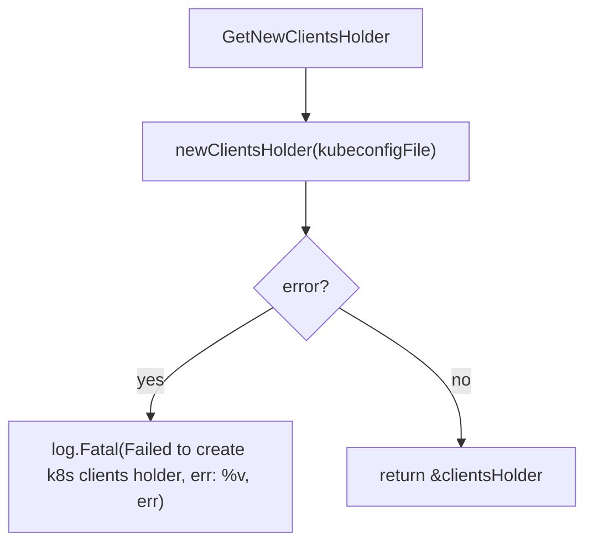

#### Function dependencies (Mermaid)

```mermaid
graph TD
  func_GetNewClientsHolder --> func_newClientsHolder
  func_GetNewClientsHolder --> func_log.Fatal
```

#### Functions calling `GetNewClientsHolder` (Mermaid)

```mermaid
graph TD
  func_runHandler --> func_GetNewClientsHolder
```

#### Usage example (Go)

```go
// Minimal example invoking GetNewClientsHolder
package main

import (
    "github.com/redhat-best-practices-for-k8s/certsuite/internal/clientsholder"
)

func main() {
    // Path to kubeconfig file obtained elsewhere (e.g., from env or user input)
    kubeConfigPath := "/path/to/kubeconfig.yaml"

    // Obtain the client holder; program exits if initialization fails
    clients := clientsholder.GetNewClientsHolder(kubeConfigPath)

    // Use clients.K8sClient, clients.DynamicClient, etc. as needed...
    _ = clients
}
```

---

### GetTestClientsHolder

**GetTestClientsHolder** - Builds a `ClientsHolder` populated with fake Kubernetes clients that expose only the supplied runtime objects, facilitating isolated unit testing.

#### Signature (Go)

```go
func GetTestClientsHolder(k8sMockObjects []runtime.Object) *ClientsHolder
```

#### Summary Table

| Aspect | Details |
|--------|---------|
| **Purpose** | Builds a `ClientsHolder` populated with fake Kubernetes clients that expose only the supplied runtime objects, facilitating isolated unit testing. |
| **Parameters** | `k8sMockObjects []runtime.Object –` a slice of pure Kubernetes API objects to be served by the mock clients. |
| **Return value** | `*ClientsHolder –` a pointer to a fully initialized holder whose internal flag is set to ready. |
| **Key dependencies** | • `k8s.io/client-go/kubernetes/fake.NewSimpleClientset` <br>• `k8s.io/apiextensions-apiserver/pkg/client/clientset/clientset/fake.NewSimpleClientset` <br>• `github.com/k8snetworkplumbingwg/network-attachment-definition-client/pkg/client/clientset/versioned/fake.NewSimpleClientset` |
| **Side effects** | None external; only internal state of the returned holder is mutated. |
| **How it fits the package** | Serves as the test‑time counterpart to production client initialisation, allowing tests to inject deterministic objects without hitting a real API server. |

#### Internal workflow (Mermaid)

```mermaid
flowchart TD
  Start["Receive mock objects"]
  Split1{"Group by type"}
  BuildK8sObjects["Collect core & RBAC objects"]
  BuildExtObjects["Collect CRD objects"]
  BuildPlumbing["Collect NetworkAttachmentDefinition objects"]
  CreateK8sClient["NewSimpleClientset(k8sClientObjects…)"]
  CreateExtClient["NewSimpleClientset(k8sExtClientObjects…)"]
  CreatePlumbingClient["NewSimpleClientset(k8sPlumbingObjects…)"]
  SetReady["clientsHolder.ready = true"]
  Return["Return &clientsHolder"]

  Start --> Split1
  Split1 --> BuildK8sObjects
  Split1 --> BuildExtObjects
  Split1 --> BuildPlumbing
  BuildK8sObjects --> CreateK8sClient
  BuildExtObjects --> CreateExtClient
  BuildPlumbing --> CreatePlumbingClient
  CreateK8sClient --> SetReady
  CreateExtClient --> SetReady
  CreatePlumbingClient --> SetReady
  SetReady --> Return
```

#### Function dependencies (Mermaid)

```mermaid
graph TD
  GetTestClientsHolder --> NewSimpleClientset_k8s
  GetTestClientsHolder --> NewSimpleClientset_ext
  GetTestClientsHolder --> NewSimpleClientset_plumbing

  classDef func fill:#f9f,stroke:#333,stroke-width:2px;
  class NewSimpleClientset_k8s,NewSimpleClientset_ext,NewSimpleClientset_plumbing func;
```

#### Functions calling `GetTestClientsHolder` (Mermaid)

None – this function is currently not referenced elsewhere in the package.

#### Usage example (Go)

```go
// Minimal example invoking GetTestClientsHolder
package main

import (
 "k8s.io/api/core/v1"
 "k8s.io/apimachinery/pkg/runtime"

 cs "github.com/redhat-best-practices-for-k8s/certsuite/internal/clientsholder"
)

func main() {
 objects := []runtime.Object{
  &v1.Pod{ObjectMeta: metav1.ObjectMeta{Name: "test-pod"}},
 }
 holder := cs.GetTestClientsHolder(objects)
 // holder.K8sClient can now be used in tests
}
```

---

### NewContext

**NewContext** - Builds and returns a `Context` value that encapsulates the namespace, pod name, and container name needed for subsequent command executions against a probe pod.

#### Signature (Go)

```go
func NewContext(namespace, podName, containerName string) Context
```

#### Summary Table

| Aspect | Details |
|--------|---------|
| **Purpose** | Builds and returns a `Context` value that encapsulates the namespace, pod name, and container name needed for subsequent command executions against a probe pod. |
| **Parameters** | `namespace` string – Kubernetes namespace of the pod.<br>`podName` string – Name of the target pod.<br>`containerName` string – Container inside the pod to target. |
| **Return value** | A `Context` struct containing the provided fields; used by command‑execution helpers. |
| **Key dependencies** | None – this function only constructs a struct. |
| **Side effects** | No state changes, no I/O. Pure constructor. |
| **How it fits the package** | Provides the minimal data structure that higher‑level client holders use to reference probe pods when running commands via `ExecCommandContainer`. |

#### Internal workflow (Mermaid)

```mermaid
flowchart TD
  A["Receive namespace"] --> B{"Construct Context"}
  B --> C["Set .namespace"]
  B --> D["Set .podName"]
  B --> E["Set .containerName"]
  E --> F["Return Context struct"]
```

#### Function dependencies (Mermaid)

None – this function is currently not referenced elsewhere in the package.

#### Functions calling `NewContext` (Mermaid)

```mermaid
graph TD
  clientsholder_GetClientsHolder --> func_NewContext
  provider_Node_IsHyperThreadNode --> func_NewContext
  pkg_diagnostics_GetCniPlugins --> func_NewContext
  pkg_provider_filterDPDKRunningPods --> func_NewContext
  pkg_tests_platform_testIsSELinuxEnforcing --> func_NewContext
  tests_accesscontrol_testOneProcessPerContainer --> func_NewContext
```

#### Usage example (Go)

```go
// Minimal example invoking NewContext
package main

import (
    "github.com/redhat-best-practices-for-k8s/certsuite/internal/clientsholder"
)

func main() {
    ctx := clientsholder.NewContext("default", "probe-pod-1234", "probe-container")
    // ctx can now be passed to ExecCommandContainer or similar helpers
}
```

---

---

### SetTestClientGroupResources

**SetTestClientGroupResources** - Stores a slice of API resource lists into the package’s client holder, enabling test clients to reference available Kubernetes group resources.

Sets the group resources for the test client holder.

```go
func SetTestClientGroupResources(groupResources []*metav1.APIResourceList)
```

| Aspect | Details |
|--------|---------|
| **Purpose** | Stores a slice of API resource lists into the package’s client holder, enabling test clients to reference available Kubernetes group resources. |
| **Parameters** | `groupResources []*metav1.APIResourceList` – a list of resource groups and their contained API resources. |
| **Return value** | None (void). |
| **Key dependencies** | - `k8s.io/apimachinery/pkg/apis/meta/v1` for the `APIResourceList` type.<br>- Assignment to the package‑level variable `clientsHolder`. |
| **Side effects** | Mutates the exported field `GroupResources` of the `clientsHolder` singleton; no I/O or external communication. |
| **How it fits the package** | Provides a simple setter used during test initialization to inject mock group resource data into the client holder for subsequent API interactions. |

#### Internal workflow

```mermaid
flowchart TD
  A["Receive slice of APIResourceList"] --> B["Assign to clientsHolder.GroupResources"]
```

#### Function dependencies

None – this function is currently not referenced elsewhere in the package.

#### Functions calling `SetTestClientGroupResources`

None – this function is currently not referenced elsewhere in the package.

#### Usage example (Go)

```go
// Minimal example invoking SetTestClientGroupResources
import (
    metav1 "k8s.io/apimachinery/pkg/apis/meta/v1"
)

func main() {
    // Example resource lists (normally obtained from a discovery client).
    resources := []*metav1.APIResourceList{
        &metav1.APIResourceList{GroupVersion: "v1", APIResources: []metav1.APIResource{}},
    }

    SetTestClientGroupResources(resources)
}
```

---

### SetTestK8sClientsHolder

**SetTestK8sClientsHolder** - Stores the supplied Kubernetes client in the package‑wide `clientsHolder` and marks it as ready, enabling test code to use a fake or mock client.

#### Signature (Go)

```go
func SetTestK8sClientsHolder(kubernetes.Interface)
```

#### Summary Table

| Aspect | Details |
|--------|---------|
| **Purpose** | Stores the supplied Kubernetes client in the package‑wide `clientsHolder` and marks it as ready, enabling test code to use a fake or mock client. |
| **Parameters** | `k8sClient kubernetes.Interface –` The Kubernetes client implementation to be used during tests. |
| **Return value** | None (the function has no return values). |
| **Key dependencies** | - Assigns to the global variable `clientsHolder.K8sClient`. <br>- Sets `clientsHolder.ready = true`. |
| **Side effects** | Mutates package‑level state (`clientsHolder`). No external I/O or concurrency is involved. |
| **How it fits the package** | Provides a simple test hook for replacing the real Kubernetes client with a mock, allowing unit tests to run without needing an actual cluster. |

#### Internal workflow (Mermaid)

```mermaid
flowchart TD
  A["Receive k8sClient"] --> B["clientsHolder.K8sClient = k8sClient"]
  B --> C["clientsHolder.ready = true"]
```

#### Function dependencies

None – this function is currently not referenced elsewhere in the package.

#### Functions calling `SetTestK8sClientsHolder` (Mermaid)

None – this function is currently not referenced elsewhere in the package.

#### Usage example (Go)

```go
// Minimal example invoking SetTestK8sClientsHolder
package main

import (
    "github.com/redhat-best-practices-for-k8s/certsuite/internal/clientsholder"
    metav1 "k8s.io/apimachinery/pkg/apis/meta/v1"
    fakeclientset "k8s.io/client-go/kubernetes/fake"
)

func main() {
    // Create a fake Kubernetes client for testing
    fakeClient := fakeclientset.NewSimpleClientset()

    // Inject the fake client into the holder used by the package
    clientsholder.SetTestK8sClientsHolder(fakeClient)

    // The rest of the test code can now use the injected client via the holder.
    _ = metav1.GetOptions{} // placeholder to avoid unused import warning
}
```

---

### SetTestK8sDynamicClientsHolder

**SetTestK8sDynamicClientsHolder** - Sets the internal `DynamicClient` of the global `clientsHolder` to a supplied test client and marks it as ready.

#### Signature (Go)

```go
func SetTestK8sDynamicClientsHolder(dynamicClient dynamic.Interface)
```

#### Summary Table

| Aspect | Details |
|--------|---------|
| **Purpose** | Sets the internal `DynamicClient` of the global `clientsHolder` to a supplied test client and marks it as ready. |
| **Parameters** | *dynamicClient* `dynamic.Interface` – The mock or test dynamic client to be used by the holder. |
| **Return value** | None |
| **Key dependencies** | - `clientsHolder.DynamicClient = dynamicClient`<br>- `clientsHolder.ready = true` |
| **Side effects** | Mutates global state: updates `DynamicClient` and flips readiness flag; no I/O or concurrency involved. |
| **How it fits the package** | Provides a simple API for tests to inject a fake Kubernetes dynamic client into the holder, enabling isolation of test logic from real cluster interactions. |

#### Internal workflow (Mermaid)

```mermaid
flowchart TD
  A["SetTestK8sDynamicClientsHolder"] --> B{"Assign provided client"}
  B --> C["clientsHolder.DynamicClient = dynamicClient"]
  B --> D["clientsHolder.ready = true"]
```

#### Function dependencies (Mermaid)

None – this function is currently not referenced elsewhere in the package.

#### Functions calling `SetTestK8sDynamicClientsHolder` (Mermaid)

None – this function is currently not referenced elsewhere in the package.

#### Usage example (Go)

```go
// Minimal example invoking SetTestK8sDynamicClientsHolder
package main

import (
    "github.com/redhat-best-practices-for-k8s/certsuite/internal/clientsholder"
    "k8s.io/client-go/dynamic/fake"
)

func main() {
    fakeClient := fake.NewSimpleDynamicClient(nil)
    clientsholder.SetTestK8sDynamicClientsHolder(fakeClient)
}
```

---

### SetupFakeOlmClient

**SetupFakeOlmClient** - Replaces the real Operator‑Lifecycle‑Manager client in `clientsHolder` with a fake client that serves the supplied mock objects, enabling unit tests to exercise OLM interactions without a live cluster.

#### Signature (Go)

```go
func SetupFakeOlmClient(olmMockObjects []runtime.Object)
```

#### Summary Table

| Aspect | Details |
|--------|---------|
| **Purpose** | Replaces the real Operator‑Lifecycle‑Manager client in `clientsHolder` with a fake client that serves the supplied mock objects, enabling unit tests to exercise OLM interactions without a live cluster. |
| **Parameters** | `olmMockObjects []runtime.Object –` A slice of Kubernetes runtime objects that represent the mocked state expected by OLM APIs. |
| **Return value** | None. The function mutates global state (`clientsHolder.OlmClient`). |
| **Key dependencies** | • `github.com/operator-framework/operator-lifecycle-manager/pkg/api/client/clientset/versioned/fake.NewSimpleClientset` – creates a fake client pre‑loaded with the mock objects.<br>• `clientsHolder.OlmClient` – global holder that stores the current OLM client instance. |
| **Side effects** | Mutates the package‑level variable `clientsHolder.OlmClient`. No external I/O or concurrency is performed. |
| **How it fits the package** | Provides a convenient test helper for the `clientsholder` package, allowing other components to obtain an OLM client that behaves deterministically during unit tests. |

#### Internal workflow (Mermaid)

```mermaid
flowchart TD
  SetupFakeOlmClient --> CreateFakeClient["Create fake client with mock objects"]
  CreateFakeClient --> SetGlobal["Assign to clientsHolder.OlmClient"]
```

#### Function dependencies (Mermaid)

```mermaid
graph TD
  SetupFakeOlmClient --> NewSimpleClientset["github.com/operator-framework/operator-lifecycle-manager/pkg/api/client/clientset/versioned/fake.NewSimpleClientset"]
```

#### Functions calling `SetupFakeOlmClient` (Mermaid)

None – this function is currently not referenced elsewhere in the package.

#### Usage example (Go)

```go
// Minimal example invoking SetupFakeOlmClient
import (
    "k8s.io/apimachinery/pkg/runtime"
)

// Create some mock objects that represent OLM resources
mockObjs := []runtime.Object{
    // ... populate with fake CRDs, ClusterServiceVersions, etc.
}

// Override the real OLM client with a fake one for testing
SetupFakeOlmClient(mockObjs)
```

---

## Local Functions

### createByteArrayKubeConfig

**createByteArrayKubeConfig** - Serialises a `*clientcmdapi.Config` into YAML‑encoded bytes for use as an in‑memory kubeconfig.

#### 1) Signature (Go)

```go
func createByteArrayKubeConfig(kubeConfig *clientcmdapi.Config) ([]byte, error)
```

#### 2) Summary Table

| Aspect | Details |
|--------|---------|
| **Purpose** | Serialises a `*clientcmdapi.Config` into YAML‑encoded bytes for use as an in‑memory kubeconfig. |
| **Parameters** | `kubeConfig *clientcmdapi.Config` – the configuration to serialise. |
| **Return value** | `([]byte, error)` – the YAML representation on success; a non‑nil error otherwise. |
| **Key dependencies** | • `clientcmd.Write(*kubeConfig)` (from `k8s.io/client-go/tools/clientcmd`) <br>• `fmt.Errorf` for wrapping errors |
| **Side effects** | No external I/O or state mutation; purely functional. |
| **How it fits the package** | Used by `getClusterRestConfig` to produce a byte array of kubeconfig data when running inside or outside a cluster, enabling downstream components that expect raw kubeconfig bytes. |

#### 3) Internal workflow (Mermaid)

```mermaid
flowchart TD
  A["Start"] --> B{"Call clientcmd.Write"}
  B -->|"Success"| C["Return yamlBytes"]
  B -->|"Error"| D["Wrap and return error"]
```

#### 4) Function dependencies (Mermaid)

```mermaid
graph TD
  func_createByteArrayKubeConfig --> func_Write_k8s.io_client-go_tools_clientcmd
  func_createByteArrayKubeConfig --> func_Errorf_fmt
```

#### 5) Functions calling `createByteArrayKubeConfig` (Mermaid)

```mermaid
graph TD
  func_getClusterRestConfig --> func_createByteArrayKubeConfig
```

#### 6) Usage example (Go)

```go
// Minimal example invoking createByteArrayKubeConfig
import (
    "k8s.io/client-go/tools/clientcmd/api"
    "fmt"
)

func main() {
    // Assume we have a kubeconfig object from elsewhere
    cfg := &api.Config{
        CurrentContext: "my-context",
        Clusters: map[string]*api.Cluster{
            "my-cluster": {Server: "https://example.com"},
        },
        AuthInfos: map[string]*api.AuthInfo{
            "user1": {Token: "sometoken"},
        },
    }

    yamlBytes, err := createByteArrayKubeConfig(cfg)
    if err != nil {
        fmt.Printf("Error creating kubeconfig bytes: %v\n", err)
        return
    }
    fmt.Printf("YAML:\n%s\n", string(yamlBytes))
}
```

---

---

### getClusterRestConfig

**getClusterRestConfig** - Determines the appropriate `*rest.Config` for connecting to a Kubernetes cluster. If running inside a pod it uses the in‑cluster service account; otherwise it merges one or more kubeconfig files supplied via `filenames`. The function also generates an in‑memory byte slice of the resulting kubeconfig for downstream use.

#### Signature (Go)

```go
func getClusterRestConfig(filenames ...string) (*rest.Config, error)
```

#### Summary Table

| Aspect | Details |
|--------|---------|
| **Purpose** | Determines the appropriate `*rest.Config` for connecting to a Kubernetes cluster. If running inside a pod it uses the in‑cluster service account; otherwise it merges one or more kubeconfig files supplied via `filenames`. The function also generates an in‑memory byte slice of the resulting kubeconfig for downstream use. |
| **Parameters** | `filenames ...string` – Paths to one or more kubeconfig files (used only when not running inside a cluster). |
| **Return value** | `*rest.Config, error` – The Kubernetes REST configuration and an error if the configuration cannot be constructed. |
| **Key dependencies** | • `k8s.io/client-go/rest.InClusterConfig`<br>• `github.com/redhat-best-practices-for-k8s/certsuite/internal/log.Logger.Info`<br>• `GetClientConfigFromRestConfig`<br>• `createByteArrayKubeConfig`<br>• `k8s.io/client-go/tools/clientcmd.NewDefaultClientConfigLoadingRules`<br>• `k8s.io/client-go/tools/clientcmd.NewNonInteractiveDeferredLoadingClientConfig`<br>• `clientcmd.RawConfig`<br>• `clientcmd.ClientConfig` |
| **Side effects** | *Logs informational messages.<br>* Populates the global `clientsHolder.KubeConfig` with a byte slice representing the kubeconfig. |
| **How it fits the package** | This helper is used by `newClientsHolder` to obtain the REST configuration that underpins all Kubernetes client instances created in the package. |

#### Internal workflow (Mermaid)

```mermaid
flowchart TD
  A["Call getClusterRestConfig"] --> B{"rest.InClusterConfig() succeeds?"}
  B -- yes --> C["Use in‑cluster config"]
  C --> D["GetClientConfigFromRestConfig"]
  D --> E["createByteArrayKubeConfig"]
  E --> F["Return rest.Config"]
  B -- no --> G["Log “Running outside a cluster”"]
  G --> H{"filenames empty?"}
  H -- yes --> I["return error: “no kubeconfig files set”"]
  H -- no --> J["Create loadingRules with precedence"]
  J --> K["NewNonInteractiveDeferredLoadingClientConfig"]
  K --> L["kubeconfig.RawConfig()"]
  L --> M["createByteArrayKubeConfig"]
  M --> N["kubeconfig.ClientConfig()"]
  N --> F
```

#### Function dependencies (Mermaid)

```mermaid
graph TD
  getClusterRestConfig --> rest.InClusterConfig
  getClusterRestConfig --> log.Info
  getClusterRestConfig --> GetClientConfigFromRestConfig
  getClusterRestConfig --> createByteArrayKubeConfig
  getClusterRestConfig --> clientcmd.NewDefaultClientConfigLoadingRules
  getClusterRestConfig --> clientcmd.NewNonInteractiveDeferredLoadingClientConfig
  getClusterRestConfig --> clientcmd.RawConfig
  getClusterRestConfig --> clientcmd.ClientConfig
  getClusterRestConfig --> fmt.Errorf
  getClusterRestConfig --> errors.New
```

#### Functions calling `getClusterRestConfig` (Mermaid)

```mermaid
graph TD
  newClientsHolder --> getClusterRestConfig
```

#### Usage example (Go)

```go
// Minimal example invoking getClusterRestConfig
config, err := getClusterRestConfig("/path/to/kubeconfig.yaml")
if err != nil {
    log.Fatalf("unable to obtain rest.Config: %v", err)
}
// config can now be used to create Kubernetes clients.
```

---

### newClientsHolder

**newClientsHolder** - Builds a `ClientsHolder` struct that contains all required Kubernetes and OpenShift clientsets, discovery data, scaling utilities, and networking clients. It determines whether the code is running inside or outside a cluster by obtaining an appropriate `rest.Config`.

#### 1) Signature (Go)

```go
func newClientsHolder(filenames ...string) (*ClientsHolder, error)
```

#### 2) Summary Table

| Aspect | Details |
|--------|---------|
| **Purpose** | Builds a `ClientsHolder` struct that contains all required Kubernetes and OpenShift clientsets, discovery data, scaling utilities, and networking clients. It determines whether the code is running inside or outside a cluster by obtaining an appropriate `rest.Config`. |
| **Parameters** | `filenames ...string` – Optional kubeconfig file paths used when not running in‑cluster. |
| **Return value** | `(*ClientsHolder, error)` – The fully initialized holder or an error if any client could not be created. |
| **Key dependencies** | • `log.Info` (internal logging)<br>• `getClusterRestConfig`<br>• `dynamic.NewForConfig`, `apiextv1.NewForConfig`, `olmClient.NewForConfig`, `olmpkgclient.NewForConfig`, `kubernetes.NewForConfig`, `clientconfigv1.NewForConfig`, `ocpMachine.NewForConfig`, `networkingv1.NewForConfig`<br>• Discovery: `discovery.NewDiscoveryClientForConfig`, `ServerPreferredResources`<br>• Scaling: `scale.NewDiscoveryScaleKindResolver`, `restmapper.GetAPIGroupResources`, `restmapper.NewDiscoveryRESTMapper`, `scale.NewForConfig`<br>• CNCF networking: `cncfNetworkAttachmentv1.NewForConfig`<br>• API server: `apiserverscheme.NewForConfig` |
| **Side effects** | *Mutates the global `clientsHolder` variable (sets fields and marks it ready).*<br>*Logs informational messages.* |
| **How it fits the package** | It is the core constructor called by public getters (`GetClientsHolder`, `GetNewClientsHolder`) to lazily initialize all client interfaces needed throughout the suite. |

#### 3) Internal workflow (Mermaid)

```mermaid
flowchart TD
    A["Start"] --> B["Log “Creating k8s go-clients holder.”"]
    B --> C["getClusterRestConfig(filenames...)"]
    C --> D["Set RestConfig.Timeout = DefaultTimeout"]
    D --> E["dynamic.NewForConfig"]
    E --> F["apiextv1.NewForConfig"]
    F --> G["olmClient.NewForConfig"]
    G --> H["olmpkgclient.NewForConfig"]
    H --> I["kubernetes.NewForConfig"]
    I --> J["clientconfigv1.NewForConfig"]
    J --> K["ocpMachine.NewForConfig"]
    K --> L["networkingv1.NewForConfig"]
    L --> M["discovery.NewDiscoveryClientForConfig"]
    M --> N["ServerPreferredResources()"]
    N --> O["scale.NewDiscoveryScaleKindResolver"]
    O --> P["restmapper.GetAPIGroupResources"]
    P --> Q["restmapper.NewDiscoveryRESTMapper"]
    Q --> R["scale.NewForConfig"]
    R --> S["cncfNetworkAttachmentv1.NewForConfig"]
    S --> T["apiserverscheme.NewForConfig"]
    T --> U["Set ready = true"]
    U --> V["Return &clientsHolder, nil"]
```

#### 4) Function dependencies (Mermaid)

```mermaid
graph TD
  func_newClientsHolder --> log.Info
  func_newClientsHolder --> getClusterRestConfig
  func_newClientsHolder --> dynamic.NewForConfig
  func_newClientsHolder --> apiextv1.NewForConfig
  func_newClientsHolder --> olmClient.NewForConfig
  func_newClientsHolder --> olmpkgclient.NewForConfig
  func_newClientsHolder --> kubernetes.NewForConfig
  func_newClientsHolder --> clientconfigv1.NewForConfig
  func_newClientsHolder --> ocpMachine.NewForConfig
  func_newClientsHolder --> networkingv1.NewForConfig
  func_newClientsHolder --> discovery.NewDiscoveryClientForConfig
  func_newClientsHolder --> ServerPreferredResources
  func_newClientsHolder --> scale.NewDiscoveryScaleKindResolver
  func_newClientsHolder --> restmapper.GetAPIGroupResources
  func_newClientsHolder --> restmapper.NewDiscoveryRESTMapper
  func_newClientsHolder --> scale.NewForConfig
  func_newClientsHolder --> cncfNetworkAttachmentv1.NewForConfig
  func_newClientsHolder --> apiserverscheme.NewForConfig
```

#### 5) Functions calling `newClientsHolder` (Mermaid)

```mermaid
graph TD
  GetClientsHolder --> newClientsHolder
  GetNewClientsHolder --> newClientsHolder
```

#### 6) Usage example (Go)

```go
// In the same package, invoking the constructor directly.
package clientsholder

func demo() {
    holder, err := newClientsHolder("/path/to/kubeconfig")
    if err != nil {
        log.Fatalf("cannot create clients: %v", err)
    }
    // Use holder.K8sClient or any other field as needed
}
```

---

---
