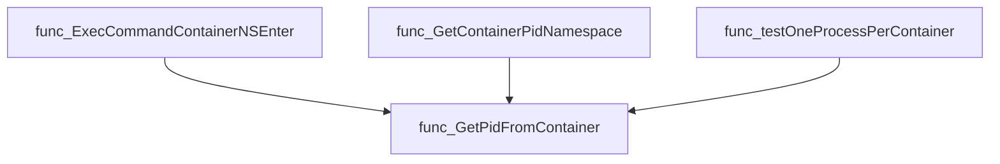

# Package crclient

**Path**: `internal/crclient`

## Table of Contents

- [Overview](#overview)
- [Structs](#structs)
  - [Process](#process)
- [Exported Functions](#exported-functions)
  - [ExecCommandContainerNSEnter](#execcommandcontainernsenter)
  - [GetContainerPidNamespace](#getcontainerpidnamespace)
  - [GetContainerProcesses](#getcontainerprocesses)
  - [GetNodeProbePodContext](#getnodeprobepodcontext)
  - [GetPidFromContainer](#getpidfromcontainer)
  - [GetPidsFromPidNamespace](#getpidsfrompidnamespace)
  - [Process.String](#process.string)

## Overview

The crclient package provides utilities for inspecting and manipulating container runtimes within a Kubernetes cluster. It enables querying process IDs, PID namespaces, executing commands inside containers or probe pods, and gathering runtime information needed by tests.

### Key Features

- Executes shell commands in a container’s network namespace via nsenter using the container’s PID
- Retrieves a container’s PID and PID‑namespace identifier for CRI/Docker runtimes
- Lists all processes running inside a specific container by inspecting its PID namespace

### Design Notes

- Assumes probe pod runs on the same node as the target, using a clientsholder context to access it
- Handles only Docker and CRI‑based runtimes; unknown runtimes result in an error
- Best practice: use GetNodeProbePodContext first to obtain a reliable context before executing commands

### Structs Summary

| Name | Purpose |
|------|----------|
| [**Process**](#process) | One-line purpose |

### Exported Functions Summary

| Name | Purpose |
|------|----------|
| [func ExecCommandContainerNSEnter(command string, aContainer *provider.Container) (outStr, errStr string, err error)](#execcommandcontainernsenter) | Runs an arbitrary shell command inside the network namespace of a specified container by first locating its PID and then invoking `nsenter`. The result is returned as stdout, stderr, and any execution error. |
| [func GetContainerPidNamespace(testContainer *provider.Container, env *provider.TestEnvironment) (string, error)](#getcontainerpidnamespace) | Determines the PID namespace identifier of a running container by querying its process ID and inspecting the namespace information. |
| [func GetContainerProcesses(container *provider.Container, env *provider.TestEnvironment) ([]*Process, error)](#getcontainerprocesses) | Returns the list of processes (pids and metadata) that are running within a specific container by querying its PID namespace. |
| [func GetNodeProbePodContext(node string, env *provider.TestEnvironment) (clientsholder.Context, error)](#getnodeprobepodcontext) | Builds a `clientsholder.Context` that points to the first container of the probe pod running on the specified node. This context is used for executing commands inside the probe pod’s namespace. |
| [func GetPidFromContainer(cut *provider.Container, ctx clientsholder.Context) (int, error)](#getpidfromcontainer) | Executes an appropriate command to obtain the PID that a given container runs under, supporting Docker and CRI‑based runtimes. |
| [func GetPidsFromPidNamespace(pidNamespace string, container *provider.Container) ([]*Process, error)](#getpidsfrompidnamespace) | Executes `ps` inside a probe pod to list all processes whose PID namespace matches `pidNamespace`, then returns them as `*Process` structs. |
| [func (p *Process) String() string](#process.string) | Creates a concise human‑readable description containing command arguments, process ID, parent PID, and PID namespace. |

## Structs

### Process

Represents a single operating‑system process observed inside a Kubernetes container.

#### Fields

| Field | Type | Description |
|-------|------|-------------|
| `PidNs` | `int` | The PID namespace identifier of the process; used to group processes belonging to the same container. |
| `Pid`   | `int` | The numeric process ID assigned by the host kernel. |
| `PPid`  | `int` | The parent process ID, indicating the direct ancestor within the same namespace. |
| `Args`  | `string` | The command line used to start the process; includes executable name and arguments. |

#### Purpose  

The `Process` struct is a lightweight data holder for information extracted from the `ps` command executed in a probe pod. It enables higher‑level functions (e.g., `GetContainerProcesses`) to return a slice of processes that belong to a specific container, facilitating diagnostics or analysis of container runtime behavior.

#### Related functions

| Function | Purpose |
|----------|---------|
| `GetContainerProcesses(container *provider.Container, env *provider.TestEnvironment) ([]*Process, error)` | Retrieves all `Process` instances for the given container by first obtaining its PID namespace and then invoking `GetPidsFromPidNamespace`. |
| `GetPidsFromPidNamespace(pidNamespace string, container *provider.Container) (p []*Process, err error)` | Executes a shell command to list processes in the specified PID namespace, parses the output, and populates a slice of `Process` structs. |
| `(*Process).String() string` | Returns a human‑readable representation of a process: `"cmd: <Args>, pid: <Pid>, ppid: <PPid>, pidNs: <PidNs>"`. |

---

---

## Exported Functions

### ExecCommandContainerNSEnter

**ExecCommandContainerNSEnter** - Runs an arbitrary shell command inside the network namespace of a specified container by first locating its PID and then invoking `nsenter`. The result is returned as stdout, stderr, and any execution error.

#### Signature (Go)

```go
func ExecCommandContainerNSEnter(command string, aContainer *provider.Container) (outStr, errStr string, err error)
```

#### Summary Table

| Aspect | Details |
|--------|---------|
| **Purpose** | Runs an arbitrary shell command inside the network namespace of a specified container by first locating its PID and then invoking `nsenter`. The result is returned as stdout, stderr, and any execution error. |
| **Parameters** | `command string` – the command to run within the container’s namespace.<br>`aContainer *provider.Container` – the target container (contains node name, UID, runtime, etc.). |
| **Return value** | `<outStr> string` – captured stdout.<br>`<errStr> string` – captured stderr.<br>`<err> error` – any failure during PID lookup or command execution. |
| **Key dependencies** | *`provider.GetTestEnvironment()` – loads test environment data.<br>* `GetNodeProbePodContext(node, env)` – obtains probe‑pod context for the node.<br>*`clientsholder.GetClientsHolder()` – provides Kubernetes client helpers.<br>* `GetPidFromContainer(container, ctx)` – determines container PID based on runtime.<br>* `ch.ExecCommandContainer(ctx, cmd)` – executes a command inside the pod. |
| **Side effects** | Executes external commands (`nsenter`, container‑runtime introspection). May delay due to retry logic (up to `RetryAttempts` with `RetrySleepSeconds`). No global state mutation. |
| **How it fits the package** | The function is a core utility for tests that need to inspect or manipulate container internals (e.g., networking, processes). It abstracts the complexity of namespace entry and PID resolution, providing a simple API for higher‑level test functions. |

#### Internal workflow


#### Function dependencies


#### Functions calling `ExecCommandContainerNSEnter`


#### Usage example (Go)

```go
// Minimal example invoking ExecCommandContainerNSEnter
import (
    "github.com/redhat-best-practices-for-k8s/certsuite/internal/crclient"
    "github.com/redhat-best-practices-for-k8s/certsuite/pkg/provider"
)

func main() {
    // Assume we have a container object from the test environment
    var container *provider.Container

    stdout, stderr, err := crclient.ExecCommandContainerNSEnter("ip addr show", container)
    if err != nil {
        fmt.Printf("command failed: %v\n", err)
        return
    }
    fmt.Println("stdout:", stdout)
    fmt.Println("stderr:", stderr)
}
```

---

### GetContainerPidNamespace

**GetContainerPidNamespace** - Determines the PID namespace identifier of a running container by querying its process ID and inspecting the namespace information.

#### Signature (Go)

```go
func GetContainerPidNamespace(testContainer *provider.Container, env *provider.TestEnvironment) (string, error)
```

#### Summary Table

| Aspect | Details |
|--------|---------|
| **Purpose** | Determines the PID namespace identifier of a running container by querying its process ID and inspecting the namespace information. |
| **Parameters** | `testContainer *provider.Container` – container metadata; `env *provider.TestEnvironment` – test environment context. |
| **Return value** | `string` – first field of `lsns` output (namespace ID); `error` if any step fails. |
| **Key dependencies** | • `GetNodeProbePodContext` to obtain the pod context for the node.<br>• `GetPidFromContainer` to fetch the container’s PID.<br>• `clientsholder.GetClientsHolder().ExecCommandContainer` to run `lsns`. |
| **Side effects** | None. The function performs read‑only queries and logs debug information via `log.Debug`. |
| **How it fits the package** | Core helper for other functions that need to identify processes inside a container’s namespace (e.g., process enumeration, scheduling checks). |

#### Internal workflow


#### Function dependencies


#### Functions calling `GetContainerPidNamespace`


#### Usage example (Go)

```go
// Minimal example invoking GetContainerPidNamespace
package main

import (
 "fmt"

 crclient "github.com/redhat-best-practices-for-k8s/certsuite/internal/crclient"
 provider "github.com/redhat-best-practices-for-k8s/certsuite/internal/provider"
)

func main() {
 container := &provider.Container{
  NodeName: "node-1",
  UID:      "abc123",
  Runtime:  "docker",
 }
 env := &provider.TestEnvironment{}

 ns, err := crclient.GetContainerPidNamespace(container, env)
 if err != nil {
  fmt.Printf("Error retrieving PID namespace: %v\n", err)
  return
 }
 fmt.Printf("PID namespace for container %s is %s\n", container.UID, ns)
}
```

---

### GetContainerProcesses

**GetContainerProcesses** - Returns the list of processes (pids and metadata) that are running within a specific container by querying its PID namespace.

#### Signature (Go)

```go
func GetContainerProcesses(container *provider.Container, env *provider.TestEnvironment) ([]*Process, error)
```

#### Summary Table

| Aspect | Details |
|--------|---------|
| **Purpose** | Returns the list of processes (pids and metadata) that are running within a specific container by querying its PID namespace. |
| **Parameters** | `container` – *provider.Container*: the target container.<br>`env` – *provider.TestEnvironment*: test environment context used for probe pod resolution. |
| **Return value** | `[]*Process`: slice of process descriptors (pid, args, etc.).<br> `error`: non‑nil if PID namespace retrieval or process listing fails. |
| **Key dependencies** | • `GetContainerPidNamespace` – obtains the container’s PID namespace.<br>• `GetPidsFromPidNamespace` – lists processes in that namespace.<br>• `fmt.Errorf` for error wrapping. |
| **Side effects** | None beyond network/exec calls performed by dependent functions; no state mutation within this function itself. |
| **How it fits the package** | Provides a thin wrapper to expose container process information, used by higher‑level checks (e.g., probe policy validation). |

#### Internal workflow


#### Function dependencies


#### Functions calling `GetContainerProcesses`


#### Usage example (Go)

```go
// Minimal example invoking GetContainerProcesses
import (
    "github.com/redhat-best-practices-for-k8s/certsuite/internal/crclient"
    "github.com/redhat-best-practices-for-k8s/certsuite/internal/provider"
)

func main() {
    env := provider.GetTestEnvironment()
    container := &provider.Container{
        // populate fields as needed for the test
    }

    processes, err := crclient.GetContainerProcesses(container, env)
    if err != nil {
        log.Fatalf("Failed to list container processes: %v", err)
    }
    fmt.Printf("Found %d processes in container\n", len(processes))
}
```

---

### GetNodeProbePodContext

**GetNodeProbePodContext** - Builds a `clientsholder.Context` that points to the first container of the probe pod running on the specified node. This context is used for executing commands inside the probe pod’s namespace.

#### Signature (Go)

```go
func GetNodeProbePodContext(node string, env *provider.TestEnvironment) (clientsholder.Context, error)
```

#### Summary Table

| Aspect | Details |
|--------|---------|
| **Purpose** | Builds a `clientsholder.Context` that points to the first container of the probe pod running on the specified node. This context is used for executing commands inside the probe pod’s namespace. |
| **Parameters** | `node string –` name of the target node<br>`env *provider.TestEnvironment –` environment holding mapping from nodes to probe pods |
| **Return value** | `clientsholder.Context –` populated with namespace, pod name and container name.<br>`error –` non‑nil if no probe pod exists for the node. |
| **Key dependencies** | • `fmt.Errorf` for error formatting<br>• `clientsholder.NewContext` to construct the context |
| **Side effects** | None; purely functional. |
| **How it fits the package** | Provides a central way for other functions (e.g., command execution, PID lookup) to acquire the correct namespace context for interacting with probe pods across nodes. |

#### Internal workflow


#### Function dependencies


#### Functions calling `GetNodeProbePodContext`


#### Usage example (Go)

```go
// Minimal example invoking GetNodeProbePodContext
package main

import (
 "fmt"

 "github.com/redhat-best-practices-for-k8s/certsuite/internal/crclient"
 "github.com/redhat-best-practices-for-k8s/certsuite/internal/provider"
)

func main() {
 env := provider.GetTestEnvironment()
 ctx, err := crclient.GetNodeProbePodContext("worker-node-1", &env)
 if err != nil {
  fmt.Printf("Error: %v\n", err)
  return
 }
 fmt.Printf("Namespace: %s, Pod: %s, Container: %s\n",
  ctx.Namespace(), ctx.PodName(), ctx.ContainerName())
}
```

---

### GetPidFromContainer

**GetPidFromContainer** - Executes an appropriate command to obtain the PID that a given container runs under, supporting Docker and CRI‑based runtimes.

#### Signature (Go)

```go
func GetPidFromContainer(cut *provider.Container, ctx clientsholder.Context) (int, error)
```

#### Summary Table

| Aspect | Details |
|--------|---------|
| **Purpose** | Executes an appropriate command to obtain the PID that a given container runs under, supporting Docker and CRI‑based runtimes. |
| **Parameters** | `cut *provider.Container` – container metadata; `ctx clientsholder.Context` – execution context for the probe pod. |
| **Return value** | `int` – numeric PID of the container; `error` – any failure during command construction or execution. |
| **Key dependencies** | • `clientsholder.GetClientsHolder()` to run commands in the probe pod.<br>• Runtime‑specific shell commands (`DockerInspectPID`, `crictl inspect`).<br>• Standard libraries: `fmt`, `strconv`, `strings`. |
| **Side effects** | No mutation of package state; performs remote command execution which may log debug messages. |
| **How it fits the package** | Core helper for container‑level introspection used by higher‑level functions (e.g., namespace queries, process counting). |

#### Internal workflow


#### Function dependencies


#### Functions calling `GetPidFromContainer`



#### Usage example (Go)

```go
// Minimal example invoking GetPidFromContainer
import (
    "github.com/redhat-best-practices-for-k8s/certsuite/internal/crclient"
    "github.com/redhat-best-practices-for-k8s/certsuite/internal/clientsholder"
)

func main() {
    // Assume `container` is a *provider.Container obtained elsewhere
    // and `probeCtx` is the clientsholder.Context for the probe pod.
    pid, err := crclient.GetPidFromContainer(container, probeCtx)
    if err != nil {
        log.Fatalf("cannot get PID: %v", err)
    }
    fmt.Printf("Container PID: %d\n", pid)
}
```

---

### GetPidsFromPidNamespace

**GetPidsFromPidNamespace** - Executes `ps` inside a probe pod to list all processes whose PID namespace matches `pidNamespace`, then returns them as `*Process` structs.

#### Signature (Go)

```go
func GetPidsFromPidNamespace(pidNamespace string, container *provider.Container) ([]*Process, error)
```

#### Summary Table

| Aspect | Details |
|--------|---------|
| **Purpose** | Executes `ps` inside a probe pod to list all processes whose PID namespace matches `pidNamespace`, then returns them as `*Process` structs. |
| **Parameters** | `pidNamespace string` – target PID namespace.<br>`container *provider.Container` – container whose node and context are used for command execution. |
| **Return value** | `[]*Process, error` – slice of processes or an error if the probe pod context or command fails. |
| **Key dependencies** | • `provider.GetTestEnvironment()`<br>• `GetNodeProbePodContext()`<br>• `clientsholder.GetClientsHolder().ExecCommandContainer()`<br>• `regexp.MustCompile` & `FindAllStringSubmatch`<br>• `strconv.Atoi`<br>• `log.Error` |
| **Side effects** | Executes a shell command on the probe pod; logs conversion errors to the package logger. |
| **How it fits the package** | Utility for the CR client that translates a PID namespace into a list of running processes, used by higher‑level checks such as scheduling policy validation. |

#### Internal workflow (Mermaid)


#### Function dependencies (Mermaid)


#### Functions calling `GetPidsFromPidNamespace` (Mermaid)


#### Usage example (Go)

```go
// Minimal example invoking GetPidsFromPidNamespace
import (
    "github.com/redhat-best-practices-for-k8s/certsuite/internal/crclient"
    "github.com/redhat-best-practices-for-k8s/certsuite/pkg/provider"
)

func main() {
    // Assume env and container are obtained elsewhere
    var env provider.TestEnvironment
    var cont *provider.Container

    pidNs := "12345" // target PID namespace string
    processes, err := crclient.GetPidsFromPidNamespace(pidNs, cont)
    if err != nil {
        log.Fatalf("failed to get PIDs: %v", err)
    }
    fmt.Printf("Found %d processes in namespace %s\n", len(processes), pidNs)
}
```

---

### Process.String

**String** - Creates a concise human‑readable description containing command arguments, process ID, parent PID, and PID namespace.

Returns a formatted string representation of the `Process` instance.

#### Signature (Go)

```go
func (p *Process) String() string
```

#### Summary Table

| Aspect | Details |
|--------|---------|
| **Purpose** | Creates a concise human‑readable description containing command arguments, process ID, parent PID, and PID namespace. |
| **Parameters** | `p *Process` – the receiver; holds fields `Args`, `Pid`, `PPid`, `PidNs`. |
| **Return value** | A string such as `"cmd: ls -la, pid: 1234, ppid: 5678, pidNs: 0"`. |
| **Key dependencies** | * `fmt.Sprintf` from the standard library. |
| **Side effects** | None; purely functional and read‑only. |
| **How it fits the package** | Provides a readable representation used for logging, debugging, or displaying process information in client utilities. |

#### Internal workflow (Mermaid)


#### Function dependencies


#### Functions calling `Process.String`

None – this function is currently not referenced elsewhere in the package.

#### Usage example (Go)

```go
// Minimal example invoking Process.String
p := &crclient.Process{
    Args:  "ls -la",
    Pid:   1234,
    PPid:  5678,
    PidNs: 0,
}
fmt.Println(p.String())
// Output: cmd: ls -la, pid: 1234, ppid: 5678, pidNs: 0
```

---
