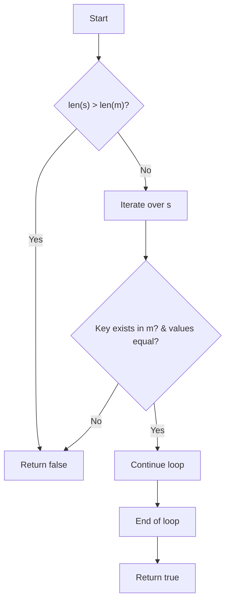
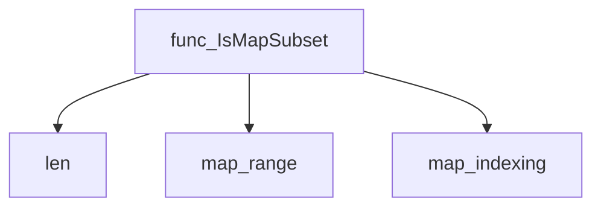

# Package datautil

**Path**: `internal/datautil`

## Table of Contents

- [Overview](#overview)
- [Exported Functions](#exported-functions)
  - [IsMapSubset](#ismapsubset)

## Overview

The datautil package provides small helper utilities for working with Go maps, currently offering a generic subset check that can be used to verify whether one map is contained within another.

### Key Features

- Generic `IsMapSubset` function that works on any comparable key type and any value type
- Simple boolean return indicating subset relationship
- No external dependencies – pure Go implementation

### Design Notes

- Relies on Go generics, so both maps must use the same key and value types; keys must be comparable
- The function only checks presence of keys and equality of values; it does not consider map ordering or other semantics
- Best used in configuration validation or test assertions where map containment needs to be verified

### Exported Functions Summary

| Name | Purpose |
|------|----------|
| [func IsMapSubset[K comparable, V comparable](m, s map[K]V) bool](#ismapsubset) | Determines if every key/value pair of `s` is present in `m`. Returns `true` when `s` is a subset of `m`; otherwise `false`. |

## Exported Functions

### IsMapSubset

**IsMapSubset** - Determines if every key/value pair of `s` is present in `m`. Returns `true` when `s` is a subset of `m`; otherwise `false`.


Checks whether one map is a subset of another, i.e., all key/value pairs in the second map exist identically in the first map.

---

#### Signature (Go)

```go
func IsMapSubset[K comparable, V comparable](m, s map[K]V) bool
```

---

#### Summary Table

| Aspect | Details |
|--------|---------|
| **Purpose** | Determines if every key/value pair of `s` is present in `m`. Returns `true` when `s` is a subset of `m`; otherwise `false`. |
| **Parameters** | `m map[K]V` – candidate superset; <br>`s map[K]V` – map to test as a subset. |
| **Return value** | `bool` – `true` if `s` ⊆ `m`, `false` otherwise. |
| **Key dependencies** | • `len()` (built‑in) <br>• Map indexing and range iteration |
| **Side effects** | None; purely functional, no mutation or I/O. |
| **How it fits the package** | Provides a generic utility for map comparison used by other data‑handling routines within the `datautil` package. |

---

#### Internal workflow (Mermaid)



---

#### Function dependencies (Mermaid)



---

#### Functions calling `IsMapSubset` (Mermaid)

None – this function is currently not referenced elsewhere in the package.

---

#### Usage example (Go)

```go
// Minimal example invoking IsMapSubset
package main

import (
	"fmt"

	"github.com/redhat-best-practices-for-k8s/certsuite/internal/datautil"
)

func main() {
	super := map[string]int{"a": 1, "b": 2, "c": 3}
	sub :=   map[string]int{"a": 1, "c": 3}

	if datautil.IsMapSubset(super, sub) {
		fmt.Println("sub is a subset of super")
	} else {
		fmt.Println("sub is NOT a subset of super")
	}
}
```

---

