# Package log

**Path**: `internal/log`

## Table of Contents

- [Overview](#overview)
- [Structs](#structs)
  - [CustomHandler](#customhandler)
  - [Logger](#logger)
  - [MultiHandler](#multihandler)
- [Exported Functions](#exported-functions)
  - [CloseGlobalLogFile](#closegloballogfile)
  - [CreateGlobalLogFile](#creategloballogfile)
  - [CustomHandler.Enabled](#customhandler.enabled)
  - [CustomHandler.Handle](#customhandler.handle)
  - [CustomHandler.WithAttrs](#customhandler.withattrs)
  - [CustomHandler.WithGroup](#customhandler.withgroup)
  - [Debug](#debug)
  - [Error](#error)
  - [Fatal](#fatal)
  - [GetLogger](#getlogger)
  - [GetMultiLogger](#getmultilogger)
  - [Info](#info)
  - [Logf](#logf)
  - [Logger.Debug](#logger.debug)
  - [Logger.Error](#logger.error)
  - [Logger.Fatal](#logger.fatal)
  - [Logger.Info](#logger.info)
  - [Logger.Warn](#logger.warn)
  - [Logger.With](#logger.with)
  - [MultiHandler.Enabled](#multihandler.enabled)
  - [MultiHandler.Handle](#multihandler.handle)
  - [MultiHandler.WithAttrs](#multihandler.withattrs)
  - [MultiHandler.WithGroup](#multihandler.withgroup)
  - [NewCustomHandler](#newcustomhandler)
  - [NewMultiHandler](#newmultihandler)
  - [SetLogger](#setlogger)
  - [SetupLogger](#setuplogger)
  - [Warn](#warn)
- [Local Functions](#local-functions)
  - [CustomHandler.appendAttr](#customhandler.appendattr)
  - [parseLevel](#parselevel)

## Overview

Provides a lightweight logging layer for the Certsuite project that wraps Go’s structured slog logger and supports custom formatting, multi‑writer output, and global configuration.

### Key Features

- CustomHandler formats log lines with level labels, timestamps, source file, and arbitrary attributes;
- MultiHandler aggregates multiple underlying handlers to enable simultaneous console, file, or other outputs;
- Global setup functions (SetupLogger, CreateGlobalLogFile) allow configuring log level and destination for the entire application.

### Design Notes

- Uses a global *Logger variable so all helpers can emit logs without passing a logger instance;
- CustomHandler ignores grouping information via WithGroup to keep output flat;
- Level parsing is case‑insensitive and errors are reported during SetupLogger, preventing silent misconfiguration.

### Structs Summary

| Name | Purpose |
|------|----------|
| [**CustomHandler**](#customhandler) | A lightweight slog handler that writes formatted log records to an arbitrary writer |
| [**Logger**](#logger) | Wrapper around Go's structured logger |
| [**MultiHandler**](#multihandler) | Aggregates multiple slog handlers |

### Exported Functions Summary

| Name | Purpose |
|------|----------|
| [func CloseGlobalLogFile() (error)](#closegloballogfile) | Safely shuts down the global log output by closing the underlying file handle. |
| [func CreateGlobalLogFile(outputDir, logLevel string) error](#creategloballogfile) | Deletes any existing log file in `outputDir`, creates a fresh one with permissions defined by `LogFilePermissions`, and sets up the global logger to write to this file. |
| [func (h *CustomHandler) Enabled(_ context.Context, level slog.Level) bool](#customhandler.enabled) | Checks whether the supplied `level` meets or exceeds the handler’s configured minimum logging level. |
| [func (h *CustomHandler) Handle(_ context.Context, r slog.Record) error](#customhandler.handle) | Formats and writes a single `slog.Record` as a log line: `<LEVEL> [TIME] [SOURCE_FILE] [CUSTOM_ATTRS] MSG\n`. |
| [func (h *CustomHandler) WithAttrs(attrs []slog.Attr) slog.Handler](#customhandler.withattrs) | Produces a new `slog.Handler` that includes the supplied attributes in addition to those already present on the receiver. If no attributes are provided, returns the original handler unchanged. |
| [func (h *CustomHandler) WithGroup(_ string) slog.Handler](#customhandler.withgroup) | Provides a placeholder implementation that returns `nil`, effectively discarding any grouping information. |
| [func(string, ...any)()](#debug) | Emits a log record at the *debug* level using the package’s global logger. |
| [func Error(msg string, args ...any)](#error) | Emits an error‑level log entry using the package’s global logger. |
| [func Fatal(msg string, args ...any)()](#fatal) | Logs a fatal message at the *LevelFatal* severity and terminates the program with exit code 1. |
| [func GetLogger() *Logger](#getlogger) | Provides access to the package‑wide `globalLogger`, enabling callers to log messages without exposing the underlying implementation. |
| [func GetMultiLogger(writers ...io.Writer) *Logger](#getmultilogger) | Builds a `*Logger` that forwards all log entries to every writer supplied, plus any global logger already configured. The logger uses custom attribute formatting for log levels. |
| [func Info(msg string, args ...any)](#info) | Emit an informational log entry by delegating to the package’s `Logf` helper. |
| [func Logf(logger *Logger, level, format string, args ...any)](#logf) | Formats and records a log entry using the provided `*Logger` at the given textual level. If the logger is nil it falls back to a default instance. It ensures that the call site information is correctly captured for accurate source references. |
| [func (logger *Logger) Debug(msg string, args ...any)](#logger.debug) | Emits a formatted log entry at the *debug* level. The message is forwarded to the underlying `slog.Logger` only if that level is enabled for the current context. |
| [func (logger *Logger) Error(msg string, args ...any)](#logger.error) | Records an error‑level log entry. It forwards the formatted message to `Logf`, specifying `LevelError`. |
| [func (logger *Logger) Fatal(msg string, args ...any)](#logger.fatal) | Emits a fatal log message at level *Fatal*, writes it to standard‑error, and exits the process with status 1. |
| [func (logger *Logger) Info(msg string, args ...any)](#logger.info) | Formats a message with optional arguments and records it at the *Info* level via `Logf`. |
| [func (logger *Logger) Warn(msg string, args ...any)](#logger.warn) | Records a log entry at the warning level using the configured `*slog.Logger`. |
| [func (logger *Logger) With(args ...any) *Logger](#logger.with) | Returns a new `*Logger` that inherits the underlying logger but augments it with extra key/value pairs supplied in `args`. This allows adding contextual information to log messages. |
| [func (h *MultiHandler) Enabled(ctx context.Context, level slog.Level) bool](#multihandler.enabled) | Returns `true` if at least one of the wrapped handlers is enabled for the supplied log level; otherwise returns `false`. |
| [func (h *MultiHandler) Handle(ctx context.Context, r slog.Record)(error)](#multihandler.handle) | Sends a single `slog.Record` to each handler stored in the receiver’s `handlers` slice. If any handler returns an error, the dispatch stops and that error is propagated. |
| [func (h *MultiHandler) WithAttrs(attrs []slog.Attr) slog.Handler](#multihandler.withattrs) | Produces a new `slog.Handler` that forwards each log record to all underlying handlers with the supplied attributes appended. |
| [func (h *MultiHandler) WithGroup(name string) slog.Handler](#multihandler.withgroup) | Creates a new handler that prefixes every log record with the specified group name for each underlying handler. |
| [func NewCustomHandler(out io.Writer, opts *slog.HandlerOptions) *CustomHandler](#newcustomhandler) | Constructs a `*CustomHandler` that routes log output to the supplied `io.Writer`, applying optional `slog.HandlerOptions`. If no options are provided, defaults are used. |
| [func NewMultiHandler(handlers ...slog.Handler) *MultiHandler](#newmultihandler) | Builds a `*MultiHandler` that forwards logging events to multiple underlying handlers. |
| [func SetLogger(l *Logger)](#setlogger) | Stores the supplied `*Logger` in the package‑wide variable `globalLogger`, making it available to all logging helpers. |
| [func SetupLogger(logWriter io.Writer, level string)](#setuplogger) | Parses the supplied textual log level, configures a custom `slog` handler that formats level labels, and assigns the resulting logger to the global variable. |
| [func Warn(msg string, args ...any)](#warn) | Sends a formatted warning message to the global logger. |

### Local Functions Summary

| Name | Purpose |
|------|----------|
| [func (h *CustomHandler) appendAttr(buf []byte, a slog.Attr) []byte](#customhandler.appendattr) | Formats a single `slog.Attr` into the log line and appends it to an existing byte buffer. Handles different attribute kinds (string, time, level, generic). |
| [func parseLevel(level string) (slog.Level, error)](#parselevel) | Translates a textual log level (e.g., `"debug"`, `"info"`) into the corresponding `slog.Level` value. If the input is not recognized, returns an error. |

## Structs

### CustomHandler

#### Fields

| Field | Type | Description |
|-------|------|-------------|
| `opts`  | `slog.HandlerOptions` | Configuration options such as the minimum log level, a custom attribute replacer, and time format. |
| `attrs` | `[]slog.Attr` | Default attributes that are added to every record emitted by this handler. |
| `mu`    | `*sync.Mutex` | Mutex protecting concurrent writes to `out`. |
| `out`   | `io.Writer`  | Destination stream (e.g., a file or stdout) where formatted log entries are written. |

#### Purpose

`CustomHandler` implements the `slog.Handler` interface, converting structured slog records into human‑readable lines. It serialises each record’s level, time, source location, message and any attached attributes, then writes the result to the configured writer. The handler supports a minimum log level filter, optional attribute replacement logic, and allows adding static attributes via `WithAttrs`. Thread safety is ensured with an internal mutex.

#### Related functions

| Function | Purpose |
|----------|---------|
| `NewCustomHandler` | Constructs a new handler, setting defaults for options and initializing the output writer. |
| `Enabled` | Determines whether a record at a given level should be processed based on the configured minimum level. |
| `Handle` | Formats a slog record into a byte slice and writes it to `out`. |
| `WithAttrs` | Creates a new handler that inherits existing attributes and appends additional ones, enabling context‑specific logging. |
| `WithGroup` | (Stub) returns nil; grouping is not supported by this handler. |
| `appendAttr` | Internal helper that resolves an attribute’s value and appends its formatted representation to the output buffer. |

---

---

### Logger

#### Fields

| Field | Type | Description |
|-------|------|-------------|
| `l` | `*slog.Logger` | The underlying standard library logger used to emit records. It is the only field; all operations delegate through it. |

#### Purpose

The `Logger` type encapsulates a `*slog.Logger` and provides a small, convenient API for emitting log messages at different severity levels (`Debug`, `Info`, `Warn`, `Error`, `Fatal`).  
It also supports creating new logger instances that inherit the context of an existing one via `With`.  The struct is stored in a package‑level variable (`globalLogger`) and can be retrieved or replaced through `GetLogger`/`SetLogger`.

#### Related functions

| Function | Purpose |
|----------|---------|
| `Debug(msg string, args ...any)` | Emits a debug‑level message. |
| `Info(msg string, args ...any)` | Emits an informational message. |
| `Warn(msg string, args ...any)` | Emits a warning message. |
| `Error(msg string, args ...any)` | Emits an error message. |
| `Fatal(msg string, args ...any)` | Emits a fatal message, writes to stderr and exits the process. |
| `With(args ...any) *Logger` | Returns a new `Logger` that carries additional attributes in its context. |
| `GetLogger() *Logger` | Retrieves the current global logger instance. |
| `SetLogger(l *Logger)` | Replaces the global logger with a supplied one. |
| `GetMultiLogger(writers ...io.Writer) *Logger` | Builds a new logger that writes to multiple writers, optionally including the existing global logger. |
| `Logf(logger *Logger, level, format string, args ...any)` | Low‑level helper used by the convenience methods; formats and records log entries at the specified level. |

---

---

### MultiHandler

#### Fields

| Field | Type | Description |
|-------|------|-------------|
| `handlers` | `[]slog.Handler` | A slice holding the individual handlers that compose this multi‑handler. |

#### Purpose  

`MultiHandler` implements the `slog.Handler` interface by delegating logging responsibilities to a collection of underlying handlers. When a log record is emitted, it forwards the record (cloned for safety) to each contained handler until one returns an error. The handler is considered enabled if any delegate reports that it can handle the given log level.

#### Related functions

| Function | Purpose |
|----------|---------|
| `NewMultiHandler` | Constructs a new `MultiHandler` from a variadic list of `slog.Handler` instances. |
| `Enabled` | Returns true if at least one underlying handler is enabled for the specified log level. |
| `Handle` | Sends a cloned log record to each underlying handler, stopping on the first error. |
| `WithAttrs` | Creates a new `MultiHandler` whose delegates are wrapped with the supplied attributes. |
| `WithGroup` | Creates a new `MultiHandler` whose delegates are wrapped with the specified group name. |

---

## Exported Functions

### CloseGlobalLogFile

**CloseGlobalLogFile** - Safely shuts down the global log output by closing the underlying file handle.

Closes the globally‑configured log file and returns any error encountered.

```go
func CloseGlobalLogFile() (error)
```

| Aspect | Details |
|--------|---------|
| **Purpose** | Safely shuts down the global log output by closing the underlying file handle. |
| **Parameters** | None |
| **Return value** | `error` – non‑nil if the file close operation fails; otherwise nil. |
| **Key dependencies** | Calls `Close()` on the `globalLogFile` variable (type `*os.File`). |
| **Side effects** | Releases the OS resource associated with the log file; may affect subsequent logging attempts. |
| **How it fits the package** | Provides a single point of cleanup for the package’s global logger, used during application shutdown. |

#### Internal workflow

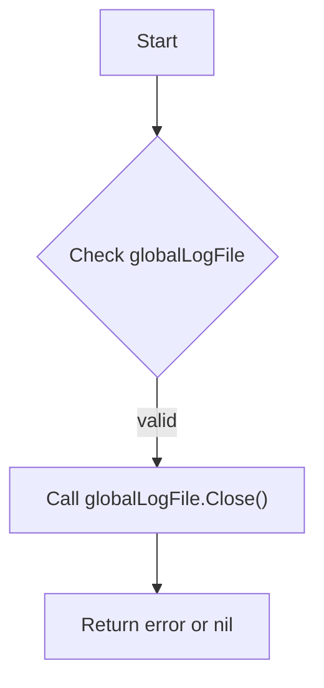

#### Function dependencies

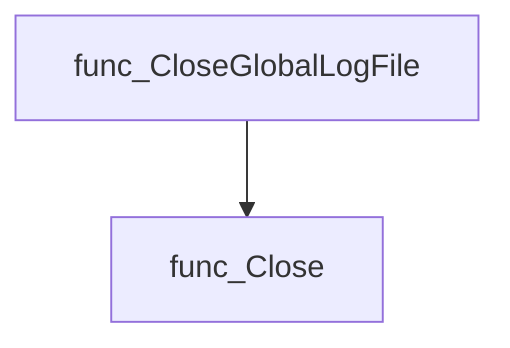

#### Functions calling `CloseGlobalLogFile`

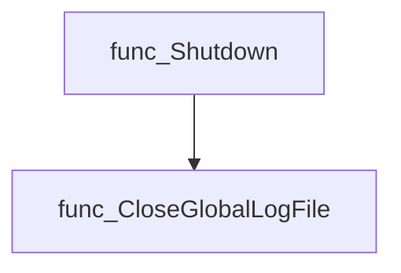

#### Usage example (Go)

```go
// Minimal example invoking CloseGlobalLogFile
package main

import (
 "fmt"
 "github.com/redhat-best-practices-for-k8s/certsuite/internal/log"
)

func main() {
 if err := log.CloseGlobalLogFile(); err != nil {
  fmt.Fprintf(os.Stderr, "Could not close the log file: %v\n", err)
 }
}
```

---

### CreateGlobalLogFile

**CreateGlobalLogFile** - Deletes any existing log file in `outputDir`, creates a fresh one with permissions defined by `LogFilePermissions`, and sets up the global logger to write to this file.

#### Signature (Go)

```go
func CreateGlobalLogFile(outputDir, logLevel string) error
```

#### Summary Table

| Aspect | Details |
|--------|---------|
| **Purpose** | Deletes any existing log file in `outputDir`, creates a fresh one with permissions defined by `LogFilePermissions`, and sets up the global logger to write to this file. |
| **Parameters** | `outputDir string` – directory where the log should reside.<br>`logLevel string` – textual log level (e.g., “debug”, “info”). |
| **Return value** | `error` – non‑nil if removal or creation of the log file fails. |
| **Key dependencies** | • `os.Remove`, `os.IsNotExist`<br>• `fmt.Errorf`<br>• `os.OpenFile`<br>• `SetupLogger` (internal helper that configures the slog logger) |
| **Side effects** | • Deletes existing log file if present.<br>• Creates a new file and assigns it to `globalLogFile`. <br>• Calls `SetupLogger`, which mutates the package‑level `globalLogger`. |
| **How it fits the package** | This function is invoked during application startup (e.g., in `certsuite.Startup`) or by the web server to initialise logging before any other component writes logs. It centralises log file handling for the entire suite. |

#### Internal workflow

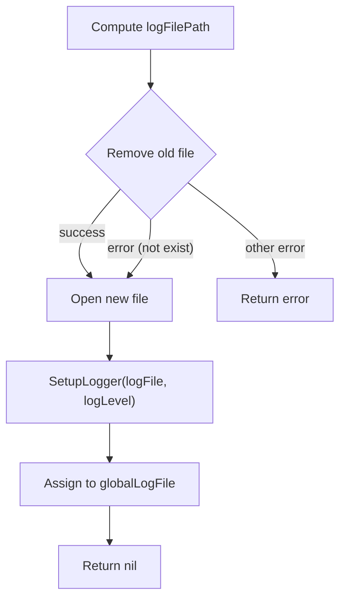

#### Function dependencies

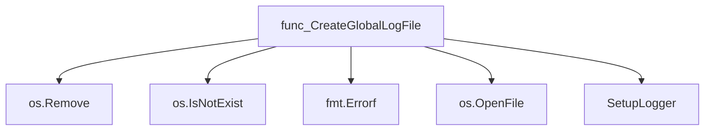

#### Functions calling `CreateGlobalLogFile`

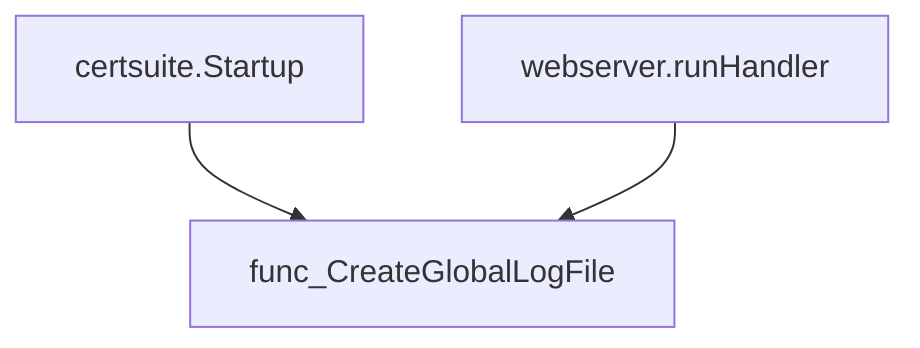

#### Usage example (Go)

```go
// Minimal example invoking CreateGlobalLogFile
package main

import (
    "github.com/redhat-best-practices-for-k8s/certsuite/internal/log"
)

func main() {
    // Assume output directory and desired log level are known.
    err := log.CreateGlobalLogFile("/var/log/certsuite", "debug")
    if err != nil {
        panic(err)
    }
}
```

---

### CustomHandler.Enabled

**Enabled** - Checks whether the supplied `level` meets or exceeds the handler’s configured minimum logging level.

#### 1) Signature (Go)

```go
func (h *CustomHandler) Enabled(_ context.Context, level slog.Level) bool
```

#### 2) Summary Table

| Aspect | Details |
|--------|---------|
| **Purpose** | Checks whether the supplied `level` meets or exceeds the handler’s configured minimum logging level. |
| **Parameters** | `_ context.Context` – ignored; `<level> slog.Level` – log entry’s severity. |
| **Return value** | `bool` – `true` if the message should be logged, otherwise `false`. |
| **Key dependencies** | Calls `h.opts.Level.Level()` to retrieve the threshold level from options. |
| **Side effects** | None; purely a decision function. |
| **How it fits the package** | Acts as part of the custom log handler’s filtering logic within the internal logging subsystem. |

#### 3) Internal workflow (Mermaid)

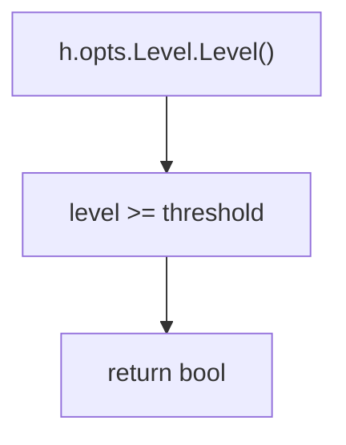

#### 4) Function dependencies (Mermaid)

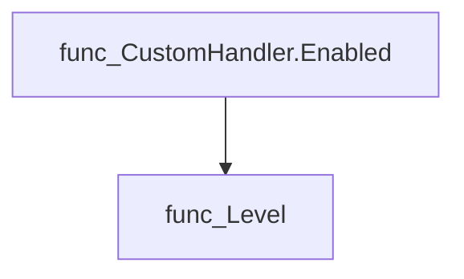

#### 5) Functions calling `CustomHandler.Enabled` (Mermaid)

None – this function is currently not referenced elsewhere in the package.

#### 6) Usage example (Go)

```go
// Minimal example invoking CustomHandler.Enabled
package main

import (
 "context"
 "log/slog"

 "github.com/redhat-best-practices-for-k8s/certsuite/internal/log"
)

func main() {
 h := &log.CustomHandler{
  opts: log.Options{Level: slog.LevelInfo}, // assumed struct for illustration
 }
 ctx := context.Background()
 if h.Enabled(ctx, slog.LevelWarn) {
  // proceed with logging the warning
 }
}
```

---

### CustomHandler.Handle

**Handle** - Formats and writes a single `slog.Record` as a log line: `<LEVEL> [TIME] [SOURCE_FILE] [CUSTOM_ATTRS] MSG\n`.

#### Signature (Go)

```go
func (h *CustomHandler) Handle(_ context.Context, r slog.Record) error
```

#### Summary Table

| Aspect | Details |
|--------|---------|
| **Purpose** | Formats and writes a single `slog.Record` as a log line: `<LEVEL> [TIME] [SOURCE_FILE] [CUSTOM_ATTRS] MSG\n`. |
| **Parameters** | `_ context.Context – discarded; <br>` `r slog.Record – the record to be logged` |
| **Return value** | `error – any write error, otherwise nil` |
| **Key dependencies** | *`h.opts.ReplaceAttr` (optional) <br>* `slog.Any`, `slog.Time`, `slog.String` <br>*`CustomHandler.appendAttr` <br>* `runtime.CallersFrames`, `CallersFrames.Next()` <br>*`fmt.Sprintf`, `filepath.Base` <br>* `bytes.Append` (built‑in) <br>*`h.mu.Lock/Unlock` <br>* `h.out.Write` |
| **Side effects** | *Mutates internal mutex lock. <br>* Writes formatted bytes to the handler’s output stream. |
| **How it fits the package** | Implements the `slog.Handler` interface for a custom log format used throughout the `certsuite/internal/log` package. |

#### Internal workflow (Mermaid)

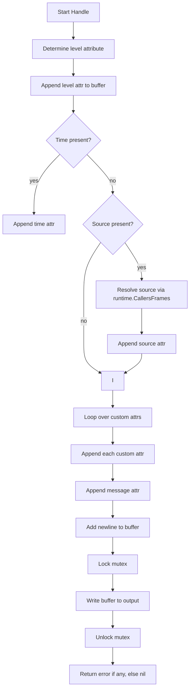

#### Function dependencies (Mermaid)

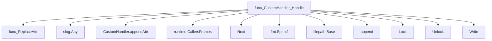

#### Functions calling `CustomHandler.Handle` (Mermaid)

None – this function is currently not referenced elsewhere in the package.

#### Usage example (Go)

```go
// Minimal example invoking CustomHandler.Handle
package main

import (
    "context"
    "log/slog"

    "github.com/redhat-best-practices-for-k8s/certsuite/internal/log"
)

func main() {
    // Create a handler that writes to standard output
    h := &log.CustomHandler{
        out: os.Stdout,
    }

    // Construct a log record
    r := slog.Record{
        Level:   slog.LevelInfo,
        Time:    time.Now(),
        Message: "Hello, world!",
    }

    // Handle the record (normally called by slog)
    if err := h.Handle(context.Background(), r); err != nil {
        panic(err)
    }
}
```

---

---

### CustomHandler.WithAttrs

**WithAttrs** - Produces a new `slog.Handler` that includes the supplied attributes in addition to those already present on the receiver. If no attributes are provided, returns the original handler unchanged.

#### Signature (Go)

```go
func (h *CustomHandler) WithAttrs(attrs []slog.Attr) slog.Handler
```

#### Summary Table

| Aspect | Details |
|--------|---------|
| **Purpose** | Produces a new `slog.Handler` that includes the supplied attributes in addition to those already present on the receiver. If no attributes are provided, returns the original handler unchanged. |
| **Parameters** | `attrs []slog.Attr` – slice of log attributes to append. |
| **Return value** | `slog.Handler` – a handler instance with combined attributes; may be the same instance if `attrs` is empty. |
| **Key dependencies** | • `len`, `make`, `copy`, `append` from the Go runtime<br>• `slog.Attr` type from the standard library |
| **Side effects** | Creates a shallow copy of the receiver and a new attribute slice; no mutation of the original handler or its fields. No I/O or concurrency concerns. |
| **How it fits the package** | Allows callers to extend a custom logging handler with context‑specific attributes while preserving immutability, aligning with the `slog.Handler` interface contract. |

#### Internal workflow (Mermaid)

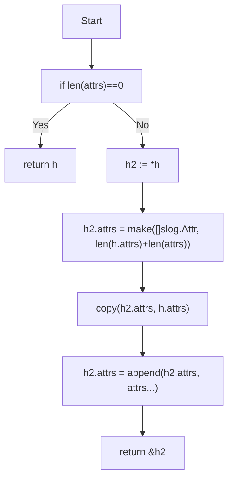

#### Function dependencies (Mermaid)

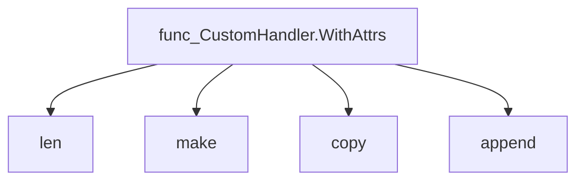

#### Functions calling `CustomHandler.WithAttrs` (Mermaid)

None – this function is currently not referenced elsewhere in the package.

#### Usage example (Go)

```go
// Minimal example invoking CustomHandler.WithAttrs
import (
    "log/slog"
    "github.com/redhat-best-practices-for-k8s/certsuite/internal/log"
)

func main() {
    base := log.NewCustomHandler(slog.LevelInfo, slog.NewJSONEncoder(nil))
    // Add a user ID attribute to the handler
    extended := base.WithAttrs([]slog.Attr{
        slog.String("user_id", "alice"),
    })
    logger := slog.New(extended)
    logger.Info("User logged in")
}
```

---

### CustomHandler.WithGroup

**WithGroup** - Provides a placeholder implementation that returns `nil`, effectively discarding any grouping information.

#### Signature (Go)

```go
func (h *CustomHandler) WithGroup(_ string) slog.Handler
```

#### Summary Table

| Aspect | Details |
|--------|---------|
| **Purpose** | Provides a placeholder implementation that returns `nil`, effectively discarding any grouping information. |
| **Parameters** | `_ string` – the name of the group; unused in this stub. |
| **Return value** | `slog.Handler` – always `nil`. |
| **Key dependencies** | None (no external calls). |
| **Side effects** | None – no state changes or I/O. |
| **How it fits the package** | Implements the `WithGroup` method required by the `slog.Handler` interface, allowing a `CustomHandler` to satisfy the interface contract while not supporting grouping. |

#### Internal workflow (Mermaid)

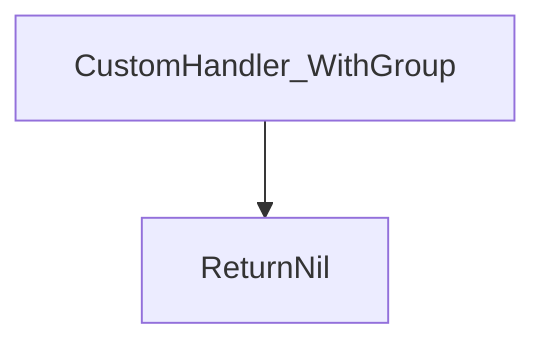

#### Function dependencies

None – this function is currently not referenced elsewhere in the package.

#### Functions calling `CustomHandler.WithGroup`

None – this function is currently not referenced elsewhere in the package.

#### Usage example (Go)

```go
// Minimal example invoking CustomHandler.WithGroup
package main

import (
 "log/slog"
)

type CustomHandler struct{}

func (h *CustomHandler) WithGroup(_ string) slog.Handler {
 return nil
}

func main() {
 var h CustomHandler
 grouped := h.WithGroup("example")
 if grouped == nil {
  println("grouping not supported, received nil handler")
 }
}
```

---

### Debug

**Debug** - Emits a log record at the *debug* level using the package’s global logger.

#### Signature (Go)

```go
func(string, ...any)()
```

#### Summary Table

| Aspect | Details |
|--------|---------|
| **Purpose** | Emits a log record at the *debug* level using the package’s global logger. |
| **Parameters** | `msg string –` format string for the message.<br>`args …any –` optional values to interpolate into `msg`. |
| **Return value** | None (the function is fire‑and‑forget). |
| **Key dependencies** | • Calls `Logf` internally.<br>• Uses `globalLogger` and `LevelDebug`. |
| **Side effects** | Writes a log entry via the global logger; no state mutation beyond that. |
| **How it fits the package** | Provides a convenient, zero‑configuration wrapper for emitting debug logs from any package without passing a logger explicitly. |

#### Internal workflow (Mermaid)

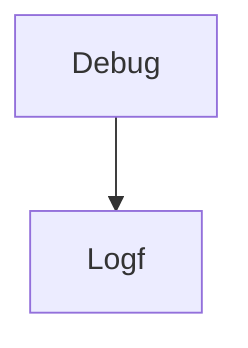

#### Function dependencies (Mermaid)

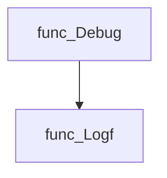

#### Functions calling `Debug` (Mermaid)

None – this function is currently not referenced elsewhere in the package.

#### Usage example (Go)

```go
// Minimal example invoking Debug
package main

import "github.com/redhat-best-practices-for-k8s/certsuite/internal/log"

func main() {
    log.Debug("Starting up with %d workers", 4)
}
```

---

### Error

**Error** - Emits an error‑level log entry using the package’s global logger.

#### Signature (Go)

```go
func Error(msg string, args ...any)
```

#### Summary Table

| Aspect | Details |
|--------|---------|
| **Purpose** | Emits an error‑level log entry using the package’s global logger. |
| **Parameters** | `msg string` – format string; `args ...any` – values for formatting. |
| **Return value** | None. |
| **Key dependencies** | Calls `Logf(globalLogger, LevelError, msg, args...)`. |
| **Side effects** | Writes a log record via the global logger’s handler; may terminate the program if the underlying handler is fatal. |
| **How it fits the package** | Provides a convenience wrapper for error‑level logging that hides the logger and level details from callers. |

#### Internal workflow (Mermaid)

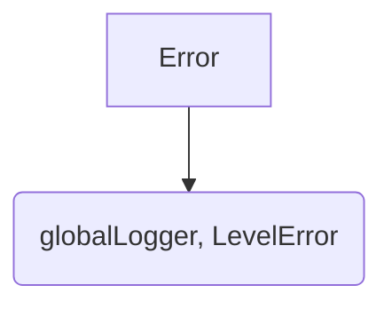

#### Function dependencies

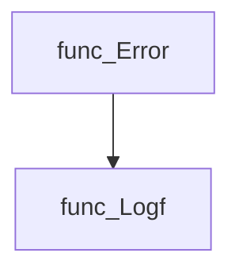

#### Functions calling `Error`

None – this function is currently not referenced elsewhere in the package.

#### Usage example (Go)

```go
// Minimal example invoking Error
package main

import (
 "github.com/redhat-best-practices-for-k8s/certsuite/internal/log"
)

func main() {
 log.Error("Failed to connect to %s: %v", "database", err)
}
```

---

### Fatal

**Fatal** - Logs a fatal message at the *LevelFatal* severity and terminates the program with exit code 1.

#### Signature (Go)

```go
func Fatal(msg string, args ...any)()
```

#### Summary Table

| Aspect | Details |
|--------|---------|
| **Purpose** | Logs a fatal message at the *LevelFatal* severity and terminates the program with exit code 1. |
| **Parameters** | `msg` – format string for the log message.<br>`args …any` – optional arguments to be formatted into `msg`. |
| **Return value** | None (function exits the process). |
| **Key dependencies** | • `Logf(globalLogger, LevelFatal, msg, args…)`<br>• `fmt.Fprintf(os.Stderr, ...)`<br>• `os.Exit(1)` |
| **Side effects** | Writes a formatted fatal message to standard error and terminates the running process. |
| **How it fits the package** | Provides a convenience wrapper for emitting critical errors that should stop execution immediately. |

#### Internal workflow (Mermaid)

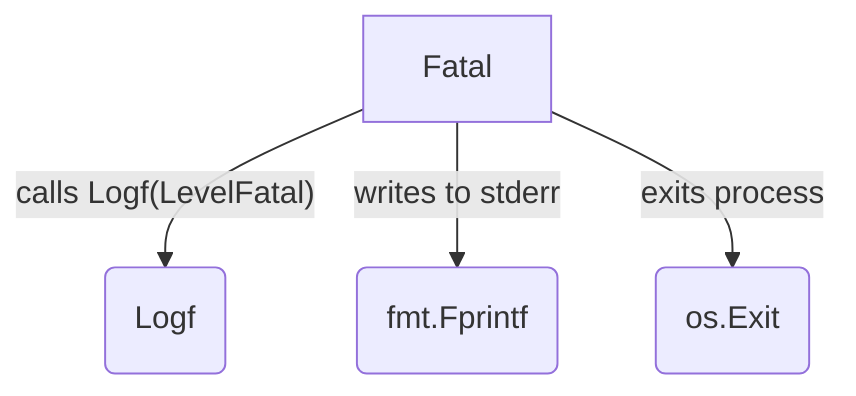

#### Function dependencies (Mermaid)

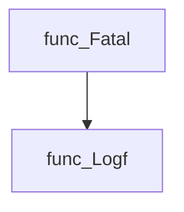

#### Functions calling `Fatal` (Mermaid)

None – this function is currently not referenced elsewhere in the package.

#### Usage example (Go)

```go
// Minimal example invoking Fatal
package main

import (
 "github.com/redhat-best-practices-for-k8s/certsuite/internal/log"
)

func main() {
 log.Fatal("unexpected error: %v", err) // logs and exits
}
```

---

### GetLogger

**GetLogger** - Provides access to the package‑wide `globalLogger`, enabling callers to log messages without exposing the underlying implementation.

Retrieve the globally initialized logger instance used by the package.

```go
func GetLogger() *Logger
```

| Aspect | Details |
|--------|---------|
| **Purpose** | Provides access to the package‑wide `globalLogger`, enabling callers to log messages without exposing the underlying implementation. |
| **Parameters** | None |
| **Return value** | A pointer to the shared `Logger` instance (`*Logger`). |
| **Key dependencies** | *None – the function simply returns a global variable.* |
| **Side effects** | No state changes; purely read‑only access. |
| **How it fits the package** | Serves as the public entry point for obtaining the logger configured elsewhere in the `log` package, promoting encapsulation of logging logic. |

#### Internal workflow

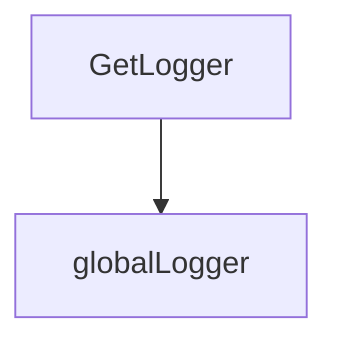

#### Function dependencies  

None – this function is currently not referenced elsewhere in the package.

#### Functions calling `GetLogger`

None – this function is currently not referenced elsewhere in the package.

#### Usage example (Go)

```go
// Minimal example invoking GetLogger
package main

import (
    "github.com/redhat-best-practices-for-k8s/certsuite/internal/log"
)

func main() {
    logger := log.GetLogger()
    logger.Info("Application started")
}
```

---

### GetMultiLogger

**GetMultiLogger** - Builds a `*Logger` that forwards all log entries to every writer supplied, plus any global logger already configured. The logger uses custom attribute formatting for log levels.

#### Signature (Go)

```go
func GetMultiLogger(writers ...io.Writer) *Logger
```

#### Summary Table

| Aspect | Details |
|--------|---------|
| **Purpose** | Builds a `*Logger` that forwards all log entries to every writer supplied, plus any global logger already configured. The logger uses custom attribute formatting for log levels. |
| **Parameters** | `<writers> io.Writer… – One or more writers (e.g., buffers, files) where logs should be emitted. |
| **Return value** | `*Logger` – a wrapper around an `slog.Logger` that dispatches to the created multi‑handler. |
| **Key dependencies** | • `log/slog.HandlerOptions`, `log/slog.NewMultiHandler`, <br>• `NewCustomHandler` (internal helper) <br>• `globalLogLevel`, `CustomLevelNames`, `globalLogger` (package globals) |
| **Side effects** | Creates handler objects and stores them in a new logger; does not modify external state beyond logger construction. No I/O occurs here—logging happens when the returned logger is used. |
| **How it fits the package** | Provides a convenient way for other parts of the application (e.g., checks, web handlers) to obtain a unified logging surface that writes simultaneously to console, files, or in‑memory buffers. |

#### Internal workflow

```mermaid
flowchart TD
  A["Receive writers"] --> B{"Is global logger set?"}
  B -- Yes --> C["Add global handler"]
  B -- No --> D["Skip"]
  C & D --> E["Loop over each writer"]
  E --> F["Create CustomHandler with options"]
  F --> G["Collect all handlers"]
  G --> H["Instantiate NewMultiHandler"]
  H --> I["Wrap in slog.New and return Logger"]
```

#### Function dependencies

```mermaid
graph TD
  func_GetMultiLogger --> func_NewCustomHandler
  func_GetMultiLogger --> log/slog/NewMultiHandler
  func_GetMultiLogger --> log/slog/ReplaceAttr
```

#### Functions calling `GetMultiLogger`

```mermaid
graph TD
  func_NewCheck --> func_GetMultiLogger
  runHandler --> func_GetMultiLogger
```

#### Usage example (Go)

```go
// Minimal example invoking GetMultiLogger
package main

import (
 "os"

 "github.com/redhat-best-practices-for-k8s/certsuite/internal/log"
)

func main() {
 // Log to both standard output and a file.
 file, _ := os.Create("app.log")
 defer file.Close()

 logger := log.GetMultiLogger(os.Stdout, file)
 logger.Info("Application started")
}
```

---

---

### Info

**Info** - Emit an informational log entry by delegating to the package’s `Logf` helper.

Logs a message at the *info* level using the global logger.

```go
func Info(msg string, args ...any)
```

| Aspect | Details |
|--------|---------|
| **Purpose** | Emit an informational log entry by delegating to the package’s `Logf` helper. |
| **Parameters** | `msg string` – format string; `<args ...any>` – optional arguments for formatting. |
| **Return value** | None (side‑effect only). |
| **Key dependencies** | Calls `Logf(globalLogger, LevelInfo, msg, args...)`. |
| **Side effects** | Writes to the global logger’s handler; may terminate program if log level parsing fails. |
| **How it fits the package** | Provides a convenient shorthand for logging at the *info* level without requiring callers to specify the logger or level explicitly. |

#### Internal workflow

```mermaid
flowchart TD
  func_Info --> func_Logf
```

#### Function dependencies

```mermaid
graph TD
  func_Info --> func_Logf
```

#### Functions calling `Info`

None – this function is currently not referenced elsewhere in the package.

#### Usage example

```go
// Minimal example invoking Info
package main

import (
    "github.com/redhat-best-practices-for-k8s/certsuite/internal/log"
)

func main() {
    log.Info("Starting application with args: %v", os.Args)
}
```

---

### Logf

**Logf** - Formats and records a log entry using the provided `*Logger` at the given textual level. If the logger is nil it falls back to a default instance. It ensures that the call site information is correctly captured for accurate source references.

#### Signature (Go)

```go
func Logf(logger *Logger, level, format string, args ...any)
```

#### Summary Table

| Aspect | Details |
|--------|---------|
| **Purpose** | Formats and records a log entry using the provided `*Logger` at the given textual level. If the logger is nil it falls back to a default instance. It ensures that the call site information is correctly captured for accurate source references. |
| **Parameters** | `logger *Logger` – target logger (may be nil). <br> `level string` – human‑readable log level (“debug”, “info”, etc.). <br> `format string` – printf‑style format string. <br> `args ...any` – values to interpolate into the format string. |
| **Return value** | None (void). The function may terminate the process if the level cannot be parsed or if the logger’s underlying handler is fatal. |
| **Key dependencies** | • `log/slog.Default()` for default logger <br>• `parseLevel` to map level string → `slog.Level` <br>• `runtime.Callers` to capture stack frame <br>• `time.Now`, `fmt.Sprintf`, `slog.NewRecord`, and the logger’s handler via `.Handler().Handle` |
| **Side effects** | • May call `logger.Fatal` which writes to stderr and exits. <br>• Emits a log record via the handler (potential I/O). <br>• No global state mutation beyond the logger passed in. |
| **How it fits the package** | Central logging helper used by all wrapper functions (`Debug`, `Info`, etc.) and by higher‑level components (`Check.Log…`). It guarantees that logs include correct source location data and respects the configured log level hierarchy. |

#### Internal workflow (Mermaid)

```mermaid
flowchart TD
  A["Start"] --> B{"logger nil?"}
  B -- yes --> C["Create default Logger"]
  B -- no --> E["Parse level string"]
  C --> E
  E --> F{"parse error?"}
  F -- yes --> G["Fatal error → exit"]
  F -- no --> H["Check handler enabled?"]
  H -- false --> I["Return early"]
  H -- true --> J["Capture caller PC"]
  J --> K["Build slog.Record"]
  K --> L["Invoke handler.Handle"]
  L --> M["End"]
```

#### Function dependencies (Mermaid)

```mermaid
graph TD
  func_Logf --> func_Default
  func_Logf --> parseLevel
  func_Logf --> runtime.Callers
  func_Logf --> slog.NewRecord
  func_Logf --> time.Now
  func_Logf --> fmt.Sprintf
  func_Logf --> Handler.Handle
```

#### Functions calling `Logf` (Mermaid)

```mermaid
graph TD
  Debug --> Logf
  Error --> Logf
  Fatal --> Logf
  Info --> Logf
  Warn --> Logf
  Logger.Debug --> Logf
  Logger.Error --> Logf
  Logger.Fatal --> Logf
  Logger.Info --> Logf
  Logger.Warn --> Logf
  Check.LogDebug --> Logf
  Check.LogError --> Logf
  Check.LogFatal --> Logf
  Check.LogInfo --> Logf
  Check.LogWarn --> Logf
```

#### Usage example (Go)

```go
// Minimal example invoking Logf
package main

import (
    "github.com/redhat-best-practices-for-k8s/certsuite/internal/log"
)

func main() {
    // Use the global logger or create a custom one.
    log.Logf(log.DefaultLogger(), "info", "Hello %s!", "world")
}
```

---

### Logger.Debug

**Debug** - Emits a formatted log entry at the *debug* level. The message is forwarded to the underlying `slog.Logger` only if that level is enabled for the current context.

#### 1) Signature (Go)

```go
func (logger *Logger) Debug(msg string, args ...any)
```

#### 2) Summary Table

| Aspect | Details |
|--------|---------|
| **Purpose** | Emits a formatted log entry at the *debug* level. The message is forwarded to the underlying `slog.Logger` only if that level is enabled for the current context. |
| **Parameters** | `msg string` – format string; `args ...any` – values to substitute in the format string (similar to `fmt.Sprintf`). |
| **Return value** | None – the function writes to the logger and returns immediately. |
| **Key dependencies** | • Calls `Logf(logger, LevelDebug, msg, args...)`. <br>• Relies on the global logging configuration (`LevelDebug` constant). |
| **Side effects** | Writes a log record via the wrapped `slog.Logger`; may trigger I/O to stdout or a file depending on logger setup. No state mutation beyond that. |
| **How it fits the package** | Provides a convenient, type‑safe shortcut for emitting debug messages; used throughout the codebase wherever diagnostic information is desired without cluttering with level checks. |

#### 3) Internal workflow (Mermaid)

```mermaid
flowchart TD
  A["Logger.Debug(msg,args...)"] --> B["Logf(logger, LevelDebug, msg, args...)"]
  B --> C["slog.Logger emits record if enabled"]
```

#### 4) Function dependencies (Mermaid)

```mermaid
graph TD
  func_Logger.Debug --> func_Logf
```

#### 5) Functions calling `Logger.Debug` (Mermaid)

```mermaid
graph TD
  func_Clientsholder.ExecCommandContainer --> func_Logger.Debug
  func_GetContainerPidNamespace --> func_Logger.Debug
  func_GetPidFromContainer --> func_Logger.Debug
  func_CompressResultsArtifacts --> func_Logger.Debug
  func_GetCertIDFromConnectAPI --> func_Logger.Debug
  func_SendResultsToConnectAPI --> func_Logger.Debug
  func_sendRequest --> func_Logger.Debug
  func_setProxy --> func_Logger.Debug
  func_DoAutoDiscover --> func_Logger.Debug
```

#### 6) Usage example (Go)

```go
// Minimal example invoking Logger.Debug
package main

import (
 "github.com/redhat-best-practices-for-k8s/certsuite/internal/log"
)

func main() {
 logger := log.NewLogger(log.LevelDebug)
 logger.Debug("Starting process %d with args: %+v", 42, []string{"foo", "bar"})
}
```

This example creates a logger at the debug level and writes a formatted message using `Logger.Debug`.

---

### Logger.Error

**Error** - Records an error‑level log entry. It forwards the formatted message to `Logf`, specifying `LevelError`.

#### Signature (Go)

```go
func (logger *Logger) Error(msg string, args ...any)
```

#### Summary Table

| Aspect | Details |
|--------|---------|
| **Purpose** | Records an error‑level log entry. It forwards the formatted message to `Logf`, specifying `LevelError`. |
| **Parameters** | `msg string` – format string for the log message.<br>`args ...any` – optional arguments that are substituted into `msg`. |
| **Return value** | None. The function performs side effects only. |
| **Key dependencies** | - Calls `Logf(logger, LevelError, msg, args...)`.<br>- Relies on the global log level handling in `Logf`. |
| **Side effects** | Emits a formatted log record to the logger’s underlying `slog.Logger`. No state is returned. |
| **How it fits the package** | Provides a convenient, type‑safe method for emitting error logs within the internal logging package. It abstracts away the level handling and integrates with the rest of the logging infrastructure. |

#### Internal workflow (Mermaid)

```mermaid
flowchart TD
  A["Logger.Error"] --> B{"Format message"}
  B --> C["Call Logf(logger, LevelError, msg, args...)"]
  C --> D["Logf checks level and handles record"]
```

#### Function dependencies (Mermaid)

```mermaid
graph TD
  func_Logger.Error --> func_Logf
```

#### Functions calling `Logger.Error` (Mermaid)

```mermaid
graph TD
  func_main --> func_Logger.Error
  func_NewCommand --> func_Logger.Error
  func_addPreflightTestsToCatalog --> func_Logger.Error
  func_outputJS --> func_Logger.Error
  func_outputTestCases --> func_Logger.Error
  func_ExecCommandContainer --> func_Logger.Error
  func_getMachineConfig --> func_Logger.Error
  func_GetPidsFromPidNamespace --> func_Logger.Error
  func_setProxy --> func_Logger.Error
  func_CreateLabels --> func_Logger.Error
  func_DoAutoDiscover --> func_Logger.Error
  func_getCatalogSourceBundleCountFromProbeContainer --> func_Logger.Error
```

#### Usage example (Go)

```go
// Minimal example invoking Logger.Error
package main

import (
 "github.com/redhat-best-practices-for-k8s/certsuite/internal/log"
)

func main() {
 logger := log.NewDefault()
 err := someOperation()
 if err != nil {
  logger.Error("operation failed: %v", err)
 }
}

func someOperation() error {
 return fmt.Errorf("example failure")
}
```

---

---

### Logger.Fatal

**Fatal** - Emits a fatal log message at level *Fatal*, writes it to standard‑error, and exits the process with status 1.

#### Signature (Go)

```go
func (logger *Logger) Fatal(msg string, args ...any)
```

#### Summary Table

| Aspect | Details |
|--------|---------|
| **Purpose** | Emits a fatal log message at level *Fatal*, writes it to standard‑error, and exits the process with status 1. |
| **Parameters** | `msg` – format string; `args...` – optional arguments for formatting. |
| **Return value** | None (terminates execution). |
| **Key dependencies** | - `Logf(logger, LevelFatal, msg, args...)` to record the message via the logger’s handler.<br>- `fmt.Fprintf(os.Stderr, …)` to output a human‑readable fatal line.<br>- `os.Exit(1)` to terminate. |
| **Side effects** | - Adds a log record at *Fatal* level.<br>- Writes to standard‑error.<br>- Stops the process immediately; any deferred functions are not run. |
| **How it fits the package** | Provides a convenience wrapper for critical failures, ensuring consistent formatting and immediate program termination across the `log` package. |

#### Internal workflow (Mermaid)

```mermaid
flowchart TD
  A["Receive msg & args"] --> B{"Format message"}
  B --> C["Call Logf with LevelFatal"]
  C --> D["Print to stderr via fmt.Fprintf"]
  D --> E["Exit(1)"]
```

#### Function dependencies (Mermaid)

```mermaid
graph TD
  func_Logger.Fatal --> func_Logf
  func_Logger.Fatal --> pkg_fmt.Fprintf
  func_Logger.Fatal --> pkg_os.Exit
```

#### Functions calling `Logger.Fatal` (Mermaid)

None – this function is currently not referenced elsewhere in the package.

#### Usage example (Go)

```go
// Minimal example invoking Logger.Fatal
package main

import (
    "github.com/redhat-best-practices-for-k8s/certsuite/internal/log"
)

func main() {
    logger := log.NewLogger()
    // Simulate a critical error condition
    if err := doSomething(); err != nil {
        logger.Fatal("Critical failure: %v", err)
    }
}

func doSomething() error {
    return fmt.Errorf("simulated error")
}
```

*The program will print the formatted message to standard‑error and terminate with exit code 1.*

---

### Logger.Info

**Info** - Formats a message with optional arguments and records it at the *Info* level via `Logf`.

#### Signature (Go)

```go
func (logger *Logger) Info(msg string, args ...any)
```

#### Summary Table

| Aspect | Details |
|--------|---------|
| **Purpose** | Formats a message with optional arguments and records it at the *Info* level via `Logf`. |
| **Parameters** | `msg` – format string (similar to `fmt.Sprintf`). <br> `args…any` – variadic values used in formatting. |
| **Return value** | None |
| **Key dependencies** | Calls: `Logf(logger, LevelInfo, msg, args...)`. Uses the global log level constants (`LevelInfo`). |
| **Side effects** | Writes a formatted record to the logger’s underlying handler if the *Info* level is enabled. No state changes on the caller beyond logging. |
| **How it fits the package** | Provides a convenient wrapper for emitting informational logs, used throughout the codebase (e.g., during startup, configuration loading, and operation progress). |

#### Internal workflow (Mermaid)

```mermaid
flowchart TD
  A["Receive msg & args"] --> B{"Check logger"}
  B -->|"nil"| C["Create default Logger"]
  B -->|"valid"| D["Call Logf with LevelInfo"]
```

#### Function dependencies (Mermaid)

```mermaid
graph TD
  func_Logger.Info --> func_Logf
```

#### Functions calling `Logger.Info` (Mermaid)

```mermaid
graph TD
  func_runTestSuite --> func_Logger.Info
  func_getClusterRestConfig --> func_Logger.Info
  func_newClientsHolder --> func_Logger.Info
  func_CompressResultsArtifacts --> func_Logger.Info
  func_GetCertIDFromConnectAPI --> func_Logger.Info
  func_SendResultsToConnectAPI --> func_Logger.Info
  func_DoAutoDiscover --> func_Logger.Info
```

#### Usage example (Go)

```go
// Minimal example invoking Logger.Info
package main

import (
 "github.com/redhat-best-practices-for-k8s/certsuite/internal/log"
)

func main() {
 // Obtain a logger instance (could be the global one)
 logger := log.GetLogger()

 // Emit an informational message with formatted arguments
 logger.Info("Processing %d items, current status: %s", 42, "running")
}
```

---

### Logger.Warn

**Warn** - Records a log entry at the warning level using the configured `*slog.Logger`.

#### Signature (Go)

```go
func (logger *Logger) Warn(msg string, args ...any)
```

#### Summary Table

| Aspect | Details |
|--------|---------|
| **Purpose** | Records a log entry at the warning level using the configured `*slog.Logger`. |
| **Parameters** | `msg` – format string; `args` – optional values to interpolate into `msg`. |
| **Return value** | None (void). |
| **Key dependencies** | • Calls the package‑level helper `Logf` with `LevelWarn`. <br>• Relies on `slog.Logger` for formatting and handling. |
| **Side effects** | Writes a log record via the underlying logger’s handler; may trigger side‑effects of that handler (e.g., file writes, network output). Does not modify any package‑level state. |
| **How it fits the package** | Provides a convenient method on `Logger` for emitting warning messages, delegating to the generic `Logf` routine so all level‑specific methods share the same formatting and dispatch logic. |

#### Internal workflow (Mermaid)

```mermaid
flowchart TD
  Logger.Warn(msg,args) --> Logf(logger,LevelWarn,msg,args)
```

#### Function dependencies (Mermaid)

```mermaid
graph TD
  func_Logf --> func_parseLevel
  func_Logf --> func_slog.NewRecord
  func_Logf --> func_handler.Handle
```

#### Functions calling `Logger.Warn` (Mermaid)

None – this function is currently not referenced elsewhere in the package.

#### Usage example (Go)

```go
// Minimal example invoking Logger.Warn
package main

import (
 "github.com/redhat-best-practices-for-k8s/certsuite/internal/log"
)

func main() {
 logger := log.NewLogger()
 logger.Warn("Disk space low: %d%% remaining", 5)
}
```

---

### Logger.With

**With** - Returns a new `*Logger` that inherits the underlying logger but augments it with extra key/value pairs supplied in `args`. This allows adding contextual information to log messages.

#### Signature (Go)

```go
func (logger *Logger) With(args ...any) *Logger
```

#### Summary Table

| Aspect | Details |
|--------|---------|
| **Purpose** | Returns a new `*Logger` that inherits the underlying logger but augments it with extra key/value pairs supplied in `args`. This allows adding contextual information to log messages. |
| **Parameters** | `args ...any –` variadic arguments typically alternating keys and values (e.g., `"user", userID`). |
| **Return value** | `*Logger –` a new logger instance that wraps the original logger with the added context. |
| **Key dependencies** | Calls the underlying logger’s `With(args ...)` method (`logger.l.With(args...)`). |
| **Side effects** | No state is mutated on the original logger; a fresh wrapper is returned. It may allocate memory for the new logger instance but does not perform I/O or alter global state. |
| **How it fits the package** | Provides a convenient, fluent API for enriching log entries while preserving immutability of existing logger instances. |

#### Internal workflow

```mermaid
flowchart TD
  A["Receive *Logger & args"] --> B{"Create new Logger"}
  B --> C["Set l field to logger.l.With(args...)"]
  C --> D["*Logger returned"]
```

#### Function dependencies

```mermaid
graph TD
  func_Logger.With --> func_underlying_logger.With
```

#### Functions calling `Logger.With`

None – this function is currently not referenced elsewhere in the package.

#### Usage example (Go)

```go
// Minimal example invoking Logger.With
logger := log.New()                    // assume a constructor that returns *Logger
userID := 42
ctxLogger := logger.With("user", userID) // create a new logger with added context

ctxLogger.Info("User logged in")        // logs: ... "user"=42 ...
```

---

---

### MultiHandler.Enabled

**Enabled** - Returns `true` if at least one of the wrapped handlers is enabled for the supplied log level; otherwise returns `false`.

#### 1) Signature (Go)

```go
func (h *MultiHandler) Enabled(ctx context.Context, level slog.Level) bool
```

#### 2) Summary Table

| Aspect | Details |
|--------|---------|
| **Purpose** | Returns `true` if at least one of the wrapped handlers is enabled for the supplied log level; otherwise returns `false`. |
| **Parameters** | `ctx context.Context –` execution context (may carry deadlines or cancellation signals)<br>`level slog.Level –` severity of the log message to test |
| **Return value** | `bool –` whether logging should proceed at this level |
| **Key dependencies** | Calls `Enabled(ctx, level)` on each handler stored in `h.handlers`. |
| **Side effects** | None; purely a read‑only check. |
| **How it fits the package** | Implements the `slog.Handler` interface for a composite handler that aggregates multiple concrete handlers, enabling selective logging based on any constituent’s configuration. |

#### 3) Internal workflow (Mermaid)

```mermaid
flowchart TD
    A["Start"] --> B{"Iterate over h.handlers"}
    B -->|"handler.Enabled returns true"| C["Return true"]
    B -->|"all false"| D["Return false"]
```

#### 4) Function dependencies (Mermaid)

```mermaid
graph TD
    func_MultiHandler.Enabled --> func_Handler.Enabled
```

#### 5) Functions calling `MultiHandler.Enabled` (Mermaid)

```mermaid
graph TD
    func_Logf --> func_MultiHandler.Enabled
```

#### 6) Usage example (Go)

```go
// Minimal example invoking MultiHandler.Enabled
package main

import (
 "context"
 "log/slog"

 "github.com/redhat-best-practices-for-k8s/certsuite/internal/log"
)

func main() {
 // Assume mh is a *MultiHandler instance that has been configured elsewhere.
 var mh *log.MultiHandler

 ctx := context.Background()
 if mh.Enabled(ctx, slog.LevelWarn) {
  // Proceed with logging at warning level
 }
}
```

---

### MultiHandler.Handle

**Handle** - Sends a single `slog.Record` to each handler stored in the receiver’s `handlers` slice. If any handler returns an error, the dispatch stops and that error is propagated.

#### Signature (Go)

```go
func (h *MultiHandler) Handle(ctx context.Context, r slog.Record)(error)
```

#### Summary Table

| Aspect | Details |
|--------|---------|
| **Purpose** | Sends a single `slog.Record` to each handler stored in the receiver’s `handlers` slice. If any handler returns an error, the dispatch stops and that error is propagated. |
| **Parameters** | `ctx context.Context –` execution context for the log operation.<br>`r slog.Record –` the log entry to be processed (cloned per child). |
| **Return value** | `error –` the first non‑nil error returned by a child handler, or `nil` if all succeed. |
| **Key dependencies** | • Calls each child’s `Handle(ctx, r.Clone())`.<br>• Uses `slog.Record.Clone()` to provide an independent copy per handler. |
| **Side effects** | No state is mutated on the receiver; it merely forwards records. The function may trigger I/O or other side effects performed by child handlers. |
| **How it fits the package** | Implements `slog.Handler` for a composite that aggregates multiple underlying handlers, enabling multi‑destination logging (e.g., console + file). |

#### Internal workflow

```mermaid
flowchart TD
  A["Start"] --> B{"for each handler"}
  B --> C{"handle record"}
  C --> D{"error?"}
  D -- yes --> E["Return error"]
  D -- no --> F{"next handler"}
  F --> B
  B --> G["All handled"]
  G --> H["Return nil"]
```

#### Function dependencies

```mermaid
graph TD
  func_MultiHandler_Handle --> func_Handler_Handle
  func_MultiHandler_Handle --> func_Record_Clone
```

#### Functions calling `MultiHandler.Handle`

```mermaid
graph TD
  func_Logf --> func_MultiHandler_Handle
```

#### Usage example (Go)

```go
// Minimal example invoking MultiHandler.Handle
import (
    "context"
    "log/slog"
)

type dummyHandler struct{}

func (d *dummyHandler) Handle(ctx context.Context, r slog.Record) error {
    // Process the record (e.g., print to stdout)
    return nil
}

func main() {
    mh := &MultiHandler{handlers: []slog.Handler{
        &dummyHandler{},
        &dummyHandler{},
    }}

    rec := slog.NewRecord(time.Now(), slog.LevelInfo, "hello world", 0)
    _ = mh.Handle(context.Background(), rec) // dispatch to all handlers
}
```

---

---

### MultiHandler.WithAttrs

**WithAttrs** - Produces a new `slog.Handler` that forwards each log record to all underlying handlers with the supplied attributes appended.

#### Signature (Go)

```go
func (h *MultiHandler) WithAttrs(attrs []slog.Attr) slog.Handler
```

#### Summary Table

| Aspect | Details |
|--------|---------|
| **Purpose** | Produces a new `slog.Handler` that forwards each log record to all underlying handlers with the supplied attributes appended. |
| **Parameters** | `attrs []slog.Attr` – Attributes to add to every handler’s context. |
| **Return value** | A `slog.Handler` (specifically a `*MultiHandler`) that wraps the original handlers after they have been augmented by `WithAttrs`. |
| **Key dependencies** | • `make`, `len` for slice allocation.<br>• Calls each underlying handler’s `WithAttrs(attrs)` method.<br>• Wraps results with `NewMultiHandler`. |
| **Side effects** | None; it is purely functional and does not modify the original `MultiHandler`. |
| **How it fits the package** | Provides attribute propagation for composite handlers, enabling consistent metadata across multiple output sinks. |

#### Internal workflow (Mermaid)

```mermaid
flowchart TD
  A["Allocate slice of length len(h.handlers)"] --> B["Iterate over h.handlers"]
  B --> C{"For each handler"}
  C --> D["Call handler.WithAttrs(attrs)"]
  D --> E["Store result in handlersWithAttrs{i}"]
  E --> F["Return NewMultiHandler(handlersWithAttrs...)"]
```

#### Function dependencies (Mermaid)

```mermaid
graph TD
  func_MultiHandler.WithAttrs --> func_make
  func_MultiHandler.WithAttrs --> func_len
  func_MultiHandler.WithAttrs --> func_Handler.WithAttrs
  func_MultiHandler.WithAttrs --> func_NewMultiHandler
```

#### Functions calling `MultiHandler.WithAttrs` (Mermaid)

```mermaid
graph TD
  func_MultiHandler.WithAttrs --> func_MultiHandler.WithAttrs
```

(Note: the only caller listed is itself, indicating no external usage within the package.)

#### Usage example (Go)

```go
// Minimal example invoking MultiHandler.WithAttrs
import (
    "log/slog"
    "github.com/redhat-best-practices-for-k8s/certsuite/internal/log"
)

func main() {
    // Assume we have two underlying handlers.
    h1 := slog.NewJSONHandler(os.Stdout, nil)
    h2 := slog.NewTextHandler(os.Stderr, nil)

    // Create a MultiHandler that writes to both sinks.
    mh := log.NewMultiHandler(h1, h2)

    // Add attributes that should appear in all logs emitted through the multi handler.
    attrs := []slog.Attr{
        slog.String("app", "certsuite"),
        slog.Int("version", 42),
    }
    enriched := mh.WithAttrs(attrs)

    logger := slog.New(enriched)
    logger.Info("Starting up")
}
```

---

### MultiHandler.WithGroup

**WithGroup** - Creates a new handler that prefixes every log record with the specified group name for each underlying handler.

#### Signature (Go)

```go
func (h *MultiHandler) WithGroup(name string) slog.Handler
```

#### Summary Table

| Aspect | Details |
|--------|---------|
| **Purpose** | Creates a new handler that prefixes every log record with the specified group name for each underlying handler. |
| **Parameters** | `name` *(string)* – The group name to apply. |
| **Return value** | A `slog.Handler` instance (a new `MultiHandler`) that delegates to the original handlers, each wrapped with the group. |
| **Key dependencies** | • `make` – allocates a slice for the wrapped handlers.<br>• `len` – obtains the number of existing handlers.<br>• `NewMultiHandler` – constructs the new composite handler.<br>• Each underlying handler’s `WithGroup` method. |
| **Side effects** | None; pure function that returns a new value without mutating its receiver or global state. |
| **How it fits the package** | Provides group scoping for log messages when using multiple output destinations, maintaining consistency across all handlers in the composite. |

#### Internal workflow (Mermaid)

```mermaid
flowchart TD
  A["Receive *MultiHandler"] --> B["Allocate slice of same length"]
  B --> C["Iterate over h.handlers"]
  C --> D["Call handler.WithGroup(name) for each"]
  D --> E["Collect wrapped handlers"]
  E --> F["Return NewMultiHandler(wrapped...)"]
```

#### Function dependencies (Mermaid)

```mermaid
graph TD
  func_MultiHandler.WithGroup --> make
  func_MultiHandler.WithGroup --> len
  func_MultiHandler.WithGroup --> slog.Handler
  func_MultiHandler.WithGroup --> NewMultiHandler
  func_MultiHandler.WithGroup --> handler.WithGroup
```

#### Functions calling `MultiHandler.WithGroup` (Mermaid)

```mermaid
graph TD
  func_MultiHandler.WithGroup --> func_MultiHandler.WithGroup
```

#### Usage example (Go)

```go
// Minimal example invoking MultiHandler.WithGroup
import (
    "log/slog"
    "github.com/redhat-best-practices-for-k8s/certsuite/internal/log"
)

func main() {
    // Assume we have two underlying handlers
    h1 := slog.NewTextHandler(os.Stdout, nil)
    h2 := slog.NewJSONHandler(os.Stderr, nil)

    // Create a composite handler
    mh := log.NewMultiHandler(h1, h2)

    // Add a group to all wrapped handlers
    groupedHandler := mh.WithGroup("request")

    // Use the new handler
    logger := slog.New(groupedHandler)
    logger.Info("Processing request")
}
```

---

### NewCustomHandler

**NewCustomHandler** - Constructs a `*CustomHandler` that routes log output to the supplied `io.Writer`, applying optional `slog.HandlerOptions`. If no options are provided, defaults are used.

#### Signature (Go)

```go
func NewCustomHandler(out io.Writer, opts *slog.HandlerOptions) *CustomHandler
```

#### Summary Table

| Aspect | Details |
|--------|---------|
| **Purpose** | Constructs a `*CustomHandler` that routes log output to the supplied `io.Writer`, applying optional `slog.HandlerOptions`. If no options are provided, defaults are used. |
| **Parameters** | - `out io.Writer` – destination for formatted log entries.<br>- `opts *slog.HandlerOptions` – pointer to handler configuration; may be `nil`. |
| **Return value** | A pointer to the newly created `CustomHandler`. |
| **Key dependencies** | - `sync.Mutex` (for concurrent access protection).<br>- `slog.LevelInfo` (default log level). |
| **Side effects** | No global state changes; only allocates and returns a handler. |
| **How it fits the package** | Used by higher‑level functions (`SetupLogger`, `GetMultiLogger`) to create individual handlers that can be combined into multi‑handler loggers. |

#### Internal workflow (Mermaid)

```mermaid
flowchart TD
  A["Start"] --> B{"opts provided?"}
  B -- yes --> C["Copy opts to handler"]
  B -- no --> D["Use default options"]
  C & D --> E["Ensure Level set, default to Info"]
  E --> F["Return handler instance"]
```

#### Function dependencies (Mermaid)

None – this function is currently not referenced elsewhere in the package.

```mermaid
graph TD
  func_NewCustomHandler
```

#### Functions calling `NewCustomHandler` (Mermaid)

```mermaid
graph TD
  func_GetMultiLogger --> func_NewCustomHandler
  func_SetupLogger --> func_NewCustomHandler
```

#### Usage example (Go)

```go
// Minimal example invoking NewCustomHandler
package main

import (
 "os"
 "log"

 "github.com/redhat-best-practices-for-k8s/certsuite/internal/log"
)

func main() {
 writer := os.Stdout
 opts := &log.slog.HandlerOptions{
  Level: slog.LevelDebug,
 }
 handler := log.NewCustomHandler(writer, opts)
 log.Printf("Created handler: %v", handler)
}
```

---

---

### NewMultiHandler

**NewMultiHandler** - Builds a `*MultiHandler` that forwards logging events to multiple underlying handlers.

#### Signature (Go)

```go
func NewMultiHandler(handlers ...slog.Handler) *MultiHandler
```

#### Summary Table

| Aspect | Details |
|--------|---------|
| **Purpose** | Builds a `*MultiHandler` that forwards logging events to multiple underlying handlers. |
| **Parameters** | `<handlers> …slog.Handler – zero or more handlers that will receive log records. |
| **Return value** | A pointer to the newly created `MultiHandler`. |
| **Key dependencies** | *None – the function only creates a struct instance. |
| **Side effects** | No I/O, state mutation, or concurrency; simply allocates memory. |
| **How it fits the package** | Acts as a factory for the composite handler used by higher‑level loggers (`GetMultiLogger`) and by other `MultiHandler` methods (`WithAttrs`, `WithGroup`). |

#### Internal workflow (Mermaid)

```mermaid
flowchart TD
  NewMultiHandler --> CreateStruct["Allocate & initialize MultiHandler"]
```

#### Function dependencies

None – this function is currently not referenced elsewhere in the package.

#### Functions calling `NewMultiHandler` (Mermaid)

```mermaid
graph TD
  GetMultiLogger --> NewMultiHandler
```

#### Usage example (Go)

```go
// Minimal example invoking NewMultiHandler
package main

import (
 "log/slog"
 "os"

 "github.com/redhat-best-practices-for-k8s/certsuite/internal/log"
)

func main() {
 file, _ := os.Create("app.log")
 defer file.Close()

 handler1 := slog.NewJSONHandler(file, &slog.HandlerOptions{Level: slog.LevelInfo})
 handler2 := slog.NewTextHandler(os.Stdout, &slog.HandlerOptions{Level: slog.LevelDebug})

 multi := log.NewMultiHandler(handler1, handler2)
 logger := slog.New(multi)

 logger.Info("Application started")
}
```

---

### SetLogger

**SetLogger** - Stores the supplied `*Logger` in the package‑wide variable `globalLogger`, making it available to all logging helpers.

#### Signature (Go)

```go
func SetLogger(l *Logger)
```

#### Summary Table

| Aspect | Details |
|--------|---------|
| **Purpose** | Stores the supplied `*Logger` in the package‑wide variable `globalLogger`, making it available to all logging helpers. |
| **Parameters** | `l *Logger` – pointer to a Logger instance that will become the global logger. |
| **Return value** | None (void). |
| **Key dependencies** | - Modifies the package variable `globalLogger`. |
| **Side effects** | Sets shared state; subsequent calls to logging functions use this logger for output. No I/O or concurrency is performed directly by the function. |
| **How it fits the package** | Provides a public API to inject a custom logger (e.g., for tests or alternative back‑ends) into the internal log package. |

#### Internal workflow

```mermaid
flowchart TD
  A["SetLogger(l)"] --> B["Assigns l to globalLogger"]
```

#### Function dependencies

None – this function is currently not referenced elsewhere in the package.

#### Functions calling `SetLogger`

```mermaid
graph TD
  runHandler --> SetLogger
```

#### Usage example (Go)

```go
// Minimal example invoking SetLogger
package main

import (
 "github.com/redhat-best-practices-for-k8s/certsuite/internal/log"
)

func main() {
 logger := log.NewMultiLogger(nil) // create a logger instance
 log.SetLogger(logger)             // install it as the global logger
}
```

---

### SetupLogger

**SetupLogger** - Parses the supplied textual log level, configures a custom `slog` handler that formats level labels, and assigns the resulting logger to the global variable.

Initialises the package‑wide logger with a specified output writer and log level.

```go
func SetupLogger(logWriter io.Writer, level string)
```

| Aspect | Details |
|--------|---------|
| **Purpose** | Parses the supplied textual log level, configures a custom `slog` handler that formats level labels, and assigns the resulting logger to the global variable. |
| **Parameters** | `logWriter io.Writer – destination for log output`<br>`level string – desired verbosity (e.g., "debug", "info")` |
| **Return value** | none |
| **Key dependencies** | *parseLevel* – converts level string to `slog.Level`.<br>*fmt.Fprintf* – writes an error message on failure.<br>*slog.New* – creates a standard logger instance.<br>*NewCustomHandler* – builds the handler that applies custom formatting. |
| **Side effects** | Mutates global variables: `globalLogLevel`, `globalLogger`. Writes to `os.Stderr` if level parsing fails. |
| **How it fits the package** | Provides a single, reusable entry point for setting up logging across the application; other components invoke this during initialization (e.g., `CreateGlobalLogFile`). |

```mermaid
flowchart TD
  A["SetupLogger"] --> B["parseLevel(level)"]
  A --> C{"parse success?"}
  C -- yes --> D["set globalLogLevel"]
  C -- no --> E["fmt.Fprintf(os.Stderr, ...)"]
  A --> F["slog.New(NewCustomHandler(logWriter, &opts))"]
  F --> G["globalLogger = &Logger{l: <logger>}"]
```

```mermaid
graph TD
  func_SetupLogger --> func_parseLevel
  func_SetupLogger --> fmt.Fprintf
  func_SetupLogger --> slog.New
  func_SetupLogger --> func_NewCustomHandler
```

```mermaid
graph TD
  func_CreateGlobalLogFile --> func_SetupLogger
```

#### Usage example (Go)

```go
// Minimal example invoking SetupLogger
package main

import (
 "os"

 "github.com/redhat-best-practices-for-k8s/certsuite/internal/log"
)

func main() {
 // Use standard output and set level to "info".
 log.SetupLogger(os.Stdout, "info")

 // The global logger can now be used throughout the application.
}
```

---

### Warn

**Warn** - Sends a formatted warning message to the global logger.

#### Signature

```go
func Warn(msg string, args ...any)
```

#### Summary Table

| Aspect | Details |
|--------|---------|
| **Purpose** | Sends a formatted warning message to the global logger. |
| **Parameters** | `msg string` – format string; `args …any` – optional arguments for formatting. |
| **Return value** | None |
| **Key dependencies** | Calls `Logf(globalLogger, LevelWarn, msg, args...)`. |
| **Side effects** | Writes a log record at warning level to the global logger (which may persist to file or stdout). |
| **How it fits the package** | Part of the internal logging API; provides a convenient shortcut for emitting warnings without explicitly referencing the logger. |

#### Internal workflow

```mermaid
flowchart TD
  Warn --> Logf
```

#### Function dependencies

```mermaid
graph TD
  func_Warn --> func_Logf
```

#### Functions calling `Warn`

```mermaid
graph TD
  func_GetScaleCrUnderTest --> func_Warn
  func_findDeploymentsByLabels --> func_Warn
  func_findStatefulSetsByLabels --> func_Warn
  func_getOpenshiftVersion --> func_Warn
  func_isIstioServiceMeshInstalled --> func_Warn
```

#### Usage example

```go
// Minimal example invoking Warn
func main() {
    // Assume globalLogger has been initialized elsewhere.
    log.Warn("Resource %q is deprecated", "my-resource")
}
```

---

## Local Functions

### CustomHandler.appendAttr

**appendAttr** - Formats a single `slog.Attr` into the log line and appends it to an existing byte buffer. Handles different attribute kinds (string, time, level, generic).

#### 1) Signature (Go)

```go
func (h *CustomHandler) appendAttr(buf []byte, a slog.Attr) []byte
```

#### 2) Summary Table

| Aspect | Details |
|--------|---------|
| **Purpose** | Formats a single `slog.Attr` into the log line and appends it to an existing byte buffer. Handles different attribute kinds (string, time, level, generic). |
| **Parameters** | - `buf []byte` – current output buffer.<br>- `a slog.Attr` – attribute to format and append. |
| **Return value** | Updated buffer containing the formatted attribute. |
| **Key dependencies** | • `slog.Attr.Resolve()`<br>• `slog.Attr.Equal(slog.Attr{})`<br>• `slog.Attr.Value.Kind()`<br>• `fmt.Appendf`<br>• `time.StampMilli` (via `a.Value.Time().Format`) |
| **Side effects** | No external I/O or state mutation; only modifies the returned buffer. |
| **How it fits the package** | Internal helper used by `CustomHandler.Handle` to build log lines from individual attributes (level, time, source, custom attrs, message). |

#### 3) Internal workflow (Mermaid)

```mermaid
flowchart TD
    A["Start"] --> B{"Resolve Attr"}
    B --> C{"Is Empty?"}
    C -- Yes --> D["Return buf"]
    C -- No --> E["Switch on Kind"]
    E -->|"KindString"| F["Format string or message"]
    E -->|"KindTime"| G["Format time with StampMilli"]
    E -->|"Other"| H["Generic formatting (level or key/value)"]
    F & G & H --> I["Append to buf"]
    I --> J["Return buf"]
```

#### 4) Function dependencies (Mermaid)

```mermaid
graph TD
  func_CustomHandler.appendAttr --> Resolve
  func_CustomHandler.appendAttr --> Equal
  func_CustomHandler.appendAttr --> Kind
  func_CustomHandler.appendAttr --> fmt.Appendf
  func_CustomHandler.appendAttr --> String
  func_CustomHandler.appendAttr --> Format
  func_CustomHandler.appendAttr --> Time
```

#### 5) Functions calling `CustomHandler.appendAttr` (Mermaid)

```mermaid
graph TD
  CustomHandler.Handle --> func_CustomHandler.appendAttr
```

#### 6) Usage example (Go)

```go
// Minimal example invoking CustomHandler.appendAttr
package main

import (
 "log/slog"
 "os"

 "github.com/redhat-best-practices-for-k8s/certsuite/internal/log"
)

func main() {
 h := log.NewCustomHandler(os.Stdout, nil)
 buf := []byte{}
 attr := slog.String("user", "alice")
 buf = h.appendAttr(buf, attr)
 fmt.Println(string(buf)) // prints: [user: alice] 
}
```

---

---

### parseLevel

**parseLevel** - Translates a textual log level (e.g., `"debug"`, `"info"`) into the corresponding `slog.Level` value. If the input is not recognized, returns an error.

#### Signature (Go)

```go
func parseLevel(level string) (slog.Level, error)
```

#### Summary Table

| Aspect | Details |
|--------|---------|
| **Purpose** | Translates a textual log level (e.g., `"debug"`, `"info"`) into the corresponding `slog.Level` value. If the input is not recognized, returns an error. |
| **Parameters** | `level string –` the textual representation of the desired log level |
| **Return value** | `<slog.Level> –` the matching slog level; `<error>` – non‑nil if the input cannot be parsed |
| **Key dependencies** | *`strings.ToLower` (to make comparison case‑insensitive) <br>* `fmt.Errorf` (for error construction) |
| **Side effects** | None – purely functional. |
| **How it fits the package** | Used by higher‑level logging helpers (`Logf`, `SetupLogger`) to interpret user‑supplied level strings into concrete slog levels before configuring or emitting log records. |

#### Internal workflow (Mermaid)

```mermaid
flowchart TD
  A["Receive input string"] --> B{"Lowercase"}
  B --> C{"Match value"}
  C -->|"debug"| D["slog.LevelDebug"]
  C -->|"info"| E["slog.LevelInfo"]
  C -->|"warn or warning"| F["slog.LevelWarn"]
  C -->|"error"| G["slog.LevelError"]
  C -->|"fatal"| H["CustomLevelFatal"]
  C -->|"unknown"| I["Return error via fmt.Errorf"]
```

#### Function dependencies (Mermaid)

```mermaid
graph TD
  func_parseLevel --> func_ToLower
  func_parseLevel --> func_Errorf
```

#### Functions calling `parseLevel` (Mermaid)

```mermaid
graph TD
  func_Logf --> func_parseLevel
  func_SetupLogger --> func_parseLevel
```

#### Usage example (Go)

```go
// Minimal example invoking parseLevel
levelStr := "Warn"
lvl, err := parseLevel(levelStr)
if err != nil {
    log.Fatalf("invalid level %q: %v", levelStr, err)
}
fmt.Printf("Parsed slog.Level: %v\n", lvl) // Output: Parsed slog.Level: 4 (slog.LevelWarn)
```

---
