# Package results

**Path**: `internal/results`

## Table of Contents

- [Overview](#overview)
- [Structs](#structs)
  - [CertIDResponse](#certidresponse)
  - [UploadResult](#uploadresult)
- [Exported Functions](#exported-functions)
  - [CompressResultsArtifacts](#compressresultsartifacts)
  - [CreateResultsWebFiles](#createresultswebfiles)
  - [GetCertIDFromConnectAPI](#getcertidfromconnectapi)
  - [SendResultsToConnectAPI](#sendresultstoconnectapi)
- [Local Functions](#local-functions)
  - [createClaimJSFile](#createclaimjsfile)
  - [createFormField](#createformfield)
  - [generateZipFileName](#generatezipfilename)
  - [getFileTarHeader](#getfiletarheader)
  - [sendRequest](#sendrequest)
  - [setProxy](#setproxy)

## Overview

The `results` package orchestrates the creation, packaging and upload of test result artifacts to Red Hat Connect. It generates web‑viewable files, compresses them into a zip archive, obtains a certification ID via the API, and finally posts the archive as an attachment.

### Key Features

- Creates HTML/JS assets from claim data for local viewing
- Compresses result files into a timestamped gzip‑tar ZIP
- Uploads the archive to Red Hat Connect and logs download URLs

### Design Notes

- File names embed UTC timestamps to avoid collisions
- HTTP requests are wrapped with detailed logging and proxy support
- Error handling returns descriptive messages but does not retry automatically

### Structs Summary

| Name | Purpose |
|------|----------|
| [**CertIDResponse**](#certidresponse) | Struct definition |
| [**UploadResult**](#uploadresult) | Struct definition |

### Exported Functions Summary

| Name | Purpose |
|------|----------|
| [func CompressResultsArtifacts(outputDir string, filePaths []string) (string, error)](#compressresultsartifacts) | Creates a ZIP file in `outputDir` containing each file listed in `filePaths`. The archive is generated as a gzip‑compressed tarball. |
| [func CreateResultsWebFiles(outputDir, claimFileName string) (filePaths []string, err error)](#createresultswebfiles) | Creates all web‑related artifacts required to view and parse a claim file: `claimjson.js`, `results.html`, and the classification script. Returns paths of created files. |
| [func GetCertIDFromConnectAPI(apiKey, projectID, connectAPIBaseURL, proxyURL, proxyPort string) (string, error)](#getcertidfromconnectapi) | Sends a POST request to the Red Hat Connect API to obtain the certification ID for a given project. |
| [func SendResultsToConnectAPI(zipFile, apiKey, connectBaseURL, certID, proxyURL, proxyPort string) error](#sendresultstoconnectapi) | Uploads a ZIP file containing test artifacts to the Red Hat Connect API as an attachment and logs the resulting download URL. |

### Local Functions Summary

| Name | Purpose |
|------|----------|
| [func createClaimJSFile(claimFilePath, outputDir string) (filePath string, err error)](#createclaimjsfile) | Reads a `claim.json` file and writes its contents into a JavaScript file (`claimjson.js`) that assigns the JSON to a global variable. |
| [func createFormField(w *multipart.Writer, field, value string) error](#createformfield) | Adds a simple text field to an existing `multipart.Writer`. The field name is given by `field` and the content by `value`. |
| [func generateZipFileName() string](#generatezipfilename) | Produces a unique file name for the results archive, embedding the current UTC time in a specific layout. |
| [func getFileTarHeader(file string) (*tar.Header, error)](#getfiletarheader) | Generates an `*tar.Header` describing the specified file so it can be archived. |
| [func sendRequest(req *http.Request, client *http.Client) (*http.Response, error)](#sendrequest) | Executes an HTTP request using the supplied client, logs debug information, and ensures a successful 200 OK response. |
| [func setProxy(client *http.Client, proxyURL, proxyPort string)](#setproxy) | If both `proxyURL` and `proxyPort` are non‑empty, builds a full proxy address, parses it, logs debug information, and assigns an HTTP transport that routes requests through the specified proxy. |

## Structs

### CertIDResponse

<!-- DEBUG: Struct CertIDResponse exists in bundle but ParsedOK=false, Fields=0 -->
**Purpose**:

**Fields**:

| Field | Type | Description |
|-------|------|--------------|
| `Status` | `string` | Field documentation |
| `CertificationLevel` | `string` | Field documentation |
| `RhcertURL` | `string` | Field documentation |
| `HasStartedByPartner` | `bool` | Field documentation |
| `CertificationType` | `struct{ID int; Name string}` | Field documentation |
| `ID` | `int` | Field documentation |
| `CaseNumber` | `string` | Field documentation |

---

### UploadResult

<!-- DEBUG: Struct UploadResult exists in bundle but ParsedOK=false, Fields=0 -->
**Purpose**:

**Fields**:

| Field | Type | Description |
|-------|------|--------------|
| `Size` | `int` | Field documentation |
| `UploadedDate` | `time.Time` | Field documentation |
| `UUID` | `string` | Field documentation |
| `ContentType` | `string` | Field documentation |
| `Desc` | `string` | Field documentation |
| `DownloadURL` | `string` | Field documentation |
| `UploadedBy` | `string` | Field documentation |
| `CertID` | `int` | Field documentation |
| `Type` | `string` | Field documentation |
| `Name` | `string` | Field documentation |

---

## Exported Functions

### CompressResultsArtifacts

**CompressResultsArtifacts** - Creates a ZIP file in `outputDir` containing each file listed in `filePaths`. The archive is generated as a gzip‑compressed tarball.

#### Signature (Go)

```go
func CompressResultsArtifacts(outputDir string, filePaths []string) (string, error)
```

#### Summary Table

| Aspect | Details |
|--------|---------|
| **Purpose** | Creates a ZIP file in `outputDir` containing each file listed in `filePaths`. The archive is generated as a gzip‑compressed tarball. |
| **Parameters** | *`outputDir string`* – directory where the ZIP will be created.<br>*`filePaths []string`* – paths of files to include. |
| **Return value** | *`string`* – absolute path to the created archive.<br>*`error`* – error if any step fails. |
| **Key dependencies** | `generateZipFileName`, `filepath.Join`, `log.Info`, `os.Create`, `gzip.NewWriter`, `tar.NewWriter`, `getFileTarHeader`, `io.Copy`, `filepath.Abs`. |
| **Side effects** | Creates/opens files on disk, writes to a ZIP archive, logs progress. |
| **How it fits the package** | Used by `Run` to bundle claim and artifact files before optional upload to Red Hat Connect or local storage. |

#### Internal workflow (Mermaid)

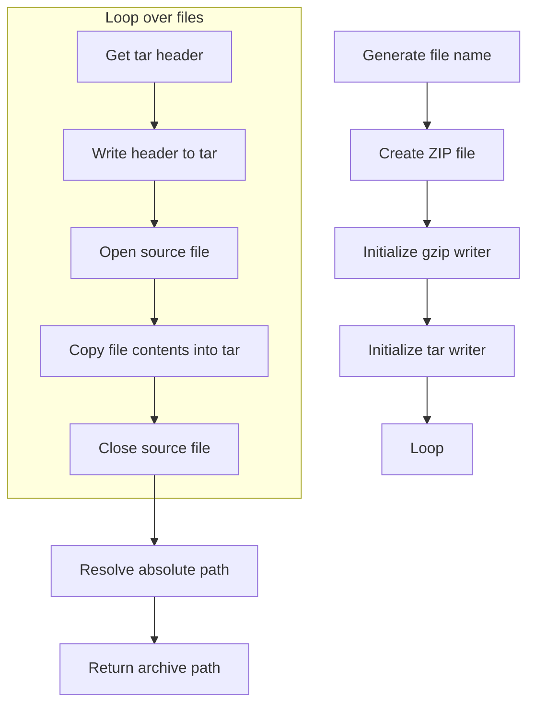

#### Function dependencies (Mermaid)

```mermaid
graph TD
  func_CompressResultsArtifacts --> func_generateZipFileName
  func_CompressResultsArtifacts --> func_Join
  func_CompressResultsArtifacts --> func_Info
  func_CompressResultsArtifacts --> func_Create
  func_CompressResultsArtifacts --> func_Errorf
  func_CompressResultsArtifacts --> func_NewWriter
  func_CompressResultsArtifacts --> func_Close
  func_CompressResultsArtifacts --> func_NewWriter
  func_CompressResultsArtifacts --> func_Debug
  func_CompressResultsArtifacts --> func_getFileTarHeader
  func_CompressResultsArtifacts --> func_WriteHeader
  func_CompressResultsArtifacts --> func_Open
  func_CompressResultsArtifacts --> func_Copy
  func_CompressResultsArtifacts --> func_Abs
```

#### Functions calling `CompressResultsArtifacts` (Mermaid)

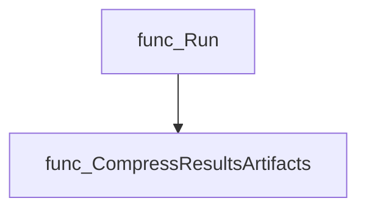

#### Usage example (Go)

```go
// Minimal example invoking CompressResultsArtifacts
package main

import (
    "fmt"
    "github.com/redhat-best-practices-for-k8s/certsuite/internal/results"
)

func main() {
    outputDir := "./output"
    files := []string{"claim.json", "report.html"}

    zipPath, err := results.CompressResultsArtifacts(outputDir, files)
    if err != nil {
        fmt.Printf("Compression failed: %v\n", err)
        return
    }
    fmt.Printf("Artifacts archived at %s\n", zipPath)
}
```

---

### CreateResultsWebFiles

**CreateResultsWebFiles** - Creates all web‑related artifacts required to view and parse a claim file: `claimjson.js`, `results.html`, and the classification script. Returns paths of created files.

#### Signature (Go)

```go
func CreateResultsWebFiles(outputDir, claimFileName string) (filePaths []string, err error)
```

#### Summary Table

| Aspect | Details |
|--------|---------|
| **Purpose** | Creates all web‑related artifacts required to view and parse a claim file: `claimjson.js`, `results.html`, and the classification script. Returns paths of created files. |
| **Parameters** | `outputDir string` – directory where output will be written.<br>`claimFileName string` – name of the claim JSON file in that directory. |
| **Return value** | `filePaths []string` – slice containing full paths to each generated file.<br>`err error` – non‑nil if any step fails (e.g., file write, JS creation). |
| **Key dependencies** | • `path/filepath.Join` – builds output paths.<br>• `createClaimJSFile` – writes the claim JSON into a JavaScript variable.<br>• `os.WriteFile` – writes static HTML content.<br>• `fmt.Errorf` – wraps errors. |
| **Side effects** | Writes three files to disk (`results.html`, `claimjson.js`) and any additional static assets; modifies no in‑memory state beyond the returned slice. |
| **How it fits the package** | Provides the web artifact generation step invoked by `certsuite.Run`. These artifacts enable a browser‑based results viewer that consumes the claim JSON via JavaScript. |

#### Internal workflow (Mermaid)

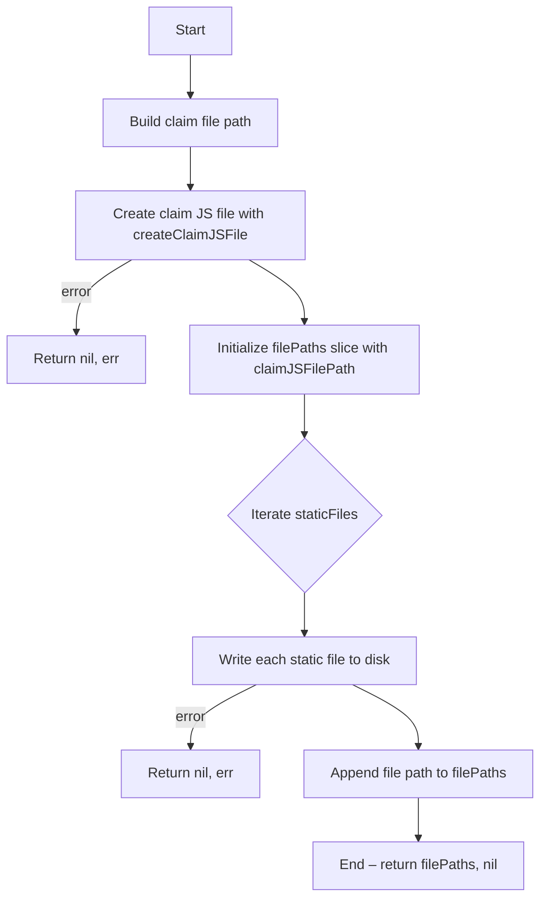

#### Function dependencies (Mermaid)

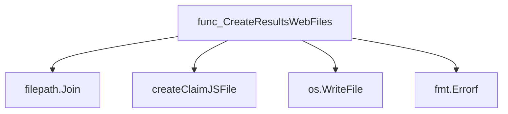

#### Functions calling `CreateResultsWebFiles` (Mermaid)

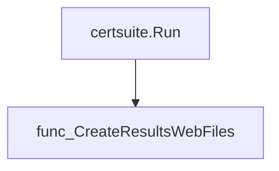

#### Usage example (Go)

```go
// Minimal example invoking CreateResultsWebFiles
package main

import (
    "log"

    "github.com/redhat-best-practices-for-k8s/certsuite/internal/results"
)

func main() {
    outputDir := "./output"
    claimFileName := "claim.json"

    paths, err := results.CreateResultsWebFiles(outputDir, claimFileName)
    if err != nil {
        log.Fatalf("failed to create web files: %v", err)
    }

    log.Printf("Created web artifacts: %v", paths)
}
```

---

---

### GetCertIDFromConnectAPI

**GetCertIDFromConnectAPI** - Sends a POST request to the Red Hat Connect API to obtain the certification ID for a given project.

#### 1) Signature (Go)

```go
func GetCertIDFromConnectAPI(apiKey, projectID, connectAPIBaseURL, proxyURL, proxyPort string) (string, error)
```

#### 2) Summary Table

| Aspect | Details |
|--------|---------|
| **Purpose** | Sends a POST request to the Red Hat Connect API to obtain the certification ID for a given project. |
| **Parameters** | `apiKey` – authentication key<br>`projectID` – identifier of the project<br>`connectAPIBaseURL` – base URL of the API (e.g., `https://access.redhat.com/hydra/cwe/rest/v1.0`)<br>`proxyURL`, `proxyPort` – optional HTTP proxy configuration |
| **Return value** | The certification ID as a string on success; an error otherwise |
| **Key dependencies** | `log.Info/Debug`, `strings.ReplaceAll`, `fmt.Sprintf`, `http.NewRequest`, `bytes.NewBuffer`, `setProxy`, `sendRequest`, `json.NewDecoder` |
| **Side effects** | Logs request details, sets HTTP headers, performs network I/O, may configure an HTTP proxy |
| **How it fits the package** | Part of the `results` sub‑package; used by the top‑level runner to submit artifacts to Red Hat Connect. |

#### 3) Internal workflow (Mermaid)

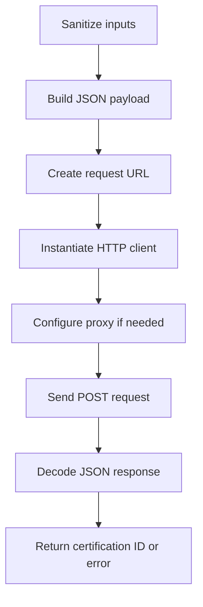

#### 4) Function dependencies (Mermaid)

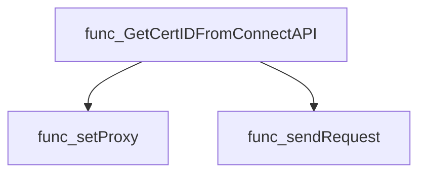

#### 5) Functions calling `GetCertIDFromConnectAPI` (Mermaid)

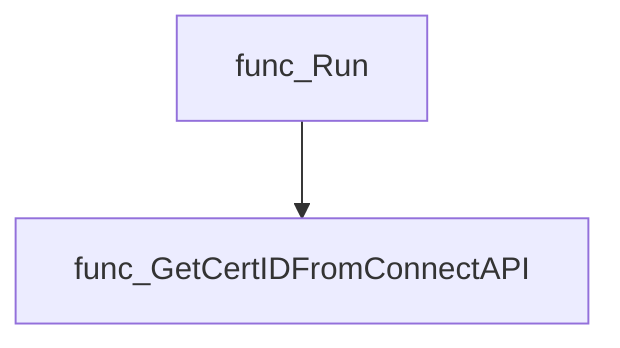

#### 6) Usage example (Go)

```go
// Minimal example invoking GetCertIDFromConnectAPI
package main

import (
    "fmt"
    "github.com/redhat-best-practices-for-k8s/certsuite/internal/results"
)

func main() {
    apiKey := "YOUR_API_KEY"
    projectID := "12345"
    baseURL := "https://access.redhat.com/hydra/cwe/rest/v1.0"
    proxyURL, proxyPort := "", ""

    certID, err := results.GetCertIDFromConnectAPI(apiKey, projectID, baseURL, proxyURL, proxyPort)
    if err != nil {
        fmt.Printf("Error: %v\n", err)
        return
    }
    fmt.Printf("Certification ID: %s\n", certID)
}
```

---

### SendResultsToConnectAPI

**SendResultsToConnectAPI** - Uploads a ZIP file containing test artifacts to the Red Hat Connect API as an attachment and logs the resulting download URL.

#### Signature (Go)

```go
func SendResultsToConnectAPI(zipFile, apiKey, connectBaseURL, certID, proxyURL, proxyPort string) error
```

#### Summary Table

| Aspect | Details |
|--------|---------|
| **Purpose** | Uploads a ZIP file containing test artifacts to the Red Hat Connect API as an attachment and logs the resulting download URL. |
| **Parameters** | `zipFile` – path to the ZIP archive <br> `apiKey` – authentication key for Connect <br> `connectBaseURL` – base URL of the Connect API <br> `certID` – identifier of the certification being uploaded <br> `proxyURL`, `proxyPort` – optional HTTP proxy settings |
| **Return value** | `error` – non‑nil if any step (file handling, request creation, network call, or JSON decoding) fails |
| **Key dependencies** | • `strings.ReplaceAll` for sanitising inputs <br>• `os.Open`, `io.Copy` to read the ZIP file <br>• `mime/multipart.NewWriter` and helper `createFormField` to build a multipart/form‑data payload <br>• `net/http` for request creation and sending (via `sendRequest`) <br>• `setProxy` to apply proxy configuration |
| **Side effects** | • Writes logs via the global logger (`log.Info`, `log.Debug`) <br>• Reads the ZIP file from disk; closes it after use <br>• Sends an HTTP POST request and processes the response |
| **How it fits the package** | Part of the `results` sub‑package, this function is invoked during the final stage of a CertSuite run to deliver artifacts to Red Hat Connect for certification validation. |

#### Internal workflow

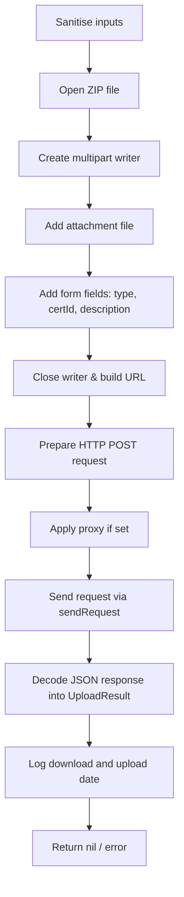

#### Function dependencies

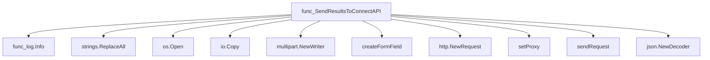

#### Functions calling `SendResultsToConnectAPI`

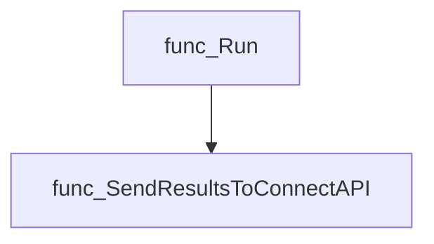

#### Usage example (Go)

```go
// Minimal example invoking SendResultsToConnectAPI
import "github.com/redhat-best-practices-for-k8s/certsuite/internal/results"

func main() {
    zipPath := "/tmp/results.zip"
    apiKey := "my-api-key"
    baseURL := "https://access.redhat.com/hydra/cwe/rest/v1.0"
    certID := "12345"
    proxyURL, proxyPort := "", ""

    if err := results.SendResultsToConnectAPI(zipPath, apiKey, baseURL, certID, proxyURL, proxyPort); err != nil {
        log.Fatalf("Upload failed: %v", err)
    }
}
```

---

## Local Functions

### createClaimJSFile

**createClaimJSFile** - Reads a `claim.json` file and writes its contents into a JavaScript file (`claimjson.js`) that assigns the JSON to a global variable.

#### Signature (Go)

```go
func createClaimJSFile(claimFilePath, outputDir string) (filePath string, err error)
```

#### Summary Table

| Aspect | Details |
|--------|---------|
| **Purpose** | Reads a `claim.json` file and writes its contents into a JavaScript file (`claimjson.js`) that assigns the JSON to a global variable. |
| **Parameters** | `claimFilePath string – path to the source claim.json file`<br>`outputDir string – directory where claimjson.js will be written` |
| **Return value** | `filePath string – full path of the created JS file`<br>`err error – non‑nil if reading or writing fails` |
| **Key dependencies** | • `os.ReadFile` (from *os*)<br>• `fmt.Errorf` (from *fmt*)<br>• `string()` conversion<br>• `filepath.Join` (from *path/filepath*)<br>• `os.WriteFile` (from *os*) |
| **Side effects** | Writes a new file to disk; may return errors if I/O fails. |
| **How it fits the package** | Used by `CreateResultsWebFiles` to generate the JavaScript representation of claim data for the HTML UI. |

#### Internal workflow

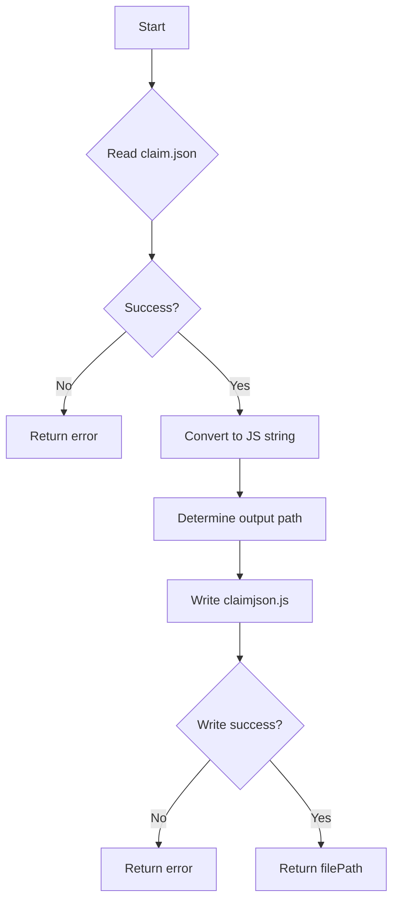

#### Function dependencies

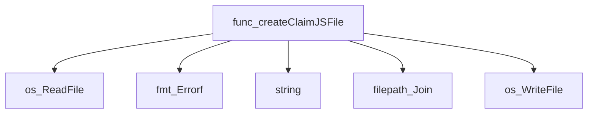

#### Functions calling `createClaimJSFile`

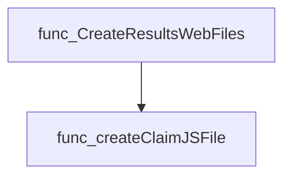

#### Usage example (Go)

```go
// Minimal example invoking createClaimJSFile
outputPath, err := createClaimJSFile("/path/to/claim.json", "/tmp/output")
if err != nil {
    log.Fatalf("Error creating JS file: %v", err)
}
fmt.Println("Generated JS file at:", outputPath)
```

---

### createFormField

**createFormField** - Adds a simple text field to an existing `multipart.Writer`. The field name is given by `field` and the content by `value`.

#### Signature (Go)

```go
func createFormField(w *multipart.Writer, field, value string) error
```

#### Summary Table

| Aspect | Details |
|--------|---------|
| **Purpose** | Adds a simple text field to an existing `multipart.Writer`. The field name is given by `field` and the content by `value`. |
| **Parameters** | `w *multipart.Writer` – target writer. <br> `field string` – form field name. <br> `value string` – field value to write. |
| **Return value** | `error` – non‑nil if the field cannot be created or written. |
| **Key dependencies** | • `w.CreateFormField(field)`<br>• `fw.Write([]byte(value))`<br>• `fmt.Errorf` for error formatting |
| **Side effects** | Writes to the multipart writer; does not close it. No global state is modified. |
| **How it fits the package** | Used by higher‑level routines (e.g., `SendResultsToConnectAPI`) to add metadata fields to an HTTP request body before uploading test results. |

#### Internal workflow (Mermaid)

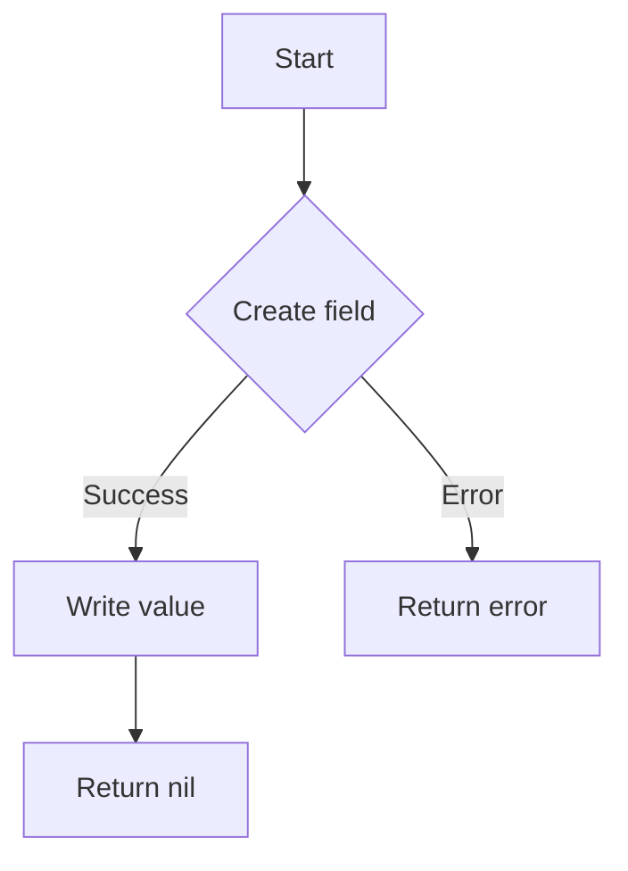

#### Function dependencies (Mermaid)

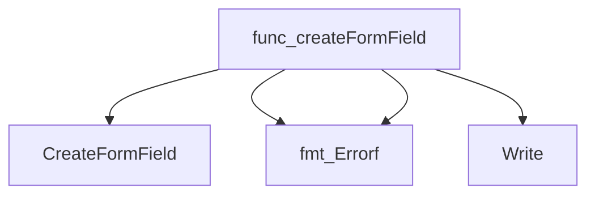

#### Functions calling `createFormField` (Mermaid)

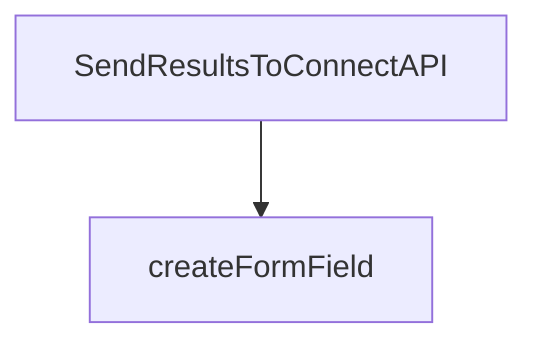

#### Usage example (Go)

```go
// Minimal example invoking createFormField
package main

import (
 "mime/multipart"
 "os"
)

func main() {
 var buf bytes.Buffer
 writer := multipart.NewWriter(&buf)

 if err := createFormField(writer, "type", "RhocpBestPracticeTestResult"); err != nil {
  panic(err)
 }

 // Close writer to finalize the body and send it with an HTTP request.
 writer.Close()
}
```

---

### generateZipFileName

**generateZipFileName** - Produces a unique file name for the results archive, embedding the current UTC time in a specific layout.

#### Signature (Go)

```go
func generateZipFileName() string
```

#### Summary Table

| Aspect | Details |
|--------|---------|
| **Purpose** | Produces a unique file name for the results archive, embedding the current UTC time in a specific layout. |
| **Parameters** | None |
| **Return value** | `string` – The generated ZIP file name (e.g., `"2025-09-03T15_30_00Z-results.zip"`). |
| **Key dependencies** | • `time.Now()` from the standard library<br>• `Format()` method of `time.Time` |
| **Side effects** | None. Pure function; only reads current time. |
| **How it fits the package** | Used by `CompressResultsArtifacts` to name the archive that contains test results and artifacts. |

#### Internal workflow (Mermaid)

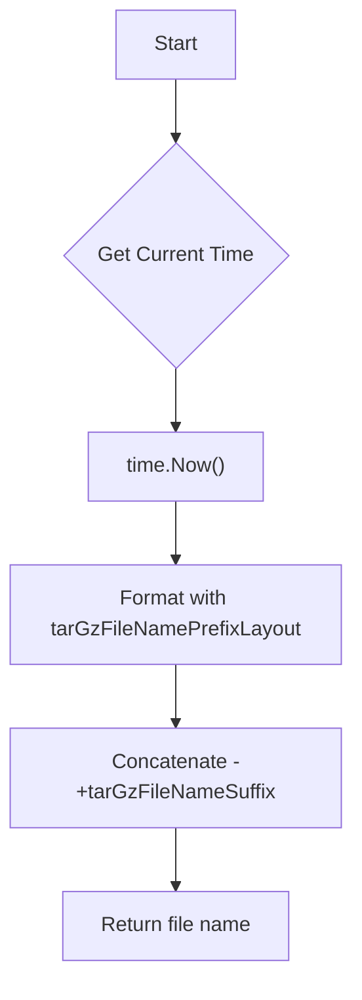

#### Function dependencies (Mermaid)

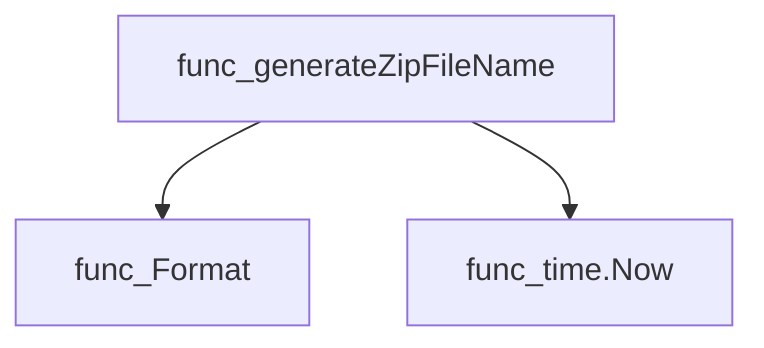

#### Functions calling `generateZipFileName` (Mermaid)

```mermaid
graph TD
  func_CompressResultsArtifacts --> func_generateZipFileName
```

#### Usage example (Go)

```go
// Minimal example invoking generateZipFileName
package main

import (
 "fmt"
 "github.com/redhat-best-practices-for-k8s/certsuite/internal/results"
)

func main() {
 zipName := results.generateZipFileName()
 fmt.Println("Generated zip file name:", zipName)
}
```

---

---

### getFileTarHeader

**getFileTarHeader** - Generates an `*tar.Header` describing the specified file so it can be archived.

#### Signature (Go)

```go
func getFileTarHeader(file string) (*tar.Header, error)
```

#### Summary Table

| Aspect | Details |
|--------|---------|
| **Purpose** | Generates an `*tar.Header` describing the specified file so it can be archived. |
| **Parameters** | `file` *string* – path to the target file. |
| **Return value** | `(*tar.Header, error)` – the header on success; a descriptive error otherwise. |
| **Key dependencies** | • `os.Stat` – obtain `FileInfo` for the path.<br>• `archive/tar.FileInfoHeader` – convert `FileInfo` to a tar header.<br>• `fmt.Errorf` – wrap errors with context. |
| **Side effects** | None; purely functional, no state mutation or I/O beyond stat calls. |
| **How it fits the package** | Helper used by `CompressResultsArtifacts` to prepare each file’s metadata before writing to a tar archive. |

#### Internal workflow (Mermaid)

```mermaid
flowchart TD
  A["Receive file path"] --> B["os.Stat(file)"]
  B --> C{"Error?"}
  C -- Yes --> D["Return error via fmt.Errorf"]
  C -- No --> E["tar.FileInfoHeader(info, info.Name())"]
  E --> F{"Error?"}
  F -- Yes --> G["Return error via fmt.Errorf"]
  F -- No --> H["Return header"]
```

#### Function dependencies (Mermaid)

```mermaid
graph TD
  func_getFileTarHeader --> func_Stat
  func_getFileTarHeader --> func_FileInfoHeader
  func_getFileTarHeader --> func_Errorf
```

#### Functions calling `getFileTarHeader` (Mermaid)

```mermaid
graph TD
  func_CompressResultsArtifacts --> func_getFileTarHeader
```

#### Usage example (Go)

```go
// Minimal example invoking getFileTarHeader
header, err := getFileTarHeader("/path/to/file.txt")
if err != nil {
    log.Fatalf("cannot create tar header: %v", err)
}
fmt.Printf("Created tar header for file: %+v\n", header)
```

---

### sendRequest

**sendRequest** - Executes an HTTP request using the supplied client, logs debug information, and ensures a successful 200 OK response.

#### Signature (Go)

```go
func sendRequest(req *http.Request, client *http.Client) (*http.Response, error)
```

#### Summary Table

| Aspect | Details |
|--------|---------|
| **Purpose** | Executes an HTTP request using the supplied client, logs debug information, and ensures a successful 200 OK response. |
| **Parameters** | `req *http.Request` – the prepared request; <br>`client *http.Client` – the HTTP client to use (may contain timeout or proxy settings). |
| **Return value** | `*http.Response` – the raw HTTP response on success; <br>`error` – wrapped error if the request fails or returns a non‑OK status. |
| **Key dependencies** | • `log.Debug` – logs request URL and responses.<br>• `client.Do` – performs the actual network call.<br>• `fmt.Errorf` – constructs descriptive errors. |
| **Side effects** | Performs I/O over the network; writes debug log entries; does not modify global state. |
| **How it fits the package** | Central helper for all API interactions in the `results` package, used by functions that obtain certification IDs and upload results to Red Hat Connect. |

#### Internal workflow (Mermaid)

```mermaid
flowchart TD
    A["Start"] --> B{"Log request URL"}
    B --> C["client.Do(req)"]
    C --> D{"Error?"}
    D -- Yes --> E["Return nil, error"]
    D -- No --> F{"Status OK?"}
    F -- Yes --> G["Return response"]
    F -- No --> H["Log status"]
    H --> I["Return nil, formatted error"]
```

#### Function dependencies (Mermaid)

```mermaid
graph TD
  func_sendRequest --> Logger.Debug
  func_sendRequest --> client.Do
  func_sendRequest --> fmt.Errorf
```

#### Functions calling `sendRequest` (Mermaid)

```mermaid
graph TD
  GetCertIDFromConnectAPI --> sendRequest
  SendResultsToConnectAPI --> sendRequest
```

#### Usage example (Go)

```go
// Minimal example invoking sendRequest
req, _ := http.NewRequest("GET", "https://example.com/api", nil)
client := &http.Client{Timeout: 30 * time.Second}

resp, err := sendRequest(req, client)
if err != nil {
    log.Fatalf("request failed: %v", err)
}
defer resp.Body.Close()

// Process response...
```

---

### setProxy

**setProxy** - If both `proxyURL` and `proxyPort` are non‑empty, builds a full proxy address, parses it, logs debug information, and assigns an HTTP transport that routes requests through the specified proxy.

#### Signature (Go)

```go
func setProxy(client *http.Client, proxyURL, proxyPort string)
```

#### Summary Table

| Aspect | Details |
|--------|---------|
| **Purpose** | If both `proxyURL` and `proxyPort` are non‑empty, builds a full proxy address, parses it, logs debug information, and assigns an HTTP transport that routes requests through the specified proxy. |
| **Parameters** | `client *http.Client` – client to configure.<br>`proxyURL string` – hostname or IP of the proxy.<br>`proxyPort string` – port number for the proxy. |
| **Return value** | None (side‑effect only). |
| **Key dependencies** | • `github.com/redhat-best-practices-for-k8s/certsuite/internal/log.Logger.Debug`<br>• `fmt.Sprintf`<br>• `net/url.Parse`<br>• `log.Error`<br>• `net/http.Transport` and `http.ProxyURL` |
| **Side effects** | Mutates the supplied `client.Transport` to a new `*http.Transport` that uses the parsed proxy URL. Logs debug and error messages. |
| **How it fits the package** | Used by higher‑level API calls (`GetCertIDFromConnectAPI`, `SendResultsToConnectAPI`) to optionally route traffic through an HTTP/HTTPS proxy when interacting with Red Hat Connect endpoints. |

#### Internal workflow (Mermaid)

```mermaid
flowchart TD
  A["Check if proxyURL & proxyPort not empty"] -->|"Yes"| B["Log debug: “Proxy is set”"]
  B --> C["Build string proxyURL:proxyPort"]
  C --> D["Parse URL"]
  D -->|"Success"| E["Set client.Transport with ProxyURL(parsed)"]
  D -->|"Failure"| F["Log error: “Failed to parse proxy URL”"]
```

#### Function dependencies (Mermaid)

```mermaid
graph TD
  func_setProxy --> func_log.Debug
  func_setProxy --> fmt.Sprintf
  func_setProxy --> url.Parse
  func_setProxy --> func_log.Error
  func_setProxy --> http.Transport
  func_setProxy --> http.ProxyURL
```

#### Functions calling `setProxy` (Mermaid)

```mermaid
graph TD
  func_GetCertIDFromConnectAPI --> func_setProxy
  func_SendResultsToConnectAPI --> func_setProxy
```

#### Usage example (Go)

```go
// Minimal example invoking setProxy
client := &http.Client{Timeout: 30 * time.Second}
proxyHost := "proxy.example.com"
proxyPort := "3128"

setProxy(client, proxyHost, proxyPort)

// Now `client` will send requests via the specified proxy.
```

---
