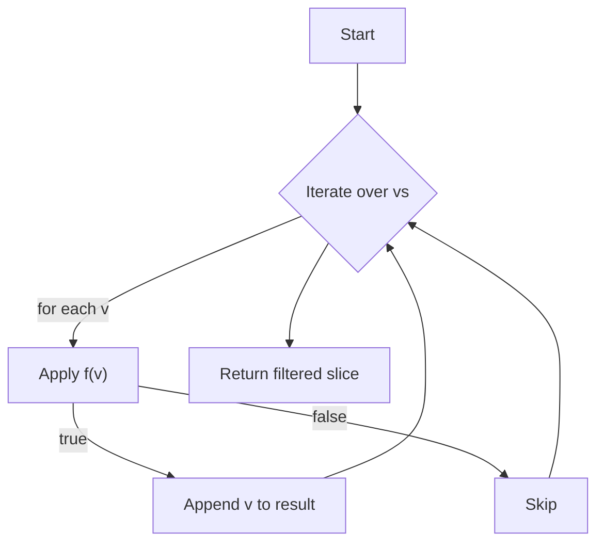
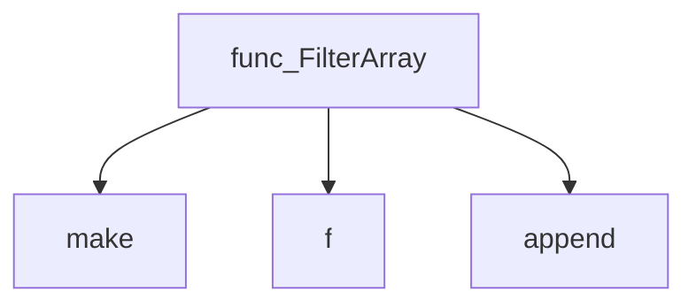
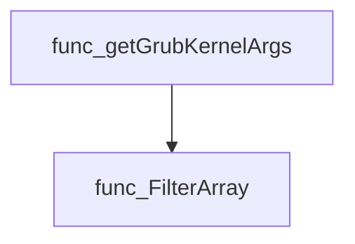
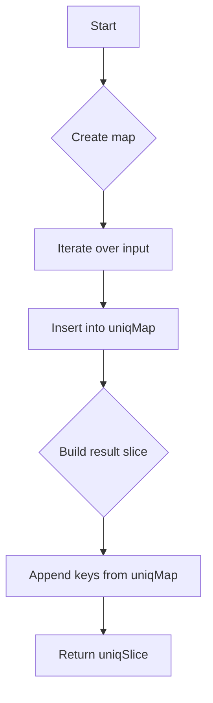
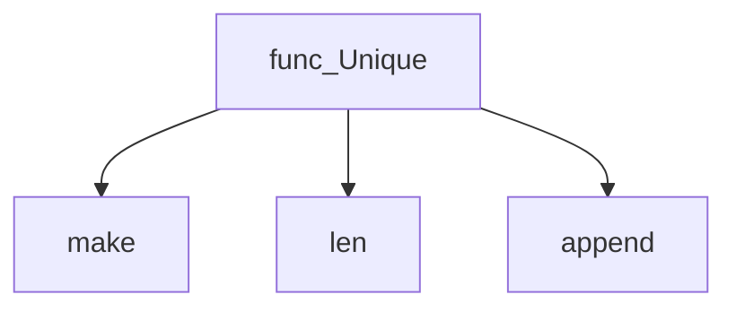
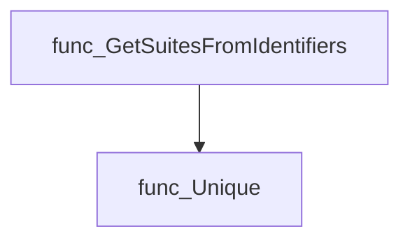

# Package arrayhelper

**Path**: `pkg/arrayhelper`

## Table of Contents

- [Overview](#overview)
- [Exported Functions](#exported-functions)
  - [ArgListToMap](#arglisttomap)
  - [FilterArray](#filterarray)
  - [Unique](#unique)

## Overview

Provides lightweight utilities for manipulating string slices used throughout the certsuite codebase, such as converting argument lists into maps, filtering elements, and deduplicating entries.

### Key Features

- Converts a slice of "key=value" strings into a map for quick lookup.

### Design Notes

- Assumes input items are formatted as key=value when converting to a map.

### Exported Functions Summary

| Name | Purpose |
|------|----------|
| [func ArgListToMap([]string)(map[string]string)](#arglisttomap) | ArgListToMap takes a list of strings of the form "key=value" and translate it into a map of the form {key: value} |
| [func FilterArray(vs []string, f func(string) bool) []string](#filterarray) | Returns a new slice containing only the elements of `vs` for which `f` evaluates to true. |
| [func Unique(slice []string) []string](#unique) | Produces a new slice containing each unique element of the input, preserving no particular order. |

## Exported Functions

### ArgListToMap

**ArgListToMap** - ArgListToMap takes a list of strings of the form "key=value" and translate it into a map
of the form {key: value}

<!-- DEBUG: Function ArgListToMap exists in bundle but ParsedOK=false -->
**Signature**: `func([]string)(map[string]string)`

**Purpose**: ArgListToMap takes a list of strings of the form "key=value" and translate it into a map
of the form {key: value}

---

### FilterArray

**FilterArray** - Returns a new slice containing only the elements of `vs` for which `f` evaluates to true.


#### 1) Signature (Go)
```go
func FilterArray(vs []string, f func(string) bool) []string
```

#### 2) Summary Table
| Aspect | Details |
|--------|---------|
| **Purpose** | Returns a new slice containing only the elements of `vs` for which `f` evaluates to true. |
| **Parameters** | `vs []string` – input slice; `f func(string) bool` – predicate function applied to each element. |
| **Return value** | `[]string` – filtered slice preserving order of matching elements. |
| **Key dependencies** | • `make` (slice allocation)<br>• `append` (adding elements)<br>• user‑supplied `f` (predicate) |
| **Side effects** | None; operates purely on inputs and returns a new slice. |
| **How it fits the package** | Utility function in *arrayhelper* used by higher‑level logic to extract relevant items from string collections. |

#### 3) Internal workflow (Mermaid)


#### 4) Function dependencies (Mermaid)


#### 5) Functions calling `FilterArray` (Mermaid)


#### 6) Usage example (Go)
```go
// Minimal example invoking FilterArray
package main

import (
    "fmt"
    "github.com/redhat-best-practices-for-k8s/certsuite/pkg/arrayhelper"
)

func main() {
    items := []string{"apple", "banana", "cherry", "date"}
    // Keep only strings starting with 'b' or 'c'
    filtered := arrayhelper.FilterArray(items, func(s string) bool {
        return len(s) > 0 && (s[0] == 'b' || s[0] == 'c')
    })
    fmt.Println(filtered) // Output: [banana cherry]
}
```

---

### Unique

**Unique** - Produces a new slice containing each unique element of the input, preserving no particular order.


Removes duplicate entries from a string slice and returns the distinct values.

#### Signature (Go)

```go
func Unique(slice []string) []string
```

#### Summary Table

| Aspect | Details |
|--------|---------|
| **Purpose** | Produces a new slice containing each unique element of the input, preserving no particular order. |
| **Parameters** | `slice []string` – the source sequence to deduplicate. |
| **Return value** | `[]string` – a slice with all duplicate strings removed. |
| **Key dependencies** | • `make` (creates map and result slice)<br>• `len` (determines capacity for result)<br>• `append` (builds the final slice) |
| **Side effects** | None; operates solely on its arguments and returns a new value. |
| **How it fits the package** | Utility helper that other components use to collapse duplicate identifiers before further processing. |

#### Internal workflow



#### Function dependencies



#### Functions calling `Unique`



> **Note:** `GetSuitesFromIdentifiers` appears in two packages:  
> *github.com/redhat-best-practices-for-k8s/certsuite/cmd/certsuite/generate/catalog* and  
> *github.com/redhat-best-practices-for-k8s/certsuite/webserver*.

#### Usage example (Go)

```go
// Minimal example invoking Unique
import "github.com/redhat-best-practices-for-k8s/certsuite/pkg/arrayhelper"

func main() {
    input := []string{"a", "b", "a", "c"}
    unique := arrayhelper.Unique(input)
    fmt.Println(unique) // Output: [a b c] (order not guaranteed)
}
```

---

