# Package autodiscover

**Path**: `pkg/autodiscover`

## Table of Contents

- [Overview](#overview)
- [Structs](#structs)
  - [DiscoveredTestData](#discoveredtestdata)
  - [PodStates](#podstates)
  - [ScaleObject](#scaleobject)
- [Exported Functions](#exported-functions)
  - [CountPodsByStatus](#countpodsbystatus)
  - [CreateLabels](#createlabels)
  - [DoAutoDiscover](#doautodiscover)
  - [FindCrObjectByNameByNamespace](#findcrobjectbynamebynamespace)
  - [FindDeploymentByNameByNamespace](#finddeploymentbynamebynamespace)
  - [FindPodsByLabels](#findpodsbylabels)
  - [FindStatefulsetByNameByNamespace](#findstatefulsetbynamebynamespace)
  - [FindTestCrdNames](#findtestcrdnames)
  - [GetScaleCrUnderTest](#getscalecrundertest)
- [Local Functions](#local-functions)
  - [findAbnormalEvents](#findabnormalevents)
  - [findClusterOperators](#findclusteroperators)
  - [findDeploymentsByLabels](#finddeploymentsbylabels)
  - [findHpaControllers](#findhpacontrollers)
  - [findOperatorsByLabels](#findoperatorsbylabels)
  - [findOperatorsMatchingAtLeastOneLabel](#findoperatorsmatchingatleastonelabel)
  - [findPodsMatchingAtLeastOneLabel](#findpodsmatchingatleastonelabel)
  - [findStatefulSetsByLabels](#findstatefulsetsbylabels)
  - [findSubscriptions](#findsubscriptions)
  - [getAllCatalogSources](#getallcatalogsources)
  - [getAllInstallPlans](#getallinstallplans)
  - [getAllNamespaces](#getallnamespaces)
  - [getAllOperators](#getalloperators)
  - [getAllPackageManifests](#getallpackagemanifests)
  - [getAllStorageClasses](#getallstorageclasses)
  - [getClusterCrdNames](#getclustercrdnames)
  - [getClusterRoleBindings](#getclusterrolebindings)
  - [getCrScaleObjects](#getcrscaleobjects)
  - [getHelmList](#gethelmlist)
  - [getNetworkAttachmentDefinitions](#getnetworkattachmentdefinitions)
  - [getNetworkPolicies](#getnetworkpolicies)
  - [getOpenshiftVersion](#getopenshiftversion)
  - [getOperandPodsFromTestCsvs](#getoperandpodsfromtestcsvs)
  - [getOperatorCsvPods](#getoperatorcsvpods)
  - [getPersistentVolumeClaims](#getpersistentvolumeclaims)
  - [getPersistentVolumes](#getpersistentvolumes)
  - [getPodDisruptionBudgets](#getpoddisruptionbudgets)
  - [getPodsOwnedByCsv](#getpodsownedbycsv)
  - [getResourceQuotas](#getresourcequotas)
  - [getRoleBindings](#getrolebindings)
  - [getRoles](#getroles)
  - [getServiceAccounts](#getserviceaccounts)
  - [getServices](#getservices)
  - [getSriovNetworkNodePolicies](#getsriovnetworknodepolicies)
  - [getSriovNetworks](#getsriovnetworks)
  - [isDeploymentsPodsMatchingAtLeastOneLabel](#isdeploymentspodsmatchingatleastonelabel)
  - [isIstioServiceMeshInstalled](#isistioservicemeshinstalled)
  - [isStatefulSetsMatchingAtLeastOneLabel](#isstatefulsetsmatchingatleastonelabel)
  - [namespacesListToStringList](#namespaceslisttostringlist)

## Overview

The autodiscover package queries a running Kubernetes or OpenShift cluster to collect namespaces, pods, operators, CRDs, and other resources needed for test execution. It filters objects by user‑supplied labels or predefined criteria and returns the data in a structured form that the rest of CertSuite consumes.

### Key Features

- Collects all relevant cluster objects—including deployments, statefulsets, services, CRDs, and operator lifecycle components—using the Kubernetes API.
- Filters resources by label selectors and custom patterns to isolate test‑specific items such as operand pods or Istio service mesh presence.
- Aggregates metrics on pod readiness and abnormal events, enabling downstream tests to make informed decisions about execution environments.

### Design Notes

- Uses a single client holder to avoid creating multiple REST clients; this centralizes configuration and caching.
- Falls back to non‑OpenShift defaults when the ClusterOperator API is unavailable, ensuring compatibility with vanilla Kubernetes clusters.
- Logs errors for invalid label strings but continues processing, prioritizing resilience over strict validation.

### Structs Summary

| Name | Purpose |
|------|----------|
| [**DiscoveredTestData**](#discoveredtestdata) | Struct definition |
| [**PodStates**](#podstates) | Tracks pod execution metrics |
| [**ScaleObject**](#scaleobject) | Represents a Kubernetes scale subresource for a custom resource |

### Exported Functions Summary

| Name | Purpose |
|------|----------|
| [func CountPodsByStatus(allPods []corev1.Pod) map[string]int](#countpodsbystatus) | Returns a map with the number of *ready* (`PodRunning` phase) and *non‑ready* pods from a list. |
| [func CreateLabels(labelStrings []string) (labelObjects []labelObject)](#createlabels) | Parses each input string using a predefined regular expression (`labelRegex`) and converts matched key‑value pairs into `labelObject` instances. Invalid strings are logged as errors and skipped. |
| [func DoAutoDiscover(config *configuration.TestConfiguration) DiscoveredTestData](#doautodiscover) | Queries a running cluster to gather namespaces, pods, operators, CRDs, and other Kubernetes objects that match user‑supplied labels or are otherwise relevant for test execution. The gathered data is returned as a `DiscoveredTestData` struct which the rest of the framework consumes to build the test environment. |
| [func FindCrObjectByNameByNamespace(scale.ScalesGetter, string, string, schema.GroupResource) (*scalingv1.Scale, error)](#findcrobjectbynamebynamespace) | Looks up a Kubernetes `Scale` subresource for the specified CR (Custom Resource) within a given namespace. |
| [func FindDeploymentByNameByNamespace(appClient appv1client.AppsV1Interface, namespace, name string) (*appsv1.Deployment, error)](#finddeploymentbynamebynamespace) | Fetches a Kubernetes Deployment resource identified by its namespace and name using the AppsV1 client. |
| [func FindPodsByLabels(oc corev1client.CoreV1Interface, labels []labelObject, namespaces []string) (runningPods, allPods []corev1.Pod)](#findpodsbylabels) | Enumerates pods in the provided namespaces that match any of the supplied label selectors. It returns two slices: one containing only running (or allowed non‑running) pods and another with all retrieved pods, excluding those marked for deletion. |
| [func FindStatefulsetByNameByNamespace(appClient appv1client.AppsV1Interface, namespace, name string) (*appsv1.StatefulSet, error)](#findstatefulsetbynamebynamespace) | Fetches a Kubernetes StatefulSet resource identified by its `namespace` and `name`. Returns the object or an error if retrieval fails. |
| [func FindTestCrdNames(clusterCrds []*apiextv1.CustomResourceDefinition, crdFilters []configuration.CrdFilter) (targetCrds []*apiextv1.CustomResourceDefinition)](#findtestcrdnames) | Filters a list of cluster CRDs to only those whose names end with any suffix specified in `crdFilters`. |
| [func GetScaleCrUnderTest(namespaces []string, crds []*apiextv1.CustomResourceDefinition) []ScaleObject](#getscalecrundertest) | For each namespace‑scoped CRD that supports the `scale` subresource, gather all custom resources (CRs) in the provided namespaces and return their scale objects. |

### Local Functions Summary

| Name | Purpose |
|------|----------|
| [func findAbnormalEvents(oc corev1client.CoreV1Interface, namespaces []string) (abnormalEvents []corev1.Event)](#findabnormalevents) | Gathers all Kubernetes events whose `type` is not `"Normal"` from the supplied namespaces. |
| [func findClusterOperators(client clientconfigv1.ClusterOperatorInterface) ([]configv1.ClusterOperator, error)](#findclusteroperators) | Queries the Kubernetes API for all `ClusterOperator` resources, returning them as a slice of `configv1.ClusterOperator`. If the CR is missing, it logs a debug message and returns `nil, nil`. |
| [func findDeploymentsByLabels(appClient appv1client.AppsV1Interface, labels []labelObject, namespaces []string) []appsv1.Deployment](#finddeploymentsbylabels) | Enumerates all deployments in the specified namespaces that contain at least one of the supplied label key/value pairs. If no labels are provided, every deployment in those namespaces is returned. |
| [func(findHpaControllers)(kubernetes.Interface, []string) []*scalingv1.HorizontalPodAutoscaler](#findhpacontrollers) | Collects every `HorizontalPodAutoscaler` object from the supplied namespaces and returns a slice of pointers to them. |
| [func findOperatorsByLabels(olmClient v1alpha1.OperatorsV1alpha1Interface, labels []labelObject, namespaces []configuration.Namespace) (csvs []*olmv1Alpha.ClusterServiceVersion)](#findoperatorsbylabels) | Scans each namespace in `namespaces` for ClusterServiceVersions (CSVs). If `labels` are provided, only CSVs that have at least one of those labels are considered; otherwise all CSVs are fetched. It then filters the results to include only those whose controller pods run inside any namespace listed in `namespaces`. |
| [func(v1alpha1.OperatorsV1alpha1Interface, []labelObject, configuration.Namespace)(*olmv1Alpha.ClusterServiceVersionList)](#findoperatorsmatchingatleastonelabel) | Retrieves all ClusterServiceVersions (CSVs) within the given `namespace` that carry at least one of the supplied label key/value pairs. The function aggregates results across labels and returns a combined list. |
| [func findPodsMatchingAtLeastOneLabel(oc corev1client.CoreV1Interface, labels []labelObject, namespace string) *corev1.PodList](#findpodsmatchingatleastonelabel) | Builds a `PodList` containing all pods in the specified `namespace` that match at least one label from the provided slice. |
| [func findStatefulSetsByLabels(     appClient appv1client.AppsV1Interface,     labels []labelObject,     namespaces []string, ) []appsv1.StatefulSet](#findstatefulsetsbylabels) | Enumerates all StatefulSets in the supplied namespaces, filtering by label matches when provided. Returns a slice of matching `StatefulSet` objects. |
| [func findSubscriptions(olmClient v1alpha1.OperatorsV1alpha1Interface, namespaces []string) []olmv1Alpha.Subscription](#findsubscriptions) | Collects all `Subscription` objects from the provided list of Kubernetes namespaces using an OLM client. |
| [func getAllCatalogSources(olmClient v1alpha1.OperatorsV1alpha1Interface) (out []*olmv1Alpha.CatalogSource)](#getallcatalogsources) | Collects every `CatalogSource` resource present in the Kubernetes cluster and returns them as a slice of pointers. |
| [func getAllInstallPlans(olmClient v1alpha1.OperatorsV1alpha1Interface) (out []*olmv1Alpha.InstallPlan)](#getallinstallplans) | Collects every `InstallPlan` resource present in the cluster and returns them as a slice of pointers. |
| [func getAllNamespaces(oc corev1client.CoreV1Interface) ([]string, error)](#getallnamespaces) | Queries the cluster for every namespace and returns a slice of their names. |
| [func getAllOperators(olmClient v1alpha1.OperatorsV1alpha1Interface) ([]*olmv1Alpha.ClusterServiceVersion, error)](#getalloperators) | Fetches every ClusterServiceVersion (CSV) across all namespaces using the supplied OLM client and returns a slice of pointers to those CSV objects. |
| [func getAllPackageManifests(olmPkgClient olmpkgclient.PackageManifestInterface) (out []*olmpkgv1.PackageManifest)](#getallpackagemanifests) | Gathers every `PackageManifest` resource present in the cluster and returns them as a slice of pointers. |
| [func getAllStorageClasses(client storagev1typed.StorageV1Interface) ([]storagev1.StorageClass, error)](#getallstorageclasses) | Fetches every `StorageClass` defined in the cluster via the Kubernetes API and returns them as a slice. |
| [func getClusterCrdNames() ([]*apiextv1.CustomResourceDefinition, error)](#getclustercrdnames) | Queries the Kubernetes API for every `CustomResourceDefinition` (CRD) in the cluster and returns them as a slice of pointers. |
| [func getClusterRoleBindings(client rbacv1typed.RbacV1Interface) ([]rbacv1.ClusterRoleBinding, error)](#getclusterrolebindings) | Fetches every `ClusterRoleBinding` object present in the Kubernetes cluster. These bindings are non‑namespaced and apply cluster‑wide. |
| [func getCrScaleObjects(crs []unstructured.Unstructured, crd *apiextv1.CustomResourceDefinition) []ScaleObject](#getcrscaleobjects) | For each custom resource in `crs`, fetch its corresponding Scale subresource via the Kubernetes Scaling API and return a slice of `ScaleObject` structs that bundle the retrieved scale data with its GroupResource schema. |
| [func getHelmList(restConfig *rest.Config, namespaces []string) map[string][]*release.Release](#gethelmlist) | Queries the Kubernetes cluster via Helm client to list all deployed releases per namespace and returns a mapping from namespace name to its release objects. |
| [func getNetworkAttachmentDefinitions(client *clientsholder.ClientsHolder, namespaces []string) ([]nadClient.NetworkAttachmentDefinition, error)](#getnetworkattachmentdefinitions) | Enumerates all `NetworkAttachmentDefinition` resources in the specified Kubernetes namespaces and aggregates them into a single slice. |
| [func getNetworkPolicies(oc networkingv1client.NetworkingV1Interface) ([]networkingv1.NetworkPolicy, error)](#getnetworkpolicies) | Queries the Kubernetes API for all `NetworkPolicy` objects across every namespace and returns them as a slice. |
| [func getOpenshiftVersion(oClient clientconfigv1.ConfigV1Interface) (ver string, err error)](#getopenshiftversion) | Fetches the OpenShift API server version by querying the `ClusterOperator` CRD for `openshift-apiserver`. If not found, returns a sentinel value indicating a non‑OpenShift cluster. |
| [func getOperandPodsFromTestCsvs([]*olmv1Alpha.ClusterServiceVersion, []corev1.Pod)([]*corev1.Pod, error)](#getoperandpodsfromtestcsvs) | Filters a pod list to those whose top‑level owner CR is managed by any of the supplied test CSVs. |
| [func getOperatorCsvPods(csvList []*olmv1Alpha.ClusterServiceVersion) (map[types.NamespacedName][]*corev1.Pod, error)](#getoperatorcsvpods) | For each ClusterServiceVersion (CSV), fetch the namespace where its operator runs and gather all pods owned by that CSV. Returns a map keyed by `types.NamespacedName` of the CSV to the list of managed pods. |
| [func getPersistentVolumeClaims(oc corev1client.CoreV1Interface) ([]corev1.PersistentVolumeClaim, error)](#getpersistentvolumeclaims) | Queries the Kubernetes API for every PersistentVolumeClaim (PVC) in all namespaces and returns them as a slice. |
| [func getPersistentVolumes(oc corev1client.CoreV1Interface) ([]corev1.PersistentVolume, error)](#getpersistentvolumes) | Queries the Kubernetes API for all PersistentVolume resources and returns them as a slice. |
| [func getPodDisruptionBudgets(oc policyv1client.PolicyV1Interface, namespaces []string) ([]policyv1.PodDisruptionBudget, error)](#getpoddisruptionbudgets) | Gathers all `PodDisruptionBudget` resources across the supplied namespaces and returns them as a single slice. |
| [func getPodsOwnedByCsv(csvName, operatorNamespace string, client *clientsholder.ClientsHolder) ([]*corev1.Pod, error)](#getpodsownedbycsv) | Returns all Pods in `operatorNamespace` whose top‑level owner is the CSV named `csvName`. These are typically operator/controller Pods. |
| [func getResourceQuotas(oc corev1client.CoreV1Interface) ([]corev1.ResourceQuota, error)](#getresourcequotas) | Queries Kubernetes for every `ResourceQuota` object across all namespaces and returns them as a slice. |
| [func getRoleBindings(client rbacv1typed.RbacV1Interface) ([]rbacv1.RoleBinding, error)](#getrolebindings) | Collects every `RoleBinding` resource present in the Kubernetes cluster. |
| [func getRoles(client rbacv1typed.RbacV1Interface) ([]rbacv1.Role, error)](#getroles) | Enumerates every `Role` resource across all namespaces in a Kubernetes cluster. |
| [func getServiceAccounts(oc corev1client.CoreV1Interface, namespaces []string) ([]*corev1.ServiceAccount, error)](#getserviceaccounts) | Retrieves all `ServiceAccount` objects from the provided list of Kubernetes namespaces and returns them as a slice. |
| [func getServices(oc corev1client.CoreV1Interface, namespaces, ignoreList []string) (allServices []*corev1.Service, err error)](#getservices) | Gathers all `Service` resources from the provided `namespaces`, excluding any whose names appear in `ignoreList`. Returns a slice of pointers to the services and an error if any namespace query fails. |
| [func getSriovNetworkNodePolicies(client *clientsholder.ClientsHolder, namespaces []string) ([]unstructured.Unstructured, error)](#getsriovnetworknodepolicies) | Enumerates all `SriovNetworkNodePolicy` resources across the supplied Kubernetes namespaces using a dynamic client. Returns the combined list or an error if any non‑NotFound issue occurs. |
| [func getSriovNetworks(client *clientsholder.ClientsHolder, namespaces []string) ([]unstructured.Unstructured, error)](#getsriovnetworks) | Enumerates all `SriovNetwork` custom resources across the provided list of Kubernetes namespaces. Returns a slice of unstructured objects representing each network or an error if any request fails. |
| [func([]labelObject, string, *appsv1.Deployment)(bool)](#isdeploymentspodsmatchingatleastonelabel) | Checks whether the pod template of a given Deployment has a label that matches at least one label supplied in `labels`. If a match is found, the function returns `true`; otherwise it returns `false`. |
| [func(isIstioServiceMeshInstalled)(appv1client.AppsV1Interface, []string) bool](#isistioservicemeshinstalled) | Determines whether the Istio service mesh is installed in a cluster by verifying the presence of the `istio-system` namespace and the `istiod` deployment. |
| [func isStatefulSetsMatchingAtLeastOneLabel(labels []labelObject, namespace string, statefulSet *appsv1.StatefulSet) bool](#isstatefulsetsmatchingatleastonelabel) | Checks whether the pod template of a given StatefulSet contains at least one label that matches any key/value pair supplied in `labels`. Returns `true` on first match. |
| [func namespacesListToStringList(namespaceList []configuration.Namespace) (stringList []string)](#namespaceslisttostringlist) | Extracts the `Name` field from each `configuration.Namespace` in a slice and returns a new slice of those names. |

## Structs

### DiscoveredTestData

<!-- DEBUG: Struct DiscoveredTestData exists in bundle but ParsedOK=false, Fields=59 -->
**Purpose**:

**Fields**:

| Field | Type | Description |
|-------|------|--------------|
| `AbnormalEvents` | `[]corev1.Event` | Events flagged as abnormal during collection. |
| `ValidProtocolNames` | `[]string` | Protocol names considered valid for tests. |
| `ConnectAPIKey` | `string` | API key for Connect integration. |
| `AllCsvs` | `[]*olmv1Alpha.ClusterServiceVersion` | All operator CSVs available. |
| `Deployments` | `[]appsv1.Deployment` | Deployments matching test labels. |
| `AllSubscriptions` | `[]olmv1Alpha.Subscription` | All OLM subscriptions. |
| `Pods` | `[]corev1.Pod` | Pods selected as “under test” based on user labels. |
| `AllInstallPlans` | `[]*olmv1Alpha.InstallPlan` | Install plans for all operators. |
| `AllCatalogSources` | `[]*olmv1Alpha.CatalogSource` | Catalog sources in the cluster. |
| `Roles` | `[]rbacv1.Role` | Namespace‑level roles (all namespaces). |
| `PartnerName` | `string` | Name of the partner providing the test suite. |
| `NetworkPolicies` | `[]networkingv1.NetworkPolicy` | Network policy objects across namespaces. |
| `Crds` | `[]*apiextv1.CustomResourceDefinition` | CRDs filtered to those relevant for the test. |
| `PodDisruptionBudgets` | `[]policyv1.PodDisruptionBudget` | PDB objects present in the cluster. |
| `OCPStatus` | `string` | Determined lifecycle status of the OCP version. |
| `ScaleCrUnderTest` | `[]ScaleObject` | Custom resources that should be scaled during tests. |
| `CollectorAppEndpoint` | `string` | Endpoint URL for the collector app. |
| `ConnectAPIProxyPort` | `string` | Proxy port for Connect requests. |
| `AllCrds` | `[]*apiextv1.CustomResourceDefinition` | All CRDs in the cluster. |
| `HelmChartReleases` | `map[string][]*release.Release` | Helm releases per namespace. |
| `K8sVersion` | `string` | Kubernetes server version string. |
| `IstioServiceMeshFound` | `bool` | Flag indicating whether Istio is installed. |
| `SriovNetworkNodePolicies` | `[]unstructured.Unstructured` | SriovNetworkNodePolicy CRs in target namespaces. |
| `PersistentVolumeClaims` | `[]corev1.PersistentVolumeClaim` | PVCs in target namespaces. |
| `AllPods` | `[]corev1.Pod` | All pods in the cluster (or namespaces) at discovery time. |
| `AllServices` | `[]*corev1.Service` | All services cluster‑wide. |
| `ServiceAccounts` | `[]*corev1.ServiceAccount` | Service accounts in target namespaces. |
| `Services` | `[]*corev1.Service` | Services matching test labels. |
| `Nodes` | `*corev1.NodeList` | List of all cluster nodes. |
| `Namespaces` | `[]string` | Target namespaces specified in configuration. |
| `ClusterRoleBindings` | `[]rbacv1.ClusterRoleBinding` | Cluster‑wide RBAC bindings. |
| `OpenshiftVersion` | `string` | OpenShift release identifier. |
| `ConnectProjectID` | `string` | Project ID used in Connect. |
| `PodStates` | `PodStates` | Snapshot of pod counts before execution, used for post‑test comparison. |
| `OperandPods` | `[]*corev1.Pod` | Operand (runtime) pods discovered via best‑effort matching. |
| `RoleBindings` | `[]rbacv1.RoleBinding` | Namespace‑level rolebindings (all namespaces). |
| `Subscriptions` | `[]olmv1Alpha.Subscription` | Subscriptions matching test labels. |
| `StorageClasses` | `[]storagev1.StorageClass` | Storage classes in the cluster. |
| `AllNamespaces` | `[]string` | All namespaces available in the cluster. |
| `ClusterOperators` | `[]configv1.ClusterOperator` | Cluster‑level operators (OpenShift). |
| `Hpas` | `[]*scalingv1.HorizontalPodAutoscaler` | HPAs in target namespaces. |
| `ExecutedBy` | `string` | Identifier of the test executor (user or CI). |
| `AllPackageManifests` | `[]*olmPkgv1.PackageManifest` | Package manifests from OLM. |
| `SriovNetworks` | `[]unstructured.Unstructured` | SriovNetwork CRs in target namespaces. |
| `AllSriovNetworkNodePolicies` | `[]unstructured.Unstructured` | SriovNetworkNodePolicy CRs cluster‑wide. |
| `ConnectAPIBaseURL` | `string` | Base URL for Connect API calls. |
| `CollectorAppPassword` | `string` | Password for the collector application. |
| `StatefulSet` | `[]appsv1.StatefulSet` | StatefulSets matching test labels. |
| `CSVToPodListMap` | `map[types.NamespacedName][]*corev1.Pod` | Mapping of operator CSV names to their running pods. |
| `ResourceQuotaItems` | `[]corev1.ResourceQuota` | Resource quotas defined in the target namespaces. |
| `AllSriovNetworks` | `[]unstructured.Unstructured` | SriovNetwork CRs cluster‑wide. |
| `ServicesIgnoreList` | `[]string` | Service names to exclude from discovery. |
| `ConnectAPIProxyURL` | `string` | Proxy host for Connect requests. |
| `Env` | `configuration.TestParameters` | Test configuration parameters supplied by the caller. |
| `Csvs` | `[]*olmv1Alpha.ClusterServiceVersion` | Operator CSVs matching user‑supplied labels. |
| `NetworkAttachmentDefinitions` | `[]nadClient.NetworkAttachmentDefinition` | CNI network attachment definitions in target namespaces. |
| `PersistentVolumes` | `[]corev1.PersistentVolume` | All PVs in the cluster. |
| `AllServiceAccounts` | `[]*corev1.ServiceAccount` | All service accounts cluster‑wide. |
| `ProbePods` | `[]corev1.Pod` | Pods belonging to the probe helper DaemonSet. |

---

### PodStates

#### Fields

| Field          | Type            | Description |
|----------------|-----------------|-------------|
| `BeforeExecution` | `map[string]int` | Stores counts of pods before a specific operation; the key is typically an identifier (e.g., pod name or namespace), and the value represents how many times that pod was observed. |
| `AfterExecution`  | `map[string]int` | Records counts of pods after the same operation, using the same key/value scheme as `BeforeExecution`. |

#### Purpose

`PodStates` is a lightweight container used to capture snapshots of pod counts at two distinct moments—prior to and following an execution step. By comparing the two maps, callers can determine how many pods were added, removed, or remained unchanged during that step.

#### Related functions

| Function | Purpose |
|----------|---------|
| *none* |  |

---

---

### ScaleObject

#### Fields

| Field | Type | Description |
|-------|------|-------------|
| `Scale` | `*scalingv1.Scale` | Pointer to the Kubernetes *scale* subresource, which holds replica count and other scaling information. |
| `GroupResourceSchema` | `schema.GroupResource` | The group‑resource pair (e.g., `"apps"`, `"deployments"`), identifying the type of resource that owns this scale object. |

#### Purpose

`ScaleObject` bundles together the *scale* subresource and its owning resource’s group/resource identification.  
It is used by autodiscovery logic to gather scaling information for custom resources that expose a `/scale` endpoint, enabling tools to query or manipulate replica counts programmatically.

#### Related functions

| Function | Purpose |
|----------|---------|
| `GetScaleCrUnderTest` | Enumerates all scalable custom resources in given namespaces and returns their corresponding `ScaleObject`s. |
| `getCrScaleObjects` | For each custom resource instance, retrieves its scale subresource via the Scaling API client and constructs a `ScaleObject`. |

---

---

## Exported Functions

### CountPodsByStatus

**CountPodsByStatus** - Returns a map with the number of *ready* (`PodRunning` phase) and *non‑ready* pods from a list.

#### Signature (Go)

```go
func CountPodsByStatus(allPods []corev1.Pod) map[string]int
```

#### Summary Table

| Aspect | Details |
|--------|---------|
| **Purpose** | Returns a map with the number of *ready* (`PodRunning` phase) and *non‑ready* pods from a list. |
| **Parameters** | `allPods []corev1.Pod` – slice of Kubernetes pod objects to evaluate. |
| **Return value** | `map[string]int` with keys `"ready"` and `"non-ready"`. |
| **Key dependencies** | • `k8s.io/api/core/v1` for `PodRunning` constant.<br>• Iterates over the input slice; no external calls. |
| **Side effects** | None – purely functional, no mutation of inputs or I/O. |
| **How it fits the package** | Used during autodiscovery to capture pod health before and after test execution (see `DoAutoDiscover`). |

#### Internal workflow

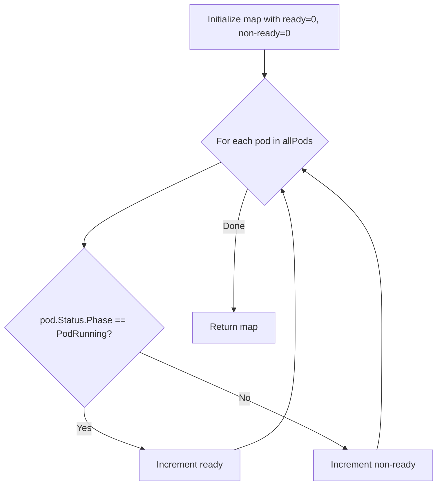

#### Function dependencies

None – this function is not called by any other functions within the package.

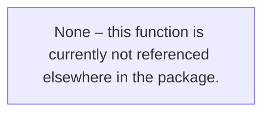

#### Functions calling `CountPodsByStatus`

- `github.com/redhat-best-practices-for-k8s/certsuite/pkg/autodiscover.DoAutoDiscover`  
  (uses it to populate `data.PodStates.BeforeExecution` and later compare with `AfterExecution`).

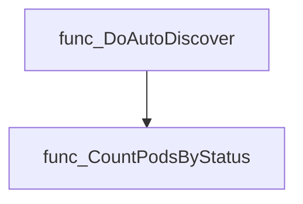

#### Usage example

```go
// Minimal example invoking CountPodsByStatus
import (
    "fmt"
    corev1 "k8s.io/api/core/v1"

    "github.com/redhat-best-practices-for-k8s/certsuite/pkg/autodiscover"
)

func main() {
    pods := []corev1.Pod{
        {Status: corev1.PodStatus{Phase: corev1.PodRunning}},
        {Status: corev1.PodStatus{Phase: corev1.PodPending}},
    }
    counts := autodiscover.CountPodsByStatus(pods)
    fmt.Printf("Ready: %d, Non-ready: %d\n", counts["ready"], counts["non-ready"])
}
```

---

### CreateLabels

**CreateLabels** - Parses each input string using a predefined regular expression (`labelRegex`) and converts matched key‑value pairs into `labelObject` instances. Invalid strings are logged as errors and skipped.

#### Signature (Go)

```go
func CreateLabels(labelStrings []string) (labelObjects []labelObject)
```

#### Summary Table

| Aspect | Details |
|--------|---------|
| **Purpose** | Parses each input string using a predefined regular expression (`labelRegex`) and converts matched key‑value pairs into `labelObject` instances. Invalid strings are logged as errors and skipped. |
| **Parameters** | *`labelStrings []string`* – slice of raw label expressions (e.g., `"app=web"`). |
| **Return value** | *`labelObjects []labelObject`* – slice containing successfully parsed labels; order corresponds to the input slice after filtering out invalid entries. |
| **Key dependencies** | • `regexp.MustCompile(labelRegex)`<br>• `FindStringSubmatch` on compiled regex<br>• `len` (to validate match count)<br>• `log.Error` for error reporting<br>• Built‑in `append` to accumulate results |
| **Side effects** | Emits log messages via the package logger; otherwise pure function with no external I/O or state mutation. |
| **How it fits the package** | Used by autodiscovery routines (`DoAutoDiscover`, `Run`) to translate configuration label strings into objects consumed by pod‑ and operator‑lookup helpers. |

#### Internal workflow (Mermaid)

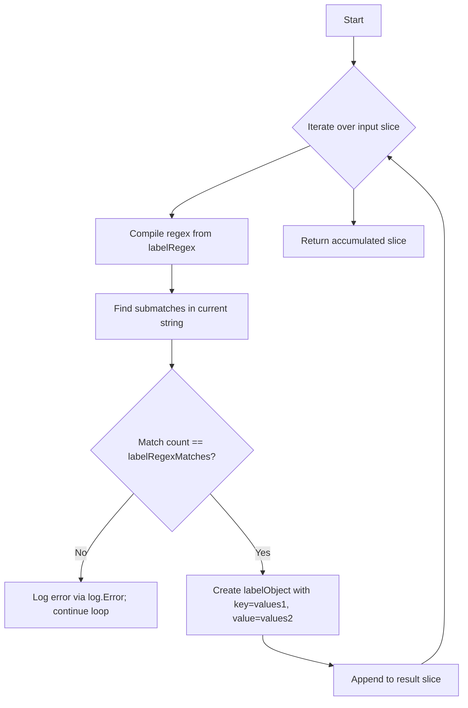

#### Function dependencies (Mermaid)

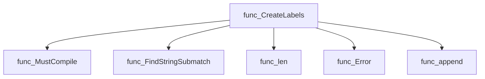

#### Functions calling `CreateLabels` (Mermaid)

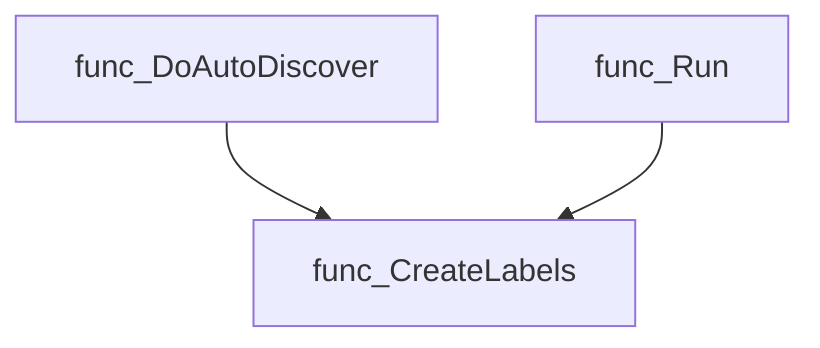

#### Usage example (Go)

```go
// Minimal example invoking CreateLabels
package main

import (
    "fmt"
    "github.com/redhat-best-practices-for-k8s/certsuite/pkg/autodiscover"
)

func main() {
    raw := []string{"app=web", "tier=frontend", "invalidLabel"}
    labels := autodiscover.CreateLabels(raw)
    fmt.Printf("Parsed labels: %+v\n", labels)
}
```

---

---

### DoAutoDiscover

**DoAutoDiscover** - Queries a running cluster to gather namespaces, pods, operators, CRDs, and other Kubernetes objects that match user‑supplied labels or are otherwise relevant for test execution. The gathered data is returned as a `DiscoveredTestData` struct which the rest of the framework consumes to build the test environment.

Collects Kubernetes and OpenShift objects needed for test execution by performing an auto‑discovery of resources defined in the supplied configuration.

```go
func DoAutoDiscover(config *configuration.TestConfiguration) DiscoveredTestData
```

| Aspect | Details |
|--------|---------|
| **Purpose** | Queries a running cluster to gather namespaces, pods, operators, CRDs, and other Kubernetes objects that match user‑supplied labels or are otherwise relevant for test execution. The gathered data is returned as a `DiscoveredTestData` struct which the rest of the framework consumes to build the test environment. |
| **Parameters** | `config *configuration.TestConfiguration` – configuration containing target namespaces, label filters, and other discovery options. |
| **Return value** | `DiscoveredTestData` – a populated struct holding lists of objects such as storage classes, pods, operators, CRDs, network policies, etc. |
| **Key dependencies** | • `clientsholder.GetClientsHolder()` – provides typed clients for the cluster.<br>• Helper functions: `getAllStorageClasses`, `getAllNamespaces`, `findSubscriptions`, `getAllOperators`, `getAllInstallPlans`, `getAllCatalogSources`, `FindPodsByLabels`, `CountPodsByStatus`, `findAbnormalEvents`, `getResourceQuotas`, `getPodDisruptionBudgets`, `getNetworkPolicies`, `getClusterCrdNames`, `FindTestCrdNames`, `GetScaleCrUnderTest`, `findOperatorsByLabels`, `getHelmList`, `findClusterOperators`, `getOperatorCsvPods`, `getOperandPodsFromTestCsvs`, `getOpenshiftVersion`, `isIstioServiceMeshInstalled`, role/cluster‑role binding helpers, and various resource retrieval functions for PVCs, services, etc. |
| **Side effects** | • Uses the global logger (`log`) to report errors or fatal conditions; a failure in any lookup aborts execution with `log.Fatal`. <br>• Does not modify cluster state—only reads resources.<br>• May populate internal global data structures via helper functions but no external mutation is performed. |
| **How it fits the package** | It is the core of the `autodiscover` package, orchestrating all discovery logic and providing a single entry point for building the test environment used by other packages (e.g., provider). |

```mermaid
flowchart TD
  A["GetClientsHolder"] --> B["getAllStorageClasses"]
  A --> C["getAllNamespaces"]
  A --> D["findSubscriptions"]
  A --> E["getAllOperators"]
  A --> F["getAllInstallPlans"]
  A --> G["getAllCatalogSources"]
  H["CreateLabels(config.PodsUnderTestLabels)"] --> I["FindPodsByLabels"]
  I --> J["CountPodsByStatus"]
  A --> K["findAbnormalEvents"]
  A --> L["getResourceQuotas"]
  A --> M["getPodDisruptionBudgets"]
  A --> N["getNetworkPolicies"]
  A --> O["getClusterCrdNames"]
  O --> P["FindTestCrdNames"]
  P --> Q["GetScaleCrUnderTest"]
  A --> R["findOperatorsByLabels"]
  A --> S["getHelmList"]
  A --> T["findClusterOperators"]
  T --> U["getOperatorCsvPods"]
  V["FindPodsByLabels"] --> W["getOperandPodsFromTestCsvs"]
  A --> X["getOpenshiftVersion"]
  A --> Y["isIstioServiceMeshInstalled"]
  A --> Z["getClusterRoleBindings"]
  A --> AA["getRoleBindings"]
  A --> AB["getRoles"]
  A --> AC["findHpaControllers"]
  A --> AD["getPersistentVolumes"]
  A --> AE["getPersistentVolumeClaims"]
  A --> AF["getServices"]
  A --> AG["getAllServices"]
  A --> AH["getServiceAccounts"]
  A --> AI["getSriovNetworks"]
  A --> AJ["getSriovNetworkNodePolicies"]
  A --> AK["getNetworkAttachmentDefinitions"]
```

#### Function dependencies

```mermaid
graph TD
  func_DoAutoDiscover --> func_GetClientsHolder
  func_DoAutoDiscover --> func_getAllStorageClasses
  func_DoAutoDiscover --> func_getAllNamespaces
  func_DoAutoDiscover --> func_findSubscriptions
  func_DoAutoDiscover --> func_getAllOperators
  func_DoAutoDiscover --> func_getAllInstallPlans
  func_DoAutoDiscover --> func_getAllCatalogSources
  func_DoAutoDiscover --> func_FindPodsByLabels
  func_DoAutoDiscover --> func_CountPodsByStatus
  func_DoAutoDiscover --> func_findAbnormalEvents
  func_DoAutoDiscover --> func_getResourceQuotas
  func_DoAutoDiscover --> func_getPodDisruptionBudgets
  func_DoAutoDiscover --> func_getNetworkPolicies
  func_DoAutoDiscover --> func_getClusterCrdNames
  func_DoAutoDiscover --> func_FindTestCrdNames
  func_DoAutoDiscover --> func_GetScaleCrUnderTest
  func_DoAutoDiscover --> func_findOperatorsByLabels
  func_DoAutoDiscover --> func_getHelmList
  func_DoAutoDiscover --> func_findClusterOperators
  func_DoAutoDiscover --> func_getOperatorCsvPods
  func_DoAutoDiscover --> func_getOperandPodsFromTestCsvs
  func_DoAutoDiscover --> func_getOpenshiftVersion
  func_DoAutoDiscover --> func_isIstioServiceMeshInstalled
  func_DoAutoDiscover --> func_getClusterRoleBindings
  func_DoAutoDiscover --> func_getRoleBindings
  func_DoAutoDiscover --> func_getRoles
  func_DoAutoDiscover --> func_findHpaControllers
  func_DoAutoDiscover --> func_getPersistentVolumes
  func_DoAutoDiscover --> func_getPersistentVolumeClaims
  func_DoAutoDiscover --> func_getServices
  func_DoAutoDiscover --> func_getAllServices
  func_DoAutoDiscover --> func_getServiceAccounts
  func_DoAutoDiscover --> func_getSriovNetworks
  func_DoAutoDiscover --> func_getSriovNetworkNodePolicies
  func_DoAutoDiscover --> func_getNetworkAttachmentDefinitions
```

#### Functions calling `DoAutoDiscover`

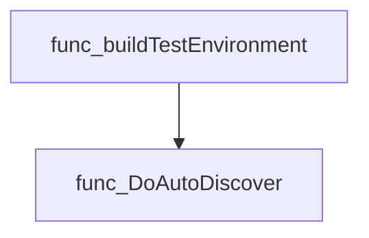

#### Usage example (Go)

```go
// Minimal example invoking DoAutoDiscover
import (
    "github.com/redhat-best-practices-for-k8s/certsuite/pkg/autodiscover"
    "github.com/redhat-best-practices-for-k8s/certsuite/pkg/configuration"
)

func main() {
    cfg := configuration.TestConfiguration{
        // Populate fields as needed for discovery
    }
    data := autodiscover.DoAutoDiscover(&cfg)
    // `data` now contains discovered resources for use in tests.
}
```

---

### FindCrObjectByNameByNamespace

**FindCrObjectByNameByNamespace** - Looks up a Kubernetes `Scale` subresource for the specified CR (Custom Resource) within a given namespace.

#### Signature (Go)

```go
func FindCrObjectByNameByNamespace(scale.ScalesGetter, string, string, schema.GroupResource) (*scalingv1.Scale, error)
```

#### Summary Table

| Aspect | Details |
|--------|---------|
| **Purpose** | Looks up a Kubernetes `Scale` subresource for the specified CR (Custom Resource) within a given namespace. |
| **Parameters** | `scale.ScalesGetter` – client capable of accessing scale resources.<br>`string ns` – target namespace.<br>`string name` – name of the custom resource.<br>`schema.GroupResource groupResourceSchema` – Group/Resource pair identifying the CR type. |
| **Return value** | `*scalingv1.Scale` – the retrieved scale object, or `nil` on error; `error` describing any failure. |
| **Key dependencies** | • `ScalesGetter.Scales(ns).Get(context.TODO(), …)`<br>• `log.Error` for logging failures |
| **Side effects** | No state mutation; only reads from the Kubernetes API and logs errors. |
| **How it fits the package** | Provides a low‑level helper that other components (e.g., provider logic) use to obtain scaling information about arbitrary CRs during autodiscovery. |

#### Internal workflow

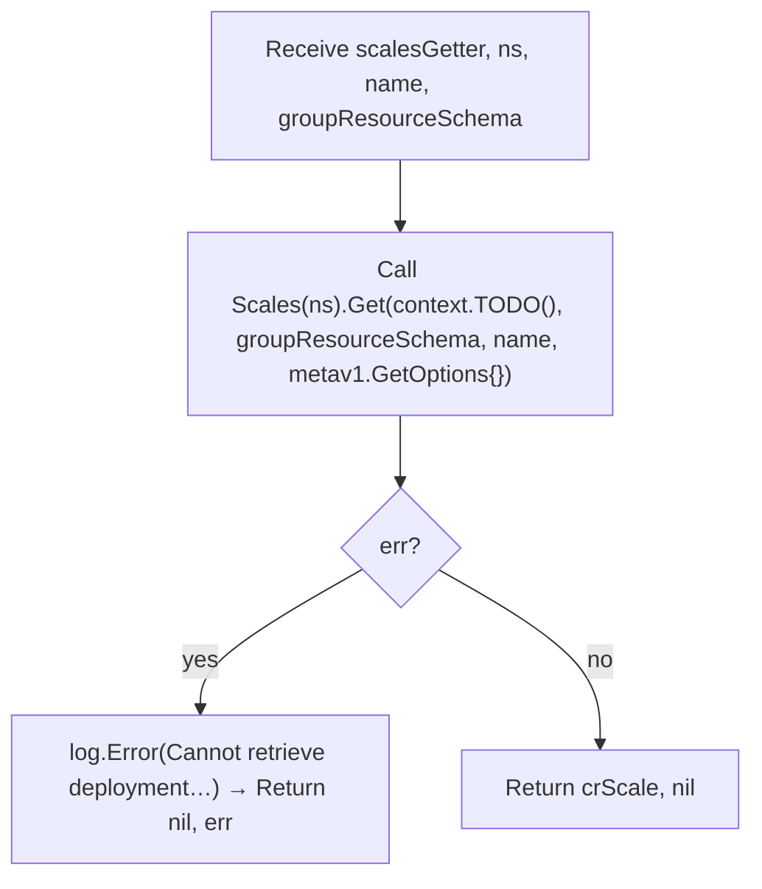

#### Function dependencies

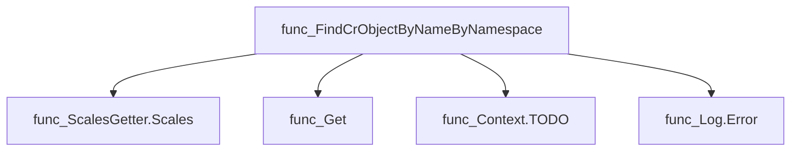

#### Functions calling `FindCrObjectByNameByNamespace`

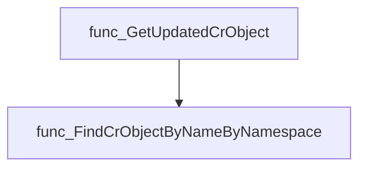

#### Usage example (Go)

```go
// Minimal example invoking FindCrObjectByNameByNamespace
import (
    "github.com/redhat-best-practices-for-k8s/certsuite/pkg/autodiscover"
    "k8s.io/client-go/kubernetes/scheme"
)

func main() {
    // Assume sg is a scale.ScalesGetter obtained from a Kubernetes client
    var sg scale.ScalesGetter

    ns := "example-namespace"
    name := "my-custom-resource"

    // The GroupResource for the CRD, e.g., group "apps.example.com", resource "widgets"
    gr := schema.GroupResource{Group: "apps.example.com", Resource: "widgets"}

    scaleObj, err := autodiscover.FindCrObjectByNameByNamespace(sg, ns, name, gr)
    if err != nil {
        // handle error
    }

    // use scaleObj as needed
}
```

---

### FindDeploymentByNameByNamespace

**FindDeploymentByNameByNamespace** - Fetches a Kubernetes Deployment resource identified by its namespace and name using the AppsV1 client.

#### Signature (Go)

```go
func FindDeploymentByNameByNamespace(appClient appv1client.AppsV1Interface, namespace, name string) (*appsv1.Deployment, error)
```

#### Summary Table

| Aspect | Details |
|--------|---------|
| **Purpose** | Fetches a Kubernetes Deployment resource identified by its namespace and name using the AppsV1 client. |
| **Parameters** | `appClient appv1client.AppsV1Interface` – client for interacting with AppsV1 APIs; <br>`namespace string` – target namespace; <br>`name string` – deployment name. |
| **Return value** | `(*appsv1.Deployment, error)` – the Deployment object on success, or an error if retrieval fails. |
| **Key dependencies** | • `appClient.Deployments(namespace).Get(context.TODO(), name, metav1.GetOptions{})`<br>• `log.Error` from internal logging package<br>• `context.TODO()` and `metav1.GetOptions{}` |
| **Side effects** | None other than network I/O to the Kubernetes API server; logs an error message if retrieval fails. |
| **How it fits the package** | Provides a low‑level helper used by higher‑level functions (e.g., `GetUpdatedDeployment`) to locate Deployments during provider operations. |

#### Internal workflow

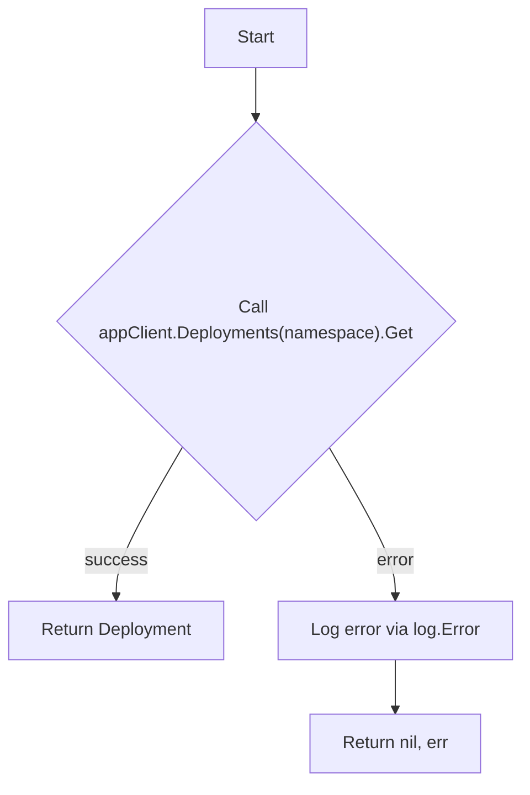

#### Function dependencies

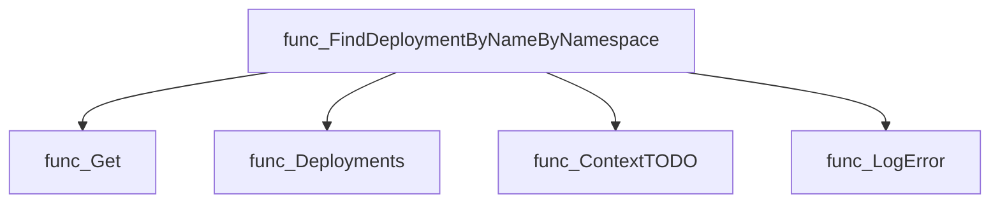

#### Functions calling `FindDeploymentByNameByNamespace`

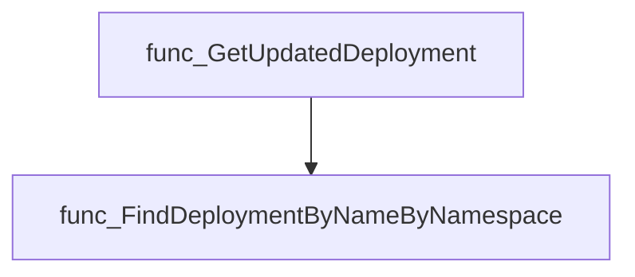

#### Usage example (Go)

```go
// Minimal example invoking FindDeploymentByNameByNamespace
import (
    appv1client "k8s.io/client-go/kubernetes/typed/apps/v1"
)

func main() {
    var client appv1client.AppsV1Interface // obtain from Kubernetes config
    ns := "default"
    name := "my-deployment"

    deployment, err := FindDeploymentByNameByNamespace(client, ns, name)
    if err != nil {
        fmt.Printf("Error retrieving deployment: %v\n", err)
        return
    }
    fmt.Printf("Found deployment: %s in namespace %s\n", deployment.Name, deployment.Namespace)
}
```

---

### FindPodsByLabels

**FindPodsByLabels** - Enumerates pods in the provided namespaces that match any of the supplied label selectors. It returns two slices: one containing only running (or allowed non‑running) pods and another with all retrieved pods, excluding those marked for deletion.

#### Signature (Go)

```go
func FindPodsByLabels(oc corev1client.CoreV1Interface, labels []labelObject, namespaces []string) (runningPods, allPods []corev1.Pod)
```

#### Summary Table

| Aspect | Details |
|--------|---------|
| **Purpose** | Enumerates pods in the provided namespaces that match any of the supplied label selectors. It returns two slices: one containing only running (or allowed non‑running) pods and another with all retrieved pods, excluding those marked for deletion. |
| **Parameters** | `oc corev1client.CoreV1Interface` – Kubernetes Core V1 client; `<labels> []labelObject` – label selectors to match; `<namespaces> []string` – namespaces to search. |
| **Return value** | Two slices of `corev1.Pod`: `runningPods` (filtered by phase and deletion timestamp) and `allPods` (complete list). |
| **Key dependencies** | • `configuration.GetTestParameters()` for `AllowNonRunning` flag.<br>• `findPodsMatchingAtLeastOneLabel(oc, labels, ns)` to filter pods by label.<br>• Kubernetes client methods: `oc.Pods(ns).List`. <br>• Logging via `log.Debug`, `log.Error`. |
| **Side effects** | No global state mutation. Performs network I/O (Kubernetes API calls) and logs diagnostics. |
| **How it fits the package** | Core part of autodiscovery: used by higher‑level functions such as `DoAutoDiscover` to gather pod information for testing and reporting. |

#### Internal workflow

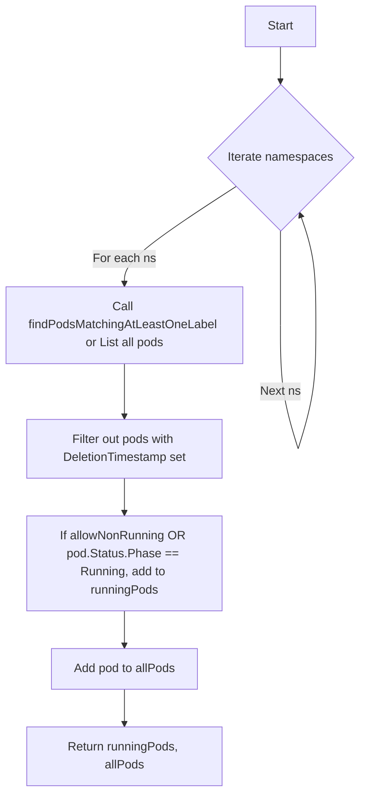

#### Function dependencies

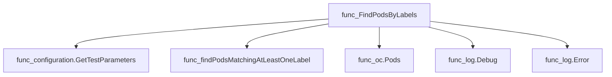

#### Functions calling `FindPodsByLabels`

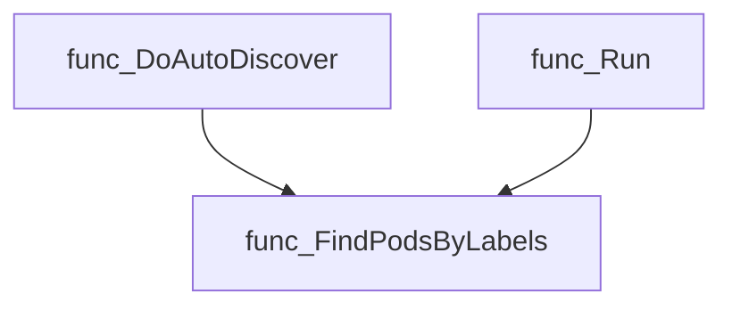

#### Usage example (Go)

```go
// Minimal example invoking FindPodsByLabels
import (
    corev1client "k8s.io/client-go/kubernetes/typed/core/v1"
    metav1 "k8s.io/apimachinery/pkg/apis/meta/v1"
)

// Assume oc is a configured CoreV1Interface and labelObject type defined elsewhere.
var oc corev1client.CoreV1Interface
labels := []labelObject{
    {LabelKey: "app", LabelValue: "demo"},
}
namespaces := []string{"default", "kube-system"}

running, all := FindPodsByLabels(oc, labels, namespaces)

// running contains only pods that are Running or allowed non‑running.
// all contains every pod found in the listed namespaces (excluding those marked for deletion).
```

---

### FindStatefulsetByNameByNamespace

**FindStatefulsetByNameByNamespace** - Fetches a Kubernetes StatefulSet resource identified by its `namespace` and `name`. Returns the object or an error if retrieval fails.

#### Signature (Go)

```go
func FindStatefulsetByNameByNamespace(appClient appv1client.AppsV1Interface, namespace, name string) (*appsv1.StatefulSet, error)
```

#### Summary Table

| Aspect | Details |
|--------|---------|
| **Purpose** | Fetches a Kubernetes StatefulSet resource identified by its `namespace` and `name`. Returns the object or an error if retrieval fails. |
| **Parameters** | `appClient appv1client.AppsV1Interface –` client for Apps V1 API; <br>`namespace string –` namespace of the StatefulSet; <br>`name string –` name of the StatefulSet. |
| **Return value** | `*appsv1.StatefulSet –` pointer to the retrieved StatefulSet (or `nil` on error).<br>`error –` non‑nil if the API call fails or the resource is not found. |
| **Key dependencies** | • `appClient.StatefulSets(namespace).Get(context.TODO(), name, metav1.GetOptions{})` <br>• Logging via `log.Error`. |
| **Side effects** | Makes a read‑only API request; logs an error message on failure. No state mutations in the caller’s context. |
| **How it fits the package** | Utility function used by higher‑level discovery logic to obtain StatefulSet information needed for policy checks and remediation. |

#### Internal workflow (Mermaid)

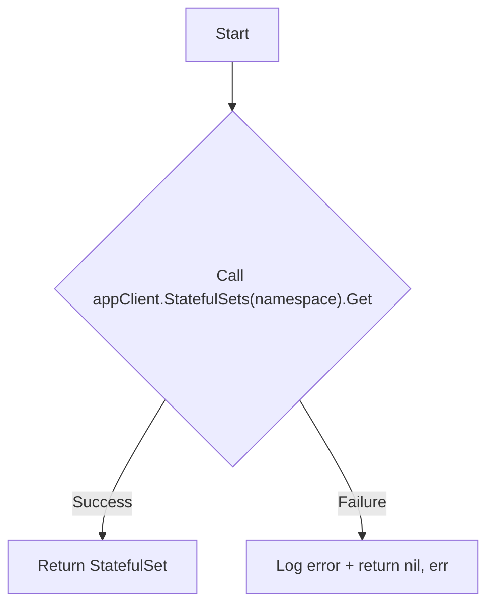

#### Function dependencies (Mermaid)

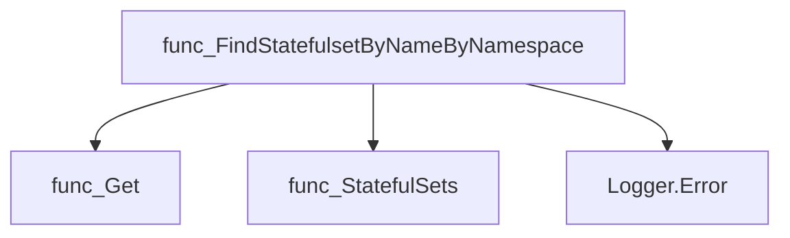

#### Functions calling `FindStatefulsetByNameByNamespace` (Mermaid)

```mermaid
graph TD
  func_GetUpdatedStatefulset --> func_FindStatefulsetByNameByNamespace
```

#### Usage example (Go)

```go
// Minimal example invoking FindStatefulsetByNameByNamespace
import (
    "k8s.io/client-go/kubernetes"
    appv1client "k8s.io/client-go/applyconfigurations/apps/v1"
)

func main() {
    // Assume kubeClient is a configured kubernetes.Clientset
    var kubeClient *kubernetes.Clientset

    appClient := appv1client.NewAppsV1(kubeClient.RESTClient())
    ns, name := "default", "my-statefulset"

    ss, err := FindStatefulsetByNameByNamespace(appClient, ns, name)
    if err != nil {
        // handle error
    }
    // use ss...
}
```

---

### FindTestCrdNames

**FindTestCrdNames** - Filters a list of cluster CRDs to only those whose names end with any suffix specified in `crdFilters`.

Retrieves the subset of cluster Custom Resource Definitions (CRDs) whose names match any configured suffix filter.

#### Signature (Go)

```go
func FindTestCrdNames(clusterCrds []*apiextv1.CustomResourceDefinition, crdFilters []configuration.CrdFilter) (targetCrds []*apiextv1.CustomResourceDefinition)
```

#### Summary Table

| Aspect | Details |
|--------|---------|
| **Purpose** | Filters a list of cluster CRDs to only those whose names end with any suffix specified in `crdFilters`. |
| **Parameters** | *`clusterCrds`* – slice of pointers to `apiextv1.CustomResourceDefinition`; <br>*`crdFilters`* – slice of `configuration.CrdFilter`, each containing a `NameSuffix` string. |
| **Return value** | Slice of CRDs that match at least one suffix filter. If no CRDs are present, returns an empty slice and logs an error. |
| **Key dependencies** | • `log.Error` (internal logging)<br>• `len`<br>• `strings.HasSuffix`<br>• built‑in `append` |
| **Side effects** | Logs an error when the input CRD list is empty; otherwise no external state changes. |
| **How it fits the package** | Used by `DoAutoDiscover` to determine which cluster CRDs should be considered “under test” based on configuration filters. |

#### Internal workflow (Mermaid)

```mermaid
flowchart TD
  A["Check if clusterCrds is empty"] -->|"Yes"| B["Log error & return empty slice"]
  A -->|"No"| C{"Iterate over each CRD"}
  C --> D{"For each crdFilter"}
  D --> E{"Does crd.Name end with crdFilter.NameSuffix?"}
  E -- Yes --> F["Append crd to targetCrds; break inner loop"]
  E -- No --> G["Continue checking next filter"]
  F --> H["Proceed to next CRD"]
  G --> D
  H --> C
  C --> I["Return targetCrds"]
```

#### Function dependencies (Mermaid)

```mermaid
graph TD
  func_FindTestCrdNames --> log.Error
  func_FindTestCrdNames --> strings.HasSuffix
  func_FindTestCrdNames --> append
  func_FindTestCrdNames --> len
```

#### Functions calling `FindTestCrdNames` (Mermaid)

```mermaid
graph TD
  func_DoAutoDiscover --> func_FindTestCrdNames
```

#### Usage example (Go)

```go
// Minimal example invoking FindTestCrdNames
import (
    "github.com/redhat-best-practices-for-k8s/certsuite/pkg/autodiscover"
    "k8s.io/apiextensions-apiserver/pkg/apis/apiextensions/v1"
    "github.com/redhat-best-practices-for-k8s/certsuite/internal/configuration"
)

func main() {
    // Assume we already have cluster CRDs and filter config
    var crds []*v1.CustomResourceDefinition
    filters := []configuration.CrdFilter{
        {NameSuffix: ".operator.openshift.io"},
        {NameSuffix: ".custom.example.com"},
    }

    targetCRDs := autodiscover.FindTestCrdNames(crds, filters)

    // Use targetCRDs as needed...
}
```

---

### GetScaleCrUnderTest

**GetScaleCrUnderTest** - For each namespace‑scoped CRD that supports the `scale` subresource, gather all custom resources (CRs) in the provided namespaces and return their scale objects.

#### Signature (Go)

```go
func GetScaleCrUnderTest(namespaces []string, crds []*apiextv1.CustomResourceDefinition) []ScaleObject
```

#### Summary Table

| Aspect | Details |
|--------|---------|
| **Purpose** | For each namespace‑scoped CRD that supports the `scale` subresource, gather all custom resources (CRs) in the provided namespaces and return their scale objects. |
| **Parameters** | `namespaces []string` – list of target namespace names.<br>`crds []*apiextv1.CustomResourceDefinition` – CRDs to inspect. |
| **Return value** | `[]ScaleObject` – slice containing a scale object for every discovered scalable CR. |
| **Key dependencies** | *`clientsholder.GetClientsHolder()` – obtains dynamic client.<br>* `log.Warn`, `log.Info`, `log.Debug`, `log.Fatal` – logging utilities.<br>* `getCrScaleObjects(crs, crd)` – helper that extracts scale objects from a list of CRs. |
| **Side effects** | Emits log messages (warn/info/debug/fatal). Does not modify external state. |
| **How it fits the package** | Used by `autodiscover.DoAutoDiscover` to populate `data.ScaleCrUnderTest`, enabling further analysis of scalable resources during autodiscovery. |

#### Internal workflow

```mermaid
flowchart TD
  A["Get dynamic client"] --> B{"Iterate CRDs"}
  B -->|"Namespace‑scoped?"| C{"Check scope"}
  C -->|"Cluster‑wide"| D["Warn & skip"]
  C -->|"Namespace‑scoped"| E["Iterate versions"]
  E --> F{"Has scale subresource?"}
  F -->|"No"| G["Info & skip"]
  F -->|"Yes"| H["Log debug"]
  H --> I["For each namespace"]
  I --> J["List CRs via dynamic client"]
  J --> K{"Error?"}
  K -->|"Yes"| L["Fatal log"]
  K -->|"No"| M{"CRs exist?"}
  M -->|"Yes"| N["Append scale objects"]
  M -->|"No"| O["Warn no CRs found"]
```

#### Function dependencies

```mermaid
graph TD
  func_GetScaleCrUnderTest --> clientsholder.GetClientsHolder
  func_GetScaleCrUnderTest --> log.Warn
  func_GetScaleCrUnderTest --> log.Info
  func_GetScaleCrUnderTest --> log.Debug
  func_GetScaleCrUnderTest --> log.Fatal
  func_GetScaleCrUnderTest --> getCrScaleObjects
```

#### Functions calling `GetScaleCrUnderTest`

```mermaid
graph TD
  func_DoAutoDiscover --> func_GetScaleCrUnderTest
```

#### Usage example (Go)

```go
// Minimal example invoking GetScaleCrUnderTest
import (
    "github.com/redhat-best-practices-for-k8s/certsuite/pkg/autodiscover"
    apiextv1 "k8s.io/apiextensions-apiserver/pkg/apis/apiextensions/v1"
)

func main() {
    // Example namespaces and CRDs (normally obtained from the cluster)
    namespaces := []string{"default", "test-namespace"}
    var crds []*apiextv1.CustomResourceDefinition

    // Call the function
    scaleObjs := autodiscover.GetScaleCrUnderTest(namespaces, crds)

    // Use the returned scale objects...
    _ = scaleObjs
}
```

---

## Local Functions

### findAbnormalEvents

**findAbnormalEvents** - Gathers all Kubernetes events whose `type` is not `"Normal"` from the supplied namespaces.

#### Signature (Go)

```go
func findAbnormalEvents(oc corev1client.CoreV1Interface, namespaces []string) (abnormalEvents []corev1.Event)
```

#### Summary Table

| Aspect | Details |
|--------|---------|
| **Purpose** | Gathers all Kubernetes events whose `type` is not `"Normal"` from the supplied namespaces. |
| **Parameters** | `oc corev1client.CoreV1Interface – client for CoreV1 API`<br>`namespaces []string – list of namespace names to query` |
| **Return value** | `[]corev1.Event – slice containing every non‑Normal event found` |
| **Key dependencies** | • `oc.Events(ns).List(context.TODO(), metav1.ListOptions{FieldSelector: "type!=Normal"})`<br>• `log.Error` for error logging<br>• Standard library `context` and `append` |
| **Side effects** | None beyond returning data; logs errors to the package logger. |
| **How it fits the package** | Used by `DoAutoDiscover` to populate the `AbnormalEvents` field of the discovered test data structure. |

#### Internal workflow (Mermaid)

```mermaid
flowchart TD
  A["Start"] --> B{"Namespaces loop"}
  B --> C["Call oc.Events(ns).List with FieldSelector"]
  C --> D{"Error?"}
  D -- Yes --> E["log.Error & continue"]
  D -- No --> F["Append Items to abnormalEvents"]
  F --> B
  B --> G["Return abnormalEvents"]
```

#### Function dependencies (Mermaid)

```mermaid
graph TD
  func_findAbnormalEvents --> corev1client.CoreV1Interface.List
  func_findAbnormalEvents --> log.Error
  func_findAbnormalEvents --> context.TODO
  func_findAbnormalEvents --> append
```

#### Functions calling `findAbnormalEvents` (Mermaid)

```mermaid
graph TD
  func_DoAutoDiscover --> func_findAbnormalEvents
```

#### Usage example (Go)

```go
// Minimal example invoking findAbnormalEvents
import (
    "k8s.io/client-go/kubernetes"
    corev1client "k8s.io/client-go/kubernetes/typed/core/v1"
)

func main() {
    // Assume kubeClient is a configured kubernetes.Clientset
    var kubeClient *kubernetes.Clientset

    coreV1 := kubeClient.CoreV1()
    namespaces := []string{"default", "kube-system"}

    events, err := findAbnormalEvents(coreV1, namespaces)
    if err != nil {
        // handle error (function actually never returns an error directly)
    }

    for _, ev := range events {
        fmt.Printf("%s: %s\n", ev.Type, ev.Message)
    }
}
```

---

### findClusterOperators

**findClusterOperators** - Queries the Kubernetes API for all `ClusterOperator` resources, returning them as a slice of `configv1.ClusterOperator`. If the CR is missing, it logs a debug message and returns `nil, nil`.

#### Signature (Go)

```go
func findClusterOperators(client clientconfigv1.ClusterOperatorInterface) ([]configv1.ClusterOperator, error)
```

#### Summary Table

| Aspect | Details |
|--------|---------|
| **Purpose** | Queries the Kubernetes API for all `ClusterOperator` resources, returning them as a slice of `configv1.ClusterOperator`. If the CR is missing, it logs a debug message and returns `nil, nil`. |
| **Parameters** | `client clientconfigv1.ClusterOperatorInterface –` an interface to the OpenShift ClusterOperators API. |
| **Return value** | `([]configv1.ClusterOperator, error) –` slice of found operators or an error if the list operation fails for reasons other than “not found”. |
| **Key dependencies** | • `client.List(context.TODO(), metav1.ListOptions{})`<br>• `k8serrors.IsNotFound(err)`<br>• `log.Debug(msg, args…)` |
| **Side effects** | Emits a debug log when the CR is absent. No other state changes or I/O. |
| **How it fits the package** | Used by the autodiscovery routine (`DoAutoDiscover`) to gather cluster‑wide operator status before proceeding with further discovery steps. |

#### Internal workflow (Mermaid)

```mermaid
flowchart TD
  A["Start"] --> B{"Call client.List"}
  B -->|"error"| C{"Check !IsNotFound(err)"}
  C -- true --> D["Return error"]
  C -- false --> E{"err is IsNotFound?"}
  E -- true --> F["log.Debug(ClusterOperator CR not found)"]
  F --> G["Return nil, nil"]
  E -- false --> H["Return clusterOperators.Items, nil"]
```

#### Function dependencies (Mermaid)

```mermaid
graph TD
  func_findClusterOperators --> func_List
  func_findClusterOperators --> func_IsNotFound
  func_findClusterOperators --> func_Debug
```

#### Functions calling `findClusterOperators` (Mermaid)

```mermaid
graph TD
  func_DoAutoDiscover --> func_findClusterOperators
```

#### Usage example (Go)

```go
// Minimal example invoking findClusterOperators
package main

import (
 "fmt"

 clientconfigv1 "github.com/openshift/client-go/config/v1"
 configv1 "github.com/openshift/api/config/v1"
)

func main() {
 // Assume `client` is an initialized ClusterOperatorInterface.
 var client clientconfigv1.ClusterOperatorInterface
 operators, err := findClusterOperators(client)
 if err != nil {
  fmt.Printf("Error retrieving operators: %v\n", err)
  return
 }
 fmt.Printf("Found %d cluster operators\n", len(operators))
}
```

---

### findDeploymentsByLabels

**findDeploymentsByLabels** - Enumerates all deployments in the specified namespaces that contain at least one of the supplied label key/value pairs. If no labels are provided, every deployment in those namespaces is returned.

#### Signature (Go)

```go
func findDeploymentsByLabels(appClient appv1client.AppsV1Interface, labels []labelObject, namespaces []string) []appsv1.Deployment
```

#### Summary Table

| Aspect | Details |
|--------|---------|
| **Purpose** | Enumerates all deployments in the specified namespaces that contain at least one of the supplied label key/value pairs. If no labels are provided, every deployment in those namespaces is returned. |
| **Parameters** | `appClient appv1client.AppsV1Interface` – Kubernetes Apps V1 client; <br>`labels []labelObject` – slice of key/value pairs to filter on; <br>`namespaces []string` – list of namespace names to search. |
| **Return value** | `[]appsv1.Deployment` – collection of deployments that satisfy the label criteria (empty slice if none found). |
| **Key dependencies** | • `appClient.Deployments(ns).List(context.TODO(), metav1.ListOptions{})` <br>• `isDeploymentsPodsMatchingAtLeastOneLabel(labels, ns, &deployment)` <br>• Logging functions (`log.Error`, `log.Warn`, `log.Debug`, `log.Info`) |
| **Side effects** | • Emits log messages for errors and informational events. <br>• No state mutation beyond local variables; no external I/O besides API calls. |
| **How it fits the package** | Supports autodiscovery of testable deployments by filtering Kubernetes objects according to user‑defined labels, enabling the CNF suite to target relevant workloads. |

#### Internal workflow (Mermaid)

```mermaid
flowchart TD
  A["Start"] --> B{"Iterate namespaces"}
  B -->|"for each ns"| C["List deployments in ns"]
  C --> D{"Check error"}
  D -- Error --> E["Log error & continue"]
  D -- No error --> F{"No deployments?"}
  F -- Yes --> G["Log warning"]
  F -- No --> H{"Iterate deployments"}
  H --> I{"Labels provided?"}
  I -- Yes --> J{"Match at least one label?"}
  J -- Yes --> K["Append deployment"]
  J -- No --> L["Skip"]
  I -- No --> M["Append all deployments"]
  M --> N["Log info"]
  H --> O["End loop"]
  O --> P["Return list"]
```

#### Function dependencies (Mermaid)

```mermaid
graph TD
  func_findDeploymentsByLabels --> appClient_Deployments_ns_List
  func_findDeploymentsByLabels --> isDeploymentsPodsMatchingAtLeastOneLabel
  func_findDeploymentsByLabels --> log_Error
  func_findDeploymentsByLabels --> log_Warn
  func_findDeploymentsByLabels --> log_Debug
  func_findDeploymentsByLabels --> log_Info
```

#### Functions calling `findDeploymentsByLabels` (Mermaid)

```mermaid
graph TD
  DoAutoDiscover --> findDeploymentsByLabels
```

#### Usage example (Go)

```go
// Minimal example invoking findDeploymentsByLabels
import (
    appv1client "k8s.io/client-go/kubernetes/typed/apps/v1"
    metav1 "k8s.io/apimachinery/pkg/apis/meta/v1"
)

func example(client appv1client.AppsV1Interface) {
    // Define label filters (key/value)
    labels := []labelObject{
        {LabelKey: "app", LabelValue: "nginx"},
        {LabelKey: "tier", LabelValue: "frontend"},
    }
    // Target namespaces
    namespaces := []string{"default", "prod"}

    deployments := findDeploymentsByLabels(client, labels, namespaces)

    for _, d := range deployments {
        fmt.Printf("Found deployment %s in namespace %s\n", d.Name, d.Namespace)
    }
}
```

---

---

### findHpaControllers

**findHpaControllers** - Collects every `HorizontalPodAutoscaler` object from the supplied namespaces and returns a slice of pointers to them.

#### Signature (Go)

```go
func(findHpaControllers)(kubernetes.Interface, []string) []*scalingv1.HorizontalPodAutoscaler
```

#### Summary Table

| Aspect | Details |
|--------|---------|
| **Purpose** | Collects every `HorizontalPodAutoscaler` object from the supplied namespaces and returns a slice of pointers to them. |
| **Parameters** | `cs kubernetes.Interface` – client for interacting with the Kubernetes API.<br>`namespaces []string` – list of namespace names to query. |
| **Return value** | `[]*scalingv1.HorizontalPodAutoscaler` – aggregated HPA objects; empty slice if none found or an error occurs. |
| **Key dependencies** | *`cs.AutoscalingV1().HorizontalPodAutoscalers(ns).List(context.TODO(), metav1.ListOptions{})` – API call to list HPAs.<br>* `log.Error`, `log.Info` – logging utilities for error and info messages. |
| **Side effects** | None beyond reading from the cluster; logs errors or informational messages. |
| **How it fits the package** | Used by `DoAutoDiscover` to populate the `Hpas` field of the discovered data structure, enabling downstream analysis of autoscaling configurations. |

#### Internal workflow (Mermaid)

```mermaid
flowchart TD
  start(Start) --> iterate{"For each namespace"}
  iterate --> list["List HPAs"]
  list -- success --> append["Append items to result"]
  append --> nextIter{"Next namespace?"}
  nextIter -- yes --> iterate
  nextIter -- no --> checkEmpty{"Result empty?"}
  checkEmpty -- yes --> info["Log_Cannot_find_any_deployed_HPA"]
  checkEmpty -- no --> endNode["Return slice"]
```

#### Function dependencies (Mermaid)

```mermaid
graph TD
  func_findHpaControllers --> func_List
  func_findHpaControllers --> func_HorizontalPodAutoscalers
  func_findHpaControllers --> func_AutoscalingV1
  func_findHpaControllers --> func_Context_TODO
  func_findHpaControllers --> func_Log_Error
  func_findHpaControllers --> func_Log_Info
```

#### Functions calling `findHpaControllers` (Mermaid)

```mermaid
graph TD
  func_DoAutoDiscover --> func_findHpaControllers
```

#### Usage example (Go)

```go
// Minimal example invoking findHpaControllers
import (
    "github.com/redhat-best-practices-for-k8s/certsuite/pkg/autodiscover"
    "k8s.io/client-go/kubernetes"
)

func example(client kubernetes.Interface) {
    namespaces := []string{"default", "production"}
    hpas := autodiscover.findHpaControllers(client, namespaces)
    // hpas now contains pointers to all HPAs found in the specified namespaces
}
```

---

### findOperatorsByLabels

**findOperatorsByLabels** - Scans each namespace in `namespaces` for ClusterServiceVersions (CSVs). If `labels` are provided, only CSVs that have at least one of those labels are considered; otherwise all CSVs are fetched. It then filters the results to include only those whose controller pods run inside any namespace listed in `namespaces`.

#### Signature (Go)

```go
func findOperatorsByLabels(olmClient v1alpha1.OperatorsV1alpha1Interface, labels []labelObject, namespaces []configuration.Namespace) (csvs []*olmv1Alpha.ClusterServiceVersion)
```

#### Summary Table

| Aspect | Details |
|--------|---------|
| **Purpose** | Scans each namespace in `namespaces` for ClusterServiceVersions (CSVs). If `labels` are provided, only CSVs that have at least one of those labels are considered; otherwise all CSVs are fetched. It then filters the results to include only those whose controller pods run inside any namespace listed in `namespaces`. |
| **Parameters** | *olmClient* – OLM client interface for querying CSV resources.<br>*labels* – Slice of label objects (`labelObject`) used as selectors when searching.<br>*namespaces* – List of target namespaces (`configuration.Namespace`). |
| **Return value** | A slice of pointers to `olmv1Alpha.ClusterServiceVersion` that satisfy the label and namespace constraints. |
| **Key dependencies** | *findOperatorsMatchingAtLeastOneLabel* – helper for label‑based lookup.<br>*olmClient.ClusterServiceVersions* – OLM API call.<br>*log.Debug/Info/Error* – logging utilities.<br>*context.TODO*, *metav1.ListOptions* – Kubernetes client helpers. |
| **Side effects** | Emits debug, info, and error logs; no state mutation outside of local variables. |
| **How it fits the package** | Used by `DoAutoDiscover` to gather operator information for test configuration. It bridges OLM resources with namespace‑scoped testing logic. |

#### Internal workflow

```mermaid
flowchart TD
  A["Start"] --> B{"Iterate over namespaces"}
  B -->|"labels present"| C["Call findOperatorsMatchingAtLeastOneLabel"]
  B -->|"no labels"| D["List all CSVs in namespace"]
  C & D --> E["Collect csvList"]
  E --> F["For each CSV"]
  F --> G{"Has controller ns annotation?"}
  G -- No --> H["Log error, skip"]
  G -- Yes --> I{"controller ns in target set?"}
  I -- Yes --> J["Append to result slice"]
  I -- No --> K["Skip"]
  J & K --> L["Next CSV"]
  L --> M["Next namespace"]
  M --> N["Log found CSVs"]
  N --> O["Return csvs"]
```

#### Function dependencies

```mermaid
graph TD
  func_findOperatorsByLabels --> func_findOperatorsMatchingAtLeastOneLabel
  func_findOperatorsByLabels --> log.Debug
  func_findOperatorsByLabels --> log.Error
  func_findOperatorsByLabels --> log.Info
  func_findOperatorsByLabels --> olmClient.ClusterServiceVersions
```

#### Functions calling `findOperatorsByLabels`

```mermaid
graph TD
  func_DoAutoDiscover --> func_findOperatorsByLabels
```

#### Usage example (Go)

```go
// Minimal example invoking findOperatorsByLabels
package main

import (
    "github.com/redhat-best-practices-for-k8s/certsuite/pkg/autodiscover"
    v1alpha1 "k8s.io/client-go/kubernetes/typed/operator/v1alpha1"
)

func main() {
    var olmClient v1alpha1.OperatorsV1alpha1Interface // initialized elsewhere
    labels := []autodiscover.labelObject{
        {LabelKey: "app", LabelValue: "my-operator"},
    }
    namespaces := []autodiscover.configuration.Namespace{
        {Name: "default"},
        {Name: "operators"},
    }

    csvs := autodiscover.findOperatorsByLabels(olmClient, labels, namespaces)
    for _, csv := range csvs {
        println(csv.Name)
    }
}
```

---

### findOperatorsMatchingAtLeastOneLabel

**findOperatorsMatchingAtLeastOneLabel** - Retrieves all ClusterServiceVersions (CSVs) within the given `namespace` that carry at least one of the supplied label key/value pairs. The function aggregates results across labels and returns a combined list.

```go
func(v1alpha1.OperatorsV1alpha1Interface, []labelObject, configuration.Namespace)(*olmv1Alpha.ClusterServiceVersionList)
```

| Aspect | Details |
|--------|---------|
| **Purpose** | Retrieves all ClusterServiceVersions (CSVs) within the given `namespace` that carry at least one of the supplied label key/value pairs. The function aggregates results across labels and returns a combined list. |
| **Parameters** | `olmClient v1alpha1.OperatorsV1alpha1Interface` – OLM client used to query CSVs.<br>`labels []labelObject` – Slice of label objects (`LabelKey`, `LabelValue`) to filter by.<br>`namespace configuration.Namespace` – Target namespace for the search. |
| **Return value** | `*olmv1Alpha.ClusterServiceVersionList` – Aggregated list of CSVs that matched any label; may be empty if no matches are found or an error occurs during queries. |
| **Key dependencies** | • `olmClient.ClusterServiceVersions(namespace.Name).List(context.TODO(), metav1.ListOptions{LabelSelector: …})`<br>• Logging via `log.Debug` and `log.Error`<br>• Standard Go `append` for slice concatenation |
| **Side effects** | No mutation of input parameters.<br>Logs debug information for each label query and errors if list operations fail. |
| **How it fits the package** | Used by `findOperatorsByLabels` to discover operators that satisfy at least one user‑defined label criterion within a set of namespaces, enabling targeted operator selection during auto‑discovery. |

#### Internal workflow (Mermaid)

```mermaid
flowchart TD
  Start --> InitializeList["Create empty ClusterServiceVersionList"]
  Init --> Loop["For each label in labels"]
  Loop --> Query{"Call List API with LabelSelector"}
  Query -- Success --> Append["Append returned CSV items to list"]
  Query -- Failure --> LogError["Log error, continue loop"]
  Append --> NextLabel
  NextLabel -->|"More labels?"|Loop
  NextLabel --> End["Return aggregated list"]
```

#### Function dependencies (Mermaid)

```mermaid
graph TD
  func_findOperatorsMatchingAtLeastOneLabel --> Logger_Debug
  func_findOperatorsMatchingAtLeastOneLabel --> OLMClient_List
  func_findOperatorsMatchingAtLeastOneLabel --> Logger_Error
  func_findOperatorsMatchingAtLeastOneLabel --> append
```

#### Functions calling `findOperatorsMatchingAtLeastOneLabel` (Mermaid)

```mermaid
graph TD
  findOperatorsByLabels --> func_findOperatorsMatchingAtLeastOneLabel
```

#### Usage example (Go)

```go
// Minimal example invoking findOperatorsMatchingAtLeastOneLabel

import (
    "github.com/redhat-best-practices-for-k8s/certsuite/pkg/autodiscover"
    v1alpha1 "github.com/operator-framework/api/pkg/operators/v1alpha1"
    configuration "github.com/redhat-best-practices-for-k8s/certsuite/internal/configuration"
)

func example() {
    var olmClient v1alpha1.OperatorsV1alpha1Interface // initialized elsewhere
    labels := []labelObject{
        {LabelKey: "app", LabelValue: "example"},
        {LabelKey: "tier", LabelValue: "backend"},
    }
    ns := configuration.Namespace{Name: "demo-namespace"}

    csvList := findOperatorsMatchingAtLeastOneLabel(olmClient, labels, ns)
    // csvList now contains all CSVs in "demo-namespace" that have either
    // the label app=example or tier=backend.
}
```

---

### findPodsMatchingAtLeastOneLabel

**findPodsMatchingAtLeastOneLabel** - Builds a `PodList` containing all pods in the specified `namespace` that match at least one label from the provided slice.

#### Signature (Go)

```go
func findPodsMatchingAtLeastOneLabel(oc corev1client.CoreV1Interface, labels []labelObject, namespace string) *corev1.PodList
```

#### Summary Table

| Aspect | Details |
|--------|---------|
| **Purpose** | Builds a `PodList` containing all pods in the specified `namespace` that match at least one label from the provided slice. |
| **Parameters** | `oc corev1client.CoreV1Interface` – Kubernetes client; <br>`labels []labelObject` – list of key/value pairs to search for; <br>`namespace string` – target namespace. |
| **Return value** | `*corev1.PodList` – aggregated pods matching any label. |
| **Key dependencies** | • `log.Debug`, `log.Error` from internal logging package<br>• `oc.Pods(namespace).List(context.TODO(), metav1.ListOptions{LabelSelector: …})` to query the API<br>• Standard slice append operation |
| **Side effects** | No mutation of global state; only performs API calls and logs. |
| **How it fits the package** | Helper for `FindPodsByLabels`, used during automatic discovery of CNF pods across namespaces. |

#### Internal workflow (Mermaid)

```mermaid
flowchart TD
  A["Start"] --> B{"labels slice empty?"}
  B -- no --> C["Initialize empty PodList"]
  B -- no --> D["Loop over each label l"]
  D --> E["Log debug: searching with l"]
  E --> F["List pods via oc.Pods(namespace).List(...)"]
  F --> G{"error?"}
  G -- yes --> H["Log error, continue loop"]
  G -- no --> I["Append found pods to allPods.Items"]
  I --> D
  D --> J["Return allPods"]
```

#### Function dependencies (Mermaid)

```mermaid
graph TD
  func_findPodsMatchingAtLeastOneLabel --> log.Debug
  func_findPodsMatchingAtLeastOneLabel --> oc.Pods
  func_findPodsMatchingAtLeastOneLabel --> List
  func_findPodsMatchingAtLeastOneLabel --> context.TODO
  func_findPodsMatchingAtLeastOneLabel --> log.Error
  func_findPodsMatchingAtLeastOneLabel --> append
```

#### Functions calling `findPodsMatchingAtLeastOneLabel` (Mermaid)

```mermaid
graph TD
  func_FindPodsByLabels --> func_findPodsMatchingAtLeastOneLabel
```

#### Usage example (Go)

```go
// Minimal example invoking findPodsMatchingAtLeastOneLabel
package main

import (
    "github.com/redhat-best-practices-for-k8s/certsuite/pkg/autodiscover"
    corev1client "k8s.io/client-go/kubernetes/typed/core/v1"
)

// Assume `oc` is a pre‑configured CoreV1Interface client,
// and `labels` contains desired labelObject entries.
var oc corev1client.CoreV1Interface
var labels []autodiscover.labelObject

func main() {
    ns := "default"
    podList := autodiscover.findPodsMatchingAtLeastOneLabel(oc, labels, ns)
    // podList now holds all pods in `ns` that match any of the provided labels.
}
```

---

---

### findStatefulSetsByLabels

**findStatefulSetsByLabels** - Enumerates all StatefulSets in the supplied namespaces, filtering by label matches when provided. Returns a slice of matching `StatefulSet` objects.

#### Signature (Go)

```go
func findStatefulSetsByLabels(
    appClient appv1client.AppsV1Interface,
    labels []labelObject,
    namespaces []string,
) []appsv1.StatefulSet
```

#### Summary Table

| Aspect | Details |
|--------|---------|
| **Purpose** | Enumerates all StatefulSets in the supplied namespaces, filtering by label matches when provided. Returns a slice of matching `StatefulSet` objects. |
| **Parameters** | `appClient appv1client.AppsV1Interface` – Kubernetes AppsV1 client.<br>`labels []labelObject` – Optional list of key/value pairs used to filter StatefulSets.<br>`namespaces []string` – Namespaces to search within. |
| **Return value** | Slice of `appsv1.StatefulSet` that satisfy the label criteria (or all if no labels supplied). |
| **Key dependencies** | *`List` on `StatefulSets(ns)`<br>* `isStatefulSetsMatchingAtLeastOneLabel` helper<br>* Logging functions (`log.Error`, `log.Warn`, `log.Debug`, `log.Info`) |
| **Side effects** | No mutation of input arguments.<br>Logs errors and warnings; does not propagate errors to caller. |
| **How it fits the package** | Used by the autodiscover routine to gather StatefulSet resources that may contain CNF pods for later analysis. |

#### Internal workflow

```mermaid
flowchart TD
  A["Start"] --> B{"Loop over namespaces"}
  B -->|"For each ns"| C["List StatefulSets"]
  C --> D{"Check error"}
  D -- Yes --> E["Log error & continue"]
  D -- No --> F{"Items present?"}
  F -- None --> G["Warn no statefulsets"]
  F -- Some --> H["Loop over items"]
  H --> I{"Labels supplied?"}
  I -- Yes --> J["Check label match"]
  J -->|"Match"| K["Append to result"]
  J -->|"No match"| L["Skip"]
  I -- No --> M["Append all items"]
  M --> N["Log info"]
  B --> O["End loop"]
  O --> P["Warn if no results"] --> Q["Return slice"]
```

#### Function dependencies

```mermaid
graph TD
  func_findStatefulSetsByLabels --> List
  func_findStatefulSetsByLabels --> StatefulSets
  func_findStatefulSetsByLabels --> isStatefulSetsMatchingAtLeastOneLabel
  func_findStatefulSetsByLabels --> Logger.Error
  func_findStatefulSetsByLabels --> Warn
  func_findStatefulSetsByLabels --> Debug
  func_findStatefulSetsByLabels --> Info
```

#### Functions calling `findStatefulSetsByLabels`

```mermaid
graph TD
  DoAutoDiscover --> findStatefulSetsByLabels
```

#### Usage example (Go)

```go
// Minimal example invoking findStatefulSetsByLabels
import (
    appv1client "k8s.io/client-go/kubernetes/typed/apps/v1"
    appsv1 "k8s.io/api/apps/v1"
)

// Assume `client` is an initialized AppsV1Interface.
var client appv1client.AppsV1Interface

// Labels to filter by
labels := []labelObject{
    {LabelKey: "app", LabelValue: "my-cnf"},
}

// Namespaces to search in
namespaces := []string{"cnf-namespace", "default"}

// Retrieve StatefulSets matching the labels
statefulSets := findStatefulSetsByLabels(client, labels, namespaces)

// statefulSets now contains all matching StatefulSet objects.
```

---

### findSubscriptions

**findSubscriptions** - Collects all `Subscription` objects from the provided list of Kubernetes namespaces using an OLM client.

#### Signature (Go)

```go
func findSubscriptions(olmClient v1alpha1.OperatorsV1alpha1Interface, namespaces []string) []olmv1Alpha.Subscription
```

#### Summary Table

| Aspect | Details |
|--------|---------|
| **Purpose** | Collects all `Subscription` objects from the provided list of Kubernetes namespaces using an OLM client. |
| **Parameters** | `olmClient v1alpha1.OperatorsV1alpha1Interface –` interface to interact with Operator Lifecycle Manager resources.<br>`namespaces []string –` slice of namespace names; an empty string represents all namespaces. |
| **Return value** | `[]olmv1Alpha.Subscription` – aggregated list of subscriptions found across the supplied namespaces. |
| **Key dependencies** | • `olmClient.Subscriptions(ns).List(context.TODO(), metav1.ListOptions{})`<br>• Logging via `log.Debug`, `log.Error`, and `log.Info`. |
| **Side effects** | Performs read‑only API calls; logs progress and errors but does not modify cluster state. |
| **How it fits the package** | Used by autodiscovery routines to discover operator subscriptions, which are later used for pod mapping and test data collection. |

#### Internal workflow (Mermaid)

```mermaid
flowchart TD
  A["Start"] --> B{"Iterate over namespaces"}
  B -->|"Non‑empty ns"| C["List subscriptions in ns"]
  B -->|"Empty ns"| D["List subscriptions in all namespaces"]
  C --> E["Handle error & continue"]
  D --> E
  E --> F["Append items to slice"]
  F --> G{"Next namespace?"}
  G -- Yes --> B
  G -- No --> H["Log each found subscription"]
  H --> I["Return aggregated list"]
```

#### Function dependencies (Mermaid)

```mermaid
graph TD
  func_findSubscriptions --> func_List
  func_findSubscriptions --> func_Subscriptions
  func_findSubscriptions --> func_Debug
  func_findSubscriptions --> func_Error
  func_findSubscriptions --> func_Info
```

#### Functions calling `findSubscriptions` (Mermaid)

```mermaid
graph TD
  func_DoAutoDiscover --> func_findSubscriptions
```

#### Usage example (Go)

```go
// Minimal example invoking findSubscriptions
package main

import (
 "github.com/redhat-best-practices-for-k8s/certsuite/pkg/autodiscover"
 v1alpha1 "github.com/operator-framework/api/pkg/operators/v1alpha1"
 olmv1Alpha "github.com/operator-framework/operator-lifecycle-manager/pkg/api/apis/operators/v1alpha1"
)

func main() {
 var olmClient v1alpha1.OperatorsV1alpha1Interface // obtain from OLM client set
 namespaces := []string{"default", "kube-system"}
 subs := autodiscover.findSubscriptions(olmClient, namespaces)
 for _, sub := range subs {
  println(sub.Name, sub.Namespace)
 }
}
```

---

### getAllCatalogSources

**getAllCatalogSources** - Collects every `CatalogSource` resource present in the Kubernetes cluster and returns them as a slice of pointers.

#### 1) Signature (Go)

```go
func getAllCatalogSources(olmClient v1alpha1.OperatorsV1alpha1Interface) (out []*olmv1Alpha.CatalogSource)
```

#### 2) Summary Table

| Aspect | Details |
|--------|---------|
| **Purpose** | Collects every `CatalogSource` resource present in the Kubernetes cluster and returns them as a slice of pointers. |
| **Parameters** | `olmClient v1alpha1.OperatorsV1alpha1Interface` – an OLM client capable of listing catalog sources across all namespaces. |
| **Return value** | `out []*olmv1Alpha.CatalogSource` – a slice containing references to each catalog source found; empty if none or on error. |
| **Key dependencies** | • `olmClient.CatalogSources("")`<br>• `context.TODO()`<br>• `metav1.ListOptions{}`<br>• `log.Error` (internal logger)<br>• `append` |
| **Side effects** | Logs an error message if the list operation fails; otherwise no state mutation or I/O beyond the API call. |
| **How it fits the package** | Used by `DoAutoDiscover` to populate `data.AllCatalogSources`, enabling downstream analysis of operator catalog sources within the cluster. |

#### 3) Internal workflow (Mermaid)

```mermaid
flowchart TD
    A["Start"] --> B["List CatalogSources"]
    B -->|"Success"| C{"Iterate Items"}
    C --> D["Append to slice"]
    D --> E["Return slice"]
    B -->|"Error"| F["Log error"]
    F --> G["Return empty slice"]
```

#### 4) Function dependencies (Mermaid)

```mermaid
graph TD
  func_getAllCatalogSources --> func_List
  func_getAllCatalogSources --> func_CatalogSources
  func_getAllCatalogSources --> func_ContextTODO
  func_getAllCatalogSources --> func_LogError
  func_getAllCatalogSources --> func_Append
```

#### 5) Functions calling `getAllCatalogSources` (Mermaid)

```mermaid
graph TD
  func_DoAutoDiscover --> func_getAllCatalogSources
```

#### 6) Usage example (Go)

```go
// Minimal example invoking getAllCatalogSources
package main

import (
 "github.com/redhat-best-practices-for-k8s/certsuite/pkg/autodiscover"
 v1alpha1 "github.com/operator-framework/api/pkg/operators/v1alpha1"
)

func main() {
 var olmClient v1alpha1.OperatorsV1alpha1Interface // assume initialized elsewhere
 catalogSources := autodiscover.GetAllCatalogSources(olmClient)
 for _, cs := range catalogSources {
  println(cs.Name) // or any other processing
 }
}
```

> **Note**: The function is unexported; the example assumes an exported wrapper `GetAllCatalogSources` exists for external use.

---

### getAllInstallPlans

**getAllInstallPlans** - Collects every `InstallPlan` resource present in the cluster and returns them as a slice of pointers.

#### Signature (Go)

```go
func getAllInstallPlans(olmClient v1alpha1.OperatorsV1alpha1Interface) (out []*olmv1Alpha.InstallPlan)
```

#### Summary Table

| Aspect | Details |
|--------|---------|
| **Purpose** | Collects every `InstallPlan` resource present in the cluster and returns them as a slice of pointers. |
| **Parameters** | `olmClient v1alpha1.OperatorsV1alpha1Interface` – OLM client used to query InstallPlans. |
| **Return value** | `[]*olmv1Alpha.InstallPlan` – Slice containing references to all retrieved InstallPlans; empty if an error occurs. |
| **Key dependencies** | *`olmClient.InstallPlans("")` – API call to list InstallPlans.<br>* `context.TODO()` – context for the request.<br>*`metav1.ListOptions{}` – default listing options.<br>* `log.Error` – logs failures. |
| **Side effects** | None that modify external state; only logs errors. |
| **How it fits the package** | Used by `DoAutoDiscover` to gather InstallPlan data for autodiscovery of operator status and relationships. |

#### Internal workflow (Mermaid)

```mermaid
flowchart TD
  A["Start"] --> B["List InstallPlans via olmClient"]
  B --> C{"Error?"}
  C -- Yes --> D["Log error & return empty slice"]
  C -- No --> E["Iterate over items"]
  E --> F["Append each item to output slice"]
  F --> G["Return slice"]
```

#### Function dependencies (Mermaid)

```mermaid
graph TD
  func_getAllInstallPlans --> func_List
  func_getAllInstallPlans --> func_InstallPlans
  func_getAllInstallPlans --> func_Context_TODO
  func_getAllInstallPlans --> func_Log_Error
  func_getAllInstallPlans --> func_append
```

#### Functions calling `getAllInstallPlans` (Mermaid)

```mermaid
graph TD
  func_DoAutoDiscover --> func_getAllInstallPlans
```

#### Usage example (Go)

```go
// Minimal example invoking getAllInstallPlans
import (
    "github.com/redhat-best-practices-for-k8s/certsuite/pkg/autodiscover"
    olm "k8s.io/client-go/kubernetes/typed/operator/v1alpha1"
)

// Assume `client` is a pre‑configured OperatorsV1alpha1Interface.
installPlans := autodiscover.getAllInstallPlans(client)
// installPlans now contains all InstallPlan objects in the cluster.
```

---

### getAllNamespaces

**getAllNamespaces** - Queries the cluster for every namespace and returns a slice of their names.

#### Signature (Go)

```go
func getAllNamespaces(oc corev1client.CoreV1Interface) ([]string, error)
```

#### Summary Table

| Aspect | Details |
|--------|---------|
| **Purpose** | Queries the cluster for every namespace and returns a slice of their names. |
| **Parameters** | `oc` – a CoreV1 client interface used to list namespaces. |
| **Return value** | A slice of strings (`[]string`) containing each namespace name, or an error if the list operation fails. |
| **Key dependencies** | • `oc.Namespaces().List(context.TODO(), metav1.ListOptions{})`<br>• `context.TODO()`<br>• `metav1.ListOptions{}`<br>• `fmt.Errorf` |
| **Side effects** | None; purely functional – no state mutation or external I/O beyond the API call. |
| **How it fits the package** | Provides a foundational list of namespaces for higher‑level autodiscovery functions that need to iterate over all namespaces (e.g., service discovery, operator enumeration). |

#### Internal workflow

```mermaid
flowchart TD
  A["Start"] --> B["List namespaces via client"]
  B --> C{"Error?"}
  C -- Yes --> D["Return error with message"]
  C -- No --> E["Iterate over items"]
  E --> F["Append name to slice"]
  F --> G["Return allNs, nil"]
```

#### Function dependencies

```mermaid
graph TD
  func_getAllNamespaces --> func_List
  func_getAllNamespaces --> func_Namespaces
  func_getAllNamespaces --> func_Context_TODO
  func_getAllNamespaces --> func_Fmt_Errorf
  func_getAllNamespaces --> func_append
```

#### Functions calling `getAllNamespaces`

```mermaid
graph TD
  func_DoAutoDiscover --> func_getAllNamespaces
```

#### Usage example (Go)

```go
// Minimal example invoking getAllNamespaces
import (
    "fmt"
    corev1client "k8s.io/client-go/kubernetes/typed/core/v1"
)

func example(client corev1client.CoreV1Interface) {
    nsList, err := getAllNamespaces(client)
    if err != nil {
        fmt.Printf("Failed to list namespaces: %v\n", err)
        return
    }
    fmt.Println("Cluster namespaces:", nsList)
}
```

---

### getAllOperators

**getAllOperators** - Fetches every ClusterServiceVersion (CSV) across all namespaces using the supplied OLM client and returns a slice of pointers to those CSV objects.

#### 1) Signature (Go)

```go
func getAllOperators(olmClient v1alpha1.OperatorsV1alpha1Interface) ([]*olmv1Alpha.ClusterServiceVersion, error)
```

#### 2) Summary Table

| Aspect | Details |
|--------|---------|
| **Purpose** | Fetches every ClusterServiceVersion (CSV) across all namespaces using the supplied OLM client and returns a slice of pointers to those CSV objects. |
| **Parameters** | `olmClient v1alpha1.OperatorsV1alpha1Interface` – an interface to interact with the Operator Lifecycle Manager API. |
| **Return value** | `([]*olmv1Alpha.ClusterServiceVersion, error)` – slice of CSV pointers or an error if listing fails. |
| **Key dependencies** | • Calls `olmClient.ClusterServiceVersions("").List(...)` <br>• Uses `context.TODO()` for request context <br>• Relies on `metav1.ListOptions{}` <br>• Formats errors with `fmt.Errorf` <br>• Logs each found CSV via `log.Info`. |
| **Side effects** | No state mutation; only reads from the OLM API and logs information. |
| **How it fits the package** | Supports the autodiscovery routine by providing a complete list of installed operators for subsequent filtering, mapping to pods, or status checks. |

#### 3) Internal workflow (Mermaid)

```mermaid
flowchart TD
  A["getAllOperators"] --> B["olmClient.ClusterServiceVersions()"]
  B --> C["List(context.TODO(), metav1.ListOptions{})"]
  C --> D{"err?"}
  D -- yes --> E["Return error via fmt.Errorf"]
  D -- no --> F["Iterate csvList.Items"]
  F --> G["Append csvList.Items(i) to csvs slice"]
  G --> H["Log each CSV with log.Info"]
  H --> I["Return csvs, nil"]
```

#### 4) Function dependencies (Mermaid)

```mermaid
graph TD
  func_getAllOperators --> func_List
  func_getAllOperators --> func_ClusterServiceVersions
  func_getAllOperators --> func_ContextTODO
  func_getAllOperators --> func_Metav1ListOptions
  func_getAllOperators --> func_FmtErrorf
  func_getAllOperators --> func_LogInfo
```

#### 5) Functions calling `getAllOperators` (Mermaid)

```mermaid
graph TD
  func_DoAutoDiscover --> func_getAllOperators
```

#### 6) Usage example (Go)

```go
// Minimal example invoking getAllOperators
import (
    "github.com/redhat-best-practices-for-k8s/certsuite/pkg/autodiscover"
    olmclientv1alpha1 "k8s.io/client-go/kubernetes/typed/operator/v1alpha1" // placeholder import path
)

func main() {
    var olmClient olmclientv1alpha1.OperatorsV1alpha1Interface
    // Assume olmClient is initialized elsewhere

    csvs, err := autodiscover.getAllOperators(olmClient)
    if err != nil {
        log.Fatalf("Failed to get operators: %v", err)
    }
    fmt.Printf("Found %d CSVs\n", len(csvs))
}
```

---

---

### getAllPackageManifests

**getAllPackageManifests** - Gathers every `PackageManifest` resource present in the cluster and returns them as a slice of pointers.

#### Signature (Go)

```go
func getAllPackageManifests(olmPkgClient olmpkgclient.PackageManifestInterface) (out []*olmpkgv1.PackageManifest)
```

#### Summary Table

| Aspect | Details |
|--------|---------|
| **Purpose** | Gathers every `PackageManifest` resource present in the cluster and returns them as a slice of pointers. |
| **Parameters** | `olmPkgClient olmpkgclient.PackageManifestInterface` – client capable of listing PackageManifests. |
| **Return value** | `[]*olmpkgv1.PackageManifest` – slice containing references to each manifest; empty on error. |
| **Key dependencies** | • `olmPkgClient.List(context.TODO(), metav1.ListOptions{})`<br>• `log.Error(msg string, args ...any)`<br>• Built‑in `append` |
| **Side effects** | No mutation of input arguments; logs an error message on failure. |
| **How it fits the package** | Used by `DoAutoDiscover` to populate the `AllPackageManifests` field in autodiscovery data. |

#### Internal workflow (Mermaid)

```mermaid
flowchart TD
  A["Start"] --> B["List PackageManifests"]
  B --> C{"Error?"}
  C -- Yes --> D["Log error & return empty slice"]
  C -- No --> E["Iterate items"]
  E --> F["Append pointer to out"]
  F --> G["Return out"]
```

#### Function dependencies (Mermaid)

```mermaid
graph TD
  func_getAllPackageManifests --> func_List
  func_getAllPackageManifests --> func_Context_TODO
  func_getAllPackageManifests --> func_Log_Error
  func_getAllPackageManifests --> func_Append
```

#### Functions calling `getAllPackageManifests` (Mermaid)

```mermaid
graph TD
  func_DoAutoDiscover --> func_getAllPackageManifests
```

#### Usage example (Go)

```go
// Minimal example invoking getAllPackageManifests
package main

import (
 "fmt"

 olmpkgclient "github.com/operator-framework/olm/pkg/client"
 olmpkgv1 "github.com/operator-framework/api/pkg/operators/v1alpha1"
)

func main() {
 var client olmpkgclient.PackageManifestInterface // obtain via client factory
 pkgs := getAllPackageManifests(client)
 fmt.Printf("Found %d package manifests\n", len(pkgs))
}
```

---

### getAllStorageClasses

**getAllStorageClasses** - Fetches every `StorageClass` defined in the cluster via the Kubernetes API and returns them as a slice.

#### Signature (Go)

```go
func getAllStorageClasses(client storagev1typed.StorageV1Interface) ([]storagev1.StorageClass, error)
```

#### Summary Table

| Aspect | Details |
|--------|---------|
| **Purpose** | Fetches every `StorageClass` defined in the cluster via the Kubernetes API and returns them as a slice. |
| **Parameters** | `client storagev1typed.StorageV1Interface` – A typed client for interacting with Storage v1 resources. |
| **Return value** | `([]storagev1.StorageClass, error)` – Slice of retrieved `StorageClass` objects; an error if the API call fails. |
| **Key dependencies** | • `client.StorageClasses().List(context.TODO(), metav1.ListOptions{})`  <br>• `log.Error` from internal logging package |
| **Side effects** | None beyond the API request; does not modify cluster state or global variables. |
| **How it fits the package** | Supplies autodiscovery with storage class data, used by `DoAutoDiscover` to populate the `StorageClasses` field of discovered test data. |

#### Internal workflow (Mermaid)

```mermaid
flowchart TD
  A["getAllStorageClasses"] --> B["List StorageClasses"]
  B --> C["Check error"]
  C -- OK --> D["Return Items"]
  C -- Error --> E["Log error & return nil, err"]
```

#### Function dependencies (Mermaid)

```mermaid
graph TD
  func_getAllStorageClasses --> func_List
  func_getAllStorageClasses --> func_Error
```

#### Functions calling `getAllStorageClasses` (Mermaid)

```mermaid
graph TD
  func_DoAutoDiscover --> func_getAllStorageClasses
```

#### Usage example (Go)

```go
// Minimal example invoking getAllStorageClasses
import (
    "context"
    storagev1typed "k8s.io/client-go/kubernetes/typed/storage/v1"
    metav1 "k8s.io/apimachinery/pkg/apis/meta/v1"
)

func example(client storagev1typed.StorageV1Interface) {
    classes, err := getAllStorageClasses(client)
    if err != nil {
        // handle error
        return
    }
    for _, sc := range classes {
        fmt.Println("StorageClass:", sc.Name)
    }
}
```

---

### getClusterCrdNames

**getClusterCrdNames** - Queries the Kubernetes API for every `CustomResourceDefinition` (CRD) in the cluster and returns them as a slice of pointers.

#### Signature (Go)

```go
func getClusterCrdNames() ([]*apiextv1.CustomResourceDefinition, error)
```

#### Summary Table

| Aspect | Details |
|--------|---------|
| **Purpose** | Queries the Kubernetes API for every `CustomResourceDefinition` (CRD) in the cluster and returns them as a slice of pointers. |
| **Parameters** | None |
| **Return value** | `([]*apiextv1.CustomResourceDefinition, error)` – on success a slice containing one pointer per CRD; on failure an error describing the issue. |
| **Key dependencies** | • `clientsholder.GetClientsHolder()` to obtain a shared client holder<br>• `oc.APIExtClient.ApiextensionsV1().CustomResourceDefinitions().List` for the API call<br>• `context.TODO()` and `metav1.ListOptions{}` for request context<br>• `fmt.Errorf` for error wrapping |
| **Side effects** | No mutation of external state; performs read‑only network I/O to the Kubernetes API. |
| **How it fits the package** | Used by `DoAutoDiscover` to gather all cluster‑wide CRDs, which are later filtered and processed for test discovery. |

#### Internal workflow (Mermaid)

```mermaid
flowchart TD
  getClusterCrdNames --> GetClientsHolder
  GetClientsHolder --> APIExtClient
  APIExtClient --> ListCRDs
  ListCRDs --> BuildSlice
  BuildSlice --> ReturnResults
```

#### Function dependencies (Mermaid)

```mermaid
graph TD
  func_getClusterCrdNames --> clientsholder.GetClientsHolder
  func_getClusterCrdNames --> fmt.Errorf
  func_getClusterCrdNames --> metav1.ListOptions
  func_getClusterCrdNames --> context.TODO
```

#### Functions calling `getClusterCrdNames` (Mermaid)

```mermaid
graph TD
  DoAutoDiscover --> getClusterCrdNames
```

#### Usage example (Go)

```go
// Minimal example invoking getClusterCrdNames
crds, err := autodiscover.getClusterCrdNames()
if err != nil {
    log.Fatalf("Failed to retrieve CRDs: %v", err)
}
for _, crd := range crds {
    fmt.Println(crd.Name)
}
```

---

### getClusterRoleBindings

**getClusterRoleBindings** - Fetches every `ClusterRoleBinding` object present in the Kubernetes cluster. These bindings are non‑namespaced and apply cluster‑wide.

#### 1) Signature (Go)

```go
func getClusterRoleBindings(client rbacv1typed.RbacV1Interface) ([]rbacv1.ClusterRoleBinding, error)
```

#### 2) Summary Table

| Aspect | Details |
|--------|---------|
| **Purpose** | Fetches every `ClusterRoleBinding` object present in the Kubernetes cluster. These bindings are non‑namespaced and apply cluster‑wide. |
| **Parameters** | `client rbacv1typed.RbacV1Interface` – typed client used to query RBAC resources. |
| **Return value** | `([]rbacv1.ClusterRoleBinding, error)` – a slice of the retrieved bindings or an error if the API call fails. |
| **Key dependencies** | • `client.ClusterRoleBindings().List(context.TODO(), metav1.ListOptions{})` <br>• `log.Error(msg string, args ...any)` |
| **Side effects** | None beyond network I/O to the Kubernetes API; logs an error on failure. |
| **How it fits the package** | Part of autodiscovery: collects cluster‑wide RBAC data that is later aggregated into `DiscoveredTestData`. |

#### 3) Internal workflow (Mermaid)

```mermaid
flowchart TD
    A["Start"] --> B{"Call List on ClusterRoleBindings"}
    B -- Success --> C["Return Items"]
    B -- Failure --> D["Log Error & Return nil, err"]
```

#### 4) Function dependencies (Mermaid)

```mermaid
graph TD
  func_getClusterRoleBindings --> func_List
  func_getClusterRoleBindings --> func_ClusterRoleBindings
  func_getClusterRoleBindings --> pkg_context_TODO
  func_getClusterRoleBindings --> func_Log.Error
```

#### 5) Functions calling `getClusterRoleBindings` (Mermaid)

```mermaid
graph TD
  func_DoAutoDiscover --> func_getClusterRoleBindings
```

#### 6) Usage example (Go)

```go
// Minimal example invoking getClusterRoleBindings
import (
    "github.com/redhat-best-practices-for-k8s/certsuite/pkg/autodiscover"
    rbacv1typed "k8s.io/client-go/kubernetes/typed/rbac/v1"
)

func example(client rbacv1typed.RbacV1Interface) {
    crbs, err := autodiscover.getClusterRoleBindings(client)
    if err != nil {
        // handle error
    }
    fmt.Printf("Found %d cluster role bindings\n", len(crbs))
}
```

---

---

### getCrScaleObjects

**getCrScaleObjects** - For each custom resource in `crs`, fetch its corresponding Scale subresource via the Kubernetes Scaling API and return a slice of `ScaleObject` structs that bundle the retrieved scale data with its GroupResource schema.

#### 1) Signature (Go)

```go
func getCrScaleObjects(crs []unstructured.Unstructured, crd *apiextv1.CustomResourceDefinition) []ScaleObject
```

#### 2) Summary Table

| Aspect | Details |
|--------|---------|
| **Purpose** | For each custom resource in `crs`, fetch its corresponding Scale subresource via the Kubernetes Scaling API and return a slice of `ScaleObject` structs that bundle the retrieved scale data with its GroupResource schema. |
| **Parameters** | *`crs []unstructured.Unstructured` – raw CR objects to process.<br>*`crd *apiextv1.CustomResourceDefinition` – definition of the CRD owning those resources. |
| **Return value** | `[]ScaleObject` – slice containing a `ScaleObject` for every successfully fetched scale. |
| **Key dependencies** | • `clientsholder.GetClientsHolder()` – provides access to Kubernetes clients.<br>• `clients.ScalingClient.Scales(namespace).Get(...)` – retrieves the Scale subresource.<br>• `cr.GetName()`, `cr.GetNamespace()` – extract metadata from each CR. |
| **Side effects** | On failure to retrieve a scale, logs a fatal error and terminates the process via `log.Fatal`. No other external state is mutated. |
| **How it fits the package** | This helper underpins higher‑level discovery logic in `autodiscover`, enabling the system to understand scaling characteristics of custom resources across namespaces. |

#### 3) Internal workflow (Mermaid)

```mermaid
flowchart TD
    A["Start"] --> B{"Iterate over crs"}
    B --> C["Create GroupResource schema"]
    C --> D["Get CR name & namespace"]
    D --> E["Call ScalingClient.Scales(namespace).Get(...)"]
    E -- success --> F["Append ScaleObject to slice"]
    E -- failure --> G["log.Fatal (terminate)"]
    F --> B
    G --> H["End"]
```

#### 4) Function dependencies

```mermaid
graph TD
  func_getCrScaleObjects --> func_GetClientsHolder
  func_getCrScaleObjects --> func_Scales
  func_getCrScaleObjects --> func_Get
  func_getCrScaleObjects --> func_Logger_Fatal
```

#### 5) Functions calling `getCrScaleObjects`

```mermaid
graph TD
  func_GetScaleCrUnderTest --> func_getCrScaleObjects
```

#### 6) Usage example (Go)

```go
// Minimal example invoking getCrScaleObjects
crs := []unstructured.Unstructured{ /* populated CRs */ }
crd := &apiextv1.CustomResourceDefinition{ /* populated CRD */ }

scaleObjs := getCrScaleObjects(crs, crd)
fmt.Printf("Fetched %d scale objects\n", len(scaleObjs))
```

---

---

### getHelmList

**getHelmList** - Queries the Kubernetes cluster via Helm client to list all deployed releases per namespace and returns a mapping from namespace name to its release objects.

#### Signature (Go)

```go
func getHelmList(restConfig *rest.Config, namespaces []string) map[string][]*release.Release
```

#### Summary Table

| Aspect | Details |
|--------|---------|
| **Purpose** | Queries the Kubernetes cluster via Helm client to list all deployed releases per namespace and returns a mapping from namespace name to its release objects. |
| **Parameters** | `restConfig *rest.Config` – REST configuration for accessing the cluster.<br>`namespaces []string` – Slice of namespace names to query. |
| **Return value** | `map[string][]*release.Release` – Map where each key is a namespace and the value is a slice of Helm releases installed in that namespace. |
| **Key dependencies** | • `github.com/mittwald/go-helm-client.NewClientFromRestConf`<br>• `panic` (used on client creation error)<br>• `helmclient.Client.ListDeployedReleases()` |
| **Side effects** | Creates a Helm client for each namespace; may panic if the client cannot be instantiated. No external I/O beyond cluster API calls. |
| **How it fits the package** | Used by `DoAutoDiscover` to populate the `HelmChartReleases` field of the discovery data, enabling analysis of operator deployments managed through Helm. |

#### Internal workflow (Mermaid)

```mermaid
flowchart TD
  Start --> IterateNamespaces
  IterateNamespaces --> CreateOptions
  CreateOptions --> NewClientFromRestConf
  NewClientFromRestConf -->|"Success"| ListDeployedReleases
  NewClientFromRestConf -->|"Error"| Panic
  ListDeployedReleases --> StoreInMap
  StoreInMap --> NextNamespace
  NextNamespace --> End
```

#### Function dependencies (Mermaid)

```mermaid
graph TD
  func_getHelmList --> func_NewClientFromRestConf
  func_getHelmList --> func_ListDeployedReleases
```

#### Functions calling `getHelmList` (Mermaid)

```mermaid
graph TD
  func_DoAutoDiscover --> func_getHelmList
```

#### Usage example (Go)

```go
// Minimal example invoking getHelmList
import (
    "k8s.io/client-go/rest"
    "github.com/mittwald/go-helm-client/release"
)

func main() {
    // Assume restConfig is already configured to point at the target cluster
    var restConfig *rest.Config

    namespaces := []string{"default", "openshift-operators"}

    helmReleases := getHelmList(restConfig, namespaces)

    for ns, releases := range helmReleases {
        fmt.Printf("Namespace %s has %d Helm releases\n", ns, len(releases))
        for _, r := range releases {
            fmt.Println("-", r.Name)
        }
    }
}
```

---

---

### getNetworkAttachmentDefinitions

**getNetworkAttachmentDefinitions** - Enumerates all `NetworkAttachmentDefinition` resources in the specified Kubernetes namespaces and aggregates them into a single slice.

#### Signature (Go)

```go
func getNetworkAttachmentDefinitions(client *clientsholder.ClientsHolder, namespaces []string) ([]nadClient.NetworkAttachmentDefinition, error)
```

#### Summary Table

| Aspect | Details |
|--------|---------|
| **Purpose** | Enumerates all `NetworkAttachmentDefinition` resources in the specified Kubernetes namespaces and aggregates them into a single slice. |
| **Parameters** | `client *clientsholder.ClientsHolder` – holds various Kubernetes clients.<br>`namespaces []string` – list of namespace names to query. |
| **Return value** | `([]nadClient.NetworkAttachmentDefinition, error)` – the collected definitions or an error if any request fails (excluding “not found” errors). |
| **Key dependencies** | • `client.CNCFNetworkingClient.K8sCniCncfIoV1().NetworkAttachmentDefinitions(ns).List`<br>• `context.TODO()`<br>• `metav1.ListOptions{}`<br>• `kerrors.IsNotFound(err)`<br>• Go slice `append` |
| **Side effects** | No state mutations or I/O beyond the Kubernetes API calls; returns data only. |
| **How it fits the package** | Provides network‑attachment data for autodiscovery, used by `DoAutoDiscover` to populate the `NetworkAttachmentDefinitions` field of `DiscoveredTestData`. |

#### Internal workflow (Mermaid)

```mermaid
flowchart TD
  A["Start"] --> B{"Iterate over namespaces"}
  B -->|"For each ns"| C["List NADs in ns"]
  C --> D{"Check error"}
  D -- "Error && !IsNotFound" --> E["Return nil, err"]
  D -- "Else" --> F["Append items to nadList"]
  F --> G["Next namespace or end loop"]
  G --> H["Return nadList, nil"]
```

#### Function dependencies (Mermaid)

```mermaid
graph TD
  func_getNetworkAttachmentDefinitions --> func_List
  func_getNetworkAttachmentDefinitions --> func_K8sCniCncfIoV1
  func_getNetworkAttachmentDefinitions --> func_Context_TODO
  func_getNetworkAttachmentDefinitions --> func_Metav1_ListOptions
  func_getNetworkAttachmentDefinitions --> func_IsNotFound
  func_getNetworkAttachmentDefinitions --> func_append
```

#### Functions calling `getNetworkAttachmentDefinitions` (Mermaid)

```mermaid
graph TD
  func_DoAutoDiscover --> func_getNetworkAttachmentDefinitions
```

#### Usage example (Go)

```go
// Minimal example invoking getNetworkAttachmentDefinitions
client := clientsholder.GetClientsHolder()
namespaces := []string{"default", "kube-system"}

nads, err := getNetworkAttachmentDefinitions(client, namespaces)
if err != nil {
    log.Fatalf("Failed to retrieve NADs: %v", err)
}
fmt.Printf("Retrieved %d NetworkAttachmentDefinitions\n", len(nads))
```

---

### getNetworkPolicies

**getNetworkPolicies** - Queries the Kubernetes API for all `NetworkPolicy` objects across every namespace and returns them as a slice.

#### Signature (Go)

```go
func getNetworkPolicies(oc networkingv1client.NetworkingV1Interface) ([]networkingv1.NetworkPolicy, error)
```

#### Summary Table

| Aspect | Details |
|--------|---------|
| **Purpose** | Queries the Kubernetes API for all `NetworkPolicy` objects across every namespace and returns them as a slice. |
| **Parameters** | `oc networkingv1client.NetworkingV1Interface – A client interface to the Networking v1 API group, typically obtained from a kube‑config or in‑cluster configuration. |
| **Return value** | `([]networkingv1.NetworkPolicy, error)` – On success, a slice of all network policies; on failure, an empty slice and the encountered error. |
| **Key dependencies** | • `oc.NetworkPolicies("").List(context.TODO(), metav1.ListOptions{})`<br>• `context.TODO()`<br>• `metav1.ListOptions{}` |
| **Side effects** | None. The function only performs read‑only API calls; it does not modify cluster state or local variables beyond its return values. |
| **How it fits the package** | Part of the autodiscover module, it supplies network policy data used by higher‑level discovery logic (e.g., `DoAutoDiscover`) to assess networking constraints affecting test workloads. |

#### Internal workflow (Mermaid)

```mermaid
flowchart TD
  A["getNetworkPolicies"] --> B["Call oc.NetworkPolicies()"]
  B --> C["List with context.TODO() & metav1.ListOptions{}"]
  C --> D["Return nps.Items or error"]
```

#### Function dependencies (Mermaid)

```mermaid
graph TD
  func_getNetworkPolicies --> func_List
  func_getNetworkPolicies --> func_NetworkPolicies
  func_getNetworkPolicies --> func_TODO
```

#### Functions calling `getNetworkPolicies` (Mermaid)

```mermaid
graph TD
  func_DoAutoDiscover --> func_getNetworkPolicies
```

#### Usage example (Go)

```go
// Minimal example invoking getNetworkPolicies
package main

import (
    "fmt"

    networkingv1client "k8s.io/client-go/kubernetes/typed/networking/v1"
    metav1 "k8s.io/apimachinery/pkg/apis/meta/v1"
    // Assume clientset is already created elsewhere:
    // clientset, _ := kubernetes.NewForConfig(config)
)

func main() {
    var oc networkingv1client.NetworkingV1Interface = clientset.NetworkingV1()
    policies, err := getNetworkPolicies(oc)
    if err != nil {
        fmt.Printf("Error retrieving network policies: %v\n", err)
        return
    }
    fmt.Printf("Found %d network policies\n", len(policies))
}
```

---

### getOpenshiftVersion

**getOpenshiftVersion** - Fetches the OpenShift API server version by querying the `ClusterOperator` CRD for `openshift-apiserver`. If not found, returns a sentinel value indicating a non‑OpenShift cluster.

#### Signature (Go)

```go
func getOpenshiftVersion(oClient clientconfigv1.ConfigV1Interface) (ver string, err error)
```

#### Summary Table

| Aspect | Details |
|--------|---------|
| **Purpose** | Fetches the OpenShift API server version by querying the `ClusterOperator` CRD for `openshift-apiserver`. If not found, returns a sentinel value indicating a non‑OpenShift cluster. |
| **Parameters** | `oClient clientconfigv1.ConfigV1Interface` – Kubernetes client capable of accessing OpenShift configuration APIs. |
| **Return value** | `ver string` – the detected OpenShift version or an empty string if not found.<br>`err error` – non‑nil on unexpected errors (e.g., network issues). |
| **Key dependencies** | • `oClient.ClusterOperators().Get(context.TODO(), "openshift-apiserver", metav1.GetOptions{})`<br>• `kerrors.IsNotFound(err)` from `k8s.io/apimachinery/pkg/api/errors`<br>• Logging via `log.Warn` and `log.Info`<br>• `errors.New` for error construction |
| **Side effects** | None beyond logging. No state mutation or I/O besides the API call. |
| **How it fits the package** | Used during auto‑discovery to populate the detected OpenShift version in the collected test data. It is invoked by `DoAutoDiscover`. |

#### Internal workflow (Mermaid)

```mermaid
flowchart TD
  A["Get ClusterOperator openshift-apiserver"] --> B{"Error?"}
  B -- Yes --> C{"IsNotFound?"}
  C -- Yes --> D["Return NonOpenshiftClusterVersion"]
  C -- No --> E["Return err"]
  B -- No --> F["Iterate clusterOperator.Status.Versions"]
  F --> G{"ver.Name == tnfCsvTargetLabelName"}
  G -- Yes --> H["Log version, return ver.Version"]
  G -- No --> I["Continue loop"]
  I --> F
  F --> J{"Found?"}
  J -- No --> K["Return error: could not get openshift version"]
```

#### Function dependencies (Mermaid)

```mermaid
graph TD
  func_getOpenshiftVersion --> func_Get
  func_getOpenshiftVersion --> func_ClusterOperators
  func_getOpenshiftVersion --> func_IsNotFound
  func_getOpenshiftVersion --> func_Warn
  func_getOpenshiftVersion --> func_Info
  func_getOpenshiftVersion --> func_New
```

#### Functions calling `getOpenshiftVersion` (Mermaid)

```mermaid
graph TD
  func_DoAutoDiscover --> func_getOpenshiftVersion
```

#### Usage example (Go)

```go
// Minimal example invoking getOpenshiftVersion
package main

import (
    "fmt"
    configv1 "k8s.io/client-go/kubernetes/typed/config/v1"
)

func main() {
    // Assume oClient is a configured ConfigV1Interface
    var oClient configv1.ConfigV1Interface

    version, err := getOpenshiftVersion(oClient)
    if err != nil {
        fmt.Printf("Error retrieving OpenShift version: %v\n", err)
        return
    }
    fmt.Printf("OpenShift version: %s\n", version)
}
```

---

### getOperandPodsFromTestCsvs

**getOperandPodsFromTestCsvs** - Filters a pod list to those whose top‑level owner CR is managed by any of the supplied test CSVs.

#### 1) Signature (Go)

```go
func getOperandPodsFromTestCsvs([]*olmv1Alpha.ClusterServiceVersion, []corev1.Pod)([]*corev1.Pod, error)
```

#### 2) Summary Table

| Aspect | Details |
|--------|---------|
| **Purpose** | Filters a pod list to those whose top‑level owner CR is managed by any of the supplied test CSVs. |
| **Parameters** | `testCsvs []*olmv1Alpha.ClusterServiceVersion` – operator definitions; <br>`pods []corev1.Pod` – all candidate pods |
| **Return value** | `[]*corev1.Pod, error` – selected operand pods or an error if owner resolution fails |
| **Key dependencies** | *strings.Cut*, *path.Join*, *log.Info*, *podhelper.GetPodTopOwner*, *fmt.Errorf* |
| **Side effects** | Emits informational logs; no state mutation outside the function. |
| **How it fits the package** | Used by `DoAutoDiscover` to identify pods that belong to operators under test, enabling further analysis of operator‑managed workloads. |

#### 3) Internal workflow (Mermaid)

```mermaid
flowchart TD
  A["Start"] --> B{"Build CRD map"}
  B --> C{"For each CSV"}
  C --> D["Extract OwnedCRDs"]
  D --> E["Parse name → group, version"]
  E --> F["Store in crds map"]
  F --> G{"Iterate pods"}
  G --> H["Get top owners via podhelper"]
  H --> I{"For each owner"}
  I --> J["Lookup CSV by CRD path"]
  J -- Not found --> K["Continue to next owner"]
  J -- Found --> L["Log match, add pod"]
  L --> M["Break owner loop"]
  M --> N["Next pod"]
  N --> O["Return operandPods"]
```

#### 4) Function dependencies (Mermaid)

```mermaid
graph TD
  func_getOperandPodsFromTestCsvs --> strings.Cut
  func_getOperandPodsFromTestCsvs --> fmt.Errorf
  func_getOperandPodsFromTestCsvs --> path.Join
  func_getOperandPodsFromTestCsvs --> log.Info
  func_getOperandPodsFromTestCsvs --> podhelper.GetPodTopOwner
```

#### 5) Functions calling `getOperandPodsFromTestCsvs` (Mermaid)

```mermaid
graph TD
  DoAutoDiscover --> getOperandPodsFromTestCsvs
```

#### 6) Usage example (Go)

```go
// Minimal example invoking getOperandPodsFromTestCsvs
import (
    "github.com/redhat-best-practices-for-k8s/certsuite/pkg/autodiscover"
    olmv1Alpha "github.com/operator-framework/api/pkg/operators/v1alpha1"
    corev1 "k8s.io/api/core/v1"
)

func example() {
    // Assume csvs and pods are populated elsewhere
    var csvs []*olmv1Alpha.ClusterServiceVersion
    var allPods []corev1.Pod

    operandPods, err := autodiscover.getOperandPodsFromTestCsvs(csvs, allPods)
    if err != nil {
        log.Fatalf("Failed to get operand pods: %v", err)
    }
    fmt.Printf("Found %d operand pods\n", len(operandPods))
}
```

---

### getOperatorCsvPods

**getOperatorCsvPods** - For each ClusterServiceVersion (CSV), fetch the namespace where its operator runs and gather all pods owned by that CSV. Returns a map keyed by `types.NamespacedName` of the CSV to the list of managed pods.

#### Signature (Go)

```go
func getOperatorCsvPods(csvList []*olmv1Alpha.ClusterServiceVersion) (map[types.NamespacedName][]*corev1.Pod, error)
```

#### Summary Table

| Aspect | Details |
|--------|---------|
| **Purpose** | For each ClusterServiceVersion (CSV), fetch the namespace where its operator runs and gather all pods owned by that CSV. Returns a map keyed by `types.NamespacedName` of the CSV to the list of managed pods. |
| **Parameters** | `csvList []*olmv1Alpha.ClusterServiceVersion` – slice of CSV objects to process. |
| **Return value** | `map[types.NamespacedName][]*corev1.Pod, error` – mapping from CSV identifiers to their operator pods; non‑nil error if any lookup fails. |
| **Key dependencies** | • `clientsholder.GetClientsHolder()` – obtain Kubernetes client set.<br>• `strings.TrimSpace` – sanitize namespace annotation.<br>• `getPodsOwnedByCsv(csvName, ns, client)` – list pods owned by the CSV.<br>• `fmt.Errorf` – error formatting. |
| **Side effects** | No global state mutation; only network calls to the Kubernetes API via the clients holder. |
| **How it fits the package** | Used during auto‑discovery (`DoAutoDiscover`) to associate each operator’s CSV with its controller pods, enabling later analysis of operator behavior and health. |

#### Internal workflow (Mermaid)

```mermaid
flowchart TD
  A["getOperatorCsvPods"] --> B["GetClientsHolder"]
  A --> C{"Iterate csvList"}
  C --> D["Read nsAnnotation from csv"]
  D --> E["TrimSpace(ns)"]
  E --> F["getPodsOwnedByCsv(csv.Name, trimmedNS, client)"]
  F --> G["Add to map with key csvNamespacedName"]
  G --> H["Return map"]
```

#### Function dependencies (Mermaid)

```mermaid
graph TD
  func_getOperatorCsvPods --> func_GetClientsHolder
  func_getOperatorCsvPods --> func_getPodsOwnedByCsv
  func_getOperatorCsvPods --> func_strings.TrimSpace
  func_getOperatorCsvPods --> func_fmt.Errorf
```

#### Functions calling `getOperatorCsvPods` (Mermaid)

```mermaid
graph TD
  func_DoAutoDiscover --> func_getOperatorCsvPods
```

#### Usage example (Go)

```go
// Minimal example invoking getOperatorCsvPods
import (
    "github.com/redhat-best-practices-for-k8s/certsuite/pkg/autodiscover"
    olmv1Alpha "github.com/operator-framework/api/pkg/operators/v1alpha1"
)

func example() error {
    // Assume csvList is obtained elsewhere
    var csvList []*olmv1Alpha.ClusterServiceVersion

    podMap, err := autodiscover.GetOperatorCsvPods(csvList)
    if err != nil {
        return err
    }

    for csvKey, pods := range podMap {
        fmt.Printf("CSV %s/%s has %d operator pods\n",
            csvKey.Namespace, csvKey.Name, len(pods))
    }
    return nil
}
```

---

### getPersistentVolumeClaims

**getPersistentVolumeClaims** - Queries the Kubernetes API for every PersistentVolumeClaim (PVC) in all namespaces and returns them as a slice.

```go
func getPersistentVolumeClaims(oc corev1client.CoreV1Interface) ([]corev1.PersistentVolumeClaim, error)
```

| Aspect | Details |
|--------|---------|
| **Purpose** | Queries the Kubernetes API for every PersistentVolumeClaim (PVC) in all namespaces and returns them as a slice. |
| **Parameters** | `oc corev1client.CoreV1Interface` – A typed client that can access Core V1 resources. |
| **Return value** | `([]corev1.PersistentVolumeClaim, error)` – The list of PVCs or an error if the API call fails. |
| **Key dependencies** | • `oc.PersistentVolumeClaims("").List(context.TODO(), metav1.ListOptions{})`<br>• `context.TODO()`<br>• `metav1.ListOptions{}` |
| **Side effects** | None. The function only performs a read‑only API call and returns data. |
| **How it fits the package** | It is used by `DoAutoDiscover` to populate the `PersistentVolumeClaims` field of the discovered test data structure, enabling downstream analysis of storage usage. |

#### Internal workflow

```mermaid
flowchart TD
  A["getPersistentVolumeClaims"] --> B["Call oc.PersistentVolumeClaims().List"]
  B --> C["Return pvcs.Items or error"]
```

#### Function dependencies

```mermaid
graph TD
  func_getPersistentVolumeClaims --> func_List
  func_getPersistentVolumeClaims --> func_PersistentVolumeClaims
  func_getPersistentVolumeClaims --> func_TODO
```

#### Functions calling `getPersistentVolumeClaims`

```mermaid
graph TD
  func_DoAutoDiscover --> func_getPersistentVolumeClaims
```

#### Usage example

```go
// Minimal example invoking getPersistentVolumeClaims
package main

import (
    "fmt"
    corev1client "k8s.io/client-go/kubernetes/typed/core/v1"

    "github.com/redhat-best-practices-for-k8s/certsuite/pkg/autodiscover"
)

func main() {
    var client corev1client.CoreV1Interface // Assume this is initialized elsewhere

    pvcs, err := autodiscover.getPersistentVolumeClaims(client)
    if err != nil {
        fmt.Printf("Error retrieving PVCs: %v\n", err)
        return
    }

    fmt.Printf("Found %d PersistentVolumeClaims\n", len(pvcs))
}
```

---

---

### getPersistentVolumes

**getPersistentVolumes** - Queries the Kubernetes API for all PersistentVolume resources and returns them as a slice.

#### Signature (Go)

```go
func getPersistentVolumes(oc corev1client.CoreV1Interface) ([]corev1.PersistentVolume, error)
```

#### Summary Table

| Aspect | Details |
|--------|---------|
| **Purpose** | Queries the Kubernetes API for all PersistentVolume resources and returns them as a slice. |
| **Parameters** | `oc` – A CoreV1 client interface used to access core Kubernetes resources. |
| **Return value** | `<[]corev1.PersistentVolume>` – List of PV objects; `<error>` if the API call fails. |
| **Key dependencies** | - `oc.PersistentVolumes().List(context.TODO(), metav1.ListOptions{})` <br> - `context` package <br> - `metav1` package |
| **Side effects** | No state mutation; performs a read‑only API request. |
| **How it fits the package** | Provides volume data for autodiscovery, enabling the suite to analyze storage resources in the cluster. |

#### Internal workflow (Mermaid)

```mermaid
flowchart TD
  A["getPersistentVolumes"] --> B["Create context.TODO()"]
  B --> C["List PersistentVolumes via CoreV1 client"]
  C --> D{"Error?"}
  D -- Yes --> E["Return nil, err"]
  D -- No --> F["Return pvs.Items, nil"]
```

#### Function dependencies (Mermaid)

```mermaid
graph TD
  getPersVol --> CoreV1Interface
  getPersVol --> ContextTODO
  getPersVol --> ListOptions
```

#### Functions calling `getPersistentVolumes` (Mermaid)

```mermaid
graph TD
  func_DoAutoDiscover --> func_getPersistentVolumes
```

#### Usage example (Go)

```go
// Minimal example invoking getPersistentVolumes
import (
    "fmt"
    corev1client "k8s.io/client-go/kubernetes/typed/core/v1"
)

func example(oc corev1client.CoreV1Interface) {
    pvs, err := getPersistentVolumes(oc)
    if err != nil {
        fmt.Printf("Failed to list PVs: %v\n", err)
        return
    }
    fmt.Printf("Found %d PersistentVolumes\n", len(pvs))
}
```

---

### getPodDisruptionBudgets

**getPodDisruptionBudgets** - Gathers all `PodDisruptionBudget` resources across the supplied namespaces and returns them as a single slice.

#### Signature (Go)

```go
func getPodDisruptionBudgets(oc policyv1client.PolicyV1Interface, namespaces []string) ([]policyv1.PodDisruptionBudget, error)
```

#### Summary Table

| Aspect | Details |
|--------|---------|
| **Purpose** | Gathers all `PodDisruptionBudget` resources across the supplied namespaces and returns them as a single slice. |
| **Parameters** | `oc policyv1client.PolicyV1Interface` – Kubernetes Policy V1 client used to query PDBs.<br>`namespaces []string` – List of namespace names to search for PDBs. |
| **Return value** | `([]policyv1.PodDisruptionBudget, error)` – A slice containing all found PDB objects; an error if any list operation fails. |
| **Key dependencies** | • `oc.PodDisruptionBudgets(ns).List(context.TODO(), metav1.ListOptions{})`<br>• `append` to accumulate results |
| **Side effects** | No state is modified outside the function. It performs read‑only API calls and returns data. |
| **How it fits the package** | Supports autodiscovery by collecting cluster resources needed for test analysis; called from `DoAutoDiscover`. |

#### Internal workflow (Mermaid)

```mermaid
flowchart TD
  A["getPodDisruptionBudgets"] --> B["Initialize empty slice"]
  B --> C{"For each namespace"}
  C -->|"Yes"| D["List PDBs via client"]
  D --> E{"Error?"}
  E -- Yes --> F["Return nil, error"]
  E -- No --> G["Append retrieved items"]
  G --> H["Continue loop"]
  H --> I{"End loop?"}
  I -- Yes --> J["Return accumulated slice, nil"]
```

#### Function dependencies (Mermaid)

```mermaid
graph TD
  func_getPodDisruptionBudgets --> func_List
  func_getPodDisruptionBudgets --> func_PodDisruptionBudgets
  func_getPodDisruptionBudgets --> func_append
  func_getPodDisruptionBudgets --> context_TODO
```

#### Functions calling `getPodDisruptionBudgets` (Mermaid)

```mermaid
graph TD
  func_DoAutoDiscover --> func_getPodDisruptionBudgets
```

#### Usage example (Go)

```go
// Minimal example invoking getPodDisruptionBudgets
package main

import (
    "context"
    policyv1client "k8s.io/client-go/kubernetes/typed/policy/v1"
    metav1 "k8s.io/apimachinery/pkg/apis/meta/v1"
)

func main() {
    var client policyv1client.PolicyV1Interface // initialized elsewhere
    namespaces := []string{"default", "kube-system"}

    pdbs, err := getPodDisruptionBudgets(client, namespaces)
    if err != nil {
        panic(err)
    }

    for _, pdb := range pdbs {
        println("PDB:", pdb.Name, "in namespace", pdb.Namespace)
    }
}
```

---

### getPodsOwnedByCsv

**getPodsOwnedByCsv** - Returns all Pods in `operatorNamespace` whose top‑level owner is the CSV named `csvName`. These are typically operator/controller Pods.

#### Signature (Go)

```go
func getPodsOwnedByCsv(csvName, operatorNamespace string, client *clientsholder.ClientsHolder) ([]*corev1.Pod, error)
```

#### Summary Table

| Aspect | Details |
|--------|---------|
| **Purpose** | Returns all Pods in `operatorNamespace` whose top‑level owner is the CSV named `csvName`. These are typically operator/controller Pods. |
| **Parameters** | *`csvName string` – name of the target ClusterServiceVersion.<br>*`operatorNamespace string` – namespace where the operator’s Pods run.<br>*`client *clientsholder.ClientsHolder` – client holder providing access to Kubernetes APIs. |
| **Return value** | `([]*corev1.Pod, error)` – slice of matching Pod pointers or an error if listing or owner resolution fails. |
| **Key dependencies** | • `client.K8sClient.CoreV1().Pods(...).List`<br>• `podhelper.GetPodTopOwner`<br>• `fmt.Errorf`<br>• `append` |
| **Side effects** | None; only reads from the cluster and allocates local data structures. |
| **How it fits the package** | Used by `getOperatorCsvPods` to build a mapping of CSVs to their operator Pods during autodiscovery. |

#### Internal workflow (Mermaid)

```mermaid
flowchart TD
  A["Start"] --> B["List all Pods in operatorNamespace"]
  B --> C{"For each Pod"}
  C --> D["Get top owners via podhelper.GetPodTopOwner"]
  D --> E{"Does owner match csvName & kind CSV?"}
  E -- Yes --> F["Add Pod to result slice"]
  E -- No --> G["Continue loop"]
  G --> C
  F --> H["Return result"]
```

#### Function dependencies (Mermaid)

```mermaid
graph TD
  func_getPodsOwnedByCsv --> func_List
  func_getPodsOwnedByCsv --> func_GetPodTopOwner
  func_getPodsOwnedByCsv --> func_Errorf
  func_getPodsOwnedByCsv --> func_append
```

#### Functions calling `getPodsOwnedByCsv` (Mermaid)

```mermaid
graph TD
  func_getOperatorCsvPods --> func_getPodsOwnedByCsv
```

#### Usage example (Go)

```go
// Minimal example invoking getPodsOwnedByCsv
import (
    "github.com/redhat-best-practices-for-k8s/certsuite/pkg/autodiscover"
    "github.com/redhat-best-practices-for-k8s/certsuite/pkg/clientsholder"
)

func demo() error {
    client := clientsholder.GetClientsHolder()
    pods, err := autodiscover.getPodsOwnedByCsv("my-operator.v1", "operators-ns", client)
    if err != nil {
        return err
    }
    // use pods slice...
    _ = pods
    return nil
}
```

---

### getResourceQuotas

**getResourceQuotas** - Queries Kubernetes for every `ResourceQuota` object across all namespaces and returns them as a slice.

#### Signature

```go
func getResourceQuotas(oc corev1client.CoreV1Interface) ([]corev1.ResourceQuota, error)
```

#### Summary Table

| Aspect | Details |
|--------|---------|
| **Purpose** | Queries Kubernetes for every `ResourceQuota` object across all namespaces and returns them as a slice. |
| **Parameters** | `oc corev1client.CoreV1Interface` – client capable of accessing Core V1 resources. |
| **Return value** | `([]corev1.ResourceQuota, error)` – the list of quotas or an error if the API call fails. |
| **Key dependencies** | • `oc.ResourceQuotas("").List(context.TODO(), metav1.ListOptions{})`<br>• `context.TODO()`<br>• `metav1.ListOptions{}` |
| **Side effects** | No state mutations; performs a read‑only API request. |
| **How it fits the package** | Provides the data needed by `DoAutoDiscover` to populate the `ResourceQuotaItems` field of the autodiscovery result. |

#### Internal workflow

```mermaid
flowchart TD
  A["Start"] --> B{"Build ListOptions"}
  B --> C["oc.ResourceQuotas().List(context.TODO(), metav1.ListOptions{})"]
  C --> D{"Check error"}
  D -- Yes --> E["Return nil, err"]
  D -- No --> F["rql.Items"]
  F --> G["Return items, nil"]
```

#### Function dependencies

```mermaid
graph TD
  func_getResourceQuotas --> func_List
  func_getResourceQuotas --> func_ResourceQuotas
  func_getResourceQuotas --> func_TODO
```

#### Functions calling `getResourceQuotas`

```mermaid
graph TD
  func_DoAutoDiscover --> func_getResourceQuotas
```

#### Usage example

```go
// Minimal example invoking getResourceQuotas
package main

import (
    "fmt"

    corev1client "k8s.io/client-go/kubernetes/typed/core/v1"
)

func main() {
    var client corev1client.CoreV1Interface // obtain from a real Kubernetes config
    quotas, err := autodiscover.getResourceQuotas(client)
    if err != nil {
        fmt.Println("Error retrieving resource quotas:", err)
        return
    }
    fmt.Printf("Found %d resource quotas\n", len(quotas))
}
```

---

### getRoleBindings

**getRoleBindings** - Collects every `RoleBinding` resource present in the Kubernetes cluster.

#### Signature (Go)

```go
func getRoleBindings(client rbacv1typed.RbacV1Interface) ([]rbacv1.RoleBinding, error)
```

#### Summary Table

| Aspect | Details |
|--------|---------|
| **Purpose** | Collects every `RoleBinding` resource present in the Kubernetes cluster. |
| **Parameters** | `client` (rbacv1typed.RbacV1Interface) – typed client for the RBAC API group. |
| **Return value** | Slice of `rbacv1.RoleBinding` objects and an error if the list operation fails. |
| **Key dependencies** | - `client.RoleBindings("")` to target all namespaces.<br>- `List(context.TODO(), metav1.ListOptions{})` to fetch resources.<br>- `log.Error` for failure reporting. |
| **Side effects** | None (pure read‑only). Logs an error on failure but does not modify cluster state. |
| **How it fits the package** | Used by `DoAutoDiscover` to populate the discovered rolebinding data used in further analysis. |

#### Internal workflow

```mermaid
flowchart TD
  A["Start"] --> B{"Call List on client.RoleBindings()"}
  B --> C["Check for error"]
  C -- Error --> D["log.Error & return nil, err"]
  C -- Success --> E["Return roleList.Items"]
```

#### Function dependencies

```mermaid
graph TD
  func_getRoleBindings --> func_List
  func_getRoleBindings --> func_RoleBindings
  func_getRoleBindings --> func_Context_TODO
  func_getRoleBindings --> func_Log_Error
```

#### Functions calling `getRoleBindings`

```mermaid
graph TD
  func_DoAutoDiscover --> func_getRoleBindings
```

#### Usage example (Go)

```go
// Minimal example invoking getRoleBindings
package main

import (
    "fmt"
    rbacv1typed "k8s.io/client-go/kubernetes/typed/rbac/v1"

    // Assume kubeClient is a configured *kubernetes.Clientset
)

func main() {
    var client rbacv1typed.RbacV1Interface = kubeClient.RbacV1()
    roleBindings, err := getRoleBindings(client)
    if err != nil {
        fmt.Printf("Failed to retrieve rolebindings: %v\n", err)
        return
    }
    fmt.Printf("Found %d rolebindings\n", len(roleBindings))
}
```

---

---

### getRoles

**getRoles** - Enumerates every `Role` resource across all namespaces in a Kubernetes cluster.

#### Signature (Go)

```go
func getRoles(client rbacv1typed.RbacV1Interface) ([]rbacv1.Role, error)
```

#### Summary Table

| Aspect | Details |
|--------|---------|
| **Purpose** | Enumerates every `Role` resource across all namespaces in a Kubernetes cluster. |
| **Parameters** | `client` – an RbacV1 client interface used to query the API server. |
| **Return value** | A slice of `rbacv1.Role` objects and an error if the list operation fails. |
| **Key dependencies** | • `client.Roles("")` – request all namespaces<br>• `context.TODO()` – context for the API call<br>• `metav1.ListOptions{}` – default listing options<br>• `log.Error` – error logging |
| **Side effects** | None beyond API interaction and optional logging. No state mutation occurs within the function itself. |
| **How it fits the package** | Part of the autodiscover module’s data‑collection phase, gathering RBAC information to populate the discovered test data structure. |

#### Internal workflow (Mermaid)

```mermaid
flowchart TD
  A["Start"] --> B{"Call client.Roles()"}
  B -->|"Success"| C["Return roleList.Items"]
  B -->|"Error"| D["log.Error & return error"]
```

#### Function dependencies (Mermaid)

```mermaid
graph TD
  func_getRoles --> func_Roles
  func_getRoles --> func_List
  func_getRoles --> func_Error
```

- `func_Roles` – method on the RbacV1 client that scopes the request to a namespace; empty string selects all namespaces.  
- `func_List` – performs the actual API call.  
- `func_Error` – logs failures via `log.Error`.

#### Functions calling `<FunctionName>` (Mermaid)

```mermaid
graph TD
  func_DoAutoDiscover --> func_getRoles
```

The function is invoked during the autodiscovery process to populate the `Roles` field of the returned data structure.

#### Usage example (Go)

```go
// Minimal example invoking getRoles
import (
    "github.com/redhat-best-practices-for-k8s/certsuite/pkg/autodiscover"
    rbacv1typed "k8s.io/client-go/kubernetes/typed/rbac/v1"
)

func main() {
    // Assume `client` is an initialized RbacV1Interface.
    var client rbacv1typed.RbacV1Interface
    roles, err := autodiscover.getRoles(client)
    if err != nil {
        panic(err)
    }
    fmt.Printf("Found %d Roles\n", len(roles))
}
```

---

---

### getServiceAccounts

**getServiceAccounts** - Retrieves all `ServiceAccount` objects from the provided list of Kubernetes namespaces and returns them as a slice.

#### Signature (Go)

```go
func getServiceAccounts(oc corev1client.CoreV1Interface, namespaces []string) ([]*corev1.ServiceAccount, error)
```

#### Summary Table

| Aspect | Details |
|--------|---------|
| **Purpose** | Retrieves all `ServiceAccount` objects from the provided list of Kubernetes namespaces and returns them as a slice. |
| **Parameters** | `oc corev1client.CoreV1Interface – client for Core V1 API`<br>`namespaces []string – names of namespaces to query` |
| **Return value** | `[]*corev1.ServiceAccount – collected service accounts`<br> `error – nil if all queries succeed, otherwise the first encountered error` |
| **Key dependencies** | • `oc.ServiceAccounts(ns).List(context.TODO(), metav1.ListOptions{})`<br>• `context.TODO()`<br>• `metav1.ListOptions{}`<br>• `append()` (slice manipulation) |
| **Side effects** | No state mutation; only network calls to the Kubernetes API. |
| **How it fits the package** | Used by `DoAutoDiscover` to gather service accounts for both target namespaces and all namespaces, enabling later analysis of roles and permissions. |

#### Internal workflow

```mermaid
flowchart TD
  A["Start"] --> B{"Iterate over namespaces"}
  B -->|"For each ns"| C["List ServiceAccounts in ns"]
  C --> D{"Check error"}
  D -->|"Err"| E["Return collected accounts, err"]
  D -->|"OK"| F["Append items to result slice"]
  F --> G["Continue loop"]
  G -->|"All processed"| H["Return all accounts, nil"]
```

#### Function dependencies

```mermaid
graph TD
  func_getServiceAccounts --> func_List
  func_getServiceAccounts --> func_ServiceAccounts
  func_getServiceAccounts --> context_TODO
  func_getServiceAccounts --> append
```

#### Functions calling `getServiceAccounts`

```mermaid
graph TD
  func_DoAutoDiscover --> func_getServiceAccounts
```

#### Usage example (Go)

```go
// Minimal example invoking getServiceAccounts
import (
    "k8s.io/client-go/kubernetes"
    corev1client "k8s.io/client-go/kubernetes/typed/core/v1"
)

func main() {
    // Assume kubeClient is a configured *kubernetes.Clientset
    var kubeClient *kubernetes.Clientset

    oc := kubeClient.CoreV1()
    namespaces := []string{"default", "openshift"}

    serviceAccounts, err := getServiceAccounts(oc, namespaces)
    if err != nil {
        log.Fatalf("Failed to fetch service accounts: %v", err)
    }

    for _, sa := range serviceAccounts {
        fmt.Printf("Found ServiceAccount: %s/%s\n", sa.Namespace, sa.Name)
    }
}
```

---

### getServices

**getServices** - Gathers all `Service` resources from the provided `namespaces`, excluding any whose names appear in `ignoreList`. Returns a slice of pointers to the services and an error if any namespace query fails.

#### Signature (Go)

```go
func getServices(oc corev1client.CoreV1Interface, namespaces, ignoreList []string) (allServices []*corev1.Service, err error)
```

#### Summary Table

| Aspect | Details |
|--------|---------|
| **Purpose** | Gathers all `Service` resources from the provided `namespaces`, excluding any whose names appear in `ignoreList`. Returns a slice of pointers to the services and an error if any namespace query fails. |
| **Parameters** | `oc corev1client.CoreV1Interface` – client for Core V1 API; <br>`namespaces []string` – list of namespaces to scan; <br>`ignoreList []string` – names of services to skip |
| **Return value** | `[]*corev1.Service` – pointers to the collected Service objects; <br>`error` – nil on success or error from any namespace query |
| **Key dependencies** | • `oc.Services(ns).List(context.TODO(), metav1.ListOptions{})` – fetches services per namespace<br>• `stringhelper.StringInSlice(ignoreList, name, false)` – checks ignore list<br>• `append` – builds result slice |
| **Side effects** | None. The function only reads from the cluster and constructs an in‑memory slice. |
| **How it fits the package** | Used by `DoAutoDiscover` to populate the discovered services for the test suite, ensuring that user‑specified ignore patterns are respected. |

#### Internal workflow (Mermaid)

```mermaid
flowchart TD
  A["Start"] --> B{"For each namespace"}
  B --> C["Call oc.Services(ns).List(...)"]
  C --> D{"Check error"}
  D -- Yes --> E["Return allServices, err"]
  D -- No --> F["Iterate over s.Items"]
  F --> G{"If name in ignoreList?"}
  G -- Yes --> H["Skip service"]
  G -- No --> I["Append & address of item to allServices"]
  I --> F
  E --> Z["End with error"]
  H --> F
  Z --> End
```

#### Function dependencies (Mermaid)

```mermaid
graph TD
  func_getServices --> func_List
  func_getServices --> func_Services
  func_getServices --> pkg_context_TODO
  func_getServices --> pkg_metav1_ListOptions
  func_getServices --> func_StringInSlice
  func_getServices --> builtin_append
```

#### Functions calling `getServices` (Mermaid)

```mermaid
graph TD
  func_DoAutoDiscover --> func_getServices
```

#### Usage example (Go)

```go
// Minimal example invoking getServices
package main

import (
    "fmt"
    corev1client "k8s.io/client-go/kubernetes/typed/core/v1"
    autodiscover "github.com/redhat-best-practices-for-k8s/certsuite/pkg/autodiscover"
)

func main() {
    // Assume `oc` is a pre‑configured CoreV1Interface client
    var oc corev1client.CoreV1Interface

    namespaces := []string{"default", "kube-system"}
    ignoreList := []string{"kubernetes"}

    services, err := autodiscover.GetServices(oc, namespaces, ignoreList)
    if err != nil {
        fmt.Printf("Error retrieving services: %v\n", err)
        return
    }

    fmt.Printf("Found %d services:\n", len(services))
    for _, svc := range services {
        fmt.Println(svc.Name)
    }
}
```

> **Note**: In the actual package, `getServices` is unexported; callers import it via the package's public API (`DoAutoDiscover`). The example assumes an exported wrapper or uses reflection for demonstration.

---

### getSriovNetworkNodePolicies

**getSriovNetworkNodePolicies** - Enumerates all `SriovNetworkNodePolicy` resources across the supplied Kubernetes namespaces using a dynamic client. Returns the combined list or an error if any non‑NotFound issue occurs.

#### Signature (Go)

```go
func getSriovNetworkNodePolicies(client *clientsholder.ClientsHolder, namespaces []string) ([]unstructured.Unstructured, error)
```

#### Summary Table

| Aspect | Details |
|--------|---------|
| **Purpose** | Enumerates all `SriovNetworkNodePolicy` resources across the supplied Kubernetes namespaces using a dynamic client. Returns the combined list or an error if any non‑NotFound issue occurs. |
| **Parameters** | `client *clientsholder.ClientsHolder` – holds the dynamic client used for discovery.<br>`namespaces []string` – slice of namespace names to query. |
| **Return value** | `[]unstructured.Unstructured` – flattened list of all policies found.<br>`error` – non‑nil if a listing operation fails with an error other than “not found”. |
| **Key dependencies** | • `client.DynamicClient.Resource(SriovNetworkNodePolicyGVR).Namespace(ns).List(...)`<br>• `context.TODO()`<br>• `metav1.ListOptions{}`<br>• `kerrors.IsNotFound(err)` |
| **Side effects** | None. The function only performs read‑only API calls and returns data. |
| **How it fits the package** | Part of the autodiscover module’s collection routines, used by `DoAutoDiscover` to gather network‑policy information for further analysis. |

#### Internal workflow (Mermaid)

```mermaid
flowchart TD
  A["Start"] --> B{"Validate client"}
  B -- valid --> C["Initialize empty list"]
  B -- nil --> D["Return empty slice, no error"]
  C --> E["Iterate over namespaces"]
  E --> F["List policies via dynamic client"]
  F --> G{"Error?"}
  G -- IsNotFound --> H["Continue next namespace"]
  G -- other --> I["Return nil, error"]
  H --> J{"End of list?"}
  J -- no --> E
  J -- yes --> K["Return aggregated list"]
```

#### Function dependencies (Mermaid)

```mermaid
graph TD
  func_getSriovNetworkNodePolicies --> func_List
  func_getSriovNetworkNodePolicies --> func_Namespace
  func_getSriovNetworkNodePolicies --> func_Resource
  func_getSriovNetworkNodePolicies --> func_TODO
  func_getSriovNetworkNodePolicies --> func_IsNotFound
  func_getSriovNetworkNodePolicies --> func_append
```

#### Functions calling `getSriovNetworkNodePolicies` (Mermaid)

```mermaid
graph TD
  func_DoAutoDiscover --> func_getSriovNetworkNodePolicies
```

#### Usage example (Go)

```go
// Minimal example invoking getSriovNetworkNodePolicies
import (
    "github.com/redhat-best-practices-for-k8s/certsuite/pkg/autodiscover"
    "github.com/redhat-best-practices-for-k8s/certsuite/pkg/clientsholder"
)

func main() {
    holder := clientsholder.GetClientsHolder()
    namespaces := []string{"default", "kube-system"}

    policies, err := autodiscover.getSriovNetworkNodePolicies(holder, namespaces)
    if err != nil {
        log.Fatalf("Failed to get Sriov Network Node Policies: %v", err)
    }

    fmt.Printf("Found %d policies\n", len(policies))
}
```

---

### getSriovNetworks

**getSriovNetworks** - Enumerates all `SriovNetwork` custom resources across the provided list of Kubernetes namespaces. Returns a slice of unstructured objects representing each network or an error if any request fails.

#### Signature (Go)

```go
func getSriovNetworks(client *clientsholder.ClientsHolder, namespaces []string) ([]unstructured.Unstructured, error)
```

#### Summary Table

| Aspect | Details |
|--------|---------|
| **Purpose** | Enumerates all `SriovNetwork` custom resources across the provided list of Kubernetes namespaces. Returns a slice of unstructured objects representing each network or an error if any request fails. |
| **Parameters** | `client *clientsholder.ClientsHolder` – holds a dynamic client for API calls.<br>`namespaces []string` – target namespace names to search. |
| **Return value** | `[]unstructured.Unstructured` – collected SriovNetwork objects.<br>`error` – non‑nil if any list operation fails (excluding “not found” errors). |
| **Key dependencies** | • `client.DynamicClient.Resource(SriovNetworkGVR)`<br>• `Namespace(ns).List(context.TODO(), metav1.ListOptions{})`<br>• `kerrors.IsNotFound(err)`<br>• Standard packages: `context`, `metav1`, `unstructured`. |
| **Side effects** | None – purely read‑only interactions with the Kubernetes API. |
| **How it fits the package** | Provides network discovery for SriovNetworks, used by higher‑level autodiscover logic to populate `Data.SriovNetworks` and `Data.AllSriovNetworks`. |

#### Internal workflow (Mermaid)

```mermaid
flowchart TD
  A["Start"] --> B{"client or DynamicClient nil?"}
  B -- Yes --> C["Return empty slice, nil"]
  B -- No --> D["Initialize sriovNetworkList"]
  D --> E["Loop over namespaces"]
  E --> F["List SriovNetworks in ns"]
  F --> G{"Error && not IsNotFound?"}
  G -- Yes --> H["Return nil, err"]
  G -- No --> I{"snl != nil?"}
  I -- Yes --> J["Append snl.Items to list"]
  I -- No --> K["Continue loop"]
  J --> K
  K --> L["End loop"]
  L --> M["Return sriovNetworkList, nil"]
```

#### Function dependencies (Mermaid)

```mermaid
graph TD
  func_getSriovNetworks --> func_List
  func_getSriovNetworks --> func_Namespace
  func_getSriovNetworks --> func_Resource
  func_getSriovNetworks --> func_IsNotFound
  func_getSriovNetworks --> func_append
```

#### Functions calling `getSriovNetworks` (Mermaid)

```mermaid
graph TD
  func_DoAutoDiscover --> func_getSriovNetworks
```

#### Usage example (Go)

```go
// Minimal example invoking getSriovNetworks
package main

import (
    "fmt"
    "github.com/redhat-best-practices-for-k8s/certsuite/pkg/autodiscover"
    "k8s.io/client-go/dynamic"
    metav1 "k8s.io/apimachinery/pkg/apis/meta/v1"
)

func main() {
    // Assume dynamicClient is already created and configured
    var dynamicClient dynamic.Interface

    clientHolder := &autodiscover.ClientsHolder{
        DynamicClient: dynamicClient,
    }

    namespaces := []string{"default", "openshift-sriov-network"}
    sriovs, err := getSriovNetworks(clientHolder, namespaces)
    if err != nil {
        fmt.Printf("Error retrieving SriovNetworks: %v\n", err)
        return
    }
    fmt.Printf("Found %d SriovNetwork(s)\n", len(sriovs))
}
```

---

### isDeploymentsPodsMatchingAtLeastOneLabel

**isDeploymentsPodsMatchingAtLeastOneLabel** - Checks whether the pod template of a given Deployment has a label that matches at least one label supplied in `labels`. If a match is found, the function returns `true`; otherwise it returns `false`.

#### Signature (Go)

```go
func([]labelObject, string, *appsv1.Deployment)(bool)
```

#### Summary Table

| Aspect | Details |
|--------|---------|
| **Purpose** | Checks whether the pod template of a given Deployment has a label that matches at least one label supplied in `labels`. If a match is found, the function returns `true`; otherwise it returns `false`. |
| **Parameters** | `labels []labelObject` – list of key/value pairs to test against.<br>`namespace string` – namespace where the Deployment resides (used only for logging).<br>`deployment *appsv1.Deployment` – the Deployment whose pod template labels are examined. |
| **Return value** | `bool` – `true` if any label matches, otherwise `false`. |
| **Key dependencies** | • `log.Debug` – logs each comparison attempt.<br>• `log.Info` – records when a match is found. |
| **Side effects** | None beyond logging; does not modify the Deployment or labels. |
| **How it fits the package** | Used by `findDeploymentsByLabels` to filter deployments in specified namespaces so that only those whose pods satisfy at least one label are returned for further processing. |

#### Internal workflow (Mermaid)

```mermaid
flowchart TD
  subgraph "Check each supplied label"
    A["Start"] --> B{"For each labelObject"}
    B --> C["label matches?"]
    C -- Yes --> D["Log match, return true"]
    C -- No --> E["Continue loop"]
    E --> B
    B --> F["No labels matched, return false"]
  end
```

#### Function dependencies (Mermaid)

```mermaid
graph TD
  func_isDeploymentsPodsMatchingAtLeastOneLabel --> func_Log.Debug
  func_isDeploymentsPodsMatchingAtLeastOneLabel --> func_Log.Info
```

#### Functions calling `isDeploymentsPodsMatchingAtLeastOneLabel` (Mermaid)

```mermaid
graph TD
  func_findDeploymentsByLabels --> func_isDeploymentsPodsMatchingAtLeastOneLabel
```

#### Usage example (Go)

```go
// Minimal example invoking isDeploymentsPodsMatchingAtLeastOneLabel
labels := []labelObject{
    {LabelKey: "app", LabelValue: "web"},
}
deployment := &appsv1.Deployment{ /* populated elsewhere */ }
namespace := "default"

matched := isDeploymentsPodsMatchingAtLeastOneLabel(labels, namespace, deployment)
fmt.Printf("Deployment matches at least one label: %v\n", matched)
```

---

---

### isIstioServiceMeshInstalled

**isIstioServiceMeshInstalled** - Determines whether the Istio service mesh is installed in a cluster by verifying the presence of the `istio-system` namespace and the `istiod` deployment.

#### Signature (Go)

```go
func(isIstioServiceMeshInstalled)(appv1client.AppsV1Interface, []string) bool
```

#### Summary Table

| Aspect | Details |
|--------|---------|
| **Purpose** | Determines whether the Istio service mesh is installed in a cluster by verifying the presence of the `istio-system` namespace and the `istiod` deployment. |
| **Parameters** | `appClient appv1client.AppsV1Interface` – client for accessing Apps‑V1 resources.<br>`allNs []string` – list of all namespace names in the cluster. |
| **Return value** | `bool` – `true` if both the namespace and deployment exist; otherwise `false`. |
| **Key dependencies** | • `github.com/redhat-best-practices-for-k8s/certsuite/pkg/stringhelper.StringInSlice`<br>• `github.com/redhat-best-practices-for-k8s/certsuite/internal/log` (`Info`, `Warn`, `Error`) <br>• `k8s.io/apimachinery/pkg/api/errors.IsNotFound` |
| **Side effects** | Emits informational, warning, or error logs; no state mutations. |
| **How it fits the package** | Used by `autodiscover.DoAutoDiscover` to flag whether Istio is present when collecting cluster metadata. |

#### Internal workflow (Mermaid)

```mermaid
flowchart TD
  A["Check if istio-system namespace exists"] --> B{"Namespace found?"}
  B -- No --> C["Log info, return false"]
  B -- Yes --> D["Get Deployment istiod"]
  D --> E{"Error?"}
  E -- IsNotFound --> F["Log warning, return false"]
  E -- Other error --> G["Log error, return false"]
  E -- None --> H["Log info, return true"]
```

#### Function dependencies (Mermaid)

```mermaid
graph TD
  func_isIstioServiceMeshInstalled --> stringhelper_StringInSlice
  func_isIstioServiceMeshInstalled --> log_Info
  func_isIstioServiceMeshInstalled --> appClient_Deployments_Get
  func_isIstioServiceMeshInstalled --> errors_IsNotFound
  func_isIstioServiceMeshInstalled --> log_Warn
  func_isIstioServiceMeshInstalled --> log_Error
```

#### Functions calling `isIstioServiceMeshInstalled` (Mermaid)

```mermaid
graph TD
  autodiscover_DoAutoDiscover --> func_isIstioServiceMeshInstalled
```

#### Usage example (Go)

```go
// Minimal example invoking isIstioServiceMeshInstalled
import (
    appv1 "k8s.io/client-go/kubernetes/typed/apps/v1"
)

func checkIstio(client appv1.AppsV1Interface, namespaces []string) bool {
    return isIstioServiceMeshInstalled(client, namespaces)
}
```

---

### isStatefulSetsMatchingAtLeastOneLabel

**isStatefulSetsMatchingAtLeastOneLabel** - Checks whether the pod template of a given StatefulSet contains at least one label that matches any key/value pair supplied in `labels`. Returns `true` on first match.

#### Signature (Go)

```go
func isStatefulSetsMatchingAtLeastOneLabel(labels []labelObject, namespace string, statefulSet *appsv1.StatefulSet) bool
```

#### Summary Table

| Aspect | Details |
|--------|---------|
| **Purpose** | Checks whether the pod template of a given StatefulSet contains at least one label that matches any key/value pair supplied in `labels`. Returns `true` on first match. |
| **Parameters** | • `labels []labelObject` – slice of label objects containing `LabelKey` and `LabelValue`.  <br>• `namespace string` – namespace where the StatefulSet resides (used only for logging).  <br>• `statefulSet *appsv1.StatefulSet` – pointer to the StatefulSet to inspect. |
| **Return value** | `bool` – `true` if any label matches; otherwise `false`. |
| **Key dependencies** | • `log.Debug` – logs search attempts.<br>• `log.Info` – records a successful match. |
| **Side effects** | No state mutation; only emits log messages. |
| **How it fits the package** | Used by `findStatefulSetsByLabels` to filter StatefulSets based on label criteria during auto‑discovery. |

#### Internal workflow (Mermaid)

```mermaid
flowchart TD
  A["Start"] --> B{"labels empty?"}
  B -- No --> C["Iterate over labels"]
  C --> D{"Match found?"}
  D -- Yes --> E["Log match & return true"]
  D -- No --> F["Continue loop"]
  F --> C
  C --> G["End: return false"]
```

#### Function dependencies (Mermaid)

```mermaid
graph TD
  func_isStatefulSetsMatchingAtLeastOneLabel --> log.Debug
  func_isStatefulSetsMatchingAtLeastOneLabel --> log.Info
```

#### Functions calling `isStatefulSetsMatchingAtLeastOneLabel` (Mermaid)

```mermaid
graph TD
  func_findStatefulSetsByLabels --> func_isStatefulSetsMatchingAtLeastOneLabel
```

#### Usage example (Go)

```go
// Minimal example invoking isStatefulSetsMatchingAtLeastOneLabel

import (
    appsv1 "k8s.io/api/apps/v1"
)

// Assume labels, namespace and statefulSet are already defined.
labels := []labelObject{
    {LabelKey: "app", LabelValue: "my-app"},
}
namespace := "default"

var ss appsv1.StatefulSet
// ... populate ss ...

match := isStatefulSetsMatchingAtLeastOneLabel(labels, namespace, &ss)
if match {
    fmt.Println("StatefulSet matches at least one label.")
} else {
    fmt.Println("No matching labels found.")
}
```

---

### namespacesListToStringList

**namespacesListToStringList** - Extracts the `Name` field from each `configuration.Namespace` in a slice and returns a new slice of those names.

#### Signature (Go)

```go
func namespacesListToStringList(namespaceList []configuration.Namespace) (stringList []string)
```

#### Summary Table

| Aspect | Details |
|--------|---------|
| **Purpose** | Extracts the `Name` field from each `configuration.Namespace` in a slice and returns a new slice of those names. |
| **Parameters** | `namespaceList []configuration.Namespace` – input list of Namespace objects to be processed. |
| **Return value** | `stringList []string` – slice containing the name of every namespace from the input. |
| **Key dependencies** | • Calls the built‑in `append` function.<br>• Relies on the exported field `Name` of `configuration.Namespace`. |
| **Side effects** | No mutation of the input; only constructs and returns a new slice. |
| **How it fits the package** | Used by `DoAutoDiscover` to transform user‑supplied namespace specifications into plain string lists for downstream filtering logic. |

#### Internal workflow (Mermaid)

```mermaid
flowchart TD
  A["Start"] --> B{"Iterate over namespaceList"}
  B -->|"for each ns"| C["Append ns.Name to stringList"]
  C --> B
  B --> D["Return stringList"]
```

#### Function dependencies (Mermaid)

```mermaid
graph TD
  func_namespacesListToStringList --> append
```

#### Functions calling `namespacesListToStringList` (Mermaid)

```mermaid
graph TD
  func_DoAutoDiscover --> func_namespacesListToStringList
```

#### Usage example (Go)

```go
// Minimal example invoking namespacesListToStringList
package main

import (
    "fmt"

    "github.com/redhat-best-practices-for-k8s/certsuite/pkg/autodiscover"
    "github.com/redhat-best-practices-for-k8s/certsuite/configuration"
)

func main() {
    // Example namespace objects
    nsList := []configuration.Namespace{
        {Name: "dev"},
        {Name: "prod"},
    }

    names := autodiscover.NamespacesListToStringList(nsList)
    fmt.Println(names) // Output: [dev prod]
}
```

---
