# Package certsuite

**Path**: `pkg/certsuite`

## Table of Contents

- [Overview](#overview)
- [Exported Functions](#exported-functions)
  - [LoadChecksDB](#loadchecksdb)
  - [LoadInternalChecksDB](#loadinternalchecksdb)
  - [Run](#run)
  - [Shutdown](#shutdown)
  - [Startup](#startup)
- [Local Functions](#local-functions)
  - [getK8sClientsConfigFileNames](#getk8sclientsconfigfilenames)

## Overview

Orchestrates the complete CNF Certification Suite run—discovering target resources, executing checks, building claim artifacts, and optionally sending data to collectors or Red Hat Connect.

### Key Features

- Loads all internal test suites into a global database
- Discovers Kubernetes objects via label selectors and runs relevant checks
- Generates claim files, uploads results, and cleans temporary artefacts

### Design Notes

- Initialises global state (log file, client holder, label evaluator) before any run; errors terminate the process immediately
- Label filtering uses an expression evaluator to include/exclude checks dynamically
- Run returns a single error that aggregates all failures for downstream handling

### Exported Functions Summary

| Name | Purpose |
|------|----------|
| [func LoadChecksDB(labelsExpr string)](#loadchecksdb) | Loads internal check definitions and, if the supplied label filter allows it, triggers the Pre‑Flight checks. |
| [func LoadInternalChecksDB()](#loadinternalchecksdb) | Calls `LoadChecks()` from every internal test‑suite package to register all checks in the global check database. |
| [func Run(labelsFilter, outputFolder string) error](#run) | Orchestrates a full run of the CNF Certification Suite: discovers target resources, executes checks, builds claim artifacts, optionally sends data to collectors or Red Hat Connect, and cleans up temporary files. |
| [func Shutdown()](#shutdown) | Closes the global log file and terminates the process with an error exit if closing fails. |
| [func Startup()](#startup) | Sets up global state for a stand‑alone run of Certsuite: creates log file, label evaluator, client holder, and loads checks. |

### Local Functions Summary

| Name | Purpose |
|------|----------|
| [func getK8sClientsConfigFileNames() []string](#getk8sclientsconfigfilenames) | Builds a slice of file paths that point to Kubernetes configuration files, prioritising the user‑supplied `kubeconfig` flag and falling back to the default location (`$HOME/.kube/config`) if it exists. |

## Exported Functions

### LoadChecksDB

**LoadChecksDB** - Loads internal check definitions and, if the supplied label filter allows it, triggers the Pre‑Flight checks.


Initialises the checks database and conditionally loads the Pre‑Flight test suite based on a label filter expression.

```go
func LoadChecksDB(labelsExpr string)
```

| Aspect | Details |
|--------|---------|
| **Purpose** | Loads internal check definitions and, if the supplied label filter allows it, triggers the Pre‑Flight checks. |
| **Parameters** | `labelsExpr` (string) – A logical expression used to decide whether Pre‑Flight tests should run. |
| **Return value** | None. The function performs side effects only. |
| **Key dependencies** | • `LoadInternalChecksDB()`<br>• `preflight.ShouldRun(labelsExpr)`<br>• `preflight.LoadChecks()` |
| **Side effects** | * Modifies the global checks database by calling `LoadInternalChecksDB`.<br>* Conditionally invokes Pre‑Flight test loading, which registers checks in the same database.<br>* No I/O or concurrency is performed directly; logging and check registration happen inside called functions. |
| **How it fits the package** | It is a central bootstrap routine used by both the CLI startup flow (`Startup`) and the web server handler to prepare the test environment before executing any tests. |

#### Internal workflow

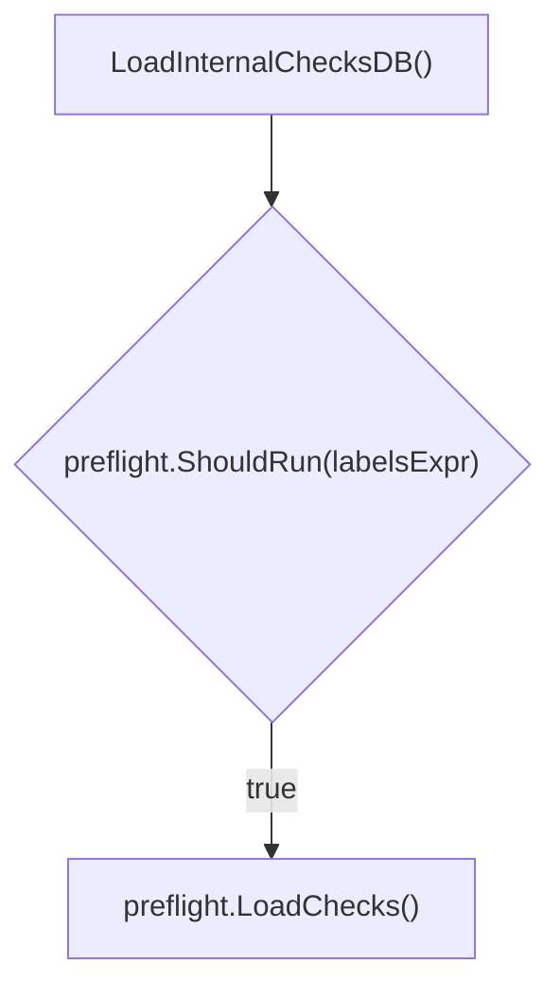

#### Function dependencies

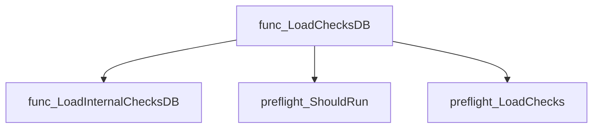

#### Functions calling `LoadChecksDB`

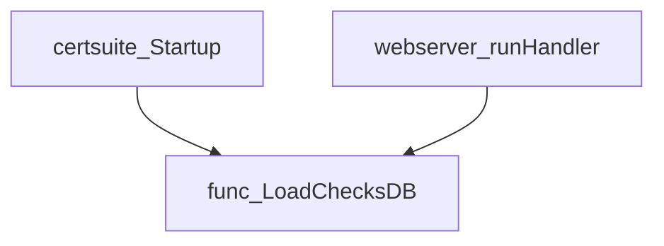

#### Usage example

```go
// Minimal example invoking LoadChecksDB
package main

import "github.com/redhat-best-practices-for-k8s/certsuite/pkg/certsuite"

func main() {
    // The label filter expression can be empty to run all checks.
    certsuite.LoadChecksDB("")
}
```

---

### LoadInternalChecksDB

**LoadInternalChecksDB** - Calls `LoadChecks()` from every internal test‑suite package to register all checks in the global check database.


Initialises all internal test check groups by invoking the load functions of each test suite package.

---

#### Signature (Go)

```go
func LoadInternalChecksDB()
```

---

#### Summary Table

| Aspect          | Details |
|-----------------|---------|
| **Purpose**     | Calls `LoadChecks()` from every internal test‑suite package to register all checks in the global check database. |
| **Parameters**  | None |
| **Return value**| None |
| **Key dependencies** | <ul><li>accesscontrol.LoadChecks()</li><li>certification.LoadChecks()</li><li>lifecycle.LoadChecks()</li><li>manageability.LoadChecks()</li><li>networking.LoadChecks()</li><li>observability.LoadChecks()</li><li>performance.LoadChecks()</li><li>platform.LoadChecks()</li><li>operator.LoadChecks()</li></ul> |
| **Side effects** | Registers checks globally; no I/O, concurrency or state mutation beyond the check database. |
| **How it fits the package** | Part of the `certsuite` package’s public API that prepares all tests before execution (called by `LoadChecksDB` and indirectly by command‑line utilities). |

---

#### Internal workflow (Mermaid)

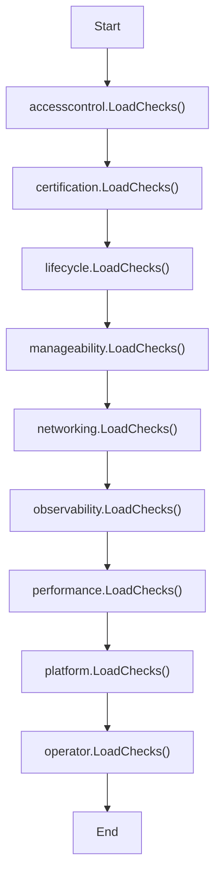

---

#### Function dependencies (Mermaid)

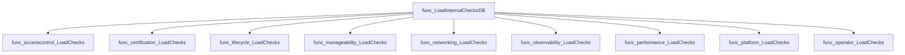

---

#### Functions calling `LoadInternalChecksDB` (Mermaid)

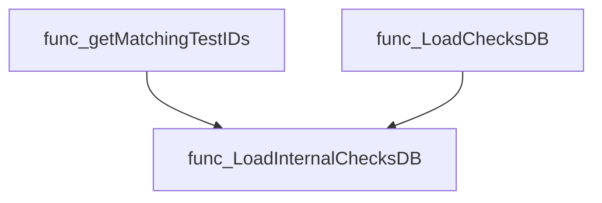

---

#### Usage example (Go)

```go
// Minimal example invoking LoadInternalChecksDB
package main

import (
	"github.com/redhat-best-practices-for-k8s/certsuite/pkg/certsuite"
)

func main() {
	certsuite.LoadInternalChecksDB()
	// At this point all checks are registered and can be queried or executed.
}
```

---

### Run

**Run** - Orchestrates a full run of the CNF Certification Suite: discovers target resources, executes checks, builds claim artifacts, optionally sends data to collectors or Red Hat Connect, and cleans up temporary files.


#### Signature (Go)

```go
func Run(labelsFilter, outputFolder string) error
```

#### Summary Table

| Aspect | Details |
|--------|---------|
| **Purpose** | Orchestrates a full run of the CNF Certification Suite: discovers target resources, executes checks, builds claim artifacts, optionally sends data to collectors or Red Hat Connect, and cleans up temporary files. |
| **Parameters** | `labelsFilter string` – expression used to filter test cases by labels.<br>`outputFolder string` – directory where results (claim file, logs, artifacts) are written. |
| **Return value** | `error` – non‑nil if any step fails that prevents normal completion (e.g., failure to compress artifacts or send data). |
| **Key dependencies** | • `configuration.GetTestParameters()`<br>• `provider.GetTestEnvironment()`<br>• `checksdb.RunChecks()`<br>• `autodiscover.FindPodsByLabels()`, `autodiscover.CountPodsByStatus()`<br>• `claimhelper.NewClaimBuilder()`<br>• `results.CreateResultsWebFiles()`, `results.CompressResultsArtifacts()`<br>• `collector.SendClaimFileToCollector()`<br>• `results.GetCertIDFromConnectAPI()`, `results.SendResultsToConnectAPI()`<br>• Logging via `log.Logger` |
| **Side effects** | • Prints status to stdout.<br>• Writes log file, claim JSON/JUnit XML, HTML artifacts, and optional ZIP archive.<br>• May delete temporary ZIP or web files based on configuration.<br>• Sends HTTP requests to external services (collector, Red Hat Connect). |
| **How it fits the package** | Top‑level entry point for both CLI (`runTestSuite`) and web server (`runHandler`). Coordinates all major subsystems of the certsuite package. |

#### Internal workflow

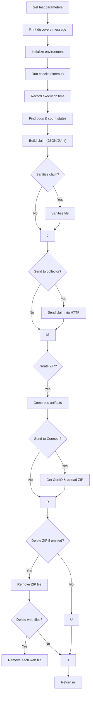

#### Function dependencies

```mermaid
graph TD
  func_Run --> func_GetTestParameters
  func_Run --> func_Println
  func_Run --> func_Print
  func_Run --> func_GetTestEnvironment
  func_Run --> func_Info
  func_Run --> func_Now
  func_Run --> func_RunChecks
  func_Run --> func_FindPodsByLabels
  func_Run --> func_CreateLabels
  func_Run --> func_CountPodsByStatus
  func_Run --> func_NewClaimBuilder
  func_Run --> func_Build
  func_Run --> func_ToJUnitXML
  func_Run --> func_SanitizeClaimFile
  func_Run --> func_SendClaimFileToCollector
  func_Run --> func_CreateResultsWebFiles
  func_Run --> func_CompressResultsArtifacts
  func_Run --> func_GetCertIDFromConnectAPI
  func_Run --> func_SendResultsToConnectAPI
  func_Run --> func_Remove
```

#### Functions calling `Run`

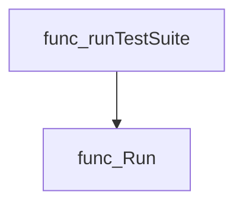

#### Usage example (Go)

```go
package main

import (
	"log"

	"github.com/redhat-best-practices-for-k8s/certsuite/pkg/certsuite"
)

func main() {
	labels := "app=web,component=backend"
	outputDir := "./results"

	if err := certsuite.Run(labels, outputDir); err != nil {
		log.Fatalf("Test suite failed: %v", err)
	}
}
```

This example initiates a certification run that filters tests by the specified labels and writes all artifacts to `./results`.

---

### Shutdown

**Shutdown** - Closes the global log file and terminates the process with an error exit if closing fails.


#### Signature (Go)
```go
func Shutdown()
```

#### Summary Table
| Aspect | Details |
|--------|---------|
| **Purpose** | Closes the global log file and terminates the process with an error exit if closing fails. |
| **Parameters** | None |
| **Return value** | None |
| **Key dependencies** | `log.CloseGlobalLogFile()` – closes the shared log file.<br>`fmt.Fprintf` – writes an error message to standard error.<br>`os.Exit(1)` – exits the process with status code 1. |
| **Side effects** | *Closes a global resource* (the log file).<br>*Prints an error and aborts the program* if the close operation fails. |
| **How it fits the package** | Acts as a cleanup routine called after running tests in stand‑alone mode, ensuring that logging resources are released before program termination. |

#### Internal workflow
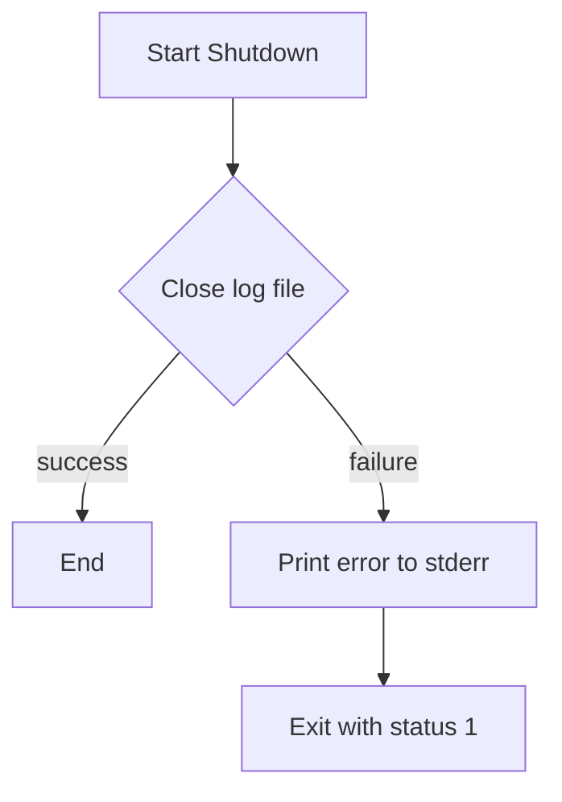

#### Function dependencies
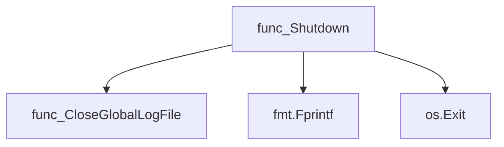

#### Functions calling `Shutdown`
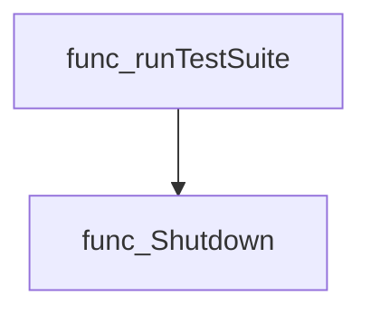

#### Usage example (Go)
```go
// Minimal example invoking Shutdown
package main

import (
    "github.com/redhat-best-practices-for-k8s/certsuite/pkg/certsuite"
)

func main() {
    // ... perform operations …
    certsuite.Shutdown()
}
```

---

### Startup

**Startup** - Sets up global state for a stand‑alone run of Certsuite: creates log file, label evaluator, client holder, and loads checks.


#### Signature (Go)

```go
func Startup()
```

#### Summary Table

| Aspect | Details |
|--------|---------|
| **Purpose** | Sets up global state for a stand‑alone run of Certsuite: creates log file, label evaluator, client holder, and loads checks. |
| **Parameters** | None |
| **Return value** | None – the function exits on fatal errors via `os.Exit`. |
| **Key dependencies** | - `configuration.GetTestParameters` <br>- `checksdb.InitLabelsExprEvaluator` <br>- `log.CreateGlobalLogFile` <br>- `clientsholder.GetClientsHolder` <br>- `LoadChecksDB` <br>- `versions.GitVersion`, `versions.ClaimFormatVersion` <br>- `cli.PrintBanner` |
| **Side effects** | • Writes to `os.Stderr` and may terminate the process with `os.Exit(1)`.<br>• Creates/overwrites a log file in the output directory.<br>• Populates global logger, client holder, and label evaluator.<br>• Prints diagnostic information to stdout. |
| **How it fits the package** | Called by the command‑line entry point when running Certsuite in stand‑alone mode; prepares all necessary resources before test execution begins. |

#### Internal workflow

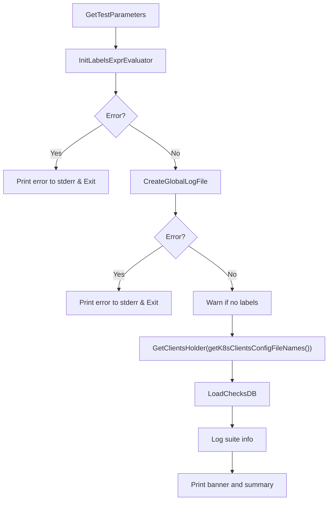

#### Function dependencies

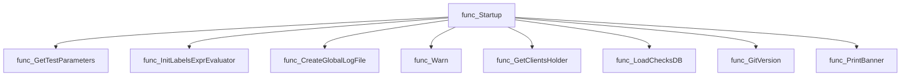

#### Functions calling `Startup`

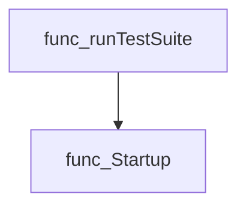

#### Usage example (Go)

```go
// Minimal example invoking Startup
package main

import (
    "github.com/redhat-best-practices-for-k8s/certsuite/pkg/certsuite"
)

func main() {
    certsuite.Startup()
    // ... subsequent test run logic ...
}
```

---

## Local Functions

### getK8sClientsConfigFileNames

**getK8sClientsConfigFileNames** - Builds a slice of file paths that point to Kubernetes configuration files, prioritising the user‑supplied `kubeconfig` flag and falling back to the default location (`$HOME/.kube/config`) if it exists.


#### 1) Signature (Go)

```go
func getK8sClientsConfigFileNames() []string
```

#### 2) Summary Table

| Aspect | Details |
|--------|---------|
| **Purpose** | Builds a slice of file paths that point to Kubernetes configuration files, prioritising the user‑supplied `kubeconfig` flag and falling back to the default location (`$HOME/.kube/config`) if it exists. |
| **Parameters** | None |
| **Return value** | A slice of strings containing zero or more absolute paths to kubeconfig files. |
| **Key dependencies** | • `github.com/redhat-best-practices-for-k8s/certsuite/pkg/configuration` – reads global test parameters.<br>• `os.Getenv`, `os.Stat` – access environment and file system.<br>• `path/filepath.Join` – construct default config path.<br>• `github.com/redhat-best-practices-for-k8s/certsuite/internal/log` – logs discovery steps. |
| **Side effects** | None beyond logging; does not modify global state or write files. |
| **How it fits the package** | Used during startup to populate the client holder with configuration file names, enabling subsequent Kubernetes interactions without hard‑coding paths. |

#### 3) Internal workflow (Mermaid)

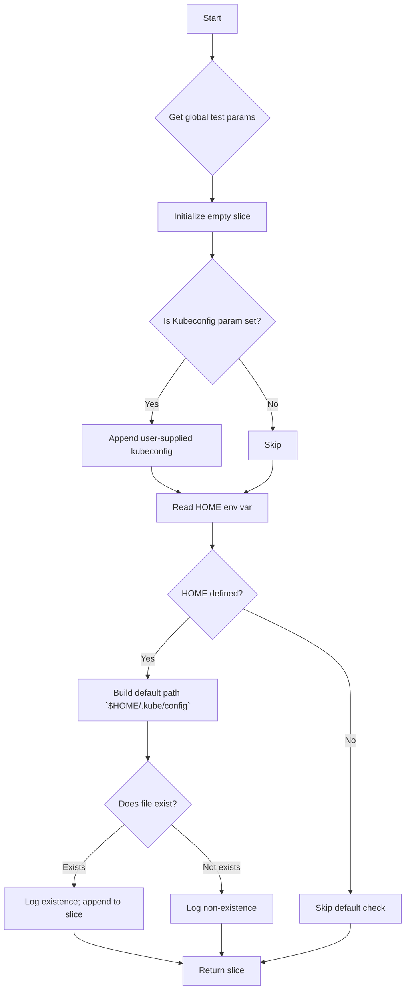

#### 4) Function dependencies (Mermaid)

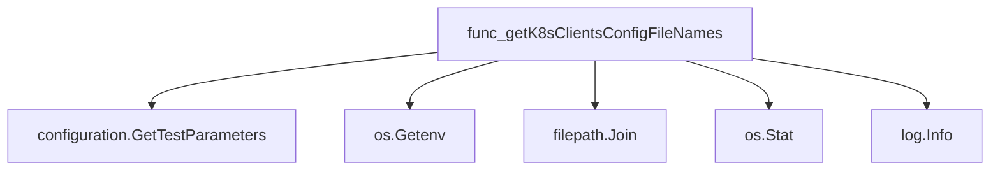

#### 5) Functions calling `getK8sClientsConfigFileNames` (Mermaid)

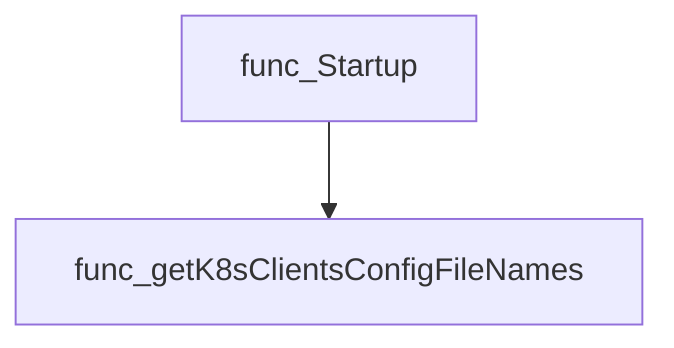

#### 6) Usage example (Go)

```go
// Minimal example invoking getK8sClientsConfigFileNames
package main

import (
	"fmt"
	"github.com/redhat-best-practices-for-k8s/certsuite/pkg/certsuite"
)

func main() {
	configFiles := certsuite.GetKubeconfigPaths()
	fmt.Println("Detected kubeconfig files:", configFiles)
}
```

*(Note: `GetKubeconfigPaths` is a public wrapper that internally calls `getK8sClientsConfigFileNames`.)*

---

