# Package checksdb

**Path**: `pkg/checksdb`

## Table of Contents

- [Overview](#overview)
- [Structs](#structs)
  - [Check](#check)
  - [ChecksGroup](#checksgroup)
- [Exported Functions](#exported-functions)
  - [Check.Abort](#check.abort)
  - [Check.GetLogger](#check.getlogger)
  - [Check.GetLogs](#check.getlogs)
  - [Check.LogDebug](#check.logdebug)
  - [Check.LogError](#check.logerror)
  - [Check.LogFatal](#check.logfatal)
  - [Check.LogInfo](#check.loginfo)
  - [Check.LogWarn](#check.logwarn)
  - [Check.Run](#check.run)
  - [Check.SetAbortChan](#check.setabortchan)
  - [Check.SetResult](#check.setresult)
  - [Check.SetResultAborted](#check.setresultaborted)
  - [Check.SetResultError](#check.setresulterror)
  - [Check.SetResultSkipped](#check.setresultskipped)
  - [Check.WithAfterCheckFn](#check.withaftercheckfn)
  - [Check.WithBeforeCheckFn](#check.withbeforecheckfn)
  - [Check.WithCheckFn](#check.withcheckfn)
  - [Check.WithSkipCheckFn](#check.withskipcheckfn)
  - [Check.WithSkipModeAll](#check.withskipmodeall)
  - [Check.WithSkipModeAny](#check.withskipmodeany)
  - [Check.WithTimeout](#check.withtimeout)
  - [CheckResult.String](#checkresult.string)
  - [ChecksGroup.Add](#checksgroup.add)
  - [ChecksGroup.OnAbort](#checksgroup.onabort)
  - [ChecksGroup.RecordChecksResults](#checksgroup.recordchecksresults)
  - [ChecksGroup.RunChecks](#checksgroup.runchecks)
  - [ChecksGroup.WithAfterAllFn](#checksgroup.withafterallfn)
  - [ChecksGroup.WithAfterEachFn](#checksgroup.withaftereachfn)
  - [ChecksGroup.WithBeforeAllFn](#checksgroup.withbeforeallfn)
  - [ChecksGroup.WithBeforeEachFn](#checksgroup.withbeforeeachfn)
  - [FilterCheckIDs](#filtercheckids)
  - [GetReconciledResults](#getreconciledresults)
  - [GetResults](#getresults)
  - [GetTestSuites](#gettestsuites)
  - [GetTestsCountByState](#gettestscountbystate)
  - [GetTotalTests](#gettotaltests)
  - [InitLabelsExprEvaluator](#initlabelsexprevaluator)
  - [NewCheck](#newcheck)
  - [NewChecksGroup](#newchecksgroup)
  - [RunChecks](#runchecks)
- [Local Functions](#local-functions)
  - [getResultsSummary](#getresultssummary)
  - [onFailure](#onfailure)
  - [printCheckResult](#printcheckresult)
  - [printFailedChecksLog](#printfailedcheckslog)
  - [recordCheckResult](#recordcheckresult)
  - [runAfterAllFn](#runafterallfn)
  - [runAfterEachFn](#runaftereachfn)
  - [runBeforeAllFn](#runbeforeallfn)
  - [runBeforeEachFn](#runbeforeeachfn)
  - [runCheck](#runcheck)
  - [shouldSkipCheck](#shouldskipcheck)
  - [skipAll](#skipall)
  - [skipCheck](#skipcheck)

## Overview

The checksdb package provides infrastructure for registering, configuring, executing, and recording the results of compliance tests (“checks”). It manages groups of checks, supports lifecycle hooks, skip logic, timeouts, logging, and a global results store used by the certsuite tool.

### Key Features

- Runtime registration and execution of check functions with support for before/after hooks and per‑check skip conditions
- Thread‑safe collection of check outcomes in an in‑memory database that can be queried or exported as claim data
- Integrated logger per check, abort handling via channels, and graceful handling of panics and errors during test runs

### Design Notes

- Check objects use a mutex to protect concurrent state changes; the package serialises group operations with a global lock
- Skip logic evaluates all registered skip functions and respects a SkipMode (All or Any) to decide whether to run a check
- Abort signals propagate through an abort channel, causing remaining checks in a group to be marked skipped

### Structs Summary

| Name | Purpose |
|------|----------|
| [**Check**](#check) | One‑line purpose |
| [**ChecksGroup**](#checksgroup) | Container for a set of checks and their execution lifecycle |

### Exported Functions Summary

| Name | Purpose |
|------|----------|
| [func (check *Check) Abort(reason string)](#check.abort) | Stops the current check immediately, emits an abort message on `abortChan`, and panics with a custom error. |
| [func (check *Check) GetLogger() *log.Logger](#check.getlogger) | Provides access to the logger associated with a specific `Check`. |
| [func (check *Check) GetLogs() string](#check.getlogs) | Returns the complete log message that has been collected during the execution of a check. |
| [func (check *Check) LogDebug(msg string, args ...any)](#check.logdebug) | Emits a formatted debug log entry tied to the specific `Check`. |
| [func (check *Check) LogError(msg string, args ...any)](#check.logerror) | Emits a formatted error‑level log entry associated with the `Check` instance. |
| [func (check *Check) LogFatal(msg string, args ...any)](#check.logfatal) | Emits a fatal log entry using the check’s logger, prints the message to standard error with a “FATAL:” prefix, and exits the program with status 1. |
| [func (check *Check) LogInfo(msg string, args ...any)](#check.loginfo) | Emits an informational log entry associated with the current `Check` object. The log is formatted using the supplied message and optional arguments. |
| [func (check *Check) LogWarn(msg string, args ...any)](#check.logwarn) | Emits a log entry at the *warn* level associated with a specific `Check` instance. |
| [func (check *Check) Run() error](#check.run) | Runs a registered check, handling setup, execution, and cleanup while recording timing and logging. |
| [func (check *Check) SetAbortChan(abortChan chan string)](#check.setabortchan) | Stores the provided `abortChan` in the `Check` instance so that the check can later signal an abort. |
| [func (check *Check) SetResult(     compliantObjects  []*testhelper.ReportObject,     nonCompliantObjects []*testhelper.ReportObject, )](#check.setresult) | Persists the lists of compliant and non‑compliant objects for a check, updates the check’s result status accordingly, and records diagnostic details. |
| [func (check *Check) SetResultAborted(reason string)](#check.setresultaborted) | Records that the check has been aborted, storing the supplied reason and setting its result state accordingly. |
| [func (check *Check) SetResultError(reason string)](#check.setresulterror) | Sets the check’s result to `CheckResultError`, records a skip reason, and logs a warning if the result was already an error. It aborts if the check has been aborted. |
| [func (check *Check) SetResultSkipped(reason string)](#check.setresultskipped) | Flags the check’s result as *skipped*, recording why it was not executed. Skipping is idempotent and ignored if the check had already been aborted. |
| [func (check *Check) WithAfterCheckFn(afterCheckFn func(check *Check) error) *Check](#check.withaftercheckfn) | Assigns an optional function that will be executed after the check’s main logic finishes. The callback receives the same `*Check` instance and may return an error to signal post‑check failure. |
| [func (check *Check) WithBeforeCheckFn(beforeCheckFn func(check *Check) error) *Check](#check.withbeforecheckfn) | Registers a function that runs before the main check logic. If the check already contains an error, the hook is skipped. |
| [func (check *Check) WithCheckFn(checkFn func(check *Check) error) *Check](#check.withcheckfn) | Sets the check’s execution function (`CheckFn`) if no prior error exists, enabling custom validation logic. |
| [func (check *Check) WithSkipCheckFn(skipCheckFn ...func() (skip bool, reason string)) *Check](#check.withskipcheckfn) | Registers one or more functions that determine whether the check should be skipped and why. These callbacks are stored in `check.SkipCheckFns`. |
| [func (check *Check) WithSkipModeAll() *Check](#check.withskipmodeall) | Configures the `Check` instance so that all sub‑checks are skipped during execution. If the check is already in an error state, it returns unchanged. |
| [func (check *Check) WithSkipModeAny() *Check](#check.withskipmodeany) | Configures a `Check` instance so that it will skip only when *any* of its conditions are met. This is the default behaviour and therefore this modifier exists mainly for API completeness. |
| [func (check *Check) WithTimeout(duration time.Duration) *Check](#check.withtimeout) | Assigns a duration to the `Timeout` field of a `Check`, unless an error has already been set. |
| [func (cr CheckResult) String() string {     return string(cr) }](#checkresult.string) | Converts the `CheckResult` value into its underlying string form. |
| [func (group *ChecksGroup) Add(check *Check)](#checksgroup.add) | Safely appends a new `*Check` to the group's internal slice, ensuring concurrent access is protected by a global lock. |
| [func (group *ChecksGroup) OnAbort(abortReason string) error](#checksgroup.onabort) | Marks the current and remaining checks in a group as aborted or skipped, depending on their state, when an abort event occurs. |
| [func (group *ChecksGroup) RecordChecksResults()](#checksgroup.recordchecksresults) | Iterates over every `Check` in the receiver’s check list and persists each outcome to the global results store, emitting an informational log. |
| [func (group *ChecksGroup) RunChecks(stopChan <-chan bool, abortChan chan string) ([]error, int)](#checksgroup.runchecks) | Runs all enabled checks in a `ChecksGroup`, respecting label filtering and lifecycle hooks (`BeforeAll`, `BeforeEach`, `AfterEach`, `AfterAll`). It returns any errors encountered and the count of failed checks. |
| [func (group *ChecksGroup) WithAfterAllFn(afterAllFn func(checks []*Check) error) *ChecksGroup](#checksgroup.withafterallfn) | Stores a user‑supplied function to be executed after all checks in the group have run. The callback receives the slice of `*Check` objects and may perform validation, cleanup, or aggregation. |
| [func (group *ChecksGroup) WithAfterEachFn(afterEachFn func(check *Check) error) *ChecksGroup](#checksgroup.withaftereachfn) | Sets the callback that will be invoked after each `Check` is executed, allowing custom post‑processing or cleanup. |
| [func (group *ChecksGroup) WithBeforeAllFn(beforeAllFn func(checks []*Check) error) *ChecksGroup](#checksgroup.withbeforeallfn) | Stores a user‑supplied function that will run once before all checks in the group are executed, allowing preparatory work or validation. |
| [func (group *ChecksGroup) WithBeforeEachFn(beforeEachFn func(check *Check) error) *ChecksGroup](#checksgroup.withbeforeeachfn) | Stores the supplied function to be run before each `Check` in the group, enabling pre‑processing or validation logic. |
| [func FilterCheckIDs() ([]string, error)](#filtercheckids) | Iterates over the internal check database (`dbByGroup`), evaluates each check’s labels against a global expression evaluator (`labelsExprEvaluator.Eval`). If the expression matches, the check’s ID is collected. Returns the list of matched IDs. |
| [func GetReconciledResults() map[string]claim.Result](#getreconciledresults) | Consolidates the global `resultsDB` store into a plain Go map suitable for inclusion in a Claim output. |
| [func GetResults() map[string]claim.Result](#getresults) | Exposes the in‑memory database of check results to callers. |
| [func GetTestSuites() []string](#gettestsuites) | Enumerates the keys in the package‑level `resultsDB` map and returns a slice containing each distinct test suite name once. |
| [func GetTestsCountByState(state string) int](#gettestscountbystate) | Returns how many test results currently hold the specified `state`. |
| [func GetTotalTests() int](#gettotaltests) | Provides a quick count of all test entries currently held in the internal `resultsDB`. |
| [func InitLabelsExprEvaluator(labelsFilter string) error](#initlabelsexprevaluator) | Builds and stores a `labels.LabelsExprEvaluator` that can evaluate label expressions supplied to the checks database. |
| [func NewCheck(id string, labels []string) *Check](#newcheck) | Instantiates a `Check` object pre‑configured for use in the checks database. It sets an initial result status and prepares a logger tied to the check’s ID. |
| [func NewChecksGroup(groupName string) *ChecksGroup](#newchecksgroup) | Returns a singleton `ChecksGroup` for the given name, creating it if absent. It ensures thread‑safe access to the global registry of groups. |
| [func RunChecks(timeout time.Duration) (failedCtr int, err error)](#runchecks) | Orchestrates execution of all `ChecksGroup`s, handles global aborts via timeout or OS signals, aggregates failures and errors. |

### Local Functions Summary

| Name | Purpose |
|------|----------|
| [func() map[string][]int](#getresultssummary) | Builds a summary map where each key is a group name and the value is a slice `[passed, failed, skipped]` reflecting the outcome of all checks in that group. |
| [func onFailure(failureType, failureMsg string, group *ChecksGroup, currentCheck *Check, remainingChecks []*Check) error](#onfailure) | Marks the current check as failed, skips all subsequent checks in the group, and returns a generic error describing the failure. |
| [func printCheckResult(check *Check)](#printcheckresult) | Outputs the result of a single check to the console, formatting the message according to whether the check passed, failed, was skipped, aborted, or errored. |
| [func printFailedChecksLog()](#printfailedcheckslog) | Iterates over every check in the database, and for those that failed, outputs a formatted log header followed by the check’s archived logs. |
| [func recordCheckResult(check *Check)](#recordcheckresult) | Persists the outcome of a test check into the global `resultsDB`, enriching it with metadata such as timestamps, duration, and catalog classifications. |
| [func runAfterAllFn(group *ChecksGroup, checks []*Check) (err error)](#runafterallfn) | Runs the `afterAll` function registered on a `ChecksGroup`. If the hook panics or returns an error, it marks the last check as failed and skips any remaining checks. |
| [func runAfterEachFn(group *ChecksGroup, check *Check, remainingChecks []*Check) error](#runaftereachfn) | Runs a user‑defined `afterEach` callback after a check completes, handling panics and errors. |
| [func runBeforeAllFn(group *ChecksGroup, checks []*Check) (err error)](#runbeforeallfn) | Runs the `beforeAllFn` callback defined on a `ChecksGroup`. If the callback is absent, it does nothing. It also safeguards against panics and unexpected errors, converting them into a standardized failure state for the first check and skipping the rest. |
| [func runBeforeEachFn(group *ChecksGroup, check *Check, remainingChecks []*Check) (err error)](#runbeforeeachfn) | Runs the optional `beforeEach` function defined on a `ChecksGroup`. Handles panics and errors by logging and marking the current check as failed while skipping subsequent checks. |
| [func runCheck(check *Check, group *ChecksGroup, remainingChecks []*Check) (err error)](#runcheck) | Safely runs an individual `Check`, handling panics and unexpected errors by logging, aborting the current check, and marking subsequent checks as skipped. |
| [func shouldSkipCheck(check *Check) (skip bool, reasons []string)](#shouldskipcheck) | Evaluates all skip functions attached to a `Check` instance. If any of them indicate that the check must be skipped (based on the configured `SkipMode`), it returns `true` and collects the corresponding reasons. It also safely recovers from panics in individual skip functions, logging details. |
| [func([]*Check, string)()](#skipall) | Iterates over a list of checks and marks each one as skipped, providing a uniform reason. |
| [func skipCheck(check *Check, reason string)](#skipcheck) | Marks a check as skipped with a given reason, logs the action, and prints the result. |

## Structs

### Check


The `Check` type represents a single validation unit in the test framework.  
It holds configuration, state, and helper methods for executing a check,
recording its result, and reporting logs.

#### Fields
| Field | Type | Description |
|-------|------|-------------|
| `mutex` | `sync.Mutex` | Synchronises concurrent access to mutable fields. |
| `ID` | `string` | Unique identifier of the check. |
| `Labels` | `[]string` | Labels used for selecting or filtering checks. |
| `BeforeCheckFn` | `func(check *Check) error` | Optional hook executed before the main `CheckFn`. |
| `AfterCheckFn` | `func(check *Check) error` | Optional hook executed after the main `CheckFn`. |
| `CheckFn` | `func(check *Check) error` | The core function that performs the check logic. |
| `SkipCheckFns` | `[]func() (skip bool, reason string)` | Functions determining whether to skip this check. |
| `SkipMode` | `skipMode` | Strategy for combining results of multiple skip functions (`Any`, `All`). |
| `Result` | `CheckResult` | Final status after execution: passed, failed, skipped, aborted, or error. |
| `CapturedOutput` | `string` | Stores any captured output (currently unused). |
| `details` | `string` | Human‑readable details about compliant/non‑compliant objects. |
| `skipReason` | `string` | Reason why the check was skipped. |
| `logger` | `*log.Logger` | Logger instance scoped to this check. |
| `logArchive` | `*strings.Builder` | Buffer that captures all log output for later retrieval. |
| `StartTime`, `EndTime` | `time.Time` | Timestamps marking the duration of the check run. |
| `Timeout` | `time.Duration` | Maximum allowed time for the check to complete. |
| `Error` | `error` | Any error that prevented execution (e.g., mis‑configured). |
| `abortChan` | `chan string` | Channel used to signal an external abort request. |

#### Purpose
A `Check` encapsulates everything needed to run a single validation: configuration (labels, timeouts), hooks for setup and teardown (`BeforeCheckFn`, `AfterCheckFn`), the core logic (`CheckFn`), and mechanisms for skipping or aborting execution. It also records logs and results, which are later persisted by the surrounding test suite.

#### Related functions
| Function | Purpose |
|----------|---------|
| `NewCheck(id string, labels []string) *Check` | Constructor that initializes a check with default state and logger. |
| `Abort(reason string)` | Signals a non‑graceful abort via the abort channel and panics to unwind execution. |
| `Run() error` | Executes the check lifecycle: before hook, main function, after hook; records timing and logs. |
| `SetResult(compliantObjects, nonCompliantObjects []*testhelper.ReportObject)` | Finalises the result based on analysis of report objects; updates details string. |
| `SetResultAborted(reason string)`, `SetResultError(reason string)`, `SetResultSkipped(reason string)` | Mark the check with a specific terminal state and reason. |
| `WithBeforeCheckFn(func(check *Check) error) *Check` | Fluent setter for the before hook. |
| `WithAfterCheckFn(func(check *Check) error) *Check` | Fluent setter for the after hook. |
| `WithCheckFn(func(check *Check) error) *Check` | Fluent setter for the core check function. |
| `WithSkipCheckFn(...func() (skip bool, reason string)) *Check` | Adds one or more skip‑determining functions. |
| `WithSkipModeAll() *Check`, `WithSkipModeAny() *Check` | Configures how multiple skip functions are aggregated. |
| `WithTimeout(duration time.Duration) *Check` | Sets a maximum duration for the check run. |
| `GetLogger() *log.Logger` | Retrieves the logger instance. |
| `GetLogs() string` | Returns all captured log output. |
| `LogDebug(msg string, args ...any)` / `LogError`, `LogFatal`, `LogInfo`, `LogWarn` | Convenience wrappers that forward to the underlying logger with appropriate severity levels. |

These methods collectively provide a flexible, thread‑safe API for defining, executing, and reporting on individual checks within the test framework.

---

### ChecksGroup


#### Fields
| Field | Type | Description |
|-------|------|-------------|
| `name` | `string` | Identifier for the group; used in logs and to retrieve the group from the global registry. |
| `checks` | `[]*Check` | Ordered slice of checks belonging to this group. Checks are appended via `Add`. |
| `beforeAllFn`, `afterAllFn` | `func(checks []*Check) error` | Optional callbacks executed once before any check runs (`beforeAll`) and once after all checks finish (`afterAll`). They receive the entire list of checks. |
| `beforeEachFn`, `afterEachFn` | `func(check *Check) error` | Optional callbacks run immediately before or after each individual check, respectively. They operate on a single `*Check`. |
| `currentRunningCheckIdx` | `int` | Index of the currently executing check in the group's slice; set to `checkIdxNone` when no check is running. Used for abort handling and tracking progress. |

#### Purpose
`ChecksGroup` aggregates checks that belong together, typically representing a test suite or a logical grouping of validations. It manages execution order, optional lifecycle hooks (`beforeAll`, `afterEach`, etc.), and state needed to handle aborts or failures gracefully. The group is registered in a global map upon creation via `NewChecksGroup`.

#### Related functions
| Function | Purpose |
|----------|---------|
| `Add` | Appends a new check to the group's slice, guarded by a mutex. |
| `OnAbort` | Handles an abort event: marks running and remaining checks appropriately based on the abort reason and current execution index. |
| `RecordChecksResults` | Persists results of all checks in the group via logging/recording mechanisms. |
| `RunChecks` | Executes the group's checks sequentially, applying label filtering, lifecycle hooks, and error handling; returns collected errors and a count of failed checks. |
| `WithAfterAllFn`, `WithAfterEachFn`, `WithBeforeAllFn`, `WithBeforeEachFn` | Set the respective optional callback functions on the group and return the modified group for chaining. |
| `NewChecksGroup` | Creates or retrieves a singleton instance for a given name, initializing internal fields and registering it globally. |

---

---

## Exported Functions

### Check.Abort

**Abort** - Stops the current check immediately, emits an abort message on `abortChan`, and panics with a custom error.


#### Signature (Go)

```go
func (check *Check) Abort(reason string)
```

#### Summary Table

| Aspect | Details |
|--------|---------|
| **Purpose** | Stops the current check immediately, emits an abort message on `abortChan`, and panics with a custom error. |
| **Parameters** | `reason` (string) – Text explaining why the abort is issued. |
| **Return value** | None (panics). |
| **Key dependencies** | • `check.mutex.Lock()` / `Unlock()` for thread safety<br>• `AbortPanicMsg(reason string)` to format panic message<br>• `panic` built‑in |
| **Side effects** | • Locks and unlocks the check’s mutex.<br>• Sends a formatted abort message to `abortChan`.<br>• Panics, terminating the current goroutine. |
| **How it fits the package** | Used internally by checks when an unrecoverable condition occurs; signals listeners via `abortChan` before halting execution. |

#### Internal workflow (Mermaid)

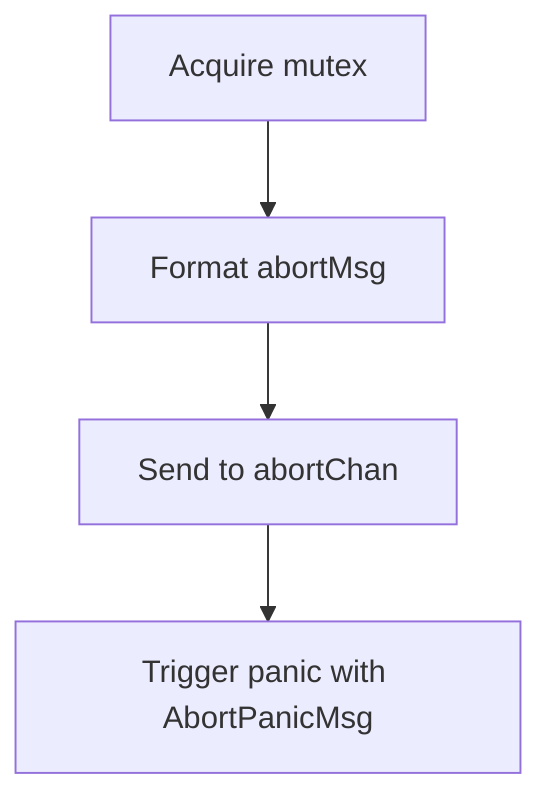

#### Function dependencies (Mermaid)

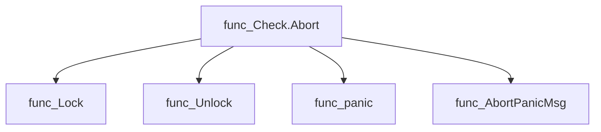

#### Functions calling `Check.Abort` (Mermaid)

None – this function is currently not referenced elsewhere in the package.

#### Usage example (Go)

```go
// Minimal example invoking Check.Abort
check := &Check{ID: "test-check", abortChan: make(chan string)}
defer close(check.abortChan)
go func() {
    msg := <-check.abortChan
    fmt.Println("Abort received:", msg)
}()
check.Abort("unexpected error")
```

---

### Check.GetLogger

**GetLogger** - Provides access to the logger associated with a specific `Check`.


#### Signature (Go)
```go
func (check *Check) GetLogger() *log.Logger
```

#### Summary Table
| Aspect | Details |
|--------|---------|
| **Purpose** | Provides access to the logger associated with a specific `Check`. |
| **Parameters** | None – the method operates on the receiver `check`. |
| **Return value** | `*log.Logger` – the logger instance stored in the `Check` struct. |
| **Key dependencies** | • `log` package (standard library). |
| **Side effects** | None; purely accessor. |
| **How it fits the package** | Allows other components to log messages contextualized to a particular check without exposing internal fields. |

#### Internal workflow (Mermaid)
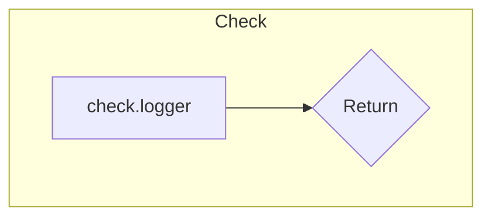

#### Function dependencies
None – this function is currently not referenced elsewhere in the package.

#### Functions calling `Check.GetLogger`
None – this function is currently not referenced elsewhere in the package.

#### Usage example (Go)
```go
// Minimal example invoking Check.GetLogger

import (
    "log"
    "github.com/redhat-best-practices-for-k8s/certsuite/pkg/checksdb"
)

func main() {
    // Assume a Check instance has been created elsewhere
    var myCheck *checksdb.Check

    // Retrieve the logger for this check
    logger := myCheck.GetLogger()

    // Use the logger as needed
    logger.Println("This is a log message from the check.")
}
```

---

### Check.GetLogs

**GetLogs** - Returns the complete log message that has been collected during the execution of a check.


#### Signature (Go)

```go
func (check *Check) GetLogs() string
```

#### Summary Table

| Aspect | Details |
|--------|---------|
| **Purpose** | Returns the complete log message that has been collected during the execution of a check. |
| **Parameters** | None |
| **Return value** | `string` – the concatenated log content stored in the check’s internal buffer. |
| **Key dependencies** | *Field access*: `check.logArchive.String()` (likely a `strings.Builder`). |
| **Side effects** | None; purely read‑only. |
| **How it fits the package** | Provides a public accessor for other parts of the checks database to obtain diagnostic output when recording results or printing failures. |

#### Internal workflow (Mermaid)

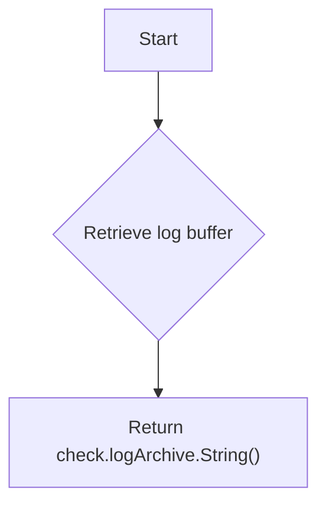

#### Function dependencies

None – this function is currently not referenced elsewhere in the package.

#### Functions calling `Check.GetLogs` (Mermaid)

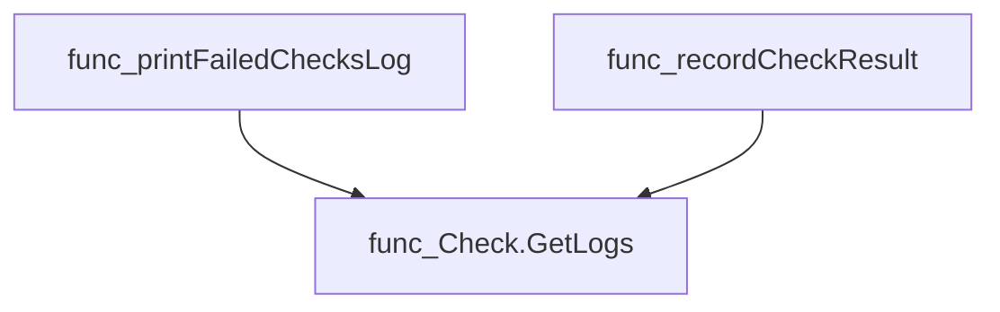

#### Usage example (Go)

```go
// Minimal example invoking Check.GetLogs
check := &Check{
    // ... initialize check, including logArchive ...
}
logOutput := check.GetLogs()
fmt.Println("Collected logs:", logOutput)
```

---

### Check.LogDebug

**LogDebug** - Emits a formatted debug log entry tied to the specific `Check`.

Logs a debug‑level message for the current check instance.

#### Signature (Go)
```go
func (check *Check) LogDebug(msg string, args ...any)
```

#### Summary Table
| Aspect | Details |
|--------|---------|
| **Purpose** | Emits a formatted debug log entry tied to the specific `Check`. |
| **Parameters** | `msg` – format string<br>`args` – variadic arguments for formatting |
| **Return value** | None (side‑effect only) |
| **Key dependencies** | • Calls `log.Logf` from `github.com/redhat-best-practices-for-k8s/certsuite/internal/log`<br>• Uses the check’s embedded logger (`check.logger`) and the debug log level constant |
| **Side effects** | Writes a log record to the configured logger; no state mutation in the `Check`. |
| **How it fits the package** | Provides a convenient wrapper for emitting debug logs within check logic, ensuring consistent logger usage across the checks database. |

#### Internal workflow (Mermaid)
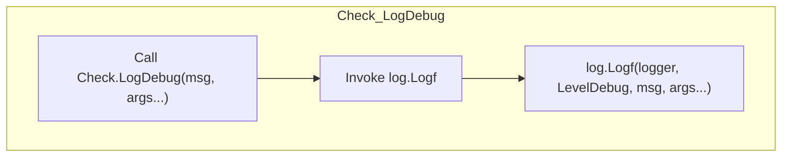

#### Function dependencies (Mermaid)
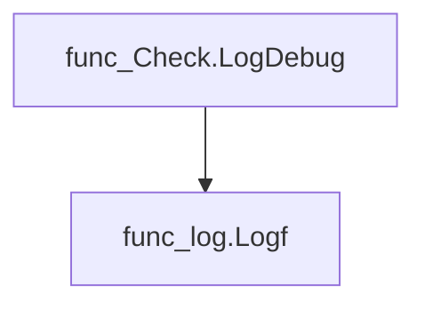

#### Functions calling `Check.LogDebug` (Mermaid)
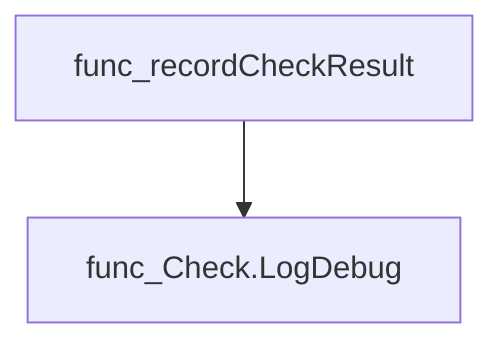

#### Usage example (Go)
```go
// Minimal example invoking Check.LogDebug
check := &checksdb.Check{logger: myLogger}
check.LogDebug("Initializing check %s with value %d", "MyCheck", 42)
```

---

### Check.LogError

**LogError** - Emits a formatted error‑level log entry associated with the `Check` instance.


#### Signature (Go)
```go
func (check *Check) LogError(msg string, args ...any)
```

#### Summary Table
| Aspect | Details |
|--------|---------|
| **Purpose** | Emits a formatted error‑level log entry associated with the `Check` instance. |
| **Parameters** | `msg string –` format string; `args …any –` values to interpolate into `msg`. |
| **Return value** | None (void). |
| **Key dependencies** | • Calls `log.Logf` from `github.com/redhat-best-practices-for-k8s/certsuite/internal/log`. <br>• Uses the check’s embedded logger (`check.logger`). |
| **Side effects** | Writes a log record to the configured logger; may trigger fatal exit if the underlying logger is misconfigured. |
| **How it fits the package** | Provides a convenient, consistent way for `Check` methods (e.g., `SetResult`, `runCheck`) to report errors without duplicating formatting logic. |

#### Internal workflow
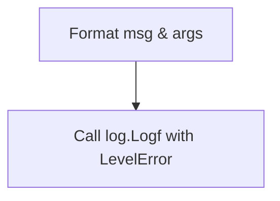

#### Function dependencies
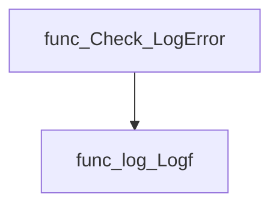

#### Functions calling `Check.LogError`
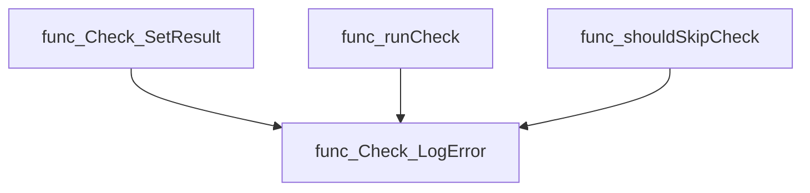

#### Usage example (Go)
```go
// Minimal example invoking Check.LogError
check := &checksdb.Check{logger: log.NewLogger()}
check.LogError("Failed to process item %d: %v", 42, err)
```

---

### Check.LogFatal

**LogFatal** - Emits a fatal log entry using the check’s logger, prints the message to standard error with a “FATAL:” prefix, and exits the program with status 1.


Logs a fatal message and terminates the process.

#### Signature (Go)

```go
func (check *Check) LogFatal(msg string, args ...any)
```

#### Summary Table

| Aspect | Details |
|--------|---------|
| **Purpose** | Emits a fatal log entry using the check’s logger, prints the message to standard error with a “FATAL:” prefix, and exits the program with status 1. |
| **Parameters** | `msg string` – message format; `<any>` – optional formatting arguments. |
| **Return value** | None (the function never returns normally). |
| **Key dependencies** | • `github.com/redhat-best-practices-for-k8s/certsuite/internal/log.Logf`<br>• `fmt.Fprintf`<br>• `os.Exit` |
| **Side effects** | Writes to the logger and standard error, then terminates the process. |
| **How it fits the package** | Provides a convenient fatal‑exit helper for checks that must abort execution upon encountering unrecoverable errors. |

#### Internal workflow

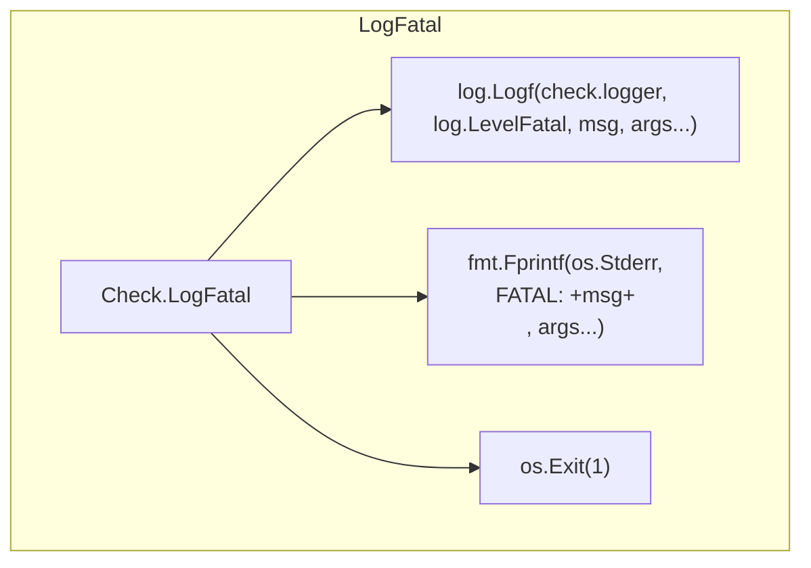

#### Function dependencies

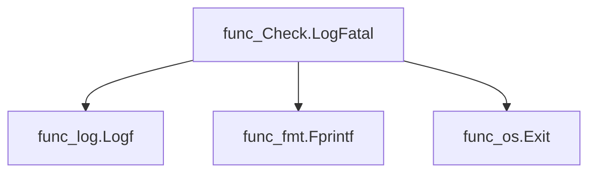

#### Functions calling `Check.LogFatal`

None – this function is currently not referenced elsewhere in the package.

#### Usage example (Go)

```go
// Minimal example invoking Check.LogFatal
package main

import (
	"github.com/redhat-best-practices-for-k8s/certsuite/pkg/checksdb"
)

func main() {
	check := &checksdb.Check{Logger: nil} // assume logger is set appropriately
	check.LogFatal("unable to load configuration: %v", err) // program exits after printing
}
```

---

### Check.LogInfo

**LogInfo** - Emits an informational log entry associated with the current `Check` object. The log is formatted using the supplied message and optional arguments.


Logs a message at the *info* level for a specific check instance.

```go
func (check *Check) LogInfo(msg string, args ...any)
```

| Aspect | Details |
|--------|---------|
| **Purpose** | Emits an informational log entry associated with the current `Check` object. The log is formatted using the supplied message and optional arguments. |
| **Parameters** | `msg string –` format string for the log.<br>`args ...any –` variadic arguments to substitute into the format string. |
| **Return value** | None. The function logs synchronously and returns immediately. |
| **Key dependencies** | • Calls `log.Logf` from `github.com/redhat-best-practices-for-k8s/certsuite/internal/log`.<br>• Relies on the `Check.logger` field to provide a logger instance. |
| **Side effects** | • Writes a log record via the underlying logger (which may output to stdout, files, or other sinks).<br>• No mutation of package‑level state; only uses the receiver’s `logger`. |
| **How it fits the package** | Serves as a convenience wrapper around the generic logging helper, ensuring that all check‑specific logs are emitted at the *info* level and carry the appropriate logger context. |

#### Internal workflow

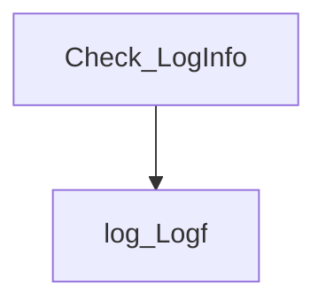

#### Function dependencies

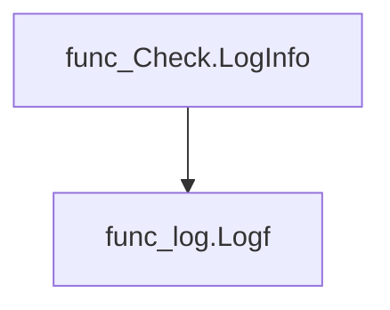

#### Functions calling `Check.LogInfo`

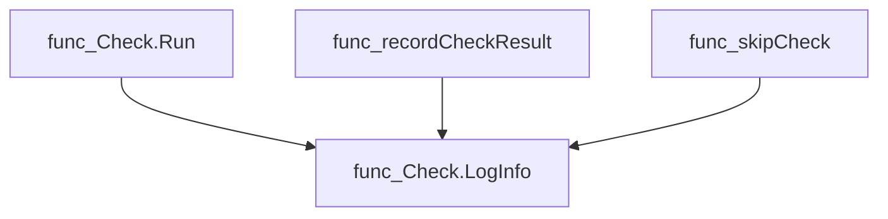

#### Usage example (Go)

```go
// Minimal example invoking Check.LogInfo
check := &checksdb.Check{logger: log.NewLogger()}
check.LogInfo("Starting check for %s", "my-test-id")
```

---

### Check.LogWarn

**LogWarn** - Emits a log entry at the *warn* level associated with a specific `Check` instance.


#### 1. Signature (Go)
```go
func (check *Check) LogWarn(msg string, args ...any)
```

#### 2. Summary Table
| Aspect | Details |
|--------|---------|
| **Purpose** | Emits a log entry at the *warn* level associated with a specific `Check` instance. |
| **Parameters** | `msg` – format string; `args` – optional arguments for formatting (variadic). |
| **Return value** | None (void). |
| **Key dependencies** | Calls `log.Logf` from `github.com/redhat-best-practices-for-k8s/certsuite/internal/log`. |
| **Side effects** | Writes a log record to the logger configured for the check; may trigger program termination if logging configuration fails. |
| **How it fits the package** | Provides a convenient wrapper so that checks can emit warnings without exposing the underlying logging implementation directly. |

#### 3. Internal workflow (Mermaid)
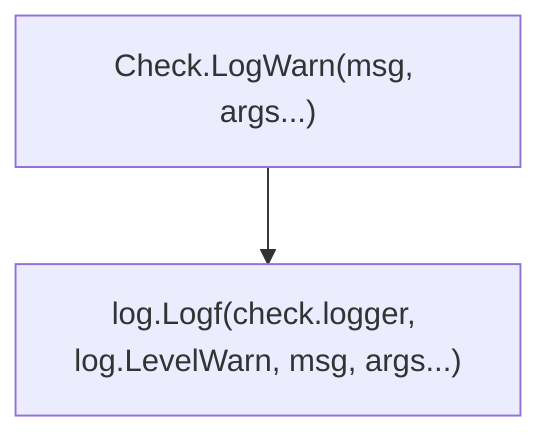

#### 4. Function dependencies (Mermaid)

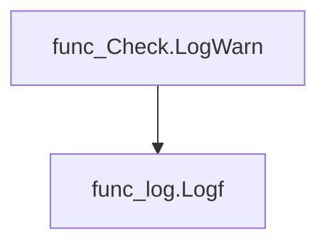

#### 5. Functions calling `Check.LogWarn` (Mermaid)

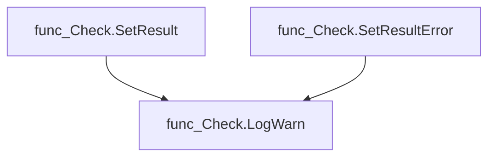

#### 6. Usage example (Go)
```go
// Minimal example invoking Check.LogWarn
check := &checksdb.Check{ID: "example-check", logger: &log.Logger{}}
check.LogWarn("This check is not applicable for the current cluster: %s", "reason")
```

---

### Check.Run

**Run** - Runs a registered check, handling setup, execution, and cleanup while recording timing and logging.


#### Signature (Go)

```go
func (check *Check) Run() error
```

#### Summary Table

| Aspect | Details |
|--------|---------|
| **Purpose** | Runs a registered check, handling setup, execution, and cleanup while recording timing and logging. |
| **Parameters** | `check *Check` – receiver; the check instance to run. |
| **Return value** | `error` – non‑nil if the check could not be executed or one of its phases failed. |
| **Key dependencies** | • `fmt.Errorf`<br>• `cli.PrintCheckRunning`<br>• `time.Now`<br>• `check.LogInfo`<br>• `check.BeforeCheckFn`, `check.CheckFn`, `check.AfterCheckFn`<br>• `printCheckResult` |
| **Side effects** | • Updates `StartTime` and `EndTime`.<br>• Emits log entries via the check’s logger.<br>• Prints running, passed/failed/skipped messages through CLI utilities. |
| **How it fits the package** | Central orchestrator for a single check; called by the test runner (`runCheck`) to execute checks sequentially or in parallel. |

#### Internal workflow (Mermaid)

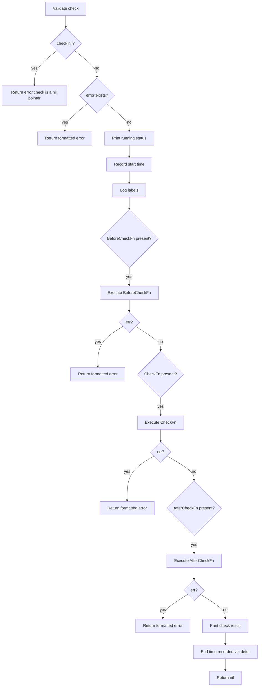

#### Function dependencies (Mermaid)

```mermaid
graph TD
  func_Check.Run --> fmt.Errorf
  func_Check.Run --> cli.PrintCheckRunning
  func_Check.Run --> time.Now
  func_Check.Run --> check.LogInfo
  func_Check.Run --> BeforeCheckFn
  func_Check.Run --> CheckFn
  func_Check.Run --> AfterCheckFn
  func_Check.Run --> printCheckResult
```

#### Functions calling `Check.Run` (Mermaid)

```mermaid
graph TD
  runCheck --> Check.Run
```

#### Usage example (Go)

```go
// Minimal example invoking Check.Run
check := &checksdb.Check{
    ID:          "example",
    Labels:      []string{"label1", "label2"},
    BeforeCheckFn: func(c *checksdb.Check) error { return nil },
    CheckFn:        func(c *checksdb.Check) error { return nil },
    AfterCheckFn:   func(c *checksdb.Check) error { return nil },
}

if err := check.Run(); err != nil {
    fmt.Printf("check failed: %v\n", err)
}
```

---

### Check.SetAbortChan

**SetAbortChan** - Stores the provided `abortChan` in the `Check` instance so that the check can later signal an abort.


#### 1) Signature
```go
func (check *Check) SetAbortChan(abortChan chan string)
```

#### 2) Summary Table
| Aspect | Details |
|--------|---------|
| **Purpose** | Stores the provided `abortChan` in the `Check` instance so that the check can later signal an abort. |
| **Parameters** | *`abortChan`* (`chan string`) – Channel used by the check to notify cancellation or failure. |
| **Return value** | None (method has no return). |
| **Key dependencies** | • Assigns to the field `check.abortChan`. |
| **Side effects** | Mutates the receiver’s internal state; no external I/O or concurrency control. |
| **How it fits the package** | Enables a running check to send an abort signal back to the orchestrating `ChecksGroup` during execution. |

#### 3) Internal workflow (Mermaid)
```mermaid
flowchart TD
    A["Receive abortChan"] --> B["Set check.abortChan = abortChan"]
```

#### 4) Function dependencies (Mermaid)

None – this function is currently not referenced elsewhere in the package.

#### 5) Functions calling `Check.SetAbortChan` (Mermaid)
```mermaid
graph TD
    func_ChecksGroup_RunChecks --> func_Check_SetAbortChan
```

#### 6) Usage example (Go)
```go
// Minimal example invoking Check.SetAbortChan
package main

import (
	"github.com/redhat-best-practices-for-k8s/certsuite/pkg/checksdb"
)

func main() {
	check := &checksdb.Check{}
	abortChan := make(chan string)
	check.SetAbortChan(abortChan) // Assign the abort channel to the check
}
```

---

---

### Check.SetResult

**SetResult** - Persists the lists of compliant and non‑compliant objects for a check, updates the check’s result status accordingly, and records diagnostic details.


#### Signature (Go)
```go
func (check *Check) SetResult(
    compliantObjects  []*testhelper.ReportObject,
    nonCompliantObjects []*testhelper.ReportObject,
)
```

#### Summary Table
| Aspect | Details |
|--------|---------|
| **Purpose** | Persists the lists of compliant and non‑compliant objects for a check, updates the check’s result status accordingly, and records diagnostic details. |
| **Parameters** | `compliantObjects []*testhelper.ReportObject` – objects that passed the check.<br>`nonCompliantObjects []*testhelper.ReportObject` – objects that failed the check. |
| **Return value** | None (void). The function mutates the receiver’s state. |
| **Key dependencies** | • `check.mutex.Lock/Unlock` – protects concurrent access.<br>• `testhelper.ResultObjectsToString` – serialises result lists to JSON for logging.<br>• `Check.LogError`, `Check.LogWarn` – emits diagnostics. |
| **Side effects** | * Thread‑safe state mutation: sets `check.details`, may change `check.Result` and `check.skipReason`. <br>* Emits log messages on errors or when the check is skipped. |
| **How it fits the package** | Part of the runtime evaluation of a check; called after a check has gathered its result objects to finalize status before persisting to the database. |

#### Internal workflow (Mermaid)
```mermaid
flowchart TD
  A["Lock mutex"] --> B{"Result == Aborted"}
  B -- Yes --> C["Return"]
  B -- No --> D["Serialize objects"]
  D --> E{"Serialization error?"}
  E -- Yes --> F["LogError"]
  E -- No --> G["Store details string"]
  G --> H{"Existing Result == Error"}
  H -- Yes --> I["Return"]
  H -- No --> J{"Non‑compliant objects present?"}
  J -- Yes --> K["Set ResultFailed; clear skipReason"]
  J -- No --> L{"Compliant list empty?"}
  L -- Yes --> M["LogWarn; set skipReason; Set ResultSkipped"]
  L -- No --> N["NOP – result remains unchanged"]
```

#### Function dependencies (Mermaid)
```mermaid
graph TD
  func_Check.SetResult --> func_Lock
  func_Check.SetResult --> func_Unlock
  func_Check.SetResult --> func_ResultObjectsToString
  func_Check.SetResult --> func_LogError
  func_Check.SetResult --> func_LogWarn
```

#### Functions calling `Check.SetResult` (Mermaid)
None – this function is currently not referenced elsewhere in the package.

#### Usage example (Go)
```go
// Minimal example invoking Check.SetResult
check := &Check{ID: "example-check", Result: CheckResultUnknown}
compliantObjs := []*testhelper.ReportObject{
    {Name: "obj1"},
}
nonCompliantObjs := []*testhelper.ReportObject{
    {Name: "obj2"},
}

check.SetResult(compliantObjs, nonCompliantObjs)

// After the call:
// * check.details contains a JSON string of both lists
// * check.Result is CheckResultFailed because there is at least one non‑compliant object
```

---

### Check.SetResultAborted

**SetResultAborted** - Records that the check has been aborted, storing the supplied reason and setting its result state accordingly.


#### Signature (Go)

```go
func (check *Check) SetResultAborted(reason string)
```

#### Summary Table

| Aspect | Details |
|--------|---------|
| **Purpose** | Records that the check has been aborted, storing the supplied reason and setting its result state accordingly. |
| **Parameters** | `reason` (string) – explanation of why the check was aborted. |
| **Return value** | None |
| **Key dependencies** | * Calls `check.mutex.Lock()` to obtain exclusive access.<br>* Calls `check.mutex.Unlock()` via `defer`. |
| **Side effects** | Mutates the check’s internal state: sets `Result` to `CheckResultAborted` and records `skipReason`. No I/O or concurrency beyond mutex protection. |
| **How it fits the package** | Used by higher‑level orchestration (e.g., `ChecksGroup.OnAbort`) to mark a specific check as aborted when an abort event occurs during a test run. |

#### Internal workflow

```mermaid
flowchart TD
  A["Acquire mutex"] --> B{"Set state"}
  B --> C["Result = Aborted"]
  B --> D["skipReason = reason"]
  C --> E["Release mutex"]
  D --> E
```

#### Function dependencies

```mermaid
graph TD
  func_Check.SetResultAborted --> func_Lock
  func_Check.SetResultAborted --> func_Unlock
```

#### Functions calling `Check.SetResultAborted`

```mermaid
graph TD
  func_ChecksGroup.OnAbort --> func_Check.SetResultAborted
```

#### Usage example (Go)

```go
// Minimal example invoking Check.SetResultAborted
check := &Check{}
abortReason := "timeout during execution"
check.SetResultAborted(abortReason)
```

---

### Check.SetResultError

**SetResultError** - Sets the check’s result to `CheckResultError`, records a skip reason, and logs a warning if the result was already an error. It aborts if the check has been aborted.


#### Signature (Go)
```go
func (check *Check) SetResultError(reason string)
```

#### Summary Table
| Aspect | Details |
|--------|---------|
| **Purpose** | Sets the check’s result to `CheckResultError`, records a skip reason, and logs a warning if the result was already an error. It aborts if the check has been aborted. |
| **Parameters** | `reason string` – human‑readable description of why the check failed. |
| **Return value** | None |
| **Key dependencies** | * `check.mutex.Lock()` / `Unlock()` – ensures exclusive access to mutable fields.<br>* `Check.LogWarn(msg string, args ...any)` – logs a warning when attempting to overwrite an existing error result. |
| **Side effects** | Mutates the receiver’s `Result`, `skipReason` fields; performs thread‑safe locking/unlocking; may produce log output. |
| **How it fits the package** | Provides a safe, idempotent way for other components (e.g., failure handlers) to record an error state on a check within the checks database. |

#### Internal workflow
```mermaid
flowchart TD
  subgraph Locking
    A["check.mutex.Lock()"] --> B["Check.Result"]
  end
  B --> C{"Result == Aborted"}
  C -- Yes --> D["Return"]
  C -- No --> E{"Result == Error"}
  E -- Yes --> F["LogWarn(already marked as error)"]
  E -- No --> G["Set Result = Error, skipReason = reason"]
```

#### Function dependencies
```mermaid
graph TD
  func_Check.SetResultError --> func_Lock
  func_Check.SetResultError --> func_Unlock
  func_Check.SetResultError --> func_Check.LogWarn
```

#### Functions calling `Check.SetResultError`
```mermaid
graph TD
  func_onFailure --> func_Check.SetResultError
```

#### Usage example (Go)
```go
// Minimal example invoking Check.SetResultError
check := &Check{ID: "example", Result: CheckResultPass}
check.SetResultError("validation failed")
// check.Result is now CheckResultError and skipReason holds the message
```

---

### Check.SetResultSkipped

**SetResultSkipped** - Flags the check’s result as *skipped*, recording why it was not executed. Skipping is idempotent and ignored if the check had already been aborted.


#### Signature (Go)
```go
func (check *Check) SetResultSkipped(reason string)
```

#### Summary Table
| Aspect | Details |
|--------|---------|
| **Purpose** | Flags the check’s result as *skipped*, recording why it was not executed. Skipping is idempotent and ignored if the check had already been aborted. |
| **Parameters** | `reason` (string) – a human‑readable explanation for the skip (e.g., label mismatch, abort reason). |
| **Return value** | None. The function mutates the receiver’s state only. |
| **Key dependencies** | * `check.mutex.Lock()` – ensures exclusive access to the check data.<br>* `check.mutex.Unlock()` – releases the lock via defer. |
| **Side effects** | • Locks and unlocks the check’s mutex.<br>• Sets `check.Result` to `CheckResultSkipped` unless it is already `CheckResultAborted`. <br>• Stores the skip reason in `check.skipReason`. |
| **How it fits the package** | Within the checks database, this method centralizes state transition for skipped checks, enabling callers (e.g., group abort logic) to uniformly mark non‑run tests without duplicating locking or result handling. |

#### Internal workflow
```mermaid
flowchart TD
  subgraph Locking["Acquire Mutex"]
    A["check.mutex.Lock()"] --> B["defer check.mutex.Unlock()"]
  end
  B --> C{"Is Result Aborted?"}
  C -- Yes --> D["Exit"]
  C -- No --> E["Set Result to Skipped"]
  E --> F["Store skipReason"]
```

#### Function dependencies
```mermaid
graph TD
  func_Check.SetResultSkipped --> func_Lock
  func_Check.SetResultSkipped --> func_Unlock
```

#### Functions calling `Check.SetResultSkipped`
```mermaid
graph TD
  func_ChecksGroup.OnAbort --> func_Check.SetResultSkipped
  func_skipCheck --> func_Check.SetResultSkipped
```

#### Usage example (Go)
```go
// Minimal example invoking Check.SetResultSkipped
check := &Check{
    ID:     "example-check",
    Result: CheckResultPending,
}
check.SetResultSkipped("not applicable in this environment")
// check.Result is now CheckResultSkipped and skipReason holds the message.
```

---

### Check.WithAfterCheckFn

**WithAfterCheckFn** - Assigns an optional function that will be executed after the check’s main logic finishes. The callback receives the same `*Check` instance and may return an error to signal post‑check failure.


#### Signature (Go)
```go
func (check *Check) WithAfterCheckFn(afterCheckFn func(check *Check) error) *Check
```

#### Summary Table
| Aspect | Details |
|--------|---------|
| **Purpose** | Assigns an optional function that will be executed after the check’s main logic finishes. The callback receives the same `*Check` instance and may return an error to signal post‑check failure. |
| **Parameters** | *afterCheckFn* func(check \*Check) error – a closure invoked after the primary check; can inspect or modify the check state. |
| **Return value** | The original `*Check` pointer, allowing method chaining. |
| **Key dependencies** | None beyond standard library functions (simple assignment). |
| **Side effects** | Mutates the `AfterCheckFn` field of the receiver if no prior error is present; otherwise returns unchanged. No external I/O or concurrency occurs here. |
| **How it fits the package** | Provides a fluent interface for attaching post‑check behaviour, complementing other builder methods on `Check`. |

#### Internal workflow (Mermaid)
```mermaid
flowchart TD
  A["Start"] --> B{"check.Error != nil"}
  B -- yes --> C["Return check"]
  B -- no --> D["Assign AfterCheckFn"]
  D --> E["Return check"]
```

#### Function dependencies (Mermaid)

None – this function is currently not referenced elsewhere in the package.

```mermaid
graph TD
  func_Check.WithAfterCheckFn
```

#### Functions calling `Check.WithAfterCheckFn` (Mermaid)

None – this function is currently not referenced elsewhere in the package.

```mermaid
graph TD
  func_Check.WithAfterCheckFn
```

#### Usage example (Go)
```go
// Minimal example invoking Check.WithAfterCheckFn
check := NewCheck("example")
check.
    WithAfterCheckFn(func(c *Check) error {
        // Perform any cleanup or logging after the main check runs.
        fmt.Println("Check finished:", c.Name)
        return nil
    }).
    Run() // Assume Run executes the primary check logic.
```

---

### Check.WithBeforeCheckFn

**WithBeforeCheckFn** - Registers a function that runs before the main check logic. If the check already contains an error, the hook is skipped.


```go
func (check *Check) WithBeforeCheckFn(beforeCheckFn func(check *Check) error) *Check
```

| Aspect | Details |
|--------|---------|
| **Purpose** | Registers a function that runs before the main check logic. If the check already contains an error, the hook is skipped. |
| **Parameters** | `beforeCheckFn` – a callback receiving the current `*Check` instance and returning an `error`. |
| **Return value** | The same `*Check` pointer to allow method chaining. |
| **Key dependencies** | Sets the field `BeforeCheckFn` on the receiver. No external calls. |
| **Side effects** | Mutates the `BeforeCheckFn` field of the `Check` struct; may short‑circuit execution if an existing error is present. |
| **How it fits the package** | Enables users to inject custom pre‑processing or validation logic into a check’s lifecycle within the *checksdb* package. |

#### Internal workflow
```mermaid
flowchart TD
  A["Check instance"] --> B{"check.Error != nil?"}
  B -- yes --> C["Return check"]
  B -- no --> D["Set BeforeCheckFn"]
  D --> E["Return check"]
```

#### Function dependencies  
None – this function is currently not referenced elsewhere in the package.

#### Functions calling `Check.WithBeforeCheckFn`  
None – this function is currently not referenced elsewhere in the package.

#### Usage example
```go
// Minimal example invoking Check.WithBeforeCheckFn
c := &Check{}
c = c.WithBeforeCheckFn(func(chk *Check) error {
    // perform pre‑check logic here
    return nil
})
```

---

### Check.WithCheckFn

**WithCheckFn** - Sets the check’s execution function (`CheckFn`) if no prior error exists, enabling custom validation logic.


#### 1) Signature (Go)

```go
func (check *Check) WithCheckFn(checkFn func(check *Check) error) *Check
```

#### 2) Summary Table

| Aspect | Details |
|--------|---------|
| **Purpose** | Sets the check’s execution function (`CheckFn`) if no prior error exists, enabling custom validation logic. |
| **Parameters** | `checkFn` – a function that receives the current `*Check` and returns an `error`. |
| **Return value** | The modified `*Check`, allowing method chaining. |
| **Key dependencies** | • Assigns to `check.CheckFn`.<br>• Reads `check.Error`. |
| **Side effects** | Mutates the receiver’s `CheckFn` field; no I/O or concurrency. |
| **How it fits the package** | Provides a fluent API for configuring checks within the `checksdb` repository. |

#### 3) Internal workflow (Mermaid)

```mermaid
flowchart TD
  A["Start"] --> B{"check.Error != nil?"}
  B -- Yes --> C["Return check unchanged"]
  B -- No --> D["Set check.CheckFn = checkFn"]
  D --> E["Return modified check"]
```

#### 4) Function dependencies (Mermaid)

None – this function is currently not referenced elsewhere in the package.

#### 5) Functions calling `Check.WithCheckFn` (Mermaid)

None – this function is currently not referenced elsewhere in the package.

#### 6) Usage example (Go)

```go
// Minimal example invoking Check.WithCheckFn
check := &Check{}
customFn := func(c *Check) error {
    // custom validation logic here
    return nil
}
modifiedCheck := check.WithCheckFn(customFn)
// modifiedCheck.CheckFn now points to customFn
```

---

### Check.WithSkipCheckFn

**WithSkipCheckFn** - Registers one or more functions that determine whether the check should be skipped and why. These callbacks are stored in `check.SkipCheckFns`.


#### Signature (Go)

```go
func (check *Check) WithSkipCheckFn(skipCheckFn ...func() (skip bool, reason string)) *Check
```

#### Summary Table

| Aspect | Details |
|--------|---------|
| **Purpose** | Registers one or more functions that determine whether the check should be skipped and why. These callbacks are stored in `check.SkipCheckFns`. |
| **Parameters** | `skipCheckFn ...func() (skip bool, reason string)` – variadic slice of functions returning a boolean indicating skip status and a human‑readable reason. |
| **Return value** | The modified `*Check` instance, enabling method chaining. |
| **Key dependencies** | • `append` – adds callbacks to the internal slice.<br>• Accesses the receiver’s fields (`Error`, `SkipCheckFns`). |
| **Side effects** | Mutates `check.SkipCheckFns`; returns early if `check.Error != nil`. No I/O or concurrency. |
| **How it fits the package** | Part of the `checksdb` package, allowing callers to augment a check with custom skip logic before execution. |

#### Internal workflow (Mermaid)

```mermaid
flowchart TD
  A["Start"] --> B{"check.Error != nil"}
  B -- Yes --> C["Return check"]
  B -- No --> D["Append skipCheckFn… to check.SkipCheckFns"]
  D --> E["Return check"]
```

#### Function dependencies (Mermaid)

```mermaid
graph TD
  func_Check.WithSkipCheckFn --> func_append
```

#### Functions calling `Check.WithSkipCheckFn` (Mermaid)

None – this function is currently not referenced elsewhere in the package.

#### Usage example (Go)

```go
// Minimal example invoking Check.WithSkipCheckFn
chk := &checksdb.Check{}
chk = chk.WithSkipCheckFn(
    func() (bool, string) { return false, "" },
    func() (bool, string) { return true, "test condition met" },
)
```

---

### Check.WithSkipModeAll

**WithSkipModeAll** - Configures the `Check` instance so that all sub‑checks are skipped during execution. If the check is already in an error state, it returns unchanged.


#### Signature (Go)
```go
func (check *Check) WithSkipModeAll() *Check
```

#### Summary Table
| Aspect | Details |
|--------|---------|
| **Purpose** | Configures the `Check` instance so that all sub‑checks are skipped during execution. If the check is already in an error state, it returns unchanged. |
| **Parameters** | `check *Check` – receiver; the check object to modify. |
| **Return value** | `*Check` – the same (or modified) check instance for method chaining. |
| **Key dependencies** | • Accesses and mutates the `SkipMode` field of `Check`. |
| **Side effects** | Mutates `check.SkipMode`; no external I/O or concurrency actions. |
| **How it fits the package** | Provides a fluent API to alter a check’s behavior before running it, facilitating conditional test execution in the checks database. |

#### Internal workflow (Mermaid)
```mermaid
flowchart TD
  A["Start"] --> B{"check.Error != nil"}
  B -- Yes --> C["Return check"]
  B -- No --> D["Set check.SkipMode = SkipModeAll"]
  D --> E["Return check"]
```

#### Function dependencies (Mermaid)
None – this function is currently not referenced elsewhere in the package.

```mermaid
graph TD
  func_Check.WithSkipModeAll --> None
```

#### Functions calling `Check.WithSkipModeAll` (Mermaid)
None – this function is currently not referenced elsewhere in the package.

```mermaid
graph TD
  func_UnknownCaller --> func_Check.WithSkipModeAll
```

#### Usage example (Go)
```go
// Minimal example invoking Check.WithSkipModeAll
check := &Check{ /* initialize fields as needed */ }
check = check.WithSkipModeAll()
// Now all sub‑checks will be skipped when this check is executed.
```

---

### Check.WithSkipModeAny

**WithSkipModeAny** - Configures a `Check` instance so that it will skip only when *any* of its conditions are met. This is the default behaviour and therefore this modifier exists mainly for API completeness.


#### Signature (Go)

```go
func (check *Check) WithSkipModeAny() *Check
```

#### Summary Table

| Aspect | Details |
|--------|---------|
| **Purpose** | Configures a `Check` instance so that it will skip only when *any* of its conditions are met. This is the default behaviour and therefore this modifier exists mainly for API completeness. |
| **Parameters** | `check *Check` – receiver; the check being modified. |
| **Return value** | The same `*Check` pointer after modification, enabling method chaining. |
| **Key dependencies** | • Sets the field `SkipMode` to the constant `SkipModeAny`.<br>• Returns early if `check.Error != nil`. |
| **Side effects** | Mutates the receiver’s `SkipMode` field; no external I/O or concurrency actions. |
| **How it fits the package** | Part of the public API for configuring checks within the `checksdb` package, allowing callers to explicitly opt‑in to the default skip behaviour. |

#### Internal workflow

```mermaid
flowchart TD
  A["Start"] --> B{"check.Error != nil"}
  B -- Yes --> C["Return check unchanged"]
  B -- No --> D["Set check.SkipMode = SkipModeAny"]
  D --> E["Return check"]
```

#### Function dependencies

None – this function is currently not referenced elsewhere in the package.

#### Functions calling `Check.WithSkipModeAny`

None – this function is currently not referenced elsewhere in the package.

#### Usage example (Go)

```go
// Minimal example invoking Check.WithSkipModeAny
package main

import (
    "github.com/redhat-best-practices-for-k8s/certsuite/pkg/checksdb"
)

func main() {
    c := &checksdb.Check{}
    // Explicitly set the skip mode to the default value (any)
    c = c.WithSkipModeAny()
}
```

---

### Check.WithTimeout

**WithTimeout** - Assigns a duration to the `Timeout` field of a `Check`, unless an error has already been set.


#### Signature (Go)

```go
func (check *Check) WithTimeout(duration time.Duration) *Check
```

#### Summary Table

| Aspect | Details |
|--------|---------|
| **Purpose** | Assigns a duration to the `Timeout` field of a `Check`, unless an error has already been set. |
| **Parameters** | `duration time.Duration – The timeout value to apply. |
| **Return value** | `*Check – The same check instance, enabling method chaining. |
| **Key dependencies** | - `time.Duration` type from the standard library. |
| **Side effects** | Mutates the receiver’s `Timeout` field; no external I/O or concurrency. |
| **How it fits the package** | Provides a fluent interface for configuring checks within the `checksdb` package, allowing callers to specify timeouts before executing a check. |

#### Internal workflow (Mermaid)

```mermaid
flowchart TD
  A["Check instance"] --> B{"Error already set?"}
  B -- Yes --> C["Return unchanged Check"]
  B -- No --> D["Set Timeout field"]
  D --> E["Return updated Check"]
```

#### Function dependencies

None – this function is currently not referenced elsewhere in the package.

```mermaid
graph TD
  func_Check.WithTimeout
```

#### Functions calling `Check.WithTimeout`

None – this function is currently not referenced elsewhere in the package.

```mermaid
graph TD
  func_Check.WithTimeout
```

#### Usage example (Go)

```go
// Minimal example invoking Check.WithTimeout
package main

import (
	"time"

	"github.com/redhat-best-practices-for-k8s/certsuite/pkg/checksdb"
)

func main() {
	check := &checksdb.Check{}
	// Chain configuration: set timeout and then proceed with other methods
	check = check.WithTimeout(30 * time.Second)
}
```

---

### CheckResult.String

**String** - Converts the `CheckResult` value into its underlying string form.


#### 1) Signature (Go)

```go
func (cr CheckResult) String() string {
    return string(cr)
}
```

#### 2) Summary Table

| Aspect | Details |
|--------|---------|
| **Purpose** | Converts the `CheckResult` value into its underlying string form. |
| **Parameters** | *None* – only the receiver `cr CheckResult`. |
| **Return value** | A plain `string` that is identical to the underlying byte slice of the enum. |
| **Key dependencies** | Calls the built‑in `string()` conversion; no external packages. |
| **Side effects** | None – purely functional. |
| **How it fits the package** | Provides a convenient, human‑readable representation used when logging results and generating reports (e.g., in `recordCheckResult` or `ChecksGroup.RunChecks`). |

#### 3) Internal workflow (Mermaid)

```mermaid
flowchart TD
  CR_String["CheckResult.String"] --> Str(string_cr)
```

#### 4) Function dependencies (Mermaid)

```mermaid
graph TD
  func_CheckResult.String --> func_string
```

#### 5) Functions calling `CheckResult.String` (Mermaid)

```mermaid
graph TD
  func_ChecksGroup.RunChecks --> func_CheckResult.String
  func_Check.GetLogs --> func_LogArchive.String
  func_recordCheckResult --> func_CheckResult.String
```

> **Note**: The function is referenced by multiple callers that convert the result to a string for logging or reporting.

#### 6) Usage example (Go)

```go
// Minimal example invoking CheckResult.String
package main

import (
    "fmt"
    "github.com/redhat-best-practices-for-k8s/certsuite/pkg/checksdb"
)

func main() {
    // Assuming checksdb defines a CheckResult type with values like Failed, Passed, etc.
    var result checksdb.CheckResult = checksdb.CheckResultFailed
    fmt.Println("Check status:", result.String()) // prints: "Check status: failed"
}
```

---

### ChecksGroup.Add

**Add** - Safely appends a new `*Check` to the group's internal slice, ensuring concurrent access is protected by a global lock.


#### Signature (Go)

```go
func (group *ChecksGroup) Add(check *Check)
```

#### Summary Table

| Aspect | Details |
|--------|---------|
| **Purpose** | Safely appends a new `*Check` to the group's internal slice, ensuring concurrent access is protected by a global lock. |
| **Parameters** | `check *Check` – the check instance to be added. |
| **Return value** | None (void). |
| **Key dependencies** | - `dbLock.Lock()` <br>- `defer dbLock.Unlock()` <br>- `append(group.checks, check)` |
| **Side effects** | Mutates the receiver’s `checks` slice; acquires and releases a global mutex to guard against race conditions. |
| **How it fits the package** | Provides an API for building up a collection of checks that can later be queried or executed by other components of the `checksdb` package. |

#### Internal workflow (Mermaid)

```mermaid
flowchart TD
  A["Acquire dbLock"] --> B["Defer Unlock"]
  B --> C["Append check to group.checks"]
```

#### Function dependencies (Mermaid)

```mermaid
graph TD
  func_ChecksGroup.Add --> func_Lock
  func_ChecksGroup.Add --> func_Unlock
  func_ChecksGroup.Add --> func_append
```

#### Functions calling `ChecksGroup.Add` (Mermaid)

None – this function is currently not referenced elsewhere in the package.

#### Usage example (Go)

```go
// Minimal example invoking ChecksGroup.Add
group := &checksdb.ChecksGroup{}
check := &Check{ /* fields */ }
group.Add(check)
```

---

### ChecksGroup.OnAbort

**OnAbort** - Marks the current and remaining checks in a group as aborted or skipped, depending on their state, when an abort event occurs.


#### Signature (Go)

```go
func (group *ChecksGroup) OnAbort(abortReason string) error
```

#### Summary Table

| Aspect | Details |
|--------|---------|
| **Purpose** | Marks the current and remaining checks in a group as aborted or skipped, depending on their state, when an abort event occurs. |
| **Parameters** | `abortReason string` – description of why the group is being aborted (e.g., timeout, signal). |
| **Return value** | `error` – always `nil`; the function performs side‑effects only. |
| **Key dependencies** | • `fmt.Printf`<br>• `strings.ToUpper`<br>• `labelsExprEvaluator.Eval`<br>• `check.SetResultSkipped`<br>• `check.SetResultAborted`<br>• `printCheckResult` |
| **Side effects** | Updates each `Check` in the group: sets result to *skipped* or *aborted*, records skip reason, and prints a summary via CLI. No external I/O except console output. |
| **How it fits the package** | Invoked by the orchestrator (`RunChecks`) when a global abort (timeout, signal, or internal abort) is detected, ensuring that all checks in a group are marked appropriately before recording results. |

#### Internal workflow

```mermaid
flowchart TD
    Start --> CheckLoop["Iterate over group.checks"]
    CheckLoop --> EvalLabels{"labelsExprEvaluator.Eval(check.Labels)"}
    EvalLabels -- false --> SkipNotMatching["SetResultSkipped(not matching labels)"]
    EvalLabels -- true --> RunningCheck{"i == currentRunningCheckIdx"}
    RunningCheck -- true --> AbortCurrent["SetResultAborted(abortReason)"]
    RunningCheck -- false --> AfterRunning{"i > currentRunningCheckIdx"}
    AfterRunning -- true --> SkipLater["SetResultSkipped(abortReason)"]
    AfterRunning -- false --> NoAction["NOP"]
    AllPaths --> PrintResult["printCheckResult(check)"]
    PrintResult --> Next
    Next --> End
```

#### Function dependencies

```mermaid
graph TD
  func_ChecksGroup.OnAbort --> fmt.Printf
  func_ChecksGroup.OnAbort --> strings.ToUpper
  func_ChecksGroup.OnAbort --> labelsExprEvaluator.Eval
  func_ChecksGroup.OnAbort --> check.SetResultSkipped
  func_ChecksGroup.OnAbort --> check.SetResultAborted
  func_ChecksGroup.OnAbort --> printCheckResult
```

#### Functions calling `ChecksGroup.OnAbort`

```mermaid
graph TD
  func_RunChecks --> func_ChecksGroup.OnAbort
```

#### Usage example (Go)

```go
// Minimal example invoking ChecksGroup.OnAbort
package main

import (
    "github.com/redhat-best-practices-for-k8s/certsuite/pkg/checksdb"
)

func main() {
    // Assume we have a populated ChecksGroup instance.
    var group *checksdb.ChecksGroup
    // Trigger abort with a reason.
    _ = group.OnAbort("global time-out")
}
```

---

### ChecksGroup.RecordChecksResults

**RecordChecksResults** - Iterates over every `Check` in the receiver’s check list and persists each outcome to the global results store, emitting an informational log.


Collects the results of all checks in a group and records them into the shared result database, logging the action.

#### Signature (Go)

```go
func (group *ChecksGroup) RecordChecksResults()
```

#### Summary Table

| Aspect | Details |
|--------|---------|
| **Purpose** | Iterates over every `Check` in the receiver’s check list and persists each outcome to the global results store, emitting an informational log. |
| **Parameters** | `group *ChecksGroup` – the group whose checks are being recorded (receiver). |
| **Return value** | None. |
| **Key dependencies** | • Calls `log.Info` from the internal logging package.<br>• Invokes the helper `recordCheckResult(check)` for each check. |
| **Side effects** | • Writes to the shared map `resultsDB`.<br>• Emits log entries (no external I/O). |
| **How it fits the package** | Used by `RunChecks` and abort handling to ensure that all executed checks, regardless of success or failure, are persisted for later reporting. |

#### Internal workflow

```mermaid
flowchart TD
  A["Start RecordChecksResults"] --> B["Log group name"]
  B --> C{"Iterate over group.checks"}
  C --> D["Call recordCheckResult(check)"]
  D --> C
  C --> E["End"]
```

#### Function dependencies

```mermaid
graph TD
  func_ChecksGroup.RecordChecksResults --> func_log.Info
  func_ChecksGroup.RecordChecksResults --> func_recordCheckResult
```

#### Functions calling `ChecksGroup.RecordChecksResults`

```mermaid
graph TD
  func_RunChecks --> func_ChecksGroup.RecordChecksResults
```

#### Usage example (Go)

```go
// Minimal example invoking ChecksGroup.RecordChecksResults
package main

import (
    "github.com/redhat-best-practices-for-k8s/certsuite/pkg/checksdb"
)

func main() {
    // Assume we have a populated ChecksGroup instance named grp.
    var grp *checksdb.ChecksGroup
    // ... populate grp with checks ...
    grp.RecordChecksResults()
}
```

---

---

### ChecksGroup.RunChecks

**RunChecks** - Runs all enabled checks in a `ChecksGroup`, respecting label filtering and lifecycle hooks (`BeforeAll`, `BeforeEach`, `AfterEach`, `AfterAll`). It returns any errors encountered and the count of failed checks.


#### Signature (Go)
```go
func (group *ChecksGroup) RunChecks(stopChan <-chan bool, abortChan chan string) ([]error, int)
```

#### Summary Table
| Aspect | Details |
|--------|---------|
| **Purpose** | Runs all enabled checks in a `ChecksGroup`, respecting label filtering and lifecycle hooks (`BeforeAll`, `BeforeEach`, `AfterEach`, `AfterAll`). It returns any errors encountered and the count of failed checks. |
| **Parameters** | *`stopChan <-chan bool`* – signals an external stop request (e.g., timeout). <br>*`abortChan chan string`* – channel used by individual checks to abort themselves with a message. |
| **Return value** | `[]error` – slice of errors collected during execution (may contain at most one error if a pre‑execution hook fails). <br>`int` – number of checks that ended with a failed result (`CheckResultFailed`). |
| **Key dependencies** | • `log.Info`, `fmt.Printf`, `strings.ToUpper` for logging.<br>• `labelsExprEvaluator.Eval` to filter checks by label expression.<br>• Helper functions: `skipCheck`, `runBeforeAllFn`, `runBeforeEachFn`, `runCheck`, `runAfterEachFn`, `runAfterAllFn`. |
| **Side effects** | • Logs progress and errors. <br>• Sets each check’s abort channel (`SetAbortChan`). <br>• Updates the group’s `currentRunningCheckIdx`. <br>• Invokes user‑supplied lifecycle functions which may modify global state or interact with external resources. |
| **How it fits the package** | Central orchestration routine for executing a set of CNF certification checks, integrating filtering, skipping logic, and error handling into the `checksdb` package’s test harness. |

#### Internal workflow (Mermaid)
```mermaid
flowchart TD
  A["Start"] --> B["Log group start"]
  B --> C{"Filter by labels"}
  C -- No match --> D["Skip check"]
  C -- Match --> E["Collect checks"]
  E --> F["Run AfterAllFn (deferred)"]
  F --> G["Run BeforeAllFn"]
  G --> H{"BeforeAll error?"}
  H -- Yes --> I["Return errors, count=0"]
  H -- No --> J["Iterate over checks"]
  J --> K["Stop check?"]
  K -- Stop signal --> L["Abort loop, return nil,0"]
  K -- Continue --> M["Run BeforeEachFn"]
  M --> N{"BeforeEach error?"}
  N -- Yes --> O["Set errs={err}, break"]
  N -- No --> P["Check skip conditions"]
  P --> Q{"Skip?"}
  Q -- Yes --> R["Call skipCheck, continue"]
  Q -- No --> S["Set abort channel"]
  S --> T["Run check function"]
  T --> U{"Check error?"}
  U -- Yes --> V["Append err"]
  U -- No --> W["Continue"]
  W --> X["Run AfterEachFn"]
  X --> Y{"AfterEach error?"}
  Y -- Yes --> Z["Append err, break"]
  Y -- No --> AA["Increment failed counter if needed"]
  AA --> AB["Increment idx"]
  AB --> J
  L --> AC["Return nil,0"]
  I --> AC
```

#### Function dependencies (Mermaid)
```mermaid
graph TD
  func_ChecksGroup.RunChecks --> func_skipCheck
  func_ChecksGroup.RunChecks --> func_runBeforeAllFn
  func_ChecksGroup.RunChecks --> func_runBeforeEachFn
  func_ChecksGroup.RunChecks --> func_shouldSkipCheck
  func_ChecksGroup.RunChecks --> func_runCheck
  func_ChecksGroup.RunChecks --> func_runAfterEachFn
  func_ChecksGroup.RunChecks --> func_runAfterAllFn
```

#### Functions calling `ChecksGroup.RunChecks` (Mermaid)
None – this function is currently not referenced elsewhere in the package.

#### Usage example (Go)
```go
// Minimal example invoking ChecksGroup.RunChecks
package main

import (
    "time"

    "github.com/redhat-best-practices-for-k8s/certsuite/pkg/checksdb"
)

func main() {
    // Assume `group` has been populated elsewhere
    var group *checksdb.ChecksGroup

    stopChan := make(chan bool)
    abortChan := make(chan string)

    // Run checks with a timeout of 30 seconds
    go func() {
        time.Sleep(30 * time.Second)
        close(stopChan)          // signal to stop early if needed
    }()

    errs, failed := group.RunChecks(stopChan, abortChan)

    // Handle results
    for _, err := range errs {
        println("Error:", err.Error())
    }
    println("Failed checks:", failed)
}
```

---

---

### ChecksGroup.WithAfterAllFn

**WithAfterAllFn** - Stores a user‑supplied function to be executed after all checks in the group have run. The callback receives the slice of `*Check` objects and may perform validation, cleanup, or aggregation.


#### 1) Signature (Go)

```go
func (group *ChecksGroup) WithAfterAllFn(afterAllFn func(checks []*Check) error) *ChecksGroup
```

#### 2) Summary Table

| Aspect | Details |
|--------|---------|
| **Purpose** | Stores a user‑supplied function to be executed after all checks in the group have run. The callback receives the slice of `*Check` objects and may perform validation, cleanup, or aggregation. |
| **Parameters** | `afterAllFn func(checks []*Check) error` – a closure that accepts the checks slice and returns an error if post‑processing fails. |
| **Return value** | `*ChecksGroup` – the same group instance for method chaining. |
| **Key dependencies** | *None* – only assigns to a field. |
| **Side effects** | Mutates the receiver’s internal `afterAllFn` field; no external I/O or concurrency. |
| **How it fits the package** | Part of the fluent API for configuring a `ChecksGroup`. It allows callers to hook into the lifecycle of check execution without altering core logic. |

#### 3) Internal workflow (Mermaid)

```mermaid
flowchart TD
    A["Call WithAfterAllFn"] --> B["Set group.afterAllFn"]
    B --> C["Return group"]
```

#### 4) Function dependencies (Mermaid)

None – this function is currently not referenced elsewhere in the package.

#### 5) Functions calling `ChecksGroup.WithAfterAllFn` (Mermaid)

None – this function is currently not referenced elsewhere in the package.

#### 6) Usage example (Go)

```go
// Minimal example invoking ChecksGroup.WithAfterAllFn

group := &checksdb.ChecksGroup{}
group = group.WithAfterAllFn(func(checks []*checksdb.Check) error {
    // Example: ensure all checks passed before returning nil.
    for _, c := range checks {
        if !c.Passed() {
            return fmt.Errorf("check %s failed", c.Name)
        }
    }
    return nil
})
```

---

### ChecksGroup.WithAfterEachFn

**WithAfterEachFn** - Sets the callback that will be invoked after each `Check` is executed, allowing custom post‑processing or cleanup.


#### Signature (Go)

```go
func (group *ChecksGroup) WithAfterEachFn(afterEachFn func(check *Check) error) *ChecksGroup
```

#### Summary Table

| Aspect | Details |
|--------|---------|
| **Purpose** | Sets the callback that will be invoked after each `Check` is executed, allowing custom post‑processing or cleanup. |
| **Parameters** | `afterEachFn func(check *Check) error` – function receiving a pointer to the finished check and returning an optional error. |
| **Return value** | The same `*ChecksGroup` instance, enabling method chaining. |
| **Key dependencies** | - Assigns the provided function to `group.afterEachFn`. |
| **Side effects** | Mutates the receiver’s internal state by storing the callback; no I/O or concurrency actions occur here. |
| **How it fits the package** | Provides a fluent API for configuring a `ChecksGroup` before execution, enhancing extensibility of check workflows. |

#### Internal workflow (Mermaid)

```mermaid
flowchart TD
  A["Receive afterEachFn"] --> B["Store in group.afterEachFn"]
  B --> C["Return group"]
```

#### Function dependencies

None – this function is currently not referenced elsewhere in the package.

#### Functions calling `ChecksGroup.WithAfterEachFn`

None – this function is currently not referenced elsewhere in the package.

#### Usage example (Go)

```go
// Minimal example invoking ChecksGroup.WithAfterEachFn
group := &checksdb.ChecksGroup{}
group = group.WithAfterEachFn(func(check *checksdb.Check) error {
    // Perform cleanup or logging after each check
    fmt.Printf("Completed check: %s\n", check.Name)
    return nil
})
```

---

### ChecksGroup.WithBeforeAllFn

**WithBeforeAllFn** - Stores a user‑supplied function that will run once before all checks in the group are executed, allowing preparatory work or validation.


#### Signature (Go)
```go
func (group *ChecksGroup) WithBeforeAllFn(beforeAllFn func(checks []*Check) error) *ChecksGroup
```

#### Summary Table
| Aspect | Details |
|--------|---------|
| **Purpose** | Stores a user‑supplied function that will run once before all checks in the group are executed, allowing preparatory work or validation. |
| **Parameters** | `beforeAllFn` – a callback receiving a slice of pointers to `Check` objects; it may return an error to abort the group’s execution. |
| **Return value** | The same `ChecksGroup` instance (`group`) to support method chaining. |
| **Key dependencies** | • Assigns the provided function to the receiver’s `beforeAllFn` field.<br>• No external package calls. |
| **Side effects** | Mutates the `beforeAllFn` field of the `ChecksGroup`; no I/O or concurrency actions occur here. |
| **How it fits the package** | Part of the builder pattern for configuring a check group; it enables users to inject logic that runs once before any checks in the group are evaluated. |

#### Internal workflow (Mermaid)
```mermaid
flowchart TD
  A["Receive beforeAllFn"] --> B{"Assign to group.beforeAllFn"}
  B --> C["Return group"]
```

#### Function dependencies
None – this function is currently not referenced elsewhere in the package.

#### Functions calling `ChecksGroup.WithBeforeAllFn`
None – this function is currently not referenced elsewhere in the package.

#### Usage example (Go)
```go
// Minimal example invoking ChecksGroup.WithBeforeAllFn
group := &checksdb.ChecksGroup{}
group = group.WithBeforeAllFn(func(checks []*Check) error {
    // Perform any setup needed before all checks run.
    fmt.Println("Running pre‑execution hook for", len(checks), "checks")
    return nil
})
```

---

### ChecksGroup.WithBeforeEachFn

**WithBeforeEachFn** - Stores the supplied function to be run before each `Check` in the group, enabling pre‑processing or validation logic.


#### Signature (Go)

```go
func (group *ChecksGroup) WithBeforeEachFn(beforeEachFn func(check *Check) error) *ChecksGroup
```

#### Summary Table

| Aspect | Details |
|--------|---------|
| **Purpose** | Stores the supplied function to be run before each `Check` in the group, enabling pre‑processing or validation logic. |
| **Parameters** | `beforeEachFn func(check *Check) error` – a callback that receives a pointer to a `Check` and returns an error if processing fails. |
| **Return value** | The same `*ChecksGroup` instance (the receiver), allowing method chaining. |
| **Key dependencies** | None – the function merely assigns the provided callback to an internal field. |
| **Side effects** | Mutates the `beforeEachFn` field of the `ChecksGroup` instance; no external I/O or concurrency. |
| **How it fits the package** | Part of the fluent API for configuring a group of checks, enabling users to hook into check execution without modifying individual checks. |

#### Internal workflow (Mermaid)

```mermaid
flowchart TD
  User -->|"Calls WithBeforeEachFn"| ChecksGroup
  ChecksGroup -->|"Assigns beforeEachFn"| ChecksGroup["State Updated"]
```

#### Function dependencies

None – this function is currently not referenced elsewhere in the package.

#### Functions calling `ChecksGroup.WithBeforeEachFn`

None – this function is currently not referenced elsewhere in the package.

#### Usage example (Go)

```go
// Minimal example invoking ChecksGroup.WithBeforeEachFn
package main

import (
    "github.com/redhat-best-practices-for-k8s/certsuite/pkg/checksdb"
)

func main() {
    group := &checksdb.ChecksGroup{}
    group = group.WithBeforeEachFn(func(check *checksdb.Check) error {
        // Example: log the check ID before it runs
        fmt.Printf("Running check: %s\n", check.ID)
        return nil
    })

    // The group now holds the callback and will invoke it before each check execution.
}
```

---

### FilterCheckIDs

**FilterCheckIDs** - Iterates over the internal check database (`dbByGroup`), evaluates each check’s labels against a global expression evaluator (`labelsExprEvaluator.Eval`). If the expression matches, the check’s ID is collected. Returns the list of matched IDs.


Filters all registered checks by a pre‑initialized label expression evaluator and returns their IDs.

---

#### Signature (Go)

```go
func FilterCheckIDs() ([]string, error)
```

---

#### Summary Table

| Aspect | Details |
|--------|---------|
| **Purpose** | Iterates over the internal check database (`dbByGroup`), evaluates each check’s labels against a global expression evaluator (`labelsExprEvaluator.Eval`). If the expression matches, the check’s ID is collected. Returns the list of matched IDs. |
| **Parameters** | none |
| **Return value** | `([]string, error)` – a slice of matching check IDs; an error if evaluation fails (currently always `nil` in this implementation). |
| **Key dependencies** | • `labelsExprEvaluator.Eval`<br>• `append` built‑in function<br>• `dbByGroup` global variable holding grouped checks |
| **Side effects** | No state mutation or I/O; purely functional. |
| **How it fits the package** | Provides a public API for other packages to retrieve check IDs that satisfy a user‑supplied label expression, enabling selective test execution. |

---

#### Internal workflow (Mermaid)

```mermaid
flowchart TD
  subgraph DB["Database"]
    dbByGroup --> groupChecks["Group Checks"]
    groupChecks --> check["Check"]
  end

  evalExpr["labelsExprEvaluator.Eval"] --> match{"Matches?"}
  match --yes--> collect["append to result"]
  collect --> nextCheck["next Check"]

  result["Return filtered IDs"]
```

---

#### Function dependencies (Mermaid)

```mermaid
graph TD
  FilterCheckIDs --> Eval
  FilterCheckIDs --> append
```

---

#### Functions calling `FilterCheckIDs` (Mermaid)

```mermaid
graph TD
  getMatchingTestIDs --> FilterCheckIDs
```

---

#### Usage example (Go)

```go
// Minimal example invoking FilterCheckIDs
package main

import (
    "fmt"
    "github.com/redhat-best-practices-for-k8s/certsuite/pkg/checksdb"
)

func main() {
    // Assume the label evaluator has been initialized elsewhere.
    ids, err := checksdb.FilterCheckIDs()
    if err != nil {
        fmt.Println("Error:", err)
        return
    }
    fmt.Println("Matching check IDs:", ids)
}
```

---

---

### GetReconciledResults

**GetReconciledResults** - Consolidates the global `resultsDB` store into a plain Go map suitable for inclusion in a Claim output.


#### Signature (Go)
```go
func GetReconciledResults() map[string]claim.Result
```

#### Summary Table
| Aspect | Details |
|--------|---------|
| **Purpose** | Consolidates the global `resultsDB` store into a plain Go map suitable for inclusion in a Claim output. |
| **Parameters** | None |
| **Return value** | `map[string]claim.Result` – a copy of all entries currently held in `resultsDB`. |
| **Key dependencies** | * `make(map[string]claim.Result)` – creates the result container.<br>* Iteration over the package‑wide `resultsDB` map. |
| **Side effects** | None; purely functional, no mutation of external state or I/O. |
| **How it fits the package** | Provides a public API for other packages (e.g., claim construction) to retrieve all recorded check results without exposing internal data structures. |

#### Internal workflow (Mermaid)
```mermaid
flowchart TD
  subgraph Init
    A["Create empty resultMap"] --> B["Iterate over resultsDB"]
  end
  subgraph Populate
    B --> C{"Key exists in resultMap?"}
    C -- No --> D["Initialize claim.Result{} for key"]
    D --> E["Assign value from resultsDB"]
    C -- Yes --> F["Assign value from resultsDB"]
    E --> G["Return resultMap"]
    F --> G
  end
```

#### Function dependencies (Mermaid)
```mermaid
graph TD
  GetReconciledResults
  MakeMap
  RangeResultsDB

  GetReconciledResults --> MakeMap
  GetReconciledResults --> RangeResultsDB
```

#### Functions calling `GetReconciledResults` (Mermaid)
```mermaid
graph TD
  func_ClaimBuilder.Build --> func_GetReconciledResults
```

#### Usage example (Go)
```go
// Minimal example invoking GetReconciledResults
package main

import (
    "fmt"
    "github.com/redhat-best-practices-for-k8s/certsuite/pkg/checksdb"
)

func main() {
    results := checksdb.GetReconciledResults()
    fmt.Printf("Collected %d check results\n", len(results))
}
```

---

### GetResults

**GetResults** - Exposes the in‑memory database of check results to callers.


#### Signature (Go)

```go
func GetResults() map[string]claim.Result
```

#### Summary Table

| Aspect | Details |
|--------|---------|
| **Purpose** | Exposes the in‑memory database of check results to callers. |
| **Parameters** | None |
| **Return value** | A `map[string]claim.Result` containing all stored results keyed by string identifiers. |
| **Key dependencies** | Uses the package‑level variable `resultsDB`. |
| **Side effects** | No state changes; purely read‑only access to global data. |
| **How it fits the package** | Provides a public accessor for other components that need to read the results accumulated by the checks database. |

#### Internal workflow (Mermaid)

```mermaid
flowchart TD
  GetResults --> Return["Return `resultsDB`"]
```

#### Function dependencies

None – this function is currently not referenced elsewhere in the package.

#### Functions calling `GetResults`

None – this function is currently not referenced elsewhere in the package.

#### Usage example (Go)

```go
// Minimal example invoking GetResults
package main

import (
    "fmt"
    "github.com/redhat-best-practices-for-k8s/certsuite/pkg/checksdb"
)

func main() {
    results := checksdb.GetResults()
    fmt.Printf("Retrieved %d check results\n", len(results))
}
```

---

### GetTestSuites

**GetTestSuites** - Enumerates the keys in the package‑level `resultsDB` map and returns a slice containing each distinct test suite name once.


#### Signature (Go)

```go
func GetTestSuites() []string
```

#### Summary Table

| Aspect | Details |
|--------|---------|
| **Purpose** | Enumerates the keys in the package‑level `resultsDB` map and returns a slice containing each distinct test suite name once. |
| **Parameters** | None |
| **Return value** | A `[]string` with every unique key from `resultsDB`. |
| **Key dependencies** | • `github.com/redhat-best-practices-for-k8s/certsuite/pkg/stringhelper.StringInSlice` – checks for existing entries.<br>• Built‑in `append` function. |
| **Side effects** | None; the function is read‑only and does not modify global state. |
| **How it fits the package** | Provides a public API for other components to discover which test suites have been recorded in the database. |

#### Internal workflow (Mermaid)

```mermaid
flowchart TD
  Start --> InitSlice["var suites []string"]
  InitSlice --> ForLoop["for key := range resultsDB"]
  ForLoop --> CheckExists["if !StringInSlice(suites, key, false)"]
  CheckExists --> Append["suites = append(suites, key)"]
  Append --> NextIter
  NextIter --> EndLoop["end for"]
  EndLoop --> Return["return suites"]
```

#### Function dependencies (Mermaid)

```mermaid
graph TD
  func_GetTestSuites --> func_StringInSlice
  func_GetTestSuites --> func_append
```

#### Functions calling `GetTestSuites` (Mermaid)

None – this function is currently not referenced elsewhere in the package.

#### Usage example (Go)

```go
// Minimal example invoking GetTestSuites
package main

import (
    "fmt"
    "github.com/redhat-best-practices-for-k8s/certsuite/pkg/checksdb"
)

func main() {
    suites := checksdb.GetTestSuites()
    fmt.Println("Available test suites:", suites)
}
```

---

### GetTestsCountByState

**GetTestsCountByState** - Returns how many test results currently hold the specified `state`.


#### Signature (Go)

```go
func GetTestsCountByState(state string) int
```

#### Summary Table

| Aspect | Details |
|--------|---------|
| **Purpose** | Returns how many test results currently hold the specified `state`. |
| **Parameters** | `state` (string) – The state to filter by (e.g., `"passed"`, `"failed"`). |
| **Return value** | `int` – Number of results whose `State` field matches the supplied `state`. |
| **Key dependencies** | *None* |
| **Side effects** | None; purely functional. |
| **How it fits the package** | Provides a quick lookup for statistics on test outcomes stored in the shared `resultsDB`. |

#### Internal workflow (Mermaid)

```mermaid
flowchart TD
  A["Start"] --> B{"Iterate over resultsDB"}
  B -->|"Match state"| C["Increment counter"]
  B -->|"No match"| D["Continue loop"]
  C --> E["Return count"]
```

#### Function dependencies

None – this function is currently not referenced elsewhere in the package.

```mermaid
graph TD
  func_GetTestsCountByState --> None
```

#### Functions calling `GetTestsCountByState`

None – this function is currently not referenced elsewhere in the package.

```mermaid
graph TD
  None --> func_GetTestsCountByState
```

#### Usage example (Go)

```go
// Minimal example invoking GetTestsCountByState
package main

import (
	"fmt"
	"github.com/redhat-best-practices-for-k8s/certsuite/pkg/checksdb"
)

func main() {
	passed := checksdb.GetTestsCountByState("passed")
	fmt.Printf("Number of passed tests: %d\n", passed)
}
```

---

### GetTotalTests

**GetTotalTests** - Provides a quick count of all test entries currently held in the internal `resultsDB`.


#### Signature (Go)
```go
func GetTotalTests() int
```

#### Summary Table
| Aspect | Details |
|--------|---------|
| **Purpose** | Provides a quick count of all test entries currently held in the internal `resultsDB`. |
| **Parameters** | None |
| **Return value** | An integer representing the total number of tests. |
| **Key dependencies** | Calls the built‑in `len` function to obtain the length of the `resultsDB` slice/map. |
| **Side effects** | None; purely read‑only operation. |
| **How it fits the package** | Serves as a lightweight helper for callers that need to report or validate the size of the test database without exposing internal data structures. |

#### Internal workflow (Mermaid)
```mermaid
flowchart TD
  A["Start"] --> B{"Retrieve resultsDB"}
  B --> C["len(resultsDB)"]
  C --> D["Return count"]
```

#### Function dependencies (Mermaid)
```mermaid
graph TD
  func_GetTotalTests --> builtin_len
```

#### Functions calling `GetTotalTests` (Mermaid)
None – this function is currently not referenced elsewhere in the package.

#### Usage example (Go)
```go
// Minimal example invoking GetTotalTests
package main

import (
	"fmt"

	"github.com/redhat-best-practices-for-k8s/certsuite/pkg/checksdb"
)

func main() {
	total := checksdb.GetTotalTests()
	fmt.Printf("There are %d tests in the database.\n", total)
}
```

---

### InitLabelsExprEvaluator

**InitLabelsExprEvaluator** - Builds and stores a `labels.LabelsExprEvaluator` that can evaluate label expressions supplied to the checks database.


Initialises a global label expression evaluator for filtering test cases.

```go
func InitLabelsExprEvaluator(labelsFilter string) error
```

| Aspect | Details |
|--------|---------|
| **Purpose** | Builds and stores a `labels.LabelsExprEvaluator` that can evaluate label expressions supplied to the checks database. |
| **Parameters** | `labelsFilter string –` a comma‑separated list of labels or the special keyword `"all"` which expands to all supported tags. |
| **Return value** | `error –` nil on success, otherwise an error describing why the evaluator could not be created. |
| **Key dependencies** | • `strings.Join` – concatenates tag names.<br>• `github.com/redhat‑best‑practices‑for‑k8s/certsuite/pkg/labels.NewLabelsExprEvaluator` – parses the expression into an AST.<br>• `fmt.Errorf` – formats error messages. |
| **Side effects** | Sets the package‑level variable `labelsExprEvaluator` with the constructed evaluator; no I/O or concurrency occurs. |
| **How it fits the package** | The checks database relies on a global label evaluator to filter test IDs during discovery and execution. This function is called at application start‑up and whenever the label filter changes. |

#### Internal workflow (Mermaid)

```mermaid
flowchart TD
  A["Start"] --> B{"labelsFilter == all"}
  B -- Yes --> C["Build allTags slice"]
  C --> D["Join tags into string"]
  D --> E["Call NewLabelsExprEvaluator"]
  B -- No --> E
  E --> F{"err != nil"}
  F -- Yes --> G["Return formatted error"]
  F -- No --> H["Assign to labelsExprEvaluator"]
  H --> I["Return nil"]
```

#### Function dependencies (Mermaid)

```mermaid
graph TD
  func_InitLabelsExprEvaluator --> func_NewLabelsExprEvaluator
  func_InitLabelsExprEvaluator --> fmt_Errorf
  func_InitLabelsExprEvaluator --> strings_Join
```

#### Functions calling `InitLabelsExprEvaluator` (Mermaid)

```mermaid
graph TD
  func_getMatchingTestIDs --> func_InitLabelsExprEvaluator
  func_Checksdb.Startup --> func_InitLabelsExprEvaluator
  func_runHandler --> func_InitLabelsExprEvaluator
```

#### Usage example (Go)

```go
// Minimal example invoking InitLabelsExprEvaluator
package main

import (
	"fmt"

	"github.com/redhat-best-practices-for-k8s/certsuite/pkg/checksdb"
)

func main() {
	if err := checksdb.InitLabelsExprEvaluator("common,extended"); err != nil {
		fmt.Printf("Failed to initialise label evaluator: %v\n", err)
		return
	}
	// The global evaluator is now ready for use by the checks database.
}
```

---

### NewCheck

**NewCheck** - Instantiates a `Check` object pre‑configured for use in the checks database. It sets an initial result status and prepares a logger tied to the check’s ID.


#### 1) Signature (Go)
```go
func NewCheck(id string, labels []string) *Check
```

#### 2) Summary Table
| Aspect | Details |
|--------|---------|
| **Purpose** | Instantiates a `Check` object pre‑configured for use in the checks database. It sets an initial result status and prepares a logger tied to the check’s ID. |
| **Parameters** | `id string –` unique identifier of the check<br>`labels []string –` semantic labels describing the check (e.g., severity, category) |
| **Return value** | `*Check` – pointer to the newly created check instance |
| **Key dependencies** | • `log.GetMultiLogger()` – obtains a logger that writes to an in‑memory buffer and optionally forwards to CLI sniffer.<br>• `cli.CliCheckLogSniffer` – logger sink used by the multi‑logger. |
| **Side effects** | * Mutates the new `Check` instance (sets fields).<br>* Configures a logger that captures log output into an internal string builder (`logArchive`). No external I/O or concurrency is triggered during construction. |
| **How it fits the package** | This constructor is used throughout the test suite to register checks in various check groups (`NewChecksGroup.Add(NewCheck(...))`). It centralises common initialisation logic for all checks. |

#### 3) Internal workflow (Mermaid)
```mermaid
flowchart TD
    A["Start"] --> B{"Create Check struct"}
    B --> C["Set ID, Labels, Default Result"]
    C --> D["Prepare logArchive buffer"]
    D --> E["Get multi‑logger via log.GetMultiLogger(logArchive, cli.CliCheckLogSniffer)"]
    E --> F["Attach logger to check"]
    F --> G["Return *Check"]
```

#### 4) Function dependencies (Mermaid)
```mermaid
graph TD
  func_NewCheck --> func_GetMultiLogger
  func_NewCheck --> var_CliCheckLogSniffer
```

#### 5) Functions calling `NewCheck` (Mermaid)
```mermaid
graph TD
  func_LoadChecks_AccessControl --> func_NewCheck
  func_LoadChecks_Operator --> func_NewCheck
  func_LoadChecks_Performance --> func_NewCheck
  func_LoadChecks_Platform --> func_NewCheck
  func_LoadChecks_Networking --> func_NewCheck
  func_LoadChecks_Observability --> func_NewCheck
  func_LoadChecks_Certification --> func_NewCheck
  func_LoadChecks_Lifecycle --> func_NewCheck
  func_LoadChecks_PreflightGenerateFunctions --> func_NewCheck
```

#### 6) Usage example (Go)
```go
// Minimal example invoking NewCheck
package main

import (
    "github.com/redhat-best-practices-for-k8s/certsuite/pkg/checksdb"
)

func main() {
    // Create a check with ID and labels
    chk := checksdb.NewCheck("test-id", []string{"severity:high", "category:security"})
    
    // The returned object can now be added to a ChecksGroup or used directly.
    _ = chk // placeholder to avoid unused variable error
}
```

---

### NewChecksGroup

**NewChecksGroup** - Returns a singleton `ChecksGroup` for the given name, creating it if absent. It ensures thread‑safe access to the global registry of groups.


#### Signature (Go)
```go
func NewChecksGroup(groupName string) *ChecksGroup
```

#### Summary Table
| Aspect | Details |
|--------|---------|
| **Purpose** | Returns a singleton `ChecksGroup` for the given name, creating it if absent. It ensures thread‑safe access to the global registry of groups. |
| **Parameters** | `groupName string` – Identifier for the checks group (e.g., “accesscontrol”). |
| **Return value** | `*ChecksGroup` – The existing or newly created group instance. |
| **Key dependencies** | * `dbLock.Lock()` / `Unlock()` – Mutex guarding the global map.<br>* Global variable `dbByGroup map[string]*ChecksGroup`. |
| **Side effects** | Modifies the shared `dbByGroup` map on first request; otherwise only reads it. No I/O or external state changes. |
| **How it fits the package** | Central factory for all check groups used by test suites (`LoadChecks`). It guarantees that each group name maps to a single instance, enabling consistent registration and execution of checks across the framework. |

#### Internal workflow (Mermaid)
```mermaid
flowchart TD
  A["Acquire dbLock"] --> B{"Check if dbByGroup is nil"}
  B --yes--> C["Initialize map"]
  B --no--> D{"group exists?"}
  D --yes--> E["Return existing group"]
  D --no--> F["Create new ChecksGroup"]
  F --> G["Store in dbByGroup"]
  G --> H["Release dbLock"]
  H --> I["Return group"]
```

#### Function dependencies (Mermaid)
```mermaid
graph TD
  func_NewChecksGroup --> func_dbLock.Lock
  func_NewChecksGroup --> func_dbLock.Unlock
```

#### Functions calling `NewChecksGroup` (Mermaid)
```mermaid
graph TD
  func_LoadChecks --> func_NewChecksGroup
```

#### Usage example (Go)
```go
// Minimal example invoking NewChecksGroup
package main

import (
	"fmt"

	"github.com/redhat-best-practices-for-k8s/certsuite/pkg/checksdb"
)

func main() {
	group := checksdb.NewChecksGroup("example")
	fmt.Printf("Created group: %s with %d checks\n", group.Name, len(group.Checks))
}
```

---

### RunChecks

**RunChecks** - Orchestrates execution of all `ChecksGroup`s, handles global aborts via timeout or OS signals, aggregates failures and errors.


#### Signature (Go)

```go
func RunChecks(timeout time.Duration) (failedCtr int, err error)
```

#### Summary Table

| Aspect | Details |
|--------|---------|
| **Purpose** | Orchestrates execution of all `ChecksGroup`s, handles global aborts via timeout or OS signals, aggregates failures and errors. |
| **Parameters** | `timeout` time.Duration – maximum time allowed for the entire run. |
| **Return value** | `failedCtr int` – total number of failed checks.<br>`err error` – aggregated error if any group returned non‑nil errors. |
| **Key dependencies** | * Synchronization: `dbLock.Lock/Unlock`<br>* Timing: `time.After(timeout)`<br>* Signal handling: `signal.Notify`, `signal.Stop` with SIGINT/SIGTERM<br>* Group operations: `group.RunChecks`, `group.OnAbort`, `group.RecordChecksResults`<br>* Logging & CLI output: `log.*`, `cli.PrintResultsTable`, `printFailedChecksLog` |
| **Side effects** | Locks shared database lock, blocks until all groups finish or abort.<br>Prints summary table and detailed failed‑check logs to stdout. |
| **How it fits the package** | Entry point for running checks; called by higher‑level command `certsuite.Run`. Manages global coordination across multiple check groups stored in `dbByGroup`. |

#### Internal workflow (Mermaid)

```mermaid
flowchart TD
  A["Acquire dbLock"] --> B["Setup timeout and signal channels"]
  B --> C["Iterate over dbByGroup"]
  C --> D{"Abort flag?"}
  D -- No --> E["Create stopChan, abortChan, groupDone"]
  E --> F["Launch goroutine: group.RunChecks(stopChan, abortChan)"]
  F --> G["Select on groupDone / abortChan / timeout / sigIntChan"]
  G --> H["Handle outcome"]
  H --> I["group.RecordChecksResults()"]
  D -- Yes --> J["Call group.OnAbort(abortReason) & RecordChecksResults()"]
  I --> C
  C --> K["Print results table & failed logs"]
  K --> L{"errs empty?"}
  L -- No --> M["Return error with count"]
  L -- Yes --> N["Return failedCtr, nil"]
```

#### Function dependencies (Mermaid)

```mermaid
graph TD
  func_RunChecks --> dbLock.Lock
  func_RunChecks --> time.After
  func_RunChecks --> signal.Notify
  func_RunChecks --> signal.Stop
  func_RunChecks --> group.RunChecks
  func_RunChecks --> group.OnAbort
  func_RunChecks --> group.RecordChecksResults
  func_RunChecks --> cli.PrintResultsTable
  func_RunChecks --> printFailedChecksLog
```

#### Functions calling `RunChecks` (Mermaid)

```mermaid
graph TD
  func_Run --> func_RunChecks
```

#### Usage example (Go)

```go
// Minimal example invoking RunChecks
package main

import (
    "fmt"
    "time"

    "github.com/redhat-best-practices-for-k8s/certsuite/pkg/checksdb"
)

func main() {
    timeout := 5 * time.Minute
    failed, err := checksdb.RunChecks(timeout)
    if err != nil {
        fmt.Printf("Error running checks: %v\n", err)
    }
    fmt.Printf("%d checks failed.\n", failed)
}
```

---

---

## Local Functions

### getResultsSummary

**getResultsSummary** - Builds a summary map where each key is a group name and the value is a slice `[passed, failed, skipped]` reflecting the outcome of all checks in that group.

Collects per‑group counts of passed, failed and skipped checks into a map.

#### Signature (Go)
```go
func() map[string][]int
```

#### Summary Table
| Aspect | Details |
|--------|---------|
| **Purpose** | Builds a summary map where each key is a group name and the value is a slice `[passed, failed, skipped]` reflecting the outcome of all checks in that group. |
| **Parameters** | None |
| **Return value** | `map[string][]int` – mapping from group names to their check result counts. |
| **Key dependencies** | • Calls the built‑in `make` function to create the map.<br>• Iterates over `dbByGroup`, a package‑level map of groups. |
| **Side effects** | None; purely functional, no I/O or state mutation. |
| **How it fits the package** | Used by `RunChecks` to produce a concise summary for CLI output after all checks have executed. |

#### Internal workflow (Mermaid)
```mermaid
flowchart TD
  A["Start"] --> B{"Iterate dbByGroup"}
  B --> C["Initialize groupResults = (0,0,0)"]
  C --> D{"For each check in group.checks"}
  D -->|"Passed"| E["groupResults PASSED++"]
  D -->|"Failed"| F["groupResults FAILED++"]
  D -->|"Skipped"| G["groupResults SKIPPED++"]
  E --> H["Assign results for this group"]
  F --> H
  G --> H
  H --> I{"Next group?"}
  I -- Yes --> B
  I -- No --> J["Return results"]
```

#### Function dependencies (Mermaid)
```mermaid
graph TD
  func_getResultsSummary --> func_make
```

#### Functions calling `getResultsSummary` (Mermaid)
```mermaid
graph TD
  func_RunChecks --> func_getResultsSummary
```

#### Usage example (Go)
```go
// Minimal example invoking getResultsSummary
package main

import (
	"fmt"
	"github.com/redhat-best-practices-for-k8s/certsuite/pkg/checksdb"
)

func main() {
	summary := checksdb.RunChecks(30 * time.Second) // Run all checks with a timeout
	fmt.Println(summary)
}
```

---

### onFailure

**onFailure** - Marks the current check as failed, skips all subsequent checks in the group, and returns a generic error describing the failure.


#### Signature (Go)

```go
func onFailure(failureType, failureMsg string, group *ChecksGroup, currentCheck *Check, remainingChecks []*Check) error
```

#### Summary Table

| Aspect | Details |
|--------|---------|
| **Purpose** | Marks the current check as failed, skips all subsequent checks in the group, and returns a generic error describing the failure. |
| **Parameters** | `failureType string` – short description of the failure source (e.g., “check panic”).<br>`failureMsg string` – detailed message or stack trace.<br>`group *ChecksGroup` – the check group being processed.<br>`currentCheck *Check` – the check that failed.<br>`remainingChecks []*Check` – checks yet to run. |
| **Return value** | `error` containing a concise reason (`"group <name> <failureType>"`). |
| **Key dependencies** | • `fmt.Printf` (logging progress)<br>• `Check.SetResultError`<br>• `skipAll` helper<br>• `errors.New` |
| **Side effects** | Updates state of the failed check (`Result = Error`, records skip reason). Marks all remaining checks as skipped. Outputs a line to stdout. |
| **How it fits the package** | Central error‑handling routine used by hook wrappers and the main check runner to standardise failure reporting across `beforeAll`, `afterEach`, etc. |

#### Internal workflow (Mermaid)

```mermaid
flowchart TD
  A["Receive failure details"] --> B["Print status line"]
  B --> C["Set currentCheck ResultError"]
  C --> D["Prepare skip reason"]
  D --> E["Call skipAll on remainingChecks"]
  E --> F["Return generic error"]
```

#### Function dependencies (Mermaid)

```mermaid
graph TD
  func_onFailure --> fmt.Printf
  func_onFailure --> Check.SetResultError
  func_onFailure --> skipAll
  func_onFailure --> errors.New
```

#### Functions calling `onFailure` (Mermaid)

```mermaid
graph TD
  runBeforeAllFn --> func_onFailure
  runBeforeEachFn --> func_onFailure
  runAfterAllFn --> func_onFailure
  runAfterEachFn --> func_onFailure
  runCheck --> func_onFailure
```

#### Usage example (Go)

```go
// Minimal example invoking onFailure
group := &ChecksGroup{name: "example"}
check := &Check{ID: "chk1"}
remaining := []*Check{{ID: "chk2"}, {ID: "chk3"}}

err := onFailure("panic", "stack trace here", group, check, remaining)
if err != nil {
    fmt.Println("Handling failure:", err)
}
```

---

### printCheckResult

**printCheckResult** - Outputs the result of a single check to the console, formatting the message according to whether the check passed, failed, was skipped, aborted, or errored.


#### Signature (Go)

```go
func printCheckResult(check *Check)
```

#### Summary Table

| Aspect | Details |
|--------|---------|
| **Purpose** | Outputs the result of a single check to the console, formatting the message according to whether the check passed, failed, was skipped, aborted, or errored. |
| **Parameters** | `check *Check` – reference to the check whose outcome is displayed. |
| **Return value** | none (void) |
| **Key dependencies** | Calls to `cli.PrintCheckPassed`, `cli.PrintCheckFailed`, `cli.PrintCheckSkipped`, `cli.PrintCheckAborted`, and `cli.PrintCheckErrored`. |
| **Side effects** | Writes formatted text to standard output via the CLI helpers; may stop a background goroutine that updates the check status line. No state mutation of the `check` itself occurs. |
| **How it fits the package** | Used internally by `Check.Run`, group abort logic, and skip handling to provide user‑visible feedback after each check is evaluated. |

#### Internal workflow (Mermaid)

```mermaid
flowchart TD
  subgraph "Determine outcome"
    A["check.Result"] --> B{"Result value"}
  end
  B -- Passed --> C["cli.PrintCheckPassed(check.ID)"]
  B -- Failed --> D["cli.PrintCheckFailed(check.ID)"]
  B -- Skipped --> E["cli.PrintCheckSkipped(check.ID, check.skipReason)"]
  B -- Aborted --> F["cli.PrintCheckAborted(check.ID, check.skipReason)"]
  B -- Error   --> G["cli.PrintCheckErrored(check.ID)"]
```

#### Function dependencies (Mermaid)

```mermaid
graph TD
  func_printCheckResult --> func_PrintCheckPassed
  func_printCheckResult --> func_PrintCheckFailed
  func_printCheckResult --> func_PrintCheckSkipped
  func_printCheckResult --> func_PrintCheckAborted
  func_printCheckResult --> func_PrintCheckErrored
```

#### Functions calling `printCheckResult` (Mermaid)

```mermaid
graph TD
  func_Check.Run --> func_printCheckResult
  func_ChecksGroup.OnAbort --> func_printCheckResult
  func_skipCheck --> func_printCheckResult
```

#### Usage example (Go)

```go
// Minimal example invoking printCheckResult
check := &Check{
    ID:     "example-check",
    Result: CheckResultPassed,
}
printCheckResult(check) // prints "[ PASS ] example-check"
```

---

### printFailedChecksLog

**printFailedChecksLog** - Iterates over every check in the database, and for those that failed, outputs a formatted log header followed by the check’s archived logs.


#### Signature (Go)

```go
func printFailedChecksLog()
```

#### Summary Table

| Aspect | Details |
|--------|---------|
| **Purpose** | Iterates over every check in the database, and for those that failed, outputs a formatted log header followed by the check’s archived logs. |
| **Parameters** | None |
| **Return value** | `nil` – this function performs side‑effects only. |
| **Key dependencies** | • `fmt.Sprintf`, `fmt.Println` (package `fmt`) <br>• `unicode/utf8.RuneCountInString` (package `unicode/utf8`) <br>• `strings.Repeat` (package `strings`) <br>• `Check.GetLogs()` method |
| **Side effects** | Writes to standard output; accesses global `dbByGroup` slice and each check’s internal log archive. |
| **How it fits the package** | Used by `RunChecks` after all checks have completed, providing a human‑readable trace of failures for CLI consumers. |

#### Internal workflow (Mermaid)

```mermaid
flowchart TD
  A["Start"] --> B{"Iterate dbByGroup"}
  B --> C{"Iterate group.checks"}
  C --> D{"check.Result == Failed"}
  D -- Yes --> E["Format header"]
  E --> F["Print dashes (nbSymbols)"]
  F --> G["Print header"]
  G --> H["Print dashes"]
  H --> I["Get logs via check.GetLogs()"]
  I --> J{"logs empty?"}
  J -- Yes --> K["Print Empty log output"]
  J -- No --> L["Print logs"]
  D -- No --> M["Skip to next check"]
```

#### Function dependencies (Mermaid)

```mermaid
graph TD
  func_printFailedChecksLog --> fmt.Sprintf
  func_printFailedChecksLog --> unicode/utf8.RuneCountInString
  func_printFailedChecksLog --> fmt.Println
  func_printFailedChecksLog --> strings.Repeat
  func_printFailedChecksLog --> Check.GetLogs
```

#### Functions calling `printFailedChecksLog` (Mermaid)

```mermaid
graph TD
  func_RunChecks --> func_printFailedChecksLog
```

#### Usage example (Go)

```go
// Minimal example invoking printFailedChecksLog
func main() {
    // Assume checks have already run and dbByGroup is populated.
    printFailedChecksLog()
}
```

---

### recordCheckResult

**recordCheckResult** - Persists the outcome of a test check into the global `resultsDB`, enriching it with metadata such as timestamps, duration, and catalog classifications.


#### Signature (Go)
```go
func recordCheckResult(check *Check)
```

#### Summary Table
| Aspect | Details |
|--------|---------|
| **Purpose** | Persists the outcome of a test check into the global `resultsDB`, enriching it with metadata such as timestamps, duration, and catalog classifications. |
| **Parameters** | `check *Check` – reference to the check whose result is being recorded. |
| **Return value** | None (void). |
| **Key dependencies** | • `identifiers.TestIDToClaimID` map lookup<br>• `check.LogDebug`, `check.LogInfo` logging helpers<br>• `strings.ToUpper`<br>• `Check.Result.String()`<br>• `check.StartTime`, `check.EndTime` and their `String()`/`Sub()` methods<br>• `check.GetLogs()`<br>• `identifiers.Catalog[claimID]` for catalog metadata |
| **Side effects** | • Writes a new entry into the global map `resultsDB`. <br>• Emits debug or info logs. |
| **How it fits the package** | This helper is invoked by `ChecksGroup.RecordChecksResults()` to batch‑store all check results in the group, enabling later reporting and persistence layers. |

#### Internal workflow (Mermaid)
```mermaid
flowchart TD
  A["Start"] --> B{"Lookup claimID"}
  B -- not found --> C["Log debug & exit"]
  B -- found --> D["Log info"]
  D --> E["Build claim.Result struct"]
  E --> F["Store in resultsDB"]
  F --> G["End"]
```

#### Function dependencies (Mermaid)
```mermaid
graph TD
  func_recordCheckResult --> Check.LogDebug
  func_recordCheckResult --> Check.LogInfo
  func_recordCheckResult --> strings.ToUpper
  func_recordCheckResult --> Check.Result.String
  func_recordCheckResult --> Check.StartTime.Sub
  func_recordCheckResult --> Seconds
  func_recordCheckResult --> int
  func_recordCheckResult --> Check.GetLogs
```

#### Functions calling `recordCheckResult` (Mermaid)
```mermaid
graph TD
  ChecksGroup.RecordChecksResults --> recordCheckResult
```

#### Usage example (Go)
```go
// Minimal example invoking recordCheckResult
check := &Check{
    ID:      "test-123",
    Result:  CheckSuccess,
    StartTime: time.Now(),
    EndTime:   time.Now().Add(2 * time.Second),
}
recordCheckResult(check)
```

---

### runAfterAllFn

**runAfterAllFn** - Runs the `afterAll` function registered on a `ChecksGroup`. If the hook panics or returns an error, it marks the last check as failed and skips any remaining checks.


#### Signature (Go)

```go
func runAfterAllFn(group *ChecksGroup, checks []*Check) (err error)
```

#### Summary Table

| Aspect | Details |
|--------|---------|
| **Purpose** | Runs the `afterAll` function registered on a `ChecksGroup`. If the hook panics or returns an error, it marks the last check as failed and skips any remaining checks. |
| **Parameters** | *group* `<*ChecksGroup>` – The group whose hook is to be executed.<br>*checks* `<[]*Check>` – Slice of all checks that were (or will be) run in this group. |
| **Return value** | `<error>` – Non‑nil if the hook panicked or returned an error; otherwise `nil`. |
| **Key dependencies** | • `log.Debug`, `log.Error`<br>• Go built‑ins: `len`, `recover`, `fmt.Sprint`, `string`, `runtime/debug.Stack`<br>• Internal helper: `onFailure` |
| **Side effects** | • Logs debug and error messages.<br>• Calls `onFailure` which sets the last check’s result to an error, skips remaining checks, and returns a generic error.|
| **How it fits the package** | Invoked by `ChecksGroup.RunChecks` in a deferred call so that the after‑all hook runs regardless of earlier panics or aborts, ensuring cleanup logic is executed. |

#### Internal workflow (Mermaid)

```mermaid
flowchart TD
  A["runAfterAllFn"] --> B{"group.afterAllFn defined?"}
  B -- No --> C["return nil"]
  B -- Yes --> D["call group.afterAllFn(group.checks)"]
  D --> E{"error?"}
  E -- Yes --> F["log error"]
  E -- Yes --> G["onFailure(afterAll function unexpected error, err.Error(), ...)"]
  E -- No --> H["return nil"]
```

#### Function dependencies (Mermaid)

```mermaid
graph TD
  func_runAfterAllFn --> Logger_Debug
  func_runAfterAllFn --> len
  func_runAfterAllFn --> recover
  func_runAfterAllFn --> fmt_Sprint
  func_runAfterAllFn --> string
  func_runAfterAllFn --> runtime_debug_Stack
  func_runAfterAllFn --> Logger_Error
  func_runAfterAllFn --> onFailure
```

#### Functions calling `runAfterAllFn` (Mermaid)

```mermaid
graph TD
  func_ChecksGroup_RunChecks --> func_runAfterAllFn
```

#### Usage example (Go)

```go
// Minimal example invoking runAfterAllFn inside a test harness.
// Note: runAfterAllFn is unexported; normally called by RunChecks.
func example() {
    group := &ChecksGroup{
        name:      "example",
        afterAllFn: func(checks []*Check) error { /* cleanup logic */ return nil },
    }
    checks := []*Check{ /* populate with test checks */ }

    if err := runAfterAllFn(group, checks); err != nil {
        fmt.Printf("afterAll failed: %v\n", err)
    }
}
```

---

---

### runAfterEachFn

**runAfterEachFn** - Runs a user‑defined `afterEach` callback after a check completes, handling panics and errors.


#### Signature (Go)
```go
func runAfterEachFn(group *ChecksGroup, check *Check, remainingChecks []*Check) error
```

#### Summary Table
| Aspect | Details |
|--------|---------|
| **Purpose** | Runs a user‑defined `afterEach` callback after a check completes, handling panics and errors. |
| **Parameters** | `group *ChecksGroup` – the current check group.<br>`check *Check` – the check that just finished.<br>`remainingChecks []*Check` – checks yet to run. |
| **Return value** | `error` – nil on success; otherwise an error describing a panic or unexpected return from the callback. |
| **Key dependencies** | - `group.afterEachFn` (user function)<br>- `log.Debug`, `log.Error`<br>- `recover()`<br>- `fmt.Sprint`, `debug.Stack()`<br>- `onFailure()` helper |
| **Side effects** | May log debug/error messages.<br>Calls `onFailure` which sets the current check’s result to error and skips remaining checks. |
| **How it fits the package** | Part of the lifecycle of a `ChecksGroup`; invoked after each individual check in `RunChecks`. |

#### Internal workflow (Mermaid)
```mermaid
flowchart TD
  A["Start"] --> B{"group.afterEachFn nil?"}
  B -- Yes --> C["Return nil"]
  B -- No --> D["Execute defer recover block"]
  D --> E["Call group.afterEachFn(check)"]
  E --> F{"Err?"}
  F -- Yes --> G["log.Error, call onFailure"]
  F -- No --> H["Return nil"]
```

#### Function dependencies (Mermaid)
```mermaid
graph TD
  func_runAfterEachFn --> func_Logger.Debug
  func_runAfterEachFn --> recover
  func_runAfterEachFn --> fmt.Sprint
  func_runAfterEachFn --> runtime/debug.Stack
  func_runAfterEachFn --> func_Logger.Error
  func_runAfterEachFn --> func_onFailure
  func_runAfterEachFn --> func_afterEachFn
  func_runAfterEachFn --> errors.New
```

#### Functions calling `runAfterEachFn` (Mermaid)
```mermaid
graph TD
  func_ChecksGroup.RunChecks --> func_runAfterEachFn
```

#### Usage example (Go)
```go
// Minimal example invoking runAfterEachFn
group := &checksdb.ChecksGroup{ /* fields initialized */ }
check := &checksdb.Check{ID: "sample-check"}
remaining := []*checksdb.Check{}
err := runAfterEachFn(group, check, remaining)
if err != nil {
    fmt.Println("afterEach error:", err)
}
```

---

### runBeforeAllFn

**runBeforeAllFn** - Runs the `beforeAllFn` callback defined on a `ChecksGroup`. If the callback is absent, it does nothing. It also safeguards against panics and unexpected errors, converting them into a standardized failure state for the first check and skipping the rest.


#### Signature (Go)

```go
func runBeforeAllFn(group *ChecksGroup, checks []*Check) (err error)
```

#### Summary Table

| Aspect | Details |
|--------|---------|
| **Purpose** | Runs the `beforeAllFn` callback defined on a `ChecksGroup`. If the callback is absent, it does nothing. It also safeguards against panics and unexpected errors, converting them into a standardized failure state for the first check and skipping the rest. |
| **Parameters** | `group *ChecksGroup` – The group whose hook will be executed.<br>`checks []*Check` – Slice of checks that are scheduled to run; used for reporting failures when the hook fails. |
| **Return value** | `error` – `nil` on success, otherwise an error describing why the hook failed (panic or return error). |
| **Key dependencies** | • `log.Debug`, `log.Error`<br>• `recover`, `fmt.Sprint`, `runtime/debug.Stack`<br>• `onFailure` helper<br>• `group.beforeAllFn(checks)` |
| **Side effects** | * Logs debug and error messages.<br>* May recover from a panic, log stack trace.<br>* Calls `onFailure`, which marks the first check as errored and skips all subsequent checks. |
| **How it fits the package** | This function is invoked by `ChecksGroup.RunChecks` before any individual checks are executed, ensuring that group‑wide preconditions are established or appropriately handled. |

#### Internal workflow (Mermaid)

```mermaid
flowchart TD
  A["log.Debug"] --> B{"group.beforeAllFn == nil"}
  B -- Yes --> C["return nil"]
  B -- No --> D[firstCheck := checks["0"]]
  D --> E["defer recover block"]
  E --> F["group.beforeAllFn(checks)"]
  F --> G{"err != nil"}
  G -- Yes --> H["log.Error & onFailure"]
  G -- No --> I["return nil"]
```

#### Function dependencies (Mermaid)

```mermaid
graph TD
  func_runBeforeAllFn --> Logger_Debug
  func_runBeforeAllFn --> recover
  func_runBeforeAllFn --> fmt_Sprint
  func_runBeforeAllFn --> string
  func_runBeforeAllFn --> runtime_debug_Stack
  func_runBeforeAllFn --> Logger_Error
  func_runBeforeAllFn --> onFailure
  func_runBeforeAllFn --> group.beforeAllFn
```

#### Functions calling `runBeforeAllFn` (Mermaid)

```mermaid
graph TD
  func_ChecksGroup_RunChecks --> func_runBeforeAllFn
```

#### Usage example (Go)

```go
// Minimal example invoking runBeforeAllFn
group := &ChecksGroup{ /* … populate fields … */ }
checks := []*Check{check1, check2}
if err := runBeforeAllFn(group, checks); err != nil {
    fmt.Printf("beforeAll failed: %v\n", err)
}
```

---

---

### runBeforeEachFn

**runBeforeEachFn** - Runs the optional `beforeEach` function defined on a `ChecksGroup`. Handles panics and errors by logging and marking the current check as failed while skipping subsequent checks.


#### Signature (Go)
```go
func runBeforeEachFn(group *ChecksGroup, check *Check, remainingChecks []*Check) (err error)
```

#### Summary Table
| Aspect | Details |
|--------|---------|
| **Purpose** | Runs the optional `beforeEach` function defined on a `ChecksGroup`. Handles panics and errors by logging and marking the current check as failed while skipping subsequent checks. |
| **Parameters** | *group* – the `ChecksGroup` containing the hook.<br>*check* – the `Check` currently being processed.<br>*remainingChecks* – slice of all remaining `Check`s after the current one. |
| **Return value** | `error` – nil if the hook succeeded; otherwise an error describing the failure (panic or unexpected return). |
| **Key dependencies** | *Logger.Debug*, *recover*, *fmt.Sprint*, *debug.Stack*, *Logger.Error*, *onFailure*, *beforeEachFn* |
| **Side effects** | • Logs debug and error messages.<br>• On panic or error, sets the current check’s result to `Error` and skips all remaining checks via `skipAll`.<br>• Does not modify global state beyond the check results. |
| **How it fits the package** | Part of the checks execution pipeline; invoked by `ChecksGroup.RunChecks` before each individual check runs. |

#### Internal workflow (Mermaid)
```mermaid
flowchart TD
  A["Start"] --> B{"group.beforeEachFn exists?"}
  B -- No --> C["Return nil"]
  B -- Yes --> D["defer recover handler"]
  D --> E["group.beforeEachFn(check)"]
  E --> F{"err from hook?"}
  F -- Yes --> G["Log error"]
  G --> H["Call onFailure(...)"]
  H --> I["Set err and return"]
  F -- No --> J["Return nil"]
```

#### Function dependencies (Mermaid)
```mermaid
graph TD
  func_runBeforeEachFn --> func_Logger.Debug
  func_runBeforeEachFn --> recover
  func_runBeforeEachFn --> fmt.Sprint
  func_runBeforeEachFn --> debug.Stack
  func_runBeforeEachFn --> func_Logger.Error
  func_runBeforeEachFn --> func_onFailure
  func_runBeforeEachFn --> beforeEachFn
```

#### Functions calling `runBeforeEachFn` (Mermaid)
```mermaid
graph TD
  ChecksGroup.RunChecks --> runBeforeEachFn
```

#### Usage example (Go)
```go
// Minimal example invoking runBeforeEachFn within the same package.
func example() {
    group := &ChecksGroup{beforeEachFn: func(c *Check) error { /* ... */ return nil }}
    check := &Check{ID: "check-1"}
    remaining := []*Check{}
    if err := runBeforeEachFn(group, check, remaining); err != nil {
        fmt.Println("beforeEach failed:", err)
    }
}
```

---

### runCheck

**runCheck** - Safely runs an individual `Check`, handling panics and unexpected errors by logging, aborting the current check, and marking subsequent checks as skipped.


#### Signature
```go
func runCheck(check *Check, group *ChecksGroup, remainingChecks []*Check) (err error)
```

#### Summary Table
| Aspect | Details |
|--------|---------|
| **Purpose** | Safely runs an individual `Check`, handling panics and unexpected errors by logging, aborting the current check, and marking subsequent checks as skipped. |
| **Parameters** | `check *Check` – the check to execute.<br>`group *ChecksGroup` – the group containing this check.<br>`remainingChecks []*Check` – checks that follow this one in execution order. |
| **Return value** | `error` – `nil` if the check ran successfully; otherwise an error describing the failure (panic or runtime error). |
| **Key dependencies** | • `recover` to catch panics<br>• `fmt`, `runtime/debug` for stack traces<br>• `log.Warn` and `check.LogError` for logging<br>• `onFailure` helper to set results on current and remaining checks |
| **Side effects** | * Logs warning or error messages.<br>* Sets the result of the current check (error) and marks all remaining checks as skipped.<br>* Triggers a generic error return that propagates up the call stack. |
| **How it fits the package** | `runCheck` is invoked by `ChecksGroup.RunChecks` for each eligible check, ensuring consistent failure handling across the suite. |

#### Internal workflow
```mermaid
flowchart TD
  A["Start runCheck"] --> B{"Recover block"}
  B --> C["Handle AbortPanicMsg"]
  B --> D["Handle generic panic"]
  D --> E["Log error & onFailure"]
  B --> F["Normal flow"]
  F --> G["check.Run()"]
  G --> H{"Error?"}
  H --> I["Unexpected error -> Log & onFailure"]
  H --> J["Success"] 
  J --> K["Return nil"]
```

#### Function dependencies
```mermaid
graph TD
  func_runCheck --> recover
  func_runCheck --> log.Warn
  func_runCheck --> fmt.Errorf
  func_runCheck --> fmt.Sprint
  func_runCheck --> debug.Stack
  func_runCheck --> check.LogError
  func_runCheck --> onFailure
  func_runCheck --> fmt.Sprintf
  func_runCheck --> check.Run
```

#### Functions calling `runCheck`
```mermaid
graph TD
  func_ChecksGroup_RunChecks --> func_runCheck
```

#### Usage example (Go)
```go
// Minimal example invoking runCheck
check := &Check{ID: "sample-check"}
group := &ChecksGroup{name: "example-group", checks: []*Check{check}}
remaining := []*Check{} // no following checks

if err := runCheck(check, group, remaining); err != nil {
    fmt.Println("Check failed:", err)
}
```

---

### shouldSkipCheck

**shouldSkipCheck** - Evaluates all skip functions attached to a `Check` instance. If any of them indicate that the check must be skipped (based on the configured `SkipMode`), it returns `true` and collects the corresponding reasons. It also safely recovers from panics in individual skip functions, logging details.


#### Signature (Go)

```go
func shouldSkipCheck(check *Check) (skip bool, reasons []string)
```

#### Summary Table

| Aspect | Details |
|--------|---------|
| **Purpose** | Evaluates all skip functions attached to a `Check` instance. If any of them indicate that the check must be skipped (based on the configured `SkipMode`), it returns `true` and collects the corresponding reasons. It also safely recovers from panics in individual skip functions, logging details. |
| **Parameters** | `check *Check` – The check whose skip status is to be evaluated. |
| **Return value** | `skip bool` – Whether the check should be skipped.<br>`reasons []string` – Human‑readable reasons for skipping (empty if not skipped). |
| **Key dependencies** | • `len`, `append` (built‑ins)<br>• `recover`<br>• `fmt.Sprint`, `fmt.Sprintf`<br>• `runtime/debug.Stack`<br>• `Check.LogError` method<br>• Skip functions (`skipFn`) defined on the check |
| **Side effects** | Logs an error if a skip function panics. No external I/O beyond logging. |
| **How it fits the package** | Used by `ChecksGroup.RunChecks` to decide whether a particular test should be executed or skipped before running its core logic. |

#### Internal workflow (Mermaid)

```mermaid
flowchart TD
  A["Start"] --> B{"Any skipFns?"}
  B -- No --> C["Return false"]
  B -- Yes --> D["Set currentSkipFnIndex=0"]
  D --> E["Setup recover guard"]
  E --> F["Iterate over skipFns"]
  F --> G{"skipFn() returns true?"}
  G -- Yes --> H["Append reason to list"]
  G -- No --> I["Continue loop"]
  I --> F
  F --> J{"All skipFns processed?"}
  J --> K{"reasons empty?"}
  K -- Yes --> L["Return false"]
  K -- No --> M{"SkipMode=Any"}
  M -- True --> N["Return true"]
  M -- False --> O{"All skipFns returned true?"}
  O -- Yes --> P["Return true"]
  O -- No --> Q["Return false"]
```

#### Function dependencies (Mermaid)

```mermaid
graph TD
  func_shouldSkipCheck --> builtin_len
  func_shouldSkipCheck --> builtin_append
  func_shouldSkipCheck --> builtin_recover
  func_shouldSkipCheck --> fmt_Sprint
  func_shouldSkipCheck --> string_conversion
  func_shouldSkipCheck --> runtime_debug_Stack
  func_shouldSkipCheck --> Check_LogError
  func_shouldSkipCheck --> fmt_Sprintf
  func_shouldSkipCheck --> skipFn
```

#### Functions calling `shouldSkipCheck` (Mermaid)

```mermaid
graph TD
  ChecksGroup_RunChecks --> func_shouldSkipCheck
```

#### Usage example (Go)

```go
// Minimal example invoking shouldSkipCheck
check := &Check{
    SkipCheckFns: []func() (bool, string){
        func() (bool, string) { return false, "" },
        func() (bool, string) { return true, "environment not supported" },
    },
    SkipMode: SkipModeAny,
}
skip, reasons := shouldSkipCheck(check)
fmt.Printf("Should skip? %v; Reasons: %v\n", skip, reasons)
// Output: Should skip? true; Reasons: [environment not supported]
```

---

---

### skipAll

**skipAll** - Iterates over a list of checks and marks each one as skipped, providing a uniform reason.


#### Signature (Go)
```go
func([]*Check, string)()
```

#### Summary Table
| Aspect | Details |
|--------|---------|
| **Purpose** | Iterates over a list of checks and marks each one as skipped, providing a uniform reason. |
| **Parameters** | `checks []*Check` – the checks to skip; `reason string` – explanation for skipping. |
| **Return value** | None (void). |
| **Key dependencies** | Calls the helper function `skipCheck`. |
| **Side effects** | Mutates each check’s result state to *Skipped*, logs the action, and prints a summary line via `printCheckResult`. No external I/O beyond these internal calls. |
| **How it fits the package** | Used by higher‑level control flow (e.g., when a failure aborts a group) to cleanly mark remaining checks as skipped without further evaluation. |

#### Internal workflow
```mermaid
flowchart TD
  A["Receive slice of checks"] --> B{"For each check"}
  B --> C["Call skipCheck(check, reason)"]
```

#### Function dependencies
```mermaid
graph TD
  func_skipAll --> func_skipCheck
```

#### Functions calling `skipAll`
```mermaid
graph TD
  func_onFailure --> func_skipAll
```

#### Usage example (Go)
```go
// Minimal example invoking skipAll
checks := []*Check{check1, check2, check3}
reason := "group myGroup error: validation failed"
skipAll(checks, reason)
```

---

### skipCheck

**skipCheck** - Marks a check as skipped with a given reason, logs the action, and prints the result.


#### Signature (Go)
```go
func skipCheck(check *Check, reason string)
```

#### Summary Table
| Aspect | Details |
|--------|---------|
| **Purpose** | Marks a check as skipped with a given reason, logs the action, and prints the result. |
| **Parameters** | `check *Check` – the check to be skipped.<br>`reason string` – explanation for skipping. |
| **Return value** | none |
| **Key dependencies** | • `Check.LogInfo(msg string, args ...any)`<br>• `Check.SetResultSkipped(reason string)`<br>• `printCheckResult(check *Check)` |
| **Side effects** | Updates the check’s internal state (`Result` set to `Skipped`, `skipReason` stored), logs an informational message, and outputs the skipped result via CLI. No external I/O aside from logging/CLI output. |
| **How it fits the package** | Used by control flow functions (`RunChecks`, `skipAll`) to handle checks that should not execute due to label filtering or other preconditions. |

#### Internal workflow (Mermaid)
```mermaid
flowchart TD
  A["Receive check & reason"] --> B["Log “Skipping check”"]
  B --> C["Mark result as Skipped with reason"]
  C --> D["Print skipped result"]
```

#### Function dependencies (Mermaid)

```mermaid
graph TD
  func_skipCheck --> func_Check.LogInfo
  func_skipCheck --> func_Check.SetResultSkipped
  func_skipCheck --> func_printCheckResult
```

#### Functions calling `skipCheck` (Mermaid)
```mermaid
graph TD
  func_ChecksGroup.RunChecks --> func_skipCheck
  func_skipAll --> func_skipCheck
```

#### Usage example (Go)
```go
// Minimal example invoking skipCheck
check := &Check{ID: "example-check"}
reason := "no matching labels"
skipCheck(check, reason)
// The check is now marked as skipped and the result printed to CLI.
```

---

