# Package claimhelper

**Path**: `pkg/claimhelper`

## Table of Contents

- [Overview](#overview)
- [Structs](#structs)
  - [ClaimBuilder](#claimbuilder)
  - [FailureMessage](#failuremessage)
  - [SkippedMessage](#skippedmessage)
  - [TestCase](#testcase)
  - [TestSuitesXML](#testsuitesxml)
  - [Testsuite](#testsuite)
- [Exported Functions](#exported-functions)
  - [ClaimBuilder.Build](#claimbuilder.build)
  - [ClaimBuilder.Reset](#claimbuilder.reset)
  - [ClaimBuilder.ToJUnitXML](#claimbuilder.tojunitxml)
  - [CreateClaimRoot](#createclaimroot)
  - [GenerateNodes](#generatenodes)
  - [GetConfigurationFromClaimFile](#getconfigurationfromclaimfile)
  - [MarshalClaimOutput](#marshalclaimoutput)
  - [MarshalConfigurations](#marshalconfigurations)
  - [NewClaimBuilder](#newclaimbuilder)
  - [ReadClaimFile](#readclaimfile)
  - [SanitizeClaimFile](#sanitizeclaimfile)
  - [UnmarshalClaim](#unmarshalclaim)
  - [UnmarshalConfigurations](#unmarshalconfigurations)
  - [WriteClaimOutput](#writeclaimoutput)
- [Local Functions](#local-functions)
  - [populateXMLFromClaim](#populatexmlfromclaim)

## Overview

The claimhelper package builds and manages CNF certification claim files, serialising test results to JSON or JUnit‑style XML, and handling configuration extraction and sanitisation.

### Key Features

- Creates a claim root populated with node diagnostics, version info and environment configurations
- Provides methods to serialize the claim to JSON or write it to disk
- Converts claim data into a JUnit XML report for CI integration

### Design Notes

- ClaimBuilder embeds a claim.Root and tracks start/end times; all output is written atomically via fatal logs on failure
- Configuration data is marshalled/unmarshalled through JSON to allow inclusion in the claim file
- JUnit XML generation builds a TestSuitesXML structure, sorting test cases by name for deterministic output

### Structs Summary

| Name | Purpose |
|------|----------|
| [**ClaimBuilder**](#claimbuilder) | One‑line purpose |
| [**FailureMessage**](#failuremessage) | Struct definition |
| [**SkippedMessage**](#skippedmessage) | Struct definition |
| [**TestCase**](#testcase) | Struct definition |
| [**TestSuitesXML**](#testsuitesxml) | Struct definition |
| [**Testsuite**](#testsuite) | Struct definition |

### Exported Functions Summary

| Name | Purpose |
|------|----------|
| [func (c *ClaimBuilder) Build(outputFile string)](#claimbuilder.build) | Completes the claim by recording its end time, aggregating check results, serialising the claim structure to JSON, writing it to a file, and logging the action. |
| [func (c *ClaimBuilder) Reset()](#claimbuilder.reset) | Initializes or reinitializes the `StartTime` field of the underlying claim metadata with the present UTC time, ensuring that subsequent claims are stamped correctly. |
| [func (c *ClaimBuilder) ToJUnitXML(outputFile string, startTime, endTime time.Time)](#claimbuilder.tojunitxml) | Builds a JUnit‑style XML file summarizing the test results stored in the `ClaimBuilder`’s claim root. The report includes overall statistics and individual test case details, then writes it to disk. |
| [func CreateClaimRoot() *claim.Root](#createclaimroot) | Instantiates a `claim.Root` containing a single `claim.Claim`. The claim’s metadata records the UTC start time formatted according to `DateTimeFormatDirective`. |
| [func GenerateNodes() map[string]interface{}](#generatenodes) | Collects various node diagnostics (summary, CNI plugins, hardware info, CSI drivers) into a single map for inclusion in a claim file. |
| [func GetConfigurationFromClaimFile(claimFileName string) (*provider.TestEnvironment, error)](#getconfigurationfromclaimfile) | Reads a claim file, extracts the `Configurations` section, and converts it into a `*provider.TestEnvironment`. |
| [func MarshalClaimOutput(claimRoot *claim.Root) []byte](#marshalclaimoutput) | Converts a `claim.Root` value into an indented JSON byte slice for output. If serialization fails, the program terminates immediately with a fatal log message. |
| [func MarshalConfigurations(env *provider.TestEnvironment) ([]byte, error)](#marshalconfigurations) | Produces a JSON‑encoded byte slice of the supplied `TestEnvironment`. If the argument is nil, it falls back to the global test environment via `GetTestEnvironment()`. Any marshalling failure is reported through the logger and returned. |
| [func NewClaimBuilder(env *provider.TestEnvironment) (*ClaimBuilder, error)](#newclaimbuilder) | Builds a `ClaimBuilder` that encapsulates all data required to generate a claim file. It marshals the test environment into JSON, unmarshals it back into a map for configuration inclusion, and populates the claim root with node information, version metadata, and configurations. |
| [func ReadClaimFile(claimFileName string) (data []byte, err error)](#readclaimfile) | Loads the raw byte payload from the specified claim file. It logs success or failure and returns the data or an error. |
| [func SanitizeClaimFile(claimFileName, labelsFilter string) (string, error)](#sanitizeclaimfile) | Filters the claim file by removing any test results whose labels do not satisfy the supplied label expression. |
| [func([]byte, *claim.Root)()](#unmarshalclaim) | Decodes a JSON‑encoded claim into a `claim.Root` structure. If unmarshalling fails, the program logs a fatal error and exits. |
| [func UnmarshalConfigurations(configurations []byte, claimConfigurations map[string]interface{})](#unmarshalconfigurations) | Deserialises a JSON‑encoded configuration payload into the provided `map[string]interface{}`. If deserialization fails, the function logs a fatal error and terminates the process. |
| [func WriteClaimOutput(claimOutputFile string, payload []byte)](#writeclaimoutput) | Persists the serialized claim payload (`payload`) into the specified file (`claimOutputFile`). If writing fails, the program terminates with a fatal log message. |

### Local Functions Summary

| Name | Purpose |
|------|----------|
| [func populateXMLFromClaim(c claim.Claim, startTime, endTime time.Time) TestSuitesXML](#populatexmlfromclaim) | Builds a `TestSuitesXML` structure representing the results of a CNF certification claim, ready for JUnit XML marshalling. |

## Structs

### ClaimBuilder

Creates and writes claim files for a test environment.

#### Fields

| Field      | Type           | Description |
|------------|----------------|-------------|
| `claimRoot` | `*claim.Root`  | Pointer to the root object that holds all data for a claim file. |

#### Purpose  

`ClaimBuilder` is a helper that constructs a complete claim document based on a test environment’s state. It initializes metadata such as start and end times, injects configuration information, collects diagnostic results, and finally marshals the data into a JSON claim file or a JUnit XML report. The builder pattern allows resetting timestamps for repeated use without recreating the entire structure.

#### Related functions

| Function | Purpose |
|----------|---------|
| `NewClaimBuilder` | Constructs a new `ClaimBuilder`, populating it with environment configurations, node data, and version information. |
| `Reset` | Updates the claim’s start time to the current UTC timestamp. |
| `Build` | Finalizes the claim by setting the end time, adding reconciled results, marshaling to JSON, and writing to a specified file. |
| `ToJUnitXML` | Converts the built claim into JUnit XML format and writes it to a given file. |

---

---

### FailureMessage

<!-- DEBUG: Struct FailureMessage exists in bundle but ParsedOK=false, Fields=0 -->
**Purpose**:

**Fields**:

| Field | Type | Description |
|-------|------|--------------|
| `Text` | `string` | Field documentation |
| `Message` | `string` | Field documentation |
| `Type` | `string` | Field documentation |

---

### SkippedMessage

<!-- DEBUG: Struct SkippedMessage exists in bundle but ParsedOK=false, Fields=0 -->
**Purpose**:

**Fields**:

| Field | Type | Description |
|-------|------|--------------|
| `Text` | `string` | Field documentation |
| `Messages` | `string` | Field documentation |

---

### TestCase

<!-- DEBUG: Struct TestCase exists in bundle but ParsedOK=false, Fields=0 -->
**Purpose**:

**Fields**:

| Field | Type | Description |
|-------|------|--------------|
| `Failure` | `*FailureMessage` | Field documentation |
| `Text` | `string` | Field documentation |
| `Name` | `string` | Field documentation |
| `Classname` | `string` | Field documentation |
| `Status` | `string` | Field documentation |
| `Time` | `string` | Field documentation |
| `SystemErr` | `string` | Field documentation |
| `Skipped` | `*SkippedMessage` | Field documentation |

---

### TestSuitesXML

<!-- DEBUG: Struct TestSuitesXML exists in bundle but ParsedOK=false, Fields=8 -->
**Purpose**:

**Fields**:

| Field | Type | Description |
|-------|------|--------------|
| `XMLName` | `xml.Name` | Root element name (`testsuites`) used by the encoding/xml package. |
| `Text` | `string` | Character data directly under `<testsuites>`; typically unused. |
| `Tests` | `string` | Total number of test cases in the suite (attribute). |
| `Disabled` | `string` | Number of tests that were disabled or skipped (attribute). |
| `Errors` | `string` | Count of error‑type failures (always `"0"` in this code). |
| `Failures` | `string` | Number of test cases that failed (attribute). |
| `Time` | `string` | Total elapsed time for the suite, formatted as a decimal number of seconds. |
| `Testsuite` | `Testsuite` | Nested `<testsuite>` element containing detailed information about each test case. |

---

### Testsuite

<!-- DEBUG: Struct Testsuite exists in bundle but ParsedOK=false, Fields=0 -->
**Purpose**:

**Fields**:

| Field | Type | Description |
|-------|------|--------------|
| `Package` | `string` | Field documentation |
| `Tests` | `string` | Field documentation |
| `Disabled` | `string` | Field documentation |
| `Skipped` | `string` | Field documentation |
| `Errors` | `string` | Field documentation |
| `Time` | `string` | Field documentation |
| `Timestamp` | `string` | Field documentation |
| `Properties` | `struct{Text string; Property []struct{Text string; Name string; Value string}}` | Field documentation |
| `Text` | `string` | Field documentation |
| `Name` | `string` | Field documentation |
| `Failures` | `string` | Field documentation |
| `Testcase` | `[]TestCase` | Field documentation |

---

## Exported Functions

### ClaimBuilder.Build

**Build** - Completes the claim by recording its end time, aggregating check results, serialising the claim structure to JSON, writing it to a file, and logging the action.

#### Signature (Go)

```go
func (c *ClaimBuilder) Build(outputFile string)
```

#### Summary Table

| Aspect | Details |
|--------|---------|
| **Purpose** | Completes the claim by recording its end time, aggregating check results, serialising the claim structure to JSON, writing it to a file, and logging the action. |
| **Parameters** | `outputFile string` – Path where the claim JSON should be written. |
| **Return value** | None (void). The function logs any fatal errors internally. |
| **Key dependencies** | • `time.Now()` – obtains current timestamp.<br>• `checksdb.GetReconciledResults()` – fetches consolidated check results.<br>• `MarshalClaimOutput(*claim.Root)` – serialises the claim structure to indented JSON.<br>• `WriteClaimOutput(string, []byte)` – writes the JSON payload to disk.<br>• `log.Info(...)` – records a success message. |
| **Side effects** | *Mutates the receiver’s `claimRoot.Claim.Metadata.EndTime`. <br>* Populates `claimRoot.Claim.Results` with reconciled data. <br>*Generates and writes a JSON file to `outputFile`. <br>* Emits an informational log entry. |
| **How it fits the package** | Acts as the terminal step of the claim‑building workflow, turning an in‑memory claim representation into a persisted artifact ready for downstream consumption or archival. |

#### Internal workflow (Mermaid)

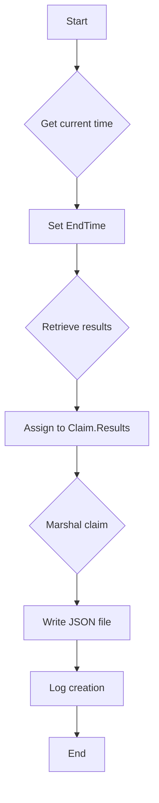

#### Function dependencies (Mermaid)

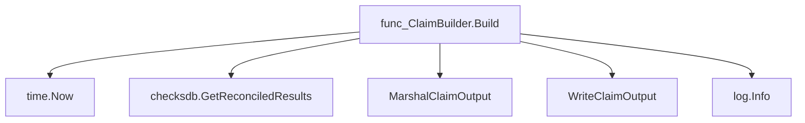

#### Functions calling `ClaimBuilder.Build` (Mermaid)

None – this function is currently not referenced elsewhere in the package.

#### Usage example (Go)

```go
// Minimal example invoking ClaimBuilder.Build
package main

import (
    "github.com/redhat-best-practices-for-k8s/certsuite/pkg/claimhelper"
)

func main() {
    // Assume a pre‑configured ClaimBuilder instance `builder`
    var builder claimhelper.ClaimBuilder

    // Build and persist the claim to a JSON file
    builder.Build("/tmp/my-claim.json")
}
```

---

### ClaimBuilder.Reset

**Reset** - Initializes or reinitializes the `StartTime` field of the underlying claim metadata with the present UTC time, ensuring that subsequent claims are stamped correctly.

Resets the claim builder’s start time to the current UTC timestamp formatted per the package directive.

```go
func (c *ClaimBuilder) Reset()
```

| Aspect | Details |
|--------|---------|
| **Purpose** | Initializes or reinitializes the `StartTime` field of the underlying claim metadata with the present UTC time, ensuring that subsequent claims are stamped correctly. |
| **Parameters** | None |
| **Return value** | None |
| **Key dependencies** | • `time.Now()` – obtains current local time.<br>• `UTC()` – converts to Coordinated Universal Time.<br>• `Format(DateTimeFormatDirective)` – formats the timestamp according to the package’s directive. |
| **Side effects** | Mutates the internal `claimRoot` structure of the receiver, specifically setting `Claim.Metadata.StartTime`. No I/O or concurrency operations are performed. |
| **How it fits the package** | The function is part of the claim construction workflow in *claimhelper*, allowing callers to reset the timestamp before building a new claim or reusing an existing builder instance. |

#### Internal workflow

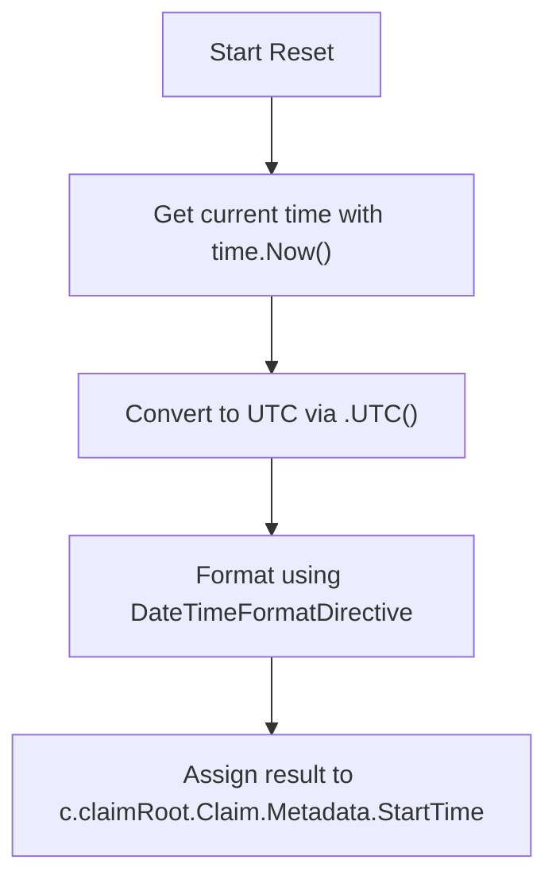

#### Function dependencies

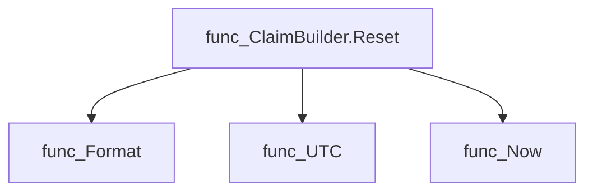

#### Functions calling `ClaimBuilder.Reset`

None – this function is currently not referenced elsewhere in the package.

#### Usage example

```go
// Minimal example invoking ClaimBuilder.Reset
builder := claimhelper.NewClaimBuilder()
builder.Reset() // sets StartTime to now UTC
```

---

### ClaimBuilder.ToJUnitXML

**ToJUnitXML** - Builds a JUnit‑style XML file summarizing the test results stored in the `ClaimBuilder`’s claim root. The report includes overall statistics and individual test case details, then writes it to disk.

#### 1) Signature (Go)

```go
func (c *ClaimBuilder) ToJUnitXML(outputFile string, startTime, endTime time.Time)
```

#### 2) Summary Table

| Aspect | Details |
|--------|---------|
| **Purpose** | Builds a JUnit‑style XML file summarizing the test results stored in the `ClaimBuilder`’s claim root. The report includes overall statistics and individual test case details, then writes it to disk. |
| **Parameters** | `outputFile string – path where the XML should be written`<br>`startTime time.Time – timestamp marking the beginning of the test run`<br>`endTime time.Time – timestamp marking the end of the test run` |
| **Return value** | None (writes to file or terminates on error) |
| **Key dependencies** | • `populateXMLFromClaim(c.claimRoot.Claim, startTime, endTime)` – converts claim data into an XML‑compatible struct.<br>• `xml.MarshalIndent` from the standard library – serialises the struct into formatted XML.<br>• `log.Fatal` and `log.Info` from the internal logging package – report progress or abort on failure.<br>• `os.WriteFile` – writes the final payload to disk. |
| **Side effects** | *Mutates* the filesystem by creating/overwriting `outputFile`. <br>*Logs* informational messages and may terminate the program with `os.Exit(1)` if XML generation or file writing fails. |
| **How it fits the package** | The `claimhelper` package is responsible for converting claim data into various formats. `ToJUnitXML` is one of those conversion methods, providing a standard JUnit report that can be consumed by CI systems or other tooling. |

#### 3) Internal workflow (Mermaid)

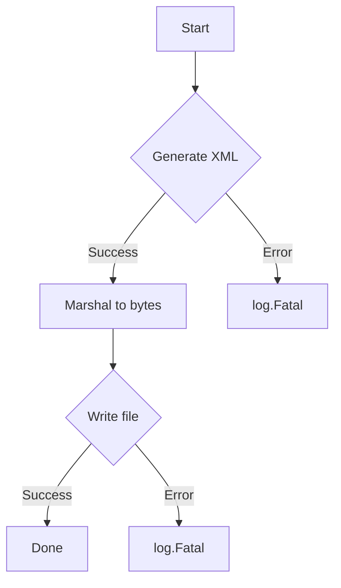

#### 4) Function dependencies (Mermaid)

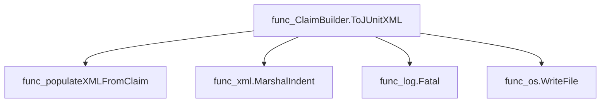

#### 5) Functions calling `ClaimBuilder.ToJUnitXML` (Mermaid)

None – this function is currently not referenced elsewhere in the package.

#### 6) Usage example (Go)

```go
// Minimal example invoking ClaimBuilder.ToJUnitXML
package main

import (
    "time"

    "github.com/redhat-best-practices-for-k8s/certsuite/pkg/claimhelper"
)

func main() {
    // Assume builder is already populated with claim data.
    var builder *claimhelper.ClaimBuilder

    start := time.Now()
    // ... run tests, update claim ...
    end := time.Now()

    // Write a JUnit XML report to the desired location
    builder.ToJUnitXML("report.xml", start, end)
}
```

---

### CreateClaimRoot

**CreateClaimRoot** - Instantiates a `claim.Root` containing a single `claim.Claim`. The claim’s metadata records the UTC start time formatted according to `DateTimeFormatDirective`.

Creates the initial claim structure with a timestamped start time for CertSuite reports.

#### Signature (Go)

```go
func CreateClaimRoot() *claim.Root
```

#### Summary Table

| Aspect | Details |
|--------|---------|
| **Purpose** | Instantiates a `claim.Root` containing a single `claim.Claim`. The claim’s metadata records the UTC start time formatted according to `DateTimeFormatDirective`. |
| **Parameters** | none |
| **Return value** | `*claim.Root` – the newly created root object, ready for further population. |
| **Key dependencies** | • `time.Now()` – obtains current wall‑clock time.<br>• `time.Time.UTC()` – converts to UTC.<br>• `time.Time.Format(DateTimeFormatDirective)` – formats the timestamp. |
| **Side effects** | No state mutation outside of the returned object; no I/O or concurrency. |
| **How it fits the package** | Provides a foundational claim root used by builders (e.g., `NewClaimBuilder`) and test utilities to seed claim data before adding configurations, nodes, and version information. |

#### Internal workflow (Mermaid)

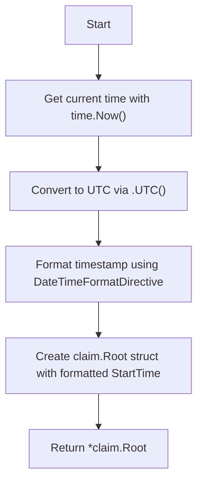

#### Function dependencies (Mermaid)

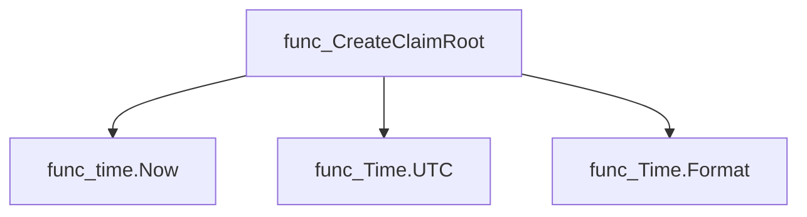

#### Functions calling `CreateClaimRoot` (Mermaid)

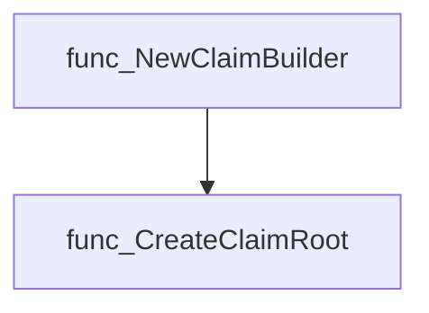

#### Usage example (Go)

```go
// Minimal example invoking CreateClaimRoot
package main

import (
 "fmt"

 "github.com/redhat-best-practices-for-k8s/certsuite/pkg/claimhelper"
)

func main() {
 root := claimhelper.CreateClaimRoot()
 fmt.Printf("Claim start time: %s\n", root.Claim.Metadata.StartTime)
}
```

---

### GenerateNodes

**GenerateNodes** - Collects various node diagnostics (summary, CNI plugins, hardware info, CSI drivers) into a single map for inclusion in a claim file.

#### 1) Signature (Go)

```go
func GenerateNodes() map[string]interface{}
```

#### 2) Summary Table

| Aspect | Details |
|--------|---------|
| **Purpose** | Collects various node diagnostics (summary, CNI plugins, hardware info, CSI drivers) into a single map for inclusion in a claim file. |
| **Parameters** | none |
| **Return value** | `map[string]interface{}` – key/value pairs of diagnostic data. |
| **Key dependencies** | • `diagnostics.GetNodeJSON()`<br>• `diagnostics.GetCniPlugins()`<br>• `diagnostics.GetHwInfoAllNodes()`<br>• `diagnostics.GetCsiDriver()` |
| **Side effects** | none (pure function) |
| **How it fits the package** | Called by `NewClaimBuilder` to populate the `Claim.Nodes` field of a claim root. |

#### 3) Internal workflow (Mermaid)

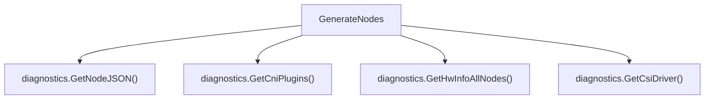

#### 4) Function dependencies (Mermaid)

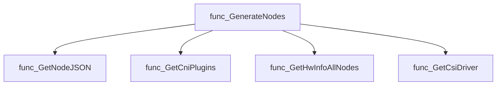

#### 5) Functions calling `GenerateNodes` (Mermaid)

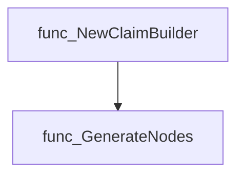

#### 6) Usage example (Go)

```go
// Minimal example invoking GenerateNodes
nodes := GenerateNodes()
fmt.Printf("Collected %d diagnostic entries\n", len(nodes))
```

---

### GetConfigurationFromClaimFile

**GetConfigurationFromClaimFile** - Reads a claim file, extracts the `Configurations` section, and converts it into a `*provider.TestEnvironment`.

#### Signature (Go)

```go
func GetConfigurationFromClaimFile(claimFileName string) (*provider.TestEnvironment, error)
```

#### Summary Table

| Aspect | Details |
|--------|---------|
| **Purpose** | Reads a claim file, extracts the `Configurations` section, and converts it into a `*provider.TestEnvironment`. |
| **Parameters** | `claimFileName string` – path to the claim file. |
| **Return value** | `(*provider.TestEnvironment, error)` – populated environment struct or an error if reading/parsing fails. |
| **Key dependencies** | • `ReadClaimFile` (file I/O)<br>• `UnmarshalClaim` (JSON unmarshal into `claim.Root`)<br>• JSON marshal/unmarshal (`encoding/json`)<br>• Logging via `log.Error` and `fmt.Printf` |
| **Side effects** | Writes to standard output (via `Printf`) and logs errors; does not modify global state. |
| **How it fits the package** | Core helper that converts a claim file into a configuration object used by tests in the `claimhelper` package. |

#### Internal workflow

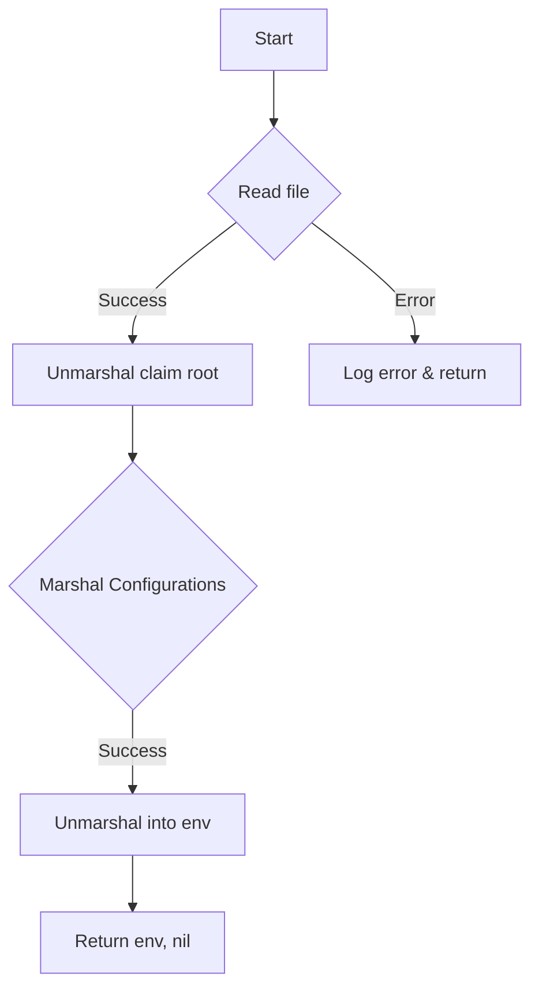

#### Function dependencies

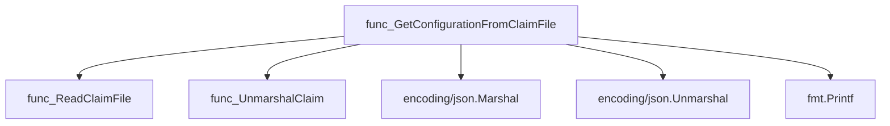

#### Functions calling `GetConfigurationFromClaimFile`

None – this function is currently not referenced elsewhere in the package.

#### Usage example (Go)

```go
// Minimal example invoking GetConfigurationFromClaimFile
package main

import (
    "fmt"

    "github.com/redhat-best-practices-for-k8s/certsuite/pkg/claimhelper"
)

func main() {
    env, err := claimhelper.GetConfigurationFromClaimFile("path/to/claim.json")
    if err != nil {
        fmt.Printf("Error: %v\n", err)
        return
    }
    fmt.Printf("Loaded environment: %+v\n", env)
}
```

---

### MarshalClaimOutput

**MarshalClaimOutput** - Converts a `claim.Root` value into an indented JSON byte slice for output. If serialization fails, the program terminates immediately with a fatal log message.

#### Signature (Go)

```go
func MarshalClaimOutput(claimRoot *claim.Root) []byte
```

#### Summary Table

| Aspect | Details |
|--------|---------|
| **Purpose** | Converts a `claim.Root` value into an indented JSON byte slice for output. If serialization fails, the program terminates immediately with a fatal log message. |
| **Parameters** | `claimRoot *claim.Root` – pointer to the claim structure that should be marshalled. |
| **Return value** | `[]byte` – pretty‑printed JSON representation of the claim; returned only when marshalling succeeds. |
| **Key dependencies** | • `encoding/json.MarshalIndent`<br>• `github.com/redhat-best-practices-for-k8s/certsuite/internal/log.Logger.Fatal` |
| **Side effects** | *Fatal log and program exit on marshalling error.* No other state is mutated. |
| **How it fits the package** | Utility used by higher‑level claim construction and sanitisation routines to persist claims in a human‑readable JSON format. |

#### Internal workflow (Mermaid)

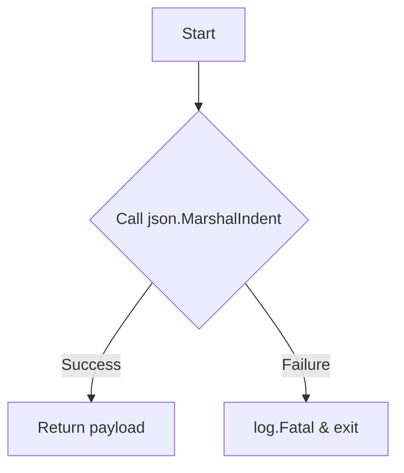

#### Function dependencies (Mermaid)

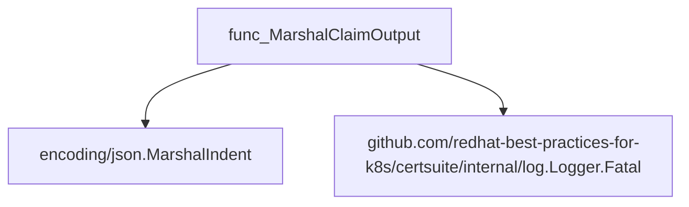

#### Functions calling `MarshalClaimOutput` (Mermaid)

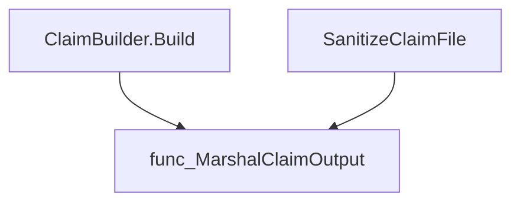

#### Usage example (Go)

```go
// Minimal example invoking MarshalClaimOutput
package main

import (
 "fmt"

 "github.com/redhat-best-practices-for-k8s/certsuite/pkg/claimhelper"
 "github.com/redhat-best-practices-for-k8s/certsuite/internal/claim"
)

func main() {
 // Assume we have a populated claim.Root instance
 var root *claim.Root

 // Marshal the claim to JSON bytes
 payload := claimhelper.MarshalClaimOutput(root)

 fmt.Println(string(payload))
}
```

---

---

### MarshalConfigurations

**MarshalConfigurations** - Produces a JSON‑encoded byte slice of the supplied `TestEnvironment`. If the argument is nil, it falls back to the global test environment via `GetTestEnvironment()`. Any marshalling failure is reported through the logger and returned.

#### Signature (Go)

```go
func MarshalConfigurations(env *provider.TestEnvironment) ([]byte, error)
```

#### Summary Table

| Aspect | Details |
|--------|---------|
| **Purpose** | Produces a JSON‑encoded byte slice of the supplied `TestEnvironment`. If the argument is nil, it falls back to the global test environment via `GetTestEnvironment()`. Any marshalling failure is reported through the logger and returned. |
| **Parameters** | `env *provider.TestEnvironment` – pointer to the environment to serialise (may be nil). |
| **Return value** | `([]byte, error)` – JSON bytes or an error if marshalling fails. |
| **Key dependencies** | • `github.com/redhat-best-practices-for-k8s/certsuite/pkg/provider.GetTestEnvironment()` <br>• `encoding/json.Marshal`<br>• `github.com/redhat-best-practices-for-k8s/certsuite/internal/log.Logger.Error` |
| **Side effects** | Logs an error on marshalling failure; otherwise no state mutation. |
| **How it fits the package** | Used by claim builders to embed current test configuration into a generated claim file. |

#### Internal workflow

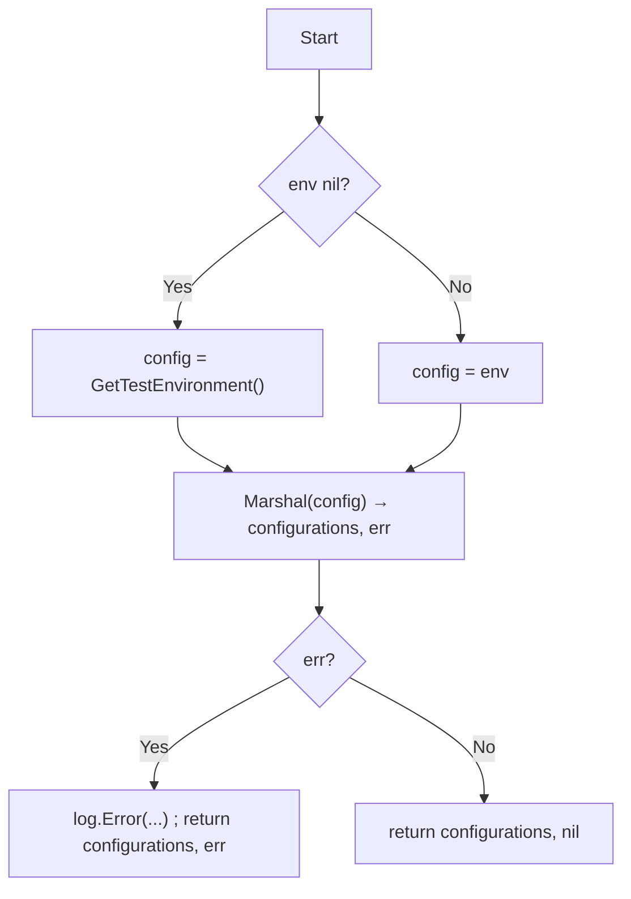

#### Function dependencies

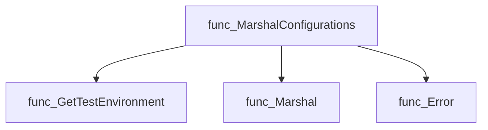

#### Functions calling `MarshalConfigurations`

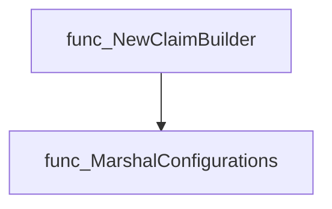

#### Usage example (Go)

```go
// Minimal example invoking MarshalConfigurations
package main

import (
 "fmt"

 "github.com/redhat-best-practices-for-k8s/certsuite/pkg/claimhelper"
 "github.com/redhat-best-practices-for-k8s/certsuite/pkg/provider"
)

func main() {
 env := provider.GetTestEnvironment()
 data, err := claimhelper.MarshalConfigurations(env)
 if err != nil {
  fmt.Println("Failed to marshal configurations:", err)
  return
 }
 fmt.Printf("JSON configuration: %s\n", data)
}
```

---

### NewClaimBuilder

**NewClaimBuilder** - Builds a `ClaimBuilder` that encapsulates all data required to generate a claim file. It marshals the test environment into JSON, unmarshals it back into a map for configuration inclusion, and populates the claim root with node information, version metadata, and configurations.

#### Signature (Go)

```go
func NewClaimBuilder(env *provider.TestEnvironment) (*ClaimBuilder, error)
```

#### Summary Table

| Aspect | Details |
|--------|---------|
| **Purpose** | Builds a `ClaimBuilder` that encapsulates all data required to generate a claim file. It marshals the test environment into JSON, unmarshals it back into a map for configuration inclusion, and populates the claim root with node information, version metadata, and configurations. |
| **Parameters** | `env *provider.TestEnvironment – The current test environment containing cluster and test settings.` |
| **Return value** | `(*ClaimBuilder, error) – A populated builder or an error if configuration marshalling/unmarshalling fails.` |
| **Key dependencies** | • `os.Getenv("UNIT_TEST")`<br>• `log.Debug()`<br>• `MarshalConfigurations(env)`<br>• `UnmarshalConfigurations(configurations, claimConfigurations)`<br>• `CreateClaimRoot()`<br>• `GenerateNodes()`<br>• Diagnostics helpers (`GetVersionOcClient`, `GetVersionOcp`, `GetVersionK8s`) |
| **Side effects** | No global state is modified. The function only reads environment variables, logs a debug message, and constructs new data structures in memory. |
| **How it fits the package** | It is the primary entry point for creating a claim builder used by higher‑level orchestration (e.g., `certsuite.Run`). It prepares all information that will later be marshalled into a JSON claim file or converted to JUnit XML. |

#### Internal workflow

```mermaid
flowchart TD
  A["Check UNIT_TEST env"] -->|"true"| B["Return minimal ClaimBuilder"]
  A -->|"false"| C["Log debug message"]
  C --> D["Marshal environment → configurations"]
  D --> E{"Error?"}
  E -->|"yes"| F["Return error"]
  E -->|"no"| G["Unmarshal into claimConfigurations map"]
  G --> H["Create new ClaimRoot"]
  H --> I["Set Configurations, Nodes, Versions"]
  I --> J["Return ClaimBuilder with root"]
```

#### Function dependencies

```mermaid
graph TD
  func_NewClaimBuilder --> os.Getenv
  func_NewClaimBuilder --> log.Debug
  func_NewClaimBuilder --> MarshalConfigurations
  func_NewClaimBuilder --> UnmarshalConfigurations
  func_NewClaimBuilder --> CreateClaimRoot
  func_NewClaimBuilder --> GenerateNodes
  func_NewClaimBuilder --> diagnostics.GetVersionOcClient
  func_NewClaimBuilder --> diagnostics.GetVersionOcp
  func_NewClaimBuilder --> diagnostics.GetVersionK8s
```

#### Functions calling `NewClaimBuilder`

```mermaid
graph TD
  certsuite.Run --> claimhelper.NewClaimBuilder
```

#### Usage example (Go)

```go
// Minimal example invoking NewClaimBuilder
env := provider.GetTestEnvironment()
builder, err := claimhelper.NewClaimBuilder(env)
if err != nil {
    log.Fatalf("Failed to create claim builder: %v", err)
}
claimFilePath := "results/claim.json"
err = builder.Build(claimFilePath)
if err != nil {
    log.Fatalf("Failed to build claim file: %v", err)
}
```

---

### ReadClaimFile

**ReadClaimFile** - Loads the raw byte payload from the specified claim file. It logs success or failure and returns the data or an error.

#### Signature (Go)

```go
func ReadClaimFile(claimFileName string) (data []byte, err error)
```

#### Summary Table

| Aspect | Details |
|--------|---------|
| **Purpose** | Loads the raw byte payload from the specified claim file. It logs success or failure and returns the data or an error. |
| **Parameters** | `claimFileName string` – path to the claim file on disk. |
| **Return value** | `data []byte` – file contents; `err error` – non‑nil if reading fails. |
| **Key dependencies** | • `os.ReadFile` (file I/O)<br>• `log.Error`, `log.Info` from internal logging package |
| **Side effects** | Writes log entries to the application logger; no state mutation beyond I/O. |
| **How it fits the package** | Core helper for other claim‑handling functions (`GetConfigurationFromClaimFile`, `SanitizeClaimFile`) that need raw file data before unmarshalling or processing. |

#### Internal workflow (Mermaid)

```mermaid
flowchart TD
  A["Start"] --> B{"Read file"}
  B -->|"Success"| C["Log success"]
  B -->|"Error"| D["Log error"]
  C --> E["Return data, nil"]
  D --> F["Return data (empty), err"]
```

#### Function dependencies (Mermaid)

```mermaid
graph TD
  func_ReadClaimFile --> func_ReadFile
  func_ReadClaimFile --> func_Error
  func_ReadClaimFile --> func_Info
```

#### Functions calling `ReadClaimFile` (Mermaid)

```mermaid
graph TD
  func_GetConfigurationFromClaimFile --> func_ReadClaimFile
  func_SanitizeClaimFile --> func_ReadClaimFile
```

#### Usage example (Go)

```go
// Minimal example invoking ReadClaimFile
package main

import (
    "fmt"
    "github.com/redhat-best-practices-for-k8s/certsuite/pkg/claimhelper"
)

func main() {
    data, err := claimhelper.ReadClaimFile("example.claim")
    if err != nil {
        fmt.Printf("Failed to read claim file: %v\n", err)
        return
    }
    fmt.Printf("Claim file contents (%d bytes)\n%s\n", len(data), string(data))
}
```

---

### SanitizeClaimFile

**SanitizeClaimFile** - Filters the claim file by removing any test results whose labels do not satisfy the supplied label expression.

#### Signature (Go)

```go
func SanitizeClaimFile(claimFileName, labelsFilter string) (string, error)
```

#### Summary Table

| Aspect | Details |
|--------|---------|
| **Purpose** | Filters the claim file by removing any test results whose labels do not satisfy the supplied label expression. |
| **Parameters** | `claimFileName` (string) – path to the claim JSON file; `labelsFilter` (string) – a logical expression describing which tests to keep. |
| **Return value** | The same `claimFileName` on success, or an empty string and an error if reading, unmarshalling, or filtering fails. |
| **Key dependencies** | • `ReadClaimFile` (reads the file)<br>• `UnmarshalClaim` (parses JSON into a `claim.Root`) <br>• `labels.NewLabelsExprEvaluator` (creates an evaluator for the filter) <br>• `identifiers.GetTestIDAndLabels` (retrieves test labels) <br>• `MarshalClaimOutput` & `WriteClaimOutput` (writes back the sanitized claim) |
| **Side effects** | Reads from disk, writes a potentially modified claim file back to the same path, logs progress and errors. |
| **How it fits the package** | Part of the public API used by the test runner (`Run`) after generating a claim; ensures only relevant results are kept before further processing or submission. |

#### Internal workflow (Mermaid)

```mermaid
flowchart TD
  A["Start"] --> B["Read file"]
  B --> C{"Error?"}
  C -- Yes --> D["Log error & return"]
  C -- No --> E["Unmarshal JSON"]
  E --> F["Iterate over results"]
  F --> G["Create label evaluator"]
  G --> H{"Evaluator error?"}
  H -- Yes --> I["Log error & return"]
  H -- No --> J["Get labels for testID"]
  J --> K{"Eval matches?"}
  K -- False --> L["Delete result"]
  K -- True --> M["Keep"]
  F --> N["Marshal back to JSON"]
  N --> O["Write file"]
  O --> P["Return claimFileName"]
```

#### Function dependencies (Mermaid)

```mermaid
graph TD
  func_SanitizeClaimFile --> func_ReadClaimFile
  func_SanitizeClaimFile --> func_UnmarshalClaim
  func_SanitizeClaimFile --> func_NewLabelsExprEvaluator
  func_SanitizeClaimFile --> func_GetTestIDAndLabels
  func_SanitizeClaimFile --> func_MarshalClaimOutput
  func_SanitizeClaimFile --> func_WriteClaimOutput
```

#### Functions calling `SanitizeClaimFile` (Mermaid)

```mermaid
graph TD
  func_Run --> func_SanitizeClaimFile
```

#### Usage example (Go)

```go
// Minimal example invoking SanitizeClaimFile
package main

import (
 "fmt"
 "log"

 "github.com/redhat-best-practices-for-k8s/certsuite/pkg/claimhelper"
)

func main() {
 out, err := claimhelper.SanitizeClaimFile("claims.json", "env==prod && type!=regression")
 if err != nil {
  log.Fatalf("sanitize failed: %v", err)
 }
 fmt.Printf("Sanitized file written to %s\n", out)
}
```

---

### UnmarshalClaim

**UnmarshalClaim** - Decodes a JSON‑encoded claim into a `claim.Root` structure. If unmarshalling fails, the program logs a fatal error and exits.

#### 1) Signature (Go)

```go
func([]byte, *claim.Root)()
```

#### 2) Summary Table

| Aspect | Details |
|--------|---------|
| **Purpose** | Decodes a JSON‑encoded claim into a `claim.Root` structure. If unmarshalling fails, the program logs a fatal error and exits. |
| **Parameters** | `claimFile []byte` – raw JSON data; `<span style="font-family:monospace">claimRoot *claim.Root</span>` – pointer to the target struct. |
| **Return value** | None (the function writes directly into the provided pointer). |
| **Key dependencies** | • `encoding/json.Unmarshal`<br>• `log.Fatal` from the internal logging package |
| **Side effects** | • Mutates the object pointed to by `claimRoot`. <br>• May terminate the process via `log.Fatal` on error. |
| **How it fits the package** | Central helper for reading claim files; used by higher‑level functions that need configuration data from a claim. |

#### 3) Internal workflow (Mermaid)

```mermaid
flowchart TD
  subgraph UnmarshalClaim
    A["Receive `claimFile` and `claimRoot`"] --> B["Call json.Unmarshal"]
    B --> C{"Error?"}
    C -- Yes --> D["log.Fatal (terminates)"]
    C -- No --> E["Populate `claimRoot`"]
  end
```

#### 4) Function dependencies (Mermaid)

```mermaid
graph TD
  func_UnmarshalClaim --> func_encoding/json.Unmarshal
  func_UnmarshalClaim --> func_log.Logger.Fatal
```

#### 5) Functions calling `UnmarshalClaim` (Mermaid)

```mermaid
graph TD
  func_GetConfigurationFromClaimFile --> func_UnmarshalClaim
  func_SanitizeClaimFile --> func_UnmarshalClaim
```

#### 6) Usage example (Go)

```go
// Minimal example invoking UnmarshalClaim
import (
 "github.com/redhat-best-practices-for-k8s/certsuite/pkg/claimhelper"
 "github.com/redhat-best-practices-for-k8s/certsuite/internal/claim"
)

func main() {
 data := []byte(`{"some":"json"}`) // replace with real claim data
 var root claim.Root
 UnmarshalClaim(data, &root)
 // root is now populated; proceed with further logic
}
```

---

### UnmarshalConfigurations

**UnmarshalConfigurations** - Deserialises a JSON‑encoded configuration payload into the provided `map[string]interface{}`. If deserialization fails, the function logs a fatal error and terminates the process.

#### Signature (Go)

```go
func UnmarshalConfigurations(configurations []byte, claimConfigurations map[string]interface{})
```

#### Summary Table

| Aspect | Details |
|--------|---------|
| **Purpose** | Deserialises a JSON‑encoded configuration payload into the provided `map[string]interface{}`. If deserialization fails, the function logs a fatal error and terminates the process. |
| **Parameters** | - `configurations []byte` – raw JSON data.<br>- `claimConfigurations map[string]interface{}` – destination map to populate. |
| **Return value** | None (function has no return values). |
| **Key dependencies** | • `encoding/json.Unmarshal`<br>• `github.com/redhat-best-practices-for-k8s/certsuite/internal/log.Logger.Fatal` |
| **Side effects** | Mutates the supplied map with parsed data; may exit the program via a fatal log on error. No other I/O or concurrency. |
| **How it fits the package** | Used by `NewClaimBuilder` to populate claim configuration fields from a marshalled byte slice before constructing the claim root. |

#### Internal workflow (Mermaid)

```mermaid
flowchart TD
  A["Receive configurations byte slice"] --> B["Call json.Unmarshal"]
  B --> C{"Unmarshal succeeded?"}
  C -- Yes --> D["Populate claimConfigurations map"]
  C -- No --> E["log.Fatal error, exit process"]
```

#### Function dependencies (Mermaid)

```mermaid
graph TD
  func_UnmarshalConfigurations --> func_EncodingJSON_Unmarshal
  func_UnmarshalConfigurations --> func_Log_Fatal
```

#### Functions calling `UnmarshalConfigurations` (Mermaid)

```mermaid
graph TD
  func_NewClaimBuilder --> func_UnmarshalConfigurations
```

#### Usage example (Go)

```go
// Minimal example invoking UnmarshalConfigurations
package main

import (
 "encoding/json"
 "fmt"

 "github.com/redhat-best-practices-for-k8s/certsuite/pkg/claimhelper"
)

func main() {
 // Example JSON configuration
 data := []byte(`{"key":"value","number":42}`)

 configMap := map[string]interface{}{}
 claimhelper.UnmarshalConfigurations(data, configMap)

 fmt.Printf("Parsed config: %#v\n", configMap)
}
```

This example demonstrates how to supply a JSON byte slice and receive the parsed configuration in a map. If `data` were malformed, the program would terminate with a fatal log message.

---

### WriteClaimOutput

**WriteClaimOutput** - Persists the serialized claim payload (`payload`) into the specified file (`claimOutputFile`). If writing fails, the program terminates with a fatal log message.

#### Signature (Go)

```go
func WriteClaimOutput(claimOutputFile string, payload []byte) 
```

#### Summary Table

| Aspect | Details |
|--------|---------|
| **Purpose** | Persists the serialized claim payload (`payload`) into the specified file (`claimOutputFile`). If writing fails, the program terminates with a fatal log message. |
| **Parameters** | `claimOutputFile string` – Path where the claim should be written.<br>`payload []byte` – Serialized claim data to write. |
| **Return value** | None (the function has side‑effects only). |
| **Key dependencies** | • `log.Info` – logs normal operation<br>• `os.WriteFile` – writes bytes to disk<br>• `log.Fatal` – logs fatal error and exits on failure |
| **Side effects** | Writes a file with permissions defined by `claimFilePermissions`. On error, the program exits. |
| **How it fits the package** | Core helper used by claim construction (`ClaimBuilder.Build`) and sanitization (`SanitizeClaimFile`) to persist claim data. |

#### Internal workflow

```mermaid
flowchart TD
  A["Start"] --> B["Log Writing claim data"]
  B --> C{"Write file"}
  C -- Success --> D["Return"]
  C -- Failure --> E["Log fatal and exit"]
```

#### Function dependencies

```mermaid
graph TD
  func_WriteClaimOutput --> func_log.Info
  func_WriteClaimOutput --> os.WriteFile
  func_WriteClaimOutput --> func_log.Fatal
```

#### Functions calling `WriteClaimOutput`

```mermaid
graph TD
  ClaimBuilder.Build --> WriteClaimOutput
  SanitizeClaimFile --> WriteClaimOutput
```

#### Usage example (Go)

```go
// Minimal example invoking WriteClaimOutput
package main

import (
 "log"
)

func main() {
 payload := []byte(`{"example":"data"}`)
 WriteClaimOutput("claim.json", payload)
}
```

---

## Local Functions

### populateXMLFromClaim

**populateXMLFromClaim** - Builds a `TestSuitesXML` structure representing the results of a CNF certification claim, ready for JUnit XML marshalling.

#### Signature (Go)

```go
func populateXMLFromClaim(c claim.Claim, startTime, endTime time.Time) TestSuitesXML
```

#### Summary Table

| Aspect | Details |
|--------|---------|
| **Purpose** | Builds a `TestSuitesXML` structure representing the results of a CNF certification claim, ready for JUnit XML marshalling. |
| **Parameters** | `c claim.Claim` – the claim containing test results.<br>`startTime time.Time` – overall test run start.<br>`endTime time.Time` – overall test run end. |
| **Return value** | `TestSuitesXML` – fully populated XML data structure. |
| **Key dependencies** | *`sort.Strings` – sorts test IDs.<br>* `strconv.Itoa`, `strconv.FormatFloat` – convert numbers to strings.<br>*`time.Parse`, `time.Sub`, `time.Now().UTC()` – handle timestamps and durations.<br>* `strings.Split` – strip nanosecond suffix from claim times. |
| **Side effects** | No external I/O or concurrency; only creates in‑memory data structures. |
| **How it fits the package** | Internally used by `ClaimBuilder.ToJUnitXML` to convert a `claim.Claim` into JUnit XML format for reporting. |

#### Internal workflow (Mermaid)

```mermaid
flowchart TD
  A["Collect test IDs"] --> B["Sort IDs"]
  B --> C["Initialize TestSuitesXML"]
  C --> D["Count failures & skips"]
  D --> E["Set suite-level counters"]
  E --> F["Loop over sorted IDs"]
  F --> G["Parse start/end times"]
  G --> H["Compute duration"]
  H --> I["Populate skipped/failure messages"]
  I --> J["Append TestCase to suite"]
  J --> K["Return xmlOutput"]
```

#### Function dependencies (Mermaid)

```mermaid
graph TD
  func_populateXMLFromClaim --> func_append
  func_populateXMLFromClaim --> sort.Strings
  func_populateXMLFromClaim --> strconv.Itoa
  func_populateXMLFromClaim --> strconv.FormatFloat
  func_populateXMLFromClaim --> time.Parse
  func_populateXMLFromClaim --> time.Sub
  func_populateXMLFromClaim --> strings.Split
  func_populateXMLFromCommit --> log.Error
```

#### Functions calling `populateXMLFromClaim` (Mermaid)

```mermaid
graph TD
  func_ClaimBuilder_ToJUnitXML --> func_populateXMLFromClaim
```

#### Usage example (Go)

```go
// Minimal example invoking populateXMLFromClaim
import (
    "time"
    "github.com/redhat-best-practices-for-k8s/certsuite/pkg/claimhelper"
    "github.com/redhat-best-practices-for-k8s/certsuite/pkg/claimhelper/claim"
)

func main() {
    // Assume `c` is a populated claim.Claim
    var c claim.Claim
    start := time.Now()
    // ... run tests, populate c ...
    end := time.Now()

    xmlData := claimhelper.populateXMLFromClaim(c, start, end)
    // xmlData can now be marshalled to XML and written to file.
}
```

---
