# Package collector

**Path**: `pkg/collector`

## Table of Contents

- [Overview](#overview)
- [Exported Functions](#exported-functions)
  - [SendClaimFileToCollector](#sendclaimfiletocollector)
- [Local Functions](#local-functions)
  - [addClaimFileToPostRequest](#addclaimfiletopostrequest)
  - [addVarFieldsToPostRequest](#addvarfieldstopostrequest)
  - [createSendToCollectorPostRequest](#createsendtocollectorpostrequest)

## Overview

The collector package builds and transmits an HTTP POST request that uploads a claim file together with execution metadata to a collector service. It is used by Certsuite when reporting the results of a certification run.

### Key Features

- Creates a multipart/form-data request containing the claim file, executed_by, partner_name, and decoded_password fields
- Handles timeouts via the collectorUploadTimeout constant and encapsulates request construction and sending logic
- Separates request creation from execution to allow reuse or testing of individual steps

### Design Notes

- The package deliberately splits request assembly (addClaimFileToPostRequest, addVarFieldsToPostRequest) from the high‑level SendClaimFileToCollector function for easier unit testing and potential future extensions
- There is no retry logic; a single HTTP attempt is made which may be insufficient in flaky network environments
- Best practice: validate file existence before calling SendClaimFileToCollector and handle returned errors appropriately

### Exported Functions Summary

| Name | Purpose |
|------|----------|
| [func SendClaimFileToCollector(endPoint, claimFilePath, executedBy, partnerName, password string) error](#sendclaimfiletocollector) | Builds and sends an HTTP `POST` request containing the claim file and associated metadata to a collector service. |

### Local Functions Summary

| Name | Purpose |
|------|----------|
| [func addClaimFileToPostRequest(w *multipart.Writer, claimFilePath string) error](#addclaimfiletopostrequest) | Reads the file at `claimFilePath` and appends it to a multipart form writer as a file field named “claimFile”. |
| [func (*multipart.Writer, string, string, string)(error)](#addvarfieldstopostrequest) | Appends three text fields (`executed_by`, `partner_name`, `decoded_password`) to a multipart form‑data writer. |
| [func createSendToCollectorPostRequest(endPoint, claimFilePath, executedBy, partnerName, password string) (*http.Request, error)](#createsendtocollectorpostrequest) | Constructs an `*http.Request` that posts a claim file along with metadata (executed by, partner name, decoded password) to the collector endpoint. |

## Exported Functions

### SendClaimFileToCollector

**SendClaimFileToCollector** - Builds and sends an HTTP `POST` request containing the claim file and associated metadata to a collector service.

#### Signature (Go)

```go
func SendClaimFileToCollector(endPoint, claimFilePath, executedBy, partnerName, password string) error
```

#### Summary Table

| Aspect | Details |
|--------|---------|
| **Purpose** | Builds and sends an HTTP `POST` request containing the claim file and associated metadata to a collector service. |
| **Parameters** | `endPoint string` – URL of the collector; `claimFilePath string` – local path to the claim file; `executedBy string` – user/agent that ran the test; `partnerName string` – name of the partner; `password string` – authentication credential for the collector. |
| **Return value** | `error` – non‑nil if request creation or execution fails. |
| **Key dependencies** | • `createSendToCollectorPostRequest` (constructs multipart form data)<br>• `http.Client.Do` (executes request)<br>• `http.Client{Timeout: collectorUploadTimeout}` (configures client) |
| **Side effects** | Performs network I/O; does not modify global state or the file system. |
| **How it fits the package** | Part of the `collector` sub‑package, used by higher‑level test orchestration to transmit results to an external collector service. |

#### Internal workflow (Mermaid)

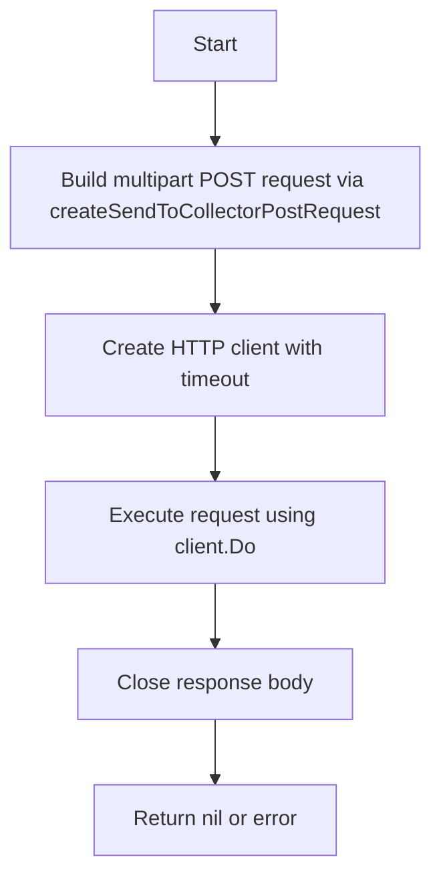

#### Function dependencies (Mermaid)

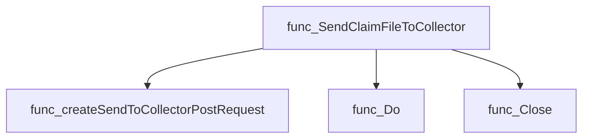

#### Functions calling `SendClaimFileToCollector` (Mermaid)

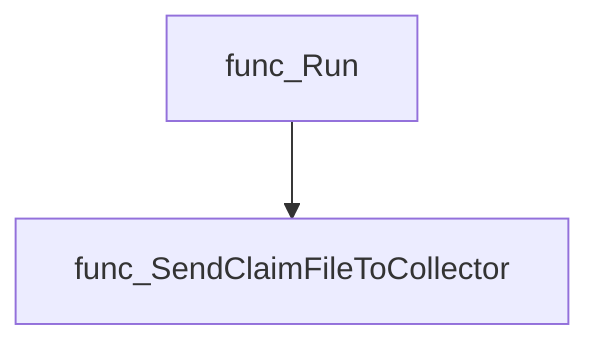

#### Usage example (Go)

```go
// Minimal example invoking SendClaimFileToCollector
package main

import (
 "log"

 "github.com/redhat-best-practices-for-k8s/certsuite/pkg/collector"
)

func main() {
 endpoint := "https://example.com/collect"
 filePath := "/tmp/claim.json"
 executedBy := "certsuite-runner"
 partnerName := "AcmeCorp"
 password := "secret"

 if err := collector.SendClaimFileToCollector(endpoint, filePath, executedBy, partnerName, password); err != nil {
  log.Fatalf("Failed to send claim: %v", err)
 }
}
```

---

---

## Local Functions

### addClaimFileToPostRequest

**addClaimFileToPostRequest** - Reads the file at `claimFilePath` and appends it to a multipart form writer as a file field named “claimFile”.

#### Signature (Go)

```go
func addClaimFileToPostRequest(w *multipart.Writer, claimFilePath string) error
```

#### Summary Table

| Aspect | Details |
|--------|---------|
| **Purpose** | Reads the file at `claimFilePath` and appends it to a multipart form writer as a file field named “claimFile”. |
| **Parameters** | *`w`* – pointer to `multipart.Writer`; *`claimFilePath`* – path of the claim file to upload. |
| **Return value** | `error` – non‑nil if opening the file, creating the form part, or copying data fails. |
| **Key dependencies** | • `os.Open` – opens the claim file.<br>• `w.CreateFormFile` – creates a new multipart form field for the file.<br>• `io.Copy` – streams the file contents into the form writer.<br>• `defer f.Close()` – ensures the file descriptor is released. |
| **Side effects** | I/O: opens and reads a file; writes its bytes to the provided `multipart.Writer`. No global state mutation. |
| **How it fits the package** | Used by `createSendToCollectorPostRequest` to embed a claim file in an HTTP POST request sent to the collector endpoint. |

#### Internal workflow (Mermaid)

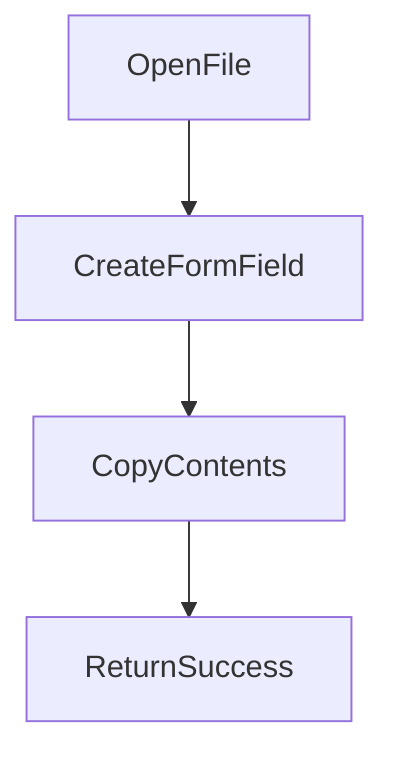

#### Function dependencies (Mermaid)

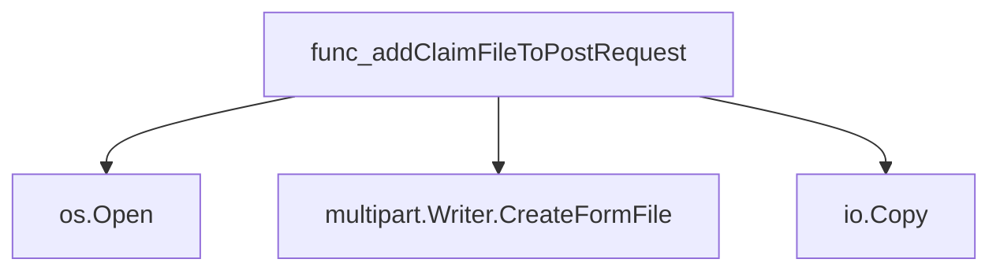

#### Functions calling `addClaimFileToPostRequest` (Mermaid)

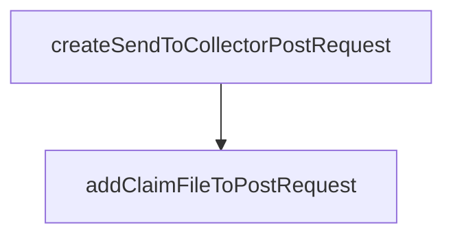

#### Usage example (Go)

```go
// Minimal example invoking addClaimFileToPostRequest
var buf bytes.Buffer
w := multipart.NewWriter(&buf)

// Path to the claim file on disk
claimPath := "/tmp/claim.json"

if err := addClaimFileToPostRequest(w, claimPath); err != nil {
    log.Fatalf("failed to attach claim file: %v", err)
}
w.Close()

// buf now contains a multipart/form-data body that can be used in an HTTP request
```

---

### addVarFieldsToPostRequest

**addVarFieldsToPostRequest** - Appends three text fields (`executed_by`, `partner_name`, `decoded_password`) to a multipart form‑data writer.

#### 1) Signature (Go)

```go
func (*multipart.Writer, string, string, string)(error)
```

#### 2) Summary Table

| Aspect | Details |
|--------|---------|
| **Purpose** | Appends three text fields (`executed_by`, `partner_name`, `decoded_password`) to a multipart form‑data writer. |
| **Parameters** | `w *multipart.Writer` – the multipart writer to write into.<br>`executedBy string` – value for “executed_by”.<br>`partnerName string` – value for “partner_name”.<br>`password string` – value for “decoded_password”. |
| **Return value** | `error` – non‑nil if any form field creation or write fails. |
| **Key dependencies** | • `w.CreateFormField(name)`<br>• `fw.Write([]byte(value))` |
| **Side effects** | Writes three fields to the provided multipart writer; does not close the writer. |
| **How it fits the package** | Used by `createSendToCollectorPostRequest` to populate metadata needed by the collector endpoint. |

#### 3) Internal workflow (Mermaid)

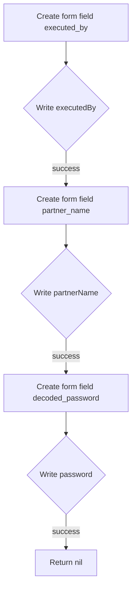

#### 4) Function dependencies (Mermaid)

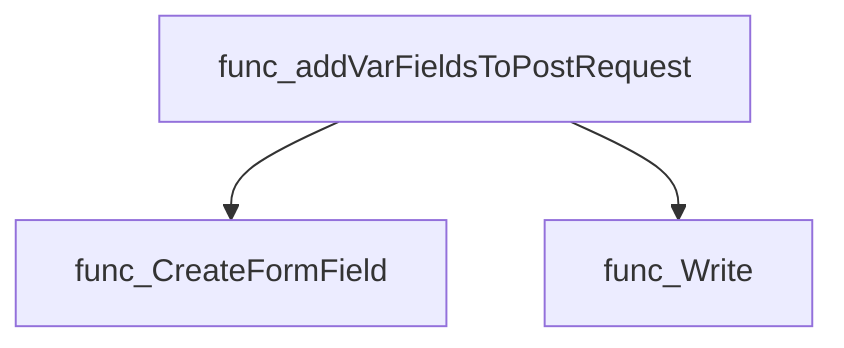

#### 5) Functions calling `addVarFieldsToPostRequest` (Mermaid)

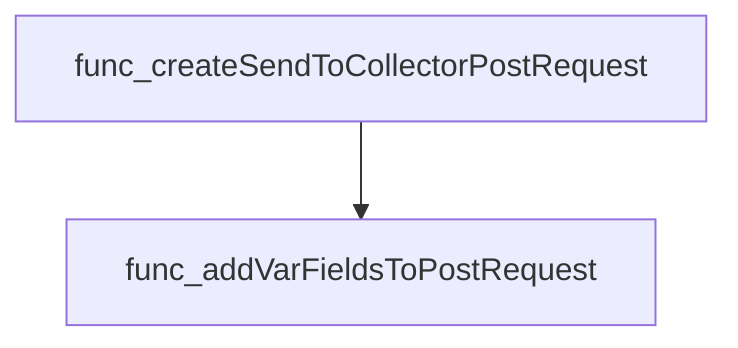

#### 6) Usage example (Go)

```go
// Minimal example invoking addVarFieldsToPostRequest
package main

import (
    "bytes"
    "mime/multipart"
)

func main() {
    var buf bytes.Buffer
    w := multipart.NewWriter(&buf)

    err := addVarFieldsToPostRequest(w, "alice", "partnerX", "s3cr3t")
    if err != nil {
        panic(err)
    }
    // Remember to close the writer before using the buffer.
    _ = w.Close()
}
```

---

### createSendToCollectorPostRequest

**createSendToCollectorPostRequest** - Constructs an `*http.Request` that posts a claim file along with metadata (executed by, partner name, decoded password) to the collector endpoint.

```go
func createSendToCollectorPostRequest(endPoint, claimFilePath, executedBy, partnerName, password string) (*http.Request, error)
```

| Aspect | Details |
|--------|---------|
| **Purpose** | Constructs an `*http.Request` that posts a claim file along with metadata (executed by, partner name, decoded password) to the collector endpoint. |
| **Parameters** | `endPoint string` – URL of the collector service.<br>`claimFilePath string` – Local path to the claim file.<br>`executedBy string` – Identifier of the user/process performing the upload.<br>`partnerName string` – Name of the partner organization.<br>`password string` – Decoded password for authentication. |
| **Return value** | `*http.Request` containing the multipart form data, or an error if any step fails. |
| **Key dependencies** | • `mime/multipart.NewWriter` – creates a writer for multipart content.<br>• `addClaimFileToPostRequest` – inserts the claim file into the form.<br>• `addVarFieldsToPostRequest` – adds textual fields to the form.<br>• `http.NewRequest` – builds the HTTP request.<br>• `w.FormDataContentType()` – sets the appropriate `Content-Type`. |
| **Side effects** | No global state is modified. The function writes to a local buffer and returns the constructed request; no network I/O occurs until the caller executes it. |
| **How it fits the package** | This helper encapsulates the repetitive logic of preparing multipart POST bodies used by `SendClaimFileToCollector`. It isolates file handling, field addition, and header configuration, promoting reuse within the collector client. |

#### Internal workflow

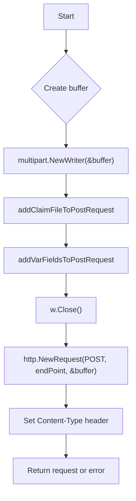

#### Function dependencies

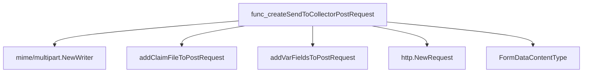

#### Functions calling `createSendToCollectorPostRequest`

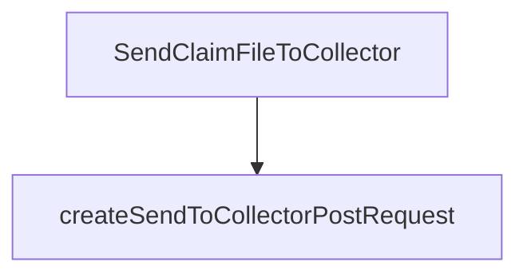

#### Usage example (Go)

```go
// Minimal example invoking createSendToCollectorPostRequest
package main

import (
 "log"
 "net/http"

 "github.com/redhat-best-practices-for-k8s/certsuite/pkg/collector"
)

func main() {
 endPoint := "https://collector.example.com/upload"
 claimFilePath := "/tmp/claim.zip"
 executedBy := "admin"
 partnerName := "ExamplePartner"
 password := "secret"

 req, err := collector.CreateSendToCollectorPostRequest(endPoint, claimFilePath, executedBy, partnerName, password)
 if err != nil {
  log.Fatalf("Failed to create request: %v", err)
 }

 client := &http.Client{}
 resp, err := client.Do(req)
 if err != nil {
  log.Fatalf("Upload failed: %v", err)
 }
 defer resp.Body.Close()

 log.Printf("Response status: %s", resp.Status)
}
```

*Note:* The exported name `CreateSendToCollectorPostRequest` is used in the example to illustrate public access; internally, the function is unexported (`createSendToCollectorPostRequest`).

---
