# Package compatibility

**Path**: `pkg/compatibility`

## Table of Contents

- [Overview](#overview)
- [Structs](#structs)
  - [VersionInfo](#versioninfo)
- [Exported Functions](#exported-functions)
  - [BetaRHCOSVersionsFoundToMatch](#betarhcosversionsfoundtomatch)
  - [DetermineOCPStatus](#determineocpstatus)
  - [FindMajorMinor](#findmajorminor)
  - [GetLifeCycleDates](#getlifecycledates)
  - [IsRHCOSCompatible](#isrhcoscompatible)
  - [IsRHELCompatible](#isrhelcompatible)

## Overview

The compatibility package supplies utilities for determining whether a given RHCOS or RHEL machine version can run on an OpenShift (OCP) release and classifies OCP releases into lifecycle states (Pre‑GA, GA, Maintenance Support, EOL). It also exposes helper functions for extracting major‑minor versions and mapping static lifecycle dates.

### Key Features

- Classifies OCP releases into lifecycle stages via DetermineOCPStatus using a predefined date map
- Provides compatibility checks for RHCOS and RHEL machine versions against an OpenShift release
- Utility to trim semantic versions to major.minor components

### Design Notes

- Lifecycle data is stored in a static map; adding new releases requires updating the map
- Beta releases are handled specially: they must match exactly on major‑minor before being considered compatible
- Compatibility checks use hashicorp/go-version for robust version comparisons

### Structs Summary

| Name | Purpose |
|------|----------|
| [**VersionInfo**](#versioninfo) | One-line purpose |

### Exported Functions Summary

| Name | Purpose |
|------|----------|
| [func BetaRHCOSVersionsFoundToMatch(machineVersion, ocpVersion string) bool](#betarhcosversionsfoundtomatch) | Determines if the supplied machine and OCP versions are identical beta releases, using only their major‑minor components. |
| [func DetermineOCPStatus(version string, date time.Time) string](#determineocpstatus) | Classifies an OpenShift release (`version`) into one of four lifecycle states—Pre‑GA, GA, Maintenance Support (MS), or End‑of‑Life (EOL)—based on the supplied `date`. Returns `OCPStatusUnknown` if inputs are invalid or no matching lifecycle data exists. |
| [func FindMajorMinor(version string) string](#findmajorminor) | Returns a string containing only the major and minor parts of a semantic‑style version, e.g. `"4.12"` from `"4.12.3"`. |
| [func GetLifeCycleDates() map[string]VersionInfo](#getlifecycledates) | Returns the static mapping (`ocpLifeCycleDates`) that contains lifecycle dates and related metadata for each OpenShift version. |
| [func IsRHCOSCompatible(machineVersion, ocpVersion string) bool](#isrhcoscompatible) | Determines whether the supplied RHCOS machine version can run on a given OpenShift (OCP) release. It handles normal releases, beta versions, and validates against lifecycle data. |
| [func IsRHELCompatible(machineVersion, ocpVersion string) bool](#isrhelcompatible) | Checks whether the supplied RHEL `machineVersion` is compatible with the specified OpenShift (`ocpVersion`) based on internal lifecycle data. |

## Structs

### VersionInfo

Represents lifecycle dates and supported operating system versions for a specific product release.

#### Fields

| Field                | Type          | Description |
|----------------------|---------------|-------------|
| `GADate`             | `time.Time`   | General Availability Date – the date the product was first publicly released. |
| `FSEDate`            | `time.Time`   | Full Support Ends Date – the last day full support is provided. |
| `MSEDate`            | `time.Time`   | Maintenance Support Ends Date – the final day maintenance updates are issued. |
| `MinRHCOSVersion`    | `string`      | Minimum RHCOS (Red Hat CoreOS) version that can run this release. |
| `RHELVersionsAccepted` | `[]string` | List of supported RHEL versions, expressed either as specific releases or ranges such as “7.9 or later” or “7.9 and 8.4”. |

#### Purpose  

`VersionInfo` holds the key dates for a product’s support lifecycle along with the operating‑system compatibility constraints. It is used to determine whether a given installation falls within an active support window and which OS versions are allowed.

#### Related functions  

| Function | Purpose |
|----------|---------|
| `GetLifeCycleDates()` | Returns a map of release identifiers to their corresponding `VersionInfo` objects, providing access to the lifecycle data for all supported releases. |

---

## Exported Functions

### BetaRHCOSVersionsFoundToMatch

**BetaRHCOSVersionsFoundToMatch** - Determines if the supplied machine and OCP versions are identical beta releases, using only their major‑minor components.

Checks whether two beta RHCOS version strings match after normalising to major.minor form.

```go
func BetaRHCOSVersionsFoundToMatch(machineVersion, ocpVersion string) bool
```

| Aspect | Details |
|--------|---------|
| **Purpose** | Determines if the supplied machine and OCP versions are identical beta releases, using only their major‑minor components. |
| **Parameters** | `machineVersion` (string) – version of the node; `ocpVersion` (string) – version of the OpenShift cluster. |
| **Return value** | `bool` – true if both versions exist in the beta list and match after trimming to major.minor, otherwise false. |
| **Key dependencies** | • `FindMajorMinor(version string)` – extracts major.minor.<br>• `stringhelper.StringInSlice(s []T, str T, containsCheck bool)` – checks membership in the beta‑version slice. |
| **Side effects** | None; pure function with no I/O or state mutation. |
| **How it fits the package** | Supports compatibility checks for RHCOS by handling special cases where beta releases should be considered equivalent to their corresponding OCP beta releases. |

#### Internal workflow

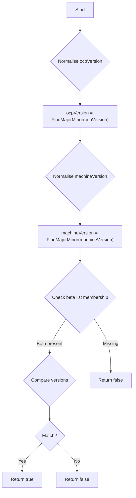

#### Function dependencies

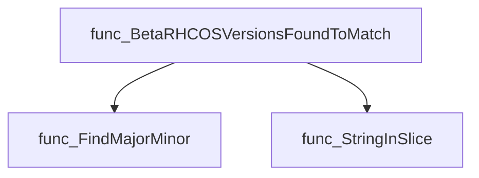

#### Functions calling `BetaRHCOSVersionsFoundToMatch`

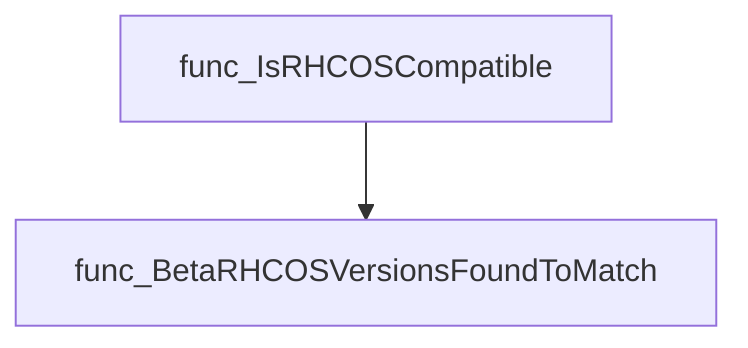

#### Usage example

```go
// Minimal example invoking BetaRHCOSVersionsFoundToMatch
import "github.com/redhat-best-practices-for-k8s/certsuite/pkg/compatibility"

func main() {
    machineVer := "4.12.0-rc2"
    ocpVer     := "4.12.0-rc2"

    if compatibility.BetaRHCOSVersionsFoundToMatch(machineVer, ocpVer) {
        println("Beta versions match")
    } else {
        println("Beta versions do not match")
    }
}
```

---

### DetermineOCPStatus

**DetermineOCPStatus** - Classifies an OpenShift release (`version`) into one of four lifecycle states—Pre‑GA, GA, Maintenance Support (MS), or End‑of‑Life (EOL)—based on the supplied `date`. Returns `OCPStatusUnknown` if inputs are invalid or no matching lifecycle data exists.

#### Signature (Go)

```go
func DetermineOCPStatus(version string, date time.Time) string
```

#### Summary Table

| Aspect | Details |
|--------|---------|
| **Purpose** | Classifies an OpenShift release (`version`) into one of four lifecycle states—Pre‑GA, GA, Maintenance Support (MS), or End‑of‑Life (EOL)—based on the supplied `date`. Returns `OCPStatusUnknown` if inputs are invalid or no matching lifecycle data exists. |
| **Parameters** | `version string –` OpenShift release in *major.minor.patch* form.<br>`date time.Time –` The date to compare against lifecycle milestones. |
| **Return value** | `string –` One of the constants: `OCPStatusPreGA`, `OCPStatusGA`, `OCPStatusMS`, `OCPStatusEOL`, or `OCPStatusUnknown`. |
| **Key dependencies** | • `strings.Split`<br>• `GetLifeCycleDates()`<br>• `time.Time.IsZero`, `Before`, `Equal`, `After`<br>• `IsZero` helper (from standard library) |
| **Side effects** | No mutation of external state; purely functional. |
| **How it fits the package** | Provides lifecycle‑aware decision logic used by autodiscovery to label clusters with their OpenShift support status. |

#### Internal workflow

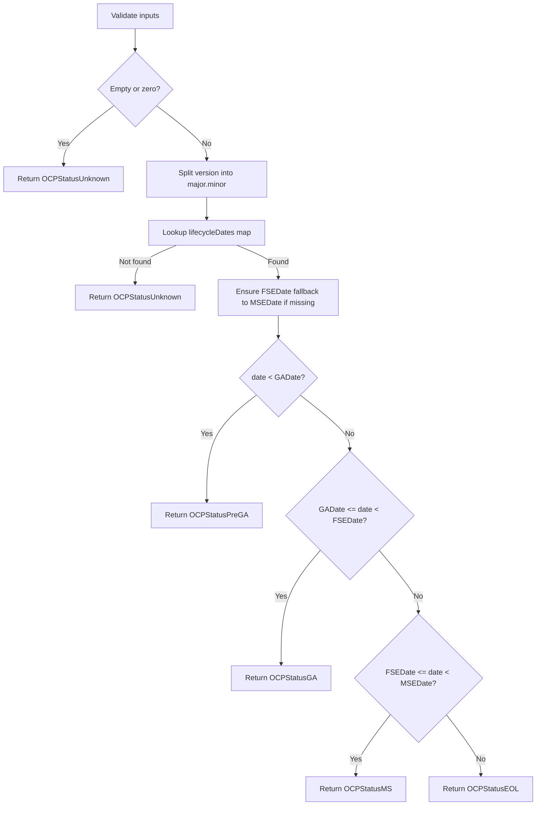

#### Function dependencies

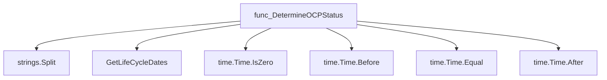

#### Functions calling `DetermineOCPStatus`

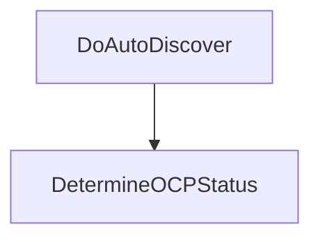

#### Usage example (Go)

```go
// Minimal example invoking DetermineOCPStatus
import (
    "fmt"
    "time"

    "github.com/redhat-best-practices-for-k8s/certsuite/pkg/compatibility"
)

func main() {
    version := "4.12.0"
    date := time.Date(2023, 7, 1, 0, 0, 0, 0, time.UTC)
    status := compatibility.DetermineOCPStatus(version, date)
    fmt.Println("OpenShift", version, "status:", status)
}
```

---

### FindMajorMinor

**FindMajorMinor** - Returns a string containing only the major and minor parts of a semantic‑style version, e.g. `"4.12"` from `"4.12.3"`.

#### Signature (Go)

```go
func FindMajorMinor(version string) string
```

#### Summary Table

| Aspect | Details |
|--------|---------|
| **Purpose** | Returns a string containing only the major and minor parts of a semantic‑style version, e.g. `"4.12"` from `"4.12.3"`. |
| **Parameters** | `version` string – a dotted version such as `"X.Y.Z"`. |
| **Return value** | A new string formatted as `"X.Y"`, where X is the major and Y the minor component. |
| **Key dependencies** | * `strings.Split` – splits the input on dots to isolate components. |
| **Side effects** | None; purely functional. |
| **How it fits the package** | Normalises version strings for compatibility checks (used by functions like `IsRHCOSCompatible`). |

#### Internal workflow

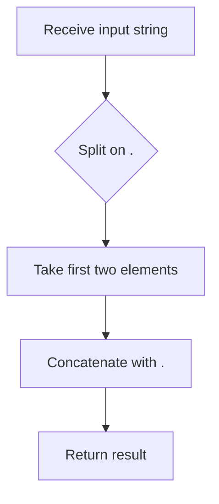

#### Function dependencies

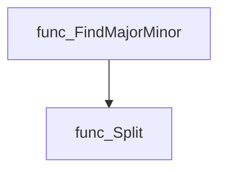

#### Functions calling `FindMajorMinor`

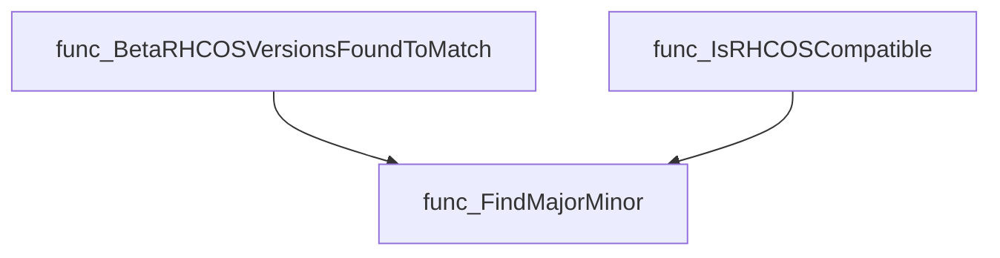

#### Usage example (Go)

```go
// Minimal example invoking FindMajorMinor
package main

import (
 "fmt"

 "github.com/redhat-best-practices-for-k8s/certsuite/pkg/compatibility"
)

func main() {
 version := "4.12.3"
 fmt.Println(compatibility.FindMajorMinor(version)) // Output: 4.12
}
```

---

### GetLifeCycleDates

**GetLifeCycleDates** - Returns the static mapping (`ocpLifeCycleDates`) that contains lifecycle dates and related metadata for each OpenShift version.

#### Signature (Go)

```go
func GetLifeCycleDates() map[string]VersionInfo
```

#### Summary Table

| Aspect | Details |
|--------|---------|
| **Purpose** | Returns the static mapping (`ocpLifeCycleDates`) that contains lifecycle dates and related metadata for each OpenShift version. |
| **Parameters** | None |
| **Return value** | `map[string]VersionInfo` – keys are “major.minor” strings (e.g., `"4.12"`) and values hold dates such as GA, FSE, MSE along with supported RHEL/RHCOS versions. |
| **Key dependencies** | *Uses the package‑level variable `ocpLifeCycleDates`. No external calls.* |
| **Side effects** | None; purely read‑only data access. |
| **How it fits the package** | Provides a central lookup for lifecycle dates used by other compatibility checks (e.g., determining OCP status or verifying RHEL/RHCOS support). |

#### Internal workflow (Mermaid)

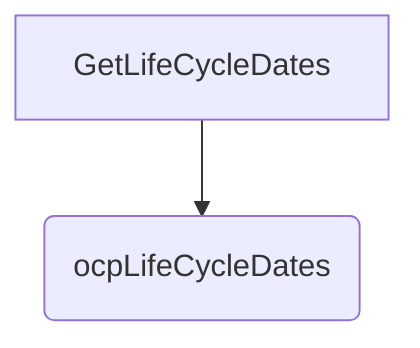

#### Function dependencies (Mermaid)

None – this function is currently not referenced elsewhere in the package.

#### Functions calling `GetLifeCycleDates` (Mermaid)

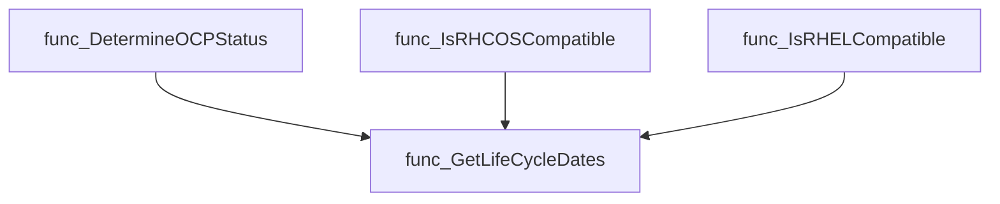

#### Usage example (Go)

```go
// Minimal example invoking GetLifeCycleDates
package main

import (
    "fmt"
    "github.com/redhat-best-practices-for-k8s/certsuite/pkg/compatibility"
)

func main() {
    lc := compatibility.GetLifeCycleDates()
    // Print the GA date for OpenShift 4.12, if available.
    if info, ok := lc["4.12"]; ok {
        fmt.Printf("GA date for 4.12: %s\n", info.GADate)
    } else {
        fmt.Println("Lifecycle data for 4.12 not found.")
    }
}
```

---

### IsRHCOSCompatible

**IsRHCOSCompatible** - Determines whether the supplied RHCOS machine version can run on a given OpenShift (OCP) release. It handles normal releases, beta versions, and validates against lifecycle data.

#### Signature (Go)

```go
func IsRHCOSCompatible(machineVersion, ocpVersion string) bool
```

#### Summary Table

| Aspect | Details |
|--------|---------|
| **Purpose** | Determines whether the supplied RHCOS machine version can run on a given OpenShift (OCP) release. It handles normal releases, beta versions, and validates against lifecycle data. |
| **Parameters** | `machineVersion string` – RHCOS version reported by the node.<br>`ocpVersion string` – OCP cluster version to compare against. |
| **Return value** | `bool` – `true` if the machine version is allowed for the specified OpenShift release; otherwise `false`. |
| **Key dependencies** | • `BetaRHCOSVersionsFoundToMatch(machineVersion, ocpVersion)`<br>• `FindMajorMinor(ocpVersion)`<br>• `GetLifeCycleDates()`<br>• `gv.NewVersion` (github.com/hashicorp/go-version)<br>• `log.Error` (internal logger) |
| **Side effects** | None – pure comparison logic; only logs errors via the internal logger. |
| **How it fits the package** | Core compatibility check used by tests and runtime validation to enforce that control‑plane nodes run RHCOS compatible with the cluster release. |

#### Internal workflow (Mermaid)

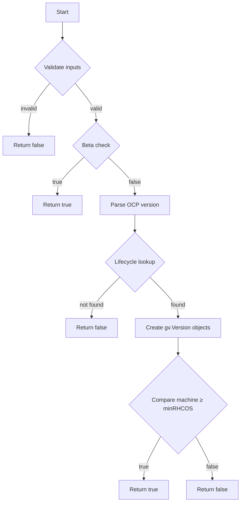

#### Function dependencies (Mermaid)

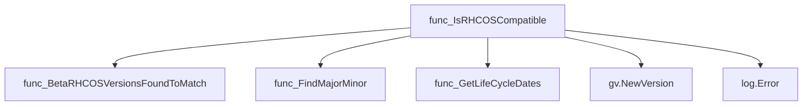

#### Functions calling `IsRHCOSCompatible` (Mermaid)

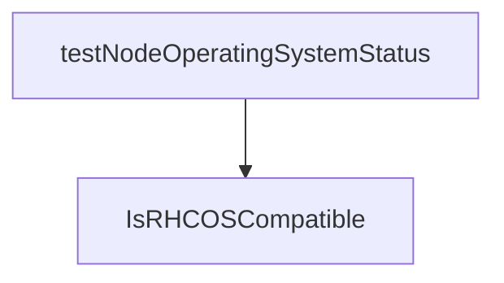

#### Usage example (Go)

```go
// Minimal example invoking IsRHCOSCompatible
package main

import (
 "fmt"
 "github.com/redhat-best-practices-for-k8s/certsuite/pkg/compatibility"
)

func main() {
 machine := "4.12.1"   // RHCOS node version
 cluster := "4.12.0"   // OpenShift release

 if compatibility.IsRHCOSCompatible(machine, cluster) {
  fmt.Println("Node is compatible with the cluster.")
 } else {
  fmt.Println("Node is NOT compatible with the cluster.")
 }
}
```

---

---

### IsRHELCompatible

**IsRHELCompatible** - Checks whether the supplied RHEL `machineVersion` is compatible with the specified OpenShift (`ocpVersion`) based on internal lifecycle data.

#### 1) Signature (Go)

```go
func IsRHELCompatible(machineVersion, ocpVersion string) bool
```

#### 2) Summary Table

| Aspect | Details |
|--------|---------|
| **Purpose** | Checks whether the supplied RHEL `machineVersion` is compatible with the specified OpenShift (`ocpVersion`) based on internal lifecycle data. |
| **Parameters** | `machineVersion string –` RHEL version to validate (e.g., `"8.6"`). <br>`ocpVersion string –` OpenShift release identifier (e.g., `"4.12"`). |
| **Return value** | `bool` – `true` if the machine version is supported for that OpenShift release, otherwise `false`. |
| **Key dependencies** | • `GetLifeCycleDates()` – fetches lifecycle mapping.<br>• `len()` – checks slice length.<br>• `github.com/hashicorp/go-version.NewVersion` – parses semantic versions.<br>• `GreaterThanOrEqual` method of the parsed version. |
| **Side effects** | None; pure function with no I/O or state mutation. |
| **How it fits the package** | Provides core compatibility logic used by tests and potentially runtime checks for node operating systems within CertSuite’s compatibility module. |

#### 3) Internal workflow (Mermaid)

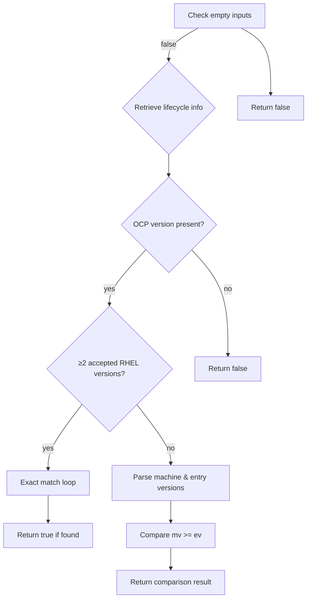

#### 4) Function dependencies (Mermaid)

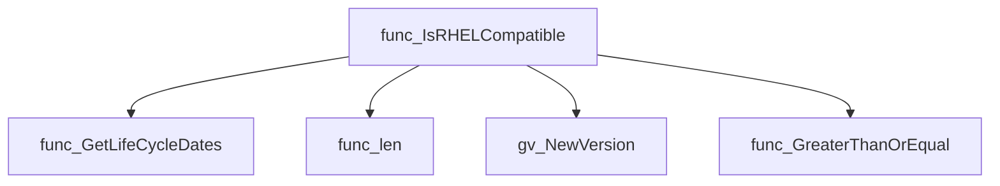

#### 5) Functions calling `IsRHELCompatible` (Mermaid)

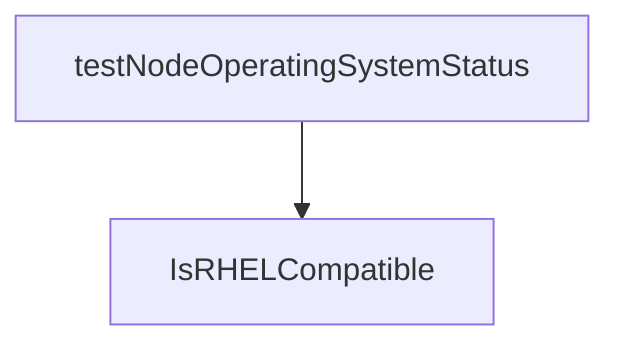

#### 6) Usage example (Go)

```go
// Minimal example invoking IsRHELCompatible
package main

import (
    "fmt"
    "github.com/redhat-best-practices-for-k8s/certsuite/pkg/compatibility"
)

func main() {
    machine := "8.6"
    ocp := "4.12"

    if compatibility.IsRHELCompatible(machine, ocp) {
        fmt.Printf("RHEL %s is compatible with OpenShift %s\n", machine, ocp)
    } else {
        fmt.Printf("RHEL %s is NOT compatible with OpenShift %s\n", machine, ocp)
    }
}
```

---
