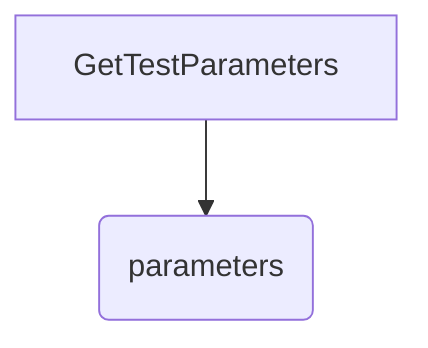
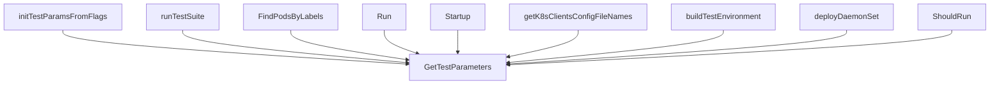
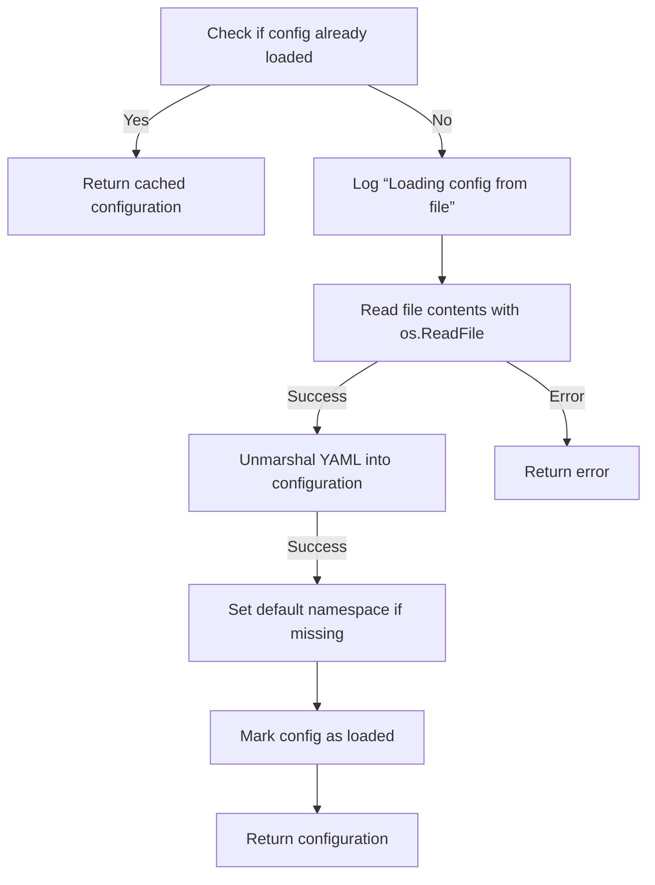
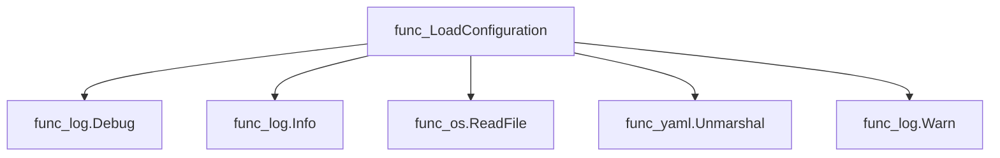
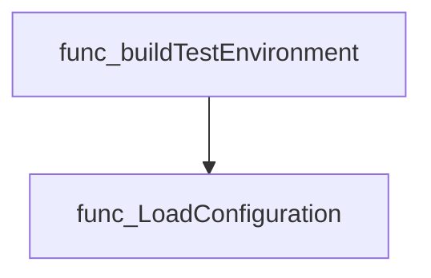

# Package configuration

**Path**: `pkg/configuration`

## Table of Contents

- [Overview](#overview)
- [Structs](#structs)
  - [AcceptedKernelTaintsInfo](#acceptedkerneltaintsinfo)
  - [ConnectAPIConfig](#connectapiconfig)
  - [CrdFilter](#crdfilter)
  - [ManagedDeploymentsStatefulsets](#manageddeploymentsstatefulsets)
  - [Namespace](#namespace)
  - [SkipHelmChartList](#skiphelmchartlist)
  - [SkipScalingTestDeploymentsInfo](#skipscalingtestdeploymentsinfo)
  - [SkipScalingTestStatefulSetsInfo](#skipscalingteststatefulsetsinfo)
  - [TestConfiguration](#testconfiguration)
  - [TestParameters](#testparameters)
- [Exported Functions](#exported-functions)
  - [GetTestParameters](#gettestparameters)
  - [LoadConfiguration](#loadconfiguration)

## Overview

The configuration package centralizes reading, parsing and caching test‑suite settings from a YAML file and exposes them through read‑only accessors for the rest of CertSuite.

### Key Features

- Loads and unmarshals a YAML config into structured types, applying defaults on first load
- Caches the parsed configuration so repeated calls are cheap
- Provides global read‑only access to runtime parameters via GetTestParameters

### Design Notes

- Configuration is loaded lazily; subsequent calls return the cached instance, ensuring consistency across packages
- The package deliberately hides mutable globals (confLoaded, configuration) to prevent accidental changes
- Users should call LoadConfiguration once early in the program and then rely on GetTestParameters for read‑only access

### Structs Summary

| Name | Purpose |
|------|----------|
| [**AcceptedKernelTaintsInfo**](#acceptedkerneltaintsinfo) | Struct definition |
| [**ConnectAPIConfig**](#connectapiconfig) | Struct definition |
| [**CrdFilter**](#crdfilter) | Struct definition |
| [**ManagedDeploymentsStatefulsets**](#manageddeploymentsstatefulsets) | One-line purpose |
| [**Namespace**](#namespace) | One-line purpose |
| [**SkipHelmChartList**](#skiphelmchartlist) | Struct definition |
| [**SkipScalingTestDeploymentsInfo**](#skipscalingtestdeploymentsinfo) | Struct definition |
| [**SkipScalingTestStatefulSetsInfo**](#skipscalingteststatefulsetsinfo) | Struct definition |
| [**TestConfiguration**](#testconfiguration) | One-line purpose |
| [**TestParameters**](#testparameters) | One‑line purpose |

### Exported Functions Summary

| Name | Purpose |
|------|----------|
| [func GetTestParameters() *TestParameters](#gettestparameters) | Provides read‑only access to the global `parameters` instance that holds all runtime options for the test suite. |
| [func LoadConfiguration(filePath string) (TestConfiguration, error)](#loadconfiguration) | Reads a YAML configuration file, unmarshals it into `TestConfiguration`, applies defaults, and caches the result so subsequent calls return the same instance. |

## Structs

### AcceptedKernelTaintsInfo

<!-- DEBUG: Struct AcceptedKernelTaintsInfo exists in bundle but ParsedOK=false, Fields=0 -->
**Purpose**: AcceptedKernelTaintsInfo contains all certified operator request info

**Fields**:

| Field | Type | Description |
|-------|------|--------------|
| `Module` | `string` | Field documentation |

---

### ConnectAPIConfig

<!-- DEBUG: Struct ConnectAPIConfig exists in bundle but ParsedOK=false, Fields=0 -->
**Purpose**: ConnectAPIConfig contains the configuration for the Red Hat Connect API

**Fields**:

| Field | Type | Description |
|-------|------|--------------|
| `APIKey` | `string` | Field documentation |
| `ProjectID` | `string` | Field documentation |
| `BaseURL` | `string` | Field documentation |
| `ProxyURL` | `string` | Field documentation |
| `ProxyPort` | `string` | Field documentation |

---

### CrdFilter

<!-- DEBUG: Struct CrdFilter exists in bundle but ParsedOK=false, Fields=0 -->
**Purpose**: CrdFilter defines a CustomResourceDefinition config filter.

**Fields**:

| Field | Type | Description |
|-------|------|--------------|
| `Scalable` | `bool` | Field documentation |
| `NameSuffix` | `string` | Field documentation |

---

### ManagedDeploymentsStatefulsets

A lightweight representation of a StatefulSet managed by CertSuite, identified by its Kubernetes name.

#### Fields
| Field | Type   | Description |
|-------|--------|-------------|
| Name  | string | The fully qualified or namespace‑scoped name of the StatefulSet. It is used to locate and reference the resource within Kubernetes API calls. |

#### Purpose  
`ManagedDeploymentsStatefulsets` encapsulates a single StatefulSet that CertSuite will monitor, configure, or modify. By storing only the name, it keeps the configuration minimal while still enabling precise targeting of resources in the cluster.

#### Related functions (if any)
| Function | Purpose |
|----------|---------|
| *none*   | No direct methods are defined for this struct. |

---

### Namespace


#### Fields
| Field | Type   | Description |
|-------|--------|-------------|
| Name  | string | The namespace name as used in Kubernetes and referenced by YAML/JSON configuration. |

#### Purpose
The `Namespace` struct represents a single namespace declaration within the CertSuite configuration. It holds only the namespace identifier, which is serialized/deserialized with `yaml:"name"` and `json:"name"`. This struct is typically instantiated when parsing a configuration file to determine where certificates or resources should be applied.

#### Related functions
| Function | Purpose |
|----------|---------|
| *(none)* |  |

---

---

### SkipHelmChartList

<!-- DEBUG: Struct SkipHelmChartList exists in bundle but ParsedOK=false, Fields=0 -->
**Purpose**: 

**Fields**:

| Field | Type | Description |
|-------|------|--------------|
| `Name` | `string` | Field documentation |

---

### SkipScalingTestDeploymentsInfo

<!-- DEBUG: Struct SkipScalingTestDeploymentsInfo exists in bundle but ParsedOK=false, Fields=0 -->
**Purpose**: SkipScalingTestDeploymentsInfo contains a list of names of deployments that should be skipped by the scaling tests to prevent issues

**Fields**:

| Field | Type | Description |
|-------|------|--------------|
| `Name` | `string` | Field documentation |
| `Namespace` | `string` | Field documentation |

---

### SkipScalingTestStatefulSetsInfo

<!-- DEBUG: Struct SkipScalingTestStatefulSetsInfo exists in bundle but ParsedOK=false, Fields=0 -->
**Purpose**: SkipScalingTestStatefulSetsInfo contains a list of names of statefulsets that should be skipped by the scaling tests to prevent issues

**Fields**:

| Field | Type | Description |
|-------|------|--------------|
| `Name` | `string` | Field documentation |
| `Namespace` | `string` | Field documentation |

---

### TestConfiguration


The configuration holder for test‑execution parameters, including namespaces, labels, CRD filters, deployment states, kernel taint acceptance rules, collector credentials, and API settings.

#### Fields
| Field | Type | Description |
|-------|------|-------------|
| `TargetNameSpaces` | `[]Namespace` | Namespaces targeted during testing. |
| `PodsUnderTestLabels` | `[]string` | Labels that identify pods to be examined. |
| `OperatorsUnderTestLabels` | `[]string` | Labels identifying operators involved in the test. |
| `CrdFilters` | `[]CrdFilter` | Filters applied to Custom Resource Definitions during discovery. |
| `ManagedDeployments` | `[]ManagedDeploymentsStatefulsets` | State information for managed deployments (including statefulsets). |
| `ManagedStatefulsets` | `[]ManagedDeploymentsStatefulsets` | Dedicated list of statefulset deployment states. |
| `AcceptedKernelTaints` | `[]AcceptedKernelTaintsInfo` | Kernel taints that are considered acceptable during test runs. |
| `SkipHelmChartList` | `[]SkipHelmChartList` | Helm charts to skip when provisioning resources. |
| `SkipScalingTestDeployments` | `[]SkipScalingTestDeploymentsInfo` | Deployments excluded from scaling tests. |
| `SkipScalingTestStatefulSets` | `[]SkipScalingTestStatefulSetsInfo` | Statefulsets excluded from scaling tests. |
| `ValidProtocolNames` | `[]string` | Protocol names that are permitted for use in the test environment. |
| `ServicesIgnoreList` | `[]string` | Services to ignore during discovery or validation steps. |
| `ProbeDaemonSetNamespace` | `string` | Namespace where the probe DaemonSet runs; defaults if empty. |
| `ExecutedBy` | `string` | Identifier of the entity executing the test (e.g., CI system). |
| `PartnerName` | `string` | Name of the partner organization, used for reporting or tagging. |
| `CollectorAppPassword` | `string` | Password credential for the collector application. |
| `CollectorAppEndpoint` | `string` | Endpoint URL for the collector service. |
| `ConnectAPIConfig` | `ConnectAPIConfig` | Configuration block for interacting with the Red Hat Connect API. |

#### Purpose
`TestConfiguration` encapsulates all runtime options and environment settings required by Certsuite to perform its tests. It is loaded once from a YAML file (via `LoadConfiguration`) and then consulted throughout the test lifecycle to determine which resources to probe, what labels to match, how to handle scaling scenarios, and where to send results.

#### Related functions
| Function | Purpose |
|----------|---------|
| `LoadConfiguration` | Reads a YAML configuration file into a `TestConfiguration` instance, applies defaults (e.g., for the probe DaemonSet namespace), and caches the result for subsequent calls. |

---

---

### TestParameters


A configuration holder used by CertSuite to drive test execution and output behaviour.

---

#### Fields

| Field                     | Type            | Description |
|---------------------------|-----------------|-------------|
| `Kubeconfig`              | `string`        | Path to the kubeconfig file that identifies the target cluster. |
| `ConfigFile`              | `string`        | Path to a YAML/JSON configuration file overriding defaults. |
| `PfltDockerconfig`        | `string`        | Docker config used for pulling pre‑flight images. |
| `OutputDir`               | `string`        | Directory where test results and artifacts are written. |
| `LabelsFilter`            | `string`        | Comma‑separated list of pod labels to include in autodiscovery. |
| `LogLevel`                | `string`        | Logging verbosity (`debug`, `info`, etc.). |
| `OfflineDB`               | `string`        | Path to a local database used when the cluster is offline. |
| `DaemonsetCPUReq`         | `string`        | CPU request for the CertSuite DaemonSet (e.g., `"200m"`). |
| `DaemonsetCPULim`         | `string`        | CPU limit for the CertSuite DaemonSet. |
| `DaemonsetMemReq`         | `string`        | Memory request for the CertSuite DaemonSet (e.g., `"256Mi"`). |
| `DaemonsetMemLim`         | `string`        | Memory limit for the CertSuite DaemonSet. |
| `SanitizeClaim`           | `bool`          | If true, removes sensitive data from test claims before storage. |
| `CertSuiteImageRepo`      | `string`        | Repository URL for pulling the CertSuite container image. |
| `CertSuiteProbeImage`     | `string`        | Image used for health‑probe checks during tests. |
| `Intrusive`               | `bool`          | Enables tests that modify cluster state (e.g., creating resources). |
| `AllowPreflightInsecure`  | `bool`          | Allows pre‑flight checks against insecure registries. |
| `IncludeWebFilesInOutputFolder` | `bool`   | If true, copies web assets into the output directory. |
| `OmitArtifactsZipFile`    | `bool`          | Skips creation of a ZIP archive containing artifacts. |
| `EnableDataCollection`    | `bool`          | Enables collection of telemetry data during tests. |
| `EnableXMLCreation`       | `bool`          | Generates an XML report in addition to JSON output. |
| `ServerMode`              | `bool`          | Runs CertSuite in a long‑lived server mode instead of one‑shot. |
| `Timeout`                 | `time.Duration` | Global timeout applied to test execution phases. |
| `ConnectAPIKey`           | `string`        | API key for authentication with the Connect service. |
| `ConnectProjectID`        | `string`        | Identifier of the project in Connect that receives results. |
| `ConnectAPIBaseURL`       | `string`        | Base URL of the Connect REST API. |
| `ConnectAPIProxyURL`      | `string`        | Proxy server URL used for outbound Connect traffic. |
| `ConnectAPIProxyPort`     | `string`        | Port number of the proxy server. |
| `AllowNonRunning`         | `bool`          | When true, autodiscovery includes pods not in a `Running` state. |

---

#### Purpose

`TestParameters` aggregates all runtime options that influence how CertSuite discovers workloads, configures resources, interacts with external services, and formats its output. The struct is typically populated from command‑line flags, environment variables, or a configuration file, and then passed to the test harness to orchestrate execution.

---

#### Related functions

| Function | Purpose |
|----------|---------|
| `GetTestParameters` | Returns a pointer to the global `parameters` instance that holds current test settings. |

---

---

## Exported Functions

### GetTestParameters

**GetTestParameters** - Provides read‑only access to the global `parameters` instance that holds all runtime options for the test suite.


#### Signature (Go)
```go
func GetTestParameters() *TestParameters
```

#### Summary Table
| Aspect | Details |
|--------|---------|
| **Purpose** | Provides read‑only access to the global `parameters` instance that holds all runtime options for the test suite. |
| **Parameters** | None |
| **Return value** | A pointer to the package’s `TestParameters` struct, which contains fields such as `OutputDir`, `LabelsFilter`, `Timeout`, etc. |
| **Key dependencies** | *None* – simply returns a reference to an already‑initialised variable. |
| **Side effects** | None; no state mutation or I/O occurs. |
| **How it fits the package** | Serves as the central accessor for configuration values used throughout `certsuite`, `autodiscover`, and command‑line initialization logic. |

#### Internal workflow (Mermaid)


#### Function dependencies (Mermaid)
None – this function is currently not referenced elsewhere in the package.

#### Functions calling `GetTestParameters` (Mermaid)


#### Usage example (Go)
```go
// Minimal example invoking GetTestParameters
package main

import (
	"fmt"
	"github.com/redhat-best-practices-for-k8s/certsuite/pkg/configuration"
)

func main() {
	params := configuration.GetTestParameters()
	fmt.Printf("Output directory: %s\n", params.OutputDir)
}
```

---

### LoadConfiguration

**LoadConfiguration** - Reads a YAML configuration file, unmarshals it into `TestConfiguration`, applies defaults, and caches the result so subsequent calls return the same instance.


#### Signature (Go)
```go
func LoadConfiguration(filePath string) (TestConfiguration, error)
```

#### Summary Table
| Aspect | Details |
|--------|---------|
| **Purpose** | Reads a YAML configuration file, unmarshals it into `TestConfiguration`, applies defaults, and caches the result so subsequent calls return the same instance. |
| **Parameters** | `filePath string` – Path to the YAML configuration file. |
| **Return value** | `TestConfiguration` – Parsed configuration; `error` if reading or unmarshalling fails. |
| **Key dependencies** | • `log.Debug`, `log.Info`, `log.Warn` (logging) <br>• `os.ReadFile` (file I/O) <br>• `yaml.Unmarshal` (YAML parsing) |
| **Side effects** | • Caches the loaded configuration in package‑level variables (`confLoaded`, `configuration`). <br>• Logs informational and warning messages. |
| **How it fits the package** | Provides a singleton access point to the test configuration used by the rest of the `configuration` package and other packages such as the provider’s test environment builder. |

#### Internal workflow (Mermaid)


#### Function dependencies (Mermaid)


#### Functions calling `LoadConfiguration` (Mermaid)


#### Usage example (Go)
```go
// Minimal example invoking LoadConfiguration
config, err := configuration.LoadConfiguration("/etc/certsuite/config.yaml")
if err != nil {
    log.Fatalf("Failed to load config: %v", err)
}
fmt.Printf("Loaded configuration: %+v\n", config)
```

---

