# Package diagnostics

**Path**: `pkg/diagnostics`

## Table of Contents

- [Overview](#overview)
- [Structs](#structs)
  - [NodeHwInfo](#nodehwinfo)
- [Exported Functions](#exported-functions)
  - [GetCniPlugins](#getcniplugins)
  - [GetCsiDriver](#getcsidriver)
  - [GetHwInfoAllNodes](#gethwinfoallnodes)
  - [GetNodeJSON](#getnodejson)
  - [GetVersionK8s](#getversionk8s)
  - [GetVersionOcClient](#getversionocclient)
  - [GetVersionOcp](#getversionocp)
- [Local Functions](#local-functions)
  - [getHWJsonOutput](#gethwjsonoutput)
  - [getHWTextOutput](#gethwtextoutput)

## Overview

The diagnostics package gathers node‑level information for a Kubernetes/Openshift cluster – from CNI plugins and CSI drivers to CPU, memory, network and block device stats – and exposes it in JSON‑serialisable maps.

### Key Features

- Collects and serialises hardware metrics (CPU, memory, NICs, disks) per node via probe pods
- Retrieves the list of installed CNI plugins and CSI drivers from the cluster
- Provides utility functions to fetch Kubernetes and OpenShift version strings

### Design Notes

- Uses a lightweight probe pod approach instead of direct kubelet API calls for compatibility with restricted clusters
- All data is returned as generic maps or structs; callers must unmarshal into concrete types if needed
- Error handling logs via internal logger but propagates errors for caller awareness

### Structs Summary

| Name | Purpose |
|------|----------|
| [**NodeHwInfo**](#nodehwinfo) | Node Hardware Information |

### Exported Functions Summary

| Name | Purpose |
|------|----------|
| [func GetCniPlugins() (out map[string][]interface{})](#getcniplugins) | Executes a command inside probe pods to obtain the list of CNI plugins present on each node and returns it as a JSON‑serialisable map keyed by node name. |
| [func GetCsiDriver() (out map[string]interface{})](#getcsidriver) | Fetches the list of Container Storage Interface (CSI) drivers from a Kubernetes cluster and returns it as a generic `map[string]interface{}` suitable for JSON serialization. |
| [func GetHwInfoAllNodes() (out map[string]NodeHwInfo)](#gethwinfoallnodes) | Gathers CPU, memory, network and block device data from each probe pod running on cluster nodes. The result is a map keyed by node name containing a `NodeHwInfo` struct per node. |
| [func GetNodeJSON() (out map[string]interface{})](#getnodejson) | Returns a map representation of the current Kubernetes nodes, mirroring the output of `oc get nodes -json`. |
| [func GetVersionK8s() (out string)](#getversionk8s) | Returns the Kubernetes (`k8s`) version that is configured in the current test environment. |
| [func GetVersionOcClient() (out string)](#getversionocclient) | Provides a static string indicating that the package does not use an OC or kubectl client. |
| [func GetVersionOcp() (out string)](#getversionocp) | Returns a human‑readable representation of the OpenShift (OCP) cluster version, or an explanatory placeholder if not running on an OCP cluster. |

### Local Functions Summary

| Name | Purpose |
|------|----------|
| [func getHWJsonOutput(probePod *corev1.Pod, o clientsholder.Command, cmd string)(interface{}, error)](#gethwjsonoutput) | Executes a shell command inside a probe pod, captures its stdout, and unmarshals the output into an `interface{}` (typically a map). |
| [func getHWTextOutput(probePod *corev1.Pod, o clientsholder.Command, cmd string) ([]string, error)](#gethwtextoutput) | Runs a shell command inside the first container of `probePod` and returns its standard output as an array of lines. |

## Structs

### NodeHwInfo


#### Fields
| Field   | Type          | Description |
|---------|---------------|-------------|
| Lscpu   | interface{}   | Raw output from the `lscpu` command; expected to be a JSON‑serializable map containing CPU details. |
| IPconfig| interface{}   | Raw output from the `ip` command; contains network configuration information, typically parsed as a JSON object. |
| Lsblk   | interface{}   | Raw output from the `lsblk` command; holds block device data, usually in JSON form. |
| Lspci   | []string      | Slice of strings representing the text output lines from the `lspci` command (PCI device list). |

#### Purpose
`NodeHwInfo` aggregates low‑level hardware inspection results for a Kubernetes node. Each field holds the raw result of a specific system command (`lscpu`, `ip`, `lsblk`, `lspci`). The struct is populated during diagnostics collection and later used to report or analyze node hardware characteristics.

#### Related functions
| Function | Purpose |
|----------|---------|
| `GetHwInfoAllNodes` | Iterates over probe pods, runs system commands on each node, fills a `NodeHwInfo` instance per node, and returns a map keyed by node name. |

---

---

## Exported Functions

### GetCniPlugins

**GetCniPlugins** - Executes a command inside probe pods to obtain the list of CNI plugins present on each node and returns it as a JSON‑serialisable map keyed by node name.


#### 1. Signature (Go)

```go
func GetCniPlugins() (out map[string][]interface{})
```

#### 2. Summary Table

| Aspect | Details |
|--------|---------|
| **Purpose** | Executes a command inside probe pods to obtain the list of CNI plugins present on each node and returns it as a JSON‑serialisable map keyed by node name. |
| **Parameters** | None |
| **Return value** | `map[string][]interface{}` – keys are node names; values are slices containing decoded JSON objects describing each plugin. |
| **Key dependencies** | • `provider.GetTestEnvironment` to obtain probe pod information.<br>• `clientsholder.GetClientsHolder` and `clientsholder.NewContext` for Kubernetes client interactions.<br>• `o.ExecCommandContainer` to run the command inside a pod.<br>• `encoding/json.Unmarshal` to parse the command output. |
| **Side effects** | Writes error logs via `log.Error` when command execution or JSON decoding fails; otherwise only returns data. No state mutation in global variables. |
| **How it fits the package** | Part of diagnostics utilities that gather runtime information from a cluster, used by higher‑level claim generation to include CNI plugin details in node summaries. |

#### 3. Internal workflow (Mermaid)

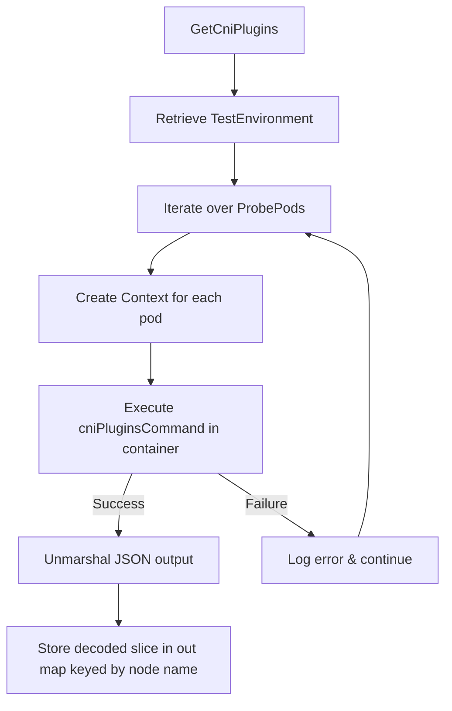

#### 4. Function dependencies (Mermaid)

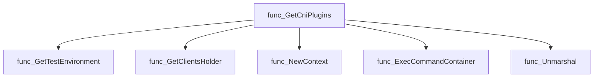

#### 5. Functions calling `GetCniPlugins` (Mermaid)

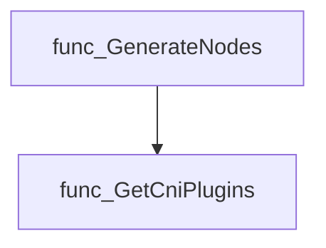

#### 6. Usage example (Go)

```go
// Minimal example invoking GetCniPlugins
pluginsByNode := diagnostics.GetCniPlugins()
for node, plugins := range pluginsByNode {
    fmt.Printf("Node %s has %d CNI plugins\n", node, len(plugins))
}
```

---

---

### GetCsiDriver

**GetCsiDriver** - Fetches the list of Container Storage Interface (CSI) drivers from a Kubernetes cluster and returns it as a generic `map[string]interface{}` suitable for JSON serialization.


#### 1) Signature (Go)

```go
func GetCsiDriver() (out map[string]interface{})
```

#### 2) Summary Table

| Aspect | Details |
|--------|---------|
| **Purpose** | Fetches the list of Container Storage Interface (CSI) drivers from a Kubernetes cluster and returns it as a generic `map[string]interface{}` suitable for JSON serialization. |
| **Parameters** | None |
| **Return value** | A map containing the CSI driver data; empty if an error occurs. |
| **Key dependencies** | • `clientsholder.GetClientsHolder()` – obtains a Kubernetes client.<br>• `K8sClient.StorageV1().CSIDrivers().List(...)` – lists CSI drivers.<br>• `runtime.NewScheme()`, `storagev1.AddToScheme()` – set up a runtime scheme for the CSI driver type.<br>• `serializer.NewCodecFactory(...).LegacyCodec(...)` – creates a codec to encode objects into JSON‑compatible bytes.<br>• `json.Unmarshal` – converts encoded bytes back into a map. |
| **Side effects** | No state mutation; performs network I/O to the Kubernetes API and logs errors via the package logger. |
| **How it fits the package** | Provides CSI driver data for diagnostic reports, used by higher‑level functions such as `claimhelper.GenerateNodes`. |

#### 3) Internal workflow (Mermaid)

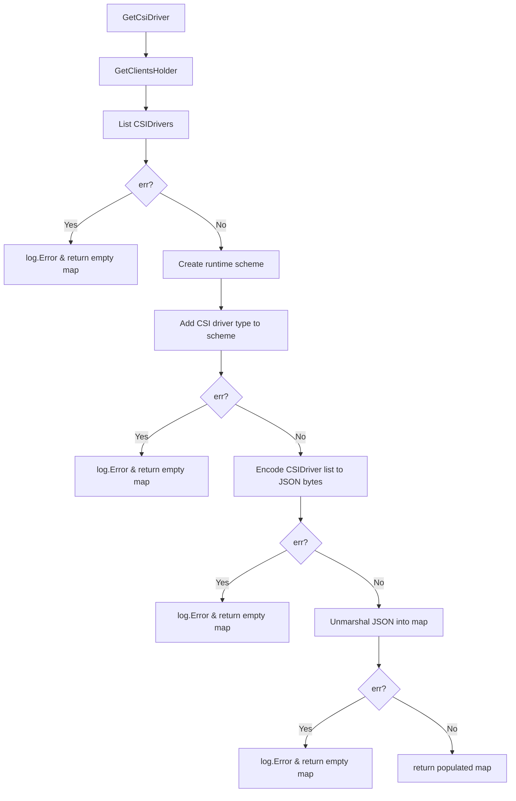

#### 4) Function dependencies (Mermaid)

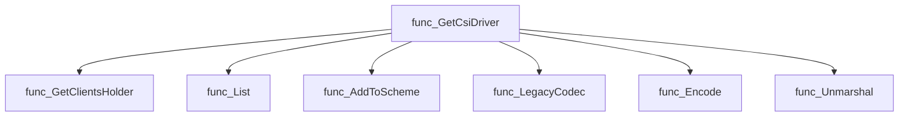

#### 5) Functions calling `GetCsiDriver` (Mermaid)

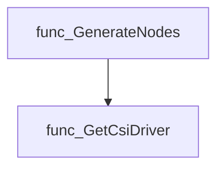

#### 6) Usage example (Go)

```go
// Minimal example invoking GetCsiDriver
package main

import (
	"fmt"
	"github.com/redhat-best-practices-for-k8s/certsuite/pkg/diagnostics"
)

func main() {
	csiDrivers := diagnostics.GetCsiDriver()
	fmt.Printf("CSI Drivers: %+v\n", csiDrivers)
}
```

---

### GetHwInfoAllNodes

**GetHwInfoAllNodes** - Gathers CPU, memory, network and block device data from each probe pod running on cluster nodes. The result is a map keyed by node name containing a `NodeHwInfo` struct per node.


#### Signature (Go)
```go
func GetHwInfoAllNodes() (out map[string]NodeHwInfo)
```

#### Summary Table
| Aspect | Details |
|--------|---------|
| **Purpose** | Gathers CPU, memory, network and block device data from each probe pod running on cluster nodes. The result is a map keyed by node name containing a `NodeHwInfo` struct per node. |
| **Parameters** | None |
| **Return value** | `map[string]NodeHwInfo` – mapping of node names to their hardware information. |
| **Key dependencies** | • `provider.GetTestEnvironment()` – obtains the test environment configuration.<br>• `clientsholder.GetClientsHolder()` – provides a client holder for executing commands in pods.<br>• `getHWJsonOutput(...)` – runs JSON‑producing commands (`lscpu`, `ip`) inside probe pods.<br>• `getHWTextOutput(...)` – runs text‑producing command (`lspci`).<br>• `log.Error(...)` – logs errors during data collection. |
| **Side effects** | Executes commands in each probe pod; writes error messages to the logger; no global state is modified. |
| **How it fits the package** | Supplies hardware information for diagnostics and reporting, used by higher‑level helpers such as `GenerateNodes`. |

#### Internal workflow (Mermaid)
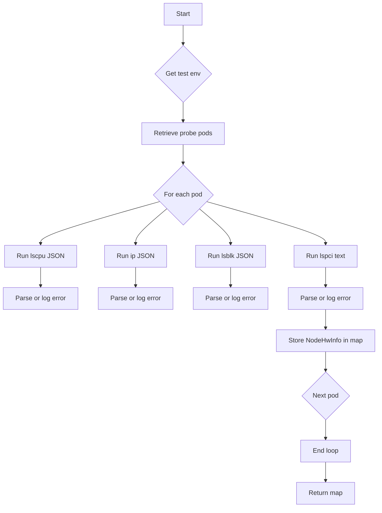

#### Function dependencies (Mermaid)
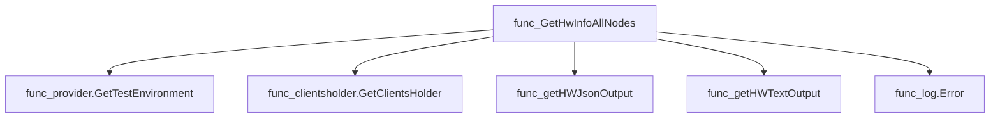

#### Functions calling `GetHwInfoAllNodes` (Mermaid)
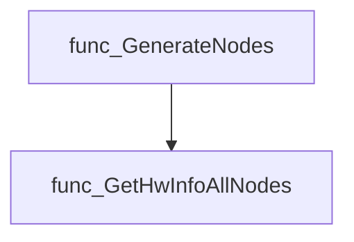

#### Usage example (Go)
```go
// Minimal example invoking GetHwInfoAllNodes
package main

import (
    "fmt"
    "github.com/redhat-best-practices-for-k8s/certsuite/pkg/diagnostics"
)

func main() {
    hwInfo := diagnostics.GetHwInfoAllNodes()
    for node, info := range hwInfo {
        fmt.Printf("Node: %s\n", node)
        fmt.Printf("  CPU: %v\n", info.Lscpu)
        fmt.Printf("  IP config: %v\n", info.IPconfig)
        fmt.Printf("  Block devices: %v\n", info.Lsblk)
        fmt.Printf("  PCI devices: %v\n", info.Lspci)
    }
}
```

---

### GetNodeJSON

**GetNodeJSON** - Returns a map representation of the current Kubernetes nodes, mirroring the output of `oc get nodes -json`.


#### Signature (Go)
```go
func GetNodeJSON() (out map[string]interface{})
```

#### Summary Table
| Aspect | Details |
|--------|---------|
| **Purpose** | Returns a map representation of the current Kubernetes nodes, mirroring the output of `oc get nodes -json`. |
| **Parameters** | None. |
| **Return value** | `map[string]interface{}` containing node details; empty on error. |
| **Key dependencies** | • `provider.GetTestEnvironment` – obtains test environment data.<br>• `encoding/json.Marshal` / `Unmarshal` – serialises/deserialises the nodes.<br>• `log.Error` – logs marshalling errors. |
| **Side effects** | Logs error messages if JSON operations fail; otherwise no external state changes. |
| **How it fits the package** | Supplies node information for diagnostic reports and claim generation within the diagnostics subsystem. |

#### Internal workflow
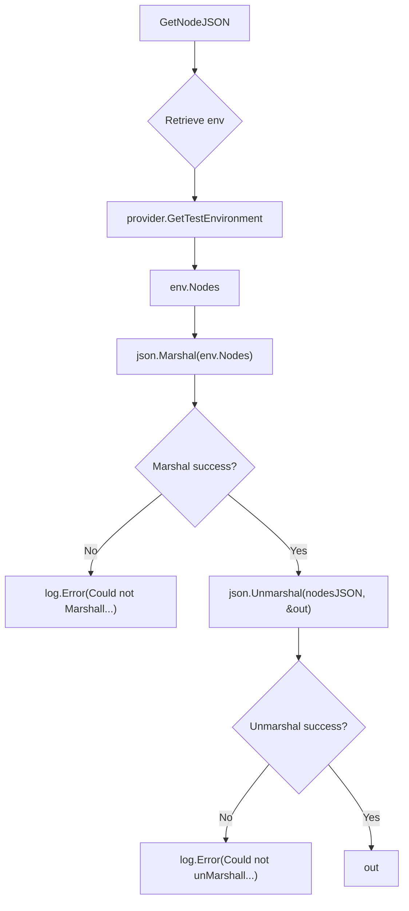

#### Function dependencies
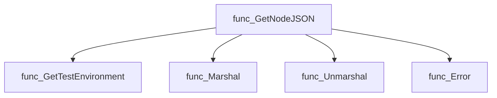

#### Functions calling `GetNodeJSON`
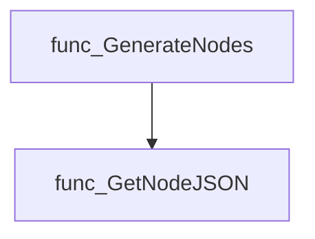

#### Usage example (Go)
```go
// Minimal example invoking GetNodeJSON
package main

import (
    "fmt"
    "github.com/redhat-best-practices-for-k8s/certsuite/pkg/diagnostics"
)

func main() {
    nodes := diagnostics.GetNodeJSON()
    fmt.Printf("Cluster nodes: %+v\n", nodes)
}
```

---

### GetVersionK8s

**GetVersionK8s** - Returns the Kubernetes (`k8s`) version that is configured in the current test environment.


#### 1) Signature (Go)

```go
func GetVersionK8s() (out string)
```

#### 2) Summary Table

| Aspect | Details |
|--------|---------|
| **Purpose** | Returns the Kubernetes (`k8s`) version that is configured in the current test environment. |
| **Parameters** | None |
| **Return value** | `string` – the Kubernetes version string (e.g., `"v1.24.0"`). |
| **Key dependencies** | • Calls `provider.GetTestEnvironment()` to obtain the `TestEnvironment`. <br>• Reads the `K8sVersion` field of that environment. |
| **Side effects** | None – purely read‑only operation; no state changes or I/O. |
| **How it fits the package** | Provides a lightweight accessor used by claim construction and diagnostic utilities to embed the Kubernetes version into claims or logs. |

#### 3) Internal workflow (Mermaid)

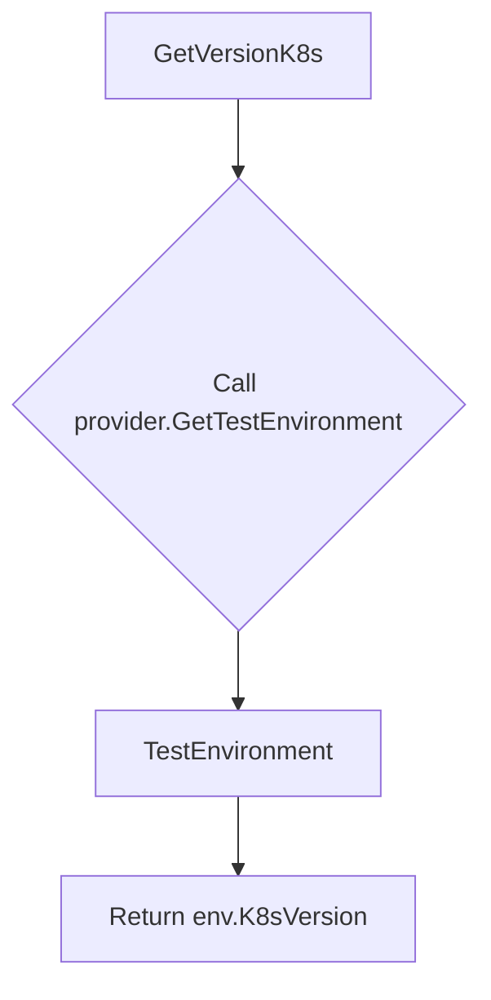

#### 4) Function dependencies (Mermaid)

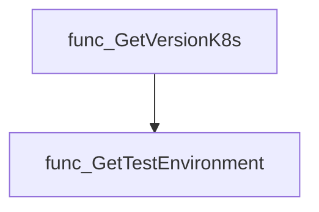

#### 5) Functions calling `GetVersionK8s` (Mermaid)

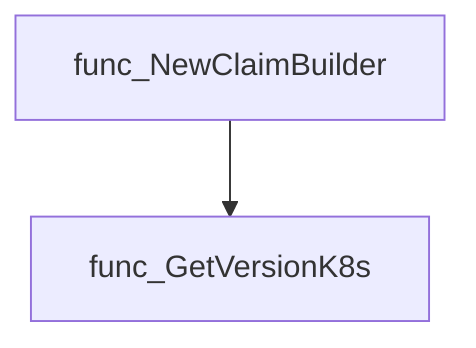

#### 6) Usage example (Go)

```go
// Minimal example invoking GetVersionK8s
package main

import (
    "fmt"
    "github.com/redhat-best-practices-for-k8s/certsuite/pkg/diagnostics"
)

func main() {
    k8sVer := diagnostics.GetVersionK8s()
    fmt.Println("Current Kubernetes version:", k8sVer)
}
```

---

### GetVersionOcClient

**GetVersionOcClient** - Provides a static string indicating that the package does not use an OC or kubectl client.


```go
func GetVersionOcClient() (out string)
```

| Aspect | Details |
|--------|---------|
| **Purpose** | Provides a static string indicating that the package does not use an OC or kubectl client. |
| **Parameters** | None |
| **Return value** | `string` – `"n/a, (not using oc or kubectl client)"` |
| **Key dependencies** | *none* |
| **Side effects** | No state changes; purely functional. |
| **How it fits the package** | Supplies a version placeholder used when constructing claim metadata in diagnostics. |

#### Internal workflow

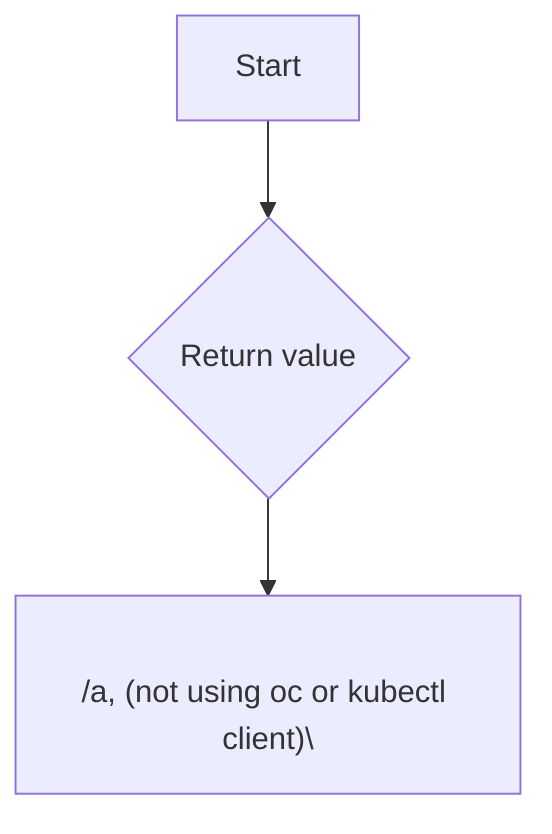

#### Function dependencies

None – this function is currently not referenced elsewhere in the package.

#### Functions calling `GetVersionOcClient`

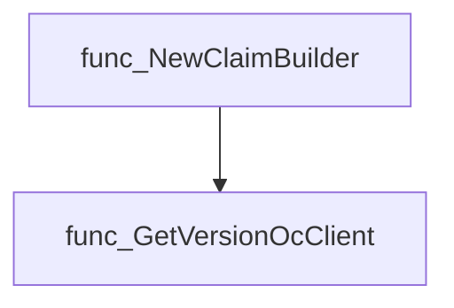

#### Usage example (Go)

```go
// Minimal example invoking GetVersionOcClient
package main

import (
	"fmt"

	"github.com/redhat-best-practices-for-k8s/certsuite/pkg/diagnostics"
)

func main() {
	version := diagnostics.GetVersionOcClient()
	fmt.Println("OC client version:", version)
}
```

---

### GetVersionOcp

**GetVersionOcp** - Returns a human‑readable representation of the OpenShift (OCP) cluster version, or an explanatory placeholder if not running on an OCP cluster.


#### Signature (Go)
```go
func GetVersionOcp() (out string)
```

#### Summary Table
| Aspect | Details |
|--------|---------|
| **Purpose** | Returns a human‑readable representation of the OpenShift (OCP) cluster version, or an explanatory placeholder if not running on an OCP cluster. |
| **Parameters** | None |
| **Return value** | `string` – the OCP version string or `"n/a, (non-OpenShift cluster)"`. |
| **Key dependencies** | • `provider.GetTestEnvironment()` <br>• `provider.IsOCPCluster()` |
| **Side effects** | No state mutation; purely read‑only. |
| **How it fits the package** | Part of the diagnostics utilities that expose environment information to higher‑level components (e.g., claim generation). |

#### Internal workflow
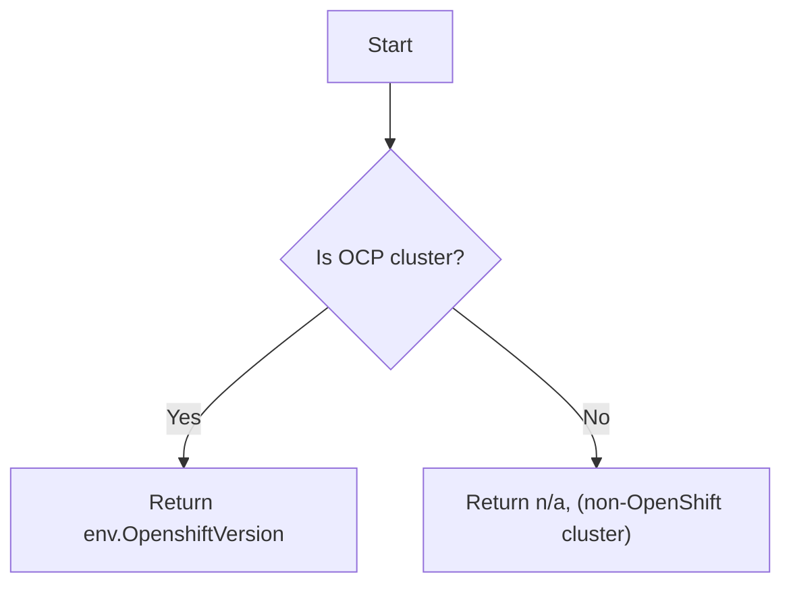

#### Function dependencies
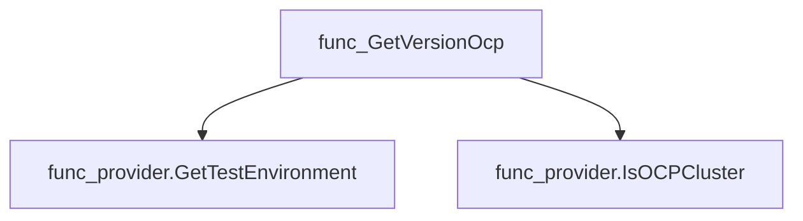

#### Functions calling `GetVersionOcp`
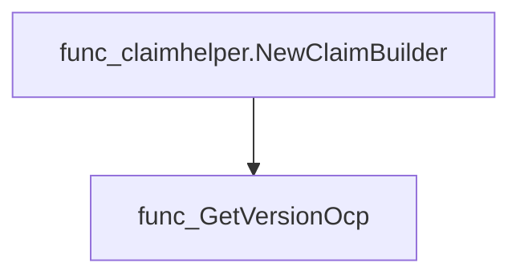

#### Usage example (Go)
```go
// Minimal example invoking GetVersionOcp
package main

import (
    "fmt"
    "github.com/redhat-best-practices-for-k8s/certsuite/pkg/diagnostics"
)

func main() {
    version := diagnostics.GetVersionOcp()
    fmt.Println("OpenShift Version:", version)
}
```

---

## Local Functions

### getHWJsonOutput

**getHWJsonOutput** - Executes a shell command inside a probe pod, captures its stdout, and unmarshals the output into an `interface{}` (typically a map).


#### 1) Signature (Go)
```go
func getHWJsonOutput(probePod *corev1.Pod, o clientsholder.Command, cmd string)(interface{}, error)
```

#### 2) Summary Table
| Aspect | Details |
|--------|---------|
| **Purpose** | Executes a shell command inside a probe pod, captures its stdout, and unmarshals the output into an `interface{}` (typically a map). |
| **Parameters** | *`probePod`* – pointer to the Kubernetes Pod used for probing.<br>*`o`* – executor interface that can run commands in containers.<br>*`cmd`* – command string to run inside the pod. |
| **Return value** | `out interface{}` – decoded JSON payload; `err error` – non‑nil if execution or decoding fails. |
| **Key dependencies** | • `clientsholder.NewContext`<br>• `o.ExecCommandContainer`<br>• `fmt.Errorf`<br>• `encoding/json.Unmarshal` |
| **Side effects** | No state mutation; only performs I/O by running a command in a pod. |
| **How it fits the package** | Used by higher‑level diagnostics to collect hardware information (e.g., lscpu, ip, lsblk) from each node’s probe pod. |

#### 3) Internal workflow
```mermaid
flowchart TD
  A["Create Context"] --> B{"Run cmd in container"}
  B -->|"stdout, stderr"| C["Check errors"]
  C --> D{"stderr empty?"}
  D -- yes --> E["Unmarshal JSON"]
  E --> F["Return result"]
  D -- no --> G["Return error with stderr"]
```

#### 4) Function dependencies
```mermaid
graph TD
  func_getHWJsonOutput --> clientsholder.NewContext
  func_getHWJsonOutput --> o.ExecCommandContainer
  func_getHWJsonOutput --> fmt.Errorf
  func_getHWJsonOutput --> json.Unmarshal
```

#### 5) Functions calling `getHWJsonOutput`
```mermaid
graph TD
  func_GetHwInfoAllNodes --> func_getHWJsonOutput
```

#### 6) Usage example (Go)
```go
// Minimal example invoking getHWJsonOutput
pod := &corev1.Pod{ /* populated elsewhere */ }
cmdExecutor := clientsholder.NewCommandExecutor() // hypothetical constructor
jsonData, err := getHWJsonOutput(pod, cmdExecutor, "lscpu -J")
if err != nil {
    log.Fatalf("failed to fetch hardware info: %v", err)
}
fmt.Printf("Hardware JSON: %+v\n", jsonData)
```

---

### getHWTextOutput

**getHWTextOutput** - Runs a shell command inside the first container of `probePod` and returns its standard output as an array of lines.


#### 1) Signature (Go)

```go
func getHWTextOutput(probePod *corev1.Pod, o clientsholder.Command, cmd string) ([]string, error)
```

#### 2) Summary Table

| Aspect | Details |
|--------|---------|
| **Purpose** | Runs a shell command inside the first container of `probePod` and returns its standard output as an array of lines. |
| **Parameters** | `probePod *corev1.Pod` – target pod; <br>`o clientsholder.Command` – executor interface; <br>`cmd string` – command to run. |
| **Return value** | `[]string` – split stdout by newline; `error` – non‑nil if execution fails or stderr is not empty. |
| **Key dependencies** | • `clientsholder.NewContext`<br>• `clientsholder.Command.ExecCommandContainer`<br>• `fmt.Errorf`<br>• `strings.Split` |
| **Side effects** | No state mutations; performs network I/O to the pod’s container. |
| **How it fits the package** | Used by higher‑level diagnostics functions (e.g., `GetHwInfoAllNodes`) to obtain plain‑text hardware information from probe pods. |

#### 3) Internal workflow (Mermaid)

```mermaid
flowchart TD
  A["Create exec context"] --> B["Execute command"]
  B --> C{"Success?"}
  C -- No --> D["Return error"]
  C -- Yes --> E["Split stdout into lines"]
  E --> F["Return lines"]
```

#### 4) Function dependencies (Mermaid)

```mermaid
graph TD
  func_getHWTextOutput --> clientsholder.NewContext
  func_getHWTextOutput --> clientsholder.Command.ExecCommandContainer
  func_getHWTextOutput --> fmt.Errorf
  func_getHWTextOutput --> strings.Split
```

#### 5) Functions calling `getHWTextOutput` (Mermaid)

```mermaid
graph TD
  func_GetHwInfoAllNodes --> func_getHWTextOutput
```

#### 6) Usage example (Go)

```go
// Minimal example invoking getHWTextOutput
import (
	"fmt"

	corev1 "k8s.io/api/core/v1"
	"github.com/redhat-best-practices-for-k8s/certsuite/internal/clientsholder"
)

// Assume pod and command are already defined.
func example(pod *corev1.Pod, cmd string) {
	var exec clientsholder.Command
	lines, err := getHWTextOutput(pod, exec, cmd)
	if err != nil {
		fmt.Printf("error: %v\n", err)
		return
	}
	for _, line := range lines {
		fmt.Println(line)
	}
}
```

---

