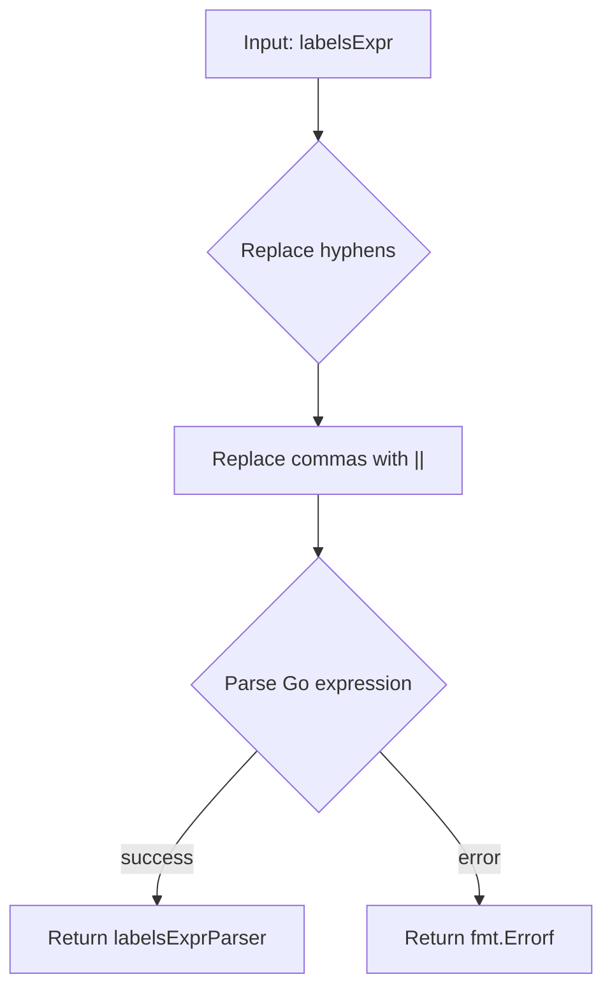
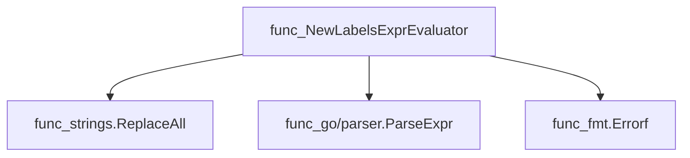
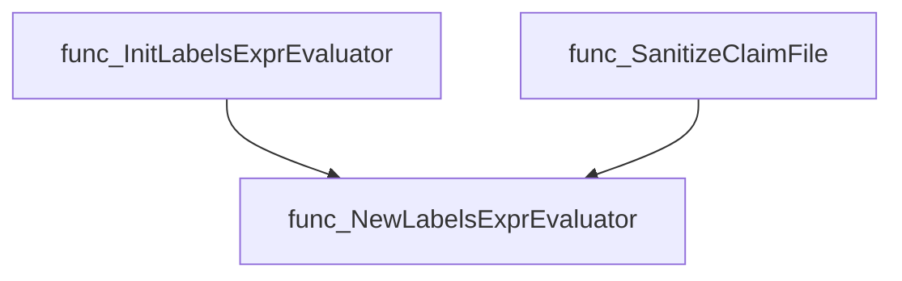
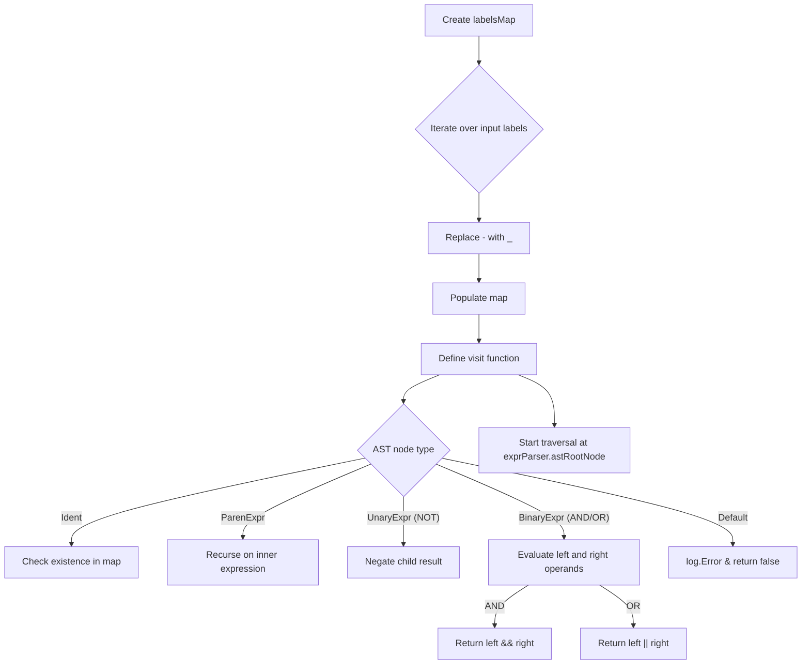
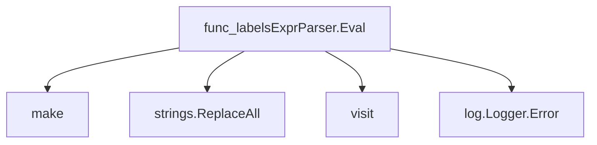

# Package labels

**Path**: `pkg/labels`

## Table of Contents

- [Overview](#overview)
- [Structs](#structs)
- [Interfaces](#interfaces)
  - [LabelsExprEvaluator](#labelsexprevaluator)
- [Exported Functions](#exported-functions)
  - [NewLabelsExprEvaluator](#newlabelsexprevaluator)
  - [labelsExprParser.Eval](#labelsexprparser.eval)

## Overview

Transforms a user‑supplied comma‑separated list of label filters into a Go AST that can be evaluated against test labels, normalizing hyphens to underscores and interpreting commas as logical OR.

### Key Features

- Parses comma‑separated expressions into an AST using the standard go/parser package
- Evaluates the resulting AST against a slice of labels via a visitor pattern
- Normalizes label names by replacing hyphens with underscores before parsing

### Design Notes

- Assumes each comma represents a disjunction (logical OR) between filters
- Fails with an error if the expression cannot be parsed into a valid Go expression
- Should be invoked once per test suite to avoid repeated parsing overhead

### Structs Summary

| Name | Purpose |
|------|----------|

### Exported Functions Summary

| Name | Purpose |
|------|----------|
| [func NewLabelsExprEvaluator(labelsExpr string) (LabelsExprEvaluator, error)](#newlabelsexprevaluator) | Transforms a user‑supplied comma‑separated list of label filters into a Go AST that can be evaluated against test labels. It replaces hyphens with underscores and commas with logical OR (` |
| [func (exprParser labelsExprParser) Eval(labels []string) bool](#labelsexprparser.eval) | Determines whether the provided `labels` satisfy the logical expression stored in `exprParser.astRootNode`. |

## Structs

## Interfaces

### LabelsExprEvaluator

<!-- DEBUG: Interface LabelsExprEvaluator exists in bundle but ParsedOK=false -->
**Purpose**: 

**Methods**:

| Method | Description |
|--------|--------------|
| `Eval` | Method documentation |

---

## Exported Functions

### NewLabelsExprEvaluator

**NewLabelsExprEvaluator** - Transforms a user‑supplied comma‑separated list of label filters into a Go AST that can be evaluated against test labels. It replaces hyphens with underscores and commas with logical OR (`


#### Signature (Go)

```go
func NewLabelsExprEvaluator(labelsExpr string) (LabelsExprEvaluator, error)
```

#### Summary Table

| Aspect | Details |
|--------|---------|
| **Purpose** | Transforms a user‑supplied comma‑separated list of label filters into a Go AST that can be evaluated against test labels. It replaces hyphens with underscores and commas with logical OR (`||`), then parses the resulting expression. |
| **Parameters** | `labelsExpr string –` raw label filter expression (e.g., `"tag-a,tag-b"`) |
| **Return value** | `LabelsExprEvaluator –` an evaluator capable of checking label sets; `error –` non‑nil if parsing fails |
| **Key dependencies** | • `strings.ReplaceAll` <br>• `go/parser.ParseExpr` <br>• `fmt.Errorf` |
| **Side effects** | None – purely functional. |
| **How it fits the package** | Provides the core mechanism for converting label filter strings into evaluators used by checks initialization and claim sanitization. |

#### Internal workflow (Mermaid)



#### Function dependencies (Mermaid)



#### Functions calling `NewLabelsExprEvaluator` (Mermaid)



#### Usage example (Go)

```go
// Minimal example invoking NewLabelsExprEvaluator
package main

import (
	"fmt"
	"github.com/redhat-best-practices-for-k8s/certsuite/pkg/labels"
)

func main() {
	evaluator, err := labels.NewLabelsExprEvaluator("tag-a,tag_b")
	if err != nil {
		fmt.Printf("Error creating evaluator: %v\n", err)
		return
	}
	// Assume LabelsExprEvaluator has an Eval method:
	match := evaluator.Eval([]string{"tag_a"}) // example usage
	fmt.Printf("Match result: %t\n", match)
}
```

---

### labelsExprParser.Eval

**Eval** - Determines whether the provided `labels` satisfy the logical expression stored in `exprParser.astRootNode`.


#### Signature (Go)
```go
func (exprParser labelsExprParser) Eval(labels []string) bool
```

#### Summary Table
| Aspect | Details |
|--------|---------|
| **Purpose** | Determines whether the provided `labels` satisfy the logical expression stored in `exprParser.astRootNode`. |
| **Parameters** | *labels* (`[]string`) – The list of label names to test against. |
| **Return value** | `bool` – `true` if the expression evaluates to true, otherwise `false`. |
| **Key dependencies** | • `make` (to create a map)<br>• `strings.ReplaceAll` (normalizes label names)<br>• Recursive `visit` function that traverses an AST of type `ast.Expr`<br>• `log.Logger.Error` for reporting unsupported expression nodes |
| **Side effects** | None; the function only reads inputs and returns a value. |
| **How it fits the package** | Provides the core evaluation logic used by higher‑level label filtering utilities in the `labels` package. |

#### Internal workflow (Mermaid)


#### Function dependencies (Mermaid)


#### Functions calling `labelsExprParser.Eval` (Mermaid)
None – this function is currently not referenced elsewhere in the package.

#### Usage example (Go)
```go
// Minimal example invoking labelsExprParser.Eval
package main

import (
    "fmt"
    "github.com/redhat-best-practices-for-k8s/certsuite/pkg/labels"
)

func main() {
    // Assume exprParser has been initialized with an AST representing `foo && !bar`
    var exprParser labels.LabelsExprParser // placeholder for actual type
    result := exprParser.Eval([]string{"foo", "baz"})
    fmt.Println("Expression matches:", result) // Output depends on the AST
}
```

---

---

