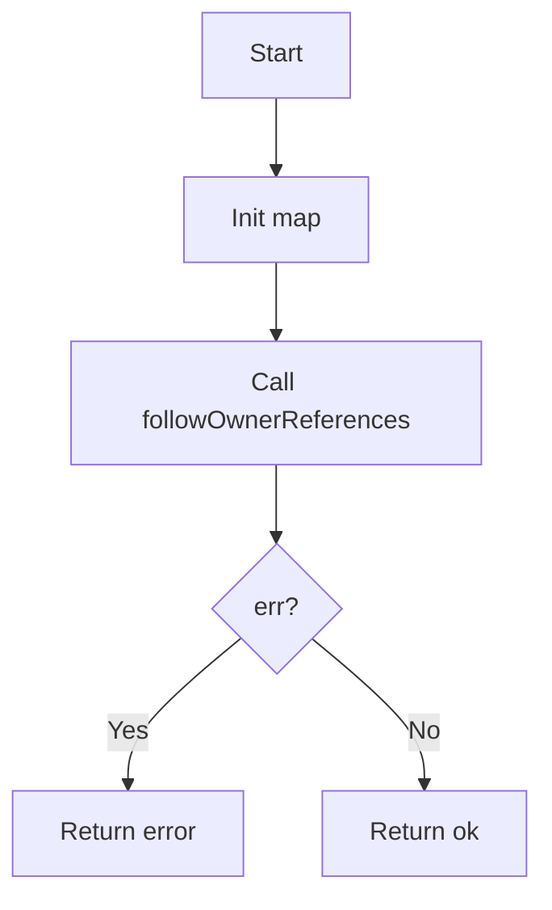
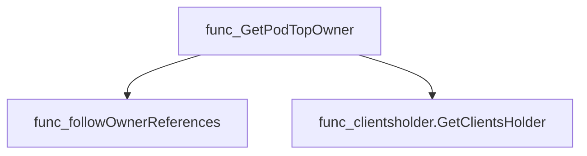
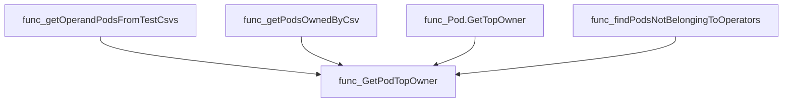
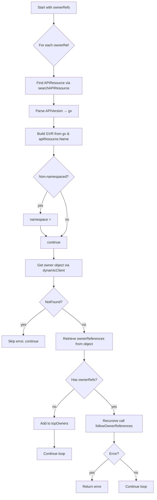
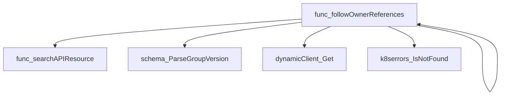
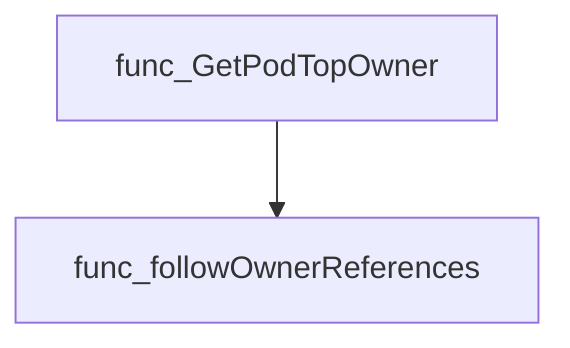
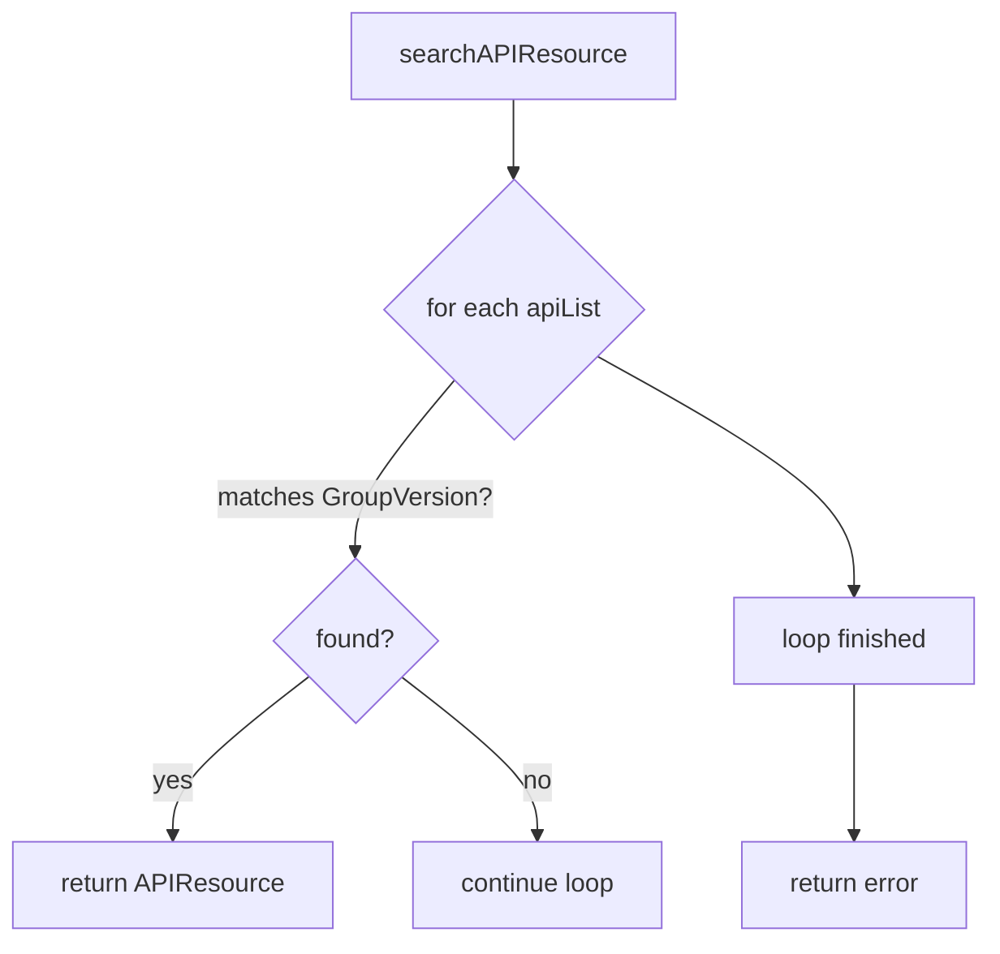
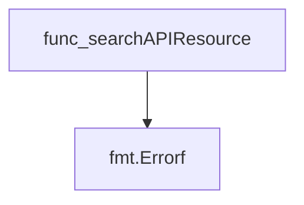
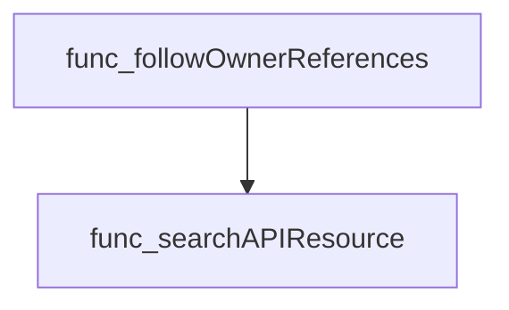

# Package podhelper

**Path**: `pkg/podhelper`

## Table of Contents

- [Overview](#overview)
- [Structs](#structs)
  - [TopOwner](#topowner)
- [Exported Functions](#exported-functions)
  - [GetPodTopOwner](#getpodtopowner)
- [Local Functions](#local-functions)
  - [followOwnerReferences](#followownerreferences)
  - [searchAPIResource](#searchapiresource)

## Overview

The podhelper package provides utilities for determining the top‑level ownership of Kubernetes Pods, enabling tests and tooling to identify which custom resources or deployments ultimately own a given pod.

### Key Features

- Walks OwnerReferences chains to map pods to their highest‑level owners
- Provides helper functions to resolve API resources dynamically
- Exposes TopOwner struct for concise owner representation

### Design Notes

- Relies on dynamic client access via internal client holder; callers must have proper permissions
- Handles missing API resources gracefully by returning informative errors
- Best practice: use GetPodTopOwner as the public entry point, keeping traversal logic private

### Structs Summary

| Name | Purpose |
|------|----------|
| [**TopOwner**](#topowner) | Represents the highest‑level owner of a Pod |

### Exported Functions Summary

| Name | Purpose |
|------|----------|
| [func GetPodTopOwner(podNamespace string, podOwnerReferences []metav1.OwnerReference) (topOwners map[string]TopOwner, err error)](#getpodtopowner) | Walks a pod’s `OwnerReferences` chain to identify the top‑level resource(s) that ultimately own the pod (e.g., a custom resource or deployment). Returns them as a map keyed by owner name. |

### Local Functions Summary

| Name | Purpose |
|------|----------|
| [func followOwnerReferences(     resourceList []*metav1.APIResourceList,     dynamicClient dynamic.Interface,     topOwners map[string]TopOwner,     namespace string,     ownerRefs []metav1.OwnerReference, ) (err error)](#followownerreferences) | Walks an ownership chain of Kubernetes objects, starting from a set of `ownerRefs`, and records the highest‑level owners in `topOwners`. |
| [func searchAPIResource(kind, apiVersion string, apis []*metav1.APIResourceList) (*metav1.APIResource, error)](#searchapiresource) | Looks through a slice of `*metav1.APIResourceList` to find the `APIResource` that matches both the specified `kind` and `apiVersion`. Returns an error if no match is found. |

## Structs

### TopOwner


#### Fields
| Field | Type   | Description |
|-------|--------|-------------|
| `APIVersion` | `string` | API version of the owning resource (e.g., `"v1"` or `"apps/v1"`). |
| `Kind`        | `string` | Kind of the owner resource (`Deployment`, `ReplicaSet`, etc.). |
| `Name`        | `string` | Name of the owner object. |
| `Namespace`   | `string` | Namespace where the owner resides; empty for cluster‑scoped resources. |

#### Purpose
The `TopOwner` struct encapsulates the essential identifying information of a pod’s top‑level controller or owning resource. It is constructed during recursive traversal of owner references (via `followOwnerReferences`) and returned by `GetPodTopOwner`. This allows callers to determine which higher‑level object ultimately governs a given pod, regardless of intermediate layers such as ReplicaSets or StatefulSets.

#### Related functions
| Function | Purpose |
|----------|---------|
| `GetPodTopOwner` | Initiates the owner reference traversal for a pod and returns a map of top owners keyed by name. |
| `followOwnerReferences` | Recursively follows owner references, populating the `topOwners` map with `TopOwner` instances when a resource has no further owners. |

---

---

## Exported Functions

### GetPodTopOwner

**GetPodTopOwner** - Walks a pod’s `OwnerReferences` chain to identify the top‑level resource(s) that ultimately own the pod (e.g., a custom resource or deployment). Returns them as a map keyed by owner name.


#### Signature (Go)

```go
func GetPodTopOwner(podNamespace string, podOwnerReferences []metav1.OwnerReference) (topOwners map[string]TopOwner, err error)
```

#### Summary Table

| Aspect | Details |
|--------|---------|
| **Purpose** | Walks a pod’s `OwnerReferences` chain to identify the top‑level resource(s) that ultimately own the pod (e.g., a custom resource or deployment). Returns them as a map keyed by owner name. |
| **Parameters** | *`podNamespace string`* – namespace of the pod.<br>*`podOwnerReferences []metav1.OwnerReference`* – list of `OwnerReference` objects attached to the pod. |
| **Return value** | *`topOwners map[string]TopOwner`* – mapping from owner name to a `TopOwner` struct containing API version, kind, name and namespace.<br>*`err error`* – error if traversal fails or required clients cannot be obtained. |
| **Key dependencies** | • `clientsholder.GetClientsHolder()` (to obtain dynamic client and resource list)<br>• `followOwnerReferences` (recursive helper that follows owner refs) |
| **Side effects** | None beyond reading Kubernetes resources; no state mutation. |
| **How it fits the package** | Provides a public entry point for other packages to resolve pod ownership without exposing the internal recursion logic. |

#### Internal workflow



#### Function dependencies



#### Functions calling `GetPodTopOwner`



#### Usage example (Go)

```go
// Minimal example invoking GetPodTopOwner
import (
    "fmt"
    metav1 "k8s.io/apimachinery/pkg/apis/meta/v1"
    podhelper "github.com/redhat-best-practices-for-k8s/certsuite/pkg/podhelper"
)

func main() {
    // Example owner references (normally from a Pod object)
    refs := []metav1.OwnerReference{
        {Kind: "Deployment", APIVersion: "apps/v1", Name: "my-deploy"},
    }

    owners, err := podhelper.GetPodTopOwner("default", refs)
    if err != nil {
        fmt.Printf("Error retrieving top owners: %v\n", err)
        return
    }
    for name, owner := range owners {
        fmt.Printf("Top owner: %s (%s/%s)\n", name, owner.Kind, owner.APIVersion)
    }
}
```

---

---

## Local Functions

### followOwnerReferences

**followOwnerReferences** - Walks an ownership chain of Kubernetes objects, starting from a set of `ownerRefs`, and records the highest‑level owners in `topOwners`.


```go
func followOwnerReferences(
    resourceList []*metav1.APIResourceList,
    dynamicClient dynamic.Interface,
    topOwners map[string]TopOwner,
    namespace string,
    ownerRefs []metav1.OwnerReference,
) (err error)
```

| Aspect | Details |
|--------|---------|
| **Purpose** | Walks an ownership chain of Kubernetes objects, starting from a set of `ownerRefs`, and records the highest‑level owners in `topOwners`. |
| **Parameters** | *`resourceList []*metav1.APIResourceList`* – Available API resources.<br>*`dynamicClient dynamic.Interface`* – Client for unstructured resource access.<br>*`topOwners map[string]TopOwner`* – Map to accumulate discovered top owners.<br>*`namespace string`* – Current namespace context (may be cleared for non‑namespaced resources).<br>*`ownerRefs []metav1.OwnerReference`* – Immediate owner references to resolve. |
| **Return value** | `error` – Nil on success; descriptive error if any lookup or parsing fails. |
| **Key dependencies** | • `searchAPIResource` (locates API resource for a kind/version)<br>• `schema.ParseGroupVersion` (parses APIVersion string)<br>• `dynamicClient.Resource(...).Get()` (fetches the owner object)<br>• `k8serrors.IsNotFound` (ignores missing objects)<br>• Recursive call to itself |
| **Side effects** | Mutates `topOwners` by adding entries for top‑level owners.<br>No I/O beyond API queries. |
| **How it fits the package** | Used by `GetPodTopOwner` to resolve the ultimate owning resources of a pod, enabling higher‑level analysis and reporting. |



#### Function dependencies



#### Functions calling `followOwnerReferences`



#### Usage example (Go)

```go
// Minimal example invoking followOwnerReferences
import (
    metav1 "k8s.io/apimachinery/pkg/apis/meta/v1"
    "k8s.io/client-go/dynamic"
)

func main() {
    // Assume resourceList, dynamicClient, and podOwnerRefs are initialized elsewhere.
    topOwners := make(map[string]TopOwner)
    err := followOwnerReferences(resourceList, dynamicClient, topOwners, "default", podOwnerRefs)
    if err != nil {
        log.Fatalf("failed to resolve owners: %v", err)
    }
    // topOwners now contains the highest‑level owners of the pod.
}
```

---

### searchAPIResource

**searchAPIResource** - Looks through a slice of `*metav1.APIResourceList` to find the `APIResource` that matches both the specified `kind` and `apiVersion`. Returns an error if no match is found.


#### Signature (Go)

```go
func searchAPIResource(kind, apiVersion string, apis []*metav1.APIResourceList) (*metav1.APIResource, error)
```

#### Summary Table

| Aspect | Details |
|--------|---------|
| **Purpose** | Looks through a slice of `*metav1.APIResourceList` to find the `APIResource` that matches both the specified `kind` and `apiVersion`. Returns an error if no match is found. |
| **Parameters** | `kind string` – Kubernetes object kind.<br>`apiVersion string` – Full API version (e.g., `"v1"` or `"apps/v1"`).<br>`apis []*metav1.APIResourceList` – List of resource lists to search. |
| **Return value** | `(*metav1.APIResource, error)` – Pointer to the matching resource or an error if not found. |
| **Key dependencies** | * `fmt.Errorf` – for constructing error messages.<br>* `metav1.APIResourceList` and `metav1.APIResource` types from Kubernetes API machinery. |
| **Side effects** | None. Pure function; no mutation of arguments or external state. |
| **How it fits the package** | Used by higher‑level helper functions (e.g., `followOwnerReferences`) to translate owner references into concrete resource definitions required for dynamic client lookups. |

#### Internal workflow



#### Function dependencies



#### Functions calling `searchAPIResource`



#### Usage example (Go)

```go
// Minimal example invoking searchAPIResource
package main

import (
	"fmt"

	corev1 "k8s.io/api/core/v1"
	metav1 "k8s.io/apimachinery/pkg/apis/meta/v1"
)

func main() {
	// Pretend we have a list of API resources (normally fetched from the server)
	apiList := &metav1.APIResourceList{
		GroupVersion: "v1",
		APIResources: []metav1.APIResource{
			{Name: "pods", Kind: corev1.Pod{}.Kind, Namespaced: true},
		},
	}
	resources := []*metav1.APIResourceList{apiList}

	resource, err := searchAPIResource("Pod", "v1", resources)
	if err != nil {
		fmt.Printf("Error: %v\n", err)
		return
	}
	fmt.Printf("Found resource: %+v\n", resource)
}
```

---

