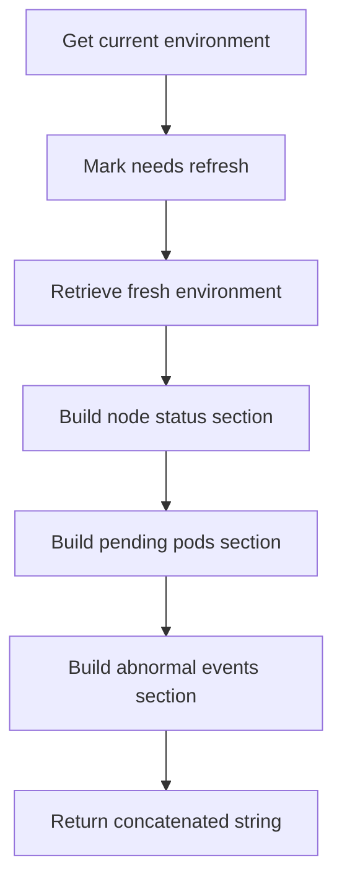
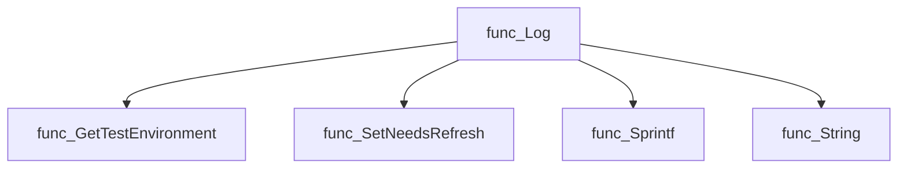
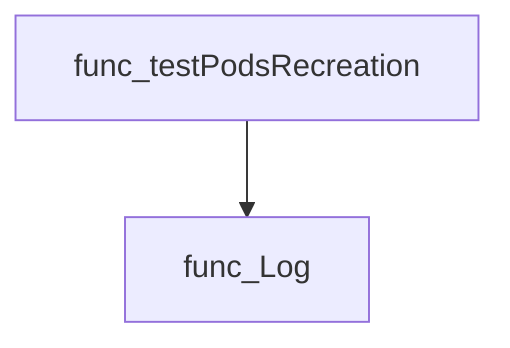

# Package postmortem

**Path**: `pkg/postmortem`

## Table of Contents

- [Overview](#overview)
- [Exported Functions](#exported-functions)
  - [Log](#log)

## Overview

The postmortem package generates a human‑readable report summarizing the state of a test environment after a run. It gathers node taints, pending pods, and abnormal events to help diagnose failures.

### Key Features

- Collects diagnostic data from the latest test environment via provider.GetTestEnvironment
- Formats the collected information into a readable string
- Allows optional refresh of cached environment data

### Design Notes

- Assumes provider exposes current test environment; errors are ignored in Log for simplicity
- Log does not expose detailed structs, keeping API surface minimal
- Best practice: call Log after each test run to capture state before cleanup

### Exported Functions Summary

| Name | Purpose |
|------|----------|
| [func Log() (out string)](#log) | Builds a human‑readable report containing node taints, pending pods, and abnormal events from the latest test environment. |

## Exported Functions

### Log

**Log** - Builds a human‑readable report containing node taints, pending pods, and abnormal events from the latest test environment.


#### Signature (Go)

```go
func Log() (out string)
```

#### Summary Table

| Aspect | Details |
|--------|---------|
| **Purpose** | Builds a human‑readable report containing node taints, pending pods, and abnormal events from the latest test environment. |
| **Parameters** | None |
| **Return value** | `string` – multiline diagnostic text |
| **Key dependencies** | • `provider.GetTestEnvironment()` <br>• `env.SetNeedsRefresh()` <br>• `fmt.Sprintf` <br>• `p.String()`, `e.String()` methods |
| **Side effects** | * Reads the current environment (no mutation). <br>* Calls `SetNeedsRefresh` to flag that a fresh snapshot is required. |
| **How it fits the package** | Supplies post‑mortem data for test diagnostics, invoked by tests when they need detailed context after failures. |

#### Internal workflow



#### Function dependencies



#### Functions calling `Log`



#### Usage example (Go)

```go
// Minimal example invoking Log()
package main

import (
	"fmt"
	"github.com/redhat-best-practices-for-k8s/certsuite/pkg/postmortem"
)

func main() {
	report := postmortem.Log()
	fmt.Println(report)
}
```

---

