# Package provider

**Path**: `pkg/provider`

## Table of Contents

- [Overview](#overview)
- [Structs](#structs)
  - [CniNetworkInterface](#cninetworkinterface)
  - [Container](#container)
  - [ContainerImageIdentifier](#containerimageidentifier)
  - [CrScale](#crscale)
  - [CsvInstallPlan](#csvinstallplan)
  - [Deployment](#deployment)
  - [Event](#event)
  - [MachineConfig](#machineconfig)
  - [Node](#node)
  - [Operator](#operator)
  - [Pod](#pod)
  - [PreflightResultsDB](#preflightresultsdb)
  - [PreflightTest](#preflighttest)
  - [ScaleObject](#scaleobject)
  - [StatefulSet](#statefulset)
  - [TestEnvironment](#testenvironment)
- [Exported Functions](#exported-functions)
  - [AreCPUResourcesWholeUnits](#arecpuresourceswholeunits)
  - [AreResourcesIdentical](#areresourcesidentical)
  - [Container.GetUID](#container.getuid)
  - [Container.HasExecProbes](#container.hasexecprobes)
  - [Container.HasIgnoredContainerName](#container.hasignoredcontainername)
  - [Container.IsContainerRunAsNonRoot](#container.iscontainerrunasnonroot)
  - [Container.IsContainerRunAsNonRootUserID](#container.iscontainerrunasnonrootuserid)
  - [Container.IsIstioProxy](#container.isistioproxy)
  - [Container.IsReadOnlyRootFilesystem](#container.isreadonlyrootfilesystem)
  - [Container.IsTagEmpty](#container.istagempty)
  - [Container.SetPreflightResults](#container.setpreflightresults)
  - [Container.String](#container.string)
  - [Container.StringLong](#container.stringlong)
  - [ConvertArrayPods](#convertarraypods)
  - [CrScale.IsScaleObjectReady](#crscale.isscaleobjectready)
  - [CrScale.ToString](#crscale.tostring)
  - [CsvToString](#csvtostring)
  - [Deployment.IsDeploymentReady](#deployment.isdeploymentready)
  - [Deployment.ToString](#deployment.tostring)
  - [Event.String](#event.string)
  - [GetAllOperatorGroups](#getalloperatorgroups)
  - [GetCatalogSourceBundleCount](#getcatalogsourcebundlecount)
  - [GetPciPerPod](#getpciperpod)
  - [GetPodIPsPerNet](#getpodipspernet)
  - [GetPreflightResultsDB](#getpreflightresultsdb)
  - [GetRuntimeUID](#getruntimeuid)
  - [GetTestEnvironment](#gettestenvironment)
  - [GetUpdatedCrObject](#getupdatedcrobject)
  - [GetUpdatedDeployment](#getupdateddeployment)
  - [GetUpdatedStatefulset](#getupdatedstatefulset)
  - [IsOCPCluster](#isocpcluster)
  - [LoadBalancingDisabled](#loadbalancingdisabled)
  - [NewContainer](#newcontainer)
  - [NewEvent](#newevent)
  - [NewPod](#newpod)
  - [Node.GetCSCOSVersion](#node.getcscosversion)
  - [Node.GetRHCOSVersion](#node.getrhcosversion)
  - [Node.GetRHELVersion](#node.getrhelversion)
  - [Node.HasWorkloadDeployed](#node.hasworkloaddeployed)
  - [Node.IsCSCOS](#node.iscscos)
  - [Node.IsControlPlaneNode](#node.iscontrolplanenode)
  - [Node.IsHyperThreadNode](#node.ishyperthreadnode)
  - [Node.IsRHCOS](#node.isrhcos)
  - [Node.IsRHEL](#node.isrhel)
  - [Node.IsRTKernel](#node.isrtkernel)
  - [Node.IsWorkerNode](#node.isworkernode)
  - [Node.MarshalJSON](#node.marshaljson)
  - [Operator.SetPreflightResults](#operator.setpreflightresults)
  - [Operator.String](#operator.string)
  - [Pod.AffinityRequired](#pod.affinityrequired)
  - [Pod.CheckResourceHugePagesSize](#pod.checkresourcehugepagessize)
  - [Pod.ContainsIstioProxy](#pod.containsistioproxy)
  - [Pod.CreatedByDeploymentConfig](#pod.createdbydeploymentconfig)
  - [Pod.GetRunAsNonRootFalseContainers](#pod.getrunasnonrootfalsecontainers)
  - [Pod.GetTopOwner](#pod.gettopowner)
  - [Pod.HasHugepages](#pod.hashugepages)
  - [Pod.HasNodeSelector](#pod.hasnodeselector)
  - [Pod.IsAffinityCompliant](#pod.isaffinitycompliant)
  - [Pod.IsAutomountServiceAccountSetOnSA](#pod.isautomountserviceaccountsetonsa)
  - [Pod.IsCPUIsolationCompliant](#pod.iscpuisolationcompliant)
  - [Pod.IsPodGuaranteed](#pod.ispodguaranteed)
  - [Pod.IsPodGuaranteedWithExclusiveCPUs](#pod.ispodguaranteedwithexclusivecpus)
  - [Pod.IsRunAsUserID](#pod.isrunasuserid)
  - [Pod.IsRuntimeClassNameSpecified](#pod.isruntimeclassnamespecified)
  - [Pod.IsShareProcessNamespace](#pod.isshareprocessnamespace)
  - [Pod.IsUsingClusterRoleBinding](#pod.isusingclusterrolebinding)
  - [Pod.IsUsingSRIOV](#pod.isusingsriov)
  - [Pod.IsUsingSRIOVWithMTU](#pod.isusingsriovwithmtu)
  - [Pod.String](#pod.string)
  - [StatefulSet.IsStatefulSetReady](#statefulset.isstatefulsetready)
  - [StatefulSet.ToString](#statefulset.tostring)
  - [TestEnvironment.GetAffinityRequiredPods](#testenvironment.getaffinityrequiredpods)
  - [TestEnvironment.GetBaremetalNodes](#testenvironment.getbaremetalnodes)
  - [TestEnvironment.GetCPUPinningPodsWithDpdk](#testenvironment.getcpupinningpodswithdpdk)
  - [TestEnvironment.GetDockerConfigFile](#testenvironment.getdockerconfigfile)
  - [TestEnvironment.GetGuaranteedPodContainersWithExclusiveCPUs](#testenvironment.getguaranteedpodcontainerswithexclusivecpus)
  - [TestEnvironment.GetGuaranteedPodContainersWithExclusiveCPUsWithoutHostPID](#testenvironment.getguaranteedpodcontainerswithexclusivecpuswithouthostpid)
  - [TestEnvironment.GetGuaranteedPodContainersWithIsolatedCPUsWithoutHostPID](#testenvironment.getguaranteedpodcontainerswithisolatedcpuswithouthostpid)
  - [TestEnvironment.GetGuaranteedPods](#testenvironment.getguaranteedpods)
  - [TestEnvironment.GetGuaranteedPodsWithExclusiveCPUs](#testenvironment.getguaranteedpodswithexclusivecpus)
  - [TestEnvironment.GetGuaranteedPodsWithIsolatedCPUs](#testenvironment.getguaranteedpodswithisolatedcpus)
  - [TestEnvironment.GetHugepagesPods](#testenvironment.gethugepagespods)
  - [TestEnvironment.GetMasterCount](#testenvironment.getmastercount)
  - [TestEnvironment.GetNonGuaranteedPodContainersWithoutHostPID](#testenvironment.getnonguaranteedpodcontainerswithouthostpid)
  - [TestEnvironment.GetNonGuaranteedPods](#testenvironment.getnonguaranteedpods)
  - [TestEnvironment.GetOfflineDBPath](#testenvironment.getofflinedbpath)
  - [TestEnvironment.GetPodsUsingSRIOV](#testenvironment.getpodsusingsriov)
  - [TestEnvironment.GetPodsWithoutAffinityRequiredLabel](#testenvironment.getpodswithoutaffinityrequiredlabel)
  - [TestEnvironment.GetShareProcessNamespacePods](#testenvironment.getshareprocessnamespacepods)
  - [TestEnvironment.GetWorkerCount](#testenvironment.getworkercount)
  - [TestEnvironment.IsIntrusive](#testenvironment.isintrusive)
  - [TestEnvironment.IsPreflightInsecureAllowed](#testenvironment.ispreflightinsecureallowed)
  - [TestEnvironment.IsSNO](#testenvironment.issno)
  - [TestEnvironment.SetNeedsRefresh](#testenvironment.setneedsrefresh)
- [Local Functions](#local-functions)
  - [addOperandPodsToTestPods](#addoperandpodstotestpods)
  - [addOperatorPodsToTestPods](#addoperatorpodstotestpods)
  - [buildContainerImageSource](#buildcontainerimagesource)
  - [buildTestEnvironment](#buildtestenvironment)
  - [createNodes](#createnodes)
  - [createOperators](#createoperators)
  - [deployDaemonSet](#deploydaemonset)
  - [filterDPDKRunningPods](#filterdpdkrunningpods)
  - [filterPodsWithoutHostPID](#filterpodswithouthostpid)
  - [getAtLeastOneCsv](#getatleastonecsv)
  - [getAtLeastOneInstallPlan](#getatleastoneinstallplan)
  - [getAtLeastOneSubscription](#getatleastonesubscription)
  - [getCNCFNetworksNamesFromPodAnnotation](#getcncfnetworksnamesfrompodannotation)
  - [getCatalogSourceBundleCountFromPackageManifests](#getcatalogsourcebundlecountfrompackagemanifests)
  - [getCatalogSourceBundleCountFromProbeContainer](#getcatalogsourcebundlecountfromprobecontainer)
  - [getCatalogSourceImageIndexFromInstallPlan](#getcatalogsourceimageindexfrominstallplan)
  - [getContainers](#getcontainers)
  - [getMachineConfig](#getmachineconfig)
  - [getOperatorTargetNamespaces](#getoperatortargetnamespaces)
  - [getPackageManifestWithSubscription](#getpackagemanifestwithsubscription)
  - [getPodContainers](#getpodcontainers)
  - [getSummaryAllOperators](#getsummaryalloperators)
  - [getUniqueCsvListByName](#getuniquecsvlistbyname)
  - [isNetworkAttachmentDefinitionConfigTypeSRIOV](#isnetworkattachmentdefinitionconfigtypesriov)
  - [isNetworkAttachmentDefinitionSRIOVConfigMTUSet](#isnetworkattachmentdefinitionsriovconfigmtuset)
  - [isSkipHelmChart](#isskiphelmchart)
  - [searchPodInSlice](#searchpodinslice)
  - [sriovNetworkUsesMTU](#sriovnetworkusesmtu)
  - [updateCrUnderTest](#updatecrundertest)

## Overview

The provider package implements the core logic for gathering and analysing Kubernetes/Openshift cluster state used by CertSuite. It defines data structures that wrap API objects (Pods, Nodes, Operators, etc.), utilities for interpreting resource requests, CPU isolation rules, network attachment information, pre‑flight checks, and metrics about operator status.

### Key Features

- Extends native k8s types with test‑specific metadata and helper methods such as Pod.IsPodGuaranteed or Container.HasExecProbes
- Implements comprehensive discovery of cluster objects (pods, nodes, operators, CRDs) and exposes them via the TestEnvironment singleton
- Provides utilities for parsing CNI annotations, hugepage usage, SR‑IOV configuration, and running preflight checks against container images

### Design Notes

- The TestEnvironment is a lazily initialized global that caches discovery results; callers should invoke GetTestEnvironment to obtain it
- Pod/Container methods rely on embedded core types but expose domain logic through small, well‑named functions to aid readability
- Large amounts of string constants (e.g., label names) are defined at package level for reuse and to avoid magic strings

### Structs Summary

| Name | Purpose |
|------|----------|
| [**CniNetworkInterface**](#cninetworkinterface) | Struct definition |
| [**Container**](#container) | One‑line purpose |
| [**ContainerImageIdentifier**](#containerimageidentifier) | Struct definition |
| [**CrScale**](#crscale) | Struct definition |
| [**CsvInstallPlan**](#csvinstallplan) | Struct definition |
| [**Deployment**](#deployment) | Wrapper around a Kubernetes Deployment object |
| [**Event**](#event) | One-line purpose |
| [**MachineConfig**](#machineconfig) | Struct definition |
| [**Node**](#node) | Wrapper around a Kubernetes node with optional machine‑configuration data |
| [**Operator**](#operator) | One-line purpose |
| [**Pod**](#pod) | Represents a Kubernetes pod with extended test‑specific metadata |
| [**PreflightResultsDB**](#preflightresultsdb) | Container pre‑flight test results |
| [**PreflightTest**](#preflighttest) | One-line purpose |
| [**ScaleObject**](#scaleobject) | Holds scaling configuration for a custom resource |
| [**StatefulSet**](#statefulset) | One-line purpose |
| [**TestEnvironment**](#testenvironment) | Holds the state of a test run |

### Exported Functions Summary

| Name | Purpose |
|------|----------|
| [func AreCPUResourcesWholeUnits(p *Pod) bool](#arecpuresourceswholeunits) | Determines whether every container in the given `*Pod` specifies CPU requests and limits that are multiples of 1000 milli‑CPUs (i.e., whole cores). If any value is missing or not a multiple of 1000, it logs a debug message and returns `false`. |
| [func AreResourcesIdentical(p *Pod) bool](#areresourcesidentical) | Ensures each container in the supplied `*Pod` has matching CPU and memory requests and limits. Returns `true` only if all containers meet this condition; otherwise, it logs a debug message and returns `false`. |
| [func (c *Container) GetUID() (string, error)](#container.getuid) | Extracts the UID of a running container from its status and logs diagnostic information. |
| [func (c *Container) HasExecProbes() bool](#container.hasexecprobes) | Returns `true` when the container defines at least one probe that uses an executable command (`Exec`) for liveness, readiness, or startup checks. |
| [func (c *Container) HasIgnoredContainerName() bool](#container.hasignoredcontainername) | Determines if the current container is in an ignore list, including Istio proxy containers. |
| [func (c *Container) IsContainerRunAsNonRoot(podRunAsNonRoot *bool) (isContainerRunAsNonRoot bool, reason string)](#container.iscontainerrunasnonroot) | Returns whether the container is configured to run as a non‑root user and explains how that value was derived. |
| [func (*int64) (bool, string)](#container.iscontainerrunasnonrootuserid) | Checks whether the container’s `RunAsUser` security context indicates it runs as a non‑root user. It also explains how pod‑level defaults are applied when the container level is unspecified. |
| [func (c *Container) IsIstioProxy() bool](#container.isistioproxy) | Checks whether the container represents the Istio side‑car proxy by comparing its name to a predefined constant. |
| [func (c *Container) IsReadOnlyRootFilesystem(logger *log.Logger) bool](#container.isreadonlyrootfilesystem) | Checks whether the `SecurityContext.ReadOnlyRootFilesystem` flag of a container is set to `true`. |
| [func (c *Container) IsTagEmpty() bool](#container.istagempty) | Checks whether the `Tag` field of the container’s image identifier is an empty string, indicating that no specific tag was supplied. |
| [func (c *Container) SetPreflightResults(preflightImageCache map[string]PreflightResultsDB, env *TestEnvironment) error](#container.setpreflightresults) | Runs the OpenShift‑preflight checks against a container image, caches the results per image, and stores them in the `Container` instance. |
| [func (c *Container) String() string](#container.string) | Generates a concise description of a `Container` instance, including its name, pod name, and namespace. |
| [func (c *Container) StringLong() string](#container.stringlong) | Generates a descriptive string containing key metadata about a Kubernetes container, including node, namespace, pod name, container name, UID, and runtime. |
| [func ConvertArrayPods(pods []*corev1.Pod) (out []*Pod)](#convertarraypods) | Transforms each `*corev1.Pod` from the Kubernetes API into a corresponding `*Pod` value defined by the provider package, preserving all relevant metadata and network information. |
| [func (crScale CrScale) IsScaleObjectReady() bool](#crscale.isscaleobjectready) | Determines if the scale object's `Status.Replicas` equals the desired `Spec.Replicas`, indicating readiness. |
| [func (crScale CrScale) ToString() string](#crscale.tostring) | Returns a formatted string that identifies the custom resource scale, showing both its name and namespace. |
| [func CsvToString(csv *olmv1Alpha.ClusterServiceVersion) string](#csvtostring) | Creates a human‑readable representation of a CSV, showing its name and namespace. |
| [func (d *Deployment) IsDeploymentReady() bool](#deployment.isdeploymentready) | Evaluates whether the deployment satisfies all readiness conditions: an `Available` condition is present, replica counts match specifications, and no replicas are marked unavailable. |
| [func (d *Deployment) ToString() string](#deployment.tostring) | Formats the deployment’s `Name` and `Namespace` into a single descriptive string. |
| [func (e *Event) String() string](#event.string) | Returns a formatted string summarizing the event’s timestamp, involved object, reason, and message. |
| [func GetAllOperatorGroups() ([]*olmv1.OperatorGroup, error)](#getalloperatorgroups) | Queries the Kubernetes API for all `OperatorGroup` objects in the default namespace and returns a slice of pointers to them. Handles “not found” cases gracefully by returning `nil` without an error. |
| [func GetCatalogSourceBundleCount(env *TestEnvironment, cs *olmv1Alpha.CatalogSource) int](#getcatalogsourcebundlecount) | Counts the number of bundle images that belong to a given `CatalogSource`. It selects the counting strategy based on the OpenShift version: for ≤ 4.12 it queries a probe container; otherwise it tallies entries from package manifests. |
| [func GetPciPerPod(annotation string) (pciAddr []string, err error)](#getpciperpod) | Parses the JSON network‑status annotation of a pod and extracts all PCI addresses associated with its network interfaces. |
| [func GetPodIPsPerNet(annotation string) (ips map[string]CniNetworkInterface, err error)](#getpodipspernet) | Parses the `k8s.v1.cni.cncf.io/networks-status` annotation to extract all non‑default network interfaces and their IP addresses for a pod. |
| [func GetPreflightResultsDB(results *plibRuntime.Results) PreflightResultsDB](#getpreflightresultsdb) | Builds a `PreflightResultsDB` from the raw preflight runtime results, separating passed, failed and error tests into distinct slices. |
| [func GetRuntimeUID(cs *corev1.ContainerStatus) (runtime, uid string)](#getruntimeuid) | Parses the `ContainerID` field of a `ContainerStatus` to separate the runtime prefix and the unique identifier (UID). |
| [func GetTestEnvironment() TestEnvironment](#gettestenvironment) | Provides read‑only access to the singleton `env` that holds all runtime discovery data. It lazily builds the environment on first call and then returns the cached instance. |
| [func GetUpdatedCrObject(sg scale.ScalesGetter, namespace string, name string, groupResourceSchema schema.GroupResource) (*CrScale, error)](#getupdatedcrobject) | Obtains a `scalingv1.Scale` object for the specified custom resource and encapsulates it in a `CrScale`. |
| [func GetUpdatedDeployment(ac appv1client.AppsV1Interface, namespace, name string) (*Deployment, error)](#getupdateddeployment) | Fetches a Kubernetes Deployment by its namespace and name, wraps the result in the package‑specific `Deployment` type, and returns it. |
| [func GetUpdatedStatefulset(ac appv1client.AppsV1Interface, namespace, name string) (*StatefulSet, error)](#getupdatedstatefulset) | Fetches the latest Kubernetes StatefulSet identified by *namespace* and *name*, wrapping it in the package‑specific `StatefulSet` type for downstream logic. |
| [func IsOCPCluster() bool](#isocpcluster) | Checks whether the test environment represents an OpenShift cluster by comparing the stored version string to a sentinel value for non‑OpenShift clusters. |
| [func LoadBalancingDisabled(p *Pod) bool](#loadbalancingdisabled) | Determines if both the `cpu-load-balancing.crio.io` and `irq-load-balancing.crio.io` annotations on a pod are set to `"disable"`. If either annotation is missing or has an invalid value, it logs a debug message and returns `false`. |
| [func NewContainer() *Container](#newcontainer) | Initializes a fresh `Container` struct, embedding an empty `corev1.Container` to serve as the foundation for further configuration. |
| [func NewEvent(aEvent *corev1.Event) (out Event)](#newevent) | Creates an `Event` wrapper around a Kubernetes core event, preserving the original object for further use. |
| [func NewPod(aPod *corev1.Pod) (out Pod)](#newpod) | Wraps a raw Kubernetes `Pod` into the library’s `Pod` type, enriching it with network interface data and container metadata. |
| [func (node *Node) GetCSCOSVersion() (string, error)](#node.getcscosversion) | Extracts and returns the CoreOS (CentOS Stream CoreOS) version string from a node’s OS image field. It validates that the node is running a supported CoreOS distribution before parsing. |
| [func (node *Node) GetRHCOSVersion() (string, error)](#node.getrhcosversion) | Extracts the concise Red Hat Enterprise Linux CoreOS (RHCOS) version from a node’s OS image string. It validates that the node is running RHCOS and converts the full “long” version to its short form. |
| [func (node *Node) GetRHELVersion() (string, error)](#node.getrhelversion) | Returns the Red Hat Enterprise Linux (RHEL) release number extracted from the node’s OS image string. |
| [func (node *Node) HasWorkloadDeployed(podsUnderTest []*Pod) bool](#node.hasworkloaddeployed) | Returns `true` if at least one Pod in `podsUnderTest` has its `Spec.NodeName` equal to the Node’s name, indicating that a workload is running on this node. Otherwise returns `false`. |
| [func (node *Node) IsCSCOS() bool](#node.iscscos) | Returns `true` when the node’s operating system image indicates it is running CoreOS. The check trims surrounding whitespace and looks for a predefined identifier (`cscosName`). |
| [func (node *Node) IsControlPlaneNode() bool](#node.iscontrolplanenode) | Returns `true` if the node has at least one label that matches any of the predefined control‑plane labels. |
| [func (node *Node) IsHyperThreadNode(env *TestEnvironment) (bool, error)](#node.ishyperthreadnode) | Checks whether the node identified by `node` has more than one thread per core by inspecting its probe pod. |
| [func (node *Node) IsRHCOS() bool](#node.isrhcos) | Determines whether the operating system image of a Kubernetes node corresponds to Red Hat Enterprise Linux CoreOS (RHCOS). |
| [func (node *Node) IsRHEL() bool](#node.isrhel) | Determines whether the node’s operating system image is a Red Hat Enterprise Linux (RHEL) release. |
| [func (node *Node) IsRTKernel() bool](#node.isrtkernel) | Checks whether the node’s kernel version string contains the substring “rt”, indicating a real‑time kernel. |
| [func (node *Node) IsWorkerNode() bool](#node.isworkernode) | Returns `true` if the node’s labels contain any key that matches one of the predefined worker‑label identifiers. |
| [func (node Node) MarshalJSON() ([]byte, error)](#node.marshaljson) | Provides JSON encoding of the `Node.Data` field, enabling a `Node` value to be marshaled directly by `encoding/json`. |
| [func (op *Operator) SetPreflightResults(env *TestEnvironment) error](#operator.setpreflightresults) | Executes a Preflight container check against the operator’s bundle and index images, collects the results, logs output, and assigns them to `op.PreflightResults`. Skips execution if no install plans are present. |
| [func (op *Operator) String() string](#operator.string) | Formats the fields of an `Operator` instance into a single string for logging or debugging. |
| [func (p *Pod) AffinityRequired() bool](#pod.affinityrequired) | Checks the pod’s labels for the key `AffinityRequiredKey`. If present, parses its string value as a boolean and returns that result. Defaults to `false` if the label is absent or invalid. |
| [func (p *Pod) CheckResourceHugePagesSize(size string) bool](#pod.checkresourcehugepagessize) | Ensures every `hugepages-*` resource request and limit in the pod’s containers matches the supplied `size`. If any huge‑page resource differs, it returns `false`; otherwise `true`. |
| [func (p *Pod) ContainsIstioProxy() bool](#pod.containsistioproxy) | Determines whether any container in the pod has the name specified by `IstioProxyContainerName`. |
| [func (p *Pod) CreatedByDeploymentConfig() (bool, error)](#pod.createdbydeploymentconfig) | Determines whether the pod originates from an OpenShift `DeploymentConfig` by traversing owner references through a `ReplicationController`. |
| [func (p *Pod) GetRunAsNonRootFalseContainers(knownContainersToSkip map[string]bool) ([]*Container, []string)](#pod.getrunasnonrootfalsecontainers) | Returns containers that either have `securityContext.runAsNonRoot` set to false or `securityContext.runAsUser` set to 0 (both indicating a root user). Pod‑level defaults are respected if container values are missing. |
| [func (p *Pod) GetTopOwner() (topOwners map[string]podhelper.TopOwner, err error)](#pod.gettopowner) | Returns a mapping of top‑level owner identifiers to `podhelper.TopOwner` structs for the Pod instance. |
| [func (p *Pod) HasHugepages() bool](#pod.hashugepages) | Determines whether any container within the pod requests or limits a hugepage resource. |
| [func (p *Pod) HasNodeSelector() bool](#pod.hasnodeselector) | Determines if the pod’s specification includes at least one key/value pair in `Spec.NodeSelector`, indicating that it targets specific nodes. |
| [func (p *Pod) IsAffinityCompliant() (bool, error)](#pod.isaffinitycompliant) | Validates that a pod has appropriate affinity rules when an `AffinityRequired` flag is set; returns `true` if compliant, otherwise `false` with descriptive error. |
| [func (p *Pod) IsAutomountServiceAccountSetOnSA() (*bool, error)](#pod.isautomountserviceaccountsetonsa) | Determines whether the `AutomountServiceAccountToken` field is set for the service account associated with the pod. |
| [func (p *Pod) IsCPUIsolationCompliant() bool](#pod.iscpuisolationcompliant) | Checks that the pod has correct annotations for disabling CPU and IRQ load balancing and specifies a runtime class name, indicating compliance with CPU isolation requirements. |
| [func (p *Pod) IsPodGuaranteed() bool](#pod.ispodguaranteed) | Checks whether all containers in the pod have identical CPU and memory requests and limits, thereby qualifying the pod for the *Guaranteed* QoS class. |
| [func (p *Pod) IsPodGuaranteedWithExclusiveCPUs() bool](#pod.ispodguaranteedwithexclusivecpus) | Checks that all containers in a pod request and limit the same integer number of CPUs (no fractional milli‑CPU values). |
| [func (p *Pod) IsRunAsUserID(uid int64) bool](#pod.isrunasuserid) | Determines whether the `Pod`’s security context is configured to run as a specific user ID. |
| [func (p *Pod) IsRuntimeClassNameSpecified() bool](#pod.isruntimeclassnamespecified) | Determines if the pod’s spec contains a non‑nil `RuntimeClassName`, indicating that a runtime class has been specified. |
| [func (p *Pod) IsShareProcessNamespace() bool](#pod.isshareprocessnamespace) | Determines if a pod is configured to share its process namespace with other pods in the same pod. This is used for selecting pods that have `shareProcessNamespace: true` set in their spec. |
| [func (p *Pod) IsUsingClusterRoleBinding(clusterRoleBindings []rbacv1.ClusterRoleBinding, logger *log.Logger) (bool, string, error)](#pod.isusingclusterrolebinding) | Checks whether the pod’s service account is referenced as a subject in any provided `ClusterRoleBinding`. Returns a flag, the name of the bound role, and an error if logging fails. |
| [func (p *Pod) IsUsingSRIOV() (bool, error)](#pod.isusingsriov) | Returns `true` when at least one of the pod’s attached networks is configured as SR‑I/O‑V. It inspects the pod’s CNCF CNI annotation and checks each referenced NetworkAttachmentDefinition (NAD). |
| [func (p *Pod) IsUsingSRIOVWithMTU() (bool, error)](#pod.isusingsriovwithmtu) | Returns `true` when any network attachment of the pod is an SR‑IOV type and its MTU has been set via the corresponding `SriovNetworkNodePolicy`. |
| [func (p *Pod) String() string](#pod.string) | Provide a concise string representation of a `Pod`, useful for logging and debugging. |
| [func (ss *StatefulSet) IsStatefulSetReady() bool](#statefulset.isstatefulsetready) | Determines if the StatefulSet’s current status matches the specified number of replicas. It ensures that all replicas are ready, running, and updated. |
| [func (ss *StatefulSet) ToString() string](#statefulset.tostring) | Produces a human‑readable representation of a StatefulSet, including its name and namespace. |
| [func (env *TestEnvironment) GetAffinityRequiredPods() []*Pod](#testenvironment.getaffinityrequiredpods) | Returns a slice of `*Pod` objects from the test environment that have an affinity requirement. |
| [func (env *TestEnvironment) GetBaremetalNodes() []Node](#testenvironment.getbaremetalnodes) | Filters the `TestEnvironment.Nodes` slice and returns only those whose provider ID indicates a bare‑metal host (`"baremetalhost://"` prefix). |
| [func (env *TestEnvironment) GetCPUPinningPodsWithDpdk() []*Pod](#testenvironment.getcpupinningpodswithdpdk) | Retrieves all pods in the test environment that have CPU pinning enabled and are using DPDK for networking. |
| [func (env *TestEnvironment) GetDockerConfigFile() string](#testenvironment.getdockerconfigfile) | Returns the file path to the Docker configuration JSON used for preflight checks. |
| [func (env *TestEnvironment) GetGuaranteedPodContainersWithExclusiveCPUs() []*Container](#testenvironment.getguaranteedpodcontainerswithexclusivecpus) | Returns a slice of `*Container` objects that belong to pods having exclusive CPU guarantees within the test environment. |
| [func (env *TestEnvironment) GetGuaranteedPodContainersWithExclusiveCPUsWithoutHostPID() []*Container](#testenvironment.getguaranteedpodcontainerswithexclusivecpuswithouthostpid) | Returns a slice of `*Container` objects belonging to pods that are guaranteed to use exclusive CPUs and have the host PID feature disabled. |
| [func (env *TestEnvironment) GetGuaranteedPodContainersWithIsolatedCPUsWithoutHostPID() []*Container](#testenvironment.getguaranteedpodcontainerswithisolatedcpuswithouthostpid) | Returns a slice of `*Container` objects belonging to pods that are guaranteed, use isolated CPUs, and do not set the HostPID flag. |
| [func (env *TestEnvironment) GetGuaranteedPods() []*Pod](#testenvironment.getguaranteedpods) | Filters and returns all pods in the test environment that satisfy the “guaranteed” criteria defined by `Pod.IsPodGuaranteed`. |
| [func (env *TestEnvironment) GetGuaranteedPodsWithExclusiveCPUs() []*Pod](#testenvironment.getguaranteedpodswithexclusivecpus) | Filters the `TestEnvironment`’s pod list to include only those pods that are guaranteed to have exclusive CPUs. |
| [func (env *TestEnvironment) GetGuaranteedPodsWithIsolatedCPUs() []*Pod](#testenvironment.getguaranteedpodswithisolatedcpus) | Filters the environment’s pod list to return only those that are guaranteed to run on exclusive CPU units and comply with CPU‑isolation requirements. |
| [func (env *TestEnvironment) GetHugepagesPods() []*Pod](#testenvironment.gethugepagespods) | Filters the pods stored in a `TestEnvironment` to return only those that declare huge‑page memory requests or limits. |
| [func (env *TestEnvironment) GetMasterCount() int](#testenvironment.getmastercount) | Determines how many nodes in the test environment are designated as master (control‑plane) nodes. |
| [func (env *TestEnvironment) GetNonGuaranteedPodContainersWithoutHostPID() []*Container](#testenvironment.getnonguaranteedpodcontainerswithouthostpid) | Returns a slice of `*Container` objects belonging to pods that are not guaranteed and have the `HostPID` feature disabled. |
| [func (env *TestEnvironment) GetNonGuaranteedPods() []*Pod](#testenvironment.getnonguaranteedpods) | Returns all pods in the environment that are not guaranteed, i.e., whose resource requests do not match limits. |
| [func (env *TestEnvironment) GetOfflineDBPath() string](#testenvironment.getofflinedbpath) | Returns the filesystem location of the offline database used by the test environment. |
| [func (env *TestEnvironment) GetPodsUsingSRIOV() ([]*Pod, error)](#testenvironment.getpodsusingsriov) | Returns all `Pod` instances in the test environment that are configured to use SR‑IOV networking. |
| [func (TestEnvironment) GetPodsWithoutAffinityRequiredLabel()([]*Pod)](#testenvironment.getpodswithoutaffinityrequiredlabel) | GetPodsWithoutAffinityRequiredLabel returns a slice of Pod objects that do not have the affinity required label. It iterates over the Pods in the TestEnvironment and filters out the ones that do not have the affinity required label. The filtered Pods are returned as a slice. |
| [func (env *TestEnvironment) GetShareProcessNamespacePods() []*Pod](#testenvironment.getshareprocessnamespacepods) | Returns all `Pod` instances within the environment whose `Spec.ShareProcessNamespace` flag is set to true. |
| [func (env *TestEnvironment) GetWorkerCount() int](#testenvironment.getworkercount) | Counts how many nodes within the `TestEnvironment` are designated as worker nodes. |
| [func (env *TestEnvironment) IsIntrusive() bool](#testenvironment.isintrusive) | Exposes whether the current `TestEnvironment` is configured to run intrusive tests. |
| [func (env *TestEnvironment) IsPreflightInsecureAllowed() bool](#testenvironment.ispreflightinsecureallowed) | Returns whether the test environment allows insecure network connections when running Preflight checks. |
| [func (env *TestEnvironment) IsSNO() bool](#testenvironment.issno) | Checks whether the current `TestEnvironment` consists of exactly one node, indicating a Single‑Node OpenShift (SNO) configuration. |
| [func (env *TestEnvironment) SetNeedsRefresh()](#testenvironment.setneedsrefresh) | Flags that the current test environment has become stale and must be refreshed before subsequent use. |

### Local Functions Summary

| Name | Purpose |
|------|----------|
| [func addOperandPodsToTestPods(operandPods []*Pod, env *TestEnvironment)](#addoperandpodstotestpods) | Incorporates operand pods into the environment’s pod collection, ensuring duplicates are avoided and proper flags are set. |
| [func addOperatorPodsToTestPods(operatorPods []*Pod, env *TestEnvironment) {}](#addoperatorpodstotestpods) | Ensures that all operator pods are represented in the environment’s pod collection. If a pod is already present it is marked as an operator; otherwise it is appended to the list. |
| [func buildContainerImageSource(urlImage, urlImageID string) (source ContainerImageIdentifier)](#buildcontainerimagesource) | Parses the container image URL and the runtime‑reported image ID to populate a `ContainerImageIdentifier` struct with registry, repository, tag, and digest information. |
| [func buildTestEnvironment()](#buildtestenvironment) | Initializes global test environment state, loads configuration, deploys probe daemonset (if possible), performs autodiscovery of cluster resources, and populates the `env` variable with all discovered data. |
| [func createNodes(nodes []corev1.Node) map[string]Node](#createnodes) | Converts a slice of Kubernetes `Node` objects into a map keyed by node name, optionally enriching each entry with its MachineConfig when running on an OpenShift cluster. |
| [func createOperators(     csvs []*olmv1Alpha.ClusterServiceVersion,     allSubscriptions []olmv1Alpha.Subscription,     allPackageManifests []*olmpkgv1.PackageManifest,     allInstallPlans []*olmv1Alpha.InstallPlan,     allCatalogSources []*olmv1Alpha.CatalogSource,     succeededRequired bool,     keepCsvDetails bool) []*Operator](#createoperators) | Builds a slice of `*Operator` objects that summarize each unique ClusterServiceVersion (CSV). It enriches operators with subscription, install‑plan, and namespace information. |
| [func deployDaemonSet(namespace string) error](#deploydaemonset) | Ensures that the CertSuite probe daemon set is running in the specified Kubernetes namespace. If it already exists and is ready, the function exits immediately; otherwise it creates the daemon set and waits for readiness. |
| [func filterDPDKRunningPods(pods []*Pod) []*Pod](#filterdpdkrunningpods) | From a list of pods, return only those whose first Multus PCI address contains the DPDK driver `vfio-pci`. |
| [func filterPodsWithoutHostPID(pods []*Pod) []*Pod](#filterpodswithouthostpid) | Returns a slice containing only the pods from the input list whose `Spec.HostPID` field is false, effectively excluding any pod that shares the host’s PID namespace. |
| [func getAtLeastOneCsv(csv *olmv1Alpha.ClusterServiceVersion, installPlan *olmv1Alpha.InstallPlan) (atLeastOneCsv bool)](#getatleastonecsv) | Checks whether the provided `InstallPlan` references the specified `ClusterServiceVersion`. It verifies that the CSV name appears in the plan’s list and that the plan has bundle lookup data. |
| [func getAtLeastOneInstallPlan(     op *Operator,     csv *olmv1Alpha.ClusterServiceVersion,     allInstallPlans []*olmv1Alpha.InstallPlan,     allCatalogSources []*olmv1Alpha.CatalogSource, ) (atLeastOneInstallPlan bool)](#getatleastoneinstallplan) | For a given operator, identifies at least one `InstallPlan` that installs the supplied CSV in the operator’s subscription namespace and records it in the operator’s data. |
| [func getAtLeastOneSubscription(op *Operator, csv *olmv1Alpha.ClusterServiceVersion,     subscriptions []olmv1Alpha.Subscription, packageManifests []*olmpkgv1.PackageManifest)(bool)](#getatleastonesubscription) | Finds the first subscription whose `InstalledCSV` matches the provided CSV and populates the `Operator` with subscription metadata; retrieves the default channel from a matching package manifest when needed. |
| [func getCNCFNetworksNamesFromPodAnnotation(networksAnnotation string) []string](#getcncfnetworksnamesfrompodannotation) | Parses the value of the `k8s.v1.cni.cncf.io/networks` annotation and returns only the network names. Supports both comma‑separated lists and JSON array of objects. |
| [func getCatalogSourceBundleCountFromPackageManifests(env *TestEnvironment, cs *olmv1Alpha.CatalogSource) int](#getcatalogsourcebundlecountfrompackagemanifests) | Determines the number of bundle images that belong to a specific `CatalogSource` by inspecting all package manifests in the test environment. |
| [func getCatalogSourceBundleCountFromProbeContainer(env *TestEnvironment, cs *olmv1Alpha.CatalogSource) int](#getcatalogsourcebundlecountfromprobecontainer) | Determines the number of bundles in a `CatalogSource` by querying its associated service through a probe pod using `grpcurl`. |
| [func getCatalogSourceImageIndexFromInstallPlan(installPlan *olmv1Alpha.InstallPlan, allCatalogSources []*olmv1Alpha.CatalogSource) (string, error)](#getcatalogsourceimageindexfrominstallplan) | Extracts the `Spec.Image` value of the catalog source that an install plan references. This image is used as the index image for the operator bundle. |
| [func getContainers(pods []*Pod) []*Container](#getcontainers) | Gathers every `Container` object present in the supplied slice of `*Pod`. |
| [func getMachineConfig(mcName string, machineConfigs map[string]MachineConfig) (MachineConfig, error)](#getmachineconfig) | Fetches an OpenShift `MachineConfig` by name, caches it in the supplied map to avoid duplicate API calls, and parses its raw configuration into a structured `MachineConfig` value. |
| [func getOperatorTargetNamespaces(namespace string) ([]string, error)](#getoperatortargetnamespaces) | Queries the OpenShift Cluster‑Lifecycle‑Manager API to fetch the first `OperatorGroup` in a given namespace and returns its target namespaces. |
| [func(*olmv1Alpha.Subscription, []*olmpkgv1.PackageManifest)(*olmpkgv1.PackageManifest)](#getpackagemanifestwithsubscription) | Finds and returns the `PackageManifest` that corresponds to a specific `Subscription`. It matches on package name, catalog source namespace, and catalog source. |
| [func getPodContainers(aPod *corev1.Pod, useIgnoreList bool) (containerList []*Container)](#getpodcontainers) | Builds a slice of `*Container` objects representing each container in the supplied Pod, enriched with status and runtime information. It optionally skips containers that match an ignore list. |
| [func getSummaryAllOperators(operators []*Operator) (summary []string)](#getsummaryalloperators) | Builds a unique, human‑readable summary for each operator, including phase, package name, version, and namespace scope. Returns the summaries sorted alphabetically. |
| [func getUniqueCsvListByName(csvs []*olmv1Alpha.ClusterServiceVersion) []*olmv1Alpha.ClusterServiceVersion](#getuniquecsvlistbyname) | Filters a slice of CSV objects so that each distinct `csv.Name` appears only once, then returns the list sorted by name. |
| [func isNetworkAttachmentDefinitionConfigTypeSRIOV(nadConfig string) (bool, error)](#isnetworkattachmentdefinitionconfigtypesriov) | Checks whether the JSON configuration of a NetworkAttachmentDefinition contains an SR‑I/O‑V plugin. It supports both single‑plugin and multi‑plugin CNI specifications. |
| [func isNetworkAttachmentDefinitionSRIOVConfigMTUSet(nadConfig string) (bool, error)](#isnetworkattachmentdefinitionsriovconfigmtuset) | Parses a CNI configuration JSON and checks whether any SR‑I/O V plugin declares an MTU value greater than zero. |
| [func isSkipHelmChart(helmName string, skipHelmChartList []configuration.SkipHelmChartList) bool](#isskiphelmchart) | Checks whether a Helm chart identified by `helmName` appears in the provided list of charts to skip (`skipHelmChartList`). If found, logs the event and returns `true`; otherwise returns `false`. |
| [func searchPodInSlice(name, namespace string, pods []*Pod) *Pod](#searchpodinslice) | Returns the first `*Pod` from `pods` that matches the supplied `name` and `namespace`. If none match, returns `nil`. |
| [func sriovNetworkUsesMTU(sriovNetworks, sriovNetworkNodePolicies []unstructured.Unstructured, nadName string) bool](#sriovnetworkusesmtu) | Determines whether a SriovNetwork identified by `nadName` has an MTU value defined in any corresponding SriovNetworkNodePolicy. |
| [func updateCrUnderTest(scaleCrUnderTest []autodiscover.ScaleObject) []ScaleObject](#updatecrundertest) | Transforms a slice of `autodiscover.ScaleObject` into the package’s own `ScaleObject` representation, preserving scaling data and resource schema. |

## Structs

### CniNetworkInterface

<!-- DEBUG: Struct CniNetworkInterface exists in bundle but ParsedOK=false, Fields=0 -->
**Purpose**: 

**Fields**:

| Field | Type | Description |
|-------|------|--------------|
| `Default` | `bool` | Field documentation |
| `DNS` | `map[string]interface{}` | Field documentation |
| `DeviceInfo` | `deviceInfo` | Field documentation |
| `Name` | `string` | Field documentation |
| `Interface` | `string` | Field documentation |
| `IPs` | `[]string` | Field documentation |

---

### Container


Represents a Kubernetes container enriched with runtime information and preflight test results for use in certification checks.

#### Fields
| Field | Type | Description |
|-------|------|-------------|
| `*corev1.Container` | pointer to corev1.Container | Embedded standard Kubernetes container spec, providing fields such as Name, Image, SecurityContext, Probes, etc. |
| `Status` | corev1.ContainerStatus | Current status of the container (state, ready flag, restarts, image ID). |
| `Namespace` | string | Namespace in which the pod containing this container resides. |
| `Podname` | string | Name of the pod that owns this container. |
| `NodeName` | string | Node name where the pod is scheduled. |
| `Runtime` | string | Container runtime type extracted from the container status ID (e.g., `docker`, `containerd`). |
| `UID` | string | Unique identifier for the container within the node, parsed from the status ContainerID. |
| `ContainerImageIdentifier` | ContainerImageIdentifier | Parsed repository, name, tag and digest of the image used by this container. |
| `PreflightResults` | PreflightResultsDB | Cached results of preflight tests performed against the container’s image. |

#### Purpose
The `Container` struct aggregates both declarative (spec) and imperative (status) data about a container, along with computed metadata such as runtime type, UID, and parsed image identifiers. This enriched representation enables the test suite to perform compliance checks, run preflight scans, and report results without repeatedly querying Kubernetes APIs.

#### Related functions
| Function | Purpose |
|----------|---------|
| `GetUID` | Extracts and returns the container’s unique ID from its status. |
| `HasExecProbes` | Determines if any of the liveness, readiness, or startup probes are defined as exec commands. |
| `HasIgnoredContainerName` | Checks whether the container should be skipped based on a predefined ignore list (e.g., Istio proxies). |
| `IsContainerRunAsNonRoot` | Evaluates whether the container is configured to run as non‑root, considering pod‑level defaults. |
| `IsContainerRunAsNonRootUserID` | Checks if the container’s user ID setting guarantees a non‑zero UID, again respecting pod defaults. |
| `IsIstioProxy` | Identifies the special Istio proxy container by name. |
| `IsReadOnlyRootFilesystem` | Determines whether the container is configured with a read‑only root filesystem. |
| `IsTagEmpty` | Indicates if the parsed image tag is empty (i.e., no explicit tag was supplied). |
| `SetPreflightResults` | Executes preflight tests against the container’s image, caching results to avoid repeat work. |
| `String` | Provides a short string summary of the container (name, pod, namespace). |
| `StringLong` | Gives a detailed string with node, namespace, pod name, container name, UID and runtime. |

---

---

### ContainerImageIdentifier

<!-- DEBUG: Struct ContainerImageIdentifier exists in bundle but ParsedOK=false, Fields=0 -->
**Purpose**: Tag and Digest should not be populated at the same time. Digest takes precedence if both are populated

**Fields**:

| Field | Type | Description |
|-------|------|--------------|
| `Digest` | `string` | Field documentation |
| `Repository` | `string` | Field documentation |
| `Registry` | `string` | Field documentation |
| `Tag` | `string` | Field documentation |

---

### CrScale

<!-- DEBUG: Struct CrScale exists in bundle but ParsedOK=false, Fields=0 -->
**Purpose**: 

**Fields**:

| Field | Type | Description |
|-------|------|--------------|
| `embedded:*scalingv1.Scale` | `*scalingv1.Scale` | Field documentation |

---

### CsvInstallPlan

<!-- DEBUG: Struct CsvInstallPlan exists in bundle but ParsedOK=false, Fields=0 -->
**Purpose**: 

**Fields**:

| Field | Type | Description |
|-------|------|--------------|
| `BundleImage` | `string` | Field documentation |
| `IndexImage` | `string` | Field documentation |
| `Name` | `string` | Field documentation |

---

### Deployment


#### Fields
| Field | Type | Description |
|-------|------|-------------|
| `*appsv1.Deployment` | *appsv1.Deployment | Embedded Kubernetes Deployment resource providing all standard fields such as Spec, Status, ObjectMeta, etc. |

#### Purpose
The `Deployment` struct serves as a thin wrapper around the core Kubernetes `appsv1.Deployment`. It allows provider-specific methods to be attached while still exposing every field of the underlying Deployment through embedding. This design simplifies access to deployment data and enables adding convenience functions (e.g., readiness checks) without duplicating fields.

#### Related functions
| Function | Purpose |
|----------|---------|
| `IsDeploymentReady` | Determines whether the wrapped deployment is fully available, matching expected replica counts and status conditions. |
| `ToString` | Returns a concise string representation containing the deployment’s name and namespace. |
| `GetUpdatedDeployment` | Retrieves a Deployment by name/namespace from the cluster and returns it wrapped in this struct. |

---

---

### Event


Represents a Kubernetes event enriched with helper methods for stringification and construction.

#### Fields
| Field | Type | Description |
|-------|------|-------------|
| `*corev1.Event` | *corev1.Event | Embedded core Kubernetes event containing all standard fields such as `CreationTimestamp`, `InvolvedObject`, `Reason`, and `Message`. The embedding allows direct access to these fields on an `Event` instance. |

#### Purpose
The `Event` type is a thin wrapper around the native `k8s.io/api/core/v1.Event`. It exists to provide convenience methods (e.g., `String`) and factory functions (`NewEvent`) while retaining full compatibility with Kubernetes event structures.

#### Related functions
| Function | Purpose |
|----------|---------|
| `NewEvent` | Constructs an `Event` from a pointer to a native `corev1.Event`, initializing the embedded field. |
| `(*Event).String()` | Returns a formatted string summarizing key fields (`timestamp`, `involved object`, `reason`, and `message`) of the underlying event. |

---

---

### MachineConfig

<!-- DEBUG: Struct MachineConfig exists in bundle but ParsedOK=false, Fields=0 -->
**Purpose**: 

**Fields**:

| Field | Type | Description |
|-------|------|--------------|
| `embedded:*mcv1.MachineConfig` | `*mcv1.MachineConfig` | Field documentation |
| `Config` | `struct{Systemd struct{Units []struct{Contents string; Name string}}}` | Field documentation |

---

### Node


#### Fields
| Field | Type | Description |
|-------|------|-------------|
| `Data` | `*corev1.Node` | Pointer to the underlying Kubernetes Node object, containing status, labels, annotations, etc. |
| `Mc`   | `MachineConfig` | Machine‑Configuration object associated with the node (ignored during JSON marshaling). |

#### Purpose
`Node` encapsulates a Kubernetes node and optionally its machine‑configuration details for use in tests. It provides convenience methods to query operating system type, kernel properties, workload presence, and node role. The struct also implements custom JSON marshalling that serializes only the embedded `corev1.Node`.

#### Related functions
| Function | Purpose |
|----------|---------|
| `GetCSCOSVersion` | Returns the CoreOS version string if the node runs CentOS Stream CoreOS. |
| `GetRHCOSVersion` | Extracts the Red Hat Enterprise Linux CoreOS short version from the node’s OS image. |
| `GetRHELVersion` | Retrieves the RHEL release number from the node’s OS image. |
| `HasWorkloadDeployed` | Checks whether any supplied pods are scheduled on this node. |
| `IsCSCOS` | Detects if the node is running CentOS Stream CoreOS. |
| `IsControlPlaneNode` | Determines if the node has a control‑plane label. |
| `IsHyperThreadNode` | Verifies hyper‑threading support by executing a probe container command. |
| `IsRHCOS` | Detects if the node is running Red Hat Enterprise Linux CoreOS. |
| `IsRHEL` | Detects if the node is running RHEL. |
| `IsRTKernel` | Checks whether the kernel contains a real‑time (`rt`) tag. |
| `IsWorkerNode` | Determines if the node has a worker label. |
| `MarshalJSON` | Serializes only the underlying `corev1.Node` to JSON, omitting machine‑config data. |

---

---

### Operator

Represents an installed Kubernetes operator within a cluster, capturing its metadata, deployment status, and test results.

#### Fields
| Field | Type | Description |
|-------|------|-------------|
| `Name` | `string` | Operator name. |
| `Namespace` | `string` | Namespace where the operator’s resources reside. |
| `TargetNamespaces` | `[]string` | Namespaces targeted by the operator; empty if cluster‑wide. |
| `IsClusterWide` | `bool` | Indicates whether the operator is deployed to all namespaces (`true`) or only specific ones (`false`). |
| `Csv` | `*olmv1Alpha.ClusterServiceVersion` | Reference to the ClusterServiceVersion object that defines the operator’s bundle. |
| `Phase` | `olmv1Alpha.ClusterServiceVersionPhase` | Current lifecycle phase of the CSV (e.g., Succeeded, Failed). |
| `SubscriptionName` | `string` | Name of the subscription managing this operator. |
| `SubscriptionNamespace` | `string` | Namespace of the corresponding subscription. |
| `InstallPlans` | `[]CsvInstallPlan` | List of install plans that deployed the operator’s bundle. |
| `Package` | `string` | Package name from the subscription spec. |
| `Org` | `string` | Catalog source organization (catalog namespace). |
| `Version` | `string` | Operator version string extracted from the CSV spec. |
| `Channel` | `string` | Subscription channel used to install the operator. |
| `PackageFromCsvName` | `string` | Package name parsed from the CSV file name. |
| `PreflightResults` | `PreflightResultsDB` | Results of pre‑flight checks executed against the operator’s bundle. |
| `OperandPods` | `map[string]*Pod` | Mapping of operand pod names to their detailed information (populated elsewhere). |

#### Purpose  
The `Operator` struct aggregates all relevant data needed for certification and validation workflows:
* Identifies which operator is under test.
* Tracks its installation status, source package, channel, and deployment scope.
* Holds references to the CSV and install plans for introspection or cleanup.
* Stores pre‑flight test outcomes to report pass/fail status.

This struct is used throughout the provider package when collecting operator information from a cluster, performing pre‑flight checks, and generating summaries of certification results.

#### Related functions
| Function | Purpose |
|----------|---------|
| `SetPreflightResults(env *TestEnvironment)` | Runs pre‑flight container tests against the operator’s bundle image, captures logs, stores the results in `PreflightResults`. |
| `String()` | Returns a concise string representation of key fields (name, namespace, subscription, target namespaces). |
| `createOperators(...)` | Builds a slice of `Operator` instances from raw cluster resources (CSV, subscriptions, install plans, etc.). |
| `getAtLeastOneSubscription(op *Operator, csv *olmv1Alpha.ClusterServiceVersion, ...)` | Populates subscription‑related fields (`SubscriptionName`, `Namespace`, `Package`, `Org`, `Channel`) for a given operator. |
| `getAtLeastOneInstallPlan(op *Operator, csv *olmv1Alpha.ClusterServiceVersion, ...)` | Fills the `InstallPlans` slice with relevant install plan data linked to the operator. |
| `getSummaryAllOperators(operators []*Operator)` | Generates human‑readable summaries of all operators for reporting purposes. |

---

---

### Pod


#### Fields
| Field | Type | Description |
|-------|------|-------------|
| `<embedded> *corev1.Pod` | embedded | Inherits all fields and methods of the standard Kubernetes Pod object, providing access to spec, status, labels, annotations, etc. |
| `AllServiceAccountsMap` | `*map[string]*corev1.ServiceAccount` | Optional reference to a map that holds ServiceAccount objects keyed by namespace+name; used for validating automount settings. |
| `Containers` | `[]*Container` | Slice of wrapper structs representing each container in the pod, enriched with runtime and status information. |
| `MultusNetworkInterfaces` | `map[string]CniNetworkInterface` | Mapping of Multus network names to their corresponding interface details (IP addresses, MACs). |
| `MultusPCIs` | `[]string` | List of PCI device identifiers assigned to the pod via Multus. |
| `SkipNetTests` | `bool` | Flag indicating that network connectivity tests should be skipped for this pod. |
| `SkipMultusNetTests` | `bool` | Flag indicating that Multus‑specific connectivity tests should be skipped. |
| `IsOperator` | `bool` | Marks the pod as an operator component (used to distinguish from test workload pods). |
| `IsOperand` | `bool` | Marks the pod as an operand of an operator (also used for filtering). |

#### Purpose
The `Pod` struct extends the standard Kubernetes Pod definition with additional fields required by certsuite’s testing framework. It captures runtime metadata, container details, and test‑specific flags to enable fine‑grained selection and validation of pods during security and compliance checks.

#### Related functions
| Function | Purpose |
|----------|---------|
| `NewPod(aPod *corev1.Pod) Pod` | Wraps a raw Kubernetes pod into the enriched `Pod` struct, populating Multus interfaces, PCI lists, and test flags. |
| `ConvertArrayPods(pods []*corev1.Pod) []*Pod` | Converts a slice of raw pods to the enriched form for batch processing. |
| `GetContainers(aPod *corev1.Pod, useIgnoreList bool) []*Container` | Builds container wrappers used by the `Containers` field. |
| `searchPodInSlice(name, namespace string, pods []*Pod) *Pod` | Helper to find an existing `Pod` in a collection by name and namespace. |

The struct’s methods (e.g., `IsCPUIsolationCompliant`, `HasHugepages`, `GetRunAsNonRootFalseContainers`) operate on these fields to enforce compliance rules during tests.

---

### PreflightResultsDB


#### Fields
| Field  | Type            | Description |
|--------|-----------------|-------------|
| Passed | `[]PreflightTest` | Tests that succeeded during the pre‑flight run. |
| Failed | `[]PreflightTest` | Tests that failed during the pre‑flight run. |
| Errors | `[]PreflightTest` | Tests that encountered runtime errors (e.g., container start failures). |

#### Purpose
`PreflightResultsDB` aggregates the outcome of a pre‑flight validation for a container image. Each slice holds `PreflightTest` entries describing individual checks, including their name, description, suggested remediation, and any error message when applicable. The struct is stored on a `Container` instance (`c.PreflightResults`) and cached per image to avoid redundant executions.

#### Related functions
| Function | Purpose |
|----------|---------|
| `GetPreflightResultsDB` | Converts raw `plibRuntime.Results` from the pre‑flight library into a `PreflightResultsDB`, separating passed, failed, and errored checks. |
| `Container.SetPreflightResults` | Executes the pre‑flight test for a container image, stores the resulting `PreflightResultsDB` in both the container struct and an image cache. |

---

---

### PreflightTest


Represents a single pre‑flight check performed by the certsuite provider.  
It holds the test’s identity, description of what it verifies, a suggested remediation if the test fails, and any error encountered during execution.

#### Fields
| Field       | Type   | Description |
|-------------|--------|-------------|
| `Name`      | string | Human‑readable identifier for the pre‑flight check. |
| `Description` | string | Brief explanation of what the test validates. |
| `Remediation`  | string | Suggested action to resolve a failure. |
| `Error`     | error   | Holds any error produced while running the test; `nil` indicates success. |

#### Purpose
The `PreflightTest` struct is used by the provider package to encapsulate the results of individual pre‑flight validations. Each instance records whether the check passed or failed (via the `Error` field) and provides context for users through the descriptive fields.

#### Related functions
No public functions directly reference or manipulate this struct.

---

### ScaleObject


#### Fields
| Field | Type | Description |
|-------|------|-------------|
| `Scale` | `CrScale` | Represents the desired scale specification for a custom resource instance. The exact semantics depend on the implementation of `CrScale`. |
| `GroupResourceSchema` | `schema.GroupResource` | Identifies the group and resource (e.g., `"apps/v1", "deployments"`) that this scaling configuration applies to. |

#### Purpose
`ScaleObject` encapsulates all information required to perform a scaling operation on a custom resource. It bundles together the target resource’s schema (`GroupResourceSchema`) with the desired scale state (`Scale`). This struct is typically constructed from raw input (e.g., from an API request) and passed to functions that apply the scaling logic within the provider.

#### Related functions
| Function | Purpose |
|----------|---------|
| `updateCrUnderTest` | Converts a slice of `autodiscover.ScaleObject` into a slice of internal `ScaleObject`, copying over the scale specification and resource schema for each entry. |

---

---

### StatefulSet

A lightweight wrapper around Kubernetes’ native `*appsv1.StatefulSet`, providing convenience methods for status checks and string representation within the certsuite provider package.

#### Fields
| Field | Type | Description |
|-------|------|-------------|
| `*appsv1.StatefulSet` | *appsv1.StatefulSet | Embedded field that grants direct access to all fields of the Kubernetes StatefulSet API object (metadata, spec, status, etc.). |

#### Purpose  
The `StatefulSet` struct is used by certsuite’s provider logic to interact with and inspect StatefulSets in a Kubernetes cluster. By embedding the official `appsv1.StatefulSet`, it inherits all standard properties while adding helper methods that simplify readiness checks (`IsStatefulSetReady`) and human‑readable output (`ToString`). It serves as the primary representation of a StatefulSet within this codebase.

#### Related functions
| Function | Purpose |
|----------|---------|
| `GetUpdatedStatefulset` | Retrieves a `StatefulSet` by name and namespace, returning an instance of this wrapper around the underlying Kubernetes object. |
| `IsStatefulSetReady` (method) | Determines whether all replicas are ready, current, and updated according to the StatefulSet’s status. |
| `ToString` (method) | Produces a concise string containing the StatefulSet’s name and namespace for logging or display purposes. |

---

---

### TestEnvironment


#### Fields
| Field | Type | Description |
|-------|------|-------------|
| `Namespaces` | []string | Namespaces targeted by the test. |
| `AbnormalEvents` | []*Event | Events that deviated from expected behavior during the run. |
| `Pods` | []*Pod | Pods discovered for testing, filtered by inclusion rules. |
| `ProbePods` | map[string]*corev1.Pod | Mapping of node name → probe pod used for introspection. |
| `AllPods` | []*Pod | Complete list of pods in the cluster. |
| `CSVToPodListMap` | map[string][]*Pod | Mapping from CSV names to their associated pods. |
| `PodStates` | autodiscover.PodStates | Cached state information for discovered pods. |
| `Deployments` | []*Deployment | Deployments selected for testing. |
| `StatefulSets` | []*StatefulSet | StatefulSets selected for testing. |
| `Containers` | []*Container | Containers filtered by a block‑list of disallowed names. |
| `Operators` | []*Operator | Operators discovered in the test namespace(s). |
| `AllOperators` | []*Operator | All operators present in the cluster. |
| `AllOperatorsSummary` | []string | One‑line summaries for each operator. |
| `AllCsvs` | []*olmv1Alpha.ClusterServiceVersion | All CSV objects in the cluster. |
| `PersistentVolumes` | []corev1.PersistentVolume | Persistent volumes in the cluster. |
| `PersistentVolumeClaims` | []corev1.PersistentVolumeClaim | PVCs in the cluster. |
| `ClusterRoleBindings` | []rbacv1.ClusterRoleBinding | Cluster‑wide role bindings. |
| `RoleBindings` | []rbacv1.RoleBinding | Role bindings scoped to namespaces. |
| `Roles` | []rbacv1.Role | RBAC roles defined in the cluster. |
| `Config` | configuration.TestConfiguration | Configuration data for this test run. |
| `params` | configuration.TestParameters | Runtime parameters controlling discovery and filtering. |
| `Crds` | []*apiextv1.CustomResourceDefinition | CRDs relevant to the test. |
| `AllCrds` | []*apiextv1.CustomResourceDefinition | All CRDs present in the cluster. |
| `HorizontalScaler` | []*scalingv1.HorizontalPodAutoscaler | HPAs discovered for testing. |
| `Services` | []*corev1.Service | Services selected for testing. |
| `AllServices` | []*corev1.Service | All services in the cluster. |
| `ServiceAccounts` | []*corev1.ServiceAccount | Service accounts relevant to the test. |
| `AllServiceAccounts` | []*corev1.ServiceAccount | All service accounts in the cluster. |
| `AllServiceAccountsMap` | map[string]*corev1.ServiceAccount | Map of service account name → object for quick lookup. |
| `Nodes` | map[string]Node | Node objects indexed by node name. |
| `K8sVersion` | string | Kubernetes version string. |
| `OpenshiftVersion` | string | OpenShift version string, if applicable. |
| `OCPStatus` | string | Status of the OpenShift cluster. |
| `HelmChartReleases` | []*release.Release | Helm releases discovered in the test namespaces. |
| `ResourceQuotas` | []corev1.ResourceQuota | Resource quotas defined in the cluster. |
| `PodDisruptionBudgets` | []policyv1.PodDisruptionBudget | PDBs present in the cluster. |
| `NetworkPolicies` | []networkingv1.NetworkPolicy | Network policies relevant to the test. |
| `AllInstallPlans` | []*olmv1Alpha.InstallPlan | All install plans in the cluster. |
| `AllSubscriptions` | []olmv1Alpha.Subscription | All operator subscriptions in the cluster. |
| `AllCatalogSources` | []*olmv1Alpha.CatalogSource | All catalog sources in the cluster. |
| `AllPackageManifests` | []*olmpkgv1.PackageManifest | All package manifests in the cluster. |
| `OperatorGroups` | []*olmv1.OperatorGroup | Operator groups discovered in the cluster. |
| `SriovNetworks` | []unstructured.Unstructured | SR‑IOV network resources. |
| `AllSriovNetworks` | []unstructured.Unstructured | All SR‑IOV networks. |
| `SriovNetworkNodePolicies` | []unstructured.Unstructured | SR‑IOV node policy objects. |
| `AllSriovNetworkNodePolicies` | []unstructured.Unstructured | All SR‑IOV node policies. |
| `NetworkAttachmentDefinitions` | []nadClient.NetworkAttachmentDefinition | Network attachment definitions. |
| `ClusterOperators` | []configv1.ClusterOperator | Cluster operator status objects. |
| `IstioServiceMeshFound` | bool | Indicates if an Istio service mesh is present. |
| `ValidProtocolNames` | []string | Supported protocol names for tests. |
| `DaemonsetFailedToSpawn` | bool | Flag set when a daemonset fails to start. |
| `ScaleCrUnderTest` | []ScaleObject | Scale objects being tested. |
| `StorageClassList` | []storagev1.StorageClass | Storage classes in the cluster. |
| `ExecutedBy` | string | Identifier of the entity executing the test. |
| `PartnerName` | string | Name of the partner or vendor for which the test is run. |
| `CollectorAppPassword` | string | Password used by the collector application. |
| `CollectorAppEndpoint` | string | Endpoint URL for the collector app. |
| `ConnectAPIKey` | string | API key for external connectivity. |
| `ConnectProjectID` | string | Project ID for external connectivity. |
| `ConnectAPIBaseURL` | string | Base URL of the external API. |
| `ConnectAPIProxyURL` | string | Proxy URL for external API traffic. |
| `ConnectAPIProxyPort` | string | Proxy port for external API traffic. |
| `SkipPreflight` | bool | If true, preflight checks are skipped. |

#### Purpose
`TestEnvironment` aggregates all data required to perform an end‑to‑end test of a Kubernetes/OpenShift cluster. It stores discovery results (pods, nodes, operators, CRDs, etc.), configuration parameters, and runtime state such as collected events or flags indicating special conditions (e.g., presence of Istio). Test logic queries this struct via helper methods (e.g., `GetPodsUsingSRIOV`, `IsSNO`) to filter resources for specific checks.

#### Related functions
| Function | Purpose |
|----------|---------|
| `GetTestEnvironment` | Returns the singleton instance, initializing it if not yet loaded. |
| `SetNeedsRefresh` | Marks the environment as stale so that subsequent calls rebuild it. |
| `GetAffinityRequiredPods` | Filters pods requiring affinity. |
| `GetBaremetalNodes` | Returns nodes with a bare‑metal provider ID. |
| `GetCPUPinningPodsWithDpdk` | Retrieves DPDK‑enabled CPU‑pinned pods. |
| `GetDockerConfigFile` | Supplies the path to Docker config for preflight checks. |
| `GetGuaranteedPodContainersWithExclusiveCPUs` | Lists containers with exclusive CPUs in guaranteed pods. |
| `GetGuaranteedPodsWithExclusiveCPUs` | Returns pods that are guaranteed and have exclusive CPU requests. |
| `GetHugepagesPods` | Finds pods requesting hugepages. |
| `GetMasterCount` | Counts control‑plane nodes. |
| `IsIntrusive` | Indicates if the test environment is running in intrusive mode. |
| `IsPreflightInsecureAllowed` | Determines whether insecure preflight connections are permitted. |
| `IsSNO` | Returns true when only one node exists (Single‑Node OpenShift). |
| `GetPodsUsingSRIOV` | Lists pods that use SR‑IOV network interfaces. |
| `GetWorkerCount` | Counts worker nodes. |

These methods allow test code to query the environment without directly accessing struct fields, promoting encapsulation and reducing coupling.

---

## Exported Functions

### AreCPUResourcesWholeUnits

**AreCPUResourcesWholeUnits** - Determines whether every container in the given `*Pod` specifies CPU requests and limits that are multiples of 1000 milli‑CPUs (i.e., whole cores). If any value is missing or not a multiple of 1000, it logs a debug message and returns `false`.


#### Signature (Go)
```go
func AreCPUResourcesWholeUnits(p *Pod) bool
```

#### Summary Table
| Aspect | Details |
|--------|---------|
| **Purpose** | Determines whether every container in the given `*Pod` specifies CPU requests and limits that are multiples of 1000 milli‑CPUs (i.e., whole cores). If any value is missing or not a multiple of 1000, it logs a debug message and returns `false`. |
| **Parameters** | `p *Pod` – the pod whose containers’ CPU resources are examined. |
| **Return value** | `bool` – `true` if all containers meet the whole‑unit requirement; otherwise `false`. |
| **Key dependencies** | • `cut.Resources.Requests.Cpu().MilliValue()`<br>• `cut.Resources.Limits.Cpu().MilliValue()`<br>• `log.Debug` (from internal/log)<br>• `cut.String()` for logging context |
| **Side effects** | Emits debug logs when a container fails the check; no state mutation. |
| **How it fits the package** | Used by higher‑level pod validation logic to enforce CPU isolation rules required for certain workloads (e.g., guaranteed pods with exclusive CPUs). |

#### Internal workflow (Mermaid)
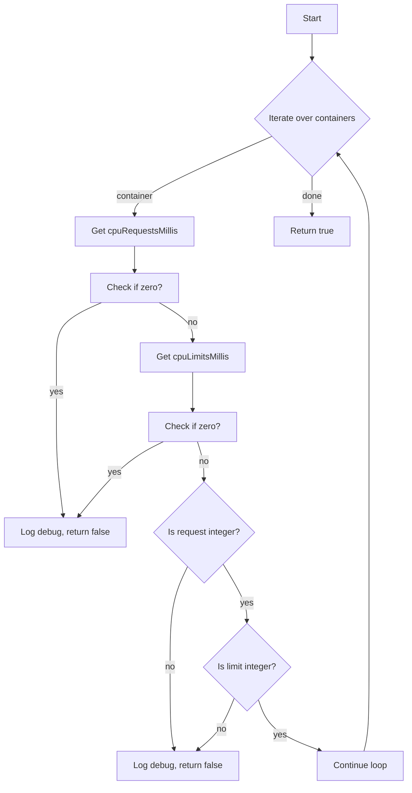

#### Function dependencies (Mermaid)
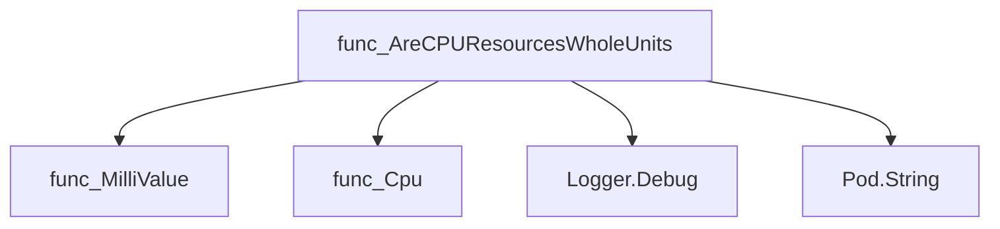

#### Functions calling `AreCPUResourcesWholeUnits` (Mermaid)
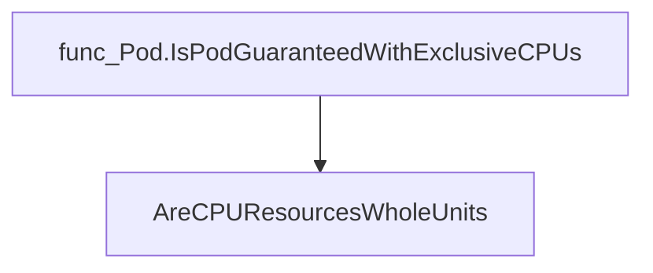

#### Usage example (Go)
```go
// Minimal example invoking AreCPUResourcesWholeUnits
import (
    "github.com/redhat-best-practices-for-k8s/certsuite/pkg/provider"
)

func main() {
    pod := &provider.Pod{
        // ... populate pod with containers and resource specs ...
    }

    if provider.AreCPUResourcesWholeUnits(pod) {
        fmt.Println("All CPU requests/limits are whole units.")
    } else {
        fmt.Println("Pod contains non‑whole CPU resources.")
    }
}
```

---

### AreResourcesIdentical

**AreResourcesIdentical** - Ensures each container in the supplied `*Pod` has matching CPU and memory requests and limits. Returns `true` only if all containers meet this condition; otherwise, it logs a debug message and returns `false`.


#### Signature (Go)
```go
func AreResourcesIdentical(p *Pod) bool
```

#### Summary Table
| Aspect | Details |
|--------|---------|
| **Purpose** | Ensures each container in the supplied `*Pod` has matching CPU and memory requests and limits. Returns `true` only if all containers meet this condition; otherwise, it logs a debug message and returns `false`. |
| **Parameters** | `p *Pod` – The pod whose resources are to be validated. |
| **Return value** | `bool` – `true` when every container’s requests equal its limits; `false` if any mismatch or missing limit is found. |
| **Key dependencies** | • `len` (built‑in) <br>• `log.Debug` from the internal logging package<br>• `Pod.String()` for human‑readable identifiers<br>• Resource quantity methods: `Cpu()`, `Memory()`, `Equal(...)`, `AsApproximateFloat64()` |
| **Side effects** | Emits debug logs describing any resource mismatches or missing limits. No state mutation or I/O beyond logging. |
| **How it fits the package** | Central helper for pod isolation checks; used by higher‑level predicates such as `Pod.IsPodGuaranteed` and `Pod.IsPodGuaranteedWithExclusiveCPUs`. It encapsulates the logic that guarantees a pod’s CPU and memory configuration is “identical” (requests = limits). |

#### Internal workflow (Mermaid)
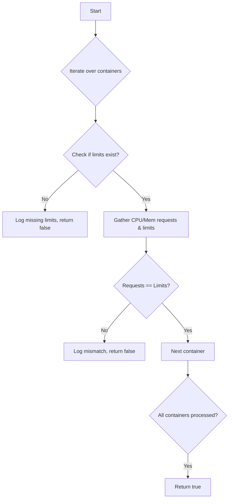

#### Function dependencies (Mermaid)
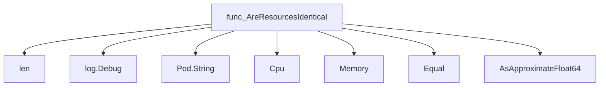

#### Functions calling `AreResourcesIdentical` (Mermaid)
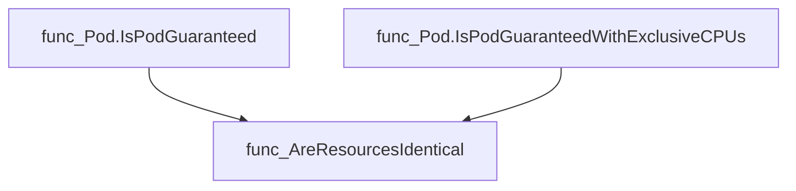

#### Usage example (Go)
```go
// Minimal example invoking AreResourcesIdentical
package main

import (
	"github.com/redhat-best-practices-for-k8s/certsuite/pkg/provider"
)

func main() {
	pod := &provider.Pod{
		Name:      "example",
		Namespace: "default",
		Containers: []provider.Container{
			{
				Name: "app",
				Resources: provider.ResourceRequirements{
					Limits:   map[string]resource.Quantity{"cpu": resource.MustParse("100m"), "memory": resource.MustParse("128Mi")},
					Requests: map[string]resource.Quantity{"cpu": resource.MustParse("100m"), "memory": resource.MustParse("128Mi")},
				},
			},
		},
	}
	if provider.AreResourcesIdentical(pod) {
		fmt.Println("Pod resources are identical.")
	} else {
		fmt.Println("Pod resources differ.")
	}
}
```

---

### Container.GetUID

**GetUID** - Extracts the UID of a running container from its status and logs diagnostic information.


#### Signature (Go)
```go
func (c *Container) GetUID() (string, error)
```

#### Summary Table
| Aspect | Details |
|--------|---------|
| **Purpose** | Extracts the UID of a running container from its status and logs diagnostic information. |
| **Parameters** | `c` – receiver; the container instance whose UID is requested. |
| **Return value** | `string` – the UID if found, otherwise an empty string.<br>`error` – non‑nil when the UID cannot be determined. |
| **Key dependencies** | • `strings.Split` – split the container ID on “://”.<br>• `len` – determine slice length.<br>• `log.Debug` – log debug messages.<br>• `errors.New` – construct error when UID is missing. |
| **Side effects** | No state mutation; only logs to the package logger. |
| **How it fits the package** | Provides a lightweight helper for callers that need the container’s identifier, e.g., for cleanup or auditing tasks. |

#### Internal workflow (Mermaid)
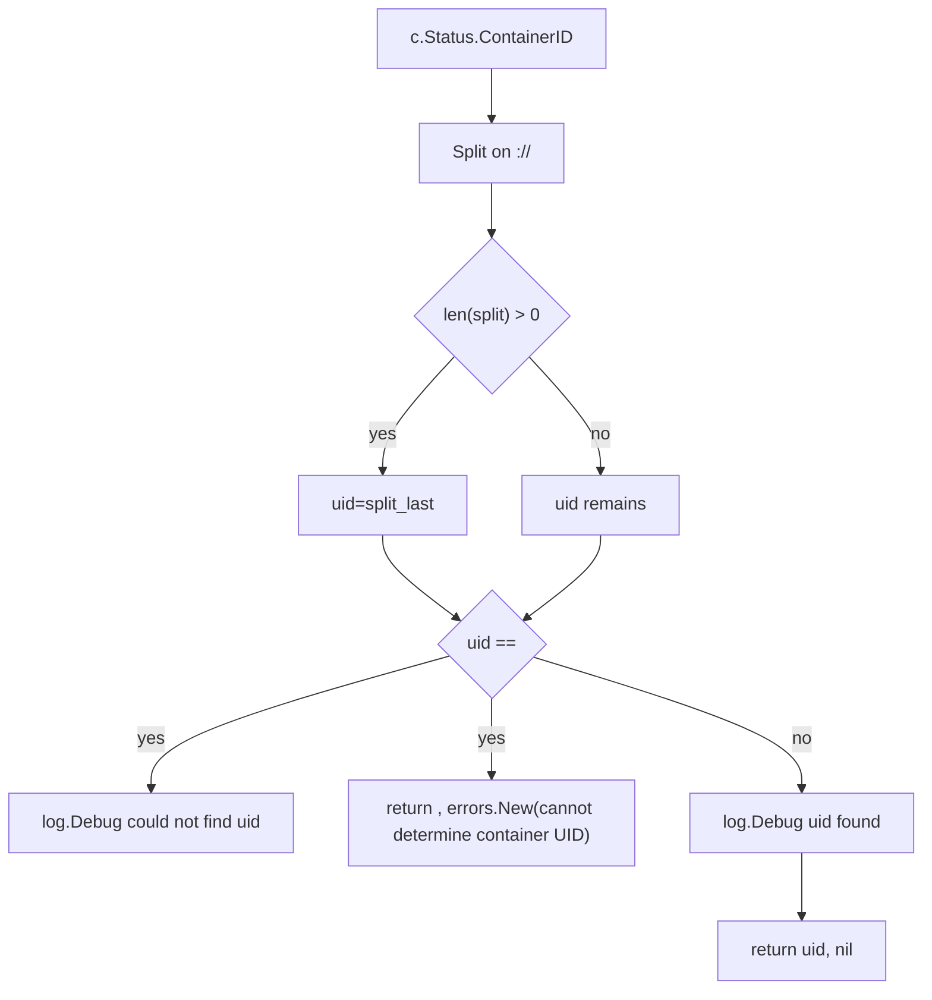

#### Function dependencies (Mermaid)
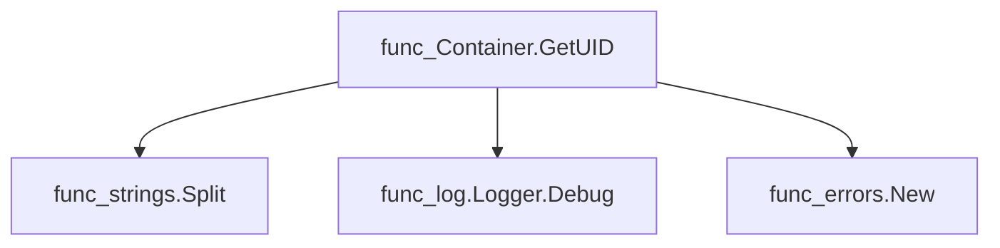

#### Functions calling `Container.GetUID`  
None – this function is currently not referenced elsewhere in the package.

#### Usage example (Go)
```go
// Minimal example invoking Container.GetUID
c := &provider.Container{
    Status: provider.ContainerStatus{ContainerID: "docker://12345"},
    Namespace: "default",
    Podname:   "mypod",
    Name:      "mycontainer",
}
uid, err := c.GetUID()
if err != nil {
    fmt.Printf("Error retrieving UID: %v\n", err)
} else {
    fmt.Printf("Container UID is %s\n", uid)
}
```

---

### Container.HasExecProbes

**HasExecProbes** - Returns `true` when the container defines at least one probe that uses an executable command (`Exec`) for liveness, readiness, or startup checks.


#### Signature (Go)
```go
func (c *Container) HasExecProbes() bool
```

#### Summary Table
| Aspect | Details |
|--------|---------|
| **Purpose** | Returns `true` when the container defines at least one probe that uses an executable command (`Exec`) for liveness, readiness, or startup checks. |
| **Parameters** | None |
| **Return value** | `bool` – `true` if any exec‑probe is present; otherwise `false`. |
| **Key dependencies** | *None* – the method accesses only the container’s own fields. |
| **Side effects** | No state mutation or I/O; purely reads struct values. |
| **How it fits the package** | In the provider package, this helper assists higher‑level logic in deciding whether a container requires probe execution support during deployment validation. |

#### Internal workflow (Mermaid)
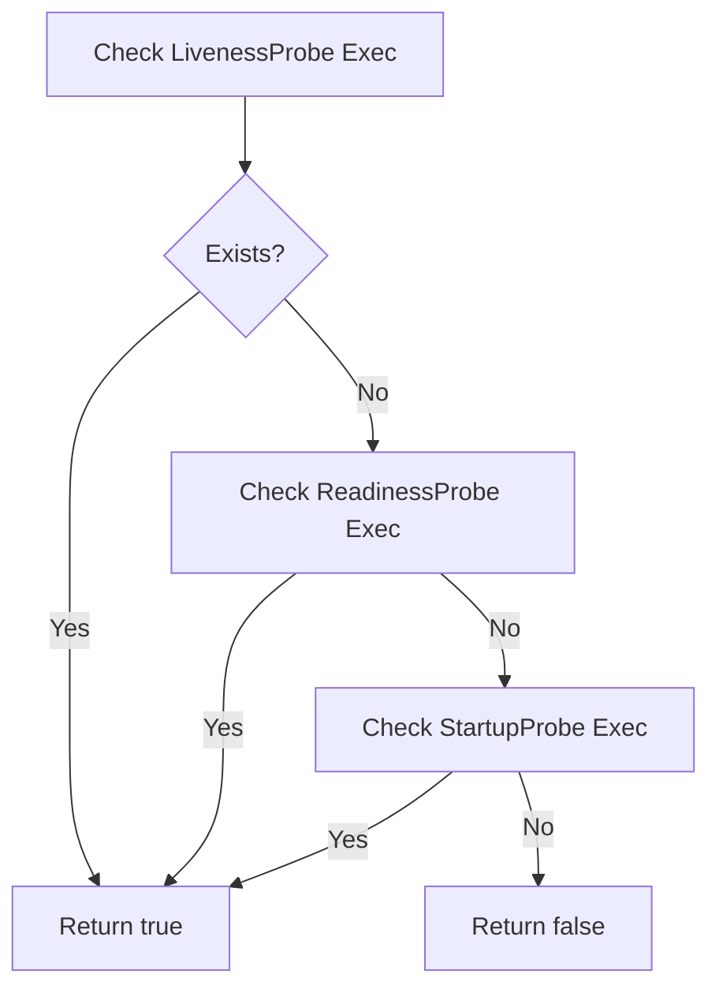

#### Function dependencies (Mermaid)
None – this function is currently not referenced elsewhere in the package.

#### Functions calling `Container.HasExecProbes` (Mermaid)
None – this function is currently not referenced elsewhere in the package.

#### Usage example (Go)
```go
// Minimal example invoking Container.HasExecProbes
c := &provider.Container{
    LivenessProbe: &probe.Probe{Exec: &probe.ExecAction{}},
}
if c.HasExecProbes() {
    fmt.Println("Container has exec probes")
} else {
    fmt.Println("No exec probes defined")
}
```

---

### Container.HasIgnoredContainerName

**HasIgnoredContainerName** - Determines if the current container is in an ignore list, including Istio proxy containers.


#### Signature (Go)
```go
func (c *Container) HasIgnoredContainerName() bool
```

#### Summary Table
| Aspect | Details |
|--------|---------|
| **Purpose** | Determines if the current container is in an ignore list, including Istio proxy containers. |
| **Parameters** | `c` – the container instance to evaluate. |
| **Return value** | `true` if the container name matches any ignored pattern or is an Istio proxy; otherwise `false`. |
| **Key dependencies** | • `Container.IsIstioProxy()`<br>• `strings.Contains` (from the standard library) |
| **Side effects** | None – purely read‑only evaluation. |
| **How it fits the package** | Used by container collection logic to filter out non‑relevant containers before performing policy checks. |

#### Internal workflow
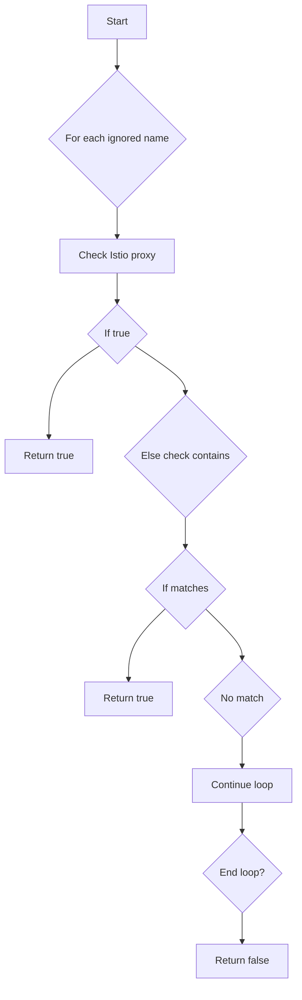

#### Function dependencies
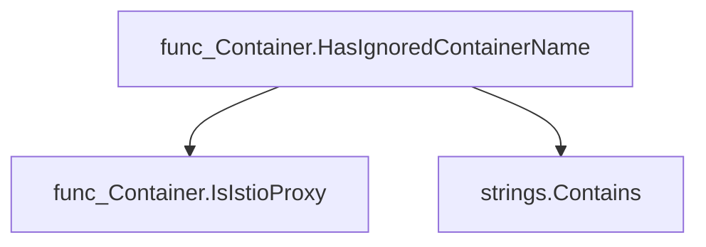

#### Functions calling `Container.HasIgnoredContainerName`
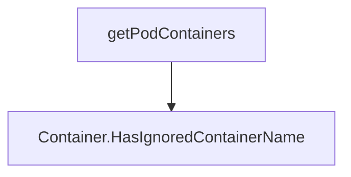

#### Usage example (Go)
```go
// Minimal example invoking Container.HasIgnoredContainerName
package main

import (
	"fmt"
	"github.com/redhat-best-practices-for-k8s/certsuite/pkg/provider"
)

func main() {
	c := provider.Container{Name: "istio-proxy"}
	if c.HasIgnoredContainerName() {
		fmt.Println("This container is ignored")
	} else {
		fmt.Println("This container will be processed")
	}
}
```

---

### Container.IsContainerRunAsNonRoot

**IsContainerRunAsNonRoot** - Returns whether the container is configured to run as a non‑root user and explains how that value was derived.


#### 1) Signature (Go)

```go
func (c *Container) IsContainerRunAsNonRoot(podRunAsNonRoot *bool) (isContainerRunAsNonRoot bool, reason string)
```

#### 2) Summary Table

| Aspect | Details |
|--------|---------|
| **Purpose** | Returns whether the container is configured to run as a non‑root user and explains how that value was derived. |
| **Parameters** | `podRunAsNonRoot *bool` – optional pod‑level override; may be nil. |
| **Return value** | `isContainerRunAsNonRoot bool` – true if the container (or inherited pod setting) specifies non‑root execution.<br>`reason string` – human‑readable explanation of how the decision was made. |
| **Key dependencies** | • `fmt.Sprintf` (from standard library)<br>• `stringhelper.PointerToString` (local helper for pointer display) |
| **Side effects** | None – purely deterministic, no state changes or I/O. |
| **How it fits the package** | Used by pod analysis functions to evaluate compliance with security best practices, specifically the RunAsNonRoot requirement. |

#### 3) Internal workflow (Mermaid)

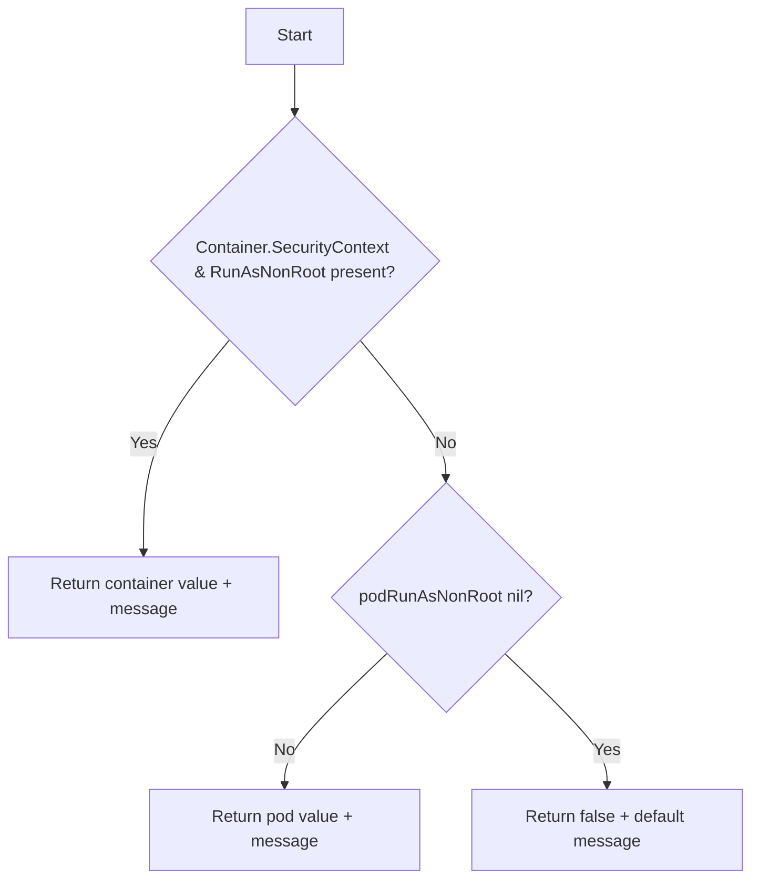

#### 4) Function dependencies (Mermaid)

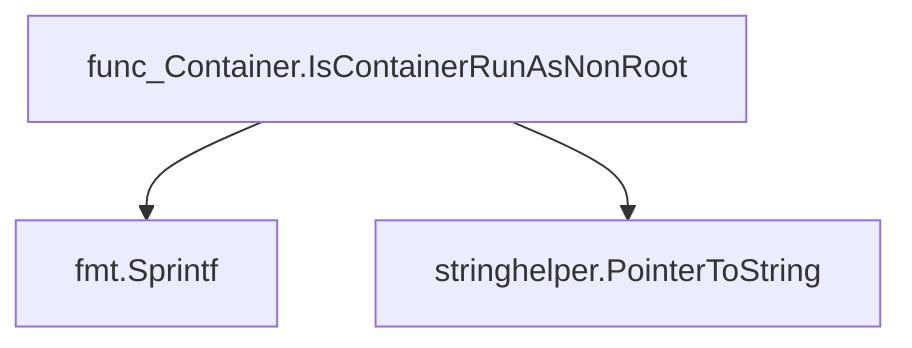

#### 5) Functions calling `Container.IsContainerRunAsNonRoot` (Mermaid)

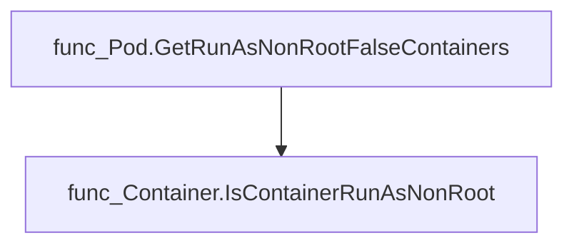

#### 6) Usage example (Go)

```go
// Minimal example invoking Container.IsContainerRunAsNonRoot
package main

import (
	"fmt"

	"github.com/redhat-best-practices-for-k8s/certsuite/pkg/provider"
)

func main() {
	// Example container with no SecurityContext
	c := provider.Container{} // placeholder; in real code this would be populated from a PodSpec

	// podRunAsNonRoot is nil, meaning no pod‑level override
	isNonRoot, reason := c.IsContainerRunAsNonRoot(nil)

	fmt.Printf("Is non‑root: %t\nReason: %s\n", isNonRoot, reason)
}
```

---

### Container.IsContainerRunAsNonRootUserID

**IsContainerRunAsNonRootUserID** - Checks whether the container’s `RunAsUser` security context indicates it runs as a non‑root user. It also explains how pod‑level defaults are applied when the container level is unspecified.


#### Signature (Go)

```go
func (*int64) (bool, string)
```

#### Summary Table

| Aspect | Details |
|--------|---------|
| **Purpose** | Checks whether the container’s `RunAsUser` security context indicates it runs as a non‑root user. It also explains how pod‑level defaults are applied when the container level is unspecified. |
| **Parameters** | `podRunAsNonRootUserID *int64` – The `RunAsUser` value defined at the pod level (may be nil). |
| **Return value** | `isContainerRunAsNonRootUserID bool` – true if a non‑zero user ID is set; <br>`reason string` – human‑readable explanation of the decision. |
| **Key dependencies** | • `fmt.Sprintf` for formatting messages<br>• `stringhelper.PointerToString` to display pod value when nil |
| **Side effects** | None: purely functional, no state mutation or I/O. |
| **How it fits the package** | Used by `Pod.GetRunAsNonRootFalseContainers` to evaluate compliance of each container against the “run as non‑root” rule. |

#### Internal workflow (Mermaid)

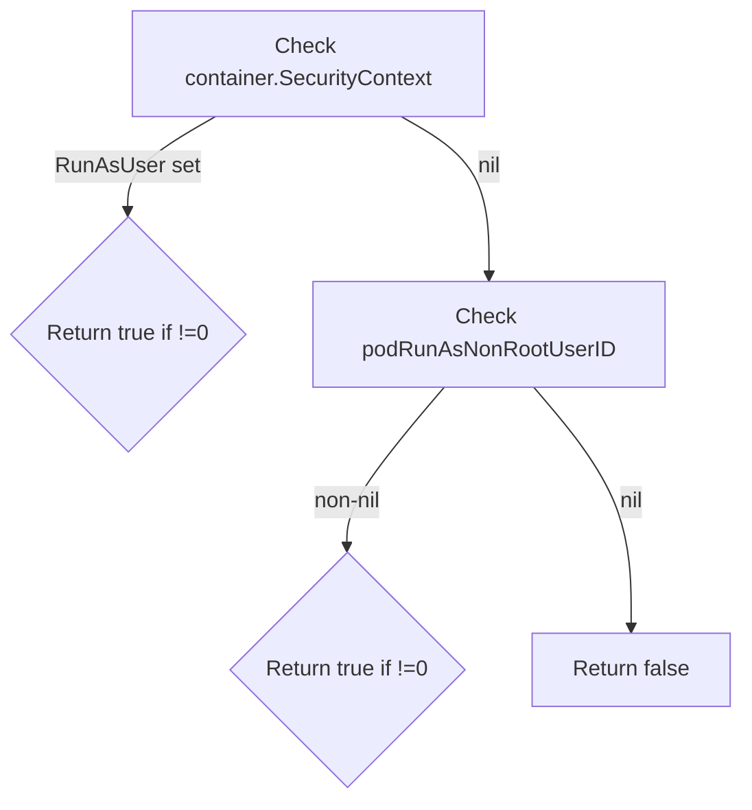

#### Function dependencies (Mermaid)

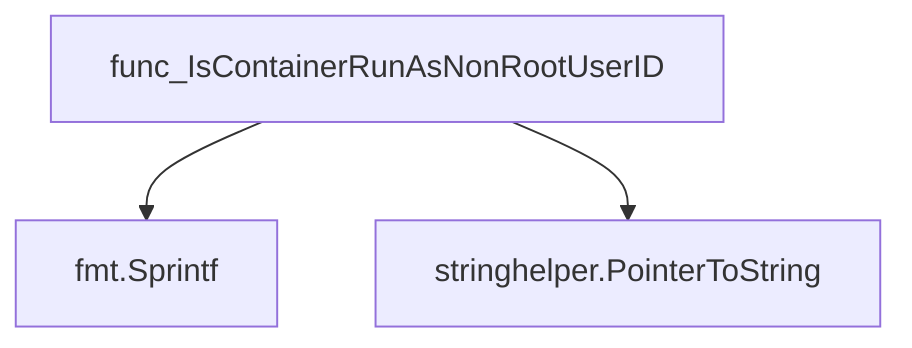

#### Functions calling `Container.IsContainerRunAsNonRootUserID` (Mermaid)

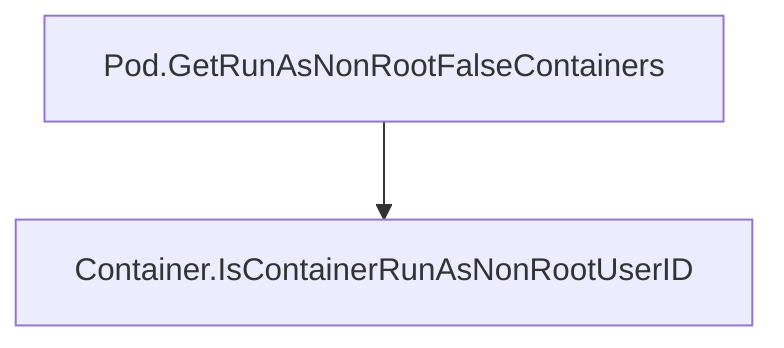

#### Usage example (Go)

```go
// Minimal example invoking Container.IsContainerRunAsNonRootUserID
package main

import (
    "fmt"

    "github.com/redhat-best-practices-for-k8s/certsuite/pkg/provider"
)

func main() {
    c := provider.Container{} // assume SecurityContext populated elsewhere
    podUID := int64(1000)     // example pod-level RunAsUser

    ok, reason := c.IsContainerRunAsNonRootUserID(&podUID)
    fmt.Printf("Is non‑root? %v\nReason: %s\n", ok, reason)
}
```

---

---

### Container.IsIstioProxy

**IsIstioProxy** - Checks whether the container represents the Istio side‑car proxy by comparing its name to a predefined constant.


#### Signature (Go)

```go
func (c *Container) IsIstioProxy() bool
```

#### Summary Table

| Aspect | Details |
|--------|---------|
| **Purpose** | Checks whether the container represents the Istio side‑car proxy by comparing its name to a predefined constant. |
| **Parameters** | `c` – receiver of type `*Container`. |
| **Return value** | `bool`: `true` if the container’s name matches the Istio proxy container name; otherwise `false`. |
| **Key dependencies** | Uses the package‑level constant `IstioProxyContainerName`. |
| **Side effects** | None – purely functional. |
| **How it fits the package** | Provides a helper used by other logic (e.g., filtering containers) to identify Istio side‑car components within a pod. |

#### Internal workflow

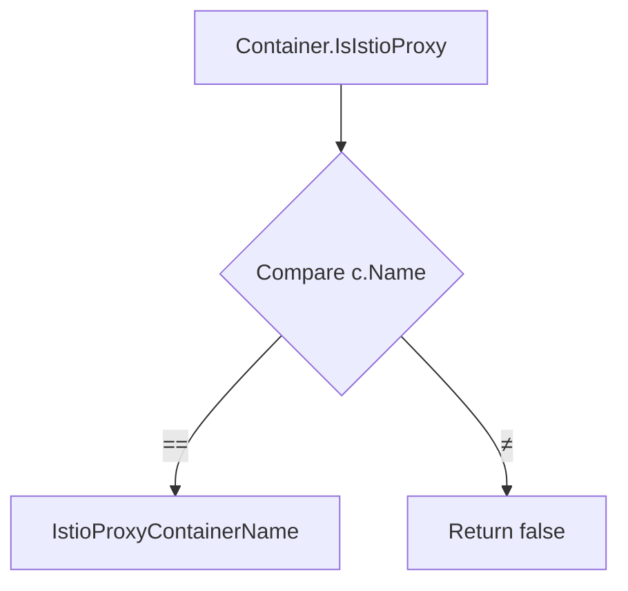

#### Function dependencies

None – this function is currently not referenced elsewhere in the package.

#### Functions calling `Container.IsIstioProxy`

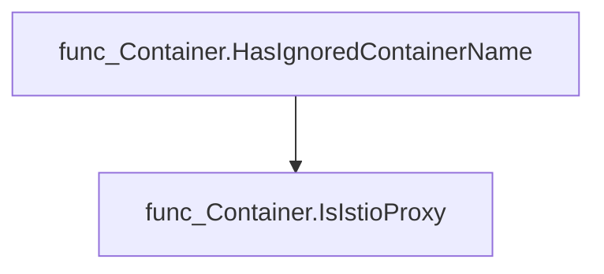

#### Usage example (Go)

```go
// Minimal example invoking Container.IsIstioProxy
c := &provider.Container{Name: "istio-proxy"}
if c.IsIstioProxy() {
    fmt.Println("This is the Istio side‑car proxy.")
}
```

---

### Container.IsReadOnlyRootFilesystem

**IsReadOnlyRootFilesystem** - Checks whether the `SecurityContext.ReadOnlyRootFilesystem` flag of a container is set to `true`.


#### Signature (Go)
```go
func (c *Container) IsReadOnlyRootFilesystem(logger *log.Logger) bool
```

#### Summary Table
| Aspect | Details |
|--------|---------|
| **Purpose** | Checks whether the `SecurityContext.ReadOnlyRootFilesystem` flag of a container is set to `true`. |
| **Parameters** | `logger *log.Logger` – logger used for debugging output. |
| **Return value** | `bool` – `true` if read‑only is enabled; otherwise `false`. |
| **Key dependencies** | Calls `logger.Info(...)` from the standard logging package. |
| **Side effects** | Emits an informational log message; no state changes or external I/O. |
| **How it fits the package** | Provides a helper to validate security configuration of containers within the `provider` package. |

#### Internal workflow (Mermaid)
```mermaid
flowchart TD
  A["Start"] --> B{"Is SecurityContext nil?"}
  B -- Yes --> C["Return false"]
  B -- No --> D{"Is ReadOnlyRootFilesystem nil?"}
  D -- Yes --> E["Return false"]
  D -- No --> F["Return value of *ReadOnlyRootFilesystem"]
```

#### Function dependencies (Mermaid)
```mermaid
graph TD
  func_Container.IsReadOnlyRootFilesystem --> func_logger.Info
```

#### Functions calling `Container.IsReadOnlyRootFilesystem`  
None – this function is currently not referenced elsewhere in the package.

#### Usage example (Go)
```go
// Minimal example invoking Container.IsReadOnlyRootFilesystem
package main

import (
	"log"

	"github.com/redhat-best-practices-for-k8s/certsuite/pkg/provider"
)

func main() {
	logger := log.Default()
	c := &provider.Container{
		SecurityContext: &provider.SecurityContext{
			ReadOnlyRootFilesystem: func(b bool) *bool { return &b }(true),
		},
	}

	isRO := c.IsReadOnlyRootFilesystem(logger)
	if isRO {
		logger.Println("Container root filesystem is read‑only.")
	} else {
		logger.Println("Container root filesystem is writable.")
	}
}
```

---

### Container.IsTagEmpty

**IsTagEmpty** - Checks whether the `Tag` field of the container’s image identifier is an empty string, indicating that no specific tag was supplied.


#### Signature (Go)
```go
func (c *Container) IsTagEmpty() bool
```

#### Summary Table
| Aspect | Details |
|--------|---------|
| **Purpose** | Checks whether the `Tag` field of the container’s image identifier is an empty string, indicating that no specific tag was supplied. |
| **Parameters** | `c *Container` – receiver pointing to the container instance being inspected. |
| **Return value** | `bool` – `true` if the tag is empty; otherwise `false`. |
| **Key dependencies** | None |
| **Side effects** | No state mutation or I/O; purely a read‑only check. |
| **How it fits the package** | Provides a helper for callers that need to decide whether to apply default tagging logic or validate image specifications. |

#### Internal workflow (Mermaid)
```mermaid
flowchart TD
  C["Container"] -->|"reads"| Tag["c.ContainerImageIdentifier.Tag"]
  Tag -->|"compares to empty string"| Result["bool"]
```

#### Function dependencies (Mermaid)
None – this function is currently not referenced elsewhere in the package.

#### Functions calling `Container.IsTagEmpty` (Mermaid)
None – this function is currently not referenced elsewhere in the package.

#### Usage example (Go)
```go
// Minimal example invoking Container.IsTagEmpty
package main

import (
    "github.com/redhat-best-practices-for-k8s/certsuite/pkg/provider"
)

func main() {
    c := &provider.Container{
        ContainerImageIdentifier: provider.ImageIdentifier{Tag: ""},
    }
    if c.IsTagEmpty() {
        println("No tag specified")
    } else {
        println("Tag present:", c.ContainerImageIdentifier.Tag)
    }
}
```

---

### Container.SetPreflightResults

**SetPreflightResults** - Runs the OpenShift‑preflight checks against a container image, caches the results per image, and stores them in the `Container` instance.


#### Signature (Go)
```go
func (c *Container) SetPreflightResults(preflightImageCache map[string]PreflightResultsDB, env *TestEnvironment) error
```

#### Summary Table
| Aspect | Details |
|--------|---------|
| **Purpose** | Runs the OpenShift‑preflight checks against a container image, caches the results per image, and stores them in the `Container` instance. |
| **Parameters** | `preflightImageCache map[string]PreflightResultsDB` – cache keyed by image name; `<br>` `env *TestEnvironment` – environment configuration for Docker credentials and insecure‑connection flag. |
| **Return value** | `error` – non‑nil if the preflight run or result extraction fails. |
| **Key dependencies** | • `github.com/redhat-openshift-ecosystem/openshift-preflight/container`<br>• `github.com/redhat-openshift-ecosystem/openshift-preflight/artifacts`<br>• `github.com/go-logr/stdr`, `logr`<br>• `bytes`, `context`, `fmt`<br>• internal logging (`internal/log`) |
| **Side effects** | * Mutates the `Container.PreflightResults` field.<br>* Populates/updates the supplied cache map.<br>* Emits informational logs via the package logger. |
| **How it fits the package** | The `provider.Container` type represents a single image under test; this method performs the core validation logic that other parts of the suite consume when generating reports or deciding on remediation steps. |

#### Internal workflow (Mermaid)
```mermaid
flowchart TD
  A["Check cache for image"] -->|"Hit"| B["Use cached results"]
  A -->|"Miss"| C["Prepare preflight options"]
  C --> D["Create artifacts writer & context"]
  D --> E["Set up logger in context"]
  E --> F["Instantiate preflight check"]
  F --> G["Run check"]
  G --> H{"Runtime error?"}
  H -->|"Yes"| I["Collect checks list, build errors"]
  H -->|"No"| J["Convert results to DB format"]
  J --> K["Store in Container and cache"]
```

#### Function dependencies (Mermaid)
```mermaid
graph TD
  func_Container.SetPreflightResults --> plibContainer.WithDockerConfigJSONFromFile
  func_Container.SetPreflightResults --> plibContainer.WithInsecureConnection
  func_Container.SetPreflightResults --> artifacts.NewMapWriter
  func_Container.SetPreflightResults --> artifacts.ContextWithWriter
  func_Container.SetPreflightResults --> defaultLog.Default
  func_Container.SetPreflightResults --> stdr.New
  func_Container.SetPreflightResults --> logr.NewContext
  func_Container.SetPreflightResults --> plibContainer.NewCheck
  func_Container.SetPreflightResults --> plibContainer.Check.Run
  func_Container.SetPreflightResults --> plibContainer.Check.List
  func_Container.SetPreflightResults --> GetPreflightResultsDB
```

#### Functions calling `Container.SetPreflightResults` (Mermaid)
None – this function is currently not referenced elsewhere in the package.

#### Usage example (Go)
```go
// Minimal example invoking Container.SetPreflightResults
package main

import (
    "github.com/redhat-best-practices-for-k8s/certsuite/pkg/provider"
)

func main() {
    // Setup a container to test
    cont := &provider.Container{
        Image: "quay.io/example/image:v1",
    }

    // Environment providing Docker credentials and insecure flag
    env := provider.NewTestEnvironment()
    env.SetDockerConfigFile("/path/to/config.json")
    env.AllowPreflightInsecure(true)

    // Cache to reuse results for identical images
    cache := make(map[string]provider.PreflightResultsDB)

    if err := cont.SetPreflightResults(cache, env); err != nil {
        panic(err)
    }

    // Results are now available in cont.PreflightResults and cached
}
```

---

---

### Container.String

**String** - Generates a concise description of a `Container` instance, including its name, pod name, and namespace.


Returns a formatted string describing the container’s identity.

---

#### Signature (Go)

```go
func (c *Container) String() string
```

---

#### Summary Table

| Aspect | Details |
|--------|---------|
| **Purpose** | Generates a concise description of a `Container` instance, including its name, pod name, and namespace. |
| **Parameters** | *(receiver)* `c *Container` – the container to describe. |
| **Return value** | `string` – formatted as `"container: <Name> pod: <Podname> ns: <Namespace>"`. |
| **Key dependencies** | • `fmt.Sprintf` from the standard library. |
| **Side effects** | None; purely functional, no state mutation or I/O. |
| **How it fits the package** | Provides a human‑readable representation used for logging, debugging, and displaying container information within the `provider` package. |

---

#### Internal workflow (Mermaid)

```mermaid
flowchart TD
  A["Call Container.String"] --> B["fmt.Sprintf(\container: %s pod: %s ns: %s\, c.Name, c.Podname, c.Namespace)"]
  B --> C["Return formatted string"]
```

---

#### Function dependencies (Mermaid)

```mermaid
graph TD
  func_Container_String --> fmt_Sprintf
```

---

#### Functions calling `Container.String` (Mermaid)

None – this function is currently not referenced elsewhere in the package.

---

#### Usage example (Go)

```go
// Minimal example invoking Container.String
c := &provider.Container{
    Name:      "nginx",
    Podname:   "pod-123",
    Namespace: "default",
}
fmt.Println(c.String())
// Output: container: nginx pod: pod-123 ns: default
```

---

### Container.StringLong

**StringLong** - Generates a descriptive string containing key metadata about a Kubernetes container, including node, namespace, pod name, container name, UID, and runtime.


#### Signature (Go)
```go
func (c *Container) StringLong() string
```

#### Summary Table
| Aspect | Details |
|--------|---------|
| **Purpose** | Generates a descriptive string containing key metadata about a Kubernetes container, including node, namespace, pod name, container name, UID, and runtime. |
| **Parameters** | `c *Container` – receiver holding the container state. |
| **Return value** | A formatted string of the form: <br>``node: \<NodeName\> ns: \<Namespace\> podName: \<Podname\> containerName: \<Name\> containerUID: \<ContainerID\> containerRuntime: \<Runtime\>`` |
| **Key dependencies** | • `fmt.Sprintf` from the standard library. |
| **Side effects** | None; purely functional and read‑only. |
| **How it fits the package** | Provides a human‑readable representation used in logs, debugging, or UI output within the `provider` package that models Kubernetes resources. |

#### Internal workflow (Mermaid)
```mermaid
flowchart TD
  A["Container"] --> B["fmt.Sprintf"]
  B --> C["Return string"]
```

#### Function dependencies (Mermaid)

```mermaid
graph TD
  func_Container.StringLong --> fmt.Sprintf
```

#### Functions calling `Container.StringLong` (Mermaid)
None – this function is currently not referenced elsewhere in the package.

#### Usage example (Go)
```go
// Minimal example invoking Container.StringLong
package main

import (
    "github.com/redhat-best-practices-for-k8s/certsuite/pkg/provider"
)

func main() {
    c := provider.Container{
        NodeName:          "node-01",
        Namespace:         "default",
        Podname:           "nginx-pod",
        Name:              "nginx-container",
        Status:            provider.Status{ContainerID: "abc123"},
        Runtime:           "containerd",
    }
    detail := c.StringLong()
    fmt.Println(detail)
}
```

---

### ConvertArrayPods

**ConvertArrayPods** - Transforms each `*corev1.Pod` from the Kubernetes API into a corresponding `*Pod` value defined by the provider package, preserving all relevant metadata and network information.


#### Signature (Go)
```go
func ConvertArrayPods(pods []*corev1.Pod) (out []*Pod)
```

#### Summary Table
| Aspect | Details |
|--------|---------|
| **Purpose** | Transforms each `*corev1.Pod` from the Kubernetes API into a corresponding `*Pod` value defined by the provider package, preserving all relevant metadata and network information. |
| **Parameters** | `pods []*corev1.Pod – slice of pointers to corev1.Pod objects that need conversion.` |
| **Return value** | `out []*Pod – slice of pointers to provider‑defined Pod structs, one per input pod.` |
| **Key dependencies** | • Calls `NewPod(aPod *corev1.Pod) (out Pod)` to create the wrapped Pod.<br>• Uses Go’s built‑in `append` function. |
| **Side effects** | None – the function is pure; it only allocates new objects and returns them. |
| **How it fits the package** | This helper centralizes pod conversion logic, allowing other parts of the provider to work with a uniform Pod representation without repeatedly handling Kubernetes types directly. |

#### Internal workflow (Mermaid)
```mermaid
flowchart TD
  pods --> loop["For each pod"]
  loop --> NewPod
  NewPod --> outAppend["Append wrapped pod"]
```

#### Function dependencies (Mermaid)

```mermaid
graph TD
  func_ConvertArrayPods --> func_NewPod
  func_ConvertArrayPods --> func_append
```

#### Functions calling `ConvertArrayPods` (Mermaid)

None – this function is currently not referenced elsewhere in the package.

#### Usage example (Go)
```go
// Minimal example invoking ConvertArrayPods
import (
    corev1 "k8s.io/api/core/v1"
    "github.com/redhat-best-practices-for-k8s/certsuite/pkg/provider"
)

func main() {
    // Assume we already have a slice of *corev1.Pod from the Kubernetes client.
    var kubePods []*corev1.Pod
    // ... populate kubePods ...

    providerPods := provider.ConvertArrayPods(kubePods)
    // providerPods now contains []*provider.Pod ready for further processing.
}
```

---

### CrScale.IsScaleObjectReady

**IsScaleObjectReady** - Determines if the scale object's `Status.Replicas` equals the desired `Spec.Replicas`, indicating readiness.

Checks whether a scale object’s desired replica count matches its current status.

#### Signature (Go)
```go
func (crScale CrScale) IsScaleObjectReady() bool
```

#### Summary Table
| Aspect | Details |
|--------|---------|
| **Purpose** | Determines if the scale object's `Status.Replicas` equals the desired `Spec.Replicas`, indicating readiness. |
| **Parameters** | *None* – operates on the receiver `crScale`. |
| **Return value** | `bool`: `true` when the current replica count matches the desired count; otherwise `false`. |
| **Key dependencies** | • Calls `log.Info` from `github.com/redhat-best-practices-for-k8s/certsuite/internal/log`. |
| **Side effects** | Logs a message with the desired and current replica counts; no state mutation. |
| **How it fits the package** | Part of the `provider` package’s scale object logic, enabling callers to verify that scaling operations have completed successfully. |

#### Internal workflow (Mermaid)
```mermaid
flowchart TD
  A["Start"] --> B{"Get desired replicas"}
  B --> C["Log current vs desired"]
  C --> D{"Compare counts"}
  D -- true --> E["Return true"]
  D -- false --> F["Return false"]
```

#### Function dependencies (Mermaid)
```mermaid
graph TD
  func_CrScale.IsScaleObjectReady --> func_Log.Info
```

#### Functions calling `CrScale.IsScaleObjectReady` (Mermaid)

None – this function is currently not referenced elsewhere in the package.

#### Usage example (Go)
```go
// Minimal example invoking CrScale.IsScaleObjectReady
package main

import (
	"fmt"
	"github.com/redhat-best-practices-for-k8s/certsuite/pkg/provider"
)

func main() {
	scale := provider.CrScale{
		Spec: provider.ScaleSpec{Replicas: 3},
		Status: provider.ScaleStatus{Replicas: 3},
	}
	if scale.IsScaleObjectReady() {
		fmt.Println("Scale object is ready.")
	} else {
		fmt.Println("Scale object is not ready yet.")
	}
}
```

---

### CrScale.ToString

**ToString** - Returns a formatted string that identifies the custom resource scale, showing both its name and namespace.


> Provides a human‑readable representation of a `CrScale` instance by concatenating its name and namespace fields.

#### Signature (Go)

```go
func (crScale CrScale) ToString() string
```

#### Summary Table

| Aspect | Details |
|--------|---------|
| **Purpose** | Returns a formatted string that identifies the custom resource scale, showing both its name and namespace. |
| **Parameters** | *None* – uses the receiver’s fields (`Name`, `Namespace`). |
| **Return value** | `string` – e.g., `"cr: myscale ns: default"`. |
| **Key dependencies** | • `fmt.Sprintf` from package `fmt`. |
| **Side effects** | None. The function only reads receiver data and returns a string. |
| **How it fits the package** | Offers a convenient debugging/printing helper for the `CrScale` type within the provider package, aiding logging and test output. |

#### Internal workflow (Mermaid)

```mermaid
flowchart TD
  CrScale_ToString --> fmt.Sprintf
```

#### Function dependencies (Mermaid)

```mermaid
graph TD
  func_CrScale.ToString --> func_fmt.Sprintf
```

#### Functions calling `CrScale.ToString` (Mermaid)

None – this function is currently not referenced elsewhere in the package.

#### Usage example (Go)

```go
// Minimal example invoking CrScale.ToString
package main

import (
    "fmt"

    "github.com/redhat-best-practices-for-k8s/certsuite/pkg/provider"
)

func main() {
    // Assume CrScale has exported fields Name and Namespace.
    scale := provider.CrScale{Name: "myscale", Namespace: "default"}
    fmt.Println(scale.ToString()) // Output: cr: myscale ns: default
}
```

---

### CsvToString

**CsvToString** - Creates a human‑readable representation of a CSV, showing its name and namespace.

Formats a ClusterServiceVersion into a concise descriptive string.

#### Signature (Go)
```go
func CsvToString(csv *olmv1Alpha.ClusterServiceVersion) string
```

#### Summary Table
| Aspect | Details |
|--------|---------|
| **Purpose** | Creates a human‑readable representation of a CSV, showing its name and namespace. |
| **Parameters** | `csv` – pointer to an `olmv1Alpha.ClusterServiceVersion`; the object to describe. |
| **Return value** | A formatted string: `"operator csv: <Name> ns: <Namespace>"`. |
| **Key dependencies** | - `fmt.Sprintf` from the standard library. |
| **Side effects** | None; purely functional, no mutation or I/O. |
| **How it fits the package** | Utility helper used by other provider functions to log CSV status and debugging information. |

#### Internal workflow (Mermaid)
```mermaid
flowchart TD
  A["Receive csv"] --> B["Extract Name"]
  B --> C["Extract Namespace"]
  C --> D["Call fmt.Sprintf with name & namespace"]
  D --> E["Return formatted string"]
```

#### Function dependencies (Mermaid)
```mermaid
graph TD
  func_CsvToString --> func_Sprintf["fmt.Sprintf"]
```

#### Functions calling `CsvToString` (Mermaid)
```mermaid
graph TD
  func_WaitOperatorReady --> func_CsvToString
```

#### Usage example (Go)
```go
// Minimal example invoking CsvToString
package main

import (
	"fmt"

	olmv1Alpha "github.com/operator-framework/api/pkg/operators/v1alpha1"
)

func main() {
	csv := &olmv1Alpha.ClusterServiceVersion{
		ObjectMeta: metav1.ObjectMeta{
			Name:      "example-operator.v0.1.0",
			Namespace: "operators",
		},
	}
	fmt.Println(CsvToString(csv))
}
```

---

### Deployment.IsDeploymentReady

**IsDeploymentReady** - Evaluates whether the deployment satisfies all readiness conditions: an `Available` condition is present, replica counts match specifications, and no replicas are marked unavailable.


#### Signature (Go)

```go
func (d *Deployment) IsDeploymentReady() bool
```

#### Summary Table

| Aspect | Details |
|--------|---------|
| **Purpose** | Evaluates whether the deployment satisfies all readiness conditions: an `Available` condition is present, replica counts match specifications, and no replicas are marked unavailable. |
| **Parameters** | *d* (`*Deployment`) – the deployment instance to inspect. |
| **Return value** | `bool` – `true` if the deployment is ready; otherwise `false`. |
| **Key dependencies** | • `appsv1.DeploymentAvailable` (condition type)<br>• Fields of `d.Status`: `Conditions`, `UnavailableReplicas`, `ReadyReplicas`, `AvailableReplicas`, `UpdatedReplicas`<br>• Field of `d.Spec`: `Replicas` |
| **Side effects** | None – purely reads the deployment state. |
| **How it fits the package** | Used by the provider to decide whether a deployment can be considered healthy and ready for further actions or tests. |

#### Internal workflow (Mermaid)

```mermaid
flowchart TD
  A["Start"] --> B{"Check Available Condition"}
  B -- Yes --> C["Set notReady=false"]
  B -- No --> D["Keep notReady=true"]
  D --> E["Determine expected replicas"]
  C --> E
  E --> F{"Any readiness issue?"}
  F -- Yes --> G["Return false"]
  F -- No --> H["Return true"]
```

#### Function dependencies (Mermaid)

None – this function is currently not referenced elsewhere in the package.

#### Functions calling `Deployment.IsDeploymentReady` (Mermaid)

None – this function is currently not referenced elsewhere in the package.

#### Usage example (Go)

```go
// Minimal example invoking Deployment.IsDeploymentReady

import "github.com/redhat-best-practices-for-k8s/certsuite/pkg/provider"

func main() {
    // Assume deployment is obtained from a Kubernetes client
    var d provider.Deployment
    // ... populate d ...

    ready := d.IsDeploymentReady()
    if ready {
        fmt.Println("Deployment is fully ready.")
    } else {
        fmt.Println("Deployment is not yet ready.")
    }
}
```

---

### Deployment.ToString

**ToString** - Formats the deployment’s `Name` and `Namespace` into a single descriptive string.


Provides a human‑readable string representation of a `Deployment`, combining its name and namespace.

#### Signature (Go)
```go
func (d *Deployment) ToString() string
```

#### Summary Table
| Aspect | Details |
|--------|---------|
| **Purpose** | Formats the deployment’s `Name` and `Namespace` into a single descriptive string. |
| **Parameters** | `d *Deployment` – receiver containing `Name` and `Namespace`. |
| **Return value** | `string` – e.g., `"deployment: my-app ns: prod"`. |
| **Key dependencies** | Calls `fmt.Sprintf` from the standard library. |
| **Side effects** | None; purely functional. |
| **How it fits the package** | Offers a convenient, readable representation of deployments for logging or debugging within the `provider` package. |

#### Internal workflow (Mermaid)
```mermaid
flowchart TD
  A["Deployment object"] --> B["fmt.Sprintf(\deployment: %s ns: %s\, d.Name, d.Namespace)"]
  B --> C["String result"]
```

#### Function dependencies (Mermaid)
```mermaid
graph TD
  func_Deployment_ToString --> fmt_Sprintf
```

#### Functions calling `Deployment.ToString` (Mermaid)

None – this function is currently not referenced elsewhere in the package.

#### Usage example (Go)
```go
// Minimal example invoking Deployment.ToString
package main

import (
    "fmt"
    "github.com/redhat-best-practices-for-k8s/certsuite/pkg/provider"
)

func main() {
    d := &provider.Deployment{
        Name:      "my-app",
        Namespace: "prod",
    }
    fmt.Println(d.ToString()) // prints: deployment: my-app ns: prod
}
```

---

### Event.String

**String** - Returns a formatted string summarizing the event’s timestamp, involved object, reason, and message.

Provides a human‑readable representation of an event by formatting its key fields into a single string.

#### Signature (Go)
```go
func (e *Event) String() string
```

#### Summary Table
| Aspect | Details |
|--------|---------|
| **Purpose** | Returns a formatted string summarizing the event’s timestamp, involved object, reason, and message. |
| **Parameters** | `e *Event` – receiver containing event data. |
| **Return value** | `string` – human‑readable description of the event. |
| **Key dependencies** | - `fmt.Sprintf` from the standard library. |
| **Side effects** | None; purely functional. |
| **How it fits the package** | Enables debugging and logging by providing a concise textual snapshot of an event instance within the `provider` package. |

#### Internal workflow (Mermaid)
```mermaid
flowchart TD
  A["Event.String"] --> B["fmt.Sprintf(\timestamp=%s involved object=%s reason=%s message=%s\, e.CreationTimestamp.Time, e.InvolvedObject, e.Reason, e.Message)"]
```

#### Function dependencies (Mermaid)
```mermaid
graph TD
  func_Event_String --> func_fmt_Sprintf
```

#### Functions calling `Event.String` (Mermaid)
None – this function is currently not referenced elsewhere in the package.

#### Usage example (Go)
```go
// Minimal example invoking Event.String
package main

import (
	"fmt"
	"github.com/redhat-best-practices-for-k8s/certsuite/pkg/provider"
)

func main() {
	ev := provider.Event{
		CreationTimestamp: /* populate with a timestamp */,
		InvolvedObject:    "pod/example",
		Reason:            "Scheduled",
		Message:           "Successfully scheduled pod.",
	}
	fmt.Println(ev.String())
}
```

---

### GetAllOperatorGroups

**GetAllOperatorGroups** - Queries the Kubernetes API for all `OperatorGroup` objects in the default namespace and returns a slice of pointers to them. Handles “not found” cases gracefully by returning `nil` without an error.


#### Signature (Go)

```go
func GetAllOperatorGroups() ([]*olmv1.OperatorGroup, error)
```

#### Summary Table

| Aspect | Details |
|--------|---------|
| **Purpose** | Queries the Kubernetes API for all `OperatorGroup` objects in the default namespace and returns a slice of pointers to them. Handles “not found” cases gracefully by returning `nil` without an error. |
| **Parameters** | None |
| **Return value** | `([]*olmv1.OperatorGroup, error)` – A slice containing pointers to each discovered OperatorGroup; `error` is non‑nil only if the API call fails for reasons other than “resource not found”. |
| **Key dependencies** | • `clientsholder.GetClientsHolder()` – obtains a cached Kubernetes client<br>• `client.OlmClient.OperatorsV1().OperatorGroups("").List(...)` – performs the actual list operation<br>• `k8serrors.IsNotFound(err)` – distinguishes “not found” errors from others<br>• `log.Warn` – logs warnings when no OperatorGroups are present |
| **Side effects** | No modification of cluster state; only reads data and logs warnings. |
| **How it fits the package** | Used during test‑environment construction (`buildTestEnvironment`) to populate the list of OperatorGroups that subsequent logic may need for validation or dependency analysis. |

#### Internal workflow (Mermaid)

```mermaid
flowchart TD
  A["GetAllOperatorGroups"] --> B["clientsholder.GetClientsHolder"]
  B --> C["client.OlmClient.OperatorsV1().OperatorGroups().List"]
  C --> D{"err"}
  D -->|"error && !IsNotFound"| E["Return error"]
  D -->|"IsNotFound"| F["log.Warn, Return nil,nil"]
  D -->|"no error"| G["List.Items"]
  G --> H{"len(list.Items)==0"}
  H -->|"true"| I["log.Warn, Return nil,nil"]
  H -->|"false"| J["Iterate list.Items → operatorGroups slice"]
  J --> K["Return operatorGroups,nil"]
```

#### Function dependencies (Mermaid)

```mermaid
graph TD
  func_GetAllOperatorGroups --> func_GetClientsHolder
  func_GetAllOperatorGroups --> func_List
  func_GetAllOperatorGroups --> func_IsNotFound
  func_GetAllOperatorGroups --> func_Warn
```

#### Functions calling `GetAllOperatorGroups` (Mermaid)

```mermaid
graph TD
  func_buildTestEnvironment --> func_GetAllOperatorGroups
```

#### Usage example (Go)

```go
// Minimal example invoking GetAllOperatorGroups
package main

import (
	"fmt"

	"github.com/redhat-best-practices-for-k8s/certsuite/pkg/provider"
)

func main() {
	operatorGroups, err := provider.GetAllOperatorGroups()
	if err != nil {
		fmt.Printf("Failed to fetch OperatorGroups: %v\n", err)
		return
	}
	if operatorGroups == nil {
		fmt.Println("No OperatorGroups found.")
		return
	}

	for _, og := range operatorGroups {
		fmt.Printf("Found OperatorGroup: %s/%s\n", og.Namespace, og.Name)
	}
}
```

---

---

### GetCatalogSourceBundleCount

**GetCatalogSourceBundleCount** - Counts the number of bundle images that belong to a given `CatalogSource`. It selects the counting strategy based on the OpenShift version: for ≤ 4.12 it queries a probe container; otherwise it tallies entries from package manifests.


#### 1) Signature (Go)
```go
func GetCatalogSourceBundleCount(env *TestEnvironment, cs *olmv1Alpha.CatalogSource) int
```

#### 2) Summary Table
| Aspect | Details |
|--------|---------|
| **Purpose** | Counts the number of bundle images that belong to a given `CatalogSource`. It selects the counting strategy based on the OpenShift version: for ≤ 4.12 it queries a probe container; otherwise it tallies entries from package manifests. |
| **Parameters** | `env *TestEnvironment` – test context containing cluster state and helpers.<br>`cs *olmv1Alpha.CatalogSource` – catalog source whose bundles are counted. |
| **Return value** | `int` – the total bundle count; returns `-1` if counting fails. |
| **Key dependencies** | • `log.Info`, `log.Error` (internal logging)<br>• `semver.NewVersion` for parsing OpenShift version<br>• `getCatalogSourceBundleCountFromProbeContainer`<br>• `getCatalogSourceBundleCountFromPackageManifests` |
| **Side effects** | Emits log messages; no mutation of input objects. |
| **How it fits the package** | Provides bundle counting logic used by compliance checks (e.g., `testOperatorCatalogSourceBundleCount`) to enforce limits on catalog sizes. |

#### 3) Internal workflow
```mermaid
flowchart TD
    A["Start"] --> B{"OCP version ≤ 4.12?"}
    B -- Yes --> C["getCatalogSourceBundleCountFromProbeContainer"]
    B -- No --> D["getCatalogSourceBundleCountFromPackageManifests"]
    C --> E["Return bundle count"]
    D --> E
```

#### 4) Function dependencies
```mermaid
graph TD
  func_GetCatalogSourceBundleCount --> func_getCatalogSourceBundleCountFromProbeContainer
  func_GetCatalogSourceBundleCount --> func_getCatalogSourceBundleCountFromPackageManifests
  func_GetCatalogSourceBundleCount --> Logger.Info
  func_GetCatalogSourceBundleCount --> Logger.Error
  func_GetCatalogSourceBundleCount --> semver.NewVersion
```

#### 5) Functions calling `GetCatalogSourceBundleCount`
```mermaid
graph TD
  provider_testOperatorCatalogSourceBundleCount --> func_GetCatalogSourceBundleCount
```

#### 6) Usage example (Go)
```go
// Minimal example invoking GetCatalogSourceBundleCount
env := &provider.TestEnvironment{
    OpenshiftVersion: "4.15",
}
cs := &olmv1Alpha.CatalogSource{ /* fields populated elsewhere */ }

bundleCount := provider.GetCatalogSourceBundleCount(env, cs)
fmt.Printf("Catalog %s has %d bundles\n", cs.Name, bundleCount)
```

---

### GetPciPerPod

**GetPciPerPod** - Parses the JSON network‑status annotation of a pod and extracts all PCI addresses associated with its network interfaces.


```go
func GetPciPerPod(annotation string) (pciAddr []string, err error)
```

| Aspect | Details |
|--------|---------|
| **Purpose** | Parses the JSON network‑status annotation of a pod and extracts all PCI addresses associated with its network interfaces. |
| **Parameters** | `annotation` – string containing the CNI status JSON (may be empty). |
| **Return value** | `pciAddr []string` – slice of PCI address strings; `err error` – non‑nil if unmarshalling fails. |
| **Key dependencies** | * `strings.TrimSpace` – check for empty annotation<br>* `encoding/json.Unmarshal` – decode JSON into `[]CniNetworkInterface`<br>* `fmt.Errorf` – wrap errors<br>* Built‑in `append` – accumulate addresses |
| **Side effects** | None (pure function). |
| **How it fits the package** | Provides a helper for `NewPod` to populate each pod’s PCI list from its annotations, enabling PCI‑aware connectivity tests. |

#### Internal workflow

```mermaid
flowchart TD
  A["Check if annotation is empty"] -->|"Yes"| B["Return empty slice"]
  A -->|"No"| C["Unmarshal JSON into cniInfo"]
  C --> D{"Iterate interfaces"}
  D -->|"PCI address present"| E["Append to pciAddr"]
  D -->|"None"| F["Continue loop"]
  E --> G["End loop"]
  G --> H["Return pciAddr, nil"]
```

#### Function dependencies

```mermaid
graph TD
  func_GetPciPerPod --> func_TrimSpace
  func_GetPciPerPod --> func_Unmarshal
  func_GetPciPerPod --> func_Errorf
  func_GetPciPerPod --> append
```

#### Functions calling `GetPciPerPod`

```mermaid
graph TD
  func_NewPod --> func_GetPciPerPod
```

#### Usage example (Go)

```go
// Minimal example invoking GetPciPerPod
annotation := `[
  {"deviceInfo":{"PCI":{"pciAddress":"0000:81:00.0"}}},
  {"deviceInfo":{"PCI":{}}}
]`
pci, err := GetPciPerPod(annotation)
if err != nil {
    log.Fatalf("error: %v", err)
}
fmt.Printf("PCI addresses: %v\n", pci) // Output: PCI addresses: [0000:81:00.0]
```

---

### GetPodIPsPerNet

**GetPodIPsPerNet** - Parses the `k8s.v1.cni.cncf.io/networks-status` annotation to extract all non‑default network interfaces and their IP addresses for a pod.


#### 1) Signature (Go)

```go
func GetPodIPsPerNet(annotation string) (ips map[string]CniNetworkInterface, err error)
```

#### 2) Summary Table

| Aspect | Details |
|--------|---------|
| **Purpose** | Parses the `k8s.v1.cni.cncf.io/networks-status` annotation to extract all non‑default network interfaces and their IP addresses for a pod. |
| **Parameters** | `annotation string –` raw JSON content of the CNI networks‑status annotation. |
| **Return value** | `ips map[string]CniNetworkInterface` indexed by network name; `err error` if unmarshalling fails. |
| **Key dependencies** | • `make` (map creation)<br>• `strings.TrimSpace`<br>• `encoding/json.Unmarshal`<br>• `fmt.Errorf` |
| **Side effects** | None – purely functional, no state mutation or I/O beyond error reporting. |
| **How it fits the package** | Provides lower‑level data extraction used by higher‑level pod constructors (`NewPod`) to populate network interface information for connectivity testing. |

#### 3) Internal workflow (Mermaid)

```mermaid
flowchart TD
    A["Start"] --> B{"Trim annotation"}
    B -- empty --> C["Return empty map"]
    B -- non-empty --> D["Unmarshal JSON into CniNetworkInterface list"]
    D -- error --> E["Return nil, fmt.Errorf"]
    D -- success --> F{"Iterate interfaces"}
    F --> G{"Default?"}
    G -- yes --> H["Skip"]
    G -- no --> I["Add to map by name"]
    I --> J["Continue loop"]
    J --> K["End loop"]
    K --> L["Return map, nil"]
```

#### 4) Function dependencies (Mermaid)

```mermaid
graph TD
  func_GetPodIPsPerNet --> func_make
  func_GetPodIPsPerNet --> strings.TrimSpace
  func_GetPodIPsPerNet --> json.Unmarshal
  func_GetPodIPsPerNet --> fmt.Errorf
```

#### 5) Functions calling `GetPodIPsPerNet` (Mermaid)

```mermaid
graph TD
  func_NewPod --> func_GetPodIPsPerNet
```

#### 6) Usage example (Go)

```go
// Minimal example invoking GetPodIPsPerNet
package main

import (
	"fmt"

	"github.com/redhat-best-practices-for-k8s/certsuite/pkg/provider"
)

func main() {
	annotation := `[{"name":"net1","ips":[{"address":"10.0.0.5/24"}],"default":false},{"name":"eth0","ips":[{"address":"192.168.1.10/24"}],"default":true}]`
	ips, err := provider.GetPodIPsPerNet(annotation)
	if err != nil {
		fmt.Printf("error: %v\n", err)
		return
	}
	for netName, iface := range ips {
		fmt.Printf("Network %s has IPs: %+v\n", netName, iface.IPS)
	}
}
```

---

### GetPreflightResultsDB

**GetPreflightResultsDB** - Builds a `PreflightResultsDB` from the raw preflight runtime results, separating passed, failed and error tests into distinct slices.


#### Signature (Go)

```go
func GetPreflightResultsDB(results *plibRuntime.Results) PreflightResultsDB
```

#### Summary Table

| Aspect | Details |
|--------|---------|
| **Purpose** | Builds a `PreflightResultsDB` from the raw preflight runtime results, separating passed, failed and error tests into distinct slices. |
| **Parameters** | `results *plibRuntime.Results` – pointer to the object containing all test outcomes. |
| **Return value** | `PreflightResultsDB` – a container holding three lists of `PreflightTest`, each annotated with name, description, remediation, and optional error details. |
| **Key dependencies** | • `plibRuntime.Result.Name()`<br>• `plibRuntime.Result.Metadata().Description`<br>• `plibRuntime.Result.Help().Suggestion`<br>• `plibRuntime.Result.Error()` (for failed tests) |
| **Side effects** | None – purely functional transformation. |
| **How it fits the package** | Used by both container and operator preflight result handlers to persist test outcomes in a serialisable format for later reporting or caching. |

#### Internal workflow

```mermaid
flowchart TD
  Start --> ParsePassed["Iterate over Passed"]
  ParsePassed --> BuildTest1["Test object from Passed"]
  BuildTest1 --> AppendPassed["Append to resultsDB.Passed"]
  ParseFailed["Iterate over Failed"] --> BuildTest2["Test object from Failed"]
  BuildTest2 --> AppendFailed["Append to resultsDB.Failed"]
  ParseErrors["Iterate over Errors"] --> BuildTest3["Test object with Error"]
  BuildTest3 --> AppendError["Append to resultsDB.Errors"]
  End
```

#### Function dependencies

```mermaid
graph TD
  func_GetPreflightResultsDB --> func_Name
  func_GetPreflightResultsDB --> func_Metadata
  func_GetPreflightResultsDB --> func_Help
  func_GetPreflightResultsDB --> func_Error
```

#### Functions calling `GetPreflightResultsDB`

```mermaid
graph TD
  func_Container.SetPreflightResults --> func_GetPreflightResultsDB
  func_Operator.SetPreflightResults --> func_GetPreflightResultsDB
```

#### Usage example (Go)

```go
// Minimal example invoking GetPreflightResultsDB
import (
    "github.com/redhat-best-practices-for-k8s/certsuite/pkg/provider"
    plibRuntime "github.com/opencontainers/runc/libcontainer/runtime" // placeholder import path
)

func main() {
    // Assume results is obtained from a preflight check run
    var runtimeResults *plibRuntime.Results

    // Convert to structured DB
    db := provider.GetPreflightResultsDB(runtimeResults)

    // db.Passed, db.Failed, db.Errors now contain the test summaries
}
```

---

### GetRuntimeUID

**GetRuntimeUID** - Parses the `ContainerID` field of a `ContainerStatus` to separate the runtime prefix and the unique identifier (UID).


#### Signature
```go
func GetRuntimeUID(cs *corev1.ContainerStatus) (runtime, uid string)
```

#### Summary Table
| Aspect | Details |
|--------|---------|
| **Purpose** | Parses the `ContainerID` field of a `ContainerStatus` to separate the runtime prefix and the unique identifier (UID). |
| **Parameters** | `cs *corev1.ContainerStatus` – status object containing the container’s ID. |
| **Return value** | `runtime string` – first part before “://”; <br> `uid string` – last part after “://”. |
| **Key dependencies** | • `strings.Split` (standard library)<br>• Length checks (`len`) on slices |
| **Side effects** | None. Pure function; no state mutation or I/O. |
| **How it fits the package** | Used by container‑listing logic to record runtime and UID for each pod container, aiding diagnostics and reporting. |

#### Internal workflow
```mermaid
flowchart TD
  A["Input ContainerStatus"] --> B{"Split ContainerID on ://"}
  B --> C{"If parts exist"}
  C --> D["Assign runtime = first part"]
  C --> E["Assign uid = last part"]
  D & E --> F["Return (runtime, uid)"]
```

#### Function dependencies
```mermaid
graph TD
  func_GetRuntimeUID --> strings.Split
  func_GetRuntimeUID --> len
```

#### Functions calling `GetRuntimeUID`
```mermaid
graph TD
  getPodContainers --> func_GetRuntimeUID
```

#### Usage example
```go
// Minimal example invoking GetRuntimeUID
import (
	"github.com/redhat-best-practices-for-k8s/certsuite/pkg/provider"
	corev1 "k8s.io/api/core/v1"
)

func main() {
	status := &corev1.ContainerStatus{
		ContainerID: "docker://abcdef123456",
	}
	runtime, uid := provider.GetRuntimeUID(status)
	fmt.Printf("runtime=%q uid=%q\n", runtime, uid) // → runtime="docker" uid="abcdef123456"
}
```

---

### GetTestEnvironment

**GetTestEnvironment** - Provides read‑only access to the singleton `env` that holds all runtime discovery data. It lazily builds the environment on first call and then returns the cached instance.


#### Signature (Go)
```go
func GetTestEnvironment() TestEnvironment
```

#### Summary Table
| Aspect | Details |
|--------|---------|
| **Purpose** | Provides read‑only access to the singleton `env` that holds all runtime discovery data. It lazily builds the environment on first call and then returns the cached instance. |
| **Parameters** | None |
| **Return value** | `TestEnvironment` – the fully populated test environment structure. |
| **Key dependencies** | - Calls `buildTestEnvironment()` to initialise `env`.  <br>- Relies on package‑level variables `loaded`, `env`. |
| **Side effects** | On first invocation, triggers a comprehensive discovery process that populates many fields (pods, nodes, services, etc.). Subsequent calls are side‑effect free. |
| **How it fits the package** | Central access point for all components that need cluster state; used by diagnostics, tests, and run logic to avoid repeated discovery work. |

#### Internal workflow (Mermaid)
```mermaid
flowchart TD
  A["Check `loaded`"] -->|"false"| B["Call `buildTestEnvironment()`"]
  B --> C["Set `loaded = true`"]
  C --> D["Return global `env`"]
  A -->|"true"| D
```

#### Function dependencies (Mermaid)
```mermaid
graph TD
  func_GetTestEnvironment --> func_buildTestEnvironment
```

#### Functions calling `GetTestEnvironment` (Mermaid)
```mermaid
graph TD
  func_ExecCommandContainerNSEnter --> func_GetTestEnvironment
  func_GetPidsFromPidNamespace --> func_GetTestEnvironment
  func_Run --> func_GetTestEnvironment
  func_MarshalConfigurations --> func_GetTestEnvironment
  func_GetCniPlugins --> func_GetTestEnvironment
  func_GetHwInfoAllNodes --> func_GetTestEnvironment
  func_GetNodeJSON --> func_GetTestEnvironment
  func_GetVersionK8s --> func_GetTestEnvironment
  func_GetVersionOcp --> func_GetTestEnvironment
  func_Log --> func_GetTestEnvironment
  func_GetProcessCPUScheduling --> func_GetTestEnvironment
  func_LoadChecks --> func_GetTestEnvironment
  func_ShouldRun --> func_GetTestEnvironment
```

#### Usage example (Go)
```go
// Minimal example invoking GetTestEnvironment
package main

import (
    "fmt"
    "github.com/redhat-best-practices-for-k8s/certsuite/pkg/provider"
)

func main() {
    env := provider.GetTestEnvironment()
    fmt.Printf("Cluster operator count: %d\n", len(env.ClusterOperators))
}
```

---

---

### GetUpdatedCrObject

**GetUpdatedCrObject** - Obtains a `scalingv1.Scale` object for the specified custom resource and encapsulates it in a `CrScale`.


#### Signature (Go)

```go
func GetUpdatedCrObject(sg scale.ScalesGetter, namespace string, name string, groupResourceSchema schema.GroupResource) (*CrScale, error)
```

#### Summary Table

| Aspect | Details |
|--------|---------|
| **Purpose** | Obtains a `scalingv1.Scale` object for the specified custom resource and encapsulates it in a `CrScale`. |
| **Parameters** | `sg scale.ScalesGetter – client to query scales`<br>`namespace string – namespace of the resource`<br>`name string – name of the resource`<br>`groupResourceSchema schema.GroupResource – GVR identifying the CRD` |
| **Return value** | `(*CrScale, error)` – wrapped scale object or an error if retrieval fails. |
| **Key dependencies** | • `autodiscover.FindCrObjectByNameByNamespace` – fetches the underlying scale.<br>• `scale.ScalesGetter` – Kubernetes client interface. |
| **Side effects** | No mutation of external state; only performs a read operation and constructs an in‑memory struct. |
| **How it fits the package** | Provides a thin wrapper that converts the generic scaling API result into the provider’s internal `CrScale` representation, enabling further processing or reporting. |

#### Internal workflow (Mermaid)

```mermaid
flowchart TD
  A["Start"] --> B{"Find scale"}
  B --> C["Wrap in CrScale"]
  C --> D["Return"]
```

#### Function dependencies (Mermaid)

```mermaid
graph TD
  func_GetUpdatedCrObject --> func_FindCrObjectByNameByNamespace
```

#### Functions calling `GetUpdatedCrObject` (Mermaid)

None – this function is currently not referenced elsewhere in the package.

#### Usage example (Go)

```go
// Minimal example invoking GetUpdatedCrObject
scalesGetter := /* obtain a scale.ScalesGetter instance */
namespace   := "default"
name        := "my-crd-instance"
gvr         := schema.GroupResource{Group: "example.com", Resource: "mycrds"}

crScale, err := GetUpdatedCrObject(scalesGetter, namespace, name, gvr)
if err != nil {
    // handle error
}
fmt.Printf("Scale of %s/%s: %+v\n", namespace, name, crScale)
```

---

### GetUpdatedDeployment

**GetUpdatedDeployment** - Fetches a Kubernetes Deployment by its namespace and name, wraps the result in the package‑specific `Deployment` type, and returns it.


#### Signature (Go)
```go
func GetUpdatedDeployment(ac appv1client.AppsV1Interface, namespace, name string) (*Deployment, error)
```

#### Summary Table
| Aspect | Details |
|--------|---------|
| **Purpose** | Fetches a Kubernetes Deployment by its namespace and name, wraps the result in the package‑specific `Deployment` type, and returns it. |
| **Parameters** | *`ac appv1client.AppsV1Interface`* – client for interacting with Apps V1 resources.<br>*`namespace string`* – target namespace.<br>*`name string`* – deployment name. |
| **Return value** | `(*Deployment, error)` – the wrapped deployment or an error if retrieval fails. |
| **Key dependencies** | • `autodiscover.FindDeploymentByNameByNamespace` – performs the actual API call.<br>• Kubernetes client-go interfaces for Apps V1. |
| **Side effects** | No state mutation; only reads from the cluster and constructs a new struct. |
| **How it fits the package** | Provides a convenient, typed wrapper around raw `appsv1.Deployment` objects so other provider functions can work with the local `Deployment` abstraction. |

#### Internal workflow
```mermaid
flowchart TD
  A["GetUpdatedDeployment"] --> B["autodiscover.FindDeploymentByNameByNamespace"]
  B --> C["Return Deployment struct or error"]
```

#### Function dependencies
```mermaid
graph TD
  func_GetUpdatedDeployment --> func_FindDeploymentByNameByNamespace
```

#### Functions calling `GetUpdatedDeployment`
```mermaid
graph TD
  func_isDeploymentReady --> func_GetUpdatedDeployment
```

#### Usage example (Go)
```go
// Minimal example invoking GetUpdatedDeployment
import (
    "github.com/redhat-best-practices-for-k8s/certsuite/pkg/provider"
    appv1client "k8s.io/client-go/kubernetes/typed/apps/v1"
)

func example(ac appv1client.AppsV1Interface, ns, name string) {
    dep, err := provider.GetUpdatedDeployment(ac, ns, name)
    if err != nil {
        // handle error
        return
    }
    // use the returned *provider.Deployment
    _ = dep
}
```

---

### GetUpdatedStatefulset

**GetUpdatedStatefulset** - Fetches the latest Kubernetes StatefulSet identified by *namespace* and *name*, wrapping it in the package‑specific `StatefulSet` type for downstream logic.


#### Signature (Go)

```go
func GetUpdatedStatefulset(ac appv1client.AppsV1Interface, namespace, name string) (*StatefulSet, error)
```

#### Summary Table

| Aspect | Details |
|--------|---------|
| **Purpose** | Fetches the latest Kubernetes StatefulSet identified by *namespace* and *name*, wrapping it in the package‑specific `StatefulSet` type for downstream logic. |
| **Parameters** | `ac appv1client.AppsV1Interface` – client interface to Apps V1 API<br>`namespace string` – target namespace<br>`name string` – StatefulSet name |
| **Return value** | `(*StatefulSet, error)` – the wrapped object or an error if retrieval fails |
| **Key dependencies** | • `autodiscover.FindStatefulsetByNameByNamespace`<br>• Kubernetes Apps V1 client |
| **Side effects** | No mutation of global state; only performs a read operation against the API server. |
| **How it fits the package** | Provides the core lookup routine used by higher‑level utilities (e.g., readiness checks) to obtain an up‑to‑date StatefulSet instance. |

#### Internal workflow

```mermaid
flowchart TD
  A["Start"] --> B{"Call FindStatefulsetByNameByNamespace"}
  B -- Success --> C["Wrap result in &StatefulSet"]
  B -- Failure --> D["Return error"]
  C --> E["End"]
  D --> E
```

#### Function dependencies

```mermaid
graph TD
  func_GetUpdatedStatefulset --> func_FindStatefulsetByNameByNamespace
```

#### Functions calling `GetUpdatedStatefulset`

```mermaid
graph TD
  func_WaitForStatefulSetReady --> func_GetUpdatedStatefulset
  func_isStatefulSetReady --> func_GetUpdatedStatefulset
```

#### Usage example (Go)

```go
// Minimal example invoking GetUpdatedStatefulset
import (
    "github.com/redhat-best-practices-for-k8s/certsuite/pkg/provider"
    appv1client "k8s.io/client-go/kubernetes/typed/apps/v1"
)

func example(ac appv1client.AppsV1Interface, ns, name string) {
    ss, err := provider.GetUpdatedStatefulset(ac, ns, name)
    if err != nil {
        // handle error
    }
    // use *provider.StatefulSet as needed
}
```

---

---

### IsOCPCluster

**IsOCPCluster** - Checks whether the test environment represents an OpenShift cluster by comparing the stored version string to a sentinel value for non‑OpenShift clusters.


```go
func IsOCPCluster() bool
```

| Aspect | Details |
|--------|---------|
| **Purpose** | Checks whether the test environment represents an OpenShift cluster by comparing the stored version string to a sentinel value for non‑OpenShift clusters. |
| **Parameters** | None |
| **Return value** | `bool` – `true` if `env.OpenshiftVersion` differs from `autodiscover.NonOpenshiftClusterVersion`; otherwise `false`. |
| **Key dependencies** | * `env.OpenshiftVersion` – global test environment variable. <br>* `autodiscover.NonOpenshiftClusterVersion` – sentinel constant indicating a non‑OpenShift cluster. |
| **Side effects** | None; purely read‑only access to package globals. |
| **How it fits the package** | Provides a lightweight, reusable guard used throughout the provider and diagnostics code to enable or disable OpenShift‑specific logic. |

#### Internal workflow

```mermaid
flowchart TD
  A["Call IsOCPCluster"] --> B{"Compare env.OpenshiftVersion to NonOpenshiftClusterVersion"}
  B -->|"equal"| C["Return false"]
  B -->|"not equal"| D["Return true"]
```

#### Function dependencies

None – this function is currently not referenced elsewhere in the package.

#### Functions calling `IsOCPCluster`

```mermaid
graph TD
  func_GetVersionOcp --> func_IsOCPCluster
  func_createNodes --> func_IsOCPCluster
  func_GetNonOCPClusterSkipFn --> func_IsOCPCluster
  func_testAllOperatorCertified --> func_IsOCPCluster
  func_testAPICompatibilityWithNextOCPRelease --> func_IsOCPCluster
  func_LoadChecks --> func_IsOCPCluster
```

#### Usage example

```go
// Minimal example invoking IsOCPCluster
package main

import (
	"fmt"

	"github.com/redhat-best-practices-for-k8s/certsuite/pkg/provider"
)

func main() {
	if provider.IsOCPCluster() {
		fmt.Println("Running OpenShift‑specific tests")
	} else {
		fmt.Println("Skipping OpenShift‑only logic")
	}
}
```

---

### LoadBalancingDisabled

**LoadBalancingDisabled** - Determines if both the `cpu-load-balancing.crio.io` and `irq-load-balancing.crio.io` annotations on a pod are set to `"disable"`. If either annotation is missing or has an invalid value, it logs a debug message and returns `false`.


```go
func LoadBalancingDisabled(p *Pod) bool
```

| Aspect | Details |
|--------|---------|
| **Purpose** | Determines if both the `cpu-load-balancing.crio.io` and `irq-load-balancing.crio.io` annotations on a pod are set to `"disable"`. If either annotation is missing or has an invalid value, it logs a debug message and returns `false`. |
| **Parameters** | `p *Pod –` the pod whose annotations should be inspected. |
| **Return value** | `bool –` `true` if both load‑balancing annotations equal `"disable"`, otherwise `false`. |
| **Key dependencies** | • `internal/log.Logger.Debug` (four invocations for missing or invalid annotations). |
| **Side effects** | Emits debug logs; does not modify the pod or any global state. |
| **How it fits the package** | Used by the CPU‑isolation compliance check (`Pod.IsCPUIsolationCompliant`) to verify that the pod is correctly annotated to disable load balancing before declaring it compliant. |

#### Internal workflow
```mermaid
flowchart TD
  A["Start"] --> B{"Check cpu-load-balancing annotation"}
  B -- Missing --> C["Log missing"]
  B -- Invalid --> D["Log invalid"]
  B -- "disable" --> E{"Check irq-load-balancing annotation"}
  E -- Missing --> F["Log missing"]
  E -- Invalid --> G["Log invalid"]
  E -- "disable" --> H["Return true"]
  C & D & F & G --> I["Return false"]
```

#### Function dependencies
```mermaid
graph TD
  func_LoadBalancingDisabled --> func_Logger.Debug
```

#### Functions calling `LoadBalancingDisabled`
```mermaid
graph TD
  func_Pod.IsCPUIsolationCompliant --> func_LoadBalancingDisabled
```

#### Usage example (Go)
```go
// Minimal example invoking LoadBalancingDisabled
pod := &provider.Pod{
    Annotations: map[string]string{
        "cpu-load-balancing.crio.io":   "disable",
        "irq-load-balancing.crio.io":   "disable",
    },
}
isDisabled := provider.LoadBalancingDisabled(pod)
// isDisabled == true
```

---

### NewContainer

**NewContainer** - Initializes a fresh `Container` struct, embedding an empty `corev1.Container` to serve as the foundation for further configuration.


Creates and returns a new instance of the `Container` type with an initialized underlying Kubernetes container object.

#### Signature (Go)

```go
func NewContainer() *Container
```

#### Summary Table

| Aspect | Details |
|--------|---------|
| **Purpose** | Initializes a fresh `Container` struct, embedding an empty `corev1.Container` to serve as the foundation for further configuration. |
| **Parameters** | None |
| **Return value** | A pointer to the newly created `Container`. |
| **Key dependencies** | - `corev1.Container` (from Kubernetes API) |
| **Side effects** | No observable state changes outside of returning a new object; no I/O or concurrency. |
| **How it fits the package** | Provides a constructor for the provider's container abstraction, enabling callers to start with a clean configuration before applying custom settings. |

#### Internal workflow (Mermaid)

```mermaid
flowchart TD
  Start --> InitializeContainerObject
  InitializeContainerObject --> ReturnNewContainer
```

#### Function dependencies

None – this function is currently not referenced elsewhere in the package.

#### Functions calling `NewContainer`

None – this function is currently not referenced elsewhere in the package.

#### Usage example (Go)

```go
// Minimal example invoking NewContainer
package main

import (
	"github.com/redhat-best-practices-for-k8s/certsuite/pkg/provider"
)

func main() {
	c := provider.NewContainer()
	// c can now be configured or inspected as needed
	_ = c // placeholder to avoid unused variable error
}
```

---

### NewEvent

**NewEvent** - Creates an `Event` wrapper around a Kubernetes core event, preserving the original object for further use.


#### Signature (Go)

```go
func NewEvent(aEvent *corev1.Event) (out Event)
```

#### Summary Table

| Aspect | Details |
|--------|---------|
| **Purpose** | Creates an `Event` wrapper around a Kubernetes core event, preserving the original object for further use. |
| **Parameters** | `aEvent *corev1.Event` – pointer to a Kubernetes event that will be encapsulated. |
| **Return value** | `out Event` – the wrapped event containing the original `*corev1.Event`. |
| **Key dependencies** | • `corev1.Event` from the Kubernetes API.<br>• Assignment of the underlying event to the wrapper field. |
| **Side effects** | None. The function merely constructs and returns a new struct; no global state or I/O is modified. |
| **How it fits the package** | Provides a lightweight conversion layer so that events can be treated uniformly within the provider logic, enabling consistent handling across different parts of the test environment setup. |

#### Internal workflow (Mermaid)

```mermaid
flowchart TD
  A["Receive *corev1.Event"] --> B["Create Event wrapper"]
  B --> C["Set wrapper.Event = aEvent"]
  C --> D["Return wrapper"]
```

#### Function dependencies

None – this function does not call any other functions within the package.

#### Functions calling `NewEvent` (Mermaid)

```mermaid
graph TD
  func_buildTestEnvironment --> func_NewEvent
```

#### Usage example (Go)

```go
// Minimal example invoking NewEvent
package main

import (
    "k8s.io/api/core/v1"
    "github.com/redhat-best-practices-for-k8s/certsuite/pkg/provider"
)

func main() {
    // Example Kubernetes event
    kubeEvent := &v1.Event{
        Message: "Sample event",
    }

    // Wrap it using NewEvent
    wrapped := provider.NewEvent(kubeEvent)

    // Use the wrapped event (here we just print its underlying message)
    println(wrapped.Event.Message) // Output: Sample event
}
```

---

### NewPod

**NewPod** - Wraps a raw Kubernetes `Pod` into the library’s `Pod` type, enriching it with network interface data and container metadata.


#### Signature (Go)

```go
func NewPod(aPod *corev1.Pod) (out Pod)
```

#### Summary Table

| Aspect | Details |
|--------|---------|
| **Purpose** | Wraps a raw Kubernetes `Pod` into the library’s `Pod` type, enriching it with network interface data and container metadata. |
| **Parameters** | `aPod *corev1.Pod` – the original pod object to wrap. |
| **Return value** | `out Pod` – a fully populated wrapper containing the original pod pointer, parsed Multus interfaces, PCI addresses, labels that affect test behavior, and the list of containers. |
| **Key dependencies** | • `strings.TrimSpace` (standard library) <br>• `GetPodIPsPerNet` (internal parsing of CNI status annotation) <br>• `GetPciPerPod` (PCI extraction from the same annotation) <br>• `log.Info`, `log.Error` (structured logging) <br>• `getPodContainers` (builds container list with runtime info) |
| **Side effects** | • Logs informational or error messages when expected annotations are missing or malformed. <br>• Does not modify the passed pod; all data is read‑only. |
| **How it fits the package** | Central constructor used by discovery and test‑environment setup to convert raw Kubernetes objects into the internal representation required for policy checks and test orchestration. |

#### Internal workflow

```mermaid
flowchart TD
  A["Start"] --> B{"Has CNI annotation?"}
  B -- No --> C["Log missing/empty annotation"]
  B -- Yes --> D["Parse IPs with GetPodIPsPerNet"]
  D --> E{"Parsing succeeded?"}
  E -- No --> F["Log error"]
  E -- Yes --> G["Store MultusNetworkInterfaces"]
  D --> H["Parse PCI addresses with GetPciPerPod"]
  H --> I{"Parsing succeeded?"}
  I -- No --> J["Log error"]
  I -- Yes --> K["Store MultusPCIs"]
  C & G & K --> L{"Check skip labels"}
  L --> M["Set SkipNetTests / SkipMultusNetTests flags"]
  M --> N["Build Containers list via getPodContainers"]
  N --> O["Return Pod wrapper"]
```

#### Function dependencies

```mermaid
graph TD
  func_NewPod --> strings.TrimSpace
  func_NewPod --> GetPodIPsPerNet
  func_NewPod --> GetPciPerPod
  func_NewPod --> log.Info
  func_NewPod --> log.Error
  func_NewPod --> getPodContainers
```

#### Functions calling `NewPod`

```mermaid
graph TD
  ConvertArrayPods --> NewPod
  buildTestEnvironment --> NewPod
```

#### Usage example (Go)

```go
// Minimal example invoking NewPod
import (
    corev1 "k8s.io/api/core/v1"
    provider "github.com/redhat-best-practices-for-k8s/certsuite/pkg/provider"
)

// Assume pod is obtained from a client or fixture
var pod *corev1.Pod = /* ... */

wrapped := provider.NewPod(pod)
// wrapped now contains parsed network interfaces and containers ready for tests
```

---

### Node.GetCSCOSVersion

**GetCSCOSVersion** - Extracts and returns the CoreOS (CentOS Stream CoreOS) version string from a node’s OS image field. It validates that the node is running a supported CoreOS distribution before parsing.


#### Signature (Go)
```go
func (node *Node) GetCSCOSVersion() (string, error)
```

#### Summary Table
| Aspect | Details |
|--------|---------|
| **Purpose** | Extracts and returns the CoreOS (CentOS Stream CoreOS) version string from a node’s OS image field. It validates that the node is running a supported CoreOS distribution before parsing. |
| **Parameters** | `node *Node` – receiver; represents the Kubernetes node whose OS information will be examined. |
| **Return value** | `(string, error)` – on success returns the version component (e.g., `"413.92.202303061740-0"`); on failure returns an empty string and an error explaining why extraction failed. |
| **Key dependencies** | • `Node.IsCSCOS()` – checks OS type<br>• `fmt.Errorf` – constructs error messages<br>• `strings.Split`, `strings.TrimSpace` – parse the OS image string |
| **Side effects** | None; purely reads node data and returns computed values. |
| **How it fits the package** | In the *provider* package, this method supports higher‑level logic that needs to know a node’s CoreOS release for compliance checks or version‑specific operations. |

#### Internal workflow (Mermaid)
```mermaid
flowchart TD
  A["Start"] --> B{"Is node CS-COS?"}
  B -- Yes --> C["Split OSImage by cscosName"]
  C --> D["Trim and split on space"]
  D --> E["Return first token as version"]
  B -- No --> F["Return error invalid OS type"]
```

#### Function dependencies (Mermaid)
```mermaid
graph TD
  func_Node.GetCSCOSVersion --> func_Node.IsCSCOS
  func_Node.GetCSCOSVersion --> fmt.Errorf
  func_Node.GetCSCOSVersion --> strings.Split
  func_Node.GetCSCOSVersion --> strings.TrimSpace
```

#### Functions calling `Node.GetCSCOSVersion` (Mermaid)
None – this function is currently not referenced elsewhere in the package.

#### Usage example (Go)
```go
// Minimal example invoking Node.GetCSCOSVersion
node := provider.Node{ /* node initialization */ }

version, err := node.GetCSCOSVersion()
if err != nil {
    fmt.Printf("Failed to get CoreOS version: %v\n", err)
    return
}
fmt.Printf("Node is running CoreOS version %s\n", version)
```

---

### Node.GetRHCOSVersion

**GetRHCOSVersion** - Extracts the concise Red Hat Enterprise Linux CoreOS (RHCOS) version from a node’s OS image string. It validates that the node is running RHCOS and converts the full “long” version to its short form.


#### Signature (Go)
```go
func (node *Node) GetRHCOSVersion() (string, error)
```

#### Summary Table
| Aspect | Details |
|--------|---------|
| **Purpose** | Extracts the concise Red Hat Enterprise Linux CoreOS (RHCOS) version from a node’s OS image string. It validates that the node is running RHCOS and converts the full “long” version to its short form. |
| **Parameters** | `node *Node` – receiver; contains node status data including `Data.Status.NodeInfo.OSImage`. |
| **Return value** | `string` – the short RHCOS version (e.g., `"410.84"`) or an empty string on error.<br>`error` – non‑nil if the OS is not RHCOS, parsing fails, or mapping lookup fails. |
| **Key dependencies** | • `Node.IsRHCOS()` – checks OS type.<br>• `fmt.Errorf` – formats errors.<br>• `strings.Split`, `strings.TrimSpace` – string manipulation.<br>• `operatingsystem.GetShortVersionFromLong` – maps long to short version. |
| **Side effects** | None; purely functional, no state mutation or I/O beyond returning data. |
| **How it fits the package** | Provides a convenient accessor for client code that needs the RHCOS version of a node without exposing parsing logic. It relies on `IsRHCOS` and the external mapping helper. |

#### Internal workflow (Mermaid)
```mermaid
flowchart TD
  A["Check IsRHCOS"] -->|"false"| B["Return error invalid OS type"]
  A -->|"true"| C["Split OSImage by rhcosName"]
  C --> D["Trim whitespace from remainder"]
  D --> E["Split on space to isolate long version"]
  E --> F["Call GetShortVersionFromLong(long)"]
  F -->|"error"| G["Return error"]
  F -->|"success"| H["Return short version"]
```

#### Function dependencies (Mermaid)
```mermaid
graph TD
  func_Node.GetRHCOSVersion --> func_Node.IsRHCOS
  func_Node.GetRHCOSVersion --> fmt.Errorf
  func_Node.GetRHCOSVersion --> strings.Split
  func_Node.GetRHCOSVersion --> strings.TrimSpace
  func_Node.GetRHCOSVersion --> operatingsystem.GetShortVersionFromLong
```

#### Functions calling `Node.GetRHCOSVersion` (Mermaid)
None – this function is currently not referenced elsewhere in the package.

#### Usage example (Go)
```go
// Minimal example invoking Node.GetRHCOSVersion
node := &provider.Node{ /* assume node.Data.Status.NodeInfo.OSImage is populated */ }
ver, err := node.GetRHCOSVersion()
if err != nil {
    fmt.Println("error:", err)
} else {
    fmt.Println("RHCOS short version:", ver)
}
```

---

### Node.GetRHELVersion

**GetRHELVersion** - Returns the Red Hat Enterprise Linux (RHEL) release number extracted from the node’s OS image string.


#### Signature (Go)
```go
func (node *Node) GetRHELVersion() (string, error)
```

#### Summary Table
| Aspect | Details |
|--------|---------|
| **Purpose** | Returns the Red Hat Enterprise Linux (RHEL) release number extracted from the node’s OS image string. |
| **Parameters** | `node *Node` – receiver; the node whose OS information is examined. |
| **Return value** | `(string, error)` – the version string (e.g., `"8.5"`) or an error if the node is not running RHEL. |
| **Key dependencies** | • `node.IsRHEL()` – checks OS type.<br>• `fmt.Errorf` – constructs error messages.<br>• `strings.Split`, `strings.TrimSpace` – parse the OS image string. |
| **Side effects** | None; purely functional. |
| **How it fits the package** | Part of the provider’s node utilities, enabling callers to programmatically determine RHEL releases for compliance checks. |

#### Internal workflow (Mermaid)
```mermaid
flowchart TD
  A["Node.GetRHELVersion"] --> B{"Is node RHEL?"}
  B -- No --> C["Return error"]
  B -- Yes --> D["Split OS image by rhel"]
  D --> E["Trim space and split on first space"]
  E --> F["Return version string"]
```

#### Function dependencies (Mermaid)
```mermaid
graph TD
  func_Node.GetRHELVersion --> func_Node.IsRHEL
  func_Node.GetRHELVersion --> fmt.Errorf
  func_Node.GetRHELVersion --> strings.Split
  func_Node.GetRHELVersion --> strings.TrimSpace
```

#### Functions calling `Node.GetRHELVersion` (Mermaid)
None – this function is currently not referenced elsewhere in the package.

#### Usage example (Go)
```go
// Minimal example invoking Node.GetRHELVersion
node := &provider.Node{ /* populate node.Data with OS image */ }
version, err := node.GetRHELVersion()
if err != nil {
    log.Fatalf("Failed to get RHEL version: %v", err)
}
fmt.Printf("Node is running RHEL %s\n", version)
```

---

### Node.HasWorkloadDeployed

**HasWorkloadDeployed** - Returns `true` if at least one Pod in `podsUnderTest` has its `Spec.NodeName` equal to the Node’s name, indicating that a workload is running on this node. Otherwise returns `false`.


Checks whether any of the given Pods are scheduled on the receiver Node.

---

#### Signature (Go)

```go
func (node *Node) HasWorkloadDeployed(podsUnderTest []*Pod) bool
```

---

#### Summary Table

| Aspect | Details |
|--------|---------|
| **Purpose** | Returns `true` if at least one Pod in `podsUnderTest` has its `Spec.NodeName` equal to the Node’s name, indicating that a workload is running on this node. Otherwise returns `false`. |
| **Parameters** | `podsUnderTest []*Pod – slice of pointers to Pod objects to inspect` |
| **Return value** | `bool – true if a matching Pod exists; false otherwise` |
| **Key dependencies** | *None* – the function performs only local field comparisons. |
| **Side effects** | None – purely functional, no state mutation or I/O. |
| **How it fits the package** | Used by higher‑level provider logic to determine node utilization and workload placement decisions. |

---

#### Internal workflow (Mermaid)

```mermaid
flowchart TD
  A["Start"] --> B{"Iterate over pods"}
  B --> C{"Match node name?"}
  C -- Yes --> D["Return true"]
  C -- No --> E["Continue loop"]
  E --> B
  B --> F["End of slice"] --> G["Return false"]
```

---

#### Function dependencies (Mermaid)

None – this function is currently not referenced elsewhere in the package.

---

#### Functions calling `Node.HasWorkloadDeployed` (Mermaid)

None – this function is currently not referenced elsewhere in the package.

---

#### Usage example (Go)

```go
// Minimal example invoking Node.HasWorkloadDeployed

node := &provider.Node{Data: provider.NodeData{Name: "worker-1"}}
pods := []*provider.Pod{
    {Spec: provider.PodSpec{NodeName: "worker-1"}},
    {Spec: provider.PodSpec{NodeName: "worker-2"}},
}

deployed := node.HasWorkloadDeployed(pods)
fmt.Println("Workload deployed on", node.Data.Name, ":", deployed) // true
```

---

### Node.IsCSCOS

**IsCSCOS** - Returns `true` when the node’s operating system image indicates it is running CoreOS. The check trims surrounding whitespace and looks for a predefined identifier (`cscosName`).


#### Signature (Go)

```go
func (node *Node) IsCSCOS() bool
```

#### Summary Table

| Aspect | Details |
|--------|---------|
| **Purpose** | Returns `true` when the node’s operating system image indicates it is running CoreOS. The check trims surrounding whitespace and looks for a predefined identifier (`cscosName`). |
| **Parameters** | *receiver* `node *Node` – the node instance whose OS image is inspected. |
| **Return value** | `bool` – `true` if the OS image contains the CoreOS identifier, otherwise `false`. |
| **Key dependencies** | • `strings.Contains` – searches for the CoreOS marker.<br>• `strings.TrimSpace` – normalizes the OS image string before searching. |
| **Side effects** | None; purely read‑only inspection of `node.Data.Status.NodeInfo.OSImage`. |
| **How it fits the package** | Used by higher‑level helpers (e.g., `Node.GetCSCOSVersion`) to guard operations that are specific to CoreOS nodes. |

#### Internal workflow

```mermaid
flowchart TD
  A["Trim node.Data.Status.NodeInfo.OSImage"] --> B["strings.Contains(trimmed, cscosName)"]
```

#### Function dependencies

```mermaid
graph TD
  func_Node.IsCSCOS --> func_strings.TrimSpace
  func_Node.IsCSCOS --> func_strings.Contains
```

#### Functions calling `Node.IsCSCOS`

```mermaid
graph TD
  func_Node.GetCSCOSVersion --> func_Node.IsCSCOS
```

#### Usage example (Go)

```go
// Minimal example invoking Node.IsCSCOS
node := &provider.Node{ /* populate node.Data with OSImage */ }
if node.IsCSCOS() {
    fmt.Println("This node runs CoreOS.")
} else {
    fmt.Println("Non‑CoreOS node detected.")
}
```

---

### Node.IsControlPlaneNode

**IsControlPlaneNode** - Returns `true` if the node has at least one label that matches any of the predefined control‑plane labels.


#### Signature (Go)

```go
func (node *Node) IsControlPlaneNode() bool
```

#### Summary Table

| Aspect | Details |
|--------|---------|
| **Purpose** | Returns `true` if the node has at least one label that matches any of the predefined control‑plane labels. |
| **Parameters** | none – operates on the receiver `node`. |
| **Return value** | `bool`: `true` when a control‑plane label is present, otherwise `false`. |
| **Key dependencies** | • `github.com/redhat-best-practices-for-k8s/certsuite/pkg/stringhelper.StringInSlice`<br>• `MasterLabels` (slice of strings) – list of known control‑plane labels. |
| **Side effects** | None – purely read‑only logic. |
| **How it fits the package** | Used by test environments and other components to count or filter master nodes. |

#### Internal workflow

```mermaid
flowchart TD
  node --> LabelsIteration
  LabelsIteration --> CheckLabel
  CheckLabel -->|"matches MasterLabels"| ReturnTrue
  CheckLabel -->|"no match"| ContinueIteration
  ContinueIteration --> EndLoop
  EndLoop --> ReturnFalse
```

#### Function dependencies

```mermaid
graph TD
  func_Node.IsControlPlaneNode --> func_stringhelper.StringInSlice
```

#### Functions calling `Node.IsControlPlaneNode`

```mermaid
graph TD
  func_TestEnvironment.GetMasterCount --> func_Node.IsControlPlaneNode
```

#### Usage example (Go)

```go
// Minimal example invoking Node.IsControlPlaneNode
package main

import (
	"fmt"
	"github.com/redhat-best-practices-for-k8s/certsuite/pkg/provider"
)

func main() {
	node := provider.Node{
		Data: provider.NodeData{
			Labels: map[string]string{
				"node-role.kubernetes.io/master": "",
			},
		},
	}

	if node.IsControlPlaneNode() {
		fmt.Println("This node is a control plane (master) node.")
	} else {
		fmt.Println("Regular worker node.")
	}
}
```

---

### Node.IsHyperThreadNode

**IsHyperThreadNode** - Checks whether the node identified by `node` has more than one thread per core by inspecting its probe pod.


#### Signature (Go)
```go
func (node *Node) IsHyperThreadNode(env *TestEnvironment) (bool, error)
```

#### Summary Table
| Aspect | Details |
|--------|---------|
| **Purpose** | Checks whether the node identified by `node` has more than one thread per core by inspecting its probe pod. |
| **Parameters** | `env *TestEnvironment` – test environment containing probe pod metadata. |
| **Return value** | `(bool, error)` – `true` if hyper‑threading is present; otherwise `false`. Returns an error if command execution or parsing fails. |
| **Key dependencies** | • `clientsholder.GetClientsHolder()`<br>• `clientsholder.NewContext(...)`<br>• `o.ExecCommandContainer(ctx, isHyperThreadCommand)`<br>• `fmt.Errorf`<br>• `regexp.MustCompile`<br>• `strconv.Atoi` |
| **Side effects** | None; performs read‑only queries on the cluster. |
| **How it fits the package** | Part of the `provider` package, enabling tests to adapt based on node hardware capabilities. |

#### Internal workflow (Mermaid)
```mermaid
flowchart TD
  A["Get ClientsHolder"] --> B["Create Context from probe pod"]
  B --> C["ExecCommandContainer with isHyperThreadCommand"]
  C --> D["Check error / stderr"]
  D -- ok --> E["Parse output for threads per core"]
  E --> F{"Threads > 1"}
  F -->|"yes"| G["Return true, nil"]
  F -->|"no"| H["Return false, nil"]
```

#### Function dependencies (Mermaid)
```mermaid
graph TD
  func_Node.IsHyperThreadNode --> func_GetClientsHolder
  func_Node.IsHyperThreadNode --> func_NewContext
  func_Node.IsHyperThreadNode --> func_ExecCommandContainer
  func_Node.IsHyperThreadNode --> fmt.Errorf
  func_Node.IsHyperThreadNode --> regexp.MustCompile
  func_Node.IsHyperThreadNode --> strconv.Atoi
```

#### Functions calling `Node.IsHyperThreadNode` (Mermaid)
None – this function is currently not referenced elsewhere in the package.

#### Usage example (Go)
```go
// Minimal example invoking Node.IsHyperThreadNode
node := &provider.Node{Data: provider.NodeData{Name: "worker-1"}}
env := &provider.TestEnvironment{
    ProbePods: map[string]*v1.Pod{
        "worker-1": probePod, // assume probePod is defined elsewhere
    },
}

hasHT, err := node.IsHyperThreadNode(env)
if err != nil {
    log.Fatalf("Failed to determine hyper‑threading status: %v", err)
}
fmt.Printf("Node %s has hyper‑threading: %t\n", node.Data.Name, hasHT)
```

---

### Node.IsRHCOS

**IsRHCOS** - Determines whether the operating system image of a Kubernetes node corresponds to Red Hat Enterprise Linux CoreOS (RHCOS).


#### Signature (Go)

```go
func (node *Node) IsRHCOS() bool
```

#### Summary Table

| Aspect | Details |
|--------|---------|
| **Purpose** | Determines whether the operating system image of a Kubernetes node corresponds to Red Hat Enterprise Linux CoreOS (RHCOS). |
| **Parameters** | `node *Node` – the receiver, containing node status information. |
| **Return value** | `bool` – `true` if the OS image contains the RHCOS identifier string; otherwise `false`. |
| **Key dependencies** | • `strings.Contains` (checks for substring) <br>• `strings.TrimSpace` (removes surrounding whitespace from the OS image name) |
| **Side effects** | None – purely functional, no state mutation or I/O. |
| **How it fits the package** | Provides a quick boolean flag used by other provider functions (e.g., to validate RHCOS‑specific logic in `Node.GetRHCOSVersion`). |

#### Internal workflow

```mermaid
flowchart TD
  A["TrimSpace(node.Data.Status.NodeInfo.OSImage)"] --> B["Contains(…, rhcosName)"]
```

#### Function dependencies

```mermaid
graph TD
  func_Node.IsRHCOS --> strings.Contains
  func_Node.IsRHCOS --> strings.TrimSpace
```

#### Functions calling `Node.IsRHCOS`

```mermaid
graph TD
  func_Node.GetRHCOSVersion --> func_Node.IsRHCOS
```

#### Usage example (Go)

```go
// Minimal example invoking Node.IsRHCOS
node := &provider.Node{ /* assume node is populated */ }
if node.IsRHCOS() {
    fmt.Println("Node runs RHCOS")
} else {
    fmt.Println("Node does not run RHCOS")
}
```

---

### Node.IsRHEL

**IsRHEL** - Determines whether the node’s operating system image is a Red Hat Enterprise Linux (RHEL) release.


#### Signature (Go)
```go
func (node *Node) IsRHEL() bool
```

#### Summary Table
| Aspect | Details |
|--------|---------|
| **Purpose** | Determines whether the node’s operating system image is a Red Hat Enterprise Linux (RHEL) release. |
| **Parameters** | `node *Node` – receiver holding node metadata. |
| **Return value** | `bool` – `true` if the OS image contains the RHEL identifier, otherwise `false`. |
| **Key dependencies** | • `strings.TrimSpace` – removes surrounding whitespace from the OS image string.<br>• `strings.Contains` – checks for the presence of the RHEL name substring. |
| **Side effects** | None; purely functional. |
| **How it fits the package** | Provides a quick guard used by other provider utilities (e.g., `GetRHELVersion`) to ensure they operate only on supported OS images. |

#### Internal workflow
```mermaid
flowchart TD
  A["Trim node.Data.Status.NodeInfo.OSImage"] --> B["Check if contains rhelName"]
  B --> C{"Result"}
  C -->|"true"| D["Return true"]
  C -->|"false"| E["Return false"]
```

#### Function dependencies
```mermaid
graph TD
  func_Node.IsRHEL --> func_strings.TrimSpace
  func_Node.IsRHEL --> func_strings.Contains
```

#### Functions calling `Node.IsRHEL`
```mermaid
graph TD
  func_Node.GetRHELVersion --> func_Node.IsRHEL
```

#### Usage example (Go)
```go
// Minimal example invoking Node.IsRHEL
node := &provider.Node{ /* populate node data */ }
if node.IsRHEL() {
    fmt.Println(“Node is running RHEL”)
} else {
    fmt.Println(“Node is not running RHEL”)
}
```

---

### Node.IsRTKernel

**IsRTKernel** - Checks whether the node’s kernel version string contains the substring “rt”, indicating a real‑time kernel.


#### Signature (Go)
```go
func (node *Node) IsRTKernel() bool
```

#### Summary Table
| Aspect | Details |
|--------|---------|
| **Purpose** | Checks whether the node’s kernel version string contains the substring “rt”, indicating a real‑time kernel. |
| **Parameters** | `node *Node` – receiver; the node whose status is examined. |
| **Return value** | `bool` – `true` if the kernel string includes “rt”; otherwise `false`. |
| **Key dependencies** | - `strings.Contains` from the standard library.<br>- `strings.TrimSpace` from the standard library. |
| **Side effects** | None; purely functional. |
| **How it fits the package** | Provides a quick flag for other components to decide if real‑time kernel specific logic should be applied. |

#### Internal workflow (Mermaid)
```mermaid
flowchart TD
  A["Trim node.Data.Status.NodeInfo.KernelVersion"] --> B{"Contains rt"}
  B -- Yes --> C["Return true"]
  B -- No --> D["Return false"]
```

#### Function dependencies (Mermaid)
```mermaid
graph TD
  func_Node.IsRTKernel --> func_strings.TrimSpace
  func_Node.IsRTKernel --> func_strings.Contains
```

#### Functions calling `Node.IsRTKernel` (Mermaid)

None – this function is currently not referenced elsewhere in the package.

#### Usage example (Go)
```go
// Minimal example invoking Node.IsRTKernel
node := &provider.Node{
    Data: provider.NodeData{
        Status: provider.Status{
            NodeInfo: provider.NodeInfo{
                KernelVersion: "5.11.0-rt-amd64",
            },
        },
    },
}

isRT := node.IsRTKernel()
fmt.Printf("Is real‑time kernel? %t\n", isRT)
```

---

### Node.IsWorkerNode

**IsWorkerNode** - Returns `true` if the node’s labels contain any key that matches one of the predefined worker‑label identifiers.


Determines whether a Kubernetes node is classified as a worker node by inspecting its labels.

#### Signature (Go)

```go
func (node *Node) IsWorkerNode() bool
```

#### Summary Table

| Aspect | Details |
|--------|---------|
| **Purpose** | Returns `true` if the node’s labels contain any key that matches one of the predefined worker‑label identifiers. |
| **Parameters** | `node *Node` – receiver; the node whose status is evaluated. |
| **Return value** | `bool` – `true` when the node is a worker, otherwise `false`. |
| **Key dependencies** | • Calls `stringhelper.StringInSlice(WorkerLabels, nodeLabel, true)` to check label keys.<br>• Relies on the package‑level variable `WorkerLabels` (a slice of strings). |
| **Side effects** | None. The function is pure; it only reads from the node’s data and returns a value. |
| **How it fits the package** | Part of the *provider* domain model, enabling higher‑level utilities such as `TestEnvironment.GetWorkerCount` to filter nodes by role. |

#### Internal workflow (Mermaid)

```mermaid
flowchart TD
  A["Start"] --> B{"Iterate over node.Data.Labels"}
  B -->|"label matches WorkerLabels"| C["Return true"]
  B --> D["Continue loop"]
  D --> B
  C --> E["End"]
  B -->|"no match after all labels"| F["Return false"]
  F --> E
```

#### Function dependencies (Mermaid)

```mermaid
graph TD
  func_Node.IsWorkerNode --> func_stringhelper.StringInSlice
```

#### Functions calling `Node.IsWorkerNode` (Mermaid)

```mermaid
graph TD
  func_TestEnvironment.GetWorkerCount --> func_Node.IsWorkerNode
```

#### Usage example (Go)

```go
// Minimal example invoking Node.IsWorkerNode
node := &provider.Node{Data: provider.NodeData{
    Labels: map[string]string{"role": "worker", "zone": "us-west-1"},
}}
isWorker := node.IsWorkerNode()
fmt.Printf("Is worker node? %t\n", isWorker)
```

---

### Node.MarshalJSON

**MarshalJSON** - Provides JSON encoding of the `Node.Data` field, enabling a `Node` value to be marshaled directly by `encoding/json`.


#### 1) Signature (Go)

```go
func (node Node) MarshalJSON() ([]byte, error)
```

#### 2) Summary Table

| Aspect | Details |
|--------|---------|
| **Purpose** | Provides JSON encoding of the `Node.Data` field, enabling a `Node` value to be marshaled directly by `encoding/json`. |
| **Parameters** | *None* – receives the receiver `node Node` implicitly. |
| **Return value** | A byte slice containing the JSON representation of `node.Data`, or an error if marshalling fails. |
| **Key dependencies** | Calls `json.Marshal` from the standard library to serialize `node.Data`. |
| **Side effects** | None; it only reads the receiver’s state and returns a result without modifying any global or external data. |
| **How it fits the package** | The `provider` package defines a `Node` type that encapsulates certificate provider information. Implementing `MarshalJSON` allows instances of `Node` to be embedded in larger JSON structures (e.g., responses from API endpoints) while ensuring only the relevant payload (`Data`) is exposed. |

#### 3) Internal workflow (Mermaid)

```mermaid
flowchart TD
    node["Receive Node instance"] --> encode["Call json.Marshal(&node.Data)"]
    encode --> result{"Return []byte, error"}
```

#### 4) Function dependencies (Mermaid)

```mermaid
graph TD
  func_Node.MMarshalJSON --> func_json.Marshal
```

#### 5) Functions calling `Node.MarshalJSON` (Mermaid)

None – this function is currently not referenced elsewhere in the package.

#### 6) Usage example (Go)

```go
// Minimal example invoking Node.MarshalJSON
package main

import (
	"encoding/json"
	"fmt"

	"github.com/redhat-best-practices-for-k8s/certsuite/pkg/provider"
)

func main() {
	node := provider.Node{Data: map[string]string{"role": "worker"}}
	b, err := node.MarshalJSON()
	if err != nil {
		panic(err)
	}
	fmt.Println(string(b)) // {"role":"worker"}
}

// Alternatively, json.Marshal will automatically use the custom method:
b2, _ := json.Marshal(node) // same output
```

---

### Operator.SetPreflightResults

**SetPreflightResults** - Executes a Preflight container check against the operator’s bundle and index images, collects the results, logs output, and assigns them to `op.PreflightResults`. Skips execution if no install plans are present.


#### 1) Signature (Go)
```go
func (op *Operator) SetPreflightResults(env *TestEnvironment) error
```

#### 2) Summary Table
| Aspect | Details |
|--------|---------|
| **Purpose** | Executes a Preflight container check against the operator’s bundle and index images, collects the results, logs output, and assigns them to `op.PreflightResults`. Skips execution if no install plans are present. |
| **Parameters** | `env *TestEnvironment` – Provides Docker configuration, insecure‑connection flag, and other runtime settings needed for Preflight. |
| **Return value** | `error` – Non‑nil if any step (writer creation, check run, list retrieval, artifact cleanup) fails; otherwise nil. |
| **Key dependencies** | • `clientsholder.GetClientsHolder()` – obtains Kubernetes clients.<br>• `artifacts.NewMapWriter()`, `artifacts.ContextWithWriter()` – create in‑memory artifact store.<br>• `plibOperator.WithDockerConfigJSONFromFile`, `plibOperator.WithInsecureConnection` – configure Preflight options.<br>• `plibOperator.NewCheck().Run()` – executes the container tests.<br>• `GetPreflightResultsDB` – converts raw results to the package’s DB format. |
| **Side effects** | • Writes logs to a temporary buffer and prints them via `log.Info`. <br>• Deletes any existing `artifacts/` directory with `os.RemoveAll`. <br>• Mutates `op.PreflightResults` field. |
| **How it fits the package** | In the `provider` package, an `Operator` represents a bundle under test. This method gathers quality‑control data for that operator so tests can later assert on pass/fail counts and remediation suggestions. |

#### 3) Internal workflow (Mermaid)
```mermaid
flowchart TD
    A["Check if InstallPlans empty"] -->|"Yes"| B["Log warning & exit"]
    A -->|"No"| C["Retrieve bundleImage & indexImage"]
    C --> D["Get Kubernetes clients"]
    D --> E["Create artifacts writer"]
    E --> F["Build context with writer"]
    F --> G["Configure Preflight options (docker, insecure)"]
    G --> H["Setup logger output to buffer"]
    H --> I["Instantiate Preflight check"]
    I --> J["Run Preflight tests"]
    J --> K{"Runtime error?"}
    K -->|"Yes"| L["Retrieve test list & record errors"]
    K -->|"No"| M["Proceed"]
    L --> N["Log results"]
    M --> N
    N --> O["Remove artifacts directory"]
    O --> P["Store results in op.PreflightResults"]
    P --> Q["Return nil"]
```

#### 4) Function dependencies (Mermaid)
```mermaid
graph TD
  func_Operator.SetPreflightResults --> clientsholder.GetClientsHolder
  func_Operator.SetPreflightResults --> artifacts.NewMapWriter
  func_Operator.SetPreflightResults --> artifacts.ContextWithWriter
  func_Operator.SetPreflightResults --> plibOperator.WithDockerConfigJSONFromFile
  func_Operator.SetPreflightResults --> plibOperator.WithInsecureConnection
  func_Operator.SetPreflightResults --> stdr.New
  func_Operator.SetPreflightResults --> logr.NewContext
  func_Operator.SetPreflightResults --> plibOperator.NewCheck
  func_Operator.SetPreflightResults --> plibOperator.Check.Run
  func_Operator.SetPreflightResults --> plibOperator.Check.List
  func_Operator.SetPreflightResults --> GetPreflightResultsDB
```

#### 5) Functions calling `Operator.SetPreflightResults` (Mermaid)
None – this function is currently not referenced elsewhere in the package.

#### 6) Usage example (Go)
```go
// Minimal example invoking Operator.SetPreflightResults
package main

import (
    "github.com/redhat-best-practices-for-k8s/certsuite/pkg/provider"
)

func main() {
    op := &provider.Operator{
        InstallPlans: []provider.InstallPlan{ /* ... */ },
    }
    env := provider.NewTestEnvironment(/* configuration args */)
    if err := op.SetPreflightResults(env); err != nil {
        panic(err)
    }
}
```

---

### Operator.String

**String** - Formats the fields of an `Operator` instance into a single string for logging or debugging.


Returns a human‑readable description of an operator configuration.

```go
func (op *Operator) String() string
```

| Aspect | Details |
|--------|---------|
| **Purpose** | Formats the fields of an `Operator` instance into a single string for logging or debugging. |
| **Parameters** | None – operates on the receiver `op`. |
| **Return value** | A formatted string containing the operator’s name, namespace, subscription name and target namespaces. |
| **Key dependencies** | * `fmt.Sprintf` (standard library) |
| **Side effects** | None; purely functional. |
| **How it fits the package** | Provides a convenient way to inspect an `Operator` value within the provider package, aiding diagnostics and output readability. |

```mermaid
flowchart TD
  A["Start"] --> B{"Build format string"}
  B --> C["fmt.Sprintf"]
  C --> D["Return result"]
```

#### Function dependencies

```mermaid
graph TD
  func_Operator.String --> fmt.Sprintf
```

#### Functions calling `Operator.String`

None – this function is currently not referenced elsewhere in the package.

```mermaid
graph TD
  A["None – this function is currently not referenced elsewhere in the package."]
```

#### Usage example (Go)

```go
// Minimal example invoking Operator.String
package main

import (
	"fmt"
	"github.com/redhat-best-practices-for-k8s/certsuite/pkg/provider"
)

func main() {
	op := provider.Operator{
		Name:              "my-operator",
		Namespace:         "operators",
		SubscriptionName:  "sub-1",
		TargetNamespaces: []string{"ns-a", "ns-b"},
	}
	fmt.Println(op.String())
}
```

---

### Pod.AffinityRequired

**AffinityRequired** - Checks the pod’s labels for the key `AffinityRequiredKey`. If present, parses its string value as a boolean and returns that result. Defaults to `false` if the label is absent or invalid.


#### Signature (Go)
```go
func (p *Pod) AffinityRequired() bool
```

#### Summary Table
| Aspect | Details |
|--------|---------|
| **Purpose** | Checks the pod’s labels for the key `AffinityRequiredKey`. If present, parses its string value as a boolean and returns that result. Defaults to `false` if the label is absent or invalid. |
| **Parameters** | `p *Pod` – receiver; the pod instance whose affinity requirement is queried. |
| **Return value** | `bool` – `true` when the label indicates affinity is required, otherwise `false`. |
| **Key dependencies** | • `strconv.ParseBool` – converts the string label to a boolean.<br>• `log.Warn` (from `github.com/redhat-best-practices-for-k8s/certsuite/internal/log`) – logs parsing failures. |
| **Side effects** | None beyond logging on parse error; no state mutation occurs. |
| **How it fits the package** | Provides a helper for filtering pods based on their affinity requirement, used by `TestEnvironment.GetAffinityRequiredPods` and `GetPodsWithoutAffinityRequiredLabel`. |

#### Internal workflow
```mermaid
flowchart TD
  p.Labels["AffinityRequiredKey"] --> checkExistence
  checkExistence -- exists --> parseBool(val)
  parseBool(val) -->|"success"| returnResult(result)
  parseBool(val) -->|"error"| logWarn(errMsg)
  logWarn(errMsg) --> returnFalse
  checkExistence -- not found --> returnFalse
```

#### Function dependencies
```mermaid
graph TD
  func_Pod.AffinityRequired --> strconv.ParseBool
  func_Pod.AffinityRequired --> log.Warn
```

#### Functions calling `Pod.AffinityRequired`
```mermaid
graph TD
  TestEnvironment.GetAffinityRequiredPods --> func_Pod.AffinityRequired
  TestEnvironment.GetPodsWithoutAffinityRequiredLabel --> func_Pod.AffinityRequired
```

#### Usage example (Go)
```go
// Minimal example invoking Pod.AffinityRequired
p := &Pod{
    Labels: map[string]string{
        "affinity-required": "true",
    },
}
if p.AffinityRequired() {
    fmt.Println("This pod requires affinity.")
} else {
    fmt.Println("Affinity not required for this pod.")
}
```

---

### Pod.CheckResourceHugePagesSize

**CheckResourceHugePagesSize** - Ensures every `hugepages-*` resource request and limit in the pod’s containers matches the supplied `size`. If any huge‑page resource differs, it returns `false`; otherwise `true`.


---

#### Signature (Go)

```go
func (p *Pod) CheckResourceHugePagesSize(size string) bool
```

---

#### Summary Table

| Aspect | Details |
|--------|---------|
| **Purpose** | Ensures every `hugepages-*` resource request and limit in the pod’s containers matches the supplied `size`. If any huge‑page resource differs, it returns `false`; otherwise `true`. |
| **Parameters** | `size string` – expected huge‑page size (e.g., `"1Mi"`). |
| **Return value** | `bool` – `true` if all huge‑page resources match `size`, `false` otherwise. |
| **Key dependencies** | • `len` to check map emptiness<br>• `strings.Contains` to detect huge‑page resource names<br>• `Pod.String` for debugging output (used in other parts of the package) |
| **Side effects** | No state mutation or I/O; purely read‑only logic. |
| **How it fits the package** | Part of the provider’s pod validation helpers, ensuring pods adhere to required huge‑page size constraints before deployment. |

---

#### Internal workflow (Mermaid)

```mermaid
flowchart TD
  A["Start"] --> B{"Iterate containers"}
  B --> C{"Check request/limit maps"}
  C -->|"empty"| D["Skip container"]
  C -->|"non‑empty"| E["Inspect each resource name"]
  E --> F{"Is hugepage?"}
  F -->|"yes and size mismatch"| G["Return false"]
  F -->|"no or matches"| H["Continue"]
  H --> I{"Next container/resource"}
  I -->|"done"| J["All passed"] --> K["Return true"]
```

---

#### Function dependencies (Mermaid)

```mermaid
graph TD
  func_Pod.CheckResourceHugePagesSize --> len
  func_Pod.CheckResourceHugePagesSize --> strings.Contains
  func_Pod.CheckResourceHugePagesSize --> func_Pod.String
```

---

#### Functions calling `Pod.CheckResourceHugePagesSize` (Mermaid)

None – this function is currently not referenced elsewhere in the package.

---

#### Usage example (Go)

```go
// Minimal example invoking Pod.CheckResourceHugePagesSize

p := &provider.Pod{
    Containers: []provider.Container{
        {
            Resources: provider.Resources{
                Requests: map[resource.Quantity]struct{}{
                    resource.MustParse("hugepages-1Mi"): {},
                },
                Limits: map[resource.Quantity]struct{}{
                    resource.MustParse("hugepages-1Mi"): {},
                },
            },
        },
    },
}

if p.CheckResourceHugePagesSize("1Mi") {
    fmt.Println("All huge‑page resources match the required size.")
} else {
    fmt.Println("Mismatch in huge‑page resource sizes detected.")
}
```

---

---

### Pod.ContainsIstioProxy

**ContainsIstioProxy** - Determines whether any container in the pod has the name specified by `IstioProxyContainerName`.


#### Signature (Go)
```go
func (p *Pod) ContainsIstioProxy() bool
```

#### Summary Table
| Aspect | Details |
|--------|---------|
| **Purpose** | Determines whether any container in the pod has the name specified by `IstioProxyContainerName`. |
| **Parameters** | *receiver* `p *Pod` – the pod instance to inspect. |
| **Return value** | `bool`: `true` if an Istio proxy container is present, otherwise `false`. |
| **Key dependencies** | • Uses the constant `IstioProxyContainerName`. <br>• Iterates over `p.Containers`. |
| **Side effects** | None – purely read‑only inspection. |
| **How it fits the package** | Provides a utility for higher‑level logic that needs to know whether a pod is part of an Istio service mesh. |

#### Internal workflow
```mermaid
flowchart TD
  Start --> CheckContainers
  CheckContainers -->|"container.Name == IstioProxyContainerName"| ReturnTrue
  CheckContainers -->|"end loop"| ReturnFalse
```

#### Function dependencies
None – this function is currently not referenced elsewhere in the package.

#### Functions calling `Pod.ContainsIstioProxy`
None – this function is currently not referenced elsewhere in the package.

#### Usage example (Go)
```go
// Minimal example invoking Pod.ContainsIstioProxy
pod := provider.Pod{
    Containers: []provider.Container{
        {Name: "app"},
        {Name: "istio-proxy"}, // assume IstioProxyContainerName equals "istio-proxy"
    },
}
hasProxy := pod.ContainsIstioProxy()
fmt.Println("Contains Istio proxy:", hasProxy) // Output: Contains Istio proxy: true
```

---

### Pod.CreatedByDeploymentConfig

**CreatedByDeploymentConfig** - Determines whether the pod originates from an OpenShift `DeploymentConfig` by traversing owner references through a `ReplicationController`.


#### Signature (Go)

```go
func (p *Pod) CreatedByDeploymentConfig() (bool, error)
```

#### Summary Table

| Aspect | Details |
|--------|---------|
| **Purpose** | Determines whether the pod originates from an OpenShift `DeploymentConfig` by traversing owner references through a `ReplicationController`. |
| **Parameters** | `p *Pod` – receiver; no explicit parameters. |
| **Return value** | `bool` – true if the pod is linked to a DeploymentConfig, otherwise false.<br>`error` – any error encountered during client calls. |
| **Key dependencies** | • `clientsholder.GetClientsHolder()` – obtains Kubernetes client set.<br>• `p.GetOwnerReferences()` – retrieves owner refs of the pod.<br>• `oc.K8sClient.CoreV1().ReplicationControllers(...).Get(...)` – fetches ReplicationController object. |
| **Side effects** | No state mutations; only performs read‑only API calls. |
| **How it fits the package** | Used during test environment setup to flag pods that were deployed via legacy OpenShift `DeploymentConfig`, encouraging use of modern controllers (`Deployment`, `StatefulSet`). |

#### Internal workflow (Mermaid)

```mermaid
flowchart TD
  A["Pod.CreatedByDeploymentConfig"] --> B["Get ClientsHolder"]
  B --> C["Iterate over Pod owner references"]
  C --> D{"Owner.Kind == ReplicationController"}
  D -- Yes --> E["Fetch ReplicationController via API"]
  E --> F["Check RCs owner refs for DeploymentConfig"]
  F --> G{"Found DeploymentConfig?"}
  G -- Yes --> H["Return true, nil"]
  G -- No --> I["Continue loop"]
  D -- No --> J["End loop"]
  J --> K["Return false, nil"]
```

#### Function dependencies (Mermaid)

```mermaid
graph TD
  func_Pod.CreatedByDeploymentConfig --> func_GetClientsHolder
  func_Pod.CreatedByDeploymentConfig --> func_GetOwnerReferences
  func_Pod.CreatedByDeploymentConfig --> func_K8sClient_CoreV1_ReplicationControllers_Get
```

#### Functions calling `Pod.CreatedByDeploymentConfig` (Mermaid)

```mermaid
graph TD
  func_buildTestEnvironment --> func_Pod.CreatedByDeploymentConfig
```

#### Usage example (Go)

```go
// Minimal example invoking Pod.CreatedByDeploymentConfig
pod := NewPod(someK8sPodObject)
isDC, err := pod.CreatedByDeploymentConfig()
if err != nil {
    log.Fatalf("Failed to determine DeploymentConfig origin: %v", err)
}
fmt.Printf("Created by DeploymentConfig? %t\n", isDC)
```

---

---

### Pod.GetRunAsNonRootFalseContainers

**GetRunAsNonRootFalseContainers** - Returns containers that either have `securityContext.runAsNonRoot` set to false or `securityContext.runAsUser` set to 0 (both indicating a root user). Pod‑level defaults are respected if container values are missing.


#### Signature (Go)

```go
func (p *Pod) GetRunAsNonRootFalseContainers(knownContainersToSkip map[string]bool) ([]*Container, []string)
```

#### Summary Table

| Aspect | Details |
|--------|---------|
| **Purpose** | Returns containers that either have `securityContext.runAsNonRoot` set to false or `securityContext.runAsUser` set to 0 (both indicating a root user). Pod‑level defaults are respected if container values are missing. |
| **Parameters** | `knownContainersToSkip map[string]bool` – names of containers that should be excluded from the check. |
| **Return value** | Two slices: `<nonCompliantContainers []*Container>` and `<nonComplianceReasons []string>`. Each reason string explains why the container failed. |
| **Key dependencies** | • `Container.IsContainerRunAsNonRoot` – evaluates container or pod run‑as‑nonroot.<br>• `Container.IsContainerRunAsNonRootUserID` – checks run‑as‑user against 0.<br>• Standard slice `append`. |
| **Side effects** | None; the function only reads the pod and container data. |
| **How it fits the package** | Part of the provider’s security analysis for Kubernetes pods, enabling compliance checks against the “Run as non‑root” policy. |

#### Internal workflow (Mermaid)

```mermaid
flowchart TD
  Start --> PodSecurityContext["Check pod.Spec.SecurityContext"]
  PodSecurityContext --> SetPodValues{"podRunAsNonRoot / podRunAsUserID"}
  SetPodValues --> IterateContainers["For each container"]
  IterateContainers --> SkipKnown{"Is in knownContainersToSkip?"}
  SkipKnown -- Yes --> NextContainer
  SkipKnown -- No --> EvalNonRoot["Check RunAsNonRoot"]
  EvalNonRoot --> EvalUserID["Check RunAsUserID"]
  EvalUserID --> Pass{"Pass if either true"}
  Pass -- True --> NextContainer
  Pass -- False --> Append["Add to nonCompliantContainers & reasons"]
  Append --> NextContainer
  NextContainer --> End
```

#### Function dependencies (Mermaid)

```mermaid
graph TD
  func_Pod.GetRunAsNonRootFalseContainers --> func_Container.IsContainerRunAsNonRoot
  func_Pod.GetRunAsNonRootFalseContainers --> func_Container.IsContainerRunAsNonRootUserID
  func_Pod.GetRunAsNonRootFalseContainers --> append
```

#### Functions calling `Pod.GetRunAsNonRootFalseContainers` (Mermaid)

None – this function is currently not referenced elsewhere in the package.

#### Usage example (Go)

```go
// Minimal example invoking Pod.GetRunAsNonRootFalseContainers

p := &provider.Pod{
    Spec: provider.PodSpec{
        SecurityContext: &provider.PodSecurityContext{
            RunAsNonRoot: boolPtr(false),
            RunAsUser:    int64Ptr(0),
        },
    },
    Containers: []*provider.Container{
        {
            Name: "app",
            SecurityContext: &provider.SecurityContext{
                RunAsNonRoot: boolPtr(false), // violates rule
            },
        },
        {
            Name: "sidecar",
            // inherits pod defaults, also violates
        },
    },
}

skip := map[string]bool{"helper": true}
nonCompliant, reasons := p.GetRunAsNonRootFalseContainers(skip)

fmt.Println("Violating containers:", nonCompliant)
fmt.Println("Reasons:", reasons)
```

---

### Pod.GetTopOwner

**GetTopOwner** - Returns a mapping of top‑level owner identifiers to `podhelper.TopOwner` structs for the Pod instance.


#### Signature (Go)
```go
func (p *Pod) GetTopOwner() (topOwners map[string]podhelper.TopOwner, err error)
```

#### Summary Table
| Aspect | Details |
|--------|---------|
| **Purpose** | Returns a mapping of top‑level owner identifiers to `podhelper.TopOwner` structs for the Pod instance. |
| **Parameters** | *receiver* `p *Pod` – the Pod whose owners are queried. |
| **Return value** | `topOwners map[string]podhelper.TopOwner` – key is an identifier (e.g., UID), value contains owner metadata; `err error` if resolution fails. |
| **Key dependencies** | • `github.com/redhat-best-practices-for-k8s/certsuite/pkg/podhelper.GetPodTopOwner` <br>• uses the Pod’s `Namespace` and `OwnerReferences`. |
| **Side effects** | None; purely read‑only computation. |
| **How it fits the package** | Provides a convenient method on the `Pod` type to expose owner information, used by higher‑level analytics or reporting components within the provider package. |

#### Internal workflow
```mermaid
flowchart TD
  A["Pod instance"] --> B["Retrieve Namespace & OwnerReferences"]
  B --> C["podhelper.GetPodTopOwner(namespace, refs)"]
  C --> D["Return topOwners map and error"]
```

#### Function dependencies
```mermaid
graph TD
  func_Pod_GetTopOwner --> func_podhelper_GetPodTopOwner
```

#### Functions calling `Pod.GetTopOwner`
None – this function is currently not referenced elsewhere in the package.

#### Usage example (Go)
```go
// Minimal example invoking Pod.GetTopOwner
pod := &provider.Pod{
    Namespace:       "default",
    OwnerReferences: []metav1.OwnerReference{/*…*/},
}

owners, err := pod.GetTopOwner()
if err != nil {
    log.Fatalf("Failed to get top owners: %v", err)
}
for id, owner := range owners {
    fmt.Printf("Owner ID: %s, Kind: %s\n", id, owner.Kind)
}
```

---

### Pod.HasHugepages

**HasHugepages** - Determines whether any container within the pod requests or limits a hugepage resource.


#### 1) Signature (Go)

```go
func (p *Pod) HasHugepages() bool
```

#### 2) Summary Table

| Aspect | Details |
|--------|---------|
| **Purpose** | Determines whether any container within the pod requests or limits a hugepage resource. |
| **Parameters** | `p *Pod` – the receiver; represents a Kubernetes pod. |
| **Return value** | `bool` – `true` if at least one resource name contains the substring `"hugepage"`, otherwise `false`. |
| **Key dependencies** | • `strings.Contains` (from the standard library)<br>• `Pod.String()` for debugging/logging (not directly used in logic) |
| **Side effects** | None; purely reads pod data. |
| **How it fits the package** | Provides a quick check used by higher‑level functions (e.g., environment filtering) to identify pods that allocate hugepages. |

#### 3) Internal workflow

```mermaid
flowchart TD
    A["Start"] --> B{"Iterate containers"}
    B -->|"for each container"| C{"Check requests"}
    C -->|"has hugepage?"| D["Return true"]
    C --> E{"Check limits"}
    E -->|"has hugepage?"| D
    D --> F["End with true"]
    E --> G["Continue loop"]
    G --> B
    B --> H["All containers checked"] --> I["Return false"]
```

#### 4) Function dependencies

```mermaid
graph TD
  func_Pod.HasHugepages --> strings.Contains
  func_Pod.HasHugepages --> func_Pod.String
```

#### 5) Functions calling `Pod.HasHugepages`

```mermaid
graph TD
  func_TestEnvironment.GetHugepagesPods --> func_Pod.HasHugepages
```

#### 6) Usage example (Go)

```go
// Minimal example invoking Pod.HasHugepages
package main

import (
	"fmt"

	"github.com/redhat-best-practices-for-k8s/certsuite/pkg/provider"
)

func main() {
	pod := provider.Pod{
		Name:      "example-pod",
		Namespace: "default",
		Containers: []provider.Container{
			{
				Image: "nginx:latest",
				Resources: provider.Resources{
					Requests: map[provider.ResourceName]resource.Quantity{
						provider.HugePagesResourceName: resource.MustParse("1Gi"),
					},
				},
			},
		},
	}

	if pod.HasHugepages() {
		fmt.Println("Pod uses hugepages")
	} else {
		fmt.Println("No hugepage usage detected")
	}
}
```

---

### Pod.HasNodeSelector

**HasNodeSelector** - Determines if the pod’s specification includes at least one key/value pair in `Spec.NodeSelector`, indicating that it targets specific nodes.

Checks whether a pod definition contains any node selector constraints.

```go
func (p *Pod) HasNodeSelector() bool
```

| Aspect | Details |
|--------|---------|
| **Purpose** | Determines if the pod’s specification includes at least one key/value pair in `Spec.NodeSelector`, indicating that it targets specific nodes. |
| **Parameters** | `p *Pod` – receiver containing the pod’s spec. |
| **Return value** | `bool` – `true` when `len(p.Spec.NodeSelector) != 0`; otherwise `false`. |
| **Key dependencies** | - Calls Go built‑in function `len` on a map. |
| **Side effects** | None; purely read‑only. |
| **How it fits the package** | Part of the provider’s pod abstraction, enabling callers to decide if scheduling constraints exist before further processing or validation. |

#### Internal workflow (Mermaid)
```mermaid
flowchart TD
  Start["Start"] --> CheckLen{"Is len(p.Spec.NodeSelector) ≠ 0?"}
  CheckLen -- Yes --> ReturnTrue["Return true"]
  CheckLen -- No --> ReturnFalse["Return false"]
```

#### Function dependencies (Mermaid)
```mermaid
graph TD
  func_Pod.HasNodeSelector --> builtin_len
```

#### Functions calling `Pod.HasNodeSelector`  
None – this function is currently not referenced elsewhere in the package.

#### Usage example (Go)
```go
// Minimal example invoking Pod.HasNodeSelector
p := &provider.Pod{
    Spec: provider.PodSpec{
        NodeSelector: map[string]string{"disktype": "ssd"},
    },
}
if p.HasNodeSelector() {
    fmt.Println("Pod targets specific nodes")
} else {
    fmt.Println("No node selector defined")
}
```

---

### Pod.IsAffinityCompliant

**IsAffinityCompliant** - Validates that a pod has appropriate affinity rules when an `AffinityRequired` flag is set; returns `true` if compliant, otherwise `false` with descriptive error.

Checks whether a pod satisfies the required affinity constraints defined in its spec.

#### Signature (Go)
```go
func (p *Pod) IsAffinityCompliant() (bool, error)
```

#### Summary Table
| Aspect | Details |
|--------|---------|
| **Purpose** | Validates that a pod has appropriate affinity rules when an `AffinityRequired` flag is set; returns `true` if compliant, otherwise `false` with descriptive error. |
| **Parameters** | `p *Pod` – the receiver containing the pod specification to inspect. |
| **Return value** | `bool` – compliance status; `<error>` – detailed reason when not compliant (or `nil` on success). |
| **Key dependencies** | • `fmt.Errorf` for error creation  <br>• `Pod.String()` for human‑readable pod identification |
| **Side effects** | None. The function only reads the pod struct and returns status/error. |
| **How it fits the package** | Provides a reusable check used by higher‑level validation routines to enforce affinity policies on Kubernetes pods within the provider package. |

#### Internal workflow (Mermaid)
```mermaid
flowchart TD
  A["Start"] --> B{"p.Spec.Affinity == nil"}
  B -- Yes --> C["Return false + error “missing affinity rules”"]
  B -- No --> D{"p.Spec.Affinity.PodAntiAffinity != nil"}
  D -- Yes --> E["Return false + error “has anti‑affinity rules”"]
  D -- No --> F{"p.Spec.Affinity.PodAffinity == nil AND p.Spec.Affinity.NodeAffinity == nil"}
  F -- Yes --> G["Return false + error “missing pod/node affinity rules”"]
  F -- No --> H["Return true, nil"]
```

#### Function dependencies (Mermaid)
```mermaid
graph TD
  func_Pod.IsAffinityCompliant --> fmt.Errorf
  func_Pod.IsAffinityCompliant --> func_Pod.String
```

#### Functions calling `Pod.IsAffinityCompliant` (Mermaid)

None – this function is currently not referenced elsewhere in the package.

#### Usage example (Go)
```go
// Minimal example invoking Pod.IsAffinityCompliant
pod := &provider.Pod{
    Spec: provider.PodSpec{
        Affinity: &provider.Affinity{ /* populate as needed */ },
    },
}
compliant, err := pod.IsAffinityCompliant()
if err != nil {
    fmt.Printf("Pod %s is not compliant: %v\n", pod.Name, err)
} else {
    fmt.Printf("Pod %s meets affinity requirements.\n", pod.Name)
}
```

---

### Pod.IsAutomountServiceAccountSetOnSA

**IsAutomountServiceAccountSetOnSA** - Determines whether the `AutomountServiceAccountToken` field is set for the service account associated with the pod.


#### Signature (Go)

```go
func (p *Pod) IsAutomountServiceAccountSetOnSA() (*bool, error)
```

#### Summary Table

| Aspect | Details |
|--------|---------|
| **Purpose** | Determines whether the `AutomountServiceAccountToken` field is set for the service account associated with the pod. |
| **Parameters** | *none* – operates on the receiver `p *Pod`. |
| **Return value** | `<isSet *bool, err error>` – a pointer to the boolean flag if found, otherwise an error. |
| **Key dependencies** | • `fmt.Errorf` (used twice for error construction) |
| **Side effects** | None; only reads pod data and returns results. |
| **How it fits the package** | Provides a helper for other components to validate service‑account token automount settings during compliance checks. |

#### Internal workflow (Mermaid)

```mermaid
flowchart TD
  p.AllServiceAccountsMap --> checkInitialized
  checkInitialized -->|"nil"| returnError1["return isSet, fmt.Errorf(\AllServiceAccountsMap is not initialized …\)"]
  checkInitialized -->|"ok"| lookupSA
  lookupSA -->|"not found"| returnError2["return isSet, fmt.Errorf(\could not find a service account …\)"]
  lookupSA -->|"found"| returnValue["return (*p.AllServiceAccountsMap)[key].AutomountServiceAccountToken, nil"]
```

#### Function dependencies (Mermaid)

```mermaid
graph TD
  func_Pod.IsAutomountServiceAccountSetOnSA --> fmt.Errorf
```

#### Functions calling `Pod.IsAutomountServiceAccountSetOnSA` (Mermaid)

None – this function is currently not referenced elsewhere in the package.

#### Usage example (Go)

```go
// Minimal example invoking Pod.IsAutomountServiceAccountSetOnSA
pod := &provider.Pod{
    Namespace: "default",
    Name:      "example-pod",
    Spec: provider.PodSpec{
        ServiceAccountName: "my-sa",
    },
    AllServiceAccountsMap: map[string]*provider.ServiceAccount{
        "defaultmy-sa": {AutomountServiceAccountToken: boolPtr(true)},
    },
}

isSet, err := pod.IsAutomountServiceAccountSetOnSA()
if err != nil {
    log.Fatalf("failed to check automount setting: %v", err)
}
fmt.Printf("Automount set? %v\n", *isSet)

func boolPtr(b bool) *bool { return &b }
```

---

### Pod.IsCPUIsolationCompliant

**IsCPUIsolationCompliant** - Checks that the pod has correct annotations for disabling CPU and IRQ load balancing and specifies a runtime class name, indicating compliance with CPU isolation requirements.


#### 1) Signature (Go)

```go
func (p *Pod) IsCPUIsolationCompliant() bool
```

#### 2) Summary Table

| Aspect | Details |
|--------|---------|
| **Purpose** | Checks that the pod has correct annotations for disabling CPU and IRQ load balancing and specifies a runtime class name, indicating compliance with CPU isolation requirements. |
| **Parameters** | `p *Pod` – the pod instance to evaluate. |
| **Return value** | `bool` – `true` if all conditions are met; otherwise `false`. |
| **Key dependencies** | • `LoadBalancingDisabled(p)`<br>• `p.IsRuntimeClassNameSpecified()`<br>• `log.Debug(msg, args...)` |
| **Side effects** | Emits debug log messages when conditions fail. No state mutation occurs. |
| **How it fits the package** | Used by the test environment to filter pods that are guaranteed with exclusive CPUs and meet isolation requirements. |

#### 3) Internal workflow (Mermaid)

```mermaid
flowchart TD
    A["Start"] --> B{"LoadBalancingDisabled(p)"}
    B -- Yes --> C["Set isCPUIsolated = true"]
    B -- No --> D["log.Debug(annotations missing) ; Set isCPUIsolated = false"]
    D --> E{"p.IsRuntimeClassNameSpecified()"}
    E -- Yes --> F["Return isCPUIsolated"]
    E -- No --> G["log.Debug(runtimeClassName missing); Set isCPUIsolated = false"]
    G --> F
```

#### 4) Function dependencies (Mermaid)

```mermaid
graph TD
    func_Pod.IsCPUIsolationCompliant --> func_LoadBalancingDisabled
    func_Pod.IsCPUIsolationCompliant --> func_Pod.IsRuntimeClassNameSpecified
    func_Pod.IsCPUIsolationCompliant --> func_log.Debug
```

#### 5) Functions calling `Pod.IsCPUIsolationCompliant` (Mermaid)

```mermaid
graph TD
    func_TestEnvironment.GetGuaranteedPodsWithIsolatedCPUs --> func_Pod.IsCPUIsolationCompliant
```

#### 6) Usage example (Go)

```go
// Minimal example invoking Pod.IsCPUIsolationCompliant
p := &Pod{ /* populate fields as needed */ }
if p.IsCPUIsolationCompliant() {
    fmt.Println("Pod is compliant with CPU isolation.")
} else {
    fmt.Println("Pod fails CPU isolation checks.")
}
```

---

### Pod.IsPodGuaranteed

**IsPodGuaranteed** - Checks whether all containers in the pod have identical CPU and memory requests and limits, thereby qualifying the pod for the *Guaranteed* QoS class.


#### Signature (Go)
```go
func (p *Pod) IsPodGuaranteed() bool
```

#### Summary Table
| Aspect | Details |
|--------|---------|
| **Purpose** | Checks whether all containers in the pod have identical CPU and memory requests and limits, thereby qualifying the pod for the *Guaranteed* QoS class. |
| **Parameters** | `p *Pod` – the pod instance on which the method is invoked. |
| **Return value** | `bool` – `true` if the pod meets the guaranteed criteria; otherwise `false`. |
| **Key dependencies** | Calls `AreResourcesIdentical(p)` from the same package to perform the actual resource comparison. |
| **Side effects** | None; purely functional, no state mutation or I/O. |
| **How it fits the package** | Provides a concise API for other components (e.g., test environments) to filter pods based on QoS guarantees without exposing internal logic. |

#### Internal workflow
```mermaid
flowchart TD
  Pod.IsPodGuaranteed --> AreResourcesIdentical
```

#### Function dependencies
```mermaid
graph TD
  func_Pod.IsPodGuaranteed --> func_AreResourcesIdentical
```

#### Functions calling `Pod.IsPodGuaranteed`
```mermaid
graph TD
  func_TestEnvironment.GetGuaranteedPods --> func_Pod.IsPodGuaranteed
  func_TestEnvironment.GetNonGuaranteedPods --> func_Pod.IsPodGuaranteed
```

#### Usage example (Go)
```go
// Minimal example invoking Pod.IsPodGuaranteed
p := &provider.Pod{ /* populate pod fields */ }
if p.IsPodGuaranteed() {
    fmt.Println("This pod is guaranteed QoS.")
} else {
    fmt.Println("This pod is not guaranteed QoS.")
}
```

---

### Pod.IsPodGuaranteedWithExclusiveCPUs

**IsPodGuaranteedWithExclusiveCPUs** - Checks that all containers in a pod request and limit the same integer number of CPUs (no fractional milli‑CPU values).

Determines whether a pod’s CPU resources are fully specified, integer‑valued and match requests with limits for every container, implying guaranteed exclusive CPU usage.

```go
func (p *Pod) IsPodGuaranteedWithExclusiveCPUs() bool
```

| Aspect | Details |
|--------|---------|
| **Purpose** | Checks that all containers in a pod request and limit the same integer number of CPUs (no fractional milli‑CPU values). |
| **Parameters** | `p` – pointer to the Pod instance invoking the method. |
| **Return value** | `bool`: `true` if every container satisfies whole‑unit CPU requests/limits and those values are identical; otherwise `false`. |
| **Key dependencies** | * Calls `AreCPUResourcesWholeUnits(p)` to verify integer CPU specifications.<br>* Calls `AreResourcesIdentical(p)` to ensure request equals limit. |
| **Side effects** | None; purely read‑only evaluation. |
| **How it fits the package** | Provides a quick check for pods that are guaranteed exclusive CPUs, used by higher‑level filtering functions in the provider package. |

#### Internal workflow
```mermaid
flowchart TD
  A["Pod.IsPodGuaranteedWithExclusiveCPUs"] --> B{"AreCPUResourcesWholeUnits(p)"}
  B -- true --> C{"AreResourcesIdentical(p)"}
  C -- true --> D["Return true"]
  B -- false --> E["Return false"]
  C -- false --> E
```

#### Function dependencies
```mermaid
graph TD
  func_Pod.IsPodGuaranteedWithExclusiveCPUs --> func_AreCPUResourcesWholeUnits
  func_Pod.IsPodGuaranteedWithExclusiveCPUs --> func_AreResourcesIdentical
```

#### Functions calling `Pod.IsPodGuaranteedWithExclusiveCPUs`
```mermaid
graph TD
  func_TestEnvironment.GetGuaranteedPodsWithExclusiveCPUs --> func_Pod.IsPodGuaranteedWithExclusiveCPUs
  func_TestEnvironment.GetGuaranteedPodsWithIsolatedCPUs --> func_Pod.IsPodGuaranteedWithExclusiveCPUs
```

#### Usage example (Go)
```go
// Minimal example invoking Pod.IsPodGuaranteedWithExclusiveCPUs
p := &provider.Pod{ /* populate pod fields */ }
if p.IsPodGuaranteedWithExclusiveCPUs() {
    fmt.Println("This pod is guaranteed exclusive CPUs.")
}
```

---

### Pod.IsRunAsUserID

**IsRunAsUserID** - Determines whether the `Pod`’s security context is configured to run as a specific user ID.


#### 1) Signature (Go)

```go
func (p *Pod) IsRunAsUserID(uid int64) bool
```

#### 2) Summary Table

| Aspect | Details |
|--------|---------|
| **Purpose** | Determines whether the `Pod`’s security context is configured to run as a specific user ID. |
| **Parameters** | `uid int64` – The user ID to compare against the pod’s `RunAsUser`. |
| **Return value** | `bool` – `true` if the pod’s `RunAsUser` equals `uid`; otherwise `false`. |
| **Key dependencies** | *None* – uses only standard library types (`int64`, `bool`). |
| **Side effects** | None. The function performs a read‑only check on the pod object. |
| **How it fits the package** | Part of the `provider` package’s pod utilities, enabling callers to validate security context settings. |

#### 3) Internal workflow (Mermaid)

```mermaid
flowchart TD
  A["Receive *Pod instance"] --> B{"Check Spec.SecurityContext"}
  B -- nil or missing RunAsUser --> C["Return false"]
  B -- present RunAsUser --> D["Compare with uid"]
  D --> E["Return comparison result"]
```

#### 4) Function dependencies (Mermaid)

None – this function is currently not referenced elsewhere in the package.

#### 5) Functions calling `Pod.IsRunAsUserID` (Mermaid)

None – this function is currently not referenced elsewhere in the package.

#### 6) Usage example (Go)

```go
// Minimal example invoking Pod.IsRunAsUserID
p := &provider.Pod{
    Spec: provider.PodSpec{
        SecurityContext: &provider.SecurityContext{
            RunAsUser: int64Ptr(1000),
        },
    },
}

if p.IsRunAsUserID(1000) {
    fmt.Println("Pod runs as user 1000")
} else {
    fmt.Println("Pod does not run as user 1000")
}
```

*(Assumes a helper `int64Ptr` that returns a pointer to an int64.)*

---

### Pod.IsRuntimeClassNameSpecified

**IsRuntimeClassNameSpecified** - Determines if the pod’s spec contains a non‑nil `RuntimeClassName`, indicating that a runtime class has been specified.

Checks whether a Kubernetes Pod has the `runtimeClassName` field set in its specification.

```go
func (p *Pod) IsRuntimeClassNameSpecified() bool
```

| Aspect | Details |
|--------|---------|
| **Purpose** | Determines if the pod’s spec contains a non‑nil `RuntimeClassName`, indicating that a runtime class has been specified. |
| **Parameters** | `p *Pod` – the Pod instance on which the method is invoked. |
| **Return value** | `bool` – `true` when `p.Spec.RuntimeClassName != nil`; otherwise `false`. |
| **Key dependencies** | • None (direct field access). |
| **Side effects** | None; purely read‑only operation. |
| **How it fits the package** | Provides a lightweight check used by higher‑level compliance functions, e.g., CPU isolation verification. |

```mermaid
flowchart TD
  Pod --> IsRuntimeClassNameSpecified
```

#### Function dependencies  
None – this function is currently not referenced elsewhere in the package.

```mermaid
graph TD
  Note["No external calls"]
```

#### Functions calling `Pod.IsRuntimeClassNameSpecified`  

```mermaid
graph TD
  Pod.IsCPUIsolationCompliant --> Pod.IsRuntimeClassNameSpecified
```

#### Usage example (Go)

```go
// Minimal example invoking Pod.IsRuntimeClassNameSpecified
package main

import (
	"fmt"

	"github.com/redhat-best-practices-for-k8s/certsuite/pkg/provider"
)

func main() {
	pod := provider.Pod{ /* assume Spec is populated elsewhere */ }
	if pod.IsRuntimeClassNameSpecified() {
		fmt.Println("runtimeClassName is set")
	} else {
		fmt.Println("runtimeClassName is not specified")
	}
}
```

---

### Pod.IsShareProcessNamespace

**IsShareProcessNamespace** - Determines if a pod is configured to share its process namespace with other pods in the same pod. This is used for selecting pods that have `shareProcessNamespace: true` set in their spec.


Checks whether the pod’s specification enables sharing of the process namespace.

---

#### Signature (Go)

```go
func (p *Pod) IsShareProcessNamespace() bool
```

---

#### Summary Table

| Aspect | Details |
|--------|---------|
| **Purpose** | Determines if a pod is configured to share its process namespace with other pods in the same pod. This is used for selecting pods that have `shareProcessNamespace: true` set in their spec. |
| **Parameters** | *None* – operates on the receiver `p *Pod`. |
| **Return value** | `bool` – `true` if `ShareProcessNamespace` is non‑nil and dereferenced to `true`; otherwise `false`. |
| **Key dependencies** | - Accesses `p.Spec.ShareProcessNamespace`, a pointer to a boolean. |
| **Side effects** | None; purely reads state without modifying it or performing I/O. |
| **How it fits the package** | Provides a convenient helper for other components (e.g., test environment filtering) to quickly query this pod feature. |

---

#### Internal workflow

```mermaid
flowchart TD
  A["Pod.IsShareProcessNamespace"] --> B{"p.Spec.ShareProcessNamespace != nil"}
  B -- true --> C["*p.Spec.ShareProcessNamespace == true?"]
  C -- true --> D["Return true"]
  C -- false --> E["Return false"]
  B -- false --> F["Return false"]
```

---

#### Function dependencies

None – this function is currently not referenced elsewhere in the package.

---

#### Functions calling `Pod.IsShareProcessNamespace`

```mermaid
graph TD
  func_TestEnvironment_GetShareProcessNamespacePods --> func_Pod_IsShareProcessNamespace
```

*`TestEnvironment.GetShareProcessNamespacePods` iterates over all pods and selects those where this function returns `true`.*

---

#### Usage example (Go)

```go
// Minimal example invoking Pod.IsShareProcessNamespace
pod := &provider.Pod{
    Spec: provider.PodSpec{
        ShareProcessNamespace: ptr.Bool(true),
    },
}

if pod.IsShareProcessNamespace() {
    fmt.Println("This pod shares its process namespace.")
}
```

*In the example, `ptr.Bool` is a helper that returns a pointer to the given boolean value.*

---

### Pod.IsUsingClusterRoleBinding

**IsUsingClusterRoleBinding** - Checks whether the pod’s service account is referenced as a subject in any provided `ClusterRoleBinding`. Returns a flag, the name of the bound role, and an error if logging fails.


#### Signature (Go)

```go
func (p *Pod) IsUsingClusterRoleBinding(clusterRoleBindings []rbacv1.ClusterRoleBinding, logger *log.Logger) (bool, string, error)
```

#### Summary Table

| Aspect | Details |
|--------|---------|
| **Purpose** | Checks whether the pod’s service account is referenced as a subject in any provided `ClusterRoleBinding`. Returns a flag, the name of the bound role, and an error if logging fails. |
| **Parameters** | `clusterRoleBindings []rbacv1.ClusterRoleBinding` – list of cluster‑role bindings to examine.<br>`logger *log.Logger` – logger for informational and error output. |
| **Return value** | `bool` – true if a binding is found; otherwise false.<br>`string` – name of the bound role (empty if none).<br>`error` – any error encountered during logging (rare, but captured). |
| **Key dependencies** | • `logger.Info` – logs pod identification.<br>• `logger.Error` – reports a match. |
| **Side effects** | Emits log messages; no state mutation on the pod or bindings. |
| **How it fits the package** | Part of the `provider` package’s pod inspection utilities, enabling security checks that ensure pods are not granted cluster‑wide permissions via their service accounts. |

#### Internal workflow (Mermaid)

```mermaid
flowchart TD
  A["Start"] --> B["Log pod info"]
  B --> C{"Iterate over ClusterRoleBindings"}
  C -->|"found subject"| D["Check if subject matches SA & namespace"]
  D -->|"match"| E["Log error, return true + role name"]
  D -->|"no match"| F["Continue loop"]
  F --> C
  C --> G["Return false, empty string"]
```

#### Function dependencies (Mermaid)

```mermaid
graph TD
  func_Pod.IsUsingClusterRoleBinding --> func_Info
  func_Pod.IsUsingClusterRoleBinding --> func_Error
```

#### Functions calling `Pod.IsUsingClusterRoleBinding` (Mermaid)

None – this function is currently not referenced elsewhere in the package.

#### Usage example (Go)

```go
// Minimal example invoking Pod.IsUsingClusterRoleBinding
import (
    "log"
    rbacv1 "k8s.io/api/rbac/v1"
    "github.com/redhat-best-practices-for-k8s/certsuite/pkg/provider"
)

// Assume p is an initialized *provider.Pod and crbs is a slice of ClusterRoleBindings.
logger := log.New(os.Stdout, "", log.LstdFlags)
usingCRB, roleName, err := p.IsUsingClusterRoleBinding(crbs, logger)
if err != nil {
    // handle logging error
}
fmt.Printf("Uses cluster‑role binding: %v (role: %s)\n", usingCRB, roleName)
```

---

### Pod.IsUsingSRIOV

**IsUsingSRIOV** - Returns `true` when at least one of the pod’s attached networks is configured as SR‑I/O‑V. It inspects the pod’s CNCF CNI annotation and checks each referenced NetworkAttachmentDefinition (NAD).


#### 1) Signature (Go)
```go
func (p *Pod) IsUsingSRIOV() (bool, error)
```

#### 2) Summary Table
| Aspect | Details |
|--------|---------|
| **Purpose** | Returns `true` when at least one of the pod’s attached networks is configured as SR‑I/O‑V. It inspects the pod’s CNCF CNI annotation and checks each referenced NetworkAttachmentDefinition (NAD). |
| **Parameters** | *receiver* `p *Pod` – the pod to inspect. |
| **Return value** | `(bool, error)` – `true` if an SR‑I/O‑V network is found; otherwise `false`. An error is returned if any API call or JSON parsing fails. |
| **Key dependencies** | • `getCNCFNetworksNamesFromPodAnnotation`<br>• `clientsholder.GetClientsHolder()`<br>• `oc.CNCFNetworkingClient.K8sCniCncfIoV1().NetworkAttachmentDefinitions(...).Get(...)`<br>• `isNetworkAttachmentDefinitionConfigTypeSRIOV` |
| **Side effects** | None. The function only reads pod annotations, queries the Kubernetes API and performs in‑memory checks; no state is mutated. |
| **How it fits the package** | Within the `provider` package, this method lets higher‑level logic (e.g., test environments) filter pods that use SR‑I/O‑V networking for targeted validation or reporting. |

#### 3) Internal workflow
```mermaid
flowchart TD
    A["Check pod annotation k8s.v1.cni.cncf.io/networks"] -->|"exists?"| B{"Annotation present"}
    B -- No --> C["Return false"]
    B -- Yes --> D["Parse network names with getCNCFNetworksNamesFromPodAnnotation"]
    D --> E["Acquire Kubernetes clients via clientsholder.GetClientsHolder()"]
    E --> F{"Iterate over each network name"}
    F --> G["Retrieve NAD using K8sCniCncfIoV1().NetworkAttachmentDefinitions(namespace).Get(...)"]
    G --> H["Determine if NAD config type is sriov via isNetworkAttachmentDefinitionConfigTypeSRIOV"]
    H -- true --> I["Return true"]
    H -- false --> F
    I --> J["End"]
```

#### 4) Function dependencies
```mermaid
graph TD
    func_Pod.IsUsingSRIOV --> func_getCNCFNetworksNamesFromPodAnnotation
    func_Pod.IsUsingSRIOV --> func_clientsholder.GetClientsHolder
    func_Pod.IsUsingSRIOV --> func_K8sCniCncfIoV1_NetworkAttachmentDefinitions_Get
    func_Pod.IsUsingSRIOV --> func_isNetworkAttachmentDefinitionConfigTypeSRIOV
```

#### 5) Functions calling `Pod.IsUsingSRIOV`
```mermaid
graph TD
    func_TestEnvironment.GetPodsUsingSRIOV --> func_Pod.IsUsingSRIOV
```

#### 6) Usage example (Go)
```go
// Minimal example invoking Pod.IsUsingSRIOV
p := &provider.Pod{
    Namespace:   "default",
    Annotations: map[string]string{"k8s.v1.cni.cncf.io/networks": `["net-eth0","net-sriov"]`},
}

usesSRIOV, err := p.IsUsingSRIOV()
if err != nil {
    log.Fatalf("error checking SR‑I/O‑V usage: %v", err)
}
fmt.Printf("Pod uses SR‑I/O‑V: %t\n", usesSRIOV)
```

---

### Pod.IsUsingSRIOVWithMTU

**IsUsingSRIOVWithMTU** - Returns `true` when any network attachment of the pod is an SR‑IOV type and its MTU has been set via the corresponding `SriovNetworkNodePolicy`.


#### Signature (Go)

```go
func (p *Pod) IsUsingSRIOVWithMTU() (bool, error)
```

#### Summary Table

| Aspect | Details |
|--------|---------|
| **Purpose** | Returns `true` when any network attachment of the pod is an SR‑IOV type and its MTU has been set via the corresponding `SriovNetworkNodePolicy`. |
| **Parameters** | `p *Pod` – receiver containing annotations, namespace, etc. |
| **Return value** | `(bool, error)` – boolean flag and potential lookup errors. |
| **Key dependencies** | • `getCNCFNetworksNamesFromPodAnnotation`<br>• `clientsholder.GetClientsHolder()`<br>• K8s CNI client (`K8sCniCncfIoV1().NetworkAttachmentDefinitions`)<br>• `env.AllSriovNetworks`, `env.AllSriovNetworkNodePolicies`<br>• `sriovNetworkUsesMTU` |
| **Side effects** | Reads pod annotations, queries Kubernetes API for NetworkAttachmentDefinitions, logs debug messages; no state mutation. |
| **How it fits the package** | Part of the provider’s pod analysis utilities; used to assess network configuration compliance and detect SR‑IOV MTU usage in pods. |

#### Internal workflow

```mermaid
flowchart TD
  A["Start"] --> B{"cncfNetworks annotation exists?"}
  B -- No --> C["Return false, nil"]
  B -- Yes --> D["Parse CNCF network names"]
  D --> E["Get ClientsHolder"]
  E --> F{"For each networkName"}
  F --> G["Retrieve NetworkAttachmentDefinition"]
  G --> H{"sriovNetworkUsesMTU?"}
  H -- True --> I["Return true, nil"]
  H -- False --> J["Continue loop"]
  J --> F
  F --> K["End loop"] --> L["Return false, nil"]
```

#### Function dependencies

```mermaid
graph TD
  func_Pod.IsUsingSRIOVWithMTU --> getCNCFNetworksNamesFromPodAnnotation
  func_Pod.IsUsingSRIOVWithMTU --> clientsholder.GetClientsHolder
  func_Pod.IsUsingSRIOVWithMTU --> K8sCniCncfIoV1.NetworkAttachmentDefinitions
  func_Pod.IsUsingSRIOVWithMTU --> sriovNetworkUsesMTU
```

#### Functions calling `Pod.IsUsingSRIOVWithMTU`

None – this function is currently not referenced elsewhere in the package.

#### Usage example (Go)

```go
// Minimal example invoking Pod.IsUsingSRIOVWithMTU
pod := &provider.Pod{
    Namespace:   "default",
    Annotations: map[string]string{"k8s.v1.cni.cncf.io/networks": `["nvidia-network"]`},
}

usingMTU, err := pod.IsUsingSRIOVWithMTU()
if err != nil {
    log.Fatalf("error checking SR‑IOV MTU usage: %v", err)
}
fmt.Printf("Pod uses SR‑IOV with MTU set? %t\n", usingMTU)
```

---

### Pod.String

**String** - Provide a concise string representation of a `Pod`, useful for logging and debugging.


The method returns a human‑readable description of the pod, including its name and namespace.

#### Signature (Go)
```go
func (p *Pod) String() string
```

#### Summary Table
| Aspect | Details |
|--------|---------|
| **Purpose** | Provide a concise string representation of a `Pod`, useful for logging and debugging. |
| **Parameters** | None |
| **Return value** | A formatted string: `"pod: <Name> ns: <Namespace>"`. |
| **Key dependencies** | - `fmt.Sprintf` from the standard library. |
| **Side effects** | None – purely functional; no state changes or I/O. |
| **How it fits the package** | Used throughout the provider package wherever a pod needs to be referenced in logs, error messages, or debug output. |

#### Internal workflow (Mermaid)
```mermaid
flowchart TD
  A["Pod.String()"] --> B["fmt.Sprintf(\pod: %s ns: %s\, p.Name, p.Namespace)"]
```

#### Function dependencies (Mermaid)
```mermaid
graph TD
  func_Pod_String --> func_fmt_Sprintf
```

#### Functions calling `Pod.String` (Mermaid)
```mermaid
graph TD
  func_AreCPUResourcesWholeUnits --> func_Pod_String
  func_AreResourcesIdentical --> func_Pod_String
  func_IsAffinityCompliant --> func_Pod_String
```

#### Usage example (Go)
```go
// Minimal example invoking Pod.String
p := &Pod{
    Name:      "my-pod",
    Namespace: "default",
}
fmt.Println(p.String()) // Output: pod: my-pod ns: default
```

---

### StatefulSet.IsStatefulSetReady

**IsStatefulSetReady** - Determines if the StatefulSet’s current status matches the specified number of replicas. It ensures that all replicas are ready, running, and updated.


Checks whether a StatefulSet instance has reached its desired replica state and is fully operational.

```go
func (ss *StatefulSet) IsStatefulSetReady() bool
```

| Aspect | Details |
|--------|---------|
| **Purpose** | Determines if the StatefulSet’s current status matches the specified number of replicas. It ensures that all replicas are ready, running, and updated. |
| **Parameters** | None (receiver `ss *StatefulSet`) – operates on the instance itself. |
| **Return value** | `bool` – `true` when all replica counts match; otherwise `false`. |
| **Key dependencies** | Uses fields from `ss.Spec.Replicas`, `ss.Status.ReadyReplicas`, `ss.Status.CurrentReplicas`, and `ss.Status.UpdatedReplicas`. |
| **Side effects** | None – purely read‑only status inspection. |
| **How it fits the package** | Provides a quick health check for StatefulSets within the provider’s lifecycle management. |

```mermaid
flowchart TD
  subgraph "Determine target replicas"
    A["Check ss.Spec.Replicas"] --> B{"Is nil?"}
    B -- Yes --> C["replicas = 1"]
    B -- No --> D["replicas = *ss.Spec.Replicas"]
  end

  subgraph "Validate status against target"
    E["Compare ss.Status.ReadyReplicas with replicas"] --> F{"Matches?"}
    G["Compare ss.Status.CurrentReplicas with replicas"] --> H{"Matches?"}
    I["Compare ss.Status.UpdatedReplicas with replicas"] --> J{"Matches?"}
    F -- No --> K["Return false"]
    H -- No --> K
    J -- No --> K
    F -- Yes --> L
    G -- Yes --> M
    I -- Yes --> N
    L --> O{"All true?"}
    O -- Yes --> P["Return true"]
  end
```

#### Function dependencies

None – this function is currently not referenced elsewhere in the package.

```mermaid
graph TD
  func_StatefulSet_IsStatefulSetReady
```

#### Functions calling `StatefulSet.IsStatefulSetReady`

None – this function is currently not referenced elsewhere in the package.

```mermaid
graph TD
  func_StatefulSet_IsStatefulSetReady
```

```go
// Minimal example invoking StatefulSet.IsStatefulSetReady
package main

import (
	"fmt"
	"github.com/redhat-best-practices-for-k8s/certsuite/pkg/provider"
)

func main() {
	ss := &provider.StatefulSet{
		Spec: provider.StatefulSetSpec{Replicas: nil},
		Status: provider.StatefulSetStatus{
			ReadyReplicas:   1,
			CurrentReplicas: 1,
			UpdatedReplicas: 1,
		},
	}
	fmt.Println("Is ready:", ss.IsStatefulSetReady())
}
```

---

### StatefulSet.ToString

**ToString** - Produces a human‑readable representation of a StatefulSet, including its name and namespace.


#### Signature (Go)

```go
func (ss *StatefulSet) ToString() string
```

#### Summary Table

| Aspect | Details |
|--------|---------|
| **Purpose** | Produces a human‑readable representation of a StatefulSet, including its name and namespace. |
| **Parameters** | `ss` – pointer to the `StatefulSet` instance whose data is formatted. |
| **Return value** | A string in the form `"statefulset: <Name> ns: <Namespace>"`. |
| **Key dependencies** | • `fmt.Sprintf` from the standard library. |
| **Side effects** | None; the function only reads state and returns a new string. |
| **How it fits the package** | Provides a convenient, readable description for logging or debugging within the `provider` package’s StatefulSet handling logic. |

#### Internal workflow (Mermaid)

```mermaid
flowchart TD
  A["Start"] --> B["Retrieve ss.Name"]
  B --> C["Retrieve ss.Namespace"]
  C --> D["Call fmt.Sprintf(\statefulset: %s ns: %s\, ss.Name, ss.Namespace)"]
  D --> E["Return formatted string"]
```

#### Function dependencies (Mermaid)

```mermaid
graph TD
  func_StatefulSet.ToString --> func_fmt.Sprintf
```

#### Functions calling `StatefulSet.ToString` (Mermaid)

None – this function is currently not referenced elsewhere in the package.

#### Usage example (Go)

```go
// Minimal example invoking StatefulSet.ToString
package main

import (
	"fmt"

	"github.com/redhat-best-practices-for-k8s/certsuite/pkg/provider"
)

func main() {
	ss := &provider.StatefulSet{
		Name:      "my-statefulset",
		Namespace: "default",
	}
	fmt.Println(ss.ToString()) // prints: statefulset: my-statefulset ns: default
}
```

---

### TestEnvironment.GetAffinityRequiredPods

**GetAffinityRequiredPods** - Returns a slice of `*Pod` objects from the test environment that have an affinity requirement.


#### Signature (Go)
```go
func (env *TestEnvironment) GetAffinityRequiredPods() []*Pod
```

#### Summary Table
| Aspect | Details |
|--------|---------|
| **Purpose** | Returns a slice of `*Pod` objects from the test environment that have an affinity requirement. |
| **Parameters** | `env *TestEnvironment` – receiver containing the collection of pods to filter. |
| **Return value** | `[]*Pod` – the filtered list of pods requiring affinity. |
| **Key dependencies** | • Calls `p.AffinityRequired()` on each pod.<br>• Uses the built‑in `append` function to build the result slice. |
| **Side effects** | None; purely functional, no mutation or I/O beyond reading existing state. |
| **How it fits the package** | Provides a helper for tests and filters to quickly access pods that must be scheduled with affinity constraints. |

#### Internal workflow (Mermaid)
```mermaid
flowchart TD
  start(Start) --> loop["For each pod in env.Pods"]
  loop --> check{"p.AffinityRequired?"}
  check -- Yes --> add["append to filteredPods"]
  check -- No --> skip["skip"]
  add --> loop
  skip --> loop
  loop --> endNode["Return filteredPods"]
```

#### Function dependencies (Mermaid)
```mermaid
graph TD
  func_TestEnvironment.GetAffinityRequiredPods --> func_Pod.AffinityRequired
  func_TestEnvironment.GetAffinityRequiredPods --> append
```

#### Functions calling `TestEnvironment.GetAffinityRequiredPods` (Mermaid)

None – this function is currently not referenced elsewhere in the package.

#### Usage example (Go)
```go
// Minimal example invoking TestEnvironment.GetAffinityRequiredPods
env := &provider.TestEnvironment{
    Pods: []*provider.Pod{
        {Labels: map[string]string{"affinity-required": "true"}},
        {Labels: map[string]string{}},
    },
}

affinityPods := env.GetAffinityRequiredPods()
fmt.Printf("Found %d pods requiring affinity\n", len(affinityPods))
```

---

### TestEnvironment.GetBaremetalNodes

**GetBaremetalNodes** - Filters the `TestEnvironment.Nodes` slice and returns only those whose provider ID indicates a bare‑metal host (`"baremetalhost://"` prefix).


#### Signature (Go)

```go
func (env *TestEnvironment) GetBaremetalNodes() []Node
```

#### Summary Table

| Aspect | Details |
|--------|---------|
| **Purpose** | Filters the `TestEnvironment.Nodes` slice and returns only those whose provider ID indicates a bare‑metal host (`"baremetalhost://"` prefix). |
| **Parameters** | None (receiver `env *TestEnvironment`) |
| **Return value** | `[]Node`: slice containing all nodes that match the bare‑metal predicate. |
| **Key dependencies** | • `strings.HasPrefix` – checks the provider ID prefix.<br>• Built‑in `append` – builds the result slice. |
| **Side effects** | None; purely functional and read‑only on `env`. |
| **How it fits the package** | Provides a convenient accessor for tests that need to operate only on bare‑metal nodes, abstracting away the prefix logic from callers. |

#### Internal workflow (Mermaid)

```mermaid
flowchart TD
  Start --> Init["Create empty slice"]
  Init --> Loop["Iterate over env.Nodes"]
  Loop --> Check{"HasPrefix(node.Data.Spec.ProviderID, baremetalhost://)"}
  Check -- Yes --> Append["Append node to baremetalNodes"]
  Check -- No --> Skip["Do nothing"]
  Loop --> End["Return baremetalNodes"]
```

#### Function dependencies (Mermaid)

```mermaid
graph TD
  func_TestEnvironment.GetBaremetalNodes --> strings.HasPrefix
  func_TestEnvironment.GetBaremetalNodes --> append
```

#### Functions calling `TestEnvironment.GetBaremetalNodes` (Mermaid)

None – this function is currently not referenced elsewhere in the package.

#### Usage example (Go)

```go
// Minimal example invoking TestEnvironment.GetBaremetalNodes

env := &provider.TestEnvironment{
    Nodes: []provider.Node{ /* populate with test nodes */ },
}

baremetalNodes := env.GetBaremetalNodes()
fmt.Printf("Found %d bare‑metal node(s)\n", len(baremetalNodes))
```

---

---

### TestEnvironment.GetCPUPinningPodsWithDpdk

**GetCPUPinningPodsWithDpdk** - Retrieves all pods in the test environment that have CPU pinning enabled and are using DPDK for networking.


#### Signature (Go)
```go
func (env *TestEnvironment) GetCPUPinningPodsWithDpdk() []*Pod
```

#### Summary Table
| Aspect | Details |
|--------|---------|
| **Purpose** | Retrieves all pods in the test environment that have CPU pinning enabled and are using DPDK for networking. |
| **Parameters** | *none* – operates on the receiver `env`. |
| **Return value** | `[]*Pod` – a slice of pointers to `Pod` structs that satisfy both CPU‑pinning and DPDK conditions. |
| **Key dependencies** | • Calls `filterDPDKRunningPods(pods []*Pod) []*Pod`<br>• Uses `env.GetGuaranteedPodsWithExclusiveCPUs()` internally via the called helper |
| **Side effects** | No state mutation or external I/O; purely computes a filtered slice. |
| **How it fits the package** | Provides a high‑level filter for tests that need to target pods with exclusive CPU resources and DPDK networking, building on lower‑level filtering helpers. |

#### Internal workflow (Mermaid)
```mermaid
flowchart TD
  A["TestEnvironment"] --> B["GetGuaranteedPodsWithExclusiveCPUs"]
  B --> C["filterDPDKRunningPods"]
  C --> D["Return filtered pods"]
```

#### Function dependencies (Mermaid)
```mermaid
graph TD
  func_TestEnvironment.GetCPUPinningPodsWithDpdk --> func_filterDPDKRunningPods
```

#### Functions calling `TestEnvironment.GetCPUPinningPodsWithDpdk` (Mermaid)

None – this function is currently not referenced elsewhere in the package.

#### Usage example (Go)
```go
// Minimal example invoking TestEnvironment.GetCPUPinningPodsWithDpdk
env := &provider.TestEnvironment{ /* populate env.Pods as needed */ }
dpdkPinnedPods := env.GetCPUPinningPodsWithDpdk()
fmt.Printf("Found %d DPDK‑enabled, CPU‑pinned pods\n", len(dpdkPinnedPods))
```

---

### TestEnvironment.GetDockerConfigFile

**GetDockerConfigFile** - Returns the file path to the Docker configuration JSON used for preflight checks.


#### Signature (Go)
```go
func (env *TestEnvironment) GetDockerConfigFile() string
```

#### Summary Table
| Aspect | Details |
|--------|---------|
| **Purpose** | Returns the file path to the Docker configuration JSON used for preflight checks. |
| **Parameters** | `env` – receiver of type `*TestEnvironment`. |
| **Return value** | `string` – the Docker config file path stored in the environment parameters (`PlfDockerconfig`). |
| **Key dependencies** | * None (directly accesses a struct field). |
| **Side effects** | * None. The function is pure. |
| **How it fits the package** | Used by container and operator preflight helpers to supply authentication credentials when interacting with Docker registries. |

#### Internal workflow (Mermaid)
```mermaid
flowchart TD
  A["GetDockerConfigFile"] --> B["Return env.params.PfltDockerconfig"]
```

#### Function dependencies (Mermaid)
None – this function is currently not referenced elsewhere in the package.

#### Functions calling `TestEnvironment.GetDockerConfigFile` (Mermaid)
```mermaid
graph TD
  Container.SetPreflightResults --> TestEnvironment.GetDockerConfigFile
  Operator.SetPreflightResults --> TestEnvironment.GetDockerConfigFile
```

#### Usage example (Go)
```go
// Minimal example invoking TestEnvironment.GetDockerConfigFile
env := &TestEnvironment{
    params: struct{ PlfDockerconfig string }{PlfDockerconfig: "/path/to/docker/config.json"},
}
dockerCfgPath := env.GetDockerConfigFile()
fmt.Println("Docker config file:", dockerCfgPath)
```

---

### TestEnvironment.GetGuaranteedPodContainersWithExclusiveCPUs

**GetGuaranteedPodContainersWithExclusiveCPUs** - Returns a slice of `*Container` objects that belong to pods having exclusive CPU guarantees within the test environment.


#### Signature (Go)

```go
func (env *TestEnvironment) GetGuaranteedPodContainersWithExclusiveCPUs() []*Container
```

#### Summary Table

| Aspect | Details |
|--------|---------|
| **Purpose** | Returns a slice of `*Container` objects that belong to pods having exclusive CPU guarantees within the test environment. |
| **Parameters** | `env *TestEnvironment` – receiver; no explicit arguments. |
| **Return value** | `[]*Container` – list of containers from guaranteed‑CPU pods. |
| **Key dependencies** | • Calls helper `getContainers(pods []*Pod) []*Container`.  <br>• Calls method `GetGuaranteedPodsWithExclusiveCPUs()` on the same environment. |
| **Side effects** | None; purely functional and read‑only. |
| **How it fits the package** | Provides a convenient API for filtering containers that are part of pods with exclusive CPU guarantees, used by provider filters and tests. |

#### Internal workflow (Mermaid)

```mermaid
flowchart TD
  A["TestEnvironment"] --> B["GetGuaranteedPodsWithExclusiveCPUs()"]
  B --> C["getContainers"]
  C --> D["*Container slice"]
```

#### Function dependencies (Mermaid)

```mermaid
graph TD
  A["TestEnvironment.GetGuaranteedPodContainersWithExclusiveCPUs()"] --> B["getContainers"]
  A --> C["GetGuaranteedPodsWithExclusiveCPUs()"]
```

#### Functions calling `TestEnvironment.GetGuaranteedPodContainersWithExclusiveCPUs` (Mermaid)

None – this function is currently not referenced elsewhere in the package.

#### Usage example (Go)

```go
// Minimal example invoking TestEnvironment.GetGuaranteedPodContainersWithExclusiveCPUs
env := &provider.TestEnvironment{
    Pods: []*provider.Pod{ /* pods initialized here */ },
}

containers := env.GetGuaranteedPodContainersWithExclusiveCPUs()
fmt.Printf("Found %d containers with exclusive CPUs\n", len(containers))
```

---

### TestEnvironment.GetGuaranteedPodContainersWithExclusiveCPUsWithoutHostPID

**GetGuaranteedPodContainersWithExclusiveCPUsWithoutHostPID** - Returns a slice of `*Container` objects belonging to pods that are guaranteed to use exclusive CPUs and have the host PID feature disabled.


#### Signature (Go)
```go
func (env *TestEnvironment) GetGuaranteedPodContainersWithExclusiveCPUsWithoutHostPID() []*Container
```

#### Summary Table
| Aspect | Details |
|--------|---------|
| **Purpose** | Returns a slice of `*Container` objects belonging to pods that are guaranteed to use exclusive CPUs and have the host PID feature disabled. |
| **Parameters** | None (receiver: `env *TestEnvironment`) |
| **Return value** | `[]*Container`: list of containers meeting the above criteria. |
| **Key dependencies** | • `TestEnvironment.GetGuaranteedPodsWithExclusiveCPUs()` – obtains pods that are guaranteed with exclusive CPUs.<br>• `filterPodsWithoutHostPID(pods []*Pod)` – filters out pods where `Spec.HostPID` is true.<br>• `getContainers(pods []*Pod)` – flattens a list of pods into their constituent containers. |
| **Side effects** | None. The function performs read‑only operations on the test environment data structures. |
| **How it fits the package** | Part of the `provider` package’s filtering utilities; it supplies container sets for tests that require exclusive CPU guarantees without host PID interference. |

#### Internal workflow (Mermaid)
```mermaid
flowchart TD
  A["TestEnvironment"] --> B["GetGuaranteedPodsWithExclusiveCPUs"]
  B --> C["filterPodsWithoutHostPID"]
  C --> D["getContainers"]
  D --> E["*Container Slice"]
```

#### Function dependencies (Mermaid)
```mermaid
graph TD
  func_TestEnvironment.GetGuaranteedPodContainersWithExclusiveCPUsWithoutHostPID --> func_GetGuaranteedPodsWithExclusiveCPUs
  func_TestEnvironment.GetGuaranteedPodContainersWithExclusiveCPUsWithoutHostPID --> func_filterPodsWithoutHostPID
  func_TestEnvironment.GetGuaranteedPodContainersWithExclusiveCPUsWithoutHostPID --> func_getContainers
```

#### Functions calling `TestEnvironment.GetGuaranteedPodContainersWithExclusiveCPUsWithoutHostPID` (Mermaid)
None – this function is currently not referenced elsewhere in the package.

#### Usage example (Go)
```go
// Minimal example invoking TestEnvironment.GetGuaranteedPodContainersWithExclusiveCPUsWithoutHostPID
env := &provider.TestEnvironment{
    Pods: []*provider.Pod{ /* pre‑populated pods */ },
}

containers := env.GetGuaranteedPodContainersWithExclusiveCPUsWithoutHostPID()
fmt.Printf("Found %d containers that are guaranteed with exclusive CPUs and have HostPID disabled.\n", len(containers))
```

---

### TestEnvironment.GetGuaranteedPodContainersWithIsolatedCPUsWithoutHostPID

**GetGuaranteedPodContainersWithIsolatedCPUsWithoutHostPID** - Returns a slice of `*Container` objects belonging to pods that are guaranteed, use isolated CPUs, and do not set the HostPID flag.


#### 1) Title
**GetGuaranteedPodContainersWithIsolatedCPUsWithoutHostPID** – Retrieve containers from guaranteed pods that isolate CPUs and have no HostPID flag.

#### 2) Signature (Go)
```go
func (env *TestEnvironment) GetGuaranteedPodContainersWithIsolatedCPUsWithoutHostPID() []*Container
```

#### 3) Summary Table
| Aspect | Details |
|--------|---------|
| **Purpose** | Returns a slice of `*Container` objects belonging to pods that are guaranteed, use isolated CPUs, and do not set the HostPID flag. |
| **Parameters** | *None* (receiver `env *TestEnvironment`) |
| **Return value** | `[]*Container`: containers meeting the above criteria |
| **Key dependencies** | • Calls `getContainers` to flatten pod container lists.<br>• Calls `filterPodsWithoutHostPID` to exclude pods with HostPID enabled.<br>• Calls `TestEnvironment.GetGuaranteedPodsWithIsolatedCPUs` to obtain the initial set of guaranteed, CPU‑isolated pods. |
| **Side effects** | None – purely functional; no mutation or I/O. |
| **How it fits the package** | Part of the `provider` filter utilities that provide high‑level queries over a test environment’s pod collection. |

#### 4) Internal workflow (Mermaid)
```mermaid
flowchart TD
    A["TestEnvironment"] --> B["GetGuaranteedPodsWithIsolatedCPUs"]
    B --> C["filterPodsWithoutHostPID"]
    C --> D["getContainers"]
    D --> E["*Container slice returned"]
```

#### 5) Function dependencies (Mermaid)
```mermaid
graph TD
  func_TestEnvironment.GetGuaranteedPodContainersWithIsolatedCPUsWithoutHostPID --> func_getContainers
  func_TestEnvironment.GetGuaranteedPodContainersWithIsolatedCPUsWithoutHostPID --> func_filterPodsWithoutHostPID
  func_TestEnvironment.GetGuaranteedPodContainersWithIsolatedCPUsWithoutHostPID --> func_TestEnvironment.GetGuaranteedPodsWithIsolatedCPUs
```

#### 6) Functions calling `TestEnvironment.GetGuaranteedPodContainersWithIsolatedCPUsWithoutHostPID` (Mermaid)
None – this function is currently not referenced elsewhere in the package.

#### 7) Usage example (Go)
```go
// Minimal example invoking GetGuaranteedPodContainersWithIsolatedCPUsWithoutHostPID
env := &provider.TestEnvironment{
    Pods: []*provider.Pod{ /* pods populated here */ },
}

containers := env.GetGuaranteedPodContainersWithIsolatedCPUsWithoutHostPID()
fmt.Printf("Found %d qualifying containers\n", len(containers))
```

---

### TestEnvironment.GetGuaranteedPods

**GetGuaranteedPods** - Filters and returns all pods in the test environment that satisfy the “guaranteed” criteria defined by `Pod.IsPodGuaranteed`.


#### Signature (Go)
```go
func (env *TestEnvironment) GetGuaranteedPods() []*Pod
```

#### Summary Table
| Aspect | Details |
|--------|---------|
| **Purpose** | Filters and returns all pods in the test environment that satisfy the “guaranteed” criteria defined by `Pod.IsPodGuaranteed`. |
| **Parameters** | None. |
| **Return value** | A slice of pointers to `Pod` (`[]*Pod`) containing only the guaranteed pods. |
| **Key dependencies** | • `Pod.IsPodGuaranteed()` – checks if a pod meets guarantee conditions.<br>• `append` – collects qualifying pods into a result slice. |
| **Side effects** | None; purely functional, no mutation of the environment or I/O. |
| **How it fits the package** | Provides a convenient accessor for other components (e.g., filters, tests) to work with only guaranteed pods within the `provider` package. |

#### Internal workflow
```mermaid
flowchart TD
  A["Start"] --> B{"Iterate over env.Pods"}
  B -->|"p.IsPodGuaranteed() == true"| C["Append p to filteredPods"]
  B -->|"false"| D["Skip"]
  C & D --> E["Continue loop"]
  E --> F{"End of list?"}
  F -- No --> B
  F -- Yes --> G["Return filteredPods"]
```

#### Function dependencies (Mermaid)
```mermaid
graph TD
  func_TestEnvironment.GetGuaranteedPods --> func_Pod.IsPodGuaranteed
  func_TestEnvironment.GetGuaranteedPods --> func_append
```

#### Functions calling `TestEnvironment.GetGuaranteedPods`
None – this function is currently not referenced elsewhere in the package.

#### Usage example (Go)
```go
// Minimal example invoking TestEnvironment.GetGuaranteedPods
env := &provider.TestEnvironment{
    Pods: []*provider.Pod{ /* pods initialized here */ },
}

guaranteedPods := env.GetGuaranteedPods()
fmt.Printf("Found %d guaranteed pods\n", len(guaranteedPods))
```

---

### TestEnvironment.GetGuaranteedPodsWithExclusiveCPUs

**GetGuaranteedPodsWithExclusiveCPUs** - Filters the `TestEnvironment`’s pod list to include only those pods that are guaranteed to have exclusive CPUs.


#### 1) Signature (Go)
```go
func (env *TestEnvironment) GetGuaranteedPodsWithExclusiveCPUs() []*Pod
```

#### 2) Summary Table
| Aspect | Details |
|--------|---------|
| **Purpose** | Filters the `TestEnvironment`’s pod list to include only those pods that are guaranteed to have exclusive CPUs. |
| **Parameters** | None |
| **Return value** | `[]*Pod` – a slice of pointers to `Pod` objects satisfying the exclusivity criteria. |
| **Key dependencies** | • `Pod.IsPodGuaranteedWithExclusiveCPUs()`<br>• Built‑in `append` function |
| **Side effects** | None; purely functional and read‑only on the environment’s pod list. |
| **How it fits the package** | Supplies a foundational set of pods used by other query functions (e.g., CPU pinning, container extraction). |

#### 3) Internal workflow (Mermaid)
```mermaid
flowchart TD
  env.Pods --> forEachPod["For each pod `p` in `env.Pods`"]
  forEachPod --> check["p.IsPodGuaranteedWithExclusiveCPUs()"]
  check -- Yes --> append["filteredPods = append(filteredPods, p)"]
  check -- No --> skip["continue"]
  filteredPods --> return["Return `filteredPods`"]
```

#### 4) Function dependencies (Mermaid)
```mermaid
graph TD
  func_TestEnvironment.GetGuaranteedPodsWithExclusiveCPUs --> func_Pod.IsPodGuaranteedWithExclusiveCPUs
  func_TestEnvironment.GetGuaranteedPodsWithExclusiveCPUs --> append
```

#### 5) Functions calling `TestEnvironment.GetGuaranteedPodsWithExclusiveCPUs` (Mermaid)
```mermaid
graph TD
  func_TestEnvironment.GetCPUPinningPodsWithDpdk --> func_TestEnvironment.GetGuaranteedPodsWithExclusiveCPUs
  func_TestEnvironment.GetGuaranteedPodContainersWithExclusiveCPUs --> func_TestEnvironment.GetGuaranteedPodsWithExclusiveCPUs
  func_TestEnvironment.GetGuaranteedPodContainersWithExclusiveCPUsWithoutHostPID --> func_TestEnvironment.GetGuaranteedPodsWithExclusiveCPUs
```

#### 6) Usage example (Go)
```go
// Minimal example invoking TestEnvironment.GetGuaranteedPodsWithExclusiveCPUs
env := &TestEnvironment{ /* populate env.Pods as needed */ }
guaranteedPods := env.GetGuaranteedPodsWithExclusiveCPUs()
fmt.Printf("Found %d guaranteed pods with exclusive CPUs\n", len(guaranteedPods))
```

---

### TestEnvironment.GetGuaranteedPodsWithIsolatedCPUs

**GetGuaranteedPodsWithIsolatedCPUs** - Filters the environment’s pod list to return only those that are guaranteed to run on exclusive CPU units and comply with CPU‑isolation requirements.


#### Signature (Go)
```go
func (env *TestEnvironment) GetGuaranteedPodsWithIsolatedCPUs() []*Pod
```

#### Summary Table
| Aspect | Details |
|--------|---------|
| **Purpose** | Filters the environment’s pod list to return only those that are guaranteed to run on exclusive CPU units and comply with CPU‑isolation requirements. |
| **Parameters** | `env *TestEnvironment` – receiver containing the full set of pods (`env.Pods`). |
| **Return value** | `[]*Pod` – slice of pointers to pods satisfying both guarantees and isolation checks. |
| **Key dependencies** | • `Pod.IsPodGuaranteedWithExclusiveCPUs()` – verifies CPU resources are whole units and identical.<br>• `Pod.IsCPUIsolationCompliant()` – ensures annotations, runtime class name, and load‑balancing settings support isolation.<br>• Go’s built‑in `append` to build the result slice. |
| **Side effects** | None; purely functional – no state mutation or I/O. |
| **How it fits the package** | Provides a core filtering utility used by higher‑level selectors (e.g., `GetGuaranteedPodContainersWithIsolatedCPUsWithoutHostPID`) to isolate pods that meet strict CPU isolation policies for testing and validation purposes. |

#### Internal workflow
```mermaid
flowchart TD
  env.Pods -->|"iterate"| podLoop
  podLoop -->|"check IsPodGuaranteedWithExclusiveCPUs & IsCPUIsolationCompliant"| conditionCheck
  conditionCheck -- true --> addToResult
  addToResult --> appendToSlice
  conditionCheck -- false --> skip
  skip --> nextIteration
  nextIteration -->|"end?"| endProcess
```

#### Function dependencies
```mermaid
graph TD
  func_TestEnvironment.GetGuaranteedPodsWithIsolatedCPUs --> func_Pod.IsPodGuaranteedWithExclusiveCPUs
  func_TestEnvironment.GetGuaranteedPodsWithIsolatedCPUs --> func_Pod.IsCPUIsolationCompliant
  func_TestEnvironment.GetGuaranteedPodsWithIsolatedCPUs --> append
```

#### Functions calling `TestEnvironment.GetGuaranteedPodsWithIsolatedCPUs`
```mermaid
graph TD
  func_TestEnvironment.GetGuaranteedPodContainersWithIsolatedCPUsWithoutHostPID --> func_TestEnvironment.GetGuaranteedPodsWithIsolatedCPUs
```

#### Usage example (Go)
```go
// Minimal example invoking TestEnvironment.GetGuaranteedPodsWithIsolatedCPUs
env := &provider.TestEnvironment{
    Pods: []*provider.Pod{ /* ... populate pod list ... */ },
}
guaranteedPods := env.GetGuaranteedPodsWithIsolatedCPUs()
for _, p := range guaranteedPods {
    fmt.Printf("Pod %s meets CPU isolation guarantees.\n", p.Name)
}
```

---

### TestEnvironment.GetHugepagesPods

**GetHugepagesPods** - Filters the pods stored in a `TestEnvironment` to return only those that declare huge‑page memory requests or limits.


#### Signature (Go)
```go
func (env *TestEnvironment) GetHugepagesPods() []*Pod
```

#### Summary Table
| Aspect | Details |
|--------|---------|
| **Purpose** | Filters the pods stored in a `TestEnvironment` to return only those that declare huge‑page memory requests or limits. |
| **Parameters** | None |
| **Return value** | A slice of pointers to `Pod` objects (`[]*Pod`) that satisfy the huge‑pages condition. |
| **Key dependencies** | • `(*Pod).HasHugepages()` – checks a pod’s containers for huge‑page resources.<br>• Built‑in `append` function to build the result slice. |
| **Side effects** | No mutation of the environment; purely read‑only traversal and construction of a new slice. |
| **How it fits the package** | In the `provider` package, this helper enables callers (e.g., filters or tests) to quickly obtain only the pods that will affect memory‑related metrics or validations involving huge pages. |

#### Internal workflow
```mermaid
flowchart TD
  start --> iterate{"Iterate over env.Pods"}
  iterate --> check{"p.HasHugepages()"}
  check -- Yes --> add["Append to filteredPods"]
  add --> iterate
  check -- No --> iterate
  iterate --> ret["Return filteredPods"]
```

#### Function dependencies
```mermaid
graph TD
  func_TestEnvironment.GetHugepagesPods --> func_Pod.HasHugepages
  func_TestEnvironment.GetHugepagesPods --> append
```

#### Functions calling `TestEnvironment.GetHugepagesPods`
None – this function is currently not referenced elsewhere in the package.

#### Usage example (Go)
```go
// Minimal example invoking TestEnvironment.GetHugepagesPods
env := &provider.TestEnvironment{
    Pods: []*provider.Pod{ /* … populate pod list … */ },
}

hugePodList := env.GetHugepagesPods()
fmt.Printf("Found %d pods with huge pages\n", len(hugePodList))
```

---

### TestEnvironment.GetMasterCount

**GetMasterCount** - Determines how many nodes in the test environment are designated as master (control‑plane) nodes.


#### Signature (Go)
```go
func (env *TestEnvironment) GetMasterCount() int
```

#### Summary Table
| Aspect | Details |
|--------|---------|
| **Purpose** | Determines how many nodes in the test environment are designated as master (control‑plane) nodes. |
| **Parameters** | `env` – pointer to the current `TestEnvironment`. |
| **Return value** | An integer representing the number of control‑plane nodes found. |
| **Key dependencies** | Calls `Node.IsControlPlaneNode()` for each node in `env.Nodes`. |
| **Side effects** | None; performs read‑only traversal and counting. |
| **How it fits the package** | Provides a quick metric used by tests to verify cluster topology (e.g., expecting a specific number of masters). |

#### Internal workflow (Mermaid)
```mermaid
flowchart TD
  A["Start"] --> B{"Iterate over env.Nodes"}
  B --> C["Check e.IsControlPlaneNode()"]
  C -- Yes --> D["Increment masterCount"]
  C -- No --> E["Continue loop"]
  D --> F["Next node or finish"]
  E --> F
  F --> G["Return masterCount"]
```

#### Function dependencies (Mermaid)
```mermaid
graph TD
  func_TestEnvironment.GetMasterCount --> func_Node.IsControlPlaneNode
```

#### Functions calling `TestEnvironment.GetMasterCount`
None – this function is currently not referenced elsewhere in the package.

#### Usage example (Go)
```go
// Minimal example invoking TestEnvironment.GetMasterCount
env := &provider.TestEnvironment{
    Nodes: []*provider.Node{
        {Data: provider.NodeData{Labels: map[string]string{"node-role.kubernetes.io/master": ""}}},
        {Data: provider.NodeData{Labels: map[string]string{"worker": ""}}},
    },
}
masterCount := env.GetMasterCount()
fmt.Printf("Number of master nodes: %d\n", masterCount)
```

---

### TestEnvironment.GetNonGuaranteedPodContainersWithoutHostPID

**GetNonGuaranteedPodContainersWithoutHostPID** - Returns a slice of `*Container` objects belonging to pods that are not guaranteed and have the `HostPID` feature disabled.


#### Signature (Go)
```go
func (env *TestEnvironment) GetNonGuaranteedPodContainersWithoutHostPID() []*Container
```

#### Summary Table
| Aspect | Details |
|--------|---------|
| **Purpose** | Returns a slice of `*Container` objects belonging to pods that are not guaranteed and have the `HostPID` feature disabled. |
| **Parameters** | *env* – the receiver, a pointer to a `TestEnvironment`. |
| **Return value** | `[]*Container` – all containers from qualifying pods. |
| **Key dependencies** | • Calls `getContainers(pods []*Pod) []*Container`<br>• Calls `filterPodsWithoutHostPID(pods []*Pod) []*Pod`<br>• Calls `TestEnvironment.GetNonGuaranteedPods()` |
| **Side effects** | None; purely functional. |
| **How it fits the package** | Part of the provider filtering utilities, enabling tests to focus on specific pod/container subsets. |

#### Internal workflow (Mermaid)
```mermaid
flowchart TD
  A["TestEnvironment"] --> B["GetNonGuaranteedPods"]
  B --> C["filterPodsWithoutHostPID"]
  C --> D["getContainers"]
  D --> E["ReturnContainerSlice"]
```

#### Function dependencies (Mermaid)
```mermaid
graph TD
  func_TestEnvironment.GetNonGuaranteedPodContainersWithoutHostPID --> func_getContainers
  func_TestEnvironment.GetNonGuaranteedPodContainersWithoutHostPID --> func_filterPodsWithoutHostPID
  func_TestEnvironment.GetNonGuaranteedPodContainersWithoutHostPID --> func_TestEnvironment.GetNonGuaranteedPods
```

#### Functions calling `TestEnvironment.GetNonGuaranteedPodContainersWithoutHostPID` (Mermaid)
None – this function is currently not referenced elsewhere in the package.

#### Usage example (Go)
```go
// Minimal example invoking TestEnvironment.GetNonGuaranteedPodContainersWithoutHostPID
env := &provider.TestEnvironment{
    Pods: []*provider.Pod{ /* ... populate with test pods ... */ },
}

containers := env.GetNonGuaranteedPodContainersWithoutHostPID()
for _, c := range containers {
    fmt.Println(“Container name:”, c.Name)
}
```

---

### TestEnvironment.GetNonGuaranteedPods

**GetNonGuaranteedPods** - Returns all pods in the environment that are not guaranteed, i.e., whose resource requests do not match limits.


#### Signature (Go)
```go
func (env *TestEnvironment) GetNonGuaranteedPods() []*Pod
```

#### Summary Table
| Aspect | Details |
|--------|---------|
| **Purpose** | Returns all pods in the environment that are not guaranteed, i.e., whose resource requests do not match limits. |
| **Parameters** | `env *TestEnvironment` – receiver containing a slice of all pods (`env.Pods`). |
| **Return value** | `[]*Pod` – slice of pointers to non‑guaranteed pods. |
| **Key dependencies** | • `(*Pod).IsPodGuaranteed()`<br>• Go built‑in `append` function |
| **Side effects** | None; performs only read operations and constructs a new slice. |
| **How it fits the package** | Provides filtering functionality used by higher‑level query helpers (e.g., container selectors) within the *provider* package. |

#### Internal workflow
```mermaid
flowchart TD
  A["Start"] --> B{"Iterate over env.Pods"}
  B -->|"Pod is guaranteed"| C["Skip"]
  B -->|"Pod not guaranteed"| D["Append to filteredPods"]
  D --> B
  B --> E["Return filteredPods"]
```

#### Function dependencies
```mermaid
graph TD
  func_TestEnvironment.GetNonGuaranteedPods --> func_Pod.IsPodGuaranteed
  func_TestEnvironment.GetNonGuaranteedPods --> func_append
```

#### Functions calling `TestEnvironment.GetNonGuaranteedPods`
```mermaid
graph TD
  func_TestEnvironment.GetNonGuaranteedPodContainersWithoutHostPID --> func_TestEnvironment.GetNonGuaranteedPods
```

#### Usage example (Go)
```go
// Minimal example invoking TestEnvironment.GetNonGuaranteedPods
env := &provider.TestEnvironment{
    Pods: []*provider.Pod{ /* …populate pods… */ },
}

nonGuaranteedPods := env.GetNonGuaranteedPods()
for _, pod := range nonGuaranteedPods {
    fmt.Printf("Pod %s is not guaranteed\n", pod.Name)
}
```

---

### TestEnvironment.GetOfflineDBPath

**GetOfflineDBPath** - Returns the filesystem location of the offline database used by the test environment.


#### Signature (Go)
```go
func (env *TestEnvironment) GetOfflineDBPath() string
```

#### Summary Table
| Aspect | Details |
|--------|---------|
| **Purpose** | Returns the filesystem location of the offline database used by the test environment. |
| **Parameters** | `env *TestEnvironment` – the receiver instance containing configuration parameters. |
| **Return value** | `string` – the path stored in `env.params.OfflineDB`. |
| **Key dependencies** | • Reads `env.params.OfflineDB` field. |
| **Side effects** | None; purely accessor. |
| **How it fits the package** | Provides a simple API for other components to locate the offline DB without exposing internal struct fields. |

#### Internal workflow (Mermaid)
```mermaid
flowchart TD
  A["TestEnvironment"] --> B["Return env.params.OfflineDB"]
```

#### Function dependencies
None – this function is currently not referenced elsewhere in the package.

#### Functions calling `TestEnvironment.GetOfflineDBPath`
None – this function is currently not referenced elsewhere in the package.

#### Usage example (Go)
```go
// Minimal example invoking TestEnvironment.GetOfflineDBPath
env := &provider.TestEnvironment{
    params: provider.EnvironmentParams{OfflineDB: "/var/lib/offlinedb"},
}
offlinePath := env.GetOfflineDBPath()
fmt.Println("Offline DB path:", offlinePath) // Output: /var/lib/offlinedb
```

---

### TestEnvironment.GetPodsUsingSRIOV

**GetPodsUsingSRIOV** - Returns all `Pod` instances in the test environment that are configured to use SR‑IOV networking.


#### Signature (Go)

```go
func (env *TestEnvironment) GetPodsUsingSRIOV() ([]*Pod, error)
```

#### Summary Table

| Aspect | Details |
|--------|---------|
| **Purpose** | Returns all `Pod` instances in the test environment that are configured to use SR‑IOV networking. |
| **Parameters** | *None* – operates on the receiver’s internal state (`env.Pods`). |
| **Return value** | `([]*Pod, error)` – a slice of matching pods and an error if any pod’s SR‑IOV check fails. |
| **Key dependencies** | • `Pod.IsUsingSRIOV()` – determines SR‑IOV usage per pod.<br>• `fmt.Errorf` – formats errors. |
| **Side effects** | None; purely reads state and returns data. |
| **How it fits the package** | Provides a utility for test scenarios that need to isolate pods with SR‑IOV attachments, enabling focused validation or cleanup actions. |

#### Internal workflow (Mermaid)

```mermaid
flowchart TD
  env_Pods["env.Pods"] --> p_IsUsingSRIOV["Pod.IsUsingSRIOV()"]
  p_IsUsingSRIOV -- true --> filteredPods["append(p)"]
  p_IsUsingSRIOV -- error --> returnError["return nil, fmt.Errorf"]
  filteredPods --> returnResult["return(filteredPods, nil)"]
```

#### Function dependencies (Mermaid)

```mermaid
graph TD
  func_TestEnvironment.GetPodsUsingSRIOV --> func_Pod.IsUsingSRIOV
```

#### Functions calling `TestEnvironment.GetPodsUsingSRIOV` (Mermaid)

None – this function is currently not referenced elsewhere in the package.

#### Usage example (Go)

```go
// Minimal example invoking TestEnvironment.GetPodsUsingSRIOV
env := &provider.TestEnvironment{
    Pods: []*provider.Pod{ /* populate with Pod instances */ },
}

sriovPods, err := env.GetPodsUsingSRIOV()
if err != nil {
    log.Fatalf("Failed to retrieve SR‑IOV pods: %v", err)
}
fmt.Printf("Found %d pod(s) using SR‑IOV\n", len(sriovPods))
```

---

### TestEnvironment.GetPodsWithoutAffinityRequiredLabel

**GetPodsWithoutAffinityRequiredLabel** - GetPodsWithoutAffinityRequiredLabel returns a slice of Pod objects that do not have the affinity required label.
It iterates over the Pods in the TestEnvironment and filters out the ones that do not have the affinity required label.
The filtered Pods are returned as a slice.

<!-- DEBUG: Function TestEnvironment.GetPodsWithoutAffinityRequiredLabel exists in bundle but ParsedOK=false -->
**Signature**: `func()([]*Pod)`

**Purpose**: GetPodsWithoutAffinityRequiredLabel returns a slice of Pod objects that do not have the affinity required label.
It iterates over the Pods in the TestEnvironment and filters out the ones that do not have the affinity required label.
The filtered Pods are returned as a slice.

**Receiver**: `TestEnvironment`

---

### TestEnvironment.GetShareProcessNamespacePods

**GetShareProcessNamespacePods** - Returns all `Pod` instances within the environment whose `Spec.ShareProcessNamespace` flag is set to true.


#### Signature (Go)

```go
func (env *TestEnvironment) GetShareProcessNamespacePods() []*Pod
```

#### Summary Table

| Aspect | Details |
|--------|---------|
| **Purpose** | Returns all `Pod` instances within the environment whose `Spec.ShareProcessNamespace` flag is set to true. |
| **Parameters** | None (receiver `env *TestEnvironment`). |
| **Return value** | A slice of pointers to `Pod` objects (`[]*Pod`) that satisfy the share‑process‑namespace condition. |
| **Key dependencies** | • `(*Pod).IsShareProcessNamespace()` – checks the flag.<br>• Built‑in `append` – builds the result slice. |
| **Side effects** | No mutation of state; purely reads from `env.Pods`. |
| **How it fits the package** | Provides a filtered view of pods for tests that require shared process namespaces, facilitating targeted assertions or operations. |

#### Internal workflow (Mermaid)

```mermaid
flowchart TD
  env --> PodsArray
  PodsArray -->|"for each pod p"| IsShareProcessNamespace(p)
  IsShareProcessNamespace(p) -->|"true"| filteredPods
  filteredPods --> Return
```

#### Function dependencies

```mermaid
graph TD
  func_TestEnvironment.GetShareProcessNamespacePods --> func_Pod.IsShareProcessNamespace
  func_TestEnvironment.GetShareProcessNamespacePods --> append
```

#### Functions calling `TestEnvironment.GetShareProcessNamespacePods`

None – this function is currently not referenced elsewhere in the package.

#### Usage example (Go)

```go
// Minimal example invoking TestEnvironment.GetShareProcessNamespacePods
env := &provider.TestEnvironment{
    Pods: []*provider.Pod{ /* … populate pods … */ },
}

sharedNSPods := env.GetShareProcessNamespacePods()
fmt.Printf("Found %d pod(s) with shared process namespace\n", len(sharedNSPods))
```

---

### TestEnvironment.GetWorkerCount

**GetWorkerCount** - Counts how many nodes within the `TestEnvironment` are designated as worker nodes.


```go
func (env *TestEnvironment) GetWorkerCount() int
```

| Aspect | Details |
|--------|---------|
| **Purpose** | Counts how many nodes within the `TestEnvironment` are designated as worker nodes. |
| **Parameters** | `env *TestEnvironment` – receiver holding a slice of `Node`s (`env.Nodes`). |
| **Return value** | `int` – total count of nodes for which `IsWorkerNode()` returns true. |
| **Key dependencies** | Calls the method `node.IsWorkerNode()` on each element in `env.Nodes`. |
| **Side effects** | None; purely functional and read‑only. |
| **How it fits the package** | Provides a quick metric used by tests or orchestration logic to verify that the environment contains the expected number of worker nodes. |

#### Internal workflow (Mermaid)

```mermaid
flowchart TD
  subgraph "Count worker nodes"
    A["Initialize counter"] --> B{"Iterate over env.Nodes"}
    B --> C{"node.IsWorkerNode() == true?"}
    C -- Yes --> D["Increment counter"]
    C -- No --> E["Skip"]
    D --> B
    E --> B
  end
  B --> F["Return workerCount"]
```

#### Function dependencies (Mermaid)

```mermaid
graph TD
  func_TestEnvironment.GetWorkerCount --> func_Node.IsWorkerNode
```

#### Functions calling `TestEnvironment.GetWorkerCount` (Mermaid)

None – this function is currently not referenced elsewhere in the package.

#### Usage example (Go)

```go
// Minimal example invoking TestEnvironment.GetWorkerCount
env := &provider.TestEnvironment{
    Nodes: []*provider.Node{ /* populate with Node instances */ },
}
workerCount := env.GetWorkerCount()
fmt.Printf("Number of worker nodes: %d\n", workerCount)
```

---

### TestEnvironment.IsIntrusive

**IsIntrusive** - Exposes whether the current `TestEnvironment` is configured to run intrusive tests.


Retrieves the *intrusive* flag from a test environment’s parameters.

---

#### Signature (Go)

```go
func (env *TestEnvironment) IsIntrusive() bool
```

---

#### Summary Table

| Aspect | Details |
|--------|---------|
| **Purpose** | Exposes whether the current `TestEnvironment` is configured to run intrusive tests. |
| **Parameters** | `env *TestEnvironment` – receiver containing test parameters. |
| **Return value** | `bool` – the value of `env.params.Intrusive`. |
| **Key dependencies** | • Accesses `env.params.Intrusive` field.<br>• No external packages or functions are called. |
| **Side effects** | None. The function is pure; it only reads state. |
| **How it fits the package** | Provides a public accessor for the internal `Intrusive` flag, enabling callers to conditionally execute intrusive test logic. |

---

#### Internal workflow (Mermaid)

```mermaid
flowchart TD
  A["Start"] --> B{"Read env.params.Intrusive"}
  B --> C["Return value"]
```

---

#### Function dependencies

None – this function is currently not referenced elsewhere in the package.

---

#### Functions calling `TestEnvironment.IsIntrusive`

None – this function is currently not referenced elsewhere in the package.

---

#### Usage example (Go)

```go
// Minimal example invoking TestEnvironment.IsIntrusive
env := &provider.TestEnvironment{
    params: provider.EnvironmentParams{Intrusive: true},
}
if env.IsIntrusive() {
    fmt.Println("Running intrusive tests")
} else {
    fmt.Println("Skipping intrusive tests")
}
```

---

### TestEnvironment.IsPreflightInsecureAllowed

**IsPreflightInsecureAllowed** - Returns whether the test environment allows insecure network connections when running Preflight checks.


#### Signature (Go)
```go
func (env *TestEnvironment) IsPreflightInsecureAllowed() bool
```

#### Summary Table
| Aspect | Details |
|--------|---------|
| **Purpose** | Returns whether the test environment allows insecure network connections when running Preflight checks. |
| **Parameters** | `env` – receiver of type `*TestEnvironment`. No additional parameters. |
| **Return value** | `bool` – `true` if insecure connections are allowed, otherwise `false`. |
| **Key dependencies** | • Reads the `AllowPreflightInsecure` field from `env.params`. |
| **Side effects** | None. Pure accessor. |
| **How it fits the package** | Used by container and operator preflight runners to decide whether to add an insecure connection option when configuring Preflight checks. |

#### Internal workflow (Mermaid)
```mermaid
flowchart TD
  A["TestEnvironment"] --> B["Return env.params.AllowPreflightInsecure"]
```

#### Function dependencies (Mermaid)

None – this function is currently not referenced elsewhere in the package.

#### Functions calling `TestEnvironment.IsPreflightInsecureAllowed` (Mermaid)
```mermaid
graph TD
  func_Container.SetPreflightResults --> func_TestEnvironment.IsPreflightInsecureAllowed
  func_Operator.SetPreflightResults --> func_TestEnvironment.IsPreflightInsecureAllowed
```

#### Usage example (Go)
```go
// Minimal example invoking TestEnvironment.IsPreflightInsecureAllowed
env := &TestEnvironment{
    params: struct{ AllowPreflightInsecure bool }{AllowPreflightInsecure: true},
}
allowed := env.IsPreflightInsecureAllowed()
fmt.Println("Insecure Preflight allowed:", allowed)
```

---

### TestEnvironment.IsSNO

**IsSNO** - Checks whether the current `TestEnvironment` consists of exactly one node, indicating a Single‑Node OpenShift (SNO) configuration.


```go
func (env *TestEnvironment) IsSNO() bool
```

| Aspect | Details |
|--------|---------|
| **Purpose** | Checks whether the current `TestEnvironment` consists of exactly one node, indicating a Single‑Node OpenShift (SNO) configuration. |
| **Parameters** | *None* – operates on the receiver’s internal state. |
| **Return value** | `bool`: `true` if there is precisely one node; otherwise `false`. |
| **Key dependencies** | Calls the built‑in `len` function to evaluate the slice length of `env.Nodes`. |
| **Side effects** | None – purely reads state without modifying it or performing I/O. |
| **How it fits the package** | Provides a quick boolean flag used by other components to tailor behavior for SNO clusters. |

#### Internal workflow

```mermaid
flowchart TD
  Start --> GetNodesLength["Get length of env.Nodes"]
  GetNodesLength --> Compare["Compare length to 1"]
  Compare --> Return["Return result (bool)"]
```

#### Function dependencies

```mermaid
graph TD
  func_TestEnvironment.IsSNO --> len
```

#### Functions calling `TestEnvironment.IsSNO`

None – this function is currently not referenced elsewhere in the package.

#### Usage example

```go
// Minimal example invoking TestEnvironment.IsSNO
env := &provider.TestEnvironment{
    Nodes: []string{"node1"},
}
isSno := env.IsSNO()
fmt.Printf("Is single-node OpenShift? %v\n", isSno)
```

---

### TestEnvironment.SetNeedsRefresh

**SetNeedsRefresh** - Flags that the current test environment has become stale and must be refreshed before subsequent use.


#### Signature (Go)

```go
func (env *TestEnvironment) SetNeedsRefresh()
```

#### Summary Table

| Aspect | Details |
|--------|---------|
| **Purpose** | Flags that the current test environment has become stale and must be refreshed before subsequent use. |
| **Parameters** | None – operates on the receiver `env`. |
| **Return value** | None. |
| **Key dependencies** | *None* – this method performs a single state mutation. |
| **Side effects** | Sets the package‑level variable `loaded` to `false`, indicating that cached environment data is invalidated. |
| **How it fits the package** | Provides a lightweight way for other components to request a refresh of the test environment, ensuring fresh state on the next operation. |

#### Internal workflow (Mermaid)

```mermaid
flowchart TD
  TestEnvironment_SetNeedsRefresh --> LoadedFalse
```

#### Function dependencies (Mermaid)

None – this function is currently not referenced elsewhere in the package.

#### Functions calling `TestEnvironment.SetNeedsRefresh` (Mermaid)

None – this function is currently not referenced elsewhere in the package.

#### Usage example (Go)

```go
// Minimal example invoking TestEnvironment.SetNeedsRefresh
env := &provider.TestEnvironment{}
env.SetNeedsRefresh() // marks environment as needing refresh
```

---

## Local Functions

### addOperandPodsToTestPods

**addOperandPodsToTestPods** - Incorporates operand pods into the environment’s pod collection, ensuring duplicates are avoided and proper flags are set.


#### Signature (Go)

```go
func addOperandPodsToTestPods(operandPods []*Pod, env *TestEnvironment)
```

#### Summary Table

| Aspect | Details |
|--------|---------|
| **Purpose** | Incorporates operand pods into the environment’s pod collection, ensuring duplicates are avoided and proper flags are set. |
| **Parameters** | `operandPods []*Pod` – slice of Pods identified as operands.<br>`env *TestEnvironment` – mutable test environment to update. |
| **Return value** | None (void). Side‑effects modify `env.Pods`. |
| **Key dependencies** | - `searchPodInSlice(name, namespace string, pods []*Pod) *Pod`<br>- `log.Info(msg string, args ...any)`<br>- builtin `append` |
| **Side effects** | Mutates the `Pods` slice within `env`; logs informational messages. |
| **How it fits the package** | Used during test environment construction to merge operand pods with normal test pods, ensuring each pod is represented once and correctly flagged. |

#### Internal workflow (Mermaid)

```mermaid
flowchart TD
  A["Start"] --> B{"Iterate over operandPods"}
  B -->|"For each operandPod"| C["Check if already in env.Pods via searchPodInSlice"]
  C -->|"Found"| D["Log duplicate, set IsOperand=true"]
  C -->|"Not found"| E["Log addition, append to env.Pods"]
  E --> F["Continue loop"]
  D --> F
  F --> G["End"]
```

#### Function dependencies (Mermaid)

```mermaid
graph TD
  func_addOperandPodsToTestPods --> func_searchPodInSlice
  func_addOperandPodsToTestPods --> log.Info
  func_addOperandPodsToTestPods --> append
```

#### Functions calling `addOperandPodsToTestPods` (Mermaid)

```mermaid
graph TD
  func_buildTestEnvironment --> func_addOperandPodsToTestPods
```

#### Usage example (Go)

```go
// Minimal example invoking addOperandPodsToTestPods

import (
    "github.com/redhat-best-practices-for-k8s/certsuite/pkg/provider"
)

func main() {
    env := &provider.TestEnvironment{}
    // Suppose we have discovered some operand pods elsewhere
    operandPods := []*provider.Pod{
        provider.NewPod(&corev1.Pod{ObjectMeta: metav1.ObjectMeta{Name:"op-pod-1", Namespace:"ns"}}),
        provider.NewPod(&corev1.Pod{ObjectMeta: metav1.ObjectMeta{Name:"op-pod-2", Namespace:"ns"}}),
    }
    provider.addOperandPodsToTestPods(operandPods, env)

    // env.Pods now contains the operand pods with IsOperand set to true
}
```

---

### addOperatorPodsToTestPods

**addOperatorPodsToTestPods** - Ensures that all operator pods are represented in the environment’s pod collection. If a pod is already present it is marked as an operator; otherwise it is appended to the list.


#### Signature (Go)
```go
func addOperatorPodsToTestPods(operatorPods []*Pod, env *TestEnvironment) {}
```

#### Summary Table
| Aspect | Details |
|--------|---------|
| **Purpose** | Ensures that all operator pods are represented in the environment’s pod collection. If a pod is already present it is marked as an operator; otherwise it is appended to the list. |
| **Parameters** | `operatorPods []*Pod` – slice of operator‑specific pod objects.<br>`env *TestEnvironment` – mutable reference to the test environment containing discovered pods. |
| **Return value** | None (void). The function mutates `env.Pods`. |
| **Key dependencies** | - `searchPodInSlice(name, namespace string, pods []*Pod) *Pod`<br>- `log.Info(msg string, args ...any)`<br>- `append` built‑in for slice extension |
| **Side effects** | Mutates the `env.Pods` slice and updates the `IsOperator` flag on existing pods. Emits informational logs. No external I/O or concurrency. |
| **How it fits the package** | Called during test environment construction (`buildTestEnvironment`) to merge operator pods with other discovered pods, ensuring that subsequent tests have access to all relevant pod information. |

#### Internal workflow (Mermaid)
```mermaid
flowchart TD
  A["Start"] --> B{"Iterate over operatorPods"}
  B --> C["Search for existing pod in env.Pods"]
  C -- found --> D["Mark as operator"]
  C -- not found --> E["Append to env.Pods"]
  D --> F["Log already discovered"]
  E --> G["Log added"]
  F --> H["End iteration"]
  G --> H
```

#### Function dependencies (Mermaid)
```mermaid
graph TD
  func_addOperatorPodsToTestPods --> func_searchPodInSlice
  func_addOperatorPodsToTestPods --> Logger.Info
  func_addOperatorPodsToTestPods --> append
```

#### Functions calling `addOperatorPodsToTestPods` (Mermaid)
```mermaid
graph TD
  buildTestEnvironment --> addOperatorPodsToTestPods
```

#### Usage example (Go)
```go
// Minimal example invoking addOperatorPodsToTestPods
env := &TestEnvironment{Pods: []*Pod{}}
operatorPods := []*Pod{
    NewPod(&corev1.Pod{ObjectMeta: metav1.ObjectMeta{Name: "op1", Namespace: "ns"}}),
    NewPod(&corev1.Pod{ObjectMeta: metav1.ObjectMeta{Name: "op2", Namespace: "ns"}}),
}

addOperatorPodsToTestPods(operatorPods, env)

// After the call, env.Pods contains both operator pods and their IsOperator flag is true.
```

---

### buildContainerImageSource

**buildContainerImageSource** - Parses the container image URL and the runtime‑reported image ID to populate a `ContainerImageIdentifier` struct with registry, repository, tag, and digest information.


#### 1) Signature (Go)

```go
func buildContainerImageSource(urlImage, urlImageID string) (source ContainerImageIdentifier)
```

#### 2) Summary Table

| Aspect | Details |
|--------|---------|
| **Purpose** | Parses the container image URL and the runtime‑reported image ID to populate a `ContainerImageIdentifier` struct with registry, repository, tag, and digest information. |
| **Parameters** | `urlImage string –` image reference used by the pod (`<registry>/<repo>:<tag>` or `<repo>:<tag>`). <br> `urlImageID string –` runtime‑reported image ID (typically a digest such as `sha256:<hash>`). |
| **Return value** | `ContainerImageIdentifier` – a struct containing the parsed registry, repository, tag, and digest. |
| **Key dependencies** | • `regexp.MustCompile`, `FindStringSubmatch` for regex parsing.<br>• `log.Debug` from the internal logging package. |
| **Side effects** | Logs the parsed image components at debug level; no mutation of external state or I/O. |
| **How it fits the package** | Used by `getPodContainers` to enrich container objects with a structured representation of their images, enabling other parts of the provider to reference image details consistently. |

#### 3) Internal workflow (Mermaid)

```mermaid
flowchart TD
  A["Start"] --> B{"Parse urlImage"}
  B -->|"Match found"| C["Set Registry, Repository, Tag"]
  B -->|"No match"| D["Skip registry assignment"]
  C --> E{"Parse urlImageID"}
  D --> E
  E -->|"Match found"| F["Set Digest"]
  E -->|"No match"| G["Digest remains empty"]
  F --> H["Log parsed data"]
  G --> H
  H --> I["Return ContainerImageIdentifier"]
```

#### 4) Function dependencies (Mermaid)

```mermaid
graph TD
  func_buildContainerImageSource --> func_MustCompile
  func_buildContainerImageSource --> func_FindStringSubmatch
  func_buildContainerImageSource --> func_Debug
```

#### 5) Functions calling `buildContainerImageSource` (Mermaid)

```mermaid
graph TD
  func_getPodContainers --> func_buildContainerImageSource
```

#### 6) Usage example (Go)

```go
// Minimal example invoking buildContainerImageSource
imageURL   := "quay.io/example/repo:latest"
imageID    := "sha256:abcdef1234567890"

parsed := buildContainerImageSource(imageURL, imageID)
fmt.Printf("Registry: %s\nRepository: %s\nTag: %s\nDigest: %s\n",
    parsed.Registry, parsed.Repository, parsed.Tag, parsed.Digest)
```

---

---

### buildTestEnvironment

**buildTestEnvironment** - Initializes global test environment state, loads configuration, deploys probe daemonset (if possible), performs autodiscovery of cluster resources, and populates the `env` variable with all discovered data.


#### 1) Signature
```go
func buildTestEnvironment()
```

#### 2) Summary Table
| Aspect | Details |
|--------|---------|
| **Purpose** | Initializes global test environment state, loads configuration, deploys probe daemonset (if possible), performs autodiscovery of cluster resources, and populates the `env` variable with all discovered data. |
| **Parameters** | None |
| **Return value** | None – updates package‑level variables (`env`, `loaded`). |
| **Key dependencies** | <ul><li>time.Now / time.Since</li><li>configuration.GetTestParameters</li><li>configuration.LoadConfiguration</li><li>deployDaemonSet (internal helper)</li><li>autodiscover.DoAutoDiscover</li><li>GetAllOperatorGroups</li><li>createOperators</li><li>NewPod, getPodContainers, addOperatorPodsToTestPods, addOperandPodsToTestPods</li><li>log.Fatal / log.Error / log.Debug / log.Info</li></ul> |
| **Side effects** | * Modifies global `env` and related maps/arrays.<br>* May exit process via `log.Fatal`.<br>* Creates daemonset if configured. |
| **How it fits the package** | Core routine called by `GetTestEnvironment()` to lazily build the test environment on first request; all other functions rely on data populated here. |

#### 3) Internal workflow
```mermaid
flowchart TD
    A["Start"] --> B["Record start time"]
    B --> C{"Load config"}
    C -->|"OK"| D["Deploy probe daemonset"]
    D --> E["Do autodiscovery"]
    E --> F["Populate env fields (config, params, nodes, pods, etc.)"]
    F --> G["Process operator/operand pods"]
    G --> H["Build containers list"]
    H --> I["Log completion time"]
    I --> J["End"]
```

#### 4) Function dependencies
```mermaid
graph TD
  func_buildTestEnvironment --> func_time.Now
  func_buildTestEnvironment --> func_configuration.GetTestParameters
  func_buildTestEnvironment --> func_configuration.LoadConfiguration
  func_buildTestEnvironment --> func_deployDaemonSet
  func_buildTestEnvironment --> func_autodiscover.DoAutoDiscover
  func_buildTestEnvironment --> func_GetAllOperatorGroups
  func_buildTestEnvironment --> func_createOperators
  func_buildTestEnvironment --> func_NewPod
  func_buildTestEnvironment --> func_getPodContainers
  func_buildTestEnvironment --> func_addOperatorPodsToTestPods
  func_buildTestEnvironment --> func_addOperandPodsToTestPods
  func_buildTestEnvironment --> func_log.Fatal
  func_buildTestEnvironment --> func_log.Error
  func_buildTestEnvironment --> func_log.Debug
  func_buildTestEnvironment --> func_log.Info
```

#### 5) Functions calling `buildTestEnvironment`
```mermaid
graph TD
  func_GetTestEnvironment --> func_buildTestEnvironment
```

#### 6) Usage example (Go)
```go
// Obtain the fully built test environment
env := provider.GetTestEnvironment()

// env now contains configuration, pods, operators, etc.
fmt.Printf("Probe set up: %v\n", env.DaemonsetFailedToSpawn)
```

---

### createNodes

**createNodes** - Converts a slice of Kubernetes `Node` objects into a map keyed by node name, optionally enriching each entry with its MachineConfig when running on an OpenShift cluster.


#### Signature (Go)
```go
func createNodes(nodes []corev1.Node) map[string]Node
```

#### Summary Table
| Aspect | Details |
|--------|---------|
| **Purpose** | Converts a slice of Kubernetes `Node` objects into a map keyed by node name, optionally enriching each entry with its MachineConfig when running on an OpenShift cluster. |
| **Parameters** | `nodes []corev1.Node` – list of nodes retrieved from the cluster |
| **Return value** | `map[string]Node` – mapping from node names to wrapper structs containing the original node data and, if applicable, the corresponding MachineConfig |
| **Key dependencies** | * `IsOCPCluster()` – determines if the environment is OpenShift <br>* `log.Warn`, `log.Info`, `log.Error` – structured logging <br>* `getMachineConfig(mcName string, machineConfigs map[string]MachineConfig)` – fetches and caches MachineConfig resources |
| **Side effects** | Emits log messages; downloads MachineConfig objects (network I/O) when needed; stores fetched configs in a local cache to avoid duplicate requests. No global state is modified. |
| **How it fits the package** | Used by `buildTestEnvironment` to populate the test environment’s node list, enabling tests that depend on machine configuration data for OpenShift clusters. |

#### Internal workflow
```mermaid
flowchart TD
  A["Start"] --> B{"Iterate over nodes"}
  B -->|"OpenShift? No"| C["Add Node without MC"]
  B -->|"OpenShift? Yes"| D["Retrieve MC name from annotation"]
  D -->|"Exists?"| E["Fetch MachineConfig via getMachineConfig"]
  E --> F["Store node with MC in wrapperNodes"]
  C --> G["Log warning and continue"]
  F --> H["Continue loop"]
  G --> H
  H --> I["Return wrapperNodes"]
```

#### Function dependencies
```mermaid
graph TD
  func_createNodes --> func_IsOCPCluster
  func_createNodes --> log.Warn
  func_createNodes --> log.Error
  func_createNodes --> log.Info
  func_createNodes --> func_getMachineConfig
```

#### Functions calling `createNodes`
```mermaid
graph TD
  func_buildTestEnvironment --> func_createNodes
```

#### Usage example (Go)
```go
// Minimal example invoking createNodes
package main

import (
	"fmt"

	corev1 "k8s.io/api/core/v1"
)

func main() {
	nodes := []corev1.Node{
		{ObjectMeta: metav1.ObjectMeta{Name: "node-01"}},
	}
	nodeMap := createNodes(nodes)
	fmt.Printf("Processed %d nodes\n", len(nodeMap))
}
```

---

### createOperators

**createOperators** - Builds a slice of `*Operator` objects that summarize each unique ClusterServiceVersion (CSV). It enriches operators with subscription, install‑plan, and namespace information.


#### Signature (Go)

```go
func createOperators(
    csvs []*olmv1Alpha.ClusterServiceVersion,
    allSubscriptions []olmv1Alpha.Subscription,
    allPackageManifests []*olmpkgv1.PackageManifest,
    allInstallPlans []*olmv1Alpha.InstallPlan,
    allCatalogSources []*olmv1Alpha.CatalogSource,
    succeededRequired bool,
    keepCsvDetails bool) []*Operator
```

#### Summary Table

| Aspect | Details |
|--------|---------|
| **Purpose** | Builds a slice of `*Operator` objects that summarize each unique ClusterServiceVersion (CSV). It enriches operators with subscription, install‑plan, and namespace information. |
| **Parameters** | `csvs`: list of CSVs.<br>`allSubscriptions`: all discovered subscriptions.<br>`allPackageManifests`: all package manifests.<br>`allInstallPlans`: all install plans.<br>`allCatalogSources`: all catalog sources.<br>`succeededRequired`: if true, skip CSVs not in `Succeeded` phase.<br>`keepCsvDetails`: if true, store the original CSV struct inside each operator. |
| **Return value** | Slice of pointers to constructed `Operator` structs. |
| **Key dependencies** | `getUniqueCsvListByName`, `strings.SplitN`, logging helpers (`log.Debug/Info/Error/Warn`), `getAtLeastOneSubscription`, `getOperatorTargetNamespaces`, `getAtLeastOneInstallPlan`, slice append. |
| **Side effects** | No global state is modified; only logs are emitted and the returned slice is built locally. |
| **How it fits the package** | This helper is used by the test environment builder (`buildTestEnvironment`) to populate the operator catalog that drives subsequent tests. |

#### Internal workflow (Mermaid)

```mermaid
flowchart TD
  A["Start"] --> B{"Unique CSVs"}
  B --> C["Iterate over each unique CSV"]
  C --> D{"Check phase?"}
  D -- yes --> E["Create Operator struct"]
  E --> F{"Keep CSV details?"}
  F -- yes --> G["Store csv in op.Csv"]
  F -- no --> H
  G --> I["Set Phase, Name, Namespace"]
  H --> I
  I --> J["Parse package & version from name"]
  J --> K{"Subscription exists?"}
  K -- yes --> L["getAtLeastOneSubscription"]
  L --> M["getOperatorTargetNamespaces"]
  M --> N["Set TargetNamespaces & IsClusterWide"]
  K -- no --> O["Warn missing subscription"]
  I --> P["getAtLeastOneInstallPlan"]
  P --> Q["Append op to operators slice"]
  Q --> R{"Next CSV?"}
  R -- yes --> C
  R -- no --> S["Return operators"]
```

#### Function dependencies (Mermaid)

```mermaid
graph TD
  func_createOperators --> func_getUniqueCsvListByName
  func_createOperators --> strings.SplitN
  func_createOperators --> log.Debug
  func_createOperators --> log.Info
  func_createOperators --> log.Error
  func_createOperators --> log.Warn
  func_createOperators --> getAtLeastOneSubscription
  func_createOperators --> getOperatorTargetNamespaces
  func_createOperators --> getAtLeastOneInstallPlan
```

#### Functions calling `createOperators` (Mermaid)

```mermaid
graph TD
  func_buildTestEnvironment --> func_createOperators
```

#### Usage example (Go)

```go
// Minimal example invoking createOperators
package main

import (
    olmv1Alpha "github.com/operator-framework/api/pkg/operators/v1alpha1"
    olmpkgv1   "github.com/operator-framework/api/pkg/package/packagemanifests/v1"
    provider   "github.com/redhat-best-practices-for-k8s/certsuite/pkg/provider"
)

func main() {
    // Assume csvs, subs, manifests, plans, sources are already populated.
    var csvs []*olmv1Alpha.ClusterServiceVersion
    var subs []olmv1Alpha.Subscription
    var manifests []*olmpkgv1.PackageManifest
    var plans []*olmv1Alpha.InstallPlan
    var sources []*olmv1Alpha.CatalogSource

    operators := provider.createOperators(csvs, subs, manifests, plans, sources, true, false)

    // operators now contains enriched operator information.
}
```

---

### deployDaemonSet

**deployDaemonSet** - Ensures that the CertSuite probe daemon set is running in the specified Kubernetes namespace. If it already exists and is ready, the function exits immediately; otherwise it creates the daemon set and waits for readiness.


#### Signature (Go)

```go
func deployDaemonSet(namespace string) error
```

#### Summary Table

| Aspect | Details |
|--------|---------|
| **Purpose** | Ensures that the CertSuite probe daemon set is running in the specified Kubernetes namespace. If it already exists and is ready, the function exits immediately; otherwise it creates the daemon set and waits for readiness. |
| **Parameters** | `namespace string` – target namespace where the daemon set should be deployed. |
| **Return value** | `error` – non‑nil if any step (client setup, creation, or waiting) fails. |
| **Key dependencies** | • `k8sPrivilegedDs.SetDaemonSetClient(clientsholder.GetClientsHolder().K8sClient)`<br>• `k8sPrivilegedDs.IsDaemonSetReady(...)`<br>• `k8sPrivilegedDs.CreateDaemonSet(...)`<br>• `k8sPrivilegedDs.WaitDaemonsetReady(...)`<br>• `configuration.GetTestParameters()`<br>• `fmt.Errorf` |
| **Side effects** | • Configures the privileged daemon set client.<br>• May create a new daemon set in the cluster.<br>• Blocks until the daemon set reports readiness or times out. |
| **How it fits the package** | Part of the test‑environment bootstrap; invoked by `buildTestEnvironment` to guarantee probe pods are available before tests run. |

#### Internal workflow (Mermaid)

```mermaid
flowchart TD
  A["Set privileged client"] --> B["Check if daemon set ready"]
  B -- yes --> C["Return nil"]
  B -- no --> D["Create daemon set"]
  D --> E["Wait for readiness"]
  E -- success --> F["Return nil"]
  E -- timeout/failure --> G["Return error"]
```

#### Function dependencies (Mermaid)

```mermaid
graph TD
  func_deployDaemonSet --> func_SetDaemonSetClient
  func_deployDaemonSet --> func_IsDaemonSetReady
  func_deployDaemonSet --> func_CreateDaemonSet
  func_deployDaemonSet --> func_WaitDaemonsetReady
  func_deployDaemonSet --> func_GetClientsHolder
  func_deployDaemonSet --> func_GetTestParameters
  func_deployDaemonSet --> fmt_Errorf
```

#### Functions calling `deployDaemonSet` (Mermaid)

```mermaid
graph TD
  func_buildTestEnvironment --> func_deployDaemonSet
```

#### Usage example (Go)

```go
// Minimal example invoking deployDaemonSet
package main

import (
	"log"

	"github.com/redhat-best-practices-for-k8s/certsuite/pkg/provider"
)

func main() {
	if err := provider.DeployDaemonSet("certsuite-probes"); err != nil {
		log.Fatalf("Failed to deploy probe daemon set: %v", err)
	}
}
```

*Note:* `DeployDaemonSet` is unexported in the original package; the example assumes it has been made public or accessed via a wrapper.

---

### filterDPDKRunningPods

**filterDPDKRunningPods** - From a list of pods, return only those whose first Multus PCI address contains the DPDK driver `vfio-pci`.


#### Signature (Go)

```go
func filterDPDKRunningPods(pods []*Pod) []*Pod
```

#### Summary Table

| Aspect | Details |
|--------|---------|
| **Purpose** | From a list of pods, return only those whose first Multus PCI address contains the DPDK driver `vfio-pci`. |
| **Parameters** | `pods` – slice of pointers to `Pod` objects to be inspected. |
| **Return value** | A new slice containing the filtered pods that satisfy the DPDK condition. |
| **Key dependencies** | • `clientsholder.GetClientsHolder()` – obtains a Kubernetes client holder.<br>• `clientsholder.NewContext(...)` – creates a context for executing commands in a pod container.<br>• `fmt.Sprintf` – builds the command string.<br>• `o.ExecCommandContainer(ctx, cmd)` – runs the command inside the pod’s first container.<br>• `strings.Contains` – checks output for `"vfio-pci"`. |
| **Side effects** | Logs an error when a command execution fails; otherwise no external state is mutated. |
| **How it fits the package** | Used by the provider to determine which guaranteed‑CPU pods actually have DPDK enabled, enabling CPU pinning tests that require DPDK support. |

#### Internal workflow (Mermaid)

```mermaid
flowchart TD
  A["Start"] --> B{"Iterate over pods"}
  B -->|"no Multus PCI"| C["Skip"]
  B -->|"has Multus PCI"| D["Create context"]
  D --> E["Build find command"]
  E --> F["Execute in pod container"]
  F --> G{"Command succeeded?"}
  G -->|"fail"| H["Log error & skip"]
  G -->|"success"| I{"Output contains vfio-pci?"}
  I -->|"no"| J["Skip"]
  I -->|"yes"| K["Add to filtered list"]
  K --> L["Continue loop"]
  L --> B
  C --> L
  H --> L
  J --> L
  A --> M["Return filteredPods"]
```

#### Function dependencies (Mermaid)

```mermaid
graph TD
  func_filterDPDKRunningPods --> func_GetClientsHolder
  func_filterDPDKRunningPods --> func_NewContext
  func_filterDPDKRunningPods --> func_Sprintf
  func_filterDPDKRunningPods --> func_ExecCommandContainer
  func_filterDPDKRunningPods --> func_Error
  func_filterDPDKRunningPods --> func_String
  func_filterDPDKRunningPods --> func_Contains
  func_filterDPDKRunningPods --> func_append
```

#### Functions calling `filterDPDKRunningPods` (Mermaid)

```mermaid
graph TD
  func_GetCPUPinningPodsWithDpdk --> func_filterDPDKRunningPods
```

#### Usage example (Go)

```go
// Minimal example invoking filterDPDKRunningPods
pods := []*Pod{ /* list of Pod pointers */ }
dpdkPods := filterDPDKRunningPods(pods)
// dpdkPods now contains only pods that have vfio-pci driver active.
```

---

### filterPodsWithoutHostPID

**filterPodsWithoutHostPID** - Returns a slice containing only the pods from the input list whose `Spec.HostPID` field is false, effectively excluding any pod that shares the host’s PID namespace.


#### Signature (Go)
```go
func filterPodsWithoutHostPID(pods []*Pod) []*Pod
```

#### Summary Table
| Aspect | Details |
|--------|---------|
| **Purpose** | Returns a slice containing only the pods from the input list whose `Spec.HostPID` field is false, effectively excluding any pod that shares the host’s PID namespace. |
| **Parameters** | `pods []*Pod` – slice of pointers to `Pod` objects to be filtered. |
| **Return value** | `[]*Pod` – new slice containing only pods without Host PID enabled. |
| **Key dependencies** | • Built‑in `append` function used to build the result slice.<br>• Accesses `pod.Spec.HostPID`. |
| **Side effects** | None; operates purely on the provided slice and returns a new slice. |
| **How it fits the package** | Used by test environment helper methods to isolate pod collections that do not use host PID, enabling CPU isolation checks without interference from pods sharing the host namespace. |

#### Internal workflow (Mermaid)
```mermaid
flowchart TD
  A["Start"] --> B{"Iterate over input slice"}
  B -->|"pod.Spec.HostPID == true"| C["Skip"]
  B -->|"false"| D["Append pod to result"]
  D --> E["Continue loop"]
  E --> B
  B --> F["Return filtered slice"]
```

#### Function dependencies (Mermaid)
```mermaid
graph TD
  func_filterPodsWithoutHostPID --> append
```

#### Functions calling `filterPodsWithoutHostPID` (Mermaid)
```mermaid
graph TD
  TestEnvironment.GetGuaranteedPodContainersWithExclusiveCPUsWithoutHostPID --> func_filterPodsWithoutHostPID
  TestEnvironment.GetGuaranteedPodContainersWithIsolatedCPUsWithoutHostPID --> func_filterPodsWithoutHostPID
  TestEnvironment.GetNonGuaranteedPodContainersWithoutHostPID --> func_filterPodsWithoutHostPID
```

#### Usage example (Go)
```go
// Minimal example invoking filterPodsWithoutHostPID
pods := []*Pod{podA, podB, podC} // assume podB has Spec.HostPID = true
filteredPods := filterPodsWithoutHostPID(pods)
// filteredPods now contains only podA and podC
```

---

### getAtLeastOneCsv

**getAtLeastOneCsv** - Checks whether the provided `InstallPlan` references the specified `ClusterServiceVersion`. It verifies that the CSV name appears in the plan’s list and that the plan has bundle lookup data.


#### Signature (Go)
```go
func getAtLeastOneCsv(csv *olmv1Alpha.ClusterServiceVersion, installPlan *olmv1Alpha.InstallPlan) (atLeastOneCsv bool)
```

#### Summary Table
| Aspect | Details |
|--------|---------|
| **Purpose** | Checks whether the provided `InstallPlan` references the specified `ClusterServiceVersion`. It verifies that the CSV name appears in the plan’s list and that the plan has bundle lookup data. |
| **Parameters** | `csv *olmv1Alpha.ClusterServiceVersion – the CSV to look for.<br>`installPlan *olmv1Alpha.InstallPlan – the InstallPlan under inspection.` |
| **Return value** | `bool` – `true` if the plan references the CSV and has bundle lookups; otherwise `false`. |
| **Key dependencies** | • Calls `log.Warn` from `github.com/redhat-best-practices-for-k8s/certsuite/internal/log`. |
| **Side effects** | Emits a warning when an InstallPlan lacks bundle lookups. No state mutation occurs. |
| **How it fits the package** | Used by higher‑level logic that aggregates install plans for operators, ensuring only valid plans are considered. |

#### Internal workflow (Mermaid)
```mermaid
flowchart TD
  A["getAtLeastOneCsv"] --> B{"Iterate over CSV names"}
  B -->|"Match found"| C{"Check bundle lookups"}
  C -->|"Present"| D["Return true"]
  C -->|"Missing"| E["Warn and continue"]
  B -->|"No match"| F["Continue loop"]
  F --> G["End loop"]
  G --> H["Return false"]
```

#### Function dependencies (Mermaid)
```mermaid
graph TD
  func_getAtLeastOneCsv --> func_Warn
```

#### Functions calling `getAtLeastOneCsv` (Mermaid)
```mermaid
graph TD
  func_getAtLeastOneInstallPlan --> func_getAtLeastOneCsv
```

#### Usage example (Go)
```go
// Minimal example invoking getAtLeastOneCsv
import (
    olmv1Alpha "github.com/operator-framework/api/pkg/operators/v1alpha1"
)

func example() {
    csv := &olmv1Alpha.ClusterServiceVersion{ObjectMeta: metav1.ObjectMeta{Name: "my-csv"}}
    plan := &olmv1Alpha.InstallPlan{
        Spec: olmv1Alpha.InstallPlanSpec{
            ClusterServiceVersionNames: []string{"my-csv", "other-csv"},
        },
        Status: olmv1Alpha.InstallPlanStatus{
            BundleLookups: []olmv1Alpha.BundleLookup{{Path: "/path/to/bundle"}},
        },
    }

    if getAtLeastOneCsv(csv, plan) {
        fmt.Println("InstallPlan contains the CSV and has bundle lookups.")
    } else {
        fmt.Println("CSV not found or missing bundle data.")
    }
}
```

---

### getAtLeastOneInstallPlan

**getAtLeastOneInstallPlan** - For a given operator, identifies at least one `InstallPlan` that installs the supplied CSV in the operator’s subscription namespace and records it in the operator’s data.


#### Signature (Go)
```go
func getAtLeastOneInstallPlan(
    op *Operator,
    csv *olmv1Alpha.ClusterServiceVersion,
    allInstallPlans []*olmv1Alpha.InstallPlan,
    allCatalogSources []*olmv1Alpha.CatalogSource,
) (atLeastOneInstallPlan bool)
```

#### Summary Table
| Aspect | Details |
|--------|---------|
| **Purpose** | For a given operator, identifies at least one `InstallPlan` that installs the supplied CSV in the operator’s subscription namespace and records it in the operator’s data. |
| **Parameters** | `op *Operator` – target operator structure; <br>`csv *olmv1Alpha.ClusterServiceVersion` – CSV to match; <br>`allInstallPlans []*olmv1Alpha.InstallPlan` – list of all install plans in the cluster; <br>`allCatalogSources []*olmv1Alpha.CatalogSource` – catalog sources used to resolve bundle images. |
| **Return value** | `bool` – true if at least one matching install plan was found and appended, otherwise false. |
| **Key dependencies** | • `getAtLeastOneCsv(csv, installPlan)` <br>• `getCatalogSourceImageIndexFromInstallPlan(installPlan, allCatalogSources)` <br>• `log.Debug` (from internal logger) <br>• `append` to slice |
| **Side effects** | Mutates `op.InstallPlans` by appending a `CsvInstallPlan`. Logs debug messages on lookup failures. |
| **How it fits the package** | Used during operator discovery (`createOperators`) to enrich each `Operator` with install‑plan details, enabling later reporting of bundle images and indices. |

#### Internal workflow (Mermaid)
```mermaid
flowchart TD
  Start --> ScanAllInstallPlans["Loop over allInstallPlans"]
  ScanAllInstallPlans --> FilterNS{"installPlan.Namespace == op.SubscriptionNamespace"}
  FilterNS -- No --> NextPlan
  FilterNS -- Yes --> MatchCSV["getAtLeastOneCsv(csv, installPlan)"]
  MatchCSV -- False --> NextPlan
  MatchCSV -- True --> ResolveIndex["getCatalogSourceImageIndexFromInstallPlan"]
  ResolveIndex -- Error --> LogDebug["log.Debug(...)"] --> NextPlan
  ResolveIndex -- Success --> Append["op.InstallPlans = append(...)"]
  Append --> SetFlag["atLeastOneInstallPlan = true"]
  SetFlag --> NextPlan
  NextPlan --> End{"End of loop"}
```

#### Function dependencies (Mermaid)
```mermaid
graph TD
  func_getAtLeastOneInstallPlan --> func_getAtLeastOneCsv
  func_getAtLeastOneInstallPlan --> func_getCatalogSourceImageIndexFromInstallPlan
  func_getAtLeastOneInstallPlan --> func_log.Debug
  func_getAtLeastOneInstallPlan --> func_append
```

#### Functions calling `getAtLeastOneInstallPlan` (Mermaid)
```mermaid
graph TD
  func_createOperators --> func_getAtLeastOneInstallPlan
```

#### Usage example (Go)
```go
// Minimal example invoking getAtLeastOneInstallPlan
op := &Operator{Name: "example-op", SubscriptionNamespace: "operators"}
csv := &olmv1Alpha.ClusterServiceVersion{ObjectMeta: metav1.ObjectMeta{Name: "example-csv", Namespace: "operators"}}
installPlans := []*olmv1Alpha.InstallPlan{
    {
        ObjectMeta: metav1.ObjectMeta{Name: "ip-1", Namespace: "operators"},
        Spec:       olmv1Alpha.InstallPlanSpec{ClusterServiceVersionNames: []string{"example-csv"}},
        Status:     olmv1Alpha.InstallPlanStatus{BundleLookups: []olmv1Alpha.BundleLookup{{Path: "bundle.tar.gz"}}},
    },
}
catalogSources := []*olmv1Alpha.CatalogSource{
    {ObjectMeta: metav1.ObjectMeta{Name: "cs-1", Namespace: "operators"}, Spec: olmv1Alpha.CatalogSourceSpec{Image: "registry.example.com/index"}},
}

found := getAtLeastOneInstallPlan(op, csv, installPlans, catalogSources)
if found {
    fmt.Printf("Operator %s now has %d install plan(s)\n", op.Name, len(op.InstallPlans))
}
```

---

### getAtLeastOneSubscription

**getAtLeastOneSubscription** - Finds the first subscription whose `InstalledCSV` matches the provided CSV and populates the `Operator` with subscription metadata; retrieves the default channel from a matching package manifest when needed.


**Collects the first subscription that matches a given CSV and enriches an `Operator` with its details, including default channel information if missing.**

---

#### 1) Signature (Go)

```go
func getAtLeastOneSubscription(op *Operator, csv *olmv1Alpha.ClusterServiceVersion,
    subscriptions []olmv1Alpha.Subscription, packageManifests []*olmpkgv1.PackageManifest)(bool)
```

---

#### 2) Summary Table

| Aspect | Details |
|--------|---------|
| **Purpose** | Finds the first subscription whose `InstalledCSV` matches the provided CSV and populates the `Operator` with subscription metadata; retrieves the default channel from a matching package manifest when needed. |
| **Parameters** | `op *Operator` – operator to update <br> `csv *olmv1Alpha.ClusterServiceVersion` – CSV to match against <br> `subscriptions []olmv1Alpha.Subscription` – list of subscriptions to search <br> `packageManifests []*olmpkgv1.PackageManifest` – package manifests for channel resolution |
| **Return value** | `bool` – true if at least one matching subscription was found, false otherwise |
| **Key dependencies** | • `getPackageManifestWithSubscription(subscription, packageManifests)` <br>• `log.Error(msg, args…)` from the internal logging package |
| **Side effects** | Mutates fields of `op` (name, namespace, package, org, channel). Logs an error if default channel cannot be determined. No external I/O or concurrency. |
| **How it fits the package** | Used by `createOperators` to associate CSVs with their owning subscriptions during operator discovery. |

---

#### 3) Internal workflow (Mermaid)

```mermaid
flowchart TD
    A["Start"] --> B{"Iterate subscriptions"}
    B -->|"InstalledCSV matches csv.Name"| C["Set op.SubscriptionName & Namespace"]
    C --> D["Set op.Package, Org, Channel"]
    D --> E{"op.Channel is empty?"}
    E -- Yes --> F["getPackageManifestWithSubscription()"]
    F --> G{"Found package manifest?"}
    G -- Yes --> H["Set op.Channel to defaultChannel"]
    G -- No --> I["log.Error"]
    H --> J["Break loop, return true"]
    I --> J
    E -- No --> J
    B -->|"No match"| K["Continue loop"]
    K --> B
    J --> L["Return atLeastOneSubscription"]
```

---

#### 4) Function dependencies (Mermaid)

```mermaid
graph TD
  func_getAtLeastOneSubscription --> func_getPackageManifestWithSubscription
  func_getAtLeastOneSubscription --> Logger.Error
```

---

#### 5) Functions calling `getAtLeastOneSubscription` (Mermaid)

```mermaid
graph TD
  func_createOperators --> func_getAtLeastOneSubscription
```

---

#### 6) Usage example (Go)

```go
// Minimal example invoking getAtLeastOneSubscription

import (
    "github.com/redhat-best-practices-for-k8s/certsuite/pkg/provider"
    olmv1Alpha "github.com/operator-framework/api/pkg/operators/v1alpha1"
)

// Assume op, csv, subs, pkgManifests are already defined and populated.
var op provider.Operator
var csv *olmv1Alpha.ClusterServiceVersion
var subs []olmv1Alpha.Subscription
var pkgManifests []*olmpkgv1.PackageManifest

found := getAtLeastOneSubscription(&op, csv, subs, pkgManifests)
if found {
    fmt.Printf("Operator %s now has subscription %s in namespace %s\n",
        op.Name, op.SubscriptionName, op.SubscriptionNamespace)
} else {
    fmt.Println("No matching subscription found for CSV", csv.Name)
}
```

---

---

### getCNCFNetworksNamesFromPodAnnotation

**getCNCFNetworksNamesFromPodAnnotation** - Parses the value of the `k8s.v1.cni.cncf.io/networks` annotation and returns only the network names. Supports both comma‑separated lists and JSON array of objects.


#### Signature (Go)

```go
func getCNCFNetworksNamesFromPodAnnotation(networksAnnotation string) []string
```

#### Summary Table

| Aspect | Details |
|--------|---------|
| **Purpose** | Parses the value of the `k8s.v1.cni.cncf.io/networks` annotation and returns only the network names. Supports both comma‑separated lists and JSON array of objects. |
| **Parameters** | `networksAnnotation string` – raw annotation content to parse. |
| **Return value** | `[]string` – slice containing all extracted network names; empty if none found or input is malformed. |
| **Key dependencies** | • `encoding/json: Unmarshal`<br>• `strings: TrimSpace`, `Split`<br>• `append` (built‑in) |
| **Side effects** | None – pure function, no mutation of external state or I/O. |
| **How it fits the package** | Utility helper used by `Pod.IsUsingSRIOV` and `Pod.IsUsingSRIOVWithMTU` to determine which NetworkAttachmentDefinitions apply to a pod. |

#### Internal workflow (Mermaid)

```mermaid
flowchart TD
  A["Start"] --> B{"Unmarshal JSON?"}
  B -- Yes --> C["Extract names from objects"]
  B -- No --> D["Trim and split by comma"]
  C --> E["Return names"]
  D --> F["Append trimmed names"]
  F --> E
```

#### Function dependencies (Mermaid)

```mermaid
graph TD
  func_getCNCFNetworksNamesFromPodAnnotation --> func_Unmarshal
  func_getCNCFNetworksNamesFromPodAnnotation --> func_Split
  func_getCNCFNetworksNamesFromPodAnnotation --> func_TrimSpace
```

#### Functions calling `getCNCFNetworksNamesFromPodAnnotation` (Mermaid)

```mermaid
graph TD
  func_IsUsingSRIOV --> func_getCNCFNetworksNamesFromPodAnnotation
  func_IsUsingSRIOVWithMTU --> func_getCNCFNetworksNamesFromPodAnnotation
```

#### Usage example (Go)

```go
// Minimal example invoking getCNCFNetworksNamesFromPodAnnotation
package main

import (
	"fmt"
	"github.com/redhat-best-practices-for-k8s/certsuite/pkg/provider"
)

func main() {
	annotation := `k8s.v1.cni.cncf.io/networks: ["{\"name\":\"net1\"}", "{\"name\":\"net2\"}"]`
	names := provider.getCNCFNetworksNamesFromPodAnnotation(annotation)
	fmt.Println(names) // Output: [net1 net2]
}
```

---

---

### getCatalogSourceBundleCountFromPackageManifests

**getCatalogSourceBundleCountFromPackageManifests** - Determines the number of bundle images that belong to a specific `CatalogSource` by inspecting all package manifests in the test environment.


#### Signature (Go)
```go
func getCatalogSourceBundleCountFromPackageManifests(env *TestEnvironment, cs *olmv1Alpha.CatalogSource) int
```

#### Summary Table
| Aspect | Details |
|--------|---------|
| **Purpose** | Determines the number of bundle images that belong to a specific `CatalogSource` by inspecting all package manifests in the test environment. |
| **Parameters** | `env *TestEnvironment` – holds global state including `AllPackageManifests`.<br>`cs *olmv1Alpha.CatalogSource` – catalog source whose bundles are counted. |
| **Return value** | `int` – total count of related bundle entries. |
| **Key dependencies** | • `len()` (built‑in)<br>• Iteration over `env.AllPackageManifests` and their channel entries |
| **Side effects** | None; purely computational. |
| **How it fits the package** | Used by `GetCatalogSourceBundleCount` to provide an alternative bundle count method when probe container data is unavailable. |

#### Internal workflow (Mermaid)
```mermaid
flowchart TD
  A["Start"] --> B{"Iterate env.AllPackageManifests"}
  B -->|"for each pm"| C["Check if pm matches cs"]
  C -->|"match? yes"| D{"Iterate pm.Status.Channels"}
  D --> E["Add len(Entries) to total"]
  E --> D
  D --> F["Next channel"]
  C -->|"no match"| G["Continue loop"]
  B --> H["End of list"]
  H --> I["Return totalRelatedBundles"]
```

#### Function dependencies (Mermaid)
```mermaid
graph TD
  func_getCatalogSourceBundleCountFromPackageManifests --> len
```

#### Functions calling `getCatalogSourceBundleCountFromPackageManifests` (Mermaid)
```mermaid
graph TD
  func_GetCatalogSourceBundleCount --> func_getCatalogSourceBundleCountFromPackageManifests
```

#### Usage example (Go)
```go
// Minimal example invoking getCatalogSourceBundleCountFromPackageManifests
env := &TestEnvironment{
    AllPackageManifests: []*olmv1Alpha.PackageManifest{ /* populated elsewhere */ },
}
cs := &olmv1Alpha.CatalogSource{Name: "my-cs", Namespace: "operators"}
bundleCount := getCatalogSourceBundleCountFromPackageManifests(env, cs)
fmt.Printf("Total bundles for %s/%s: %d\n", cs.Namespace, cs.Name, bundleCount)
```

---

### getCatalogSourceBundleCountFromProbeContainer

**getCatalogSourceBundleCountFromProbeContainer** - Determines the number of bundles in a `CatalogSource` by querying its associated service through a probe pod using `grpcurl`.


#### Signature (Go)

```go
func getCatalogSourceBundleCountFromProbeContainer(env *TestEnvironment, cs *olmv1Alpha.CatalogSource) int
```

#### Summary Table

| Aspect | Details |
|--------|---------|
| **Purpose** | Determines the number of bundles in a `CatalogSource` by querying its associated service through a probe pod using `grpcurl`. |
| **Parameters** | `env *TestEnvironment` – test context containing services, probe pods, and logger.<br>`cs *olmv1Alpha.CatalogSource` – catalog source to inspect. |
| **Return value** | Integer bundle count; returns `-1` if no matching service or all attempts fail. |
| **Key dependencies** | • `clientsholder.GetClientsHolder()`<br>• `clientsholder.NewContext(...)`<br>• `o.ExecCommandContainer(ctx, cmd)`<br>• `log.Info`, `log.Error`, `log.Warn`<br>• `strings.TrimSpace`, `strings.Trim`, `strconv.Atoi` |
| **Side effects** | Logs informational, warning, and error messages; performs remote command execution inside probe pods. No state mutation outside of logging. |
| **How it fits the package** | Used by `GetCatalogSourceBundleCount` to obtain bundle counts on older OpenShift versions (≤ 4.12) where package manifests are unavailable. |

#### Internal workflow

```mermaid
flowchart TD
  A["Start"] --> B["Retrieve Kubernetes client holder"]
  B --> C{"Find service matching catalog source"}
  C -- No --> D["Warn no service found, return -1"]
  C -- Yes --> E["Iterate over probe pods"]
  E --> F["Create exec context"]
  F --> G["Build grpcurl command"]
  G --> H["Execute command in pod"]
  H --> I{"Command succeeded & output present"}
  I -- No --> J["Continue to next probe pod"]
  I -- Yes --> K["Trim and parse output"]
  K --> L{"Parse successful"}
  L -- No --> M["Log error, continue"]
  L -- Yes --> N["Return bundle count"]
```

#### Function dependencies

```mermaid
graph TD
  func_getCatalogSourceBundleCountFromProbeContainer --> clientsholder.GetClientsHolder
  func_getCatalogSourceBundleCountFromProbeContainer --> clientsholder.NewContext
  func_getCatalogSourceBundleCountFromProbeContainer --> ExecCommandContainer
  func_getCatalogSourceBundleCountFromProbeContainer --> log.Info
  func_getCatalogSourceBundleCountFromProbeContainer --> log.Error
  func_getCatalogSourceBundleCountFromProbeContainer --> log.Warn
  func_getCatalogSourceBundleCountFromProbeContainer --> strings.TrimSpace
  func_getCatalogSourceBundleCountFromProbeContainer --> strings.Trim
  func_getCatalogSourceBundleCountFromProbeContainer --> strconv.Atoi
```

#### Functions calling `getCatalogSourceBundleCountFromProbeContainer`

```mermaid
graph TD
  func_GetCatalogSourceBundleCount --> func_getCatalogSourceBundleCountFromProbeContainer
```

#### Usage example (Go)

```go
// Minimal example invoking getCatalogSourceBundleCountFromProbeContainer
env := &TestEnvironment{
    AllServices: []Service{ /* ... */ },
    ProbePods:   []Pod{ /* ... */ },
}
cs := &olmv1Alpha.CatalogSource{
    ObjectMeta: metav1.ObjectMeta{Name: "my-cs"},
}

bundleCount := getCatalogSourceBundleCountFromProbeContainer(env, cs)
fmt.Printf("Catalog source %q contains %d bundles\n", cs.Name, bundleCount)
```

---

### getCatalogSourceImageIndexFromInstallPlan

**getCatalogSourceImageIndexFromInstallPlan** - Extracts the `Spec.Image` value of the catalog source that an install plan references. This image is used as the index image for the operator bundle.


#### Signature (Go)

```go
func getCatalogSourceImageIndexFromInstallPlan(installPlan *olmv1Alpha.InstallPlan, allCatalogSources []*olmv1Alpha.CatalogSource) (string, error)
```

#### Summary Table

| Aspect | Details |
|--------|---------|
| **Purpose** | Extracts the `Spec.Image` value of the catalog source that an install plan references. This image is used as the index image for the operator bundle. |
| **Parameters** | `installPlan *olmv1Alpha.InstallPlan` – The install plan containing a reference to a catalog source.<br>`allCatalogSources []*olmv1Alpha.CatalogSource` – Slice of all catalog sources in the cluster to search within. |
| **Return value** | `<string, error>` – The image string if found; otherwise an empty string and an error describing the failure. |
| **Key dependencies** | • `fmt.Errorf` – for constructing an error when no matching catalog source is found.<br>• Access to fields on `installPlan.Status.BundleLookups[0]` and `CatalogSourceRef`. |
| **Side effects** | None; purely functional, performs look‑up without mutating inputs. |
| **How it fits the package** | Used by higher‑level logic that gathers operator metadata (`getAtLeastOneInstallPlan`). It bridges install plan information to catalog source details needed for bundle indexing. |

#### Internal workflow (Mermaid)

```mermaid
flowchart TD
  A["Start"] --> B{"Get CatalogSourceRef"}
  B --> C["Retrieve Name & Namespace"]
  C --> D{"Search allCatalogSources"}
  D -->|"Found"| E["Return Spec.Image, nil"]
  D -->|"Not found"| F["Return , Errorf(failed to get catalogsource: not found)"]
```

#### Function dependencies (Mermaid)

```mermaid
graph TD
  func_getCatalogSourceImageIndexFromInstallPlan --> fmt_Errorf
```

#### Functions calling `getCatalogSourceImageIndexFromInstallPlan` (Mermaid)

```mermaid
graph TD
  func_getAtLeastOneInstallPlan --> func_getCatalogSourceImageIndexFromInstallPlan
```

#### Usage example (Go)

```go
// Minimal example invoking getCatalogSourceImageIndexFromInstallPlan
import (
    "github.com/redhat-best-practices-for-k8s/certsuite/pkg/provider"
    olmv1Alpha "github.com/operator-framework/api/pkg/operators/v1alpha1"
)

func example() {
    // Assume installPlan and catalogSources are already populated.
    var installPlan *olmv1Alpha.InstallPlan
    var catalogSources []*olmv1Alpha.CatalogSource

    image, err := provider.GetCatalogSourceImageIndexFromInstallPlan(installPlan, catalogSources)
    if err != nil {
        fmt.Printf("Error: %v\n", err)
        return
    }
    fmt.Printf("Catalog source image: %s\n", image)
}
```

---

### getContainers

**getContainers** - Gathers every `Container` object present in the supplied slice of `*Pod`.


#### 1) Signature (Go)

```go
func getContainers(pods []*Pod) []*Container
```

#### 2) Summary Table

| Aspect | Details |
|--------|---------|
| **Purpose** | Gathers every `Container` object present in the supplied slice of `*Pod`. |
| **Parameters** | `pods []*Pod – slice of pointers to Pod objects to be processed. |
| **Return value** | `[]*Container – a flattened slice containing all containers from the input pods. |
| **Key dependencies** | • `append` (built‑in function) – used to accumulate containers.<br>• `pod.Containers` field – accessed for each pod. |
| **Side effects** | None; purely functional transformation of data. |
| **How it fits the package** | Serves as a helper for various test environment methods that need a consolidated list of containers, e.g., when filtering pods by CPU guarantees or host‑PID settings. |

#### 3) Internal workflow (Mermaid)

```mermaid
flowchart TD
  A["Start"] --> B{"pods empty?"}
  B -- Yes --> C["Return nil"]
  B -- No --> D["Initialize containers slice"]
  D --> E["Loop over each pod"]
  E --> F["Append pod.Containers to containers"]
  F --> G["End of loop"]
  G --> H["Return containers"]
```

#### 4) Function dependencies (Mermaid)

```mermaid
graph TD
  func_getContainers --> append
```

#### 5) Functions calling `getContainers` (Mermaid)

```mermaid
graph TD
  TestEnvironment.GetGuaranteedPodContainersWithExclusiveCPUs --> getContainers
  TestEnvironment.GetGuaranteedPodContainersWithExclusiveCPUsWithoutHostPID --> getContainers
  TestEnvironment.GetGuaranteedPodContainersWithIsolatedCPUsWithoutHostPID --> getContainers
  TestEnvironment.GetNonGuaranteedPodContainersWithoutHostPID --> getContainers
```

#### 6) Usage example (Go)

```go
// Minimal example invoking getContainers
pods := []*Pod{pod1, pod2}
containers := getContainers(pods)
// containers now holds all Container pointers from pod1 and pod2
```

---

### getMachineConfig

**getMachineConfig** - Fetches an OpenShift `MachineConfig` by name, caches it in the supplied map to avoid duplicate API calls, and parses its raw configuration into a structured `MachineConfig` value.


#### Signature (Go)
```go
func getMachineConfig(mcName string, machineConfigs map[string]MachineConfig) (MachineConfig, error)
```

#### Summary Table
| Aspect | Details |
|--------|---------|
| **Purpose** | Fetches an OpenShift `MachineConfig` by name, caches it in the supplied map to avoid duplicate API calls, and parses its raw configuration into a structured `MachineConfig` value. |
| **Parameters** | * `mcName string` – The name of the MachineConfig resource.<br>* `machineConfigs map[string]MachineConfig` – Cache mapping names to already‑fetched configs. |
| **Return value** | * `MachineConfig` – Parsed machine configuration, including its raw Kubernetes object and unmarshaled spec.<br>* `error` – Non‑nil if any API call or JSON unmarshal fails. |
| **Key dependencies** | • `clientsholder.GetClientsHolder()` – obtains shared k8s client set.<br>• `client.MachineCfg.MachineconfigurationV1().MachineConfigs().Get(...)` – retrieves the resource from the cluster.<br>• `json.Unmarshal` – decodes the raw YAML/JSON spec into Go struct.<br>• `fmt.Errorf` – formats error messages. |
| **Side effects** | No global state mutation; only local cache lookup and population, and network I/O via the k8s client. |
| **How it fits the package** | Used by node‑wrapping logic (`createNodes`) to enrich each node with its current MachineConfig, enabling downstream analysis of node configuration. |

#### Internal workflow (Mermaid)
```mermaid
flowchart TD
  A["Start"] --> B{"Cache hit?"}
  B -- Yes --> C["Return cached MachineConfig"]
  B -- No --> D["Retrieve MachineConfig from API"]
  D --> E["Unmarshal raw config into struct"]
  E --> F["Return parsed MachineConfig"]
```

#### Function dependencies (Mermaid)
```mermaid
graph TD
  func_getMachineConfig --> func_GetClientsHolder
  func_getMachineConfig --> func_MachineConfigs
  func_getMachineConfig --> func_Unmarshal
  func_getMachineConfig --> func_Errorf
```

#### Functions calling `getMachineConfig` (Mermaid)
```mermaid
graph TD
  func_createNodes --> func_getMachineConfig
```

#### Usage example (Go)
```go
// Minimal example invoking getMachineConfig
import (
    "fmt"
)

func main() {
    cache := map[string]MachineConfig{}
    mc, err := getMachineConfig("worker-000", cache)
    if err != nil {
        fmt.Println("Error:", err)
        return
    }
    fmt.Printf("Fetched MachineConfig: %+v\n", mc)
}
```

---

### getOperatorTargetNamespaces

**getOperatorTargetNamespaces** - Queries the OpenShift Cluster‑Lifecycle‑Manager API to fetch the first `OperatorGroup` in a given namespace and returns its target namespaces.


#### 1) Signature (Go)
```go
func getOperatorTargetNamespaces(namespace string) ([]string, error)
```

#### 2) Summary Table
| Aspect | Details |
|--------|---------|
| **Purpose** | Queries the OpenShift Cluster‑Lifecycle‑Manager API to fetch the first `OperatorGroup` in a given namespace and returns its target namespaces. |
| **Parameters** | `namespace string` – The Kubernetes namespace where OperatorGroups are listed. |
| **Return value** | `([]string, error)` – A slice of namespace names that the operator targets; an error if the request fails or no groups exist. |
| **Key dependencies** | • `clientsholder.GetClientsHolder()` – obtains a shared client set.<br>• `client.OlmClient.OperatorsV1().OperatorGroups(namespace).List(...)` – performs the API call.<br>• `errors.New("no OperatorGroup found")` – constructs an error when list is empty. |
| **Side effects** | None (pure function aside from external API call). |
| **How it fits the package** | Used by `createOperators` to determine whether an operator is cluster‑wide or namespace‑specific, influencing subsequent logic for subscription handling. |

#### 3) Internal workflow (Mermaid)
```mermaid
flowchart TD
    A["Start"] --> B{"Get ClientsHolder"}
    B --> C["List OperatorGroups in <namespace>"]
    C --> D{"Check list length"}
    D -- >0 --> E["Return first groups TargetNamespaces"]
    D -- 0 --> F["Return error no OperatorGroup found"]
```

#### 4) Function dependencies (Mermaid)
```mermaid
graph TD
  func_getOperatorTargetNamespaces --> func_GetClientsHolder
  func_getOperatorTargetNamespaces --> func_List
  func_getOperatorTargetNamespaces --> func_OperatorsV1
  func_getOperatorTargetNamespaces --> func_New_error
```

#### 5) Functions calling `getOperatorTargetNamespaces` (Mermaid)
```mermaid
graph TD
  func_createOperators --> func_getOperatorTargetNamespaces
```

#### 6) Usage example (Go)
```go
// Minimal example invoking getOperatorTargetNamespaces
ns := "openshift-operators"
targetNSs, err := getOperatorTargetNamespaces(ns)
if err != nil {
    fmt.Printf("Error: %v\n", err)
} else {
    fmt.Printf("Target namespaces for operator group in %s: %v\n", ns, targetNSs)
}
```

---

### getPackageManifestWithSubscription

**getPackageManifestWithSubscription** - Finds and returns the `PackageManifest` that corresponds to a specific `Subscription`. It matches on package name, catalog source namespace, and catalog source.


#### Signature (Go)
```go
func(*olmv1Alpha.Subscription, []*olmpkgv1.PackageManifest)(*olmpkgv1.PackageManifest)
```

#### Summary Table
| Aspect | Details |
|--------|---------|
| **Purpose** | Finds and returns the `PackageManifest` that corresponds to a specific `Subscription`. It matches on package name, catalog source namespace, and catalog source. |
| **Parameters** | `subscription *olmv1Alpha.Subscription` – The subscription whose manifest is sought.<br>`packageManifests []*olmpkgv1.PackageManifest` – Slice of available package manifests to search. |
| **Return value** | `*olmpkgv1.PackageManifest` – The matching manifest, or `nil` if none found. |
| **Key dependencies** | • Iterates over the slice; no external packages are invoked.<br>• Relies on fields from `olmv1Alpha.Subscription` and `olmpkgv1.PackageManifest`. |
| **Side effects** | None – purely functional lookup. |
| **How it fits the package** | Used by higher‑level logic to determine default channels or other metadata when a subscription is processed. |

#### Internal workflow (Mermaid)
```mermaid
flowchart TD
  Start --> ForEachIndex
  ForEachIndex --> CheckConditions
  CheckConditions -- match --> ReturnManifest
  CheckConditions -- no match --> NextIndex
  NextIndex --> End
```

#### Function dependencies
None – this function is currently not referenced elsewhere in the package.

#### Functions calling `getPackageManifestWithSubscription` (Mermaid)
```mermaid
graph TD
  func_getAtLeastOneSubscription --> func_getPackageManifestWithSubscription
```

#### Usage example (Go)
```go
// Minimal example invoking getPackageManifestWithSubscription
package main

import (
    "github.com/redhat-best-practices-for-k8s/certsuite/pkg/provider"
    olmv1Alpha "github.com/operator-framework/api/pkg/operators/v1alpha1"
    olmpkgv1   "github.com/operator-framework/api/pkg/package/versions/v1alpha1"
)

func main() {
    // Assume we have a subscription and a list of manifests
    var sub *olmv1Alpha.Subscription
    var manifests []*olmpkgv1.PackageManifest

    // Retrieve the matching manifest (or nil)
    manifest := provider.GetPackageManifestWithSubscription(sub, manifests)

    if manifest != nil {
        println("Found package:", manifest.Status.PackageName)
    } else {
        println("No matching package manifest found")
    }
}
```

---

### getPodContainers

**getPodContainers** - Builds a slice of `*Container` objects representing each container in the supplied Pod, enriched with status and runtime information. It optionally skips containers that match an ignore list.


#### Signature (Go)
```go
func getPodContainers(aPod *corev1.Pod, useIgnoreList bool) (containerList []*Container)
```

#### Summary Table
| Aspect | Details |
|--------|---------|
| **Purpose** | Builds a slice of `*Container` objects representing each container in the supplied Pod, enriched with status and runtime information. It optionally skips containers that match an ignore list. |
| **Parameters** | `aPod *corev1.Pod` – the Kubernetes pod from which to extract containers.<br>`useIgnoreList bool` – when true, containers whose names match known ignored patterns are omitted. |
| **Return value** | `[]*Container` – a slice of container descriptors ready for further processing or testing. |
| **Key dependencies** | * `GetRuntimeUID` – extracts runtime and UID from a `ContainerStatus`. <br>* `buildContainerImageSource` – parses image reference and ID into a `ContainerImageIdentifier`. <br>* `log.Warn` – logs non‑ready or non‑running containers. <br>* `Container.HasIgnoredContainerName` – determines if a container should be skipped. |
| **Side effects** | Emits warning logs for containers that are not ready or not running; otherwise performs only data extraction. No state mutation outside the returned slice. |
| **How it fits the package** | Used by `NewPod` and during environment construction to populate the pod’s container list, providing a unified representation of runtime, image, status, and health for subsequent tests. |

#### Internal workflow (Mermaid)
```mermaid
flowchart TD
  A["Start"] --> B{"Iterate over Pod.Spec.Containers"}
  B --> C["Find matching ContainerStatus"]
  C --> D["Extract Runtime & UID via GetRuntimeUID"]
  D --> E["Build Container struct with image info"]
  E --> F{"Check Readiness / Running state"}
  F -->|"Not Ready"| G["Warn about readiness"]
  F -->|"Not Running"| H["Warn about state"]
  F --> I["Check ignore list if useIgnoreList"]
  I -->|"Ignored"| J["Skip container"]
  I -->|"Allowed"| K["Append to containerList"]
  K --> B
  J --> B
  G --> B
  H --> B
  E --> B
  L["Return containerList"] --> A
```

#### Function dependencies (Mermaid)
```mermaid
graph TD
  func_getPodContainers --> GetRuntimeUID
  func_getPodContainers --> buildContainerImageSource
  func_getPodContainers --> log.Warn
  func_getPodContainers --> Container.HasIgnoredContainerName
```

#### Functions calling `getPodContainers` (Mermaid)
```mermaid
graph TD
  NewPod --> getPodContainers
  buildTestEnvironment --> getPodContainers
```

#### Usage example (Go)
```go
// Minimal example invoking getPodContainers
pod := &corev1.Pod{
    ObjectMeta: metav1.ObjectMeta{Name: "example", Namespace: "default"},
    Spec: corev1.PodSpec{
        NodeName:   "node-1",
        Containers: []corev1.Container{{Name: "app", Image: "nginx:latest"}},
    },
    Status: corev1.PodStatus{
        ContainerStatuses: []corev1.ContainerStatus{{
            Name:      "app",
            Ready:     true,
            State:     corev1.ContainerState{Running: &corev1.ContainerStateRunning{}},
            ImageID:   "docker://sha256:abcd1234",
            RestartCount: 0,
        }},
    },
}

containers := getPodContainers(pod, false)
for _, c := range containers {
    fmt.Printf("Container %s running image %s on node %s\n", c.Container.Name, c.ContainerImageIdentifier, c.NodeName)
}
```

---

### getSummaryAllOperators

**getSummaryAllOperators** - Builds a unique, human‑readable summary for each operator, including phase, package name, version, and namespace scope. Returns the summaries sorted alphabetically.


#### Signature (Go)

```go
func getSummaryAllOperators(operators []*Operator) (summary []string)
```

#### Summary Table

| Aspect | Details |
|--------|---------|
| **Purpose** | Builds a unique, human‑readable summary for each operator, including phase, package name, version, and namespace scope. Returns the summaries sorted alphabetically. |
| **Parameters** | `operators []*Operator` – slice of pointers to `Operator` structs representing discovered operators. |
| **Return value** | `summary []string` – alphabetically ordered list of summary strings. |
| **Key dependencies** | • `fmt.Sprintf` (formatting) <br>• `sort.Strings` (sorting) |
| **Side effects** | None; operates only on its inputs and returns a new slice. |
| **How it fits the package** | Used by `buildTestEnvironment` to populate `AllOperatorsSummary`, providing a concise overview of all discovered operators for logging or reporting purposes. |

#### Internal workflow (Mermaid)

```mermaid
flowchart TD
  A["Start"] --> B{"Iterate over operators"}
  B -->|"for each o"| C["Create key string"]
  C --> D["Add to map if unique"]
  D --> B
  B --> E["Collect keys from map"]
  E --> F["Append to summary slice"]
  F --> G["Sort alphabetically"]
  G --> H["Return summary"]
```

#### Function dependencies (Mermaid)

```mermaid
graph TD
  func_getSummaryAllOperators --> fmt.Sprintf
  func_getSummaryAllOperators --> sort.Strings
```

#### Functions calling `getSummaryAllOperators` (Mermaid)

```mermaid
graph TD
  buildTestEnvironment --> getSummaryAllOperators
```

#### Usage example (Go)

```go
// Minimal example invoking getSummaryAllOperators
operators := []*Operator{
    {Phase: "Install", PackageFromCsvName: "prometheus-operator", Version: "0.12.1", IsClusterWide: true},
    {Phase: "Uninstall", PackageFromCsvName: "cert-manager", Version: "v1.5.3", TargetNamespaces: []string{"kube-system"}},
}
summary := getSummaryAllOperators(operators)
for _, s := range summary {
    fmt.Println(s)
}
```

---

### getUniqueCsvListByName

**getUniqueCsvListByName** - Filters a slice of CSV objects so that each distinct `csv.Name` appears only once, then returns the list sorted by name.


Creates a deterministic list of ClusterServiceVersions (CSV) that contains only one entry per unique CSV name, sorted alphabetically by the CSV name.

---

#### Signature (Go)

```go
func getUniqueCsvListByName(csvs []*olmv1Alpha.ClusterServiceVersion) []*olmv1Alpha.ClusterServiceVersion
```

---

#### Summary Table

| Aspect | Details |
|--------|---------|
| **Purpose** | Filters a slice of CSV objects so that each distinct `csv.Name` appears only once, then returns the list sorted by name. |
| **Parameters** | `csvs []*olmv1Alpha.ClusterServiceVersion` – input slice that may contain duplicates. |
| **Return value** | `[]*olmv1Alpha.ClusterServiceVersion` – unique, alphabetically‑sorted CSV slice. |
| **Key dependencies** | * `log.Info` from the internal logging package (for debug output).<br>* Built‑in `len`, `append` functions.<br>* `sort.Slice` from the standard library for ordering. |
| **Side effects** | None beyond emitting log messages; does not modify the input slice or any global state. |
| **How it fits the package** | Used by `createOperators` to deduplicate CSVs before building operator objects, ensuring each operator is represented once per unique name. |

---

#### Internal workflow (Mermaid)

```mermaid
flowchart TD
  A["Start"] --> B{"Build map"}
  B --> C["Iterate csvs"]
  C --> D["Add to uniqueCsvsMap by Name"]
  D --> E["Create list from map values"]
  E --> F["Log each unique CSV"]
  F --> G["Sort list by Name"]
  G --> H["Return sorted list"]
```

---

#### Function dependencies (Mermaid)

```mermaid
graph TD
  func_getUniqueCsvListByName --> Logger.Info
  func_getUniqueCsvListByName --> len
  func_getUniqueCsvListByName --> append
  func_getUniqueCsvListByName --> sort.Slice
```

---

#### Functions calling `getUniqueCsvListByName` (Mermaid)

```mermaid
graph TD
  createOperators --> getUniqueCsvListByName
```

---

#### Usage example (Go)

```go
// Minimal example invoking getUniqueCsvListByName

import (
    olmv1Alpha "github.com/operator-framework/api/pkg/operators/v1alpha1"
)

func main() {
    // Sample CSVs, some with duplicate names.
    csvs := []*olmv1Alpha.ClusterServiceVersion{
        {ObjectMeta: metav1.ObjectMeta{Name: "foo.v1", Namespace: "ns1"}},
        {ObjectMeta: metav1.ObjectMeta{Name: "bar.v2", Namespace: "ns2"}},
        {ObjectMeta: metav1.ObjectMeta{Name: "foo.v1", Namespace: "ns3"}}, // duplicate name
    }

    unique := getUniqueCsvListByName(csvs)

    for _, csv := range unique {
        fmt.Printf("CSV: %s in namespace %s\n", csv.Name, csv.Namespace)
    }
}
```

---

---

### isNetworkAttachmentDefinitionConfigTypeSRIOV

**isNetworkAttachmentDefinitionConfigTypeSRIOV** - Checks whether the JSON configuration of a NetworkAttachmentDefinition contains an SR‑I/O‑V plugin. It supports both single‑plugin and multi‑plugin CNI specifications.


#### Signature (Go)
```go
func isNetworkAttachmentDefinitionConfigTypeSRIOV(nadConfig string) (bool, error)
```

#### Summary Table
| Aspect | Details |
|--------|---------|
| **Purpose** | Checks whether the JSON configuration of a NetworkAttachmentDefinition contains an SR‑I/O‑V plugin. It supports both single‑plugin and multi‑plugin CNI specifications. |
| **Parameters** | `nadConfig string` – Raw JSON string from `nad.Spec.Config`. |
| **Return value** | `(bool, error)` – `true` if the config declares a `sriov` type; `false` otherwise. Returns an error on malformed JSON or unexpected structure. |
| **Key dependencies** | • `encoding/json.Unmarshal`<br>• `fmt.Errorf`<br>• `github.com/redhat‑best‑practices-for-k8s/certsuite/internal/log.Logger.Debug` (for debug logging) |
| **Side effects** | No state mutation; only logs debug messages. |
| **How it fits the package** | Used by `Pod.IsUsingSRIOV` to decide if a pod relies on SR‑I/O‑V networking, enabling subsequent compliance checks. |

#### Internal workflow (Mermaid)
```mermaid
flowchart TD
  A["Start"] --> B{"Parse JSON"}
  B -->|"Error"| C["Return error"]
  B --> D{"Is single plugin?"}
  D -- Yes --> E{"Type equals sriov?"}
  E -->|"Yes"| F["Return true"]
  E -->|"No"| G["Return false"]
  D -- No --> H{"Has plugins list?"}
  H -->|"Missing"| C
  H --> I["Iterate over plugins"]
  I --> J{"Plugin type == sriov?"}
  J -->|"Yes"| F
  J -->|"No"| K["Continue loop"]
  K --> L{"End of loop?"}
  L -- Yes --> G
  L -- No --> I
```

#### Function dependencies (Mermaid)
```mermaid
graph TD
  func_isNetworkAttachmentDefinitionConfigTypeSRIOV --> func_Unmarshal["encoding/json.Unmarshal"]
  func_isNetworkAttachmentDefinitionConfigTypeSRIOV --> func_Errorf1["fmt.Errorf"]
  func_isNetworkAttachmentDefinitionConfigTypeSRIOV --> func_Debug1["log.Logger.Debug"]
  func_isNetworkAttachmentDefinitionConfigTypeSRIOV --> func_Errorf2["fmt.Errorf"]
  func_isNetworkAttachmentDefinitionConfigTypeSRIOV --> func_Debug2["log.Logger.Debug"]
```

#### Functions calling `isNetworkAttachmentDefinitionConfigTypeSRIOV` (Mermaid)
```mermaid
graph TD
  func_Pod_IsUsingSRIOV["Pod.IsUsingSRIOV"] --> func_isNetworkAttachmentDefinitionConfigTypeSRIOV
```

#### Usage example (Go)
```go
// Minimal example invoking isNetworkAttachmentDefinitionConfigTypeSRIOV
package main

import (
	"fmt"

	"github.com/redhat-best-practices-for-k8s/certsuite/pkg/provider"
)

func main() {
	nadJSON := `{
		"cniVersion": "0.4.0",
		"name": "sriov-network",
		"type": "sriov"
	}`

	isSRIOV, err := provider.isNetworkAttachmentDefinitionConfigTypeSRIOV(nadJSON)
	if err != nil {
		fmt.Printf("Error: %v\n", err)
		return
	}
	fmt.Printf("Is SR‑I/O‑V: %t\n", isSRIOV)
}
```

---

### isNetworkAttachmentDefinitionSRIOVConfigMTUSet

**isNetworkAttachmentDefinitionSRIOVConfigMTUSet** - Parses a CNI configuration JSON and checks whether any SR‑I/O V plugin declares an MTU value greater than zero.


#### Signature (Go)
```go
func isNetworkAttachmentDefinitionSRIOVConfigMTUSet(nadConfig string) (bool, error)
```

#### Summary Table
| Aspect | Details |
|--------|---------|
| **Purpose** | Parses a CNI configuration JSON and checks whether any SR‑I/O V plugin declares an MTU value greater than zero. |
| **Parameters** | `nadConfig` – JSON string representing the Network Attachment Definition. |
| **Return value** | *bool* – `true` if an SR‑I/O V plugin with a positive MTU is present; otherwise `false`. <br>*error* – non‑nil if the input cannot be parsed or the configuration structure is invalid. |
| **Key dependencies** | • `encoding/json.Unmarshal` – decodes the JSON.<br>• `fmt.Errorf` – creates error messages.<br>• `log.Debug` – logs plugin details for debugging. |
| **Side effects** | None that modify external state; only logging occurs. |
| **How it fits the package** | Used internally by the provider package to validate Network Attachment Definitions before applying network policies or configuration changes. |

#### Internal workflow (Mermaid)
```mermaid
flowchart TD
  A["Start"] --> B{"Parse JSON"}
  B -- success --> C{"Check Plugins"}
  B -- failure --> D["Return error"]
  C -- SR‑I/O V MTU >0 --> E["Return true, nil"]
  C -- otherwise --> F["Continue loop / no match"]
  F --> G["End with false, nil"]
```

#### Function dependencies (Mermaid)
```mermaid
graph TD
  func_isNetworkAttachmentDefinitionSRIOVConfigMTUSet --> json_Unmarshal
  func_isNetworkAttachmentDefinitionSRIOVConfigMTUSet --> fmt_Errorf
  func_isNetworkAttachmentDefinitionSRIOVConfigMTUSet --> log_Debug
```

#### Functions calling `isNetworkAttachmentDefinitionSRIOVConfigMTUSet` (Mermaid)
None – this function is currently not referenced elsewhere in the package.

#### Usage example (Go)
```go
// Minimal example invoking isNetworkAttachmentDefinitionSRIOVConfigMTUSet
package main

import (
	"fmt"
)

func main() {
	nadJSON := `{
		"cniVersion": "0.4.0",
		"name": "vlan-100",
		"plugins": [
			{
				"type": "sriov",
				"master": "ext0",
				"mtu": 1500,
				"vlanId": 100,
				"linkInContainer": true,
				"ipam": {"type":"whereabouts","ipRanges":[{"range":"1.1.1.0/24"}]}
			}
		]
	}`
	hasMTU, err := isNetworkAttachmentDefinitionSRIOVConfigMTUSet(nadJSON)
	if err != nil {
		fmt.Println("Error:", err)
		return
	}
	fmt.Printf("SR‑I/O V MTU set? %v\n", hasMTU)
}
```

---

### isSkipHelmChart

**isSkipHelmChart** - Checks whether a Helm chart identified by `helmName` appears in the provided list of charts to skip (`skipHelmChartList`). If found, logs the event and returns `true`; otherwise returns `false`.


#### Signature (Go)
```go
func isSkipHelmChart(helmName string, skipHelmChartList []configuration.SkipHelmChartList) bool
```

#### Summary Table
| Aspect | Details |
|--------|---------|
| **Purpose** | Checks whether a Helm chart identified by `helmName` appears in the provided list of charts to skip (`skipHelmChartList`). If found, logs the event and returns `true`; otherwise returns `false`. |
| **Parameters** | `helmName string` – name of the Helm release.<br>`skipHelmChartList []configuration.SkipHelmChartList` – slice containing names of charts that should be ignored. |
| **Return value** | `bool` – `true` if the chart is in the skip list, otherwise `false`. |
| **Key dependencies** | • `len` (builtin) to check empty slice.<br>• `log.Info` from `github.com/redhat-best-practices-for-k8s/certsuite/internal/log` for debugging output. |
| **Side effects** | Emits an informational log message when a chart is skipped; otherwise no observable side‑effects. No state mutations or I/O beyond logging. |
| **How it fits the package** | Used by `buildTestEnvironment` to filter out Helm releases that should not be considered during test environment construction. |

#### Internal workflow (Mermaid)
```mermaid
flowchart TD
  A["Check if skip list is empty"] -->|"yes"| B["Return false"]
  A -->|"no"| C["Iterate over skipHelmChartList"]
  C --> D{"Match helmName?"}
  D -- yes --> E["Log skip event"] --> F["Return true"]
  D -- no --> G["Continue loop"]
  G --> D
  F --> H["End"]
```

#### Function dependencies (Mermaid)
```mermaid
graph TD
  func_isSkipHelmChart --> builtin_len
  func_isSkipHelmChart --> func_log_Info
```

#### Functions calling `isSkipHelmChart` (Mermaid)
```mermaid
graph TD
  func_buildTestEnvironment --> func_isSkipHelmChart
```

#### Usage example (Go)
```go
// Minimal example invoking isSkipHelmChart
package main

import (
    "github.com/redhat-best-practices-for-k8s/certsuite/pkg/provider"
    "github.com/redhat-best-practices-for-k8s/certsuite/internal/configuration"
)

func main() {
    skipList := []configuration.SkipHelmChartList{
        {Name: "example-chart"},
    }

    shouldSkip := provider.isSkipHelmChart("example-chart", skipList)
    fmt.Printf("Should skip? %v\n", shouldSkip) // Output: Should skip? true
}
```

---

### searchPodInSlice

**searchPodInSlice** - Returns the first `*Pod` from `pods` that matches the supplied `name` and `namespace`. If none match, returns `nil`.


#### Signature (Go)
```go
func searchPodInSlice(name, namespace string, pods []*Pod) *Pod
```

#### Summary Table
| Aspect | Details |
|--------|---------|
| **Purpose** | Returns the first `*Pod` from `pods` that matches the supplied `name` and `namespace`. If none match, returns `nil`. |
| **Parameters** | <ul><li>`name` (string) – Pod name to locate.</li><li>`namespace` (string) – Namespace of the pod.</li><li>`pods` ([]*Pod) – Collection of pods to search.</li></ul> |
| **Return value** | `*Pod` – Matching pod or `nil` if not found. |
| **Key dependencies** | <ul><li>Builds a map keyed by `types.NamespacedName` (from `k8s.io/apimachinery/pkg/types`).</li><li>Uses the `Name` and `Namespace` fields of each `*Pod`.</li></ul> |
| **Side effects** | None. Function is pure; it only reads from inputs and returns a value. |
| **How it fits the package** | Used by helper functions that merge operator and operand pod lists into a test environment, ensuring no duplicate pods are added. |

#### Internal workflow (Mermaid)
```mermaid
flowchart TD
  A["Start"] --> B{"Build map"}
  B --> C["Iterate over pods"]
  C --> D["Add to map with key = namespace/name"]
  D --> E["End of loop"]
  E --> F["Create search key"]
  F --> G{"Key exists?"}
  G -- Yes --> H["Return pod"]
  G -- No --> I["Return nil"]
```

#### Function dependencies (Mermaid)
None – this function is currently not referenced elsewhere in the package.

```mermaid
graph TD
  func_searchPodInSlice --> None
```

#### Functions calling `searchPodInSlice` (Mermaid)

```mermaid
graph TD
  func_addOperandPodsToTestPods --> func_searchPodInSlice
  func_addOperatorPodsToTestPods --> func_searchPodInSlice
```

#### Usage example (Go)
```go
// Minimal example invoking searchPodInSlice
pods := []*Pod{
    {Name: "frontend", Namespace: "prod"},
    {Name: "backend", Namespace: "prod"},
}

found := searchPodInSlice("frontend", "prod", pods)
if found != nil {
    fmt.Printf("Found pod %s/%s\n", found.Namespace, found.Name)
} else {
    fmt.Println("Pod not found")
}
```

---

### sriovNetworkUsesMTU

**sriovNetworkUsesMTU** - Determines whether a SriovNetwork identified by `nadName` has an MTU value defined in any corresponding SriovNetworkNodePolicy.


#### Signature (Go)

```go
func sriovNetworkUsesMTU(sriovNetworks, sriovNetworkNodePolicies []unstructured.Unstructured, nadName string) bool
```

#### Summary Table

| Aspect | Details |
|--------|---------|
| **Purpose** | Determines whether a SriovNetwork identified by `nadName` has an MTU value defined in any corresponding SriovNetworkNodePolicy. |
| **Parameters** | `sriovNetworks []unstructured.Unstructured` – list of SriovNetwork resources.<br>`sriovNetworkNodePolicies []unstructured.Unstructured` – list of SriovNetworkNodePolicy resources.<br>`nadName string` – name of the NetworkAttachmentDefinition to match. |
| **Return value** | `bool` – `true` if an MTU is found for the matching network; otherwise `false`. |
| **Key dependencies** | • `unstructured.NestedMap`, `unstructured.NestedString`, `unstructured.NestedInt64` (accessing fields)<br>• `log.Debug` from the internal logging package<br>• `GetName`, `GetNamespace` methods of `unstructured.Unstructured` |
| **Side effects** | Only logs debug information; no mutation of inputs or external state. |
| **How it fits the package** | Used by `Pod.IsUsingSRIOVWithMTU` to decide if a pod’s SR‑I/O‑V network attachment has an MTU configured via CRDs. |

#### Internal workflow (Mermaid)

```mermaid
flowchart TD
  A["sriovNetworks"] --> B["Iterate over SriovNetwork"]
  B --> C{"Match nadName?"}
  C -- yes --> D["Retrieve spec.resourceName"]
  D --> E["Check node policies in same namespace"]
  E --> F{"resourceName matches?"}
  F -- yes --> G["Get mtu from policySpec"]
  G --> H{"mtu found & >0?"}
  H -- true --> I["Return true"]
  I --> J["End"]
  H -- false --> K["Continue loop"]
```

#### Function dependencies (Mermaid)

```mermaid
graph TD
  func_sriovNetworkUsesMTU --> func_GetName
  func_sriovNetworkUsesMTU --> func_NestedMap
  func_sriovNetworkUsesMTU --> func_NestedString
  func_sriovNetworkUsesMTU --> func_NestedInt64
  func_sriovNetworkUsesMTU --> Logger.Debug
```

#### Functions calling `sriovNetworkUsesMTU` (Mermaid)

```mermaid
graph TD
  func_Pod.IsUsingSRIOVWithMTU --> func_sriovNetworkUsesMTU
```

#### Usage example (Go)

```go
// Minimal example invoking sriovNetworkUsesMTU
import (
    "k8s.io/apimachinery/pkg/apis/meta/v1/unstructured"
)

func main() {
    // Assume we already have slices of unstructured objects for SriovNetworks and NodePolicies.
    var sriovNetworks []unstructured.Unstructured
    var nodePolicies []unstructured.Unstructured
    nadName := "example-nad"

    usesMTU := sriovNetworkUsesMTU(sriovNetworks, nodePolicies, nadName)
    fmt.Printf("SriovNetwork %q uses MTU: %v\n", nadName, usesMTU)
}
```

---

### updateCrUnderTest

**updateCrUnderTest** - Transforms a slice of `autodiscover.ScaleObject` into the package’s own `ScaleObject` representation, preserving scaling data and resource schema.


#### Signature (Go)

```go
func updateCrUnderTest(scaleCrUnderTest []autodiscover.ScaleObject) []ScaleObject
```

#### Summary Table

| Aspect | Details |
|--------|---------|
| **Purpose** | Transforms a slice of `autodiscover.ScaleObject` into the package’s own `ScaleObject` representation, preserving scaling data and resource schema. |
| **Parameters** | `scaleCrUnderTest []autodiscover.ScaleObject` – collection obtained from autodiscovery. |
| **Return value** | `[]ScaleObject` – transformed slice ready for use in test environment construction. |
| **Key dependencies** | • `append` (built‑in) <br>• `autodiscover.ScaleObject` type <br>• local `ScaleObject`, `CrScale` types |
| **Side effects** | None; pure function. No mutation of input slice, no I/O or concurrency. |
| **How it fits the package** | Called by `buildTestEnvironment` to populate `env.ScaleCrUnderTest` after autodiscovery has produced raw scale objects. |

#### Internal workflow (Mermaid)

```mermaid
flowchart TD
  A["Start"] --> B{"for each index i in scaleCrUnderTest"}
  B --> C["Create a new ScaleObject"]
  C --> D["Append to temp slice"]
  D --> E{"continue loop?"}
  E -- Yes --> B
  E -- No --> F["Return temp slice"]
```

#### Function dependencies (Mermaid)

```mermaid
graph TD
  func_updateCrUnderTest --> func_append
```

#### Functions calling `updateCrUnderTest` (Mermaid)

```mermaid
graph TD
  func_buildTestEnvironment --> func_updateCrUnderTest
```

#### Usage example (Go)

```go
// Minimal example invoking updateCrUnderTest
import "github.com/redhat-best-practices-for-k8s/certsuite/pkg/provider/autodiscover"

func main() {
    raw := []autodiscover.ScaleObject{
        {Scale: autodiscover.CrScale{Min: 1, Max: 5}, GroupResourceSchema: "apps/v1/Deployment"},
    }
    internal := provider.updateCrUnderTest(raw)
    fmt.Printf("%+v\n", internal) // prints transformed ScaleObjects
}
```

---

