# Package scheduling

**Path**: `pkg/scheduling`

## Table of Contents

- [Overview](#overview)
- [Exported Functions](#exported-functions)
  - [GetProcessCPUScheduling](#getprocesscpuscheduling)
  - [PolicyIsRT](#policyisrt)
  - [ProcessPidsCPUScheduling](#processpidscpuscheduling)
- [Local Functions](#local-functions)
  - [parseSchedulingPolicyAndPriority](#parseschedulingpolicyandpriority)

## Overview

The scheduling package provides utilities for inspecting and validating CPU scheduling policies of processes running inside Kubernetes containers. It retrieves policy information via `chrt -p <pid>` executed in probe pods, parses the output, and exposes helpers to check real‑time compliance.

### Key Features

- Retrieves scheduling policy and priority for any process ID within a container using remote command execution
- Parses raw `chrt` output into structured values and determines if policies are real‑time
- Aggregates per‑process compliance results into report objects for test frameworks

### Design Notes

- Uses function variables (GetProcessCPUSchedulingFn, CrcClientExecCommandContainerNSEnter) to allow dependency injection in tests
- Parsing logic expects a specific `chrt` output format; any deviation leads to an error and is logged
- Compliance checks are performed per‑process and results split into compliant/non‑compliant slices

### Exported Functions Summary

| Name | Purpose |
|------|----------|
| [func GetProcessCPUScheduling(pid int, testContainer *provider.Container)(string,int,error)](#getprocesscpuscheduling) | Executes `chrt -p <pid>` inside the node’s probe pod to read a process’s scheduling policy and priority. |
| [func PolicyIsRT(schedPolicy string) bool](#policyisrt) | Checks whether the provided scheduling policy name corresponds to one of the real‑time policies (`SCHED_FIFO` or `SCHED_RR`). |
| [func ProcessPidsCPUScheduling(processes []*crclient.Process, testContainer *provider.Container, check string, logger *log.Logger) ([]*testhelper.ReportObject, []*testhelper.ReportObject)](#processpidscpuscheduling) | Determines whether each process in a container satisfies the CPU scheduling policy specified by `check`. Returns two slices of report objects: compliant and non‑compliant. |

### Local Functions Summary

| Name | Purpose |
|------|----------|
| [func parseSchedulingPolicyAndPriority(chrtCommandOutput string) (schedPolicy string, schedPriority int, err error)](#parseschedulingpolicyandpriority) | Extracts the CPU scheduling policy and priority from the text produced by `chrt -p <pid>`; returns them or an error if parsing fails. |

## Exported Functions

### GetProcessCPUScheduling

**GetProcessCPUScheduling** - Executes `chrt -p <pid>` inside the node’s probe pod to read a process’s scheduling policy and priority.


#### 1) Signature (Go)
```go
func GetProcessCPUScheduling(pid int, testContainer *provider.Container)(string,int,error)
```

#### 2) Summary Table
| Aspect | Details |
|--------|---------|
| **Purpose** | Executes `chrt -p <pid>` inside the node’s probe pod to read a process’s scheduling policy and priority. |
| **Parameters** | `pid int` – target process ID; `<testContainer *provider.Container>` – container metadata used to locate the probe pod. |
| **Return value** | `schedulePolicy string`, `schedulePriority int`, `err error`. On success, the policy (e.g., `"SCHED_OTHER"`) and priority are returned; on failure an error is provided and priority defaults to `InvalidPriority`. |
| **Key dependencies** | - `log.Info` for tracing<br>- `fmt.Sprintf` for command construction<br>- `provider.GetTestEnvironment` to obtain test env<br>- `crclient.GetNodeProbePodContext` to get probe pod context<br>- `clientsholder.GetClientsHolder` and `ExecCommandContainer` to run the command<br>- `parseSchedulingPolicyAndPriority` to parse the output |
| **Side effects** | No mutation of global state; only logs and executes a shell command in the cluster. |
| **How it fits the package** | Central utility for performance tests that need to verify process scheduling constraints within containers. |

#### 3) Internal workflow (Mermaid)
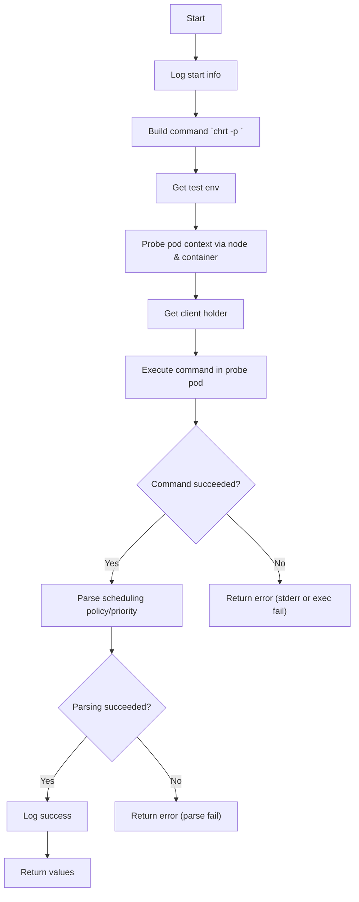

#### 4) Function dependencies (Mermaid)
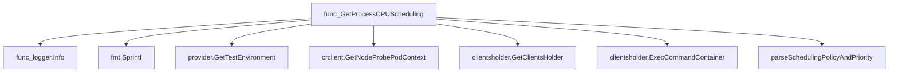

#### 5) Functions calling `GetProcessCPUScheduling` (Mermaid)
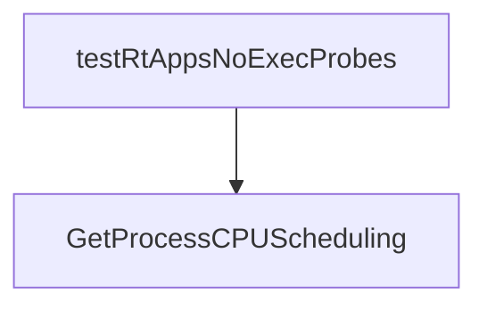

#### 6) Usage example (Go)
```go
// Minimal example invoking GetProcessCPUScheduling
import (
    "github.com/redhat-best-practices-for-k8s/certsuite/pkg/scheduling"
    "github.com/redhat-best-practices-for-k8s/certsuite/pkg/provider"
)

func demo() {
    // Assume we have a container object and a PID to inspect
    var cont *provider.Container  // populated elsewhere
    pid := 1234

    policy, priority, err := scheduling.GetProcessCPUScheduling(pid, cont)
    if err != nil {
        fmt.Printf("Failed: %v\n", err)
        return
    }
    fmt.Printf("PID %d has policy %s with priority %d\n", pid, policy, priority)
}
```

---

### PolicyIsRT

**PolicyIsRT** - Checks whether the provided scheduling policy name corresponds to one of the real‑time policies (`SCHED_FIFO` or `SCHED_RR`).


#### Signature (Go)

```go
func PolicyIsRT(schedPolicy string) bool
```

#### Summary Table

| Aspect | Details |
|--------|---------|
| **Purpose** | Checks whether the provided scheduling policy name corresponds to one of the real‑time policies (`SCHED_FIFO` or `SCHED_RR`). |
| **Parameters** | `schedPolicy string – The name of the scheduling policy to test. |
| **Return value** | `bool – true if the policy is either FIFO or Round‑Robin, otherwise false. |
| **Key dependencies** | *Uses constants* `SchedulingFirstInFirstOut` and `SchedulingRoundRobin`. |
| **Side effects** | None. Pure function with no state mutation or I/O. |
| **How it fits the package** | Provides a simple predicate used by tests to determine if a container process runs under a real‑time scheduling policy. |

#### Internal workflow (Mermaid)

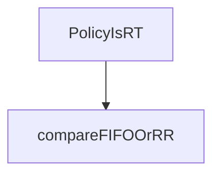

*`compareFIFOOrRR` represents the conditional check against the two constants.*

#### Function dependencies

None – this function is currently not referenced elsewhere in the package.

#### Functions calling `PolicyIsRT` (Mermaid)

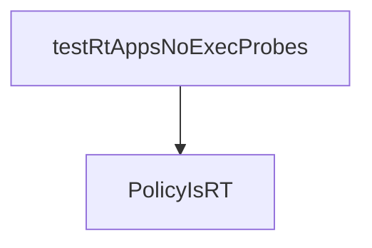

The test function `testRtAppsNoExecProbes` from the performance tests calls `PolicyIsRT` to verify that processes with exec probes are not running under a real‑time scheduling policy.

#### Usage example (Go)

```go
// Minimal example invoking PolicyIsRT
package main

import (
	"fmt"

	"github.com/redhat-best-practices-for-k8s/certsuite/pkg/scheduling"
)

func main() {
	policy := "SCHED_FIFO" // Example policy name
	if scheduling.PolicyIsRT(policy) {
		fmt.Printf("%s is a real‑time scheduling policy.\n", policy)
	} else {
		fmt.Printf("%s is NOT a real‑time scheduling policy.\n", policy)
	}
}
```

---

---

### ProcessPidsCPUScheduling

**ProcessPidsCPUScheduling** - Determines whether each process in a container satisfies the CPU scheduling policy specified by `check`. Returns two slices of report objects: compliant and non‑compliant.


#### Signature (Go)
```go
func ProcessPidsCPUScheduling(processes []*crclient.Process, testContainer *provider.Container, check string, logger *log.Logger) ([]*testhelper.ReportObject, []*testhelper.ReportObject)
```

#### Summary Table
| Aspect | Details |
|--------|---------|
| **Purpose** | Determines whether each process in a container satisfies the CPU scheduling policy specified by `check`. Returns two slices of report objects: compliant and non‑compliant. |
| **Parameters** | - `processes []*crclient.Process` – list of processes to evaluate.<br>- `testContainer *provider.Container` – container whose processes are checked.<br>- `check string` – policy type (`SharedCPUScheduling`, `ExclusiveCPUScheduling`, or `IsolatedCPUScheduling`).<br>- `logger *log.Logger` – logger for debug/error messages. |
| **Return value** | Two slices of `*testhelper.ReportObject`: first compliant processes, second non‑compliant. |
| **Key dependencies** | - `GetProcessCPUSchedulingFn(process.Pid, testContainer)`<br>- `SetContainerProcessValues(schedulePolicy, fmt.Sprint(schedulePriority), process.Args)`<br>- `testhelper.NewContainerReportObject(...)` |
| **Side effects** | Generates log output; creates report objects but does not modify input data or container state. |
| **How it fits the package** | Central routine used by tests to enforce CPU scheduling rules on containers’ processes, feeding results into performance checks. |

#### Internal workflow (Mermaid)
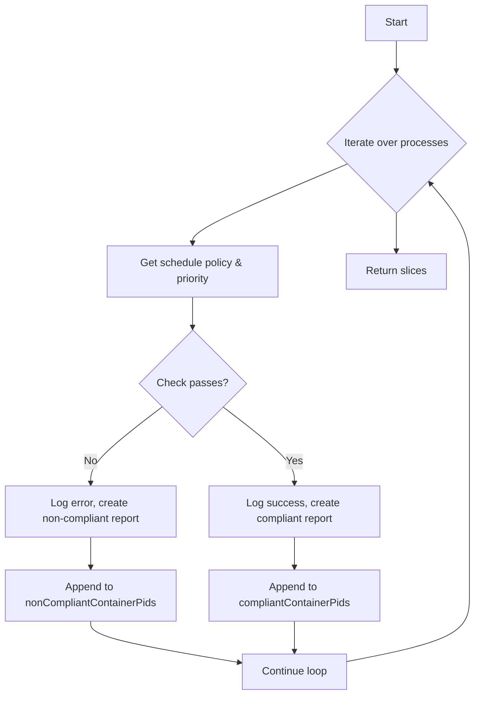

#### Function dependencies (Mermaid)
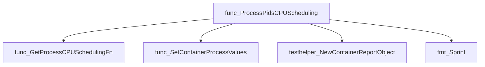

#### Functions calling `ProcessPidsCPUScheduling` (Mermaid)
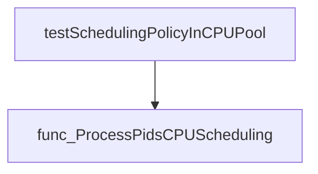

#### Usage example (Go)
```go
// Minimal example invoking ProcessPidsCPUScheduling
import (
    "log"
    "github.com/redhat-best-practices-for-k8s/certsuite/pkg/crclient"
    "github.com/redhat-best-practices-for-k8s/certsuite/pkg/provider"
)

func main() {
    // Assume we already have a container and its processes.
    var container *provider.Container
    var processes []*crclient.Process

    logger := log.Default()
    compliant, nonCompliant := ProcessPidsCPUScheduling(processes, container, SharedCPUScheduling, logger)

    fmt.Printf("Compliant: %d, Non‑compliant: %d\n", len(compliant), len(nonCompliant))
}
```

---

## Local Functions

### parseSchedulingPolicyAndPriority

**parseSchedulingPolicyAndPriority** - Extracts the CPU scheduling policy and priority from the text produced by `chrt -p <pid>`; returns them or an error if parsing fails.


```go
func parseSchedulingPolicyAndPriority(chrtCommandOutput string) (schedPolicy string, schedPriority int, err error)
```

| Aspect | Details |
|--------|---------|
| **Purpose** | Extracts the CPU scheduling policy and priority from the text produced by `chrt -p <pid>`; returns them or an error if parsing fails. |
| **Parameters** | `chrtCommandOutput string` – raw stdout of the command, typically containing two lines such as: <br>“pid 476's current scheduling policy: SCHED_OTHER”<br>“pid 476's current scheduling priority: 0” |
| **Return value** | `<schedPolicy string, schedPriority int, err error>` – parsed values or an error. `InvalidPriority` is returned if conversion fails. |
| **Key dependencies** | • `strings.Split`, `strings.Fields`, `strings.Contains`<br>• `len` (builtin)<br>• `strconv.Atoi`<br>• `log.Error` from the internal logging package<br>• `fmt.Errorf` |
| **Side effects** | Logs an error message via `log.Error` when `Atoi` fails. No other state changes. |
| **How it fits the package** | Helper for `GetProcessCPUScheduling`, turning command output into structured data that callers use to verify scheduling policies on test containers. |

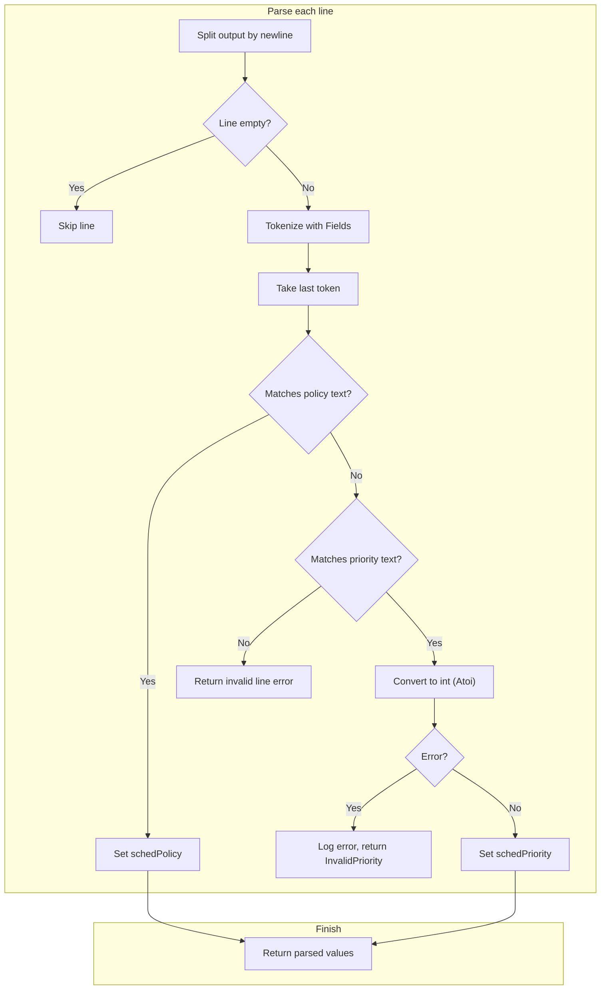

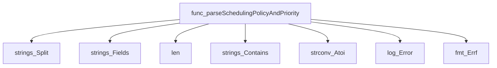

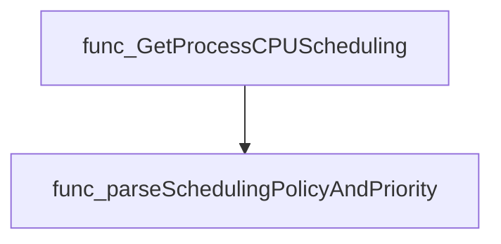

#### Usage example (Go)

```go
// Minimal example invoking parseSchedulingPolicyAndPriority
output := "pid 476's current scheduling policy: SCHED_OTHER\n" +
          "pid 476's current scheduling priority: 0"

policy, priority, err := parseSchedulingPolicyAndPriority(output)
if err != nil {
    fmt.Println("Error:", err)
} else {
    fmt.Printf("Policy: %s, Priority: %d\n", policy, priority)
}
```

---

