# Package stringhelper

**Path**: `pkg/stringhelper`

## Table of Contents

- [Overview](#overview)
- [Exported Functions](#exported-functions)
  - [HasAtLeastOneCommonElement](#hasatleastonecommonelement)
  - [PointerToString](#pointertostring)
  - [RemoveEmptyStrings](#removeemptystrings)
  - [StringInSlice](#stringinslice)
  - [SubSlice](#subslice)

## Overview

The stringhelper package supplies small utilities for working with strings and string slices—checking membership, filtering empty values, and handling pointer-to-string conversions for logging.

### Key Features

- Determines whether a value exists in a slice (StringInSlice) and supports optional containment checks.
- Removes empty entries from a string slice (RemoveEmptyStrings).
- Generates human‑readable text of any typed pointer (PointerToString).

### Design Notes

- Uses Go generics for StringInSlice to accept any comparable type, assuming the caller trims spaces if needed.
- The trimming logic only removes leading/trailing whitespace; it does not normalize internal spacing.
- Functions are designed as pure helpers; they should be called directly rather than wrapped in a struct.

### Exported Functions Summary

| Name | Purpose |
|------|----------|
| [func HasAtLeastOneCommonElement(s1, s2 []string) bool](#hasatleastonecommonelement) | Returns `true` if any string in `s2` is also present in `s1`; otherwise returns `false`. |
| [func PointerToString[T any](p *T) string](#pointertostring) | Provides a default textual form of a value pointed to by `p`, used mainly in log traces for Kubernetes resource pointer fields. |
| [func RemoveEmptyStrings(s []string) []string](#removeemptystrings) | Returns a new slice containing only non‑empty strings from the input slice. |
| [func StringInSlice[T ~string](s []T, str T, containsCheck bool) bool](#stringinslice) | Determines if `str` exists in slice `s`. If `containsCheck` is `false`, the comparison is exact after trimming spaces; otherwise it checks for containment of `str` within each element. |
| [func SubSlice(s, sub []string) bool](#subslice) | Determines whether every string in `sub` appears in the slice `s`. |

## Exported Functions

### HasAtLeastOneCommonElement

**HasAtLeastOneCommonElement** - Returns `true` if any string in `s2` is also present in `s1`; otherwise returns `false`.

Checks whether two string slices share at least one identical element.

#### Signature (Go)

```go
func HasAtLeastOneCommonElement(s1, s2 []string) bool
```

#### Summary Table

| Aspect | Details |
|--------|---------|
| **Purpose** | Returns `true` if any string in `s2` is also present in `s1`; otherwise returns `false`. |
| **Parameters** | `s1 []string – first slice to search; s2 []string – second slice whose elements are checked against the first.` |
| **Return value** | `bool – true when at least one common element exists, false otherwise.` |
| **Key dependencies** | • Calls `StringInSlice` from the same package. |
| **Side effects** | None; purely functional and side‑effect free. |
| **How it fits the package** | Provides a simple set intersection test used by other helpers in `stringhelper`. |

#### Internal workflow (Mermaid)

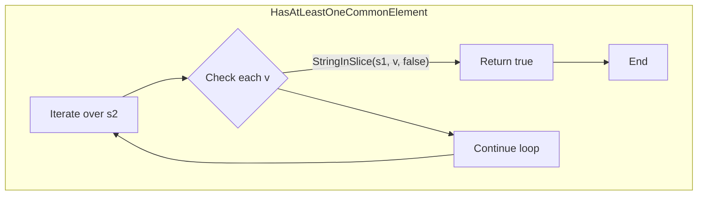

#### Function dependencies (Mermaid)

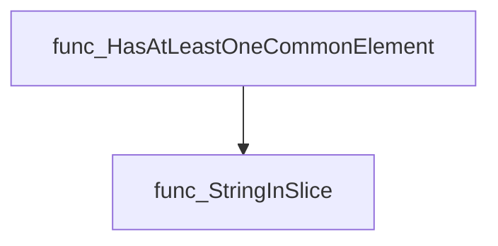

#### Functions calling `HasAtLeastOneCommonElement` (Mermaid)

None – this function is currently not referenced elsewhere in the package.

#### Usage example (Go)

```go
package main

import (
    "fmt"
    "github.com/redhat-best-practices-for-k8s/certsuite/pkg/stringhelper"
)

func main() {
    a := []string{"apple", "banana", "cherry"}
    b := []string{"durian", "banana", "fig"}

    if stringhelper.HasAtLeastOneCommonElement(a, b) {
        fmt.Println("The slices share at least one element.")
    } else {
        fmt.Println("No common elements found.")
    }
}
```

---

### PointerToString

**PointerToString** - Provides a default textual form of a value pointed to by `p`, used mainly in log traces for Kubernetes resource pointer fields.

A generic helper that converts a pointer value into its string representation, returning `"nil"` when the pointer is nil.

#### Signature (Go)

```go
func PointerToString[T any](p *T) string
```

#### Summary Table

| Aspect | Details |
|--------|---------|
| **Purpose** | Provides a default textual form of a value pointed to by `p`, used mainly in log traces for Kubernetes resource pointer fields. |
| **Parameters** | `p *T` – any type pointer whose underlying value should be stringified. |
| **Return value** | `string` – `"nil"` if `p` is nil; otherwise the result of `fmt.Sprint(*p)`. |
| **Key dependencies** | • `fmt.Sprint` from the standard library. |
| **Side effects** | None – purely functional, no state mutation or I/O. |
| **How it fits the package** | Part of the `stringhelper` utility package; facilitates readable logging across the project where pointer values are common (e.g., security contexts). |

#### Internal workflow

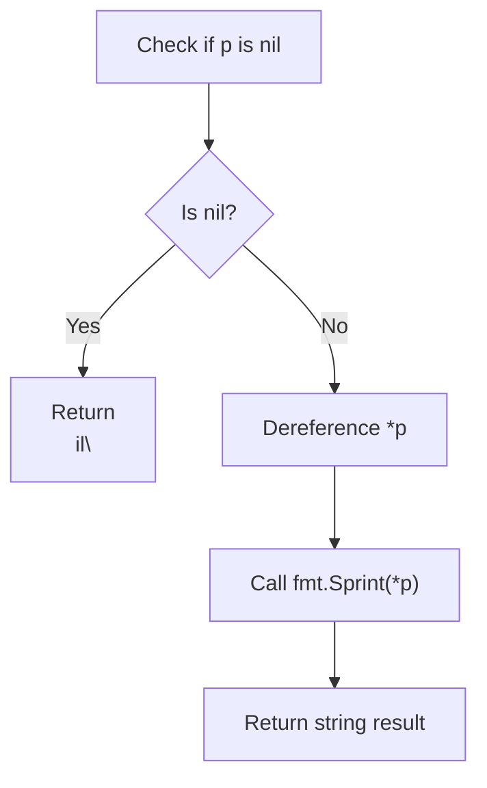

#### Function dependencies

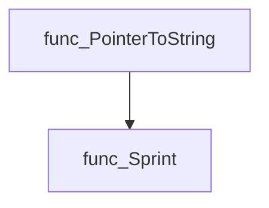

#### Functions calling `PointerToString`

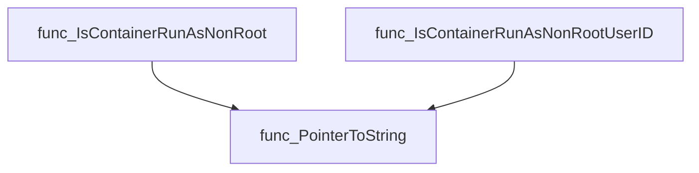

#### Usage example (Go)

```go
// Minimal example invoking PointerToString
package main

import (
 "fmt"

 "github.com/redhat-best-practices-for-k8s/certsuite/pkg/stringhelper"
)

func main() {
 var b *bool
 fmt.Println(stringhelper.PointerToString(b)) // "nil"

 bTrue := true
 fmt.Println(stringhelper.PointerToString(&bTrue)) // "true"

 num := 1984
 fmt.Println(stringhelper.PointerToString(&num)) // "1984"
}
```

---

### RemoveEmptyStrings

**RemoveEmptyStrings** - Returns a new slice containing only non‑empty strings from the input slice.

```go
func RemoveEmptyStrings(s []string) []string
```

| Aspect | Details |
|--------|---------|
| **Purpose** | Returns a new slice containing only non‑empty strings from the input slice. |
| **Parameters** | `s []string` – Slice of strings to filter. |
| **Return value** | `[]string` – New slice with all empty (`""`) entries removed. |
| **Key dependencies** | • Built‑in `append` function. |
| **Side effects** | None; operates purely on the input data and returns a new slice. |
| **How it fits the package** | Utility helper for normalizing string slices, used internally wherever clean lists of strings are required. |

#### Internal workflow

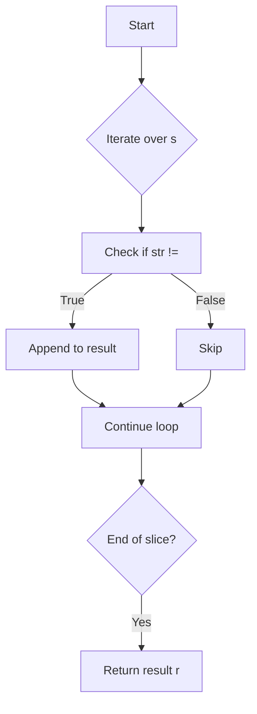

#### Function dependencies

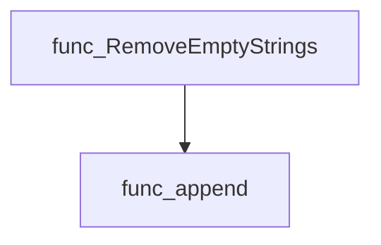

#### Functions calling `RemoveEmptyStrings`

None – this function is currently not referenced elsewhere in the package.

#### Usage example

```go
// Minimal example invoking RemoveEmptyStrings
package main

import (
 "fmt"
 "github.com/redhat-best-practices-for-k8s/certsuite/pkg/stringhelper"
)

func main() {
 input := []string{"foo", "", "bar", "", "baz"}
 cleaned := stringhelper.RemoveEmptyStrings(input)
 fmt.Println(cleaned) // Output: [foo bar baz]
}
```

---

### StringInSlice

**StringInSlice** - Determines if `str` exists in slice `s`. If `containsCheck` is `false`, the comparison is exact after trimming spaces; otherwise it checks for containment of `str` within each element.

Checks whether a given value is present in a slice of comparable string types, optionally performing substring matching.

---

#### Signature (Go)

```go
func StringInSlice[T ~string](s []T, str T, containsCheck bool) bool
```

---

#### Summary Table

| Aspect | Details |
|--------|---------|
| **Purpose** | Determines if `str` exists in slice `s`. If `containsCheck` is `false`, the comparison is exact after trimming spaces; otherwise it checks for containment of `str` within each element. |
| **Parameters** | `s []T` – slice to search<br>`str T` – value or substring to find<br>`containsCheck bool` – flag selecting exact vs. contains match |
| **Return value** | `bool` – `true` if a matching element is found, otherwise `false` |
| **Key dependencies** | • `strings.TrimSpace(string(v))`<br>• `strings.Contains(strings.TrimSpace(string(v)), string(str))`<br>• implicit conversion to `string` |
| **Side effects** | None – purely functional; no mutation or I/O. |
| **How it fits the package** | Provides a generic helper for slice membership checks used across many other utilities in `pkg/stringhelper`. |

---

#### Internal workflow (Mermaid)

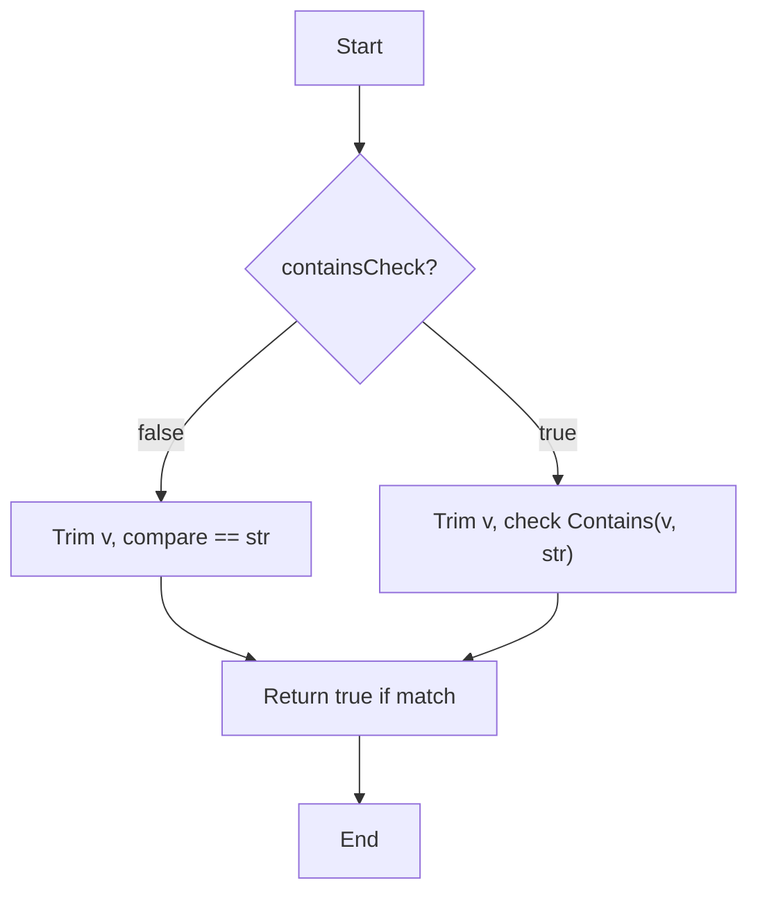

---

#### Function dependencies (Mermaid)

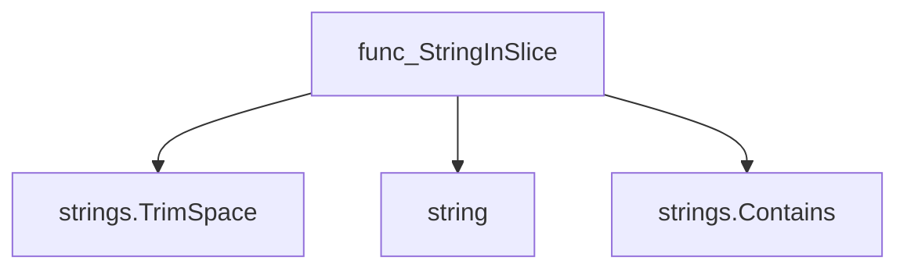

---

#### Functions calling `StringInSlice` (Mermaid)

```mermaid
graph TD
  func_getServices --> func_StringInSlice
  func_isIstioServiceMeshInstalled --> func_StringInSlice
  func_GetTestSuites --> func_StringInSlice
  func_BetaRHCOSVersionsFoundToMatch --> func_StringInSlice
  func_Node.IsControlPlaneNode --> func_StringInSlice
  func_Node.IsWorkerNode --> func_StringInSlice
  func_HasAtLeastOneCommonElement --> func_StringInSlice
  func_SubSlice --> func_StringInSlice
  func_isContainerCapabilitySet --> func_StringInSlice
  func_testSysPtraceCapability --> func_StringInSlice
  func_TestCrsNamespaces --> func_StringInSlice
  func_checkContainCategory --> func_StringInSlice
  func_isMultiNamespacedOperator --> func_StringInSlice
  func_testOperatorCatalogSourceBundleCount --> func_StringInSlice
  func_FsDiff.intersectTargetFolders --> func_StringInSlice
```

---

#### Usage example (Go)

```go
// Minimal example invoking StringInSlice
package main

import (
 "fmt"
 "github.com/redhat-best-practices-for-k8s/certsuite/pkg/stringhelper"
)

func main() {
 names := []string{"alpha", "beta", "gamma"}
 fmt.Println(stringhelper.StringInSlice(names, "beta", false))   // true
 fmt.Println(stringhelper.StringInSlice(names, "b", true))      // true (contains)
 fmt.Println(stringhelper.StringInSlice(names, "delta", false)) // false
}
```

---

### SubSlice

**SubSlice** - Determines whether every string in `sub` appears in the slice `s`.

#### 1) Signature (Go)

```go
func SubSlice(s, sub []string) bool
```

#### 2) Summary Table

| Aspect | Details |
|--------|---------|
| **Purpose** | Determines whether every string in `sub` appears in the slice `s`. |
| **Parameters** | *`s []string`* – candidate slice.<br>*`sub []string`* – slice whose elements must be present in `s`. |
| **Return value** | `bool` – `true` if all elements of `sub` are found in `s`; otherwise `false`. |
| **Key dependencies** | • Calls generic helper `StringInSlice[T]` (defined in the same package). |
| **Side effects** | None. The function performs only read‑only checks. |
| **How it fits the package** | Utility for set‑like containment tests, used by other components such as capability validation logic. |

#### 3) Internal workflow (Mermaid)

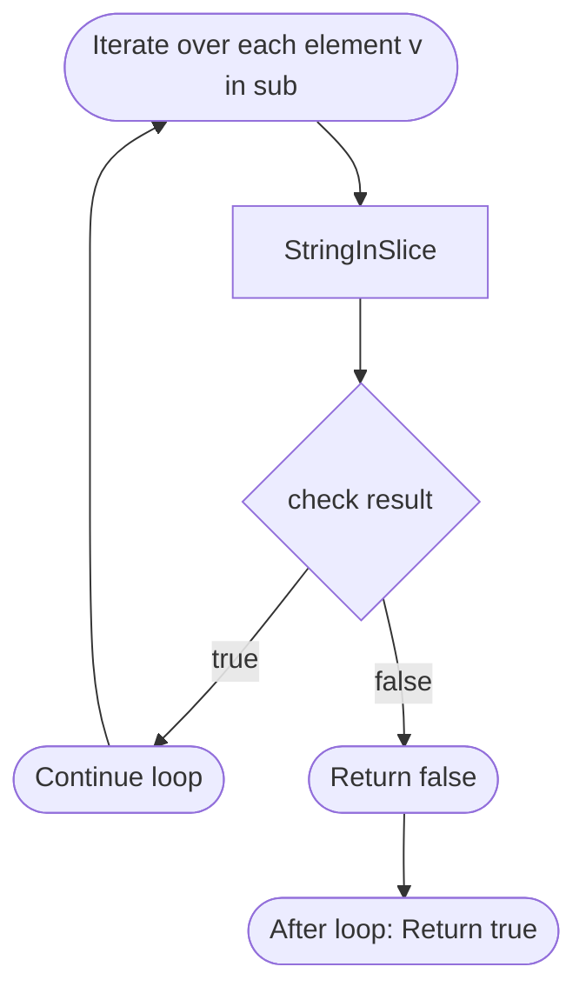

#### 4) Function dependencies (Mermaid)

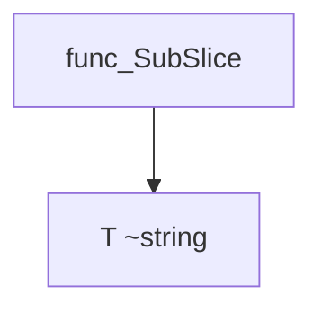

#### 5) Functions calling `SubSlice` (Mermaid)

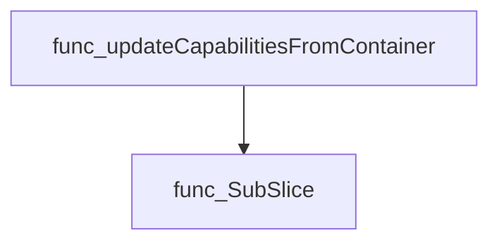

#### 6) Usage example (Go)

```go
// Minimal example invoking SubSlice
package main

import (
 "fmt"
 "github.com/redhat-best-practices-for-k8s/certsuite/pkg/stringhelper"
)

func main() {
 s := []string{"read", "write", "execute"}
 sub := []string{"read", "execute"}

 if stringhelper.SubSlice(s, sub) {
  fmt.Println("All elements of sub are present in s")
 } else {
  fmt.Println("Not all elements of sub are present in s")
 }
}
```

---
