# Package testhelper

**Path**: `pkg/testhelper`

## Table of Contents

- [Overview](#overview)
- [Structs](#structs)
  - [FailureReasonOut](#failurereasonout)
  - [ReportObject](#reportobject)
- [Exported Functions](#exported-functions)
  - [Equal](#equal)
  - [FailureReasonOut.Equal](#failurereasonout.equal)
  - [FailureReasonOutTestString](#failurereasonoutteststring)
  - [GetDaemonSetFailedToSpawnSkipFn](#getdaemonsetfailedtospawnskipfn)
  - [GetNoAffinityRequiredPodsSkipFn](#getnoaffinityrequiredpodsskipfn)
  - [GetNoBareMetalNodesSkipFn](#getnobaremetalnodesskipfn)
  - [GetNoCPUPinningPodsSkipFn](#getnocpupinningpodsskipfn)
  - [GetNoCatalogSourcesSkipFn](#getnocatalogsourcesskipfn)
  - [GetNoContainersUnderTestSkipFn](#getnocontainersundertestskipfn)
  - [GetNoCrdsUnderTestSkipFn](#getnocrdsundertestskipfn)
  - [GetNoDeploymentsUnderTestSkipFn](#getnodeploymentsundertestskipfn)
  - [GetNoGuaranteedPodsWithExclusiveCPUsSkipFn](#getnoguaranteedpodswithexclusivecpusskipfn)
  - [GetNoHugepagesPodsSkipFn](#getnohugepagespodsskipfn)
  - [GetNoIstioSkipFn](#getnoistioskipfn)
  - [GetNoNamespacesSkipFn](#getnonamespacesskipfn)
  - [GetNoNodesWithRealtimeKernelSkipFn](#getnonodeswithrealtimekernelskipfn)
  - [GetNoOperatorCrdsSkipFn](#getnooperatorcrdsskipfn)
  - [GetNoOperatorPodsSkipFn](#getnooperatorpodsskipfn)
  - [GetNoOperatorsSkipFn](#getnooperatorsskipfn)
  - [GetNoPersistentVolumeClaimsSkipFn](#getnopersistentvolumeclaimsskipfn)
  - [GetNoPersistentVolumesSkipFn](#getnopersistentvolumesskipfn)
  - [GetNoPodsUnderTestSkipFn](#getnopodsundertestskipfn)
  - [GetNoRolesSkipFn](#getnorolesskipfn)
  - [GetNoSRIOVPodsSkipFn](#getnosriovpodsskipfn)
  - [GetNoServicesUnderTestSkipFn](#getnoservicesundertestskipfn)
  - [GetNoStatefulSetsUnderTestSkipFn](#getnostatefulsetsundertestskipfn)
  - [GetNoStorageClassesSkipFn](#getnostorageclassesskipfn)
  - [GetNonOCPClusterSkipFn](#getnonocpclusterskipfn)
  - [GetNotEnoughWorkersSkipFn](#getnotenoughworkersskipfn)
  - [GetNotIntrusiveSkipFn](#getnotintrusiveskipfn)
  - [GetPodsWithoutAffinityRequiredLabelSkipFn](#getpodswithoutaffinityrequiredlabelskipfn)
  - [GetSharedProcessNamespacePodsSkipFn](#getsharedprocessnamespacepodsskipfn)
  - [NewCatalogSourceReportObject](#newcatalogsourcereportobject)
  - [NewCertifiedContainerReportObject](#newcertifiedcontainerreportobject)
  - [NewClusterOperatorReportObject](#newclusteroperatorreportobject)
  - [NewClusterVersionReportObject](#newclusterversionreportobject)
  - [NewContainerReportObject](#newcontainerreportobject)
  - [NewCrdReportObject](#newcrdreportobject)
  - [NewDeploymentReportObject](#newdeploymentreportobject)
  - [NewHelmChartReportObject](#newhelmchartreportobject)
  - [NewNamespacedNamedReportObject](#newnamespacednamedreportobject)
  - [NewNamespacedReportObject](#newnamespacedreportobject)
  - [NewNodeReportObject](#newnodereportobject)
  - [NewOperatorReportObject](#newoperatorreportobject)
  - [NewPodReportObject](#newpodreportobject)
  - [NewReportObject](#newreportobject)
  - [NewStatefulSetReportObject](#newstatefulsetreportobject)
  - [NewTaintReportObject](#newtaintreportobject)
  - [ReportObject.AddField](#reportobject.addfield)
  - [ReportObject.SetContainerProcessValues](#reportobject.setcontainerprocessvalues)
  - [ReportObject.SetType](#reportobject.settype)
  - [ReportObjectTestString](#reportobjectteststring)
  - [ReportObjectTestStringPointer](#reportobjectteststringpointer)
  - [ResultObjectsToString](#resultobjectstostring)
  - [ResultToString](#resulttostring)

## Overview

The testhelper package supplies utilities for generating and comparing compliance reports in the certsuite test framework, providing helper types, constants, and a rich set of functions to create report objects, evaluate test conditions, and format results.

### Key Features

- Convenient construction of typed ReportObject instances representing Kubernetes resources (pods, containers, operators, etc.)
- Skip‑condition generators that return closures to decide whether tests should run based on the current TestEnvironment
- Functions for serialising and comparing report collections to produce human‑readable diagnostics

### Design Notes

- ReportObject fields are stored as parallel key/value slices rather than a map for deterministic ordering in output
- Skip functions are closures to defer evaluation until test execution, allowing dynamic environment checks
- Comparison helpers treat nil pointers as equal only when both are nil to avoid false positives

### Structs Summary

| Name | Purpose |
|------|----------|
| [**FailureReasonOut**](#failurereasonout) | One-line purpose |
| [**ReportObject**](#reportobject) | One-line purpose |

### Exported Functions Summary

| Name | Purpose |
|------|----------|
| [func Equal(p, other []*ReportObject) bool](#equal) | Determines whether two slices of pointers to `ReportObject` contain the same elements in the same order, treating `nil` pointers as equal only when both are `nil`. |
| [func (p FailureReasonOut) Equal(other FailureReasonOut) bool](#failurereasonout.equal) | Determines if two `FailureReasonOut` instances contain the same compliant and non‑compliant objects. |
| [func FailureReasonOutTestString(p FailureReasonOut) (out string)](#failurereasonoutteststring) | Generates a deterministic, human‑readable string that represents the contents of a `FailureReasonOut` value for use in tests and debugging. |
| [func GetDaemonSetFailedToSpawnSkipFn(env *provider.TestEnvironment) func() (bool, string)](#getdaemonsetfailedtospawnskipfn) | Generates a closure that indicates if the probe daemonset did not start successfully. The returned function can be used as a skip condition in tests. |
| [func (*provider.TestEnvironment)(func() (bool, string))](#getnoaffinityrequiredpodsskipfn) | Returns a closure that evaluates whether the test should be skipped because no pods with required affinity are present. |
| [func (*provider.TestEnvironment)(func() (bool, string))](#getnobaremetalnodesskipfn) | Returns a closure that indicates if tests should be skipped because the test environment contains no bare‑metal nodes. The returned function yields `true` and an explanatory message when the condition is met. |
| [func(*provider.TestEnvironment)(func() (bool, string))](#getnocpupinningpodsskipfn) | Supplies a closure used by tests to skip execution when no CPU‑pinning pods exist. |
| [func GetNoCatalogSourcesSkipFn(env *provider.TestEnvironment) func() (bool, string)](#getnocatalogsourcesskipfn) | Returns a closure that decides whether to skip tests when no catalog sources are available in the test environment. |
| [func GetNoContainersUnderTestSkipFn(env *provider.TestEnvironment) func() (bool, string)](#getnocontainersundertestskipfn) | Returns a function that evaluates whether a test should be skipped because the test environment contains zero containers. The returned function yields a boolean indicating skip status and an accompanying message. |
| [func GetNoCrdsUnderTestSkipFn(env *provider.TestEnvironment)(func() (bool, string))](#getnocrdsundertestskipfn) | Returns a closure that checks if `env.Crds` is empty; if so, signals the test framework to skip with an explanatory message. |
| [func GetNoDeploymentsUnderTestSkipFn(env *provider.TestEnvironment) func() (bool, string)](#getnodeploymentsundertestskipfn) | Returns a closure that signals whether tests requiring deployments should be skipped when the environment contains no deployment objects. |
| [func GetNoGuaranteedPodsWithExclusiveCPUsSkipFn(env *provider.TestEnvironment) func() (bool, string)](#getnoguaranteedpodswithexclusivecpusskipfn) | Creates a closure that determines whether tests requiring guaranteed pods with exclusive CPUs should be skipped. It returns `true` if none are found, along with an explanatory message. |
| [func GetNoHugepagesPodsSkipFn(env *provider.TestEnvironment) func() (bool, string)](#getnohugepagespodsskipfn) | Generates a closure that determines if tests requiring huge‑page pods should be skipped. The closure returns `true` and a message when no such pods are present in the test environment. |
| [func GetNoIstioSkipFn(env *provider.TestEnvironment) func() (bool, string)](#getnoistioskipfn) | Returns a closure that determines if tests requiring Istio should be skipped because no Istio service mesh was detected. |
| [func GetNoNamespacesSkipFn(env *provider.TestEnvironment) func() (bool, string)](#getnonamespacesskipfn) | Returns a function that evaluates the current `TestEnvironment`. If the environment contains no namespaces, the returned function signals to skip the test with an explanatory message. |
| [func GetNoNodesWithRealtimeKernelSkipFn(env *provider.TestEnvironment) func() (bool, string)](#getnonodeswithrealtimekernelskipfn) | Returns a closure that evaluates whether the test environment contains any node with a realtime kernel. If none are found, the closure returns `true` and an explanatory message to skip tests that require such nodes. |
| [func GetNoOperatorCrdsSkipFn(env *provider.TestEnvironment) func() (bool, string)](#getnooperatorcrdsskipfn) | Returns a closure that decides if a test must be skipped because no Operator Custom Resource Definitions (CRDs) are present in the provided test environment. |
| [func GetNoOperatorPodsSkipFn(env *provider.TestEnvironment) func() (bool, string)](#getnooperatorpodsskipfn) | Returns a closure that checks if the test environment contains any operator pods; if none are present, it signals that tests should be skipped with an explanatory message. |
| [func GetNoOperatorsSkipFn(env *provider.TestEnvironment) func() (bool, string)](#getnooperatorsskipfn) | Creates a predicate function that checks if `env.Operators` is empty and signals whether tests should be skipped with an explanatory message. |
| [func GetNoPersistentVolumeClaimsSkipFn(env *provider.TestEnvironment) func() (bool, string)](#getnopersistentvolumeclaimsskipfn) | Returns a closure that signals whether to skip tests due to absence of Persistent Volume Claims in the provided environment. |
| [func GetNoPersistentVolumesSkipFn(env *provider.TestEnvironment) func() (bool, string)](#getnopersistentvolumesskipfn) | Returns a closure that checks if the `env` contains any persistent volumes. If none are found, the closure reports that the test should be skipped with an explanatory message. |
| [func GetNoPodsUnderTestSkipFn(env *provider.TestEnvironment) func() (bool, string)](#getnopodsundertestskipfn) | Generates a skip function that evaluates the presence of pods in the supplied test environment. If no pods exist, the test is skipped with an explanatory message. |
| [func GetNoRolesSkipFn(env *provider.TestEnvironment) func() (bool, string)](#getnorolesskipfn) | Returns a closure that evaluates whether tests should be skipped due to an empty `Roles` slice in the supplied test environment. |
| [func GetNoSRIOVPodsSkipFn(env *provider.TestEnvironment) func() (bool, string)](#getnosriovpodsskipfn) | Returns a closure that decides if the test suite should be skipped when no SR‑IOV enabled pods are available. |
| [func GetNoServicesUnderTestSkipFn(env *provider.TestEnvironment) func() (bool, string)](#getnoservicesundertestskipfn) | Supplies a closure that determines whether a test should be skipped because the provided `TestEnvironment` contains no services. |
| [func GetNoStatefulSetsUnderTestSkipFn(env *provider.TestEnvironment) func() (bool, string)](#getnostatefulsetsundertestskipfn) | Returns a function that signals to skip tests when the test environment contains no StatefulSet objects. |
| [func GetNoStorageClassesSkipFn(env *provider.TestEnvironment) func() (bool, string)](#getnostorageclassesskipfn) | Generates a closure that determines if the test should be skipped due to the absence of storage classes. |
| [func GetNonOCPClusterSkipFn() func() (bool, string)](#getnonocpclusterskipfn) | Provides a function that returns `true` and a message when the environment is *not* an OCP cluster, allowing tests to be skipped in non‑OCP contexts. |
| [func GetNotEnoughWorkersSkipFn(env *provider.TestEnvironment, minWorkerNodes int) func() (bool, string)](#getnotenoughworkersskipfn) | Generates a closure that determines whether to skip a test because the cluster contains fewer worker nodes than `minWorkerNodes`. |
| [func GetNotIntrusiveSkipFn(env *provider.TestEnvironment) func() (bool, string)](#getnotintrusiveskipfn) | Creates a closure that indicates whether the current test should be skipped because it is not meant to run in an intrusive environment. |
| [func GetPodsWithoutAffinityRequiredLabelSkipFn(env *provider.TestEnvironment) func() (bool, string)](#getpodswithoutaffinityrequiredlabelskipfn) | Returns a closure that signals whether to skip a test when no pods are found without the required affinity label. |
| [func GetSharedProcessNamespacePodsSkipFn(env *provider.TestEnvironment) func() (bool, string)](#getsharedprocessnamespacepodsskipfn) | Returns a closure that checks if any shared‑process‑namespace pods are present in the given `TestEnvironment`. If none exist, the closure signals to skip the test with an explanatory message. |
| [func NewCatalogSourceReportObject(aNamespace, aCatalogSourceName, aReason string, isCompliant bool) *ReportObject](#newcatalogsourcereportobject) | Builds a `*ReportObject` that records the status of a catalog source, including its namespace, name, compliance reason, and type. |
| [func NewCertifiedContainerReportObject(cii provider.ContainerImageIdentifier, aReason string, isCompliant bool) *ReportObject](#newcertifiedcontainerreportobject) | Builds a `ReportObject` that records compliance information for a container image identified by its digest, repository, tag, and registry. |
| [func NewClusterOperatorReportObject(aClusterOperatorName, aReason string, isCompliant bool) (*ReportObject)](#newclusteroperatorreportobject) | Builds a `ReportObject` for a cluster operator, setting its type and compliance reason. |
| [func NewClusterVersionReportObject(version, aReason string, isCompliant bool) (out *ReportObject)](#newclusterversionreportobject) | Constructs a `ReportObject` for a cluster’s version and records whether the version meets compliance criteria. |
| [func NewContainerReportObject(aNamespace, aPodName, aContainerName, aReason string, isCompliant bool) (*ReportObject)](#newcontainerreportobject) | Builds a `ReportObject` representing the status of a specific container within a pod. It records namespace, pod name, container name, compliance reason, and whether the container complies with policy. |
| [func NewCrdReportObject(aName, aVersion, aReason string, isCompliant bool) (*ReportObject)](#newcrdreportobject) | Instantiates a `ReportObject` describing a Custom Resource Definition (CRD), embedding its name, version, compliance reason, and status. |
| [func NewDeploymentReportObject(aNamespace, aDeploymentName, aReason string, isCompliant bool) (*ReportObject)](#newdeploymentreportobject) | Instantiates a `ReportObject` representing the status of a Kubernetes deployment, embedding namespace, name, compliance reason, and type. |
| [func NewHelmChartReportObject(aNamespace, aHelmChartName, aReason string, isCompliant bool) (*ReportObject)](#newhelmchartreportobject) | Constructs a `ReportObject` tailored for a Helm chart, embedding namespace, chart name, compliance reason, and status. |
| [func NewNamespacedNamedReportObject(aReason, aType string, isCompliant bool, aNamespace, aName string) (*ReportObject)](#newnamespacednamedreportobject) | Builds a `ReportObject` pre‑populated with the supplied reason, type and compliance flag, then adds namespace and name fields. |
| [func NewNamespacedReportObject(aReason, aType string, isCompliant bool, aNamespace string) (*ReportObject)](#newnamespacedreportobject) | Builds a `ReportObject` that records the reason for compliance/non‑compliance, its type, and associates it with a specific Kubernetes namespace. |
| [func NewNodeReportObject(aNodeName, aReason string, isCompliant bool) (out *ReportObject)](#newnodereportobject) | Instantiates a `ReportObject` representing a Kubernetes node, populating it with the node’s name, compliance status and associated reason. |
| [func NewOperatorReportObject(aNamespace, aOperatorName, aReason string, isCompliant bool) (*ReportObject)](#newoperatorreportobject) | Instantiates a `ReportObject` for an operator, populating it with namespace, name, and compliance reason. |
| [func NewPodReportObject(aNamespace, aPodName, aReason string, isCompliant bool) (*ReportObject)](#newpodreportobject) | Constructs a `ReportObject` that describes compliance for a specific pod. The object includes the namespace, pod name, and a reason indicating whether the pod complies with expected policies. |
| [func NewReportObject(aReason, aType string, isCompliant bool) (out *ReportObject)](#newreportobject) | Instantiates a `ReportObject`, sets its type and attaches a reason field that indicates compliance or non‑compliance. |
| [func NewStatefulSetReportObject(aNamespace, aStatefulSetName, aReason string, isCompliant bool) (out *ReportObject)](#newstatefulsetreportobject) | Builds a `ReportObject` representing a StatefulSet, attaching its namespace and name. |
| [func NewTaintReportObject(taintBit, nodeName, aReason string, isCompliant bool) *ReportObject](#newtaintreportobject) | Instantiates a `ReportObject` that represents the taint status of a node, attaching the node name, the specific taint bit, and an explanation for compliance or non‑compliance. |
| [func (obj *ReportObject) AddField(aKey, aValue string) (out *ReportObject)](#reportobject.addfield) | Appends the supplied key and value to the `ObjectFieldsKeys` and `ObjectFieldsValues` slices of the receiver, then returns the modified object for chaining. |
| [func (obj *ReportObject) SetContainerProcessValues(aPolicy, aPriority, aCommandLine string) *ReportObject](#reportobject.setcontainerprocessvalues) | Adds the scheduling policy, priority, and command line of a container process to the report object and marks its type as `ContainerProcessType`. |
| [func (obj *ReportObject) SetType(aType string) (*ReportObject)](#reportobject.settype) | Assigns a new value to the `ObjectType` field of the receiver and returns the updated object. |
| [func ReportObjectTestString(p []*ReportObject) (out string)](#reportobjectteststring) | Builds a single string that lists each `ReportObject` in the provided slice, using Go’s `%#v` format for readability. The output is wrapped like `[]testhelper.ReportObject{...}`. |
| [func([]*ReportObject)(string)](#reportobjectteststringpointer) | Produces a formatted string that lists the dereferenced values of each `*ReportObject` in a slice. |
| [func ResultObjectsToString(compliantObject, nonCompliantObject []*ReportObject) (string, error)](#resultobjectstostring) | Serialises compliant and non‑compliant report objects into a JSON representation of `FailureReasonOut`. |
| [func ResultToString(result int) (str string)](#resulttostring) | Translates predefined integer result codes (`SUCCESS`, `FAILURE`, `ERROR`) into human‑readable strings. Unrecognized codes yield an empty string. |

## Structs

### FailureReasonOut

Represents the result of a policy check, separating objects that satisfy the rule from those that do not.

#### Fields

| Field                | Type                 | Description |
|----------------------|----------------------|-------------|
| `CompliantObjectsOut` | `[]*ReportObject`   | Slice of pointers to report objects that met the compliance criteria. |
| `NonCompliantObjectsOut` | `[]*ReportObject` | Slice of pointers to report objects that failed the compliance check. |

#### Purpose  

The struct is used by test helpers to capture and compare the outcomes of policy evaluations. Each field holds a list of `ReportObject` instances; compliant ones are stored in `CompliantObjectsOut`, while non‑compliant ones go into `NonCompliantObjectsOut`. This separation facilitates clear assertions in tests and debugging.

#### Related functions

| Function | Purpose |
|----------|---------|
| `Equal` | Determines whether two `FailureReasonOut` values are identical by comparing both the compliant and non‑compliant object slices. |
| `FailureReasonOutTestString` | Generates a formatted string representation of a `FailureReasonOut`, useful for debugging or test output. |

---

---

### ReportObject

A lightweight container that holds a report item’s type and its key‑value metadata.

---

#### Fields

| Field | Type | Description |
|-------|------|-------------|
| `ObjectType` | `string` | Identifier of the resource or object being reported (e.g., “Deployment”, “Node”). |
| `ObjectFieldsKeys` | `[]string` | Ordered list of field names that describe the object. |
| `ObjectFieldsValues` | `[]string` | Corresponding values for each key; paired with `ObjectFieldsKeys`. |

---

#### Purpose

`ReportObject` aggregates information needed to represent a compliance or non‑compliance finding in the test suite.  
The struct stores:

1. **Type** – which resource type the report refers to.
2. **Metadata** – arbitrary key/value pairs that describe attributes of that resource (namespace, name, version, etc.).

Functions create and manipulate `ReportObject` instances; the fields are accessed when generating output or comparing reports.

---

#### Related functions

| Function | Purpose |
|----------|---------|
| `NewReportObject(aReason, aType string, isCompliant bool)` | Initializes a new `ReportObject`, sets its type, and adds either a compliance or non‑compliance reason field. |
| `AddField(aKey, aValue string)` | Appends a key/value pair to the object’s metadata slices. |
| `SetContainerProcessValues(aPolicy, aPriority, aCommandLine string)` | Adds scheduling policy, priority, and command line fields; sets type to “ContainerProcess”. |
| `SetType(aType string)` | Updates the object’s type field. |
| `NewCatalogSourceReportObject`, `NewCertifiedContainerReportObject`, `NewClusterOperatorReportObject`, `NewClusterVersionReportObject`, `NewContainerReportObject`, `NewCrdReportObject`, `NewDeploymentReportObject`, `NewHelmChartReportObject`, `NewNamespacedNamedReportObject`, `NewNamespacedReportObject`, `NewNodeReportObject`, `NewOperatorReportObject`, `NewPodReportObject`, `NewStatefulSetReportObject`, `NewTaintReportObject` | Factory helpers that construct a `ReportObject` with pre‑populated fields for specific Kubernetes resources. |
| `Equal(p, other []*ReportObject)` | Compares two slices of `ReportObject` pointers for deep equality. |
| `ResultObjectsToString(compliantObject, nonCompliantObject []*ReportObject)` | Serialises compliant and non‑compliant objects into JSON. |
| `ReportObjectTestString`, `ReportObjectTestStringPointer` | Helper functions that format a slice of `ReportObject` instances as Go code for tests. |

---

---

## Exported Functions

### Equal

**Equal** - Determines whether two slices of pointers to `ReportObject` contain the same elements in the same order, treating `nil` pointers as equal only when both are `nil`.

#### Signature (Go)

```go
func Equal(p, other []*ReportObject) bool
```

#### Summary Table

| Aspect | Details |
|--------|---------|
| **Purpose** | Determines whether two slices of pointers to `ReportObject` contain the same elements in the same order, treating `nil` pointers as equal only when both are `nil`. |
| **Parameters** | `p []*ReportObject` – first slice; `other []*ReportObject` – second slice. |
| **Return value** | `bool` – `true` if slices are equivalent, otherwise `false`. |
| **Key dependencies** | • Built‑in `len` function (called three times)  <br>• `reflect.DeepEqual` from the standard library for deep comparison of dereferenced values. |
| **Side effects** | None; purely functional. |
| **How it fits the package** | Provides a helper to validate test outputs in the `testhelper` package by comparing expected and actual report objects. |

#### Internal workflow (Mermaid)

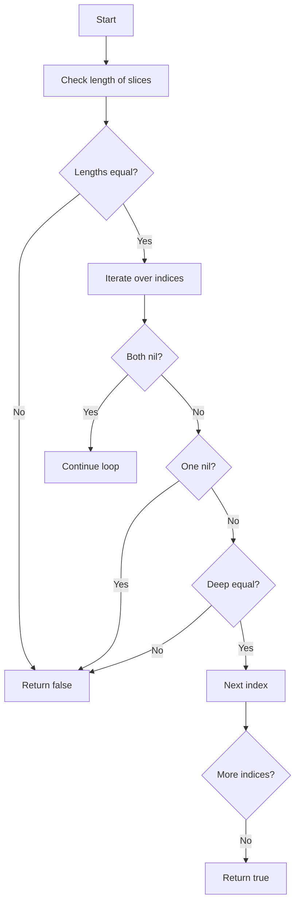

#### Function dependencies (Mermaid)

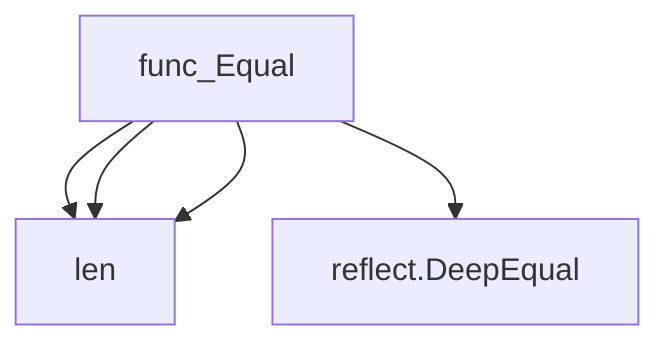

#### Functions calling `Equal` (Mermaid)

None – this function is currently not referenced elsewhere in the package.

#### Usage example (Go)

```go
// Minimal example invoking Equal
package main

import (
    "github.com/redhat-best-practices-for-k8s/certsuite/pkg/testhelper"
)

func main() {
    var a, b testhelper.ReportObject
    p := []*testhelper.ReportObject{&a}
    q := []*testhelper.ReportObject{&b}

    equal := testhelper.Equal(p, q)
    fmt.Println("Slices are equal:", equal)
}
```

---

### FailureReasonOut.Equal

**Equal** - Determines if two `FailureReasonOut` instances contain the same compliant and non‑compliant objects.

Checks whether two `FailureReasonOut` values are identical by comparing their compliant and non‑compliant object lists.

#### Signature (Go)

```go
func (p FailureReasonOut) Equal(other FailureReasonOut) bool
```

#### Summary Table

| Aspect | Details |
|--------|---------|
| **Purpose** | Determines if two `FailureReasonOut` instances contain the same compliant and non‑compliant objects. |
| **Parameters** | `other FailureReasonOut – the instance to compare against`. |
| **Return value** | `bool – true if both object lists match, false otherwise`. |
| **Key dependencies** | Calls the package‑level `Equal` helper for slice comparison of `CompliantObjectsOut` and `NonCompliantObjectsOut`. |
| **Side effects** | None; purely functional. |
| **How it fits the package** | Provides value equality logic used by tests to assert that failure reasons match expected results. |

#### Internal workflow (Mermaid)

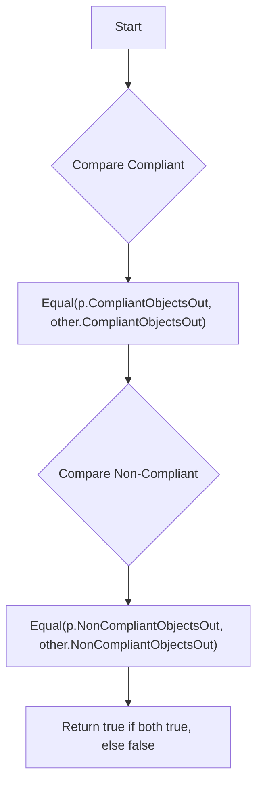

#### Function dependencies (Mermaid)

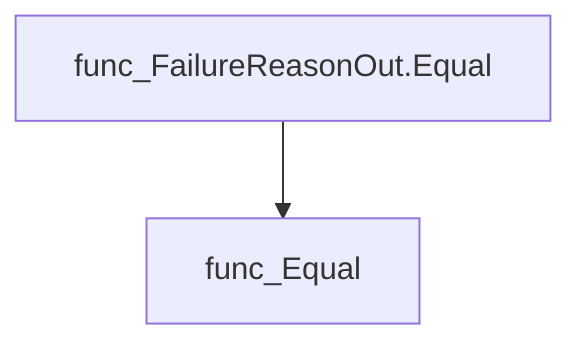

*Note: `func_Equal` refers to the helper that compares two slices of objects.*

#### Functions calling `FailureReasonOut.Equal` (Mermaid)

None – this function is currently not referenced elsewhere in the package.

#### Usage example (Go)

```go
// Minimal example invoking FailureReasonOut.Equal

out1 := testhelper.FailureReasonOut{
    CompliantObjectsOut:   []string{"objA", "objB"},
    NonCompliantObjectsOut: []string{"objC"},
}
out2 := testhelper.FailureReasonOut{
    CompliantObjectsOut:   []string{"objA", "objB"},
    NonCompliantObjectsOut: []string{"objC"},
}

equal := out1.Equal(out2) // true
```

---

### FailureReasonOutTestString

**FailureReasonOutTestString** - Generates a deterministic, human‑readable string that represents the contents of a `FailureReasonOut` value for use in tests and debugging.

#### 1) Signature (Go)

```go
func FailureReasonOutTestString(p FailureReasonOut) (out string)
```

#### 2) Summary Table

| Aspect | Details |
|--------|---------|
| **Purpose** | Generates a deterministic, human‑readable string that represents the contents of a `FailureReasonOut` value for use in tests and debugging. |
| **Parameters** | *p* – `FailureReasonOut` – the struct to convert. |
| **Return value** | `out string` – formatted representation of `p`. |
| **Key dependencies** | • `fmt.Sprintf` (standard library) <br>• `ReportObjectTestStringPointer` (helper that formats slices of pointers to `ReportObject`) |
| **Side effects** | None; purely functional. |
| **How it fits the package** | Provides a test‑only helper for serializing complex report structures, enabling easier assertion messages and logs within the `testhelper` package. |

#### 3) Internal workflow (Mermaid)

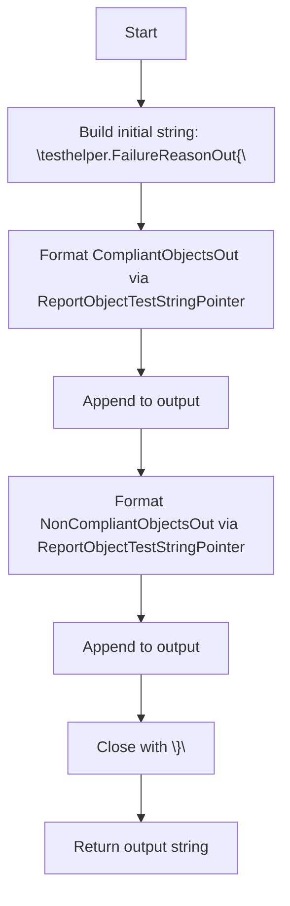

#### 4) Function dependencies (Mermaid)

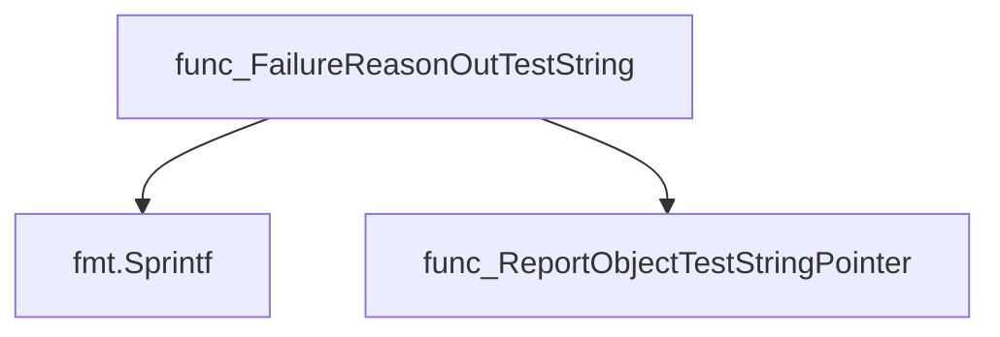

#### 5) Functions calling `FailureReasonOutTestString` (Mermaid)

None – this function is currently not referenced elsewhere in the package.

#### 6) Usage example (Go)

```go
// Minimal example invoking FailureReasonOutTestString
package main

import (
    "github.com/redhat-best-practices-for-k8s/certsuite/pkg/testhelper"
)

func main() {
    // Construct a sample FailureReasonOut
    fr := testhelper.FailureReasonOut{
        CompliantObjectsOut: []*testhelper.ReportObject{
            {Name: "obj1", Status: "ok"},
        },
        NonCompliantObjectsOut: []*testhelper.ReportObject{},
    }

    // Get the string representation for debugging or assertions
    s := testhelper.FailureReasonOutTestString(fr)
    println(s)
}
```

---

---

### GetDaemonSetFailedToSpawnSkipFn

**GetDaemonSetFailedToSpawnSkipFn** - Generates a closure that indicates if the probe daemonset did not start successfully. The returned function can be used as a skip condition in tests.

Returns a test skip function that signals whether the probe daemonset failed to spawn.

---

#### Signature (Go)

```go
func GetDaemonSetFailedToSpawnSkipFn(env *provider.TestEnvironment) func() (bool, string)
```

---

#### Summary Table

| Aspect | Details |
|--------|---------|
| **Purpose** | Generates a closure that indicates if the probe daemonset did not start successfully. The returned function can be used as a skip condition in tests. |
| **Parameters** | `env *provider.TestEnvironment` – Test environment containing the `DaemonsetFailedToSpawn` flag. |
| **Return value** | A zero‑argument function returning `(bool, string)` where the boolean is true to skip and the string provides a reason. |
| **Key dependencies** | None (only accesses the `env.DaemonsetFailedToSpawn` field). |
| **Side effects** | No state mutation or I/O; purely reads from the provided environment. |
| **How it fits the package** | Utility for test helpers to conditionally skip tests when a critical daemonset is missing. |

---

#### Internal workflow (Mermaid)

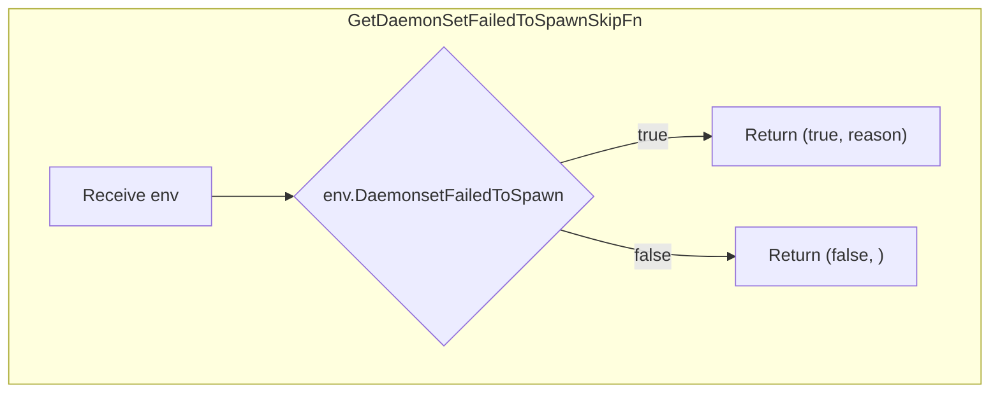

---

#### Function dependencies  

None – this function is currently not referenced elsewhere in the package.

---

#### Functions calling `GetDaemonSetFailedToSpawnSkipFn`  

None – this function is currently not referenced elsewhere in the package.

---

#### Usage example (Go)

```go
// Minimal example invoking GetDaemonSetFailedToSpawnSkipFn

env := &provider.TestEnvironment{
    DaemonsetFailedToSpawn: true, // simulate failure
}

skipFn := testhelper.GetDaemonSetFailedToSpawnSkipFn(env)

shouldSkip, reason := skipFn()
if shouldSkip {
    fmt.Println("Skipping test:", reason)
}
```

---

### GetNoAffinityRequiredPodsSkipFn

**GetNoAffinityRequiredPodsSkipFn** - Returns a closure that evaluates whether the test should be skipped because no pods with required affinity are present.

#### 1) Signature (Go)

```go
func (*provider.TestEnvironment)(func() (bool, string))
```

#### 2) Summary Table

| Aspect | Details |
|--------|---------|
| **Purpose** | Returns a closure that evaluates whether the test should be skipped because no pods with required affinity are present. |
| **Parameters** | `env *provider.TestEnvironment` – test environment containing pod information. |
| **Return value** | A function of type `func() (bool, string)` where: <br>• `bool` indicates if the test should be skipped.<br>• `string` provides an explanatory message when skipping. |
| **Key dependencies** | • `len` – built‑in to count pods.<br>• `env.GetAffinityRequiredPods()` – retrieves pods that have required affinity annotations. |
| **Side effects** | None; purely functional. |
| **How it fits the package** | Used in test helper utilities to conditionally skip tests when required‑affinity pods are absent, simplifying test setup logic. |

#### 3) Internal workflow (Mermaid)

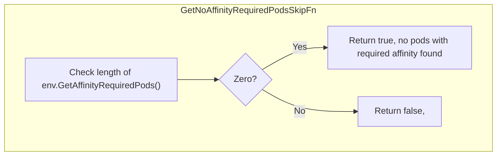

#### 4) Function dependencies (Mermaid)

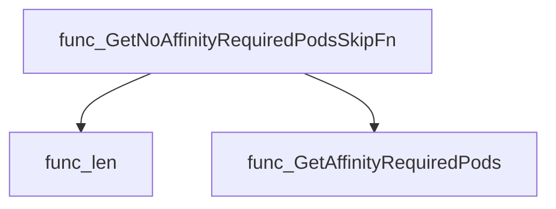

#### 5) Functions calling `GetNoAffinityRequiredPodsSkipFn` (Mermaid)

None – this function is currently not referenced elsewhere in the package.

#### 6) Usage example (Go)

```go
// Minimal example invoking GetNoAffinityRequiredPodsSkipFn
env := &provider.TestEnvironment{}
skipFn := env.GetNoAffinityRequiredPodsSkipFn()
shouldSkip, msg := skipFn()
if shouldSkip {
    fmt.Println("Skipping test:", msg)
}
```

---

### GetNoBareMetalNodesSkipFn

**GetNoBareMetalNodesSkipFn** - Returns a closure that indicates if tests should be skipped because the test environment contains no bare‑metal nodes. The returned function yields `true` and an explanatory message when the condition is met.

#### Signature (Go)

```go
func (*provider.TestEnvironment)(func() (bool, string))
```

#### Summary Table

| Aspect | Details |
|--------|---------|
| **Purpose** | Returns a closure that indicates if tests should be skipped because the test environment contains no bare‑metal nodes. The returned function yields `true` and an explanatory message when the condition is met. |
| **Parameters** | `env *provider.TestEnvironment` – The test environment from which to retrieve node information. |
| **Return value** | `func() (bool, string)` – A function that returns a boolean indicating skip status and a string containing the reason if skipped. |
| **Key dependencies** | • `len` (built‑in) <br>• `env.GetBaremetalNodes()` (method of `TestEnvironment`) |
| **Side effects** | None; purely functional. |
| **How it fits the package** | Used in test helpers to conditionally skip tests that require bare‑metal nodes, ensuring tests do not fail when such nodes are absent. |

#### Internal workflow

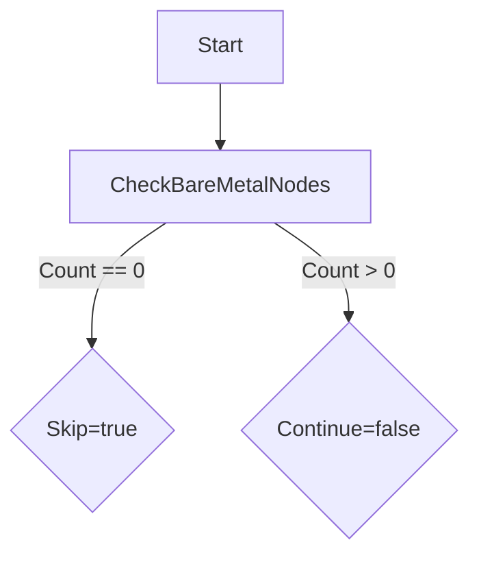

#### Function dependencies (Mermaid)

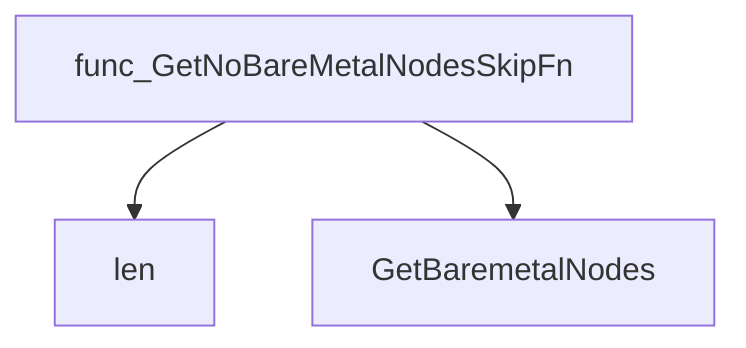

#### Functions calling `GetNoBareMetalNodesSkipFn` (Mermaid)

None – this function is currently not referenced elsewhere in the package.

#### Usage example (Go)

```go
// Minimal example invoking GetNoBareMetalNodesSkipFn
env := &provider.TestEnvironment{ /* ... populate as needed ... */ }
skipFn := GetNoBareMetalNodesSkipFn(env)

shouldSkip, reason := skipFn()
if shouldSkip {
    fmt.Println("Skipping test:", reason)
}
```

---

### GetNoCPUPinningPodsSkipFn

**GetNoCPUPinningPodsSkipFn** - Supplies a closure used by tests to skip execution when no CPU‑pinning pods exist.

A helper that returns a test‑skipping predicate which determines whether any CPU‑pinning pods are present in the environment.

```go
func(*provider.TestEnvironment)(func() (bool, string))
```

| Aspect | Details |
|--------|---------|
| **Purpose** | Supplies a closure used by tests to skip execution when no CPU‑pinning pods exist. |
| **Parameters** | `env *provider.TestEnvironment` – the test environment containing pod information. |
| **Return value** | A function that returns `(bool, string)`: `true` signals “skip this test” and the accompanying message; otherwise `false`. |
| **Key dependencies** | • Calls built‑in `len` to count pods.<br>• Invokes `env.GetCPUPinningPodsWithDpdk()` to retrieve relevant pods. |
| **Side effects** | None – purely functional, no state mutation or I/O. |
| **How it fits the package** | Used by test suites in the `testhelper` package to conditionally skip tests that require CPU‑pinning pods when none are available. |

#### Internal workflow

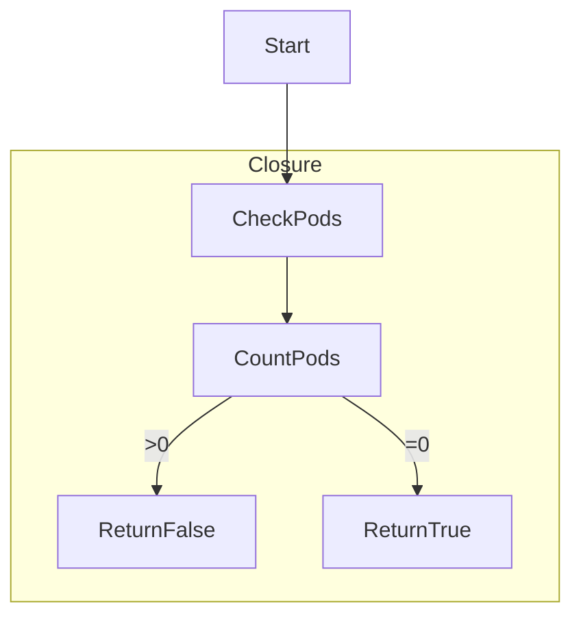

- The returned closure first obtains the list of CPU‑pinning pods via `env.GetCPUPinningPodsWithDpdk()`.  
- It counts them with `len`.  
- If the count is zero, it returns `(true, "no CPU pinning pods to check found")`; otherwise it returns `(false, "")`.

#### Function dependencies

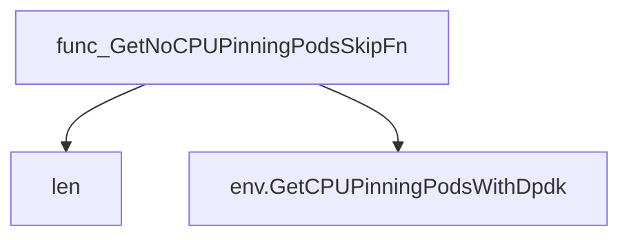

#### Functions calling `GetNoCPUPinningPodsSkipFn`

None – this function is currently not referenced elsewhere in the package.

#### Usage example (Go)

```go
// Minimal example invoking GetNoCPUPinningPodsSkipFn
env := provider.NewTestEnvironment()
skipFn := testhelper.GetNoCPUPinningPodsSkipFn(env)

// In a test:
if skip, msg := skipFn(); skip {
    t.Skip(msg)
}
```

This demonstrates how the returned function can be used to conditionally skip tests when no CPU‑pinning pods are available.

---

### GetNoCatalogSourcesSkipFn

**GetNoCatalogSourcesSkipFn** - Returns a closure that decides whether to skip tests when no catalog sources are available in the test environment.

#### Signature (Go)

```go
func GetNoCatalogSourcesSkipFn(env *provider.TestEnvironment) func() (bool, string)
```

#### Summary Table

| Aspect | Details |
|--------|---------|
| **Purpose** | Returns a closure that decides whether to skip tests when no catalog sources are available in the test environment. |
| **Parameters** | `env *provider.TestEnvironment` – The test environment containing catalog source data. |
| **Return value** | A function returning `(bool, string)` where `true` indicates the test should be skipped and the string provides a skip reason. |
| **Key dependencies** | Calls the built‑in `len` to check the slice length of `env.AllCatalogSources`. |
| **Side effects** | None; purely functional. |
| **How it fits the package** | Used in test helper utilities to conditionally bypass tests that require catalog sources when none are configured. |

#### Internal workflow (Mermaid)

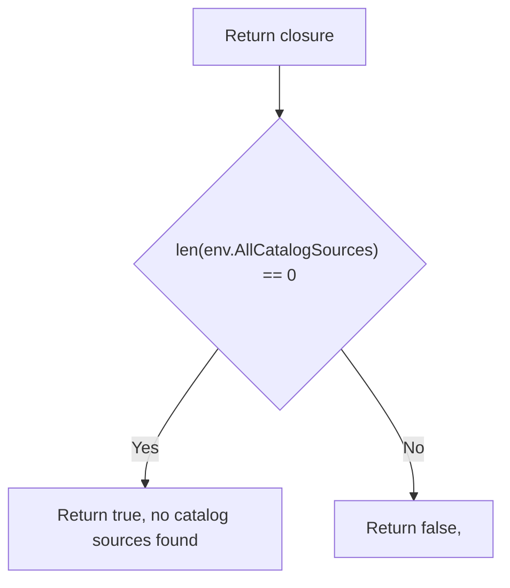

#### Function dependencies (Mermaid)

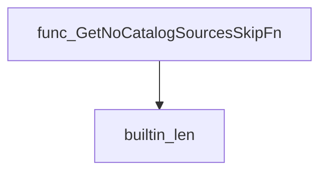

#### Functions calling `GetNoCatalogSourcesSkipFn` (Mermaid)

None – this function is currently not referenced elsewhere in the package.

#### Usage example (Go)

```go
// Minimal example invoking GetNoCatalogSourcesSkipFn
env := &provider.TestEnvironment{AllCatalogSources: []string{}}
skipFn := testhelper.GetNoCatalogSourcesSkipFn(env)

if skip, reason := skipFn(); skip {
    fmt.Println("Skipping test:", reason)
} else {
    // proceed with the test
}
```

---

### GetNoContainersUnderTestSkipFn

**GetNoContainersUnderTestSkipFn** - Returns a function that evaluates whether a test should be skipped because the test environment contains zero containers. The returned function yields a boolean indicating skip status and an accompanying message.

**Determines whether a test should be skipped when no containers are present in the environment.**

---

#### Signature (Go)

```go
func GetNoContainersUnderTestSkipFn(env *provider.TestEnvironment) func() (bool, string)
```

---

#### Summary Table

| Aspect | Details |
|--------|---------|
| **Purpose** | Returns a function that evaluates whether a test should be skipped because the test environment contains zero containers. The returned function yields a boolean indicating skip status and an accompanying message. |
| **Parameters** | `env *provider.TestEnvironment` – A pointer to the test environment struct, used to inspect the `Containers` slice. |
| **Return value** | `func() (bool, string)` – An anonymous function that returns `true` with a message when there are no containers; otherwise `false` and an empty string. |
| **Key dependencies** | • Calls the built‑in `len` function on `env.Containers`. |
| **Side effects** | None. The function only reads from the environment and produces a closure without mutating state or performing I/O. |
| **How it fits the package** | Used in test setup to conditionally skip container‑related tests when the target environment lacks containers, improving test robustness. |

---

#### Internal workflow (Mermaid)

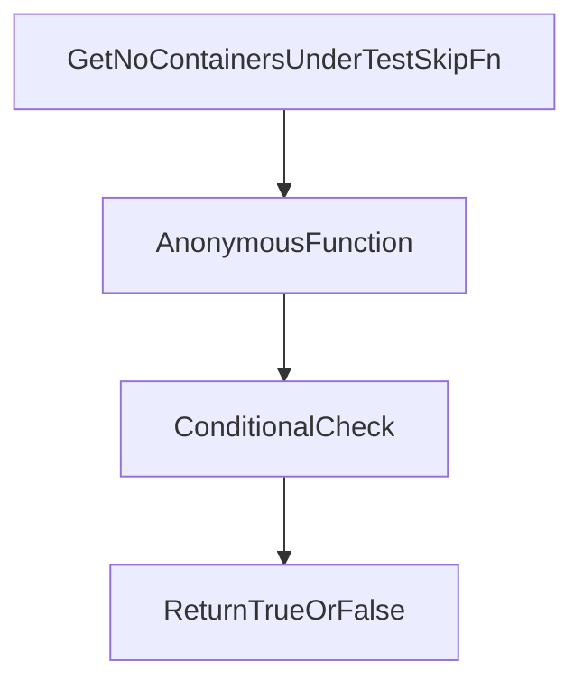

---

#### Function dependencies (Mermaid)

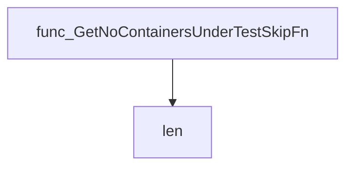

---

#### Functions calling `GetNoContainersUnderTestSkipFn` (Mermaid)

None – this function is currently not referenced elsewhere in the package.

---

#### Usage example (Go)

```go
// Minimal example invoking GetNoContainersUnderTestSkipFn
package main

import (
 "fmt"
 "github.com/redhat-best-practices-for-k8s/certsuite/pkg/testhelper"
 "github.com/redhat-best-practices-for-k8s/certsuite/pkg/provider"
)

func main() {
 env := &provider.TestEnvironment{Containers: []string{}}
 skipFn := testhelper.GetNoContainersUnderTestSkipFn(env)
 if skip, msg := skipFn(); skip {
  fmt.Println("Skipping test:", msg)
 } else {
  fmt.Println("Proceeding with test")
 }
}
```

---

### GetNoCrdsUnderTestSkipFn

**GetNoCrdsUnderTestSkipFn** - Returns a closure that checks if `env.Crds` is empty; if so, signals the test framework to skip with an explanatory message.

Provides a skip function that determines whether tests should be skipped when no Custom Resource Definitions (CRDs) are present in the test environment.

```go
func GetNoCrdsUnderTestSkipFn(env *provider.TestEnvironment)(func() (bool, string))
```

| Aspect | Details |
|--------|---------|
| **Purpose** | Returns a closure that checks if `env.Crds` is empty; if so, signals the test framework to skip with an explanatory message. |
| **Parameters** | `env *provider.TestEnvironment` – the test environment containing a slice of CRDs. |
| **Return value** | A function `func() (bool, string)` that returns `(true, "no roles to check")` when there are no CRDs, otherwise `(false, "")`. |
| **Key dependencies** | *calls* → built‑in `len`; accesses the `Crds` field of `TestEnvironment`. |
| **Side effects** | None; purely functional. |
| **How it fits the package** | Used by test helpers to conditionally skip tests that require CRDs when none are available in the environment. |

#### Internal workflow

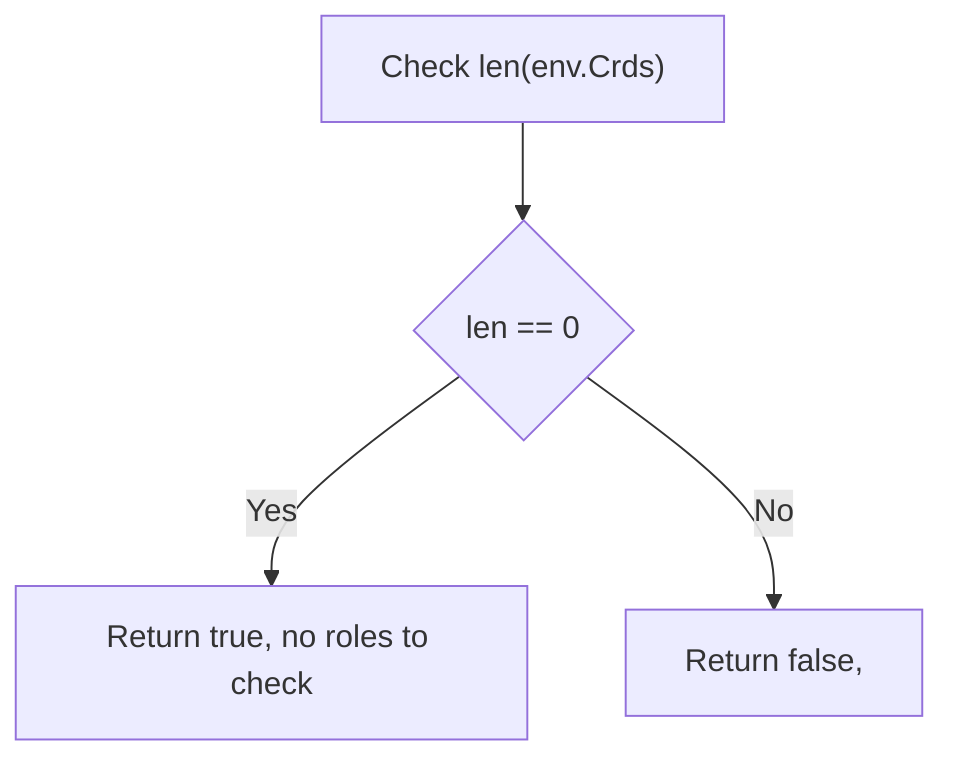

#### Function dependencies

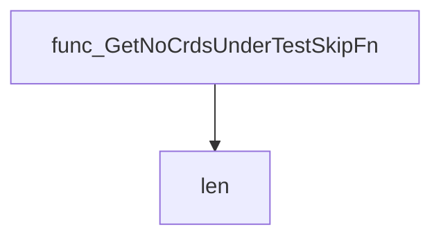

#### Functions calling `GetNoCrdsUnderTestSkipFn`

None – this function is currently not referenced elsewhere in the package.

#### Usage example (Go)

```go
// Minimal example invoking GetNoCrdsUnderTestSkipFn
env := &provider.TestEnvironment{Crds: []string{}}
skipFn := GetNoCrdsUnderTestSkipFn(env)

shouldSkip, reason := skipFn()
if shouldSkip {
    fmt.Println("Skipping test:", reason)
}
```

---

### GetNoDeploymentsUnderTestSkipFn

**GetNoDeploymentsUnderTestSkipFn** - Returns a closure that signals whether tests requiring deployments should be skipped when the environment contains no deployment objects.

#### Signature (Go)

```go
func GetNoDeploymentsUnderTestSkipFn(env *provider.TestEnvironment) func() (bool, string)
```

#### Summary Table

| Aspect | Details |
|--------|---------|
| **Purpose** | Returns a closure that signals whether tests requiring deployments should be skipped when the environment contains no deployment objects. |
| **Parameters** | `env *provider.TestEnvironment` – test environment holding the list of deployments to evaluate. |
| **Return value** | A function that, when invoked, returns `(bool, string)` where the boolean indicates skip status and the string provides a reason. |
| **Key dependencies** | Calls the built‑in `len` function to inspect `env.Deployments`. |
| **Side effects** | None; purely functional. |
| **How it fits the package** | Used by test helpers to conditionally skip tests that depend on deployment objects, ensuring graceful handling of empty environments. |

#### Internal workflow (Mermaid)

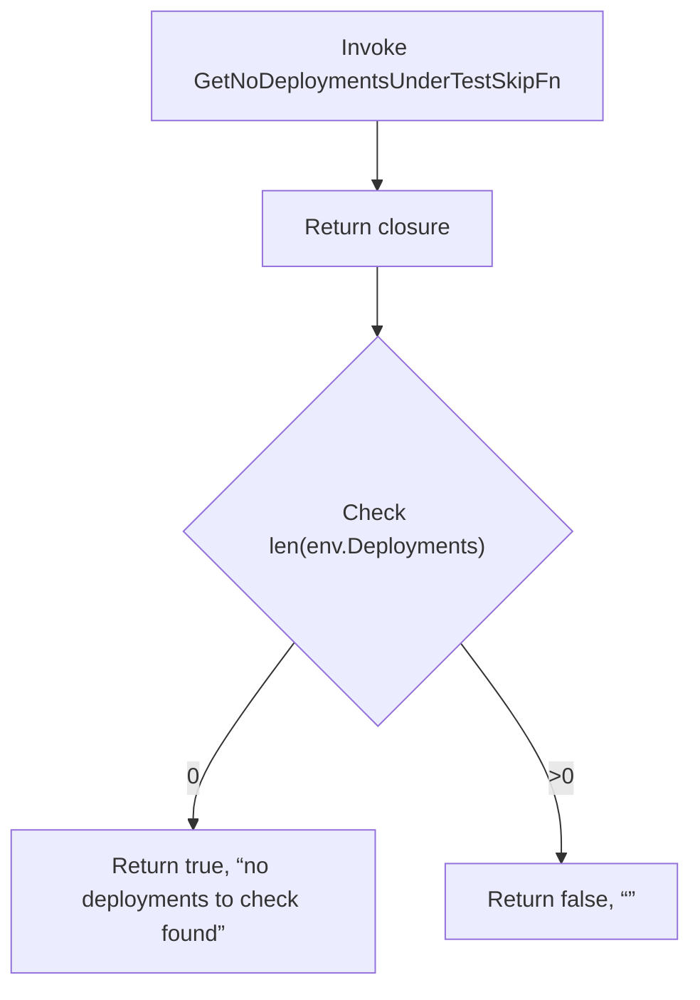

#### Function dependencies (Mermaid)

```mermaid
graph TD
  func_GetNoDeploymentsUnderTestSkipFn --> builtin_len
```

#### Functions calling `GetNoDeploymentsUnderTestSkipFn` (Mermaid)

None – this function is currently not referenced elsewhere in the package.

#### Usage example (Go)

```go
// Minimal example invoking GetNoDeploymentsUnderTestSkipFn
env := &provider.TestEnvironment{Deployments: []deploymentType{}}
skipFn := testhelper.GetNoDeploymentsUnderTestSkipFn(env)
shouldSkip, reason := skipFn()
if shouldSkip {
    fmt.Println("Skipping test:", reason)
}
```

---

### GetNoGuaranteedPodsWithExclusiveCPUsSkipFn

**GetNoGuaranteedPodsWithExclusiveCPUsSkipFn** - Creates a closure that determines whether tests requiring guaranteed pods with exclusive CPUs should be skipped. It returns `true` if none are found, along with an explanatory message.

Returns a skip function that signals when there are no guaranteed pods with exclusive CPUs in the test environment.

#### Signature (Go)

```go
func GetNoGuaranteedPodsWithExclusiveCPUsSkipFn(env *provider.TestEnvironment) func() (bool, string)
```

#### Summary Table

| Aspect | Details |
|--------|---------|
| **Purpose** | Creates a closure that determines whether tests requiring guaranteed pods with exclusive CPUs should be skipped. It returns `true` if none are found, along with an explanatory message. |
| **Parameters** | `env *provider.TestEnvironment` – the test environment from which to query existing pods. |
| **Return value** | A function of type `func() (bool, string)` that evaluates the skip condition at runtime. The first return is a boolean indicating whether to skip; the second is an optional message. |
| **Key dependencies** | • Calls Go’s built‑in `len` function.<br>• Invokes `env.GetGuaranteedPodsWithExclusiveCPUs()` from the `provider.TestEnvironment`. |
| **Side effects** | None – it only reads state and returns a closure; no mutation or I/O occurs. |
| **How it fits the package** | In the `testhelper` package, this helper supports conditional test execution by providing skip logic for scenarios that require exclusive‑CPU pods. |

#### Internal workflow (Mermaid)

```mermaid
flowchart TD
  A["GetNoGuaranteedPodsWithExclusiveCPUsSkipFn"] --> B["Return closure"]
  B --> C{"Check len(env.GetGuaranteedPodsWithExclusiveCPUs())"}
  C -- 0 --> D["Return true, no pods with exclusive CPUs found"]
  C -- >0 --> E["Return false,"]
```

#### Function dependencies (Mermaid)

```mermaid
graph TD
  func_GetNoGuaranteedPodsWithExclusiveCPUsSkipFn --> func_len
  func_GetNoGuaranteedPodsWithExclusiveCPUsSkipFn --> func_GetGuaranteedPodsWithExclusiveCPUs
```

#### Functions calling `GetNoGuaranteedPodsWithExclusiveCPUsSkipFn` (Mermaid)

None – this function is currently not referenced elsewhere in the package.

#### Usage example (Go)

```go
// Minimal example invoking GetNoGuaranteedPodsWithExclusiveCPUsSkipFn

env := provider.NewTestEnvironment()
skipFn := testhelper.GetNoGuaranteedPodsWithExclusiveCPUsSkipFn(env)

// Later, during a test:
if skip, msg := skipFn(); skip {
    t.Skip(msg) // or handle accordingly
}
```

---

### GetNoHugepagesPodsSkipFn

**GetNoHugepagesPodsSkipFn** - Generates a closure that determines if tests requiring huge‑page pods should be skipped. The closure returns `true` and a message when no such pods are present in the test environment.

Returns a skip function that signals whether tests should be skipped when no pods request huge pages.

#### Signature (Go)

```go
func GetNoHugepagesPodsSkipFn(env *provider.TestEnvironment) func() (bool, string)
```

#### Summary Table

| Aspect | Details |
|--------|---------|
| **Purpose** | Generates a closure that determines if tests requiring huge‑page pods should be skipped. The closure returns `true` and a message when no such pods are present in the test environment. |
| **Parameters** | `env *provider.TestEnvironment` – Test environment containing pod information. |
| **Return value** | A function of type `func() (bool, string)` that evaluates the presence of huge‑page‑requesting pods. |
| **Key dependencies** | - Calls built‑in `len`. <br>- Invokes `env.GetHugepagesPods()` to fetch relevant pod list. |
| **Side effects** | No state mutation or I/O; purely functional evaluation. |
| **How it fits the package** | Located in `pkg/testhelper`, this helper supports test suites by providing a standardized skip condition for scenarios that require huge‑page pods. |

#### Internal workflow (Mermaid)

```mermaid
flowchart TD
  GetNoHugepagesPodsSkipFn --> ReturnClosure
  ReturnClosure --> EvaluateLen
  EvaluateLen -->|"len == 0"| SkipTrue["true, \no pods requesting hugepages found\"]
  EvaluateLen -->|"len > 0"| SkipFalse["false, \\"]
```

#### Function dependencies (Mermaid)

```mermaid
graph TD
  GetNoHugepagesPodsSkipFn --> len
  GetNoHugepagesPodsSkipFn --> GetHugepagesPods
```

#### Functions calling `GetNoHugepagesPodsSkipFn` (Mermaid)  

None – this function is currently not referenced elsewhere in the package.

#### Usage example (Go)

```go
// Minimal example invoking GetNoHugepagesPodsSkipFn
import (
    "github.com/redhat-best-practices-for-k8s/certsuite/pkg/testhelper"
    "github.com/redhat-best-practices-for-k8s/certsuite/pkg/provider"
)

func main() {
    env := &provider.TestEnvironment{}
    skipFn := testhelper.GetNoHugepagesPodsSkipFn(env)
    shouldSkip, msg := skipFn()
    if shouldSkip {
        fmt.Println("Skipping test:", msg)
    } else {
        fmt.Println("Proceeding with test")
    }
}
```

---

### GetNoIstioSkipFn

**GetNoIstioSkipFn** - Returns a closure that determines if tests requiring Istio should be skipped because no Istio service mesh was detected.

The function produces a test‑skipping predicate that checks whether an Istio service mesh is present in the supplied test environment.

---

#### Signature (Go)

```go
func GetNoIstioSkipFn(env *provider.TestEnvironment) func() (bool, string)
```

---

#### Summary Table

| Aspect | Details |
|--------|---------|
| **Purpose** | Returns a closure that determines if tests requiring Istio should be skipped because no Istio service mesh was detected. |
| **Parameters** | `env` – *provider.TestEnvironment* – the test environment configuration to inspect. |
| **Return value** | A function returning `(bool, string)`: `true` indicates the test should skip, and the accompanying message explains why. |
| **Key dependencies** | *provider.TestEnvironment* (used for the `IstioServiceMeshFound` field). |
| **Side effects** | None; purely functional. |
| **How it fits the package** | Provides a reusable predicate for conditionally skipping tests when Istio is absent, used by other test helper utilities. |

---

#### Internal workflow

```mermaid
flowchart TD
  A["GetNoIstioSkipFn"] --> B["Return closure"]
  B --> C{"Check env.IstioServiceMeshFound"}
  C -- false --> D["return true, no istio service mesh found"]
  C -- true --> E["return false,"]
```

---

#### Function dependencies

None – this function is currently not referenced elsewhere in the package.

---

#### Functions calling `GetNoIstioSkipFn`

None – this function is currently not referenced elsewhere in the package.

---

#### Usage example (Go)

```go
// Minimal example invoking GetNoIstioSkipFn
package main

import (
 "fmt"

 "github.com/redhat-best-practices-for-k8s/certsuite/pkg/testhelper"
 "github.com/redhat-best-practices-for-k8s/certsuite/pkg/provider"
)

func main() {
 env := &provider.TestEnvironment{IstioServiceMeshFound: false}
 skipFn := testhelper.GetNoIstioSkipFn(env)

 if skip, reason := skipFn(); skip {
  fmt.Println("Skipping test:", reason)
 } else {
  fmt.Println("Running test")
 }
}
```

---

### GetNoNamespacesSkipFn

**GetNoNamespacesSkipFn** - Returns a function that evaluates the current `TestEnvironment`. If the environment contains no namespaces, the returned function signals to skip the test with an explanatory message.

#### Signature (Go)

```go
func GetNoNamespacesSkipFn(env *provider.TestEnvironment) func() (bool, string)
```

#### Summary Table

| Aspect | Details |
|--------|---------|
| **Purpose** | Returns a function that evaluates the current `TestEnvironment`. If the environment contains no namespaces, the returned function signals to skip the test with an explanatory message. |
| **Parameters** | `env *provider.TestEnvironment` – The test environment whose namespace list is inspected. |
| **Return value** | A closure of type `func() (bool, string)` that, when invoked, returns: <br>• `true` and a skip reason if no namespaces are present.<br>• `false` and an empty message otherwise. |
| **Key dependencies** | • Calls the built‑in `len` function on `env.Namespaces`. |
| **Side effects** | None; purely functional, no state mutation or I/O. |
| **How it fits the package** | Part of the `testhelper` utilities that provide conditional test execution logic based on environment configuration. |

#### Internal workflow (Mermaid)

```mermaid
flowchart TD
  subgraph "Closure Creation"
    A["Return closure"] --> B{"Check namespace count"}
  end
  B -- len == 0 --> C["Return true, skip message"]
  B -- otherwise --> D["Return false, empty string"]
```

#### Function dependencies (Mermaid)

```mermaid
graph TD
  func_GetNoNamespacesSkipFn --> func_len
```

#### Functions calling `GetNoNamespacesSkipFn` (Mermaid)

None – this function is currently not referenced elsewhere in the package.

#### Usage example (Go)

```go
// Minimal example invoking GetNoNamespacesSkipFn
env := &provider.TestEnvironment{Namespaces: []string{}}
skipFn := GetNoNamespacesSkipFn(env)

shouldSkip, reason := skipFn()
if shouldSkip {
    fmt.Println("Skipping test:", reason)
} else {
    // Proceed with the test
}
```

---

### GetNoNodesWithRealtimeKernelSkipFn

**GetNoNodesWithRealtimeKernelSkipFn** - Returns a closure that evaluates whether the test environment contains any node with a realtime kernel. If none are found, the closure returns `true` and an explanatory message to skip tests that require such nodes.

Retrieves a skip function that indicates whether any node in the test environment uses a realtime kernel; if none do, the returned function signals a skip.

---

#### Signature (Go)

```go
func GetNoNodesWithRealtimeKernelSkipFn(env *provider.TestEnvironment) func() (bool, string)
```

---

#### Summary Table

| Aspect | Details |
|--------|---------|
| **Purpose** | Returns a closure that evaluates whether the test environment contains any node with a realtime kernel. If none are found, the closure returns `true` and an explanatory message to skip tests that require such nodes. |
| **Parameters** | `env *provider.TestEnvironment` – the test environment whose nodes are inspected. |
| **Return value** | `func() (bool, string)` – a function that when called yields `(skip bool, reason string)`. |
| **Key dependencies** | • Calls `node.IsRTKernel()` on each node.<br>• Relies on the `provider.TestEnvironment` type to expose `Nodes`. |
| **Side effects** | None; purely functional. No state mutation or I/O occurs. |
| **How it fits the package** | In the `testhelper` package, this helper provides a reusable skip predicate for tests that require realtime kernel nodes, allowing those tests to be conditionally omitted when the environment lacks such nodes. |

---

#### Internal workflow (Mermaid)

```mermaid
flowchart TD
  GetNoNodesWithRealtimeKernelSkipFn --> forEachNode["“Iterate over env.Nodes”"]
  forEachNode --> checkRT["Check node.IsRTKernel()"]
  checkRT -- true --> returnFalse["Return false, \\"]
  checkRT -- false --> continue["Continue loop"]
  forEachNode -- end of loop --> returnTrue["Return true, \no nodes with realtime kernel type found\"]
```

---

#### Function dependencies (Mermaid)

```mermaid
graph TD
  GetNoNodesWithRealtimeKernelSkipFn --> IsRTKernel["func IsRTKernel() bool"]
```

---

#### Functions calling `GetNoNodesWithRealtimeKernelSkipFn` (Mermaid)

None – this function is currently not referenced elsewhere in the package.

---

#### Usage example (Go)

```go
// Minimal example invoking GetNoNodesWithRealtimeKernelSkipFn

env := provider.NewTestEnvironment() // Assume this creates an environment with nodes.
skipFn := testhelper.GetNoNodesWithRealtimeKernelSkipFn(env)

// Later, within a test:
if skip, reason := skipFn(); skip {
    t.Skip(reason)   // Skip the test if no realtime kernel node is present.
}
```

---

### GetNoOperatorCrdsSkipFn

**GetNoOperatorCrdsSkipFn** - Returns a closure that decides if a test must be skipped because no Operator Custom Resource Definitions (CRDs) are present in the provided test environment.

#### Signature (Go)

```go
func GetNoOperatorCrdsSkipFn(env *provider.TestEnvironment) func() (bool, string)
```

#### Summary Table

| Aspect | Details |
|--------|---------|
| **Purpose** | Returns a closure that decides if a test must be skipped because no Operator Custom Resource Definitions (CRDs) are present in the provided test environment. |
| **Parameters** | `env *provider.TestEnvironment` – Test environment containing a slice of CRDs (`Crds`). |
| **Return value** | A function returning `(bool, string)` where the boolean indicates whether to skip and the string provides an explanatory message. |
| **Key dependencies** | Calls the built‑in `len` function to inspect the length of `env.Crds`. |
| **Side effects** | None; purely functional with no state mutation or I/O. |
| **How it fits the package** | Part of the *testhelper* utilities, used to gate tests that require Operator CRDs. |

#### Internal workflow (Mermaid)

```mermaid
flowchart TD
  A["GetNoOperatorCrdsSkipFn"] --> B["Return closure"]
  B --> C{"len(env.Crds) == 0"}
  C -- Yes --> D["Return true, no operator crds found"]
  C -- No --> E["Return false,"]
```

#### Function dependencies (Mermaid)

```mermaid
graph TD
  func_GetNoOperatorCrdsSkipFn --> len
```

#### Functions calling `GetNoOperatorCrdsSkipFn` (Mermaid)

None – this function is currently not referenced elsewhere in the package.

#### Usage example (Go)

```go
// Minimal example invoking GetNoOperatorCrdsSkipFn
env := &provider.TestEnvironment{Crds: []string{}}
skipFn := GetNoOperatorCrdsSkipFn(env)

shouldSkip, reason := skipFn()
if shouldSkip {
    fmt.Println("Skipping test:", reason)
} else {
    fmt.Println("Running test")
}
```

---

### GetNoOperatorPodsSkipFn

**GetNoOperatorPodsSkipFn** - Returns a closure that checks if the test environment contains any operator pods; if none are present, it signals that tests should be skipped with an explanatory message.

#### Signature (Go)

```go
func GetNoOperatorPodsSkipFn(env *provider.TestEnvironment) func() (bool, string)
```

#### Summary Table

| Aspect | Details |
|--------|---------|
| **Purpose** | Returns a closure that checks if the test environment contains any operator pods; if none are present, it signals that tests should be skipped with an explanatory message. |
| **Parameters** | `env *provider.TestEnvironment` – Test environment holding pod information. |
| **Return value** | A function returning `(bool, string)` where `true` indicates the test should skip and the string provides a reason. |
| **Key dependencies** | • Calls built‑in `len` to count entries in `env.CSVToPodListMap`. |
| **Side effects** | None – purely functional; no mutation or I/O. |
| **How it fits the package** | Used by test helpers to conditionally skip tests that require operator pods when none are deployed. |

#### Internal workflow (Mermaid)

```mermaid
flowchart TD
  A["Start"] --> B{"env.CSVToPodListMap empty?"}
  B -- Yes --> C["Return true, no operator pods found"]
  B -- No --> D["Return false,"]
```

#### Function dependencies (Mermaid)

```mermaid
graph TD
  func_GetNoOperatorPodsSkipFn --> len
```

#### Functions calling `GetNoOperatorPodsSkipFn` (Mermaid)

None – this function is currently not referenced elsewhere in the package.

#### Usage example (Go)

```go
// Minimal example invoking GetNoOperatorPodsSkipFn
env := &provider.TestEnvironment{
    CSVToPodListMap: map[string][]string{}, // empty map simulates no operator pods
}
skipFn := GetNoOperatorPodsSkipFn(env)
shouldSkip, reason := skipFn()
fmt.Printf("Should skip: %v; Reason: %s\n", shouldSkip, reason)
// Output: Should skip: true; Reason: no operator pods found
```

---

### GetNoOperatorsSkipFn

**GetNoOperatorsSkipFn** - Creates a predicate function that checks if `env.Operators` is empty and signals whether tests should be skipped with an explanatory message.

Return a closure that determines whether to skip tests when no operators are present in the test environment.

```go
func GetNoOperatorsSkipFn(env *provider.TestEnvironment) func() (bool, string)
```

| Aspect | Details |
|--------|---------|
| **Purpose** | Creates a predicate function that checks if `env.Operators` is empty and signals whether tests should be skipped with an explanatory message. |
| **Parameters** | `env *provider.TestEnvironment – the test environment containing operator information.` |
| **Return value** | A closure `func() (bool, string)` that returns `(true, "no operators found")` when no operators are present; otherwise `(false, "")`. |
| **Key dependencies** | Calls the built‑in function `len`. |
| **Side effects** | None – purely functional. |
| **How it fits the package** | Provides a reusable skip condition for test suites that depend on operator presence within the `testhelper` utilities. |

#### Internal workflow (Mermaid)

```mermaid
flowchart TD
  subgraph "Closure Creation"
    A["GetNoOperatorsSkipFn"] --> B{"Return closure"}
  end
  subgraph "When Closure Executes"
    B --> C{"Check len(env.Operators)"}
    C -->|">0"| D["return false, \\"]
    C -->|"=0"| E["return true, \no operators found\"]
  end
```

#### Function dependencies (Mermaid)

```mermaid
graph TD
  func_GetNoOperatorsSkipFn --> len
```

#### Functions calling `GetNoOperatorsSkipFn` (Mermaid)

None – this function is currently not referenced elsewhere in the package.

#### Usage example (Go)

```go
// Minimal example invoking GetNoOperatorsSkipFn
env := &provider.TestEnvironment{
    Operators: []string{}, // no operators present
}
skipFn := GetNoOperatorsSkipFn(env)
shouldSkip, reason := skipFn()
if shouldSkip {
    fmt.Println("Skipping tests:", reason)
} else {
    fmt.Println("Running tests")
}
```

---

### GetNoPersistentVolumeClaimsSkipFn

**GetNoPersistentVolumeClaimsSkipFn** - Returns a closure that signals whether to skip tests due to absence of Persistent Volume Claims in the provided environment.

#### Signature (Go)

```go
func GetNoPersistentVolumeClaimsSkipFn(env *provider.TestEnvironment) func() (bool, string)
```

#### Summary Table

| Aspect | Details |
|--------|---------|
| **Purpose** | Returns a closure that signals whether to skip tests due to absence of Persistent Volume Claims in the provided environment. |
| **Parameters** | `env *provider.TestEnvironment` – Test environment containing PVC data. |
| **Return value** | `func() (bool, string)` – A function returning a boolean flag (`true` if skipping) and an explanatory message. |
| **Key dependencies** | Calls the built‑in `len` to inspect `env.PersistentVolumeClaims`. |
| **Side effects** | None; purely functional. |
| **How it fits the package** | Utility in `testhelper` for conditionally bypassing tests that require PVCs. |

#### Internal workflow (Mermaid)

```mermaid
flowchart TD
  GetNoPersistentVolumeClaimsSkipFn --> Closure
  Closure --> Decision{"len(env.PersistentVolumeClaims)==0"}
  Decision -- Yes --> Skip["Return true, no persistent volume claims found"]
  Decision -- No --> Continue["Return false,"]
```

#### Function dependencies (Mermaid)

```mermaid
graph TD
  func_GetNoPersistentVolumeClaimsSkipFn --> len
```

#### Functions calling `GetNoPersistentVolumeClaimsSkipFn` (Mermaid)

None – this function is currently not referenced elsewhere in the package.

#### Usage example (Go)

```go
// Minimal example invoking GetNoPersistentVolumeClaimsSkipFn
env := &provider.TestEnvironment{
    PersistentVolumeClaims: []v1.PersistentVolumeClaim{ /* ... */ },
}
skipFn := testhelper.GetNoPersistentVolumeClaimsSkipFn(env)

shouldSkip, msg := skipFn()
if shouldSkip {
    fmt.Println("Skipping tests:", msg)
} else {
    // proceed with tests
}
```

---

### GetNoPersistentVolumesSkipFn

**GetNoPersistentVolumesSkipFn** - Returns a closure that checks if the `env` contains any persistent volumes. If none are found, the closure reports that the test should be skipped with an explanatory message.

Creates a test‑skip function that signals whether any persistent volumes are available in the supplied environment.

---

#### Signature (Go)

```go
func GetNoPersistentVolumesSkipFn(env *provider.TestEnvironment) func() (bool, string)
```

---

#### Summary Table

| Aspect | Details |
|--------|---------|
| **Purpose** | Returns a closure that checks if the `env` contains any persistent volumes. If none are found, the closure reports that the test should be skipped with an explanatory message. |
| **Parameters** | `env *provider.TestEnvironment` – the test environment whose `PersistentVolumes` slice is inspected. |
| **Return value** | `func() (bool, string)` – a function returning a boolean (`true` to skip) and a string explaining the reason. |
| **Key dependencies** | • Calls the built‑in `len` function<br>• Accesses `env.PersistentVolumes` field |
| **Side effects** | No state mutations or I/O; purely read‑only inspection of `env`. |
| **How it fits the package** | Part of the test helper utilities, providing a reusable skip condition for tests that require persistent volumes. |

---

#### Internal workflow (Mermaid)

```mermaid
flowchart TD
  A["Start"] --> B{"len(env.PersistentVolumes) == 0"}
  B -- Yes --> C["Return true, no persistent volumes to check found"]
  B -- No  --> D["Return false,"]
```

---

#### Function dependencies (Mermaid)

```mermaid
graph TD
  func_GetNoPersistentVolumesSkipFn --> len
```

---

#### Functions calling `GetNoPersistentVolumesSkipFn` (Mermaid)

None – this function is currently not referenced elsewhere in the package.

---

#### Usage example (Go)

```go
// Minimal example invoking GetNoPersistentVolumesSkipFn
env := &provider.TestEnvironment{PersistentVolumes: []string{}}
skipFn := GetNoPersistentVolumesSkipFn(env)
shouldSkip, reason := skipFn()
fmt.Printf("Should skip? %v – Reason: %s\n", shouldSkip, reason)
```

---

### GetNoPodsUnderTestSkipFn

**GetNoPodsUnderTestSkipFn** - Generates a skip function that evaluates the presence of pods in the supplied test environment. If no pods exist, the test is skipped with an explanatory message.

**Returns a closure that determines whether the current test should be skipped because no pods are available to inspect.**

---

#### Signature (Go)

```go
func GetNoPodsUnderTestSkipFn(env *provider.TestEnvironment) func() (bool, string)
```

---

#### Summary Table

| Aspect | Details |
|--------|---------|
| **Purpose** | Generates a skip function that evaluates the presence of pods in the supplied test environment. If no pods exist, the test is skipped with an explanatory message. |
| **Parameters** | `env *provider.TestEnvironment` – the test context containing a slice of pod objects to examine. |
| **Return value** | A closure `func() (bool, string)` that returns: <br>• `true` and a reason when `len(env.Pods) == 0`; <br>• `false` and an empty string otherwise. |
| **Key dependencies** | Calls the built‑in `len` function to count pods. |
| **Side effects** | None; purely functional, no mutation or I/O. |
| **How it fits the package** | Provides a reusable skip condition for tests that require at least one pod to be present, simplifying test setup in the `testhelper` package. |

---

#### Internal workflow (Mermaid)

```mermaid
flowchart TD
  Start --> CheckPods
  CheckPods -->|"len(env.Pods) == 0"| Skip
  CheckPods -->|"otherwise"| Continue
```

---

#### Function dependencies (Mermaid)

None – this function is currently not referenced elsewhere in the package.

---

#### Functions calling `GetNoPodsUnderTestSkipFn` (Mermaid)

None – this function is currently not referenced elsewhere in the package.

---

#### Usage example (Go)

```go
// Minimal example invoking GetNoPodsUnderTestSkipFn

import (
    "github.com/redhat-best-practices-for-k8s/certsuite/pkg/testhelper"
    "github.com/redhat-best-practices-for-k8s/certsuite/pkg/provider"
)

// Assume env is populated elsewhere.
var env *provider.TestEnvironment

skipFn := testhelper.GetNoPodsUnderTestSkipFn(env)

shouldSkip, reason := skipFn()
if shouldSkip {
    fmt.Println("Skipping test:", reason)
}
```

---

### GetNoRolesSkipFn

**GetNoRolesSkipFn** - Returns a closure that evaluates whether tests should be skipped due to an empty `Roles` slice in the supplied test environment.

Creates a skip function that indicates whether test execution should be skipped when the environment has no roles defined.

---

#### Signature (Go)

```go
func GetNoRolesSkipFn(env *provider.TestEnvironment) func() (bool, string)
```

---

#### Summary Table

| Aspect | Details |
|--------|---------|
| **Purpose** | Returns a closure that evaluates whether tests should be skipped due to an empty `Roles` slice in the supplied test environment. |
| **Parameters** | `env *provider.TestEnvironment` – Test environment containing a `Roles` field. |
| **Return value** | A function `func() (bool, string)` that returns `(true, “message”)` if no roles are present, otherwise `(false, “”)`. |
| **Key dependencies** | • Calls the built‑in `len` function.<br>• Relies on the `provider.TestEnvironment` type. |
| **Side effects** | No state mutation or I/O; purely functional evaluation. |
| **How it fits the package** | Used by test setup routines to conditionally skip role‑related tests when configuration is incomplete. |

---

#### Internal workflow (Mermaid)

```mermaid
flowchart TD
  Start --> CheckRoles["Check if `len(env.Roles) == 0`"]
  CheckRoles -- true --> Skip{"Skip?"}
  CheckRoles -- false --> Continue{"Continue?"}
  Skip --> ReturnTrue["Return `(true, \There are no roles to check. Please check config.\)`"]
  Continue --> ReturnFalse["Return `(false, \\)`"]
```

---

#### Function dependencies (Mermaid)

```mermaid
graph TD
  func_GetNoRolesSkipFn --> func_len
```

---

#### Functions calling `GetNoRolesSkipFn` (Mermaid)

None – this function is currently not referenced elsewhere in the package.

---

#### Usage example (Go)

```go
// Minimal example invoking GetNoRolesSkipFn
env := &provider.TestEnvironment{Roles: []string{}}
skipFn := testhelper.GetNoRolesSkipFn(env)

shouldSkip, reason := skipFn()
if shouldSkip {
    fmt.Println("Skipping tests:", reason)
} else {
    fmt.Println("Proceeding with role‑dependent tests")
}
```

---

### GetNoSRIOVPodsSkipFn

**GetNoSRIOVPodsSkipFn** - Returns a closure that decides if the test suite should be skipped when no SR‑IOV enabled pods are available.

#### Signature (Go)

```go
func GetNoSRIOVPodsSkipFn(env *provider.TestEnvironment) func() (bool, string)
```

#### Summary Table

| Aspect | Details |
|--------|---------|
| **Purpose** | Returns a closure that decides if the test suite should be skipped when no SR‑IOV enabled pods are available. |
| **Parameters** | `env` (`*provider.TestEnvironment`) – Environment providing access to cluster state. |
| **Return value** | A function returning `(bool, string)`. The boolean indicates skip status; the string is an optional explanation. |
| **Key dependencies** | • Calls `GetPodsUsingSRIOV()` on the environment.<br>• Uses `fmt.Sprintf` for error messages.<br>• Uses built‑in `len` to count pods. |
| **Side effects** | None – purely functional; only reads from the provided environment. |
| **How it fits the package** | Part of the `testhelper` utilities, enabling conditional skipping of tests that require SR‑IOV functionality. |

#### Internal workflow

```mermaid
flowchart TD
  GetNoSRIOVPodsSkipFn --> ReturnClosure
  ReturnClosure --> CallGetPodsUsingSRIOV
  CallGetPodsUsingSRIOV -->|"error"| ReturnTrueWithMsg
  CallGetPodsUsingSRIOV -->|"no pods"| ReturnTrueWithMsg2
  CallGetPodsUsingSRIOV -->|"pods exist"| ReturnFalse
```

#### Function dependencies

```mermaid
graph TD
  func_GetNoSRIOVPodsSkipFn --> func_GetPodsUsingSRIOV
  func_GetNoSRIOVPodsSkipFn --> fmt_Sprintf
  func_GetNoSRIOVPodsSkipFn --> len
```

#### Functions calling `GetNoSRIOVPodsSkipFn`

None – this function is currently not referenced elsewhere in the package.

#### Usage example (Go)

```go
// Minimal example invoking GetNoSRIOVPodsSkipFn
env := &provider.TestEnvironment{ /* setup fields */ }

skipFn := testhelper.GetNoSRIOVPodsSkipFn(env)
shouldSkip, reason := skipFn()
if shouldSkip {
    fmt.Println("Skipping tests:", reason)
} else {
    fmt.Println("Proceeding with SR‑IOV dependent tests")
}
```

---

### GetNoServicesUnderTestSkipFn

**GetNoServicesUnderTestSkipFn** - Supplies a closure that determines whether a test should be skipped because the provided `TestEnvironment` contains no services.

#### Signature (Go)

```go
func GetNoServicesUnderTestSkipFn(env *provider.TestEnvironment) func() (bool, string)
```

#### Summary Table

| Aspect | Details |
|--------|---------|
| **Purpose** | Supplies a closure that determines whether a test should be skipped because the provided `TestEnvironment` contains no services. |
| **Parameters** | `env *provider.TestEnvironment` – The environment whose services are inspected. |
| **Return value** | A function of type `func() (bool, string)` where: <br>• `true` indicates the test should be skipped.<br>• The accompanying string is a skip reason. |
| **Key dependencies** | • Calls built‑in `len` to count services. |
| **Side effects** | None; purely functional. |
| **How it fits the package** | Used by test helpers to conditionally skip tests that require at least one service in the environment. |

#### Internal workflow (Mermaid)

```mermaid
flowchart TD
  Start --> CheckLen["Check len(env.Services)"]
  CheckLen -- "== 0" --> Skip["return true, \no services to check found\"]
  CheckLen -- "< 0" --> Continue["return false, \\"]
```

#### Function dependencies (Mermaid)

```mermaid
graph TD
  func_GetNoServicesUnderTestSkipFn --> len
```

#### Functions calling `GetNoServicesUnderTestSkipFn` (Mermaid)

None – this function is currently not referenced elsewhere in the package.

#### Usage example (Go)

```go
// Minimal example invoking GetNoServicesUnderTestSkipFn
env := &provider.TestEnvironment{ /* initialize with or without services */ }
skipCheck := testhelper.GetNoServicesUnderTestSkipFn(env)

if skip, reason := skipCheck(); skip {
    fmt.Println("Skipping test:", reason)
} else {
    // proceed with the test
}
```

---

### GetNoStatefulSetsUnderTestSkipFn

**GetNoStatefulSetsUnderTestSkipFn** - Returns a function that signals to skip tests when the test environment contains no StatefulSet objects.

Provides a test‑skipping predicate that determines whether any StatefulSet resources exist in the supplied test environment.

#### Signature (Go)

```go
func GetNoStatefulSetsUnderTestSkipFn(env *provider.TestEnvironment) func() (bool, string)
```

#### Summary Table

| Aspect | Details |
|--------|---------|
| **Purpose** | Returns a function that signals to skip tests when the test environment contains no StatefulSet objects. |
| **Parameters** | `env` – pointer to `provider.TestEnvironment`, containing a slice of StatefulSets (`StatefulSets`). |
| **Return value** | A closure returning `(bool, string)`: *true* and an explanatory message if the slice is empty; otherwise *false* with an empty message. |
| **Key dependencies** | Calls built‑in `len` to inspect the length of `env.StatefulSets`. |
| **Side effects** | No state mutation or I/O; purely deterministic based on input. |
| **How it fits the package** | Used by test helpers to conditionally skip tests that require StatefulSet resources, improving test suite efficiency. |

#### Internal workflow (Mermaid)

```mermaid
flowchart TD
  subgraph Closure["Returned function"]
    A1{"Check env.StatefulSets length"}
    A2 -->|"==0"| B1["Return true, message"]
    A2 -->|">0"| C1["Return false, \\"]
    A1 --> A2
  end
```

#### Function dependencies (Mermaid)

```mermaid
graph TD
  func_GetNoStatefulSetsUnderTestSkipFn --> len
```

#### Functions calling `GetNoStatefulSetsUnderTestSkipFn` (Mermaid)

None – this function is currently not referenced elsewhere in the package.

#### Usage example (Go)

```go
// Minimal example invoking GetNoStatefulSetsUnderTestSkipFn
env := &provider.TestEnvironment{
    StatefulSets: []appsv1.StatefulSet{}, // or populate as needed
}
skipFn := GetNoStatefulSetsUnderTestSkipFn(env)

if skip, msg := skipFn(); skip {
    fmt.Println("Skipping test:", msg)
} else {
    fmt.Println("Proceeding with tests")
}
```

---

### GetNoStorageClassesSkipFn

**GetNoStorageClassesSkipFn** - Generates a closure that determines if the test should be skipped due to the absence of storage classes.

A factory that returns a test‑skipping function which evaluates whether the current test environment contains any storage classes.

---

#### Signature (Go)

```go
func GetNoStorageClassesSkipFn(env *provider.TestEnvironment) func() (bool, string)
```

---

#### Summary Table

| Aspect | Details |
|--------|---------|
| **Purpose** | Generates a closure that determines if the test should be skipped due to the absence of storage classes. |
| **Parameters** | `env *provider.TestEnvironment` – Test environment containing a list of storage classes. |
| **Return value** | A function returning `(bool, string)` where the boolean indicates skip status and the string is an optional reason. |
| **Key dependencies** | • Calls the built‑in `len` to inspect `env.StorageClassList`. |
| **Side effects** | None; purely functional. |
| **How it fits the package** | Provides a reusable skip condition for tests that require storage classes, simplifying test setup in `pkg/testhelper`. |

---

#### Internal workflow (Mermaid)

```mermaid
flowchart TD
  A["Start"] --> B{"len(env.StorageClassList) == 0"}
  B -- Yes --> C["Return true, no storage classes found"]
  B -- No --> D["Return false,"]
```

---

#### Function dependencies (Mermaid)

```mermaid
graph TD
  func_GetNoStorageClassesSkipFn --> len
```

---

#### Functions calling `GetNoStorageClassesSkipFn` (Mermaid)

None – this function is currently not referenced elsewhere in the package.

---

#### Usage example (Go)

```go
// Minimal example invoking GetNoStorageClassesSkipFn
import (
 "github.com/redhat-best-practices-for-k8s/certsuite/pkg/provider"
 "github.com/redhat-best-practices-for-k8s/certsuite/pkg/testhelper"
)

func main() {
 env := &provider.TestEnvironment{
  StorageClassList: []string{}, // or populate with actual storage classes
 }
 skipFn := testhelper.GetNoStorageClassesSkipFn(env)
 if skip, reason := skipFn(); skip {
  fmt.Println("Skipping test:", reason)
 } else {
  fmt.Println("Proceeding with test")
 }
}
```

---

### GetNonOCPClusterSkipFn

**GetNonOCPClusterSkipFn** - Provides a function that returns `true` and a message when the environment is *not* an OCP cluster, allowing tests to be skipped in non‑OCP contexts.

Retrieves a test‑skipping callback that signals whether the current cluster is not an OpenShift (OCP) cluster.

```go
func GetNonOCPClusterSkipFn() func() (bool, string)
```

| Aspect | Details |
|--------|---------|
| **Purpose** | Provides a function that returns `true` and a message when the environment is *not* an OCP cluster, allowing tests to be skipped in non‑OCP contexts. |
| **Parameters** | None |
| **Return value** | A closure of type `func() (bool, string)`; on invocation it returns: <br>• `true` and `"non-OCP cluster detected"` if the cluster is not OCP, <br>• `false` and an empty string otherwise. |
| **Key dependencies** | * Calls `provider.IsOCPCluster()` to determine cluster type. |
| **Side effects** | None; purely functional and read‑only. |
| **How it fits the package** | Used by test suites in the `testhelper` package to conditionally skip tests that require an OpenShift environment. |

```mermaid
flowchart TD
  subgraph GetNonOCPClusterSkipFn
    A["Return closure"] --> B["Closure calls provider.IsOCPCluster()"]
    B --> C{"Is OCP?"}
    C -- No --> D["Return true, non-OCP cluster detected"]
    C -- Yes --> E["Return false,"]
  end
```

#### Function dependencies

```mermaid
graph TD
  func_GetNonOCPClusterSkipFn --> func_IsOCPCluster["provider.IsOCPCluster()"]
```

#### Functions calling `GetNonOCPClusterSkipFn`

None – this function is currently not referenced elsewhere in the package.

#### Usage example (Go)

```go
// Minimal example invoking GetNonOCPClusterSkipFn
skip := testhelper.GetNonOCPClusterSkipFn()
shouldSkip, reason := skip()
if shouldSkip {
    fmt.Println("Skipping test:", reason)
}
```

---

### GetNotEnoughWorkersSkipFn

**GetNotEnoughWorkersSkipFn** - Generates a closure that determines whether to skip a test because the cluster contains fewer worker nodes than `minWorkerNodes`.

A helper that returns a skip‑function used in tests to bypass checks when the cluster has fewer worker nodes than required.

#### Signature (Go)

```go
func GetNotEnoughWorkersSkipFn(env *provider.TestEnvironment, minWorkerNodes int) func() (bool, string)
```

#### Summary Table

| Aspect | Details |
|--------|---------|
| **Purpose** | Generates a closure that determines whether to skip a test because the cluster contains fewer worker nodes than `minWorkerNodes`. |
| **Parameters** | *`env`* – `*provider.TestEnvironment`: access to environment state.<br>*`minWorkerNodes`* – `int`: minimum required worker count. |
| **Return value** | A function returning `(bool, string)`. The boolean indicates skip status; the string is an optional message. |
| **Key dependencies** | Calls `env.GetWorkerCount()` to obtain current node count. |
| **Side effects** | None – purely functional and read‑only on the environment. |
| **How it fits the package** | Provides a reusable condition for test suites that depend on a minimum number of worker nodes, ensuring graceful degradation when prerequisites are unmet. |

#### Internal workflow (Mermaid)

```mermaid
flowchart TD
  GetNotEnoughWorkersSkipFn --> GetWorkerCount
```

#### Function dependencies (Mermaid)

```mermaid
graph TD
  func_GetNotEnoughWorkersSkipFn --> func_GetWorkerCount
```

#### Functions calling `GetNotEnoughWorkersSkipFn` (Mermaid)

None – this function is currently not referenced elsewhere in the package.

#### Usage example (Go)

```go
// Minimal example invoking GetNotEnoughWorkersSkipFn
env := provider.NewTestEnvironment()
minNodes := 3

skipCheck := testhelper.GetNotEnoughWorkersSkipFn(env, minNodes)
if skip, msg := skipCheck(); skip {
    fmt.Println("Skipping test:", msg)
} else {
    // proceed with the test
}
```

---

### GetNotIntrusiveSkipFn

**GetNotIntrusiveSkipFn** - Creates a closure that indicates whether the current test should be skipped because it is not meant to run in an intrusive environment.

#### Signature (Go)

```go
func GetNotIntrusiveSkipFn(env *provider.TestEnvironment) func() (bool, string)
```

#### Summary Table

| Aspect | Details |
|--------|---------|
| **Purpose** | Creates a closure that indicates whether the current test should be skipped because it is not meant to run in an intrusive environment. |
| **Parameters** | `env *provider.TestEnvironment` – Test environment context providing access to configuration flags. |
| **Return value** | A function returning `(bool, string)` where `true` signals a skip and the string explains the reason. |
| **Key dependencies** | Calls `env.IsIntrusive()` from the `provider` package to check the intrusive flag. |
| **Side effects** | None; purely functional closure. |
| **How it fits the package** | Utility for test helpers, enabling conditional skipping of tests based on environment capabilities. |

#### Internal workflow (Mermaid)

```mermaid
flowchart TD
  GetNotIntrusiveSkipFn --> Closure
  Closure --> CheckEnv["IsIntrusive()"]
  CheckEnv -- "Return true, not intrusive test" --> Skip
  CheckEnv -- "Return false" --> Continue
```

#### Function dependencies (Mermaid)

```mermaid
graph TD
  func_GetNotIntrusiveSkipFn --> func_IsIntrusive
```

#### Functions calling `GetNotIntrusiveSkipFn` (Mermaid)

None – this function is currently not referenced elsewhere in the package.

#### Usage example (Go)

```go
// Minimal example invoking GetNotIntrusiveSkipFn
package main

import (
 "github.com/redhat-best-practices-for-k8s/certsuite/pkg/testhelper"
 "github.com/redhat-best-practices-for-k8s/certsuite/pkg/provider"
)

func main() {
 env := provider.NewTestEnvironment()
 skipFn := testhelper.GetNotIntrusiveSkipFn(env)
 if skip, reason := skipFn(); skip {
  println("Skipping test:", reason)
 } else {
  println("Running test")
 }
}
```

---

### GetPodsWithoutAffinityRequiredLabelSkipFn

**GetPodsWithoutAffinityRequiredLabelSkipFn** - Returns a closure that signals whether to skip a test when no pods are found without the required affinity label.

Creates a skip function for test suites that determines whether to skip tests based on the presence of pods lacking the required affinity label.

#### Signature (Go)

```go
func GetPodsWithoutAffinityRequiredLabelSkipFn(env *provider.TestEnvironment) func() (bool, string)
```

#### Summary Table

| Aspect | Details |
|--------|---------|
| **Purpose** | Returns a closure that signals whether to skip a test when no pods are found without the required affinity label. |
| **Parameters** | `env` (`*provider.TestEnvironment`) – Test environment containing cluster state and helper methods. |
| **Return value** | A function returning `(bool, string)` where the boolean indicates “skip” and the string provides an optional message. |
| **Key dependencies** | • `len` (builtin) <br>• `env.GetPodsWithoutAffinityRequiredLabel()` |
| **Side effects** | None – only reads state from `env`. |
| **How it fits the package** | Part of the test helper utilities; used to conditionally skip tests that require pods without a specific affinity label. |

#### Internal workflow (Mermaid)

```mermaid
flowchart TD
  GetPodsWithoutAffinityRequiredLabelSkipFn --> Closure
  Closure --> CheckLen["Check length of env.GetPodsWithoutAffinityRequiredLabel()"]
  CheckLen -- zero --> Skip["Return true, message"]
  CheckLen -- non-zero --> Continue["Return false, empty string"]
```

#### Function dependencies (Mermaid)

```mermaid
graph TD
  func_GetPodsWithoutAffinityRequiredLabelSkipFn --> len
  func_GetPodsWithoutAffinityRequiredLabelSkipFn --> GetPodsWithoutAffinityRequiredLabel
```

#### Functions calling `GetPodsWithoutAffinityRequiredLabelSkipFn` (Mermaid)

None – this function is currently not referenced elsewhere in the package.

#### Usage example (Go)

```go
// Minimal example invoking GetPodsWithoutAffinityRequiredLabelSkipFn
env := provider.NewTestEnvironment()
skipFunc := testhelper.GetPodsWithoutAffinityRequiredLabelSkipFn(env)

skip, msg := skipFunc()
if skip {
    fmt.Println("Skipping test:", msg)
}
```

---

### GetSharedProcessNamespacePodsSkipFn

**GetSharedProcessNamespacePodsSkipFn** - Returns a closure that checks if any shared‑process‑namespace pods are present in the given `TestEnvironment`. If none exist, the closure signals to skip the test with an explanatory message.

Creates a test skip function that determines whether tests requiring shared process namespace pods should be skipped based on the current test environment.

```go
func GetSharedProcessNamespacePodsSkipFn(env *provider.TestEnvironment) func() (bool, string)
```

| Aspect | Details |
|--------|---------|
| **Purpose** | Returns a closure that checks if any shared‑process‑namespace pods are present in the given `TestEnvironment`. If none exist, the closure signals to skip the test with an explanatory message. |
| **Parameters** | `env *provider.TestEnvironment` – Environment object containing pod information. |
| **Return value** | `func() (bool, string)` – a function that returns a boolean indicating whether to skip (`true`) and an optional reason string. |
| **Key dependencies** | • Calls the built‑in `len` function.<br>• Invokes `env.GetShareProcessNamespacePods()` to obtain the slice of relevant pods. |
| **Side effects** | No state mutation or I/O; purely deterministic based on the provided environment. |
| **How it fits the package** | Used in test setup within the `testhelper` package to conditionally skip tests that require shared process namespace pods when none are available. |

#### Internal workflow

```mermaid
flowchart TD
  Start --> CheckPodsLen
  CheckPodsLen -->|"len==0"| SkipTest["Return true, \Shared process namespace pods found.\"]
  CheckPodsLen -->|"len>0"| Continue["Return false, \\"]
```

#### Function dependencies

```mermaid
graph TD
  GetSharedProcessNamespacePodsSkipFn --> len
  GetSharedProcessNamespacePodsSkipFn --> GetShareProcessNamespacePods
```

#### Functions calling `GetSharedProcessNamespacePodsSkipFn`

None – this function is currently not referenced elsewhere in the package.

#### Usage example (Go)

```go
// Minimal example invoking GetSharedProcessNamespacePodsSkipFn
env := provider.NewTestEnvironment()
skipFn := testhelper.GetSharedProcessNamespacePodsSkipFn(env)

if skip, reason := skipFn(); skip {
    fmt.Println("Skipping test:", reason)
}
```

---

### NewCatalogSourceReportObject

**NewCatalogSourceReportObject** - Builds a `*ReportObject` that records the status of a catalog source, including its namespace, name, compliance reason, and type.

#### Signature (Go)

```go
func NewCatalogSourceReportObject(aNamespace, aCatalogSourceName, aReason string, isCompliant bool) *ReportObject
```

#### Summary Table

| Aspect | Details |
|--------|---------|
| **Purpose** | Builds a `*ReportObject` that records the status of a catalog source, including its namespace, name, compliance reason, and type. |
| **Parameters** | `aNamespace string` – target namespace<br>`aCatalogSourceName string` – catalog‑source name<br>`aReason string` – justification for (non)compliance<br>`isCompliant bool` – compliance flag |
| **Return value** | A pointer to the constructed `ReportObject`. |
| **Key dependencies** | • Calls `NewReportObject(aReason, CatalogSourceType, isCompliant)`<br>• Invokes `AddField` twice on the returned object |
| **Side effects** | None beyond creating and returning a new in‑memory object. No I/O or state mutation outside of the return value. |
| **How it fits the package** | Part of the test helper utilities, this function simplifies generating catalog‑source compliance reports for unit tests and diagnostics. |

#### Internal workflow

```mermaid
flowchart TD
  Start --> CreateReportObject["Create NewReportObject"]
  CreateReportObject --> AddNamespace["AddField(Namespace)"]
  AddNamespace --> AddName["AddField(Name)"]
  AddName --> Return["Return ReportObject"]
```

#### Function dependencies

```mermaid
graph TD
  func_NewCatalogSourceReportObject --> func_NewReportObject
  func_NewCatalogSourceReportObject --> func_ReportObject_AddField
```

#### Functions calling `NewCatalogSourceReportObject`

None – this function is currently not referenced elsewhere in the package.

#### Usage example (Go)

```go
// Minimal example invoking NewCatalogSourceReportObject
import "github.com/redhat-best-practices-for-k8s/certsuite/pkg/testhelper"

func main() {
    report := testhelper.NewCatalogSourceReportObject(
        "default",
        "my-catalog-source",
        "All images are signed",
        true,
    )
    // `report` now contains the catalog source details and compliance status
}
```

---

### NewCertifiedContainerReportObject

**NewCertifiedContainerReportObject** - Builds a `ReportObject` that records compliance information for a container image identified by its digest, repository, tag, and registry.

#### Signature (Go)

```go
func NewCertifiedContainerReportObject(cii provider.ContainerImageIdentifier, aReason string, isCompliant bool) *ReportObject
```

#### Summary Table

| Aspect | Details |
|--------|---------|
| **Purpose** | Builds a `ReportObject` that records compliance information for a container image identified by its digest, repository, tag, and registry. |
| **Parameters** | `cii provider.ContainerImageIdentifier` – the image’s identity.<br>`aReason string` – explanation of compliance status.<br>`isCompliant bool` – whether the image meets certification requirements. |
| **Return value** | `*ReportObject` – pointer to the populated report object. |
| **Key dependencies** | • Calls `NewReportObject(aReason, ContainerImageType, isCompliant)`<br>• Invokes `AddField` on the returned `ReportObject` for each image attribute (`ImageDigest`, `ImageRepo`, `ImageTag`, `ImageRegistry`). |
| **Side effects** | None; all operations are pure and affect only the newly created object. |
| **How it fits the package** | In the `testhelper` package, this function supplies a convenient way to generate structured compliance reports for container images during testing or verification workflows. |

#### Internal workflow (Mermaid)

```mermaid
flowchart TD
  A["Create ReportObject"] --> B["Add Digest Field"]
  B --> C["Add Repository Field"]
  C --> D["Add Tag Field"]
  D --> E["Add Registry Field"]
  E --> F["Return ReportObject"]
```

#### Function dependencies (Mermaid)

```mermaid
graph TD
  func_NewCertifiedContainerReportObject --> func_NewReportObject
  func_NewCertifiedContainerReportObject --> func_ReportObject.AddField
```

#### Functions calling `NewCertifiedContainerReportObject` (Mermaid)

None – this function is currently not referenced elsewhere in the package.

#### Usage example (Go)

```go
// Minimal example invoking NewCertifiedContainerReportObject
package main

import (
 "github.com/redhat-best-practices-for-k8s/certsuite/pkg/testhelper"
 "github.com/redhat-best-practices-for-k8s/certsuite/pkg/provider"
)

func main() {
 imageID := provider.ContainerImageIdentifier{
  Digest:    "sha256:abcd1234",
  Repository:"myrepo",
  Tag:       "v1.0",
  Registry:  "quay.io",
 }
 report := testhelper.NewCertifiedContainerReportObject(imageID, "All checks passed", true)
 _ = report // use the report object as needed
}
```

---

### NewClusterOperatorReportObject

**NewClusterOperatorReportObject** - Builds a `ReportObject` for a cluster operator, setting its type and compliance reason.

Creates a report object that represents the compliance state of a specific cluster operator.

---

#### Signature (Go)

```go
func NewClusterOperatorReportObject(aClusterOperatorName, aReason string, isCompliant bool) (*ReportObject)
```

---

#### Summary Table

| Aspect | Details |
|--------|---------|
| **Purpose** | Builds a `ReportObject` for a cluster operator, setting its type and compliance reason. |
| **Parameters** | *`aClusterOperatorName`* (string): the operator’s name.<br>*`aReason`* (string): justification for compliance/non‑compliance.<br>*`isCompliant`* (bool): true if compliant. |
| **Return value** | `*ReportObject`: a populated report object. |
| **Key dependencies** | • Calls `NewReportObject(aReason, ClusterOperatorType, isCompliant)`<br>• Calls `(obj *ReportObject).AddField(Name, aClusterOperatorName)` |
| **Side effects** | None; purely functional construction of an object. |
| **How it fits the package** | Utility function in `testhelper` to simplify report creation for cluster operator checks. |

---

#### Internal workflow (Mermaid)

```mermaid
flowchart TD
  A["Create new ReportObject"] --> B["Set type to ClusterOperatorType"]
  B --> C["Add compliance reason field"]
  C --> D["Add Name field with aClusterOperatorName"]
  D --> E["Return the object"]
```

---

#### Function dependencies (Mermaid)

```mermaid
graph TD
  func_NewClusterOperatorReportObject --> func_NewReportObject
  func_NewClusterOperatorReportObject --> func_ReportObject_AddField
```

---

#### Functions calling `NewClusterOperatorReportObject` (Mermaid)

None – this function is currently not referenced elsewhere in the package.

---

#### Usage example (Go)

```go
// Minimal example invoking NewClusterOperatorReportObject
package main

import (
 "fmt"

 "github.com/redhat-best-practices-for-k8s/certsuite/pkg/testhelper"
)

func main() {
 report := testhelper.NewClusterOperatorReportObject("csi-driver", "Driver is compliant", true)
 fmt.Printf("%+v\n", report)
}
```

---

### NewClusterVersionReportObject

**NewClusterVersionReportObject** - Constructs a `ReportObject` for a cluster’s version and records whether the version meets compliance criteria.

Creates a report object that records the version of an OpenShift cluster along with compliance information.

```go
func NewClusterVersionReportObject(version, aReason string, isCompliant bool) (out *ReportObject)
```

| Aspect | Details |
|--------|---------|
| **Purpose** | Constructs a `ReportObject` for a cluster’s version and records whether the version meets compliance criteria. |
| **Parameters** | `version string –` OpenShift release identifier.<br>`aReason string –` Explanation for compliance status.<br>`isCompliant bool –` Indicates if the cluster is compliant. |
| **Return value** | `*ReportObject` – a populated report object containing version, type and compliance fields. |
| **Key dependencies** | • Calls `NewReportObject(aReason, OCPClusterType, isCompliant)`<br>• Invokes `AddField(OCPClusterVersionType, version)` on the resulting object |
| **Side effects** | None; only returns a new value. |
| **How it fits the package** | Provides a convenience constructor used by test helpers to generate cluster‑version reports for compliance checks. |

#### Internal workflow

```mermaid
flowchart TD
  A["Start"] --> B["Create base report via NewReportObject"]
  B --> C["Add version field with AddField"]
  C --> D["Return ReportObject"]
```

#### Function dependencies

```mermaid
graph TD
  func_NewClusterVersionReportObject --> func_NewReportObject
  func_NewClusterVersionReportObject --> func_ReportObject_AddField
```

#### Functions calling `NewClusterVersionReportObject`

None – this function is currently not referenced elsewhere in the package.

#### Usage example (Go)

```go
// Minimal example invoking NewClusterVersionReportObject
package main

import (
 "fmt"
 "github.com/redhat-best-practices-for-k8s/certsuite/pkg/testhelper"
)

func main() {
 report := testhelper.NewClusterVersionReportObject("4.12.0", "All patches applied", true)
 fmt.Printf("%+v\n", report)
}
```

---

### NewContainerReportObject

**NewContainerReportObject** - Builds a `ReportObject` representing the status of a specific container within a pod. It records namespace, pod name, container name, compliance reason, and whether the container complies with policy.

#### Signature (Go)

```go
func NewContainerReportObject(aNamespace, aPodName, aContainerName, aReason string, isCompliant bool) (*ReportObject)
```

#### Summary Table

| Aspect | Details |
|--------|---------|
| **Purpose** | Builds a `ReportObject` representing the status of a specific container within a pod. It records namespace, pod name, container name, compliance reason, and whether the container complies with policy. |
| **Parameters** | `aNamespace string – Kubernetes namespace`<br>`aPodName string – Pod name`<br>`aContainerName string – Container name`<br>`aReason string – Reason for (non‑)compliance`<br>`isCompliant bool – Compliance flag` |
| **Return value** | `*ReportObject – populated report object ready for further processing or serialization.` |
| **Key dependencies** | • Calls `NewReportObject(aReason, ContainerType, isCompliant)` to create the base object.<br>• Invokes `AddField` three times to attach namespace, pod name, and container name. |
| **Side effects** | No global state changes or I/O; purely constructs and returns a new object. |
| **How it fits the package** | Part of the `testhelper` utilities for generating structured compliance reports used in tests and examples. It provides a convenient wrapper around generic report creation tailored to container entities. |

#### Internal workflow (Mermaid)

```mermaid
flowchart TD
  A["Create base ReportObject via NewReportObject"] --> B["Add namespace field"]
  B --> C["Add pod name field"]
  C --> D["Add container name field"]
  D --> E["Return populated object"]
```

#### Function dependencies (Mermaid)

```mermaid
graph TD
  func_NewContainerReportObject --> func_NewReportObject
  func_NewContainerReportObject --> func_ReportObject_AddField
```

#### Functions calling `NewContainerReportObject` (Mermaid)

None – this function is currently not referenced elsewhere in the package.

#### Usage example (Go)

```go
// Minimal example invoking NewContainerReportObject
package main

import (
 "fmt"

 "github.com/redhat-best-practices-for-k8s/certsuite/pkg/testhelper"
)

func main() {
 report := testhelper.NewContainerReportObject(
  "dev-namespace",   // namespace
  "example-pod",     // pod name
  "app-container",   // container name
  "image not signed",// reason
  false,             // compliance status
 )

 fmt.Printf("Report type: %s\n", report.ObjectType)
 for i, key := range report.ObjectFieldsKeys {
  fmt.Printf("%s: %s\n", key, report.ObjectFieldsValues[i])
 }
}
```

This snippet demonstrates how to generate a container‑specific report object and inspect its fields.

---

### NewCrdReportObject

**NewCrdReportObject** - Instantiates a `ReportObject` describing a Custom Resource Definition (CRD), embedding its name, version, compliance reason, and status.

#### Signature (Go)

```go
func NewCrdReportObject(aName, aVersion, aReason string, isCompliant bool) (*ReportObject)
```

#### Summary Table

| Aspect | Details |
|--------|---------|
| **Purpose** | Instantiates a `ReportObject` describing a Custom Resource Definition (CRD), embedding its name, version, compliance reason, and status. |
| **Parameters** | `aName string – CRD name`<br>`aVersion string – CRD version`<br>`aReason string – explanation for the compliance state`<br>`isCompliant bool – indicates if the CRD complies with policy` |
| **Return value** | `*ReportObject – fully populated report object` |
| **Key dependencies** | • Calls `NewReportObject` to create the base object.<br>• Invokes `AddField` twice to append name and version. |
| **Side effects** | None beyond constructing and returning a new struct; no external I/O or concurrency. |
| **How it fits the package** | Provides a helper for tests that need CRD‑specific compliance reports, simplifying test setup in `testhelper`. |

#### Internal workflow (Mermaid)

```mermaid
flowchart TD
  A["Start"] --> B{"Create base ReportObject"}
  B --> C["Call NewReportObject(aReason, CustomResourceDefinitionType, isCompliant)"]
  C --> D["AddField(CustomResourceDefinitionName, aName)"]
  D --> E["AddField(CustomResourceDefinitionVersion, aVersion)"]
  E --> F["Return ReportObject"]
```

#### Function dependencies (Mermaid)

```mermaid
graph TD
  func_NewCrdReportObject --> func_NewReportObject
```

#### Functions calling `NewCrdReportObject` (Mermaid)

None – this function is currently not referenced elsewhere in the package.

#### Usage example (Go)

```go
// Minimal example invoking NewCrdReportObject
package main

import (
    "github.com/redhat-best-practices-for-k8s/certsuite/pkg/testhelper"
)

func main() {
    report := testhelper.NewCrdReportObject(
        "my-crd",          // aName
        "v1alpha1",        // aVersion
        "All checks passed", // aReason
        true,              // isCompliant
    )
    _ = report // use the report as needed
}
```

---

### NewDeploymentReportObject

**NewDeploymentReportObject** - Instantiates a `ReportObject` representing the status of a Kubernetes deployment, embedding namespace, name, compliance reason, and type.

#### Signature (Go)

```go
func NewDeploymentReportObject(aNamespace, aDeploymentName, aReason string, isCompliant bool) (*ReportObject)
```

#### Summary Table

| Aspect | Details |
|--------|---------|
| **Purpose** | Instantiates a `ReportObject` representing the status of a Kubernetes deployment, embedding namespace, name, compliance reason, and type. |
| **Parameters** | `aNamespace string – Deployment’s namespace`<br>`aDeploymentName string – Deployment name`<br>`aReason string – Explanation for compliance/non‑compliance`<br>`isCompliant bool – Compliance flag` |
| **Return value** | Pointer to the newly created `ReportObject`. |
| **Key dependencies** | • Calls `NewReportObject(aReason, DeploymentType, isCompliant)`<br>• Invokes `AddField` twice on the resulting object |
| **Side effects** | No external I/O; mutates the returned `ReportObject` by adding fields. |
| **How it fits the package** | Provides a convenient constructor for test reports that need deployment context, centralizing field names and type handling within the `testhelper` package. |

#### Internal workflow (Mermaid)

```mermaid
flowchart TD
  Start --> CreateObj["Create ReportObject via NewReportObject"]
  CreateObj --> AddNS["AddField(Namespace, aNamespace)"]
  AddNS --> AddName["AddField(DeploymentName, aDeploymentName)"]
  AddName --> End["Return object"]
```

#### Function dependencies (Mermaid)

```mermaid
graph TD
  func_NewDeploymentReportObject --> func_NewReportObject
  func_NewDeploymentReportObject --> func_ReportObject.AddField
```

#### Functions calling `NewDeploymentReportObject` (Mermaid)

None – this function is currently not referenced elsewhere in the package.

#### Usage example (Go)

```go
// Minimal example invoking NewDeploymentReportObject
package main

import (
 "github.com/redhat-best-practices-for-k8s/certsuite/pkg/testhelper"
)

func main() {
 report := testhelper.NewDeploymentReportObject(
  "production",
  "frontend-app",
  "All pods are ready and replicas match desired count",
  true,
 )
 // report now contains a fully populated ReportObject
}
```

---

### NewHelmChartReportObject

**NewHelmChartReportObject** - Constructs a `ReportObject` tailored for a Helm chart, embedding namespace, chart name, compliance reason, and status.

#### Signature (Go)

```go
func NewHelmChartReportObject(aNamespace, aHelmChartName, aReason string, isCompliant bool) (*ReportObject)
```

#### Summary Table

| Aspect | Details |
|--------|---------|
| **Purpose** | Constructs a `ReportObject` tailored for a Helm chart, embedding namespace, chart name, compliance reason, and status. |
| **Parameters** | `aNamespace string` – Kubernetes namespace; `aHelmChartName string` – name of the Helm chart; `aReason string` – justification text; `isCompliant bool` – compliance flag. |
| **Return value** | `*ReportObject` – the populated report instance. |
| **Key dependencies** | • Calls `NewReportObject(aReason, HelmType, isCompliant)`<br>• Invokes `AddField` twice to append namespace and chart name |
| **Side effects** | No external I/O; only creates and mutates a new struct instance in memory. |
| **How it fits the package** | Provides a convenient factory for generating test reports specific to Helm charts within the `testhelper` utilities. |

#### Internal workflow (Mermaid)

```mermaid
flowchart TD
  A["Start"] --> B{"Create base ReportObject"}
  B --> C["NewReportObject(aReason, HelmType, isCompliant)"]
  C --> D["AddField(Namespace, aNamespace)"]
  D --> E["AddField(Name, aHelmChartName)"]
  E --> F["Return out"]
```

#### Function dependencies (Mermaid)

```mermaid
graph TD
  func_NewHelmChartReportObject --> func_NewReportObject
  func_NewHelmChartReportObject --> func_ReportObject.AddField
```

#### Functions calling `NewHelmChartReportObject` (Mermaid)

None – this function is currently not referenced elsewhere in the package.

#### Usage example (Go)

```go
// Minimal example invoking NewHelmChartReportObject
report := NewHelmChartReportObject("default", "my-chart", "All checks passed", true)
// report now contains namespace, name, reason, and compliance status fields.
```

---

### NewNamespacedNamedReportObject

**NewNamespacedNamedReportObject** - Builds a `ReportObject` pre‑populated with the supplied reason, type and compliance flag, then adds namespace and name fields.

Creates a namespaced, named report object with the specified reason, type, compliance status, namespace and name.

#### Signature (Go)

```go
func NewNamespacedNamedReportObject(aReason, aType string, isCompliant bool, aNamespace, aName string) (*ReportObject)
```

#### Summary Table

| Aspect | Details |
|--------|---------|
| **Purpose** | Builds a `ReportObject` pre‑populated with the supplied reason, type and compliance flag, then adds namespace and name fields. |
| **Parameters** | `aReason string` – justification for compliance or non‑compliance.<br>`aType string` – classification of the report.<br>`isCompliant bool` – true if compliant, false otherwise.<br>`aNamespace string` – Kubernetes namespace to associate with the report.<br>`aName string` – name of the resource being reported. |
| **Return value** | `*ReportObject` – pointer to the fully initialized report object. |
| **Key dependencies** | • `NewReportObject(aReason, aType, isCompliant)`<br>• `(*ReportObject).AddField(key, value string)` (used twice) |
| **Side effects** | None beyond returning a new in‑memory struct; no I/O or concurrency. |
| **How it fits the package** | In the `testhelper` package, this helper simplifies test assertions by providing a ready‑made report object that includes namespace and name context. |

#### Internal workflow (Mermaid)

```mermaid
flowchart TD
  A["Create base ReportObject via NewReportObject"] --> B["Add Field: Namespace"]
  B --> C["Add Field: Name"]
  C --> D["Return ReportObject"]
```

#### Function dependencies (Mermaid)

```mermaid
graph TD
  func_NewNamespacedNamedReportObject --> func_NewReportObject
  func_NewNamespacedNamedReportObject --> func_ReportObject.AddField
```

#### Functions calling `NewNamespacedNamedReportObject` (Mermaid)

None – this function is currently not referenced elsewhere in the package.

#### Usage example (Go)

```go
// Minimal example invoking NewNamespacedNamedReportObject
package main

import (
 "fmt"

 "github.com/redhat-best-practices-for-k8s/certsuite/pkg/testhelper"
)

func main() {
 report := testhelper.NewNamespacedNamedReportObject(
  "All checks passed",
  "ComplianceCheck",
  true,
  "default",
  "my-app",
 )
 fmt.Printf("%+v\n", report)
}
```

---

### NewNamespacedReportObject

**NewNamespacedReportObject** - Builds a `ReportObject` that records the reason for compliance/non‑compliance, its type, and associates it with a specific Kubernetes namespace.

#### Signature (Go)

```go
func NewNamespacedReportObject(aReason, aType string, isCompliant bool, aNamespace string) (*ReportObject)
```

#### Summary Table

| Aspect | Details |
|--------|---------|
| **Purpose** | Builds a `ReportObject` that records the reason for compliance/non‑compliance, its type, and associates it with a specific Kubernetes namespace. |
| **Parameters** | *`aReason string` – Explanation of the compliance state.<br>*`aType string` – Category or type of report.<br>*`isCompliant bool` – Flag indicating if the object is compliant.<br>*`aNamespace string` – Namespace to be attached as a field. |
| **Return value** | `*ReportObject` – The fully populated report object, ready for further use or serialization. |
| **Key dependencies** | • Calls `NewReportObject(aReason, aType, isCompliant)`<br>• Invokes the method `AddField(Namespace, aNamespace)` on the returned object |
| **Side effects** | None beyond constructing and returning the new object; no global state or I/O. |
| **How it fits the package** | In the `testhelper` package, this helper simplifies test data creation by bundling namespace information into a standard report structure. |

#### Internal workflow (Mermaid)

```mermaid
flowchart TD
  A["Start"] --> B{"Create base ReportObject"}
  B --> C["Call NewReportObject"]
  C --> D["Add namespace field via AddField"]
  D --> E["Return populated ReportObject"]
```

#### Function dependencies (Mermaid)

```mermaid
graph TD
  func_NewNamespacedReportObject --> func_ReportObject.AddField
  func_NewNamespacedReportObject --> func_NewReportObject
```

#### Functions calling `NewNamespacedReportObject` (Mermaid)

None – this function is currently not referenced elsewhere in the package.

#### Usage example (Go)

```go
// Minimal example invoking NewNamespacedReportObject
package main

import (
 "fmt"
 "github.com/redhat-best-practices-for-k8s/certsuite/pkg/testhelper"
)

func main() {
 report := testhelper.NewNamespacedReportObject(
  "All checks passed",
  "ComplianceCheck",
  true,
  "production",
 )
 fmt.Printf("Created report: %+v\n", report)
}
```

---

### NewNodeReportObject

**NewNodeReportObject** - Instantiates a `ReportObject` representing a Kubernetes node, populating it with the node’s name, compliance status and associated reason.

#### Signature (Go)

```go
func NewNodeReportObject(aNodeName, aReason string, isCompliant bool) (out *ReportObject)
```

#### Summary Table

| Aspect | Details |
|--------|---------|
| **Purpose** | Instantiates a `ReportObject` representing a Kubernetes node, populating it with the node’s name, compliance status and associated reason. |
| **Parameters** | `aNodeName string – the node’s identifier`<br>`aReason string – justification for the compliance state`<br>`isCompliant bool – true if the node complies with policy, false otherwise |
| **Return value** | `*ReportObject – a pointer to the newly created report object` |
| **Key dependencies** | • Calls `NewReportObject(aReason, NodeType, isCompliant)`<br>• Invokes `out.AddField(Name, aNodeName)` |
| **Side effects** | None beyond creating and initializing the returned object. |
| **How it fits the package** | Provides a convenient constructor for node‑level compliance reports used in testing helpers. |

#### Internal workflow (Mermaid)

```mermaid
flowchart TD
  Start --> CreateReport["Create ReportObject via NewReportObject"]
  CreateReport --> AddNameField["Add field: Name = aNodeName"]
  AddNameField --> End["Return ReportObject"]
```

#### Function dependencies (Mermaid)

```mermaid
graph TD
  func_NewNodeReportObject --> func_NewReportObject
  func_NewNodeReportObject --> func_ReportObject.AddField
```

#### Functions calling `NewNodeReportObject`  

None – this function is currently not referenced elsewhere in the package.

#### Usage example (Go)

```go
// Minimal example invoking NewNodeReportObject
package main

import (
    "github.com/redhat-best-practices-for-k8s/certsuite/pkg/testhelper"
)

func main() {
    // Create a compliant node report
    report := testhelper.NewNodeReportObject("node-01", "All checks passed", true)
    _ = report // use the report as needed
}
```

---

### NewOperatorReportObject

**NewOperatorReportObject** - Instantiates a `ReportObject` for an operator, populating it with namespace, name, and compliance reason.

Creates a new `ReportObject` pre‑filled with operator metadata.

---

#### Signature (Go)

```go
func NewOperatorReportObject(aNamespace, aOperatorName, aReason string, isCompliant bool) (*ReportObject)
```

---

#### Summary Table

| Aspect | Details |
|--------|---------|
| **Purpose** | Instantiates a `ReportObject` for an operator, populating it with namespace, name, and compliance reason. |
| **Parameters** | `aNamespace string – the Kubernetes namespace`, <br>`aOperatorName string – the operator’s name`, <br>`aReason string – justification for compliance status`, <br>`isCompliant bool – true if compliant, false otherwise` |
| **Return value** | `*ReportObject – the constructed report object` |
| **Key dependencies** | • `NewReportObject(aReason, OperatorType, isCompliant)`<br>• `(*ReportObject).AddField(Namespace, aNamespace)`<br>• `(*ReportObject).AddField(Name, aOperatorName)` |
| **Side effects** | None – purely functional; no I/O or global state changes. |
| **How it fits the package** | Provides a convenient helper for tests to generate operator‑related reports within the `testhelper` package. |

---

#### Internal workflow (Mermaid)

```mermaid
flowchart TD
  Start --> CreateReportObject["NewReportObject(aReason, OperatorType, isCompliant)"]
  CreateReportObject --> AddNamespace["AddField(Namespace, aNamespace)"]
  AddNamespace --> AddName["AddField(Name, aOperatorName)"]
  AddName --> Return["return out"]
```

---

#### Function dependencies (Mermaid)

```mermaid
graph TD
  func_NewOperatorReportObject --> func_NewReportObject
  func_NewOperatorReportObject --> func_ReportObject_AddField
  func_NewOperatorReportObject --> func_ReportObject_AddField
```

---

#### Functions calling `NewOperatorReportObject` (Mermaid)

None – this function is currently not referenced elsewhere in the package.

---

#### Usage example (Go)

```go
// Minimal example invoking NewOperatorReportObject
package main

import (
    "github.com/redhat-best-practices-for-k8s/certsuite/pkg/testhelper"
)

func main() {
    // Create a compliant operator report for namespace "default" and name "my-operator".
    report := testhelper.NewOperatorReportObject("default", "my-operator", "All checks passed", true)
    // Use the report object as needed...
    _ = report
}
```

---

### NewPodReportObject

**NewPodReportObject** - Constructs a `ReportObject` that describes compliance for a specific pod. The object includes the namespace, pod name, and a reason indicating whether the pod complies with expected policies.

#### Signature (Go)

```go
func NewPodReportObject(aNamespace, aPodName, aReason string, isCompliant bool) (*ReportObject)
```

#### Summary Table

| Aspect | Details |
|--------|---------|
| **Purpose** | Constructs a `ReportObject` that describes compliance for a specific pod. The object includes the namespace, pod name, and a reason indicating whether the pod complies with expected policies. |
| **Parameters** | - `aNamespace string` – the Kubernetes namespace of the pod.<br>- `aPodName string` – the pod’s name.<br>- `aReason string` – textual explanation for compliance status.<br>- `isCompliant bool` – flag indicating if the pod meets policy requirements. |
| **Return value** | `*ReportObject` – a pointer to the newly created report object populated with relevant fields. |
| **Key dependencies** | - Calls `NewReportObject(aReason, PodType, isCompliant)` to create the base report.<br>- Invokes `AddField` on the resulting `ReportObject` twice to attach namespace and pod name. |
| **Side effects** | No external I/O or global state changes; only memory allocations for the new object and its fields. |
| **How it fits the package** | This helper centralizes the creation of pod‑level compliance reports, ensuring consistent field names (`Namespace`, `PodName`) across tests within the `testhelper` package. |

#### Internal workflow

```mermaid
flowchart TD
  Start --> CreateBase["Create base ReportObject via NewReportObject"]
  CreateBase --> AddNS["Add namespace field"]
  AddNS --> AddPN["Add pod name field"]
  AddPN --> Return["Return *ReportObject"]
```

#### Function dependencies

```mermaid
graph TD
  func_NewPodReportObject --> func_NewReportObject
  func_NewPodReportObject --> func_ReportObject.AddField
```

#### Functions calling `NewPodReportObject`

None – this function is currently not referenced elsewhere in the package.

#### Usage example (Go)

```go
// Minimal example invoking NewPodReportObject
package main

import (
    "github.com/redhat-best-practices-for-k8s/certsuite/pkg/testhelper"
)

func main() {
    // Create a report object for a pod that does not comply.
    podReport := testhelper.NewPodReportObject(
        "default",          // namespace
        "my-pod",           // pod name
        "Missing TLS cert", // reason
        false,              // isCompliant
    )

    // The returned object can now be inspected or serialized as needed.
    _ = podReport
}
```

---

### NewReportObject

**NewReportObject** - Instantiates a `ReportObject`, sets its type and attaches a reason field that indicates compliance or non‑compliance.

#### Signature (Go)

```go
func NewReportObject(aReason, aType string, isCompliant bool) (out *ReportObject)
```

#### Summary Table

| Aspect | Details |
|--------|---------|
| **Purpose** | Instantiates a `ReportObject`, sets its type and attaches a reason field that indicates compliance or non‑compliance. |
| **Parameters** | `aReason string` – the justification text.<br>`aType string` – object category (e.g., `"Container"`).<br>`isCompliant bool` – flag determining which reason key to use. |
| **Return value** | `*ReportObject` – pointer to the newly created report object. |
| **Key dependencies** | • Calls `(*ReportObject).AddField` twice.<br>• Uses constants `ReasonForCompliance`, `ReasonForNonCompliance`. |
| **Side effects** | Allocates a new `ReportObject`; mutates its internal key/value slices via `AddField`. No I/O or concurrency. |
| **How it fits the package** | Serves as the foundational constructor used by all other “New…ReportObject” helpers in the `testhelper` package, ensuring consistent initialization across report types. |

#### Internal workflow (Mermaid)

```mermaid
flowchart TD
  A["Start"] --> B{"isCompliant?"}
  B -- true --> C["AddField(ReasonForCompliance, aReason)"]
  B -- false --> D["AddField(ReasonForNonCompliance, aReason)"]
  C & D --> E["Set ObjectType = aType"]
  E --> F["Return *ReportObject"]
```

#### Function dependencies (Mermaid)

```mermaid
graph TD
  func_NewReportObject --> func_ReportObject.AddField
```

#### Functions calling `NewReportObject` (Mermaid)

```mermaid
graph TD
  func_NewCatalogSourceReportObject --> func_NewReportObject
  func_NewCertifiedContainerReportObject --> func_NewReportObject
  func_NewClusterOperatorReportObject --> func_NewReportObject
  func_NewClusterVersionReportObject --> func_NewReportObject
  func_NewContainerReportObject --> func_NewReportObject
  func_NewCrdReportObject --> func_NewReportObject
  func_NewDeploymentReportObject --> func_NewReportObject
  func_NewHelmChartReportObject --> func_NewReportObject
  func_NewNamespacedNamedReportObject --> func_NewReportObject
  func_NewNamespacedReportObject --> func_NewReportObject
  func_NewNodeReportObject --> func_NewReportObject
  func_NewOperatorReportObject --> func_NewReportObject
  func_NewPodReportObject --> func_NewReportObject
  func_NewStatefulSetReportObject --> func_NewReportObject
  func_NewTaintReportObject --> func_NewReportObject
```

#### Usage example (Go)

```go
// Minimal example invoking NewReportObject
package main

import (
    "github.com/redhat-best-practices-for-k8s/certsuite/pkg/testhelper"
)

func main() {
    // Create a compliant container report object
    report := testhelper.NewReportObject(
        "Container image meets policy",   // reason
        testhelper.ContainerImageType,    // type
        true,                             // isCompliant
    )
    _ = report // use the report as needed
}
```

---

### NewStatefulSetReportObject

**NewStatefulSetReportObject** - Builds a `ReportObject` representing a StatefulSet, attaching its namespace and name.

Creates a new `ReportObject` tailored for a StatefulSet, embedding namespace and name metadata.

```go
func NewStatefulSetReportObject(aNamespace, aStatefulSetName, aReason string, isCompliant bool) (out *ReportObject)
```

| Aspect | Details |
|--------|---------|
| **Purpose** | Builds a `ReportObject` representing a StatefulSet, attaching its namespace and name. |
| **Parameters** | `aNamespace string – the Kubernetes namespace`<br>`aStatefulSetName string – the StatefulSet’s name`<br>`aReason string – compliance explanation`<br>`isCompliant bool – compliance status` |
| **Return value** | `*ReportObject – fully populated report instance` |
| **Key dependencies** | • Calls `NewReportObject(aReason, StatefulSetType, isCompliant)`<br>• Invokes `AddField` twice to store namespace and name |
| **Side effects** | No external I/O; purely constructs an in‑memory object. |
| **How it fits the package** | Provides a convenience constructor for test helpers that generate compliance reports for StatefulSets. |

#### Internal workflow

```mermaid
flowchart TD
  Start --> NewReportObject
  NewReportObject --> AddField_Namespace
  AddField_Namespace --> AddField_StatefulSetName
  AddField_StatefulSetName --> Return
```

#### Function dependencies

```mermaid
graph TD
  func_NewStatefulSetReportObject --> func_NewReportObject
  func_NewStatefulSetReportObject --> func_ReportObject.AddField
```

#### Functions calling `NewStatefulSetReportObject`

None – this function is currently not referenced elsewhere in the package.

#### Usage example

```go
// Minimal example invoking NewStatefulSetReportObject
obj := NewStatefulSetReportObject("prod", "db-cluster", "All pods running", true)
fmt.Printf("%+v\n", obj)
```

---

### NewTaintReportObject

**NewTaintReportObject** - Instantiates a `ReportObject` that represents the taint status of a node, attaching the node name, the specific taint bit, and an explanation for compliance or non‑compliance.

Creates a new `ReportObject` prepopulated with taint‑related fields.

#### Signature (Go)

```go
func NewTaintReportObject(taintBit, nodeName, aReason string, isCompliant bool) *ReportObject
```

#### Summary Table

| Aspect | Details |
|--------|---------|
| **Purpose** | Instantiates a `ReportObject` that represents the taint status of a node, attaching the node name, the specific taint bit, and an explanation for compliance or non‑compliance. |
| **Parameters** | *`taintBit` (string) – The taint identifier.<br>* `nodeName` (string) – Name of the node being evaluated.<br>*`aReason` (string) – Reason explaining the compliance status.<br>* `isCompliant` (bool) – Flag indicating whether the node satisfies the taint requirement. |
| **Return value** | A pointer to the newly created `ReportObject`. |
| **Key dependencies** | • Calls `NewReportObject(aReason, TaintType, isCompliant)`<br>• Invokes `AddField(NodeType, nodeName)`<br>• Invokes `AddField(TaintBit, taintBit)` |
| **Side effects** | None beyond constructing and returning the object. No external I/O or state mutation outside of the returned instance. |
| **How it fits the package** | Provides a convenient constructor for tests that need to generate standardized taint reports within the `testhelper` package. |

#### Internal workflow (Mermaid)

```mermaid
flowchart TD
  A["Start"] --> B["Call NewReportObject(aReason, TaintType, isCompliant)"]
  B --> C["AddField(NodeType, nodeName)"]
  C --> D["AddField(TaintBit, taintBit)"]
  D --> E["Return ReportObject"]
```

#### Function dependencies (Mermaid)

```mermaid
graph TD
  func_NewTaintReportObject --> func_NewReportObject
  func_NewTaintReportObject --> func_ReportObject.AddField
```

#### Functions calling `NewTaintReportObject` (Mermaid)

None – this function is currently not referenced elsewhere in the package.

#### Usage example (Go)

```go
// Minimal example invoking NewTaintReportObject
package main

import (
 "github.com/redhat-best-practices-for-k8s/certsuite/pkg/testhelper"
)

func main() {
 report := testhelper.NewTaintReportObject(
  "node.kubernetes.io/disk-pressure",
  "worker-01",
  "The node is compliant with disk pressure taint.",
  true,
 )
 // `report` now contains the populated ReportObject
}
```

---

### ReportObject.AddField

**AddField** - Appends the supplied key and value to the `ObjectFieldsKeys` and `ObjectFieldsValues` slices of the receiver, then returns the modified object for chaining.

#### Signature (Go)

```go
func (obj *ReportObject) AddField(aKey, aValue string) (out *ReportObject)
```

#### Summary Table

| Aspect | Details |
|--------|---------|
| **Purpose** | Appends the supplied key and value to the `ObjectFieldsKeys` and `ObjectFieldsValues` slices of the receiver, then returns the modified object for chaining. |
| **Parameters** | `aKey string –` field name; `aValue string –` corresponding field value |
| **Return value** | The same `*ReportObject` instance (after mutation), enabling method chaining. |
| **Key dependencies** | • Built‑in `append` function for slices.<br>• None other than standard library. |
| **Side effects** | Mutates the receiver’s internal slices; no external I/O or concurrency. |
| **How it fits the package** | Provides a fluent interface used by constructors (`NewReportObject`, `NewCatalogSourceReportObject`, etc.) to populate report metadata before returning the object. |

#### Internal workflow

```mermaid
flowchart TD
  A["Start"] --> B{"Append key"}
  B --> C["obj.ObjectFieldsKeys = append(...)"]
  B --> D{"Append value"}
  D --> E["obj.ObjectFieldsValues = append(...)"]
  E --> F["Return obj"]
```

#### Function dependencies

```mermaid
graph TD
  func_ReportObject.AddField --> append
```

#### Functions calling `ReportObject.AddField`

```mermaid
graph TD
  func_NewCatalogSourceReportObject --> func_ReportObject.AddField
  func_NewCertifiedContainerReportObject --> func_ReportObject.AddField
  func_NewClusterOperatorReportObject --> func_ReportObject.AddField
  func_NewClusterVersionReportObject --> func_ReportObject.AddField
  func_NewContainerReportObject --> func_ReportObject.AddField
  func_NewCrdReportObject --> func_ReportObject.AddField
  func_NewDeploymentReportObject --> func_ReportObject.AddField
  func_NewHelmChartReportObject --> func_ReportObject.AddField
  func_NewNamespacedNamedReportObject --> func_ReportObject.AddField
  func_NewNamespacedReportObject --> func_ReportObject.AddField
  func_NewNodeReportObject --> func_ReportObject.AddField
  func_NewOperatorReportObject --> func_ReportObject.AddField
  func_NewPodReportObject --> func_ReportObject.AddField
  func_NewReportObject --> func_ReportObject.AddField
  func_NewStatefulSetReportObject --> func_ReportObject.AddField
  func_NewTaintReportObject --> func_ReportObject.AddField
  func_SetContainerProcessValues --> func_ReportObject.AddField
```

#### Usage example (Go)

```go
// Minimal example invoking ReportObject.AddField
obj := &ReportObject{}
obj.AddField("Status", "Success").AddField("Detail", "All checks passed")
```

---

### ReportObject.SetContainerProcessValues

**SetContainerProcessValues** - Adds the scheduling policy, priority, and command line of a container process to the report object and marks its type as `ContainerProcessType`.

#### Signature (Go)

```go
func (obj *ReportObject) SetContainerProcessValues(aPolicy, aPriority, aCommandLine string) *ReportObject
```

#### Summary Table

| Aspect | Details |
|--------|---------|
| **Purpose** | Adds the scheduling policy, priority, and command line of a container process to the report object and marks its type as `ContainerProcessType`. |
| **Parameters** | `aPolicy string` – scheduling policy name.<br>`aPriority string` – scheduling priority value.<br>`aCommandLine string` – full command line of the process. |
| **Return value** | The modified `*ReportObject`, enabling method chaining. |
| **Key dependencies** | Calls `ReportObject.AddField` three times to append key/value pairs. |
| **Side effects** | Mutates the receiver’s `ObjectFieldsKeys`, `ObjectFieldsValues`, and `ObjectType`. No external I/O or concurrency is involved. |
| **How it fits the package** | Provides a convenient builder‑style interface for populating container process information within the test helper reporting system. |

#### Internal workflow (Mermaid)

```mermaid
flowchart TD
  obj --> obj.AddField["AddField(ProcessCommandLine, aCommandLine)"]
  obj --> obj.AddField["AddField(SchedulingPolicy, aPolicy)"]
  obj --> obj.AddField["AddField(SchedulingPriority, aPriority)"]
  obj --> obj.ObjectType["Set to ContainerProcessType"]
  obj --> return["obj"]
```

#### Function dependencies (Mermaid)

```mermaid
graph TD
  func_ReportObject.SetContainerProcessValues --> func_ReportObject.AddField
```

#### Functions calling `ReportObject.SetContainerProcessValues` (Mermaid)

None – this function is currently not referenced elsewhere in the package.

#### Usage example (Go)

```go
// Minimal example invoking ReportObject.SetContainerProcessValues
report := &testhelper.ReportObject{}
report.SetContainerProcessValues("FIFO", "10", "/usr/bin/bash -c 'echo hello'")
```

---

### ReportObject.SetType

**SetType** - Assigns a new value to the `ObjectType` field of the receiver and returns the updated object.

#### Signature (Go)

```go
func (obj *ReportObject) SetType(aType string) (*ReportObject)
```

#### Summary Table

| Aspect | Details |
|--------|---------|
| **Purpose** | Assigns a new value to the `ObjectType` field of the receiver and returns the updated object. |
| **Parameters** | `aType string` – The type identifier to be stored in `ObjectType`. |
| **Return value** | `*ReportObject` – A pointer to the modified report object, enabling method chaining. |
| **Key dependencies** | None – the function only manipulates a field of its receiver. |
| **Side effects** | Mutates the `ObjectType` field of the receiver; no external I/O or concurrency concerns. |
| **How it fits the package** | Provides a fluent interface for configuring report objects within the test helper utilities. |

#### Internal workflow (Mermaid)

```mermaid
flowchart TD
  SetType --> Update_ObjectType
```

#### Function dependencies

None – this function is currently not referenced elsewhere in the package.

#### Functions calling `ReportObject.SetType`

None – this function is currently not referenced elsewhere in the package.

#### Usage example (Go)

```go
// Minimal example invoking ReportObject.SetType
obj := &testhelper.ReportObject{}
updated := obj.SetType("example-type")
// updated.ObjectType == "example-type"
```

---

### ReportObjectTestString

**ReportObjectTestString** - Builds a single string that lists each `ReportObject` in the provided slice, using Go’s `%#v` format for readability. The output is wrapped like `[]testhelper.ReportObject{...}`.

Creates a testable string representation of a slice of `*ReportObject`.

#### Signature (Go)

```go
func ReportObjectTestString(p []*ReportObject) (out string)
```

#### Summary Table

| Aspect | Details |
|--------|---------|
| **Purpose** | Builds a single string that lists each `ReportObject` in the provided slice, using Go’s `%#v` format for readability. The output is wrapped like `[]testhelper.ReportObject{...}`. |
| **Parameters** | `p []*ReportObject – the slice to stringify` |
| **Return value** | `out string – formatted representation of the input slice` |
| **Key dependencies** | • `fmt.Sprintf` for formatting each element |
| **Side effects** | None; purely functional, returns a new string. |
| **How it fits the package** | Utility helper used in tests to compare expected versus actual values involving `ReportObject`. |

#### Internal workflow (Mermaid)

```mermaid
flowchart TD
  Start --> InitString["out = '[]testhelper.ReportObject{'"]
  InitString --> Loop["for each element in p"]
  Loop --> Format["out += fmt.Sprintf(%#v,, *p)"]
  Format --> EndLoop["after loop ends"]
  EndLoop --> Close["out += }"]
  Close --> Return["return out"]
```

#### Function dependencies (Mermaid)

```mermaid
graph TD
  func_ReportObjectTestString --> func_Sprintf["fmt.Sprintf"]
```

#### Functions calling `ReportObjectTestString` (Mermaid)

None – this function is currently not referenced elsewhere in the package.

#### Usage example (Go)

```go
// Minimal example invoking ReportObjectTestString
package main

import (
    "github.com/redhat-best-practices-for-k8s/certsuite/pkg/testhelper"
)

func main() {
    objs := []*testhelper.ReportObject{
        {ID: 1, Name: "alpha"},
        {ID: 2, Name: "beta"},
    }
    s := testhelper.ReportObjectTestString(objs)
    println(s) // prints: []testhelper.ReportObject{&{1 alpha},&{2 beta},}
}
```

---

### ReportObjectTestStringPointer

**ReportObjectTestStringPointer** - Produces a formatted string that lists the dereferenced values of each `*ReportObject` in a slice.

Generates a human‑readable string representation of a slice of pointers to `ReportObject`.

---

#### Signature (Go)

```go
func([]*ReportObject)(string)
```

---

#### Summary Table

| Aspect | Details |
|--------|---------|
| **Purpose** | Produces a formatted string that lists the dereferenced values of each `*ReportObject` in a slice. |
| **Parameters** | `p []*ReportObject` – slice of pointers to `ReportObject`. |
| **Return value** | `string` – e.g. `"[]*testhelper.ReportObject{&{...}, &{...}}"`. |
| **Key dependencies** | • `fmt.Sprintf` (from the standard library) |
| **Side effects** | None; purely functional. |
| **How it fits the package** | Utility helper used by test helpers to serialize objects for error messages and debugging. |

---

#### Internal workflow (Mermaid)

```mermaid
flowchart TD
  Start --> Init
  Init --> Loop
  Loop --> Format
  Format --> EndString
  EndString --> Return

  subgraph Steps
    Start["Start"]
    Init["InitString: out = []*testhelper.ReportObject{"]
    Loop["Loop over each element in p"]
    Format["Format: out += fmt.Sprintf(\&%#v,\, *p)"]
    EndString["EndString: out += \}\"]
    Return["Return: return out"]
  end
```

---

#### Function dependencies (Mermaid)

```mermaid
graph TD
  func_ReportObjectTestStringPointer --> fmt.Sprintf
```

---

#### Functions calling `ReportObjectTestStringPointer` (Mermaid)

```mermaid
graph TD
  func_FailureReasonOutTestString --> func_ReportObjectTestStringPointer
```

---

#### Usage example (Go)

```go
// Minimal example invoking ReportObjectTestStringPointer
package main

import (
 "fmt"
 "github.com/redhat-best-practices-for-k8s/certsuite/pkg/testhelper"
)

func main() {
 objs := []*testhelper.ReportObject{
  { /* populate fields */ },
  { /* populate fields */ },
 }
 fmt.Println(testhelper.ReportObjectTestStringPointer(objs))
}
```

---

### ResultObjectsToString

**ResultObjectsToString** - Serialises compliant and non‑compliant report objects into a JSON representation of `FailureReasonOut`.

#### Signature (Go)

```go
func ResultObjectsToString(compliantObject, nonCompliantObject []*ReportObject) (string, error)
```

#### Summary Table

| Aspect | Details |
|--------|---------|
| **Purpose** | Serialises compliant and non‑compliant report objects into a JSON representation of `FailureReasonOut`. |
| **Parameters** | `compliantObject` – slice of pointers to `ReportObject` that passed validation.<br>`nonCompliantObject` – slice of pointers to `ReportObject` that failed validation. |
| **Return value** | A JSON string containing both slices, or an error if marshaling fails. |
| **Key dependencies** | • `encoding/json.Marshal`<br>• `fmt.Errorf` |
| **Side effects** | None; purely functional. |
| **How it fits the package** | Used by test helpers to produce a deterministic string representation of report objects for comparison or logging. |

#### Internal workflow

```mermaid
flowchart TD
  A["Start"] --> B["Create FailureReasonOut{CompliantObjectsOut, NonCompliantObjectsOut}"]
  B --> C["Marshal into JSON"]
  C --> D{{Error?}}
  D -- yes --> E["Return empty string & fmt.Errorf"]
  D -- no --> F["Convert bytes to string"]
  F --> G["Return string, nil"]
```

#### Function dependencies

```mermaid
graph TD
  func_ResultObjectsToString --> func_Marshal
  func_ResultObjectsToString --> func_Errorf
```

#### Functions calling `ResultObjectsToString`

None – this function is currently not referenced elsewhere in the package.

#### Usage example (Go)

```go
// Minimal example invoking ResultObjectsToString
import (
    "fmt"
    "github.com/redhat-best-practices-for-k8s/certsuite/pkg/testhelper"
)

func main() {
    // Example report objects (details omitted)
    compliant := []*testhelper.ReportObject{{/* fields */}}
    nonCompliant := []*testhelper.ReportObject{{/* fields */}}

    jsonStr, err := testhelper.ResultObjectsToString(compliant, nonCompliant)
    if err != nil {
        fmt.Printf("Error: %v\n", err)
        return
    }
    fmt.Println(jsonStr) // JSON representation of the two slices
}
```

---

### ResultToString

**ResultToString** - Translates predefined integer result codes (`SUCCESS`, `FAILURE`, `ERROR`) into human‑readable strings. Unrecognized codes yield an empty string.

#### Signature (Go)

```go
func ResultToString(result int) (str string)
```

#### Summary Table

| Aspect | Details |
|--------|---------|
| **Purpose** | Translates predefined integer result codes (`SUCCESS`, `FAILURE`, `ERROR`) into human‑readable strings. Unrecognized codes yield an empty string. |
| **Parameters** | `result int` – the numeric code to convert. |
| **Return value** | `str string` – textual representation of the input code, or an empty string if unknown. |
| **Key dependencies** | *None* |
| **Side effects** | None (pure function). |
| **How it fits the package** | Utility helper used by tests to log or display result statuses in a readable form. |

#### Internal workflow

```mermaid
flowchart TD
  A["Start"] --> B{"result"}
  B -- SUCCESS --> C["Return \SUCCESS\"]
  B -- FAILURE --> D["Return \FAILURE\"]
  B -- ERROR   --> E["Return \ERROR\"]
  B -- Other   --> F["Return empty string"]
```

#### Function dependencies

None – this function is currently not referenced elsewhere in the package.

```mermaid
graph TD
  Note["No external dependencies"]
```

#### Functions calling `ResultToString`

None – this function is currently not referenced elsewhere in the package.

```mermaid
graph TD
  Note["No callers found"]
```

#### Usage example (Go)

```go
// Minimal example invoking ResultToString
package main

import (
 "fmt"

 "github.com/redhat-best-practices-for-k8s/certsuite/pkg/testhelper"
)

func main() {
 fmt.Println(testhelper.ResultToString(SUCCESS)) // Output: SUCCESS
}
```

---
