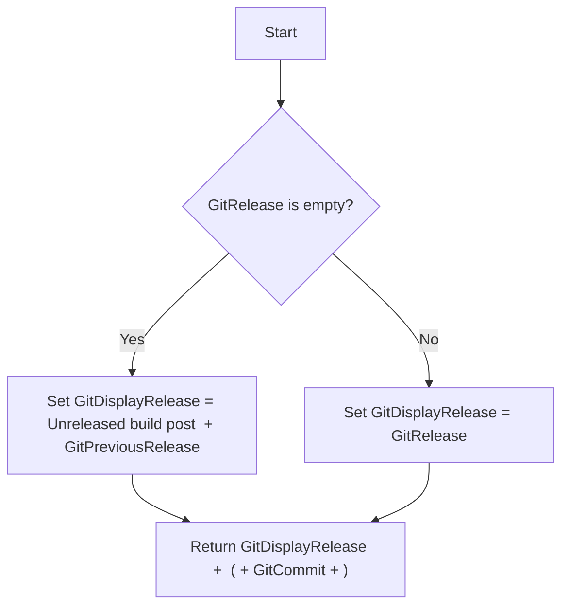
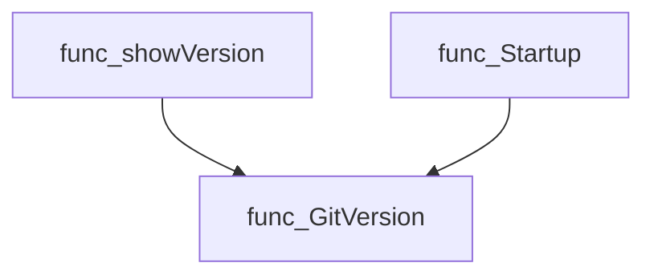
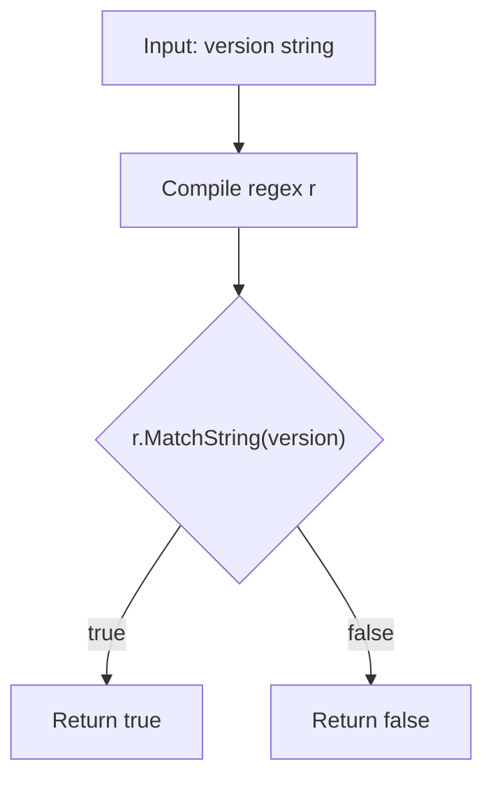
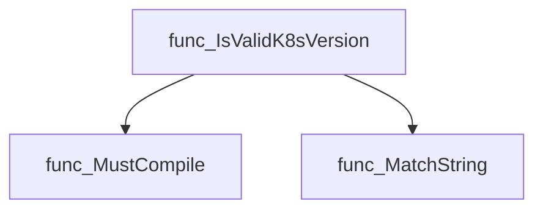
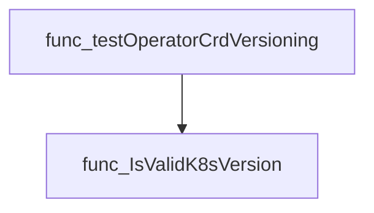
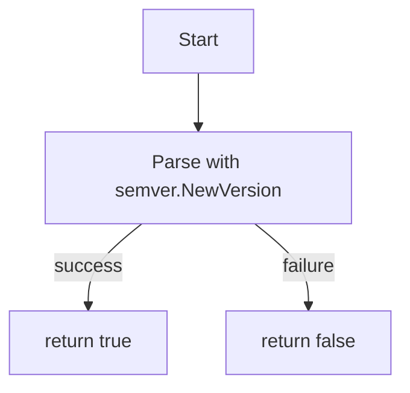
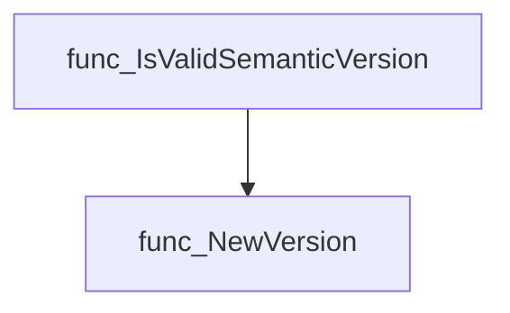
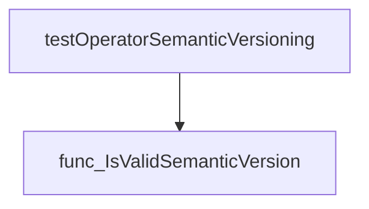

# Package versions

**Path**: `pkg/versions`

## Table of Contents

- [Overview](#overview)
- [Exported Functions](#exported-functions)
  - [GitVersion](#gitversion)
  - [IsValidK8sVersion](#isvalidk8sversion)
  - [IsValidSemanticVersion](#isvalidsemanticversion)

## Overview

Provides utilities for handling version information in CertSuite, including formatting build Git metadata and validating semantic versions used by Kubernetes CRDs.

### Key Features

- Formats the current build’s Git commit, release tags, and previous releases into a human‑readable string via GitVersion

### Design Notes

- Assumes Git metadata is injected at build time; if missing, falls back to "unreleased" placeholders
- Relies on Masterminds/semver for strict semantic version parsing, which may reject pre‑release identifiers not matching CRD conventions
- Best practice: call GitVersion early in application startup to display build info and validate versions before use

### Exported Functions Summary

| Name | Purpose |
|------|----------|
| [func GitVersion() string](#gitversion) | Returns a formatted string that describes the Git version of the current build. If no release tag is present, it indicates an unreleased post‑build and shows the previous release. |
| [func IsValidK8sVersion(version string) bool](#isvalidk8sversion) | Checks whether the supplied string conforms to the accepted Kubernetes semantic‑versioning format used by CRDs (`v<major>[(alpha |
| [func IsValidSemanticVersion(version string) bool](#isvalidsemanticversion) | Determines if `version` conforms to semantic‑versioning rules. |

## Exported Functions

### GitVersion

**GitVersion** - Returns a formatted string that describes the Git version of the current build. If no release tag is present, it indicates an unreleased post‑build and shows the previous release.

Retrieves a human‑readable representation of the current build’s Git state, combining the release tag (or a fallback message) with the commit hash.

#### Signature (Go)

```go
func GitVersion() string
```

#### Summary Table

| Aspect | Details |
|--------|---------|
| **Purpose** | Returns a formatted string that describes the Git version of the current build. If no release tag is present, it indicates an unreleased post‑build and shows the previous release. |
| **Parameters** | None |
| **Return value** | `string` – “<release> (<commit>)” where `<release>` is either the release tag or a fallback message. |
| **Key dependencies** | • Reads global variables: `GitRelease`, `GitPreviousRelease`, `GitDisplayRelease`, `GitCommit`. <br>• No external function calls. |
| **Side effects** | Mutates the global variable `GitDisplayRelease` to reflect the current release string. |
| **How it fits the package** | Provides a single source of truth for reporting the build’s Git state throughout the certsuite application (e.g., in CLI output and logs). |

#### Internal workflow



#### Function dependencies

None – this function is currently not referenced elsewhere in the package.

#### Functions calling `GitVersion`



#### Usage example (Go)

```go
// Minimal example invoking GitVersion
package main

import (
 "fmt"

 "github.com/redhat-best-practices-for-k8s/certsuite/pkg/versions"
)

func main() {
 fmt.Println("Current build:", versions.GitVersion())
}
```

---

### IsValidK8sVersion

**IsValidK8sVersion** - Checks whether the supplied string conforms to the accepted Kubernetes semantic‑versioning format used by CRDs (`v<major>[(alpha

#### Signature (Go)

```go
func IsValidK8sVersion(version string) bool
```

#### Summary Table

| Aspect | Details |
|--------|---------|
| **Purpose** | Checks whether the supplied string conforms to the accepted Kubernetes semantic‑versioning format used by CRDs (`v<major>[(alpha|beta)<num>]{0,2}`). |
| **Parameters** | `version` string – candidate version text. |
| **Return value** | `bool` – `true` if the string matches the pattern; otherwise `false`. |
| **Key dependencies** | • `regexp.MustCompile` from package `regexp`<br>• `MatchString` method on the compiled regex |
| **Side effects** | None – pure function, no state mutation or I/O. |
| **How it fits the package** | Provides a reusable validator for Kubernetes version strings used throughout the test suite to enforce CRD versioning best practices. |

#### Internal workflow



#### Function dependencies



#### Functions calling `IsValidK8sVersion`



#### Usage example (Go)

```go
// Minimal example invoking IsValidK8sVersion
package main

import (
 "fmt"
 "github.com/redhat-best-practices-for-k8s/certsuite/pkg/versions"
)

func main() {
 v := "v1beta2"
 if versions.IsValidK8sVersion(v) {
  fmt.Printf("%q is a valid Kubernetes version string\n", v)
 } else {
  fmt.Printf("%q is NOT a valid Kubernetes version string\n", v)
 }
}
```

---

### IsValidSemanticVersion

**IsValidSemanticVersion** - Determines if `version` conforms to semantic‑versioning rules.

Checks whether a string is a valid [semantic version](https://semver.org/).

---

#### Signature (Go)

```go
func IsValidSemanticVersion(version string) bool
```

---

#### Summary Table

| Aspect | Details |
|--------|---------|
| **Purpose** | Determines if `version` conforms to semantic‑versioning rules. |
| **Parameters** | `version` string – the version string to validate. |
| **Return value** | `bool` – `true` when parsing succeeds, otherwise `false`. |
| **Key dependencies** | Calls `semver.NewVersion` from the `github.com/Masterminds/semver/v3` package. |
| **Side effects** | None; purely functional. |
| **How it fits the package** | Provides a helper for other modules to verify operator or component versions before further processing. |

---

#### Internal workflow (Mermaid)



---

#### Function dependencies (Mermaid)



---

#### Functions calling `IsValidSemanticVersion` (Mermaid)



---

#### Usage example (Go)

```go
// Minimal example invoking IsValidSemanticVersion
package main

import (
 "fmt"

 "github.com/redhat-best-practices-for-k8s/certsuite/pkg/versions"
)

func main() {
 v := "1.2.3"
 if versions.IsValidSemanticVersion(v) {
  fmt.Printf("The version %q is valid.\n", v)
 } else {
  fmt.Printf("The version %q is invalid.\n", v)
 }
}
```

---

---
