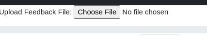

<!-- markdownlint-disable line-length no-bare-urls no-emphasis-as-heading -->
# Test Output

## Claim File

The test suite generates an output file, named **claim** file. This file is considered as the proof of CNFs test run, evaluated by Red Hat when **certified** status is considered.

This file describes the following

* The system(s) under test
* The tests that are executed
* The outcome of the executed / skipped tests

**Files that need to be submitted for certification**

When submitting results back to Red Hat for certification, please include the above mentioned claim file, the JUnit file, and any available console logs.

**How to add a CNF platform test result to the existing claim file?**

```go
go run cmd/tools/cmd/main.go claim-add --claimfile=claim.json
--reportdir=/home/$USER/reports
```

 **Args**:
`--claimfile is an existing claim.json file`
`--repordir :path to test results that you want to include.`

 The tests result files from the given report dir will be appended under the result section of the claim file using file name as the key/value pair.
 The tool will ignore the test result, if the key name is already present under result section of the claim file.

```json
 "results": {
 "cnf-certification-tests_junit": {
 "testsuite": {
 "-errors": "0",
 "-failures": "2",
 "-name": "CNF Certification Test Suite",
 "-tests": "14",
 ...
```

**Reference**

For more details on the contents of the claim file

* [schema](https://github.com/test-network-function/test-network-function-claim/blob/main/schemas/claim.schema.json).  
* [Guide](https://redhat-connect.gitbook.io/openshift-badges/badges/cloud-native-network-functions-cnf).

## Execution logs

The test suite also saves a copy of the execution logs at [test output directory]/tnf-execution.log

## Results artifacts zip file

After running all the test cases, a compressed file will be created with all the results files and web artifacts to review them. The file has a UTC date-time prefix and looks like this:

20230620-110654-cnf-test-results.tar.gz

The "20230620-110654" sample prefix means "June-20th 2023, 11:06:54"

This is the content of the tar.gz file:

* claim.json
* cnf-certification-tests_junit.xml
* claimjson.js
* classification.js
* results-embed.html
* results.html

This file serves two different purposes:

1. Make it easier to store and send the test results for review.
2. View the results in the html web page. In addition, the web page (either results-embed.thml or results.html) has a selector for workload type and allows the parter to introduce feedback for each of the failing test cases for later review from Red Hat. It's important to note that this web page needs the `claimjson.js` and `classification.js` files to be in the same folder as the html files to work properly.

## Show Results after finishing of running the test code

After the end of your run a claim.json file will be created for you with the
results of that specific test run. To see them in a good way that is clear for
you we created a parser that is local.

The parser is a simple HTML web page that can be opened in any browser. It can be
found in the results "tar.gz" file that is generated in the output folder, so it
needs to be uncompressed first in a local folder. Both files `results.html` and
`results-embed.html` can be used. See chapter [Results artifacts zip file](https://test-network-function.github.io/cnf-certification-test/test-output/#results-artifacts-zip-file)
of the Test Output tab of the documentation for more details about the results
"tar.gz" file.


## Upload a previous feedback to the html parser page

Users are able to add their feedback about their test run then download their
own copy of their feedback via the parser HTML page.  Users can then re-use the
feedback they have already entered in future runs.  To do this, users can
upload their `feedback.json` file to the parser HTML page.  Alternatively,
users can place their `feedback.json` file in the compressed folder from the
results.tat.gz that they did after running the tnf test and
needs to be named `feedback.js`.  Users need to convert the
downloaded `feedback.json` to `feedback.js` by running the command:
`./tnf generate feedbackjs -f path-to-feedbackjson/feedback.json -o #your-compressed-results-folder`

when running this command the feedback.json file will be convert to feedback.js
and it will be located on  #your-compressed-results-folder

## HTML Page modes 
### Manually uploading claim and feedback files via the webpage

load the result.html or result-embed.html files locally and click on the "Choose File" button to pick the claim file to load:


Click on the "Upload Feedback File: Choose File" button to pick the feedback file to upload:



### Load local claimjson.js and feedback.js files

When it is loaded, the webpage also looks for the following properly formatted javascript files: claimjson.js and feedback.js.
If present in the same directory as the webpage, both files are loaded to update the webpage content without user interaction. Delete the files to prevent auto-loading the results and feedback. Works for hosted pages and local pages.

### Load claim and feedback files via URL parameters

When the result.html or result-embed.html are hosted it is also possible to pass the url of a claim and a feedback file as follows: 
http://localhost/results-embed.html?claimfile=claim.json&feedback=feedback3.json

- the `claimfile=` parameter indicates the claim file to load
- the `feedback=` parameter indicates the feedback file to load

Both files are loaded without user interaction.
