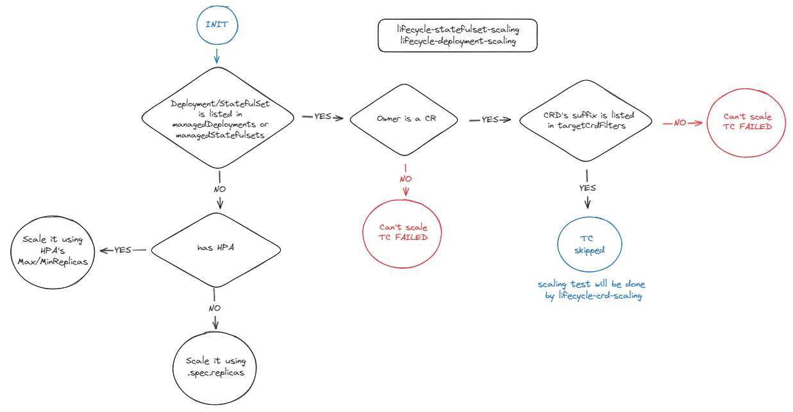
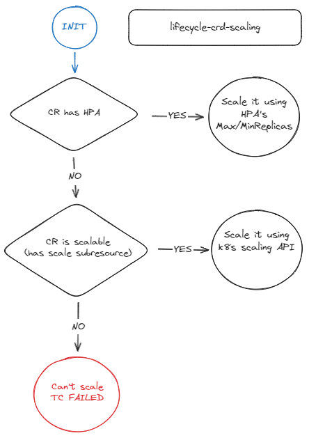

<!-- markdownlint-disable line-length no-bare-urls -->
# Test Case Implementation

This section explains the implementation of some test cases so that users can have a better idea on what the is code actually doing and, in some cases, which configuration fields are relevant to them.

## [lifecycle-deployment-scaling](https://github.com/redhat-best-practices-for-k8s/certsuite/blob/main/CATALOG.md#lifecycle-deployment-scaling) and [lifecycle-statefulset-scaling](https://github.com/redhat-best-practices-for-k8s/certsuite/blob/main/CATALOG.md#lifecycle-statefulset-scaling)

For each discovered deployment in the [target namespaces](https://github.com/redhat-best-practices-for-k8s/certsuite/blob/main/config/certsuite_config.yml#L1), the test case will try to modify its replica count to check whether pod's can be correctly removed and re-deployed in the cluster.

<!-- markdownlint-disable MD033 -->
</img>
<!-- markdownlint-disable MD033 -->

As depicted in the image, the way to modify the number of replicas varies depending on whether the deployment/statefulset's replica count is managed by an HPA, a CR or it's just a standalone resource.

- If the deployment/statefulset is an standalone resource, the test case just decreases the `.spec.replicas` field by one, waits for that pod to be removed and then it restores the original number increasing the field by one again. The test case passes as soon as the new pod is up and running again.
- If there's an [Horizontal Pod Autoscaler](https://kubernetes.io/docs/tasks/run-application/horizontal-pod-autoscale/) (HPA) managing the resource, the test case decreases and increases the HPA's MaxReplicas field accordingly.
- If [the owner](https://kubernetes.io/docs/concepts/overview/working-with-objects/owners-dependents/#owner-references-in-object-specifications) of the resource is a CR, the test makes sure that CR's CRD matches any of the suffixes in the certsuite_config.yaml's [targetCrdFilters](https://github.com/redhat-best-practices-for-k8s/certsuite/blob/main/config/certsuite_config.yml#L9) field. If there's a match, the test case is skipped as it's there's another test case called lifecycle-crd-scaling that will test it. Otherwise it will flagged as failed.

## [lifecycle-crd-scaling](https://github.com/redhat-best-practices-for-k8s/certsuite/blob/main/CATALOG.md#lifecycle-crd-scaling)

During the program's startup, an autodiscovery phase is performed where all the CRDs and their existing CRs in the [target namespaces](https://github.com/redhat-best-practices-for-k8s/certsuite/blob/main/config/certsuite_config.yml#L1) are stored to be tested later. Only CRs whose CRD's suffix matches at least one of the [targetCrdFilters](https://github.com/redhat-best-practices-for-k8s/certsuite/blob/main/config/certsuite_config.yml#L9) and has an [scale subresource](https://kubernetes.io/docs/tasks/extend-kubernetes/custom-resources/custom-resource-definitions/#scale-subresource) will be selected as test targets.

For every CR under test, a similar approach to the scaling of deployments and statefulsets is done.

<!-- markdownlint-disable MD033 -->
</img>
<!-- markdownlint-disable MD033 -->
