# Package accesscontrol

**Path**: `tests/accesscontrol`

## Table of Contents

- [Overview](#overview)
- [Exported Functions](#exported-functions)
  - [LoadChecks](#loadchecks)
- [Local Functions](#local-functions)
  - [checkForbiddenCapability](#checkforbiddencapability)
  - [getNbOfProcessesInPidNamespace](#getnbofprocessesinpidnamespace)
  - [isCSVAndClusterWide](#iscsvandclusterwide)
  - [isContainerCapabilitySet](#iscontainercapabilityset)
  - [isInstallModeMultiNamespace](#isinstallmodemultinamespace)
  - [ownedByClusterWideOperator](#ownedbyclusterwideoperator)
  - [test1337UIDs](#test1337uids)
  - [testAutomountServiceToken](#testautomountservicetoken)
  - [testBpfCapability](#testbpfcapability)
  - [testContainerHostPort](#testcontainerhostport)
  - [testContainerSCC](#testcontainerscc)
  - [testCrdRoles](#testcrdroles)
  - [testIpcLockCapability](#testipclockcapability)
  - [testNamespace](#testnamespace)
  - [testNamespaceResourceQuota](#testnamespaceresourcequota)
  - [testNetAdminCapability](#testnetadmincapability)
  - [testNetRawCapability](#testnetrawcapability)
  - [testNoSSHDaemonsAllowed](#testnosshdaemonsallowed)
  - [testNodePort](#testnodeport)
  - [testOneProcessPerContainer](#testoneprocesspercontainer)
  - [testPodClusterRoleBindings](#testpodclusterrolebindings)
  - [testPodHostIPC](#testpodhostipc)
  - [testPodHostNetwork](#testpodhostnetwork)
  - [testPodHostPID](#testpodhostpid)
  - [testPodHostPath](#testpodhostpath)
  - [testPodRequests](#testpodrequests)
  - [testPodRoleBindings](#testpodrolebindings)
  - [testPodServiceAccount](#testpodserviceaccount)
  - [testSYSNiceRealtimeCapability](#testsysnicerealtimecapability)
  - [testSecConPrivilegeEscalation](#testsecconprivilegeescalation)
  - [testSecConReadOnlyFilesystem](#testsecconreadonlyfilesystem)
  - [testSecConRunAsNonRoot](#testsecconrunasnonroot)
  - [testSysAdminCapability](#testsysadmincapability)
  - [testSysPtraceCapability](#testsysptracecapability)

## Overview

The access‑control test suite registers a collection of checks that validate Kubernetes workloads against security best practices, such as forbidden capabilities, insecure host settings, and improper resource limits.

### Key Features

- Loads a check group named "Access‑Control" and attaches pre‑test setup callbacks
- Provides individual checks for container capabilities (e.g., BPF, SYS_ADMIN), host networking flags, pod service accounts, and namespace constraints
- Collects results into structured report objects that record compliance or violations

### Design Notes

- Checks are registered via LoadChecks; callers must invoke the returned function to perform registration
- Non‑exported helper functions such as isContainerCapabilitySet encapsulate capability logic to keep checks concise
- Test data (e.g., env, beforeEachFn) is injected through package globals for test orchestration

### Exported Functions Summary

| Name | Purpose |
|------|----------|
| [func LoadChecks()](#loadchecks) | Creates the “Access‑Control” check group, attaches pre‑test setup and registers individual checks that verify security best practices on Kubernetes resources. |

### Local Functions Summary

| Name | Purpose |
|------|----------|
| [func checkForbiddenCapability(containers []*provider.Container, capability string, logger *log.Logger) (compliantObjects, nonCompliantObjects []*testhelper.ReportObject)](#checkforbiddencapability) | Determines whether each container in a list uses a disallowed Linux capability. It returns separate slices of report objects for compliant and non‑compliant containers. |
| [func(clientsholder.Context, int, clientsholder.Command) (int, error)](#getnbofprocessesinpidnamespace) | Executes `lsns -p <pid> -t pid -n` inside a container to count how many processes share the same PID namespace as the target process. |
| [func isCSVAndClusterWide(aNamespace, name string, env *provider.TestEnvironment) bool](#iscsvandclusterwide) | Determines if the CSV referenced by `aNamespace` and `name` is created by a cluster‑wide operator. |
| [func isContainerCapabilitySet(containerCapabilities *corev1.Capabilities, capability string) bool](#iscontainercapabilityset) | Determines if a container has the specified capability enabled (or if `"ALL"` is set). |
| [func([]v1alpha1.InstallMode)(bool)](#isinstallmodemultinamespace) | Determines if any `InstallMode` in the slice has type `AllNamespaces`. |
| [func ownedByClusterWideOperator(topOwners map[string]podhelper.TopOwner, env *provider.TestEnvironment) (aNamespace, name string, found bool)](#ownedbyclusterwideoperator) | Checks whether any of the provided `topOwners` is a Cluster Service Version (CSV) installed by a cluster‑wide operator. Returns the CSV’s namespace and name if one matches. |
| [func test1337UIDs(check *checksdb.Check, env *provider.TestEnvironment)](#test1337uids) | Verifies each pod in the test environment does not run with `securityContext.runAsUser` set to 1337. Sets compliance results accordingly. |
| [func testAutomountServiceToken(check *checksdb.Check, env *provider.TestEnvironment)](#testautomountservicetoken) | Inspects each pod in the test environment to ensure it does not use the default service account and that its `automountServiceAccountToken` setting is explicitly set to `false`. It records compliant or non‑compliant findings. |
| [func testBpfCapability(check *checksdb.Check, env *provider.TestEnvironment)](#testbpfcapability) | Determines whether any container in the test environment requests the forbidden `BPF` capability and records compliance status. |
| [func testContainerHostPort(check *checksdb.Check, env *provider.TestEnvironment)](#testcontainerhostport) | Checks each container in the test environment for configured host‑port mappings and records compliance status. |
| [func testContainerSCC(check *checksdb.Check, env *provider.TestEnvironment)](#testcontainerscc) | Scans all pods in the supplied environment, determines each container’s Security Context Constraint (SCC) category via `securitycontextcontainer.CheckPod`, and records compliance results. Containers outside the least‑privileged categories fail the test. |
| [func testCrdRoles(check *checksdb.Check, env *provider.TestEnvironment)](#testcrdroles) | Determines which role rules target Custom Resource Definitions (CRDs) included in the current test environment and records compliance results. |
| [func testIpcLockCapability(check *checksdb.Check, env *provider.TestEnvironment)](#testipclockcapability) | Ensures no container in the test environment declares the `IPC_LOCK` capability, which is considered a security risk. |
| [func testNamespace(check *checksdb.Check, env *provider.TestEnvironment)](#testnamespace) | Validates each namespace supplied by the test environment. It checks for disallowed prefixes and verifies that custom resources (CRs) are only deployed in configured namespaces. Results are recorded as compliant or non‑compliant objects. |
| [func testNamespaceResourceQuota(check *checksdb.Check, env *provider.TestEnvironment)](#testnamespaceresourcequota) | Verifies that every Pod in the environment runs inside a namespace that has an applied ResourceQuota. Sets compliance results accordingly. |
| [func testNetAdminCapability(check *checksdb.Check, env *provider.TestEnvironment)](#testnetadmincapability) | Checks each container in the test environment for the presence of the `NET_ADMIN` capability and records compliance results. |
| [func testNetRawCapability(check *checksdb.Check, env *provider.TestEnvironment)](#testnetrawcapability) | Detects and reports any container that requests the `NET_RAW` Linux capability, which is considered forbidden for most workloads. |
| [func testNoSSHDaemonsAllowed(check *checksdb.Check, env *provider.TestEnvironment)](#testnosshdaemonsallowed) | Determines whether any pod in the environment exposes an SSH daemon and records compliant/non‑compliant results. |
| [func testNodePort(check *checksdb.Check, env *provider.TestEnvironment)](#testnodeport) | Validates each Kubernetes Service in the test environment; reports services that are of type `NodePort` as non‑compliant and those that are not as compliant. |
| [func testOneProcessPerContainer(check *checksdb.Check, env *provider.TestEnvironment) {}](#testoneprocesspercontainer) | Ensures that each non‑Istio‑proxy container runs only one process. Sets the check result with compliant and non‑compliant containers. |
| [func testPodClusterRoleBindings(check *checksdb.Check, env *provider.TestEnvironment)](#testpodclusterrolebindings) | Checks each pod in the environment to ensure it is not bound to a cluster‑role, unless the pod is owned by a cluster‑wide operator. |
| [func testPodHostIPC(check *checksdb.Check, env *provider.TestEnvironment)](#testpodhostipc) | Confirms each pod in the test environment does **not** set `spec.hostIPC` to `true`. |
| [func testPodHostNetwork(check *checksdb.Check, env *provider.TestEnvironment)](#testpodhostnetwork) | Ensures that `spec.hostNetwork` is not set to `true` for any pod under test. A pod using host networking can expose the node’s network stack to the container, which is a security risk. |
| [func testPodHostPID(check *checksdb.Check, env *provider.TestEnvironment)](#testpodhostpid) | Ensures each Pod in the environment does **not** have `spec.hostPID` set to true. A compliant pod passes; a non‑compliant pod is reported. |
| [func testPodHostPath(check *checksdb.Check, env *provider.TestEnvironment)](#testpodhostpath) | Ensures every pod’s volumes either lack a `hostPath` or have an empty path. If any host path is present, the pod is flagged as non‑compliant; otherwise it is compliant. |
| [func testPodRequests(*checksdb.Check, *provider.TestEnvironment)](#testpodrequests) | Verifies each container in the environment has CPU and memory resource requests set; records compliant and non‑compliant containers. |
| [func testPodRoleBindings(check *checksdb.Check, env *provider.TestEnvironment)](#testpodrolebindings) | Ensures that a pod’s service account does not reference role bindings outside of the allowed CNF namespaces. |
| [func testPodServiceAccount(check *checksdb.Check, env *provider.TestEnvironment)](#testpodserviceaccount) | Determines whether each Pod in the test environment uses a non‑default ServiceAccount. Logs findings and records compliant or non‑compliant objects. |
| [func testSYSNiceRealtimeCapability(check *checksdb.Check, env *provider.TestEnvironment)](#testsysnicerealtimecapability) | Determines compliance of each container with respect to the `SYS_NICE` capability when running on a node whose kernel is realtime enabled. |
| [func testSecConPrivilegeEscalation(check *checksdb.Check, env *provider.TestEnvironment)](#testsecconprivilegeescalation) | Confirms each container’s `SecurityContext.AllowPrivilegeEscalation` is not set to `true`. Containers violating this rule are reported as non‑compliant. |
| [func testSecConReadOnlyFilesystem(check *checksdb.Check, env *provider.TestEnvironment)](#testsecconreadonlyfilesystem) | Determines whether every container in the supplied environment has a read‑only root filesystem and records compliance results. |
| [func testSecConRunAsNonRoot(check *checksdb.Check, env *provider.TestEnvironment)](#testsecconrunasnonroot) | Confirms each pod’s containers either have `RunAsNonRoot=true` or a non‑zero user ID. Non‑compliant pods and containers are recorded for reporting. |
| [func testSysAdminCapability(check *checksdb.Check, env *provider.TestEnvironment)](#testsysadmincapability) | Determines whether any container uses the `SYS_ADMIN` Linux capability, which is disallowed for security reasons. |
| [func testSysPtraceCapability(check *checksdb.Check, env *provider.TestEnvironment)](#testsysptracecapability) | Determines whether each pod that shares a process namespace also grants at least one container the `SYS_PTRACE` capability. The check records compliant and non‑compliant pods. |

## Exported Functions

### LoadChecks

**LoadChecks** - Creates the “Access‑Control” check group, attaches pre‑test setup and registers individual checks that verify security best practices on Kubernetes resources.

#### Signature (Go)

```go
func LoadChecks()
```

#### Summary Table

| Aspect | Details |
|--------|---------|
| **Purpose** | Creates the “Access‑Control” check group, attaches pre‑test setup and registers individual checks that verify security best practices on Kubernetes resources. |
| **Parameters** | None |
| **Return value** | None (side‑effect: populates the internal checks database) |
| **Key dependencies** | <ul><li>`log.Debug` – logs the start of the suite</li><li>`WithBeforeEachFn` – attaches a setup routine to the group</li><li>`checksdb.NewChecksGroup` – creates a new check group</li><li>`checksdb.Add`, `NewCheck`, `WithSkipCheckFn`, `WithCheckFn` – construct and configure individual checks</li></ul> |
| **Side effects** | Modifies the global checks registry, logs debug information, registers skip logic and test functions for each check. |
| **How it fits the package** | It is invoked by `certsuite.LoadInternalChecksDB()` to load all access‑control related tests into the shared test framework. |

#### Internal workflow (Mermaid)

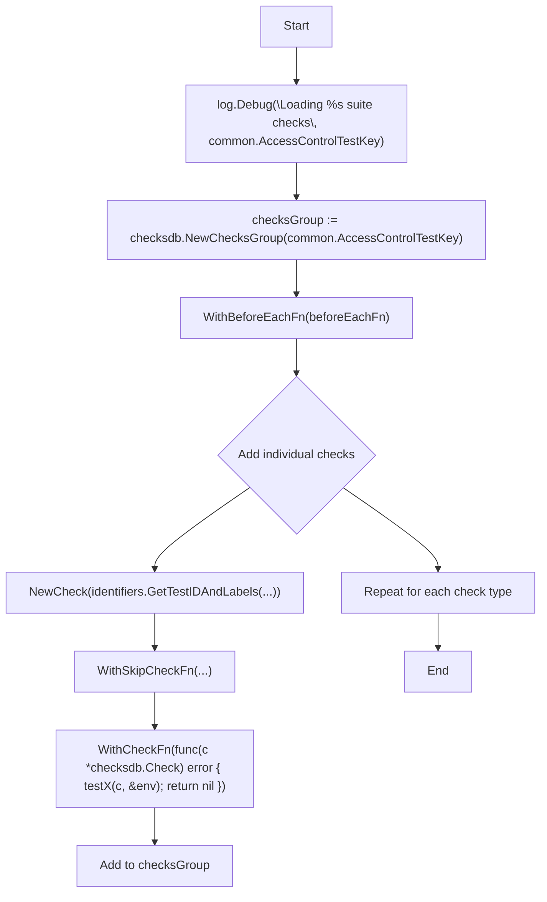

#### Function dependencies (Mermaid)

```mermaid
graph TD
  func_LoadChecks --> log_Debug
  func_LoadChecks --> WithBeforeEachFn
  func_LoadChecks --> checksdb_NewChecksGroup
  func_LoadChecks --> checksdb_Add
  func_LoadChecks --> identifiers_GetTestIDAndLabels
  func_LoadChecks --> testhelper_GetNoContainersUnderTestSkipFn
  func_LoadChecks --> testhelper_GetNoPodsUnderTestSkipFn
  func_LoadChecks --> testhelper_GetNoNamespacesSkipFn
  func_LoadChecks --> testhelper_GetDaemonSetFailedToSpawnSkipFn
  func_LoadChecks --> testhelper_GetSharedProcessNamespacePodsSkipFn
  func_LoadChecks --> testhelper_GetNoNodesWithRealtimeKernelSkipFn
  func_LoadChecks --> testContainerSCC
  func_LoadChecks --> testSysAdminCapability
  func_LoadChecks --> testNetAdminCapability
  func_LoadChecks --> testNetRawCapability
  func_LoadChecks --> testIpcLockCapability
  func_LoadChecks --> testBpfCapability
  func_LoadChecks --> testSecConRunAsNonRoot
  func_LoadChecks --> testSecConPrivilegeEscalation
  func_LoadChecks --> testSecConReadOnlyFilesystem
  func_LoadChecks --> testContainerHostPort
  func_LoadChecks --> testPodHostNetwork
  func_LoadChecks --> testPodHostPath
  func_LoadChecks --> testPodHostIPC
  func_LoadChecks --> testPodHostPID
  func_LoadChecks --> testNamespace
  func_LoadChecks --> testPodServiceAccount
  func_LoadChecks --> testPodRoleBindings
  func_LoadChecks --> testPodClusterRoleBindings
  func_LoadChecks --> testAutomountServiceToken
  func_LoadChecks --> testOneProcessPerContainer
  func_LoadChecks --> testSYSNiceRealtimeCapability
  func_LoadChecks --> testSysPtraceCapability
  func_LoadChecks --> testNamespaceResourceQuota
  func_LoadChecks --> testNoSSHDaemonsAllowed
  func_LoadChecks --> testPodRequests
  func_LoadChecks --> test1337UIDs
  func_LoadChecks --> testNodePort
  func_LoadChecks --> testCrdRoles
```

#### Functions calling `LoadChecks` (Mermaid)

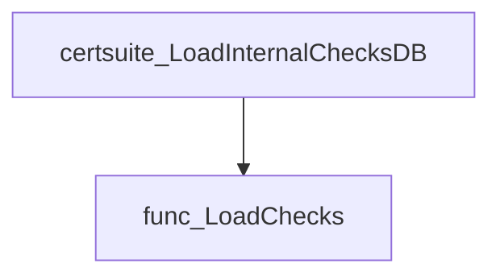

#### Usage example (Go)

```go
// Minimal example invoking LoadChecks to register the suite checks.
package main

import (
 "github.com/redhat-best-practices-for-k8s/certsuite/tests/accesscontrol"
)

func main() {
 accesscontrol.LoadChecks()
}
```

---

## Local Functions

### checkForbiddenCapability

**checkForbiddenCapability** - Determines whether each container in a list uses a disallowed Linux capability. It returns separate slices of report objects for compliant and non‑compliant containers.

#### Signature (Go)

```go
func checkForbiddenCapability(containers []*provider.Container, capability string, logger *log.Logger) (compliantObjects, nonCompliantObjects []*testhelper.ReportObject)
```

#### Summary Table

| Aspect | Details |
|--------|---------|
| **Purpose** | Determines whether each container in a list uses a disallowed Linux capability. It returns separate slices of report objects for compliant and non‑compliant containers. |
| **Parameters** | `containers []*provider.Container` – slice of container metadata.<br>`capability string` – name of the capability to forbid.<br>`logger *log.Logger` – logger used for informational and error messages. |
| **Return value** | Two slices:<br>• `compliantObjects []*testhelper.ReportObject` – report objects for containers that do **not** use the forbidden capability.<br>• `nonCompliantObjects []*testhelper.ReportObject` – report objects for containers that **do** use it. |
| **Key dependencies** | • `logger.Info`, `logger.Error`<br>• `isContainerCapabilitySet(containerCapabilities *corev1.Capabilities, capability string) bool` (internal helper)<br>• `append` (slice operation)<br>• `testhelper.NewContainerReportObject(...)`<br>• `AddField` on the report object |
| **Side effects** | Emits log messages; no state mutation beyond slice construction. No I/O or concurrency side‑effects. |
| **How it fits the package** | Used by multiple capability‑checking tests (e.g., `testBpfCapability`, `testNetAdminCapability`) to centralise logic for detecting forbidden capabilities across containers in a pod environment. |

#### Internal workflow

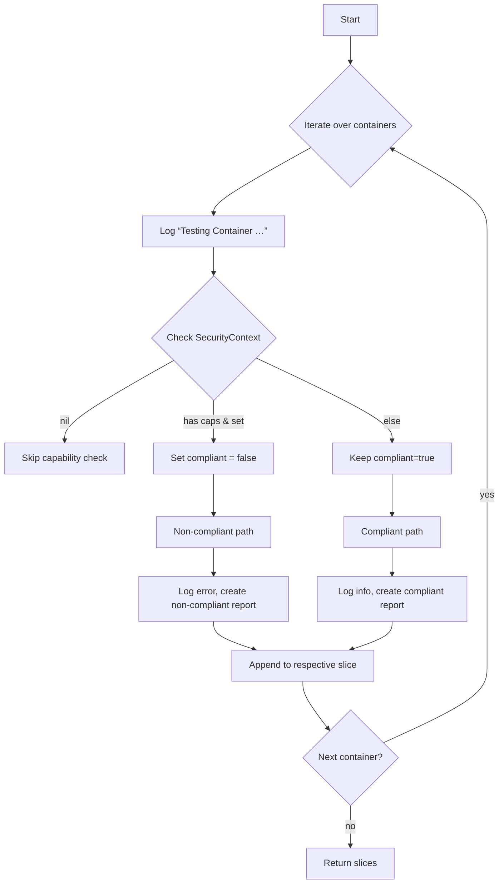

#### Function dependencies

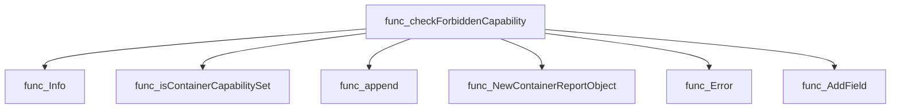

#### Functions calling `checkForbiddenCapability`

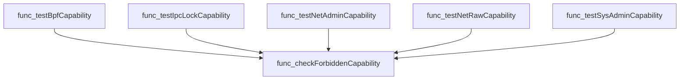

#### Usage example (Go)

```go
// Minimal example invoking checkForbiddenCapability
containers := []*provider.Container{ /* …populate list… */ }
logger := log.New(os.Stdout, "accesscontrol: ", log.LstdFlags)

compliant, nonCompliant := checkForbiddenCapability(containers, "NET_ADMIN", logger)

// Process results (e.g., report to a test framework)
for _, obj := range compliant {
    fmt.Println("✅", obj.Reason)
}
for _, obj := range nonCompliant {
    fmt.Println("❌", obj.Reason)
}
```

---

### getNbOfProcessesInPidNamespace

**getNbOfProcessesInPidNamespace** - Executes `lsns -p <pid> -t pid -n` inside a container to count how many processes share the same PID namespace as the target process.

#### Signature (Go)

```go
func(clientsholder.Context, int, clientsholder.Command) (int, error)
```

#### Summary Table

| Aspect | Details |
|--------|---------|
| **Purpose** | Executes `lsns -p <pid> -t pid -n` inside a container to count how many processes share the same PID namespace as the target process. |
| **Parameters** | `ctx clientsholder.Context –` execution context (namespace, pod, container).<br>`targetPid int –` PID of the reference process.<br>`ch clientsholder.Command –` command executor that runs shell commands in a container. |
| **Return value** | `<int> –` number of processes found; `<error>` – any failure during command execution or parsing. |
| **Key dependencies** | `strconv.Itoa`, `ExecCommandContainer`, `fmt.Errorf`, `strings.Fields`, `strconv.Atoi`. |
| **Side effects** | Performs I/O by running a shell command inside the target container; does not modify program state. |
| **How it fits the package** | Used in access‑control tests to enforce that each container runs only one process, aiding isolation verification. |

#### Internal workflow (Mermaid)

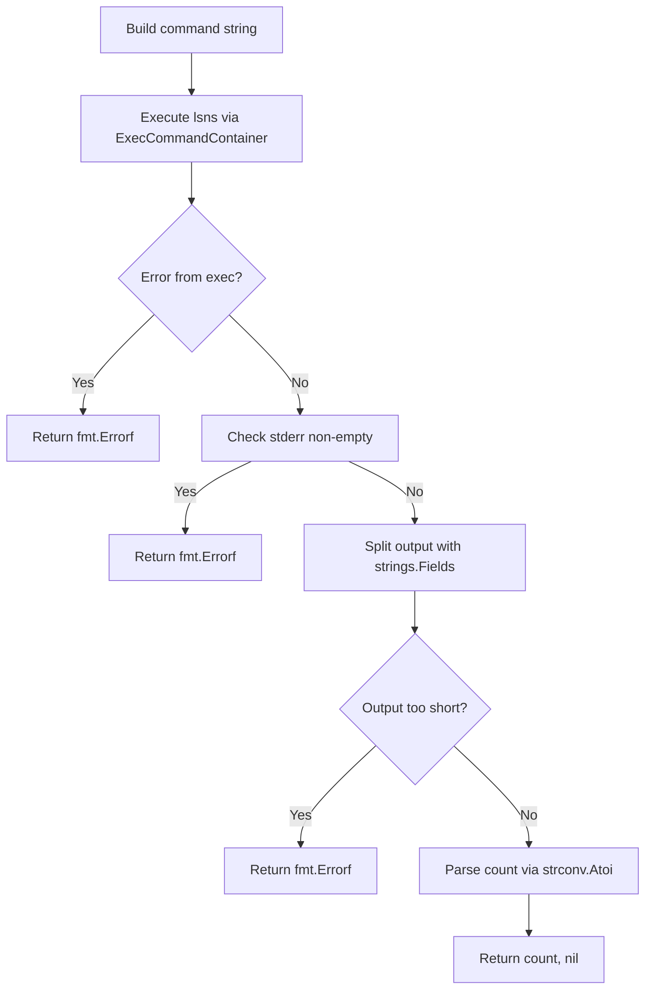

#### Function dependencies (Mermaid)

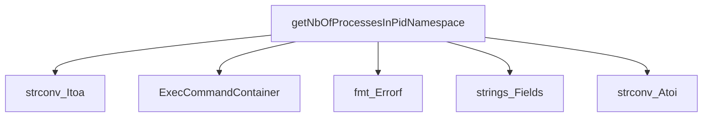

#### Functions calling `getNbOfProcessesInPidNamespace` (Mermaid)

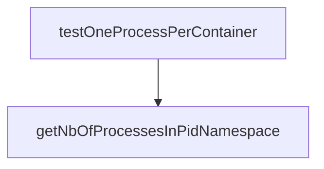

#### Usage example (Go)

```go
// Minimal example invoking getNbOfProcessesInPidNamespace
ctx := clientsholder.NewContext("default", "mypod", "mycontainer")
pid := 1234 // PID of a process inside the container
nb, err := getNbOfProcessesInPidNamespace(ctx, pid, clientsholder.GetClientsHolder())
if err != nil {
    log.Fatalf("Failed to count processes: %v", err)
}
fmt.Printf("Number of processes in the namespace: %d\n", nb)
```

---

---

### isCSVAndClusterWide

**isCSVAndClusterWide** - Determines if the CSV referenced by `aNamespace` and `name` is created by a cluster‑wide operator.

Checks whether a CSV identified by namespace and name belongs to a cluster‑wide operator.

---

#### Signature (Go)

```go
func isCSVAndClusterWide(aNamespace, name string, env *provider.TestEnvironment) bool
```

---

#### Summary Table

| Aspect | Details |
|--------|---------|
| **Purpose** | Determines if the CSV referenced by `aNamespace` and `name` is created by a cluster‑wide operator. |
| **Parameters** | `aNamespace string – namespace of the object`<br>`name string – name of the object`<br>`env *provider.TestEnvironment – environment containing known operators` |
| **Return value** | `bool – true if the CSV belongs to a cluster‑wide operator, otherwise false` |
| **Key dependencies** | • `isInstallModeMultiNamespace(installModes []v1alpha1.InstallMode) bool`<br>• Iteration over `env.Operators` and access of their fields (`Csv`, `IsClusterWide`) |
| **Side effects** | None – purely read‑only logic. |
| **How it fits the package** | Used by higher‑level ownership checks to determine if an operator is cluster‑wide within the access‑control test suite. |

---

#### Internal workflow (Mermaid)

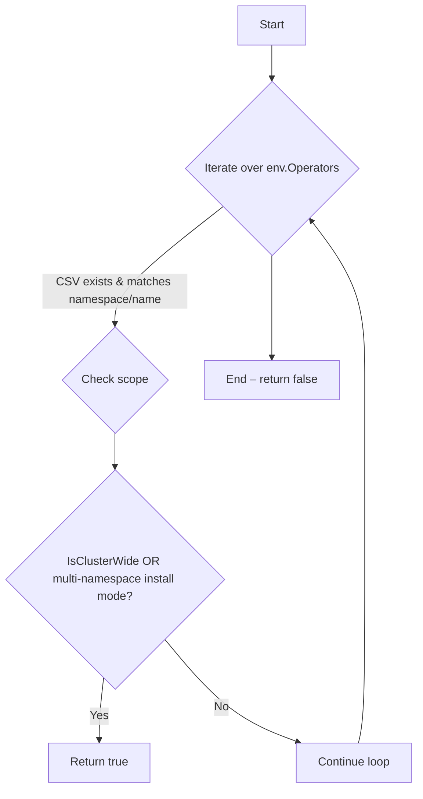

---

#### Function dependencies (Mermaid)

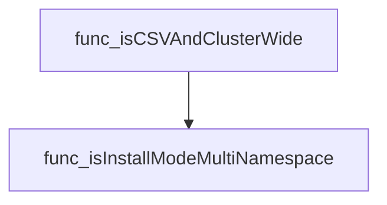

---

#### Functions calling `isCSVAndClusterWide` (Mermaid)

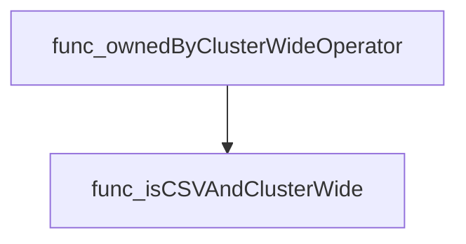

---

#### Usage example (Go)

```go
// Minimal example invoking isCSVAndClusterWide
env := &provider.TestEnvironment{
    Operators: []*operator.Operator{
        {
            Csv: &v1alpha1.ClusterServiceVersion{Namespace: "openshift-operators", Name: "my-op"},
            IsClusterWide: true,
        },
    },
}
ok := isCSVAndClusterWide("openshift-operators", "my-op", env)
// ok == true
```

---

### isContainerCapabilitySet

**isContainerCapabilitySet** - Determines if a container has the specified capability enabled (or if `"ALL"` is set).

Checks whether a specific capability is explicitly granted to a container via the `securityContext.capabilities.add` list, treating `"ALL"` as an implicit match for any capability.

---

#### Signature (Go)

```go
func isContainerCapabilitySet(containerCapabilities *corev1.Capabilities, capability string) bool
```

---

#### Summary Table

| Aspect | Details |
|--------|---------|
| **Purpose** | Determines if a container has the specified capability enabled (or if `"ALL"` is set). |
| **Parameters** | `containerCapabilities` – pointer to `corev1.Capabilities`; `capability` – string name of the capability to check. |
| **Return value** | `bool`: `true` if the capability or `"ALL"` appears in the add list; otherwise `false`. |
| **Key dependencies** | • `len` (built‑in) <br>• `stringhelper.StringInSlice` (generic helper)<br>• `corev1.Capability` type conversion |
| **Side effects** | None – pure function. |
| **How it fits the package** | Utility used by tests to validate that containers do not or do use forbidden capabilities, and to enforce rules around realtime kernel usage. |

---

#### Internal workflow (Mermaid)

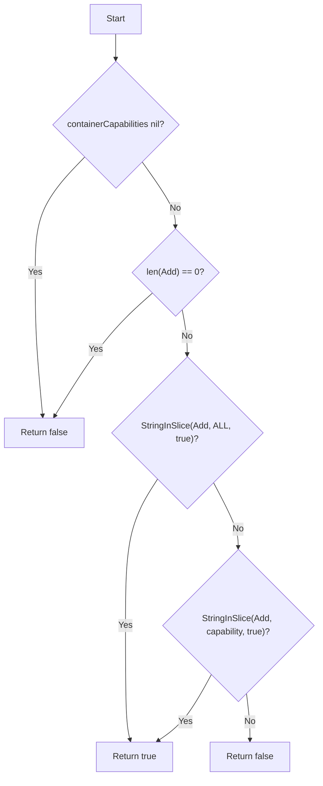

---

#### Function dependencies (Mermaid)

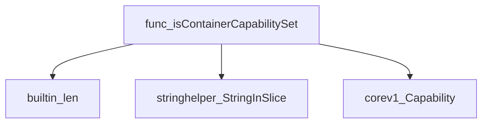

---

#### Functions calling `isContainerCapabilitySet` (Mermaid)

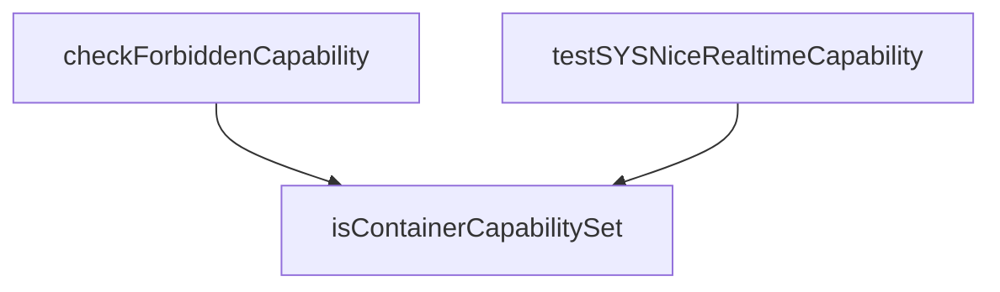

---

#### Usage example (Go)

```go
// Minimal example invoking isContainerCapabilitySet
package main

import (
 "fmt"

 corev1 "k8s.io/api/core/v1"
 "github.com/redhat-best-practices-for-k8s/certsuite/tests/accesscontrol"
)

func main() {
 caps := &corev1.Capabilities{
  Add: []corev1.Capability{"NET_ADMIN", "SYS_NICE"},
 }
 hasSysNice := accesscontrol.IsContainerCapabilitySet(caps, "SYS_NICE") // package export is not available; this is a conceptual example.
 fmt.Printf("Has SYS_NICE? %t\n", hasSysNice)
}
```

*Note:* `isContainerCapabilitySet` is unexported. In practice the test suite calls it directly within the same package.

---

### isInstallModeMultiNamespace

**isInstallModeMultiNamespace** - Determines if any `InstallMode` in the slice has type `AllNamespaces`.

Checks whether a CSV’s install modes include **AllNamespaces** (indicating multi‑namespace or cluster‑wide support).

```go
func([]v1alpha1.InstallMode)(bool)
```

| Aspect | Details |
|--------|---------|
| **Purpose** | Determines if any `InstallMode` in the slice has type `AllNamespaces`. |
| **Parameters** | `installModes []v1alpha1.InstallMode` – list of install modes to examine. |
| **Return value** | `bool` – `true` if at least one mode is `AllNamespaces`; otherwise `false`. |
| **Key dependencies** | • `len(installModes)` – to iterate over the slice.<br>• `v1alpha1.InstallModeTypeAllNamespaces` constant. |
| **Side effects** | None (pure function). |
| **How it fits the package** | Used by higher‑level checks (e.g., `isCSVAndClusterWide`) to decide if a CSV can be installed cluster‑wide. |

#### Internal workflow

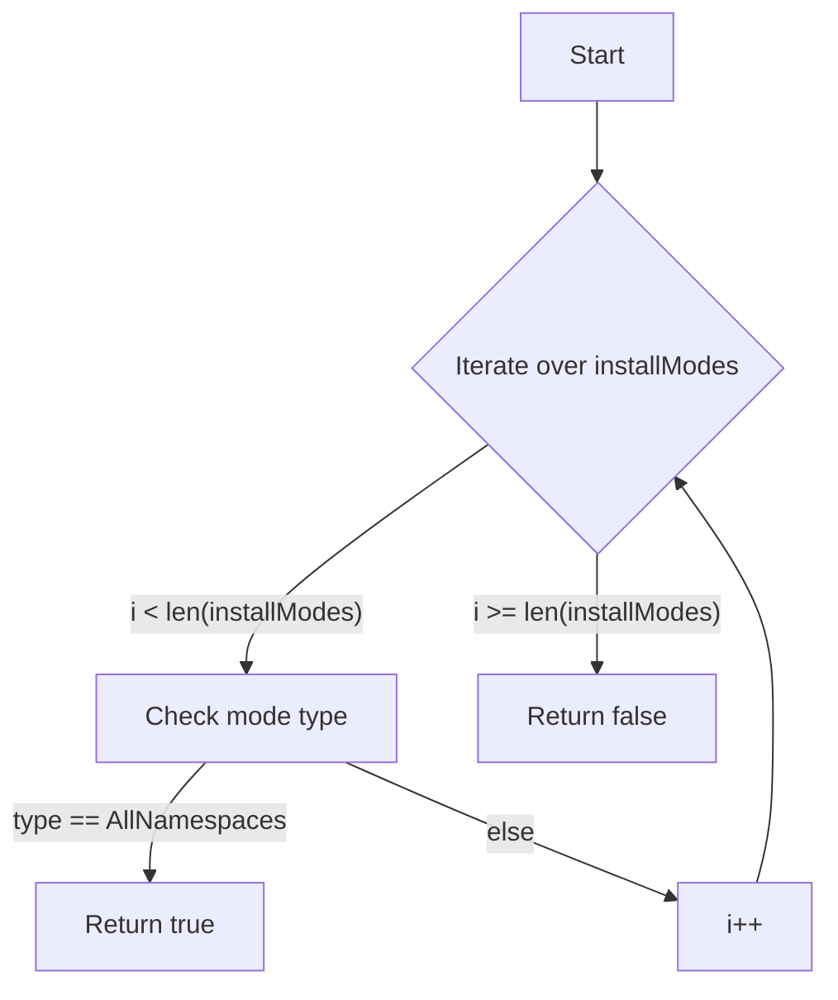

#### Function dependencies

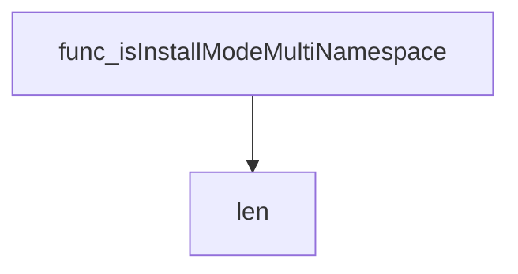

#### Functions calling `isInstallModeMultiNamespace`


#### Usage example (Go)

```go
// Minimal example invoking isInstallModeMultiNamespace
import (
    "github.com/redhat-best-practices-for-k8s/certsuite/tests/accesscontrol"
    v1alpha1 "github.com/operator-framework/api/pkg/operators/v1alpha1"
)

func main() {
    modes := []v1alpha1.InstallMode{
        {Type: v1alpha1.InstallModeTypeSingleNamespace},
        {Type: v1alpha1.InstallModeTypeAllNamespaces}, // triggers true
    }
    clusterWide := accesscontrol.isInstallModeMultiNamespace(modes)
    fmt.Println("Cluster‑wide support:", clusterWide) // prints: Cluster-wide support: true
}
```

---

### ownedByClusterWideOperator

**ownedByClusterWideOperator** - Checks whether any of the provided `topOwners` is a Cluster Service Version (CSV) installed by a cluster‑wide operator. Returns the CSV’s namespace and name if one matches.

#### Signature (Go)

```go
func ownedByClusterWideOperator(topOwners map[string]podhelper.TopOwner, env *provider.TestEnvironment) (aNamespace, name string, found bool)
```

#### Summary Table

| Aspect | Details |
|--------|---------|
| **Purpose** | Checks whether any of the provided `topOwners` is a Cluster Service Version (CSV) installed by a cluster‑wide operator. Returns the CSV’s namespace and name if one matches. |
| **Parameters** | `topOwners map[string]podhelper.TopOwner` – mapping of owner identifiers to their details.<br>`env *provider.TestEnvironment` – environment containing operator metadata. |
| **Return value** | `<aNamespace string, name string, found bool>` – namespace and name of the matching CSV, and a boolean indicating success. |
| **Key dependencies** | • `isCSVAndClusterWide` – helper that validates CSV ownership and cluster‑wide status.<br>• `env.Operators` – list of operator descriptors in the test environment. |
| **Side effects** | None; purely functional. |
| **How it fits the package** | Used by pod access‑control checks to exempt pods owned by cluster‑wide operators from certain RBAC restrictions. |

#### Internal workflow (Mermaid)

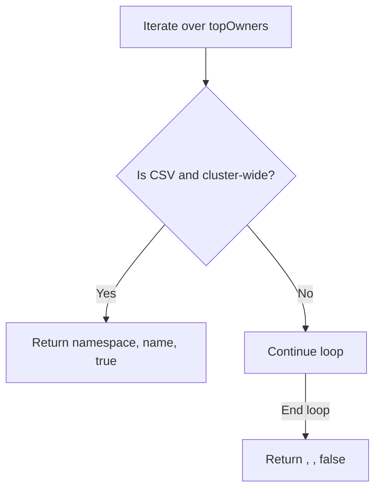

#### Function dependencies (Mermaid)


#### Functions calling `ownedByClusterWideOperator` (Mermaid)

```mermaid
graph TD
  func_testPodClusterRoleBindings --> func_ownedByClusterWideOperator
```

#### Usage example (Go)

```go
// Minimal example invoking ownedByClusterWideOperator

import (
    "github.com/redhat-best-practices-for-k8s/certsuite/tests/accesscontrol"
    "github.com/redhat-best-practices-for-k8s/certsuite/tests/podhelper"
    "github.com/redhat-best-practices-for-k8s/certsuite/tests/provider"
)

func example(env *provider.TestEnvironment, podOwners map[string]podhelper.TopOwner) {
    ns, name, ok := accesscontrol.ownedByClusterWideOperator(podOwners, env)
    if ok {
        fmt.Printf("Pod is owned by cluster‑wide CSV %s/%s\n", ns, name)
    } else {
        fmt.Println("No matching cluster‑wide CSV found")
    }
}
```

---

### test1337UIDs

**test1337UIDs** - Verifies each pod in the test environment does not run with `securityContext.runAsUser` set to 1337. Sets compliance results accordingly.

#### Signature (Go)

```go
func test1337UIDs(check *checksdb.Check, env *provider.TestEnvironment) 
```

#### Summary Table

| Aspect | Details |
|--------|---------|
| **Purpose** | Verifies each pod in the test environment does not run with `securityContext.runAsUser` set to 1337. Sets compliance results accordingly. |
| **Parameters** | `check *checksdb.Check` – context for logging and result storage.<br>`env *provider.TestEnvironment` – collection of pods to evaluate. |
| **Return value** | None (side‑effect: sets check result). |
| **Key dependencies** | • `check.LogInfo`<br>• `check.LogError`<br>• `put.IsRunAsUserID(leetNum)`<br>• `testhelper.NewPodReportObject`<br>• `append` (builtin)<br>• `check.SetResult` |
| **Side effects** | • Logs informational and error messages.<br>• Constructs compliance/non‑compliance report objects.<br>• Stores results via `SetResult`. No external I/O or concurrency. |
| **How it fits the package** | Implements the “Test1337UID” check registered in `LoadChecks`; part of the extended access‑control test suite. |

#### Internal workflow (Mermaid)

```mermaid
flowchart TD
  A["Start"] --> B{"Iterate over env.Pods"}
  B -->|"For each pod"| C["Log “Testing Pod …”"]
  C --> D{"IsRunAsUserID(1337)?"}
  D -- Yes --> E["Log error"]
  E --> F["Append non‑compliant report"]
  D -- No --> G["Log info"]
  G --> H["Append compliant report"]
  B --> I["End loop"]
  I --> J["SetResult(compliant, nonCompliant)"]
```

#### Function dependencies (Mermaid)

```mermaid
graph TD
  func_test1337UIDs --> func_LogInfo
  func_test1337UIDs --> func_IsRunAsUserID
  func_test1337UIDs --> func_LogError
  func_test1337UIDs --> builtin_append
  func_test1337UIDs --> func_NewPodReportObject
  func_test1337UIDs --> func_SetResult
```

#### Functions calling `test1337UIDs` (Mermaid)

```mermaid
graph TD
  func_LoadChecks --> func_test1337UIDs
```

#### Usage example (Go)

```go
// Minimal example invoking test1337UIDs
package main

import (
    "github.com/redhat-best-practices-for-k8s/certsuite/tests/accesscontrol"
    "github.com/redhat-best-practices-for-k8s/certsuite/pkg/checksdb"
    "github.com/redhat-best-practices-for-k8s/certsuite/pkg/provider"
)

func main() {
    check := checksdb.NewCheck("example-check")
    env := &provider.TestEnvironment{Pods: []*provider.Pod{/* … */}}
    accesscontrol.test1337UIDs(check, env)
}
```

---

### testAutomountServiceToken

**testAutomountServiceToken** - Inspects each pod in the test environment to ensure it does not use the default service account and that its `automountServiceAccountToken` setting is explicitly set to `false`. It records compliant or non‑compliant findings.

#### Signature (Go)

```go
func testAutomountServiceToken(check *checksdb.Check, env *provider.TestEnvironment) 
```

#### Summary Table

| Aspect | Details |
|--------|---------|
| **Purpose** | Inspects each pod in the test environment to ensure it does not use the default service account and that its `automountServiceAccountToken` setting is explicitly set to `false`. It records compliant or non‑compliant findings. |
| **Parameters** | *check* (`*checksdb.Check`) – the current check context.<br>*env* (`*provider.TestEnvironment`) – environment containing all pods to evaluate. |
| **Return value** | None; results are stored via `check.SetResult`. |
| **Key dependencies** | - `check.LogInfo`<br>- `check.LogError`<br>- `clientsholder.GetClientsHolder()`<br>- `rbac.EvaluateAutomountTokens(client.CoreV1(), pod)`<br>- `testhelper.NewPodReportObject(...)`<br>- `append` (built‑in)<br>- `check.SetResult` |
| **Side effects** | Logs information and errors; creates report objects; updates the check’s result state. No external I/O beyond logging. |
| **How it fits the package** | Part of the *accesscontrol* test suite, specifically implementing the “Pod automount service account” compliance rule. It is invoked by `LoadChecks` when registering this particular check. |

#### Internal workflow (Mermaid)

```mermaid
flowchart TD
  A["for each pod in env.Pods"] --> B["LogInfo: testing pod"]
  B --> C{"pod.Spec.ServiceAccountName == defaultServiceAccount"}
  C -- yes --> D["LogError: uses default SA"]
  D --> E["append nonCompliantObjects"]
  C -- no --> F["GetClientsHolder() -> client"]
  F --> G["rbac.EvaluateAutomountTokens(client.CoreV1(), pod)"]
  G --> H{"podPassed"}
  H -- false --> I["LogError: newMsg"]
  I --> J["append nonCompliantObjects"]
  H -- true --> K["LogInfo: no automount tokens set to true"]
  K --> L["append compliantObjects"]
  A --> M["check.SetResult(compliantObjects, nonCompliantObjects)"]
```

#### Function dependencies (Mermaid)

```mermaid
graph TD
  accesscontrol.testAutomountServiceToken --> checksdb.Check.LogInfo
  accesscontrol.testAutomountServiceToken --> checksdb.Check.LogError
  accesscontrol.testAutomountServiceToken --> clientsholder.GetClientsHolder
  accesscontrol.testAutomountServiceToken --> rbac.EvaluateAutomountTokens
  accesscontrol.testAutomountServiceToken --> testhelper.NewPodReportObject
  accesscontrol.testAutomountServiceToken --> checksdb.Check.SetResult
```

#### Functions calling `testAutomountServiceToken` (Mermaid)

```mermaid
graph TD
  accesscontrol.LoadChecks --> accesscontrol.testAutomountServiceToken
```

#### Usage example (Go)

```go
// Minimal example invoking testAutomountServiceToken
package main

import (
    "github.com/redhat-best-practices-for-k8s/certsuite/tests/accesscontrol"
    "github.com/redhat-best-practices-for-k8s/certsuite/pkg/checksdb"
    "github.com/redhat-best-practices-for-k8s/certsuite/provider"
)

func main() {
    // Assume env is populated with pods to test
    var env provider.TestEnvironment

    // Create a dummy check context
    chk := checksdb.NewCheck(nil)

    // Run the automount token test
    accesscontrol.testAutomountServiceToken(chk, &env)

    // Results are now available via chk.Result()
}
```

---

### testBpfCapability

**testBpfCapability** - Determines whether any container in the test environment requests the forbidden `BPF` capability and records compliance status.

#### Signature (Go)

```go
func testBpfCapability(check *checksdb.Check, env *provider.TestEnvironment)
```

#### Summary Table

| Aspect | Details |
|--------|---------|
| **Purpose** | Determines whether any container in the test environment requests the forbidden `BPF` capability and records compliance status. |
| **Parameters** | `check *checksdb.Check` – context for reporting; `env *provider.TestEnvironment` – contains the list of containers to evaluate. |
| **Return value** | None (results are stored via `check.SetResult`). |
| **Key dependencies** | • `checkForbiddenCapability(env.Containers, "BPF", check.GetLogger())`<br>• `check.SetResult(compliantObjects, nonCompliantObjects)` |
| **Side effects** | Generates compliance reports and logs through the provided logger; no external I/O beyond logging. |
| **How it fits the package** | This function is registered as a test case for the *access control* suite (`TestBpfIdentifier`). It enforces best‑practice security by ensuring that containers do not request the potentially dangerous BPF capability. |

#### Internal workflow (Mermaid)

```mermaid
flowchart TD
  A["Start"] --> B["Call checkForbiddenCapability with BPF"]
  B --> C["Receive compliantObjects, nonCompliantObjects"]
  C --> D["Invoke check.SetResult(compliantObjects, nonCompliantObjects)"]
  D --> E["End"]
```

#### Function dependencies (Mermaid)

```mermaid
graph TD
  func_testBpfCapability --> func_checkForbiddenCapability
  func_testBpfCapability --> func_GetLogger
  func_testBpfCapability --> func_SetResult
```

#### Functions calling `testBpfCapability` (Mermaid)

```mermaid
graph TD
  func_LoadChecks --> func_testBpfCapability
```

#### Usage example (Go)

```go
// Minimal example invoking testBpfCapability
package main

import (
    "github.com/redhat-best-practices-for-k8s/certsuite/tests/accesscontrol"
    "github.com/redhat-best-practices-for-k8s/certsuite/tests/checksdb"
    "github.com/redhat-best-practices-for-k8s/certsuite/tests/provider"
)

func main() {
    // Assume env is already populated with containers to test
    var env provider.TestEnvironment

    // Create a Check object for reporting
    check := checksdb.NewCheck("TestBpfIdentifier")

    // Run the BPF capability test
    accesscontrol.testBpfCapability(check, &env)

    // Inspect results (e.g., via check.GetResult() or similar API)
}
```

---

### testContainerHostPort

**testContainerHostPort** - Checks each container in the test environment for configured host‑port mappings and records compliance status.

#### Signature (Go)

```go
func testContainerHostPort(check *checksdb.Check, env *provider.TestEnvironment)
```

#### Summary Table

| Aspect | Details |
|--------|---------|
| **Purpose** | Checks each container in the test environment for configured host‑port mappings and records compliance status. |
| **Parameters** | `check` – *checksdb.Check* (context for logging & result reporting)<br>`env` – *provider.TestEnvironment* (contains the list of containers to evaluate) |
| **Return value** | None; results are set via `check.SetResult`. |
| **Key dependencies** | • `check.LogInfo`, `check.LogError`<br>• `strconv.Itoa`<br>• `testhelper.NewContainerReportObject`<br>• `reportObject.SetType`, `.AddField`<br>• `append` (slice manipulation)<br>• `check.SetResult` |
| **Side effects** | Emits log messages; mutates the check’s result state by adding compliant/non‑compliant report objects. No external I/O beyond logging. |
| **How it fits the package** | Implements one of the access‑control test cases registered in `LoadChecks`; ensures containers avoid exposing host ports, a security best practice. |

#### Internal workflow (Mermaid)

```mermaid
flowchart TD
  Start --> ForEachContainer["Iterate over env.Containers"]
  ForEachContainer --> CheckPorts["Check each port for HostPort != 0"]
  CheckPorts -->|"HostPort found"| RecordNonCompliant["Create non‑compliant report object"]
  CheckPorts -->|"No HostPort"| RecordCompliant["Create compliant report object"]
  RecordNonCompliant --> NextContainer
  RecordCompliant --> NextContainer
  NextContainer --> End
```

#### Function dependencies (Mermaid)

```mermaid
graph TD
  testContainerHostPort --> LogInfo
  testContainerHostPort --> LogError
  testContainerHostPort --> append
  testContainerHostPort --> NewContainerReportObject
  testContainerHostPort --> SetType
  testContainerHostPort --> AddField
  testContainerHostPort --> strconv_Itoa
  testContainerHostPort --> SetResult
```

#### Functions calling `testContainerHostPort` (Mermaid)

```mermaid
graph TD
  LoadChecks --> testContainerHostPort
```

#### Usage example (Go)

```go
// Minimal example invoking testContainerHostPort
package main

import (
 "github.com/redhat-best-practices-for-k8s/certsuite/tests/accesscontrol"
 "github.com/redhat-best-practices-for-k8s/certsuite/pkg/checksdb"
 "github.com/redhat-best-practices-for-k8s/certsuite/pkg/provider"
)

func main() {
 check := checksdb.NewCheck("example-id")
 env := &provider.TestEnvironment{
  Containers: []*provider.Container{ /* populate with test data */ },
 }
 accesscontrol.testContainerHostPort(check, env)
 // Inspect check results...
}
```

---

### testContainerSCC

**testContainerSCC** - Scans all pods in the supplied environment, determines each container’s Security Context Constraint (SCC) category via `securitycontextcontainer.CheckPod`, and records compliance results. Containers outside the least‑privileged categories fail the test.

#### Signature (Go)

```go
func testContainerSCC(check *checksdb.Check, env *provider.TestEnvironment)
```

#### Summary Table

| Aspect | Details |
|--------|---------|
| **Purpose** | Scans all pods in the supplied environment, determines each container’s Security Context Constraint (SCC) category via `securitycontextcontainer.CheckPod`, and records compliance results. Containers outside the least‑privileged categories fail the test. |
| **Parameters** | `check` – *checksdb.Check*: object to log messages and store results.<br>`env` – *provider.TestEnvironment*: holds all pods to evaluate. |
| **Return value** | None; the function writes its findings directly into the `check` result set. |
| **Key dependencies** | - `securitycontextcontainer.CheckPod` (categorization logic)<br>- `testhelper.NewContainerReportObject`, `NewReportObject` (report construction)<br>- `SetType`, `AddField`, `LogInfo`, `LogError`, `SetResult` (logging and result handling) |
| **Side effects** | Mutates the `check` object by adding report objects for compliant/non‑compliant containers and setting the overall result. No external I/O beyond logging. |
| **How it fits the package** | This function implements the “Container Security Context” test in the Access Control suite, ensuring that CNFs (Container Network Functions) run with the minimal required privileges. |

#### Internal workflow

```mermaid
flowchart TD
  A["Start"] --> B["Iterate over env.Pods"]
  B --> C{"Check pod name"}
  C -->|"True"| D["LogInfo: Testing Pod"]
  D --> E["Call CheckPod(pod)"]
  E --> F["Loop through returned categories"]
  F --> G{"Category > NoUID0?"}
  G -->|"Yes"| H["Create non‑compliant report object"]
  H --> I["Add to nonCompliantObjects"]
  G -->|"No"| J["Create compliant report object"]
  J --> K["Add to compliantObjects"]
  F --> L{"Category > current highLevelCat?"}
  L -->|"Yes"| M["Update highLevelCat"]
  M --> N["Continue loop"]
  N --> O["End of pod loop"]
  O --> P["Create overall CNF report object with highLevelCat"]
  P --> Q["Append to compliantObjects"]
  Q --> R["SetResult on check"]
  R --> S["Finish"]
```

#### Function dependencies

```mermaid
graph TD
  func_testContainerSCC --> func_LogInfo
  func_testContainerSCC --> func_CheckPod
  func_testContainerSCC --> func_NewContainerReportObject
  func_testContainerSCC --> func_SetType
  func_testContainerSCC --> func_AddField
  func_testContainerSCC --> func_LogError
  func_testContainerSCC --> func_NewReportObject
  func_testContainerSCC --> func_SetResult
```

#### Functions calling `testContainerSCC`

```mermaid
graph TD
  func_LoadChecks --> func_testContainerSCC
```

#### Usage example (Go)

```go
// Minimal example invoking testContainerSCC
package main

import (
    "github.com/redhat-best-practices-for-k8s/certsuite/tests/accesscontrol"
    "github.com/redhat-best-practices-for-k8s/certsuite/pkg/checksdb"
    "github.com/redhat-best-practices-for-k8s/certsuite/provider"
)

func main() {
    // Create a dummy check and environment
    chk := checksdb.NewCheck(nil)
    env := &provider.TestEnvironment{Pods: []*provider.Pod{}}

    // Run the SCC test
    accesscontrol.testContainerSCC(chk, env)

    // Inspect results (placeholder)
    fmt.Printf("Compliant objects: %v\n", chk.CompliantObjects())
}
```

---

### testCrdRoles

**testCrdRoles** - Determines which role rules target Custom Resource Definitions (CRDs) included in the current test environment and records compliance results.

#### Signature (Go)

```go
func testCrdRoles(check *checksdb.Check, env *provider.TestEnvironment)
```

#### Summary Table

| Aspect | Details |
|--------|---------|
| **Purpose** | Determines which role rules target Custom Resource Definitions (CRDs) included in the current test environment and records compliance results. |
| **Parameters** | `check` – *checksdb.Check*: object used to log information, errors, and set final results.<br>`env` – *provider.TestEnvironment*: contains CRD definitions, roles, namespaces, etc., relevant for the check. |
| **Return value** | None (the function records its outcome via `check.SetResult`). |
| **Key dependencies** | • `rbac.GetCrdResources`\n• `rbac.GetAllRules`\n• `rbac.FilterRulesNonMatchingResources`\n• `testhelper.NewNamespacedReportObject` / `NewNamespacedNamedReportObject`\n• `check.LogInfo`, `LogError`, `SetResult` |
| **Side effects** | • Logs informational and error messages to the check.<br>• Builds slices of compliant and non‑compliant report objects that are stored in the check result. |
| **How it fits the package** | Used by the *TestCrdRoleIdentifier* suite to validate role‑rule alignment with the CRDs under test, ensuring no unintended permissions are granted. |

#### Internal workflow (Mermaid)

```mermaid
flowchart TD
  A["Get CRD resources"] --> B["Iterate over roles"]
  B --> C{"Role namespace in env.Namespaces?"}
  C -- No --> D["Skip role"]
  C -- Yes --> E["Retrieve all rules for role"]
  E --> F["Filter matching/non‑matching rules"]
  F --> G{"Any matching rules?"}
  G -- No --> H["Continue to next role"]
  G -- Yes --> I["Process each matching rule"]
  I --> J["Create compliant report object"]
  I --> K["Log info"]
  F --> L{"Any non‑matching rules?"}
  L -- No --> M["Role only matches CRDs – create compliant named object"]
  L -- Yes --> N["Create non‑compliant named object & log error"]
  M & N --> O["Append to result slices"]
  O --> P["Set check result with compliant/non‑compliant objects"]
```

#### Function dependencies (Mermaid)

```mermaid
graph TD
  func_testCrdRoles --> rbac.GetCrdResources
  func_testCrdRoles --> rbac.GetAllRules
  func_testCrdRoles --> rbac.FilterRulesNonMatchingResources
  func_testCrdRoles --> testhelper.NewNamespacedReportObject
  func_testCrdRoles --> testhelper.NewNamespacedNamedReportObject
```

#### Functions calling `testCrdRoles` (Mermaid)

```mermaid
graph TD
  LoadChecks --> func_testCrdRoles
```

#### Usage example (Go)

```go
// Minimal example invoking testCrdRoles
func runTest() {
    // Assume check and env are already constructed elsewhere.
    var check *checksdb.Check
    var env *provider.TestEnvironment

    // Execute the role‑CRD compliance logic.
    testCrdRoles(check, env)

    // After execution, results can be inspected via check.GetResult().
}
```

---

### testIpcLockCapability

**testIpcLockCapability** - Ensures no container in the test environment declares the `IPC_LOCK` capability, which is considered a security risk.

#### Signature (Go)

```go
func testIpcLockCapability(check *checksdb.Check, env *provider.TestEnvironment)
```

#### Summary Table

| Aspect | Details |
|--------|---------|
| **Purpose** | Ensures no container in the test environment declares the `IPC_LOCK` capability, which is considered a security risk. |
| **Parameters** | `check *checksdb.Check` – check context containing logger and result setter.<br>`env *provider.TestEnvironment` – runtime information with the list of containers to evaluate. |
| **Return value** | None (results are recorded via `SetResult`). |
| **Key dependencies** | • `checkForbiddenCapability(env.Containers, "IPC_LOCK", check.GetLogger())`<br>• `check.SetResult(compliantObjects, nonCompliantObjects)` |
| **Side effects** | Produces logs through the supplied logger and updates the check result state; no external I/O or concurrency beyond that. |
| **How it fits the package** | One of several security‑control checks registered in `LoadChecks`. It specifically targets forbidden capabilities within container specifications. |

#### Internal workflow (Mermaid)

```mermaid
flowchart TD
  testIpcLockCapability --> checkForbiddenCapability
  testIpcLockCapability --> SetResult
```

#### Function dependencies (Mermaid)

```mermaid
graph TD
  func_testIpcLockCapability --> func_checkForbiddenCapability
  func_testIpcLockCapability --> func_SetResult
```

#### Functions calling `testIpcLockCapability` (Mermaid)

```mermaid
graph TD
  LoadChecks --> testIpcLockCapability
```

#### Usage example (Go)

```go
// Minimal example invoking testIpcLockCapability
env := &provider.TestEnvironment{
    Containers: []*provider.Container{ /* containers to check */ },
}
check := checksdb.NewCheck("test-ipc-lock")
testIpcLockCapability(check, env)
// Results are now stored in `check` via SetResult.
```

---

### testNamespace

**testNamespace** - Validates each namespace supplied by the test environment. It checks for disallowed prefixes and verifies that custom resources (CRs) are only deployed in configured namespaces. Results are recorded as compliant or non‑compliant objects.

#### Signature (Go)

```go
func testNamespace(check *checksdb.Check, env *provider.TestEnvironment)
```

#### Summary Table

| Aspect | Details |
|--------|---------|
| **Purpose** | Validates each namespace supplied by the test environment. It checks for disallowed prefixes and verifies that custom resources (CRs) are only deployed in configured namespaces. Results are recorded as compliant or non‑compliant objects. |
| **Parameters** | `check *checksdb.Check` – The current check context.<br>`env *provider.TestEnvironment` – Test environment containing namespaces, CRDs, etc. |
| **Return value** | None (results are stored via `check.SetResult`). |
| **Key dependencies** | `check.LogInfo`, `check.LogError`, `strings.HasPrefix`, `testhelper.NewNamespacedReportObject`, `namespace.TestCrsNamespaces`, `namespace.GetInvalidCRsNum`, `check.SetResult` |
| **Side effects** | Logs information/errors; mutates the check’s result state. No external I/O beyond logging. |
| **How it fits the package** | Implements the “Namespace Best Practices” test within the Access‑Control suite, ensuring namespace naming and CR placement conform to policy. |

#### Internal workflow (Mermaid)

```mermaid
flowchart TD
  A["Start"] --> B{"Iterate namespaces"}
  B -->|"valid prefix"| C["Mark compliant"]
  B -->|"invalid prefix"| D["Log error & mark non‑compliant"]
  C --> E["Check next namespace"]
  D --> E
  E --> F{"Any non‑compliant?"}
  F -->|"yes"| G["Set result with non‑compliant objects"]
  F -->|"no"| H["Continue"]
  H --> I{"Test CR namespaces"}
  I --> J{"Error?"}
  J -->|"yes"| K["Log error & exit"]
  J -->|"no"| L["Get invalid CR count"]
  L --> M{"CRs valid?"}
  M -->|"yes"| N["Mark compliant"]
  M -->|"no"| O["Add non‑compliant object"]
  O --> P["Set final result"]
  N --> P
```

#### Function dependencies (Mermaid)

```mermaid
graph TD
  func_testNamespace --> check.LogInfo
  func_testNamespace --> strings.HasPrefix
  func_testNamespace --> check.LogError
  func_testNamespace --> testhelper.NewNamespacedReportObject
  func_testNamespace --> namespace.TestCrsNamespaces
  func_testNamespace --> namespace.GetInvalidCRsNum
  func_testNamespace --> check.SetResult
```

#### Functions calling `testNamespace` (Mermaid)

```mermaid
graph TD
  func_LoadChecks --> func_testNamespace
```

#### Usage example (Go)

```go
// Minimal example invoking testNamespace
func runExample() {
    env := &provider.TestEnvironment{
        Namespaces: []string{"dev", "prod"},
        Crds:       []*apiextv1.CustomResourceDefinition{}, // populated elsewhere
    }
    check := checksdb.NewCheck("namespace-best-practices")
    testNamespace(check, env)
}
```

---

### testNamespaceResourceQuota

**testNamespaceResourceQuota** - Verifies that every Pod in the environment runs inside a namespace that has an applied ResourceQuota. Sets compliance results accordingly.

#### Signature (Go)

```go
func testNamespaceResourceQuota(check *checksdb.Check, env *provider.TestEnvironment) 
```

#### Summary Table

| Aspect | Details |
|--------|---------|
| **Purpose** | Verifies that every Pod in the environment runs inside a namespace that has an applied ResourceQuota. Sets compliance results accordingly. |
| **Parameters** | `check` – *checksdb.Check*, used for logging and result storage.<br>`env` – *provider.TestEnvironment*, provides lists of Pods and ResourceQuotas. |
| **Return value** | None (void). Results are stored via `check.SetResult`. |
| **Key dependencies** | • `check.LogInfo`, `check.LogError`<br>• `testhelper.NewPodReportObject`<br>• `check.SetResult` |
| **Side effects** | Logs informational or error messages; creates and stores compliance report objects in the check. No external I/O beyond logging. |
| **How it fits the package** | Implements one of the Access Control suite checks, specifically the *TestNamespaceResourceQuota* test registered in `LoadChecks`. |

#### Internal workflow (Mermaid)

```mermaid
flowchart TD
  A["Start"] --> B{"Iterate over Pods"}
  B -->|"for each pod"| C["Log info"]
  C --> D{"Find matching ResourceQuota"}
  D -->|"found"| E["Mark compliant, log info"]
  D -->|"not found"| F["Mark non‑compliant, log error"]
  E --> G["Append to compliant list"]
  F --> H["Append to non‑compliant list"]
  G --> I{"Next pod?"}
  H --> I
  I -->|"yes"| B
  I -->|"no"| J["Set check result"]
```

#### Function dependencies (Mermaid)

```mermaid
graph TD
  func_testNamespaceResourceQuota --> func_LogInfo
  func_testNamespaceResourceQuota --> func_LogError
  func_testNamespaceResourceQuota --> func_NewPodReportObject
  func_testNamespaceResourceQuota --> func_SetResult
```

#### Functions calling `testNamespaceResourceQuota` (Mermaid)

```mermaid
graph TD
  func_LoadChecks --> func_testNamespaceResourceQuota
```

#### Usage example (Go)

```go
// Minimal example invoking testNamespaceResourceQuota
package main

import (
    "github.com/redhat-best-practices-for-k8s/certsuite/tests/accesscontrol"
    "github.com/redhat-best-practices-for-k8s/certsuite/pkg/checksdb"
    "github.com/redhat-best-practices-for-k8s/certsuite/pkg/provider"
)

func main() {
    // Assume env is populated with Pods and ResourceQuotas
    var env provider.TestEnvironment
    // ... populate env ...

    check := checksdb.NewCheck("example-id")
    accesscontrol.testNamespaceResourceQuota(check, &env)
}
```

---

---

### testNetAdminCapability

**testNetAdminCapability** - Checks each container in the test environment for the presence of the `NET_ADMIN` capability and records compliance results.

#### Signature (Go)

```go
func testNetAdminCapability(check *checksdb.Check, env *provider.TestEnvironment)
```

#### Summary Table

| Aspect | Details |
|--------|---------|
| **Purpose** | Checks each container in the test environment for the presence of the `NET_ADMIN` capability and records compliance results. |
| **Parameters** | `check *checksdb.Check` – The current check context.<br>`env *provider.TestEnvironment` – Test data including containers to evaluate. |
| **Return value** | None (results are stored via `check.SetResult`). |
| **Key dependencies** | • `checkForbiddenCapability(env.Containers, "NET_ADMIN", check.GetLogger())`<br>• `check.SetResult(compliantObjects, nonCompliantObjects)` |
| **Side effects** | Mutates the `Check` result state; logs informational and error messages through the supplied logger. No external I/O beyond logging. |
| **How it fits the package** | Implements the “TestNetAdminCapability” check used by the Access Control test suite to enforce that containers avoid privileged network capabilities, contributing to overall cluster security compliance. |

#### Internal workflow (Mermaid)

```mermaid
flowchart TD
  A["Start"] --> B{"Call checkForbiddenCapability"}
  B --> C["Return compliantObjects, nonCompliantObjects"]
  C --> D["SetResult on check"]
```

#### Function dependencies (Mermaid)

```mermaid
graph TD
  func_testNetAdminCapability --> func_checkForbiddenCapability
  func_testNetAdminCapability --> func_GetLogger
  func_testNetAdminCapability --> func_SetResult
```

#### Functions calling `testNetAdminCapability` (Mermaid)

```mermaid
graph TD
  func_LoadChecks --> func_testNetAdminCapability
```

#### Usage example (Go)

```go
// Minimal example invoking testNetAdminCapability
package main

import (
    "github.com/redhat-best-practices-for-k8s/certsuite/tests/accesscontrol"
    "github.com/redhat-best-practices-for-k8s/certsuite/tests/checksdb"
    "github.com/redhat-best-practices-for-k8s/certsuite/tests/provider"
)

func main() {
    check := checksdb.NewCheck("example")
    env := &provider.TestEnvironment{
        Containers: []*provider.Container{/* ... */},
    }
    accesscontrol.testNetAdminCapability(check, env)
}
```

---

### testNetRawCapability

**testNetRawCapability** - Detects and reports any container that requests the `NET_RAW` Linux capability, which is considered forbidden for most workloads.

#### Signature (Go)

```go
func testNetRawCapability(check *checksdb.Check, env *provider.TestEnvironment)
```

#### Summary Table

| Aspect | Details |
|--------|---------|
| **Purpose** | Detects and reports any container that requests the `NET_RAW` Linux capability, which is considered forbidden for most workloads. |
| **Parameters** | `check *checksdb.Check` – test context used to record results.<br>`env *provider.TestEnvironment` – execution environment providing a list of containers under test. |
| **Return value** | None (results are stored via `check.SetResult`). |
| **Key dependencies** | • `checkForbiddenCapability(env.Containers, "NET_RAW", check.GetLogger())`<br>• `check.SetResult(compliantObjects, nonCompliantObjects)` |
| **Side effects** | Generates compliance and non‑compliance report objects; no external I/O beyond logging. |
| **How it fits the package** | Part of the Access Control test suite; invoked from `LoadChecks` to enforce container security best practices. |

#### Internal workflow (Mermaid)

```mermaid
flowchart TD
  A["Start"] --> B["Call checkForbiddenCapability"]
  B --> C["Return compliantObjects, nonCompliantObjects"]
  C --> D["Store results via SetResult"]
  D --> E["End"]
```

#### Function dependencies (Mermaid)

```mermaid
graph TD
  func_testNetRawCapability --> func_checkForbiddenCapability
  func_testNetRawCapability --> func_GetLogger
  func_testNetRawCapability --> func_SetResult
```

#### Functions calling `testNetRawCapability` (Mermaid)

```mermaid
graph TD
  func_LoadChecks --> func_testNetRawCapability
```

#### Usage example (Go)

```go
// Minimal example invoking testNetRawCapability
package main

import (
 "github.com/redhat-best-practices-for-k8s/certsuite/tests/accesscontrol"
 "github.com/redhat-best-practices-for-k8s/certsuite/tests/checksdb"
 "github.com/redhat-best-practices-for-k8s/certsuite/tests/provider"
)

func main() {
 check := checksdb.NewCheck("test-net-raw")
 env := &provider.TestEnvironment{
  Containers: []*provider.Container{}, // populate with test containers
 }
 accesscontrol.testNetRawCapability(check, env)
}
```

---

### testNoSSHDaemonsAllowed

**testNoSSHDaemonsAllowed** - Determines whether any pod in the environment exposes an SSH daemon and records compliant/non‑compliant results.

A compliance check that verifies each pod does **not** run an SSH daemon by inspecting listening ports.

#### Signature (Go)

```go
func testNoSSHDaemonsAllowed(check *checksdb.Check, env *provider.TestEnvironment)
```

#### Summary Table

| Aspect | Details |
|--------|---------|
| **Purpose** | Determines whether any pod in the environment exposes an SSH daemon and records compliant/non‑compliant results. |
| **Parameters** | `check *checksdb.Check` – the check context for logging and result storage.<br>`env *provider.TestEnvironment` – holds pods to evaluate. |
| **Return value** | None (side effect: calls `SetResult`). |
| **Key dependencies** | - `netutil.GetSSHDaemonPort`<br>- `strconv.ParseInt`<br>- `netutil.GetListeningPorts`<br>- `testhelper.NewPodReportObject`<br>- `check.LogInfo`, `LogError`, `SetResult` |
| **Side effects** | Emits log messages, creates report objects, and stores results via `check.SetResult`. No external I/O beyond container command execution. |
| **How it fits the package** | Part of the Access‑Control suite; added as a check by `LoadChecks` for the *No SSH Daemons Allowed* test case. |

#### Internal workflow (Mermaid)

```mermaid
flowchart TD
  A["Iterate over env.Pods"] --> B["Log pod name"]
  B --> C["Select first container (cut)"]
  C --> D["Get SSH port via GetSSHDaemonPort"]
  D -->|"error"| E["Log error, record non‑compliant"]
  D -->|"empty port"| F["Log compliant, continue"]
  D --> G["Parse port to int"]
  G -->|"error"| H["Log error, record non‑compliant"]
  G --> I["Build sshPortInfo"]
  I --> J["Get listening ports via GetListeningPorts"]
  J -->|"error"| K["Log error, record non‑compliant"]
  J --> L{"sshPortInfo present?"}
  L -- Yes --> M["Log non‑compliant, record pod running SSH"]
  L -- No --> N["Log compliant, record pod not running SSH"]
  M & N --> O["Loop to next pod"]
  O --> P["SetResult(compliant, nonCompliant)"]
```

#### Function dependencies (Mermaid)

```mermaid
graph TD
  func_testNoSSHDaemonsAllowed --> netutil_GetSSHDaemonPort
  func_testNoSSHDaemonsAllowed --> strconv_ParseInt
  func_testNoSSHDaemonsAllowed --> netutil_GetListeningPorts
  func_testNoSSHDaemonsAllowed --> testhelper_NewPodReportObject
  func_testNoSSHDaemonsAllowed --> check_LogInfo
  func_testNoSSHDaemonsAllowed --> check_LogError
  func_testNoSSHDaemonsAllowed --> check_SetResult
```

#### Functions calling `testNoSSHDaemonsAllowed` (Mermaid)

```mermaid
graph TD
  LoadChecks --> testNoSSHDaemonsAllowed
```

#### Usage example (Go)

```go
// Minimal example invoking testNoSSHDaemonsAllowed
import (
    "github.com/redhat-best-practices-for-k8s/certsuite/tests/accesscontrol"
    "github.com/redhat-best-practices-for-k8s/certsuite/pkg/checksdb"
    "github.com/redhat-best-practices-for-k8s/certsuite/tests/provider"
)

func example() {
    env := &provider.TestEnvironment{ /* populate Pods */ }
    check := checksdb.NewCheck("No SSH Daemons Allowed")
    testNoSSHDaemonsAllowed(check, env)
    // results are available via check.Result()
}
```

---

### testNodePort

**testNodePort** - Validates each Kubernetes Service in the test environment; reports services that are of type `NodePort` as non‑compliant and those that are not as compliant.

#### Signature (Go)

```go
func testNodePort(check *checksdb.Check, env *provider.TestEnvironment)
```

#### Summary Table

| Aspect | Details |
|--------|---------|
| **Purpose** | Validates each Kubernetes Service in the test environment; reports services that are of type `NodePort` as non‑compliant and those that are not as compliant. |
| **Parameters** | `check *checksdb.Check` – check context for logging and result setting.<br>`env *provider.TestEnvironment` – contains the list of Services to evaluate. |
| **Return value** | None (side‑effecting). |
| **Key dependencies** | • `check.LogInfo`, `check.LogError`<br>• `services.ToString(s)`<br>• `testhelper.NewReportObject` and its chained `AddField` calls<br>• `append` to slice of report objects<br>• `check.SetResult` |
| **Side effects** | Logs messages, creates report objects, updates the check result. No external I/O beyond logging. |
| **How it fits the package** | Implements the “ServicesDoNotUseNodeports” test within the access‑control suite; invoked by `LoadChecks`. |

#### Internal workflow (Mermaid)

```mermaid
flowchart TD
  A["Start"] --> B{"Iterate over env.Services"}
  B -->|"Service s"| C["LogInfo Testing %q"]
  C --> D{"s.Spec.Type == nodePort"}
  D -- Yes --> E["LogError about NodePort"]
  E --> F["Create non‑compliant ReportObject"]
  F --> G["Append to nonCompliantObjects"]
  D -- No --> H["LogInfo that type is not NodePort"]
  H --> I["Create compliant ReportObject"]
  I --> J["Append to compliantObjects"]
  B --> K{"End of loop"}
  K --> L["SetResult(compliant, nonCompliant)"]
  L --> M["Finish"]
```

#### Function dependencies (Mermaid)

```mermaid
graph TD
  func_testNodePort --> func_LogInfo
  func_testNodePort --> services.ToString
  func_testNodePort --> func_LogError
  func_testNodePort --> append
  func_testNodePort --> testhelper.NewReportObject
  func_testNodePort --> func_AddField
  func_testNodePort --> func_SetResult
```

#### Functions calling `testNodePort` (Mermaid)

```mermaid
graph TD
  LoadChecks --> func_testNodePort
```

#### Usage example (Go)

```go
// Minimal example invoking testNodePort
import (
    "github.com/redhat-best-practices-for-k8s/certsuite/tests/accesscontrol"
    "github.com/redhat-best-practices-for-k8s/certsuite/tests/provider"
    "github.com/redhat-best-practices-for-k8s/certsuite/tests/checksdb"
)

func main() {
    // Assume env is populated with Services
    var env provider.TestEnvironment

    // Create a Check instance (normally done by the framework)
    check := checksdb.NewCheck("TestID")

    // Run the test function directly
    accesscontrol.testNodePort(check, &env)

    // Results are now available via check.GetResult()
}
```

---

### testOneProcessPerContainer

**testOneProcessPerContainer** - Ensures that each non‑Istio‑proxy container runs only one process. Sets the check result with compliant and non‑compliant containers.

#### Signature (Go)

```go
func testOneProcessPerContainer(check *checksdb.Check, env *provider.TestEnvironment) {}
```

#### Summary Table

| Aspect | Details |
|--------|---------|
| **Purpose** | Ensures that each non‑Istio‑proxy container runs only one process. Sets the check result with compliant and non‑compliant containers. |
| **Parameters** | `check` – *checksdb.Check* (test context)<br>`env` – *provider.TestEnvironment* (environment containing containers, probe pods, etc.) |
| **Return value** | None (side effects only) |
| **Key dependencies** | • `logInfo`, `logError`<br>• `IsIstioProxy`<br>• `clientsholder.NewContext`<br>• `crclient.GetPidFromContainer`<br>• `getNbOfProcessesInPidNamespace`<br>• `testhelper.NewContainerReportObject`<br>• `check.SetResult` |
| **Side effects** | • Logs information and errors.<br>• Builds slices of compliant/non‑compliant report objects.<br>• Calls `SetResult` on the check to record findings. |
| **How it fits the package** | It is one of many compliance checks loaded in `LoadChecks`. The function contributes to the Access Control test suite by validating container isolation at the process level. |

#### Internal workflow (Mermaid)

```mermaid
flowchart TD
  A["Iterate over env.Containers"] --> B{"Is Istio proxy?"}
  B -- Yes --> C["Skip container"]
  B -- No --> D["Find probe pod for node"]
  D -- Missing --> E["Log error & return"]
  D -- Found --> F["Create ocpContext"]
  F --> G["Get PID of container"]
  G -- Error --> H["Record non‑compliant, continue"]
  G -- Success --> I["Count processes in PID namespace"]
  I -- Error --> J["Record non‑compliant, continue"]
  I -- >1 --> K["Log error & record non‑compliant"]
  I -- <=1 --> L["Log info & record compliant"]
  K & L --> M["End loop iteration"]
  M --> N["SetResult(compliant, nonCompliant)"]
```

#### Function dependencies (Mermaid)

```mermaid
graph TD
  func_testOneProcessPerContainer --> func_LogInfo
  func_testOneProcessPerContainer --> func_IsIstioProxy
  func_testOneProcessPerContainer --> func_NewContext
  func_testOneProcessPerContainer --> func_GetPidFromContainer
  func_testOneProcessPerContainer --> func_getNbOfProcessesInPidNamespace
  func_testOneProcessPerContainer --> func_NewContainerReportObject
  func_testOneProcessPerContainer --> func_LogError
  func_testOneProcessPerContainer --> func_SetResult
```

#### Functions calling `testOneProcessPerContainer` (Mermaid)

```mermaid
graph TD
  func_LoadChecks --> func_testOneProcessPerContainer
```

#### Usage example (Go)

```go
// Minimal example invoking testOneProcessPerContainer
package main

import (
 "github.com/redhat-best-practices-for-k8s/certsuite/tests/accesscontrol"
 "github.com/redhat-best-practices-for-k8s/certsuite/pkg/checksdb"
 "github.com/redhat-best-practices-for-k8s/certsuite/pkg/provider"
)

func main() {
 check := checksdb.NewCheck("one-process-per-container")
 env   := &provider.TestEnvironment{
  Containers: []provider.Container{}, // populate with real containers
 }
 accesscontrol.testOneProcessPerContainer(check, env)
 // Inspect check.Result for compliance information.
}
```

---

### testPodClusterRoleBindings

**testPodClusterRoleBindings** - Checks each pod in the environment to ensure it is not bound to a cluster‑role, unless the pod is owned by a cluster‑wide operator.

#### Signature (Go)

```go
func testPodClusterRoleBindings(check *checksdb.Check, env *provider.TestEnvironment)
```

#### Summary Table

| Aspect | Details |
|--------|---------|
| **Purpose** | Checks each pod in the environment to ensure it is not bound to a cluster‑role, unless the pod is owned by a cluster‑wide operator. |
| **Parameters** | `check` – *checksdb.Check* (test context) <br> `env` – *provider.TestEnvironment* (Kubernetes objects) |
| **Return value** | none; results are stored via `check.SetResult`. |
| **Key dependencies** | - `IsUsingClusterRoleBinding` on pods<br>- `GetTopOwner` on pods<br>- `ownedByClusterWideOperator` helper<br>- `NewPodReportObject` from testhelper<br>- Logging functions (`LogInfo`, `LogError`) |
| **Side effects** | Creates report objects, logs information/errors, updates the check result. No external I/O beyond logging. |
| **How it fits the package** | Part of the access‑control test suite; invoked by `LoadChecks` for the *TestPodClusterRoleBindingsBestPractices* check. |

#### Internal workflow (Mermaid)

```mermaid
flowchart TD
  A["Iterate over env.Pods"] --> B{"Check if pod uses cluster role"}
  B -- error --> C["LogError, create non‑compliant report"]
  B -- true --> D{"Owned by cluster‑wide operator?"}
  D -- yes --> E["LogInfo, create compliant report"]
  D -- no --> F["LogError, create non‑compliant report"]
  B -- false --> G["LogInfo, create compliant report"]
  G --> H["SetResult(compliant, nonCompliant)"]
```

#### Function dependencies

```mermaid
graph TD
  func_testPodClusterRoleBindings --> func_IsUsingClusterRoleBinding
  func_testPodClusterRoleBindings --> func_GetTopOwner
  func_testPodClusterRoleBindings --> func_ownedByClusterWideOperator
  func_testPodClusterRoleBindings --> func_NewPodReportObject
```

#### Functions calling `testPodClusterRoleBindings`

```mermaid
graph TD
  func_LoadChecks --> func_testPodClusterRoleBindings
```

#### Usage example (Go)

```go
// Minimal example invoking testPodClusterRoleBindings
package main

import (
    "github.com/redhat-best-practices-for-k8s/certsuite/tests/accesscontrol"
    "github.com/redhat-best-practices-for-k8s/certsuite/pkg/checksdb"
    "github.com/redhat-best-practices-for-k8s/certsuite/pkg/provider"
)

func main() {
    // Assume check and env are already populated
    var check *checksdb.Check
    var env *provider.TestEnvironment

    accesscontrol.testPodClusterRoleBindings(check, env)
}
```

---

### testPodHostIPC

**testPodHostIPC** - Confirms each pod in the test environment does **not** set `spec.hostIPC` to `true`.

#### Signature (Go)

```go
func testPodHostIPC(check *checksdb.Check, env *provider.TestEnvironment)
```

#### Summary Table

| Aspect | Details |
|--------|---------|
| **Purpose** | Confirms each pod in the test environment does **not** set `spec.hostIPC` to `true`. |
| **Parameters** | `check *checksdb.Check` – current check context. <br> `env *provider.TestEnvironment` – contains the list of pods to evaluate. |
| **Return value** | None (side‑effects only). |
| **Key dependencies** | • `log.LogInfo`, `log.LogError` for diagnostics.<br>• `testhelper.NewPodReportObject` for report creation.<br>• `check.SetResult` to record compliant/non‑compliant pods. |
| **Side effects** | *Mutates the check result via `SetResult`. <br>* Generates log entries and report objects; no external I/O beyond logging. |
| **How it fits the package** | One of several pod‑level security checks in the access‑control test suite, ensuring Pods do not share IPC namespaces with the host. |

#### Internal workflow (Mermaid)

```mermaid
flowchart TD
  A["Iterate over env.Pods"] --> B["Log pod name"]
  B --> C{"put.Spec.HostIPC"}
  C -- true --> D["Log error"]
  D --> E["Append non‑compliant report object"]
  C -- false --> F["Log info"]
  F --> G["Append compliant report object"]
  G & E --> H["check.SetResult(compliant, nonCompliant)"]
```

#### Function dependencies (Mermaid)

```mermaid
graph TD
  func_testPodHostIPC --> log.LogInfo
  func_testPodHostIPC --> log.LogError
  func_testPodHostIPC --> testhelper.NewPodReportObject
  func_testPodHostIPC --> check.SetResult
```

#### Functions calling `testPodHostIPC` (Mermaid)

```mermaid
graph TD
  LoadChecks --> testPodHostIPC
```

#### Usage example (Go)

```go
// Minimal example invoking testPodHostIPC
package main

import (
    "github.com/redhat-best-practices-for-k8s/certsuite/pkg/checksdb"
    "github.com/redhat-best-practices-for-k8s/certsuite/tests/accesscontrol/provider"
)

func main() {
    // Assume check and env are properly initialized elsewhere.
    var check *checksdb.Check
    var env  *provider.TestEnvironment

    testPodHostIPC(check, env)
}
```

---

### testPodHostNetwork

**testPodHostNetwork** - Ensures that `spec.hostNetwork` is not set to `true` for any pod under test. A pod using host networking can expose the node’s network stack to the container, which is a security risk.

#### 1) Signature (Go)

```go
func testPodHostNetwork(check *checksdb.Check, env *provider.TestEnvironment)
```

#### 2) Summary Table

| Aspect | Details |
|--------|---------|
| **Purpose** | Ensures that `spec.hostNetwork` is not set to `true` for any pod under test. A pod using host networking can expose the node’s network stack to the container, which is a security risk. |
| **Parameters** | `check *checksdb.Check` – the current check context.<br>`env *provider.TestEnvironment` – environment containing all pods to evaluate. |
| **Return value** | None; results are stored via `check.SetResult`. |
| **Key dependencies** | • `check.LogInfo`, `check.LogError` (logging)<br>• `testhelper.NewPodReportObject` (report creation)<br>• `append` (slice manipulation)<br>• `check.SetResult` (final result aggregation) |
| **Side effects** | Logs messages for each pod. Builds two slices of `*testhelper.ReportObject`: compliant and non‑compliant, then records them with the check. No external I/O or concurrency is involved. |
| **How it fits the package** | Part of the *accesscontrol* test suite; invoked by `LoadChecks` to run a pod‑level security rule during the overall test execution. |

#### 3) Internal workflow (Mermaid)

```mermaid
flowchart TD
  A["Start"] --> B{"Iterate over env.Pods"}
  B -->|"for each pod"| C["Check put.Spec.HostNetwork"]
  C -- true --> D["Log error & add to nonCompliantObjects"]
  C -- false --> E["Log info & add to compliantObjects"]
  D --> F["Next pod"]
  E --> F
  F --> G{"All pods processed"}
  G --> H["check.SetResult(compliant, nonCompliant)"]
  H --> I["End"]
```

#### 4) Function dependencies (Mermaid)

```mermaid
graph TD
  func_testPodHostNetwork --> check.LogInfo
  func_testPodHostNetwork --> check.LogError
  func_testPodHostNetwork --> testhelper.NewPodReportObject
  func_testPodHostNetwork --> check.SetResult
```

#### 5) Functions calling `testPodHostNetwork` (Mermaid)

```mermaid
graph TD
  func_LoadChecks --> func_testPodHostNetwork
```

#### 6) Usage example (Go)

```go
// Minimal example invoking testPodHostNetwork
env := &provider.TestEnvironment{
    Pods: []*v1.Pod{ /* pods to test */ },
}
check := checksdb.NewCheck("example-test")
testPodHostNetwork(check, env)
// Results are now available via check.Results()
```

---

### testPodHostPID

**testPodHostPID** - Ensures each Pod in the environment does **not** have `spec.hostPID` set to true. A compliant pod passes; a non‑compliant pod is reported.

#### Signature (Go)

```go
func testPodHostPID(check *checksdb.Check, env *provider.TestEnvironment)
```

#### Summary Table

| Aspect | Details |
|--------|---------|
| **Purpose** | Ensures each Pod in the environment does **not** have `spec.hostPID` set to true. A compliant pod passes; a non‑compliant pod is reported. |
| **Parameters** | `check *checksdb.Check` – test context for logging and result aggregation.<br>`env *provider.TestEnvironment` – runtime information containing the list of Pods to evaluate. |
| **Return value** | None (the function records results via `check.SetResult`). |
| **Key dependencies** | • `check.LogInfo`, `check.LogError` – for audit logs.<br>• `testhelper.NewPodReportObject` – creates report objects.<br>• `append` – collects compliant/non‑compliant objects.<br>• `check.SetResult` – finalizes the test outcome. |
| **Side effects** | Generates log entries and populates the test result set; no external I/O beyond these actions. |
| **How it fits the package** | Part of the Access Control check suite, invoked by `LoadChecks` as one of several Pod‑level security tests. |

#### Internal workflow (Mermaid)

```mermaid
flowchart TD
  A["Start"] --> B{"Iterate env.Pods"}
  B -->|"for each pod"| C["LogInfo Testing Pod ..."]
  C --> D{"pod.Spec.HostPID"}
  D -- true --> E["LogError HostPid is set..."]
  D -- true --> F["append nonCompliantObjects"]
  D -- false --> G["LogInfo HostPid not set..."]
  D -- false --> H["append compliantObjects"]
  E --> I["Create report object (false)"]
  F --> I
  G --> J["Create report object (true)"]
  H --> J
  I & J --> K{"Next pod?"}
  K -- yes --> B
  K -- no --> L["check.SetResult(compliant, nonCompliant)"]
  L --> M["End"]
```

#### Function dependencies (Mermaid)

```mermaid
graph TD
  func_testPodHostPID --> LogInfo
  func_testPodHostPID --> LogError
  func_testPodHostPID --> append
  func_testPodHostPID --> testhelper.NewPodReportObject
  func_testPodHostPID --> SetResult
```

#### Functions calling `testPodHostPID` (Mermaid)

```mermaid
graph TD
  LoadChecks --> func_testPodHostPID
```

#### Usage example (Go)

```go
// Minimal example invoking testPodHostPID
package main

import (
    "github.com/redhat-best-practices-for-k8s/certsuite/tests/accesscontrol"
    "github.com/redhat-best-practices-for-k8s/certsuite/pkg/checksdb"
    "github.com/redhat-best-practices-for-k8s/certsuite/pkg/provider"
)

func main() {
    // Assume env and check are already populated elsewhere
    var env *provider.TestEnvironment
    var check *checksdb.Check

    accesscontrol.testPodHostPID(check, env)
}
```

---

### testPodHostPath

**testPodHostPath** - Ensures every pod’s volumes either lack a `hostPath` or have an empty path. If any host path is present, the pod is flagged as non‑compliant; otherwise it is compliant.

#### 1) Signature (Go)

```go
func testPodHostPath(check *checksdb.Check, env *provider.TestEnvironment)
```

#### 2) Summary Table

| Aspect | Details |
|--------|---------|
| **Purpose** | Ensures every pod’s volumes either lack a `hostPath` or have an empty path. If any host path is present, the pod is flagged as non‑compliant; otherwise it is compliant. |
| **Parameters** | `check *checksdb.Check` – current check context for logging and result reporting.<br>`env *provider.TestEnvironment` – test environment containing the list of pods to evaluate. |
| **Return value** | None (side effects only). |
| **Key dependencies** | • `LogInfo`, `LogError` on `check`<br>• `testhelper.NewPodReportObject`, `SetType`, `AddField` for report objects<br>• `check.SetResult` to store results |
| **Side effects** | Generates log entries, builds lists of compliant/non‑compliant pod reports, and assigns them via `SetResult`. |
| **How it fits the package** | Part of the access‑control test suite; called by `LoadChecks` when registering the *PodHostPath* check. |

#### 3) Internal workflow (Mermaid)

```mermaid
flowchart TD
    A["Start"] --> B{"Iterate over env.Pods"}
    B -->|"For each pod"| C["Log “Testing Pod”"]
    C --> D{"Check each volume in pod.Spec.Volumes"}
    D -->|"volume with hostPath and non‑empty Path"| E["Log error, create non‑compliant report"]
    D -->|"otherwise"| F["continue"]
    E --> G["Mark pod as non‑compliant"]
    F --> H["After all volumes checked"]
    H -->|"podIsCompliant==true"| I["Create compliant report"]
    I --> J["Add to compliant list"]
    G --> K["Continue loop"]
    J --> K
    K --> L{"All pods processed?"}
    L -- Yes --> M["check.SetResult(compliant, noncompliant)"]
    L -- No --> B
```

#### 4) Function dependencies (Mermaid)

```mermaid
graph TD
  testPodHostPath --> LogInfo
  testPodHostPath --> LogError
  testPodHostPath --> append
  testPodHostPath --> AddField
  testPodHostPath --> SetType
  testPodHostPath --> NewPodReportObject
  testPodHostPath --> SetResult
```

#### 5) Functions calling `testPodHostPath` (Mermaid)

```mermaid
graph TD
  LoadChecks --> testPodHostPath
```

#### 6) Usage example (Go)

```go
// Minimal example invoking testPodHostPath
check := checksdb.NewCheck("TestPodHostPath")
env := &provider.TestEnvironment{
    Pods: []v1.Pod{ /* populate with test pods */ },
}
testPodHostPath(check, env)
```

---

---

### testPodRequests

**testPodRequests** - Verifies each container in the environment has CPU and memory resource requests set; records compliant and non‑compliant containers.

#### Signature (Go)

```go
func testPodRequests(*checksdb.Check, *provider.TestEnvironment)
```

#### Summary Table

| Aspect | Details |
|--------|---------|
| **Purpose** | Verifies each container in the environment has CPU and memory resource requests set; records compliant and non‑compliant containers. |
| **Parameters** | `check` – *checksdb.Check: test context for logging and result storage.<br>`env` –*provider.TestEnvironment: contains the list of containers to evaluate. |
| **Return value** | None (results are stored via `check.SetResult`). |
| **Key dependencies** | • `resources.HasRequestsSet(cut, logger)` – checks request presence.<br>• `testhelper.NewContainerReportObject` – creates report entries.<br>• `check.LogInfo`, `check.LogError`, `check.GetLogger`, `check.SetResult`. |
| **Side effects** | Logs information/errors; updates the check result with two slices of report objects. No external I/O or concurrency. |
| **How it fits the package** | Implements the “Pod resource requests” compliance test registered in `LoadChecks`; ensures workloads respect best‑practice resource limits. |

#### Internal workflow

```mermaid
flowchart TD
  Start --> ForEachContainer
  ForEachContainer --> CheckRequests
  CheckRequests -->|"Missing"| NonCompliant
  CheckRequests -->|"Present"| Compliant
  NonCompliant --> AppendNonCompliant
  Compliant --> AppendCompliant
  AppendNonCompliant --> NextIteration
  AppendCompliant --> NextIteration
  NextIteration -->|"End of list"| SetResult
  SetResult --> End
```

#### Function dependencies

```mermaid
graph TD
  func_testPodRequests --> func_LogInfo
  func_testPodRequests --> resources_HasRequestsSet
  func_testPodRequests --> func_NewContainerReportObject
  func_testPodRequests --> func_SetResult
```

#### Functions calling `testPodRequests`

```mermaid
graph TD
  LoadChecks --> func_testPodRequests
```

#### Usage example (Go)

```go
// Minimal example invoking testPodRequests
check := checksdb.NewCheck("TestPodRequests")
env := &provider.TestEnvironment{
    Containers: []*provider.Container{ /* populate with containers */ },
}
testPodRequests(check, env)
```

---

### testPodRoleBindings

**testPodRoleBindings** - Ensures that a pod’s service account does not reference role bindings outside of the allowed CNF namespaces.

#### Signature (Go)

```go
func testPodRoleBindings(check *checksdb.Check, env *provider.TestEnvironment)
```

#### Summary Table

| Aspect | Details |
|--------|---------|
| **Purpose** | Ensures that a pod’s service account does not reference role bindings outside of the allowed CNF namespaces. |
| **Parameters** | `check` – check context; `env` – test environment containing pods, role‑bindings and namespace data. |
| **Return value** | None (results are stored via `check.SetResult`). |
| **Key dependencies** | - `check.LogInfo`, `check.LogError`<br>- `testhelper.NewPodReportObject`<br>- `rbacv1.ServiceAccountKind`<br>- `stringhelper.StringInSlice` |
| **Side effects** | Logs informational or error messages; builds and stores compliant/non‑compliant report objects. |
| **How it fits the package** | Implements one of the AccessControl test checks, specifically for pod role‑binding best practices. |

#### Internal workflow (Mermaid)

```mermaid
flowchart TD
  A["Start"] --> B{"Iterate over Pods"}
  B --> C["Check serviceAccountName"]
  C -- empty/default --> D["Mark non‑compliant"]
  C -- valid --> E["Loop RoleBindings"]
  E --> F{"Same namespace?"}
  F -- yes --> G["Skip this binding"]
  F -- no --> H{"Subject matches pod SA?"}
  H -- yes & CNF namespace --> I["Allowed, continue"]
  H -- yes & same ns --> J["Non‑compliant, record"]
  H -- no --> K["Continue loop"]
  J --> L["Set non‑compliant flag"]
  E --> M{"Found violation?"}
  M -- yes --> N["Break outer loop"]
  N --> O["End pod processing"]
  O --> P{"Compliant?"}
  P -- yes --> Q["Record compliant object"]
  P -- no --> R["Skip"]
  Q --> S["Set results"]
```

#### Function dependencies (Mermaid)

```mermaid
graph TD
  func_testPodRoleBindings --> LogInfo
  func_testPodRoleBindings --> LogError
  func_testPodRoleBindings --> testhelper.NewPodReportObject
  func_testPodRoleBindings --> rbacv1.ServiceAccountKind
  func_testPodRoleBindings --> stringhelper.StringInSlice
```

#### Functions calling `testPodRoleBindings` (Mermaid)

```mermaid
graph TD
  LoadChecks --> testPodRoleBindings
```

#### Usage example (Go)

```go
// Minimal example invoking testPodRoleBindings
env := &provider.TestEnvironment{
    Pods:        []*v1.Pod{...},
    RoleBindings: []*rbacv1.RoleBinding{...},
    Namespaces: []string{"cnf-namespace-1", "cnf-namespace-2"},
}
check := checksdb.NewCheck(...)

testPodRoleBindings(check, env)
```

---

---

### testPodServiceAccount

**testPodServiceAccount** - Determines whether each Pod in the test environment uses a non‑default ServiceAccount. Logs findings and records compliant or non‑compliant objects.

#### Signature (Go)

```go
func testPodServiceAccount(check *checksdb.Check, env *provider.TestEnvironment) 
```

#### Summary Table

| Aspect | Details |
|--------|---------|
| **Purpose** | Determines whether each Pod in the test environment uses a non‑default ServiceAccount. Logs findings and records compliant or non‑compliant objects. |
| **Parameters** | `check *checksdb.Check` – the current check context.<br>`env *provider.TestEnvironment` – holds all Pods to evaluate. |
| **Return value** | None (side effects via `check.SetResult`). |
| **Key dependencies** | • `log.Info` / `log.Error` (via `check.LogInfo`, `check.LogError`) <br>• `testhelper.NewPodReportObject` – creates report objects<br>• `check.SetResult` – finalizes the check outcome |
| **Side effects** | Writes log messages, appends to internal slices of compliant/non‑compliant report objects, and calls `SetResult`. No external I/O. |
| **How it fits the package** | It is one of several pod‑level checks registered in `LoadChecks` for the AccessControl test suite. |

#### Internal workflow (Mermaid)

```mermaid
flowchart TD
  A["Start"] --> B{"Iterate env.Pods"}
  B --> C["LogInfo “Testing Pod …”"]
  C --> D{"ServiceAccountName == defaultServiceAccount?"}
  D -- Yes --> E["LogError “uses default SA”"]
  E --> F["Append nonCompliantObjects"]
  D -- No --> G["LogInfo “has valid SA”"]
  G --> H["Append compliantObjects"]
  B --> I["End loop"]
  I --> J["SetResult(compliant, noncompliant)"]
```

#### Function dependencies (Mermaid)

```mermaid
graph TD
  func_testPodServiceAccount --> func_LogInfo
  func_testPodServiceAccount --> func_LogError
  func_testPodServiceAccount --> testhelper.NewPodReportObject
  func_testPodServiceAccount --> func_SetResult
```

#### Functions calling `testPodServiceAccount` (Mermaid)

```mermaid
graph TD
  LoadChecks --> testPodServiceAccount
```

#### Usage example (Go)

```go
// Minimal example invoking testPodServiceAccount
func runExample() {
    // Assume env is populated with Pods elsewhere.
    var env provider.TestEnvironment
    check := checksdb.NewCheck("example-test")
    testPodServiceAccount(check, &env)

    // Results are available via check.GetResult()
}
```

---

### testSYSNiceRealtimeCapability

**testSYSNiceRealtimeCapability** - Determines compliance of each container with respect to the `SYS_NICE` capability when running on a node whose kernel is realtime enabled.

#### Signature (Go)

```go
func testSYSNiceRealtimeCapability(check *checksdb.Check, env *provider.TestEnvironment)
```

#### Summary Table

| Aspect | Details |
|--------|---------|
| **Purpose** | Determines compliance of each container with respect to the `SYS_NICE` capability when running on a node whose kernel is realtime enabled. |
| **Parameters** | `check *checksdb.Check` – current check context.<br>`env *provider.TestEnvironment` – test environment containing containers and nodes. |
| **Return value** | None (the result is stored via `check.SetResult`). |
| **Key dependencies** | • `LogInfo`, `LogError` on the check<br>• `IsRTKernel()` method of a node<br>• `isContainerCapabilitySet` helper<br>• `testhelper.NewContainerReportObject`<br>• `check.SetResult` |
| **Side effects** | Emits log messages, builds slices of compliant/non‑compliant report objects, and assigns them to the check result. No external state is modified. |
| **How it fits the package** | Part of the Access Control test suite; specifically implements the *SYS_NICE Realtime Capability* compliance rule that is registered in `LoadChecks`. |

#### Internal workflow

```mermaid
flowchart TD
  A["Start"] --> B{"Iterate env.Containers"}
  B --> C["Log container name"]
  C --> D{"Node has RT kernel?"}
  D -- No --> E["Add compliant object (no RT)"] 
  D -- Yes --> F{"Has SYS_NICE capability?"}
  F -- No --> G["Add non‑compliant object"]
  F -- Yes --> H["Add compliant object"]
  E --> I
  G --> I
  H --> I
  I --> J{"Next container"}
  J --> B
  B --> K["Set check result (compliant, non‑compliant)"]
```

#### Function dependencies

```mermaid
graph TD
  func_testSYSNiceRealtimeCapability --> LogInfo
  func_testSYSNiceRealtimeCapability --> IsRTKernel
  func_testSYSNiceRealtimeCapability --> isContainerCapabilitySet
  func_testSYSNiceRealtimeCapability --> testhelper.NewContainerReportObject
  func_testSYSNiceRealtimeCapability --> LogError
  func_testSYSNiceRealtimeCapability --> SetResult
```

#### Functions calling `testSYSNiceRealtimeCapability` (Mermaid)

```mermaid
graph TD
  LoadChecks --> testSYSNiceRealtimeCapability
```

#### Usage example (Go)

```go
// Minimal example invoking testSYSNiceRealtimeCapability
package main

import (
    "github.com/redhat-best-practices-for-k8s/certsuite/tests/accesscontrol"
    "github.com/redhat-best-practices-for-k8s/certsuite/pkg/checksdb"
    "github.com/redhat-best-practices-for-k8s/certsuite/pkg/provider"
)

func main() {
    // Assume env is prepared with containers and nodes
    var env *provider.TestEnvironment

    check := checksdb.NewCheck(nil)          // create a dummy check context
    accesscontrol.testSYSNiceRealtimeCapability(check, env)
}
```

---

---

### testSecConPrivilegeEscalation

**testSecConPrivilegeEscalation** - Confirms each container’s `SecurityContext.AllowPrivilegeEscalation` is not set to `true`. Containers violating this rule are reported as non‑compliant.

#### Signature (Go)

```go
func testSecConPrivilegeEscalation(check *checksdb.Check, env *provider.TestEnvironment)
```

#### Summary Table

| Aspect | Details |
|--------|---------|
| **Purpose** | Confirms each container’s `SecurityContext.AllowPrivilegeEscalation` is not set to `true`. Containers violating this rule are reported as non‑compliant. |
| **Parameters** | `check *checksdb.Check` – context for logging and result storage.<br>`env *provider.TestEnvironment` – holds the list of containers under test. |
| **Return value** | None (the function reports results via `check.SetResult`). |
| **Key dependencies** | - `check.LogInfo`, `check.LogError`<br>- `testhelper.NewContainerReportObject`<br>- `check.SetResult` |
| **Side effects** | Emits log entries, creates report objects for compliant and non‑compliant containers, updates the check result. No external I/O beyond logging. |
| **How it fits the package** | One of many security‑context checks in the access‑control test suite; executed during `LoadChecks`. |

#### Internal workflow (Mermaid)

```mermaid
flowchart TD
  A["Start"] --> B{"Iterate over env.Containers"}
  B --> C["Log info about container"]
  C --> D{"Check AllowPrivilegeEscalation"}
  D -->|"true"| E["Log error, create non‑compliant report"]
  D -->|"false"| F["Create compliant report"]
  E --> G["Add to nonCompliantObjects"]
  F --> H["Add to compliantObjects"]
  B --> I{"All containers processed?"}
  I --> J["SetResult(compliantObjects, nonCompliantObjects)"]
```

#### Function dependencies (Mermaid)

```mermaid
graph TD
  func_testSecConPrivilegeEscalation --> func_LogInfo
  func_testSecConPrivilegeEscalation --> func_LogError
  func_testSecConPrivilegeEscalation --> func_NewContainerReportObject
  func_testSecConPrivilegeEscalation --> func_SetResult
```

#### Functions calling `testSecConPrivilegeEscalation` (Mermaid)

```mermaid
graph TD
  func_LoadChecks --> func_testSecConPrivilegeEscalation
```

#### Usage example (Go)

```go
// Minimal example invoking testSecConPrivilegeEscalation
package main

import (
    "github.com/redhat-best-practices-for-k8s/certsuite/tests/accesscontrol"
    "github.com/redhat-best-practices-for-k8s/certsuite/pkg/checksdb"
    "github.com/redhat-best-practices-for-k8s/certsuite/pkg/provider"
)

func main() {
    // Assume env is populated with containers to test
    var env provider.TestEnvironment
    // Prepare a check instance
    check := checksdb.NewCheck(nil)
    // Run the privilege‑escalation test
    accesscontrol.testSecConPrivilegeEscalation(check, &env)

    // Results are now available via check.GetResult()
}
```

---

### testSecConReadOnlyFilesystem

**testSecConReadOnlyFilesystem** - Determines whether every container in the supplied environment has a read‑only root filesystem and records compliance results.

#### Signature (Go)

```go
func testSecConReadOnlyFilesystem(check *checksdb.Check, env *provider.TestEnvironment)
```

#### Summary Table

| Aspect | Details |
|--------|---------|
| **Purpose** | Determines whether every container in the supplied environment has a read‑only root filesystem and records compliance results. |
| **Parameters** | `check` – *checksdb.Check* (logging & result handling); `env` – *provider.TestEnvironment* (list of pods to inspect) |
| **Return value** | None |
| **Key dependencies** | • `check.LogInfo`, `check.LogError` <br>• `cut.IsReadOnlyRootFilesystem(check.GetLogger())` <br>• `testhelper.NewPodReportObject` <br>• `check.SetResult` |
| **Side effects** | Generates log messages; builds slices of report objects; stores results via `SetResult`. No external I/O or state mutation beyond the check object. |
| **How it fits the package** | Used by the access‑control test suite to validate container security context configuration, specifically the `readOnlyRootFilesystem` field. |

#### Internal workflow (Mermaid)

```mermaid
flowchart TD
  A["Start"] --> B{"Iterate over Pods"}
  B -->|"for each pod"| C{"Iterate over Containers"}
  C --> D["Check IsReadOnlyRootFilesystem"]
  D -- Yes --> E["Log success, add compliant object"]
  D -- No --> F["Log error, add non‑compliant object"]
  E & F --> G["Continue to next container"]
  G -->|"All containers processed"| H["SetResult with slices"]
  H --> I["End"]
```

#### Function dependencies (Mermaid)

```mermaid
graph TD
  func_testSecConReadOnlyFilesystem --> func_LogInfo
  func_testSecConReadOnlyFilesystem --> func_IsReadOnlyRootFilesystem
  func_testSecConReadOnlyFilesystem --> func_GetLogger
  func_testSecConReadOnlyFilesystem --> func_NewPodReportObject
  func_testSecConReadOnlyFilesystem --> func_LogError
  func_testSecConReadOnlyFilesystem --> func_SetResult
```

#### Functions calling `testSecConReadOnlyFilesystem` (Mermaid)

```mermaid
graph TD
  func_LoadChecks --> func_testSecConReadOnlyFilesystem
```

#### Usage example (Go)

```go
// Minimal example invoking testSecConReadOnlyFilesystem
package main

import (
    "github.com/redhat-best-practices-for-k8s/certsuite/tests/accesscontrol"
    "github.com/redhat-best-practices-for-k8s/certsuite/pkg/checksdb"
    "github.com/redhat-best-practices-for-k8s/certsuite/pkg/provider"
)

func main() {
    // Assume env and check are obtained from the test harness
    var env *provider.TestEnvironment
    var check *checksdb.Check

    accesscontrol_testtestSecConReadOnlyFilesystem(check, env) // internal function call
}
```

(Note: In real usage the function is called indirectly via `LoadChecks` during test execution.)

---

### testSecConRunAsNonRoot

**testSecConRunAsNonRoot** - Confirms each pod’s containers either have `RunAsNonRoot=true` or a non‑zero user ID. Non‑compliant pods and containers are recorded for reporting.

#### Signature (Go)

```go
func testSecConRunAsNonRoot(check *checksdb.Check, env *provider.TestEnvironment)
```

#### Summary Table

| Aspect | Details |
|--------|---------|
| **Purpose** | Confirms each pod’s containers either have `RunAsNonRoot=true` or a non‑zero user ID. Non‑compliant pods and containers are recorded for reporting. |
| **Parameters** | `check *checksdb.Check –` the test context; `env *provider.TestEnvironment –` environment holding the pods to evaluate |
| **Return value** | None (side effects on `check`) |
| **Key dependencies** | • `LogInfo`, `LogError` (logging via `check`)  <br>• `GetRunAsNonRootFalseContainers` (pod method)  <br>• `NewPodReportObject`, `NewContainerReportObject` (report helpers)  <br>• `SetResult` (finalizes test outcome) |
| **Side effects** | Logs progress and errors, builds compliance/non‑compliance report objects, sets the result on `check`. No external I/O beyond logging. |
| **How it fits the package** | One of many security context checks registered in `LoadChecks`; specifically addresses the “RunAsNonRoot” best practice for containers. |

#### Internal workflow (Mermaid)

```mermaid
flowchart TD
  A["Start"] --> B{"Iterate over env.Pods"}
  B --> C["Log pod info"]
  C --> D{"Get non‑compliant containers"}
  D -- no containers --> E["Add compliant pod report"]
  D -- some containers --> F["Add non‑compliant pod report"]
  F --> G{"For each container"}
  G --> H["Log error"]
  G --> I["Add non‑compliant container report"]
  I --> J
  J --> K["SetResult on check"]
```

#### Function dependencies (Mermaid)

```mermaid
graph TD
  testSecConRunAsNonRoot --> LogInfo
  testSecConRunAsNonRoot --> GetRunAsNonRootFalseContainers
  testSecConRunAsNonRoot --> NewPodReportObject
  testSecConRunAsNonRoot --> NewContainerReportObject
  testSecConRunAsNonRoot --> LogError
  testSecConRunAsNonRoot --> SetResult
```

#### Functions calling `testSecConRunAsNonRoot` (Mermaid)

```mermaid
graph TD
  LoadChecks --> testSecConRunAsNonRoot
```

#### Usage example (Go)

```go
// Minimal example invoking testSecConRunAsNonRoot
import (
    "github.com/redhat-best-practices-for-k8s/certsuite/tests/accesscontrol"
    "github.com/redhat-best-practices-for-k8s/certsuite/pkg/checksdb"
    "github.com/redhat-best-practices-for-k8s/certsuite/pkg/provider"
)

func example() {
    env := &provider.TestEnvironment{ /* populate with Pods */ }
    check := checksdb.NewCheck(...)
    accesscontrol.testSecConRunAsNonRoot(check, env)
}
```

---

### testSysAdminCapability

**testSysAdminCapability** - Determines whether any container uses the `SYS_ADMIN` Linux capability, which is disallowed for security reasons.

#### Signature (Go)

```go
func testSysAdminCapability(check *checksdb.Check, env *provider.TestEnvironment) 
```

#### Summary Table

| Aspect | Details |
|--------|---------|
| **Purpose** | Determines whether any container uses the `SYS_ADMIN` Linux capability, which is disallowed for security reasons. |
| **Parameters** | `check` – *checksdb.Check: context and result holder.<br>`env` –*provider.TestEnvironment: contains test data such as containers to evaluate. |
| **Return value** | None; results are stored via `check.SetResult`. |
| **Key dependencies** | Calls:<ul><li>`checkForbiddenCapability(env.Containers, "SYS_ADMIN", check.GetLogger())`</li><li>`check.SetResult(compliantObjects, nonCompliantObjects)`</li></ul> |
| **Side effects** | Logs findings through the provided logger; updates the `Check` object with compliant and non‑compliant container reports. No external I/O beyond logging. |
| **How it fits the package** | Part of the Access Control test suite; invoked by `LoadChecks` to enforce security best practices around Linux capabilities. |

#### Internal workflow (Mermaid)

```mermaid
flowchart TD
  A["Start"] --> B{"Retrieve logger"}
  B --> C["Call checkForbiddenCapability"]
  C --> D["SetResult on check"]
  D --> E["End"]
```

#### Function dependencies (Mermaid)

```mermaid
graph TD
  func_testSysAdminCapability --> func_checkForbiddenCapability
  func_testSysAdminCapability --> func_GetLogger
  func_testSysAdminCapability --> func_SetResult
```

#### Functions calling `testSysAdminCapability` (Mermaid)

```mermaid
graph TD
  func_LoadChecks --> func_testSysAdminCapability
```

#### Usage example (Go)

```go
// Minimal example invoking testSysAdminCapability
func runExample() {
    // Assume we have a populated Check and TestEnvironment.
    var check *checksdb.Check
    var env *provider.TestEnvironment

    // The function does not return a value; it records results in the check object.
    testSysAdminCapability(check, env)
}
```

---

### testSysPtraceCapability

**testSysPtraceCapability** - Determines whether each pod that shares a process namespace also grants at least one container the `SYS_PTRACE` capability. The check records compliant and non‑compliant pods.

#### 1. Signature (Go)

```go
func testSysPtraceCapability(check *checksdb.Check, env *provider.TestEnvironment)
```

#### 2. Summary Table

| Aspect | Details |
|--------|---------|
| **Purpose** | Determines whether each pod that shares a process namespace also grants at least one container the `SYS_PTRACE` capability. The check records compliant and non‑compliant pods. |
| **Parameters** | `check *checksdb.Check` – test harness object for logging and result storage.<br>`env *provider.TestEnvironment` – provides the list of shared‑process‑namespace pods via `GetShareProcessNamespacePods()`. |
| **Return value** | None; results are stored in the `check` instance. |
| **Key dependencies** | - `env.GetShareProcessNamespacePods()`<br>- `stringhelper.StringInSlice`<br>- `testhelper.NewPodReportObject`<br>- `check.LogInfo`, `check.LogError`<br>- `check.SetResult` |
| **Side effects** | Emits log messages, builds report objects, and updates the check result. No external state is modified. |
| **How it fits the package** | Part of the access‑control test suite; invoked via a `Check` in `LoadChecks()` to enforce best practices around pod security contexts. |

#### 3. Internal workflow (Mermaid)

```mermaid
flowchart TD
  A["Start"] --> B{"Iterate pods"}
  B -->|"for each pod"| C{"Inspect containers"}
  C -->|"has SYS_PTRACE?"| D["Mark compliant"]
  C -->|"no SYS_PTRACE"| E["Mark non‑compliant"]
  D --> F["Append to compliant list"]
  E --> G["Append to non‑compliant list"]
  F & G --> H["Set check result"]
  H --> I["End"]
```

#### 4. Function dependencies (Mermaid)

```mermaid
graph TD
  func_testSysPtraceCapability --> env.GetShareProcessNamespacePods
  func_testSysPtraceCapability --> stringhelper.StringInSlice
  func_testSysPtraceCapability --> testhelper.NewPodReportObject
  func_testSysPtraceCapability --> check.LogInfo
  func_testSysPtraceCapability --> check.LogError
  func_testSysPtraceCapability --> check.SetResult
```

#### 5. Functions calling `testSysPtraceCapability` (Mermaid)

```mermaid
graph TD
  LoadChecks --> testSysPtraceCapability
```

#### 6. Usage example (Go)

```go
// Minimal example invoking testSysPtraceCapability
func ExampleTest() {
    env := provider.NewTestEnvironment(/* … */)
    check := checksdb.NewCheck(identifiers.GetTestIDAndLabels(identifiers.TestSysPtraceCapabilityIdentifier))

    // The function does not return a value; it records its outcome in the check.
    testSysPtraceCapability(check, env)

    fmt.Println("Result:", check.Result())
}
```

---

---
