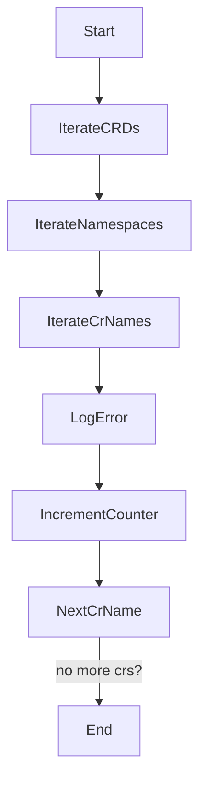
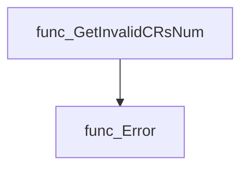
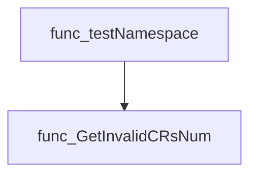
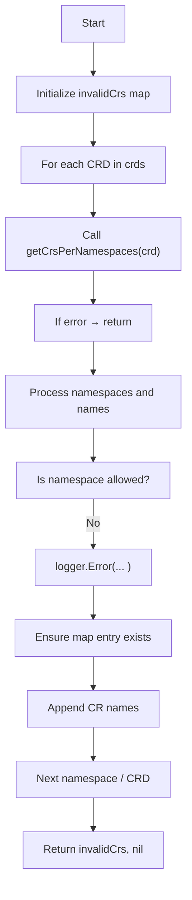
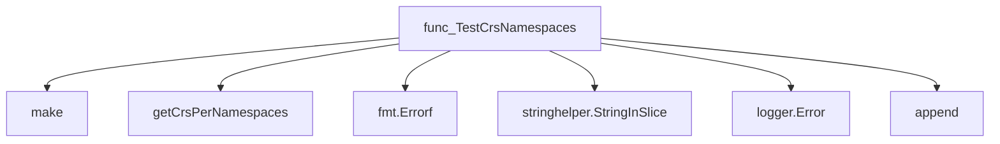
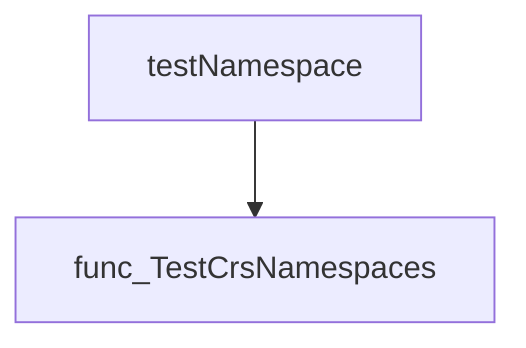
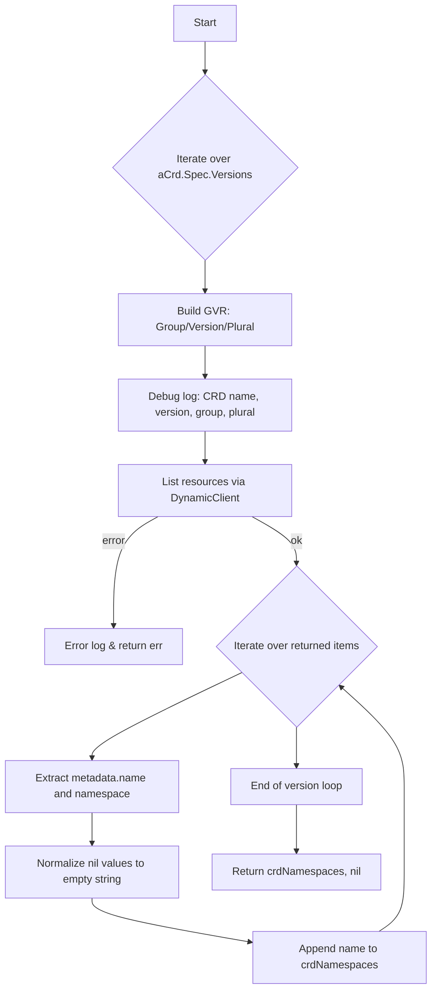
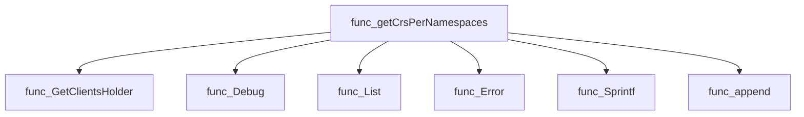
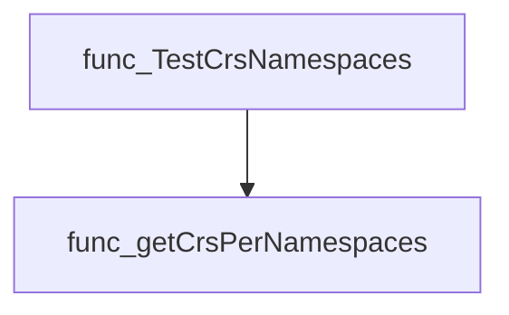

# Package namespace

**Path**: `tests/accesscontrol/namespace`

## Table of Contents

- [Overview](#overview)
- [Exported Functions](#exported-functions)
  - [GetInvalidCRsNum](#getinvalidcrsnum)
  - [TestCrsNamespaces](#testcrsnamespaces)
- [Local Functions](#local-functions)
  - [getCrsPerNamespaces](#getcrspernamespaces)

## Overview

The namespace package provides utilities for validating that Custom Resources (CRs) are deployed only in allowed namespaces during access‑control testing.

### Key Features

- TestCrsNamespaces verifies each CRD’s instances against a list of permitted namespaces and returns a map of offending CRs
- GetInvalidCRsNum counts how many CRs violate the namespace rule
- getCrsPerNamespaces enumerates all CR objects for a given CRD, grouping them by namespace

### Design Notes

- Functions operate on apiextensions v1 CRDs and rely on an internal client holder for API access
- Error handling is performed via log.Logger to capture diagnostic information
- The package assumes tests run in a cluster context where the client set is available; otherwise operations will fail

### Exported Functions Summary

| Name | Purpose |
|------|----------|
| [func GetInvalidCRsNum(invalidCrs map[string]map[string][]string, logger *log.Logger) int](#getinvalidcrsnum) | Determines how many custom resources (CRs) are not located in their expected namespaces. |
| [func TestCrsNamespaces(crds []*apiextv1.CustomResourceDefinition, configNamespaces []string, logger *log.Logger) (invalidCrs map[string]map[string][]string, err error)](#testcrsnamespaces) | Checks each CRD’s instances to ensure they are only deployed in namespaces supplied by `configNamespaces`. Returns a nested map of offending CRs. |

### Local Functions Summary

| Name | Purpose |
|------|----------|
| [func (*apiextv1.CustomResourceDefinition)(map[string][]string, error)](#getcrspernamespaces) | Enumerates all Custom Resource (CR) objects created from the supplied `CustomResourceDefinition` (CRD), grouping them by namespace. |

## Exported Functions

### GetInvalidCRsNum

**GetInvalidCRsNum** - Determines how many custom resources (CRs) are not located in their expected namespaces.


#### Signature (Go)

```go
func GetInvalidCRsNum(invalidCrs map[string]map[string][]string, logger *log.Logger) int
```

#### Summary Table

| Aspect | Details |
|--------|---------|
| **Purpose** | Determines how many custom resources (CRs) are not located in their expected namespaces. |
| **Parameters** | `invalidCrs` – a nested map where the first key is the CRD name, the second key is a namespace, and the value is a slice of CR names that were found outside the configured namespaces.<br>`logger` – a logger used to record each invalid CR encountered. |
| **Return value** | `int` – total count of all invalid CRs across all CRDs and namespaces. |
| **Key dependencies** | Calls `logger.Error` for every invalid CR. |
| **Side effects** | Emits an error log entry per invalid CR; does not modify any external state or the input map. |
| **How it fits the package** | Used by namespace tests to report violations where CRs exist in disallowed namespaces, feeding into compliance metrics. |

#### Internal workflow (Mermaid)



#### Function dependencies (Mermaid)



#### Functions calling `GetInvalidCRsNum` (Mermaid)



#### Usage example (Go)

```go
// Minimal example invoking GetInvalidCRsNum
package main

import (
	"log"

	"github.com/redhat-best-practices-for-k8s/certsuite/tests/accesscontrol/namespace"
)

func main() {
	invalidCrs := map[string]map[string][]string{
		"example.crd": {
			"default": {"bad-cr-1", "bad-cr-2"},
			"prod":    {"another-bad-cr"},
		},
	}

	logger := log.New(os.Stdout, "", log.LstdFlags)
	count := namespace.GetInvalidCRsNum(invalidCrs, logger)

	fmt.Printf("Found %d invalid CR(s)\n", count)
}
```

---

---

### TestCrsNamespaces

**TestCrsNamespaces** - Checks each CRD’s instances to ensure they are only deployed in namespaces supplied by `configNamespaces`. Returns a nested map of offending CRs.


#### Signature (Go)
```go
func TestCrsNamespaces(crds []*apiextv1.CustomResourceDefinition, configNamespaces []string, logger *log.Logger) (invalidCrs map[string]map[string][]string, err error)
```

#### Summary Table
| Aspect | Details |
|--------|---------|
| **Purpose** | Checks each CRD’s instances to ensure they are only deployed in namespaces supplied by `configNamespaces`. Returns a nested map of offending CRs. |
| **Parameters** | `crds []*apiextv1.CustomResourceDefinition` – list of CRDs to inspect.<br>`configNamespaces []string` – allowed namespace names.<br>`logger *log.Logger` – logger for reporting errors. |
| **Return value** | `invalidCrs map[string]map[string][]string` – mapping from CRD name → offending namespace → slice of CR names.<br>`err error` – failure during data retrieval or processing. |
| **Key dependencies** | • `make` (built‑in)<br>• `getCrsPerNamespaces`<br>• `fmt.Errorf`<br>• `stringhelper.StringInSlice`<br>• `logger.Error`<br>• `append` (built‑in) |
| **Side effects** | Logs errors for each CR found in a non‑configured namespace. No external I/O beyond logging; operates only on provided data structures. |
| **How it fits the package** | Part of the *namespace* test suite, enabling checks that all custom resources reside within permitted namespaces before other access control validations. |

#### Internal workflow (Mermaid)


#### Function dependencies (Mermaid)


#### Functions calling `TestCrsNamespaces` (Mermaid)


#### Usage example (Go)
```go
// Minimal example invoking TestCrsNamespaces
import (
    "log"

    apiextv1 "k8s.io/apiextensions-apiserver/pkg/apis/apiextensions/v1"
)

func main() {
    // Assume crds and allowed namespaces are already populated.
    var crds []*apiextv1.CustomResourceDefinition
    allowed := []string{"default", "prod"}

    logger := log.Default()
    invalid, err := TestCrsNamespaces(crds, allowed, logger)
    if err != nil {
        logger.Fatalf("test failed: %v", err)
    }
    // Process `invalid` as needed.
}
```

---

## Local Functions

### getCrsPerNamespaces

**getCrsPerNamespaces** - Enumerates all Custom Resource (CR) objects created from the supplied `CustomResourceDefinition` (CRD), grouping them by namespace.


#### Signature (Go)
```go
func (*apiextv1.CustomResourceDefinition)(map[string][]string, error)
```

#### Summary Table
| Aspect | Details |
|--------|---------|
| **Purpose** | Enumerates all Custom Resource (CR) objects created from the supplied `CustomResourceDefinition` (CRD), grouping them by namespace. |
| **Parameters** | `aCrd *apiextv1.CustomResourceDefinition` – The CRD to inspect. |
| **Return value** | `crdNamespaces map[string][]string` – A map where keys are namespace names and values are slices of CR names.<br>`err error` – Error encountered while listing resources, if any. |
| **Key dependencies** | • `clientsholder.GetClientsHolder()` – retrieves a shared Kubernetes client set.<br>• `oc.DynamicClient.Resource(gvr).List(...)` – dynamic list call per API version.<br>• Logging via `log.Debug` and `log.Error`. |
| **Side effects** | No state mutation; only reads from the cluster. No I/O beyond API calls. |
| **How it fits the package** | Used by test helpers to verify that CRs are deployed in permitted namespaces. It provides the raw data for validation logic elsewhere. |

#### Internal workflow (Mermaid)


#### Function dependencies (Mermaid)


#### Functions calling `getCrsPerNamespaces` (Mermaid)


#### Usage example (Go)
```go
// Minimal example invoking getCrsPerNamespaces
import (
    "k8s.io/apiextensions-apiserver/pkg/apis/apiextensions/v1"
)

func demo(crd *v1.CustomResourceDefinition) {
    namespaces, err := getCrsPerNamespaces(crd)
    if err != nil {
        // handle error
    }
    for ns, names := range namespaces {
        fmt.Printf("Namespace %q has CRs: %v\n", ns, names)
    }
}
```

---

