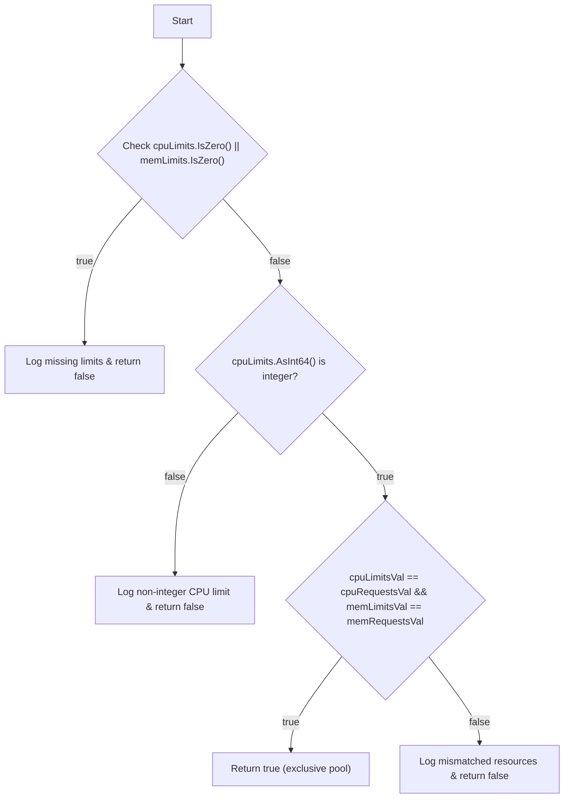
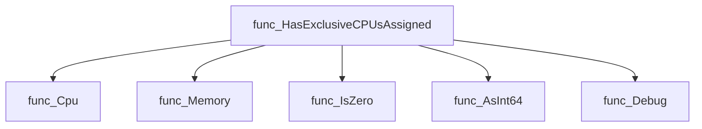
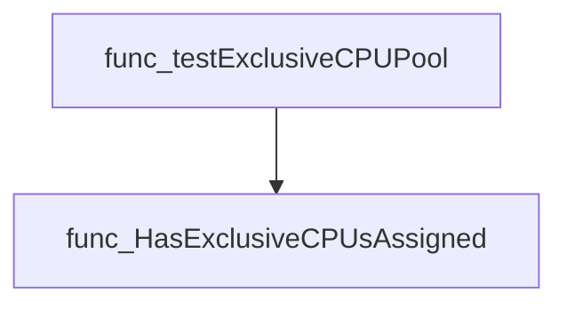
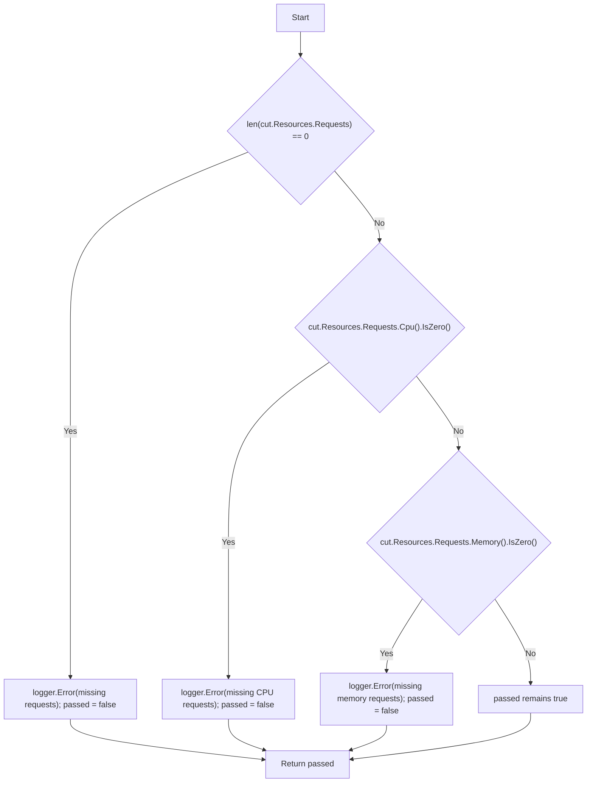
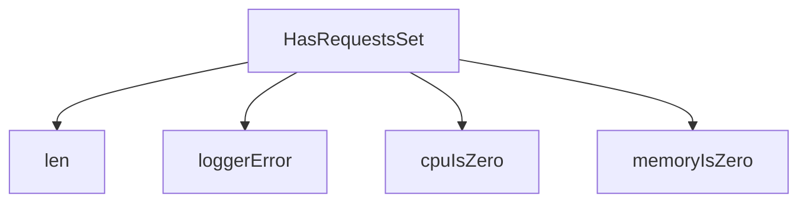
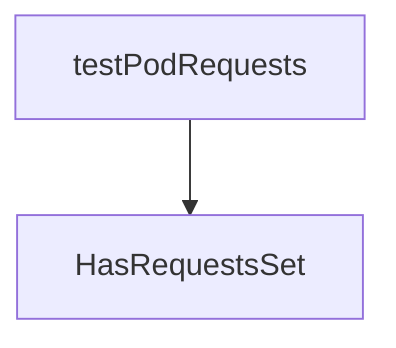

# Package resources

**Path**: `tests/accesscontrol/resources`

## Table of Contents

- [Overview](#overview)
- [Exported Functions](#exported-functions)
  - [HasExclusiveCPUsAssigned](#hasexclusivecpusassigned)
  - [HasRequestsSet](#hasrequestsset)

## Overview

Utility helpers for verifying Kubernetes container resource specifications in tests.

### Key Features

- Checks if a container has both CPU and memory requests set
- Determines whether a container’s limits enable exclusive CPU pool usage
- Logs detailed errors when required fields are missing

### Design Notes

- Assumes integer‑valued CPU/memory limits to qualify for exclusive pools
- Only returns true when all relevant fields are present and non‑zero
- Best used in unit tests that validate resource configuration correctness

### Exported Functions Summary

| Name | Purpose |
|------|----------|
| [func HasExclusiveCPUsAssigned(cut *provider.Container, logger *log.Logger) bool](#hasexclusivecpusassigned) | Checks whether a container’s CPU and memory limits are set in such a way that it will run on an exclusive CPU pool. It returns `true` only when both CPU and memory limits are present, integer‑valued, and match the corresponding requests. |
| [func (*provider.Container, *log.Logger) bool](#hasrequestsset) | Determines if a Kubernetes container has CPU and memory requests defined. It logs any missing fields. |

## Exported Functions

### HasExclusiveCPUsAssigned

**HasExclusiveCPUsAssigned** - Checks whether a container’s CPU and memory limits are set in such a way that it will run on an exclusive CPU pool. It returns `true` only when both CPU and memory limits are present, integer‑valued, and match the corresponding requests.


#### 1️⃣ Signature (Go)

```go
func HasExclusiveCPUsAssigned(cut *provider.Container, logger *log.Logger) bool
```

---

#### 2️⃣ Summary Table

| Aspect | Details |
|--------|---------|
| **Purpose** | Checks whether a container’s CPU and memory limits are set in such a way that it will run on an exclusive CPU pool. It returns `true` only when both CPU and memory limits are present, integer‑valued, and match the corresponding requests. |
| **Parameters** | `cut *provider.Container` – Kubernetes container definition.<br>`logger *log.Logger` – Logger for debugging messages. |
| **Return value** | `bool` – `true` if the container qualifies for an exclusive CPU pool; otherwise `false`. |
| **Key dependencies** | Calls resource quantity helpers (`Cpu`, `Memory`, `IsZero`, `AsInt64`) and uses `logger.Debug`. |
| **Side effects** | Emits debug logs when limits are missing, non‑integer, or mismatched. No state mutation outside the logger. |
| **How it fits the package** | Part of the *resources* subpackage that validates CPU‑pool assignment logic used by performance tests and policy checks. |

---

#### 3️⃣ Internal workflow (Mermaid)



---

#### 4️⃣ Function dependencies (Mermaid)



---

#### 5️⃣ Functions calling `HasExclusiveCPUsAssigned` (Mermaid)



---

#### 6️⃣ Usage example (Go)

```go
// Minimal example invoking HasExclusiveCPUsAssigned
package main

import (
    "log"

    "github.com/redhat-best-practices-for-k8s/certsuite/tests/accesscontrol/resources"
    "github.com/redhat-best-practices-for-k8s/certsuite/tests/performance/provider"
)

func main() {
    // Assume `c` is a *provider.Container obtained from a Pod spec
    var c *provider.Container

    logger := log.Default()
    if resources.HasExclusiveCPUsAssigned(c, logger) {
        logger.Println("Container uses an exclusive CPU pool")
    } else {
        logger.Println("Container does not use an exclusive CPU pool")
    }
}
```

---

---

### HasRequestsSet

**HasRequestsSet** - Determines if a Kubernetes container has CPU and memory requests defined. It logs any missing fields.


#### Signature (Go)

```go
func (*provider.Container, *log.Logger) bool
```

#### Summary Table

| Aspect | Details |
|--------|---------|
| **Purpose** | Determines if a Kubernetes container has CPU and memory requests defined. It logs any missing fields. |
| **Parameters** | `cut *provider.Container` – the container to inspect; <br>`logger *log.Logger` – logger used for error reporting |
| **Return value** | `bool` – `true` when both CPU and memory requests are set, otherwise `false` |
| **Key dependencies** | `len`, `logger.Error`, `cut.Resources.Requests.Cpu().IsZero()`, `cut.Resources.Requests.Memory().IsZero()` |
| **Side effects** | Emits log entries via the provided logger; no mutation of inputs. |
| **How it fits the package** | Utility for access‑control tests to validate pod resource request compliance. |

#### Internal workflow (Mermaid)



#### Function dependencies (Mermaid)



#### Functions calling `HasRequestsSet` (Mermaid)



#### Usage example (Go)

```go
// Minimal example invoking HasRequestsSet
package main

import (
	"log"

	"github.com/redhat-best-practices-for-k8s/certsuite/tests/accesscontrol/resources"
	"github.com/redhat-best-practices-for-k8s/certsuite/tests/accesscontrol/provider"
)

func main() {
	logger := log.New(os.Stdout, "", 0)
	container := &provider.Container{
		// populate Resources.Requests with CPU and Memory as needed
	}
	if resources.HasRequestsSet(container, logger) {
		fmt.Println("Container has resource requests")
	} else {
		fmt.Println("Container is missing resource requests")
	}
}
```

---

