# Package securitycontextcontainer

**Path**: `tests/accesscontrol/securitycontextcontainer`

## Table of Contents

- [Overview](#overview)
- [Structs](#structs)
  - [ContainerSCC](#containerscc)
  - [PodListCategory](#podlistcategory)
- [Exported Functions](#exported-functions)
  - [AllVolumeAllowed](#allvolumeallowed)
  - [CategoryID.String](#categoryid.string)
  - [CheckPod](#checkpod)
  - [GetContainerSCC](#getcontainerscc)
  - [OkNok.String](#oknok.string)
  - [PodListCategory.String](#podlistcategory.string)
- [Local Functions](#local-functions)
  - [checkContainCategory](#checkcontaincategory)
  - [checkContainerCategory](#checkcontainercategory)
  - [compareCategory](#comparecategory)
  - [updateCapabilitiesFromContainer](#updatecapabilitiesfromcontainer)

## Overview

The securitycontextcontainer package evaluates Kubernetes pod and container specifications against predefined security‑context categories, producing a compliance report for each container.

### Key Features

- Categorises containers by comparing their ContainerSCC profile to four predefined SCC categories
- Provides utilities to check volume type constraints and capability sets
- Exposes human‑readable string representations for status enums and category results

### Design Notes

- ContainerSCC captures only the security context fields relevant to policy checks; missing fields default to OK or Undefined
- Comparison logic relies on strict equality of capability lists, which may miss equivalent but reordered entries
- Best practice: use CheckPod on a provider.Pod to obtain per‑container categories before applying higher‑level rules

### Structs Summary

| Name | Purpose |
|------|----------|
| [**ContainerSCC**](#containerscc) | Represents the security context compliance state of a container |
| [**PodListCategory**](#podlistcategory) | Struct definition |

### Exported Functions Summary

| Name | Purpose |
|------|----------|
| [func AllVolumeAllowed(volumes []corev1.Volume) (r1, r2 OkNok)](#allvolumeallowed) | Determines whether every volume in a slice satisfies allowed‑type constraints and reports if any host‑path volumes are present. |
| [func (category CategoryID) String() string](#categoryid.string) | Returns the textual form of a `CategoryID`. |
| [func CheckPod(pod *provider.Pod) []PodListCategory](#checkpod) | Builds a `ContainerSCC` reflecting pod‑level security settings, then categorizes each container in the pod by invoking `checkContainerCategory`. |
| [func GetContainerSCC(cut *provider.Container, containerSCC ContainerSCC) ContainerSCC](#getcontainerscc) | Builds and returns a `ContainerSCC` that reflects the security capabilities of the supplied container (`cut`). It flags host port usage, capability categories, privilege escalation, privileged mode, run‑as‑user, read‑only root filesystem, non‑root execution, and SELinux context presence. |
| [func (okNok OkNok) String() string](#oknok.string) | Provides a human‑readable string for an `OkNok` status (`OK`, `NOK`, or unknown). |
| [func (category PodListCategory) String() string](#podlistcategory.string) | Returns a human‑readable description containing the container name, pod name, namespace, and category of a `PodListCategory`. |

### Local Functions Summary

| Name | Purpose |
|------|----------|
| [func checkContainCategory(addCapability []corev1.Capability, referenceCategoryAddCapabilities []string) bool](#checkcontaincategory) | Determines whether every element in `addCapability` exists within the slice `referenceCategoryAddCapabilities`. Returns `true` only if all elements match; otherwise returns `false`. |
| [func checkContainerCategory(containers []corev1.Container, containerSCC ContainerSCC, podName, nameSpace string) []PodListCategory](#checkcontainercategory) | For each container in a pod it builds a security‑context profile (`percontainerSCC`), compares that profile against predefined SCC categories, and returns a slice of `PodListCategory` structs indicating the assigned category. |
| [func compareCategory(refCategory, containerSCC *ContainerSCC, id CategoryID) bool](#comparecategory) | Determines whether `containerSCC` satisfies all constraints defined in `refCategory`. Returns `true` if the container matches the reference category; otherwise `false`. |
| [func updateCapabilitiesFromContainer(cut *provider.Container, containerSCC *ContainerSCC)](#updatecapabilitiesfromcontainer) | Populates `containerSCC` with capability‑related data derived from a Kubernetes container’s security context. |

## Structs

### ContainerSCC

#### Fields

| Field | Type | Description |
|-------|------|-------------|
| `HostDirVolumePluginPresent` | `OkNok` | Indicates if a host‑path volume is used (true/false). |
| `HostIPC` | `OkNok` | Whether the container shares the IPC namespace with the host. |
| `HostNetwork` | `OkNok` | Whether the container uses the host’s network stack. |
| `HostPID` | `OkNok` | Whether the container shares the PID namespace with the host. |
| `HostPorts` | `OkNok` | Whether any host ports are exposed by the container. |
| `PrivilegeEscalation` | `OkNok` | Whether privilege escalation is permitted. |
| `PrivilegedContainer` | `OkNok` | Whether the container runs in privileged mode. |
| `RunAsUserPresent` | `OkNok` | Whether a non‑nil `runAsUser` value is set. |
| `ReadOnlyRootFilesystem` | `OkNok` | Whether the root filesystem is mounted read‑only. |
| `RunAsNonRoot` | `OkNok` | Whether the container must run as a non‑root user. |
| `FsGroupPresent` | `OkNok` | Whether an FS group value is specified. |
| `SeLinuxContextPresent` | `OkNok` | Whether an SELinux context annotation or field is present. |
| `CapabilitiesCategory` | `CategoryID` | The lowest SCC category that matches the container’s added capabilities list. |
| `RequiredDropCapabilitiesPresent` | `OkNok` | Whether required drop capabilities (e.g., MKNOD, SETUID) are satisfied. |
| `AllVolumeAllowed` | `OkNok` | Whether all volumes referenced by the pod are allowed by the SCC. |

#### Purpose

`ContainerSCC` aggregates boolean flags (`OkNok`) and a capability category to describe how closely a container’s security context matches the requirements of a given Security Context Constraint (SCC). It is populated during validation, used for comparison against reference categories, and ultimately determines whether a pod can be admitted.

#### Related functions

| Function | Purpose |
|----------|---------|
| `GetContainerSCC` | Builds a `ContainerSCC` instance from a container’s spec by inspecting ports, security context fields, capabilities, and volume usage. |
| `compareCategory` | Compares the populated `ContainerSCC` against a reference category to determine if the container satisfies that SCC level. |
| `updateCapabilitiesFromContainer` | Updates capability‑related fields (`RequiredDropCapabilitiesPresent`, `CapabilitiesCategory`) based on the container’s security context capabilities list. |

---

---

### PodListCategory

<!-- DEBUG: Struct PodListCategory exists in bundle but ParsedOK=false, Fields=0 -->
**Purpose**:

**Fields**:

| Field | Type | Description |
|-------|------|--------------|
| `Containername` | `string` | Field documentation |
| `Podname` | `string` | Field documentation |
| `NameSpace` | `string` | Field documentation |
| `Category` | `CategoryID` | Field documentation |

---

## Exported Functions

### AllVolumeAllowed

**AllVolumeAllowed** - Determines whether every volume in a slice satisfies allowed‑type constraints and reports if any host‑path volumes are present.

#### 1. Signature (Go)

```go
func AllVolumeAllowed(volumes []corev1.Volume) (r1, r2 OkNok)
```

#### 2. Summary Table

| Aspect | Details |
|--------|---------|
| **Purpose** | Determines whether every volume in a slice satisfies allowed‑type constraints and reports if any host‑path volumes are present. |
| **Parameters** | `volumes []corev1.Volume` – list of pod volumes to evaluate. |
| **Return value** | *r1* (`OkNok`) – OK if all volumes are of permitted types, otherwise NOK.<br>*r2* (`OkNok`) – OK if at least one host‑path volume exists, otherwise NOK. |
| **Key dependencies** | • `len` (built‑in) to obtain slice length.<br>• Core Kubernetes API type `corev1.Volume`. |
| **Side effects** | None; purely functional. |
| **How it fits the package** | Used by `CheckPod` in the security‑context container tests to validate pod volume configuration before further checks. |

#### 3. Internal workflow (Mermaid)

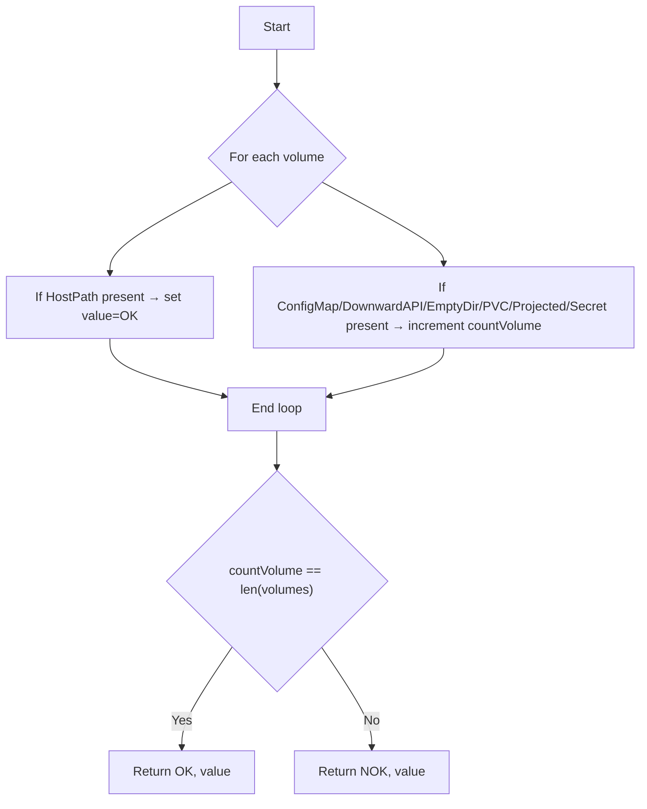

#### 4. Function dependencies (Mermaid)

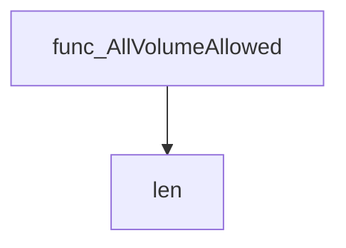

#### 5. Functions calling `AllVolumeAllowed` (Mermaid)

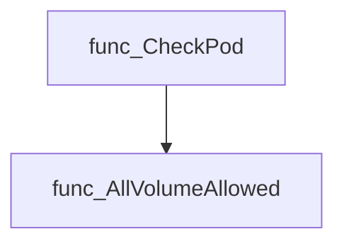

#### 6. Usage example (Go)

```go
// Minimal example invoking AllVolumeAllowed
package main

import (
 "fmt"
 corev1 "k8s.io/api/core/v1"
)

func main() {
 volumes := []corev1.Volume{
  {Name: "cfg", ConfigMap: &corev1.ConfigMapVolumeSource{}},
  {Name: "data", EmptyDir: &corev1.EmptyDirVolumeSource{}},
 }
 r1, r2 := AllVolumeAllowed(volumes)
 fmt.Printf("All allowed? %s, HostPath present? %s\n", r1, r2)
}
```

---

---

### CategoryID.String

**String** - Returns the textual form of a `CategoryID`.

#### Signature

```go
func (category CategoryID) String() string
```

#### Summary Table

| Aspect | Details |
|--------|---------|
| **Purpose** | Returns the textual form of a `CategoryID`. |
| **Parameters** | *receiver* `category` – the `CategoryID` value to convert. |
| **Return value** | `string` – the human‑readable name corresponding to the category. |
| **Key dependencies** | None (uses only package constants). |
| **Side effects** | None. Pure function. |
| **How it fits the package** | Provides a convenient way for callers to display or log a category identifier. |

#### Internal workflow

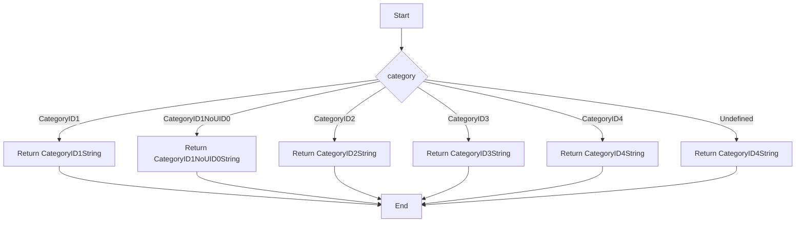

#### Function dependencies

None – this function is currently not referenced elsewhere in the package.

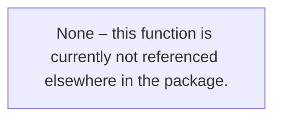

#### Functions calling `CategoryID.String`

None – this function is currently not referenced elsewhere in the package.


#### Usage example (Go)

```go
// Minimal example invoking CategoryID.String
package main

import (
 "fmt"

 "github.com/redhat-best-practices-for-k8s/certsuite/tests/accesscontrol/securitycontextcontainer"
)

func main() {
 var cat securitycontextcontainer.CategoryID = securitycontextcontainer.CategoryID1
 fmt.Println(cat.String()) // prints the string representation of CategoryID1
}
```

---

### CheckPod

**CheckPod** - Builds a `ContainerSCC` reflecting pod‑level security settings, then categorizes each container in the pod by invoking `checkContainerCategory`.

#### Signature

```go
func CheckPod(pod *provider.Pod) []PodListCategory
```

#### Summary Table

| Aspect | Details |
|--------|---------|
| **Purpose** | Builds a `ContainerSCC` reflecting pod‑level security settings, then categorizes each container in the pod by invoking `checkContainerCategory`. |
| **Parameters** | `pod *provider.Pod – the Pod to analyze` |
| **Return value** | `[]PodListCategory – slice containing one entry per container with its category information` |
| **Key dependencies** | • `AllVolumeAllowed(pod.Spec.Volumes)` <br>• `checkContainerCategory(pod.Spec.Containers, containerSCC, pod.Name, pod.Namespace)` |
| **Side effects** | No external I/O; only local state mutation within the function’s scope. |
| **How it fits the package** | Core helper used by tests to determine compliance of Pods against security‑context rules. |

#### Internal workflow

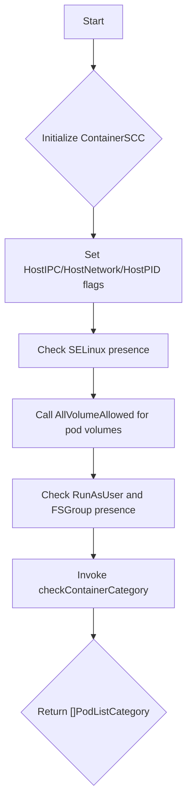

#### Function dependencies

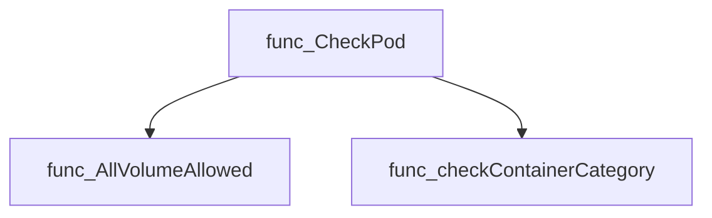

#### Functions calling `CheckPod`

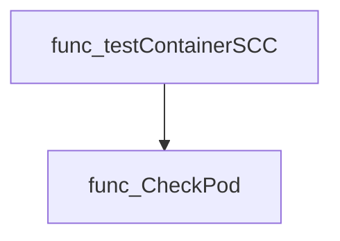

#### Usage example (Go)

```go
// Minimal example invoking CheckPod
import (
    "github.com/redhat-best-practices-for-k8s/certsuite/tests/accesscontrol/securitycontextcontainer"
    "github.com/redhat-best-practices-for-k8s/certsuite/tests/provider"
)

func main() {
    pod := &provider.Pod{
        Name:      "example-pod",
        Namespace: "default",
        Spec: provider.PodSpec{
            HostIPC:     true,
            HostNetwork: false,
            HostPID:     true,
            SecurityContext: &provider.SecurityContext{
                SELinuxOptions: &provider.SELinuxOptions{},
                RunAsUser:      int64Ptr(1000),
                FSGroup:        int64Ptr(2000),
            },
            Volumes: []corev1.Volume{ /* ... */ },
            Containers: []corev1.Container{
                {Name: "app"},
            },
        },
    }

    categories := securitycontextcontainer.CheckPod(pod)
    for _, cat := range categories {
        fmt.Printf("Container %s in pod %s is category %s\n",
            cat.Containername, cat.Podname, cat.Category.String())
    }
}

func int64Ptr(v int64) *int64 { return &v }
```

---

### GetContainerSCC

**GetContainerSCC** - Builds and returns a `ContainerSCC` that reflects the security capabilities of the supplied container (`cut`). It flags host port usage, capability categories, privilege escalation, privileged mode, run‑as‑user, read‑only root filesystem, non‑root execution, and SELinux context presence.

#### Signature (Go)

```go
func GetContainerSCC(cut *provider.Container, containerSCC ContainerSCC) ContainerSCC
```

#### Summary Table

| Aspect | Details |
|--------|---------|
| **Purpose** | Builds and returns a `ContainerSCC` that reflects the security capabilities of the supplied container (`cut`). It flags host port usage, capability categories, privilege escalation, privileged mode, run‑as‑user, read‑only root filesystem, non‑root execution, and SELinux context presence. |
| **Parameters** | `cut *provider.Container` – the container to analyze.<br>`containerSCC ContainerSCC` – an initial SCC struct that will be mutated and returned. |
| **Return value** | Updated `ContainerSCC` reflecting the container’s security posture. |
| **Key dependencies** | Calls helper `updateCapabilitiesFromContainer`; accesses fields of `provider.Container`, its `Ports` slice, and nested `SecurityContext`. Uses constants `OK` / `NOK` to indicate status. |
| **Side effects** | Pure function: no external I/O or global state changes; only mutates the passed `containerSCC` value locally before returning it. |
| **How it fits the package** | Core routine for determining a container’s compliance category in the security‑context‑container test suite. It is invoked by higher‑level functions that classify containers into policy categories. |

#### Internal workflow (Mermaid)

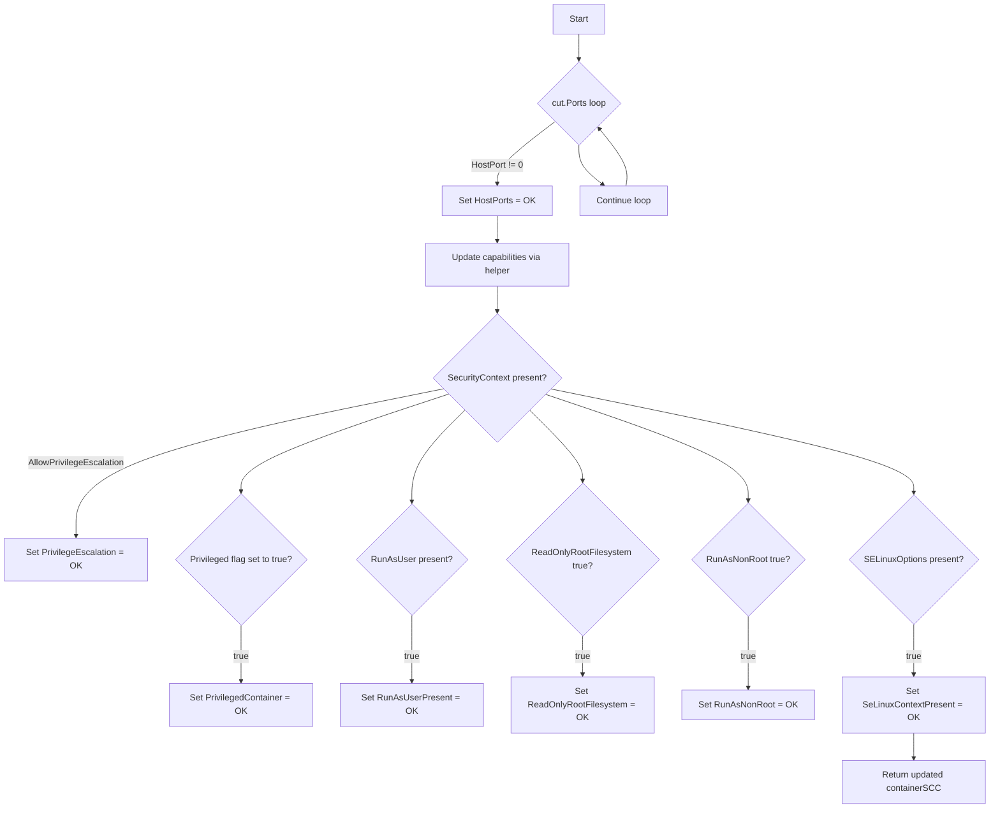

#### Function dependencies (Mermaid)

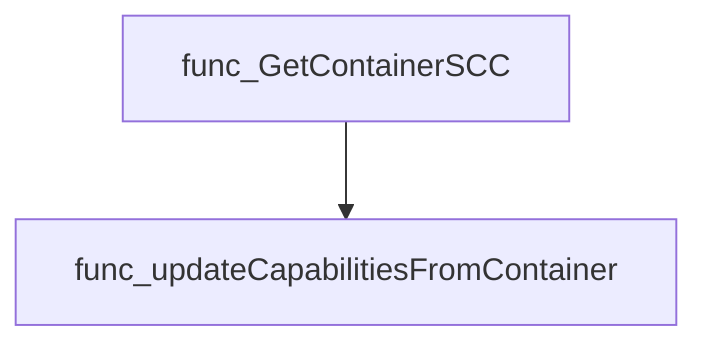

#### Functions calling `GetContainerSCC` (Mermaid)

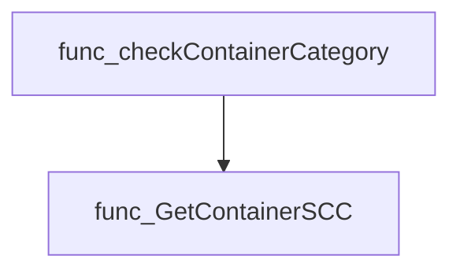

#### Usage example (Go)

```go
// Minimal example invoking GetContainerSCC
package main

import (
 "fmt"

 "github.com/redhat-best-practices-for-k8s/certsuite/tests/accesscontrol/securitycontextcontainer"
 "github.com/redhat-best-practices-for-k8s/certsuite/tests/accesscontrol/securitycontextcontainer/provider"
)

func main() {
 // Example container (fields omitted for brevity)
 cut := &provider.Container{
  Ports: []provider.Port{{HostPort: 0}}, // no host port
  SecurityContext: &provider.SecurityContext{
   RunAsUser:               nil,
   ReadOnlyRootFilesystem: nil,
   AllowPrivilegeEscalation: nil,
  },
 }

 // Initial SCC with all flags set to NOK
 initSCC := securitycontextcontainer.ContainerSCC{
  HostPorts:                "NOK",
  RequiredDropCapabilitiesPresent: "NOK",
  CapabilitiesCategory:     "unknown",
  PrivilegeEscalation:      "NOK",
  PrivilegedContainer:       "NOK",
  RunAsUserPresent:          "NOK",
  ReadOnlyRootFilesystem:   "NOK",
  RunAsNonRoot:              "NOK",
  SeLinuxContextPresent:    "NOK",
 }

 finalSCC := securitycontextcontainer.GetContainerSCC(cut, initSCC)
 fmt.Printf("Updated SCC: %+v\n", finalSCC)
}
```

*The example demonstrates how to call `GetContainerSCC` with a container and an initial SCC; the function returns an updated SCC reflecting the container’s security attributes.*

---

### OkNok.String

**String** - Provides a human‑readable string for an `OkNok` status (`OK`, `NOK`, or unknown).

The method returns a string representation of the `OkNok` value.

```go
func (okNok OkNok) String() string
```

| Aspect | Details |
|--------|---------|
| **Purpose** | Provides a human‑readable string for an `OkNok` status (`OK`, `NOK`, or unknown). |
| **Parameters** | *receiver* `okNok` – the `OkNok` value to convert. |
| **Return value** | A `string`: either `OKString`, `NOKString`, or `"false"` if no match. |
| **Key dependencies** | • Constants `OK`, `NOK`, `OKString`, `NOKString`. |
| **Side effects** | None – purely functional; no state changes or I/O. |
| **How it fits the package** | Implements the `fmt.Stringer` interface for `OkNok`, enabling string formatting in logs and tests within the `securitycontextcontainer` package. |

#### Internal workflow

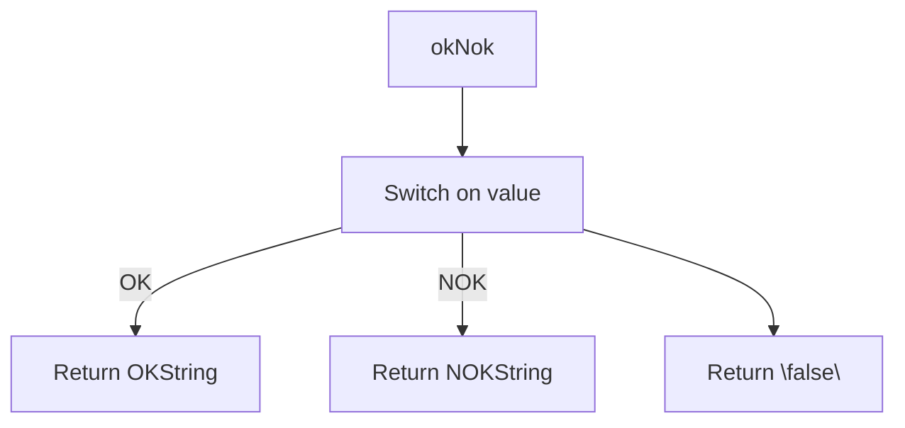

#### Function dependencies

None – this function is currently not referenced elsewhere in the package.

#### Functions calling `OkNok.String`

None – this function is currently not referenced elsewhere in the package.

#### Usage example (Go)

```go
// Minimal example invoking OkNok.String
package main

import (
    "fmt"
    "github.com/redhat-best-practices-for-k8s/certsuite/tests/accesscontrol/securitycontextcontainer"
)

func main() {
    var status securitycontextcontainer.OkNok = securitycontextcontainer.OK
    fmt.Println(status.String()) // prints OKString
}
```

---

### PodListCategory.String

**String** - Returns a human‑readable description containing the container name, pod name, namespace, and category of a `PodListCategory`.

Prints the struct fields as a formatted string representation of a pod list category.

---

#### Signature (Go)

```go
func (category PodListCategory) String() string
```

---

#### Summary Table

| Aspect | Details |
|--------|---------|
| **Purpose** | Returns a human‑readable description containing the container name, pod name, namespace, and category of a `PodListCategory`. |
| **Parameters** | `category` – the receiver value holding the data to format. |
| **Return value** | A string formatted with `fmt.Sprintf`. |
| **Key dependencies** | • `fmt.Sprintf` from package `fmt` |
| **Side effects** | None (pure function). |
| **How it fits the package** | Implements the `Stringer` interface for `PodListCategory`, enabling convenient logging and debugging within the *securitycontextcontainer* test suite. |

---

#### Internal workflow

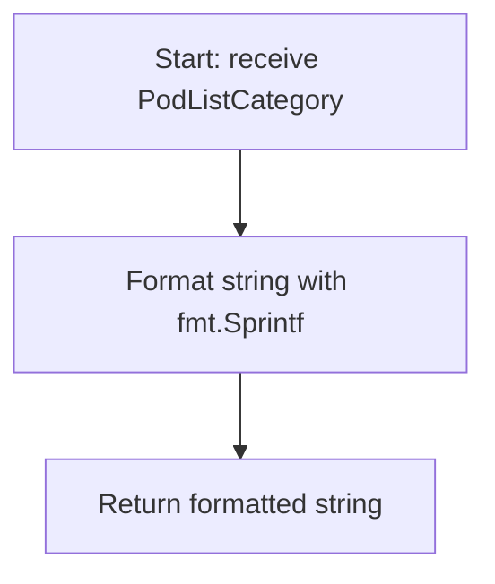

---

#### Function dependencies

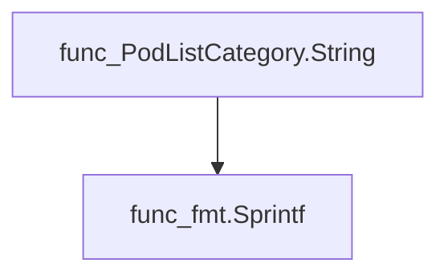

---

#### Functions calling `PodListCategory.String`

None – this function is currently not referenced elsewhere in the package.

---

#### Usage example (Go)

```go
// Minimal example invoking PodListCategory.String
package main

import (
 "fmt"
 "github.com/redhat-best-practices-for-k8s/certsuite/tests/accesscontrol/securitycontextcontainer"
)

func main() {
 category := securitycontextcontainer.PodListCategory{
  Containername: "nginx",
  Podname:       "web-pod",
  NameSpace:     "default",
  Category:      "frontend",
 }
 fmt.Println(category.String())
}
```

---

## Local Functions

### checkContainCategory

**checkContainCategory** - Determines whether every element in `addCapability` exists within the slice `referenceCategoryAddCapabilities`. Returns `true` only if all elements match; otherwise returns `false`.

#### Signature (Go)

```go
func checkContainCategory(addCapability []corev1.Capability, referenceCategoryAddCapabilities []string) bool
```

#### Summary Table

| Aspect | Details |
|--------|---------|
| **Purpose** | Determines whether every element in `addCapability` exists within the slice `referenceCategoryAddCapabilities`. Returns `true` only if all elements match; otherwise returns `false`. |
| **Parameters** | - `addCapability []corev1.Capability`: Capabilities to be checked.<br>- `referenceCategoryAddCapabilities []string`: Allowed capability strings for a specific category. |
| **Return value** | `bool`: `true` when all capabilities are present in the reference slice, `false` otherwise. |
| **Key dependencies** | • `github.com/redhat-best-practices-for-k8s/certsuite/pkg/stringhelper.StringInSlice`<br>• Standard string trimming and comparison logic |
| **Side effects** | None; purely functional with no state mutation or I/O. |
| **How it fits the package** | Used by higher‑level functions to classify container security contexts into capability categories (e.g., Category 2, 3, or 4). It acts as a helper for determining compliance against predefined capability sets. |

#### Internal workflow

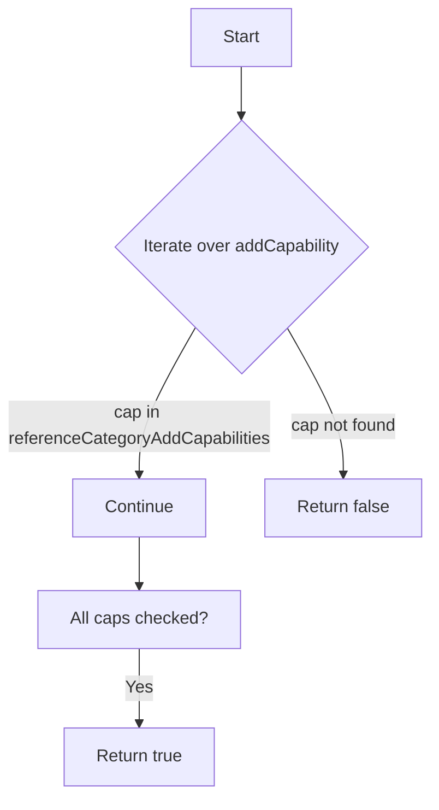

#### Function dependencies

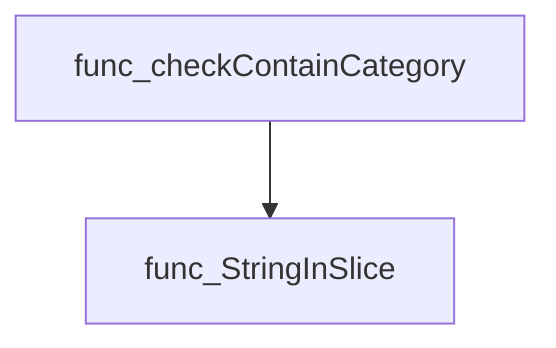

#### Functions calling `checkContainCategory`

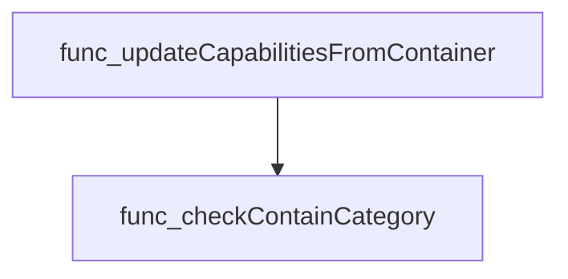

#### Usage example (Go)

```go
// Minimal example invoking checkContainCategory
package main

import (
    "fmt"
    corev1 "k8s.io/api/core/v1"

    // Assume the function is in package securitycontextcontainer
    scc "github.com/redhat-best-practices-for-k8s/certsuite/tests/accesscontrol/securitycontextcontainer"
)

func main() {
    addCaps := []corev1.Capability{"NET_ADMIN", "SYS_TIME"}
    reference := []string{"NET_ADMIN", "SYS_TIME", "CHOWN"}

    ok := scc.CheckContainCategory(addCaps, reference) // Note: function is unexported; this call assumes same package or test harness
    fmt.Println("All capabilities match:", ok)
}
```

> **Note:** `checkContainCategory` is an unexported helper; the example demonstrates usage within the same package context.

---

### checkContainerCategory

**checkContainerCategory** - For each container in a pod it builds a security‑context profile (`percontainerSCC`), compares that profile against predefined SCC categories, and returns a slice of `PodListCategory` structs indicating the assigned category.

#### Signature (Go)

```go
func checkContainerCategory(containers []corev1.Container, containerSCC ContainerSCC, podName, nameSpace string) []PodListCategory
```

#### Summary Table

| Aspect | Details |
|--------|---------|
| **Purpose** | For each container in a pod it builds a security‑context profile (`percontainerSCC`), compares that profile against predefined SCC categories, and returns a slice of `PodListCategory` structs indicating the assigned category. |
| **Parameters** | `containers []corev1.Container` – list of containers to analyse.<br>`containerSCC ContainerSCC` – base SCC information derived from the pod itself.<br>`podName string` – name of the pod.<br>`nameSpace string` – namespace of the pod. |
| **Return value** | `[]PodListCategory` – one entry per container, containing its name, pod name, namespace and the matched category ID (`CategoryID1`, `CategoryID1NoUID0`, `CategoryID2`, `CategoryID3`, or `CategoryID4`). |
| **Key dependencies** | *`GetContainerSCC(cut, containerSCC)` – enriches per‑container SCC.<br>* `compareCategory(ref, target, id)` – checks if a container matches a specific category. |
| **Side effects** | None; the function only reads input and constructs new values. |
| **How it fits the package** | Used by `CheckPod` to produce the final list of categorized containers for security‑context validation tests. |

#### Internal workflow (Mermaid)

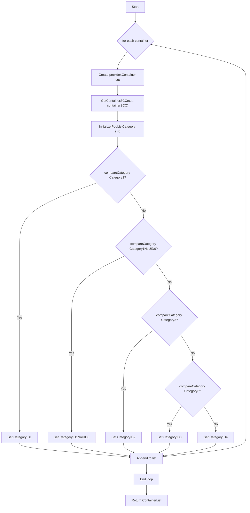

#### Function dependencies (Mermaid)

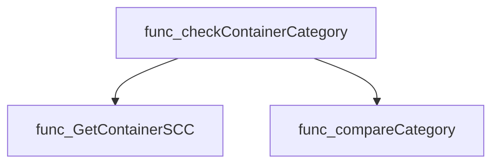

#### Functions calling `checkContainerCategory` (Mermaid)

```mermaid
graph TD
  func_CheckPod --> func_checkContainerCategory
```

#### Usage example (Go)

```go
// Minimal example invoking checkContainerCategory
import (
    corev1 "k8s.io/api/core/v1"
)

func example() {
    containers := []corev1.Container{
        {Name: "app"},
        {Name: "sidecar"},
    }
    baseSCC := ContainerSCC{ /* populate with pod‑level SCC */ }
    result := checkContainerCategory(containers, baseSCC, "mypod", "default")
    // result contains the category for each container
}
```

---

### compareCategory

**compareCategory** - Determines whether `containerSCC` satisfies all constraints defined in `refCategory`. Returns `true` if the container matches the reference category; otherwise `false`.

#### Signature (Go)

```go
func compareCategory(refCategory, containerSCC *ContainerSCC, id CategoryID) bool
```

#### Summary Table

| Aspect | Details |
|--------|---------|
| **Purpose** | Determines whether `containerSCC` satisfies all constraints defined in `refCategory`. Returns `true` if the container matches the reference category; otherwise `false`. |
| **Parameters** | `refCategory *ContainerSCC` – the expected SCC definition.<br>`containerSCC *ContainerSCC` – the actual SCC derived from a pod/container.<br>`id CategoryID` – identifier used only for logging. |
| **Return value** | `bool` – `true` when all checks pass, `false` otherwise. |
| **Key dependencies** | • Logging via `log.Debug`<br>• Fields of `ContainerSCC`: `AllVolumeAllowed`, `RunAsUserPresent`, `RunAsNonRoot`, `FsGroupPresent`, `RequiredDropCapabilitiesPresent`, `HostDirVolumePluginPresent`, `HostIPC`, `HostNetwork`, `HostPID`, `HostPorts`, `PrivilegeEscalation`, `PrivilegedContainer`, `ReadOnlyRootFilesystem`, `SeLinuxContextPresent`, `CapabilitiesCategory` |
| **Side effects** | None – the function only reads inputs and writes debug logs. |
| **How it fits the package** | Used by `checkContainerCategory` to classify each container into one of several predefined SCC categories, enabling policy validation tests. |

#### Internal workflow

```mermaid
flowchart TD
  A["Start"] --> B{"Compare fields"}
  B -->|"All match"| C["Return true"]
  B -->|"Any mismatch"| D["Set result=false & log details"]
  D --> C
```

#### Function dependencies

```mermaid
graph TD
  func_compareCategory --> func_log.Debug
```

#### Functions calling `compareCategory`

```mermaid
graph TD
  func_checkContainerCategory --> func_compareCategory
```

#### Usage example (Go)

```go
// Minimal example invoking compareCategory
ref := &ContainerSCC{AllVolumeAllowed: true, RunAsUserPresent: true}
actual := &ContainerSCC{AllVolumeAllowed: true, RunAsUserPresent: false}
id := CategoryID1

matches := compareCategory(ref, actual, id)
fmt.Println("Does the container match the category?", matches)
```

---

### updateCapabilitiesFromContainer

**updateCapabilitiesFromContainer** - Populates `containerSCC` with capability‑related data derived from a Kubernetes container’s security context.

#### Signature (Go)

```go
func updateCapabilitiesFromContainer(cut *provider.Container, containerSCC *ContainerSCC)
```

#### Summary Table

| Aspect | Details |
|--------|---------|
| **Purpose** | Populates `containerSCC` with capability‑related data derived from a Kubernetes container’s security context. |
| **Parameters** | `cut *provider.Container` – the container whose capabilities are examined.<br>`containerSCC *ContainerSCC` – mutable SCC structure to receive capability results. |
| **Return value** | None (updates `containerSCC` in‑place). |
| **Key dependencies** | - `sort.Strings` (from stdlib)<br>- `stringhelper.SubSlice` (internal helper)<br>- `slices.Equal` (golangx/slices)<br>- `checkContainCategory` (local helper) |
| **Side effects** | Mutates fields of the supplied `ContainerSCC`. No external I/O. |
| **How it fits the package** | Called by `GetContainerSCC` to enrich the SCC with capability checks before returning a full security‑context summary for a container. |

#### Internal workflow (Mermaid)

```mermaid
flowchart TD
  A["Start"] --> B{"SecurityContext present?"}
  B -- No --> C["Set CapabilitiesCategory = ID1"]
  B -- Yes --> D["Collect Drop capabilities into sliceDropCapabilities"]
  D --> E["Sort sliceDropCapabilities & requiredDropCapabilities"]
  E --> F{"Is drop subset or equal to dropAll?"}
  F -- Yes --> G["Set RequiredDropCapabilitiesPresent = OK"]
  F -- No --> H["Check Add capabilities category"]
  H --> I{"len(Add) == 0 ?"}
  I -- Yes --> J["Set CapabilitiesCategory = ID1"]
  I -- No --> K{"Add in Category2?"}
  K -- Yes --> L["Set CapabilitiesCategory = ID2"]
  K -- No --> M{"Add in Category3?"}
  M -- Yes --> N["Set CapabilitiesCategory = ID3"]
  M -- No --> O["Set CapabilitiesCategory = ID4"]
```

#### Function dependencies (Mermaid)

```mermaid
graph TD
  func_updateCapabilitiesFromContainer --> sort.Strings
  func_updateCapabilitiesFromContainer --> stringhelper.SubSlice
  func_updateCapabilitiesFromContainer --> slices.Equal
  func_updateCapabilitiesFromContainer --> checkContainCategory
```

#### Functions calling `updateCapabilitiesFromContainer` (Mermaid)

```mermaid
graph TD
  func_GetContainerSCC --> func_updateCapabilitiesFromContainer
```

#### Usage example (Go)

```go
// Minimal example invoking updateCapabilitiesFromContainer
package main

import (
    "github.com/redhat-best-practices-for-k8s/certsuite/tests/accesscontrol/securitycontextcontainer"
    "github.com/redhat-best-practices-for-k8s/certsuite/pkg/provider"
)

func main() {
    cut := &provider.Container{
        SecurityContext: &corev1.SecurityContext{
            Capabilities: &corev1.Capabilities{
                Drop: []corev1.Capability{"NET_RAW"},
                Add:  []corev1.Capability{},
            },
        },
    }
    containerSCC := &securitycontextcontainer.ContainerSCC{}
    securitycontextcontainer.UpdateCapabilitiesFromContainer(cut, containerSCC)
}
```

---
