# Package certification

**Path**: `tests/certification`

## Table of Contents

- [Overview](#overview)
- [Exported Functions](#exported-functions)
  - [LoadChecks](#loadchecks)
- [Local Functions](#local-functions)
  - [getContainersToQuery](#getcontainerstoquery)
  - [testAllOperatorCertified](#testalloperatorcertified)
  - [testContainerCertification](#testcontainercertification)
  - [testContainerCertificationStatusByDigest](#testcontainercertificationstatusbydigest)
  - [testHelmCertified](#testhelmcertified)
  - [testHelmVersion](#testhelmversion)

## Overview

The certification test package registers and executes checks that verify whether operators, containers, and Helm charts in a Kubernetes cluster are certified according to the Red Hat certification database. It populates an internal checks database with these checks and provides hooks for reporting compliance.

### Key Features

- Registers operator‑level, container‑digest, and Helm chart certification checks; integrates with a certification status validator.
- Provides pre‑execution hooks that gather runtime data such as operator lists, pod listings, and Helm releases before running checks.
- Automatically skips checks when relevant resources (e.g., operators or Helm releases) are absent, improving test efficiency.

### Design Notes

- Assumes the presence of a certdb.CertificationStatusValidator to query certification status; missing validator results in unknown compliance.
- Handles absence of Helm v3 by detecting Tiller pods and marking all charts as compliant if none found.
- Uses global test environment and logger for contextual reporting; callers must set these globals before invoking LoadChecks.

### Exported Functions Summary

| Name | Purpose |
|------|----------|
| [func LoadChecks()](#loadchecks) | Populates the internal checks database with all certification‑related checks, attaching pre‑execution hooks and skip conditions. |

### Local Functions Summary

| Name | Purpose |
|------|----------|
| [func getContainersToQuery(env *provider.TestEnvironment) map[provider.ContainerImageIdentifier]bool](#getcontainerstoquery) | Creates a lookup table indicating which container images should be queried. Each key is a `ContainerImageIdentifier` from the test environment, and every value is set to `true`. |
| [func (*checksdb.Check, *provider.TestEnvironment, certdb.CertificationStatusValidator)()](#testalloperatorcertified) | Iterates over all operators listed in the test environment and verifies each operator’s certification status for the current OpenShift minor version. Records compliant and non‑compliant operators for reporting. |
| [func(testContainerCertification)(c provider.ContainerImageIdentifier, validator certdb.CertificationStatusValidator) bool {     return validator.IsContainerCertified(c.Registry, c.Repository, c.Tag, c.Digest) }](#testcontainercertification) | Determines if a container image is certified by delegating to the `CertificationStatusValidator`. |
| [func testContainerCertificationStatusByDigest(     check *checksdb.Check,     env   *provider.TestEnvironment,     validator certdb.CertificationStatusValidator, )](#testcontainercertificationstatusbydigest) | Verifies that every container in the test environment has a valid image digest and that this digest is present in the certification database. Containers lacking digests or with unknown digests are marked non‑compliant; otherwise they are considered compliant. |
| [func testHelmCertified(check *checksdb.Check, env *provider.TestEnvironment, validator certdb.CertificationStatusValidator)()](#testhelmcertified) | Iterates over all Helm chart releases in the test environment and records whether each release is certified according to the provided validator. |
| [func testHelmVersion(check *checksdb.Check)](#testhelmversion) | Determines if the cluster uses Helm v3 by searching for Tiller pods. If none are found, all installed Helm charts are marked compliant; otherwise each Tiller pod is flagged non‑compliant. |

## Exported Functions

### LoadChecks

**LoadChecks** - Populates the internal checks database with all certification‑related checks, attaching pre‑execution hooks and skip conditions.


#### 1) Signature (Go)

```go
func LoadChecks()
```

#### 2) Summary Table

| Aspect | Details |
|--------|---------|
| **Purpose** | Populates the internal checks database with all certification‑related checks, attaching pre‑execution hooks and skip conditions. |
| **Parameters** | None |
| **Return value** | None |
| **Key dependencies** | • `log.Debug` <br>• `WithBeforeEachFn` <br>• `checksdb.NewChecksGroup` <br>• `checksdb.Add` <br>• `WithSkipCheckFn` <br>• `WithCheckFn` <br>• `identifiers.GetTestIDAndLabels` <br>• `testHelmVersion`, `skipIfNoHelmChartReleasesFn` <br>• `testAllOperatorCertified`, `skipIfNoOperatorsFn` <br>• `testHelmCertified` <br>• `testContainerCertificationStatusByDigest` <br>• `testhelper.GetNoContainersUnderTestSkipFn` |
| **Side effects** | • Emits a debug log.<br>• Creates a checks group named by `common.AffiliatedCertTestKey`.<br>• Adds four checks, each with its own skip logic and execution function. |
| **How it fits the package** | It is called by `pkg/certsuite.LoadInternalChecksDB` to register all certification checks that run during test execution. |

#### 3) Internal workflow (Mermaid)

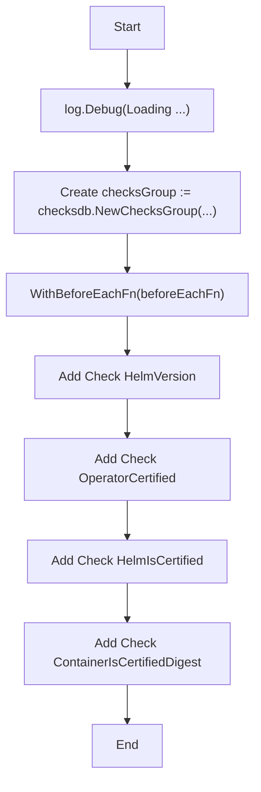

#### 4) Function dependencies (Mermaid)

```mermaid
graph TD
    LoadChecks --> Logger.Debug
    LoadChecks --> WithBeforeEachFn
    LoadChecks --> checksdb.NewChecksGroup
    LoadChecks --> checksdb.Add
    LoadChecks --> WithSkipCheckFn
    LoadChecks --> WithCheckFn
    LoadChecks --> identifiers.GetTestIDAndLabels
    LoadChecks --> testHelmVersion
    LoadChecks --> skipIfNoHelmChartReleasesFn
    LoadChecks --> testAllOperatorCertified
    LoadChecks --> skipIfNoOperatorsFn
    LoadChecks --> testHelmCertified
    LoadChecks --> testContainerCertificationStatusByDigest
    LoadChecks --> testhelper.GetNoContainersUnderTestSkipFn
```

#### 5) Functions calling `LoadChecks` (Mermaid)

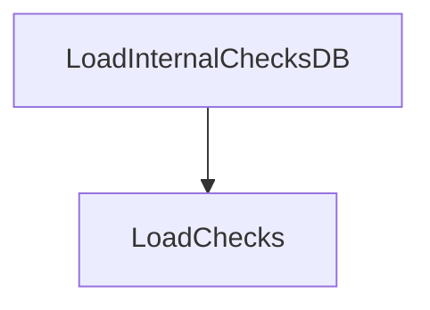

#### 6) Usage example (Go)

```go
// Minimal example invoking LoadChecks
func main() {
    // Load all certification checks into the database
    certsuite.LoadChecks()
}
```

---

## Local Functions

### getContainersToQuery

**getContainersToQuery** - Creates a lookup table indicating which container images should be queried. Each key is a `ContainerImageIdentifier` from the test environment, and every value is set to `true`.


#### Signature (Go)
```go
func getContainersToQuery(env *provider.TestEnvironment) map[provider.ContainerImageIdentifier]bool
```

#### Summary Table
| Aspect | Details |
|--------|---------|
| **Purpose** | Creates a lookup table indicating which container images should be queried. Each key is a `ContainerImageIdentifier` from the test environment, and every value is set to `true`. |
| **Parameters** | `env *provider.TestEnvironment` – The test environment containing a slice of containers (`env.Containers`). |
| **Return value** | `map[provider.ContainerImageIdentifier]bool` – A map where each container image identifier present in the environment maps to `true`. |
| **Key dependencies** | • Calls the built‑in `make` function to allocate the map.<br>• Accesses `env.Containers` and `cut.ContainerImageIdentifier`. |
| **Side effects** | No external I/O or state mutation; purely functional. |
| **How it fits the package** | Supplies a quick membership check for other parts of the certification suite that need to determine whether a container image should be processed. |

#### Internal workflow (Mermaid)
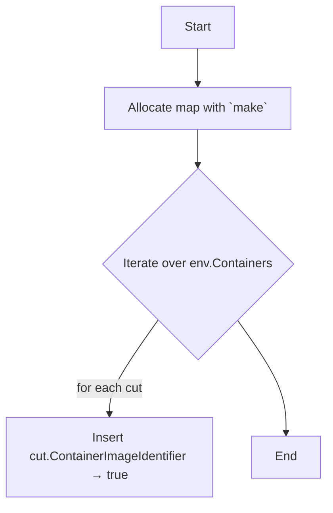

#### Function dependencies (Mermaid)
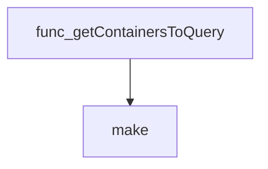

#### Functions calling `getContainersToQuery` (Mermaid)

None – this function is currently not referenced elsewhere in the package.

#### Usage example (Go)
```go
// Minimal example invoking getContainersToQuery
package main

import (
	"fmt"
	"github.com/redhat-best-practices-for-k8s/certsuite/tests/certification/provider"
)

// Assume env is a pre‑populated *provider.TestEnvironment.
func main() {
	env := &provider.TestEnvironment{
		Containers: []provider.Container{ /* … */ },
	}
	containersToQuery := getContainersToQuery(env)
	fmt.Println(containersToQuery) // map[<identifier> true] ...
}
```

---

### testAllOperatorCertified

**testAllOperatorCertified** - Iterates over all operators listed in the test environment and verifies each operator’s certification status for the current OpenShift minor version. Records compliant and non‑compliant operators for reporting.


#### Signature (Go)
```go
func (*checksdb.Check, *provider.TestEnvironment, certdb.CertificationStatusValidator)()
```

#### Summary Table
| Aspect | Details |
|--------|---------|
| **Purpose** | Iterates over all operators listed in the test environment and verifies each operator’s certification status for the current OpenShift minor version. Records compliant and non‑compliant operators for reporting. |
| **Parameters** | `check *checksdb.Check` – check context; `<-` `env *provider.TestEnvironment` – runtime cluster information; `<-` `validator certdb.CertificationStatusValidator` – certification lookup service |
| **Return value** | None (side‑effect: sets the check result) |
| **Key dependencies** | • `provider.IsOCPCluster()` <br>• `strings.SplitN` <br>• `check.LogInfo`, `check.LogError` <br>• `validator.IsOperatorCertified` <br>• `testhelper.NewOperatorReportObject`, `AddField` <br>• `check.SetResult` |
| **Side effects** | Logs progress and errors, creates report objects, updates the check’s result state. No external I/O beyond logging. |
| **How it fits the package** | This function is a core test routine for the *certification* suite; it is invoked by `LoadChecks` to evaluate operator certification compliance across all operators discovered in the environment. |

#### Internal workflow (Mermaid)
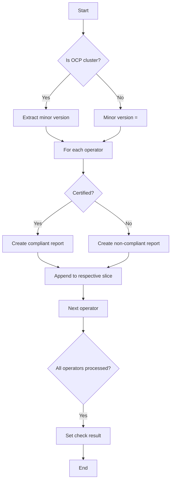

#### Function dependencies (Mermaid)
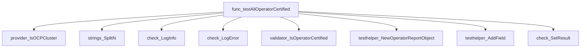

#### Functions calling `testAllOperatorCertified` (Mermaid)
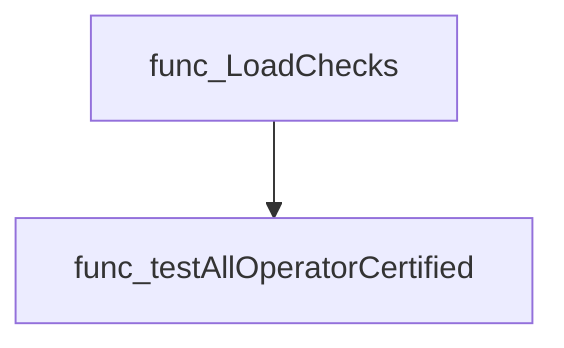

#### Usage example (Go)
```go
// Minimal example invoking testAllOperatorCertified
check := checksdb.NewCheck("operator-cert")
env := &provider.TestEnvironment{
    Operators: []provider.OperatorInfo{
        {Namespace: "openshift", Name: "my-operator", Channel: "stable"},
    },
    OpenshiftVersion: "4.12.0",
}
validator := certdb.NewMockValidator() // implements CertificationStatusValidator
testAllOperatorCertified(check, env, validator)
// check.Result now contains compliant and non‑compliant operator reports
```

---

### testContainerCertification

**testContainerCertification** - Determines if a container image is certified by delegating to the `CertificationStatusValidator`.


This helper checks whether a container image identified by its registry, repository, tag and digest is certified according to the supplied validator.

```go
func(testContainerCertification)(c provider.ContainerImageIdentifier, validator certdb.CertificationStatusValidator) bool {
    return validator.IsContainerCertified(c.Registry, c.Repository, c.Tag, c.Digest)
}
```

| Aspect | Details |
|--------|---------|
| **Purpose** | Determines if a container image is certified by delegating to the `CertificationStatusValidator`. |
| **Parameters** | `c provider.ContainerImageIdentifier` – image metadata; <br>`validator certdb.CertificationStatusValidator` – validator interface. |
| **Return value** | `bool` – `true` if the image is certified, otherwise `false`. |
| **Key dependencies** | • Calls `certdb.CertificationStatusValidator.IsContainerCertified`<br>• Relies on fields of `provider.ContainerImageIdentifier`. |
| **Side effects** | None; purely functional. |
| **How it fits the package** | Used by test helpers to validate container certification status during tests in the `certification` package. |

#### Internal workflow (Mermaid)

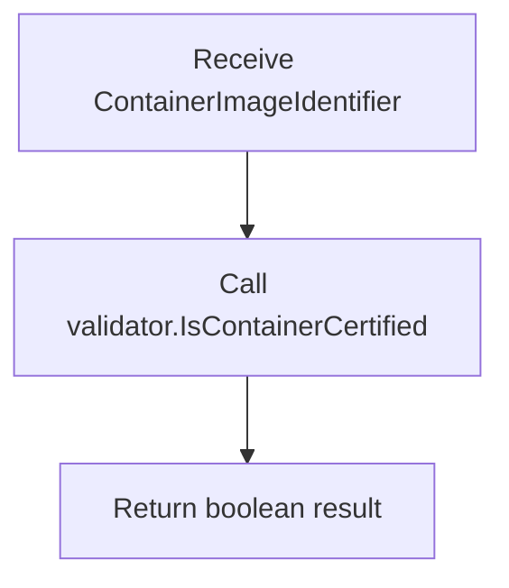

#### Function dependencies

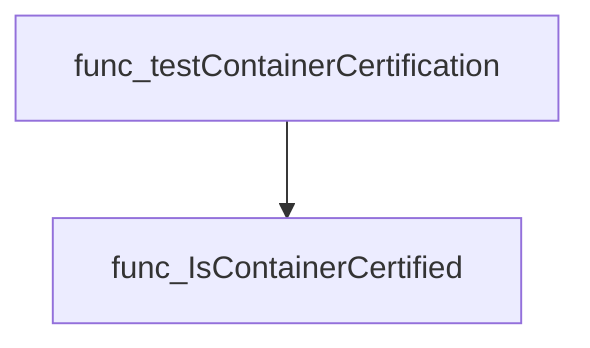

#### Functions calling `testContainerCertification`

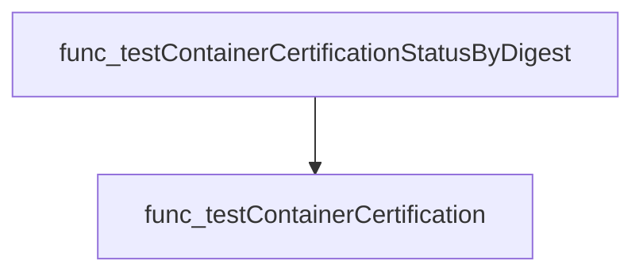

#### Usage example (Go)

```go
// Minimal example invoking testContainerCertification
func example() {
    img := provider.ContainerImageIdentifier{
        Registry:   "quay.io",
        Repository:"myrepo/image",
        Tag:        "v1.0",
        Digest:     "sha256:abcd1234...",
    }
    validator := certdb.NewMockValidator() // assume a mock implementation
    certified := testContainerCertification(img, validator)
    fmt.Println("Certified:", certified)
}
```

---

### testContainerCertificationStatusByDigest

**testContainerCertificationStatusByDigest** - Verifies that every container in the test environment has a valid image digest and that this digest is present in the certification database. Containers lacking digests or with unknown digests are marked non‑compliant; otherwise they are considered compliant.


#### Signature (Go)

```go
func testContainerCertificationStatusByDigest(
    check *checksdb.Check,
    env   *provider.TestEnvironment,
    validator certdb.CertificationStatusValidator,
)
```

#### Summary Table

| Aspect | Details |
|--------|---------|
| **Purpose** | Verifies that every container in the test environment has a valid image digest and that this digest is present in the certification database. Containers lacking digests or with unknown digests are marked non‑compliant; otherwise they are considered compliant. |
| **Parameters** | `check` – *checksdb.Check* (test context), `env` – *provider.TestEnvironment* (contains containers to test), `validator` – certdb.CertificationStatusValidator (provides certification lookup) |
| **Return value** | None (side‑effect: sets result on the check) |
| **Key dependencies** | • `check.LogInfo`, `check.LogError` <br>• `testhelper.NewContainerReportObject` <br>• `testContainerCertification` (internal helper) <br>• `check.SetResult` |
| **Side effects** | Logs information and errors; builds report objects; updates the check’s result. No external I/O beyond logging. |
| **How it fits the package** | This function is one of several certification checks in the *certification* test suite, specifically handling container digest validation before the suite reports overall compliance. |

#### Internal workflow (Mermaid)

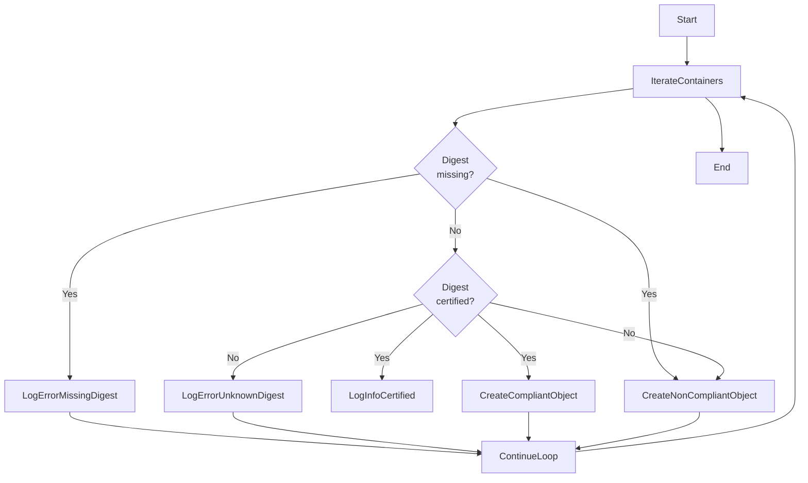

#### Function dependencies (Mermaid)

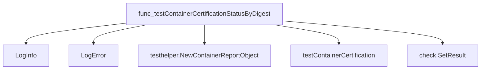

#### Functions calling `testContainerCertificationStatusByDigest` (Mermaid)

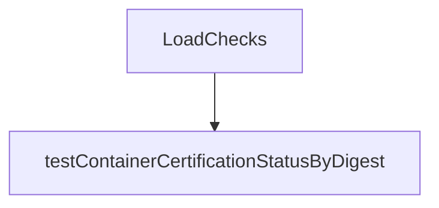

#### Usage example (Go)

```go
// Minimal example invoking testContainerCertificationStatusByDigest
func runExample() {
    // Setup a dummy check, environment and validator
    check := checksdb.NewCheck("example-check")
    env := &provider.TestEnvironment{
        Containers: []testhelper.Container{
            {
                Namespace: "default",
                Podname:   "app-pod",
                Name:      "app-container",
                ContainerImageIdentifier: provider.ContainerImageIdentifier{
                    Registry:   "quay.io",
                    Repository:"myrepo/app",
                    Tag:        "v1.0",
                    Digest:     "sha256:abcd1234...",
                },
            },
        },
    }
    validator := certdb.NewMockValidator() // assumes a mock implementation

    // Invoke the function
    testContainerCertificationStatusByDigest(check, env, validator)

    // Inspect results
    fmt.Printf("Compliant: %+v\n", check.Compliant)
    fmt.Printf("Non‑compliant: %+v\n", check.NonCompliant)
}
```

---

### testHelmCertified

**testHelmCertified** - Iterates over all Helm chart releases in the test environment and records whether each release is certified according to the provided validator.


#### Signature (Go)

```go
func testHelmCertified(check *checksdb.Check, env *provider.TestEnvironment, validator certdb.CertificationStatusValidator)()
```

#### Summary Table

| Aspect | Details |
|--------|---------|
| **Purpose** | Iterates over all Helm chart releases in the test environment and records whether each release is certified according to the provided validator. |
| **Parameters** | `check *checksdb.Check` – the current test check; `env *provider.TestEnvironment` – holds Helm releases and Kubernetes version; `validator certdb.CertificationStatusValidator` – exposes `IsHelmChartCertified`. |
| **Return value** | None (the function records results via `check.SetResult`). |
| **Key dependencies** | • `check.LogInfo`, `check.LogError`<br>• `validator.IsHelmChartCertified`<br>• `testhelper.NewHelmChartReportObject`<br>• `SetType`, `AddField` on the report object<br>• `check.SetResult` |
| **Side effects** | Logs information, creates report objects, and updates the check’s result set; no global state mutation. |
| **How it fits the package** | Implements the test logic for the “Helm is certified” check in the certification suite, called by `LoadChecks`. |

#### Internal workflow (Mermaid)

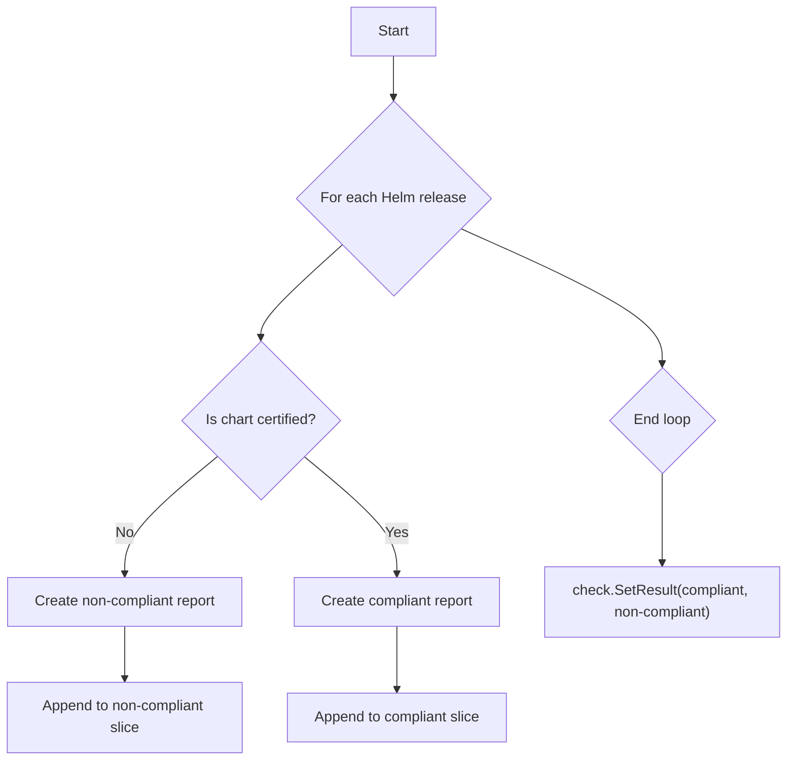

#### Function dependencies (Mermaid)

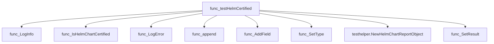

#### Functions calling `testHelmCertified` (Mermaid)

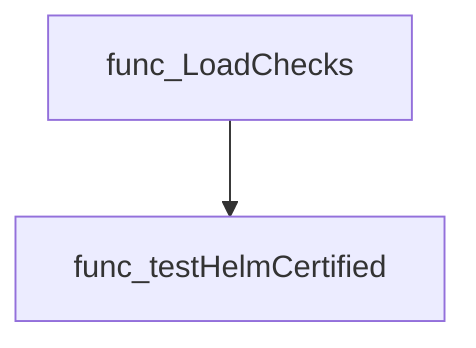

#### Usage example (Go)

```go
// Minimal example invoking testHelmCertified
check := checksdb.NewCheck(identifiers.GetTestIDAndLabels(identifiers.TestHelmIsCertifiedIdentifier))
env := &provider.TestEnvironment{ /* populated with Helm releases and K8s version */ }
validator := certdb.NewDefaultCertificationStatusValidator()

testHelmCertified(check, env, validator)
```

---

### testHelmVersion

**testHelmVersion** - Determines if the cluster uses Helm v3 by searching for Tiller pods. If none are found, all installed Helm charts are marked compliant; otherwise each Tiller pod is flagged non‑compliant.


#### 1) Signature (Go)

```go
func testHelmVersion(check *checksdb.Check)
```

#### 2) Summary Table

| Aspect | Details |
|--------|---------|
| **Purpose** | Determines if the cluster uses Helm v3 by searching for Tiller pods. If none are found, all installed Helm charts are marked compliant; otherwise each Tiller pod is flagged non‑compliant. |
| **Parameters** | `check *checksdb.Check` – test context that provides logging and result storage. |
| **Return value** | None (void). Results are set via `check.SetResult`. |
| **Key dependencies** | • `clientsholder.GetClientsHolder()` to obtain a Kubernetes client.<br>• `CoreV1().Pods("").List(...)` for listing pods.<br>• `testhelper.NewHelmChartReportObject`, `NewPodReportObject` to create report entries.<br>• `check.LogError`, `LogInfo`, `SetResult`. |
| **Side effects** | • Logs errors or informational messages.<br>• Populates the check’s result with compliant and non‑compliant objects. |
| **How it fits the package** | Part of the certification test suite; invoked during load of checks to validate Helm version compliance across all Helm chart releases in the environment. |

#### 3) Internal workflow (Mermaid)

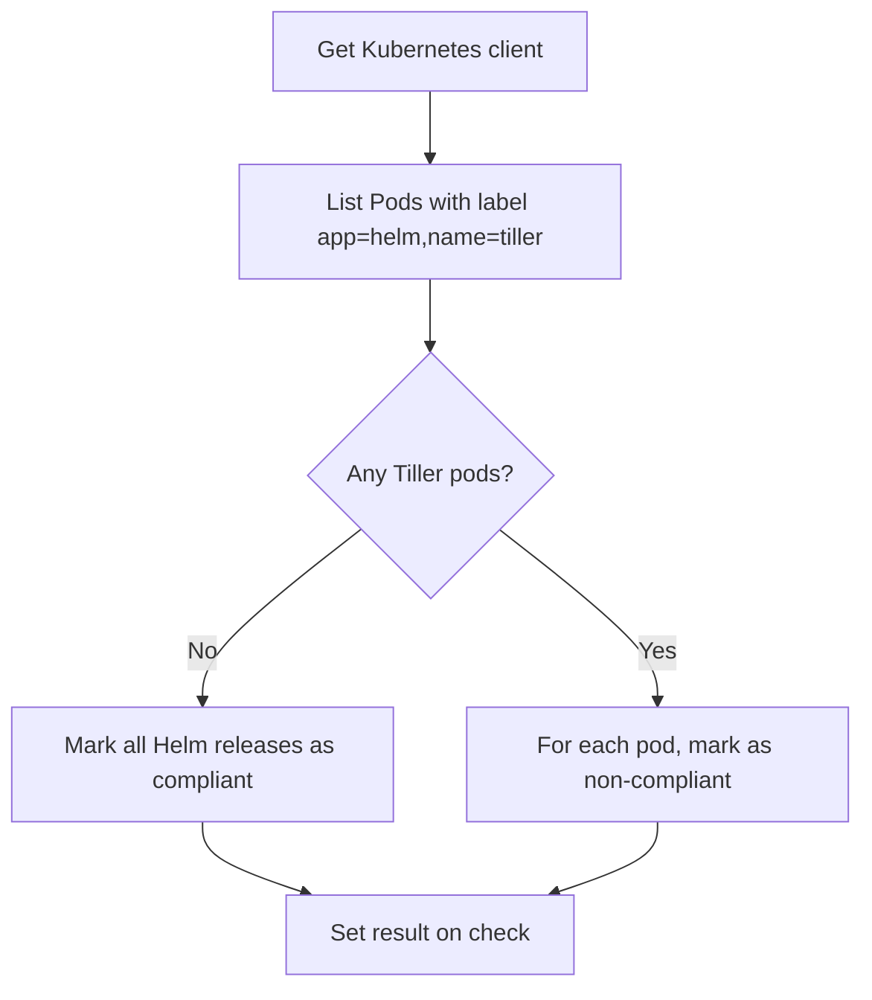

#### 4) Function dependencies (Mermaid)

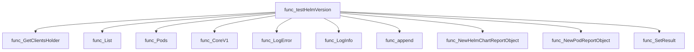

#### 5) Functions calling `testHelmVersion` (Mermaid)

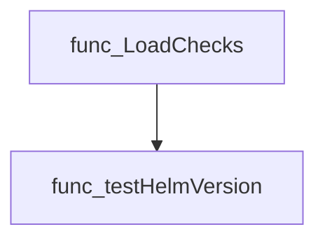

#### 6) Usage example (Go)

```go
// Minimal example invoking testHelmVersion
check := checksdb.NewCheck(identifiers.GetTestIDAndLabels(identifiers.TestHelmVersionIdentifier))
testHelmVersion(check)
```

---

